# Advanced Certified Scrum Developer® (A-CSD®) 学習ガイド

> 本ガイドは、Scrum Alliance® が公開する **Advanced Certified Scrum Developer℠ (A-CSD℠) Learning Objectives(2021年8月版)** を一次情報源として、各学習目標(Learning Objective, 以下LO)をステップバイステップで解説する初学者向け教材です。ASCIIアートは使用せず、フローチャートは Mermaid、比較・一覧は Markdown 表で表現しています。各章末に根拠となる一次情報源のURLを明記しています。

---

## 本ガイドの使い方

- 対象読者: すでに **CSD®(Certified Scrum Developer)** を保持している、またはこれから A-CSD® を目指す開発者・エンジニア。
- 構成: 公式LOの7カテゴリ(Lean/Agile/Scrum、Collaboration & Team Dynamics、Architecture & Design、Refactoring、TDD、Integrating Continuously、Learning by Delivering Continuously)に沿って、各サブ項目を「説明 → ベストプラクティス → 図解 → 出典」の順で解説します。
- 各LOの文頭には、Bloom's Taxonomy(ブルームの分類学)による認知レベルの目安を付けています(第2章で詳説)。
- 本ガイドは公式教育プロバイダーのコースを代替するものではありません。A-CSD®は認定トレーナーによる対面/オンラインコースの受講が必須です。

---

## 目次

1. A-CSD® とは何か — Developer Track における位置づけ
2. 受験資格・コース要件(Requirements)
3. Bloom's Taxonomy の復習 — LO の読み方
4. カテゴリ1: Lean, Agile & Scrum (LO 1.1–1.7)
5. カテゴリ2: Collaboration & Team Dynamics (LO 2.1–2.6)
6. カテゴリ3: Architecture & Design (LO 3.1–3.4)
7. カテゴリ4: Refactoring (LO 4.1–4.4)
8. カテゴリ5: Test-Driven Development (LO 5.1–5.9)
9. カテゴリ6: Integrating Continuously (LO 6.1–6.3)
10. カテゴリ7: Learning by Delivering Continuously (LO 7.1–7.4)
11. XP実践とA-CSD LOの統合マップ
12. ベストプラクティス総合チェックリスト
13. 認定取得後のキャリアパス
14. まとめ
15. 参考文献(出典一覧)

---

## 第1章: A-CSD® とは何か — Developer Track における位置づけ

### 1.1 A-CSD® の位置づけ

Advanced Certified Scrum Developer® (A-CSD®) は、Scrum Alliance® が提供する **Scrum Developer 認定トラック**の第2段階に位置する資格です。トラックは以下の3段階で構成されます。

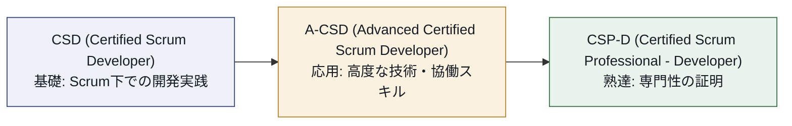

A-CSD®は、CSD®で学んだ基礎(Scrumの枠組みの中でどう開発するか)を土台に、**テスト駆動開発(TDD)・継続的デリバリー・高度なリファクタリング・チームコラボレーション**に踏み込みます。Scrum Alliance公式ページでは、A-CSD®の学習領域として以下が挙げられています。

- テスト駆動開発(TDD)と継続的デリバリーの実践を学び、プロダクト品質とチーム効率を高める
- 高度なリファクタリング手法を通じてコードの保守性と適応性を改善する
- チームの結束と効果的なコミュニケーションを促す協働戦略を学ぶ
- 生産的でポジティブな職場環境を促進するためのチームダイナミクスを理解する
- Scrumのロール・成果物・イベントについての基礎知識を拡張し、アジャイルの価値観・原則と開発作業を整合させる
- 継続的改善のマインドセットを身につけ、アジャイル主導のプロジェクト環境に適応する

> [出典] Scrum Alliance, "Advanced Certified Scrum Developer (A-CSD)" 公式ページ https://www.scrumalliance.org/get-certified/developer-track/advanced-certified-scrum-developer

### 1.2 A-CSD と CSD の違い(公式FAQより)

Scrum Alliance公式サイトのFAQでは、両者の違いを次のように説明しています。A-CSD®はCSD®で身につけたスキルを深化させ、より高度なアジャイル開発技法・強化されたチーム協働・広範なScrum理解に焦点を当てます。CSD®を取得済みの開発者が、次のステップとして選ぶ資格と位置づけられています。

| 項目 | CSD® | A-CSD® |
|---|---|---|
| トラック上の位置 | 第1段階(基礎) | 第2段階(応用) |
| 前提資格 | Scrum Alliance承認コースの受講のみ | **CSD®の保有が必須**(有効/失効いずれでも可) |
| 学習の焦点 | Scrumでの開発の基礎、XPプラクティス入門 | TDD・CI/CD・リファクタリング・チームダイナミクスの深化 |
| 実務経験要件 | 明示的な年数要件なし | 過去5年以内に**12か月以上**のScrum開発者/チームメンバーとしての実務経験 |
| 次のステップ | A-CSD® | CSP-D®(Certified Scrum Professional - Developer) |

> [出典] Scrum Alliance, A-CSD公式ページ FAQセクション「How is A-CSD different from CSD?」 https://www.scrumalliance.org/get-certified/developer-track/advanced-certified-scrum-developer

### 1.3 認定の価値(ベストプラクティスの観点)

- **キャリアへの活用**: Scrum Allianceの調査記事「Skills in the New World of Work」によれば、回答者の55%が関連認定を持つ候補者により高い給与を支払う意向を示しています。履歴書や面談で、A-CSD®を「技術力とチーム協働力の両方を認定された証」として位置づけると効果的です。
- **CSP-D®への足がかり**: A-CSD®取得はCertified Scrum Professional® Developerに至る一里塚として公式に位置づけられています。長期的なキャリアパスを見据えるなら、CSD® → A-CSD® → CSP-D®の順に計画するのがベストプラクティスです。
- **バッジの継続的な価値**: Scrum Allianceは「一度取得したら終わり」ではなく、Scrum Education Units (SEU) による2年ごとの更新を求めます。これは継続学習への姿勢そのものを証明する仕組みであるため、更新のための学習(書籍、ウェビナー、イベント参加など)をキャリア開発計画に組み込むことがベストプラクティスとされています。

> [出典] Scrum Alliance, A-CSD公式ページ「Benefits」および「Certifications with substance」セクション https://www.scrumalliance.org/get-certified/developer-track/advanced-certified-scrum-developer

---

## 第2章: 受験資格・コース要件(Requirements)

A-CSD®を取得するには、公式ページに明記された以下4つの要件をすべて満たす必要があります。

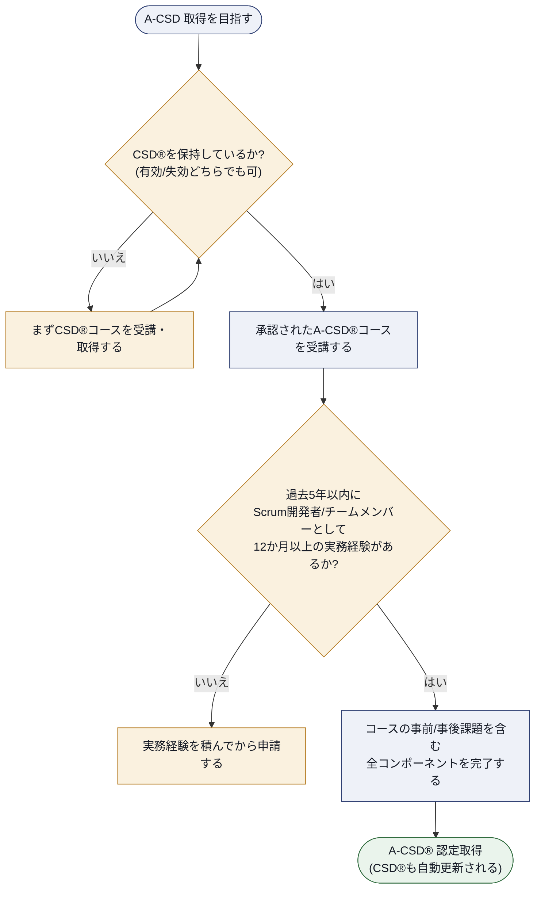

### 2.1 要件の詳細

1. **CSD®の保有**: 有効なCSD®でも、失効したCSD®でも要件を満たします。A-CSD®取得と同時にCSD®は自動的に更新されます。
2. **承認済みA-CSD®コースの受講**: Individual Educator(認定教育者)ごとに独自のカリキュラム構成を持ちますが、公式LOに定義された学習目標はすべてのコースで共通してカバーされる必要があります。コース検索で「More Details」を確認し、講師ごとの特色を比較することが推奨されています。
3. **実務経験**: 過去5年以内に、Scrum開発者またはScrumチームメンバーとして12か月以上の関連経験があること。
4. **コースの完了**: 事前課題(pre-course work)・事後課題(post-course work)を含む、コースの全構成要素を完了すること。

### 2.2 認定の維持(ベストプラクティス)

- **SEU(Scrum Education Units)の記録を習慣化する**: 書籍を読む、ウェビナーを視聴する、カンファレンスに参加するなど、学習機会ごとにSEUを記録しておくと、2年ごとの更新時に慌てずに済みます。
- **更新は2年サイクル**: A-CSD®は2年ごとに更新が必要です。カレンダーにリマインダーを設定しておくことがベストプラクティスです。

> [出典]
> - Scrum Alliance, A-CSD公式ページ「A-CSD requirements」セクション https://www.scrumalliance.org/get-certified/developer-track/advanced-certified-scrum-developer
> - Scrum Alliance, "Scrum Education Units" https://www.scrumalliance.org/get-certified/scrum-education-units
> - Scrum Alliance, "Renewing Certifications" https://www.scrumalliance.org/get-certified/renewing-certifications

---

## 第3章: Bloom's Taxonomy の復習 — LO の読み方

公式LO文書は、各学習目標が「A-CSD® の学習目標を無事修了した学習者は、〜できるようになる」という前提で書かれていると明記しています。この「できるようになる」の深さを表現するために、**Bloom's Taxonomy(ブルームの分類学)** の6段階が用いられます。

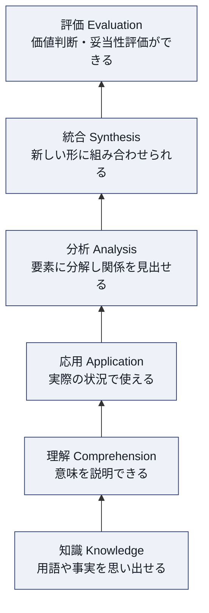

LOの動詞に注目すると、どのレベルが求められているかが分かります。たとえば "describe"(記述する)は理解レベル、"practice"(実践する)や "apply"(適用する)は応用レベル、"compare and contrast"(比較対照する)は分析レベル、"evaluate"(評価する)は評価レベルに相当します。CSD®のLOが主に「知識」「理解」「応用」に集中していたのに対し、A-CSD®のLOには「分析」「統合」「評価」レベルの動詞(evaluate, compare and contrast, demonstrateなど)が多く含まれる点が、A-CSD®がCSD®より高度であることの裏付けです。

> [出典] Scrum Alliance, "Advanced Certified Scrum Developer (A-CSD) Learning Objectives" (2021年8月版) p.2「A note about Bloom's Taxonomy」 https://www.scrumalliance.org/ScrumRedesignDEVSite/media/ScrumAllianceMedia/Files%20and%20PDFs/Learning%20Objectives/E_A_CSD_LO_2021.pdf

### 3.1 A-CSD LO 全体構成

公式LO文書は、7つのカテゴリで構成されています。

| # | カテゴリ(英語) | カテゴリ(日本語) | サブ項目数 |
|---|---|---|---|
| 1 | Lean, Agile & Scrum | リーン・アジャイル・Scrum | 7 (1.1–1.7) |
| 2 | Collaboration & Team Dynamics | 協働とチームダイナミクス | 6 (2.1–2.6) |
| 3 | Architecture & Design | アーキテクチャと設計 | 4 (3.1–3.4) |
| 4 | Refactoring | リファクタリング | 4 (4.1–4.4) |
| 5 | Test Driven Development | テスト駆動開発 | 9 (5.1–5.9) |
| 6 | Integrating Continuously | 継続的インテグレーション | 3 (6.1–6.3) |
| 7 | Learning by Delivering Continuously | 継続的デリバリーによる学習 | 4 (7.1–7.4) |

これらのLOは、以下の情報源を基礎として定義されています(公式文書「Purpose」セクションより)。

- Scrum Guide (scrumguides.org)
- Manifesto for Agile Software Development ― 4つの価値と12の原則 (agilemanifesto.org)
- Scrum Values (scrumalliance.org/about-scrum/values)
- Scrum Alliance Scrum Foundations Learning Objectives
- Scrum Alliance Guide Level Feedback

> [出典] Scrum Alliance, "Advanced Certified Scrum Developer (A-CSD) Learning Objectives" (2021年8月版) p.1「Purpose」 https://www.scrumalliance.org/ScrumRedesignDEVSite/media/ScrumAllianceMedia/Files%20and%20PDFs/Learning%20Objectives/E_A_CSD_LO_2021.pdf

---

## 第4章: カテゴリ1 — Lean, Agile & Scrum (LO 1.1–1.7)

このカテゴリは、開発者がScrumの枠組みを超えて「リーン思考」で自分たちの仕事の流れそのものを観察・改善できるようになることを目的としています。

### LO 1.1 — ワークフローを可視化するモデリング技法を適用する [応用]

**説明**: 「見えないものは改善できない」がリーンの大原則です。開発チームがコード変更・レビュー・テスト・デプロイに至るまでの作業がどのように流れているかを可視化する技法として、代表的なのが**Value Stream Mapping(バリューストリームマッピング)**と**Cumulative Flow Diagram(累積フロー図)**です。

バリューストリームマップでは、各工程を「付加価値時間(Value-Add Time)」と「待機時間(Wait Time)」に分けて可視化し、フローエフィシェンシー(付加価値時間 ÷ 総リードタイム)を算出します。多くのソフトウェア開発現場では、このフローエフィシェンシーが数パーセント〜十数パーセントしかないことが可視化によって明らかになり、改善の出発点になります。

**ベストプラクティス**
- チーム全員でホワイトボードや付箋を使い、実際のカンバンボードの動きを1〜2週間観察してからマップを描く(推測ではなく実測データを使う)。
- 「作業中」のステータスを1つにまとめず、"開発中" "レビュー待ち" "レビュー中" "テスト待ち" のように細分化し、どこで滞留しているかを特定する。
- 可視化は一度で終わらせず、レトロスペクティブのたびに更新する定期的な習慣にする。

> [出典] Scrum Alliance, A-CSD LO 1.1 (2021)。手法の一般的な参照として Kanban Guide for Scrum Teams https://www.scrumalliance.org/ScrumRedesignDEVSite/media/ScrumAllianceMedia/Files%20and%20PDFs/Learning%20Objectives/E_A_CSD_LO_2021.pdf

### LO 1.2 — 作業システムの改善点を特定するのに役立つ概念を3つ以上説明する [理解]

**説明**: リーン思考には、作業システムのボトルネックや無駄を発見するための概念群があります。代表的なものを3つ紹介します。

| 概念 | 説明 |
|---|---|
| **WIP制限 (Work In Progress limit)** | 同時に着手できる作業数を制限することで、マルチタスクによるコンテキストスイッチのコストを減らし、フローを速める |
| **Little's Law(リトルの法則)** | 平均サイクルタイム = 平均WIP ÷ 平均スループット。WIPを減らせばサイクルタイムが短縮されることを数学的に示す |
| **7つの無駄(ムダ)** | 製造業由来のリーンの無駄の考え方をソフトウェア開発に翻訳したもの(次のLO 1.3で詳述) |

**ベストプラクティス**
- WIP制限はまず「今の実測値-1」程度から始め、チームが窮屈さを感じながら学習する余地を残す。
- Little's Lawは理論の暗記よりも、実際のチームのサイクルタイムとスループットを継続的に測定し、数値の変化を追うことに価値がある。

> [出典] A-CSD LO 1.2。概念の一般的背景としてリーン生産方式およびカンバン方法論の文献

### LO 1.3 — プロダクト開発環境における3種類以上の無駄と、それをScrumチームのDefinition of Doneでどう対処できるかを議論する [理解]

**説明**: ソフトウェア開発におけるリーンの「無駄」の代表例を挙げます。

| 無駄の種類 | ソフトウェア開発での具体例 | DoDでの対処例 |
|---|---|---|
| 未完成の作業(Partially Done Work) | マージされていないブランチ、書きかけのコード | 「mainにマージ済み」をDoDの条件に含める |
| 余分な機能(Extra Features) | 使われる見込みのない機能の作り込み | YAGNI原則をDoDのレビュー基準に組み込む |
| 再学習(Relearning) | ドキュメント不足による同じ調査の繰り返し | 「READMEを更新済み」をDoDに含める |
| 引き継ぎ(Handoffs) | 開発者からQAへの引き継ぎ待ち | 「受入テストまで完了している」をDoDに含め、QA待ちの状態を「完了」と数えない |
| 遅延(Delays) | コードレビュー待ち、CI待ち | 「コードレビュー承認済み」「CIがグリーン」をDoDの必須条件にする |
| 欠陥(Defects) | バグの後戻り作業 | 「自動テストがグリーン」をDoDの必須条件にする |
| タスクの切り替え(Task Switching) | 複数プロジェクトの掛け持ち | DoDを満たした項目だけを「完了」と数え、仕掛かりのまま次へ移らない |

DoDは**Incrementが満たすべき品質条件**を定義するものであり、「どう進めるか」の取り決めは含みません。
上記の無駄に対しては、DoDとは別に**作業ルール(ワーキングアグリーメント)**として次を定めます。

| 作業ルール | 対処する無駄 | 内容 |
|---|---|---|
| ペアプログラミング/モブプログラミング | 引き継ぎ | レビューとテストを作業と同時に行い、引き継ぎ自体を発生させない |
| レビューSLA(例: 24時間以内) | 遅延 | レビュー待ち時間の上限をチーム規約として合意する |
| WIP制限 | タスクの切り替え | 同時に着手できる項目数に上限を設け、切り替えを構造的に抑える |

**ベストプラクティス**
- 無駄を見つけたら、まず「なぜこの無駄が発生するのか」を5 Whysなどで深掘りしてから、DoDに項目を追加する。DoDに項目を足すだけでは根本原因は解決しないことが多い。
- DoDは一度に完璧にしようとせず、無駄を1つ特定するたびに1項目ずつ育てていく。

> [出典] A-CSD LO 1.3。無駄の分類は Mary & Tom Poppendieck による "Implementing Lean Software Development" の7つの無駄が一般的な参照元

### LO 1.4 — Definition of Done (DoD) を策定し反復的に進化させることを実践し、DoDが進化すべき理由を3つ以上特定する [応用]

**説明**: Scrum GuideはDefinition of Doneを「Increment（インクリメント）の品質基準に対する正式な記述」と定義し、成果物がScrumチームの基準を満たしているかを検査するために用いると説明しています。DoDはチームの成熟度や製品の状況に応じて進化すべきものであり、一度作って終わりではありません。

**DoDが進化すべき理由(3つの代表例)**
1. **技術的能力の向上**: 自動テストのカバレッジが上がり、以前は手動で確認していた項目が自動化できるようになった。
2. **プロダクトの成熟**: 新規プロダクトの初期段階では緩やかだった基準を、本番運用が始まってからセキュリティスキャンやパフォーマンステストを追加して厳格化する。
3. **過去の問題からの学習**: 本番障害やレトロスペクティブで見つかった問題を教訓に、再発防止のための項目を追加する。

**ベストプラクティス**
- DoDの変更は必ずScrum Team全体(開発者・Product Owner・Scrum Master)で合意する。一方的な追加は形骸化を招く。
- 新しいDoD項目を追加したら、なぜ追加したのかという背景をチームのワークスペースに記録し、新しいメンバーが経緯を理解できるようにする。
- DoDはIncrementに共通して適用される**単一の定義**として保つ(Scrum Guide 2020)。粒度別に複数のDoDを並べると、どのIncrementが「完成」なのかの判断が分裂する。
- 毎スプリントでは不要だがリリース時にのみ必要な確認(ブラウザ互換性テストの全マトリクス実行など)は、DoDに混ぜず**リリースチェックリスト**として別に管理する。DoDはあくまで「Incrementが利用可能であるための最低条件」に絞る。

> [出典]
> - Ken Schwaber & Jeff Sutherland, "The Scrum Guide" (2020) https://scrumguides.org/scrum-guide.html
> - A-CSD LO 1.4

### LO 1.5 — 複数チームで1つのプロダクトを扱う際に生じる課題に対処するための手法を3つ以上議論する [理解]

**説明**: 単一チームのScrumがうまく機能しても、プロダクトが成長し複数チームが同じプロダクトバックログを扱うようになると、依存関係や重複作業といった新しい課題が生まれます。代表的な対処法を紹介します。

| 手法 | 概要 |
|---|---|
| **Scrum of Scrums** | 各チームの代表者が定期的に集まり、チーム間の依存関係や障害を調整する会議体 |
| **共通のDefinition of Done** | 複数チームが同じ品質基準を共有し、統合時の手戻りを防ぐ |
| **統合の頻度を上げる（トランクベース開発など）** | 各チームの変更を頻繁に主幹ブランチへ統合し、コンフリクトを小さく保つ |
| **コードの共同所有(Collective Code Ownership)の拡張** | チーム間でもコードの所有権を過度に分断しない文化を作る |
| **依存関係ボード(Dependency Board)** | チーム間の依存関係を可視化し、計画時に早期発見する |

**ベストプラクティス**
- 複数チーム間の調整コストそのものも「無駄」になり得るため、まず「本当に複数チームに分割する必要があるか」をチーム構成の見直しで検討する。
- 技術的な依存を減らすアーキテクチャ(疎結合なマイクロサービス、明確なAPI契約など)への投資は、プロセス上の調整コストを恒久的に下げる効果がある。

> [出典] A-CSD LO 1.5。Scrum of Scrumsの一般的な参照として Scrum Alliance / Scrum.org のスケーリング関連リソース

### LO 1.6 — レトロスペクティブの結果として自分やチームが取り入れた改善を1つ以上評価する [評価]

**説明**: このLOはBloomの「評価」レベルに位置し、単に改善を実施したことを述べるだけでなく、その改善が実際にどのような効果をもたらしたかを**評価**することが求められます。

**評価の観点例**
- 改善前後で、サイクルタイムや欠陥数などの指標がどう変化したか
- チームの心理的な負荷や満足度がどう変わったか(定性的な観察も含む)
- 意図しない副作用が生じなかったか

**ベストプラクティス**
- レトロスペクティブで決めたアクションアイテムは、次のレトロスペクティブで必ず「あの改善はどうだったか」を振り返る時間を設ける(やりっぱなしにしない)。
- 改善の評価には、実験の前後で同じ指標を測定する「ビフォーアフター比較」の考え方を使う。

> [出典] A-CSD LO 1.6。継続的改善の枠組みとしてScrum GuideのRetrospectiveイベントの目的規定 https://scrumguides.org/scrum-guide.html

### LO 1.7 — 開発作業に関するビジネス視点を1つ以上議論する [理解]

**説明**: 開発者が技術的な正しさだけでなく、ビジネス価値・投資対効果・市場投入までの時間といった経営視点を理解することを求めるLOです。たとえば、「技術的負債を今解消するコスト」と「新機能を今リリースして得られる収益」のトレードオフを、開発者自身がビジネス言語で説明できることが期待されます。

**ベストプラクティス**
- Product Ownerとの対話で、技術的な提案(リファクタリング、ライブラリの更新など)を行う際は「なぜ今それをやるべきか」をビジネスインパクト(顧客への影響、将来の開発速度への影響)で説明する習慣をつける。
- 技術的負債の説明にはMartin Fowlerの「Technical Debt Quadrant」のような比喩を使うと、非技術者にも伝わりやすい(第7章で詳述)。

> [出典] A-CSD LO 1.7

---

## 第5章: カテゴリ2 — Collaboration & Team Dynamics (LO 2.1–2.6)

このカテゴリは、開発者が「一人で書く技術」から「チームで作り上げる技術」へと視野を広げることを目的としています。

### LO 2.1 — 協働の異なるアプローチを3つ以上比較対照する [分析]

**説明**: ソフトウェアを共同で作る方法には強度の異なる複数のアプローチがあります。

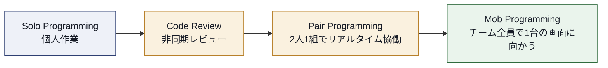

| アプローチ | 知識共有の速さ | リアルタイム性 | 向いている場面 |
|---|---|---|---|
| ソロプログラミング + 非同期コードレビュー | 遅い(レビュー時のみ) | なし | 定型的な作業、個人の集中が必要なタスク |
| ペアプログラミング | 速い(常時) | 高い | 複雑なロジック、知識の属人化を防ぎたい箇所 |
| モブプログラミング | 最速(チーム全体) | 最高 | 難解な問題、チーム全体でのオンボーディング、アーキテクチャ上の重要な意思決定 |
| 非同期レビュー中心(GitHubのPull Requestなど) | 遅い | なし | 分散チーム、タイムゾーンが異なるメンバー間 |

**ベストプラクティス**
- 1つの方法に固定せず、タスクの性質に応じて使い分ける(単純なCRUD実装はソロ+レビュー、複雑な並行処理はペアやモブ、というように)。
- ペア/モブプログラミングは「常に全員で全部やる」ものではなく、必要な場面を見極めて意図的に使う。

> [出典] A-CSD LO 2.1。Extreme Programmingにおけるペアプログラミングの原典として Kent Beck, "Extreme Programming Explained"、実践解説として Wikipedia "Extreme programming practices" https://en.wikipedia.org/wiki/Extreme_programming_practices

### LO 2.2 — 傾聴と相互理解を改善する技法を1つ以上適用する [応用]

**説明**: チーム開発における対立の多くは、技術的な正しさの違いではなく「聞けていない」ことに起因します。代表的な傾聴技法を紹介します。

| 技法 | 概要 |
|---|---|
| **アクティブリスニング** | 相手の発言を要約して返す("つまり〜ということですね?")ことで理解を確認する |
| **5 Whys** | 表面的な意見の奥にある根本的な関心事を掘り下げる質問法 |
| **ラウンドロビン** | 発言の順番を回すことで、声の大きい人だけが話す状況を防ぐ |
| **サイレントブレインストーミング** | まず各自が付箋に書き出してから共有することで、早期の同調圧力を避ける |

**ベストプラクティス**
- 技術的な議論が平行線になったときほど、まず相手の主張を自分の言葉で要約してから反論する(「あなたの懸念は〜ということだと理解しました。その上で私は〜と考えます」)。

> [出典] A-CSD LO 2.2

### LO 2.3 — フィードバックを与え、受け取ることを実践する [応用]

**説明**: 効果的なフィードバックには構造があります。代表的なフレームワークがSBIモデル(Situation-Behavior-Impact)です。

例: 「昨日のコードレビュー(Situation)で、あなたがPRの意図を1行で説明するコメントを添えてくれた(Behavior)ことで、レビューが5分早く終わった(Impact)。」

**フィードバックを受け取る側のベストプラクティス**
- 防御的にならず、まず「教えてくれてありがとう」と受け止める。
- その場で反論せず、一度持ち帰って検討する余地を自分に与える。

**フィードバックを与える側のベストプラクティス**
- 人格ではなく行動に焦点を当てる("あなたは雑だ"ではなく"このコミットメッセージからは変更意図が読み取れなかった")。
- ポジティブなフィードバックも同じくらい意識的に伝える(ネガティブなものだけがフィードバックではない)。

> [出典] A-CSD LO 2.3

### LO 2.4 — 協働的な開発プラクティスを1つ以上適用する [応用]

**説明**: 「協働的な開発プラクティス」とは、コードを書く行為そのものを個人作業から共同作業に変えるプラクティス群を指します。ペアプログラミング、モブプログラミング、コードレビュー、コラボレーティブリファインメント(バックログの共同精緻化)などが該当します。

**ベストプラクティス**
- ペアプログラミングでは「ドライバー(キーボードを操作する人)」と「ナビゲーター(全体を見て指示・レビューする人)」の役割を明確にし、定期的に(例: 25分ごとに)交代する。
- モブプログラミングでは「強いスタイル(Strong-Style Pairing)」――ナビゲーターがアイデアを口頭で伝え、ドライバーはそれをタイプするだけに徹する――という運営ルールを使うと、声の大きい人だけがキーボードを独占する事態を防げる。

> [出典] A-CSD LO 2.4。Strong-Style Pairingの概念はLlewellyn Falco氏の提唱として広く参照される

### LO 2.5 — 使用率(Utilization)・効率性(Efficiency)・有効性(Effectiveness)の違いを説明する [理解]

**説明**: この3つの概念はしばしば混同されますが、明確に区別する必要があります。

| 概念 | 定義 | 落とし穴 |
|---|---|---|
| **使用率 (Utilization)** | メンバーやリソースがどれだけ「稼働」しているかの割合 | 使用率100%を目指すとキューが詰まり、待ち行列理論的にリードタイムが急増する |
| **効率性 (Efficiency)** | 投入したリソースに対してどれだけ多くのアウトプットを生み出したか | 効率的だが顧客にとって価値のないものを大量生産するリスクがある |
| **有効性 (Effectiveness)** | そもそも正しいことをやれているか(目的達成度) | 測定が難しく、しばしば軽視される |

**ベストプラクティス**
- チームの稼働率を100%に近づけようとするマネジメントは、待ち行列理論(M/M/1キューモデルなど)の観点から見ると、リードタイムを悪化させる典型的なアンチパターンである。あえて余白(スラック)を残す。
- 「忙しく見えること」と「価値を生んでいること」は別物であると、開発者自身がチームやステークホルダーに説明できるようにする。

> [出典] A-CSD LO 2.5。使用率と待ち行列理論の関係については Donald G. Reinertsen, "The Principles of Product Development Flow" が広く参照される一次資料

### LO 2.6 — プロダクトバックログアイテムをスプリントに収まるようサイズ調整する方法を1つ以上実践する [応用]

**説明**: 大きすぎるプロダクトバックログアイテム(PBI)はスプリント内で完了できず、未完了作業(前述の「無駄」の一種)を生みます。代表的な分割・見積り技法を紹介します。

| 技法 | 概要 |
|---|---|
| **相対見積り(Planning Poker、T-シャツサイズ)** | 絶対時間ではなく相対的な複雑さでサイズを見積もる |
| **INVESTの原則によるストーリー分割** | Independent, Negotiable, Valuable, Estimable, Small, Testableの観点でPBIを評価し、Smallでなければ分割する |
| **ワークフローによる分割(Workflow Steps)** | 「作成」「更新」「削除」のように操作単位で分割する |
| **バリエーションによる分割(Business Rule Variations)** | 「通常ケース」「例外ケース」のように条件分岐で分割する |

**ベストプラクティス**
- PBIがスプリントの50%以上のキャパシティを占めるようであれば、着手前に分割を検討する。
- 分割の際は、分割後の各PBIが単独でリリース可能・テスト可能な「垂直スライス」になるようにする(技術レイヤーごとの水平分割は避ける)。

> [出典] A-CSD LO 2.6。INVESTの原則は Bill Wake が提唱し、Mike Cohnの著作を通じて広く普及した基準

---

## 第6章: カテゴリ3 — Architecture & Design (LO 3.1–3.4)

このカテゴリは、アジャイルな文脈における設計・アーキテクチャの考え方を扱います。「事前に全てを設計してから作る」ウォーターフォール的な発想と、Scrumの反復的・漸進的な開発は本質的に緊張関係にあります。この緊張をどう扱うかがテーマです。

### LO 3.1 — 事前設計(Up-Front Architecture)と創発的設計(Emergent Architecture)の違いを3つ以上説明する [理解]

| 観点 | 事前設計 | 創発的設計 |
|---|---|---|
| 意思決定のタイミング | プロジェクト初期にまとめて決定 | 必要になった時点で、最新の情報を基に決定(Last Responsible Moment) |
| 変更への態度 | 変更は「設計の失敗」とみなされがち | 変更は前提であり、リファクタリングで吸収する |
| 前提知識 | ドメインと要件を十分理解している必要がある | 実装しながら理解を深めていける |
| リスク | 誤った前提に基づく設計への投資が無駄になるリスク | 場当たり的な設計の蓄積によるアーキテクチャ崩壊のリスク |

**ベストプラクティス**
- 「すべてを創発に委ねる」のではなく、変更コストが非常に高い決定(データベースの選定、外部システムとの契約、セキュリティモデルなど)は事前に検討し、変更コストの低い決定(クラス内部の構造など)は創発に任せるというハイブリッドが実務的である。
- 「Last Responsible Moment(決定を先延ばしにできる最後の瞬間まで引き延ばす)」という考え方を採用し、決定を早めすぎない。

> [出典] A-CSD LO 3.1。Last Responsible MomentはMary & Tom Poppendieckの著作を通じて広く参照されるリーン開発の概念

### LO 3.2 — アジャイルなアーキテクチャの検討に情報を与える設計原則を3つ以上説明する [理解]

**説明**: アジャイル環境での設計判断を導く原則として、代表的な3つ(実際には広く知られる5原則のうち代表例)を紹介します。

| 原則 | 頭文字 | 説明 |
|---|---|---|
| **単一責任の原則 (SRP)** | S | クラス/モジュールが変更される理由は1つであるべき |
| **開放閉鎖の原則 (OCP)** | O | 拡張に対して開いていて、修正に対して閉じているべき |
| **YAGNI (You Aren't Gonna Need It)** | — | 今必要ないものは作らない |
| **DRY (Don't Repeat Yourself)** | — | 知識の重複を避け、単一の場所に集約する |
| **関心の分離 (Separation of Concerns)** | — | 異なる関心事(表示ロジック、業務ロジック、永続化など)を分離する |

これらはRobert C. Martin(通称"Uncle Bob")が体系化した**SOLID原則**(単一責任・開放閉鎖・リスコフの置換・インターフェース分離・依存性逆転)の一部と、XPが重視するYAGNI・シンプルデザインの原則を組み合わせたものです。

**ベストプラクティス**
- 原則を教条的に適用するのではなく、「なぜこの原則が今のコードの変更コストを下げるのか」を都度説明できるようにする。
- YAGNIとSRPはしばしば緊張関係にある(将来の拡張性のために抽象化しすぎると複雑性が増す)。迷ったらシンプルな方を選び、実際に2つ目の要件が出てきた時点で抽象化する("Rule of Three")。

> [出典] A-CSD LO 3.2。SOLID原則はRobert C. Martinの著作・記事群を通じて体系化された設計原則

### LO 3.3 — システム制約を設計・検証する方法を3つ以上説明し、うち1つを実践する [応用]

**説明**: 「システム制約」とは、パフォーマンス・可用性・セキュリティ・スケーラビリティといった非機能要件を指します。これらをアジャイルに設計・検証する方法を紹介します。

| 方法 | 概要 |
|---|---|
| **アーキテクチャ適合度関数(Fitness Functions)** | パフォーマンス・セキュリティなどの非機能要件を自動テストとしてコード化し、CIパイプラインで継続的に検証する |
| **負荷テスト・パフォーマンステスト** | 想定される負荷条件下でシステムを実際に動かし、SLA(応答時間など)を満たすか検証する |
| **カオスエンジニアリング** | 意図的に障害を注入し、システムの回復力を検証する |
| **アーキテクチャ決定記録(ADR)** | 制約に関する意思決定とトレードオフを記録し、後から検証・再考できるようにする |

**ベストプラクティス**
- 非機能要件は「最後にまとめて確認する」のではなく、Fitness Functionsのように自動テストの一部として組み込み、リグレッションを早期に検知する。
- 非機能要件をDefinition of Doneに明示的に含める(例: 「API応答時間が200ms以内であることを自動テストで確認済み」)。

> [出典] A-CSD LO 3.3。Fitness Functionsの概念はNeal Ford, Rebecca Parsons, Patrick Kua, "Building Evolutionary Architectures" で体系化された用語

### LO 3.4 — コード・プロダクト品質メトリクスを3つ以上比較対照する [分析]

**説明**: コードの品質を定量的に把握するためのメトリクスを紹介します。

| メトリクス | 何を測るか | 注意点 |
|---|---|---|
| **循環的複雑度 (Cyclomatic Complexity)** | コード内の分岐パスの数。テストに必要な最小ケース数の目安にもなる | 数値だけを追うと、無理な分割でかえって可読性が落ちることがある |
| **結合度と凝集度 (Coupling & Cohesion)** | モジュール間の依存の強さ(結合度は低いほど良い)、モジュール内の要素のまとまり(凝集度は高いほど良い) | 定性的な判断が必要で、単一の数値化は難しい |
| **テストカバレッジ (Code Coverage)** | テストによって実行されたコード行の割合 | カバレッジが高くても、アサーションが弱ければ品質は保証されない("カバレッジの罠") |
| **技術的負債の比率 (Technical Debt Ratio)** | 修正に必要な推定コストと、開発に要した推定コストの比率(SonarQubeなどのツールで算出) | ツールの推定モデルに依存するため、絶対値よりトレンドを見る |

**ベストプラクティス**
- 単一のメトリクスに頼らず、複数のメトリクスを組み合わせてコードの健全性を多面的に把握する。
- メトリクスを「人事評価」に使わない。メトリクスの数値を上げること自体が目的化すると、無意味なテストの水増しなど逆効果な行動を誘発する(グッドハートの法則)。

> [出典] A-CSD LO 3.4。循環的複雑度はThomas J. McCabeの1976年の論文が原典

---

## 第7章: カテゴリ4 — Refactoring (LO 4.1–4.4)

このカテゴリは、A-CSD®がCSD®から一段深化する象徴的な領域です。CSD®がリファクタリングの「存在と目的」を扱うのに対し、A-CSD®は「非技術者への説明」や「技術的負債の原因分析」まで踏み込みます。

### LO 4.1 — 保守性のためにシステムをリファクタリングするアプローチを1つ以上実演する [応用]

**説明**: Martin Fowlerはリファクタリングを「外部から見た振る舞いを変えずに、ソフトウェアの内部構造を変更するプロセス」と定義しています。代表的なリファクタリングのワークフローを示します。

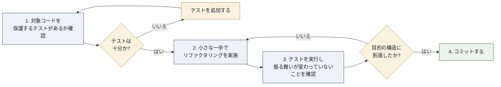

代表的なリファクタリングカタログの技法には、Extract Method(メソッドの抽出)、Extract Class(クラスの抽出)、Rename(名前の変更)、Move Method(メソッドの移動)、Replace Conditional with Polymorphism(条件分岐をポリモーフィズムに置き換える)などがあります。これらはMartin Fowlerの書籍『Refactoring: Improving the Design of Existing Code』で40以上がカタログ化されています。

**ベストプラクティス**
- リファクタリングと機能追加は**同じコミットに混ぜない**。「先にリファクタリング、次に機能追加」あるいはその逆の順で、コミットを分離する。
- 一度に大きな構造変更を狙わず、常に小さく安全な一歩(コンパイルが通り、テストが通る状態)を積み重ねる。
- IDEの自動リファクタリング機能(Rename, Extract Methodなど)を積極的に使い、手作業によるミスを減らす。

> [出典] Martin Fowler et al., "Refactoring: Improving the Design of Existing Code" (Addison-Wesley, 1999/2018) ― 書籍公式サイト https://refactoring.com/

### LO 4.2 — コード・プロダクトの「におい(smell)」を3つ以上説明し、そのうち1つへのリファクタリングでのアプローチを示す [応用]

**説明**: 「コードスメル(Code Smell)」とは、Martin Fowlerが「表面的な兆候であり、通常はシステム内のより深い問題に対応するもの」と定義した概念です。バグではありませんが、放置すると保守性を悪化させる警告サインです。

| コードスメル | 兆候 | 対応するリファクタリング |
|---|---|---|
| **重複コード (Duplicated Code)** | 同じ、あるいは酷似したコード構造が複数箇所に存在する | Extract Method / Extract Class、Pull Up Method |
| **長すぎるメソッド (Long Method)** | 1つのメソッドが多くのことをやりすぎている | Extract Method で責務を分割する |
| **ショットガン手術 (Shotgun Surgery)** | 1つの変更のために多数のクラスに少しずつ修正が必要になる | Move Method / Move Field で関連する責務を1箇所にまとめる |
| **神クラス (God Class / The Blob)** | 1つのクラスがシステムの大部分の責務を抱え込んでいる | Extract Class で責務ごとに分割する |
| **原始的な執着 (Primitive Obsession)** | intやStringなどのプリミティブ型で本来はドメインの概念を表現している | Replace Primitive with Object(値オブジェクトの導入) |

**ベストプラクティス**
- コードスメルは「即座に直すべきバグ」ではなく「注意信号」として扱う。触っている箇所にスメルがあれば直す(ボーイスカウトルール: "来た時よりも美しく")が、無関係な箇所まで探しに行く必要はない。
- リンター・静的解析ツール(SonarQube、ESLintなど)でスメルの一部を自動検出し、レビューの負荷を下げる。

> [出典] Martin Fowler, "Bliki: CodeSmell" https://martinfowler.com/bliki/CodeSmell.html

### LO 4.3 — 非技術者のステークホルダーにリファクタリングを説明する [理解]

**説明**: 開発者にとって自明なリファクタリングの価値も、非技術者には「見た目が何も変わらないのに時間を使う作業」に映りがちです。効果的な説明には比喩が有効です。

**説明の型(例)**
> 「新しい家具を部屋に置くたびに部屋の配置を少し整理するようなものです。整理をサボり続けると、いずれ新しい家具を置く場所すらなくなってしまいます。リファクタリングは、次の機能を素早く安全に追加できる状態を保つための、継続的な整理整頓です。」

**ベストプラクティス**
- リファクタリングを「コストのかかる別作業」としてではなく、「機能開発の一部として常に発生する、目に見えない投資」として説明する。
- 可能であれば、リファクタリング後に「次の機能がどれだけ早く/安全に実装できたか」を実例で示し、投資対効果を可視化する。
- ビジネス側に許可を求める形ではなく、通常の開発作業の一部として組み込み、必要な場合のみ大きなリファクタリングについて透明性を持って共有する。

> [出典] A-CSD LO 4.3。非技術者への説明アプローチはリファクタリング実践コミュニティで広く共有される手法

### LO 4.4 — 技術的負債を説明し、その原因を3つ以上挙げ、そのうち1つへの対処法を議論する [分析]

**説明**: **技術的負債(Technical Debt)**は、Ward Cunninghamが考案した比喩で、「設計を疎かにすることは、お金を借りることに似ている」という考え方です。Martin Fowlerはこれをさらに発展させ、「意図的か否か」「思慮深いか無謀か」の2軸で技術的負債を4象限に分類する**Technical Debt Quadrant**を提唱しました。

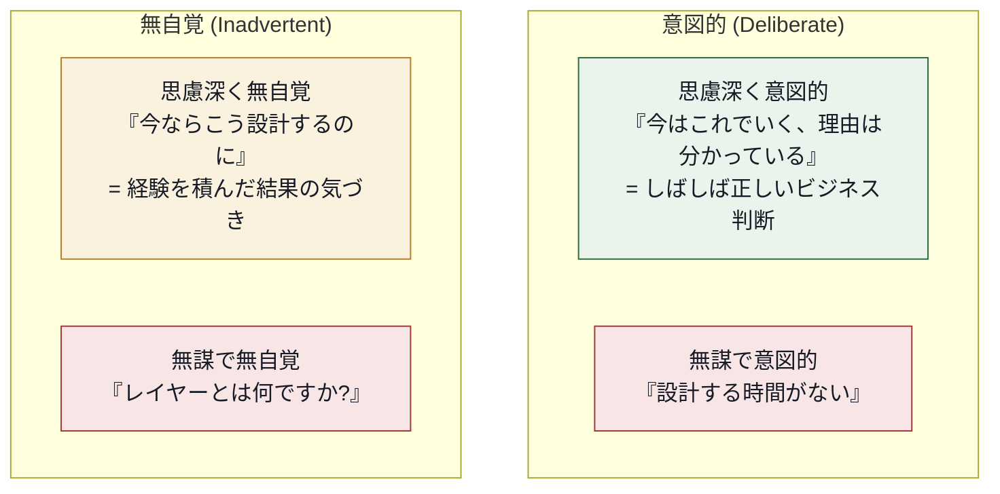

**技術的負債の原因(代表例3つ)**
1. **市場投入の期限プレッシャー**: リリース期日を優先し、意図的に設計を簡略化する(思慮深く意図的な負債)。
2. **知識・経験の不足**: 良い設計パターンを知らないまま実装してしまう(無謀で無自覚な負債)。
3. **要件やビジネス環境の変化**: 設計時点では最適だったが、事業方針の変化で前提が崩れた(思慮深く無自覚な負債、あるいは環境変化型)。

**対処法の例(原因1: 期限プレッシャーへの対処)**
- 負債を負う判断をする際は、チームとProduct Ownerが共同で「なぜ負債を負うのか」「いつ返済するのか」を明示的に合意し、バックログにリファクタリングのアイテムとして記録する(負債を「見えない」ままにしない)。
- スプリントの一定割合(例: 10〜20%)を技術的負債の返済に恒常的に割り当てるルールをチームで運用する。

**ベストプラクティス**
- 技術的負債を「悪」と一律に断罪しない。意図的で思慮深い負債は、しばしば合理的なビジネス判断である。問題視すべきは「無自覚・無謀」な負債の蓄積である。
- 負債の状態を可視化する(バックログにタグ付けする、静的解析ツールでトレンドを追うなど)ことで、経営層との対話を可能にする。

> [出典]
> - Martin Fowler, "Bliki: TechnicalDebtQuadrant" https://martinfowler.com/bliki/TechnicalDebtQuadrant.html
> - Ward Cunninghamによる技術的負債の比喩の一般的解説(Martin Fowler, "Bliki: TechnicalDebt" にて要約) https://martinfowler.com/bliki/TechnicalDebt.html

---

## 第8章: カテゴリ5 — Test Driven Development (LO 5.1–5.9)

このカテゴリは公式LOの中で最もサブ項目数が多く(9項目)、A-CSD®の中核をなす技術領域です。TDDを「設計技法」として捉える視点が全体を貫いています。

### LO 5.1 — TDDの指導原則を3つ以上再言し、それらがなぜ必要かを説明する [理解]

**説明**: Kent BeckがExtreme Programmingの一部として体系化したTDDは、「Red → Green → Refactor」という短いサイクルの反復です。

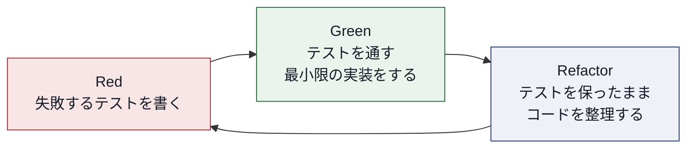

**指導原則(代表例3つ)となぜ必要か**

| 原則 | なぜ必要か |
|---|---|
| **テストを先に書く** | 実装前にインターフェースの使い勝手を考えることになり、テスタブルな(=多くの場合、疎結合な)設計が自然と生まれる |
| **一度に1つの失敗だけを追加する** | 小さなステップで進めることで、問題が発生した際の原因箇所を即座に特定できる |
| **テストが通ったら即座にリファクタリングする** | 「動くコード」と「良い設計のコード」を分離して段階的に達成することで、認知負荷を下げる |

**ベストプラクティス**
- 「テストファースト」を単なる手順ではなく、「これから書くコードにどう使われてほしいか」を先に設計する行為として捉える。

> [出典] Martin Fowler, "Bliki: Test Driven Development" https://martinfowler.com/bliki/TestDrivenDevelopment.html

### LO 5.2 — TDDを設計アプローチとして用いてソフトウェアやプロダクトエンティティを設計することを実演する [応用]

**説明**: TDDは「テスト技法」である以上に「設計技法」です。テストを先に書くことで、そのクラス/関数が呼び出し側からどう見えるべきかを、実装の詳細に引きずられずに考えることができます。これは**Outside-In(外側から内側へ)**や**Inside-Out(内側から外側へ)**という2つのTDDのスタイルとして知られています。

| スタイル | 進め方 | 向いている場面 |
|---|---|---|
| Outside-In (London School / Mockist) | 最上位のユースケースからテストを書き、モックで下位の依存を仮に置きながら内側へ実装を進める | 全体のインターフェース設計を先に固めたい場合 |
| Inside-Out (Classic / Detroit School) | 最下層のドメインロジックからテストを書き、積み上げるように上位を実装する | ドメインロジックが複雑で、まずコアの正しさを固めたい場合 |

**ベストプラクティス**
- どちらか一方に固執せず、対象の性質(UIに近いか、ドメインロジックに近いか)によって使い分ける。

> [出典] A-CSD LO 5.2。Outside-In / Inside-Outの区分はSteve Freeman & Nat Pryce, "Growing Object-Oriented Software, Guided by Tests" で広く整理された分類

### LO 5.3 — 5つ以上の単体テストの原則とプラクティスを適用する [応用]

**説明**: 良い単体テストが備えるべき性質として、広く知られる**F.I.R.S.T.原則**を紹介します。

| 頭文字 | 原則 | 説明 |
|---|---|---|
| F | Fast(高速) | テストは高速に実行できるべき。遅いと開発者が実行を避けるようになる |
| I | Independent(独立) | テスト同士が互いに依存せず、どの順番で実行しても結果が変わらない |
| R | Repeatable(再現可能) | 環境(ネットワーク、時刻など)に依存せず、何度実行しても同じ結果になる |
| S | Self-Validating(自己検証可能) | テスト結果はPass/Failで明確に判定でき、人間がログを目視する必要がない |
| T | Timely(適時) | テスト対象のコードを書く適切なタイミング(TDDでは実装前)で書かれる |

これに加え、AAAパターン(Arrange-Act-Assert：準備・実行・検証の3段構成でテストを記述する)や、1テスト1アサーションの原則も重要な実践です。

**ベストプラクティス**
- テストダブル(モック・スタブ・フェイク)を使いすぎると「実装の詳細に密結合したテスト」になり、リファクタリング時にテストが壊れやすくなる。振る舞いを検証し、実装の詳細を検証しないよう意識する。
- テストコードにも本番コードと同じ品質基準(命名、DRY原則など)を適用する。

> [出典] A-CSD LO 5.3。F.I.R.S.T.原則はTim Ottinger & Jeff Langrによって整理され、Robert C. Martin, "Clean Code" で広く紹介された

### LO 5.4 — テストの品質と有効性を改善する5つ以上の方法を特定し、3つ以上のテストリファクタリングアプローチを適用する [分析]

**説明**: テストコード自体も、時間とともに保守しづらくなる「テストの負債」を抱えます。

**テストの品質と有効性を改善する方法(代表例)**
1. テストの意図が名前だけで分かるように命名する(例: `should_return_error_when_input_is_negative`)
2. テストデータビルダー/オブジェクトマザーパターンで、テストデータ生成の重複を削減する
3. アサーションメッセージを充実させ、失敗時に原因がすぐ分かるようにする
4. Flaky Test(不安定なテスト)をゼロ・トレランスで扱い、見つけ次第修正するか隔離する
5. テストの実行時間を計測し、遅いテストを定期的に見直す

**テストリファクタリングアプローチ(代表例3つ)**
- **Extract Setup**: 複数テストで共通する準備コードをセットアップメソッドに抽出する
- **テストの重複除去**: パラメタライズドテスト(Parameterized Test)で同種のテストケースをまとめる
- **アサーションの単純化**: カスタムアサーション/マッチャーを作り、可読性を上げる

**ベストプラクティス**
- テストコードのレビューは本番コードのレビューと同じ厳格さで行う。

> [出典] A-CSD LO 5.4。xUnitパターンの体系的整理として Gerard Meszaros, "xUnit Test Patterns: Refactoring Test Code" が広く参照される

### LO 5.5 — テストを分類し、異なるカテゴリに異なるテスト方法を割り当てる概念を1つ以上示す [応用]

**説明**: 代表的な分類の枠組みが**Test Pyramid(テストピラミッド)**です。Martin Fowlerが2012年に整理したこの概念は、「粒度の広い(=遅く高コストな)テストは少なく、粒度の狭い(=速く安価な)テストは多く」という比率を示します。

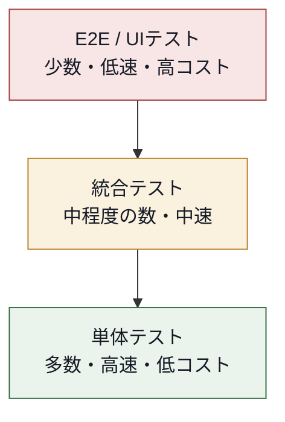

**ベストプラクティス**
- E2Eテストの本数を最小限に絞り、大部分の検証は単体テストと統合テストでカバーする。
- フロントエンド開発の文脈では、Kent C. Doddsが提唱した「Testing Trophy(統合テストを重視する形状)」のような、テストピラミッドの発展形も参考になる。ピラミッドを教条的に適用せず、システムの特性に応じて比率を調整する。

> [出典] Martin Fowler, "Bliki: TestPyramid" および "The Practical Test Pyramid" https://martinfowler.com/bliki/TestPyramid.html https://martinfowler.com/articles/practical-test-pyramid.html

### LO 5.6 — テストファーストでビジネス視点に立った協働的アプローチの属性を3つ以上挙げる [理解]

**説明**: ここでの「テストファーストでビジネス視点に立った協働的アプローチ」とは、**受け入れテスト駆動開発(ATDD: Acceptance Test-Driven Development)**や**振る舞い駆動開発(BDD: Behavior-Driven Development)**、および**Specification by Example(例による仕様化)**を指します。

**属性(代表例3つ)**
1. **共通言語(Ubiquitous Language)を使う**: Given-When-Then のような自然言語に近い形式で、開発者・QA・ビジネス側が同じ言葉で仕様を語れるようにする
2. **3人以上での協働で仕様を作る(Three Amigos)**: Product Owner・開発者・テスターが一緒に受け入れ基準を具体例で洗い出す
3. **実行可能な仕様(Executable Specification)にする**: 自然言語で書かれた受け入れ基準を、自動テストとして実行できる形式にする(Cucumber, SpecFlowなど)

**ベストプラクティス**
- Three Amigosミーティングは、実装が始まる前(スプリントプランニングやリファインメントの段階)で実施し、曖昧な要件を早期に発見する。

> [出典] Martin Fowler, "Bliki: SpecificationByExample" https://martinfowler.com/bliki/SpecificationByExample.html

### LO 5.7 — ステークホルダーやユーザーとテスト駆動のフィードバックループを実装するアプローチを1つ以上適用する [応用]

**説明**: LO 5.6の考え方をさらに実践に落とし込み、実際にステークホルダーとのフィードバックループを回す方法を扱います。

**アプローチ例**
- **受け入れテストのレビューをスプリントレビュー前に実施する**: 実装が終わってからではなく、受け入れ基準の合意時点でステークホルダーの合意を得る
- **CI上で受け入れテストの結果を可視化するダッシュボードをステークホルダーと共有する**: 「今、何が動作確認済みか」を常に透明にする

**ベストプラクティス**
- フィードバックは実装完了後に一度だけ求めるのではなく、開発の複数のタイミング(受け入れ基準合意時、実装中のデモ、リリース後)で継続的に求める。

> [出典] A-CSD LO 5.7

### LO 5.8 — 欠落した、またはリソース効率の悪いコンポーネント/サブシステムに対処する技法を1つ以上適用する [応用]

**説明**: TDDで開発を進めていると、まだ実装されていない依存コンポーネント(外部API、未実装のサービスなど)や、テストの中で使うには重すぎるコンポーネント(実データベースなど)に遭遇します。これに対処する代表的な技法が**テストダブル(Test Double)**です。

| テストダブルの種類 | 説明 |
|---|---|
| **Dummy** | 引数を満たすためだけに渡すが、実際には使われないオブジェクト |
| **Stub** | あらかじめ決められた値を返すだけの簡易な実装 |
| **Spy** | 呼び出されたかどうかを記録するStub |
| **Mock** | 呼び出しの期待値を事前に設定し、期待通りに呼ばれたかを検証するオブジェクト |
| **Fake** | 簡易だが実際に動作するロジックを持つ代替実装(インメモリDBなど) |

**ベストプラクティス**
- テストダブルの使いすぎは、実装の詳細に密結合したテストを生み、リファクタリングへの抵抗力を弱める。可能な限り本物に近いFakeを使うか、契約テスト(Contract Test)を併用して、テストダブルと実際の依存の振る舞いに乖離がないことを検証する。

> [出典] Martin Fowler, "Mocks Aren't Stubs" https://martinfowler.com/articles/mocksArentStubs.html

### LO 5.9 — システムの内部品質を検証・改善することで技術的卓越性にアプローチする方法を3つ以上議論し、そのうち1つを実践する [評価]

**説明**: このLOはBloomの「評価」レベルに位置づけられ、TDDカテゴリの総括的な位置づけです。「内部品質(Internal Quality)」とは、外部から見えるユーザー向けの振る舞いではなく、コードの構造そのものの健全性を指します。

**アプローチ例(代表3つ)**
1. **ミューテーションテスト(Mutation Testing)**: コードに意図的に小さなバグ(ミューテーション)を注入し、既存のテストスイートがそれを検知できるかを検証することで、テストの「本当の」有効性を評価する
2. **継続的な静的解析**: SonarQubeなどのツールをCIに組み込み、複雑度・重複・脆弱性のトレンドを継続的に追跡する
3. **定期的なアーキテクチャレビュー**: チームで定期的にコードベースを俯瞰し、蓄積した技術的負債やアーキテクチャの逸脱を評価する

**ベストプラクティス**
- カバレッジの数値だけで満足せず、ミューテーションテストのような「テストの質」自体を検証する仕組みを取り入れる。
- 内部品質の改善は「別の作業」ではなく、機能開発の一部として継続的に行う(第7章のリファクタリングとの結びつき)。

> [出典] A-CSD LO 5.9。ミューテーションテストの一般的な参照として PIT (PITest) などのツールドキュメント、および学術的原典としてRichard Hamlet, "Testing Programs with the Aid of a Compiler" (1977)

---

## 第9章: カテゴリ6 — Integrating Continuously (LO 6.1–6.3)

### LO 6.1 — 継続的インテグレーションを行う際に対処すべき懸念事項を5つ以上議論する [分析]

**説明**: Martin Fowlerは継続的インテグレーション(CI)を「チームメンバーが頻繁に、通常は少なくとも1日1回は自分の作業を統合するソフトウェア開発手法であり、各統合は自動化されたビルド(テストを含む)によって検証され、可能な限り早く統合エラーを検出する」と定義しています。CIを機能させるために対処すべき懸念事項を紹介します。

**懸念事項(代表例5つ)**
1. **単一のソースリポジトリの維持**: すべてのコードとテストが単一の場所で管理されていること
2. **ビルドの自動化**: 手動でのビルド手順が残っていないこと(ワンコマンドでビルド・テストが完結する)
3. **ビルドの自己テスト化(Self-Testing Build)**: ビルドプロセス自体が自動テストを含み、合否を自己判定できること
4. **ビルドの高速化**: フィードバックが遅いとCIの価値が減衰するため、ビルド・テストの実行時間を短く保つ工夫(並列実行、テスト分割など)が必要
5. **本番同等環境でのテスト**: テスト環境が本番構成から乖離していると、統合の問題を見逃す
6. **可視性の確保**: ビルドの状態(成功/失敗)をチーム全員が常に把握できるようにする(ダッシュボード、通知など)

**ベストプラクティス**
- 「ビルドを壊したら最優先で直す」という文化的規範をチームで明示的に合意する。
- mainブランチは常にデプロイ可能な状態を保つことを絶対のルールとする(トランクベース開発)。

> [出典] Martin Fowler, "Continuous Integration" https://martinfowler.com/articles/continuousIntegration.html

### LO 6.2 — 自動化され、自己テストを行い、高速なビルドを作成することを実践する [応用]

**説明**: LO 6.1で挙げた懸念事項のうち、「自動化」「自己テスト」「高速性」の3要素を実際に構築するLOです。

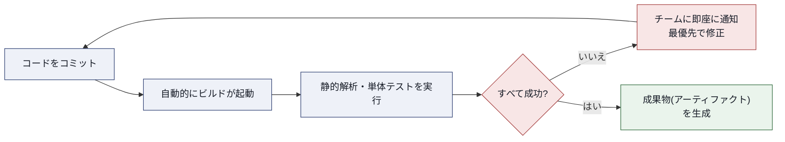

**ベストプラクティス**
- ビルドパイプラインを「速いフィードバックを返す段階」と「時間のかかる検証(E2Eテストなど)」に分割し、前段が失敗すれば後段を実行しないようにする(フェイルファスト)。
- ビルド時間の目標値をチームで定める(例: 「コミットからフィードバックまで10分以内」)。目標を超えたら、テストの並列化やスコープの見直しを行う。

> [出典] Martin Fowler, "Continuous Integration"(プラクティス一覧: バージョン管理、ビルド自動化、自己テスト、高速なビルドなど) https://martinfowler.com/articles/continuousIntegration.html

### LO 6.3 — チームとともに継続的インテグレーション(CI)のアプローチを1つ以上適用する [応用]

**説明**: CIを個人の習慣ではなく、チームのアプローチとして根付かせるための実践を扱います。代表的なCIアプローチとして**トランクベース開発(Trunk-Based Development)**と**Feature Toggle(フィーチャートグル/フラグ)**を紹介します。

| アプローチ | 概要 | メリット |
|---|---|---|
| **トランクベース開発** | 長命なフィーチャーブランチを避け、全員が頻繁に単一の主幹ブランチへ統合する | マージコンフリクトの最小化、統合頻度の向上 |
| **Feature Toggle** | 未完成の機能をコードに含めたままデプロイし、フラグで有効/無効を切り替える | 「完成していない機能」と「デプロイ」を分離できる |
| **短命なフィーチャーブランチ + プルリクエスト** | ブランチの寿命を1〜2日以内に抑え、頻繁にマージする | レビューの仕組みを保ちつつ統合頻度を維持できる |

**ベストプラクティス**
- フィーチャーブランチを使う場合でも、「1日以上生き続けるブランチは危険信号」という基準をチームで共有する。
- Feature Toggleは便利だが増えすぎるとコードが複雑化するため、役目を終えたトグルは速やかに削除する運用ルールを設ける。

> [出典] Martin Fowler, "FeatureToggle"、"Continuous Integration"におけるトランクベース開発の考え方 https://martinfowler.com/articles/continuousIntegration.html

---

## 第10章: カテゴリ7 — Learning by Delivering Continuously (LO 7.1–7.4)

このカテゴリは、CIの先にある「継続的デリバリー(Continuous Delivery, CD)」と「継続的デプロイメント(Continuous Deployment)」を扱い、A-CSD® LOの最終カテゴリとして「デリバリーを通じた学習」というテーマで締めくくられます。

### LO 7.1 — 継続的デリバリー(CD)を定義し、その利点を3つ以上議論する [理解]

**説明**: Jez Humble & Dave Farleyが体系化した継続的デリバリーは、「ソフトウェアをいつでも安全かつ迅速に本番環境にリリースできる状態に保つプラクティス」と定義されます。継続的インテグレーションが「統合の頻度」を扱うのに対し、継続的デリバリーは「リリース可能な状態を常に保つこと」に焦点を当てます。

**利点(代表例3つ)**
1. **市場投入までの時間(Time to Market)の短縮**: 機能を素早く顧客に届けられる
2. **リリースリスクの低減**: 小さく頻繁なリリースは、大きく稀なリリースよりも1回あたりの変更が小さく、問題発生時の切り分けが容易
3. **フィードバックループの高速化**: 実際のユーザーからのフィードバックを早期に得て、次の開発判断に活かせる

**ベストプラクティス**
- 「継続的デリバリー」と「継続的デプロイメント」を混同しない。前者は「リリース可能な状態を保つ」ことで、実際にリリースするかどうかはビジネス判断による。後者はさらに進んで、パイプラインを通過したものを自動的に本番へ反映する。

> [出典] Jez Humble & Dave Farley, "Continuous Delivery" 公式サイト https://continuousdelivery.com/

### LO 7.2 — 継続的デリバリーのための技術的プラクティスを3つ以上説明する [理解]

**説明**: 継続的デリバリーを支える技術的な基盤を紹介します。

| プラクティス | 概要 |
|---|---|
| **デプロイメントパイプライン (Deployment Pipeline)** | コミットから本番リリースまでの各段階(ビルド、単体テスト、統合テスト、性能テスト、本番デプロイ)を自動化されたパイプラインとして表現する |
| **Infrastructure as Code (IaC)** | インフラ構成をコードとして管理し、環境間の差異(「私の環境では動く」問題)を排除する |
| **ブルーグリーンデプロイメント / カナリアリリース** | 新旧バージョンを並行稼働させたり、一部のトラフィックだけ新バージョンに向けたりすることで、リリースのリスクを段階的に下げる |
| **自動化されたロールバック** | 問題が検知された際に、迅速かつ確実に前バージョンへ切り戻せる仕組みを用意する |

**ベストプラクティス**
- パイプラインの各ステージは「後段に行くほど遅く・広い範囲を検証する」ように設計し、早い段階で安価に問題を検出できるようにする(第9章のCIの原則と一貫性を持たせる)。

> [出典] Jez Humble & Dave Farley, "Continuous Delivery" https://continuousdelivery.com/ DORA(DevOps Research and Assessment)の技術的能力に関する解説(継続的デリバリー、継続的インテグレーション等) https://docs.cloud.google.com/solutions/devops/devops-tech-version-control

### LO 7.3 — デリバリーの期待される成果についてフィードバックを組み込むアプローチを1つ以上議論する [応用]

**説明**: 単に「リリースした」だけでは学習は完結しません。リリースした結果、実際にビジネス上の期待された成果(顧客満足度の向上、コンバージョン率の改善など)が得られたかを確認するフィードバックの仕組みが必要です。

**アプローチ例**
- **A/Bテスト**: 新機能の一部のユーザーにのみ公開し、既存版との比較で効果を測定する
- **プロダクトアナリティクスの活用**: 機能利用状況やユーザー行動データを収集し、仮説通りの成果が出ているかを検証する
- **カスタマーフィードバックループの短縮**: リリースノートやユーザーインタビューを通じて、定性的なフィードバックを継続的に集める

**ベストプラクティス**
- 「リリース = 完了」という発想から脱却し、リリース後の計測・学習までを開発サイクルの一部として計画に組み込む。

> [出典] A-CSD LO 7.3。DORAの調査に基づく「Accelerate: The Science of Lean Software and DevOps」がフィードバックと成果の測定に関する広く参照される研究

### LO 7.4 — 継続的デプロイメントのアプローチを概説する [理解]

**説明**: 継続的デプロイメント(Continuous Deployment)は継続的デリバリーをさらに一歩進め、パイプラインのすべての自動チェックを通過した変更を、人間の承認を介さずに自動的に本番環境へ反映する手法です。

**継続的デプロイメントを支える指標として、DORA(DevOps Research and Assessment)が特定した4つの主要指標(Four Keys)**が広く参照されます。

| 指標 | 何を測るか |
|---|---|
| **デプロイ頻度 (Deployment Frequency)** | どれだけ頻繁に本番へデプロイしているか |
| **変更のリードタイム (Lead Time for Changes)** | コミットから本番反映までにかかる時間 |
| **変更失敗率 (Change Failure Rate)** | デプロイが本番障害を引き起こした割合 |
| **サービス復旧時間 (Time to Restore Service)** | 障害発生から復旧までにかかる時間 |

**ベストプラクティス**
- 継続的デプロイメントに移行する前に、まず堅牢な自動テストスイート・監視・アラート体制・自動ロールバックの仕組みを整える。これらの土台がない状態での自動デプロイ化は、障害の検知・対応が遅れるリスクを高める。
- DORAの4指標を継続的に計測し、チームの「速度」と「安定性」を両面からモニタリングする。

> [出典] DORA (DevOps Research and Assessment) の4つの主要指標に関するGoogle Cloudのドキュメント https://docs.cloud.google.com/solutions/devops/devops-tech-version-control

---

## 第11章: XPプラクティスとA-CSD LOの統合マップ

A-CSD®のLOは、単独の技法の寄せ集めではなく、**Extreme Programming (XP)** の実践群が互いに補強し合う一つのシステムとして設計されています。以下の図は、これまでの章で扱った主要プラクティスがどのように連動しているかを示します。

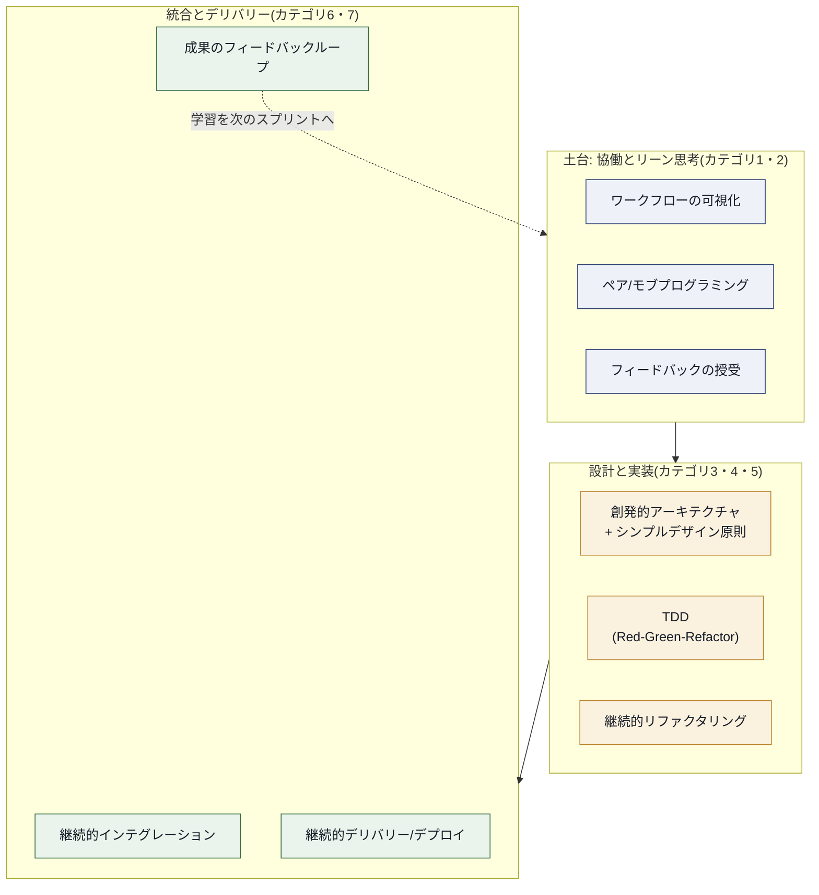

**この図が示す重要な洞察**

- **TDDだけを単独で導入しても効果は限定的**です。テストを書く前提として、ペアプログラミングや頻繁なフィードバックといった協働のプラクティス、そして頻繁に統合できるCI基盤が揃って初めて、TDDの「速いフィードバックループ」という価値が最大化されます。
- **リファクタリングはTDDのサイクルの一部であり、CIのビルドがそれを保護します。** テストが常にグリーンであることを保証するCIがなければ、安全なリファクタリングは成立しません。
- **継続的デリバリーの先にある「学習」が、リーン思考(カテゴリ1)に還流します。** これがA-CSD® LOのカテゴリ7が「Learning by Delivering Continuously(継続的デリバリーによる学習)」と名付けられている理由です。デリバリーは目的地ではなく、次の改善のための情報収集の手段でもあります。

> [出典] Extreme Programmingの実践群の全体像は Kent Beck, "Extreme Programming Explained" が原典。各プラクティスの相互関係は Wikipedia "Extreme programming practices" でも整理されている https://en.wikipedia.org/wiki/Extreme_programming_practices

---

## 第12章: ベストプラクティス総合チェックリスト

これまでの章で挙げたベストプラクティスを、カテゴリ横断でチェックリスト形式にまとめます。コース受講前の自己診断や、チームの現状把握に活用してください。

### 12.1 リーン・アジャイル・Scrum

- [ ] チームのワークフローを可視化し、待機時間と実作業時間を区別できている
- [ ] WIP制限を設定し、マルチタスクによる無駄を意識的に減らしている
- [ ] Definition of Doneを定期的に見直し、進化させる仕組みがある
- [ ] 技術的な提案をビジネス言語(価値・リスク・コスト)で説明できる

### 12.2 協働とチームダイナミクス

- [ ] タスクの性質に応じてソロ・ペア・モブを使い分けている
- [ ] SBIモデルなど、構造化されたフィードバックの型を知っている
- [ ] チームの「使用率100%」を目指すことの弊害を理解している
- [ ] INVESTの原則でプロダクトバックログアイテムを分割できる

### 12.3 アーキテクチャと設計

- [ ] 事前設計と創発的設計を状況に応じて使い分けている
- [ ] YAGNI・DRY・単一責任の原則などを、教条的にではなく理由とともに適用している
- [ ] 非機能要件(性能・セキュリティなど)を自動テストで継続的に検証している
- [ ] 複数のコード品質メトリクスを組み合わせて健全性を把握している

### 12.4 リファクタリング

- [ ] リファクタリングと機能追加のコミットを分離している
- [ ] 主要なコードスメルを認識し、対応するリファクタリング技法を知っている
- [ ] 技術的負債を可視化し、Product Ownerと透明に対話している
- [ ] 技術的負債の返済をスプリントの定常的な活動として組み込んでいる

### 12.5 テスト駆動開発

- [ ] Red-Green-Refactorのサイクルを実践している
- [ ] F.I.R.S.T.原則に沿った単体テストを書けている
- [ ] テストピラミッドの比率を意識し、E2Eテストに偏り過ぎていない
- [ ] Three Amigosなど、テストファーストで協働するプラクティスを取り入れている

### 12.6 継続的インテグレーション・デリバリー

- [ ] mainブランチが常にデプロイ可能な状態を保っている
- [ ] ビルドが壊れたら最優先で修正する文化がある
- [ ] デプロイメントパイプラインが自動化されている
- [ ] DORAの4指標(デプロイ頻度・リードタイム・変更失敗率・復旧時間)を計測している

---

## 第13章: 認定取得後のキャリアパス

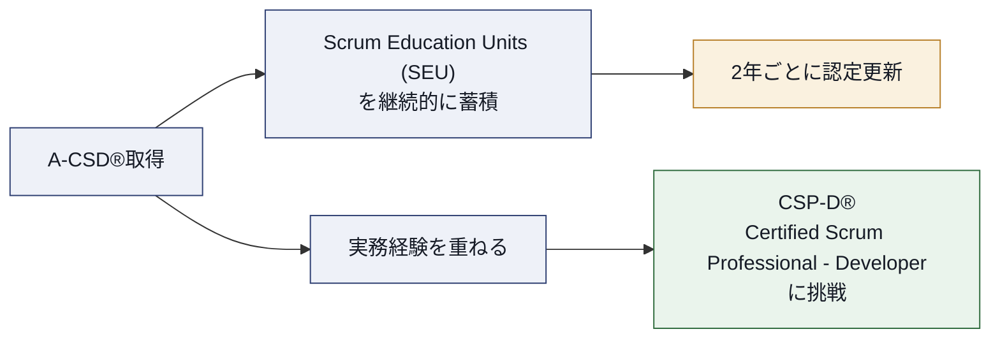

- **CSP-D® (Certified Scrum Professional® Developer)**: A-CSD®の取得は、Scrum Alliance公式ページで明記されている通り、CSP-D®への里程標(milestone)です。CSP-D®は、開発者としてのより高度な専門性を証明する資格として位置づけられています。
- **SEU(Scrum Education Units)の蓄積**: 更新に必要なSEUは、書籍、ウェビナー、カンファレンス参加など多様な学習機会から得られます。日々の学習を記録する習慣が、更新時の負担を減らします。
- **コミュニティへの参加**: Scrum Allianceのユーザーグループやカンファレンス(Global/Regional Scrum Gathering®)への参加は、SEUの獲得だけでなく、実践者同士のネットワーキングの機会にもなります。

> [出典]
> - Scrum Alliance, A-CSD公式ページ「Benefits」セクション(CSP-Dへの里程標としての言及) https://www.scrumalliance.org/get-certified/developer-track/advanced-certified-scrum-developer
> - Scrum Alliance, "Certified Scrum Professional for Developers" https://www.scrumalliance.org/get-certified/developer-track/certified-scrum-professional-for-developers
> - Scrum Alliance, "Scrum Education Units" https://www.scrumalliance.org/get-certified/scrum-education-units

---

## 第14章: まとめ

A-CSD®は、CSD®で培った「Scrumの枠組みの中で開発する」基礎スキルを土台に、次の3つの軸で開発者を成長させる資格です。

1. **技術的卓越性の軸**: TDD、リファクタリング、継続的インテグレーション/デリバリーを通じて、変更に強く、内部品質の高いソフトウェアを継続的に作り出す力
2. **設計思考の軸**: 事前設計と創発的設計のバランス、SOLID・YAGNIなどの設計原則、技術的負債のマネジメントを通じて、持続可能なアーキテクチャを維持する力
3. **協働とリーダーシップの軸**: ペア/モブプログラミング、構造化されたフィードバック、チームダイナミクスの理解を通じて、チーム全体の生産性を引き出す力

これら3つの軸は独立しているのではなく、第11章で示したように相互に補強し合う一つのシステムです。A-CSD®の学習を通じて、単なる技法の暗記ではなく、「なぜその技法が必要なのか」を自分の言葉で(そして非技術者にも)説明できるようになることが、Bloomの高次レベル(分析・統合・評価)を求めるA-CSD® LOの本質的な狙いだと言えます。

---

## 第15章: 参考文献(出典一覧)

### Scrum Alliance 公式情報源

- Scrum Alliance, "Advanced Certified Scrum Developer (A-CSD)" 公式ページ https://www.scrumalliance.org/get-certified/developer-track/advanced-certified-scrum-developer
- Scrum Alliance, "Advanced Certified Scrum Developer (A-CSD) Learning Objectives" (2021年8月版, PDF) https://www.scrumalliance.org/ScrumRedesignDEVSite/media/ScrumAllianceMedia/Files%20and%20PDFs/Learning%20Objectives/E_A_CSD_LO_2021.pdf
- Scrum Alliance, "Certified Scrum Developer (CSD)" 公式ページ https://www.scrumalliance.org/get-certified/developer-track/certified-scrum-developer
- Scrum Alliance, "Certified Scrum Professional for Developers" https://www.scrumalliance.org/get-certified/developer-track/certified-scrum-professional-for-developers
- Scrum Alliance, "Scrum Education Units" https://www.scrumalliance.org/get-certified/scrum-education-units
- Scrum Alliance, "Renewing Certifications" https://www.scrumalliance.org/get-certified/renewing-certifications
- Scrum Alliance, "About Scrum: Values" https://www.scrumalliance.org/about-scrum/values
- Scrum Alliance, "Skills in the New World of Work"(認定の市場価値に関する調査記事) https://resources.scrumalliance.org/Article/share-insights-agile-skills-workplace

### フレームワークの一次資料

- Ken Schwaber & Jeff Sutherland, "The Scrum Guide" (2020年11月版) https://scrumguides.org/scrum-guide.html
- "Manifesto for Agile Software Development" および12の原則 https://agilemanifesto.org/ https://agilemanifesto.org/principles.html

### リファクタリング・技術的負債・コード品質

- Martin Fowler et al., "Refactoring: Improving the Design of Existing Code" 公式サイト https://refactoring.com/
- Martin Fowler, "Bliki: CodeSmell" https://martinfowler.com/bliki/CodeSmell.html
- Martin Fowler, "Bliki: TechnicalDebtQuadrant" https://martinfowler.com/bliki/TechnicalDebtQuadrant.html

### テスト駆動開発・テスト戦略

- Martin Fowler, "Bliki: Test Driven Development" https://martinfowler.com/bliki/TestDrivenDevelopment.html
- Martin Fowler, "Bliki: TestPyramid" https://martinfowler.com/bliki/TestPyramid.html
- Martin Fowler, "The Practical Test Pyramid" https://martinfowler.com/articles/practical-test-pyramid.html
- Martin Fowler, "Software Testing Guide"(テスト関連記事の総合案内) https://martinfowler.com/testing/
- Martin Fowler, "Bliki: SpecificationByExample" https://martinfowler.com/bliki/SpecificationByExample.html
- Martin Fowler, "Mocks Aren't Stubs" https://martinfowler.com/articles/mocksArentStubs.html

### 継続的インテグレーション・継続的デリバリー

- Martin Fowler, "Continuous Integration" https://martinfowler.com/articles/continuousIntegration.html
- Martin Fowler, "FeatureToggle" https://martinfowler.com/articles/feature-toggles.html
- Jez Humble & Dave Farley, "Continuous Delivery" 公式サイト https://continuousdelivery.com/
- Google Cloud, DORA (DevOps Research and Assessment) 技術的能力に関するドキュメント(継続的デリバリー・継続的インテグレーション・DORAの4指標) https://docs.cloud.google.com/solutions/devops/devops-tech-version-control

### 補足: XPプラクティス全般

- Wikipedia, "Extreme programming practices"(XPプラクティス群の概観として補助的に参照) https://en.wikipedia.org/wiki/Extreme_programming_practices

---

*本ガイドは学習補助資料として作成されたものであり、Scrum Alliance®の公式教材や認定コースの代替とはなりません。A-CSD®の取得には、Scrum Alliance®承認のLicensed Training Partner/Certified Educatorによるコース受講が必須です。最新の要件・LOは必ず公式サイト(scrumalliance.org)でご確認ください。*
