# Advanced Certified ScrumMaster (A-CSM) 学習ガイド

**初学者のためのステップバイステップ解説 — 全ラーニングオブジェクティブ対応版**

> 本ガイドは Scrum Alliance が公開する **A-CSM Learning Objectives (2022年1月版)** に基づき、6つの学習カテゴリー・全42のラーニングオブジェクティブ (LO) を、初学者でも理解できるようステップバイステップで解説したものです。各項目には「初学者向け解説」「ベストプラクティス」「参考ソース」を併記しています。ASCIIアートは使用せず、図解はすべて Mermaid、表はすべて Markdown 形式で記述しています。

---

## 目次

1. [A-CSM とは何か — 資格の位置づけと要件](#chapter1)
2. [Bloom's Taxonomy とラーニングオブジェクティブの読み方](#chapter2)
3. [カテゴリー1: Lean, Agile, and Scrum](#chapter3)
4. [カテゴリー2-A: Scrum Master Core Competencies — Facilitation](#chapter4)
5. [カテゴリー2-B: Scrum Master Core Competencies — Coaching and Training](#chapter5)
6. [カテゴリー3-A: Service to the Scrum Team — Self-Management and Team Dynamics](#chapter6)
7. [カテゴリー3-B: Service to the Scrum Team — Definition of Done and Development Practices](#chapter7)
8. [カテゴリー4: Service to the Product Owner](#chapter8)
9. [カテゴリー5-A: Service to the Organization — Organizational Impediments](#chapter9)
10. [カテゴリー5-B: Service to the Organization — Scaling Scrum](#chapter10)
11. [カテゴリー5-C: Service to the Organization — Organizational Change](#chapter11)
12. [カテゴリー6-A: Scrum Mastery — Personal Development](#chapter12)
13. [カテゴリー6-B: Scrum Mastery — Scrum Master as a True Leader](#chapter13)
14. [ベストプラクティス総合チェックリスト](#chapter14)
15. [よくある誤解とアンチパターン](#chapter15)
16. [認定取得後のキャリアパス](#chapter16)
17. [まとめ](#chapter17)
18. [参考文献・ソース一覧](#chapter18)

---

<a id="chapter1"></a>

## 第1章: A-CSM とは何か — 資格の位置づけと要件

### 1.1 初学者向け解説

**Advanced Certified ScrumMaster (A-CSM®)** は、Scrum Alliance が提供する ScrumMaster トラックの中級認定資格です。エントリーレベルの **Certified ScrumMaster (CSM®)** で学んだ Scrum の基礎知識と、実務経験を土台として、以下のような「一段上」のスキルを習得することを目的としています。

- Product Owner・Scrum Team・顧客・ステークホルダー・経営層の間のディスカッションを **ファシリテート (facilitate)** する力
- チームや組織全体に対して Scrum を **コーチ・指導・メンタリング** する力
- 変化への抵抗、モチベーション低下、エンゲージメント不足といった「よくある課題」に対応する力
- チームの当事者意識・関与・責任感を高める力
- 単一チームを超えて **Scrum/Agile をスケールする** ための基礎技術

CSM が「Scrum とは何か」を学ぶ場であるのに対し、A-CSM は「Scrum Master として組織の中でどう機能するか」を深く掘り下げる場だと理解すると分かりやすいでしょう。

### 1.2 CSM → A-CSM → CSP-SM のキャリアパス

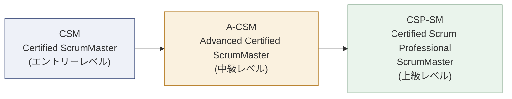

Scrum Alliance の FAQ によれば、Scrum Master トラックにおける最高位の資格は **Certified Scrum Professional® - ScrumMaster (CSP®-SM)** であり、A-CSM はその一歩手前に位置づけられます。

### 1.3 認定取得の要件

A-CSM を取得・維持するためには、以下の要件を満たす必要があります。

| # | 要件 | 詳細 |
|---|------|------|
| 1 | 前提資格の保有 | Scrum Alliance の CSM 認定、または Scrum.org の PSM I / PSM II のいずれかを保有していること（CSM は有効期限切れでも可。A-CSM 取得時に自動更新される）。PSM I / PSM II を前提資格として使う場合は、A-CSM コースへ申し込む前に、その資格情報を Scrum Alliance のアカウント（メンバープロフィール）へ SEU として自己申告・登録しておく必要がある。登録内容は受講者登録の際に確認されるため、未登録だとコースの受講者登録に進めない |
| 2 | 実務経験 | 過去5年以内に Scrum Master としての実務経験12ヶ月以上を Scrum Alliance のプロフィールに記録していること |
| 3 | コース修了 | 承認された A-CSM コース（最低16時間）を修了すること。講師が指定する課題・実務は、コース受講前・受講後のいずれかで実施すればよい |
| 4 | ライセンス受諾 | A-CSM ライセンスへの同意とメンバープロフィールの完成 |
| 5 | 資格更新 | 標準の更新ルートでは、2年ごとに **30 SEU (Scrum Education Units) の取得** と **175 米ドルの更新料の支払い** の両方を行うこと。適用される更新区分は、保有している資格のうち最上位のものによって決まる。なお、別の Scrum Alliance 認定コースを修了した場合は、SEU の提出と更新料の支払いなしで既存の認定が更新される |

> **補足:** 実務経験12ヶ月に満たない状態でも A-CSM コース自体は受講可能です。ただし、認定ライセンスを受け取るまでに、過去5年以内の Scrum Master 実務経験12ヶ月以上という要件を満たす必要があります。この12ヶ月はコース受講後の経験に限られず、受講前の経験と受講後の経験を通算して数えられます。また、承認コースは最低16時間で構成され、講師が指定する課題・実務はコース受講前・受講後のどちらで行っても要件を満たします。

### 1.4 CSM と A-CSM の違い

| 観点 | CSM | A-CSM |
|------|-----|-------|
| 位置づけ | Scrum 実践者としての入門資格 | より複雑な課題・組織的な取り組みに対応するための次のレベル |
| 前提条件 | なし（Scrum の基礎学習） | CSM（または Scrum.org の PSM I / PSM II）保有 + Scrum Master 実務経験12ヶ月 |
| 学習の焦点 | Scrum フレームワークの理解 | ファシリテーション・コーチング・スケーリングの実践 |
| コース形式 | 基礎コース | 最低16時間の応用コース（講師指定の課題・実務は受講前・受講後のいずれでも可） |

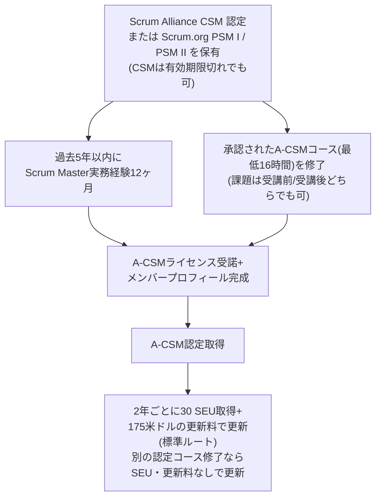

**補足:** 実務経験12ヶ月(R2)とA-CSMコース修了(R3)に順序の指定はありません。
コースを先に修了し、後から実務経験の要件を満たしても構いません
(両方を満たした時点でR4へ進めます)。

> **ソース:** [Scrum Alliance — Advanced Certified ScrumMaster](https://www.scrumalliance.org/get-certified/scrum-master-track/advanced-certified-scrummaster) / [Scrum Alliance Help Center — How do I earn the A-CSM or A-CSPO certification?](https://support.scrumalliance.org/hc/en-us/articles/115001680252-How-do-I-earn-the-Advanced-Certified-ScrumMaster-A-CSM-or-Advanced-Certified-Scrum-Product-Owner-A-CSPO-certification)

---

<a id="chapter2"></a>

## 第2章: Bloom's Taxonomy とラーニングオブジェクティブの読み方

### 2.1 初学者向け解説

A-CSM の公式ラーニングオブジェクティブ (LO) は **Bloom's Taxonomy (ブルームの教育目標分類)** というフレームワークに基づいて記述されています。これは学習到達度を6段階の「動詞」で表現する手法で、各 LO の文頭には「Upon successful validation of the A-CSM Learning Objectives, the learner will be able to …」（A-CSM学習目標の達成検証後、学習者は…できるようになる）という前提が暗黙的に付与されています。

| レベル | 英語動詞の例 | 意味 |
|--------|-------------|------|
| 1. Knowledge (知識) | identify, recognize, describe | 事実や概念を思い出せる |
| 2. Comprehension (理解) | explain, discuss, outline | 意味を自分の言葉で説明できる |
| 3. Application (応用) | apply, demonstrate, practice | 知識を実際の状況で使える |
| 4. Analysis (分析) | analyze, examine, compare | 要素に分解し関係性を見出せる |
| 5. Synthesis (統合) | design, create, facilitate | 新しいものを組み立てられる |
| 6. Evaluation (評価) | evaluate, rank, select | 基準に基づいて判断・選択できる |

レベルは下から上に向かって「より高次の思考スキル」を要求します。A-CSM の LO には低次（identify など）から高次（evaluate, design など）まで幅広く含まれており、単なる知識の暗記ではなく **実践できる力** が問われる点が CSM との大きな違いです。

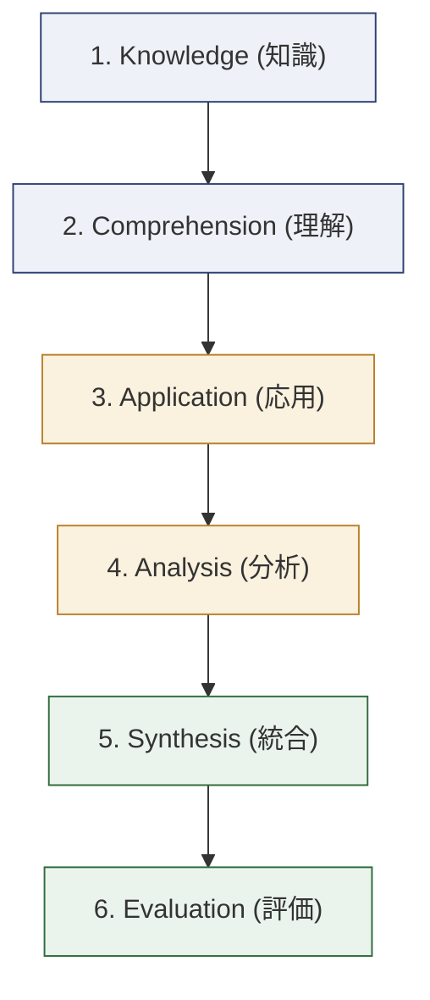

### 2.2 LO 全体構成マップ

A-CSM の LO は以下の6カテゴリーに分類されます。Scrum Alliance が承認した Individual Path to CSP-SM Educators はこれに加えて補助トピックを含めることができますが、その場合は明示的に「補助トピックである」と示す必要があります。

| カテゴリー | 番号帯 | サブトピック |
|-----------|--------|-------------|
| 1. Lean, Agile, and Scrum | 1.1–1.5 | なし |
| 2. Scrum Master Core Competencies | 2.1–2.12 | Facilitation (2.1–2.8) / Coaching and Training (2.9–2.12) |
| 3. Service to the Scrum Team | 3.1–3.8 | Self-Management and Team Dynamics (3.1–3.4) / Definition of Done and Development Practices (3.5–3.8) |
| 4. Service to the Product Owner | 4.1–4.4 | なし |
| 5. Service to the Organization | 5.1–5.8 | 組織的障害 (5.1–5.2) / Scaling Scrum (5.3–5.6) / Organizational Change (5.7–5.8) |
| 6. Scrum Mastery | 6.1–6.5 | Personal Development (6.1–6.3) / Scrum Master as a True Leader (6.4–6.5) |

> **ソース:** [Scrum Alliance — A-CSM Learning Objectives (January 2022, PDF)](https://www.scrumalliance.org/media/certifications/los/adv_csm_learning_objectives_2022.pdf)

---

<a id="chapter3"></a>

## 第3章: カテゴリー1 — Lean, Agile, and Scrum (LO 1.1–1.5)

### LO 1.1: Scrum とアジャイルマニフェストの整合性を示す

**初学者向け解説:** Scrum は「アジャイルソフトウェア開発宣言 (Manifesto for Agile Software Development)」の4つの価値観・12の原則を土台としたフレームワークです。宣言そのものは特定の手法を規定していませんが、Scrum の3本柱（透明性・検査・適応）や5つの価値基準（確約・勇気・集中・公開・尊敬）は、この宣言の精神を具体的な実践に落とし込んだものだと理解できます。

| アジャイルマニフェストの価値観 | Scrum における具体化 |
|---|---|
| プロセスやツールよりも個人と対話を | デイリースクラムでの対面コミュニケーション、自己管理型チーム |
| 包括的なドキュメントよりも動くソフトウェアを | Sprint ごとの「完成した (Done)」インクリメント |
| 契約交渉よりも顧客との協調を | Product Owner とステークホルダーの継続的な関与、Sprint Review |
| 計画に従うことよりも変化への対応を | Sprint ごとの検査と適応、Product Backlog のリファインメント |

> **ベストプラクティス:** A-CSM レベルの Scrum Master は、単に「Scrum のルール」を教えるのではなく、なぜそのルールがアジャイルマニフェストの価値観に基づいているのかをチームや経営層に説明できる必要があります。ルールの背景にある「なぜ」を語れることが、抵抗を減らし、形骸化した Scrum (いわゆる "Zombie Scrum") を防ぐ鍵になります。

<!-- -->

> **ソース:** [Manifesto for Agile Software Development](https://agilemanifesto.org/) / [12 Principles behind the Agile Manifesto](https://agilemanifesto.org/principles.html) / [Scrum Guide (2020)](https://scrumguides.org/scrum-guide.html)

### LO 1.2: Scrum とアジャイルの歴史的発展を概説する

**初学者向け解説:** Scrum は1990年代前半に Jeff Sutherland と Ken Schwaber によって定式化され、1995年の OOPSLA カンファレンスで発表されました。2001年にはアジャイルマニフェストが17名の実務家によって策定され、Scrum はその中核的なフレームワークの一つとして急速に普及しました。Scrum Alliance 自体も2001年に設立された組織です。歴史を理解することで、Scrum が「軽量ソフトウェア開発プロセスへの反動」として生まれた文脈や、リーン生産方式（トヨタ生産方式）からの影響を把握できます。

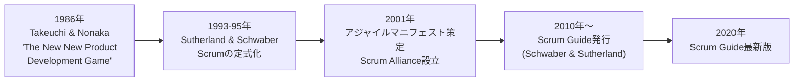

> **ソース:** [Scrum Guide (2020)](https://scrumguides.org/scrum-guide.html) / [Manifesto for Agile Software Development](https://agilemanifesto.org/)

### LO 1.3: Scrum 以外の Lean/Agile 開発アプローチの価値を説明する（最低2つ）

**初学者向け解説:** A-CSM の Scrum Master は「Scrum しか知らない」状態を脱し、他の Lean/Agile アプローチの強みを理解して使い分けられる必要があります。代表的な例を2つ挙げます。

| アプローチ | 概要 | Scrum との違い・価値 |
|-----------|------|---------------------|
| **Kanban** | 作業の可視化・WIP制限・フローの最適化を重視する手法 | Sprint のような時間ボックスを持たず、継続的フローを扱う。運用・保守チームなど、作業の到着が不規則な文脈で強みを発揮する |
| **Extreme Programming (XP)** | ペアプログラミング・TDD・継続的インテグレーションなど技術プラクティスを重視 | Scrum が「What/When」（何を・いつ作るか）を扱うのに対し、XP は「How」（どう作るか）に強い。Scrum と組み合わせて使われることが多い |
| **Lean Startup** | 仮説検証と Build-Measure-Learn サイクルによる製品開発 | 不確実性の高い新規事業・プロダクト立ち上げ時の意思決定フレームワークとして Scrum を補完する |

> **ベストプラクティス:** チームの状況（フローが不規則、技術的負債が大きい、プロダクト検証フェーズにあるなど）に応じて、Scrum に Kanban のプラクティス（WIP制限、累積フロー図）や XP のプラクティス（TDD、ペアプログラミング）を組み合わせる「Scrumban」のような柔軟な運用を検討しましょう。

<!-- -->

> **ソース:** [Scrum Guide (2020)](https://scrumguides.org/scrum-guide.html) — Scrum は「意図的に不完全」であり、他のプラクティスとの併用を前提としている旨が明記されています。

### LO 1.4: 優れた Scrum Master の性格特性を最低5つ挙げてランク付けする

**初学者向け解説:** 優れた Scrum Master に共通する性格特性の代表例を紹介します。実際のランク付けはチームや組織の文脈によって変わるため、A-CSM コースでは自分自身の経験に基づいてランク付けを行うワークが含まれます。

| 特性 | 説明 |
|------|------|
| 忍耐力 (Patience) | チームが自己組織化するまで、答えを与えずに待てる力 |
| 共感力 (Empathy) | チームメンバーやステークホルダーの立場に立って考えられる力 |
| 誠実さ (Honesty) | 都合の悪い事実も含めて透明性を保てる力 |
| 謙虚さ (Humility) | 自分が答えを持っていないことを認められる力 |
| 観察力 (Observation) | チームの言動やチームダイナミクスの微妙な変化に気づける力 |
| 協調性 (Collaboration) | 対立する利害関係者の間を取り持てる力 |
| 勇気 (Courage) | 難しい会話や現状への異議申し立てを避けない力 |

> **ベストプラクティス:** 自己評価として「Scrum の5つの価値基準（確約・勇気・集中・公開・尊敬）」を性格特性のランク付けの土台として使うと、Scrum Alliance の価値観と一貫性のある振り返りができます。

<!-- -->

> **ソース:** [Scrum Alliance — Scrum Values](https://www.scrumalliance.org/about-scrum/values)

### LO 1.5: 透明性・検査・適応が機能していない状況を3つ評価する

**初学者向け解説:** Scrum の経験主義（Empiricism）は「透明性 (Transparency)」「検査 (Inspection)」「適応 (Adaptation)」という3本柱に支えられています。A-CSM の Scrum Master は、これらが「形だけ」になっている状況を見抜き、評価できる必要があります。

| 柱が機能不全に陥っている兆候 | 具体例 |
|---|---|
| **透明性の欠如** | Sprint Backlog の状況が実態と乖離している／「ほぼ完成」という曖昧な報告が横行している／Definition of Done が形骸化している |
| **検査の欠如** | デイリースクラムが単なる進捗報告会になり、実際の障害や品質への言及がない／Sprint Review がデモの発表会で終わり、フィードバックが反映されない |
| **適応の欠如** | レトロスペクティブで同じ問題が毎回挙がるが、アクションアイテムが実行されない／計画に固執し、検査結果を無視して当初のスコープを変えない |

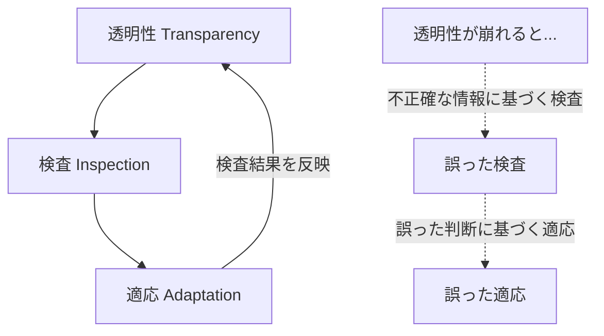

> **ベストプラクティス:** 3本柱が機能しているかを定期的に自己診断するために、レトロスペクティブの冒頭で「今スプリント、私たちは何を隠していなかったか？（透明性）」「何を本当に検査したか？（検査）」「何を実際に変えたか？（適応）」という3つの問いを投げかける手法が有効です。

<!-- -->

> **ソース:** [Scrum Guide (2020) — Scrum Pillars](https://scrumguides.org/scrum-guide.html)

---

<a id="chapter4"></a>

## 第4章: カテゴリー2-A — Scrum Master Core Competencies: Facilitation (LO 2.1–2.8)

### LO 2.1: 発散的思考と収束的思考の兆候をそれぞれ最低3つ識別する

**初学者向け解説:** 優れたファシリテーションの土台となるのが「発散 (Divergent Thinking)」と「収束 (Convergent Thinking)」の違いを見極める力です。これはデザイン思考の「ダブルダイヤモンド (Double Diamond)」モデルにも通じる考え方です。

| 局面 | 発散的思考の兆候 | 収束的思考の兆候 |
|------|-----------------|-----------------|
| 発言の量 | 多様な意見・アイデアが次々と出る | 意見が絞り込まれ、少数の選択肢に集中する |
| 発言の性質 | 「もし〜だったら」「他には」といった探索的な発言が増える | 「つまり」「優先すべきは」といった統合的な発言が増える |
| 場の空気 | 発言に対する評価・批判が抑制される（ブレインストーミングの原則） | 評価・比較・意思決定が積極的に行われる |
| ファシリテーターの役割 | アイデアの量を増やす問いかけをする | 選択肢を整理し、合意形成に導く |

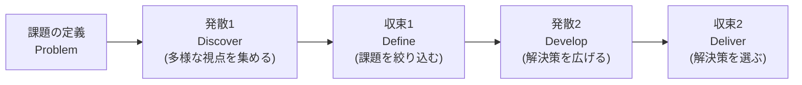

> **ベストプラクティス:** 発散フェーズでは「ブレインストーミングのルール（批判しない、量を求める、突飛な意見を歓迎する）」を明示し、収束フェーズでは「ドット投票 (dot voting)」や「Fist of Five（5本指投票）」のような軽量な意思決定手法を使うことで、両フェーズの切り替えをチームに明確に伝えることができます。

<!-- -->

> **ソース:** [Design Council (UK) — Double Diamond](https://www.designcouncil.org.uk/our-resources/the-double-diamond/)

### LO 2.2: 複数の視点を統合する際の課題を最低3つ識別する

**初学者向け解説:** Scrum Team、Product Owner、ステークホルダー、経営層など、複数の視点を1つの会議やディスカッションでまとめる際には、以下のような課題が生じやすくなります。

| 課題 | 内容 | 対処のヒント |
|------|------|-------------|
| 力関係の非対称性 | 経営層や声の大きいメンバーの意見が優先されやすい | ラウンドロビン方式や匿名投票で発言機会を平等にする |
| 専門用語のギャップ | 技術者とビジネス側で使う言葉の意味が異なる | 共通言語（ユビキタス言語）を確立し、都度言い換えを行う |
| 隠れた対立 | 表面化していない利害の対立がある | 1on1で事前ヒアリングを行い、会議前に温度感を把握する |
| 情報の非対称性 | 参加者ごとに持っている情報量が異なる | 会議前に事前資料を共有し、開始時に前提をそろえる |

> **ソース:** [IAF Core Competencies](https://iaf-world.org/the-iaf-core-competencies/)

### LO 2.3: 効果的な会議・イベントのためのファシリテーティブ・リスニング技法を最低2つ適用する

**初学者向け解説:** 「ファシリテーティブ・リスニング (Facilitative Listening)」とは、単に話を聞くだけでなく、グループの合意形成やアイデアの深掘りを助けるための能動的な傾聴技法です。

| 技法 | 内容 |
|------|------|
| **パラフレーズ (Paraphrasing)** | 発言者の言葉を自分の言葉で言い換えて確認し、全員の理解を揃える |
| **要約 (Summarizing)** | 複数の発言をまとめて、議論の現在地を可視化する |
| **明確化のための質問 (Clarifying Questions)** | 曖昧な発言に対して「具体的にはどういうことですか？」と深掘りする |
| **感情の反映 (Reflecting Feelings)** | 発言の背後にある感情（不安・懸念など）を言語化して場に出す |

> **ベストプラクティス:** ファシリテーターは「自分の意見を言わない」ことに徹し、グループ自身が答えにたどり着けるよう質問と要約に徹することが重要です。これは中立性 (Neutrality) の原則とも呼ばれます。

<!-- -->

> **ソース:** [IAF Core Competencies](https://iaf-world.org/the-iaf-core-competencies/)

### LO 2.4: オープンディスカッションの代替手法を最低2つ実演する

**初学者向け解説:** 「自由に発言してください」というオープンディスカッションは、声の大きい人だけが発言し、内向的なメンバーの意見が埋もれるリスクがあります。**Liberating Structures** はこの問題を解決するための代替手法（マイクロストラクチャー）を数多く提供しています。

| 手法 | 概要 |
|------|------|
| **1-2-4-All** | 個人で考える(1)→ペアで話す(2)→4人グループで統合する(4)→全体で共有する(All)というステップで、全員の意見を漏れなく引き出す |
| **Silent Writing (無言のブレインストーミング)** | 発言の前に付箋やドキュメントに個人で書き出す時間を設け、同調圧力を減らす |
| **World Café** | 小グループでのテーブルディスカッションを何ラウンドかローテーションしながら知見を混ぜ合わせる |
| **Fishbowl** | 内側の少人数が議論し、外側のメンバーは観察する形式を交代しながら進める |

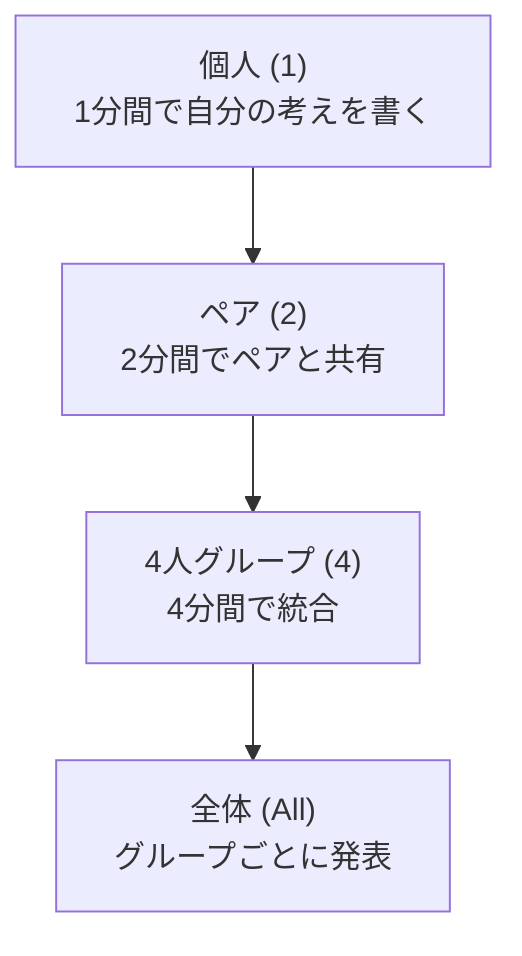

> **ベストプラクティス:** オープンディスカッションが停滞している、あるいは一部の声だけが支配的だと感じたら、まず 1-2-4-All に切り替えてみましょう。ファシリテーション経験がなくても実施できるシンプルさが特徴です。

<!-- -->

> **ソース:** [Liberating Structures](https://www.liberatingstructures.com/) / [Liberating Structures — Design Elements](https://www.liberatingstructures.com/design-elements/)

### LO 2.5: Scrum Master がファシリテーターとして振る舞うべきでない例を2つ説明する

**初学者向け解説:** Scrum Master は「常にファシリテーターであるべき」わけではありません。以下のような状況では、あえてファシリテーター役を降りる、あるいは他者に委ねることが望ましいとされます。

| 状況 | 理由 |
|------|------|
| Scrum Master 自身が議論の当事者・利害関係者である場合（例: 自分が提案した変更についての合意形成） | 中立性を保てず、無意識に議論を誘導してしまうリスクがあるため |
| チームが既に高い自己組織化能力を持ち、自分たちでファシリテートできる状態にある場合 | Scrum Master が介入し続けると、チームの自律的な成長を妨げる（過保護になる）ため |

> **ベストプラクティス:** 自分が当事者になる議論では、外部のファシリテーター（他チームの Scrum Master など）に依頼する「ファシリテーターの互助」の仕組みを組織内に作ることが有効です。

<!-- -->

> **ソース:** [Scrum Guide (2020)](https://scrumguides.org/scrum-guide.html) — Scrum Master の役割は「サーバントリーダー」であり、常に議論の中心に立つことを意味しない旨が示されています。

### LO 2.6: 最低2つの協働イベントを設計・ファシリテートする

**初学者向け解説:** 「協働イベント (Collaborative Event)」とは、Sprint Planning や Retrospective のような定例イベントだけでなく、リスク特定ワークショップ、ユーザーストーリーマッピング、インセプションデッキ作成会など、目的に応じて設計するセッション全般を指します。設計時には以下の要素を明確にすることが重要です。

| 設計要素 | 問い |
|---------|------|
| 目的 (Purpose) | このセッションで何を達成したいか？ |
| 参加者 (Who) | 誰の視点が必要か？ |
| プロセス (How) | 発散→収束のどの手法を使うか？ |
| 成果物 (Output) | セッション終了時に何が手元に残るべきか？ |
| タイムボックス (When) | 各アクティビティに何分割り当てるか？ |

> **ベストプラクティス:** セッション設計時には「アジェンダ」ではなく、Liberating Structures の **Design Storyboards**（複数のマイクロストラクチャーをつなげた一連の流れ＝ **string** を、設計図として時系列に描き起こしたもの）を作り、各アクティビティの目的と所要時間を明示しておくと、当日の進行がぶれません。単なる議題の羅列ではなく、「どの活動で何を引き出すか」を設計するための流れ図である点が違いです。

<!-- -->

> **ソース:** [IAF Core Competencies](https://iaf-world.org/the-iaf-core-competencies/)

### LO 2.7: 明確なコミュニケーションの障害を解決する戦略を最低1つ選択する

**初学者向け解説:** チーム内のコミュニケーション障害の代表的な原因と、それに対応する戦略の例です。

| 障害の原因 | 戦略 |
|-----------|------|
| リモート/分散環境での非言語情報の欠如 | カメラオンの原則、バーチャルホワイトボードの活用 |
| 専門用語・部門文化の違い | 用語集（Glossary）の共同作成、ユビキタス言語の確立 |
| 心理的安全性の欠如 | Working Agreement（作業合意）にコミュニケーションのグラウンドルールを明記する |
| 情報の一方向的な流れ | デイリースクラムの目的を「報告会」から「同期と計画の場」へ再定義する |

> **ソース:** [Scrum Guide (2020)](https://scrumguides.org/scrum-guide.html)

### LO 2.8: 明確なコミュニケーションとチームワークを促進する作業合意 (Working Agreement) を作成する

**初学者向け解説:** **Working Agreement（作業合意／チーム規範）** とは、チームが自分たちで決める「一緒に働く上でのルール」です。Scrum Guide には明記されていませんが、実務上は Definition of Done と並んで自己組織化を支える重要な成果物とされています。

**Working Agreement に含まれる代表的な項目:**

- コアタイム・稼働時間帯の合意
- 会議への遅刻・欠席時のルール
- Pull Request のレビュー担当・タイムアウト
- 「完了」の共通認識（Definition of Done とは別に、日々のタスクレベルでの合意）
- 対立が起きた際のエスカレーションルール

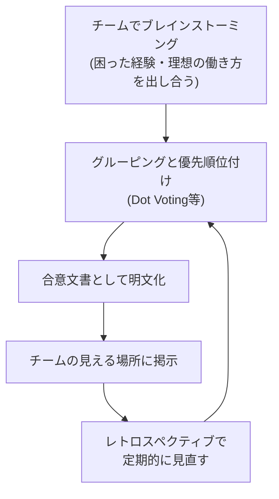

> **ベストプラクティス:** Working Agreement は一度作って終わりではなく、レトロスペクティブのたびに「今も機能しているか」を確認し、必要に応じて更新する「生きたドキュメント」として扱いましょう。押し付けではなく、チーム自身が作成・改訂することが自己組織化の観点で重要です。

<!-- -->

> **ソース:** [Scrum Guide (2020)](https://scrumguides.org/scrum-guide.html) / [Liberating Structures](https://www.liberatingstructures.com/)

---

<a id="chapter5"></a>

## 第5章: カテゴリー2-B — Scrum Master Core Competencies: Coaching and Training (LO 2.9–2.12)

### LO 2.9: コーチング・スタンスの要素を最低3つ説明する

**初学者向け解説:** 「コーチング・スタンス (Coaching Stance)」とは、コーチが相手と向き合う際の基本姿勢のことです。International Coaching Federation (ICF) の Core Competencies を参考にすると、以下のような要素が挙げられます。

| 要素 | 説明 |
|------|------|
| **答えを与えない (Not providing the answer)** | 相手が自分自身で答えを見つけられるよう、質問を通じて導く |
| **信頼と安全の醸成 (Cultivates Trust and Safety)** | 相手が安心して本音を話せる関係を築く |
| **積極的傾聴 (Listens Actively)** | 言葉だけでなく、感情・エネルギーの変化にも注意を払う |
| **気づきの喚起 (Evokes Awareness)** | 相手が自ら新しい視点に気づけるような問いを投げかける |
| **クライアントの成長を促進する (Facilitates Client Growth)** | 学びを行動に変換する支援をする |

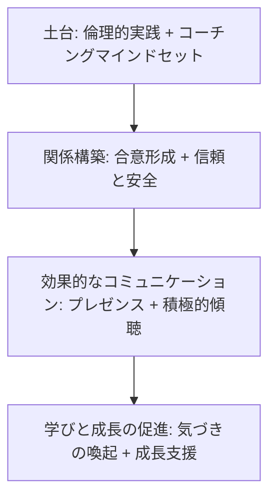

> **ベストプラクティス:** コーチング・スタンスは「ティーチング（教える）」「メンタリング（経験を伝える）」とは明確に異なります。A-CSM の Scrum Master は、状況に応じてこの3つのモード（コーチング・メンタリング・ティーチング）を意図的に使い分ける必要があります。

<!-- -->

> **ソース:** [ICF Core Competencies](https://coachingfederation.org/credentialing/coaching-competencies/icf-core-competencies/)

### LO 2.10: 2つの介入 (Intervention) に対して適切なコーチング技法を適用する

**初学者向け解説:** 「介入」とは、チームやメンバーが困難に直面している場面で Scrum Master が働きかける行為全般を指します。介入の技法は状況によって使い分けます。

| 介入の場面 | 適したコーチング技法 |
|-----------|---------------------|
| チームが対立を避けて表面的な合意に流れている | パワフルクエスチョン（例:「本当に懸念していることは何ですか？」）を投げかけ、対立を安全に表面化させる |
| メンバーが自信を失い、意思決定を Scrum Master に委ねようとする | GROWモデル（Goal・Reality・Options・Will）に沿って本人に選択肢を出させ、決定は本人に委ねる |

**GROW モデルの流れ:**

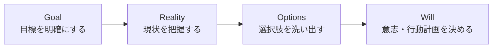

> **ソース:** [ICF Core Competencies](https://coachingfederation.org/credentialing/coaching-competencies/icf-core-competencies/)

### LO 2.11: 介入を分析し、最低2つの改善点を特定する

**初学者向け解説:** コーチングの介入は一度きりで終わらせず、振り返りを行うことでスキルを磨いていきます。振り返りの観点の例:

| 振り返りの観点 | 問い |
|--------------|------|
| 質問の質 | 誘導的な質問（Yes/Noで答えられる質問）になっていなかったか？ オープンクエスチョンだったか？ |
| 沈黙の扱い | 相手が考えている沈黙を、焦って埋めてしまわなかったか？ |
| 中立性 | 自分の意見やアドバイスを無意識に押し付けていなかったか？ |
| フォローアップ | 介入後にその後の変化を確認するフォローアップを行ったか？ |

> **ベストプラクティス:** コーチング仲間同士で「ピアコーチング」を行い、お互いの介入を観察してフィードバックし合う「コーチングクラブ」を組織内に作ることで、継続的にスキルを向上させることができます。

<!-- -->

> **ソース:** [ICF Core Competencies](https://coachingfederation.org/credentialing/coaching-competencies/icf-core-competencies/)

### LO 2.12: ビジネスステークホルダーに Scrum とそのメリットを説明する

**初学者向け解説:** 技術的な背景を持たないビジネスステークホルダーに Scrum を説明する際は、専門用語（Sprint、Backlog など）をそのまま使うのではなく、ビジネス上の価値に翻訳して伝えることが重要です。

| Scrum の要素 | ビジネス視点での説明 |
|-------------|---------------------|
| Sprint（短い開発サイクル） | 「最大でも数週間ごとに、動く成果物を確認できるので、方向性のズレを早期に修正できます」 |
| Product Backlog の優先順位付け | 「限られたリソースを、最もビジネス価値の高い項目から投資できます」 |
| Sprint Review | 「完成前の段階で頻繁にフィードバックを得られるため、手戻りのリスクを減らせます」 |
| 透明性 | 「進捗状況が常に可視化されているため、意思決定のための正確な情報が得られます」 |

> **ベストプラクティス:** 抽象的な説明よりも「もし今のやり方（ウォーターフォール型）なら〜だったが、Scrum ならこう変わる」という Before/After の対比で語ると、ビジネスステークホルダーの腹落ち感が高まります。

<!-- -->

> **ソース:** [Manifesto for Agile Software Development](https://agilemanifesto.org/) / [Scrum Guide (2020)](https://scrumguides.org/scrum-guide.html)

---

<a id="chapter6"></a>

## 第6章: カテゴリー3-A — Service to the Scrum Team: Self-Management and Team Dynamics (LO 3.1–3.4)

### LO 3.1: 効果的な自己管理型チームの属性を最低3つ説明する

**初学者向け解説:** 2020年版 Scrum Guide では、それまでの「自己組織化 (Self-Organizing)」という表現が「自己管理 (Self-Managing)」に置き換えられました。自己管理型チームとは、「誰が」「何を」「どのように」行うかを、チーム自身が内部で選択できるチームを指します。

| 属性 | 説明 |
|------|------|
| 明確な目的意識 | Product Goal や Sprint Goal に対する当事者意識を持っている |
| 相互信頼 | メンバー同士が互いのスキルと判断を信頼している |
| 心理的安全性 | 失敗や懸念を率直に話せる雰囲気がある |
| 説明責任の共有 | 結果に対する責任を個人ではなくチーム全体で引き受ける |
| 継続的な学習意欲 | レトロスペクティブでの改善提案を自ら実行する |

> **ソース:** [Scrum Guide (2020)](https://scrumguides.org/scrum-guide.html)

### LO 3.2: チームの自己管理能力を向上させる技法を適用する

**初学者向け解説:** 自己管理能力は自然に育つものではなく、意図的な働きかけによって育成されます。

| 技法 | 内容 |
|------|------|
| **意思決定の権限移譲** | Scrum Master が決めていたこと（例: タスクの割り振り）を段階的にチームに委ねる |
| **デリゲーションポーカー** | 意思決定の権限レベル（指示する〜委任する、の7段階）をチームと合意する軽量な手法 |
| **障害物の可視化と自己解決の促進** | Scrum Master がすべての障害物を代わりに解決するのではなく、まずチーム自身で解決を試みるよう促す |

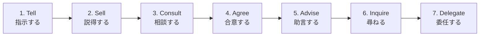

> **ベストプラクティス:** デリゲーションポーカーの7段階を使い、意思決定の種類ごと（例: 技術選定、採用面接への参加、休暇の調整）に現在のレベルと目指すべきレベルをチームで話し合うワークショップを定期的に実施すると、権限移譲が段階的かつ透明に進みます。

<!-- -->

> **ソース:** [Scrum Guide (2020)](https://scrumguides.org/scrum-guide.html)

### LO 3.3: チームとワーキンググループの違いを説明する

**初学者向け解説:** 「チーム (Team)」と「ワーキンググループ (Working Group)」は似ているようで本質的に異なります。

| 観点 | ワーキンググループ | チーム |
|------|-------------------|--------|
| 目標 | 個人ごとの目標の集合 | 共有された1つの目標 |
| 成果責任 | 個人が自分の担当分に責任を持つ | チーム全体で成果に責任を持つ |
| 相互依存性 | 低い（各自が独立して作業） | 高い（協働しないと成果が出ない） |
| コミュニケーション | 情報共有が中心 | 共同での問題解決が中心 |

> **ベストプラクティス:** Scrum Team が「ワーキンググループ」の状態（各自がタスクを個別にこなすだけ）に陥っていないかを見極めるために、「もし1人が抜けたら、他のメンバーはその作業を引き継げるか？」という問いをチェックポイントとして使うとよいでしょう。

<!-- -->

> **ソース:** [Scrum Guide (2020)](https://scrumguides.org/scrum-guide.html)

### LO 3.4: チーム形成・発展のための多段階モデルを最低1つ説明する

**初学者向け解説:** チームの成長段階を説明する代表的なモデルが、心理学者 Bruce Tuckman が1965年に提唱した **Forming - Storming - Norming - Performing（+ 1977年追加の Adjourning）** モデルです。

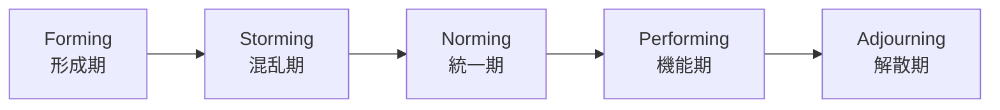

| 段階 | 特徴 | Scrum Master の関わり方 |
|------|------|------------------------|
| Forming（形成期） | メンバーは礼儀正しく、様子見の状態。役割や目的への不安がある | 明確な目的・役割・グラウンドルールを提示する |
| Storming（混乱期） | 意見の対立や、リーダーへの疑問が表面化する | 対立を無理に鎮めず、安全に議論できる場を作る（LO 6.2 参照） |
| Norming（統一期） | 役割分担が定まり、協力関係が生まれる | チームが決めたルール・合意を尊重し、後押しする |
| Performing（機能期） | チームが自律的に高いパフォーマンスを発揮する | 介入を最小限にし、障害物の除去に徹する |
| Adjourning（解散期） | プロジェクト終了やメンバー入れ替えでチームが解散する | 振り返りと労いの場を設ける |

> **ベストプラクティス:** 新しいメンバーが加入するたびに、チームは実質的に Forming に戻ることを理解しておきましょう。焦って Performing の状態を維持しようとせず、段階を経ることを許容する姿勢が重要です。

<!-- -->

> **ソース:** [Tuckman's stages of group development — infed.org (原論文の解説)](https://infed.org/dir/welcome/bruce-w-tuckman-forming-storming-norming-and-performing-in-groups/)

---

<a id="chapter7"></a>

## 第7章: カテゴリー3-B — Service to the Scrum Team: Definition of Done and Development Practices (LO 3.5–3.8)

### LO 3.5: 強力な Definition of Done (DoD) の作成・改善をファシリテートする

**初学者向け解説:** **Definition of Done (完成の定義)** は、Increment（インクリメント）が「完成した」と言えるための品質基準を定めた正式な記述です。Scrum Guide (2020) では、DoD は Scrum Team 全体で作成・共有される「コミットメント」の1つと位置づけられています。

**DoD 作成・改善のファシリテーションステップ:**

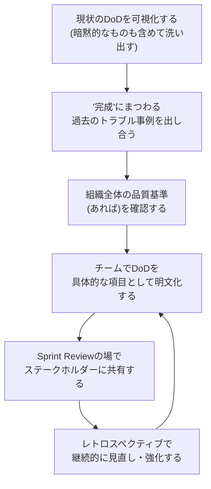

| DoD に含まれる代表的な項目例（ソフトウェアの場合） |
|---|
| コードレビューが完了している |
| 単体テスト・自動テストが通過している |
| ドキュメントが更新されている |
| （任意・文脈依存）プロダクトオーナーによる受け入れ確認が完了している — Scrum が定める DoD の要件ではなく、組織やプロダクトの事情に応じて加える運用上のコントロール |
| 本番相当の環境にデプロイ可能な状態である |

> **ベストプラクティス:** DoD は一度作ったら固定するのではなく、チームの技術力や組織の期待水準が上がるにつれて、より厳格な基準へと「強化」していくべきものです。逆に緩めることは品質の後退を意味するため慎重に扱いましょう。

<!-- -->

> **ソース:** [Scrum Guide (2020) — Definition of Done](https://scrumguides.org/scrum-guide.html)

### LO 3.6: 非ソフトウェア製品における Definition of Done の定式化方法を説明する

**初学者向け解説:** Scrum はソフトウェア開発以外の領域（マーケティング、人事、教育、ハードウェア開発など）でも活用されています。非ソフトウェア製品における DoD の考え方の例:

| 領域 | DoD の例 |
|------|---------|
| マーケティングキャンペーン | クリエイティブが法務レビューを通過している／効果測定用のトラッキングが設定されている／関係部署の承認が得られている |
| 研修コンテンツ制作 | 教材が実際の受講者グループでパイロットテストされている／講師用のファシリテーションガイドが完成している |
| ハードウェアプロトタイプ | 安全基準テストに合格している／必要な認証プロセスの初期審査を通過している |

> **ベストプラクティス:** 非ソフトウェア領域では「完成」の基準があいまいになりがちです。DoD 作成時に「これが完成していないのに次の工程に進んだ場合、過去にどんな問題が起きたか」を洗い出すことで、抜け漏れのない DoD を作りやすくなります。

<!-- -->

> **ソース:** [Scrum Guide (2020)](https://scrumguides.org/scrum-guide.html) — Scrum は「あらゆる複雑な仕事」に適用可能なフレームワークとして記述されています。

### LO 3.7: 開発プラクティスが Scrum Team の価値あるインクリメント提供能力に与える影響を最低2つ説明する

**初学者向け解説:** Scrum はプロセスの「What/When」を規定しますが、「How（技術的にどう作るか）」までは規定していません。しかし、技術的なプラクティスの質は、Scrum Team が毎スプリント価値あるインクリメントを届けられるかどうかに直結します。

| 開発プラクティス | インクリメント提供能力への影響 |
|-----------------|-------------------------------|
| 継続的インテグレーション/継続的デリバリー (CI/CD) | 統合の手戻りを減らし、毎スプリントのリリース可能な状態を維持しやすくする |
| テスト駆動開発 (TDD) / 自動テスト | 品質の作り込みにより「一見完成しているが実は壊れている」インクリメントを防ぐ |
| リファクタリングとクリーンコード | 技術的負債の蓄積を防ぎ、将来のスプリントでの開発速度低下を防ぐ |

> **ソース:** [Scrum Guide (2020)](https://scrumguides.org/scrum-guide.html) — 開発プラクティスの重要性は Scrum Guide 自体には詳述されていませんが、"Scrum Team の Done の定義を支える" 文脈で言及されています。

### LO 3.8: 複数チーム環境における開発プラクティスの有用性を説明する

**初学者向け解説:** 複数の Scrum Team が1つのプロダクトに関わる環境（スケーリングされた環境）では、開発プラクティスの重要性がさらに増します。

| 状況 | 開発プラクティスがもたらす価値 |
|------|-------------------------------|
| 複数チームが同じコードベースを触る | 継続的インテグレーションがないと、統合時のコンフリクトやデグレードが頻発する |
| 各チームが異なる Definition of Done を持つ | 統一されたコーディング規約・自動テスト基盤がないと、「Done」の意味がチーム間でバラバラになる |
| リリースの同期が必要 | 自動化されたデプロイパイプラインがないと、複数チームの成果物を1つの Integrated Increment としてまとめるコストが跳ね上がる |

> **ベストプラクティス:** 複数チーム環境では、共通の DoD（Nexus における "Definition of Done" の統一）と、共有の CI/CD 基盤への投資を早期に行うことが、スケーリングの成否を分けます。

<!-- -->

> **ソース:** [The Nexus Guide](https://www.scrum.org/resources/nexus-guide)

---

<a id="chapter8"></a>

## 第8章: カテゴリー4 — Service to the Product Owner (LO 4.1–4.4)

### LO 4.1: プロダクトビジョンと Product Goal の関係を説明する

**初学者向け解説:** **Product Vision（プロダクトビジョン）** は、プロダクトが最終的に目指す長期的な姿を表す、いわば「北極星」です。**Product Goal（プロダクトゴール）** は、2020年版 Scrum Guide で新たに Product Backlog のコミットメントとして追加された概念で、ビジョンに向かう途中の「次のマイルストーン」にあたります。

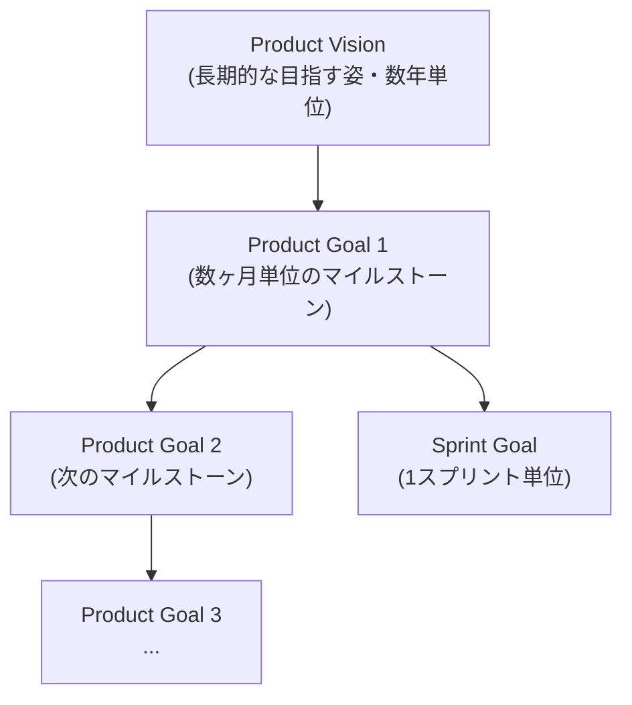

| 要素 | 時間軸 | 例 |
|------|--------|-----|
| Product Vision | 数年 | 「あらゆる中小企業が専門知識なしに経理を自動化できる世界」 |
| Product Goal | 数ヶ月 | 「フリーランス向け請求書機能をリリースし、有料転換率10%を達成する」 |
| Sprint Goal | 1スプリント | 「請求書テンプレートのカスタマイズ機能を完成させる」 |

> **ソース:** [Scrum Guide (2020) — Product Goal](https://scrumguides.org/scrum-guide.html)

### LO 4.2: Scrum Team とステークホルダーとともに Product Goal を検討・改良する

**初学者向け解説:** Product Goal を定めることに説明責任を持つのは Product Owner ですが、その内容は Scrum Team やステークホルダーとの対話を通じて磨かれていくべきものです。決定の責任者は Product Owner であり、対話はその判断の質を高めるためのものである、という関係を取り違えないことが重要です。A-CSM の Scrum Master は、この対話をファシリテートする役割を担います。

**ファシリテーションの流れの例:**

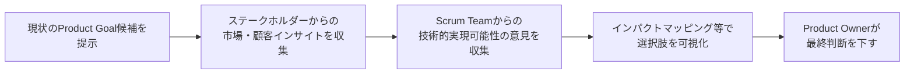

> **ベストプラクティス:** 「インパクトマッピング (Impact Mapping)」のような手法を使うと、「なぜ (Why)」「誰に (Who)」「どう変化してほしいか (How)」「何を作るか (What)」の階層構造で Product Goal をステークホルダーと一緒に検討でき、独りよがりなゴール設定を防げます。

<!-- -->

> **ソース:** [Scrum Guide (2020)](https://scrumguides.org/scrum-guide.html)

### LO 4.3: Product Goal の達成を支える Product Backlog を作成する

**初学者向け解説:** Product Backlog は単なる「やることリスト」ではなく、Product Goal を達成するための「計画」として機能する必要があります。

| 良い Product Backlog の特徴（DEEP の原則） | 説明 |
|---|---|
| **D**etailed appropriately（適切な詳細度） | 直近の項目は詳細に、将来の項目は粗く記述する |
| **E**stimated（見積もられている） | 相対的な規模感が見積もられている |
| **E**mergent（創発的） | 学びに応じて常に変化・進化する |
| **P**rioritized（優先順位付けされている） | Product Goal への貢献度に基づいて並び替えられている |

> **ソース:** [Scrum Guide (2020) — Product Backlog](https://scrumguides.org/scrum-guide.html)

### LO 4.4: Product Backlog のリファインメント (Refinement) の手法を最低1つ実践する

**初学者向け解説:** **リファインメント (Refinement)** とは、Product Backlog の項目に詳細・見積もり・順序を追加していく継続的な活動です。2020年版 Scrum Guide では正式なイベントではなく「継続的な活動」として位置づけられています。

| 手法 | 概要 |
|------|------|
| **ユーザーストーリーマッピング (Story Mapping)** | ユーザーの行動フローに沿って機能を並べ、優先順位とリリース単位を可視化する |
| **プランニングポーカー (Planning Poker)** | チーム全員で相対見積もりを行い、認識のズレを対話で解消する |
| **INVEST 基準によるレビュー** | ストーリーが独立している (Independent)・交渉可能 (Negotiable)・価値がある (Valuable)・見積もり可能 (Estimable)・小さい (Small)・テスト可能 (Testable) かをチェックする |

> **ベストプラクティス:** リファインメントを「Sprint 終盤のイベント」として一括で行うのではなく、Sprint 期間を通じて少しずつ（例: 週に数十分）継続的に実施することで、Sprint Planning がスムーズになります。

<!-- -->

> **ソース:** [Scrum Guide (2020) — Product Backlog Refinement](https://scrumguides.org/scrum-guide.html) / Jeff Patton, *User Story Mapping* の概念

---

<a id="chapter9"></a>

## 第9章: カテゴリー5-A — Service to the Organization: 組織的障害 (LO 5.1–5.2)

### LO 5.1: 組織的障害の根本原因を解決する実践を行う

**初学者向け解説:** チームレベルの障害（例: テスト環境が遅い）は Scrum Master がその場で対処できることが多い一方、**組織的障害 (Organizational Impediment)** は組織の構造・ポリシー・文化に根ざしており、根本原因の特定が不可欠です。代表的な手法が「なぜなぜ分析 (5 Whys)」です。

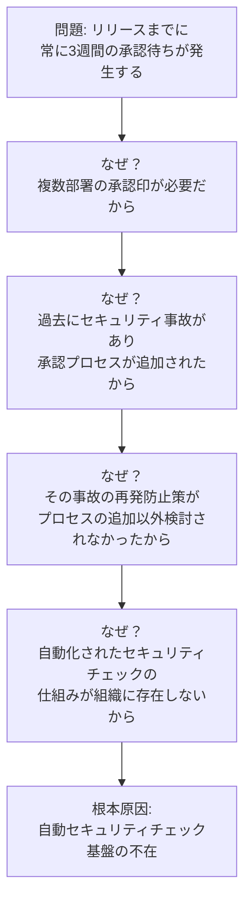

> **ベストプラクティス:** 「なぜなぜ分析」を1人で行うのではなく、関係する複数部署の担当者を巻き込んで行うことで、部署ごとの思い込みや責任転嫁を防ぎ、真の根本原因にたどり着きやすくなります。また、根本原因への対処には時間がかかることが多いため、短期的な緩和策と長期的な根本対策を分けて計画することが重要です。

<!-- -->

> **ソース:** [Scrum Guide (2020)](https://scrumguides.org/scrum-guide.html) — Scrum Master の組織へのサービスとして「組織的な障害の除去」が明記されています。

### LO 5.2: 最新の Scrum の定義を採用した場合の影響を最低3つ議論する

**初学者向け解説:** Scrum Guide は定期的に改訂されており（直近は2020年）、最新の定義には過去との重要な違いがあります。組織やチームが最新版を採用する際、以下のような影響が考えられます。

| 変更点（2017年版→2020年版の例） | 想定される影響 |
|---|---|
| Development Team という区分の廃止（全員が Scrum Team のメンバー） | 「開発者」と「その他」という上下関係的な認識が薄れ、フラットなチーム文化が促進される可能性がある |
| Product Goal の新設 | Sprint Goal だけでは見えなかった中期的な方向性が明確になり、Product Backlog の優先順位判断がしやすくなる |
| 自己組織化 (Self-Organizing) → 自己管理 (Self-Managing) への変更 | チームが「誰が何を担当するか」だけでなく「どのように仕事をするか」まで裁量を持つべきという期待が強まる |

> **ベストプラクティス:** 新しい定義を採用する際は、いきなり全社的なルール変更として展開するのではなく、まず1〜2チームで試験的に適用し、実際の影響（LO 5.2 で問われる「影響の議論」）を観察してから展開範囲を広げるアプローチが安全です。

<!-- -->

> **ソース:** [Scrum Guide (2020)](https://scrumguides.org/scrum-guide.html)

---

<a id="chapter10"></a>

## 第10章: カテゴリー5-B — Service to the Organization: Scaling Scrum (LO 5.3–5.6)

### LO 5.3: Scrum をスケールするアプローチを最低2つ認識する

**初学者向け解説:** 複数の Scrum Team が1つのプロダクトに関わる必要が出てきたとき、いくつかのスケーリングフレームワークが選択肢になります。代表的な3つを紹介します。

| フレームワーク | 提供元 | 特徴 |
|---------------|--------|------|
| **Nexus** | Scrum.org (Ken Schwaber) | Scrum を「最小限」拡張。3〜9チーム程度を想定し、Nexus Integration Team が統合を担う |
| **LeSS (Large-Scale Scrum)** | Craig Larman & Bas Vodde | 「より少なく、より多くを (more with LeSS)」という思想で、単一の Product Backlog・単一の Product Owner・単一の Sprint に多数のチームを乗せる |
| **SAFe (Scaled Agile Framework)** | Scaled Agile, Inc. | 企業全体（ポートフォリオ〜チームレベル）を対象とした、より包括的で規範的なフレームワーク |

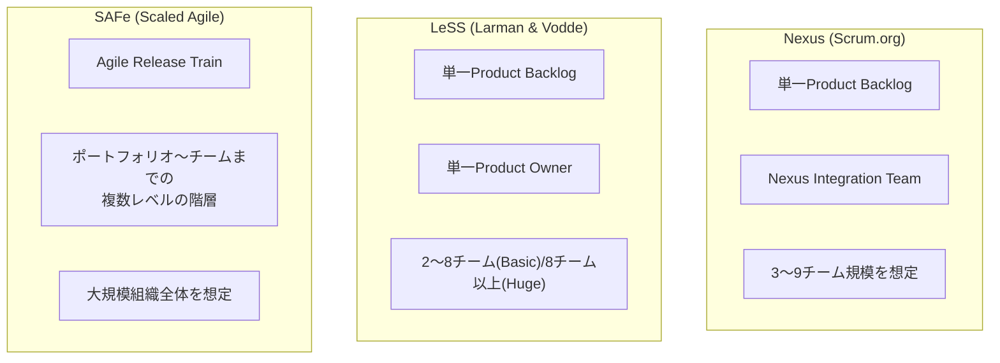

> **ソース:** [The Nexus Guide](https://www.scrum.org/resources/nexus-guide) / [LeSS — Introduction](https://less.works/less/framework) / [Scaled Agile Framework](https://scaledagileframework.com/)

### LO 5.4: 組織がスケールしないことを選択する理由を最低2つ説明する

**初学者向け解説:** スケーリングフレームワークの導入が常に正解とは限りません。以下のような理由で「あえてスケールしない」選択が合理的な場合があります。

| 理由 | 説明 |
|------|------|
| チーム分割前にプロダクトの複雑さの削減余地がある | アーキテクチャや機能自体を見直し、単一チームで扱える規模に縮小できる可能性がある |
| スケーリングの導入・運用コストがプロダクト価値を上回る | フレームワーク導入には教育・調整コストがかかるため、小規模プロダクトでは投資対効果が見合わないことがある |
| 組織文化・成熟度が追いついていない | LeSS や Nexus は高い自己管理能力を前提とするため、土台が整う前に導入すると形骸化するリスクがある |

> **ベストプラクティス:** 「本当にスケールが必要か？」を問う前に、まず「1つのチームでできる範囲を最大化できないか（コンポーネントの削減、依存関係の解消）」を検討するのが LeSS の思想である「より少なく (More with LeSS)」の精神です。

<!-- -->

> **ソース:** [LeSS — Principles Overview](https://less.works/less/principles) — 「まず1つのチームでうまくいく仕組みを作り、そこからスケールする」という原則

### LO 5.5: 依存関係を可視化・管理・削減する技法を最低2つ識別する

**初学者向け解説:** 複数チーム環境における最大の課題の一つが「依存関係」です。以下のような技法で対処します。

| 技法 | 概要 |
|------|------|
| **依存関係ボード / Dependency Board** | チーム間の依存関係を可視化するボードを作成し、Nexus の Cross-Team Refinement などで定期的に更新する |
| **Feature Team 化** | コンポーネント単位ではなく機能（フィーチャー）単位でチームを構成し、そもそも依存関係が生まれない構造にする |
| **Thin Slicing（薄いスライス化）** | Product Backlog Item をできるだけ小さく分割し、依存の影響範囲を最小化する |
| **X-as-a-Service インタラクション** | Team Topologies が提唱する、チーム間のやり取りを「サービス提供者と利用者」の関係に定義し、依存を明示的・非同期的に管理する |

> **ベストプラクティス:** 依存関係は「なくす」ことが理想ですが、完全になくせない場合は「見える化」するだけでも大きな効果があります。依存を暗黙のまま放置することが、複数チーム環境で最も危険な状態です。

<!-- -->

> **ソース:** [The Nexus Guide](https://www.scrum.org/resources/nexus-guide) / [Team Topologies — Key Concepts](https://teamtopologies.com/key-concepts)

### LO 5.6: フィーチャーチームとコンポーネントチームの利点・欠点を最低3つずつ説明する

**初学者向け解説:** チーム編成の代表的な2つのアプローチを比較します。

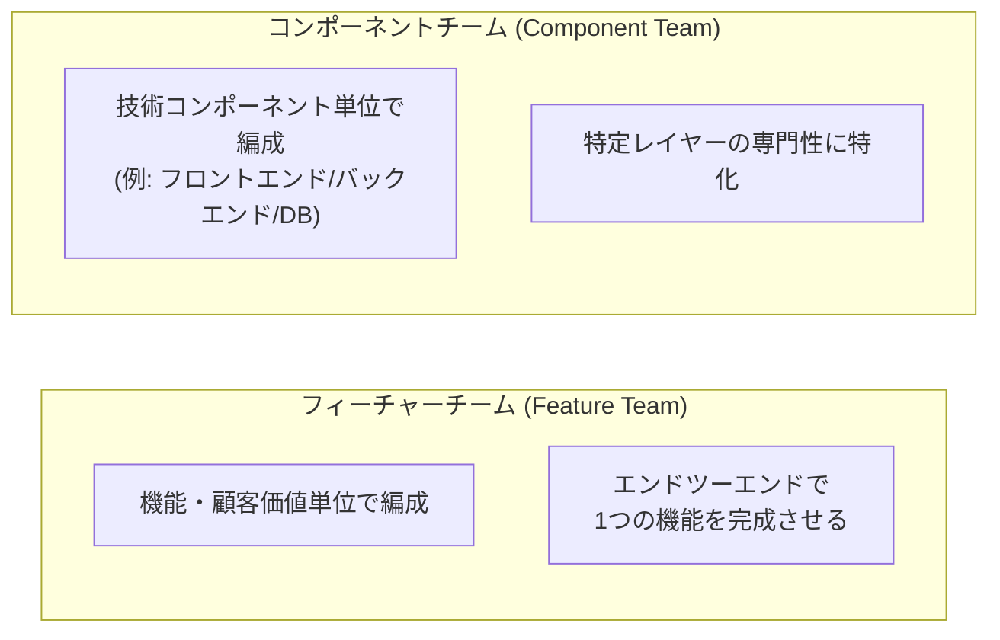

| 観点 | フィーチャーチーム | コンポーネントチーム |
|------|-------------------|----------------------|
| **利点** | エンドツーエンドの価値提供が速い／チーム間の依存が少ない／顧客価値への当事者意識が高い | 技術的専門性を深められる／同一技術領域内での一貫性を保ちやすい／大規模基盤への投資がしやすい |
| **欠点** | 幅広い技術スキルが要求される（T字型人材が必要）／技術的一貫性の維持が難しい場合がある | 機能完成のために複数チームの調整・依存が必要になる／顧客価値への当事者意識が薄れがち／統合のオーバーヘッドが大きい |

> **ベストプラクティス:** 一般的にはフィーチャーチームがフロー効率とスケーラビリティの観点で推奨されますが、真に複雑で専門性の高いサブシステム（例: 決済基盤、暗号化ライブラリ）は Team Topologies の「Complicated Subsystem Team（複雑なサブシステムチーム）」として独立させ、他のフィーチャーチームの認知負荷を下げるという併用パターンも実践的です。

<!-- -->

> **ソース:** [Team Topologies — Key Concepts](https://teamtopologies.com/key-concepts) / [The Nexus Framework for Scaling Scrum](https://www.scrum.org/resources/nexus-framework-scaling-scrum)

---

<a id="chapter11"></a>

## 第11章: カテゴリー5-C — Service to the Organization: Organizational Change (LO 5.7–5.8)

### LO 5.7: 複雑系の性質を説明する

**初学者向け解説:** 組織変革を成功させるには、まず「自分たちが扱っている問題がどんな種類の問題か」を見極める必要があります。**Cynefin フレームワーク**（Dave Snowden、1999年）は、問題を4つの領域（+ 無秩序）に分類する思考ツールです。

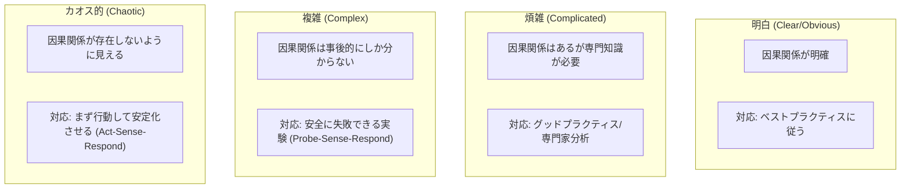

| 領域 | 組織における例 |
|------|----------------|
| 明白 (Clear) | 定型的な経費精算プロセス |
| 煩雑 (Complicated) | 大規模システムの移行計画（専門家の分析が有効） |
| 複雑 (Complex) | 組織文化の変革、新規プロダクトの市場適応（正解が事前にわからない） |
| カオス的 (Chaotic) | 重大インシデント発生直後の初動対応 |

> **ベストプラクティス:** 組織変革の多くは「複雑 (Complex)」領域に属します。この領域では、詳細な計画を立てて一気に実行するのではなく、小さな「安全に失敗できる実験 (Safe-to-Fail Probe)」を行い、結果を観察しながら次の一手を決める **Probe → Sense → Respond** のサイクルが有効です。

<!-- -->

> **ソース:** [The Cynefin Company — About the Cynefin Framework](https://thecynefin.co/about-us/about-cynefin-framework/) / Snowden, D. & Boone, M. "A Leader's Framework for Decision Making," *Harvard Business Review*, Nov 2007.

### LO 5.8: 組織変革を促進するアプローチを最低2つ説明する

**初学者向け解説:** 組織変革のアプローチとして、体系立ったモデルを1つ知っておくと、複雑な変革プロセスを構造的に説明・推進できます。ここでは John Kotter の **8段階の変革モデル** を紹介します。

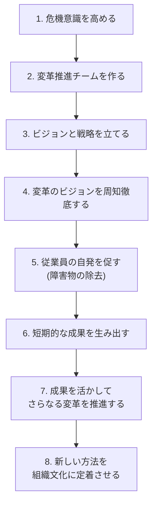

**もう1つのアプローチ: ボトムアップの実験的アプローチ（Cynefin の Probe-Sense-Respond に基づく）**

| Kotter型（トップダウン計画的） | ボトムアップ実験型 |
|-------------------------------|-------------------|
| 経営層主導で全社的な変革プログラムを設計する | 現場チームでの小さな実験（1チームでの Scrum 導入など）から始め、成功例を横展開する |
| 明確なビジョンと段階的な計画に基づいて進める | 「Safe-to-Fail Probe」を繰り返し、うまくいったパターンを増幅（amplify）し、うまくいかないパターンを減衰（dampen）させる |

> **ベストプラクティス:** A-CSM の Scrum Master は、組織変革を「一度きりのプロジェクト」ではなく「継続的なプロセス」として捉えるべきです。Kotter の8段階モデルもステップ7・8が示す通り、変革の定着には長い時間がかかることを組織に事前に伝えておくことが重要です。

<!-- -->

> **ソース:** [Kotter Inc. — The 8-Step Process for Leading Change](https://www.kotterinc.com/methodology/8-steps/) / [The Cynefin Company](https://thecynefin.co/about-us/about-cynefin-framework/)

---

<a id="chapter12"></a>

## 第12章: カテゴリー6-A — Scrum Mastery: Personal Development (LO 6.1–6.3)

### LO 6.1: 自身の Scrum 価値基準の実践度を分析し、改善方法を検討する

**初学者向け解説:** Scrum の5つの価値基準（確約 Commitment・勇気 Courage・集中 Focus・公開 Openness・尊敬 Respect）は、Scrum Team のメンバーだけでなく、Scrum Master 自身の内省の対象でもあります。

| 価値基準 | 自己内省の問い |
|---------|---------------|
| 確約 (Commitment) | 自分は Sprint Goal の達成にどれだけ当事者意識を持って関わっているか？ |
| 勇気 (Courage) | 難しいフィードバックを、恐れずに伝えられているか？ |
| 集中 (Focus) | 複数のチームやタスクに気を取られ、目の前のチームへの集中を欠いていないか？ |
| 公開 (Openness) | 自分自身の失敗や弱みをチームに開示できているか？ |
| 尊敬 (Respect) | 意見の異なるメンバーの視点を、本当に尊重できているか？ |

> **ベストプラクティス:** 定期的に（例えば四半期ごとに）この5つの価値基準について自己採点し、信頼できる同僚やコーチにフィードバックを求める「360度的な自己評価」を行うと、盲点に気づきやすくなります。

<!-- -->

> **ソース:** [Scrum Alliance — Scrum Values](https://www.scrumalliance.org/about-scrum/values)

### LO 6.2: 建設的な相互作用が破壊的な対立に転じる瞬間を認識する

**初学者向け解説:** 対立（Conflict）そのものは悪いものではなく、むしろ健全なチームには必要な要素です（Tuckman の Storming 期を思い出してください）。問題は、それが「建設的」な段階から「破壊的」な段階へと転じる瞬間を見逃すことです。

| 建設的な対立の兆候 | 破壊的な対立に転じた兆候 |
|-------------------|-------------------------|
| 意見（アイデア・アプローチ）についての対立 | 人格や個人攻撃に対する対立にすり替わる |
| 「もっと良い方法があるはず」という探求的な姿勢 | 「あなたが間違っている」という断定的な姿勢 |
| 対立後も関係性が保たれている | 対立が禍根を残し、その後のコミュニケーションを阻害する |

> **ベストプラクティス:** 対立が「人 vs 人」の構図になっていると感じたら、すぐに「課題 vs 私たち」の構図に引き戻すファシリテーションが有効です（例:「一度、意見ではなくホワイトボードに書かれた選択肢そのものに焦点を当てましょう」）。

<!-- -->

> **ソース:** [Tuckman's stages of group development](https://infed.org/dir/welcome/bruce-w-tuckman-forming-storming-norming-and-performing-in-groups/)

### LO 6.3: 自分のデフォルトの対立対応パターンを他の選択肢と比較する

**初学者向け解説:** **Thomas-Kilmann Conflict Mode Instrument (TKI)** は、対立への対応スタイルを「自己主張の強さ (Assertiveness)」と「協調性 (Cooperativeness)」という2軸で5つのモードに分類するフレームワークです。

```mermaid
flowchart TB
    Conflict["対立が発生"] --> Comp["競合 (Competing)<br/>自己主張:高 協調性:低"]
    Conflict --> Collab["協働 (Collaborating)<br/>自己主張:高 協調性:高"]
    Conflict --> Comprom["妥協 (Compromising)<br/>自己主張:中 協調性:中"]
    Conflict --> Avoid["回避 (Avoiding)<br/>自己主張:低 協調性:低"]
    Conflict --> Accom["受容 (Accommodating)<br/>自己主張:低 協調性:高"]
```

| モード | 適した状況 |
|--------|-----------|
| 競合 (Competing) | 迅速な決断が必要な緊急事態、譲れない原則に関わる場合 |
| 協働 (Collaborating) | 双方の利害を最大限満たす解決策を模索できる時間がある場合 |
| 妥協 (Compromising) | 双方が同等の力を持ち、時間的制約がある場合 |
| 回避 (Avoiding) | 問題が些細である、あるいは感情が高ぶりすぎている場合に一旦距離を置く |
| 受容 (Accommodating) | 関係性の維持が結果よりも重要な場合、自分が間違っていると分かった場合 |

> **ベストプラクティス:** 多くの人には「デフォルトのモード」（例えば常に回避する、あるいは常に競合する）がありますが、TKI の価値は「どのモードが優れているか」ではなく「状況に応じてモードを切り替えられるか」にあります。自分のデフォルトパターンを自覚した上で、意図的に別のモードを試す練習をしましょう。

<!-- -->

> **ソース:** [Kilmann Diagnostics — Overview of the TKI Assessment](https://kilmanndiagnostics.com/brief-overview-of-the-tki-assessment/)

---

<a id="chapter13"></a>

## 第13章: カテゴリー6-B — Scrum Mastery: Scrum Master as a True Leader (LO 6.4–6.5)

### LO 6.4: 効果的なリーダーの属性を最低3つ述べる

**初学者向け解説:** A-CSM における「リーダーシップ」は、指示命令型のマネジメントとは異なる **サーバントリーダーシップ (Servant Leadership)** の概念に強く根ざしています。Robert K. Greenleaf が1970年のエッセイ「The Servant as Leader」で提唱したこの概念では、リーダーはまず「奉仕したい」という自然な欲求から始まり、その結果として導く立場に至るとされます。

```mermaid
flowchart TB
    Center["真のリーダーとしての<br/>Scrum Master"] --> A1["奉仕への意志<br/>(Servant First)"]
    Center --> A2["他者の成長への<br/>コミットメント"]
    Center --> A3["先見性<br/>(Foresight)"]
    Center --> A4["説得力<br/>(Persuasion,<br/>権威ではなく)"]
    Center --> A5["コミュニティ意識の<br/>醸成"]
```

| 属性 | 説明 |
|------|------|
| 奉仕への意志 (Servant First) | 権力や地位を求めるのではなく、まず他者に奉仕したいという動機から始まる |
| 他者の成長へのコミットメント | チームメンバー個人の成長・自律を優先する |
| 先見性 (Foresight) | 現在の決定が将来にどう影響するかを見通す力 |
| 説得力（権威ではなく） | 地位による強制ではなく、対話と説得によって人を動かす |
| コミュニティ意識の醸成 | 個人の集合ではなく、真のコミュニティとしてのチームを育てる |

> **ソース:** [Greenleaf Center for Servant Leadership — What is Servant Leadership?](https://greenleaf.org/what-is-servant-leadership/)

### LO 6.5: リーダーの属性を最低1つ以上実演する

**初学者向け解説:** LO 6.4 で挙げた属性は「知っている」だけでは不十分で、A-CSM コースでは実際に「実演 (demonstrate)」することが求められます。実演の具体例:

| 属性 | 実演の例 |
|------|---------|
| 奉仕への意志 | チームの障害物リストを自らの最優先タスクとして扱い、進捗を可視化して共有する |
| 他者の成長へのコミットメント | メンバーが「本来自分がやった方が早い」タスクでも、あえて権限委譲し、成長の機会として提供する |
| 先見性 | 現在の技術的負債が半年後にどう開発速度へ影響するかをデータや具体例で経営層に説明する |

> **ベストプラクティス:** サーバントリーダーシップは「優しいだけのリーダーシップ」ではありません。時にはチームや組織にとって耳の痛いフィードバックを、勇気（Scrum の価値基準）を持って伝えることも、真のリーダーシップの実演に含まれます。

<!-- -->

> **ソース:** [Greenleaf Center for Servant Leadership](https://greenleaf.org/what-is-servant-leadership/) / [Scrum Alliance — Scrum Values](https://www.scrumalliance.org/about-scrum/values)

---

<a id="chapter14"></a>

## 第14章: ベストプラクティス総合チェックリスト

全42のラーニングオブジェクティブを横断して実践する際の総合チェックリストです。日々の業務や1on1、レトロスペクティブの準備時に参照してください。

### ファシリテーション

- [ ] 会議のたびに「今は発散フェーズか、収束フェーズか」を意識し、参加者にも明示している
- [ ] オープンディスカッションが停滞したら、1-2-4-All などの代替手法に切り替えられる
- [ ] 自分が当事者になる議論では、他者にファシリテーターを依頼している
- [ ] Working Agreement をチーム自身に作らせ、定期的に見直している

### コーチングとトレーニング

- [ ] 「教える (Teaching)」「経験を伝える (Mentoring)」「問いで導く (Coaching)」を意識的に使い分けている
- [ ] 介入後に振り返りを行い、次回への改善点を最低2つ言語化している
- [ ] ビジネスステークホルダーに対して、Scrum の専門用語をビジネス価値に翻訳して説明できる

### チームへの奉仕

- [ ] チームの自己管理レベルに応じて、意思決定の権限移譲を段階的に進めている（デリゲーションポーカー等）
- [ ] チームが Tuckman モデルのどの段階にいるかを把握し、適切な関わり方を選んでいる
- [ ] Definition of Done を「一度作って終わり」にせず、継続的に強化している

### プロダクトオーナーへの奉仕

- [ ] Product Vision → Product Goal → Product Backlog の一貫性をチェックしている
- [ ] リファインメントを Sprint 全体を通じた継続的な活動として支援している

### 組織への奉仕

- [ ] 組織的障害に対しては「なぜなぜ分析」等で根本原因を特定してから対処している
- [ ] スケーリングフレームワーク導入前に「本当にスケールが必要か」を問うている
- [ ] 依存関係を可視化し、フィーチャーチーム化などで構造的に削減する努力をしている
- [ ] 組織変革を「複雑系」の問題として捉え、Safe-to-Fail Probe のような実験的アプローチを取り入れている

### 自己研鑽とリーダーシップ

- [ ] 定期的に Scrum の5つの価値基準について自己内省している
- [ ] 自分の対立対応のデフォルトパターンを自覚し、意図的に他のモードも試している
- [ ] サーバントリーダーシップの属性を、日々の具体的な行動として実演している

---

<a id="chapter15"></a>

## 第15章: よくある誤解とアンチパターン

| 誤解・アンチパターン | 実際には |
|----------------------|---------|
| A-CSM は CSM の「上位互換のルール暗記コース」である | A-CSM はルールの暗記ではなく、ファシリテーション・コーチング・スケーリングという「実践スキル」を問う。座学よりワークショップ中心である |
| Scrum Master は常にすべての会議をファシリテートすべきだ | LO 2.5 の通り、Scrum Master が当事者になる場面や、チームが自律的にファシリテートできる場面では、あえて役割を降りることが望ましい |
| チームの対立は Scrum Master が早期に鎮めるべきだ | LO 6.2 の通り、建設的な対立（Storming期）は成長に必要なプロセスであり、鎮圧ではなく安全な表出の支援が求められる |
| スケーリングフレームワーク（SAFe/LeSS/Nexus）はどれも同じで、好みで選べばよい | LO 5.3–5.6 の通り、各フレームワークは前提とする組織規模・成熟度・思想が大きく異なり、安易な導入は形骸化を招く |
| コーチングとは「良いアドバイスをすること」だ | LO 2.9 の通り、コーチングの本質は「答えを与えないこと」であり、アドバイスはむしろメンタリング・コンサルティングの領域である |
| Definition of Done は一度決めたら変えるべきではない | LO 3.5 の通り、DoD はチームの成熟に応じて継続的に「強化」されるべき生きた基準である |
| 組織変革は詳細な計画を立てて一気に実行すべきだ | LO 5.7–5.8 の通り、組織変革の多くは Cynefin の「複雑」領域に属し、Safe-to-Fail Probe による実験的アプローチの方が適していることが多い |
| フィーチャーチームは常にコンポーネントチームより優れている | LO 5.6 の通り、どちらにも利点・欠点があり、真に複雑な専門的サブシステムはコンポーネント的なチーム編成（Complicated Subsystem Team）が有効な場合もある |

---

<a id="chapter16"></a>

## 第16章: 認定取得後のキャリアパス

### 16.1 CSP-SM への道

A-CSM 取得後の次のステップとして、Scrum Alliance の FAQ では **CSP-SM (Certified Scrum Professional® - ScrumMaster)** が Scrum Master トラックにおける最高位の資格として位置づけられています。また、Scrum Alliance が承認した **Individual Path to CSP-SM Educators** は、その個別パス向けの補助トピックを A-CSM コースに追加することができます。

```mermaid
flowchart LR
    A["A-CSM取得"] --> B["承認されたCSP-SMコースの<br/>全構成要素(事前/事後課題を含む)を修了<br/>+ 過去5年以内にScrum Masterとして<br/>実務経験24ヶ月以上を記録"]
    B --> L["CSP-SMライセンスへの同意+<br/>Scrum Allianceプロフィールの完成"]
    L --> C["CSP-SM<br/>Certified Scrum Professional<br/>ScrumMaster"]
    C --> R["2年ごとにSEU取得+<br/>更新料の支払いで資格を更新(標準ルート)<br/>別の認定コース修了なら<br/>SEU・更新料なしで更新"]
    C --> D["トレーナー/コーチとしての道<br/>(CTC・CECは新規申請を停止した既存資格。<br/>既存保持者の資格は現在の更新サイクルまで有効)"]
```

> **注記:** CTC (Certified Team Coach)・CEC (Certified Enterprise Coach) は、新規申請の受付を2025年1月6日をもって停止した既存資格です (すでに認定を受けている保持者の資格は、現在の更新サイクルまで有効です)。後継となる Certified Agility Consultant (CAC) プログラムは現在も開発中で、申請可能なパスとしてはまだ開始されていません。コーチ系のキャリアパスを検討する際は最新の状況を確認してください。 [Scrum Alliance Help Center — Updates to the CEC and CTC programs](https://support.scrumalliance.org/hc/en-us/articles/35971003067291-Updates-to-the-Certified-Enterprise-Coach-CEC-and-Certified-Team-Coach-CTC-programs)

### 16.2 資格の維持: Scrum Education Units (SEU)

A-CSM は取得して終わりではなく、2年ごとの更新が必要です。標準の更新ルートは **30 SEU (Scrum Education Units)** の取得と **175 米ドルの更新料** の支払いの両方によるものです（更新区分は保有資格のうち最上位のものによって決まるため、A-CSM を保有していれば CSM も連動して更新されます）。これとは別に、別の Scrum Alliance 認定コースを修了した場合は、SEU の提出も既存資格の更新料の支払いも行わずに認定が更新されます。SEU は以下のような活動を通じて取得できます。

| 活動 | 内容 |
|------|------|
| カンファレンス参加 | Global/Regional Scrum Gathering への参加 |
| ウェビナー受講 | Scrum Alliance が提供する無料/有料ウェビナー |
| 記事・書籍の学習 | 公式リソースライブラリの記事や関連書籍の学習 |
| コミュニティ活動 | ユーザーグループでの登壇・運営 |

> **ソース:** [Scrum Alliance — Scrum Education Units](https://www.scrumalliance.org/get-certified/scrum-education-units) / [Scrum Alliance — Renewing Certifications](https://www.scrumalliance.org/get-certified/renewing-certifications)

---

<a id="chapter17"></a>

## 第17章: まとめ

A-CSM は、CSM で得た Scrum の基礎知識を土台に、以下の3つの軸で Scrum Master としての実践力を深める資格です。

1. **ファシリテーションとコーチング** — チーム・ステークホルダー・組織の間の対話を導く技術
2. **チームとプロダクトオーナーへのサービス** — 自己管理型チームの育成と、価値あるプロダクト開発の支援
3. **組織とリーダーシップ** — 組織的障害の解決、スケーリング、変革の推進、そして自分自身のリーダーとしての成長

これらはいずれも「知識として知っている」だけでなく、「実際にやってみて、振り返り、改善する」という経験主義（Empiricism）のサイクルを、Scrum Master 自身のスキル開発にも適用することが求められている点が、A-CSM の学習の本質だと言えます。

---

<a id="chapter18"></a>

## 第18章: 参考文献・ソース一覧

本ガイドの作成にあたり参照した一次・二次情報源です。

1. Scrum Alliance. "Advanced Certified ScrumMaster (A-CSM) Learning Objectives" (January 2022, PDF). https://www.scrumalliance.org/media/certifications/los/adv_csm_learning_objectives_2022.pdf
2. Scrum Alliance. "Advanced Certified ScrumMaster®" (認定ページ). https://www.scrumalliance.org/get-certified/scrum-master-track/advanced-certified-scrummaster
3. Scrum Alliance. "Certified ScrumMaster® (CSM®)" (認定ページ). https://www.scrumalliance.org/get-certified/scrum-master-track/certified-scrummaster
4. Scrum Alliance. "Scrum Master Track" (トラック概要). https://www.scrumalliance.org/get-certified/scrum-master-track
5. Scrum Alliance. "Scrum Values." https://www.scrumalliance.org/about-scrum/values
6. Scrum Alliance. "Scrum Education Units (SEU)." https://www.scrumalliance.org/get-certified/scrum-education-units
7. Scrum Alliance. "Renewing Certifications." https://www.scrumalliance.org/get-certified/renewing-certifications
8. Schwaber, K. & Sutherland, J. "The Scrum Guide" (2020). https://scrumguides.org/scrum-guide.html
9. Beck, K. et al. "Manifesto for Agile Software Development" (2001). https://agilemanifesto.org/
10. Beck, K. et al. "Principles behind the Agile Manifesto." https://agilemanifesto.org/principles.html
11. Design Council (UK). "The Double Diamond." https://www.designcouncil.org.uk/our-resources/the-double-diamond/
12. International Association of Facilitators (IAF). "The IAF Core Competencies." https://iaf-world.org/the-iaf-core-competencies/
13. Lipmanowicz, H. & McCandless, K. "Liberating Structures." https://www.liberatingstructures.com/
14. Liberating Structures. "Design Elements." https://www.liberatingstructures.com/design-elements/
15. International Coaching Federation (ICF). "ICF Core Competencies." https://coachingfederation.org/credentialing/coaching-competencies/icf-core-competencies/
16. Tuckman, B. (1965), as reviewed in: "Bruce W. Tuckman - forming, storming norming and performing in groups," infed.org. https://infed.org/dir/welcome/bruce-w-tuckman-forming-storming-norming-and-performing-in-groups/
17. Kilmann Diagnostics. "An Overview of the TKI Assessment Tool." https://kilmanndiagnostics.com/brief-overview-of-the-tki-assessment/
18. Scrum.org. "The Nexus™ Guide." https://www.scrum.org/resources/nexus-guide
19. Scrum.org. "The Nexus™ Framework for Scaling Scrum." https://www.scrum.org/resources/nexus-framework-scaling-scrum
20. Larman, C. & Vodde, B. "Introduction to LeSS." https://less.works/less/framework
21. LeSS. "Principles Overview." https://less.works/less/principles
22. Scaled Agile, Inc. "Scaled Agile Framework (SAFe)." https://scaledagileframework.com/
23. Skelton, M. & Pais, M. "Team Topologies — Key Concepts." https://teamtopologies.com/key-concepts
24. Snowden, D. & Boone, M. "A Leader's Framework for Decision Making," Harvard Business Review, Nov 2007; framework overview at The Cynefin Company. https://thecynefin.co/about-us/about-cynefin-framework/
25. Kotter, J. / Kotter Inc. "The 8-Step Process for Leading Change." https://www.kotterinc.com/methodology/8-steps/
26. Greenleaf, R. K. / Greenleaf Center for Servant Leadership. "What is Servant Leadership?" https://greenleaf.org/what-is-servant-leadership/

> 本ガイドは教育目的で作成された二次資料です。A-CSM認定の公式要件は必ず [Scrum Alliance 公式サイト](https://www.scrumalliance.org/get-certified/scrum-master-track/advanced-certified-scrummaster) および承認された A-CSM コースでご確認ください。
