# Advanced Certified Scrum Product Owner (A-CSPO®) 学習ガイド

> 本ガイドは、Scrum Alliance® が発行する公式文書(A-CSPO® Learning Objectives、Scrum Foundations® Learning Objectives、公式サイトの認定要件ページ など)と、Scrum Alliance 以外が発行する一次文書(Scrum Guide[Ken Schwaber / Jeff Sutherland]、アジャイルソフトウェア開発宣言 など)を一次情報とし、あわせてプロダクトマネジメント/アジャイル分野で広く参照される参考情報源(解説記事、Wikipedia など二次情報を含む)を根拠として作成した、初学者から中級者向けの学習教材です。各解説章の末尾に「ソース」として根拠URLを明記しています(チェックリストと誤解・アンチパターンの章は、各解説章で示した出典をまとめ直したものです)。公式情報とそれ以外の参考情報源が混在するため、受験料・更新要件などの正確性が問われる数値は、必ず Scrum Alliance 公式サイトの一次情報で確認してください。ASCII図は使用せず、フローチャートはすべて Mermaid、比較表・一覧はすべて Markdown テーブルで表現しています。

---

## この章立てについて

| # | 章 | 内容 |
|---|---|---|
| 1 | A-CSPO資格の概要とProduct Owner Trackにおける位置づけ | 資格の目的、CSPOとの違い、対象者 |
| 2 | 受験要件と認定への道のり | 前提資格、実務経験、コース、更新 |
| 3 | Bloom's Taxonomyの読み方 | 学習目標の6段階の理解 |
| 4 | CSPOからの橋渡し：Scrum基礎の要点整理 | Scrum Team・イベント・作成物の再確認 |
| 5 | Core Competencies①：プロダクトオーナーシップの本質 | 1.1〜1.3 |
| 6 | Core Competencies②：ステークホルダーとの協働 | 1.4〜1.8 |
| 7 | Core Competencies③：開発者との協働と技術的負債 | 1.9〜1.10 |
| 8 | Core Competencies④：複数チームでのプロダクトオーナーシップ | 1.11〜1.13 |
| 9 | Advanced Goal Setting and Planning | 2.1〜2.4 |
| 10 | Empathizing with Customers and Users | 3.1〜3.2 |
| 11 | Advanced Product Assumption Validation | 4.1〜4.5 |
| 12 | Product Backlog Management | 5.1〜5.5 |
| 13 | ベストプラクティス総まとめチェックリスト | 全項目横断 |
| 14 | よくある誤解・アンチパターン | 実務でつまずきやすい点 |
| 15 | 認定後のキャリアパス | CSP-PO、SEU、更新 |
| — | まとめ | 全体総括 |
| — | 参考資料・出典一覧 | 引用元URL一覧 |

---

## 第1章 A-CSPO資格の概要とProduct Owner Trackにおける位置づけ

### 1.1 A-CSPOとは何か

Advanced Certified Scrum Product Owner(A-CSPO®)は、Scrum Alliance® が提供する Product Owner Track の上級(Advanced)認定資格です。公式ページでは、A-CSPOコースは「ビジネス価値とROIを最大化しながら顧客を満足させるために、最も困難なシナリオに取り組めるようになる」ことを目的とした講座であると説明されています。[1]

A-CSPOは、初級資格であるCertified Scrum Product Owner(CSPO®)の内容を土台とし、以下のような、より複雑な実務課題に踏み込みます。[1]

- 複数の取り組み(イニシアチブ)が競合する中での時間と注意の配分
- 複雑化したプロダクトバックログのマネジメント
- より効果的なプロダクトビジョンの定義
- 難易度の高いステークホルダーとの議論のファシリテーション
- 最も価値の高いビジネス機会の見極め

### 1.2 CSPOとの違い

公式FAQでは、CSPOが「Scrum環境でプロダクトオーナーとして働くための土台を作る」資格であるのに対し、A-CSPOは「より複雑なプロジェクトやステークホルダーとの力学に対応するための高度なスキルと手法を身につける」次のステップと位置づけられています。[1]

つまり、CSPOが「型を学ぶ」段階だとすれば、A-CSPOは「型を実際の複雑な現場でどう応用するか」を学ぶ段階だと理解すると分かりやすいです。

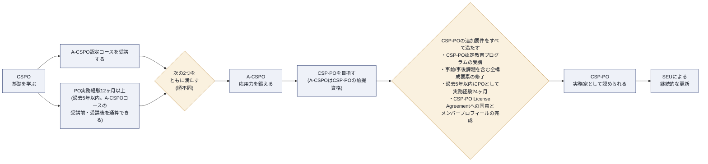

### 1.3 対象者

A-CSPOは、すでにCSPOを取得し、実際にプロダクトオーナーとして一定期間働いた経験を持つ人を対象としています。学習目標文書(Learning Objectives)には「Individual Path to CSP」の教育者が扱う補足トピックについての言及もあり、A-CSPOはCertified Scrum Professional®(CSP®)へ至るパスの一部としても位置づけられています。[2]

### 1.4 プロダクトオーナーとスクラムマスターの関係

公式FAQでは、プロダクトオーナーとスクラムマスターの関係は「上下関係ではなく補完関係」であると明記されています。プロダクトオーナーは主に「何を作るか」を顧客とステークホルダーのフィードバックに基づいて定義することに集中し、スクラムマスターはチームがスクラムの枠組みの中で効果的に協働し、問題を解決し、継続的に改善できるよう支援することに集中します。[1]

> **ベストプラクティス**：A-CSPO学習者は「プロダクトオーナーが偉い」「スクラムマスターの下請け」といった誤解を持たないこと。両者は対等なアカウンタビリティを持つパートナーです。

**ソース**
1. Scrum Alliance「Advanced Certified Scrum Product Owner (A-CSPO®)」公式ページ — https://www.scrumalliance.org/get-certified/product-owner-track/advanced-certified-scrum-product-owner
2. Scrum Alliance「A-CSPO Learning Objectives」(2022年1月) — https://www.scrumalliance.org/media/certifications/los/adv_cspo_learning_objectives_2022.pdf

---

## 第2章 受験要件と認定への道のり

### 2.1 公式要件

A-CSPOを取得・維持するためには、以下をすべて満たす必要があります(#6 は取得後に継続して必要となる維持要件です)。[1]

| # | 要件 | 補足 |
|---|---|---|
| 1 | Scrum AllianceのCSPO資格を保有していること | 有効・失効いずれでも可。A-CSPO取得時に自動更新される |
| 2 | 過去5年以内にプロダクトオーナーとしての実務経験が12ヶ月以上あること | 「プロダクトオーナーというアカウンタビリティに特化した」経験であることが求められる |
| 3 | Scrum Alliance認定の教育プロバイダーが提供する、最低16時間のA-CSPOコースを受講すること | 承認コースは最低16時間で構成される |
| 4 | コースの全構成要素(事前課題・事後課題を含む場合がある)を完了すること | 教育者によって課題内容が異なる |
| 5 | A-CSPOライセンス契約に同意し、Scrum Allianceのメンバープロフィールを完成させること | — |
| 6 | 2年ごとに資格を更新すること。A-CSPOが保有資格のうち最上位である場合、標準ルートは30 SEU(Scrum Education Units)の獲得と175米ドルの更新料の支払い | 適用される更新区分は保有資格のうち最上位のものによって決まる。CSP-POを保有している場合はProfessional levelの要件(40 SEUと250米ドル)が適用される。代替ルートとして、Scrum Alliance の別の認定コースを修了すると、SEU の提出も更新料の支払いもなく既存の認定が自動更新される。更新料は2026年9月1日時点で確認した金額。詳細は第15章を参照 |

### 2.2 要件を満たすまでの流れ

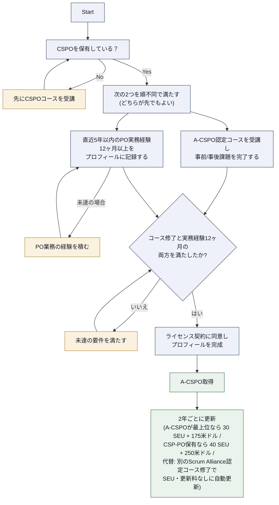

### 2.3 なぜ「12ヶ月の実務経験」が要件になっているのか

A-CSPOはコースを聞くだけで理解できる知識ではなく、「実際にステークホルダーと衝突し、バックログが肥大化し、思ったように優先順位付けができなかった」という現場経験があって初めて深く理解できる内容を扱います。学習目標そのものが「実世界の事例を議論する」「実際にステークホルダーとプロダクトプランを作成する」といった実践的な動詞(discuss, create, practice, experiment)で書かれていることからも、経験の蓄積を前提とした設計であることが分かります。[2]

> **ベストプラクティス**：A-CSPOコースを受講する前に、自分がこの1年で経験した「ステークホルダー対応の失敗談」「バックログが手に負えなくなった経験」などを2〜3個書き出しておくと、コース内のディスカッションで実務に即した学びが得やすくなります。

**ソース**
1. Scrum Alliance「Advanced Certified Scrum Product Owner (A-CSPO®)」公式ページ — https://www.scrumalliance.org/get-certified/product-owner-track/advanced-certified-scrum-product-owner
2. Scrum Alliance「A-CSPO Learning Objectives」(2022年1月) — https://www.scrumalliance.org/media/certifications/los/adv_cspo_learning_objectives_2022.pdf

---

## 第3章 Bloom's Taxonomyの読み方

### 3.1 なぜBloom's Taxonomyを理解する必要があるのか

A-CSPO Learning Objectives文書は、すべての学習目標を「A-CSPO Learning Objectivesの検証に成功した学習者は、〜できるようになる」という前提のもとで、Bloom's Taxonomy(ブルームの分類学)に基づく動詞を使って記述しています。[1] つまり、学習目標の動詞を見れば、その項目がどのレベルの理解を要求しているかが分かります。

### 3.2 6段階の分類

| レベル | 説明 | 代表的な動詞例 |
|---|---|---|
| Knowledge(知識) | 情報・プロセス・事実・概念の記憶 | 定義する、挙げる、列挙する |
| Comprehension(理解) | 情報を解釈し、重要性を判断する | 説明する、議論する、認識する |
| Application(応用) | 得た知識・概念を実生活で適用する | 適用する、実演する、例示する |
| Analysis(分析) | 批判的思考で情報を分解・整理する | 比較する、対比する、区別する |
| Synthesis(統合) | 知識を使って新しい成果物・プロセスを作る | 創造する、準備する、組織する |
| Evaluation(評価) | 判断力を用いて意思決定・問題解決を行う | 測定する、査定する、評価する |

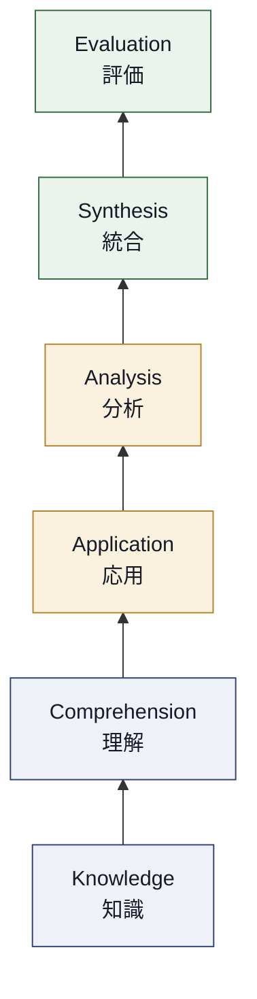

### 3.3 A-CSPOの学習目標のレベル感

CSPOの学習目標が主に Knowledge〜Application 中心であるのに対し、A-CSPOの学習目標には Application 以上のレベルを求める動詞が数多く含まれます。[1] ただし、A-CSPOの動詞がすべて高次というわけではなく、公式学習目標には list(列挙する)、describe(記述する)、explain(説明する)、use(使う)といった低次〜中位の動詞も含まれています。代表的な動詞とBloomレベルの対応は次の通りです。

| 動詞 | 対応するBloomレベル |
|---|---|
| list(列挙する) | 1. Knowledge |
| describe(記述する) | 1. Knowledge 〜 2. Comprehension |
| explain(説明する) | 2. Comprehension |
| discuss(議論する) | 2. Comprehension |
| use(使う) | 3. Application |
| practice(実践する) | 3. Application |
| experiment(実験する) | 3. Application 〜 4. Analysis |
| create(作成する) | 5. Synthesis |
| develop(開発する) | 5. Synthesis |
| appraise(査定する) | 6. Evaluation |

重要なのは、動詞ごとに求められる到達度が異なるという点です。A-CSPOに高次の動詞が多く含まれることは、「知っている」だけでなく「実際の複雑な状況で使いこなせる」ことが求められている証拠ですが、個々の学習目標のレベルは、公式PDFに記載されたBloomレベルの表示とその学習目標の文脈を優先して判断してください。上表の動詞は目安であり、同じ動詞でも文脈によって求められる到達度は変わります。

> **ベストプラクティス**：学習目標を読むときは、動詞に注目してください。「describe(説明できる)」であれば言葉で説明できれば十分ですが、「create(作成できる)」「experiment(実験できる)」であれば、実際に手を動かして成果物を作る・試行することが求められています。

**ソース**
1. Scrum Alliance「A-CSPO Learning Objectives」(2022年1月) — https://www.scrumalliance.org/media/certifications/los/adv_cspo_learning_objectives_2022.pdf

---

## 第4章 CSPOからの橋渡し：Scrum基礎の要点整理

A-CSPOはCSPO取得者を対象としているため、Scrum Foundations® Learning Objectivesで定義される基礎知識(Scrum Theory、Scrum Team、Scrum Events、Scrum Artifacts)はすでに習得済みという前提で進みます。[1] ここでは、A-CSPOの学習に入る前に、要点だけを素早く再確認します。

### 4.1 Scrum Theory(スクラム理論)の要点

Scrum Foundations Learning Objectivesは、スクラムの定義、5つのスクラム価値基準、経験主義(Empiricism)の定義、経験主義を支える3本柱(透明性・検査・適応)を基礎知識として求めています。[1]

| 3本柱 | 内容 |
|---|---|
| 透明性(Transparency) | プロセスや作業の重要な側面が、結果に責任を持つ人々に見える状態であること |
| 検査(Inspection) | スクラムの作成物や、ゴールに向けた進捗を頻繁かつ注意深く検査すること |
| 適応(Adaptation) | プロセスや作成物が許容範囲から逸脱していると分かった場合、できるだけ早く調整すること |

### 4.2 Scrum Team・イベント・作成物の全体像

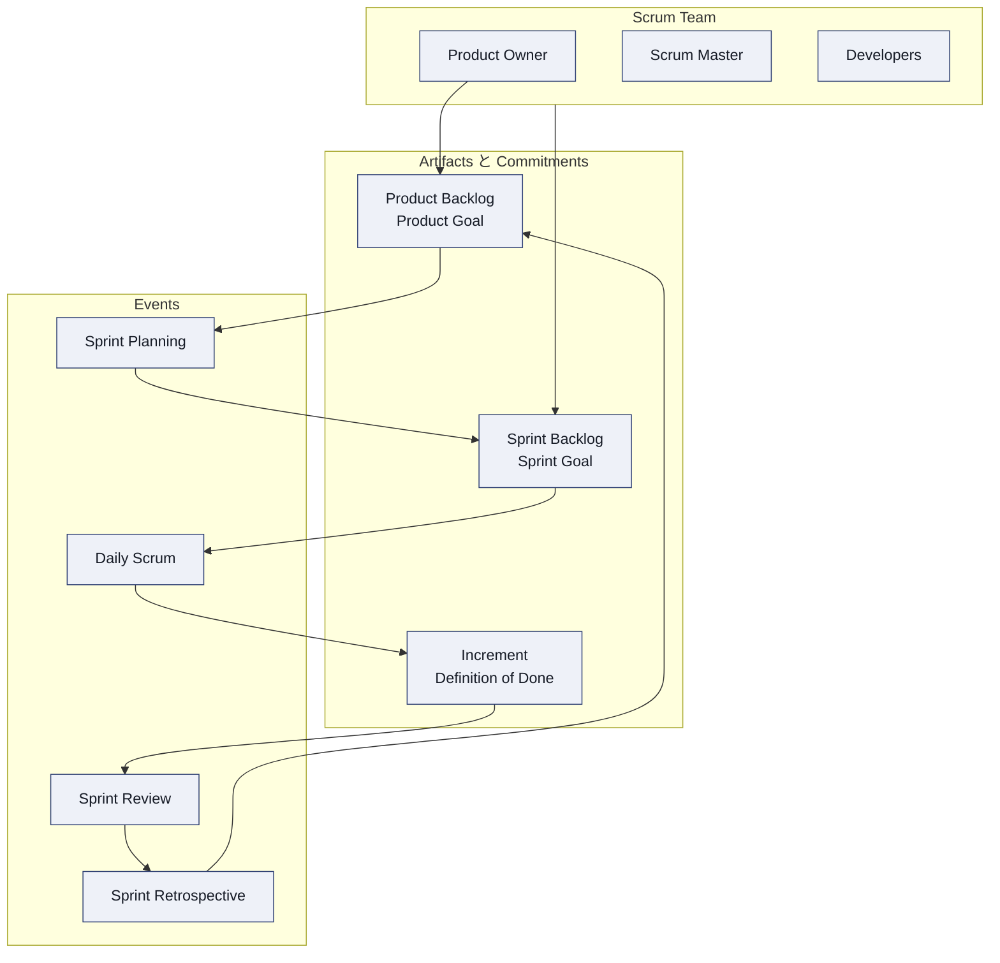

### 4.3 プロダクトバックログの本質(復習)

Scrum GuideはProduct Backlogを「プロダクトを改善するために必要なものが記載された、創発的で順序付けされたリスト」であり「スクラムチームが行う作業の唯一の情報源」と定義しています。[2] A-CSPOでは、この定義を土台に、バックログが巨大化・複雑化した状況にどう対処するかを第12章で深く扱います。

> **ベストプラクティス**：A-CSPOの学習に入る前に、自分のチームの現在のProduct Goal、Sprint Goal、Definition of Doneをそれぞれ一文で言えるか確認してください。言えない場合は、基礎の再確認から始めることを推奨します。

**ソース**
1. Scrum Alliance「Scrum Foundations® Learning Objectives」(2022年1月、2024年2月フォーマット更新) — https://assets.scrumalliance.org/media/certifications/los/scrum_foundations_learning_objectives_2022.pdf
2. Scrum Guide(2020年11月改訂版) — https://scrumguides.org/

---

## 第5章 Core Competencies① プロダクトオーナーシップの本質とマインドセット(LO 1.1〜1.3)

### 5.1 学習目標

- 1.1 プロダクトオーナーシップの重要性を分析する
- 1.2 成功しているプロダクトオーナーのマインドセットと行動を振り返る
- 1.3 スクラムチームが最新のスクラム定義を採用した場合に、ステークホルダーとの関係やプロダクトに生じうる影響を、少なくとも3つ議論する[1]

### 5.2 プロダクトオーナーシップの重要性を分析する(1.1)

プロダクトオーナーは、プロダクトの価値を最大化する責任(アカウンタビリティ)を負う唯一の人物です。Scrum Guideは、プロダクトオーナーが「スクラムチームが行う作業の価値を最大化することに責任を持つ」と定めています。A-CSPOレベルでは、この責任を「なぜ重要か」という観点で分析することが求められます。具体的には以下の観点が挙げられます。

- プロダクトオーナーの意思決定が遅い・不明確だと、開発チームの手が止まる、または誤った方向に進む
- 一人のプロダクトオーナーが明確な優先順位を示すことで、組織全体の投資判断に一貫性が生まれる
- プロダクトオーナーがビジネス価値と顧客価値の橋渡し役を担うことで、技術チームが「作ること」ではなく「価値を届けること」に集中できる

### 5.3 成功するプロダクトオーナーのマインドセット(1.2)

| マインドセットの要素 | 具体的な行動例 |
|---|---|
| 仮説思考 | 「これが正しい」ではなく「これが正しいかもしれない、検証しよう」と考える |
| サーバントリーダーシップ | 開発チームに指示するのではなく、意思決定に必要な情報を提供する |
| 権限委譲への理解 | 細部の実装判断は開発チームに委ね、Whatと Whyに集中する |
| 継続的な学習姿勢 | Sprint Reviewやユーザーからのフィードバックを次のプランニングに反映する |
| Noと言う勇気 | すべての要求を受け入れず、プロダクトゴールに沿わないものを断る |

### 5.4 最新のスクラム定義の採用がもたらす影響(1.3)

2020年版Scrum Guideでは、Product GoalやDefinition of Doneの位置づけが明確化されるなど、旧版からの変更点があります。A-CSPOでは、こうした「スクラムの定義そのものが更新された場合」に、自チームやステークホルダー関係にどのような影響が生じうるかを議論することが求められます。例えば、以下のような影響が考えられます。

1. **Product Goalの明文化により、ステークホルダーへの説明責任がより明確になる** — バックログの各項目が「なぜ今やるのか」をProduct Goalに紐づけて説明しやすくなる一方、Product Goalが曖昧なままだとステークホルダーからの信頼を損ないやすくなる
2. **Developersという呼称への統一により、役割の垣根が下がる** — 「テスターだから」「デザイナーだから」といった分業意識が薄れ、ステークホルダーとの対話にも複数の専門性を持つメンバーが参加しやすくなる
3. **単一のスクラムチームという概念の強調により、サブチーム的な運用が見直される** — 複数チームでプロダクトオーナーシップを行っている場合、チーム間の調整コストの再設計が必要になることがある

> **ベストプラクティス**：スクラムの定義が更新されるたびに「何が変わったか」だけでなく「この変更によってステークホルダーとの関係がどう変わるか」を必ずセットで考える習慣を持ちましょう。

**ソース**
1. Scrum Alliance「A-CSPO Learning Objectives」(2022年1月) — https://www.scrumalliance.org/media/certifications/los/adv_cspo_learning_objectives_2022.pdf
2. Scrum Guide(2020年11月改訂版) — https://scrumguides.org/

---

## 第6章 Core Competencies② ステークホルダーとの協働技術(LO 1.4〜1.8)

### 6.1 学習目標

- 1.4 複数スプリントにわたってステークホルダーと関わるための技術を、少なくとも3つ実演する
- 1.5 プロダクトオーナーがステークホルダーのファシリテーターとして振る舞うべきでない例を、少なくとも2つ説明する
- 1.6 ファシリテーティブ・リスニング(傾聴技術)を、少なくとも3つ実演する
- 1.7 オープンディスカッションに対する代替手法を、少なくとも2つ使用する
- 1.8 ステークホルダーと最終的な意思決定をファシリテートする方法を、少なくとも3つ説明する[1]

### 6.2 ステークホルダーと関わる技術(1.4)

A-CSPOでは、単発の会議ではなく「複数スプリントにわたる」継続的な関係構築の技術が問われます。

| 技術 | 内容 |
|---|---|
| ステークホルダーマップの定期更新 | 影響力・関心度の変化を毎スプリントで見直し、対話の頻度・深さを調整する |
| Sprint Reviewの戦略的活用 | 単なる進捗報告の場にせず、次に検証したい仮説をステークホルダーと一緒に決める場にする |
| 1on1の定例化 | 主要ステークホルダーとの個別対話を定例化し、大人数の場で言いにくい懸念を早期に拾う |

### 6.3 プロダクトオーナーがファシリテーターであるべきでない場面(1.5)

プロダクトオーナー自身が強い利害関係を持つ議題や、意思決定の当事者である議論では、中立的なファシリテーションができません。

1. **自分の提案の是非そのものが議題になっている場合** — 例えば「このプロダクトビジョンを継続すべきか」という議論で、ビジョンの提案者本人がファシリテーターを兼ねると、議論が誘導的になりやすい
2. **対立するステークホルダー間の利害調整が主目的の場合** — プロダクトオーナー自身がどちらかの利害と結びついていると中立性が疑われるため、スクラムマスターや第三者にファシリテーションを依頼する方が健全

### 6.4 ファシリテーティブ・リスニングの技術(1.6)

| 技術 | 内容 |
|---|---|
| パラフレーズ(言い換え) | 相手の発言を自分の言葉で言い換えて確認し、誤解を防ぐ |
| オープンクエスチョンの活用 | 「はい/いいえ」で終わらない質問で、相手の本音や背景を引き出す |
| 沈黙の活用 | 相手が話し終えてもすぐに埋めず、間を置くことで深い発言を促す |

### 6.5 オープンディスカッションへの代替手法(1.7)

大人数での自由討議は、声の大きい人の意見に引っ張られやすいという弱点があります。A-CSPOでは代替手法を使いこなすことが求められます。

- **ドット投票(ドットボーティング)**：各参加者に一定数の投票権を与え、匿名に近い形で優先度を可視化する
- **ラウンドロビン方式**：発言順を固定し、全員に均等な発言機会を与える
- **サイレントブレインストーミング**：まず個人で付箋に書き出してから共有することで、同調バイアスを避ける

### 6.6 ステークホルダーとの最終意思決定のファシリテーション(1.8)

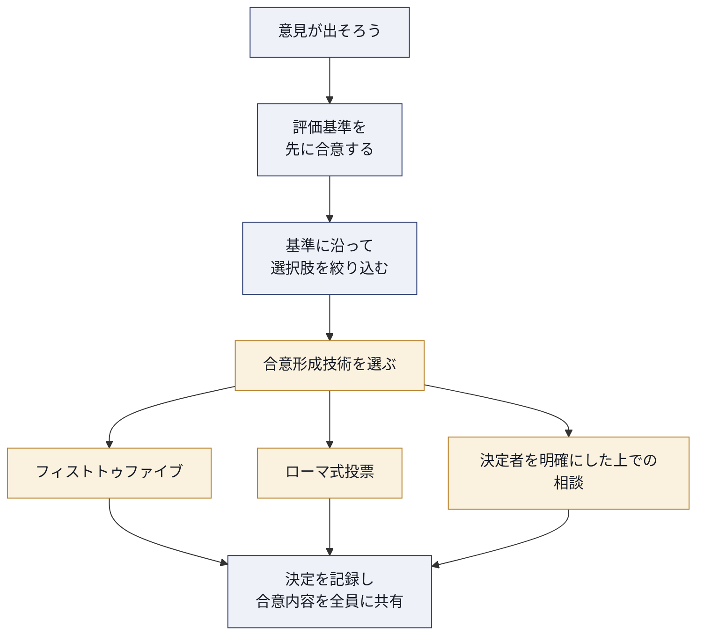

> **ベストプラクティス**：意思決定の合意形成技術(フィストトゥファイブなど)を使う前に、必ず「誰が最終決定権を持つか」を事前に明確にしておきましょう。プロダクトオーナーが最終決定権を持つ場合でも、事前にそれを共有しておくことで、後から「聞いていない」という不満を防げます。

**ソース**
1. Scrum Alliance「A-CSPO Learning Objectives」(2022年1月) — https://www.scrumalliance.org/media/certifications/los/adv_cspo_learning_objectives_2022.pdf

---

## 第7章 Core Competencies③ 開発者との協働と技術的負債(LO 1.9〜1.10)

### 7.1 学習目標

- 1.9 プロダクトオーナーが技術的負債の蓄積に慎重であるべき理由を説明する
- 1.10 スクラムチームが毎スプリント高品質なインクリメントを届け、技術的負債を減らすのに役立つ開発プラクティスを、少なくとも3つ挙げる[1]

### 7.2 技術的負債とは何か

Technical Debt(技術的負債)は、Ward Cunninghamが考案した比喩で、Martin Fowlerは「短期的な利益を得るために、長期的には持続不可能な設計上の近道を意図的に選ぶこと」を負債になぞらえています。コードの複雑さや設計の乱れ(クラフト)が蓄積すると、新機能を追加するために余計にかかる時間が「利息」として発生し続けます。[2]

### 7.3 プロダクトオーナーが技術的負債に慎重であるべき理由(1.9)

プロダクトオーナーは機能(Feature)の価値には敏感でも、技術的負債の存在は見えにくいという構造的な問題があります。

1. **技術的負債は「見えない借金」である** — バックログ上のユーザーストーリーとして表現されにくく、プロダクトオーナーが認識しないまま蓄積しやすい
2. **利息(interest)は複利で効いてくる** — 技術的負債を放置するほど、新機能の追加速度そのものが低下し、将来のビジネス価値の実現を阻害する
3. **短期的な機能追加の圧力と長期的な保守性はトレードオフの関係にある** — プロダクトオーナーが常に新機能ばかりを優先すると、開発チームは負債解消のための時間を確保できなくなる

### 7.4 技術的負債の4象限(Technical Debt Quadrant)

Martin Fowlerは技術的負債を「意図的か偶発的か」「思慮深いか無謀か」という2軸で整理する4象限モデルを提示しています。[3] A-CSPOレベルのプロダクトオーナーは、この分類を理解し、開発チームとの対話で「どの種類の負債なのか」を見極める必要があります。

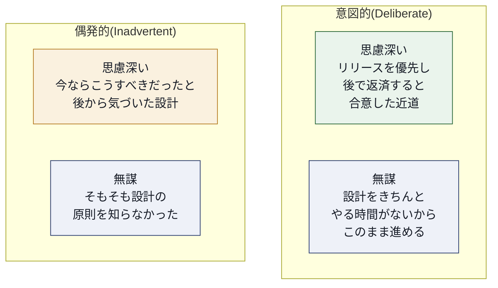

### 7.5 技術的負債を減らす開発プラクティス(1.10)

| プラクティス | 技術的負債への効果 |
|---|---|
| 継続的インテグレーション(CI) | 統合の遅れによる「統合負債」の蓄積を防ぎ、問題を早期発見する |
| リファクタリング | 動作を変えずに内部構造を改善し、既存の負債を計画的に返済する |
| テスト駆動開発(TDD) | 設計の質を保ちながら開発することで、新たな負債の発生を抑制する |
| Definition of Doneへの品質基準の明記 | 「動くが汚いコード」がインクリメントとして許容されない基準を、チーム全体で合意する |

> **ベストプラクティス**：プロダクトバックログに「リファクタリング」や「技術的負債の解消」専用の項目を作るだけでなく、通常のユーザーストーリーの受け入れ基準(Acceptance Criteria)に品質基準を組み込むことで、負債が新たに発生すること自体を防ぎましょう。

**ソース**
1. Scrum Alliance「A-CSPO Learning Objectives」(2022年1月) — https://www.scrumalliance.org/media/certifications/los/adv_cspo_learning_objectives_2022.pdf
2. Martin Fowler「bliki: Technical Debt」— https://martinfowler.com/bliki/TechnicalDebt.html
3. Martin Fowler「bliki: Technical Debt Quadrant」— https://martinfowler.com/bliki/TechnicalDebtQuadrant.html

---

## 第8章 Core Competencies④ 複数チームでのプロダクトオーナーシップ(LO 1.11〜1.13)

### 8.1 学習目標

- 1.11 スクラムをスケーリングするアプローチを、少なくとも2つ認識する
- 1.12 依存関係を可視化・管理・削減する技術を、少なくとも2つ特定する
- 1.13 フィーチャーチームとコンポーネントチームのメリット・デメリットを、少なくとも3つ説明する[1]

### 8.2 スクラムのスケーリングアプローチ(1.11)

複数のスクラムチームが1つのプロダクトに関わる場合、単一チームのスクラムだけでは対応しきれない調整課題が生まれます。代表的なスケーリングアプローチの一つが、Scrum.orgが提供するNexusです。Nexusは「単一のプロダクトバックログから作業する複数(概ね3〜9)のスクラムチームを束ね、統合されたインクリメントを届けるためのフレームワーク」と定義されています。Nexusはスクラムの基本構造を変えず、最小限の拡張(Nexus統合チームなどの役割やイベント)を加える点が特徴です。[2]

| アプローチ | 特徴 |
|---|---|
| Nexus | スクラムを最小限拡張し、3〜9チーム程度の統合を支援する。単一のプロダクトバックログを維持する |
| LeSS(Large-Scale Scrum) | 「スクラムをそのまま大規模に適用する」思想で、余分な役割やプロセスを増やさない方向性を重視する |
| SAFe(Scaled Agile Framework) | ART(Agile Release Train)などの概念を導入し、企業レベルでの計画・予算配分までを扱う、より広範なフレームワーク |

### 8.3 依存関係を可視化・管理・削減する技術(1.12)

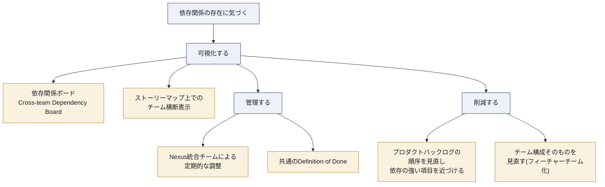

### 8.4 フィーチャーチームとコンポーネントチーム(1.13)

| 観点 | フィーチャーチーム | コンポーネントチーム |
|---|---|---|
| 定義 | エンドツーエンドで顧客価値(機能)を届けられるチーム | 特定の技術コンポーネント・レイヤーを専門に担当するチーム |
| メリット | 依存関係が少なく、1チームで機能を完結して届けられる | 特定技術領域における深い専門性が育ちやすい |
| デメリット | 複数の技術領域を横断するスキルが必要になり、育成コストが高い | 1つの機能を届けるために複数チームの調整が必要になり、待ち時間が発生しやすい |
| プロダクトオーナーへの影響 | バックログの優先順位付けが機能単位でシンプルになる | バックログがコンポーネント単位に分断され、機能全体の価値を追いにくくなる |

> **ベストプラクティス**：複数チーム編成を検討する際は、まず「フィーチャーチーム化できないか」を検討し、どうしても専門性の観点でコンポーネントチームが必要な場合のみ採用しましょう。コンポーネントチーム編成を選ぶ場合は、Nexusのような統合の仕組みをあらかじめ用意しておくことが重要です。

**ソース**
1. Scrum Alliance「A-CSPO Learning Objectives」(2022年1月) — https://www.scrumalliance.org/media/certifications/los/adv_cspo_learning_objectives_2022.pdf
2. Scrum.org「The Nexus Guide」(オンライン版) — https://www.scrum.org/resources/online-nexus-guide

---

## 第9章 Advanced Goal Setting and Planning(LO 2.1〜2.4)

### 9.1 学習目標

- 2.1 プロダクト戦略が実際にどのように運用され、時間とともに進化していくかについて、実世界の例を議論する
- 2.2 目的を特定する、または戦略を定義するための技術を、少なくとも2つ実践する
- 2.3 ステークホルダーとともにプロダクトプランまたはフォーキャストを作成する
- 2.4 プロダクト戦略・アイデア・機能・前提を可視化・伝達するための技術を、少なくとも1つ実践する[1]

### 9.2 プロダクトビジョンから日々のバックログへのつながり

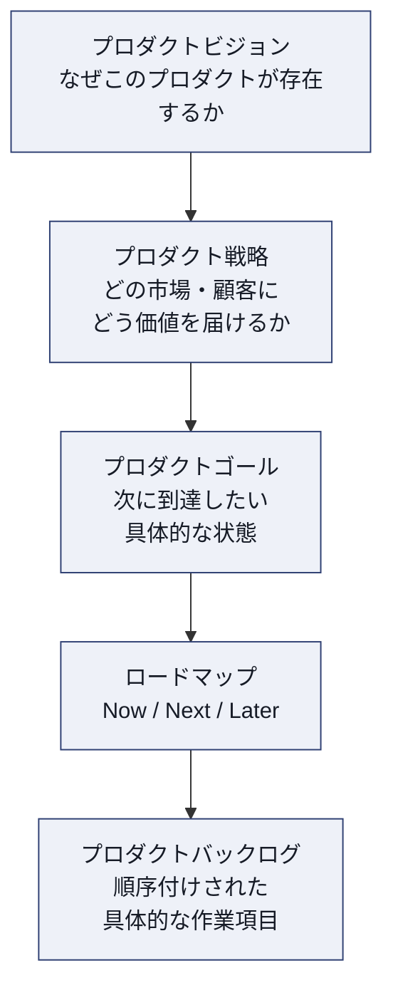

プロダクト戦略は一度作って終わりではなく、市場の変化・顧客からの学び・競合の動きに応じて継続的に見直されるべきものです。A-CSPOの学習目標2.1は、この「戦略が実際にどう運用され、進化していくか」を実例で理解することを求めています。

### 9.3 目的の特定・戦略定義の技術(2.2)

| 技術 | 内容 |
|---|---|
| インパクトマッピング(Impact Mapping) | ゴール→アクター→インパクト(行動変容)→デリバラブルの順で、戦略的な計画を可視化する手法。Gojko Adzicが提唱した |
| Vision Board / エレベーターピッチ形式 | 「誰のために」「何を」「なぜ」を短い定型文で言語化し、チーム全体の目線を揃える |

インパクトマッピングは「機能のショッピングリスト」に陥りがちな計画を、「ビジネスゴールを達成するために、対象者にどんな行動変容(インパクト)を起こす必要があるか」という問いに立ち返らせる手法です。[2]

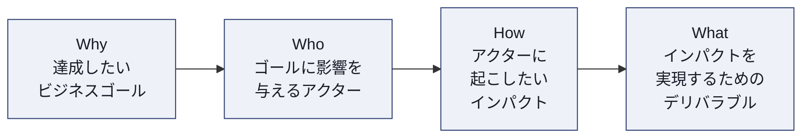

### 9.4 プロダクトプラン・フォーキャストの作成(2.3)

プロダクトプランやフォーキャストは、「いつまでに、どの範囲を、どの確度で届けられるか」をステークホルダーと共有するための道具です。A-CSPOでは、これを一人で作るのではなく、ステークホルダーと共同で作成する(create with stakeholders)ことが強調されています。[1]

- スループット(過去の完了実績)を用いた確率的フォーキャスト
- Now/Next/Later形式のロードマップによる、確度の異なる時間軸の明示
- 前提条件(Assumption)を明記し、状況が変わった場合にプランを見直す条件を事前に合意しておく

### 9.5 戦略・アイデア・機能・前提の可視化と伝達(2.4)

| 技術 | 向いている用途 |
|---|---|
| ストーリーマッピング(User Story Mapping) | ユーザーの行動の流れに沿って機能を並べ、MVPのスライス(切り出し)を判断する。Jeff Pattonが体系化した |
| Now/Next/Laterロードマップ | 確度の異なる時間軸を区別しながら、優先順位の大枠をステークホルダーに伝える |
| インパクトマップ | 戦略とデリバラブルのつながりを1枚で可視化する |

ストーリーマッピングは、ユーザーの一連の行動(バックボーン)を横軸に、優先度を縦軸に配置することで、「機能の羅列」ではなく「ユーザー体験の全体像」からリリース範囲を判断できるようにする手法です。[3]

> **ベストプラクティス**：プロダクト戦略を1枚のスライドで説明できるようにしておきましょう。説明できない場合、それはまだ戦略ではなく「やりたいことのリスト」である可能性が高いです。

**ソース**
1. Scrum Alliance「A-CSPO Learning Objectives」(2022年1月) — https://www.scrumalliance.org/media/certifications/los/adv_cspo_learning_objectives_2022.pdf
2. Impact Mapping 公式サイト — https://www.impactmapping.org/
3. Jeff Patton「Story Mapping Quick Reference」— https://jpattonassociates.com/story-mapping-quick-ref/

---

## 第10章 Empathizing with Customers and Users(LO 3.1〜3.2)

### 10.1 学習目標

- 3.1 開発者を顧客・ユーザーに直接つなげる技術を1つ使用する
- 3.2 プロダクトディスカバリーの技術を、少なくとも2つ実践する[1]

### 10.2 開発者を顧客・ユーザーに直接つなげる(3.1)

多くの組織では、顧客の声はプロダクトオーナーというフィルターを通じてしか開発者に届きません。しかし、開発者が顧客の反応を直接目にすることで、実装上の細かな判断の質が向上します。

| 技術 | 内容 |
|---|---|
| Sprint Reviewへの顧客招待 | 実際のユーザーやステークホルダーをSprint Reviewに招き、開発者が直接フィードバックを受け取る場を作る |
| ユーザビリティテストへの開発者同席 | 開発者がユーザーテストを録画で見る、または同席することで、仕様書越しでは伝わらない使いにくさに気づく |
| サポート対応のシャドーイング | 開発者がカスタマーサポートに一定期間同席し、実際の問い合わせ内容に触れる |

### 10.3 プロダクトディスカバリーの技術(3.2)

プロダクトディスカバリーとは、「何を作るべきか」をまだ作る前に検証する活動全般を指します。

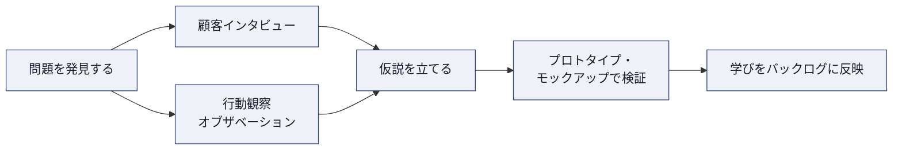

- **顧客インタビュー**：オープンクエスチョンを中心に、顧客の「困りごと」を深掘りする。仕様の是非を聞くのではなく、課題そのものを理解することを優先する
- **行動観察(オブザベーション)**：顧客が実際にどのようにプロダクト(または競合プロダクト)を使っているかを観察し、本人も言語化できていない不満やクセを発見する
- **プロトタイプ・モックアップによる検証**：作り込む前に、低コストな試作物でユーザーの反応を確かめる

> **ベストプラクティス**：顧客インタビューでは「この機能は欲しいですか?」と聞かないようにしましょう。多くの人は礼儀正しく「欲しい」と答えてしまいます。代わりに「直近でこの課題に困った具体的な場面を教えてください」と過去の行動を尋ねる方が、実態に近い情報が得られます。

**ソース**
1. Scrum Alliance「A-CSPO Learning Objectives」(2022年1月) — https://www.scrumalliance.org/media/certifications/los/adv_cspo_learning_objectives_2022.pdf

---

## 第11章 Advanced Product Assumption Validation(LO 4.1〜4.5)

### 11.1 学習目標

- 4.1 プロダクトオーナーがビジネス価値を効果的に届ける能力に影響しうる認知バイアスを、少なくとも2つ挙げる
- 4.2 スプリント中に完了したSprint GoalとIncrementに基づいて、Sprint Reviewが検査と適応にどれだけ効果的に使われたかを査定する
- 4.3 前提を検証する仕組みをスクラムフレームワークに組み込むアプローチを、少なくとも1つ実験する
- 4.4 ターゲット顧客に関する仮説を、少なくとも2つ開発する
- 4.5 少なくとも1つの仮説を検証するための計画を作成する[1]

### 11.2 プロダクトオーナーに影響しうる認知バイアス(4.1)

認知バイアスは、人間の思考に組み込まれた系統的な判断の偏りです。プロダクトオーナーの意思決定に特に影響しやすいバイアスには、以下のようなものがあります。[2]

| バイアス | 内容 | プロダクトオーナーへの影響例 |
|---|---|---|
| 確証バイアス(Confirmation Bias) | 自分の既存の信念を裏づける情報ばかりを探し、注目する傾向 | 過去にうまくいったベンダーやアプローチを、今回も無条件に選んでしまう |
| サンクコスト効果(Sunk Cost Fallacy / Irrational Escalation) | すでに投じた労力・コストを理由に、合理的でない継続投資をしてしまう傾向 | すでに市場性を失った機能への投資を、開発コストがかかったことを理由に止められない |
| バンドワゴン効果(Bandwagon Effect) | 競合や他社の動向に流され、自社の文脈を検証せずに追随してしまう傾向 | 競合が導入した技術を、自社の顧客に本当に価値があるか検証せずに真似してしまう |
| ネガティビティバイアス(Negativity Bias) | ポジティブな情報よりネガティブな情報を強く記憶・重視する傾向 | 一部の否定的なフィードバックに引きずられ、多数の肯定的な反応を過小評価してしまう |

### 11.3 Sprint Reviewの効果性を査定する(4.2)

Sprint Reviewは単なるデモの場ではなく、「Sprint Goalに対してIncrementがどう寄与したか」を検査し、次の方向性を適応させるための場です。A-CSPOでは、この検査と適応のプロセスがどれだけ効果的に機能しているかを、批判的に査定する能力が求められます。

査定の視点の例:

1. Sprint Reviewで実際に意思決定(プロダクトバックログの変更など)が行われたか、それとも一方的な報告で終わったか
2. 参加したステークホルダーが、次のSprintで何を検証したいかについて発言する機会があったか
3. Sprint Goalに対する進捗が、具体的なデータや顧客の反応をもとに検査されたか、それとも「完了/未完了」の報告に留まったか

### 11.4 前提検証をスクラムフレームワークに組み込む(4.3)

前提検証を体系的に行うためのアプローチとして広く参照されるのが、Eric Riesが提唱したLean Startupの「Build-Measure-Learn」ループです。これは「最小限の労力で構築し(Build)、市場の反応を測定し(Measure)、そこから学ぶ(Learn)」というサイクルを繰り返すことで、不確実性の高い状況でも合理的に前進する仕組みです。[3]

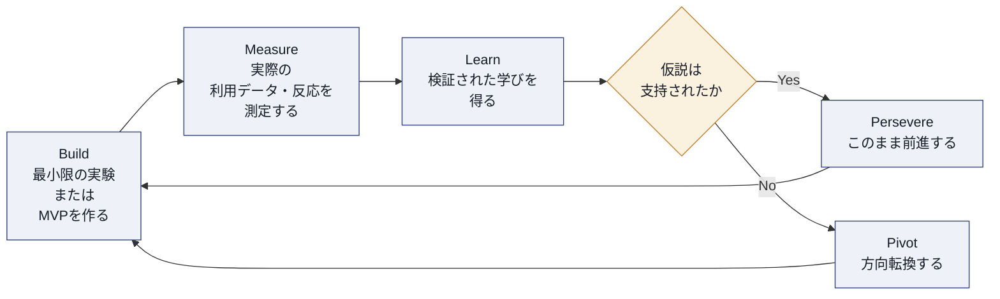

このループをスプリントの中に組み込む際は、Sprint Reviewを「実験結果を確認し、次の実験を決める場」として明確に再定義することが実務上の鍵になります。

### 11.5 ターゲット顧客に関する仮説の開発(4.4)

良い仮説は「検証可能」で「反証可能」である必要があります。曖昧な仮説の例と、改善した仮説の例を比較します。

| 曖昧な仮説(検証しにくい) | 改善された仮説(検証しやすい) |
|---|---|
| このユーザーはこの機能を気に入るはずだ | [特定の顧客セグメント]は、[特定の課題]を抱えており、[特定の解決策]を提供すれば、[観測可能な行動]が起きるはずだ |
| もっと機能を増やせば満足度が上がる | 既存機能Xの完了率が低いのは[特定の原因]によるものであり、それを解消すれば完了率が[具体的な数値]まで改善するはずだ |

### 11.6 仮説を検証する計画の作成(4.5)

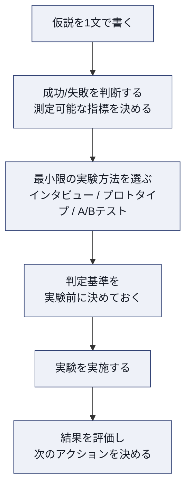

> **ベストプラクティス**：実験を始める前に「この結果が出たらPersevere(継続)、この結果が出たらPivot(転換)」という判定基準を必ず書面で決めておきましょう。結果が出てから基準を決めると、都合の良い解釈(確証バイアス)に陥りやすくなります。

**ソース**
1. Scrum Alliance「A-CSPO Learning Objectives」(2022年1月) — https://www.scrumalliance.org/media/certifications/los/adv_cspo_learning_objectives_2022.pdf
2. Applied Frameworks「Fourteen Cognitive Biases Common to Product Owners」— https://appliedframeworks.com/blog/fourteen-cognitive-biases-common-to-product-owners
3. The Lean Startup「Principles」(Eric Ries) — https://theleanstartup.com/principles

---

## 第12章 Product Backlog Management(LO 5.1〜5.5)

### 12.1 学習目標

- 5.1 価値をモデル化する技術を少なくとも2つ、価値を測定する技術を少なくとも2つ使用する
- 5.2 プロダクトゴールを支えるようにプロダクトバックログを順序付けする技術を、少なくとも3つ適用する
- 5.3 次のスプリントに向けて十分な数のプロダクトバックログ項目が「レディ」であることを、プロダクトオーナーがどう確保できるかを説明する
- 5.4 少なくとも3つの情報源からフィードバックを統合し、プロダクトバックログ項目を生成・洗練する
- 5.5 プロダクトバックログのリファインメントを改善する方法を、少なくとも2つ実験する[1]

### 12.2 価値のモデル化・測定技術(5.1)

「価値」は主観的で測定しにくい概念ですが、A-CSPOでは、これを構造的にモデル化・測定する技術が求められます。

| 技術 | 種別 | 内容 |
|---|---|---|
| Kanoモデル | モデル化 | 機能を「当たり前品質」「一元的品質(性能)」「魅力的品質(デライター)」などに分類し、顧客満足度への影響の質的な違いを可視化する。Noriaki Kanoが1984年に提唱した |
| インパクトマッピング | モデル化 | ビジネスゴールから逆算して、機能ではなく「行動変容」で価値を捉える |
| Cost of Delay(遅延コスト) | 測定 | ある機能の提供が遅れることで失われる価値を定量化する考え方。Don Reinertsenが体系化した |
| WSJF(Weighted Shortest Job First) | 測定 | 相対的なCost of Delayを相対的なJob Duration(所要期間。SAFeでは見積りやすいJob Size=規模を同義の代理指標として用いる)で割ることで、経済合理性に基づいた優先順位を算出する手法。SAFeで採用されている |

Kanoモデルは、機能を顧客満足度への影響のパターンで分類します。[2]

| Kanoモデルの分類 | 特徴 |
|---|---|
| 当たり前品質(Must-be) | 欠けていると強い不満につながるが、あっても満足度は上がらない |
| 一元的品質(Performance) | 充実度に比例して満足度が上がる(高性能であるほど満足) |
| 魅力的品質(Attractive/Delighter) | なくても不満はないが、あると満足度が大きく上がる |
| 無関心品質(Indifferent) | あってもなくても満足度に影響しない |
| 逆品質(Reverse) | 充実させるほどかえって満足度が下がる |

WSJFは、Cost of Delayを「ビジネス価値」「時間的な緊急度」「リスク低減・機会創出」の3要素の合計として算出し、それを相対的なJob Duration(所要期間。実務では同義の代理指標としてJob Size=規模を用います)で割ることで、経済的な効果が最大になる順序を導き出します。[3]

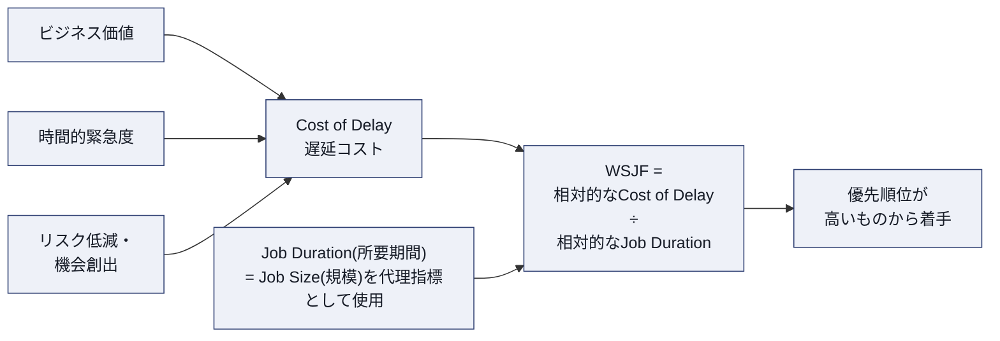

### 12.3 プロダクトゴールを支える順序付け技術(5.2)

| 技術 | 内容 |
|---|---|
| WSJF | 経済合理性に基づく定量的な優先順位付け |
| Kanoモデル | 顧客満足度の質的な違いに基づく優先順位付け |
| MoSCoW(Must/Should/Could/Won't) | ステークホルダー間の期待値を大まかに揃えるための簡易分類 |

いずれの技術も、単独の「正解」ではなく、プロダクトゴールという文脈の中で使い分けることが重要です。

### 12.4 「レディ」なバックログ項目を確保する方法(5.3)

Scrum Guideには「Definition of Ready」という公式な作成物はありませんが、実務上多くのチームが独自の「準備完了の基準」を定めています。A-CSPOでは、プロダクトオーナーがこれをどう確保するかが問われます。

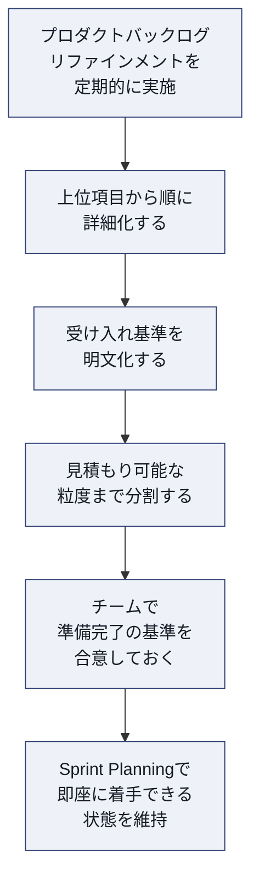

> **ベストプラクティス**：「レディ」の基準はチームによって異なって構いませんが、必ず文書化し、定期的(四半期に一度など)に見直しましょう。基準が曖昧なまま運用されると、チームによって「レディ」の解釈がずれ、スプリント中の手戻りが発生しやすくなります。

### 12.5 複数の情報源からのフィードバック統合(5.4)

| 情報源 | 統合の仕方 |
|---|---|
| Sprint Reviewでのステークホルダーの反応 | 次のリファインメントで優先順位を見直す材料にする |
| カスタマーサポート・問い合わせログ | 頻出する課題をパターン化し、バックログ項目の根拠として明記する |
| プロダクト利用データ(アナリティクス) | 実際の利用状況と仮説のギャップを定量的に確認する |
| セールス・カスタマーサクセスチームからの声 | 契約・解約に直結する要望を優先順位付けの文脈情報として活用する |

### 12.6 バックログリファインメントの改善(5.5)

肥大化した巨大なバックログは、それ自体がアンチパターンです。Scrum Allianceの実務者向け記事は、大きくなりすぎたバックログへの対処法として「分割(Split)」「制限(Limit)」「削除(Eliminate)」「統合(Consolidate)」の4ステップを提案しています。[4]

| ステップ | 内容 |
|---|---|
| 分割(Split) | 対象とするユーザー層や課題の種類が大きく異なる場合、その区分で分類・ビューを設けて見通しを良くする。1つのプロダクトのProduct Backlogは1つに保つのが原則であり(唯一の情報源)、バックログ自体を分けるのは作業を別プロダクトとして切り出す場合に限る |
| 制限(Limit) | 「プロダクトゴールに沿うものだけ」「件数の上限」「一定期間更新のない項目の除外」などの基準を設ける |
| 削除(Eliminate) | 長期間放置され陳腐化した「ゾンビ項目」を削除する |
| 統合(Consolidate) | 類似・重複した項目を1つにまとめ、ノイズを減らす |

さらに、Product Backlogの項目をテーマ・エピック・ユーザーストーリーという階層構造で捉え、階層が上位になるほど詳細度を下げ、着手が遠い項目ほど詳細に書き込みすぎないことも、リファインメントを持続可能にするための重要な原則です。[4] なお、サブタスクはProduct Backlogの階層ではなく、Sprint Planning以降にSprint Backlogの中でDevelopersが自分たちの作業を分解するための単位です。

> **ベストプラクティス**：バックログのリファインメントの改善は「一度きりの大掃除」ではなく、継続的な習慣にしましょう。四半期ごとに「ゾンビ項目探し」の時間を設けるだけでも、バックログの健全性は大きく改善します。

**ソース**
1. Scrum Alliance「A-CSPO Learning Objectives」(2022年1月) — https://www.scrumalliance.org/media/certifications/los/adv_cspo_learning_objectives_2022.pdf
2. Kano model — Wikipedia — https://en.wikipedia.org/wiki/Kano_model
3. Scaled Agile Framework「Weighted Shortest Job First (WSJF)」— https://framework.scaledagile.com/wsjf
4. Scrum Alliance「How to Manage a Large Product Backlog」(Miloš Belčević) — https://resources.scrumalliance.org/Article/manage-large-product-backlog

---

## 第13章 ベストプラクティス総まとめチェックリスト

以下は、これまでの章で紹介したベストプラクティスを、5つのA-CSPO学習目標カテゴリー別に整理したチェックリストです。

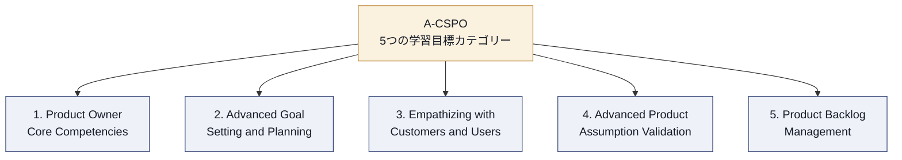

| カテゴリー | チェック項目 |
|---|---|
| Core Competencies | □ 自分のマインドセットが仮説思考・サーバントリーダーシップになっているか定期的に振り返っている |
| Core Competencies | □ ステークホルダーとの対話にファシリテーティブ・リスニングと合意形成技術を意図的に使い分けている |
| Core Competencies | □ 技術的負債の状態を開発チームと定期的に対話し、負債解消をバックログの中に組み込んでいる |
| Core Competencies | □ 複数チーム編成が必要な場合、フィーチャーチーム化を優先的に検討し、依存関係を可視化している |
| Goal Setting and Planning | □ プロダクト戦略を1枚で説明できる状態を維持している |
| Goal Setting and Planning | □ ロードマップやプランをステークホルダーと共同で作成し、前提条件を明記している |
| Empathizing with Customers | □ 開発者が顧客と直接接点を持つ機会を定期的に作っている |
| Empathizing with Customers | □ 顧客インタビューでは過去の具体的な行動を尋ね、機能の是非を直接聞かないようにしている |
| Assumption Validation | □ 自分の意思決定が確証バイアスやサンクコスト効果に影響されていないか、定期的に自問している |
| Assumption Validation | □ 実験を始める前にPersevere/Pivotの判定基準を書面で決めている |
| Backlog Management | □ 価値のモデル化(Kanoなど)と測定(WSJFなど)を使い分けて優先順位付けをしている |
| Backlog Management | □ バックログが肥大化する前に、分割・制限・削除・統合のいずれかの手段を定期的に実行している |

---

## 第14章 よくある誤解・アンチパターン

A-CSPOレベルのプロダクトオーナーが陥りやすい誤解・アンチパターンを整理します。

| 誤解・アンチパターン | 何が問題か | 望ましい姿勢 |
|---|---|---|
| プロダクトオーナーは「要求を受け取ってチケットを起票する係」である | 単なる要求の取り次ぎ役では、価値の最大化というアカウンタビリティを果たせない | すべての要求に対して「これはプロダクトゴールに貢献するか」を問い、時にはNoと言う |
| バックログはすべての要望を書き留めておく倉庫である | バックログが肥大化し、優先順位付け自体が機能しなくなる(大きすぎるバックログはアンチパターンである) | 定期的に分割・制限・削除・統合を行い、健全な規模を維持する |
| ステークホルダーの意見が一番大きい人(声の大きい人・役職の高い人)の意見を優先する(ハイポの意思決定=HiPPO) | データや顧客の声よりも、社内政治的な力学で優先順位が決まってしまう | WSJFやKanoモデルなど、経済合理性・顧客価値に基づいた基準を先に合意しておく |
| 技術的負債は開発チームだけの問題である | プロダクトオーナーが負債解消の時間を確保しなければ、負債は減らない | 技術的負債の状態を継続的に可視化し、バックログの優先順位に反映する |
| Sprint Reviewはデモをして終わりの儀式である | 検査と適応が行われず、次のプランニングに学びが反映されない | Sprint Reviewを「次に何を検証するか」を決める意思決定の場として運用する |
| 前提の検証は一度やれば十分である | 市場や顧客の状況は変化し続けるため、一度の検証で永久に正しいとは限らない | Build-Measure-Learnのループを継続的な習慣として組み込む |

---

## 第15章 認定後のキャリアパス

### 15.1 A-CSPOの次に位置する資格

A-CSPOは、Certified Scrum Professional® - Product Owner(CSP®-PO)の前提資格です。公式ページでは、CSP-POが「新しいスクラムチームを立ち上げ、組織のアジャイル導入において重要な役割を果たすためのスキルセット」を身につける資格であると説明されています。[1]

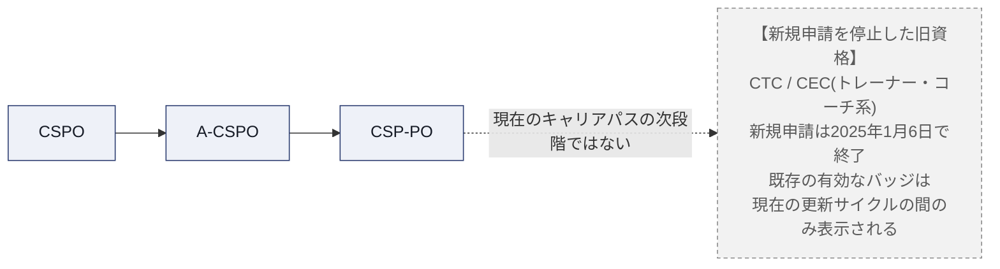

### 15.2 資格の維持とScrum Education Units(SEU)

Scrum Allianceの認定は「一度取ったら終わり」の資格ではありません。公式サイトでは、資格保持者が書籍を読む・ウェビナーを視聴する・イベントに参加するなどの学習活動を通じてSEUを獲得し、2年ごとの更新でその継続的な成長を証明する仕組みになっていると説明されています。[2] 適用される更新区分は、保有している資格のうち最上位のものによって決まります。A-CSPOが最上位の資格である場合、標準的な更新ルートは2年ごとの **30 SEU** の取得と **175米ドル** の更新料の支払いの両方です。上位のCSP-POを保有している場合は、Professional levelの要件である **40 SEU** と **250米ドル** が適用されます(更新料はいずれも2026年9月1日時点で確認した金額)。これに加えて代替ルートがあり、**Scrum Alliance の別の認定コースを修了すると、SEU の提出も更新料の支払いもなく既存の認定が自動更新されます**(たとえば A-CSPO の取得時に CSPO が自動更新されるのは、この仕組みによるものです)。

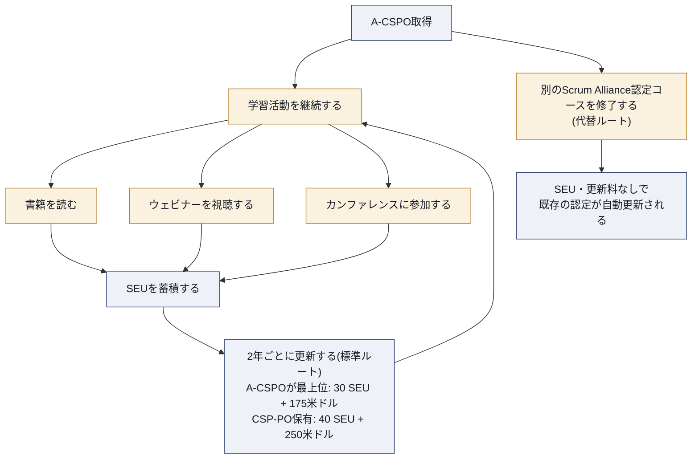

### 15.3 なぜ「学び続ける資格」なのか

Scrum自体が経験主義(検査と適応)に基づくフレームワークであることを踏まえると、資格制度自体が「一度学んで終わり」ではなく「継続的に学び、実践し、更新する」設計になっているのは自然なことです。A-CSPOを取得した後も、市場や組織の状況変化に応じて、プロダクトオーナーとしての手法をアップデートし続ける姿勢が求められます。

> **ベストプラクティス**：資格更新のためだけにSEUを集めるのではなく、日々の実務で読んだ記事や参加した勉強会を記録する習慣をつけておくと、更新時期にまとめて苦労することがなくなります。

**ソース**
1. Scrum Alliance「Certified Scrum Professional® - Product Owner (CSP®-PO)」公式ページ — https://www.scrumalliance.org/get-certified/product-owner-track/certified-scrum-professional-product-owner
2. Scrum Alliance「Scrum Education Units」公式ページ — https://www.scrumalliance.org/get-certified/scrum-education-units
3. Scrum Alliance Help Center「Updates to the Certified Enterprise Coach (CEC) and Certified Team Coach (CTC) programs」 — https://support.scrumalliance.org/hc/en-us/articles/35971003067291-Updates-to-the-Certified-Enterprise-Coach-CEC-and-Certified-Team-Coach-CTC-programs

---

## まとめ

A-CSPOは、CSPOで学んだ基礎知識を土台に、「複雑な現場で実際にプロダクトオーナーシップを発揮する」ための応用力を鍛える資格です。本ガイドで扱った5つの学習目標カテゴリーは、それぞれ以下のように要約できます。

1. **Product Owner Core Competencies**：自分自身のマインドセット、ステークホルダーとの協働、開発チームとの信頼関係、複数チームでのスケーリングという、プロダクトオーナーとしての土台を強化する
2. **Advanced Goal Setting and Planning**：プロダクト戦略を実際に運用可能な形に落とし込み、ステークホルダーと共同で計画を作る力を養う
3. **Empathizing with Customers and Users**：開発チーム全体が顧客に近づき、プロダクトディスカバリーの技術で「作る前に確かめる」姿勢を身につける
4. **Advanced Product Assumption Validation**：自分自身の認知バイアスに自覚的になり、Build-Measure-Learnのループで前提を継続的に検証する
5. **Product Backlog Management**：価値のモデル化・測定・順序付けの技術を使い分け、バックログを持続可能な規模と質で保つ

A-CSPOは、コースを受講して終わりではなく、これらの技術を実際の現場で試し、失敗し、調整し続けることで初めて身につくものです。認定取得後も、SEUを通じた継続学習と、日々の実務での実験を通じて、プロダクトオーナーとしての力を磨き続けていきましょう。

---

## 参考資料・出典一覧

| # | タイトル | 発行元・著者 | URL |
|---|---|---|---|
| 1 | Advanced Certified Scrum Product Owner (A-CSPO®) 公式ページ | Scrum Alliance | https://www.scrumalliance.org/get-certified/product-owner-track/advanced-certified-scrum-product-owner |
| 2 | A-CSPO Learning Objectives(2022年1月) | Scrum Alliance | https://www.scrumalliance.org/media/certifications/los/adv_cspo_learning_objectives_2022.pdf |
| 3 | Scrum Foundations® Learning Objectives(2022年1月、2024年2月フォーマット更新) | Scrum Alliance | https://assets.scrumalliance.org/media/certifications/los/scrum_foundations_learning_objectives_2022.pdf |
| 4 | Scrum Guide(2020年11月改訂版) | Ken Schwaber & Jeff Sutherland | https://scrumguides.org/ |
| 5 | Manifesto for Agile Software Development | Agile Manifesto | https://agilemanifesto.org/ |
| 6 | Scrum Values | Scrum Alliance | https://www.scrumalliance.org/about-scrum/values |
| 7 | Product Owner Track 概要ページ | Scrum Alliance | https://www.scrumalliance.org/get-certified/product-owner-track |
| 8 | Certified Scrum Product Owner® (CSPO®) 公式ページ | Scrum Alliance | https://www.scrumalliance.org/get-certified/product-owner-track/certified-scrum-product-owner |
| 9 | Certified Scrum Professional® - Product Owner (CSP®-PO) 公式ページ | Scrum Alliance | https://www.scrumalliance.org/get-certified/product-owner-track/certified-scrum-professional-product-owner |
| 10 | Scrum Education Units 公式ページ | Scrum Alliance | https://www.scrumalliance.org/get-certified/scrum-education-units |
| 11 | Certification Renewal 公式ページ | Scrum Alliance | https://www.scrumalliance.org/get-certified/renewing-certifications |
| 12 | bliki: Technical Debt | Martin Fowler | https://martinfowler.com/bliki/TechnicalDebt.html |
| 13 | bliki: Technical Debt Quadrant | Martin Fowler | https://martinfowler.com/bliki/TechnicalDebtQuadrant.html |
| 14 | The Nexus™ Guide(オンライン版) | Scrum.org | https://www.scrum.org/resources/online-nexus-guide |
| 15 | Weighted Shortest Job First (WSJF) | Scaled Agile Framework | https://framework.scaledagile.com/wsjf |
| 16 | Kano model | Wikipedia | https://en.wikipedia.org/wiki/Kano_model |
| 17 | Impact Mapping 公式サイト | Gojko Adzic ほか | https://www.impactmapping.org/ |
| 18 | Story Mapping Quick Reference | Jeff Patton | https://jpattonassociates.com/story-mapping-quick-ref/ |
| 19 | The Lean Startup — Principles | Eric Ries | https://theleanstartup.com/principles |
| 20 | Fourteen Cognitive Biases Common to Product Owners | Applied Frameworks | https://appliedframeworks.com/blog/fourteen-cognitive-biases-common-to-product-owners |
| 21 | How to Manage a Large Product Backlog | Scrum Alliance(Miloš Belčević) | https://resources.scrumalliance.org/Article/manage-large-product-backlog |
| 22 | Updates to the Certified Enterprise Coach (CEC) and Certified Team Coach (CTC) programs | Scrum Alliance Help Center | https://support.scrumalliance.org/hc/en-us/articles/35971003067291-Updates-to-the-Certified-Enterprise-Coach-CEC-and-Certified-Team-Coach-CTC-programs |
