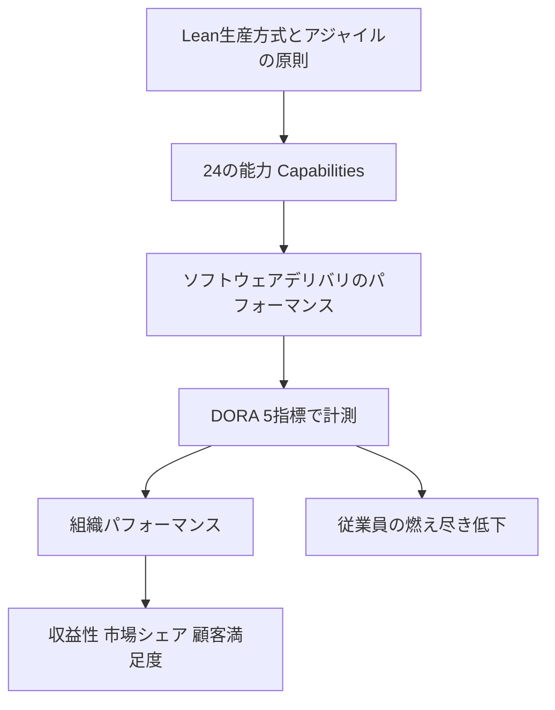
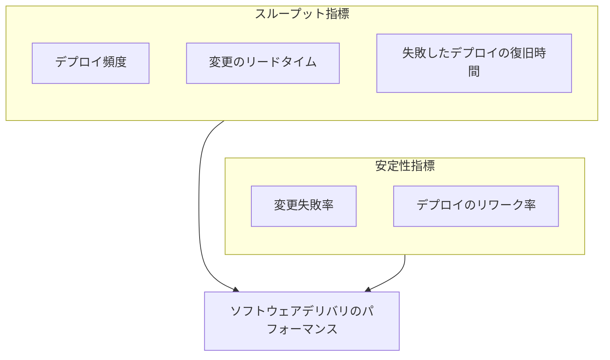
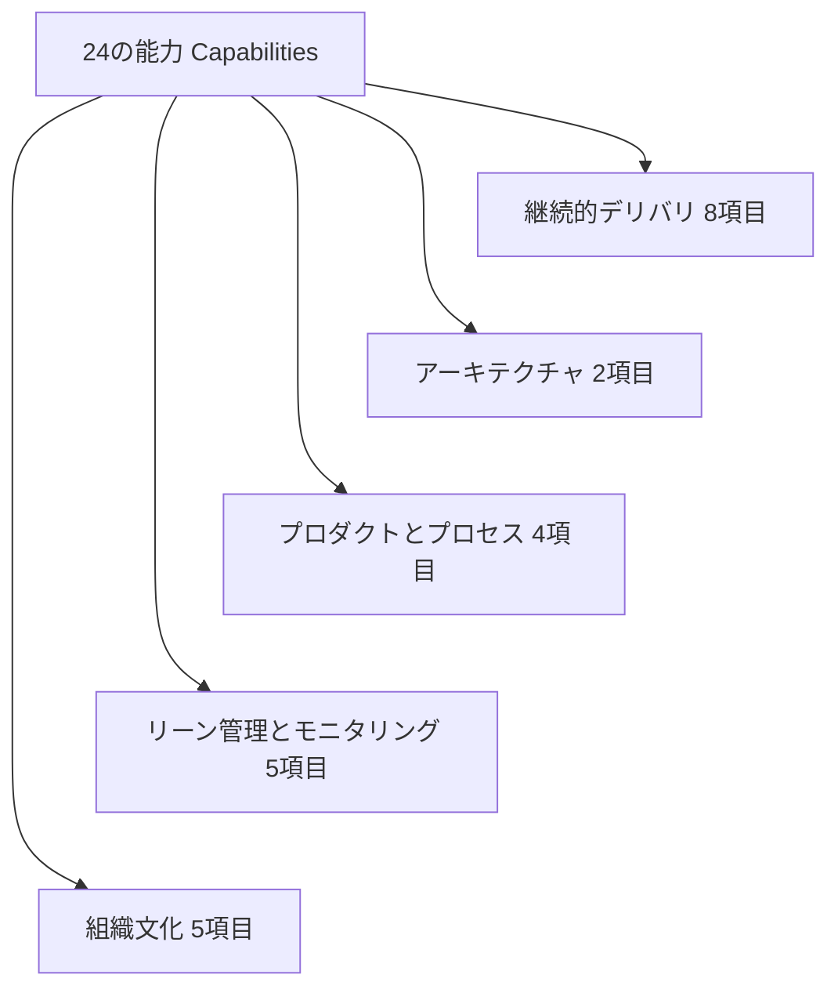
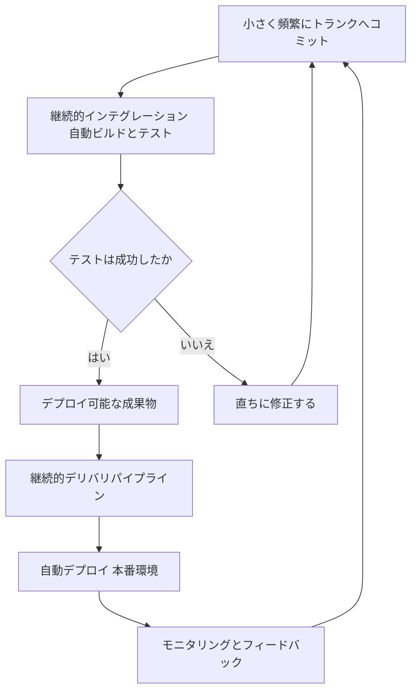
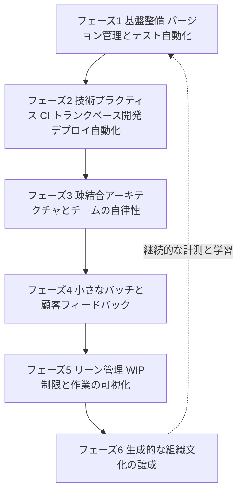
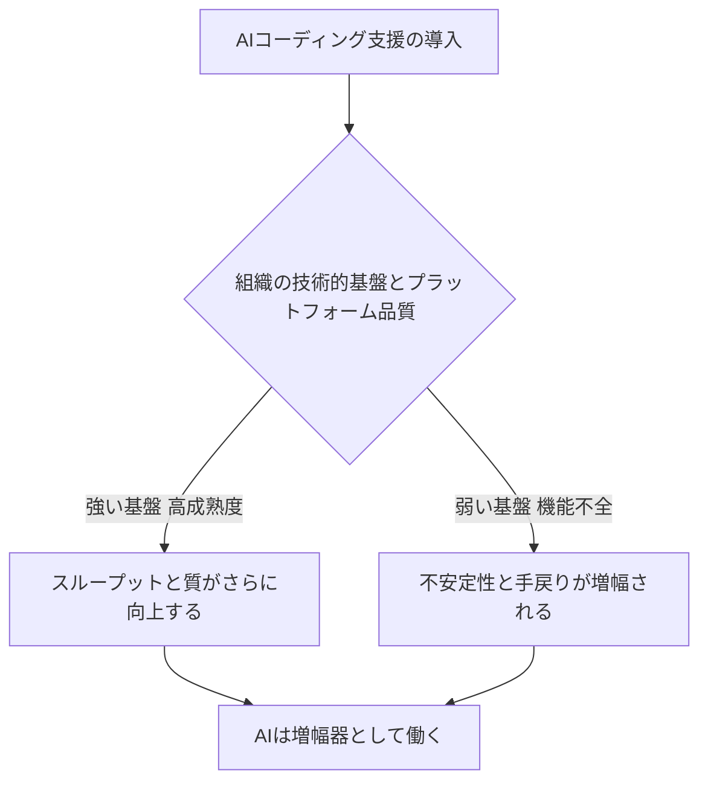

# Accelerate 入門ガイド ― Leanと DevOps の科学を初学者向けに解説

> 原著: *Accelerate: The Science of Lean Software and DevOps: Building and Scaling High Performing Technology Organizations*
> 著者: Dr. Nicole Forsgren / Jez Humble / Gene Kim（IT Revolution Press, 2018年）

本ページは、ソフトウェアデリバリのパフォーマンス研究書『Accelerate』を学ぶための非公式の解説ログです。正確な内容は必ず原著をご確認ください。あわせて、原著刊行（2018年）以降にDORA（DevOps Research and Assessment）チームが継続してきた年次調査「State of DevOps Report」の最新動向（2025年のAI支援開発に関する調査を含む）も参照しています。

---

## 目次

1. [Accelerateとは何か](#1-accelerateとは何か)
2. [なぜ「Lean」なのか ― LeanとDevOpsのつながり](#2-なぜleanなのか--leanとdevopsのつながり)
3. [ソフトウェアデリバリのパフォーマンスを測る: DORAメトリクス](#3-ソフトウェアデリバリのパフォーマンスを測る-doraメトリクス)
4. [パフォーマンスを生み出す24の能力（Capabilities）](#4-パフォーマンスを生み出す24の能力capabilities)
5. [組織文化を科学する: Westrumモデル](#5-組織文化を科学する-westrumモデル)
6. [初学者向けステップバイステップ実践ガイド](#6-初学者向けステップバイステップ実践ガイド)
7. [2026年時点のアップデート: AI支援開発とDORAの進化](#7-2026年時点のアップデート-ai支援開発とdoraの進化)
8. [よくある誤解とアンチパターン](#8-よくある誤解とアンチパターン)
9. [まとめ: 実践チェックリスト](#9-まとめ-実践チェックリスト)
10. [参考文献・出典](#10-参考文献出典)

---

## 1. Accelerateとは何か

『Accelerate』は、DORA（DevOps Research and Assessment）チームの共同創設者であるDr. Nicole Forsgren、Jez Humble、Gene Kimの3名が、2014年から継続してきた「State of DevOps Report」という年次調査の4年分の研究成果を一冊にまとめた書籍です。統計的因果推論の手法を用いて、どのような技術的・組織的プラクティスが「ソフトウェアデリバリのパフォーマンス」を高め、それが最終的に企業の収益性・市場シェア・顧客満足度といった組織パフォーマンスにつながるのかを、業種や企業規模を問わず数万件規模の調査データから明らかにした点が特徴です。出版元のIT Revolution PressによればShingo賞（生産性・オペレーショナルエクセレンスに関する権威ある賞）を受賞しており、実務よりも「勘と経験」に頼りがちだったソフトウェア開発の意思決定に、統計的根拠を持ち込んだ先駆的な一冊として位置づけられています。

3人の著者の背景も特徴的です。Forsgren氏は主任研究者・統計学者として年次調査を率い、のちにGoogle傘下のDORAおよびMicrosoft Researchで研究を継続しました。Humble氏は2010年にDave Farley氏と共著した『Continuous Delivery』の著者であり、継続的デリバリという概念そのものの生みの親の一人です。Kim氏は2013年の小説形式のビジネス書『The Phoenix Project』の著者で、DevOpsの基本思想である「The Three Ways（フロー・フィードバック・継続的学習の3つの道）」を広めた人物です。

DORAチームは2015年に設立され、2018年にGoogle Cloudの一部となりました。その後もチームは毎年「State of DevOps Report」を発行し続けており、直近では2024年版で世界39,000人超の専門家を対象に調査を実施、2025年にはAI支援開発に特化した新しい報告書シリーズを開始しています（詳細は第7章）。

Accelerateの中心的な主張はシンプルです。**ソフトウェアデリバリの速さと安定性の間にトレードオフは存在しない。** ハイパフォーマンスな組織は、高速なデプロイと高い安定性を同時に達成しています。これは「急いては事を仕損じる」という直感に反する結論であり、本書が業界に大きなインパクトを与えた理由のひとつです。

---

## 2. なぜ「Lean」なのか ― LeanとDevOpsのつながり

原題にある通り、Accelerateは「Leanソフトウェアとデブオプスの科学」を扱っています。ここでいうLeanとは、トヨタ生産方式に代表される製造業の改善思想（W. Edwards Demingの統計的品質管理の考え方を含む）をソフトウェア開発に応用したものです。書籍内では、Deming の「恐怖があるところでは、誤った数値が生まれる」という警句がたびたび引用されており、メトリクスを恐怖による管理の道具にしてはならないという原則が随所で強調されています。

Lean思想がDevOpsに与えた主な概念は次のとおりです。

| Lean由来の概念 | ソフトウェア開発での適用 |
| --- | --- |
| 小さなバッチサイズ | 大きな機能を一度にリリースせず、小さく頻繁にデプロイする |
| フローの可視化 | バリューストリーム（価値の流れ）全体を見える化し、ボトルネックを特定する |
| WIP（仕掛かり作業）の制限 | 同時に着手するタスク数を制限し、フローを最適化する |
| 継続的な改善（カイゼン） | 一度作って終わりではなく、恒常的にプロセスを見直し続ける |
| 現場への権限委譲 | 現場のエンジニアが変更を判断できるようにし、承認待ちのボトルネックを減らす |

Accelerateの継続的デリバリに関する技術的プラクティスの多くは、Jez Humble氏がDave Farley氏と2010年に著した『Continuous Delivery』に由来しています。同書の中心的な主張は、「ソフトウェアは常にリリース可能な状態に保つべきであり、そのためには変更を溜め込まず継続的に統合し続けることが必要」というものです。この考え方が、後述するトランクベース開発や継続的インテグレーションといった実践プラクティスの理論的支柱になっています。

---

## 3. ソフトウェアデリバリのパフォーマンスを測る: DORAメトリクス

### 3.1 4つの鍵指標から5指標モデルへ

Accelerateが世に広めた最大の功績は、ソフトウェアデリバリのパフォーマンスを**4つの指標（Four Keys）**で定量化できることを示した点です。これらは「DORAメトリクス」または「Accelerateメトリクス」とも呼ばれます。DORAチームはその後も研究を継続しており、指標体系は次のように進化してきました。

| 年 | 変化 |
| --- | --- |
| 2014年〜 | デプロイ頻度、変更のリードタイム、MTTR（平均修復時間）の3変数でIT パフォーマンスを定義 |
| 2015年〜 | 変更失敗率を加えた4指標体系（スループット×安定性）が定着 |
| 2018年 | Accelerate出版。4つの鍵指標として広く認知される |
| 2021年 | 5番目の指標として「信頼性（Reliability）」を追加 |
| 2023年 | MTTRを「失敗したデプロイの復旧時間」に名称変更（変更起因の障害と外部要因を分離するため） |
| 2024年 | 変更失敗率から「デプロイのリワーク率」を分離。現行の5指標モデルへ |
| 2025年〜 | AI支援開発時代に対応した補助的な計測フレームワークの検討が進行中（第7章参照） |

現行の5指標は次のとおりです。

| 指標 | 説明 | スループット/安定性 |
| --- | --- | --- |
| デプロイ頻度 | 本番環境へのリリース頻度 | スループット |
| 変更のリードタイム | コードのコミットから本番稼働までの所要時間 | スループット |
| 失敗したデプロイの復旧時間 | サービス低下を引き起こした失敗デプロイから、サービスが復旧するまでの所要時間。デプロイに起因しない障害は対象外（旧称: MTTR） | スループット |
| 変更失敗率 | デプロイのうちサービス低下や修正を要した割合 | 安定性 |
| デプロイのリワーク率 | 本番の不具合対応のために発生した計画外デプロイの割合 | 安定性 |

これらに加え、システムの可用性やSLO（サービスレベル目標）の達成度を測る「信頼性」が準指標として位置づけられており、SRE（サイト信頼性エンジニアリング）チームとDevOpsチームの協働を促す役割を果たしています。

### 3.2 パフォーマンス階層のベンチマーク

年次調査では、回答データをクラスタ分析にかけ、Elite（エリート）／High（高）／Medium（中）／Low（低）というパフォーマンス階層を識別してきました。近年の調査（2024年版）では次のような目安が示されています（あくまで年ごとに変動する参考値です）。

| 階層 | 変更失敗率の目安 | 特徴 |
| --- | --- | --- |
| Elite | 約5%前後 | オンデマンドでのデプロイ、1時間未満での障害復旧 |
| High | 約20%前後 | 高い頻度でのデプロイ、比較的短い復旧時間 |
| Medium | 中間的な水準 | 週〜月単位のデプロイ |
| Low | 約40%前後 | デプロイ頻度が低く、復旧にも長時間を要する |

2024年版の調査では、エリート層が全体の19%にとどまる一方、低パフォーマンス層は前年の17%から25%へ増加したと報告されており、パフォーマンスの二極化が進んでいる可能性が指摘されています。

> **注意点**: DORAチーム自身が2023年10月、これらの指標をチーム間の序列づけ（リーグテーブル）に使うことに警鐘を鳴らしています。指標は「自分たちの過去と比較して改善しているか」を確認するための道具であり、他チームとの比較や個人評価に用いるとGoodhartの法則（測定対象が目標化されると、その測定は意味を失う）が働き、数値の水増しなど逆効果を招く恐れがあります。

---

## 4. パフォーマンスを生み出す24の能力（Capabilities）

DORAメトリクスは「結果」であり、Accelerateの本当の価値はその結果を生み出す**24の能力（Capabilities）**の特定にあります。これらは統計的に検証された、ハイパフォーマンスと相関の高い具体的なプラクティス群で、5つのカテゴリに整理されています。

### 4.1 継続的デリバリの能力（8項目）

| # | 能力 | 要点 |
| --- | --- | --- |
| 1 | バージョン管理 | アプリケーションコードだけでなく、構成情報やインフラ定義もバージョン管理下に置く |
| 2 | デプロイの自動化 | 手作業を排除し、ボタン一つ・コマンド一つで再現性のあるデプロイを実現する |
| 3 | 継続的インテグレーション（CI） | 変更を頻繁に統合し、自動ビルド・テストで即座に検証する |
| 4 | トランクベース開発 | 長命なフィーチャーブランチを避け、1日1回以上トランクへ統合する |
| 5 | テスト自動化 | 信頼できる自動テストスイートを整備し、手動テストへの依存を減らす |
| 6 | テストデータ管理 | テストに必要なデータを適切に管理し、テストの高速化と安定化を図る |
| 7 | セキュリティのシフトレフト | セキュリティ対策を開発の初期段階から組み込む |
| 8 | 継続的デリバリ（CD） | いつでも安全にリリースできる状態をパイプライン全体で維持する |

### 4.2 アーキテクチャの能力（2項目）

| # | 能力 | 要点 |
| --- | --- | --- |
| 9 | 疎結合アーキテクチャ | 他チームの成果物に依存せずテスト・デプロイできる設計にする |
| 10 | 権限委譲されたチーム | チームがツールや技術選定について自律的に意思決定できるようにする |

### 4.3 プロダクトとプロセスの能力（4項目）

| # | 能力 | 要点 |
| --- | --- | --- |
| 11 | 顧客フィードバック | 顧客からのフィードバックを収集し、プロダクトの意思決定に反映する |
| 12 | バリューストリームの可視化 | 企画から本番稼働までの価値の流れ全体を関係者が把握できるようにする |
| 13 | 小さなバッチでの作業 | 作業を小さな単位に分割し、フィードバックループを短くする |
| 14 | チームによる実験 | 新しいアイデアを低リスクで試せる環境を整える |

### 4.4 リーン管理とモニタリングの能力（5項目）

| # | 能力 | 要点 |
| --- | --- | --- |
| 15 | 軽量な変更承認プロセス | 重厚な承認会議ではなく、ピアレビューと自動チェックを軸にする |
| 16 | モニタリング | アプリケーションとインフラを横断的に監視し、ビジネス上の意思決定に活かす |
| 17 | プロアクティブな通知 | 問題が深刻化する前に検知し、関係者に知らせる仕組みを作る |
| 18 | WIP制限 | 同時進行のタスク数を制限し、フローを改善する |
| 19 | 作業の可視化 | かんばんボードなどで作業状況とボトルネックを見える化する |

### 4.5 組織文化の能力（5項目）

| # | 能力 | 要点 |
| --- | --- | --- |
| 20 | Westrum型組織文化 | 情報が自由に流れる「生成的文化」を醸成する（第5章で詳述） |
| 21 | 学習の支援 | 学習をコストではなく投資として捉え、時間と機会を提供する |
| 22 | チーム間のコラボレーション | 開発・運用・セキュリティなど職能を超えた協働を促す |
| 23 | 有意義な仕事と裁量権 | 挑戦しがいのある仕事を任せ、スキルを発揮できる裁量を与える |
| 24 | 変革型リーダーシップ | ビジョンを示し、知的刺激を与え、個々への配慮を行うリーダーシップ |

なお、DORAチームは書籍出版後も研究を継続しており、2021年時点で能力カタログは27項目まで拡張され、その後もプラットフォームエンジニアリングやドキュメント品質など新たな能力が追加され続けています（最新のカタログは公式サイト dora.dev で公開されています）。

---

## 5. 組織文化を科学する: Westrumモデル

Accelerateの中でも特に印象的なのが、組織文化を定量的に扱った第3章です。著者らは、航空業界や医療分野など高リスク・高信頼性が求められる領域の事故分析を専門とする社会学者Ron Westrum氏が提唱した組織文化の類型論を応用しています。Westrum氏の理論は「良い情報がどれだけ組織内を流れるか」が安全性とパフォーマンスを予測するという考え方に基づいています。

| 文化のタイプ | 志向 | 協力の度合い | 悪い知らせを伝えた人への対応 | 失敗への反応 | 新しい発想への反応 |
| --- | --- | --- | --- | --- | --- |
| 病理的（Pathological） | 権力志向 | 低い協力 | messenger（伝達者）が罰せられる | 責任のなすりつけ | 潰される |
| 官僚的（Bureaucratic） | 規則志向 | 中程度の協力 | messengerが無視される | 公正な処理にとどまる | 問題視される |
| 生成的（Generative） | 成果志向 | 高い協力 | messengerが育成・歓迎される | 原因究明の機会になる | 積極的に実装される |

DORAの研究によれば、この「生成的文化」の度合いを測るWestrum調査項目（情報が積極的に求められているか、失敗が改善の機会として扱われているかなど6つの設問）は統計的に妥当性・信頼性が高く、生成的文化のスコアが高い組織ほど、ソフトウェアデリバリのパフォーマンスだけでなく組織パフォーマンス全体、さらには従業員の燃え尽き症候群の低減とも相関することが示されています。

重要なのは、著者らが「文化は謎めいた魔法ではなく、具体的なプラクティスを実装することで醸成できる」と主張している点です。つまり、良い文化を「待つ」のではなく、24の能力に挙げた具体的な行動（軽量な変更承認、学習支援、フィードバックの奨励など）を実践することによって、後から文化がついてくるという順序が示唆されています。

---

## 6. 初学者向けステップバイステップ実践ガイド

ここからは、Accelerateの知見を実際のチーム・組織に導入する際の実践的な順序を、初学者向けに段階を追って解説します。すべてを一度に導入する必要はありません。多くの高パフォーマンス組織も、小さな一歩から始めて継続的に改善を積み重ねています。

### ステップ0: 現状を診断する

いきなり施策を始める前に、自分たちのチームが今どの位置にいるかを把握しましょう。DORA公式サイトが提供する「DORA Quick Check」のような簡易診断ツールを使えば、数問の質問に答えるだけでデプロイ頻度・リードタイム・変更失敗率などの現在地を業界水準と比較できます。診断結果は「どの能力から着手すべきか」の優先順位づけに役立ちます。

### ステップ1: バージョン管理と作業の可視化から始める

- アプリケーションコードだけでなく、インフラ構成やデプロイスクリプトもすべてバージョン管理下に置きましょう。
- かんばんボードなどで、今誰が何に取り組んでいるかをチーム全体が見える状態にします。
- これは低コストで着手でき、後続のすべてのステップの土台になります。

### ステップ2: テストを自動化する

- 手動テストへの依存は、リリースを遅らせる最大の要因のひとつです。
- 信頼できる自動テストスイートを段階的に構築し、「テストが通れば安心してリリースできる」状態を目指します。
- テストデータの管理方法（本番データのマスキングやテスト用データセットの整備）も合わせて検討します。

### ステップ3: 継続的インテグレーションとトランクベース開発を導入する

継続的インテグレーション（CI）は、変更を頻繁に共有ブランチ（トランク／main）へ統合し、その都度自動ビルド・自動テストを走らせるプラクティスです。ThoughtWorksのチーフサイエンティストであるMartin Fowler氏は、長年にわたり長命なフィーチャーブランチの弊害について発信しており、統合のタイミングを遅らせるほどマージのコストが指数関数的に増大すると指摘しています。DORAの調査でも、ブランチの生存期間が1日未満であることや、アクティブなブランチ数が少ないことが継続的デリバリの重要な要素であることが確認されています。

トランクベース開発を実践するうえでの代表的なテクニックには、次のようなものがあります。

- **フィーチャートグル（Feature Toggle）**: Martin Fowler氏が体系化した手法で、未完成の機能をコードごとトランクにマージしつつ、フラグで有効・無効を切り替えることで、機能公開のタイミングと統合のタイミングを分離します。
- **Branch by Abstraction**: 大規模な変更を、抽象化レイヤーを介して段階的にトランク上で進める手法です。
- **短命なブランチ**: どうしてもブランチを切る場合も、1日以内にマージすることを目安にします。

トランクベース開発の実践に関する詳細な技法集は、Paul Hammant氏が運営するtrunkbaseddevelopment.comにも豊富にまとめられています。

### ステップ4: デプロイを自動化し、継続的デリバリを実現する

- 手動デプロイの手順書は、いずれ自動化スクリプトに置き換えましょう。
- 目指すゴールは「いつでも、誰でも、安全に、ボタン一つでデプロイできる」状態です。
- 継続的デリバリが実現すると、リリースは「特別なイベント」ではなく「日常の作業」になります。

### ステップ5: 疎結合アーキテクチャとチームの自律性を整える

- 他チームの成果物と密結合したアーキテクチャは、変更のたびに広範な調整を必要とし、デプロイ頻度を下げます。
- サービス指向・マイクロサービス的な設計への移行は、一度に全面刷新する必要はなく、段階的に進められます。
- あわせて、チームがツールや技術スタックを自律的に選択できる権限を持つことも、パフォーマンスに寄与することが示されています。

### ステップ6: 小さなバッチで作業し、顧客フィードバックを取り込む

- 大きな機能を一括でリリースするのではなく、小さな単位に分割して頻繁にリリースします。
- バリューストリーム全体（アイデアから本番稼働まで）を可視化し、どこで作業が滞留しているかを特定します。
- 顧客からのフィードバックを定期的に収集し、プロダクトの意思決定サイクルに組み込みます。

### ステップ7: リーン管理プラクティスを導入する

- 変更承認プロセスは、重厚な承認会議体（CAB: Change Advisory Board）ではなく、ピアレビューと自動化されたチェックを軸にします。DORAの2019年調査では、こうした軽量な承認プロセスの方が、重厚なプロセスよりも高いパフォーマンスと相関することが示されています。
- WIP（仕掛かり作業）に上限を設け、同時に着手するタスクを絞り込みます。
- アプリケーションとインフラの両方を横断的にモニタリングし、問題をプロアクティブに検知・通知する仕組みを整えます。

### ステップ8: 生成的な組織文化を醸成する

- 情報が自由に流れ、失敗が「誰の責任か」ではなく「システムのどこに改善余地があるか」を学ぶ機会として扱われる文化を目指します。
- 学習を「コスト」ではなく「投資」として位置づけ、時間とリソースを確保します。
- リーダーは明確なビジョンを示し、現場への権限委譲を進めます。

以上のステップは、一直線に一度きり実行するものではなく、継続的な計測と学習のサイクルとして繰り返し回していくものです。

---

## 7. 2026年時点のアップデート: AI支援開発とDORAの進化

Accelerateの刊行から数年が経ち、生成AIによるコーディング支援が急速に普及したことを受け、DORAチームは2025年、年次報告書のテーマを従来の「State of DevOps」から**「State of AI-assisted Software Development」**へと大きく転換しました。これは、ほぼ5,000人の技術専門家への調査と100時間超の定性データに基づく調査で、次のような知見が示されています。

- **AIは「増幅器（amplifier）」として働く**という中心的な主張が最大の発見です。既にハイパフォーマンスな組織ではAIがさらなる強みを増幅し、逆に技術的負債やプロセスの混乱を抱える組織では、AIがその機能不全を増幅してしまう、という「鏡」のような性質が確認されました。
- AI導入率は2025年時点で90%に達し、前年から14ポイント増加しています。1日あたりの利用時間の中央値は約2時間で、主な用途は新規コード作成（71%）、技術文献の調査（68%）、既存コードの修正（66%）、校正・レビュー（66%）などです。
- 2025年の調査では、AI導入とスループット（デプロイ頻度など）の間に正の相関が確認されました。これは、2024年の調査でAI導入がスループットにわずかな負の影響を与えていたとされた結果からの反転です。一方で、AI導入は依然として変更失敗率や手戻り（リワーク）の増加、すなわち安定性の低下と相関しており、「速くはなったが、より良くなったとは限らない」という課題が指摘されています。
- こうした不安定化の一因として、AIが生成したコードのレビュー・検証にかかる認知的負荷（いわゆる「検証税」）が、コーディング自体で節約された時間を相殺し、ボトルネックがテストやコードレビューといった下流工程へ移動している可能性が挙げられています。
- 報告書は、AIから真の価値を引き出せるかどうかは、ツールそのものよりも**内部プラットフォームの品質**に強く左右されると結論づけています。プラットフォーム品質が低い組織ではAIの効果はほぼ無視できる水準にとどまる一方、プラットフォーム品質が高い組織では、AIの効果が明確かつ強く現れます。
- あわせて公表された「DORA AI Capabilities Model」では、AIの恩恵を増幅する7つの能力が提示されています。また、チームを7つの「アーキタイプ（類型）」（例: 調和のとれたハイアチーバー「harmonious high-achievers」から、レガシーの足かせを抱える「legacy bottleneck」まで）に分類し、それぞれに適した改善の道筋を示す枠組みも導入されました。
- **バリューストリームマネジメント（VSM）**、すなわち企画から顧客への価値提供までの流れを可視化・改善する取り組みが、AIによる個々の生産性向上をチーム・プロダクトレベルの成果へとつなげる「増幅器の増幅器」として機能することも示されています。

さらに指標体系そのものも進化を続けています。2024年の報告書で変更失敗率から「デプロイのリワーク率」が分離されて以降、DORAは2026年に入っても指標体系のアップデートを続けており、公式サイトでは「4つの鍵指標から現行の5指標モデルへの移行」の経緯を解説する記事が公開されています。また2026年6月には、AIのトークン消費量そのものを成果指標として奨励する「tokenmaxxing」という風潮に対して、DORAチームが注意を促す記事を公開するなど、AI時代特有の計測上の落とし穴についても継続的に情報発信が行われています。

> **補足**: 本ガイドの知識のカットオフ以降も、DORAの研究は継続的にアップデートされています。最新の指標定義や能力カタログを確認したい場合は、公式サイト dora.dev を直接参照することをお勧めします。

---

## 8. よくある誤解とアンチパターン

Accelerateの知見を導入する際に陥りやすい誤解を整理します。

| アンチパターン | なぜ問題か | 代替アプローチ |
| --- | --- | --- |
| DORAメトリクスでチームや個人を序列化する | DORAチーム自身が2023年に警鐘を鳴らした誤用。Goodhartの法則により数値の水増しを招く | 自チームの過去の実績との比較にとどめ、改善のための対話の起点として使う |
| 指標だけを追い、24の能力（実践）を導入しない | 指標は結果であり、原因である実践を変えなければ改善しない | まず能力（バージョン管理、CI、トランクベース開発など）の導入から着手する |
| デプロイ頻度だけを上げようとする | スループットだけを追うと、安定性を犠牲にした「見せかけの改善」になりかねない | スループットと安定性の両方を同時に計測・改善する |
| 文化を「自然に生まれるもの」として放置する | Accelerateは文化を具体的なプラクティスの結果として捉えている | 軽量な変更承認や学習支援など、文化を醸成する行動から着手する |
| AI導入を「ツールを配るだけ」で終わらせる | 2025年のDORA調査で、プラットフォーム品質が低いとAIの効果はほぼ無いことが判明 | AI導入前後で内部プラットフォームやワークフローの整備に投資する |

---

## 9. まとめ: 実践チェックリスト

- [ ] 自チームの現状（デプロイ頻度・リードタイム・変更失敗率・失敗したデプロイの復旧時間・リワーク率）を把握した
- [ ] アプリケーションコードとインフラ構成の両方をバージョン管理下に置いた
- [ ] 自動テストスイートを整備し、手動テストへの依存を減らしている
- [ ] トランクベース開発とCIを導入し、ブランチの生存期間を1日未満に抑えている
- [ ] デプロイを自動化し、継続的デリバリの状態に近づけている
- [ ] アーキテクチャの疎結合化とチームの自律性向上に取り組んでいる
- [ ] 小さなバッチでの作業と顧客フィードバックの取り込みを実践している
- [ ] 変更承認プロセスを軽量化し、WIPを制限し、作業を可視化している
- [ ] 生成的な組織文化（情報の自由な流れ、学習支援、心理的安全性）を意識的に醸成している
- [ ] AIを導入する際は、ツール単体ではなくプラットフォーム品質やワークフロー全体に投資している

Accelerateがもたらした最大の教訓は、「ソフトウェアデリバリのパフォーマンスは、運や才能ではなく、具体的で再現可能なプラクティスの積み重ねによって高められる」という点です。本ガイドで紹介したステップを、自分たちのチームの状況に合わせて少しずつ取り入れてみてください。

---

## 10. 参考文献・出典

本ガイドの作成にあたり、2026年8月24日時点で参照可能な以下の情報源を調査しました（DORA公式・Google Cloud公式・著名なソフトウェアエンジニアや組織による発信を優先しています）。

1. DORA公式サイト（DevOps Capabilities カタログ） ― https://dora.dev/devops-capabilities/
2. DORA公式サイト（Capabilities: Generative organizational culture） ― https://dora.dev/capabilities/generative-organizational-culture/
3. DORA公式サイト（DORAの指標体系の歴史） ― https://dora.dev/insights/dora-metrics-history/
4. DORA公式サイト（ソフトウェアデリバリのパフォーマンス指標ガイド） ― https://dora.dev/guides/dora-metrics-four-keys/
5. DORA公式サイト（Capabilities: Trunk-based development） ― https://dora.dev/capabilities/trunk-based-development/
6. DORA公式サイト（Capabilities: Platform engineering） ― https://dora.dev/capabilities/platform-engineering/
7. DORA公式サイト（2025年次まとめ） ― https://dora.dev/insights/dora-2025-year-in-review/
8. DORA公式サイト（2025 State of AI-assisted Software Development） ― https://dora.dev/dora-report-2025/
9. Google Cloud Blog（2025 DORA Report発表） ― https://cloud.google.com/blog/products/ai-machine-learning/announcing-the-2025-dora-report
10. Google Blog（2025 DORA Reportの主要な発見） ― https://blog.google/innovation-and-ai/technology/developers-tools/dora-report-2025/
11. IT Revolution（書籍『Accelerate』紹介ページ） ― https://itrevolution.com/product/accelerate/
12. IT Revolution（24の主要能力の解説記事） ― https://itrevolution.com/articles/24-key-capabilities-to-drive-improvement-in-software-delivery/
13. IT Revolution（AIの「鏡効果」に関する分析記事） ― https://itrevolution.com/articles/ais-mirror-effect-how-the-2025-dora-report-reveals-your-organizations-true-capabilities/
14. Wikipedia（Accelerate (book)） ― https://en.wikipedia.org/wiki/Accelerate_(book)
15. Wikipedia（DevOps Research and Assessment） ― https://en.wikipedia.org/wiki/DevOps_Research_and_Assessment
16. Martin Fowler公式サイト（Patterns for Managing Source Code Branches） ― https://martinfowler.com/articles/branching-patterns.html
17. Martin Fowler公式サイト（Continuous Integration） ― https://martinfowler.com/articles/continuousIntegration.html
18. continuousdelivery.com（Jez Humble, Continuous Integration解説） ― https://continuousdelivery.com/foundations/continuous-integration/
19. ThoughtWorks（Four Key Metricsに関するビジネス価値の解説） ― https://www.thoughtworks.com/en-us/insights/articles/improving-your-bottom-line-with-four-key-metrics
20. ThoughtWorks（2025 DORA Reportに関する解説） ― https://www.thoughtworks.com/en-us/insights/reports/the-2025-dora-report
21. ThoughtWorks（トランクベース開発とデプロイパイプライン） ― https://www.thoughtworks.com/insights/blog/enabling-trunk-based-development-deployment-pipelines
22. Paul Hammant氏によるトランクベース開発の解説 ― https://paulhammant.com/2013/04/05/what-is-trunk-based-development/
23. Luca Rossi（Refactoring）による書籍レビュー・24能力の解説 ― https://refactoring.fm/p/accelerate
24. Swarmia（DORAメトリクスの実践ガイド） ― https://www.swarmia.com/blog/dora-metrics/
25. Splunk（2025 DORA Reportのレビュー記事） ― https://www.splunk.com/en_us/blog/learn/state-of-devops.html
26. CD Foundation（DORA 4指標から5指標への変化の解説） ― https://cd.foundation/blog/2025/10/16/dora-5-metrics/
27. Software Meadows（『Accelerate』チャプター別ノート、24能力の一覧） ― https://www.softwaremeadows.com/devops/accelerate_notes_and_quotes/
28. Psych Safety（Westrumの組織文化類型論の解説） ― https://psychsafety.com/psychological-safety-81-westrums-cultural-typologies/

---

*本ガイドはMarkdown形式で作成されています。フローチャートはすべてMermaid記法で記述されており、対応するMarkdownビューアで直接レンダリングできます。*
