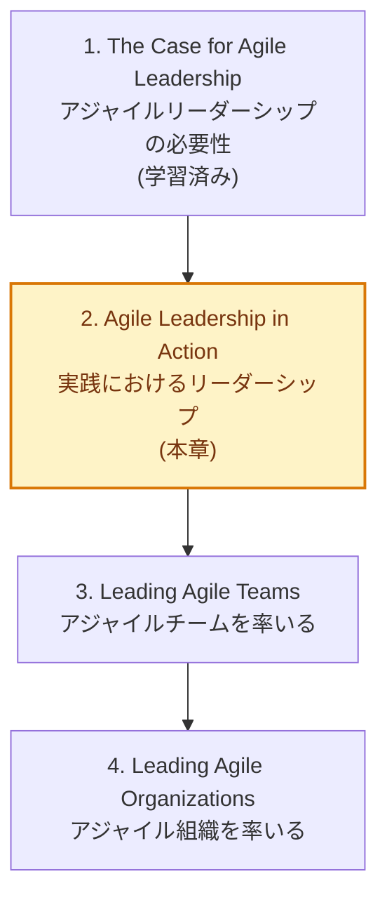
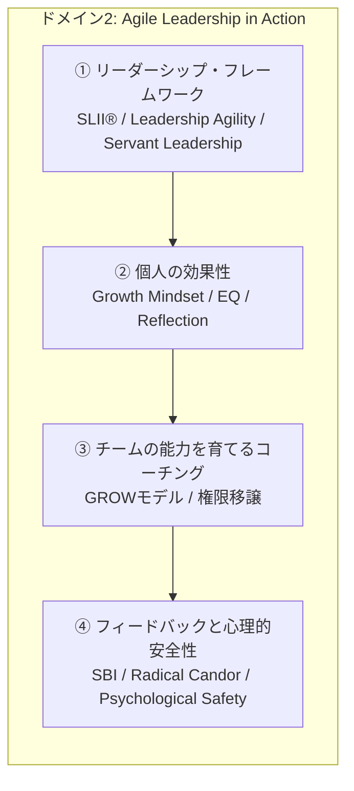
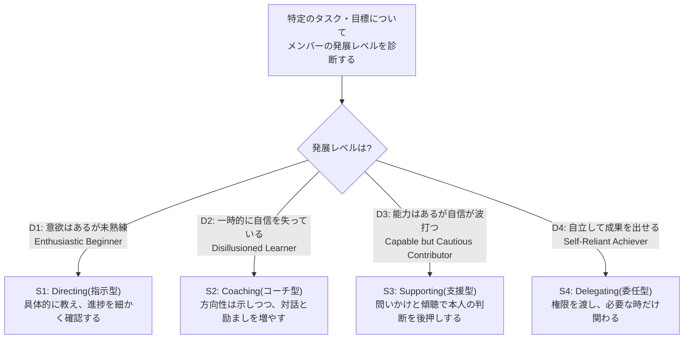
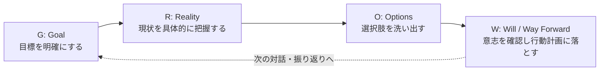
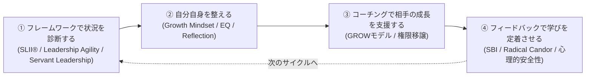

# 第2章:実践におけるリーダーシップ(Agile Leadership in Action)

> CAL1(Certified Agile Leader® 1)学習ガイド シリーズ 第2章
> 対象読者:CAL1(Certified Agile Leader® 1)の取得を目指す初学者
> 前提:第1章「The Case for Agile Leadership(アジャイルリーダーシップの必要性)」を学習済みであること

---

## 目次

1. [この章の位置づけ](#0-この章の位置づけ)
2. [ドメイン2の全体構造](#1-ドメイン2の全体構造)
3. [アジャイルリーダーシップ・フレームワークの理解と活用](#2-アジャイルリーダーシップフレームワークの理解と活用)
4. [個人の効果性(Personal Effectiveness)を高める](#3-個人の効果性personal-effectivenessを高める)
5. [チームメンバーの能力を育てるコーチングスキル](#4-チームメンバーの能力を育てるコーチングスキル)
6. [フィードバックと心理的安全性](#5-フィードバックと心理的安全性)
7. [まとめ：ドメイン2のリーダーシップ成長ループ](#6-まとめドメイン2のリーダーシップ成長ループ)
8. [自己診断チェックリスト](#7-自己診断チェックリスト)
9. [主要フレームワーク早見表](#8-主要フレームワーク早見表)
10. [参考文献・出典](#9-参考文献出典sources)

---

## 0. この章の位置づけ

Scrum Alliance® の CAL1(Certified Agile Leader® 1)は、学習目標(Learning Objectives)を、トレーニング提供元の公開分類にならって大きく4つのドメインに整理できます。第1章では「なぜアジャイルリーダーシップが必要なのか」という土台を扱いました。本章(ドメイン2)は、その考え方を**リーダー自身の行動として実践に移す**段階です。



Scrum Alliance公式ページでは、ドメイン2の狙いを「個人の効果性(personal effectiveness)を高めるためのリーダーシップフレームワークを学び、応用すること。そしてチームの能力(competencies)を伸ばすための重要なリーダーシップスキルを身につけること」と説明しています[^1]。CAL1のトレーニング提供元各社(例:PM-Partners社)も、この定義とほぼ同一の表現で本ドメインを紹介しています[^2]。

> **重要な注記(正確性について)**
> CAL1の詳細な学習目標(Learning Objectives)一覧は、Scrum Alliance公式サイトからリンクされているPDF資料に記載されていますが、このPDFはGoogleアカウントでのサインインが必要な限定公開資料であり、本ガイド作成時点では本文を直接取得できませんでした[^1][^3]。そのため本章は、Scrum Alliance公式ページの説明文[^1]と、公式に認定されたトレーニングパートナーが公開しているコース概要[^2]、およびCALプログラムの設計に関わったPete Behrens氏へのインタビュー記事[^4][^5]という、複数の公開情報源を突き合わせて構成しています。受講予定の方は、必ず申込先のCALトレーナーが提供する参加者ワークブックで正式な学習目標を確認してください。

---

## 1. ドメイン2の全体構造

「実践におけるリーダーシップ」は、大きく4つの柱で構成されていると整理できます。



この4つは独立した知識ではなく、**「まず自分の状況判断の引き出し(フレームワーク)を増やし → 自分自身を整え(個人の効果性) → その視点でメンバーを支援し(コーチング) → 支援の効果を対話で定着させる(フィードバック)」**という一連の流れとして理解すると、初学者でも全体像をつかみやすくなります。

---

## 2. アジャイルリーダーシップ・フレームワークの理解と活用

CAL1のプログラム設計者の一人であるPete Behrens氏は、Scrum Allianceの理事を務めながら、リーダーシップ開発の分野で実績のあるコーチとして、この認定プログラムの立ち上げに携わりました[^4][^5]。CAL1で紹介される代表的なリーダーシップ理論には、以下の3つがあります。

### 2.1 状況対応リーダーシップ SLII®(Situational Leadership® II)

Paul HerseyとKen Blanchardが1960年代に提唱し、後にBlanchard社が発展させたモデルです[^6]。**「唯一絶対の正しいリーダーシップスタイルは存在せず、相手の発展段階に応じてスタイルを変えるべきだ」**という考え方が中心にあります[^7]。

メンバーの発展レベル(Development Level)を診断し、それに合わせて指示・支援の配分を変えます。



| 発展レベル(D) | 状態の特徴 | 適したスタイル(S) | リーダーの主な行動 |
|---|---|---|---|
| D1 意欲満々の初心者 | やる気は高いがスキル・経験が浅い | S1 Directing | 具体的な指示、頻繁な進捗確認 |
| D2 幻滅した学習者 | 期待より難しいと感じ、やる気が落ちる | S2 Coaching | 指示は続けつつ、対話・説明を増やす |
| D3 慎重な貢献者 | スキルはあるが自信・意欲が不安定 | S3 Supporting | 傾聴・質問を中心に、意思決定を任せる |
| D4 自立した達成者 | スキル・自信ともに高い | S4 Delegating | 権限委譲し、リソース提供に徹する |

**ベストプラクティス**
- 「この人はリーダーとしてどう扱うか」ではなく、**「このタスクについて、この人は今どの発展レベルか」**をタスクごとに診断する(同じ人でも業務内容によってD1〜D4は変わる)。
- D4の相手に対してS1(指示型)を続けると、マイクロマネジメントとして受け取られ、モチベーションを損なう典型的な失敗パターンになる。
- 1on1では、冒頭で「このテーマについて、あなたは今どのくらい自信・経験がありますか?」と本人に発展レベルを言語化してもらうと、スタイルのミスマッチを防ぎやすい。

### 2.2 リーダーシップ・アジリティ モデル(Leadership Agility)

Bill JoinerとStephen Josephsが2006年の著書『Leadership Agility』で提唱したモデルで、成人発達理論(adult development theory)を基盤としています[^8][^9]。リーダーが発達段階を経て成長していくという考え方に立ち、5つの段階(Expert・Achiever・Catalyst・Co-Creator・Synergist)を定義しています[^9][^10]。実務で多く見られるのは最初の3段階で、全体のおよそ95%以上のリーダーがここに含まれるとされています[^10]。

| 段階 | 焦点 | 特徴・限界 |
|---|---|---|
| Expert(エキスパート) | 自分の専門性で問題を解決する | 個人としての正しさにこだわりやすく、権限移譲が苦手 |
| Achiever(達成者) | 明確な目標に向けてチームを管理する | 目標達成志向が強く、対話より結果を優先しがち |
| Catalyst(触媒) | ビジョンを示し、参加型の意思決定を促す | メンバーの自律を引き出す関わり方に転換する段階 |
| Co-Creator(共創者) | 複数の視点を統合し、組織横断で協働する | 権限や役割の境界にとらわれず共に創造する |
| Synergist(相乗者) | システム全体の相互依存関係の中で導く | 到達する人は極めて少ない、最も成熟した段階 |

このモデルはアジャイル運動とは無関係に研究・確立されたにもかかわらず、「変化に適応し続ける」というアジャイルの価値観と非常に親和性が高いことから、CALプログラムの理論的基盤の一つに採用されたと説明されています[^10]。

**ベストプラクティス**
- 自分が普段どの段階の振る舞いに偏っているかを、1つの重要な意思決定を振り返って自己診断してみる(例:「あの時、自分の専門知識で押し切った=Expert的な振る舞い」)。
- Achiever段階のリーダーがCatalystへ移行する際によくあるつまずきは、「参加型にする」ことと「決めない」ことを混同してしまう点。ビジョンを示した上で対話を促す、という順序を意識する。
- 段階は優劣ではなく「状況に応じてどこまで対応の幅を持てるか」の指標として使う。

### 2.3 サーバントリーダーシップ(Servant Leadership)

Robert K. Greenleafが1970年のエッセイ『The Servant as Leader』で提唱した考え方です[^11]。Greenleafは「サーバントリーダーとは、まず奉仕したいという自然な気持ちがあり、その後に意識的な選択としてリードすることを志す人」と述べています[^11]。従来型のリーダーシップが「権力の頂点からの統率」であるのに対し、サーバントリーダーシップは**権限を分かち合い、他者の成長と成果を最優先にする**という発想の転換を伴います[^11]。

Greenleafの考えを体系化したLarry Spearsは、サーバントリーダーに共通する10の特性を整理しています[^12]。

- 傾聴(Listening)
- 共感(Empathy)
- 癒やし(Healing)
- 気づき(Awareness)
- 納得を得る力(Persuasion)
- 概念化(Conceptualization)
- 先見性(Foresight)
- スチュワードシップ(Stewardship)
- 人々の成長への関与(Commitment to the growth of people)
- コミュニティづくり(Building community)

**ベストプラクティス**
- 1on1や振り返りの場で、まず「今週困っていることは?」と相手のニーズを聞くことから始め、指示から入らない。
- スクラムマスターやプロダクトオーナーなど、公式な権限が小さい役割ほど、サーバントリーダーシップの発想(奉仕を通じた影響力)が実務上のリーダーシップの主軸になる。
- 「奉仕」と「御用聞き」を混同しない。相手の言いなりになることではなく、相手の**成長と自律**を目的とした支援である点を意識する。

### フレームワークの使い分け早見表

| フレームワーク | 主な焦点 | 得意な場面 |
|---|---|---|
| SLII®(状況対応リーダーシップ) | タスク単位でのリーダー行動の調整 | 1on1、日々のタスク委任、新しいメンバーの立ち上げ |
| Leadership Agility(リーダーシップ・アジリティ) | リーダー自身の発達段階の自己認識 | 自己のキャリア発達、複雑な変革局面での意思決定スタイルの見直し |
| Servant Leadership(サーバントリーダーシップ) | 権限より奉仕を通じた影響力 | チーム文化の醸成、心理的安全性の土台づくり |

---

## 3. 個人の効果性(Personal Effectiveness)を高める

他者を導く前に、リーダー自身の内面の在り方(mindset)と自己理解を整えることが、CAL1で強調されるもう一つの柱です。

### 3.1 成長マインドセット(Growth Mindset)

スタンフォード大学の心理学者Carol Dweckは、人には大きく2種類のマインドセットがあると説明しています[^13]。

- **fixed mindset(硬直マインドセット)**:知能や能力は生まれつき決まっており、変えられないという考え方
- **growth mindset(成長マインドセット)**:能力は努力と学習によって伸ばせるという考え方

Dweckの研究では、失敗を「自分には向いていない証拠」と捉えるか、「学習の機会」と捉えるかで、その後の挑戦意欲や粘り強さに大きな差が生まれることが示されています[^13][^14]。

**ベストプラクティス**
- チームメンバーを評価するとき、結果だけでなく「取り組み方・工夫・学習プロセス」を具体的に言葉にしてフィードバックする。
- リーダー自身が「まだやったことがない」「今回はうまくいかなかった」を率直に口に出すことで、チームに学習を歓迎する空気を作る。
- 「できる/できない」ではなく「今はまだできていない(not yet)」という言い回しを意識的に使う。

### 3.2 自己認識とEQ(Emotional Intelligence)

心理学者Daniel Golemanが広めたEQ(感情的知性)の枠組みでは、リーダーに必要な力として次の5要素が挙げられます。

| 要素 | 内容 |
|---|---|
| 自己認識(Self-awareness) | 自分の感情・強み・弱みを正確に把握する力 |
| 自己統制(Self-regulation) | 衝動的な反応を抑え、状況に応じて感情を扱う力 |
| 動機づけ(Motivation) | 外的報酬だけでなく内発的な目的意識で動く力 |
| 共感(Empathy) | 他者の感情や立場を理解する力 |
| 社会的スキル(Social skill) | 関係構築や対立の調整を行う力 |

**ベストプラクティス**
- 感情が高ぶった状態で重要な意思決定やフィードバックを行わない(一呼吸置くルールを自分に課す)。
- 週次で「今週、自分の感情が大きく動いた出来事は何か」を短く記録し、パターンを可視化する。
- 部下やピアに「自分の伝え方で分かりにくい・威圧的だと感じる点はあるか」を定期的に尋ね、自己認識を他者視点で補正する。

### 3.3 リフレクション(内省)の習慣化

アジャイルの「検査と適応(inspect and adapt)」はチームのふりかえり(レトロスペクティブ)だけでなく、リーダー個人の内省習慣にも応用できます。

**ベストプラクティス**
- スプリントやイテレーションの区切りごとに、チームの振り返りとは別に「リーダーとしての自分」に対する短いセルフふりかえりの時間を5〜10分確保する。
- 「今週、うまく機能したリーダー行動は何か」「次に試したい行動は何か」の2問だけに絞ると継続しやすい。
- 信頼できるメンター・コーチ・ピアグループを持ち、内省を一人で完結させずに他者の視点を取り入れる。

---

## 4. チームメンバーの能力を育てるコーチングスキル

### 4.1 コーチング・メンタリング・ティーチング・コンサルティングの違い

アジャイルリーダーはこれらの関わり方を意図的に使い分ける必要があります。混同すると、相手の自律を奪ってしまったり、逆に必要な情報提供を怠ってしまったりします。

| 関わり方 | 主導権 | 目的 | 典型的な場面 |
|---|---|---|---|
| ティーチング(Teaching) | 教える側 | 知識・スキルを直接伝える | 新しいツールの使い方を教える |
| メンタリング(Mentoring) | 経験者が助言 | 自分の経験を踏まえて助言する | キャリアパスの相談に乗る |
| コンサルティング(Consulting) | 専門家が提案 | 専門知見に基づく解決策を提示する | 技術的な設計の代替案を示す |
| コーチング(Coaching) | 相手本人 | 相手自身の中にある答えを引き出す | 相手が自分で意思決定できるよう支援する |

国際コーチング連盟(ICF: International Coaching Federation)は、コーチングを「クライアントの個人的・職業的な可能性を最大化するよう促す、思考を刺激する創造的なプロセスにおけるパートナーシップ」と定義し、8つのコアコンピテンシーを定めています[^15][^16]。この中には、傾聴を通じて相手の気づきを引き出す力(evoking awareness)や、学びを行動に変えるパートナーシップの力などが含まれます[^16]。

### 4.2 GROWモデルによるコーチング会話

GROWモデルは、Sir John Whitmoreらが1980年代に開発し、著書『Coaching for Performance』を通じて世界に広まった、最も普及しているコーチングの型の一つです[^17][^18]。



| ステップ | 目的 | 問いかけの方向性(例) |
|---|---|---|
| Goal(目標) | 今回の対話で何を達成したいかを定める | 「この会話が終わったとき、何が明確になっていたら成功と言えますか?」 |
| Reality(現状) | 事実に基づいて現状を洗い出す | 「今の状況を、感じていることも含めて教えてください」 |
| Options(選択肢) | 判断せずに可能性を広げる | 「他にどんなやり方が考えられますか?」 |
| Will(意志/行動計画) | 具体的な次の一歩とコミットメントを決める | 「次に何を、いつまでにやりますか?」 |

**ベストプラクティス**
- Goalを飛ばしてReality(現状の愚痴)から入ってしまうと会話が発散しやすいため、最初に必ずGoalを一言で確認する。
- Optionsの段階では、リーダー自身のアイデアを最初に出さず、まず相手に3つ以上の選択肢を出してもらう。
- 各ステップは一方通行ではなく、必要に応じて行き来してよい(相手の話の中でGoalが変わることもある)。

### 4.3 パワフルクエスチョンとアクティブリスニング

コーチング型の対話で重要なのは「正しい答えを与えること」ではなく「相手が自分で答えにたどり着けるように問うこと」です。

**ベストプラクティス**
- 「なぜ」で始まる質問は相手を防御的にさせやすいため、「何が」「どのように」に言い換える(例:「なぜ失敗したのか」→「何が起きたのか、次に活かせることは何か」)。
- 相手が話し終えてからワンテンポおいて反応する(沈黙を恐れず、相手に考える余白を与える)。
- 相手の発言を要約して返す(パラフレーズ)ことで、「聞いてもらえている」という安心感と、本人の思考の整理を同時に促す。

### 4.4 権限移譲(Delegation)と自己組織化

権限移譲は「任せるか任せないか」の二択ではありません。Management 3.0の提唱者Jurgen Appeloは、権限移譲を7段階のグラデーションとして捉える「Delegation Poker」というプラクティスを提案しています[^19][^20]。

| レベル | 名称 | 内容 |
|---|---|---|
| 1 | Tell(告げる) | リーダーが決定し、伝える |
| 2 | Sell(説得する) | リーダーが決定し、理由を説明して納得を得る |
| 3 | Consult(相談する) | チームの意見を聞いた上でリーダーが決定する |
| 4 | Agree(合意する) | リーダーとチームが対話し、合意の上で決定する |
| 5 | Advise(助言する) | チームが決定し、リーダーは助言のみ行う |
| 6 | Inquire(確認する) | チームが決定し、事後にリーダーへ報告する |
| 7 | Delegate(委任する) | チームが完全に自律的に決定する |

**ベストプラクティス**
- 「権限移譲=レベル7を目指すこと」ではない。リスクの大きさやチームの成熟度に応じて、意思決定領域ごとに適切なレベルを選ぶ。
- どの意思決定領域がどのレベルにあるかをチームで可視化する(Delegation Board)と、「これは誰が決めるのか」という曖昧さによる摩擦を減らせる。
- 権限移譲のレベルは固定ではなく、チームの成熟度が上がるにつれて段階的に引き上げていくものと捉える。

---

## 5. フィードバックと心理的安全性

コーチングで引き出した気づきや、権限移譲した仕事の成果は、フィードバックを通じて初めて学習として定着します。

### 5.1 SBI(-I)フィードバックモデル

Center for Creative Leadership(CCL)が開発したフィードバック手法で、Situation(状況)・Behavior(行動)・Impact(影響)の3要素で構成されます[^21][^22]。

| 要素 | 内容 | 例の型 |
|---|---|---|
| Situation(状況) | いつ・どこで起きたことかを specific に示す | 「昨日のスプリントレビューで」 |
| Behavior(行動) | 解釈を交えず、観察できた行動のみを述べる | 「あなたが〇〇と発言したとき」 |
| Impact(影響) | その行動が自分・チーム・成果に与えた影響を伝える | 「チームの議論の流れが整理され、意思決定が早まりました」 |

CCLは近年、これに「Intent(意図)」を尋ねるステップを加えたSBI-Iという発展形も紹介しており、フィードバックを一方通行の指摘ではなく、相手の意図を確認する対話に変える工夫を提案しています[^22]。

**ベストプラクティス**
- Behaviorの段階で「あなたは無責任だった」のような人格評価をしない。「〇〇という行動をした」という事実のみを述べる。
- ポジティブフィードバックにもSBIは有効。良い行動を具体的な状況とセットで伝えると、再現性のある学びになる。
- フィードバックは事象が起きてからできるだけ早いタイミングで行う(時間が経つほどSituationの具体性が失われる)。

### 5.2 Radical Candor(徹底した率直さ)

元Google・Apple幹部のKim Scottが提唱したフィードバックの枠組みで、「個人的に気にかける(Care Personally)」と「率直に踏み込む(Challenge Directly)」という2つの軸を組み合わせて考えます[^23]。

```mermaid
quadrantChart
    title Radical Candorの4象限
    x-axis 率直さが低い --> 率直さが高い(Challenge Directly)
    y-axis 関心が低い --> 関心が高い(Care Personally)
    quadrant-1 Radical Candor(理想の対話)
    quadrant-2 Ruinous Empathy(優しすぎる無害化)
    quadrant-3 Manipulative Insincerity(不誠実な迎合)
    quadrant-4 Obnoxious Aggression(攻撃的な率直さ)
```

- **Radical Candor(徹底した率直さ)**:相手を気にかけながら、率直に課題を指摘する理想的な状態[^23]
- **Ruinous Empathy(破滅的な思いやり)**:相手を傷つけたくないあまり、必要な指摘を避けてしまう状態[^23]
- **Obnoxious Aggression(攻撃的な率直さ)**:率直ではあるが、相手への配慮を欠いた指摘[^23]
- **Manipulative Insincerity(不誠実な迎合)**:関心も率直さも欠き、その場しのぎで取り繕う状態[^23]

**ベストプラクティス**
- 耳の痛いフィードバックを避け続けることは「優しさ」ではなく「Ruinous Empathy」であり、長期的には相手の成長機会を奪っていると自覚する。
- フィードバックの前に、日頃から相手個人への関心(仕事以外の状況や価値観への理解)を示しておくことで、率直な指摘が受け止められやすくなる。
- まず自分から「率直なフィードバックが欲しい」と周囲に依頼し、フィードバックを受け取る文化を自分から作る。

### 5.3 心理的安全性(Psychological Safety)

ハーバード・ビジネス・スクールのAmy C. Edmondson教授が提唱した概念で、「対人関係においてリスクを取っても安全だとチームメンバーが信じられる状態」と定義されます[^24]。Edmondsonは、心理的安全性は「優しさ」や「馴れ合い」ではなく、率直なフィードバックを行い、失敗を率直に認め、互いに学び合うための土台であると強調しています[^24]。

**ベストプラクティス**
- リーダー自身が最初に自分のミスや不確実性を開示することで、メンバーが発言しやすい空気を作る(リーダーからの自己開示が起点になる)。
- 問題提起や反対意見を述べたメンバーに対して、その場で感謝を示す(発言そのものを歓迎する姿勢を明確にする)。
- 失敗が起きた際は「誰の責任か」より先に「何が起きたか・何を学べるか」を問う順序を徹底する。

---

## 6. まとめ：ドメイン2のリーダーシップ成長ループ

ここまで扱った内容は、以下のような循環として実務に落とし込むことができます。



この4ステップの循環を、1on1・スプリントの節目・組織の変革局面など、あらゆるスケールで繰り返すことが「実践におけるリーダーシップ」の中核です。次章「3. Leading Agile Teams(アジャイルチームを率いる)」では、この個人のリーダーシップをチーム単位の設計・協働にどう広げていくかを扱います。

---

## 7. 自己診断チェックリスト

学習の定着のために、以下の問いに率直に答えてみてください(正解・不正解はありません)。

- [ ] 直近1週間で、メンバーごとに発展レベル(D1〜D4)を意識してリーダーシップスタイルを変えた場面があったか?
- [ ] 自分がExpert/Achiever/Catalystのどの振る舞いに偏りやすいか、具体的な出来事で説明できるか?
- [ ] 最近、自分から先に弱みや失敗を開示した場面があったか?
- [ ] GROWモデルを使って、答えを与えずに相手に考えさせる対話ができたか?
- [ ] 意思決定領域ごとに、どのDelegationレベルで任せているかをチームと言語化できているか?
- [ ] 直近のフィードバックはSituation・Behavior・Impactの3点を具体的に含んでいたか?
- [ ] チームメンバーが反対意見や失敗を安心して話せる空気を、自分の言動でどう支えているか?

---

## 8. 主要フレームワーク早見表

| フレームワーク/モデル | 提唱者・提唱組織 | 中核となる考え方 |
|---|---|---|
| SLII®(状況対応リーダーシップ) | Paul Hersey / Ken Blanchard(The Ken Blanchard Companies) | 発展レベルに応じてリーダーの指示・支援配分を変える |
| Leadership Agility | Bill Joiner / Stephen Josephs | リーダー自身が発達段階(Expert〜Synergist)を経て成長する |
| Servant Leadership | Robert K. Greenleaf(Greenleaf Center for Servant Leadership) | 奉仕を通じて他者の成長を最優先にする |
| Growth Mindset | Carol Dweck(スタンフォード大学) | 能力は努力と学習によって伸ばせるという信念 |
| Emotional Intelligence(EQ) | Daniel Goleman | 自己認識・自己統制・動機づけ・共感・社会的スキルの5要素 |
| GROWモデル | Sir John Whitmore(Performance Consultants) | Goal・Reality・Options・Willの4段階でコーチングする |
| ICF コアコンピテンシー | International Coaching Federation | プロフェッショナルコーチングの倫理・スキルの世界標準 |
| Delegation Poker(7段階の権限移譲) | Jurgen Appelo(Management 3.0) | 権限移譲を二択ではなく7段階のグラデーションで捉える |
| SBI(-I)フィードバックモデル | Center for Creative Leadership(CCL) | Situation・Behavior・Impact(・Intent)で率直に伝える |
| Radical Candor | Kim Scott | Care Personally × Challenge Directlyでフィードバック姿勢を整理する |
| Psychological Safety(心理的安全性) | Amy C. Edmondson(ハーバード・ビジネス・スクール) | 対人リスクを取っても安全だとチームが信じられる状態 |

---

## 9. 参考文献・出典(Sources)

**CAL1公式情報**

[^1]: Scrum Alliance, "Certified Agile Leader® 1 (CAL 1) Certification" — https://www.scrumalliance.org/get-certified/agile-leader/cal-1
[^2]: PM-Partners, "Certified Agile Leader® 1 (CAL 1)" コース概要 — https://www.pm-partners.com.au/course/certified-agile-leader/
[^3]: Scrum Alliance, "CAL 1™ Learning Objectives"(要Googleサインイン) — https://drive.google.com/file/d/1LpDNidfA_r6J2wFvgRhIWfPw_wEnqjiO/view
[^4]: InfoQ Japan, "Certified Agile Leadershipプログラムに関するPete Behrens氏へのインタビュー" — https://www.infoq.com/jp/news/2016/10/certified-agile-leadership
[^5]: InfoQ, "Certified Agile Leadership Program Announced" — https://www.infoq.com/news/2016/08/certified-agile-leadership

**リーダーシップフレームワーク**

[^6]: Blanchard, "SLII® Training: A Situational Approach to Leadership" — https://www.blanchard.com/our-content/programs/slii
[^7]: Blanchard, "A Situational Approach to Effective Leadership" — https://www.blanchard.com/blog/a-situational-approach-to-effective-leadership
[^8]: Wiley, "Leadership Agility: Five Levels of Mastery for Anticipating and Initiating Change" — https://www.wiley.com/en-us/Leadership+Agility:+Five+Levels+of+Mastery+for+Anticipating+and+Initiating+Change-p-9780787979133
[^9]: Agile Leadership Journey, "What is Leadership Agility?" — https://www.agileleadershipjourney.com/leadership-journey/leadership-agility
[^10]: Agility11, "Leadership Agility in a Nutshell" — https://www.agility11.com/blog/2018/12/28/leadership-agility-in-a-nutshell
[^11]: Greenleaf Center for Servant Leadership, "What is Servant Leadership?" — https://greenleaf.org/what-is-servant-leadership/
[^12]: Wikipedia, "Robert K. Greenleaf"(Larry Spearsによる10特性の整理を含む) — https://en.wikipedia.org/wiki/Robert_K._Greenleaf

**個人の効果性**

[^13]: Stanford Center for Teaching and Learning, "Growth Mindset" — https://ctl.stanford.edu/students/growth-mindset
[^14]: Education Week, "Carol Dweck Revisits the 'Growth Mindset'" — https://www.edweek.org/leadership/opinion-carol-dweck-revisits-the-growth-mindset/2015/09

**コーチングと権限移譲**

[^15]: International Coaching Federation, "2025 ICF Core Competencies" — https://coachingfederation.org/credentialing/coaching-competencies/icf-core-competencies/
[^16]: ICF, "Core Competencies | ICF Professional Coaching Standards" — https://coachingfederation.org/resource/icf-core-competencies/
[^17]: Performance Consultants, "A Complete Guide to the GROW Coaching Model" — https://www.performanceconsultants.com/resources/the-grow-model/
[^18]: Performance Consultants, "Sir John Whitmore's GROW Coaching Model Framework" — https://www.performanceconsultants.com/about-us/sir-john-whitmore/
[^19]: Management 3.0, "Delegation Poker & Delegation Board" — https://management30.com/practice/delegation-poker/
[^20]: Jurgen Appelo (Medium), "The 7 Levels of Delegation" — https://medium.com/@jurgenappelo/the-7-levels-of-delegation-672ec2a48103

**フィードバックと心理的安全性**

[^21]: Center for Creative Leadership, "SBI Feedback Model & Talent Development Conversations" — https://www.ccl.org/articles/leading-effectively-articles/sbi-feedback-model-a-quick-win-to-improve-talent-conversations-development/
[^22]: Center for Creative Leadership, "Use SBI (Situation-Behavior-Impact) to Inquire About Intent" — https://www.ccl.org/articles/leading-effectively-articles/closing-the-gap-between-intent-vs-impact-sbii/
[^23]: Radical Candor, "Our Approach" — https://www.radicalcandor.com/our-approach
[^24]: Amy C. Edmondson, "Psychological Safety" — https://amycedmondson.com/psychological-safety/

**関連する基礎資料**

- Agile Manifesto(Scrum AllianceがCAL1受講前の予習として推奨) — https://agilemanifesto.org/
