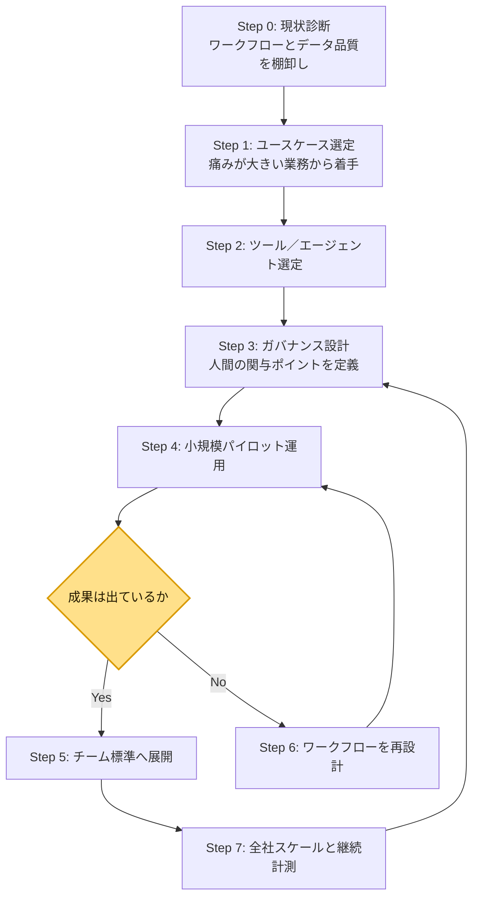
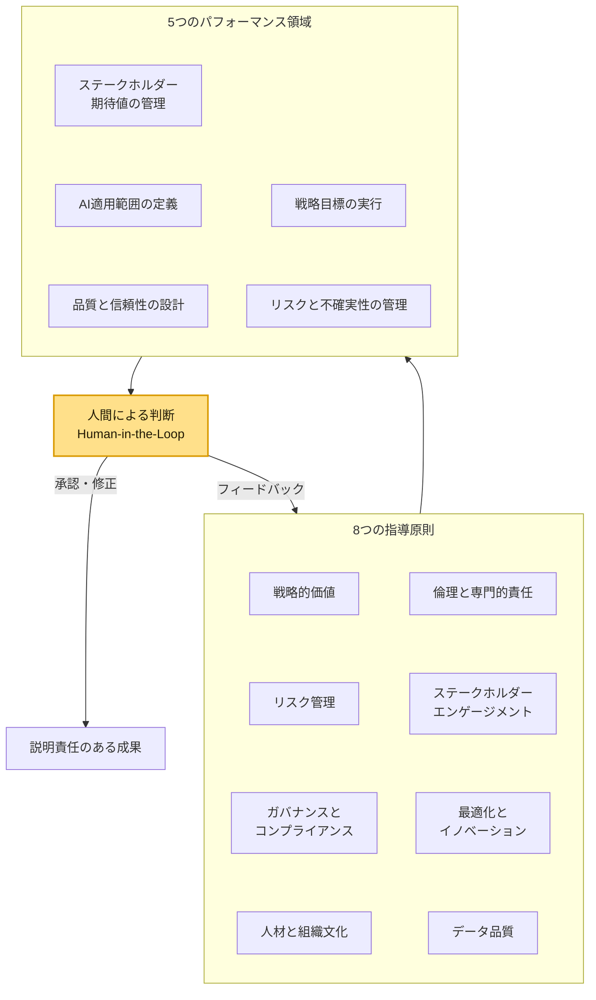
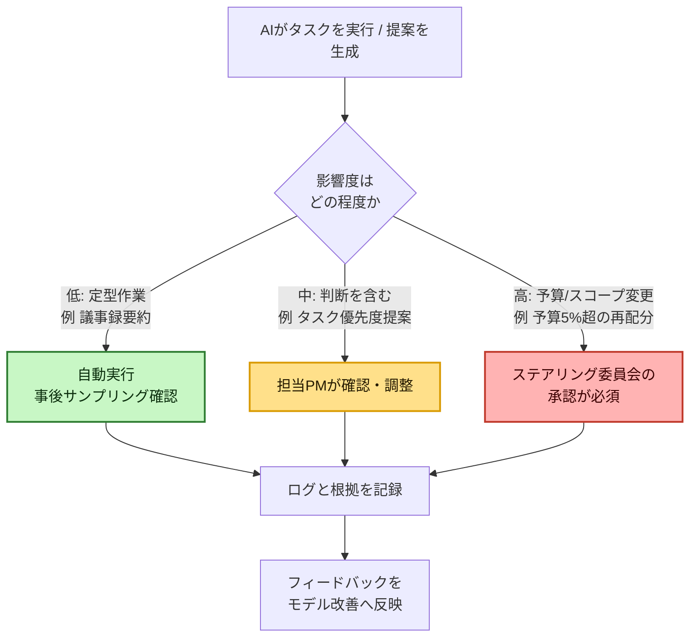
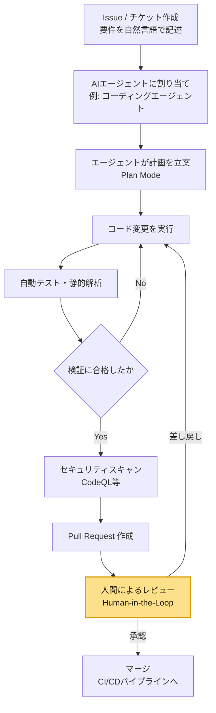

# AI駆動プロジェクトマネジメント実践ガイド

**初学者のためのステップバイステップ・ベストプラクティス**

> 本ガイドは2026年8月時点でウェブ上に公開されている一次情報・業界レポート・著名なソフトウェアエンジニアやエンジニアリングリーダーの発信内容をもとに作成しています。出典はすべて末尾の「参考文献・出典」にURLとして明記しています。AIツールやサービス仕様は更新が速い領域のため、実際に導入する際は各ベンダーの公式ドキュメントで最新情報を確認してください。

---

## 目次

1. [はじめに](#はじめに)
2. [AI駆動プロジェクトマネジメント（AI-PM）とは何か](#ai駆動プロジェクトマネジメントai-pmとは何か)
3. [全体像：導入までのロードマップ](#全体像導入までのロードマップ)
4. [ステップ0：現状を棚卸しする](#ステップ0現状を棚卸しする)
5. [ステップ1：ユースケースを選ぶ](#ステップ1ユースケースを選ぶ)
6. [ステップ2：適切なツール・AIエージェントを選定する](#ステップ2適切なツールaiエージェントを選定する)
7. [ステップ3：Human-in-the-Loopガバナンスを設計する](#ステップ3human-in-the-loopガバナンスを設計する)
8. [ステップ4：プロンプトエンジニアリングの基礎](#ステップ4プロンプトエンジニアリングの基礎)
9. [ステップ5：エージェント型ワークフローを実践する](#ステップ5エージェント型ワークフローを実践する)
10. [ステップ6：リスク管理と倫理的配慮](#ステップ6リスク管理と倫理的配慮)
11. [ステップ7：効果を計測し、スケールする](#ステップ7効果を計測しスケールする)
12. [よくある失敗パターンと回避策](#よくある失敗パターンと回避策)
13. [30・60・90日 導入ロードマップ](#306090日-導入ロードマップ)
14. [まとめ](#まとめ)
15. [参考文献・出典](#参考文献出典)

---

## はじめに

「AI駆動プロジェクトマネジメント（AI-Driven Project Management、以下 AI-PM）」という言葉を聞くと、多くの初学者は「AIがプロジェクトマネージャーの仕事を奪うのではないか」という不安を抱きがちです。しかし2026年時点で業界の実務家やアナリストが繰り返し指摘しているのは、AIは意思決定を「支援」できても、その意思決定に対する「説明責任」を負うことはできないという点です。Project Management Institute（PMI）が2026年6月に発表した業界初のAI標準でも、この考え方が中核に据えられています。

本ガイドは、PM未経験者やAIツールを触ったことがない初学者でも迷わず実践できるよう、以下の3点を重視して構成しています。

- **ステップバイステップ**：現状診断から全社スケールまで、順番に進められる構成
- **一次情報に基づく根拠**：GitHub・Atlassian・PMI・McKinsey・The Pragmatic Engineer（Gergely Orosz氏）など、著名な開発者・組織の発信を参照
- **すぐ使えるフォーマット**：図表・チェックリスト・比較表を中心に、読んですぐ行動に移せる形式

対象読者は、AIツールを使い始めたばかりのプロジェクトマネージャー、エンジニアリングマネージャー、またはPMOメンバーです。

---

## AI駆動プロジェクトマネジメント（AI-PM）とは何か

### 定義

AI駆動プロジェクトマネジメントとは、機械学習・自然言語処理・生成AI・AIエージェントといった技術を、計画立案・タスク管理・リスク予測・進捗報告・意思決定支援など、プロジェクトマネジメントの各プロセスに組み込み、人間の判断とAIの処理能力を組み合わせて成果を高めるアプローチです。O'Reillyから出版されている書籍『AI-Driven Project Management』（Kristian Bainey著）では、AIとChatGPTの活用によって「サプライズを最小化し、バイアスを減らし、基準を高め、意思決定を加速する」という4つの価値領域が整理されています。

### なぜ今重要なのか

- PMIの調査によれば、AIを活用しているプロジェクトの成功率（納期・予算内・目標達成の観点）は、活用していない組織と比べて明確に高く、オンタイム納品率にも大きな差が見られると報告されています。
- Gartnerは、2030年までにプロジェクトマネージャーの業務の約8割がAI・ビッグデータ・機械学習・自然言語処理によって遂行されるようになると予測しています。
- 一方でMcKinseyの「State of AI」調査（2025年11月公開）は、組織の約9割が何らかの業務でAIを利用している一方、全社的にAIをスケールできている組織は依然として約3分の1にとどまり、EBIT（利益）への実質的な効果を報告できているのはごく一部であると指摘しています。つまり「導入」と「成果創出」の間には大きなギャップが存在します。

### 従来型PMとAI駆動PMの違い

| 観点 | 従来型プロジェクトマネジメント | AI駆動プロジェクトマネジメント |
|---|---|---|
| 進捗把握 | 手動でのステータス収集・週次報告会 | チケット・チャット・コミットログを自動集約し常時可視化 |
| リスク識別 | PMの経験と勘、定例のリスクレビュー | 過去データからのパターン認識による早期シグナル検出 |
| リソース配分 | スプレッドシートによる手動調整 | 稼働率・スキルマッチングをAIが提案し人間が確定 |
| 意思決定 | 会議とドキュメントベースの合意形成 | AIが選択肢とシナリオを提示し、人間が最終判断 |
| 報告作成 | 手作業でのレポート編集（月に半日〜1日を要するとの調査結果あり） | 進捗データから自動生成し、人間がレビュー・調整 |
| 求められるPMスキル | スケジューリング・調整力中心 | 上記に加えてプロンプト設計・AI出力の検証・ガバナンス設計力 |

---

## 全体像：導入までのロードマップ

AI-PMの導入は「ツールを入れて終わり」ではなく、継続的な改善サイクルです。以下は、現状診断からスケール展開までの全体フローです。

ポイントは、矢印が最後で「ガバナンス設計」に戻ってくることです。McKinseyの調査でも、ワークフローの再設計を継続的に行っている「ハイパフォーマー」企業ほどAIから実質的な価値を得られていると報告されており、AI-PMは一度導入して終わりではなく反復的なプロセスとして捉える必要があります。

---

## ステップ0：現状を棚卸しする

AIツールを導入する前に、まず自分たちのプロジェクト運営の「現在地」を把握します。Airtableの実務ガイドでは、AIプロジェクト管理ツールは導入するだけでは価値を生まず、現場のPMを早期に巻き込み、どこに時間を取られているかを特定してから高インパクトな箇所を選ぶことが推奨されています。

### チェックリスト

- [ ] 現在使用しているプロジェクト管理ツール（Jira、Asana、Notion、Excelなど）を洗い出したか
- [ ] タスクのステータス・担当者・期限などのデータが一貫した形式で入力されているか
- [ ] 過去プロジェクトの実績データ（工数・遅延理由・予算差異）が参照可能な形で残っているか
- [ ] チームメンバーが「時間を取られていると感じる作業」をヒアリングしたか（ステータス報告、議事録作成、リスク洗い出しなど）
- [ ] 機密情報・個人情報を含むデータをAIに渡してよいかの社内ルールを確認したか

データ品質がAI-PMの土台になる理由は明確です。Wellingtoneの調査を引用する複数の分析記事では、多くの組織が毎月半日〜1日をステータスレポートの手動集約に費やしていると報告されています。この作業はAIによる自動化の効果が最も出やすい領域である一方、入力データが不揃いだとAIの要約や予測も不正確になります。「AIを入れれば直る」のではなく、「クリーンなデータがあるチームほどAIの効果が出る」という順序を意識してください。

---

## ステップ1：ユースケースを選ぶ

すべてのプロジェクトマネジメント業務を一度にAI化しようとすると失敗します。PMBOK（Project Management Body of Knowledge）が定義する知識エリアとAIの得意分野を掛け合わせ、投資対効果の高い領域から着手するのが定石です。

### PM知識エリア × AI活用の相性表

| PMBOK 知識エリア | AIが得意なこと | 人間の判断が引き続き必要なこと |
|---|---|---|
| スコープ管理 | 要件文書からのタスク分解・サブタスク自動生成 | ステークホルダー間の優先順位の政治的調整 |
| スケジュール管理 | 過去実績からの所要期間予測、遅延の早期検知 | クリティカルパス変更時の関係者合意形成 |
| コスト管理 | バーンレートのリアルタイム監視、予算超過アラート | 予算再配分の最終承認、契約交渉 |
| リスク管理 | 類似プロジェクトのパターンからリスク候補を洗い出し | 発生確率・影響度の重み付けと対応方針の決定 |
| コミュニケーション管理 | 会議要約、ステータスレポート自動生成、多言語翻訳 | 対立するステークホルダーの調整、信頼関係構築 |
| 品質管理 | 成果物のコンプライアンスチェック、規格との照合 | 品質基準そのものの設定、例外対応の判断 |
| 資源管理 | スキルマッチングに基づく稼働配分の提案 | 人事評価に関わる配置判断、組織文化への配慮 |
| 調達管理 | サプライヤー選定のためのリサーチ・比較資料作成 | 契約条件の最終交渉、法務判断 |
| ステークホルダー管理 | 関係者の関心・影響度マップの下書き作成 | 個別の関係構築、機微な交渉 |
| 統合管理 | 複数ツールに散在する情報の横断的な要約 | プロジェクト全体としての戦略的意思決定 |

ScienceDirect誌に2026年に掲載された系統的文献レビューでも、AIの活用事例は「予測」「モニタリング」領域に集中する一方、コミュニケーションやステークホルダー領域への適用はまだ手薄であることが指摘されています。つまり、定型的でデータドリブンな業務から着手し、対人折衝が中心の業務は当面「人間主導・AI補助」の位置づけに留めるのが安全です。

### 選定の優先順位づけの目安

1. **発生頻度が高く、定型的**（例：週次ステータスレポート作成）
2. **既存データが揃っている**（例：チケット管理ツールに履歴がある）
3. **誤りが出ても実害が小さい**（例：下書き作成であり最終承認は人間）

この3条件を満たすユースケースから着手すると、パイロット段階での失敗リスクを抑えられます。

---

## ステップ2：適切なツール・AIエージェントを選定する

2026年時点で、主要なプロジェクト管理プラットフォームのほとんどがAI機能を組み込んでいます。GitHubの発信やAtlassianの公式ブログ、業界メディアの比較記事をもとに、代表的なカテゴリを整理します。

### 代表的なツール・エージェントの比較

| ツール／エージェント | 主な提供元 | 得意領域 | 2026年時点の特徴 |
|---|---|---|---|
| Jira + Atlassian Rovo / Agents in Jira | Atlassian | ソフトウェア開発とプロジェクト管理の統合 | Jira上でClaude Code・Cursor・GitHub Copilotなど複数のコーディングエージェントをオーケストレーションできる仕組みを提供 |
| GitHub Copilot（coding agent／CLI／Copilotアプリ） | GitHub（Microsoft） | Issue起票からPR作成までのソフトウェア開発ワークフロー自動化 | 2026年6月にデスクトップの「エージェント管理コントロールセンター」が一般提供開始され、複数エージェントの並行実行と監査性を強化 |
| Microsoft Copilot for Project | Microsoft | スケジュール生成、タスク配分、進捗照会への自然言語応答 | Project Onlineと連携し、リソース競合の自動検出などを提供 |
| ChatGPT / Claude 等の汎用LLMアシスタント | OpenAI／Anthropic 等 | プロンプトベースの文書作成、リスクブレインストーミング、意思決定支援 | O'Reilly『AI-Driven Project Management』でもChatGPT活用のユースケースが体系的に解説されている |
| Asana Intelligence／monday.com AI／ClickUp Brain／Wrike Work Intelligence | 各社 | タスク管理SaaS上でのワークフロー自動化・リスクフラグ | 汎用のPMツールにAIレイヤーを統合したタイプ |

### 選定時に確認すべき観点

- **データガバナンス**：AIアシスタントが社内メール・文書にアクセスする前に、何を参照できるかを確認する（Airtableの実務ガイドでも強調されているポイント）
- **人間による最終レビューの組み込みやすさ**：AIが生成した内容をそのままステークホルダーに送らず、レビューできる導線があるか
- **既存ツールとの統合**：Jira・Slack・GitHub・Teamsなど、すでに使っているツールと接続できるか（GitHubのコーディングエージェントはJira・Linear・Slack・Teams等と統合可能）
- **セキュリティ認証**：SOC 2 Type IIやGDPR準拠などの認証状況

ツールは頻繁にアップデートされるため、最終的な機能詳細は必ず各社の公式ドキュメントで確認してください。

---

## ステップ3：Human-in-the-Loopガバナンスを設計する

AI-PMで最も見落とされがちなのが「誰が、どの意思決定に、どこまで関与するか」というガバナンス設計です。PMIは2026年6月、業界として初めてANSI承認を受けたAI標準「The Standard for Artificial Intelligence in Portfolio, Program, and Project Management」を発表しました。この標準は、AIが意思決定を支援できても、その結果に対する説明責任は人間が負い続けるという考え方（Human-in-the-Loop）を中核原則としています。

標準は「8つの指導原則」と、それを実務に落とし込む「5つのパフォーマンス領域」で構成されています。

PMIのブログ記事（2026年7月14日公開、Kathleen Walch氏執筆）では、効果的な人間による監督とは「出力を事後にチェックする」という受け身の姿勢ではなく、以下をあらかじめ設計しておくことだと説明されています。

- AIの判断が確定する**前に**人間の承認を必須とするポイントを明確化する
- 出力が不確実・不完全な場合の**エスカレーション経路**を定義する
- AIが支援した意思決定について**誰が最終的な説明責任を負うか**を明文化する
- AI支援ワークフローが時間とともに改善されるよう**フィードバックループ**を組み込む

### リスクの大きさに応じたエスカレーション設計例

すべての意思決定に同じ厳格さで人間の承認を求めると、AIの効率化メリットが失われます。実務では、影響度に応じて関与レベルを変える「リスク階層型」の設計が有効です。

この設計思想は、GitHubのエージェント運用にも表れています。GitHub Copilot coding agentは既定では書き込み操作の前に許可を求める設定になっており、信頼が積み上がった段階でチームが自律実行（オートパイロット）へ移行するという段階的な運用が推奨されています。「最初から全自動」ではなく「小さく任せて、実績を見ながら権限を広げる」という順序が、業界標準的なアプローチになりつつあります。

---

## ステップ4：プロンプトエンジニアリングの基礎

AIアシスタントの出力品質は、指示（プロンプト）の質に大きく左右されます。O'Reillyの書籍でも「プロジェクトマネージャーのためのプロンプトエンジニアリング」が独立した章として扱われているほど、PM実務における必須スキルになっています。

### 良いプロンプトの構成要素

| 要素 | 説明 | 悪い例 → 良い例 |
|---|---|---|
| 役割の明示 | AIにどの立場で回答してほしいかを伝える | 「リスクを教えて」→「あなたは建設プロジェクトのリスクマネージャーです。以下の状況からリスクを洗い出してください」 |
| 具体的な文脈 | プロジェクトの背景・制約条件を含める | 「スケジュールを作って」→「予算◯◯万円、期間3ヶ月、メンバー5名のWebサイト刷新プロジェクトのスケジュール案を作成してください」 |
| 出力形式の指定 | 表・箇条書き・優先順位付きリストなど形式を指定する | 「まとめて」→「重要度High/Medium/Lowで分類した表形式で出力してください」 |
| 検証観点の明示 | AIに前提や不確実性を明示させる | 「これで合ってる？」→「この見積りの根拠となった前提条件を3つ挙げてください」 |

### 実践例

**リスクブレインストーミング**
プロジェクトのスコープ・期間・依存関係・チーム構成・ベンダー状況を伝えたうえで「見落としがちなリスクを20件挙げてほしい」と依頼する使い方は、実務者コミュニティでも高い再現性がある活用法として紹介されています。AIが提示するリスクの多くは目新しいものではなくても、担当者が気づいていなかった3〜5件が見つかるケースが多く、その後の確率・影響度評価は引き続き人間が行うという役割分担が推奨されています。

**ステータスレポートの下書き**
チケット管理ツールから抽出した進捗データを渡し、「経営層向けに3行で要約してください。数値の変化には理由を添えてください」のように、読み手と分量を指定することで、AI生成物をそのまま送るのではなく、レビューしやすい下書きとして活用できます。

**議事録からのアクションアイテム抽出**
会議の文字起こしを渡し、「担当者・期限・優先度を含めたアクションアイテムの一覧を表形式で作成してください」と依頼すると、手作業での議事録整理にかかる時間を削減できます。ただし、担当者名や期限の解釈が誤っている可能性があるため、必ず人間が確認してから展開する運用が推奨されます。

---

## ステップ5：エージェント型ワークフローを実践する

2026年の大きな変化は、AIが「質問に答えるアシスタント」から「タスクを自律的に遂行するエージェント」へと役割を広げていることです。特にソフトウェア開発を含むプロジェクトでは、GitHub Copilot coding agentのような「Issueに割り当てるとPRが返ってくる」ワークフローが一般化しつつあります。

GitHub公式ブログでは、この一連の流れを「アイデアからPRまで（idea to PR）」と表現し、エージェントに任せられるのは定型的な下準備作業であり、最終的なレビュー・調整・マージ判断は引き続き開発者が担うと明確に位置づけています。

### 実務者コミュニティからの知見

ソフトウェアエンジニアリング領域で最も購読者数の多いニュースレターのひとつ「The Pragmatic Engineer」（著者：Gergely Orosz氏、元Uber・Microsoft/Skypeのエンジニア）は、2026年に実施した900名超のエンジニア・エンジニアリングリーダー向け調査の分析記事の中で、AIツールがもたらす効果は「明確な目標を持って使っているときは強力な武器になるが、目標が曖昧なままだと『まあまあ』の結果に終わる」という利用者の声を紹介しています。またAIが生成したコードの半数近くがそのままレビューなしで採用されているという調査結果を報告する一方、コードベースの品質低下を懸念する声が上がっていることにも触れており、「エージェントに任せる範囲を広げるほど、レビュー体制の質がボトルネックになる」という示唆を与えています。

この知見はプロジェクトマネジメント全般にも応用できます。エージェント型ワークフローを導入する際は、次の3点を明確にしてから進めるのが安全です。

1. **エージェントが触れてよい範囲（ブランチ・権限・ツール呼び出し）を限定する**
2. **エージェントの提案に対する検証ステップ（テスト・スキャン・人間レビュー）を省略しない**
3. **エージェントが判断に迷った場合や失敗した場合のフォールバック手順を用意する**

Microsoft ResearchがGitHub Copilotの実運用データ（2026年6月、320万ユーザー・1,300万セッション規模）を分析した論文でも、エージェント型のコーディングワークフローは、まとまった処理を自律的に行う「エージェントループ」と、その合間に発生する数分単位の「人間の待ち時間」という特徴的なパターンを持つことが報告されています。つまりエージェントに仕事を任せている間も、人間側のタスク設計（次に何をレビューし、何を並行して進めるか）が生産性を左右します。

---

## ステップ6：リスク管理と倫理的配慮

PMIのAI標準における8原則のうち、特にプロジェクトマネージャーが日常的に意識すべきなのが「倫理と専門的責任」「データ品質」「ガバナンスとコンプライアンス」の3つです。

### 主なリスクと対策

| リスク領域 | 具体的な懸念 | 対策の方向性 |
|---|---|---|
| ハルシネーション（誤った出力） | AIが存在しない事実やもっともらしい誤情報を生成する | 重要な数値・事実は一次情報で必ず裏取りする。AI出力を最終成果物としてそのまま流用しない |
| データプライバシー | 機密情報・個人情報が外部のAIサービスに送信される | 企業向けの専用インスタンスやゼロデータ保持オプションを選定し、公開LLMに機密情報を入力しない |
| バイアスの増幅 | 過去データに含まれる偏りをAIがそのまま再生産する | モデルが参照するデータの偏りを定期的に点検し、人事評価等のセンシティブな判断には慎重に適用する |
| 説明責任の空白化 | 「AIが決めたので」と人間が判断を放棄してしまう | 意思決定の最終承認者を必ず個人名で明確化し、AIの提案理由を記録に残す |
| 過信によるスキル低下 | AIの予測を無批判に受け入れ、PM自身の判断力が育たない | AI予測はあくまで「入力」として扱い、PMが妥当性を検証するプロセスを制度化する |

TechTargetの記事で引用されているアナリストのコメントでも、AIによる予測は不確実な状況下での意思決定を支援するものであり、AIがプロジェクトの継続・中止といった重い判断を単独で下す段階には至っていないと指摘されています。むしろAIは「判断のためのデータ」を充実させる役割であり、最終的な意思決定の重みは人間に残り続けると理解しておくことが重要です。

---

## ステップ7：効果を計測し、スケールする

パイロットで成果が出たら、チーム全体・組織全体への展開を検討します。ただしMcKinseyの調査が示す通り、多くの組織は「導入はしたが、スケールできない」という壁にぶつかります。

### スケール時につまずきやすいポイント

- **データ・アーキテクチャ**：部門ごとにデータがサイロ化していると、AIがプロジェクト横断の文脈を把握できない
- **ワークフローの硬直性**：既存の業務プロセスを変えずにAIを「後付け」しても、効果は限定的（McKinseyは、ワークフローを根本的に再設計した組織ほどEBIT効果との相関が高いと報告）
- **測定指標の欠如**：明確なKPIがないまま「なんとなく便利」で終わり、投資判断ができない

### KPIの設計例

| カテゴリ | 指標例 |
|---|---|
| 効率性 | ステータスレポート作成にかかる時間の削減率 |
| 予測精度 | AIによる納期予測と実績の乖離幅 |
| 品質 | AIが検出したリスクのうち、実際に顕在化した割合（適合率） |
| 採用度 | チームメンバーのうちAIツールを週次で利用している割合 |
| ガバナンス | 人間レビューを経ずに実行されたAI提案の割合（低いほど良いとは限らず、リスク階層設計との整合性を見る） |

Atlassianが2025年に実施した1,000名以上のFortune 1000幹部・知識労働者への調査（State of Teams）では、幹部の多くが「チームの働きが会社全体の目標にどう貢献しているか自信を持てていない」と回答しており、AI導入の効果を測る際は個別タスクの効率化だけでなく、組織全体の目標との接続を可視化する指標も重要になると示唆されています。

---

## よくある失敗パターンと回避策

| アンチパターン | 何が起きるか | 回避策 |
|---|---|---|
| AI出力を無編集でそのまま関係者に送る | 誤りや不適切な表現がそのまま外部に出てしまう | 必ず人間によるレビューパスを挟むルールを明文化する |
| 機能リストだけでツールを選定する | チームの実際のワークフローに合わず定着しない | 現場のPMを選定プロセスに巻き込み、実際の業務で試用してから決める |
| データガバナンスを確認せずに導入する | 機密情報が意図せず外部サービスに送信される | AIアシスタントが何にアクセスできるかを接続前に必ず確認する |
| AIの予測を確実な事実として扱う | 曖昧なリスクについても機械的に判断してしまう | AIは見積りの精度を高める道具であり、曖昧なリスクに対する最終判断はPMの役割であると理解する |
| 全社一斉展開から始める | 現場が混乱し、失敗の原因切り分けが困難になる | 小規模なパイロットで検証してから段階的に展開する |
| 導入後の効果測定を怠る | 投資対効果を説明できず、次の予算確保に失敗する | 導入前にKPIを定義し、パイロット段階から継続的に計測する |

---

## 30・60・90日 導入ロードマップ

初学者チームが最初の3ヶ月でAI-PMに着手する場合の目安です。組織の規模やツール事情によって調整してください。

| 期間 | 主な取り組み |
|---|---|
| 最初の30日 | 現状のワークフローとデータ品質を棚卸し。痛みの大きい業務（ステータス報告、リスク洗い出しなど）を1〜2件特定。ガバナンス方針（AIに任せてよい範囲）を暫定的に定義 |
| 31〜60日目 | 特定したユースケースで小規模パイロットを開始。プロンプトのテンプレート化と人間レビュー体制の整備。初期KPI（時間削減率など）の計測開始 |
| 61〜90日目 | パイロット結果を評価し、成功したユースケースをチーム標準として展開。エスカレーションルールを正式なガバナンス文書として整備。次の90日で拡張するユースケースを選定 |

---

## まとめ

AI駆動プロジェクトマネジメントは、単なるツール導入ではなく、「どこにAIを任せ、どこに人間の判断を残すか」を設計する継続的なプロセスです。本ガイドで紹介した内容を要約すると、次の3点に集約されます。

1. **データとワークフローの土台がなければAIは機能しない**。まず現状を棚卸しし、痛みが大きく検証しやすいユースケースから着手する。
2. **人間の関与ポイントをあらかじめ設計する**（Human-in-the-Loop）。PMIのAI標準が示す通り、AIは意思決定を支援できても説明責任を代わりに負うことはできない。
3. **小さく始めて、計測しながらスケールする**。McKinseyの調査が示すように、多くの組織は「導入」で止まってしまう。ワークフローの再設計と継続的な効果測定こそが、AI-PMを一過性の流行で終わらせないための鍵になる。

AIツールやモデルは今後も急速に進化していきます。だからこそ、特定のツールの使い方を覚えることよりも、本ガイドで紹介したような「原則」——ガバナンス設計、段階的な権限委譲、効果測定の習慣——を身につけることが、長期的に通用するAI-PMスキルになります。

---

## 参考文献・出典

本ガイドの作成にあたり、以下の情報源を参照しました（2026年8月時点でアクセス可能な情報）。

**書籍**
- Kristian Bainey, *AI-Driven Project Management: Harnessing the Power of Artificial Intelligence and ChatGPT to Achieve Peak Productivity and Success*, Wiley（O'Reilly掲載ページ）
  https://www.oreilly.com/library/view/ai-driven-project-management/9781394232215/

**業界標準・専門機関**
- PMI「The Standard for Artificial Intelligence in Portfolio, Program, and Project Management」紹介ページ
  https://www.pmi.org/standards/artificial-intelligence
- PMIブログ「The New AI Standard: A Shared Foundation for Responsible Adoption」（Kathleen Walch, 2026年7月14日）
  https://www.pmi.org/blog/pmi-ai-standard-project-management
- PMI プレスリリース「PMI Publishes World's First Global Standard for AI in Project Work」（2026年6月9日）
  https://www.pmi.org/about/press-media/2026/pmi-publishes-worlds-first-global-standard-for-ai-in-project-work
- PMI「Artificial Intelligence in Project Management」学習ポータル
  https://www.pmi.org/learning/ai-in-project-management

**エンジニアリング・開発者コミュニティ（著名な発信者）**
- The Pragmatic Engineer（Gergely Orosz氏）「AI's impact on software engineers in 2026: key trends, Part 2」
  https://newsletter.pragmaticengineer.com/p/ai-impact-on-software-engineers-part-2
- GitHub Blog「From idea to PR: A guide to GitHub Copilot's agentic workflows」
  https://github.blog/ai-and-ml/github-copilot/from-idea-to-pr-a-guide-to-github-copilots-agentic-workflows/
- GitHub Blog「How to maximize GitHub Copilot's agentic capabilities」
  https://github.blog/ai-and-ml/github-copilot/how-to-maximize-github-copilots-agentic-capabilities/
- GitHub Blog「GitHub Copilot app: The agent-native desktop experience」
  https://github.blog/news-insights/product-news/github-copilot-app-the-agent-native-desktop-experience/
- Microsoft Research「Agentic Coding in the Wild: Characterizing GitHub Copilot at Production Scale」
  https://www.microsoft.com/en-us/research/publication/agentic-coding-in-the-wild-characterizing-github-copilot-at-production-scale/

**調査レポート・市場分析**
- McKinsey & Company「The state of AI in 2025: Agents, innovation, and transformation」
  https://www.mckinsey.com/capabilities/quantumblack/our-insights/the-state-of-ai
- Atlassian「State of AI in Service Management Report 2025」
  https://www.atlassian.com/whitepapers/state-of-ai
- Deviniti「35 Atlassian's System of Work statistics you need to know in 2026」（Atlassian State of Teams 2025データの引用元）
  https://deviniti.com/blog/leadership-teamwork/35-system-of-work-statistics/
- TechTarget「How AI is transforming project management in 2026」
  https://www.techtarget.com/searchenterpriseai/feature/How-AI-is-transforming-project-management
- ScienceDirect「AI-driven project management: Identifying use cases」（Procedia Computer Science, 2026）
  https://www.sciencedirect.com/science/article/pii/S1877050926007301
- Airtable「AI for project management: Tools, best practices, and use cases 2026」
  https://www.airtable.com/articles/ai-project-management

---

*本ガイドは特定ベンダーの製品を推奨するものではありません。ツール名・機能・料金体系は変更される可能性があるため、導入検討時は必ず各社公式サイトの最新情報をご確認ください。*
