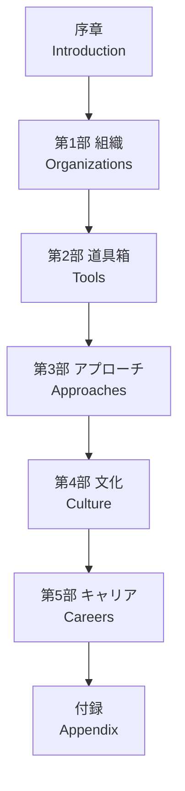
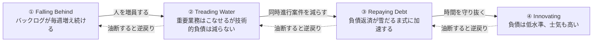
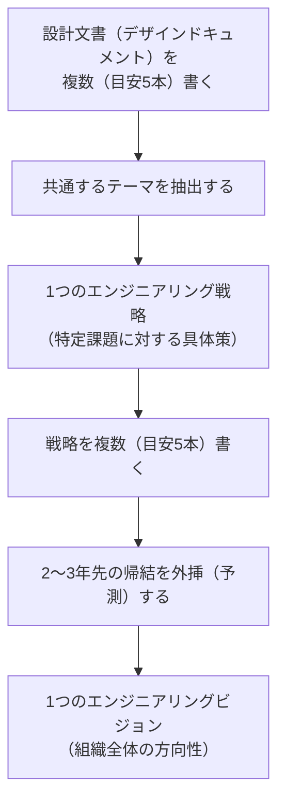
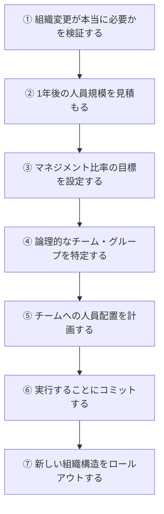

# An Elegant Puzzle: Systems of Engineering Management 徹底解説ガイド

> Will Larson 著『An Elegant Puzzle: Systems of Engineering Management』(Stripe Press, 2019)を、初めてエンジニアリングマネジメント（EM）に触れる人でも理解できるよう、ステップバイステップのベストプラクティスとして再構成した解説ガイドです。

---

## 目次

1. [はじめに：この本は何が特別なのか](#はじめに)
2. [著者と本の全体像](#著者と本の全体像)
3. [第1部：組織設計（Organizations）](#第1部組織設計organizations)
   - [1-1. チームの適正規模を決める](#1-1-チームの適正規模を決める)
   - [1-2. チームの「4つの状態」を見極める](#1-2-チームの4つの状態を見極める)
   - [1-3. トップダウン最適化への警鐘](#1-3-トップダウン最適化への警鐘)
   - [1-4. ハイパーグロース下の生産性](#1-4-ハイパーグロース下の生産性)
   - [1-5. 組織のリスクをどこに置くか](#1-5-組織のリスクをどこに置くか)
   - [1-6. 後継者計画（サクセッションプランニング）](#1-6-後継者計画サクセッションプランニング)
4. [第2部：マネジメントの道具箱（Tools）](#第2部マネジメントの道具箱tools)
   - [2-1. すべての土台となる「システム思考」](#2-1-すべての土台となるシステム思考)
   - [2-2. ビジョンと戦略を書き分ける](#2-2-ビジョンと戦略を書き分ける)
   - [2-3. メトリクスとベースラインで変化を導く](#2-3-メトリクスとベースラインで変化を導く)
   - [2-4. マイグレーションを「安く」保つ](#2-4-マイグレーションを安く保つ)
   - [2-5. 組織再編（リオルグ）を正しく進める](#2-5-組織再編リオルグを正しく進める)
5. [第3部：アプローチ（Approaches）](#第3部アプローチapproaches)
6. [第4部：文化（Culture）](#第4部文化culture)
7. [第5部：キャリア（Careers）](#第5部キャリアcareers)
   - [5-1. 採用ファネルを設計する](#5-1-採用ファネルを設計する)
   - [5-2. パフォーマンスマネジメントとキャリアラダー](#5-2-パフォーマンスマネジメントとキャリアラダー)
   - [5-3. 面接ループを設計する](#5-3-面接ループを設計する)
8. [初学者向け：明日から使える実践チェックリスト](#初学者向け明日から使える実践チェックリスト)
9. [業界での評価：著名なエンジニアリングリーダーはどう読んだか](#業界での評価著名なエンジニアリングリーダーはどう読んだか)
10. [まとめ](#まとめ)
11. [参考文献・情報源（URL付き）](#参考文献情報源url付き)

---

## はじめに

「人は会社を辞めるのではなく、上司（マネージャー）を辞める」という格言があります。エンジニアリングマネジメントは多くの組織にとって死活的に重要でありながら、体系立てて学ぶ機会が少なく、多くの場合は自己流・独学で身につけるしかない分野です。

Will Larson の『An Elegant Puzzle』は、この状況に対して「エンジニアリング的な思考法」で挑んだ一冊です。著者はソフトウェアエンジニアとしてのバックグラウンドを活かし、マネジメントの難問を感情論やスローガンではなく、**システム思考・メトリクス・具体的なフレームワーク**で解きほぐしていきます。副題の「Systems of Engineering Management」が示す通り、この本の核心は「個々の解決策」よりも「問題を捉えるための仕組み（システム）」にあります。

本書はもともと著者のブログ「Irrational Exuberance」（lethain.com）に投稿された記事群を土台に再構成されたもので、各トピックが独立した「パズル」として提示されているのが特徴です。目次順に読み進める必要はなく、今直面している課題に応じて必要な章から読むことができます。

---

## 著者と本の全体像

Will Larson は Yahoo、Digg、Uber、Stripe、Calm、Carta でエンジニアリングリーダー・CTO としてキャリアを積み、現在は Imprint の CTO を務めています。日本の JET プログラムで英語教師として1年間過ごした経験もあります。本書のほかに『Staff Engineer: Leadership Beyond the Management Track』や『The Engineering Executive's Primer』、『Crafting Engineering Strategy』なども執筆しています。

本書は大きく5つのセクション（**組織／道具箱／アプローチ／文化／キャリア**）と、参考資料をまとめた付録から構成されています。

各章の位置づけを簡単に整理すると、以下のようになります。

| セクション | 扱うテーマ | こんな時に読む |
|---|---|---|
| 組織（Organizations） | チームの規模設計、チームの健全性診断、後継者計画 | 「そもそも組織の形をどう作るか」を考える時 |
| 道具箱（Tools） | システム思考、ビジョン／戦略、メトリクス、マイグレーション、リオルグ | 具体的な意思決定・実行のための「型」が欲しい時 |
| アプローチ（Approaches） | 急成長企業への適応、権限を超えた影響力の発揮 | 権限がない中でどう変化を起こすか悩んでいる時 |
| 文化（Culture） | インクルーシブな文化づくり、ヒーローカルチャーの弊害 | チームの空気や価値観を変えたい時 |
| キャリア（Careers） | 採用、面接設計、パフォーマンス評価、キャリアラダー | 採用や評価制度を設計・改善したい時 |

なお、Stripe Press の公式サイトでもこの本は「サイジング（チームの規模設定）から技術的負債の扱い方、後継者計画まで、エンジニアリングマネジメント特有の課題を扱うガイド」と紹介されています。

---

## 第1部：組織設計（Organizations）

### 1-1. チームの適正規模を決める

組織設計における最初の、そして最も基本的な問い、それが「チームの規模をどう決めるか」です。Larson は経験則として、以下のような目安を提示しています。

| 役割 | 推奨される規模 | 理由・補足 |
|---|---|---|
| マネージャーが直接支援するエンジニア数 | 6〜8人 | コーチング・調整・戦略立案に十分な時間を確保できる規模 |
| マネージャー支援下エンジニアが4人未満 | Tech Lead Manager（TLM）化しやすい | 設計・実装業務も抱えることになり、マネージャーとしてのキャリア形成が難しくなりがち |
| マネージャー支援下エンジニアが8〜9人超 | 「コーチ」役に近づく | 問題対応で手一杯になり、チームへの積極的な投資ができなくなる |
| マネージャー・オブ・マネージャーが支援するマネージャー数 | 4〜6人 | ステークホルダー調整と組織投資の両立が可能な規模 |
| オンコール（当番制の障害対応）に必要な人数 | 8人前後 | 2層構成・24時間365日体制を無理なく維持するための目安 |
| チームとして機能する最小人数 | 4人未満は「チーム」として扱わない | 個人の入れ替わりの影響が大きすぎ、抽象化（＝個人差を吸収する仕組み）が機能しない |

新しいチームを作る際の具体的な「型」も紹介されています。

1. 既存チームを 8〜10人まで拡大する
2. そこから 4〜5人ずつの2チームに「分裂（bud）」させる
3. 空っぽの状態からいきなり新チームを作らない
4. マネージャーに8人を超える人数を任せっぱなしにしない

> **初学者向けポイント**：この数字はあくまで「ガイドライン」であり「絶対のルール」ではありません。重要なのは、チームの規模が個人ではなく仕組みとして機能するかどうかを常に問い直す姿勢です。

### 1-2. チームの「4つの状態」を見極める

本書で最も広く引用されているフレームワークの一つが、この「チームの4つの状態」です。ブログ記事「Staying on the path to high-performing teams」でも詳しく展開されています。

チームは常に、以下の4つの状態のいずれかに位置していると考えます。

それぞれの状態の見分け方と、有効な打ち手（システムとしての解決策）を整理すると次のようになります。

| 状態 | 見分け方（兆候） | システムとしての解決策 | マネージャーの戦術的サポート |
|---|---|---|---|
| ① Falling Behind（後手に回っている） | 毎週バックログが増える。懸命に働いても進捗が乏しい。士気が低い | 増員し、②の状態まで引き上げる | ユーザーへの期待値調整、小さな成功体験（クイックウィン）の演出 |
| ② Treading Water（現状維持） | 重要業務はこなせるが、技術的負債の返済や新規プロジェクトに手が回らない | 同時並行の作業数（WIP）を減らし、1つずつ完了させる | 個人視点ではなくチーム視点での生産性の可視化 |
| ③ Repaying Debt（負債返済中） | 技術的負債の返済が進み始め、返済すればするほど余力が生まれる「複利」的な効果が出始める | とにかく時間を守り抜き、途中で中断させない | ユーザーに対し「表からは見えにくい価値」を粘り強く説明する |
| ④ Innovating（革新的） | 技術的負債が持続可能な低水準。士気が高く、大半の仕事が新しいユーザーニーズに向いている | スケジュールに十分な「スラック（余白）」を確保し、品質を保つ | この状態は「神聖」なもの。安易に解体・異動させない |

重要な原則は次の2つです。

- **チームは放っておくと「エントロピー」によって後退する**：④から③、③から②…という逆戻りは自然に起きるため、意図的なマネジメントが必要です。
- **各状態には対応する「システムの処方箋」がただ一つ存在し、それを飛ばしていきなり戦術的支援に走ると疲弊するだけで報われない**、と Larson は強調しています。

なお、高いパフォーマンスを発揮しているチームを安易に解体（人員の入れ替えや異動）することは、チームの「再結成コスト」を招くため、著者は強く注意を促しています。新規採用者は「革新中」のチームではなく、技術的負債を抱えたチームに配属する方が、既存の高パフォーマンスチームを壊さずに済むという考え方も紹介されています。

### 1-3. トップダウン最適化への警鐘

組織全体を一つの視点から完璧に最適化しようとする「トップダウン最適化」には限界がある、というのがこの章の主張です。局所的な最適化（各チームが自分たちの状況に応じて意思決定すること）を尊重しつつ、全体としての整合性を取る難しさとその向き合い方が論じられています。

### 1-4. ハイパーグロース下の生産性

急成長期の組織では「人を増やせば増やすほど速くなる」という直感が裏切られがちです。新しい人を受け入れる教育コストや、既存メンバーの調整コストが増えることで、採用の限界効用（追加1人あたりの価値）は次第に逓減します。そのため、急成長期には「急拡大の期間」と「定着・チームの一体化（gelling）を待つ期間」を意図的に交互に設けることが推奨されています。

### 1-5. 組織のリスクをどこに置くか

組織にはどうしても「弱い部分・技術的負債・機能不全のチーム」といったリスクが生まれます。それをどこに、どのように配置し、可視化し、管理するかという視点が扱われます。リスクを見えない場所に押し込めるのではなく、意図的にオーナーシップを割り当てることが重要だとされています。

### 1-6. 後継者計画（サクセッションプランニング）

マネージャー自身が次のポジションに進む、あるいは離脱する際に、チームや組織が機能し続けられるようにする「後継者計画」も扱われます。委譲（デリゲーション）を通じて自分の業務を棚卸しし、それをメンバーの成長機会として提供していくという考え方です。自分のチームだけでなく、同じレベルの同僚（ピア）を支援する視点への移行も、上位の役割へ進むうえで欠かせないとされています。

---

## 第2部：マネジメントの道具箱（Tools）

### 2-1. すべての土台となる「システム思考」

Larson 自身が「本書の真の中心」と位置づけているのが、この「システム思考（Systems Thinking）」の章です。個々の事象を単発の問題として捉えるのではなく、**状態・制約・フロー・フィードバックループ**の集合として捉える視点が、本書全体を貫く思考の軸になっています。

分散システムの設計に慣れたエンジニアであれば、この視点は直感的に理解しやすいはずです。「なぜこの施策は繰り返し失敗するのか」を個人の能力の問題として片づけるのではなく、「どのフィードバックループが機能不全を起こしているのか」という観点で捉え直すのが、本書に通底するアプローチです。

### 2-2. ビジョンと戦略を書き分ける

多くの組織が「エンジニアリング戦略」や「エンジニアリングビジョン」を書くことに苦手意識を持っています。Larson はこれを、驚くほどシンプルな「型」に落とし込んでいます。

| 項目 | 戦略（Strategy） | ビジョン（Vision） |
|---|---|---|
| 目的 | 特定の課題に対して、トレードオフと取るべき行動を明確にする、地に足のついた文書 | 直接連携しない人同士でも噛み合った意思決定ができるようにする、志向性の高い文書 |
| 作り方 | 複数（5本程度）の設計文書（デザインドキュメント）を書き、その共通点を抽出する | 複数（5本程度）の戦略を書き、その示唆を2〜3年先まで外挿（予測）する |
| 適した粒度 | 個別の技術課題（レイテンシ管理、コスト管理、他チームとの連携方法など） | 組織全体・長期の方向性 |
| 更新頻度の目安 | 同じ議論を3〜4回繰り返したら、新しい戦略を書くタイミング | 将来像が霧のように不透明になったら、新しいビジョンを書くタイミング |

> **初学者向けポイント**：「良いビジョン」を判断する基準は、発表直後の盛り上がりではなく、**2年前に書かれた設計文書と直近の設計文書を比較して、明確な改善が見られるかどうか**だと Larson は述べています。ビジョンや戦略は一度書いて終わりではなく、日々の意思決定の質を底上げするための「生きた道具」として使い続けることが重要です。

なお、ビジョン・戦略に「カルチャー」や「バリュー」を混ぜ込むべきではない、という指摘も本書（および著者のその後のブログ記事）で繰り返し強調されています。これらは全社レベルで扱うべきテーマであり、エンジニアリング組織だけで独自に定義しようとすると、維持コストの高い「価値観のオアシス」を生んでしまうためです。

### 2-3. メトリクスとベースラインで変化を導く

組織を広範囲に変化させたいとき、権限（Authority）だけに頼るのはリスクが高いアプローチです。本書では、**メトリクス（測定指標）とベースライン（基準値）を用いて変化を導く**手法が紹介されています。まず現状を測定し、それを可視化・共有することで、権限を行使せずとも自然と改善への機運を作り出す、というアプローチです。地道にプロセスを文書化し、主要な指標を継続的に公開していくことが、権限に頼らない変化を生み出す鍵とされています。

### 2-4. マイグレーションを「安く」保つ

Larson は、急成長企業のマネージャーにとって特に重要な2つのスキルとして「マイグレーション（技術移行）を安価に済ませること」と「クリーンな組織再編を行うこと」を挙げています。ここではまずマイグレーションについて扱います。

| ベストプラクティス | 内容 |
|---|---|
| オーナーシップレジストリを整備する | 「これは誰が持っているのか」を即座に検索できる仕組みを作る。オンコールの自動アサインなどにも転用できる、一石二鳥のツール |
| ソフトウェアを「柔軟」に設計する | ポリシー（変わりやすい判断ロジック）をシステムの奥深くに埋め込まず、外側のレイヤーに寄せる（fail open and layer policy）。最良のシステム書き換えは「そもそも起きなかった書き換え」である |
| インターフェースを汎用的に保つ | インターフェースが汎用的であれば、マイグレーションの中でも最も時間のかかる「移行フェーズ」自体を丸ごとスキップできる場合がある |
| 進行中も完了時も「祝う」、ただし重心は完了時に | マイグレーションの完了を大きく称賛・可視化することで、次のマイグレーションへの協力も得やすくなる |
| スケール変化は「1桁（10倍）」が目安 | システムが生き延びられる成長倍率にはおおよその目安があるため、会社の成長速度（例：半年で倍増）から逆算して、将来の作り直し頻度を見積もっておく |

> **初学者向けポイント**：新しい基盤を作り上げる作業そのものよりも、その後に続く**「移行フェーズ」——既存の利用箇所を1つずつ新基盤へ切り替え、既存データを移送し、周辺システムを追随させる工程**——こそが本当の生産性の敵になりやすい、という指摘は多くの実務家の共感を呼んでいます。作る側は早期に終わっても、全チームの運用が切り替わるまでマイグレーションは完了しません。

### 2-5. 組織再編（リオルグ）を正しく進める

組織再編（リオルグ）は強力な手段である一方、乱用すると組織への信頼を損ないます。本書では、組織変更を「思考のための道具」として捉え、以下のような7段階のプランニングフレームワークを提示しています。

各ステップの要点は以下の通りです。

| ステップ | 要点 |
|---|---|
| ①需要の検証 | そもそも「組織変更」が適切な手段かどうかを、まず疑ってかかる |
| ②人員規模の見積もり | 楽観的な成長シナリオ、全ポジションが埋まった場合の規模、過去の採用実績の3つの視点で見積もる |
| ③比率の設定 | マネージャー1人あたりエンジニア5〜8人程度が一つの目安（状況により調整） |
| ④チームの定義 | 各チームに明確なミッションとオーナーシップを持たせる。物理的な近さやインターフェースの明確さも考慮する |
| ⑤人員配置 | 既存メンバーの中で準備ができている人／成長が見込める人、社内異動、社外採用の順に候補を検討する |
| ⑥コミット | 変更による正味の効果、想定される新体制の持続期間、想定される課題、最も影響を受ける人を整理したうえで意思決定する |
| ⑦ロールアウト | 決定した構造を実際に展開する |

さらに、リオルグの「良し悪し」についても明快な指針が示されています。

- **最良のリオルグ**：構造的な問題を実際に解決するもの
- **次点で良いリオルグ**：あえて「やらない」という判断そのもの
- **最悪のリオルグ**：特定の人（people management issue）に向き合うことを避けるために行うもの

> **初学者向けポイント**：リオルグを「人の問題」から目をそらす手段として使ってしまうと、根本課題は解決されないまま、組織全体が疲弊するだけになります。まずは1on1やコーチングで向き合うべき課題なのか、本当に構造の問題なのかを見極めることが第一歩です。

---

## 第3部：アプローチ（Approaches）

第3部は、これまでの章に比べてより多様なトピックを横断的に扱う章です。急成長企業に合わせてマネジメントスタイルをどう適応させるか、自分の正式な権限（オーソリティ）を超えて成果を出したい時にどう振る舞うか、といった、状況に応じた立ち回り方に関する実践的なアドバイスが並びます。ポリシーの例外をどう扱うか、他のマネージャーとの関係性をどう構築するかといったテーマも含まれています。

**ポイント**：この章はレビュアーの間でも「最も雑多（heterogeneous）」と評される章であり、体系だった1つの理論というより、状況別の実践知の集合として読むのが向いています。悩んでいる状況に近いトピックをつまみ読みするアプローチが有効です。

---

## 第4部：文化（Culture）

第4部では、インクルーシブなチーム・組織を育てるための実践的な取り組みが扱われます。特に印象的なのが「自由（Freedom）」を巡る2つの緊張関係、すなわち「〜する自由（Freedom to）」と「〜からの自由（Freedom from）」の対立をどう調和させるかという論点です。

また、「ヒーローカルチャー」——特定の個人が身を削って火消しを行うことが賞賛される文化——がもたらす弊害についても論じられています。属人的な英雄的行動に依存する組織は、短期的には機能しているように見えても、持続可能性という観点では大きなリスクを抱えていることになります。文化に関する変化は、プロセスの変更に比べて時間がかかるものであり、じっくりと時間をかけて醸成していく必要がある、という位置づけがなされています。

---

## 第5部：キャリア（Careers）

最終セクションは、面接・採用からパフォーマンスマネジメントまで、エンジニアの「キャリア」に関わる仕組みを扱います。採用はリクルーターの仕事、パフォーマンス評価は人事部の仕組み、と考えがちな新任マネージャーに対し、Larson はこれらを**マネージャー自身が頻繁に活用すべき強力なツール**として捉え直すよう促しています。

### 5-1. 採用ファネルを設計する

本書では、既存の人脈だけに頼らない「コールドソーシング（見知らぬ候補者への直接アプローチ）」の始め方や、採用ファネルの各段階を計測・最適化していく考え方が紹介されています。ファネルを「なんとなく回す」のではなく、各段階の歩留まりを可視化し、ボトルネックを特定して改善していく——マイグレーションやリオルグと同じ「システム思考」の応用がここでも貫かれています。

### 5-2. パフォーマンスマネジメントとキャリアラダー

| 要素 | 概要 |
|---|---|
| キャリアラダー | 役割・レベルごとに期待値を明文化した「はしご」。評価や昇進判断の共通言語になる |
| パフォーマンス評価区分（Performance Designations） | 「期待通り」「期待以上」など、評価を離散的なカテゴリに落とし込む仕組み |
| パフォーマンスサイクル | 評価・フィードバックを一定周期で回す仕組み |
| 専門ロールの設計（SRE、TPM など） | 一般的なエンジニアリングロールとは異なる専門職種を組織に組み込む際の課題と、成功のための工夫 |

### 5-3. 面接ループを設計する

面接ループそのものの設計についても具体的な指針があります。誰がどんな観点を担当するのか、候補者の技術力だけでなく、組織にとって本当に重要な資質をどう見極めるのかを、場当たり的にではなく意図的に設計することが推奨されています。

なお、著者はその後の実践として、シニアポジションの候補者に「ビジョン・戦略ドキュメントを3〜4人のピアの前でプレゼンし、フィードバックを受ける」「エグゼクティブに1対1でプレゼンし、コミュニケーションの適応力を見る」といった評価プロセスも紹介しており、これは本書のフレームワークをそのまま採用・評価の現場に応用した好例といえます。

---

## 初学者向け：明日から使える実践チェックリスト

新任のエンジニアリングマネージャーが、本書のエッセンスを実務にすぐ活かすためのチェックリストです。

- [ ] 自分のチームが「6〜8人」の適正規模から外れていないか確認する
- [ ] 自分のチームが「4つの状態」のどこにいるかを言語化してみる（Falling Behind／Treading Water／Repaying Debt／Innovating）
- [ ] 「システムの処方箋」を飛ばして戦術的な対処に走っていないか振り返る
- [ ] 直近で扱った技術的な意思決定を5つ書き出し、共通するテーマを見つけてみる（＝戦略の種）
- [ ] チームの「オーナーシップレジストリ」（誰が何を持っているか）が明文化されているか確認する
- [ ] 進行中・計画中のマイグレーションについて、インターフェースを汎用化することで移行フェーズを省略できないか検討する
- [ ] リオルグを検討する前に「これは本当に構造の問題か、人の問題ではないか」を自問する
- [ ] 採用ファネルの各段階（ソーシング／スクリーニング／面接／オファー）の歩留まりを一度数値で把握してみる
- [ ] 自分のチームで「ヒーローカルチャー」に依存している業務がないか棚卸しする
- [ ] 自分の業務を棚卸しし、メンバーの成長機会として委譲できるものがないか探す（後継者計画の第一歩）

---

## 業界での評価：著名なエンジニアリングリーダーはどう読んだか

本書は発売以来、世界中のエンジニアリングリーダーから継続的に参照されている、EM領域の定番書の一つです。国際的に著名なテック系ライター・エンジニアリングリーダーによる評価の要点を紹介します。

- **Gergely Orosz（The Pragmatic Engineer）**：Uber や Stripe での実務経験を経て執筆されたエンジニアリングマネジメント書の中でも「最も実践的（hands-on）」な一冊だと評価しつつ、図版がテキストから離れた位置に配置されている点など、書籍としての編集面には改善の余地があると指摘しています。
- **Cindy Sridharan（分散システム領域で知られるエンジニア）**：本書の特徴を「フレームワークへの落とし込み」と「軽量で実践的なツール提供」の2点に整理し、特に組織・道具箱・アプローチ・文化・キャリアの各章が幅広い読者層に有益だと評価しています。
- **Luca Rossi（Refactoring ニュースレター）**：本書は特定の一つのテーマに沿って書かれた本ではなく、5つの大きなセクションに緩やかに整理された記事の集合体であるとし、その「アンソロジー的な性格」こそが他の同分野の書籍との違いを生んでいると分析しています。
- **Tomasz Tunguz（ベンチャーキャピタリスト）**：「4つの状態」フレームワークを特に取り上げ、外部からは見えにくいチームの健全性を診断するための優れた枠組みだと紹介しています。
- **First Round Review**（著名スタートアップ向けメディア）：チームサイジングに関するインタビュー記事を掲載し、マネージャー対エンジニアの比率（1:8）や、マネージャー・オブ・マネージャー対エンジニアの比率（1:40）といった数字が、組織内のキャリア機会そのものを規定してしまう構造について深掘りしています。

一方で、Goodreads や個人ブログのレビューでは「各章のつながりが薄く、ブログ記事の寄せ集めという印象を拭えない」「シリコンバレーの高成長企業を前提とした内容で、規模や成長速度の異なる組織ではそのまま当てはめにくい」といった率直な指摘も少なくありません。実務家の多くは、通読するというより**「今直面している課題に応じて必要な章を辞書的に参照する」使い方**を推奨しています。

---

## まとめ

『An Elegant Puzzle』は、エンジニアリングマネジメントという「感覚と経験則に頼りがちな領域」に対して、エンジニアリング的な体系性を持ち込んだ点に最大の価値があります。

- 組織設計は「感覚」ではなく、規模・状態・リスクを言語化できる「システム」として捉える
- ビジョン・戦略は難解な芸術ではなく、設計文書やこれまでの戦略を積み上げて「合成」する地道な作業である
- マイグレーションやリオルグのような「面倒な仕事」こそ、事前のフレームワークが最も効いてくる領域である
- 採用やパフォーマンス評価も、他部門に任せきりにせず、マネージャー自身が使いこなすべき「道具」である

初めてマネジメントに携わる人にとっては、すべてを一度に実践する必要はありません。まずは自分のチームが「4つの状態」のどこにいるかを見極めることから始めてみてください。

---

## 参考文献・情報源（URL付き）

本ガイドは、2026年8月24日時点でのWeb検索に基づき、書籍の公式情報および国際的に著名な開発者・エンジニアリングリーダーによる書評・解説記事を参照して作成しました。

### 公式・書籍情報

| 情報源 | URL |
|---|---|
| Stripe Press 公式書籍ページ | https://press.stripe.com/an-elegant-puzzle |
| Amazon 書籍ページ | https://www.amazon.com/Elegant-Puzzle-Systems-Engineering-Management/dp/1732265186 |
| Goodreads 書籍ページ | https://www.goodreads.com/book/show/45303387-an-elegant-puzzle |

### 著者本人による一次情報（Irrational Exuberance ブログ）

| 記事 | URL |
|---|---|
| チームの適正規模（Sizing engineering teams） | https://lethain.com/sizing-engineering-teams/ |
| チームの4つの状態（Staying on the path to high-performing teams / Durably excellent teams） | https://lethain.com/durably-excellent-teams/ |
| 戦略とビジョンの書き方（Writing strategies and visions） | https://lethain.com/strategies-visions/ |
| 良いエンジニアリング戦略は退屈である（Write five, then synthesize） | https://lethain.com/good-engineering-strategy-is-boring/ |
| エンジニアリング戦略に含めるべきでないもの | https://lethain.com/things-that-arent-engineering-strategy/ |
| エンジニアリング戦略の実例調査 | https://lethain.com/survey-of-engineering-strategies/ |
| Irrational Exuberance トップページ（著者プロフィール） | https://lethain.com/ |
| Staff Engineer（姉妹書）の戦略・ビジョンに関するガイド | https://staffeng.com/guides/engineering-strategy/ |

### 著名な国際的エンジニア・開発者による書評・解説

| 執筆者・媒体 | 記事タイトル／概要 | URL |
|---|---|---|
| Gergely Orosz（The Pragmatic Engineer） | An Elegant Puzzle Book Review | https://blog.pragmaticengineer.com/an-elegant-puzzle-book-review/ |
| Cindy Sridharan（Medium） | Book Review — An Elegant Puzzle | https://copyconstruct.medium.com/book-review-an-elegant-puzzle-f787ad381ce0 |
| Luca Rossi（Refactoring ニュースレター） | An Elegant Puzzle 書評 | https://refactoring.fm/p/an-elegant-puzzle |
| Tomasz Tunguz | The 4 States of an Engineering Team | https://tomtunguz.com/an-elegant-problem-will-larson.md/ |
| First Round Review | How to Size and Assess Teams From an Eng Lead at Stripe, Uber and Digg | https://review.firstround.com/how-to-size-and-assess-teams-from-an-eng-lead-at-stripe-uber-and-digg/ |

### その他の実務者による読書メモ・要約（補足参考情報）

| 執筆者 | URL |
|---|---|
| Scott Brady（章ごとの読書メモ） | https://www.scottbrady.io/leadership/book-notes-elegant-puzzle |
| Manas J. Saloi（要約とハイライト） | https://manassaloi.com/booksummaries/2021/02/14/elegant-puzzle-larson.html |
| Dan Lebrero（読書メモ） | https://danlebrero.com/2022/07/06/an-elegant-puzzle-systems-of-engineer-management-book-summary/ |

---

*本ガイドは上記情報源を基にした独自の要約・解説であり、書籍本文の引用ではありません。より詳細な内容については、必ず原著（Stripe Press 版）をご参照ください。*
