# Certified Agile Facilitator (CAF) 学習ガイド

初学者向け ステップバイステップ解説 + ベストプラクティス集

> 本ガイドは Scrum Alliance が提供する **Certified Agile Facilitator (CAF)** 認定コースの公式ページおよび公式リソースライブラリの記事、そしてファシリテーション分野で世界的に参照されている一次資料（IAF、Sam Kaner、Roger Schwarz、Bruce Tuckman、Amy Edmondson、Liberating Structures、Agile Coaching Institute 等）をもとに、初学者が体系的に学べるよう構成した非公式の学習補助資料です。各章末に「ベストプラクティス」と「ソース」を明記していますので、一次情報に当たりたい場合はリンク先を参照してください。

---

## 目次

1. [CAFとは何か（資格概要）](#1-cafとは何か資格概要)
2. [ファシリテーションの定義](#2-ファシリテーションの定義)
3. [誰がCAFを学ぶべきか](#3-誰がcafを学ぶべきか)
4. [CAFの5つの学習目標を深掘りする](#4-cafの5つの学習目標を深掘りする)
5. [中立性の原則：コンテンツとプロセスの分離](#5-中立性の原則コンテンツとプロセスの分離)
6. [グループ発達モデル：Tuckmanの5段階](#6-グループ発達モデルtuckmanの5段階)
7. [心理的安全性：ファシリテーションの土台](#7-心理的安全性ファシリテーションの土台)
8. [参加型意思決定モデル：Diamond of Participation](#8-参加型意思決定モデルdiamond-of-participation)
9. [対立（コンフリクト）を通したファシリテーション](#9-対立コンフリクトを通したファシリテーション)
10. [リモート／バーチャルファシリテーション](#10-リモートバーチャルファシリテーション)
11. [イベントの前・最中・後：ファシリテーターの実務フロー](#11-イベントの前最中後ファシリテーターの実務フロー)
12. [ファシリテーション技法ツールボックス](#12-ファシリテーション技法ツールボックス)
13. [アジャイルにおけるファシリテーター：隣接ロールとの違い](#13-アジャイルにおけるファシリテーター隣接ロールとの違い)
14. [ベストプラクティス総まとめ表](#14-ベストプラクティス総まとめ表)
15. [認定パスと関連リソース](#15-認定パスと関連リソース)
16. [参考文献・出典一覧](#16-参考文献出典一覧)

---

## 1. CAFとは何か（資格概要）

**Certified Agile Facilitator (CAF)** は、Scrum Alliance が提供するファシリテーション専門の認定コースです。公式ページでは次のように紹介されています。

> "Guide people through any type of interaction at work, fostering collaboration, effective communication, and dynamic problem-solving."
> （職場のあらゆる種類の相互作用を通じて人々を導き、コラボレーション、効果的なコミュニケーション、ダイナミックな問題解決を促進する）

CAFは「会議の進め方」のようなテクニックだけを教えるコースではありません。公式サイトが強調しているのは、**ファシリテーターとしてのマインドセット**を身につけることです。

> "Facilitation supports groups of people as they collaborate, create, and make decisions. The Certified Agile Facilitator course provides training for anyone interested in developing their facilitation mindset and knowledge while learning from experienced agile practitioners."

### 1.1 コースの特徴（公式FAQより）

| 特徴 | 内容 |
|---|---|
| 深いスキル探求 | テクニックだけでなくファシリテーターのマインドセットまで踏み込む |
| ライブ実践 | クラス内で実際にファシリテーションを練習する機会がある |
| 認定トレーナー | Scrum Alliance承認のアジャイルトレーナーが指導 |
| グローバル会員資格 | 修了するとScrum Allianceのメンバーシップが付与される |
| 実務への接続 | 受講後、自分の実際のファシリテーション計画をどう改善するか検討する |

> **ベストプラクティス:** CAFを「メソッドのカタログ」として消費しようとしないこと。公式ページが繰り返し使っている単語は "mindset"（マインドセット）です。技法を覚える前に、まず「自分はプロセスの支援者であり、結果の当事者ではない」という立ち位置を内面化することが、学習効果を最大化します。
>
> **ソース:** [Certified Agile Facilitator (CAF) - Scrum Alliance 公式ページ](https://www.scrumalliance.org/get-certified/certified-agile-facilitator)

### 1.2 名称に関する補足（重要）

Scrum AllianceのResource Library記事（後述）には、CAFの**旧名称**である **Agile Coaching Skills - Certified Facilitator (ACS-CF)**（Agile Coaching Essentials トラックの一部）への言及が残っています。ACS-CFはCAFの後継コースではなく、コース内容・学習目標・受講要件を維持したまま名称が改称されたものです（公式のコース検索でもCAFのコースは `ctyp=AcsCf` というコードで絞り込まれます）。CASP（Certified Agile Scaling Practitioner）が旧称・旧コース案内では "Certified Agile Skills - Scaling 1 (CAS-S1)" と表記されているのと同様、認定ラインナップの名称は継続的に見直されています。受講を検討する際は、必ず公式ページで最新のコース名称とバッジ名を確認してください。

> **ソース:** [Why Facilitation Skills Are Important - Scrum Alliance Resource Library](https://resources.scrumalliance.org/article/facilitation-skills-important)（ACS-CFへの言及あり）

---

## 2. ファシリテーションの定義

「ファシリテーション」という言葉は多義的に使われますが、本ガイドでは以下の2つの定義を軸にします。

### 2.1 Scrum Allianceの定義

> "Facilitation supports groups of people as they collaborate, create, and make decisions."
> （ファシリテーションとは、人々のグループが協働し、創造し、意思決定を行う過程を支援すること）

### 2.2 Roger Schwarzの定義（学術的に最も引用される定義の一つ）

ファシリテーション研究の古典である Roger Schwarz "The Skilled Facilitator"（1994年初版）では、ファシリテーションを次のように定義しています。

> "a process in which a person who is acceptable to all members of the group, substantively neutral and has no decision-making authority intervenes to help a group improve the way it identifies and solves problems and makes decisions, in order to increase the group's effectiveness"
> （グループの全メンバーに受け入れられ、実質的に中立であり、意思決定権を持たない人物が、グループの効果性を高めるために、問題の特定・解決・意思決定の方法を改善する手助けをする介入プロセス）

この定義から、ファシリテーターの3条件が導かれます。

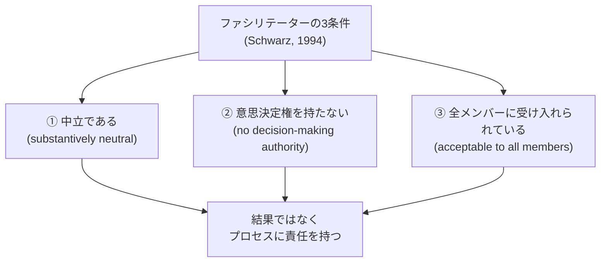

> **ベストプラクティス:** 自分が「意思決定に利害関係を持つ立場」（例：その会議の結果次第で自分の評価やプロジェクトの行方が変わる）にある場合、自分自身がファシリテーターを兼務することは避け、可能であれば別の人にファシリテーターを依頼しましょう。CAFが繰り返し強調する「中立性」は、単なる態度の問題ではなく、構造的な利益相反の回避でもあります。
>
> **ソース:**
> - [Certified Agile Facilitator (CAF) - Scrum Alliance 公式ページ](https://www.scrumalliance.org/get-certified/certified-agile-facilitator)
> - Schwarz, R. (1994). *The Skilled Facilitator*. Jossey-Bass. （全文プレビュー: [digitalcommons.usu.edu/advance/257](https://digitalcommons.usu.edu/advance/257)）
> - White, N. (2005). "Online Group Facilitation Skills" in *Encyclopedia of Virtual Communities and Technologies* （Schwarzの定義の引用元の一つ）

---

## 3. 誰がCAFを学ぶべきか

公式ページでは、CAFの対象者を次のように挙げています。

- 職場でのより効果的な会話・会議・相互作用のために、実践的なファシリテーションスキルを身につけたい人
- スクラムマスター、プロダクトオーナー、スクラムチームメンバー
- チームを率いる立場の人
- プロフェッショナルファシリテーター
- 現役／志望のアジャイルコーチ
- アジャイルコンサルタント
- アジャイルチームメンバー
- CSP-SM、CSP-PO、CSP-D（Certified Scrum Professional）保持者で、特にCertified Agile Coachへの道を検証したい人

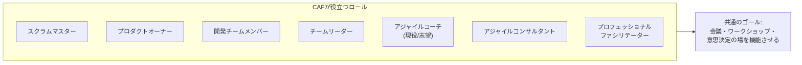

> **ベストプラクティス:** スクラムマスターは「ファシリテーションはスクラムマスターの仕事の一部」と思われがちですが、公式リソース記事は「ファシリテーションはスクラムマスターに限らず、あらゆるアジャイルロールが磨くべきスキルである」と明言しています。プロダクトオーナーや開発者であっても、レビューやレトロスペクティブを主導する場面ではファシリテーションスキルが直接活きます。
>
> **ソース:** [Certified Agile Facilitator (CAF) - Scrum Alliance 公式ページ](https://www.scrumalliance.org/get-certified/certified-agile-facilitator)、[Why Facilitation Skills Are Important](https://resources.scrumalliance.org/article/facilitation-skills-important)

---

## 4. CAFの5つの学習目標を深掘りする

公式ページに掲載されている学習目標（Learning Objectives）は次の5つです。

1. Discover what a facilitator is and what they do
2. Practice the mindset of a neutral facilitator
3. Learn how to facilitate teams through conflict
4. Understand the needs of different teams
5. Apply the skillset before, during, and after a facilitation event

> **補足:** 詳細な公式学習目標PDF（[CAF Learning Objectives](https://drive.google.com/file/d/1sOGykvoYGYJIxtuV6WwHGUW8CRe6RUH0/view)）はGoogle Driveでホストされておりサインインが必要なため、本ガイド作成時点では内容を検証できませんでした。以下の解説は、公式ページ本文とScrum Alliance公式リソース記事、および一般的なファシリテーション理論に基づき、5つの学習目標それぞれを掘り下げたものです。受講前に必ずご自身でPDFにアクセスし、一次情報を確認してください。

以下、5つを順番に解説します。

### 4.1 学習目標①：ファシリテーターとは何か、何をするかを知る

Scrum Alliance公式記事「Why Facilitation Skills Are Important」は、ファシリテーターの働きを次の5つの行動で説明しています。

| ファシリテーターの行動 | 説明 |
|---|---|
| プロセスの発見と定義を助ける | グループが「どう進めるか」を一緒に見つける |
| プロセスを維持しつつ必要なら方向転換する | 決めた進め方に固執しすぎない |
| 結果に対して中立を保つ | 特定の結論に誘導しない |
| 全員の声が届く環境を作る | 特に普段発言しない人の声を拾う |
| 脱線を本題に戻す | 関係ない会話や横道を修正する |

> **ベストプラクティス:** 「グループはコンテンツ（議題の中身）の専門家であり、ファシリテーターはプロセス（進め方）の専門家である」という役割分担を、会議の冒頭で参加者に明示的に伝えましょう。これにより、ファシリテーターが議論の内容に口を出さないことへの参加者の違和感を事前に解消できます。
>
> **ソース:** [Why Facilitation Skills Are Important](https://resources.scrumalliance.org/article/facilitation-skills-important)

### 4.2 学習目標②：中立なファシリテーターのマインドセットを実践する

中立性は「意見を持たない」ことではなく、「結果への執着を手放し、プロセスの質に責任を持つ」という態度です。第5章で詳しく扱います。

### 4.3 学習目標③：対立を通してチームをファシリテートする方法を学ぶ

公式記事は次のように述べています。

> "A facilitator also helps with conflict when it arises. It's normal and expected for disagreement to arise when a group of passionate people gets together on a topic. Without an effective facilitator, conflict may lead to an impasse, while a skilled facilitator knows how to support the group through disagreement and how to show the group to use conflict to come to a well-considered decision."

つまり、対立（コンフリクト）は異常事態ではなく、情熱を持った人々が集まれば自然に起こるものであり、ファシリテーターの仕事は対立を消すことではなく、対立を「行き詰まり（impasse）」ではなく「よく検討された意思決定」に変換することです。詳細は第9章。

### 4.4 学習目標④：異なるチームのニーズを理解する

チームは発達段階（第6章のTuckmanモデル参照）や文化、リモート/対面といった条件によって必要とする支援が異なります。CAFはこの「一律のテンプレートを当てはめない」姿勢を学習目標として明示しています。

### 4.5 学習目標⑤：イベントの前・最中・後にスキルセットを適用する

ファシリテーションは「その場の進行技術」ではなく、準備（Before）・実施（During）・振り返り（After）の3フェーズを持つ一連のプロセスです。詳細は第11章で実務フローとして解説します。

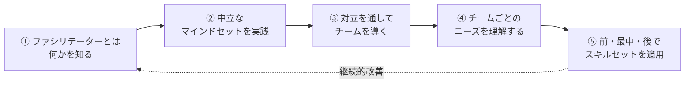

> **ソース:** [Certified Agile Facilitator (CAF) - Scrum Alliance 公式ページ](https://www.scrumalliance.org/get-certified/certified-agile-facilitator)

---

## 5. 中立性の原則：コンテンツとプロセスの分離

CAF学習目標の核である「中立性」を、もう一段深く構造化します。

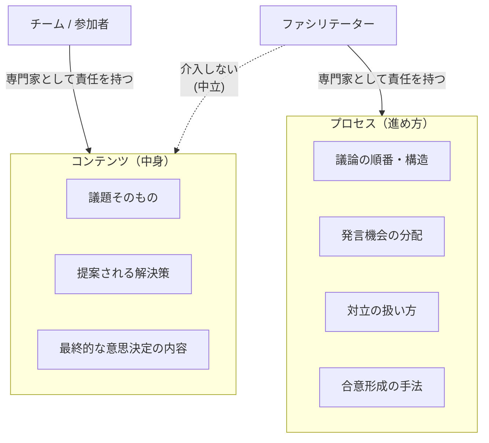

公式記事はこの分離の理由を次のように説明します。

> "The group needs this neutral support because it allows them to focus on their expertise: the content of the meeting/event. The team is the expert on the content and the facilitator provides the process support."

### 5.1 中立性がないとどうなるか

公式記事は、効果的なファシリテーションが「無い」場合に起こることも列挙しています。

| ファシリテーション不在の兆候 | 結果 |
|---|---|
| 合意されたプロセス・構造がない | 進捗が停滞する |
| 声が大きい人だけが発言する | 内向的な人の意見が失われる |
| 発言しない人が増える | 心理的安全性が低いまま |
| 全員が発言する機会がない | 合意への納得感（buy-in）が下がる |
| コラボレーション・コミュニケーションが起きない | エンゲージメントが下がる |
| 目的の共通理解がない | チームがバラバラの方向を向く |

> **ベストプラクティス:** ファシリテーター自身がその議題に強い意見を持っている場合、「今日は私はファシリテーター役に徹し、内容についての意見は別の機会（または別の参加者として）に述べます」と冒頭で宣言しましょう。役割の切り替えを明示することで、無意識の誘導（結果への肩入れ）を防げます。
>
> **ソース:** [Why Facilitation Skills Are Important](https://resources.scrumalliance.org/article/facilitation-skills-important)

---

## 6. グループ発達モデル：Tuckmanの5段階

CAFの学習目標④「異なるチームのニーズを理解する」を実践するための代表的な理論が、心理学者 **Bruce Tuckman** が1965年に発表したグループ発達モデルです（1977年にMary Ann Jensenとの共著で "Adjourning" が追加され5段階に）。

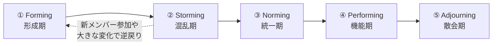

| 段階 | 特徴 | ファシリテーターの役割 |
|---|---|---|
| Forming（形成期） | メンバーは様子見。対立を避け、リーダーに依存する | 明確な目的・構造を提示し、心理的な足場を作る |
| Storming（混乱期） | 意見の衝突、リーダーシップへの疑問が表面化 | 対立を安全に表出させ、プロセスで受け止める（第9章） |
| Norming（統一期） | 対立が解消され、協力関係と規範が生まれる | チームが自ら決めた作業合意（Working Agreement）を尊重する |
| Performing（機能期） | 高い自律性で成果を出す | 介入を最小化し、必要な時だけ支援する |
| Adjourning（散会期） | チーム解散・目的達成後の区切り | 振り返りと功績の承認の場を作る |

> **ベストプラクティス:** チームが「Storming」段階にいるのに、ファシリテーターが「Performing」段階向けの軽いファシリテーション（口出しを最小限にするなど）をしてしまうと、対立が未処理のまま放置され、チームが同じ問題を繰り返します。逆に「Performing」段階のチームに「Forming」段階向けの過度に構造化されたプロセスを持ち込むと、チームの自律性を阻害し不満を招きます。ファシリテーションの手法は、今チームがどの段階にいるかに合わせて調整する必要があります。
>
> **ソース:**
> - Tuckman, B. W. (1965). "Developmental sequence in small groups." *Psychological Bulletin*, 63(6), 384–399.
> - Tuckman, B. W., & Jensen, M. A. C. (1977). "Stages of small-group development revisited." *Group & Organization Studies*, 2(4), 419–427.
> - 概説: [Tuckman's stages of group development - Wikipedia](https://en.wikipedia.org/wiki/Tuckman%27s_stages_of_group_development)

---

## 7. 心理的安全性：ファシリテーションの土台

CAFの「対立を通してチームを導く」「異なるチームのニーズを理解する」という学習目標を支える最重要概念が **心理的安全性（Psychological Safety）** です。ハーバード・ビジネス・スクール教授 Amy C. Edmondson が1999年の論文で提唱した概念で、次のように定義されます。

> "a shared belief that the team is safe for interpersonal risk taking"
> （チームが対人リスクを取っても安全だという、チーム内で共有された信念）

Edmondsonは、心理的安全性は「仲が良いこと（group cohesiveness）」とは異なり、むしろ厳しいフィードバックや率直な意見対立を可能にするものだと強調しています（心理的安全性が高いチームほど、ミスの「報告」が多く見える、というよく知られた逆説的な発見もこの研究に基づきます）。

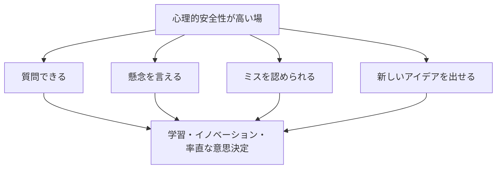

> **ベストプラクティス:** 心理的安全性は「一度作れば終わり」の状態ではなく、ファシリテーターが毎回のセッションで再構築する必要がある一時的な状態です。具体的な手法として、Scrum Alliance公式記事は「参加者に発言者の言葉をパラフレーズ（言い換えて反復）させる」ことを提案しています。これにより、発言が正しく届いたことを話し手が確認でき、聞き手側も注意深く聞く姿勢が強化されます。
>
> **ソース:**
> - Edmondson, A. C. (1999). "Psychological Safety and Learning Behavior in Work Teams." *Administrative Science Quarterly*, 44(2), 350–383.
> - [Amy C. Edmondson - Harvard Business School 教員ページ](https://www.hbs.edu/faculty/Pages/profile.aspx?facId=6451)
> - [10 Tips for Hosting Fun, Effective Virtual Meetings - Scrum Alliance](https://resources.scrumalliance.org/article/10-tips-for-hosting-fun-effective-virtual-meetings)（パラフレーズ手法の出典）

---

## 8. 参加型意思決定モデル：Diamond of Participation

ファシリテーションの現場で頻出する「話し合いが煮詰まって進まない」状態を理論化したのが、Sam Kaner らによる **Facilitator's Guide to Participatory Decision-Making**（初版1996年、Community At Work発）の中核モデル、通称 **Diamond of Participation（参加のダイヤモンド）** です。

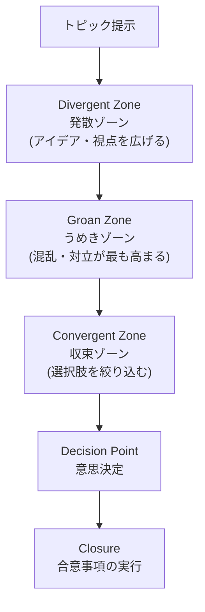

| ゾーン | 何が起きるか | ファシリテーターがすべきこと |
|---|---|---|
| Divergent Zone（発散） | 自由な発言、多様な視点、ブレインストーミング | できるだけ多くの視点を歓迎し、早期の評価・却下を止める |
| Groan Zone（うめき） | 情報過多、混乱、意見対立が最高潮になる（＝Tuckmanの"Storming"に相当） | ここで諦めて元の「無難な結論」に戻らせない。むしろこのゾーンを通過することが質の高い合意への近道だと伝える |
| Convergent Zone（収束） | 選択肢の評価・整理・絞り込み | 基準を明確にし、比較を助ける |

「Groan Zone」を安全に通過するための実務ツールが **Gradients of Agreement（合意の勾配）** スケールです（Sam Kaner, Duane Berger, Community At Work, 1987年開発）。賛成/反対の二択ではなく、段階的な合意度を可視化する投票ツールです。

| 合意の勾配（例：5〜7段階） | 意味 |
|---|---|
| 全面的な支持 | 積極的に推進したい |
| 合意できる | 賛成する |
| 懸念はあるが支持する | 一部気になるが反対はしない |
| 保留・中立 | どちらとも言えない |
| 支持できないが、従う | 反対だが決定には従う |
| 拒否権を行使する | この提案には賛成できない、進めさせない |

> **ベストプラクティス:** Groan Zone（うめきゾーン）は「ファシリテーションが失敗している兆候」ではなく、「質の高い合意に向かうために通過が必要な正常なプロセス」です。チームがここで沈黙したり苛立ったりしても、ファシリテーターが焦って早期に多数決へ持ち込むと、表面的な合意（false consensus）に終わり、後で同じ対立が再燃します。Gradients of Agreementのようなツールで「どこにギャップがあるか」を可視化し、うめきゾーンを意図的に通過させましょう。
>
> **ソース:**
> - Kaner, S., Lind, L., Toldi, C., Fisk, S., & Berger, D. *Facilitator's Guide to Participatory Decision-Making* (3rd ed.). Jossey-Bass/Wiley.
> - 書評（モデルの図解あり）: [Book Review: Facilitator's Guide to Participatory Decision Making - InfoQ](https://www.infoq.com/articles/facilitators-guide-book-review/)
> - Gradients of Agreementの解説: [Gradients of agreement scale - Wikipedia](https://en.wikipedia.org/wiki/Gradients_of_agreement_scale)、[Michigan State University Extension](https://www.canr.msu.edu/news/gradients_of_agreement_can_help_move_groups_forward)

---

## 9. 対立（コンフリクト）を通したファシリテーション

CAFの学習目標③に直接対応する章です。「対立を消す」のではなく「対立を意思決定の材料に変える」ための考え方を整理します。

### 9.1 対立を「行き詰まり」で終わらせないための基本姿勢

公式記事の主張を実務的な原則に翻訳すると以下のようになります。

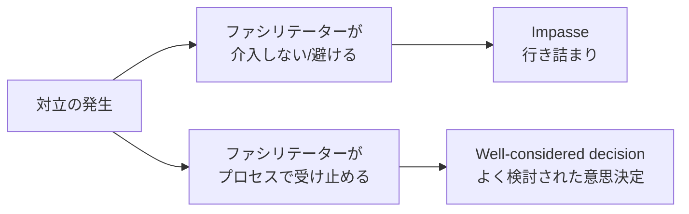

### 9.2 対立を扱うための具体的な足場（Roger Schwarzのグラウンドルール的アプローチ）

facilitation実務でよく使われるグラウンドルール（Ground Rules）の考え方は、対立時にこそ効果を発揮します。

| グラウンドルール | 対立時の効果 |
|---|---|
| 具体例を使って話す | 抽象的な人格攻撃ではなく、事実ベースの議論に戻せる |
| 重要な言葉の意味をすり合わせる | 「品質」「完了」など、実は定義がズレている対立を解消できる |
| 関連する情報をすべて共有する | 隠れた前提や情報格差による誤解を防ぐ |
| 推論の道筋を説明する | 「なぜそう思うか」を可視化し、批判ではなく理解を促す |
| 立場ではなく利害・関心に焦点を当てる | 「Aがいい/Bがいい」ではなく「なぜAがいいのか」を掘り下げ、共通の関心を見つける |
| 次のステップを一緒に設計する | 対立の解消を「勝ち負け」ではなく「共同作業」にする |

> **ベストプラクティス:** グラウンドルールは対立が起きてから提示するのではなく、セッションの冒頭で「もし意見が割れたら、私たちはこのルールで話し合います」と事前に合意しておきましょう。対立の渦中で新しいルールを持ち出すと、特定の立場を有利にするための恣意的な介入だと受け取られるリスクがあります。
>
> **ソース:**
> - 公式記事の対立に関する記述: [Why Facilitation Skills Are Important](https://resources.scrumalliance.org/article/facilitation-skills-important)
> - グラウンドルールの一覧: Schwarz, R. (1994). *The Skilled Facilitator*. Jossey-Bass.（要約: [Penn State Extension - Facilitation Tools and Strategies](https://aese.psu.edu/research/centers/cecd/engagement-toolbox/facilitation/facilitation-tools/tools-and-strategies)）

---

## 10. リモート／バーチャルファシリテーション

Scrum Alliance公式リソース記事「10 Tips for Hosting Fun, Effective Virtual Meetings」（Ram Srinivasan, Organizational Effectiveness Coach）は、CAFの学習目標④（チームごとのニーズを理解する）をリモート環境に適用した実践的な10のヒントを提示しています。

| # | ヒント | 内容 |
|---|---|---|
| 1 | プロ流にピボットする | 対面で効果的な手法を分解し、Zoom等の投票・ブレイクアウト機能で再構築する |
| 2 | 進行役を分業する | 「進行」と「技術サポート／チャット監視」の2人体制にする |
| 3 | 会議を小さくする | バーチャル会議は12人が限界。初心者はまず6人単位から |
| 4 | スライドショーを避ける | 一方的な説明よりブレイクアウトルームなど参加型手法を使う |
| 5 | 不快感に注意する | 45分ごとに10〜15分休憩。長引く議論には「ローマ投票」で継続可否を確認 |
| 6 | 練習と準備をする | 「ぶっつけ本番」はNG。通信障害等のプランBを用意する |
| 7 | 期待値を事前に伝える | 静かな場所からの参加を約束事にし、破った場合はミュートすると事前告知する |
| 8 | 包摂的な文化を作る | **NOSTUESOルール**（全員が1回発言するまで誰も2回目の発言をしない）を使う |
| 9 | 早い段階で全員を巻き込む | 最初の5分で発言した人はその後も発言しやすくなる。Mentimeter/Kahoot！等を活用 |
| 10 | 心理的に安全な作業合意を推奨する | 参加者に発言をパラフレーズ（言い換え）させ、心理的安全性を育てる |

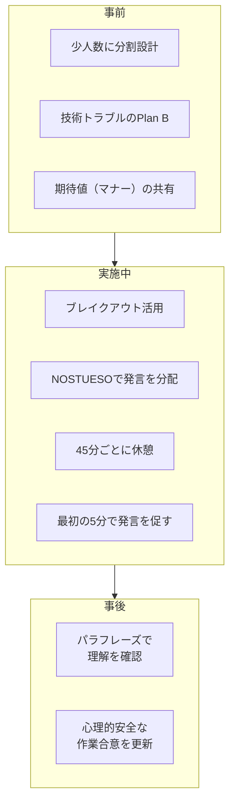

> **ベストプラクティス（NOSTUESOルールの詳細）:** 誰かが発言した後、次に自然発生的に発言者が現れない場合は、発言者自身に「次に話してほしい人を指名してもらう」運用にします。ただし各参加者には「パスする権利」も保証します。この2つのルールの組み合わせにより、発言力の偏りを構造的に是正しつつ、強制的な発言を避けられます。
>
> **ソース:** [10 Tips for Hosting Fun, Effective Virtual Meetings - Scrum Alliance Resource Library](https://resources.scrumalliance.org/article/10-tips-for-hosting-fun-effective-virtual-meetings)（著者: Ram Srinivasan / Innovagility.com、寄稿: Gene Gendel）

---

## 11. イベントの前・最中・後：ファシリテーターの実務フロー

学習目標⑤「Apply the skillset before, during, and after a facilitation event」を、実務チェックリストの形に落とし込みます。

```mermaid
flowchart LR
    subgraph PRE["Before（事前設計）"]
        P1["目的とゴールの明確化"]
        P2["参加者・人数の設計"]
        P3["アジェンダとタイムボックス"]
        P4["ツール・場の準備"]
        P5["グラウンドルールの下書き"]
    end
    subgraph LIVE["During（実施）"]
        L1["目的とグラウンドルールの共有"]
        L2["発散→うめき→収束の誘導"]
        L3["中立性の維持"]
        L4["対立をプロセスで受け止める"]
        L5["時間管理"]
    end
    subgraph POST["After（事後）"]
        A1["決定事項・アクションの確認"]
        A2["参加者からのフィードバック収集"]
        A3["自己の振り返り（何を改善するか）"]
        A4["次回への申し送り"]
    end
    PRE --> LIVE --> POST
    POST -.->|継続的改善| PRE
```

### 11.1 各フェーズのチェックリスト

**Before（事前）**
- [ ] このセッションのゴールは何か、参加者と事前に共有できているか
- [ ] 参加人数はゴールに対して適切か（多すぎないか）
- [ ] アジェンダに発散・収束それぞれの時間が確保されているか
- [ ] グラウンドルールを事前に用意し、必要なら参加者と合意したか
- [ ] リモートの場合、技術トラブル時のプランBがあるか

**During（実施中）**
- [ ] 冒頭でゴール・進め方・グラウンドルールを共有したか
- [ ] 自分がコンテンツに口を出しそうになっていないか、常に自己チェックしているか
- [ ] 発言が偏っていないか（NOSTUESOなどで分配できているか）
- [ ] 対立が起きたとき、感情ではなく事実・利害に焦点を戻せているか
- [ ] タイムボックスを守りつつ、必要な議論の深さを確保できているか

**After（事後）**
- [ ] 決定事項とネクストアクションが全員に明確か
- [ ] 参加者に率直なフィードバックを求めたか
- [ ] 自分自身のファシリテーションの何が良く、何を改善すべきか振り返ったか
- [ ] 次回のセッション設計にその学びを反映する仕組みがあるか

> **ベストプラクティス:** CAFの公式FAQは「受講後、実際のファシリテーション計画をどう改善するか判断する機会がある」と述べています。これは、ファシリテーションが座学で完結するスキルではなく、実際のセッションでの実践と振り返りのサイクルを回すことで熟達するスキルであることを示しています。1回のセッションごとに簡単な自己レビュー（うまくいったこと1つ、次に変えること1つ）を記録する習慣が効果的です。
>
> **ソース:** [Certified Agile Facilitator (CAF) - Scrum Alliance 公式ページ](https://www.scrumalliance.org/get-certified/certified-agile-facilitator)（FAQ: "Will I get a chance to practice facilitation?"）

---

## 12. ファシリテーション技法ツールボックス

CAFはマインドセットを重視する一方、実際のセッションを設計するには具体的な「技法」も必要です。世界的に広く使われている代表的な技法を比較します。

| 技法 | 開発者／出典 | 何に使うか | 概要 |
|---|---|---|---|
| ORID（Focused Conversation） | Institute of Cultural Affairs（ICA）Technology of Participation | 振り返り、レトロスペクティブ、経験の意味づけ | Objective（事実）→Reflective（感情反応）→Interpretive（解釈・意味）→Decisional（次の行動）の4段階で問いを設計する |
| Liberating Structures | Henri Lipmanowicz & Keith McCandless | 大人数の会議、アイデア創出、権力の偏りの是正 | 43種類の「マイクロストラクチャー」（うち33種類が原典のレパートリー、残りは後年の追加。例: 1-2-4-All、TRIZ等）で、少数の声だけが支配する会議を構造的に変える。最新の一覧は公式カタログで確認する |
| Diamond of Participation / Gradients of Agreement | Sam Kaner ほか | 意思決定、合意形成 | 第8章参照。発散→うめき→収束のプロセスを可視化する |
| Ground Rules（グラウンドルール） | Roger Schwarz | 対立予防、議論の質向上 | 第9章参照。具体例で話す、利害に焦点を当てる等 |
| NOSTUESO | Scrum Alliance（記事内で紹介） | 発言機会の公平な分配 | 第10章参照。全員が1回話すまで誰も2回目を話さない |

### 12.1 Liberating Structuresの10原則

Liberating Structuresの公式サイトは、手法を貫く10の原則を掲げています。

1. Include and unleash everyone.（全員を含め、解き放つ）
2. Practice deep respect for people and local solutions.（人と現場の解決策への深い敬意）
3. Never start without a clear purpose.（明確な目的なしに始めない）
4. Build trust as you go.（進めながら信頼を築く）
5. Learn by failing forward.（前向きな失敗から学ぶ）
6. Practice self-discovery within a group.（グループの中での自己発見を実践する）
7. Amplify freedom and responsibility.（自由と責任を増幅する）
8. Emphasize possibilities: believe before you see.（可能性を強調する：見る前に信じる）
9. Invite creative destruction to make space for innovation.（創造的破壊を招き入れる）
10. Engage in seriously playful curiosity.（真剣に遊び心のある好奇心を持つ）

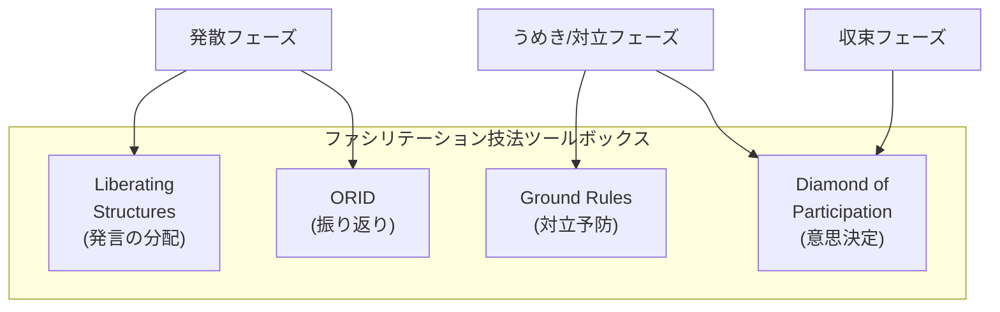

> **ベストプラクティス:** 技法は「知っている数」で評価されるものではありません。CAFの学習目標が「マインドセット」を先に置いているのはこのためです。1つの技法（例えばORID）を深く使いこなせる方が、10個の技法を表面的に知っているより実務では役立ちます。まずは自分のチームでよく使う場面（レトロスペクティブなら ORID、大人数会議なら Liberating Structures）に1つずつ技法を定着させましょう。
>
> **ソース:**
> - ORID: Stanfield, R. B. (2000). *The Art of Focused Conversation*. Institute of Cultural Affairs. 概説: [PMC論文 - Utilizing the focused conversation method](https://www.ncbi.nlm.nih.gov/pmc/articles/PMC6518626/)
> - Liberating Structures: [公式サイト liberatingstructures.com](https://www.liberatingstructures.com/)、Lipmanowicz, H., & McCandless, K. *The Surprising Power of Liberating Structures*.
> - 国際的なファシリテーター専門団体: [International Association of Facilitators (IAF)](https://www.iaf-world.org/)

---

## 13. アジャイルにおけるファシリテーター：隣接ロールとの違い

CAFの対象者には「アジャイルコーチ」も含まれますが、ファシリテーターとアジャイルコーチは同じではありません。Agile Coaching Institute共同創設者の Lyssa Adkins と Michael Spayd は、優れたアジャイルコーチに必要な能力を **4つのコンピテンシー（Facilitating／Teaching／Mentoring／Coaching）** として整理しています。

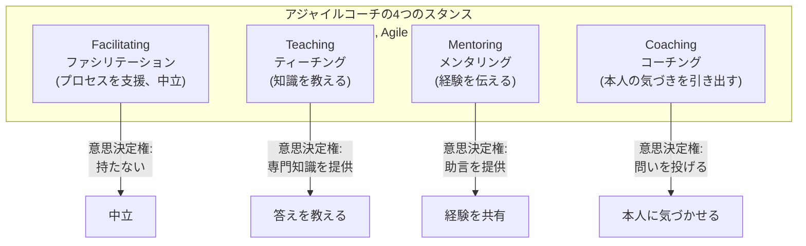

| スタンス | 目的 | ファシリテーションとの違い |
|---|---|---|
| Facilitating | グループがプロセスを通じて自ら結論に達するのを助ける | 中立・無権限が絶対条件（第2章の定義そのもの） |
| Teaching | 知識・フレームワークを教える | 教える内容について「答え」を持っている点が中立性と相反する |
| Mentoring | 自分の経験に基づき助言する | 自分の経験を基準に語るため、中立ではない |
| Coaching（プロフェッショナルコーチング） | 相手自身の気づき・答えを引き出す | 中立に近いが、対象は個人であり「グループのプロセス」ではなく「個人の思考」に向く |

> **ベストプラクティス:** 1つのセッションの中で無自覚にスタンスを切り替えてしまうと、参加者は混乱します（例：ファシリテーターのはずが急に「私はこう思う」とTeachingモードに入る）。スタンスを切り替える必要がある場合は、「ここからは少し私の意見も共有していいですか？（Teachingモードに入ります）」のように明示的に宣言し、終わったら再び中立なFacilitatingモードに戻ることを伝えましょう。
>
> **ソース:**
> - [Lyssa Adkins and Michael Spayd on the Role of the Agile Coach - InfoQ](https://www.infoq.com/agile_techniques/interviews/72)
> - Adkins, L. (2010). *Coaching Agile Teams*. Addison-Wesley.
> - [Certified Agile Facilitator (CAF) - Scrum Alliance 公式ページ](https://www.scrumalliance.org/get-certified/certified-agile-facilitator)（"Current and aspiring agile coaches" が対象者に含まれる旨の記載）

---

## 14. ベストプラクティス総まとめ表

| 章 | テーマ | 最重要ベストプラクティス |
|---|---|---|
| 1 | CAF概要 | 技法より先に「マインドセット」を内面化する |
| 2 | 定義 | 利害関係がある議題では自分がファシリテーターを兼務しない |
| 3 | 対象者 | ファシリテーションはスクラムマスター専用スキルではないと認識する |
| 4 | 5つの学習目標 | 5つを順番の学習ステップとして捉え、①→⑤へ進む |
| 5 | 中立性 | コンテンツとプロセスの役割分担を冒頭で明示する |
| 6 | Tuckmanモデル | チームの発達段階に応じてファシリテーションの強度を調整する |
| 7 | 心理的安全性 | パラフレーズ（言い換え）を使い、毎回のセッションで安全性を再構築する |
| 8 | Diamond of Participation | うめきゾーンを失敗と誤解せず、意図的に通過させる |
| 9 | 対立への対応 | グラウンドルールは対立前に合意しておく |
| 10 | リモートファシリテーション | NOSTUESOルールで発言機会を構造的に分配する |
| 11 | 前・最中・後フロー | セッションごとに簡単な自己振り返りを記録する |
| 12 | 技法ツールボックス | 技法は広く浅くより、1つを深く定着させる |
| 13 | 隣接ロールとの違い | スタンスの切り替えは参加者に明示的に宣言する |

---

## 15. 認定パスと関連リソース

- 公式コース検索: [Find a course - Scrum Alliance](https://www.scrumalliance.org/courses-events/search?ctyp=AcsCf)
- 公式学習目標PDF（要サインイン）: [CAF Learning Objectives](https://drive.google.com/file/d/1sOGykvoYGYJIxtuV6WwHGUW8CRe6RUH0/view)
- Scrum Education Units（SEU）制度の説明: [Scrum Education Units - Scrum Alliance](https://www.scrumalliance.org/get-certified/scrum-education-units)
- 旧名称: Agile Coaching Skills - Certified Facilitator (ACS-CF)（Agile Coaching Essentials トラックの一部。コース内容・学習目標・要件はCAFに引き継がれている）
- 関連リソース記事（公式ページから直接リンクされているもの）:
  - [Why Facilitation Skills Are Important](https://resources.scrumalliance.org/article/facilitation-skills-important)
  - [Remote Facilitation（動画）](https://resources.scrumalliance.org/video/remote-facilitation)
  - [Webinar: Stop Facilitating the World's Most Boring Meetings](https://resources.scrumalliance.org/webinar/webinar-stop-facilitating-worlds-boring-meetings)
  - [10 Tips for Hosting Fun, Effective Virtual Meetings](https://resources.scrumalliance.org/article/10-tips-for-hosting-fun-effective-virtual-meetings)

> **ベストプラクティス:** CAF受講前に、上記の無料公開記事・動画に一通り目を通しておくと、コース内で扱われる「マインドセット」の議論に、より深く参加できます。特に「Why Facilitation Skills Are Important」はCAFの思想的な土台をそのまま解説しているため、必読です。

---

## 16. 参考文献・出典一覧

### Scrum Alliance 公式ソース

- [Certified Agile Facilitator (CAF) - Scrum Alliance 公式ページ](https://www.scrumalliance.org/get-certified/certified-agile-facilitator)
- [CAF Learning Objectives（PDF、要サインイン）](https://drive.google.com/file/d/1sOGykvoYGYJIxtuV6WwHGUW8CRe6RUH0/view)
- [Why Facilitation Skills Are Important](https://resources.scrumalliance.org/article/facilitation-skills-important)
- [10 Tips for Hosting Fun, Effective Virtual Meetings](https://resources.scrumalliance.org/article/10-tips-for-hosting-fun-effective-virtual-meetings)
- [Remote Facilitation（動画）](https://resources.scrumalliance.org/video/remote-facilitation)
- [Webinar: Stop Facilitating the World's Most Boring Meetings](https://resources.scrumalliance.org/webinar/webinar-stop-facilitating-worlds-boring-meetings)
- [Scrum Education Units (SEU)](https://www.scrumalliance.org/get-certified/scrum-education-units)

### 学術・専門文献

- Schwarz, R. (1994). *The Skilled Facilitator: A Comprehensive Resource for Consultants, Facilitators, Managers, Trainers, and Coaches*. Jossey-Bass.（[全文プレビュー](https://digitalcommons.usu.edu/advance/257)）
- Tuckman, B. W. (1965). "Developmental sequence in small groups." *Psychological Bulletin*, 63(6), 384–399.
- Tuckman, B. W., & Jensen, M. A. C. (1977). "Stages of small-group development revisited." *Group & Organization Studies*, 2(4), 419–427.
- Edmondson, A. C. (1999). "Psychological Safety and Learning Behavior in Work Teams." *Administrative Science Quarterly*, 44(2), 350–383.
- Kaner, S., Lind, L., Toldi, C., Fisk, S., & Berger, D. *Facilitator's Guide to Participatory Decision-Making* (3rd ed.). Jossey-Bass/Wiley.
- Lipmanowicz, H., & McCandless, K. *The Surprising Power of Liberating Structures: Simple Rules to Unleash a Culture of Innovation*.
- Stanfield, R. B. (2000). *The Art of Focused Conversation: 100 Ways to Access Group Wisdom in the Workplace*. Institute of Cultural Affairs.
- Adkins, L. (2010). *Coaching Agile Teams: A Companion for ScrumMasters, Agile Coaches, and Project Managers in Transition*. Addison-Wesley.

### 専門機関・団体

- [International Association of Facilitators (IAF)](https://www.iaf-world.org/) — ファシリテーターの国際的な専門団体。Certified Professional Facilitator (CPF) 認定制度を提供・運営している。
- [Liberating Structures 公式サイト](https://www.liberatingstructures.com/)

### 二次的な解説記事（一次資料の裏付けとして）

- [Book Review: Facilitator's Guide to Participatory Decision Making - InfoQ](https://www.infoq.com/articles/facilitators-guide-book-review/)
- [Gradients of agreement scale - Wikipedia](https://en.wikipedia.org/wiki/Gradients_of_agreement_scale)
- [Tuckman's stages of group development - Wikipedia](https://en.wikipedia.org/wiki/Tuckman%27s_stages_of_group_development)
- [Lyssa Adkins and Michael Spayd on the Role of the Agile Coach - InfoQ](https://www.infoq.com/agile_techniques/interviews/72)
- [Utilizing the focused conversation method in qualitative public health research - PMC](https://www.ncbi.nlm.nih.gov/pmc/articles/PMC6518626/)

---

> **免責事項:** 本ガイドはScrum Alliance公式のCAF学習教材ではなく、公開情報をもとに作成した非公式の学習補助資料です。公式のCAF学習目標PDFはサインインが必要なため未検証です。正式な認定取得にあたっては、必ずScrum Alliance公式サイトおよび認定トレーナーが提供する公式カリキュラムをご確認ください。
