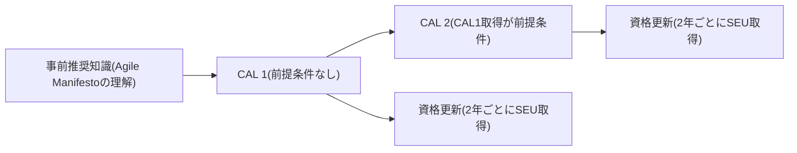
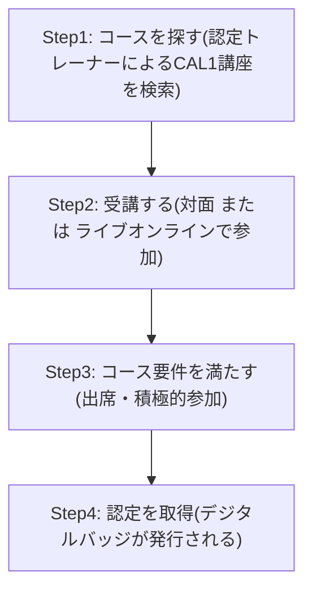
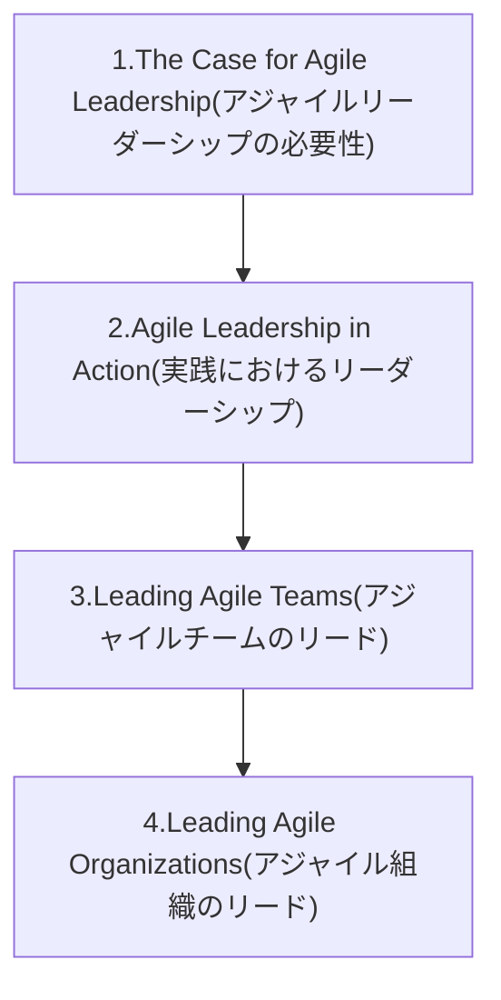
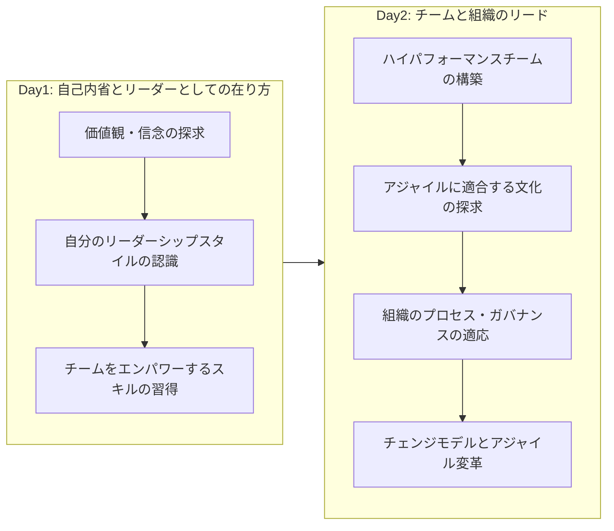
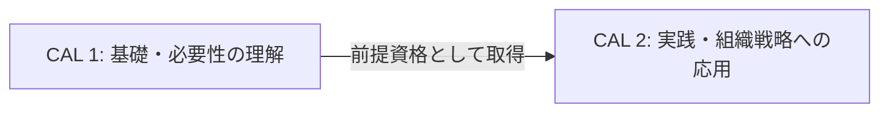
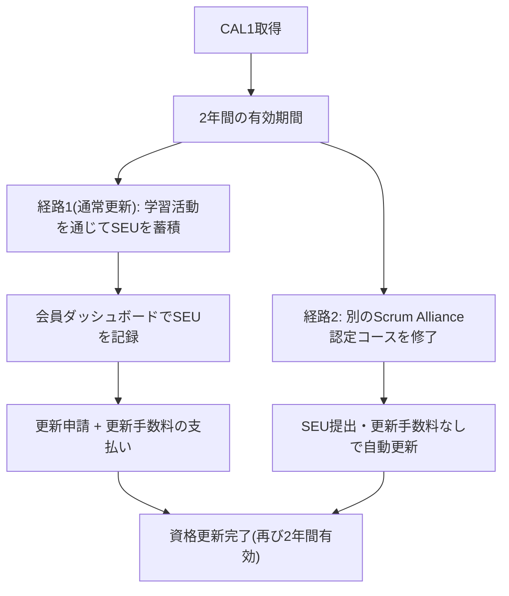
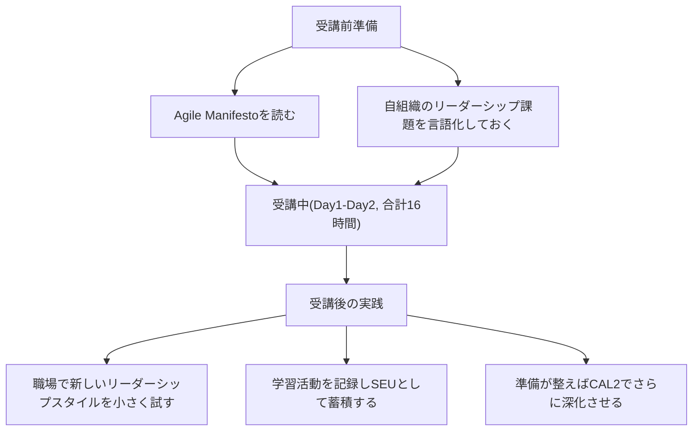

# Certified Agile Leader® 1 (CAL 1™) 完全ガイド ― 初学者向けステップバイステップ解説

> 対象読者: これから CAL 1 の受講を検討している方、アジャイルリーダーシップという概念に初めて触れる方
> 本ガイドの立ち位置: 第1〜3章は Scrum Alliance 公式サイトおよび認定トレーニングパートナーの公開情報に基づく事実整理です。第4章の「ベストプラクティス」は、公式に明記されている4つの学習領域(Learning Objectives)の名称・範囲を土台にしつつ、アジャイルリーダーシップ領域で一般的に参照される実践知(コーチング、チェンジマネジメント、組織文化論など)を組み合わせた実務解説です。両者を混同しないよう、事実部分には出典番号 `[n]` を付けています。巻末の「参考文献・ソース一覧」で確認できます。

---

## 目次

1. [CAL 1とは何か(概要)](#1-cal-1とは何か概要)
2. [資格制度における位置づけ](#2-資格制度における位置づけ)
3. [認定取得までの4ステップ](#3-認定取得までの4ステップ)
4. [学習内容: 4つの学習目標領域](#4-学習内容-4つの学習目標領域)
5. [コース構成: Day1 / Day2 の流れ](#5-コース構成-day1--day2-の流れ)
6. [受講対象者とレディネスチェック](#6-受講対象者とレディネスチェック)
7. [CAL 1 と CAL 2 の比較](#7-cal-1-と-cal-2-の比較)
8. [講師・トレーニングパートナーの品質基準](#8-講師トレーニングパートナーの品質基準)
9. [資格更新(Renewal)とSEU](#9-資格更新renewalとseu)
10. [初学者向け学習ロードマップ](#10-初学者向け学習ロードマップ)
11. [よくある誤解(FAQ)](#11-よくある誤解faq)
12. [全体ベストプラクティスまとめ表](#12-全体ベストプラクティスまとめ表)
13. [参考文献・ソース一覧](#13-参考文献ソース一覧)

---

## 1. CAL 1とは何か(概要)

Certified Agile Leader® 1 (CAL 1™) は、Scrum Alliance® が提供する「アジャイルリーダーシップ」領域の入門資格です [1]。重要な前提として、**CAL 1には筆記試験・選択式試験が存在しません**。認定は、**16時間のライブ講座への出席と積極的な参加**によって付与されます [1] [7]。これが全コースに共通する要件です。なお、トレーナーによっては事前課題・事後課題が別途課される場合がありますが、これはトレーナーごとの運用であり、Scrum Alliance が全 CAL 1 に共通して定める認定条件ではありません [7]。したがって、いわゆる「出題内容」に該当するものは存在せず、代わりに **Scrum Alliance が公式に定める学習目標(Learning Objectives)** が、コースで扱われる内容の枠組みになります [1]。この学習目標を、認定トレーニングパートナー PM-Partners のコースページでは4つの領域に整理して紹介しています [7]。本ガイドではこの4領域の整理を軸に、初学者にもわかりやすく解説していきます。

### 基本情報一覧

| 項目 | 内容 | 出典 |
|---|---|---|
| 正式名称 | Certified Agile Leader® 1 (CAL 1™) | [1] |
| 認定団体 | Scrum Alliance®(2001年設立の非営利団体) | [1] [19] |
| 前提条件 | なし(アジャイル/Scrumの基礎知識があると望ましい) | [1] |
| 受講形式 | 対面 または ライブオンライン(同期型) | [1] |
| 受講時間 | 16時間(多くは2〜3日間に分けて実施) | [1] |
| 試験の有無 | なし(筆記・選択式試験は実施されない) | [7] |
| 認定条件 | 16時間の講座へのフルタイム出席と積極的な参加(トレーナーが指定する場合は事前/事後課題も) | [1] [7] |
| 取得できるもの | デジタル認定バッジ + Scrum Alliance 2年間の専門会員資格 | [17] |
| 有効期間 | 2年間(SEU取得により更新可能) | [17] |
| 資格トラック上の位置 | Agile Leaderトラックの第1階層(CAL 2の前提資格) | [17] |
| 費用目安 | トレーナー・地域・通貨により変動する。受講料は各トレーナーのコースページで確認する(税の内外表記もトレーナーごとに異なる) | [7] |

> **初学者向けポイント**: 「資格試験に合格する」のではなく「講座に参加してワークを通じて自分のリーダーシップを見つめ直す」タイプの資格です。この点は CSM(Certified ScrumMaster)などの知識試験型資格とは大きく性質が異なります。

---

## 2. 資格制度における位置づけ

CAL 1 は、Scrum Alliance の「Agile Leader トラック」の入口にあたる資格です。2024年、Scrum Alliance は旧来の3階層プログラム(CAL-Essentials / CAL-Teams / CAL-Organizations)を、CAL 1・CAL 2 の2階層に再編しました [8] [9]。

### 旧プログラムとの対応関係

| 旧プログラム(〜2024年) | 新プログラム(2024年〜) | 補足 |
|---|---|---|
| CAL-Essentials (CAL-E) | CAL 1 に統合 | 学習目標はCAL1に引き継がれた |
| CAL-Teams (CAL-T) | CAL 1 に統合 | 同上 |
| CAL-Organizations (CAL-O) | CAL 1 および CAL 2 に再編 | 内容がより高度なCAL2にも分散 |
| (新設) | CAL 2 | CAL1取得後に受講可能な発展課程 |

出典: [9]。この再編について Scrum Alliance は公式発表で、市場調査およびトレーナー・受講生からのフィードバックを踏まえ、より一貫性のある学習パスを提供する目的で実施したと説明しています [15] [17]。

---

## 3. 認定取得までの4ステップ

Scrum Alliance の公式ページでは、認定取得までの流れを大きく3段階で案内しています [18]。本ガイドでは、受講から認定までの流れをより分かりやすく整理するため、次の4ステップに分解しています。

### 各ステップの詳細

| ステップ | やること | 初学者向けの補足 |
|---|---|---|
| Step 1: コースを探す | Scrum Alliance の Course Search で「CAL 1」を絞り込み検索する [1] | CAL トレーナーは個々に独立した事業として運営されており、Scrum Alliance が認定団体としてその品質を担保している [1] |
| Step 2: 受講する | 16時間のライブ講座(対面/オンライン)に参加する [1] | どのトレーナーのコースを選んでも、修了すれば同一の「Scrum Alliance公認資格」を取得できる [1] |
| Step 3: コース要件を満たす | 16時間の講座に出席し、演習に積極的に参加する [1] [7] | 一部のトレーナーは受講2週間前に事前課題(自己診断アンケートなど)を送付する。課題の有無はトレーナーごとに異なる [7] |
| Step 4: 認定を取得 | ライセンス契約に同意し、デジタルバッジをダウンロードする [9] | バッジはLinkedInなどの職務経歴に添付し、対外的に資格を証明する材料として使える |

---

## 4. 学習内容: 4つの学習目標領域

CAL 1 の学習目標(Learning Objectives)は Scrum Alliance が公式に定めていますが [1]、公式サイトでは箇条書きで提示されており、領域としての区分は明記されていません。認定トレーニングパートナー PM-Partners のコースページでは、この学習目標を **4つの領域** に整理して紹介しています [7]。この4領域は、「個人の内省 → 個人の実践 → チームへの適用 → 組織への適用」という流れで構成されています [7]。なお、この4領域を Day 1 に前半2領域(個人にフォーカス)、Day 2 に後半2領域(チーム・組織にフォーカス)として割り当てる進め方は、認定トレーニングパートナー PM-Partners が公開しているコース例です [7] [13]。日程配分は Scrum Alliance が全 CAL 1 に共通で定めるものではなく、トレーナーごとに異なります。

以下、各領域を初学者向けに詳しく解説します。**「学習目標の範囲」は出典[7](PM-Partnersのコースページ)に基づく事実、「ベストプラクティス」は一般的なアジャイルリーダーシップ実践知に基づく補足解説**として区別しています。

### 4.1 The Case for Agile Leadership(アジャイルリーダーシップの必要性を理解する)

**学習目標の範囲 [7]**: 効果的なアジャイルリーダーシップに必要なメリットとマインドセットの転換を理解する。アジャイルリーダーシップが従来型のリーダーシップとどう違うのか、また現代的な課題にどう対応するのかを探求する。

**初学者向け解説**: 従来型のリーダーシップは「上位者が計画し、下位者がその通りに実行する(指揮統制型)」という前提に立っていることが多いですが、変化の速いビジネス環境ではこのモデルが機能しにくくなっています。CAL 1 のこの領域では、なぜ「権限を委譲し、チームの自律性を引き出す」スタイルへの転換が必要なのかを、リーダー自身の価値観・信念の棚卸しから出発して学びます [7]。

**ベストプラクティス(実務での取り組み方の例)**:

| プラクティス | 具体的な進め方 |
|---|---|
| 自分のリーダーシップの前提を言語化する | 「メンバーが自律的に動けない理由」を環境要因とメンバー要因に分けて棚卸しする |
| VUCA環境を前提にした意思決定に慣れる | 全てを事前に計画するのではなく、小さく試して学ぶサイクル(検査と適応)を業務プロセスに組み込む |
| 心理的安全性を優先事項として扱う | 1on1やチーム会議で「反対意見を歓迎する」姿勢を明示的に伝える |
| 変化への抵抗を個人攻撃と捉えない | 抵抗は「変化がもたらす不確実性への自然な反応」と捉え、対話の入り口にする |

### 4.2 Agile Leadership in Action(実践におけるアジャイルリーダーシップ)

**学習目標の範囲 [7]**: リーダーシップフレームワークを学び、個人としての有効性を高める。チームの能力を伸ばすための重要なリーダーシップスキルを開発する。

**初学者向け解説**: 「わかる」を「できる」に変える領域です。前半で得た気づきを、実際の行動パターンに落とし込みます。具体的には、自分の言動が周囲にどう影響しているかへの自己認識を高め、フィードバックの与え方・受け取り方、目標設定の仕方など、日々のマネジメント行動に反映できるスキルを養います。

**ベストプラクティス**:

| プラクティス | 具体的な進め方 |
|---|---|
| フィードバックを「評価」ではなく「観察+影響+依頼」で伝える | 例: 「(観察)昨日の会議で発言が少なかった → (影響)議論の幅が狭くなった → (依頼)次回は一言でも意見をもらえると助かる」という順で伝える |
| 自分の権限委譲レベルを可視化する | タスクごとに「指示する / 説得する / 相談する / 合意する / 助言する / 委任する」のどのレベルで任せているかを明示する(Management 3.0 の Delegation Poker などが実務でよく参照される) |
| 1on1を「進捗確認」から「成長支援」へ転換する | 質問を「何が終わった?」ではなく「何を学んだ?次に何を試したい?」に変える |
| 自分のリーダーシップスタイルをメンバーの成熟度に合わせて可変にする | 経験の浅いメンバーには具体的な指示を、経験豊富なメンバーには権限委譲を、状況に応じて使い分ける(状況対応リーダーシップの考え方) |

### 4.3 Leading Agile Teams(アジャイルチームをリードする)

**学習目標の範囲 [7]**: 高パフォーマンスなチームを構築・維持するためのツールと手法を学ぶ。チームが直面する課題への対処法や、機能横断的なコラボレーションの促進方法を学ぶ。

**初学者向け解説**: 個人からチームへスコープが広がる領域です。チームは自然に高パフォーマンスになるわけではなく、心理的安全性、共通の目的、健全な対立、相互の説明責任といった要素が意図的に育成される必要があります。CAL 1 ではこうしたチームビルディングの視点と、機能横断チーム特有の課題(職能の壁、優先順位の対立など)への対処法を扱います。

**ベストプラクティス**:

| プラクティス | 具体的な進め方 |
|---|---|
| チームの目的(Why)を繰り返し言語化する機会を作る | スプリントレビューやふりかえりの冒頭で「何のためにこの仕事をしているか」を再確認する |
| 対立を「悪いもの」として避けない | タスク(業務上)の対立と人間関係の対立を切り分け、前者は歓迎する文化を作る |
| チームの自律性の範囲を明確にする | 「チームが自分たちで決められること」と「エスカレーションが必要なこと」の境界線を最初に合意しておく |
| クロスファンクショナルな協働を阻む構造要因を取り除く | 職能別の評価制度やレポートラインがチームの一体感を阻害していないか点検する |
| 心理的安全性を継続的に測定する | 定期的な匿名アンケートやふりかえりで、発言のしやすさをチェックする |

### 4.4 Leading Agile Organizations(アジャイル組織をリードする)

**学習目標の範囲 [7]**: 組織の俊敏性を高め、変化を効果的に導く上での「文化」「組織構造」「リーダーシップ」の相互作用を検討する。

**初学者向け解説**: スコープがチームから組織全体へと広がる、CAL 1 の総仕上げにあたる領域です。個々のチームがどれだけ俊敏でも、組織のプロセス・ポリシー・ガバナンス・評価制度がそれに追いついていなければ、俊敏性は頭打ちになります。ここでは組織文化がどのように形成され、どうすればより適応的な方向へ変化させられるか、また変革(トランスフォーメーション)を進める際のモデルや、変化への抵抗にどう向き合うかを扱います。

**ベストプラクティス**:

| プラクティス | 具体的な進め方 |
|---|---|
| 「見える文化」と「見えない前提」を切り分けて観察する | 制度や儀式(見える部分)だけでなく、「本当は何が評価されているか」という暗黙の前提(見えない部分)を観察する(組織文化の氷山モデルの考え方) |
| 変革を一度きりのプロジェクトではなく継続的な旅として設計する | 短期的な成功体験(クイックウィン)を積み重ね、その都度組織に周知して勢いを維持する(コッターの変革8段階プロセスなどが実務でよく参照される) |
| 制度面の障害を早期に洗い出す | 評価制度、予算編成サイクル、承認プロセスなど、アジャイルな働き方と矛盾する既存制度を棚卸しする |
| 抵抗勢力ではなく抵抗の「理由」に注目する | 抵抗する人が失うと感じているもの(役割、専門性、安定)を具体的に把握し、そこに向き合う対話を設計する |
| データに基づく政策転換の仕組みを作る | 意思決定の根拠を「役職の権限」から「チームの成果指標や顧客フィードバック」へ徐々にシフトさせる |

---

## 5. コース構成: Day1 / Day2 の流れ

以下は、認定トレーニングパートナー PM-Partners が公開している2日間構成の例です [13]。16時間という総時間と4つの学習領域のカバーは全コース共通ですが、日程への割り振り方はトレーナーごとに異なります [1] [6]。

| Day | フォーカス | 主な内容 |
|---|---|---|
| Day 1 | 自己内省(Self) | 自分の価値観・信念の探求、「アジャイルリーダーとしての自分」の自己認識、チームをエンパワーし支援するための基本スキルの習得 [13] |
| Day 2 | チーム・組織(Team / Org) | 高パフォーマンスチームの構築と維持、アジャイルと親和性の高い文化的基盤の探求、適応が必要な組織のプロセス・ポリシー・ガバナンスモデルの検討、変革モデルとアジャイルトランスフォーメーションの課題への取り組み [13] |

なお、PM-Partners のコース例では受講開始の約2週間前に事前課題(所要時間の目安は約1時間)が送付され、完了しておくことが推奨されています [13]。事前課題の有無・内容はトレーナーごとの運用であり、Scrum Alliance が全 CAL 1 に共通して定める認定条件ではありません [1] [7]。

---

## 6. 受講対象者とレディネスチェック

### 想定される受講対象者 [1]

| 対象者カテゴリ | 具体例 |
|---|---|
| ロールベース | スクラムマスター、マネージャー、シニアディレクター、経営層(C-suite) |
| 支援職 | アジャイルコーチ、コンサルタント |
| その他 | 業種を問わず、人をリードしている、またはこれからリードしたいと考えているすべての人 |

### 受講前レディネスチェック

| チェック項目 | 補足 |
|---|---|
| Agile Manifesto(アジャイルソフトウェア開発宣言)の4つの価値観・12の原則に目を通したか | 前提条件ではないが、Scrum Allianceが受講前の一読を推奨している [1] |
| 自組織で直面しているリーダーシップ課題を1〜2文で言語化できるか | ワークショップ形式のため、具体的な課題を持ち込むと学びが深まる |
| 16時間(2〜3日)のライブセッションにフルタイムで参加できるスケジュールを確保できるか | 認定条件が「出席と積極的な参加」であるため、部分参加では要件を満たせない可能性がある [7] |
| 事前課題(送付された場合)に取り組む時間(目安1時間程度)を確保できるか | [13] |

---

## 7. CAL 1 と CAL 2 の比較

| 比較項目 | CAL 1 | CAL 2 |
|---|---|---|
| 焦点 | アジャイルリーダーシップの基礎・必要性の理解 [1] | CAL1の学びを組織戦略・提供価値・自身の成長へ応用する [10] |
| 前提条件 | なし [1] | CAL 1 取得済みであること [10] [17] |
| 主な学習領域の例 | 4つの学習領域(第4章参照) [7] | 戦略と実行の連携、知識労働者のリード、組織設計とガバナンス、文化変容、変革への抵抗克服、自己マネジメント、意思決定と権限委譲、対立解決 等(トレーナーが提供するコース例より) [14] |
| 試験の有無 | なし [7] | なし(トレーナー提供コース例より) [14] |
| 取得できるもの | デジタルバッジ + 2年間の専門会員資格 [17] | 同様にデジタルバッジ + 専門会員資格 [14] |

> 出典[14]はCAL 2の一トレーナー(認定トレーニングパートナー)が提供するコースの具体例であり、Scrum Alliance公式の学習目標そのものではない点に留意してください。トレーナーごとに扱う演習や深掘りの角度は異なります。

---

## 8. 講師・トレーニングパートナーの品質基準

CAL 1 を教える資格を持つのは、Scrum Alliance が認定した **CAL トレーナー** のみです。Scrum Alliance の公式申請要件によると、CAL トレーナーになるには以下のような条件を満たす必要があります [6]。

| 品質基準項目 | 内容 |
|---|---|
| リーダーシップ講座の共同ファシリテーション実績 | 過去60ヶ月以内に少なくとも8回のリーダーシップ講座を(共同)ファシリテートしていること(現役のCSTまたはCSATは免除) [6] |
| 既存トレーナーとの協働実績 | 全候補者について、少なくとも1回は既存の認定CALトレーナー(CSTまたはCSAT出身)と共同開催した講座があること [6] |
| 学習目標へのマッピング | 提出するCAL1教材が、最新版のCAL1学習目標に対応付けられていること [6] |
| 最低受講時間の担保 | 提出する各コースが最低16時間の指導時間を含んでいること [6] |
| 独自性の提示 | トレーナー自身の個性的なアプローチが伝わる教材・実施概要を提出すること [6] |

> **初学者向けポイント**: どのトレーナーの講座を選んでも「最低16時間」「4つの学習領域のカバー」という共通の品質基準は担保されています [1] [6]。一方で、具体的な演習内容やケーススタディはトレーナーごとに個性があるため、トレーナーのバックグラウンド(業界経験、コーチング資格など)を確認して選ぶとよいでしょう [1]。

---

## 9. 資格更新(Renewal)とSEU

Scrum Alliance の認定資格は、取得後も学び続けることを前提とした「更新制」です。CAL 1 も例外ではなく、**2年ごとに更新が必要**になります [17]。更新の仕組みは **SEU(Scrum Education Unit、Scrum教育単位)** の取得によって成り立っています [27]。

### SEUの基本的な考え方 [27]

| 項目 | 内容 |
|---|---|
| 定義 | 継続的な学習活動(Scrum Allianceの認定資格コース(CAL 2、A-CSM など)以外の講座・研修の受講、記事講読、イベント参加、ボランティアなど)1時間 = 1 SEU。Scrum Allianceのマイクロクレデンシャルコースの受講もSEUの算入対象に含まれる |
| 記録方法 | Scrum Alliance の会員ダッシュボードに活動内容を自己申告で登録する |
| 目的 | 資格保有者が常に最新の知見を持ち続けていることを担保し、資格の信頼性を維持する |
| 算入対象外 | Scrum Alliance の認定資格コース(CAL 2・A-CSM など)そのものは SEU としては算入されない(マイクロクレデンシャルコースは対象外ではなくSEU算入対象)。代わりに、修了時点で保有資格が自動更新される経路が用意されている [17] [27] |

### CAL 1 の更新要件

CAL 1 は Scrum Alliance の認定レベル区分では **Foundational(基礎)レベル**(CSM / CSPO / CSD / CASP / CAF と同区分)に位置づけられ、更新要件も同レベルの他資格と共通です [17] [27]。

| 項目 | CAL 1(Foundational レベル)の要件 |
|---|---|
| 必要SEU数 | **2年間で20 SEU** |
| 更新手数料 | **100米ドル(2年間)** |
| 更新の条件 | SEU と更新手数料の**両方**が必須(どちらか一方だけでは更新できない) |

参考として、上位レベルの要件は Advanced(A-CSM / A-CSPO / A-CSD / **CAL 2**)が2年間で30 SEU・175米ドル、Professional(CSP-SM / CSP-PO / CSP-D)が2年間で40 SEU・250米ドルです [17] [27]。

### 更新の2つの経路

更新には、SEU を積み上げる通常更新のほかに、**別の Scrum Alliance 認定コースを修了する**経路があります [17] [27]。

| 経路 | 条件 | SEUの提出 | 更新手数料 |
|---|---|---|---|
| 経路1: 通常更新 | 2年間で規定数の SEU を記録し、更新申請する | 必要(CAL 1 は20 SEU) | 必要(CAL 1 は100米ドル) |
| 経路2: 認定コース修了による更新 | 別の Scrum Alliance 認定コース(CAL 2・A-CSM など)を修了する | 不要 | 不要 |

経路2では、コース修了時点で**既に保有している資格が自動的に更新**されます。ただし注意点として、**認定コースの受講時間そのものは SEU には算入されません** [27]。つまり「コースを受けて SEU も稼ぐ」という二重取りはできず、経路1と経路2はどちらか一方が適用される関係になります。

> **注記(旧制度の参考情報)**: 2024年の CAL トラック再編**前**の「Leadership level」区分(CAL-E / CAL-O / CAL-T)では、2年ごとに10 SEU とされていました(第三者情報源より) [25] [28]。これは**現行の CAL 1 には適用されない過去の値**であり、履歴情報としてのみ記載しています。現行の要件は上表のとおりです。
>
> **初学者向けポイント**: 複数の Scrum Alliance 認定を保有している場合、最高位の認定を SEU と更新手数料で更新すると、**それ以外の認定(2つ目以降の認定)** は半分の SEU(かつ追加費用なし)で更新されます [17]。これは上位・下位の関係に限られず、CAL 1 と CSM のように**同じ Foundational レベルの追加資格**も対象になります。更新タイミングをまとめると手続きコストを抑えられます。

---

## 10. 初学者向け学習ロードマップ

| フェーズ | やること | 目的 |
|---|---|---|
| 受講前 | Agile Manifesto を読む [1]、自組織の課題を言語化する | 講座での議論・演習を自分ごととして捉えられるようにする |
| 受講中 | Day1(自己内省)→ Day2(チーム・組織)の流れに沿って参加する [13] | 4つの学習領域を、個人→チーム→組織という順で体系的に習得する |
| 受講後 | 学んだ手法を小さく実践し、SEUを記録し続ける [27] | 資格を「取得して終わり」にせず、2年間の更新サイクルの中で学びを継続する |

---

## 11. よくある誤解(FAQ)

| よくある誤解 | 実際 | 出典 |
|---|---|---|
| CAL 1 には筆記試験・選択式試験がある | 試験は実施されない。16時間の講座への出席と積極的な参加が共通の認定条件(事前・事後課題はトレーナーが課す場合のみ) | [1] [7] |
| CAL 1 はスクラムマスターなど特定の役職の人専用の資格である | 業種・役職を問わず「人をリードしている、またはこれからリードしたい人」が対象 | [1] |
| CAL 1 を取得すればCAL 2の内容も自動的に含まれる | CAL 2 は別課程であり、CAL1取得を前提条件として追加で16時間の受講が必要 | [10] [17] |
| 資格は一度取得すれば永続的に有効である | 2年ごとにSEUを取得して更新する必要がある | [17] [27] |
| 更新には必ずSEUの提出と更新手数料の支払いが必要である | 通常更新では両方が必要だが、別の Scrum Alliance 認定コースを修了した場合は SEU 提出・更新手数料なしで保有資格が自動更新される | [17] [27] |
| Scrum Alliance の認定コースを受講すればSEUとしても加算できる | 認定コース自体はSEUに算入されない。代わりに修了時点で保有資格が自動更新される | [27] |
| CAL-Essentials・CAL-Teams・CAL-Organizationsが今も個別に提供されている | 2024年の刷新により CAL 1 / CAL 2 の2階層に再編済み | [8] [9] |
| どのトレーナーの講座を選ぶかで取得できる資格の重みが変わる | どのトレーナーの講座を修了しても同一の、Scrum Alliance公認資格が得られる | [1] |

---

## 12. 全体ベストプラクティスまとめ表

第4章で学習領域ごとに紹介した実務のポイントを、横断的に整理した一覧です。

| 学習領域 | 中心となる問い | 実務でのベストプラクティス(代表例) | 期待される効果 |
|---|---|---|---|
| 1. The Case for Agile Leadership | なぜ今、リーダーシップの転換が必要なのか | 自分のリーダーシップの前提を言語化する / VUCA環境を前提にした意思決定に慣れる | 変化への心理的な抵抗が減り、意思決定のスピードが上がる |
| 2. Agile Leadership in Action | どうすれば「わかる」を「できる」に変えられるか | フィードバックを「観察+影響+依頼」で伝える / 権限委譲レベルを可視化する | 個人としての影響力とチームからの信頼が高まる |
| 3. Leading Agile Teams | どうすれば高パフォーマンスなチームを育てられるか | チームの目的を繰り返し言語化する機会を作る / 対立を歓迎する文化を作る | 心理的安全性が高まり、機能横断的な協働がスムーズになる |
| 4. Leading Agile Organizations | どうすれば組織全体の俊敏性を高められるか | 見えない前提(暗黙の評価基準)を観察する / クイックウィンを積み重ねて変革の勢いを維持する | 制度面の障害が早期に発見され、変革が持続しやすくなる |

---

## 13. 参考文献・ソース一覧

### 公式(Scrum Alliance)

| No. | タイトル | URL |
|---|---|---|
| [1] | Certified Agile Leader® 1 (CAL 1™) Certification ― Scrum Alliance公式ページ | https://www.scrumalliance.org/get-certified/agile-leader/cal-1 |
| [17] | Certified Agile Leader ― CAL認定に関するFAQページ | https://www.scrumalliance.org/get-certified/agile-leadership/cal-certification |
| [18] | Agile Leader Track(認定取得までの流れ) | https://www.scrumalliance.org/get-certified/agile-leader-track |
| [8] | Certified Agile Leader® 2 (CAL 2™) 公式ページ | https://www.scrumalliance.org/get-certified/agile-leader-track/cal-2 |
| [27] | Scrum Education Units (SEUs) 公式解説ページ | https://www.scrumalliance.org/get-certified/scrum-education-units |
| [6] | CAL トレーナー申請要件(Scrum Alliance Applications) | https://scrumalliance.smapply.io/prog/certified_agile_leader_cal_trainer/ |
| [19] | About Scrum Alliance(団体概要) | https://www.scrumalliance.org/about/we-are-scrum-alliance |

### 認定トレーニングパートナー・報道発表

| No. | タイトル | URL |
|---|---|---|
| [7] [13] | Certified Agile Leader® 1 (CAL 1) コース詳細(学習目標4領域・Day1/Day2構成・試験の有無を明記) ― PM-Partners のトレーナー独自コース例 | https://www.pm-partners.com.au/course/certified-agile-leader/ |
| [9] | Certified Agile Leadership Certification ― CAL1/CAL2再編の経緯解説 ― tryscrum.com | https://tryscrum.com/certifications/agile/scrum/leadership/certified-agile-leadership-i/ |
| [10] | Certified Agile Leadership I (CAL-1) Certification Training ― KnowledgeHut | https://www.knowledgehut.com/agile-management/certified-agile-leadership-cal-1-training |
| [14] | Certified Agile Leader® 2 コース詳細例 ― Evolve Agility(Scrum Alliance認定トレーニングパートナー、Scrum Alliance公式コース検索経由) | https://www.evolveagility.com/services-agile-training/certified-agile-leader-2/ |
| [15] [16] | Scrum Alliance Launches Updated Certified Agile Leader Track to Elevate Leadership Skills(公式プレスリリース、2024年) | https://www.prnewswire.com/news-releases/scrum-alliance-launches-updated-certified-agile-leader-track-to-elevate-leadership-skills-302212940.html |
| [25] [28] | Scrum Alliance SEU Program 解説(旧Leadership level区分のSEU要件。再編前の履歴情報としてのみ参照) | https://sanfranciscobs.com/p/40-scrum-alliance-seu-program |

### 基礎資料(受講前に読むことが推奨される一次資料)

| No. | タイトル | URL |
|---|---|---|
| — | The Agile Manifesto(アジャイルソフトウェア開発宣言) | https://agilemanifesto.org/ |
| — | The Scrum Guide(Scrumガイド、公式) | https://scrumguides.org/ |

---

### このガイドの取り扱いに関する注記

- CAL 1 は Scrum Alliance® の登録商標です。本ガイドは同団体が公開している情報および認定トレーニングパートナーの公開情報を独自に要約・翻訳・整理した非公式の学習補助資料であり、Scrum Alliance による公認資料ではありません。
- 受講料などトレーナーごとに設定される費用は変動します。また SEU 要件・更新手数料も改定される可能性があるため、実際の申し込み・更新の際は必ず出典[1] [17] [27]の最新ページを確認してください。
- 第4章・第12章の「ベストプラクティス」列は、公式の学習領域の名称・範囲(出典[7])を土台にした実務解説であり、Scrum Alliance公式教材からの引用ではありません。

[1]: https://www.scrumalliance.org/get-certified/agile-leader/cal-1
[6]: https://scrumalliance.smapply.io/prog/certified_agile_leader_cal_trainer/
[7]: https://www.pm-partners.com.au/course/certified-agile-leader/
[8]: https://www.scrumalliance.org/get-certified/agile-leader-track/cal-2
[9]: https://tryscrum.com/certifications/agile/scrum/leadership/certified-agile-leadership-i/
[10]: https://www.knowledgehut.com/agile-management/certified-agile-leadership-cal-1-training
[13]: https://www.pm-partners.com.au/course/certified-agile-leader/
[14]: https://www.evolveagility.com/services-agile-training/certified-agile-leader-2/
[15]: https://www.prnewswire.com/news-releases/scrum-alliance-launches-updated-certified-agile-leader-track-to-elevate-leadership-skills-302212940.html
[16]: https://www.prnewswire.com/news-releases/scrum-alliance-launches-updated-certified-agile-leader-track-to-elevate-leadership-skills-302212940.html
[17]: https://www.scrumalliance.org/get-certified/agile-leadership/cal-certification
[18]: https://www.scrumalliance.org/get-certified/agile-leader-track
[19]: https://www.scrumalliance.org/about/we-are-scrum-alliance
[25]: https://sanfranciscobs.com/p/40-scrum-alliance-seu-program
[27]: https://www.scrumalliance.org/get-certified/scrum-education-units
[28]: https://sanfranciscobs.com/p/40-scrum-alliance-seu-program
