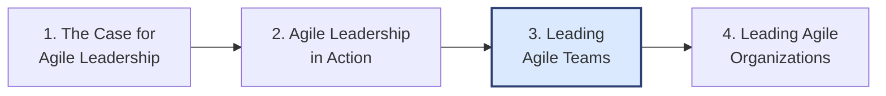
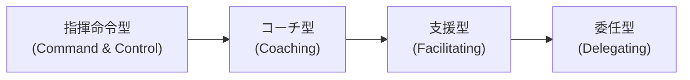
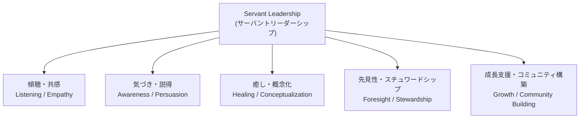
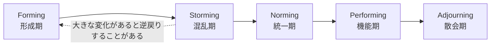
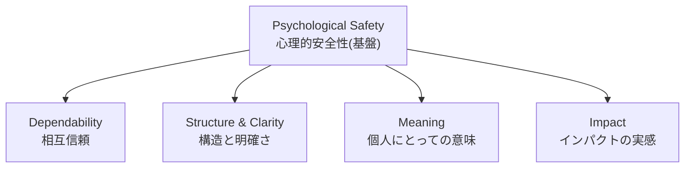
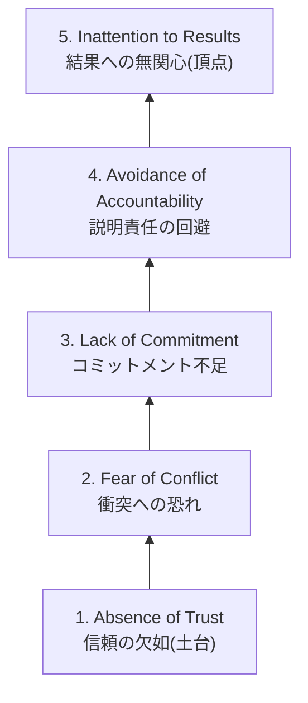
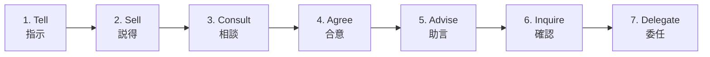
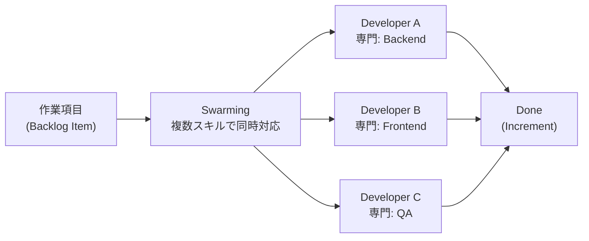
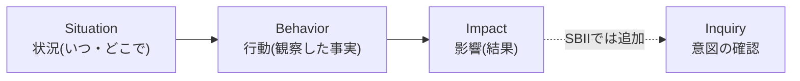

# 第3章:アジャイルチームのリード(Leading Agile Teams)

> Certified Agile Leader® 1 (CAL 1™) 学習ガイド シリーズ 第3章
> 対象範囲:CAL1の4つの学習目標領域のうち「3. Leading Agile Teams」

---

## 3.0 この章の位置づけ

CAL1(Certified Agile Leader 1)の学習内容は、Scrum Allianceによって4つの学習目標領域(Learning Objective Areas)に整理されています。本章で扱う「Leading Agile Teams(アジャイルチームのリード)」は、そのうちの3番目にあたります。

第1章・第2章で「アジャイルリーダー自身のマインドセットとスキル」を扱ったのに対し、第3章は視点を「チーム」に移し、リーダーがハイパフォーマンスなチームをどう構築・維持し、チーム内の課題にどう対処し、部門横断的な協働(cross-functional collaboration)をどう促すかを扱います。

Scrum AllianceおよびそのトレーニングパートナーであるPM-Partners社が公開しているコース概要では、この学習領域は次のように説明されています。

> 高パフォーマンスなチームを構築・維持するためのツールと手法を学び、チームが直面する課題に対処し、部門横断的なコラボレーションを育む方法を身につける領域である。

**ソース**
- Scrum Alliance公式 CAL1ページ: https://www.scrumalliance.org/get-certified/agile-leader/cal-1
- Scrum Alliance公式コース詳細(学習目標の記載): https://www.scrumalliance.org/courses-events/search/coursedetail?id=202405528
- PM-Partners社 CAL1コース概要(4領域の分類と2日間のカリキュラム構成を掲載): https://www.pm-partners.com.au/course/certified-agile-leader/

実際のCAL1コース(2日間・16時間)では、1日目に「リーダー自身の内省」、2日目に「ハイパフォーマンスチームの構築と、それを支える組織的プロセス・ガバナンス」が扱われる構成になっており、本章はその2日目の内容に対応します。

---

## 3.1 リーダーシップスタイルの転換:指揮命令型から支援型へ

### 概要(What & Why)

伝統的なマネジメントは「指揮命令型(Command & Control)」、すなわちリーダーが計画・指示を出し、メンバーがそれを実行するという構造を前提としています。しかしアジャイルなチームは不確実性の高い環境で継続的に適応する必要があり、意思決定のスピードと現場の知識を活かすために、チーム自身が「誰が・いつ・どのように」働くかを決める「自己管理(Self-Managing)」を前提としています。

Scrum Guide(2020年版)は、Scrum Teamについて「機能横断的(cross-functional)であり、自己管理的(self-managing)である」と定義しており、自己管理とはメンバーが内部で誰が・いつ・どのように行うかを決めることだと説明しています。この定義は、Scrum以外の多くのアジャイルチームにも共通する原則です。

このような自己管理型チームに対して、リーダーは「指示を出す人」から「障害を取り除き、チームが力を発揮できる環境を整える人」へと役割を転換する必要があります。

### ステップ・バイ・ステップ

1. **現状のスタイルを自覚する**:自分がどの程度「指示」に頼っているかを振り返る(会議で最初に発言していないか、決定を独占していないか)。
2. **委譲できる意思決定を洗い出す**:技術選定、タスクの割り振り、作業の進め方など、チームに委ねられる領域をリストアップする(3.6節のDelegation Pokerで詳しく扱う)。
3. **状況に応じてスタイルを使い分ける**:チームの成熟度やタスクの性質に応じて、指示・コーチング・支援・委任を柔軟に使い分ける。
4. **小さく試す**:一度にすべてを委譲せず、リスクの低い意思決定から始めて信頼を積み上げる。
5. **結果ではなくプロセスを支援する**:答えを与える代わりに問いかけ、チームが自ら答えを見つけるのを助ける。

### 図解

### ベストプラクティス

- チームの成熟度が低い立ち上げ期は明確な枠組みを与え、成熟度が上がるにつれて徐々に手を離す(3.3節のタックマンモデルと連動させる)。
- 「答えを教える」のではなく「良い質問をする」ことを意識する(コーチングスタンス)。
- 権限委譲の範囲を曖昧にせず、3.6節のDelegation Pokerのようなツールで明示的に合意する。
- リーダー自身が完璧である必要はなく、弱さや失敗を開示することで心理的安全性のモデルを示す(3.4節参照)。

### ソース

- The Scrum Guide (2020), Scrum.org / scrumguides.org公式サイト: https://scrumguides.org/scrum-guide.html
- Manifesto for Agile Software Development(アジャイル宣言の背後にある12の原則を含む一次情報源): https://agilemanifesto.org/

---

## 3.2 サーバントリーダーシップの実践

### 概要(What & Why)

「サーバントリーダーシップ(Servant Leadership)」は、Robert K. Greenleafが1970年のエッセイ「The Servant as Leader」で提唱した概念で、リーダーはまず「奉仕したい」という自然な欲求を持ち、その結果として「導く」ことを選択する、という考え方です。Scrum Guideでも、Scrum Masterはチームおよび組織に奉仕する「真のリーダー(true leader)」であると位置づけられており、アジャイルなチームリーダー全般に通じる中核的な姿勢とされています。

Greenleaf Center for Servant Leadershipの元代表であるLarry Spearsは、Greenleafの著作をもとに、サーバントリーダーに共通する10の特性を整理しました。

### ステップ・バイ・ステップ

1. **傾聴(Listening)から始める**:自分の意見を述べる前に、チームの声を十分に聴く習慣をつける。
2. **共感(Empathy)を示す**:メンバーの立場や状況を理解しようとする姿勢を言葉と行動で示す。
3. **気づき(Awareness)を高める**:チームの力学や自分自身の影響力に対する自己認識を磨く。
4. **説得(Persuasion)で動かす**:役職の権限ではなく、対話と納得によって人を動かす。
5. **概念化(Conceptualization)と先見性(Foresight)を養う**:目の前の問題だけでなく、将来のビジョンを描き共有する。
6. **スチュワードシップ(Stewardship)の意識を持つ**:組織やチームを「預かっているもの」として大切に扱う。
7. **成長支援(Commitment to the growth of people)とコミュニティ構築(Building community)を実践する**:メンバー個人の成長と、チームの一体感の両方に投資する。

### 図解

### ベストプラクティス

- 1on1では「進捗の確認」だけでなく「何に困っているか」「どう成長したいか」を尋ねる時間を確保する。
- チームの障害(インペディメント)を率先して取り除き、その過程を可視化してチームに安心感を与える。
- 権威ではなく信頼によってチームを動かす:意思決定の理由を説明し、対話の余地を残す。
- 自分の成功よりもチームやメンバーの成功を優先する評価基準を自分の中に持つ。

### ソース

- Greenleaf Center for Servant Leadership 公式サイト「What is Servant Leadership?」: https://greenleaf.org/what-is-servant-leadership/
- The Scrum Guide (2020)(Scrum MasterをServant Leaderと位置づける記述): https://scrumguides.org/scrum-guide.html

---

## 3.3 チームの発達段階を理解する:タックマンモデル

### 概要(What & Why)

チームは結成された瞬間から高いパフォーマンスを発揮するわけではなく、時間をかけて発達していきます。心理学者Bruce W. Tuckmanは1965年発表の論文「Developmental Sequence in Small Groups」において、小集団が発達する過程を4段階(後に5段階)のモデルとして整理しました。1977年にはMary Ann Jensenとの共著で5番目の段階「Adjourning(解散期)」を追加しています。

- **Forming(形成期)**:メンバーはお互いを探り合い、リーダーの指示を求める。
- **Storming(混乱期)**:意見の対立や役割をめぐる摩擦が表面化する。
- **Norming(統一期)**:対立を乗り越え、共通の規範や役割分担が定着する。
- **Performing(機能期)**:チームが自律的に機能し、高い成果を生み出す。
- **Adjourning(散会期)**:プロジェクトの終了やメンバー変更に伴いチームが解散する。

アジャイルリーダーにとって重要なのは、この発達は一直線には進まず、メンバーの入れ替わりや大きな変化があると前の段階に「逆戻り」することがあるという点です。

### ステップ・バイ・ステップ

1. **チームが今どの段階にいるかを観察する**:会話の様子、対立の有無、意思決定の速さなどから見立てる。
2. **Formingの段階では枠組みを与える**:目的、役割、働き方のルールを明確に提示し、心理的な不安を減らす。
3. **Stormingの段階では対立を恐れず、健全な議論の場を作る**(3.5節・3.8節のツールを活用する)。
4. **Normingの段階ではチーム自身が作った規範(Working Agreement)を尊重し、押し付けない。**
5. **Performingの段階では権限をできるだけ委譲し、リーダーは障害の除去と外部との調整に専念する。**
6. **Adjourningの段階では振り返り(学びの共有)と感謝の機会を意図的に設ける。**

### 図解

### ベストプラクティス

- 新しいメンバーが加わったときは「チーム全体がFormingに一部戻る」と想定し、改めて期待値をすり合わせる。
- Stormingを「悪いこと」として避けず、必要なプロセスとして受け止める(3.5節のLencioniモデルと関連)。
- チーム発達段階に応じてリーダーシップスタイルを変える(3.1節の指示型→委任型の推移と対応させる)。
- プロジェクトやスプリントの節目で意図的に振り返り(レトロスペクティブ)を行い、チームが自らの発達段階を言語化できるようにする。

### ソース

- Tuckman, B.W. (1965). *Developmental Sequence in Small Groups*. Psychological Bulletin, 63(6), 384–399. の解説記事(infed.org、原典テキストからの引用を含む): https://infed.org/dir/welcome/bruce-w-tuckman-forming-storming-norming-and-performing-in-groups/

---

## 3.4 チームの心理的安全性を醸成する

### 概要(What & Why)

Googleは2012年から2年間かけて「Project Aristotle」という調査を行い、180のチームと250以上の属性を分析した結果、チームの成果を分ける最大の要因は「誰がチームにいるか」ではなく「チームがどのように協働しているか」であることを発見しました。その中でも突出して重要だったのが「心理的安全性(Psychological Safety)」、すなわちメンバーが対人関係上のリスクを取っても安全だと感じられる状態です。

Project Aristotleは、心理的安全性を含む5つのチーム効果性のダイナミクスを特定しました。

- **Psychological Safety(心理的安全性)**:失敗や弱さを見せても大丈夫だと感じられる。
- **Dependability(相互信頼)**:メンバーが互いの約束を守ると信頼できる。
- **Structure & Clarity(構造と明確さ)**:役割・計画・目標が明確である。
- **Meaning(個人にとっての意味)**:仕事が自分にとって意味を持つ。
- **Impact(インパクトの実感)**:自分の仕事が組織やチームに影響を与えていると感じられる。

心理的安全性はこれら4つの土台となる、最も重要な要素として位置づけられています。

### ステップ・バイ・ステップ

1. **仕事を「学習の機会」として枠づける**:失敗を非難ではなく学びの材料として扱う言葉を選ぶ。
2. **自分の間違いを認める**:リーダー自身が失敗や不確実性を率直に共有する。
3. **好奇心を示す質問を多くする**:「なぜそう思うのか」「他にどんな選択肢があるか」と問いかける。
4. **発言機会の均等化を意識する**:会議で特定の人だけが話し続けないよう、意図的に他のメンバーに話を振る。
5. **チームディスカッションガイドなどのツールで定期的に測定する**:主観的な感覚に頼らず、簡単なアンケートで心理的安全性の状態を可視化する。

### 図解

### ベストプラクティス

- レトロスペクティブなどの振り返りの場で「誰が悪いか」ではなく「何が起きたか・次に何を変えるか」に焦点を当てるファシリテーションを行う。
- 新しいアイデアや反対意見を述べたメンバーに対して、即座に否定せず、まず理由を尋ねる。
- チームの発言機会や対立の扱われ方を定期的に観察・測定し、偏りがあれば早期に介入する。
- 心理的安全性は「仲良し」を意味しない点に注意する。健全な意見の対立(3.5節・3.8節)を避けることとは異なる。

### ソース

- Google re:Work「Understand team effectiveness」(Project Aristotleの調査手法と5つのダイナミクスを公式に解説): https://rework.withgoogle.com/intl/en/guides/understand-team-effectiveness

---

## 3.5 チームの機能不全に対処する:Lencioniの5つの機能不全モデル

### 概要(What & Why)

経営コンサルタントのPatrick Lencioniは、2002年の著書『The Five Dysfunctions of a Team』において、多くのチームが陥る5つの機能不全をピラミッド構造で説明しました。ピラミッドは下の層が満たされて初めて上の層が成立するという積み上げ構造になっており、リーダーは土台である「信頼」から順に手当てする必要があります。

1. **Absence of Trust(信頼の欠如)**:弱さや失敗を見せることを恐れ、互いに本音を隠す。
2. **Fear of Conflict(衝突への恐れ)**:信頼がないため、健全な意見のぶつかり合いを避け、うわべだけの調和を保とうとする。
3. **Lack of Commitment(コミットメント不足)**:率直な議論がないため、決定に対する納得感や当事者意識が生まれない。
4. **Avoidance of Accountability(説明責任の回避)**:コミットメントが曖昧なため、互いの行動や成果を指摘し合うことを避ける。
5. **Inattention to Results(結果への無関心)**:個人の evaluation や地位への関心が、チーム全体の成果への関心を上回ってしまう。

### ステップ・バイ・ステップ

1. **現在地を診断する**:チームの様子を観察し、5つの層のうちどこに問題があるかを見極める(いきなり「結果を出せ」と言う前に、土台の信頼を確認する)。
2. **信頼の土台を作る**:個人の弱みや失敗談を共有するワークショップなど、脆弱性に基づく信頼(Vulnerability-based Trust)を育む場を設ける。
3. **健全な衝突を促す**:意見の対立を「悪いこと」として抑え込まず、ファシリテーションによって建設的な議論に導く(3.8節のコンフリクトマネジメントを併用する)。
4. **コミットメントを明確にする**:会議の終わりに「誰が・何を・いつまでに」を明文化し、全員の合意を確認する。
5. **説明責任をチームの文化にする**:上司からの指摘だけでなく、メンバー同士がフィードバックし合える関係を作る(3.9節のSBIモデルを活用する)。
6. **結果に焦点を当てる**:個人目標よりもチーム全体の成果指標を優先して可視化・共有する。

### 図解

### ベストプラクティス

- 下の層(信頼)が崩れている状態で上の層(結果)だけを求めても効果は薄いため、必ず土台から着手する。
- リーダー自身が最初に弱さを見せることで、心理的安全性(3.4節)と信頼構築のモデルになる。
- チームの機能不全を個人の性格の問題にせず、チームの「構造上の課題」として扱う。
- 定期的に(例えば四半期ごとに)チームの状態をこの5層モデルに照らして自己診断する時間を設ける。

### ソース

- The Table Group(Patrick Lencioni公式サイト)「The 5 Dysfunctions Of A Team」: https://www.tablegroup.com/topics-and-resources/teamwork-5-dysfunctions/

---

## 3.6 権限委譲とエンパワーメント:Delegation Poker(7段階の委任レベル)

### 概要(What & Why)

3.1節で述べた「委任」は、実際には0か100かの二択ではなく、段階的なグラデーションです。Management 3.0の提唱者Jurgen Appeloは、この委任のグラデーションを7つのレベルに分解した「Delegation Poker」というプラクティスを考案しました。カードゲーム形式で、特定の意思決定領域(例:採用、技術選定、休暇の承認など)について、マネージャーとチームがどのレベルで意思決定すべきかを話し合い、合意します。

7つのレベルは以下の通りで、対称的な構造(レベル1と7、2と6、3と5が対になる)になっています。

| レベル | 名称 | 説明 |
|---|---|---|
| 1 | Tell(指示) | マネージャーが決定し、チームに伝える |
| 2 | Sell(説得) | マネージャーが決定し、納得してもらうよう説明する |
| 3 | Consult(相談) | マネージャーがチームの意見を聞いた上で決定する |
| 4 | Agree(合意) | マネージャーとチームが対等な立場で共に決定する |
| 5 | Advise(助言) | チームが決定し、その前にマネージャーが助言する |
| 6 | Inquire(確認) | チームが決定し、その後マネージャーに報告する |
| 7 | Delegate(委任) | チームが完全に自律的に決定する |

### ステップ・バイ・ステップ

1. **意思決定領域を洗い出す**:技術選定、採用、作業プロセス、休暇承認など、曖昧になりやすい決定事項をリストアップする。
2. **各領域について現状のレベルを可視化する**:「Delegation Board」を使い、縦軸に決定領域、横軸に7段階を置いて現状を書き出す。
3. **カードで各自の理想のレベルを提示する**:参加者は他者の選択を見ずに、自分が適切だと思うレベルのカードを選ぶ。
4. **最大・最小を選んだ人から理由を聞く**:意見の幅がある場合こそ、対話によって認識をすり合わせる好機である。
5. **合意したレベルを明文化し、定期的に見直す**:チームの成熟度が上がれば、レベルを引き上げていく。

### 図解

### ベストプラクティス

- 委任は「個々のタスク」ではなく「意思決定領域」の単位で扱う(例:1つのタスクではなく「プロジェクト管理手法の選定」という領域全体)。
- レベルを一度に7まで引き上げようとせず、チームの実績に応じて段階的に引き上げる。
- レベルの選択に幅が出た場合、それを問題視するのではなく対話のきっかけとして歓迎する。
- 決定したレベルを見える化(ボード等)しておき、後から「言った・言わない」の対立が起きないようにする。

### ソース

- Management 3.0(Jurgen Appelo公式サイト)「Delegation Poker & Delegation Board」: https://management30.com/practice/delegation-poker/

---

## 3.7 クロスファンクショナルな協働を促進する

### 概要(What & Why)

CAL1の学習目標には「部門横断的な協働(cross-functional collaboration)の促進」が明示的に含まれています。Scrum Guideでは、Scrum Teamは「機能横断的(cross-functional)」であること、すなわちチームがスプリントごとに価値を生み出すために必要なすべてのスキルをチーム内に持っていることが求められています。特定の専門分野に頼らず、チーム全体で価値を届けられる状態を作ることが、リーダーの重要な役割です。

機能横断性を高める代表的な実践には、以下のようなものがあります。

- **T字型スキル(T-shaped skills)**:1つの専門分野で深い知識を持ちながら、他分野についても基本的な理解と協働能力を持つ人材像。
- **スウォーミング(Swarming)**:1つの作業項目に複数のメンバーが異なる専門性を持ち寄って同時に取り組み、作業の停滞(ボトルネック)を防ぐ手法。
- **ペアリング/モブワーク**:2人以上のメンバーが同じ作業に同時に取り組み、知識を共有しながら進める手法。

### ステップ・バイ・ステップ

1. **チームのスキルマップを作る**:誰がどのスキルを持っているか、どこにスキルの偏り(単一障害点)があるかを可視化する。
2. **単一障害点を減らす計画を立てる**:特定の1人しかできない作業について、ペアリングやモブワークを通じて知識を分散させる。
3. **作業の割り当て方を見直す**:個人にタスクを固定的に割り当てるのではなく、チーム全体で作業項目を引き取る(プル型)方式に移行する。
4. **ボトルネックが生じたらスウォーミングで対応する**:特定の作業が滞留している場合、複数人で集中的に対応し、流れを取り戻す。
5. **越境的な学習の機会を作る**:定期的な知識共有会やローテーションを通じて、専門分野を越えた理解を広げる。

### 図解

### ベストプラクティス

- 個人の専門性を否定するのではなく、専門性を土台にしながら他分野への理解を広げる「T字型」の成長を支援する。
- スキルの偏りを「個人の評価」ではなく「チームのリスク管理」の観点で扱う。
- 作業の割り当てを個人ではなくチーム単位の指標(スループットなど)で管理し、抱え込みを防ぐ。
- リーダー自身が部門やロールを超えた対話の場(定例の同期など)を設計し、機能横断的な協働を後押しする。

### ソース

- The Scrum Guide (2020), scrumguides.org公式サイト(Scrum Teamの機能横断性・自己管理性の定義): https://scrumguides.org/scrum-guide.html

---

## 3.8 コンフリクトマネジメント:Thomas-Kilmannモデル

### 概要(What & Why)

チームが健全に機能するためには、対立(コンフリクト)を「避けるべきもの」ではなく「扱い方を選べるもの」として捉える必要があります。心理学者のKenneth ThomasとRalph Kilmannは1970年代に、対立への対処スタイルを2つの軸で整理した「Thomas-Kilmann Conflict Mode Instrument(TKI)」を開発しました。

- **主張性(Assertiveness)**:自分の関心事をどれだけ満たそうとするか。
- **協調性(Cooperativeness)**:相手の関心事をどれだけ満たそうとするか。

この2軸の組み合わせから、5つの対立対処モードが導かれます。

| モード | 主張性 | 協調性 | 特徴 |
|---|---|---|---|
| Competing(競争) | 高い | 低い | 自分の主張を押し通す。緊急時や譲れない原則がある場合に有効 |
| Accommodating(順応) | 低い | 高い | 相手の意向を優先する。関係維持を優先したい場合に有効 |
| Avoiding(回避) | 低い | 低い | 対立そのものを先送りする。感情が高ぶっている場面の冷却に有効 |
| Collaborating(協調) | 高い | 高い | 双方の関心事を満たす解決策を共に探す。重要かつ時間がある場合に最適 |
| Compromising(妥協) | 中間 | 中間 | 双方が一部譲歩する。時間が限られている場合の現実的な落としどころ |

どのモードにも「良い・悪い」はなく、状況に応じた使い分けが重要とされています。

### ステップ・バイ・ステップ

1. **対立の性質を見極める**:緊急度、重要度、関係性への影響を評価する。
2. **自分の habitual(習慣的な)モードを自覚する**:自分がどのモードに偏りがちかを振り返る。
3. **状況に合わせてモードを選ぶ**:例えば、まずCollaboratingを試み、時間切れならCompromisingやAvoidingに切り替える。
4. **チームにもモードの選択肢を共有する**:対立が起きたときにチームメンバー自身が意図的にモードを選べるよう、このモデルを共有しておく。
5. **振り返りでモードの使われ方を確認する**:レトロスペクティブなどで「今回はどのモードで対応したか」を言語化する。

### ベストプラクティス

- 重要度が高く時間に余裕がある対立にはCollaboratingを優先し、拙速な妥協(Compromising)に逃げない。
- 感情的になっている場面ではAvoidingで一時的にクールダウンし、後で改めて対話の場を設ける。
- リーダーがCompetingを多用しすぎると、3.5節の「Fear of Conflict」を助長し心理的安全性を損なう恐れがある点に注意する。
- 対立のモードを選ぶ前に、3.4節の心理的安全性が土台として確保されているかを確認する。

### ソース

- Kilmann Diagnostics(共同開発者Ralph Kilmann公式サイト)「An Overview of the TKI Assessment Tool」: https://kilmanndiagnostics.com/brief-overview-of-the-tki-assessment/

---

## 3.9 フィードバックとコーチングによる成長支援:SBIモデル

### 概要(What & Why)

チームの課題に対処し、メンバーの成長を支援するうえで欠かせないのが「効果的なフィードバック」です。Center for Creative Leadership(CCL)は、フィードバックを具体的かつ非評価的に伝えるための枠組みとして「SBIモデル(Situation-Behavior-Impact)」を開発しました。

- **Situation(状況)**:いつ、どこで起きたことかを specifics に示す。
- **Behavior(行動)**:相手が実際に取った行動を、解釈を交えず客観的に描写する。
- **Impact(影響)**:その行動が自分やチーム、成果にどのような影響を与えたかを伝える。

CCLはさらに、行動の意図が曖昧な場合や相手をよく知らない場合に向けて、4つ目の要素「Inquiry(意図の確認)」を加えた拡張版「SBII」も提唱しています。

### ステップ・バイ・ステップ

1. **具体的な状況を思い浮かべる**:「いつもそうだ」ではなく「昨日の◯◯の場面で」のように特定の出来事を選ぶ。
2. **観察した行動だけを描写する**:「やる気がない」といった評価ではなく、「発言をしなかった」「資料を提出しなかった」など、事実として観察できることのみを述べる。
3. **影響を伝える**:その行動が自分・チーム・成果にどう影響したかを率直に共有する。
4. **必要に応じて意図を尋ねる(SBII)**:行動の背景がわからない場合は、「その時何を意図していたか」を質問し、対話に開く。
5. **ポジティブなフィードバックにも同じ型を使う**:改善点だけでなく、良い行動の定着にもSBIは有効である。

### 図解

### ベストプラクティス

- フィードバックは日常的・即時的に行い、年次評価などの特別な機会にまとめて行わない。
- ネガティブなフィードバックだけでなく、望ましい行動を強化するポジティブなフィードバックにも同じ型を使う。
- 「あなたはいつも◯◯だ」という一般化を避け、必ず特定の状況(Situation)に紐づける。
- SBIモデルは3.5節の「説明責任の回避」を克服する具体的な会話の型としても活用できる。

### ソース

- Center for Creative Leadership(CCL)公式サイト「SBI Feedback Model & Talent Development Conversations」: https://www.ccl.org/articles/leading-effectively-articles/sbi-feedback-model-a-quick-win-to-improve-talent-conversations-development/

---

## 3.10 まとめ:ハイパフォーマンスチームを導くリーダーのチェックリスト

CAL1の「Leading Agile Teams」領域は、大きく3つのねらいに整理できます。本章で扱ったツール・フレームワークを、そのねらいごとに整理すると以下のようになります。

| CAL1のねらい | 対応するツール・フレームワーク | 本章の節 |
|---|---|---|
| ハイパフォーマンスチームの構築・維持 | サーバントリーダーシップ、タックマンモデル、心理的安全性、Lencioniの5つの機能不全 | 3.2 / 3.3 / 3.4 / 3.5 |
| チームが直面する課題への対処 | Lencioniの5つの機能不全、Thomas-Kilmannモデル、SBIフィードバックモデル | 3.5 / 3.8 / 3.9 |
| 部門横断的な協働の促進 | 自己管理・機能横断性(Scrum Guide)、Delegation Poker、スウォーミング | 3.1 / 3.6 / 3.7 |

### 章末チェックリスト

- [ ] 自分のリーダーシップスタイルが指揮命令型に偏っていないかを振り返った
- [ ] サーバントリーダーシップの10の特性のうち、自分が伸ばすべきものを1つ選んだ
- [ ] 自分のチームが今どの発達段階(Forming〜Performing)にいるかを見立てた
- [ ] チームの心理的安全性を測る/高めるための具体的な行動を1つ決めた
- [ ] Lencioniの5層モデルに照らして、自チームの課題がどの層にあるかを診断した
- [ ] 委任すべき意思決定領域を1つ選び、Delegation Pokerで現状のレベルを確認した
- [ ] チームのスキルマップを作り、単一障害点(特定の人しかできない作業)を洗い出した
- [ ] 対立が起きたときに使うコンフリクトモードを、状況に応じて意識的に選べるようにした
- [ ] 直近のフィードバックをSBIモデルの型に沿って振り返った

---

## 参考文献一覧

### Scrum Alliance公式情報源
- Certified Agile Leader® 1 (CAL 1™) 公式ページ: https://www.scrumalliance.org/get-certified/agile-leader/cal-1
- CAL 1™ Learning Objectives(公式配布資料): https://drive.google.com/file/d/1LpDNidfA_r6J2wFvgRhIWfPw_wEnqjiO/view
- Scrum Alliance公式コース検索・詳細ページ(学習目標の記載): https://www.scrumalliance.org/courses-events/search/coursedetail?id=202405528
- PM-Partners社(Scrum Alliance認定トレーニングパートナー)によるCAL1コース概要: https://www.pm-partners.com.au/course/certified-agile-leader/

### アジャイル基礎の一次情報源
- Manifesto for Agile Software Development: https://agilemanifesto.org/
- The 2020 Scrum Guide(scrumguides.org公式): https://scrumguides.org/scrum-guide.html

### チームリーダーシップのフレームワーク(提唱者・一次情報源)
- Greenleaf Center for Servant Leadership「What is Servant Leadership?」: https://greenleaf.org/what-is-servant-leadership/
- Tuckman, B.W. (1965) *Developmental Sequence in Small Groups* の解説(infed.org): https://infed.org/dir/welcome/bruce-w-tuckman-forming-storming-norming-and-performing-in-groups/
- Google re:Work「Understand team effectiveness」(Project Aristotle): https://rework.withgoogle.com/intl/en/guides/understand-team-effectiveness
- The Table Group(Patrick Lencioni公式)「The 5 Dysfunctions Of A Team」: https://www.tablegroup.com/topics-and-resources/teamwork-5-dysfunctions/
- Management 3.0(Jurgen Appelo公式)「Delegation Poker & Delegation Board」: https://management30.com/practice/delegation-poker/
- Kilmann Diagnostics(Ralph Kilmann公式)「An Overview of the TKI Assessment Tool」: https://kilmanndiagnostics.com/brief-overview-of-the-tki-assessment/
- Center for Creative Leadership(CCL)「SBI Feedback Model & Talent Development Conversations」: https://www.ccl.org/articles/leading-effectively-articles/sbi-feedback-model-a-quick-win-to-improve-talent-conversations-development/
