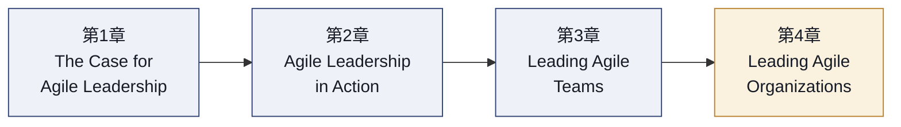
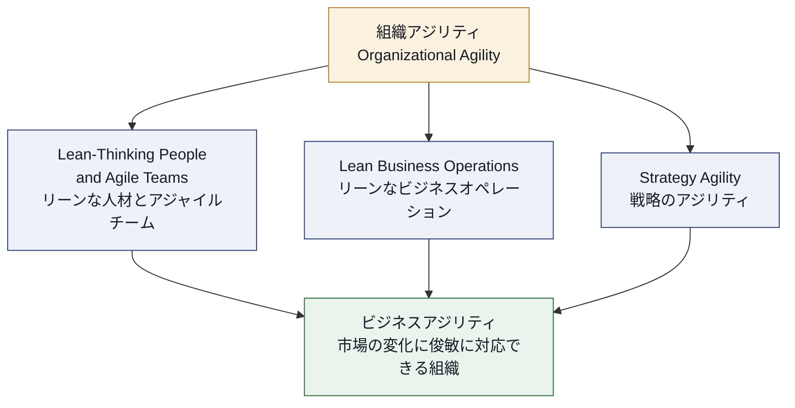
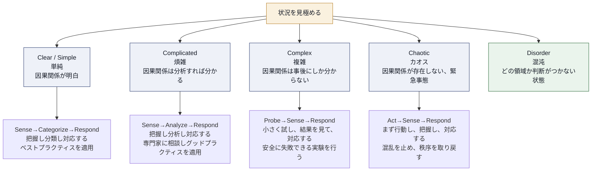
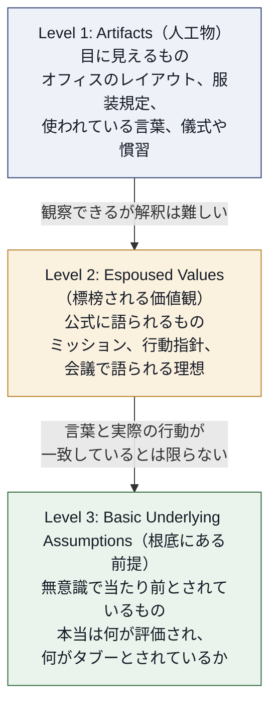
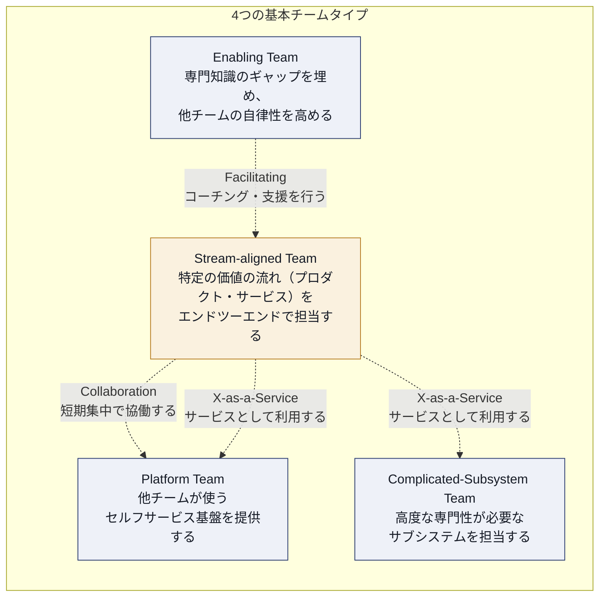
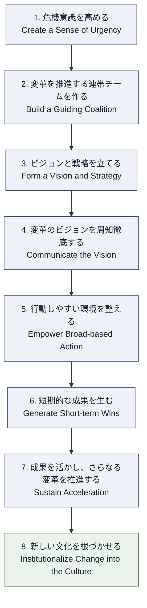
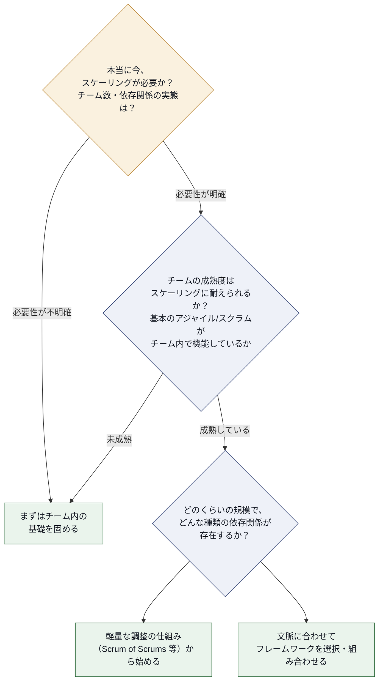
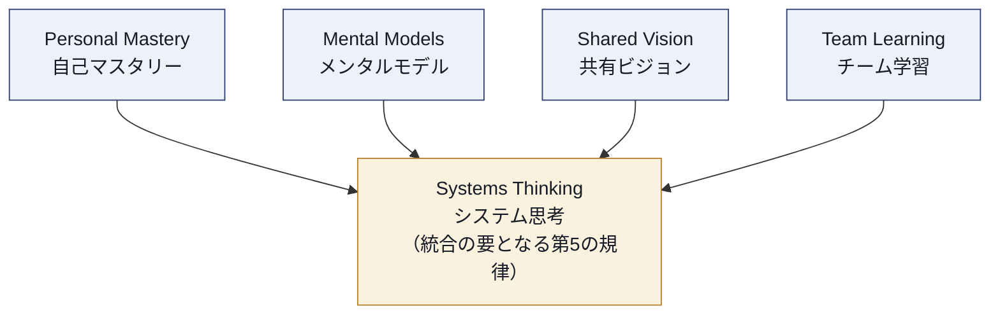
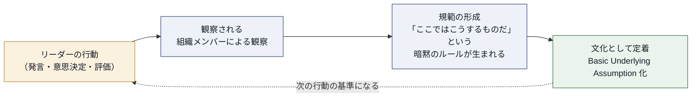
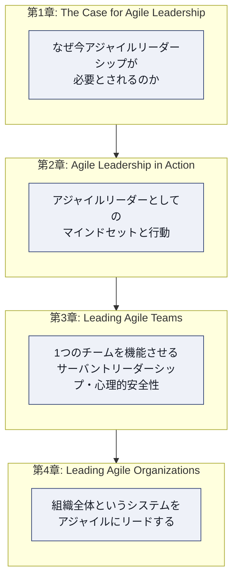

# CAL1（Certified Agile Leader® 1）学習ガイド 第4章

## 4. Leading Agile Organizations（アジャイル組織のリード）

> 本ページは Scrum Alliance の Certified Agile Leader 1（CAL 1™）の4つの学習領域のうち、最終章「4. Leading Agile Organizations（アジャイル組織のリード）」に関する非公式の学習ログです。正確な情報は必ず公式資料をご確認ください。フローチャートは Mermaid、図解・比較表は Markdown 記法で統一しています。
>
> 公式コース情報: [Certified Agile Leader® 1 (CAL 1™) | Scrum Alliance](https://www.scrumalliance.org/get-certified/agile-leader/cal-1)

---

## 目次

0. [この章について](#0-この章について)
1. [組織アジリティ（Organizational Agility）とは何か](#1-組織アジリティorganizational-agilityとは何か)
2. [システム思考で組織をとらえる：Cynefin フレームワーク](#2-システム思考で組織をとらえるcynefin-フレームワーク)
3. [組織文化を理解し、意図的に進化させる](#3-組織文化を理解し意図的に進化させる)
4. [組織構造とチームトポロジーをデザインする](#4-組織構造とチームトポロジーをデザインする)
5. [変革をリードする：チェンジマネジメントの実践知](#5-変革をリードするチェンジマネジメントの実践知)
6. [アジャイルのスケーリング：フレームワーク選択の考え方](#6-アジャイルのスケーリングフレームワーク選択の考え方)
7. [学習する組織へ：心理的安全性と学習文化を組織全体に広げる](#7-学習する組織へ心理的安全性と学習文化を組織全体に広げる)
8. [組織アジリティを測定する](#8-組織アジリティを測定する)
9. [リーダーとしての実践：エンタープライズでのロールモデリング](#9-リーダーとしての実践エンタープライズでのロールモデリング)
10. [まとめ：CAL1 全体像の振り返り](#10-まとめcal1-全体像の振り返り)
11. [参考文献・出典一覧](#11-参考文献出典一覧)

---

## 0. この章について

CAL1（Certified Agile Leader 1）は、4つの学習領域（Learning Objective Areas）で構成されています。本ガイドシリーズではこれまでに以下の3章を扱ってきました。

1. **The Case for Agile Leadership**（アジャイルリーダーシップの必要性）
2. **Agile Leadership in Action**（実践におけるアジャイルリーダーシップ）
3. **Leading Agile Teams**（アジャイルチームのリード）— サーバントリーダーシップ、Tuckman モデル、心理的安全性、Five Dysfunctions など

第4章「**Leading Agile Organizations**」は、視座をチームレベルからエンタープライズ（組織全体）レベルへと引き上げます。第3章で学んだ「1つのチームを機能させる力」を、複数チーム・複数部門・組織文化・組織構造という、より大きく複雑なシステムに適用するための考え方とツールを扱います。

Scrum Alliance の公式ページでは、CAL1 全体を通じて「変化の激しい環境に適応できる組織文化を形成し、リスクを抑えながら投資対効果を高める、卓越したリーダーへと成長すること」が目的として説明されています。第4章はその中でも特に、個人やチームを超えた「組織というシステム」をどう見て、どうリードするかに焦点を当てる領域です。

> **補足（本章の位置づけについて）**
> CAL1 は前提条件のない入門レベルの認定であり、Scrum Alliance は本コースの後続として、より組織変革の実務に踏み込む **CAL2**（Agile Leader Track）を用意しています。本章はあくまで CAL1 としての「組織アジリティの基礎的な地図」を提供するものであり、各フレームワークの詳細な導入手順は CAL2 やより専門的な学習リソースで扱われる範囲です。
> ソース: [CAL 1 | Scrum Alliance](https://www.scrumalliance.org/get-certified/agile-leader/cal-1)、[CAL 1 Learning Objectives（公式PDF）](https://drive.google.com/file/d/1LpDNidfA_r6J2wFvgRhIWfPw_wEnqjiO/view)

### 本章で学ぶこと（ステップ一覧）

| ステップ | テーマ | 一言で言うと |
|---|---|---|
| 1 | 組織アジリティとは何か | 「アジャイルなチーム」の集合が、自動的に「アジャイルな組織」になるわけではない |
| 2 | システム思考／Cynefin | 問題の性質（単純・煩雑・複雑・カオス）によってリーダーの取るべき行動は変わる |
| 3 | 組織文化 | 文化は「作る」ものではなく、行動の積み重ねの結果として「立ち上がる」もの |
| 4 | 組織構造／チームトポロジー | 組織図はソフトウェアやサービスの構造に反映される（Conway の法則） |
| 5 | チェンジマネジメント | 変革には「論理（計画）」と「感情（人）」の両輪が必要 |
| 6 | スケーリング | フレームワークはゴールではなく、コンテキストに応じた手段の1つ |
| 7 | 学習する組織 | 心理的安全性とふりかえりの文化をチームから組織全体へ広げる |
| 8 | 測定 | アウトプットではなくアウトカムを測る |
| 9 | ロールモデリング | リーダーの行動そのものが、組織文化の最も強力な「アーティファクト」になる |

---

## 1. 組織アジリティ（Organizational Agility）とは何か

### 1.1 定義：チームのアジャイルと組織のアジャイルは別物

多くの組織は「スクラムチームを増やせば、組織全体がアジャイルになる」と考えがちです。しかし実際には、開発チームがどれだけアジャイルに働いても、予算編成が年次のウォーターフォールのままだったり、人事評価が個人の目標達成だけを見ていたり、意思決定に何ヶ月もかかる稟議プロセスが残っていたりすると、組織全体としての適応力（アジリティ）は上がりません。

これを説明する代表的な考え方が、非営利研究機関 Business Agility Institute（BAI）が提唱する **Domains of Business Agility（ビジネスアジリティの領域モデル）** です。このモデルは、組織のアジリティを「顧客」を中心に据えたうえで、複数の相互に関連し合う領域（リーダーシップ／人材マネジメント／組織構造・プロセス／戦略など）にまたがるものとして捉えます。ポイントは、どれか1つの領域だけを改善しても組織全体のアジリティは上がらず、複数の領域が連動して初めて意味のある変化が生まれるという点です。

> **初学者向けのポイント**
> 「アジャイル」を doing（スクラムイベントをやっているか）と being（適応的なマインドセットが根づいているか）の両面で捉える必要があります。フレームワークを導入する「doing」だけでは、組織アジリティは実現しません。

### 1.2 SAFe における Organizational Agility の3つの側面

Scaled Agile Framework（SAFe）も、Business Agility を実現するための中核コンピテンシーの1つとして「Organizational Agility（組織アジリティ）」を定義しています。SAFe はこれを次の3つの側面（ディメンション）で説明しています。

| 側面 | 内容 | 具体例 |
|---|---|---|
| Lean-Thinking People and Agile Teams | ソリューション提供に関わる全員がリーン／アジャイルの価値観・原則・プラクティスを身につけている状態 | エンジニアだけでなく営業・法務・人事もアジャイルの原則を理解している |
| Lean Business Operations | 業務プロセス（予算編成・調達・法務レビューなど）自体をリーン原則で継続的に改善する | 年次予算を四半期ごとの軽量な見直しに変える |
| Strategy Agility | 市場の変化を素早く察知し、必要であれば戦略そのものを機動的に転換できる | 四半期ごとに戦略の前提を検証し、必要なら方向転換（ピボット）する |

> **ベストプラクティス**
> - チームレベルの改善だけでなく、予算編成・調達・人事評価・法務レビューといった「支援系プロセス」もリーン原則で見直す対象に含める。
> - 経営レベルの戦略レビューの頻度を年1回から四半期ごとに見直すなど、意思決定サイクルを短くする。
> - 「アジャイルの導入状況」ではなく「顧客への価値提供までのリードタイム」を組織横断で可視化する。
>
> **ソース**: [Organizational Agility (OA) | Scaled Agile Framework](https://framework.scaledagile.com/organizational-agility)、[The Domains of Business Agility | Business Agility Institute](https://businessagility.institute/domains/overview)、[Business Agility 概説 | CIO Wiki](https://cio-wiki.org/wiki/Business_Agility)

---

## 2. システム思考で組織をとらえる：Cynefin フレームワーク

### 2.1 なぜシステム思考が必要か

組織を「個々の部品（部署・役職）の集合」として見るのではなく、「相互に影響し合う要素からなる1つのシステム」として見る考え方を **システム思考（Systems Thinking）** と呼びます。MIT の Peter Senge は、著書『The Fifth Discipline（学習する組織）』の中で、システム思考を組織学習を支える中核的な規律（discipline）として位置づけました。

システム思考が重要である理由はシンプルです。組織で起きる問題の多くは、特定の個人の能力不足ではなく、構造（インセンティブ設計・承認フロー・部門間のインターフェースなど）が生み出しています。構造に手を付けずに個人を叱咤激励しても、根本的な問題は解決しません。

### 2.2 Cynefin フレームワーク：問題の性質を見極める

システム思考をリーダーの意思決定に応用したツールの1つが、David Snowden と Mary Boone が Harvard Business Review 誌上で発表した **Cynefin フレームワーク（A Leader's Framework for Decision Making）** です。Cynefin（クネヴィン）はウェールズ語で「生息地」を意味する言葉で、置かれている状況（コンテキスト）に応じてリーダーが取るべき行動が異なることを示します。

| 領域 | 特徴 | リーダーの行動パターン | よくある失敗 |
|---|---|---|---|
| Clear（単純） | ベストプラクティスが存在し、誰が見ても因果関係が明らか | 把握 → 分類 → 対応（Sense-Categorize-Respond） | 過信し、状況が複雑化していることに気づかない |
| Complicated（煩雑） | 因果関係はあるが、専門知識による分析が必要 | 把握 → 分析 → 対応（Sense-Analyze-Respond） | 唯一の正解を専門家に求めすぎ、意思決定が遅くなる |
| Complex（複雑） | 因果関係は事後にしか分からない。多くの組織課題がここに属する | 小さく試す → 把握 → 対応（Probe-Sense-Respond） | 複雑な問題を「煩雑」だと誤認し、計画偏重で臨んでしまう |
| Chaotic（カオス） | 因果関係が成立しない緊急事態 | 行動 → 把握 → 対応（Act-Sense-Respond） | 分析に時間をかけすぎて初動が遅れる |

多くのエンタープライズ・アジャイル変革（組織構造の変更、文化変革など）は **Complex（複雑）** 領域に属します。つまり、詳細な移行計画を1回で完璧に作ることはできず、小さな実験（パイロットチーム、1部門だけの試行導入など）を繰り返しながら学習していくアプローチが適しています。

> **ベストプラクティス**
> - 大規模な組織変革を始める前に、今取り組んでいる課題が「単純」「煩雑」「複雑」「カオス」のどれに近いかをチームで議論する。
> - 「複雑」な課題に対しては、最初から完璧な計画を作ろうとせず、安全に失敗できる小さな実験（Safe-to-fail experiment）を設計する。
> - カオス状態（重大インシデントなど）では、まず状況を安定させる行動を優先し、原因分析は後回しにする。
>
> **ソース**: [A Leader's Framework for Decision Making | Harvard Business Review](https://hbr.org/2007/11/a-leaders-framework-for-decision-making)（Snowden, D. & Boone, M., 2007）、[Peter Senge and the learning organization | infed.org](https://infed.org/dir/welcome/peter-senge-and-the-learning-organization/)

---

## 3. 組織文化を理解し、意図的に進化させる

### 3.1 文化とは何か：Edgar Schein の3つのレベル

「組織文化を変えよう」という掛け声はよく聞きますが、文化とは具体的に何を指すのでしょうか。MIT の組織心理学者 Edgar Schein は、組織文化を3つのレベルからなる構造として説明しました。

重要なのは、この3つのレベルは往々にして一致しないという点です。「私たちはチャレンジを歓迎する」という標榜された価値観（Level 2）があっても、実際に失敗した人が昇進から外れ続けているなら、組織の根底にある前提（Level 3）は「失敗は許されない」というものです。リーダーが文化を変えたいのであれば、ポスターやスローガン（Level 1・2）ではなく、何が実際に評価され、何が黙認されているか（Level 3）に向き合う必要があります。

> **初学者向けのポイント**
> 文化変革の第一歩は、「うちの会社の価値観は？」ではなく、「実際に評価され、昇進し、報われているのはどんな行動か？」を観察することです。

### 3.2 組織進化の1つの見方：Laloux の発展段階モデル

もう1つ、組織構造と文化の発展を歴史的に整理した視点として、Frederic Laloux の著書『Reinventing Organizations』で提示された発展段階モデルがあります。Laloux は組織の発展段階を色で表現し（Red／Amber／Orange／Green／Teal）、最も新しい段階である Teal 型組織の特徴として「自主経営（Self-management）」「全体性（Wholeness）」「存在目的（Evolutionary Purpose）」の3つを挙げています。

> **補足（批判的に読むためのポイント）**
> Laloux のモデルは実務家の間で広く参照されていますが、学術的な検証を経た理論というよりは、著者自身が選んだ少数の事例（十数社）に基づく質的な観察です。CAL1 レベルでは「組織構造や文化には複数の発展段階がありうる」という視点を得るための1つの参照枠として理解し、特定の型（Teal）を唯一の正解として鵜呑みにしないことが重要です。

<!-- -->

> **ベストプラクティス**
> - 文化変革の議論では、まず「今、実際に何が評価されているか」を関係者へのヒアリングや行動観察で洗い出す。
> - スローガンやバリューステートメントを新しく作る前に、既存の人事評価制度・昇進基準・予算配分ルールが標榜する価値観と矛盾していないかを点検する。
> - リーダー自身の日々の意思決定（誰を昇進させるか、何を許容し何を許容しないか）が、最も強力な文化形成のシグナルであると自覚する。
>
> **ソース**: [5 enduring management ideas from MIT Sloan's Edgar Schein | MIT Sloan](https://mitsloan.mit.edu/ideas-made-to-matter/5-enduring-management-ideas-mit-sloans-edgar-schein)、[Reinventing Organizations（公式サイト）](https://www.reinventingorganizations.com/)

---

## 4. 組織構造とチームトポロジーをデザインする

### 4.1 Conway の法則：組織構造はシステムの設計に反映される

1968年、ソフトウェア技術者 Melvin Conway は "How Do Committees Invent?" という論文の中で、次のような趣旨の観察を示しました。「システムを設計する組織は、その組織のコミュニケーション構造をそのままコピーしたような設計を作り出す」というものです。この観察は後に **Conway の法則（Conway's Law）** と呼ばれるようになりました。

これはソフトウェアアーキテクチャに限った話ではありません。3つの部門が互いに疎にしか連携していなければ、生まれる製品やプロセスも3つに分断された、連携の悪いものになります。逆に、望ましいアーキテクチャやプロセスの形から逆算して組織構造・コミュニケーション構造を設計する考え方を **Reverse Conway Maneuver（逆コンウェイ戦略）** と呼びます。

### 4.2 Team Topologies：4つのチームタイプと3つのインタラクションモード

Conway の法則を実務に落とし込むための現代的なフレームワークが、Matthew Skelton と Manuel Pais が提唱した **Team Topologies** です。このフレームワークは、認知負荷（Cognitive Load）を軸に、組織が持つべきチームを4つの基本タイプに整理し、チーム間の関わり方を3つのインタラクションモードに絞り込みます。

| チームタイプ | 役割 | 主な目的 |
|---|---|---|
| Stream-aligned Team | 特定の価値の流れ（プロダクトや顧客セグメントなど）をエンドツーエンドで担当 | 最も基本となるチーム。他の3タイプはすべてこのチームを支援するために存在する |
| Platform Team | 内部向けのセルフサービス基盤（インフラ、共通機能など）を提供 | Stream-aligned Team の認知負荷を減らす |
| Enabling Team | 特定分野の専門家が一時的に他チームを支援・コーチングする | 知識のギャップを埋め、自律性を高める（常駐化させない） |
| Complicated-Subsystem Team | 高度に専門的な技術が必要なサブシステムを専任で担当 | 専門知識を1チームに集約し、他チームの認知負荷を下げる |

| インタラクションモード | 内容 | 使い所 |
|---|---|---|
| Collaboration | 2チームが期間を区切って密に協働する | 新しい境界線を発見する探索フェーズ |
| X-as-a-Service | 明確なインターフェースを介して低コストで利用・提供する | 責任範囲が明確になった後の定常運用 |
| Facilitating | 一方のチームが他方を一時的に支援・指導する | Enabling Team が知識移転を行う場面 |

### 4.3 Spotify モデルに関する補足

「Squads（分隊）」「Tribes（部族）」「Chapters（分科会）」「Guilds（ギルド）」という用語で知られる **Spotify モデル** も、組織構造の参考事例としてよく引用されます。少人数の自律的な Squad を基本単位とし、関連する Squad の集合を Tribe としてまとめる、という考え方です。

> **補足（適用時の注意点）**
> Spotify モデルは、あくまで「2012年当時の Spotify という1企業のスナップショット」であり、汎用的な導入テンプレートとして設計されたものではありません。実際、Spotify 自身もその後、紹介された当時のモデルから組織構造を変化させています。他社が名称だけを輸入して構造をコピーしても、Spotify が前提としていた高い信頼関係や自律性の文化が伴わなければ、同じ効果は得られません。「Squad」という名前を採用することと、実際に自律的なチームを作ることは別問題です。

<!-- -->

> **ベストプラクティス**
> - 新しいチーム構造を検討する際は、まず「どんな価値の流れ（ストリーム）が存在するか」を先に定義し、その後にチーム編成を考える（Reverse Conway Maneuver）。
> - Enabling Team は「常駐の外部専門家チーム」にせず、一定期間で関わりを終えて自律性を引き渡すことを前提に設計する。
> - 他社の組織構造（Spotify モデルなど）を導入する際は、名称や見た目だけでなく、その構造を支えている文化的前提（信頼・自律性の許容度）まで含めて検討する。
>
> **ソース**: [Conway's Law（原文公開ページ） | melconway.com](https://www.melconway.com/Home/Conways_Law.html)、[Key concepts | Team Topologies](https://teamtopologies.com/key-concepts)、[Spotify engineering culture (part 1) | Spotify Engineering](https://engineering.atspotify.com/2014/03/spotify-engineering-culture-part-1)

---

## 5. 変革をリードする：チェンジマネジメントの実践知

### 5.1 なぜ変革は失敗しやすいのか

Harvard のジョン・コッター（John Kotter）は、長年にわたる企業変革の研究から、変革がなぜ頓挫するのかを分析し、体系立った実践知としてまとめました。組織アジリティを高める取り組み自体が「変革プロジェクト」であるため、CAL1 のリーダーはチェンジマネジメントの基本パターンを理解しておく必要があります。

### 5.2 Kotter の8ステップ・プロセス

コッター自身も後年、この8ステップを固定的な直線モデルとしてではなく、並行して回し続けられる「8つのアクセラレーター（accelerator）」として再定義しています。変化が常態化した現代の組織では、8つのステップを一度きりの手順として順番にこなすのではなく、常時並行で回し続けるものとして捉える必要があるということです。

### 5.3 補完的なモデル：ADKAR と McKinsey 7S

Kotter のモデルが主に「組織・リーダー視点」でトップダウンの変革プロセスを描くのに対して、Prosci 社が開発した **ADKAR モデル** は「個人視点」で変革への適応を捉えます。

| ADKAR の要素 | 意味 |
|---|---|
| Awareness（認識） | なぜ変革が必要かを理解している状態 |
| Desire（欲求） | 変革に参加し、支持したいという意思がある状態 |
| Knowledge（知識） | 変革後、どう行動すればよいかを知っている状態 |
| Ability（能力） | 新しいスキルや行動を実際に発揮できる状態 |
| Reinforcement（定着） | 変革後の状態を維持するための仕組みがある状態 |

また、組織内の複数要素の整合性を確認するための診断ツールとして、マッキンゼー社が1980年代に発表した **McKinsey 7S フレームワーク**（Strategy／Structure／Systems／Shared Values／Skills／Style／Staff）もよく併用されます。7S フレームワークには要素間の優劣や階層がなく、どこか1つだけを変えても他の要素との整合が取れていなければ変革は定着しない、という考え方が特徴です。

| モデル | 主な視点 | CAL1 リーダーにとっての使い所 |
|---|---|---|
| Kotter の8ステップ／アクセラレーター | 組織全体・リーダーシップ行動 | 変革の全体設計、推進力の作り方 |
| ADKAR | 個人の変化への適応プロセス | 現場の1人ひとりが変革に納得し、行動できているかを確認する |
| McKinsey 7S | 組織内要素の整合性診断 | 新しい働き方（構造）が評価制度（Systems）や文化（Shared Values）と矛盾していないかを点検する |

> **ベストプラクティス**
> - 変革の初期段階では、データや事実に基づいて「今のままではいけない理由」を具体的に語り、危機意識を作る（Kotter Step 1）。
> - 経営層だけでなく、現場で影響力のある非公式リーダーも含めた推進チームを組成する（Guiding Coalition）。
> - 変革の展開が進む中で、現場の個々人が ADKAR のどの段階でつまずいているか（知らないのか、やりたくないのか、やり方が分からないのか）を見極め、支援内容を変える。
> - 新しい役割やチーム構造（Structure）を導入する際は、評価制度や報酬（Systems）が新しい行動を後押しするものになっているかを 7S の視点で点検する。
>
> **ソース**: [The 8-Step Process for Leading Change | Kotter](https://www.kotterinc.com/methodology/8-steps/)、[ADKAR Model | Prosci](https://www.prosci.com/methodology/adkar)、[Enduring Ideas: The 7-S Framework | McKinsey](https://www.mckinsey.com/capabilities/strategy-and-corporate-finance/our-insights/enduring-ideas-the-7-s-framework)

---

## 6. アジャイルのスケーリング：フレームワーク選択の考え方

### 6.1 スケーリングとは何か、何でないか

チーム数が増えてくると、多くの組織は「スケーリングフレームワーク」の導入を検討します。しかし CAL1 レベルでまず押さえるべきは、**スケーリングとは特定のフレームワーク名を導入することそのものではない**、という点です。スケーリングとは、複数チームが1つの価値提供に向けて効果的に協調できるように、依存関係・コミュニケーション・意思決定の仕組みを設計することを指します。

判断のステップとしては、次のような順序で考えるとよいでしょう。

代表的なスケーリングフレームワークには、それぞれ異なる思想があります。

| フレームワーク | 開発元・特徴 | 適したコンテキスト |
|---|---|---|
| SAFe（Scaled Agile Framework） | 最も体系的・規範的。ポートフォリオ〜チームまでの階層を包括的に定義 | 数百人規模の大企業、規制業界など、包括的な整合の仕組みが必要な組織 |
| LeSS（Large-Scale Scrum） | Craig Larman と Bas Vodde が提唱。あくまで「1つのチームのスクラム」を大規模に拡張する発想で、新しい役割をできるだけ追加しない、極力シンプルな構成 | 2〜8チーム（Basic LeSS）、8チーム以上（LeSS Huge）で、組織構造自体をシンプル化したい場合 |
| Nexus | Scrum.org（Ken Schwaber）が提唱。Scrum の定義を変えず、必要最小限の要素だけを追加して複数チームの連携を実現 | 3〜9チーム程度で、単一のプロダクトバックログを扱う場合 |
| Spotify モデル | 前述の通り、特定企業の文化に根ざした事例であり、公式な「フレームワーク」ではない | 高い自律性の文化がすでに根づいている、比較的少人数の組織 |

> **初学者向けのポイント**
> どのフレームワークにも共通するのは「依存関係を減らし、チームの自律性をできるだけ保つ」という狙いです。フレームワークの名前を覚えることより、自分の組織にどんな依存関係が存在するのかを見極めることの方が重要です。

<!-- -->

> **ベストプラクティス**
> - フレームワークを選ぶ前に、まず「なぜスケーリングしたいのか（リードタイムの短縮か、品質の向上か、コストか）」という目的を明確にする。
> - 静的に1つのフレームワークを完璧に導入しようとせず、実際にやってみて学んだことを踏まえて仕組みを継続的に見直す前提で導入する。
> - 万能の正解（単一の望ましいアプローチ）は存在しないという前提に立ち、コンテキストに応じた複数のプラクティスを組み合わせる。
>
> **ソース**: [Organizational Agility (OA) | Scaled Agile Framework](https://framework.scaledagile.com/organizational-agility)、[LeSS Framework | less.works](https://less.works/less/framework)、[The Nexus Guide | Scrum.org](https://www.scrum.org/resources/online-nexus-guide)、[Scaling Agile 学習目標に関する報道 | Business Wire](https://www.businesswire.com/news/home/20231207870163/en)

---

## 7. 学習する組織へ：心理的安全性と学習文化を組織全体に広げる

### 7.1 チームの心理的安全性から組織の学習文化へ

第3章では、Google の Project Aristotle の研究などをもとに、チームレベルの心理的安全性がチームパフォーマンスに与える影響を扱いました。第4章では、この考え方をチームの外側、つまり組織全体の学習の仕組みへと拡張します。

Peter Senge は『The Fifth Discipline』の中で、組織学習を支える5つの規律（discipline）を提示しました。

| 規律 | 内容 |
|---|---|
| Personal Mastery（自己マスタリー） | 個人が自らのビジョンを明確にし、現実を客観的に見つめ続ける力 |
| Mental Models（メンタルモデル） | 自分の思考の前提を自覚し、他者との率直な対話にひらく力 |
| Shared Vision（共有ビジョン） | 組織として本当に実現したい未来像を、押し付けではなく共に描く力 |
| Team Learning（チーム学習） | 個人の知見の総和を超える、対話（dialogue）を通じたチームでの学び |
| Systems Thinking（システム思考） | 上記4つを統合し、全体のつながりを見る、第5の規律 |

Senge はまた、組織が学習を妨げてしまう典型的なパターン（学習障害）を指摘しています。たとえば「自分の役職の範囲でしか物事を考えない」「問題が起きてから対症療法的に反応する」といったパターンです。これらはいずれも、組織全体のつながり（システム）を見ずに、目の前の部分最適だけを追いかけることから生まれます。

### 7.2 組織スケールでのふりかえりと「非難のない」文化

チームレベルのレトロスペクティブ（ふりかえり）を、部門横断・組織横断のインシデントレビューやポストモーテム（事後検証）にも拡張することが、学習する組織への具体的な一歩になります。ここで重要なのは、個人の失敗を責めるのではなく、失敗を生んだ構造やプロセスに焦点を当てる「ブレームレス（非難のない）」な姿勢を、チームだけでなく組織のマネジメント層まで一貫させることです。マネジメント層が失敗の報告を歓迎せず処罰的な態度を取れば、いくらチームレベルで心理的安全性を作っても、その安全性はすぐに失われてしまいます。

SAFe が Business Agility の中核コンピテンシーの1つとして定義する「Continuous Learning Culture（継続的学習文化）」も、同様に「学習する組織になること」「イノベーションを奨励すること」「改善への飽くなきコミットメント」の3つの側面から、組織全体での学習の仕組み化を扱っています。

> **ベストプラクティス**
> - 部門・チームをまたぐ重大インシデントの事後検証（ポストモーテム）を、個人ではなく構造・プロセスに焦点を当てて行うルールを、経営層を含めて明文化する。
> - 経営会議のアジェンダに「今期学んだこと・仮説が外れたこと」を定例で扱う項目を設ける。
> - チームのレトロスペクティブで見えた組織的な障害（インペディメント）を、上位のマネジメント層に定期的にエスカレーションし、対応状況を可視化する仕組みを作る。
>
> **ソース**: [Peter Senge and the learning organization | infed.org](https://infed.org/dir/welcome/peter-senge-and-the-learning-organization/)、[Organizational Agility (OA) | Scaled Agile Framework](https://framework.scaledagile.com/organizational-agility)

---

## 8. 組織アジリティを測定する

### 8.1 アウトプットではなくアウトカムを測る

組織アジリティの測定でリーダーが陥りやすい罠は、測りやすい「アウトプット指標」（完了したストーリーポイント数、スプリント数、実施したセレモニーの回数など）ばかりを追いかけ、本当に重要な「アウトカム指標」（顧客にとっての価値、ビジネス上の成果）を見失うことです。

| 指標の種類 | 具体例 | 注意点 |
|---|---|---|
| アウトプット指標（Output） | ベロシティ、完了チケット数、スクラムイベントの実施率 | チームの活動量は測れるが、それが価値につながっているかは分からない |
| アウトカム指標（Outcome） | 顧客満足度、機能リリースから利用開始までのリードタイム、意思決定にかかる時間（Decision Latency） | 測定にはより多くの工夫とデータ収集の仕組みが必要 |

Business Agility Institute は、組織アジリティの成熟度を診断するための複数領域にわたるアセスメントモデルを提供しており、リーダーシップ・組織構造・戦略・オペレーションなど複数の観点から、組織の現在地を定期的に診断することを推奨しています。これらの診断は、他社との比較や優劣を競うためではなく、次にどこへ投資すべきかを見極める「診断ツール」として使うことが重要だとされています。

> **ベストプラクティス**
> - 「スクラムをやっているか」ではなく「アイデアから顧客への価値提供までにかかる時間（リードタイム）」を組織横断で可視化する。
> - 成熟度診断やアセスメントの結果を、部門間の優劣を競うランキングとして使わない。診断結果を良く見せるための数字の作り込み（ゲーミング）は、かえって改善を妨げる。
> - 「決定にどれだけ時間がかかっているか（Decision Latency）」など、普段見過ごされがちな組織的なボトルネックを定点観測する。
>
> **ソース**: [The Domains of Business Agility | Business Agility Institute](https://businessagility.institute/domains/overview)、[Business Agility 概説 | CIO Wiki](https://cio-wiki.org/wiki/Business_Agility)

---

## 9. リーダーとしての実践：エンタープライズでのロールモデリング

### 9.1 リーダーの行動そのものが最強の「アーティファクト」

第3章では、チームレベルでのサーバントリーダーシップを扱いました。組織レベルでは、その考え方がさらに拡張されます。本章 3.1 の Schein の3層構造を思い出してください。組織文化における最も目に見える「Artifact（人工物）」の1つは、実は経営層やリーダー自身の日々の行動です。

- リーダーが会議で何を質問するか
- リーダーが失敗の報告を受けたときにどう反応するか
- リーダーが誰を昇進させ、誰を評価するか
- リーダーが自分自身の間違いをどう認めるか

これらはすべて、どんなに立派なバリューステートメントよりも雄弁に、組織の「本当の」価値観（Level 3: Basic Underlying Assumptions）を周囲に伝えます。

### 9.2 コントローラーではなく、システムの設計者として

組織アジリティを高めるリーダーの役割は、すべての意思決定を自らコントロールすることではありません。むしろ、次のようなシステムを設計・調整する役割へとシフトします。

- 誰がどのような権限を持って意思決定できるかという構造（Team Topologies やインタラクションモード）
- 失敗を安全に報告・学習できる仕組み（ブレームレスな文化）
- 現場が自律的に動けるための、明確な目的（Shared Vision）と制約条件

これは本章 2.2 の Cynefin フレームワークにも通じます。組織の多くの課題が「Complex（複雑）」領域に属する以上、リーダーが唯一の正解を上から指示することはできません。リーダーの役割は、現場が安全に実験し、学び、適応できる「境界条件」を設計することに変わっていきます。

> **ベストプラクティス**
> - 重要な意思決定の場で、まず自分の意見を述べる前に「このチームはどう考えているか」を尋ねる習慣をつける。
> - 自分自身が犯した間違いを、部下やチームの前で率直に認め、そこから何を学んだかを共有する。
> - 評価制度・昇進基準・予算配分ルールが、標榜する価値観（アジリティ、実験と学習の奨励など）と実際に整合しているかを定期的に点検する。
> - すべての意思決定を集中管理しようとせず、現場が安全に意思決定できる範囲（権限移譲の境界）を明文化する。
>
> **ソース**: [5 enduring management ideas from MIT Sloan's Edgar Schein | MIT Sloan](https://mitsloan.mit.edu/ideas-made-to-matter/5-enduring-management-ideas-mit-sloans-edgar-schein)、[A Leader's Framework for Decision Making | Harvard Business Review](https://hbr.org/2007/11/a-leaders-framework-for-decision-making)

---

## 10. まとめ：CAL1 全体像の振り返り

本章で扱った「Leading Agile Organizations」の内容を、CAL1 全体の流れの中で振り返ります。

第4章のポイントを一言でまとめると、次のようになります。

- 組織アジリティは、チームのアジャイル実践の単純な合計ではなく、リーダーシップ・人材・構造・戦略が連動して初めて実現する。
- 組織の課題の多くは「複雑（Complex）」領域に属し、唯一の正解を計画するのではなく、小さな実験を重ねて学ぶアプローチが有効。
- 組織文化は、標榜される言葉ではなく、実際に評価される行動の積み重ねによって形作られる。
- 組織構造（誰と誰が、どうコミュニケーションするか）は、そのままシステムやサービスの設計に反映される（Conway の法則）。
- 変革には、組織全体を動かす仕組み（Kotter）と、個人の適応を支える仕組み（ADKAR）の両方が必要。
- スケーリングフレームワークはゴールではなく、コンテキストに応じて選択・調整すべき手段の1つ。
- リーダー自身の日々の行動こそが、組織文化を形作る最も強力な「人工物」である。

CAL1 全体を通じて一貫しているのは、「アジャイルリーダーシップとは、特定の役職や資格を指すものではなく、変化に適応し続けられる人・チーム・組織を育てるための、継続的な実践である」という考え方です。

---

## 11. 参考文献・出典一覧

### 公式コース情報

- [Certified Agile Leader® 1 (CAL 1™) | Scrum Alliance](https://www.scrumalliance.org/get-certified/agile-leader/cal-1)
- [CAL 1™ Learning Objectives（公式PDF・要アクセス権）](https://drive.google.com/file/d/1LpDNidfA_r6J2wFvgRhIWfPw_wEnqjiO/view)
- [The Agile Manifesto](https://agilemanifesto.org/)

### 組織アジリティ / Business Agility

- [Organizational Agility (OA) | Scaled Agile Framework](https://framework.scaledagile.com/organizational-agility)
- [The Domains of Business Agility | Business Agility Institute](https://businessagility.institute/domains/overview)
- [Business Agility 概説 | CIO Wiki](https://cio-wiki.org/wiki/Business_Agility)

### システム思考 / Cynefin

- Snowden, D. J., & Boone, M. E. (2007). [A Leader's Framework for Decision Making. Harvard Business Review.](https://hbr.org/2007/11/a-leaders-framework-for-decision-making)
- [Peter Senge and the learning organization | infed.org](https://infed.org/dir/welcome/peter-senge-and-the-learning-organization/)

### 組織文化

- [5 enduring management ideas from MIT Sloan's Edgar Schein | MIT Sloan](https://mitsloan.mit.edu/ideas-made-to-matter/5-enduring-management-ideas-mit-sloans-edgar-schein)
- Laloux, F. (2014). Reinventing Organizations. [公式サイト](https://www.reinventingorganizations.com/)

### 組織構造 / チームトポロジー

- Conway, M. (1968). How Do Committees Invent? [原文公開ページ | melconway.com](https://www.melconway.com/Home/Conways_Law.html)
- [Key concepts | Team Topologies](https://teamtopologies.com/key-concepts)（Skelton, M. & Pais, M.）
- [Spotify engineering culture (part 1) | Spotify Engineering](https://engineering.atspotify.com/2014/03/spotify-engineering-culture-part-1)

### チェンジマネジメント

- [The 8-Step Process for Leading Change | Kotter](https://www.kotterinc.com/methodology/8-steps/)
- [The Prosci ADKAR Model](https://www.prosci.com/methodology/adkar)
- [Enduring Ideas: The 7-S Framework | McKinsey](https://www.mckinsey.com/capabilities/strategy-and-corporate-finance/our-insights/enduring-ideas-the-7-s-framework)

### スケーリングフレームワーク

- [LeSS Framework | less.works](https://less.works/less/framework)（Larman, C. & Vodde, B.）
- [The Nexus Guide | Scrum.org](https://www.scrum.org/resources/online-nexus-guide)（Schwaber, K.）
- [Scaling Agile 学習目標に関する報道 | Business Wire](https://www.businesswire.com/news/home/20231207870163/en)

---

*本ガイドは教育・学習目的で作成されたものであり、Scrum Alliance の公式教材ではありません。CAL1 の正式な学習内容・出題範囲は、必ず公式サイトおよび認定トレーナーが提供する情報を確認してください。*
