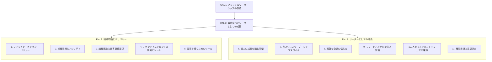
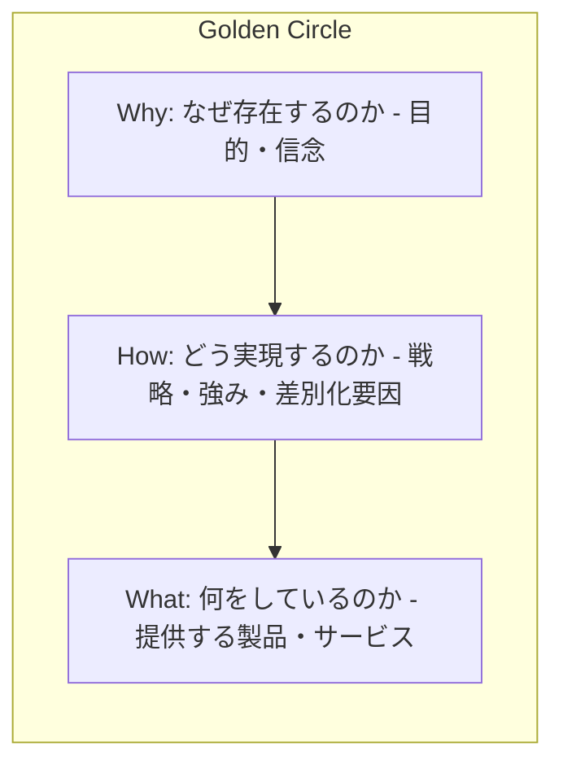
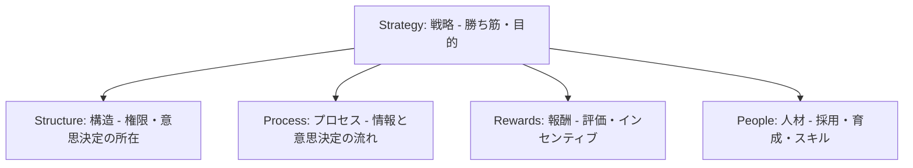
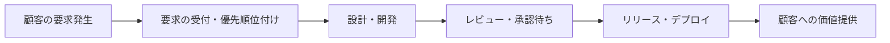
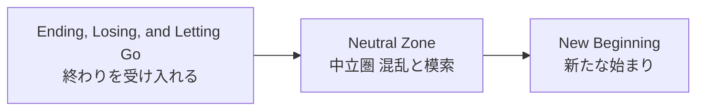
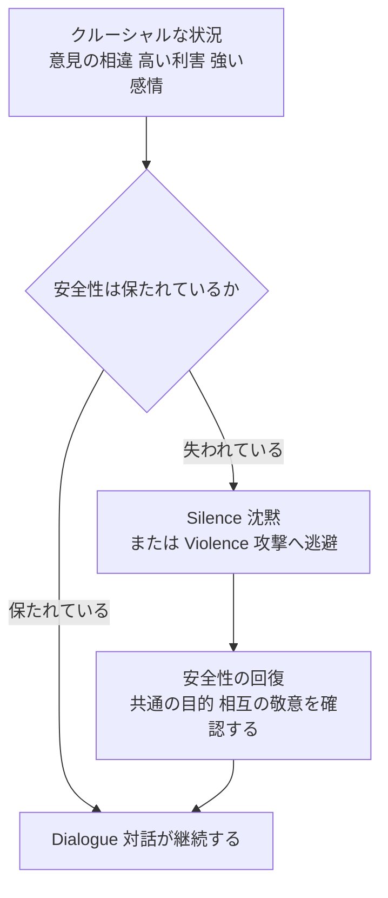
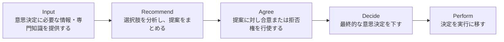

# Certified Agile Leader® 2 (CAL 2™) 学習ガイド

> 本ガイドは、Scrum Alliance公式サイト「[Certified Agile Leader 2 - CAL 2 training from Scrum Alliance](https://www.scrumalliance.org/get-certified/agile-leader-track/cal-2)」に掲載されているLearning Objectives（学習目標）の構成に基づき、初学者が独学でも理解できるよう、各項目の背景理論とベストプラクティスを段階的に解説するものです。

---

## 0. このガイドについて

### 0-1. CAL 2 とは何か

Certified Agile Leader® 2（CAL 2™）は、Scrum Allianceが提供する「Agile Leader Track（アジャイルリーダートラック）」の2段階目にあたる認定資格です。CAL 1™で学んだ「アジャイルリーダーシップとは何か」という基礎を土台に、CAL 2ではその知識を**組織戦略・デリバリー・自身のリーダーとしての成長**という、より実践的で高度な領域へ接続していきます。

公式サイトでは、CAL 2は「複雑で変化の激しいビジネス環境でリーダーシップ能力を高めたいすべての人」を対象とした上級プログラムと説明されています。CAL 1が「なぜアジャイルリーダーシップが必要か」という土台を作るのに対し、CAL 2は「その土台を日々の戦略実行や目標達成にどう接続するか」を扱う点が特徴です。

> **補足:** 本ガイドは以前作成したCAL 1学習ガイドシリーズ（4つの学習目標領域：1. アジャイルリーダーシップの必要性、2. 実践におけるアジャイルリーダーシップ、3. アジャイルチームのリード、4. アジャイル組織のリード）の続編にあたります。CAL 1で扱ったフレームワーク（ADKAR、Kotterの8段階プロセス、Delegation Poker、SBIフィードバックモデル、Five Dysfunctions、Team Topologies、Conway's Law、Thomas-Kilmann対立モードなど）は本ガイドでは前提知識として簡潔に振り返るにとどめ、CAL 2で新たに登場する視点に重点を置いて解説します。該当箇所には「（CAL 1参照）」と明記します。

### 0-2. 認定の仕組み（前提条件・評価方法・更新）

| 項目 | 内容 |
|---|---|
| 前提条件 | CAL 1™の取得が必須（有効・失効のどちらでも受講可）。CAL 2を取得すると、失効していたCAL 1も自動的に更新される |
| 提供形態 | 認定トレーナー（Certified Scrum Trainer等）による対面またはオンラインコース。学習目標は全コース共通だが、具体的な進め方はトレーナーごとに異なる |
| 評価方法 | 選択式の試験は課されておらず、コースへのフル参加と課題の完了（事前課題・自己アセスメント・ワークショップでの実践等）をもって認定が付与される形式が一般的 |
| 更新サイクル | 2年ごと。更新には Scrum Education Units（SEU）の取得と更新料が必要 |
| 構成の変遷 | 2024年に旧CALプログラム（CAL Essentials／Teams／Organizations、Advanced Education-Validated Practice等）が再編され、現在のCAL 1／CAL 2の2段階構成になった |

> **ソース:** [CAL 2™ 公式ページ](https://www.scrumalliance.org/get-certified/agile-leader-track/cal-2) ／ [CAL 1™・CAL 2™ 再編に関するFAQ（Scrum Alliance Help Center）](https://support.scrumalliance.org/hc/en-us/articles/24643517272219-Certified-Agile-Leader-1-CAL-1-and-Certified-Agile-Leader-2-CAL-2-Refactor-Frequently-Asked-Questions)

### 0-3. カリキュラム全体マップ

CAL 2のLearning Objectivesは、公式サイト上で大きく2つのセクションに分かれています。

公式ページでは、CAL 2を受講することで得られる主な成果として次の3点が挙げられています。

- 組織構造の設計方法を理解し、戦略実行につなげられるようになる
- チェンジマネジメントの本質を理解し、変革を主導できるようになる
- あらゆる役割において、リーダーシップスキルを次の段階へ引き上げられるようになる

> **ソース:** [CAL 2™ 公式ページ](https://www.scrumalliance.org/get-certified/agile-leader-track/cal-2)

---

## Part 1. 組織戦略とデリバリー（Organizational Strategy and Delivery）

Part 1は、「アジャイルリーダーはチームの外側にある組織全体の設計や戦略にどう向き合うべきか」を扱う領域です。ミッション・ビジョン・バリューの明確化から、組織構造の設計、そして変革の推進までを一貫した流れとして学びます。

### 1. ミッション・ビジョン・バリュー

#### 1-1. 3つの概念を区別する

多くの組織では「ミッション」「ビジョン」「バリュー」が曖昧に使われがちですが、CAL 2ではこの3つを明確に区別して扱います。

| 概念 | 問いかけ | 時間軸 | 役割 |
|---|---|---|---|
| ミッション（Mission） | なぜ私たちは存在するのか | 現在・恒常的 | 組織の存在理由・目的を示す |
| ビジョン（Vision） | 私たちはどこへ向かうのか | 未来 | 到達したい将来像を示す |
| バリュー（Values） | 私たちはどう行動するのか | 常時 | 意思決定や行動の判断基準を示す |

これら3つが一致していないと、日々の意思決定が場当たり的になり、組織のアジリティ（変化への適応力）そのものが損なわれます。公式ページでも、ミッション・ビジョン・バリューが組織の成功に**プラスにもマイナスにも**働きうることが明記されており、「額縁に飾ってあるだけの標語」になっているか、「日々の意思決定の判断軸」として機能しているかが分かれ目になります。

#### 1-2. Golden Circle（Simon Sinek）

ミッション・ビジョン・バリューを一貫させるための代表的な思考モデルが、Simon Sinekが提唱した「Golden Circle（ゴールデンサークル）」です。人や組織が発するメッセージを、内側から外側へ向かう3層の同心円として捉えます。

Sinekの主張の核心は、多くの組織が「What（何をしているか）」から説明を始めてしまうのに対し、人や顧客を本当に動かすのは「Why（なぜそれをしているか）」であるという点です。Whyは脳科学的には感情や意思決定を司る大脳辺縁系に、Whatは論理的思考を司る新皮質に対応するとされ、Whyから語ることで人の行動やロイヤルティを引き出しやすくなると説明されています。

> **ベストプラクティス**
> - ミッション・ビジョン・バリューを策定する際は、必ず「Why → How → What」の順で言語化し、Whatだけが先行していないか確認する
> - バリューは抽象的なスローガンにせず、「対立する2つの選択肢のうちどちらを選ぶか」を判断できる具体的な行動基準として書く（例：「スピードよりも品質を優先する」）
> - リーダー自身が戦略を語るときは、常にWhyから始める。チームが変化に納得して協力するかどうかは、Whatの説明だけでは決まらない
> - ミッション・ビジョン・バリューは一度策定して終わりにせず、組織構造や評価制度（後述のGalbraith Star Model参照）と定期的に整合性を確認する
>
> **ソース**
> - [Start With Why: Simon Sinek's Golden Circle Theory Explained](https://upraise.io/blog/golden-circle-framework/)
> - [How Simon Sinek's Golden Circle Can Transform Your Business](https://www.cesarritzcolleges.edu/en/news/simon-sinek-golden-circle/)
> - [CAL 2™ 公式ページ（ミッション・ビジョン・バリューの記述）](https://www.scrumalliance.org/get-certified/agile-leader-track/cal-2)

---

### 2. 組織戦略とアジリティ

#### 2-1. 戦略とアジリティの関係

CAL 2では、「戦略が組織のアジリティ（俊敏性）にどう影響するか」「絶えず変化する環境の中でどう組織が生き残るか」を扱います。従来型の戦略立案は、年次計画を立てて数年単位で実行するという「一度決めたら変えない」前提に立ちがちですが、変化の激しい市場では、戦略そのものを継続的に感知（センシング）し、対応（レスポンディング）し続ける能力こそが競争優位の源泉になります。

CAL 1第4章では、組織のアジリティを評価する枠組みとしてBusiness Agility Institute（BAI）の各種ドメインやSAFeのOrganizational Agility competencyを扱いました。CAL 2ではこれを土台に、その戦略アジリティが実際の「組織構造」や「顧客への価値提供」にどう落とし込まれるかという、より実装寄りの視点へと話を進めます。

#### 2-2. 戦略とアジリティを結びつける実践的な考え方

- 戦略は一度の意思決定ではなく、感知（Sense）→ 判断（Decide）→ 対応（Respond）のサイクルとして繰り返し回すものと捉える
- 戦略の「意図」（なぜこの戦略なのか）をチーム全体に浸透させることで、現場が状況の変化に応じて自律的に判断できるようにする（Mission Command的発想。CAL 1第3章のサーバントリーダーシップとも接続する）
- 戦略実行の進捗を、アウトプット（作った量）ではなくアウトカム（もたらした成果）で測定する（CAL 1第4章参照）

> **ベストプラクティス**
> - 年次戦略レビューだけでなく、四半期・月次などの短いサイクルで戦略の前提を見直す機会を設ける
> - 戦略を伝える際は「何をするか」だけでなく「なぜそれが今のビジネス環境で重要か」を必ずセットで説明する
> - 現場チームが戦略の意図を理解しているかを、指示の復唱ではなく「この状況ならどう判断するか」という具体的なシナリオで確認する
>
> **ソース**
> - [CAL 2™ 公式ページ（組織戦略とアジリティの記述）](https://www.scrumalliance.org/get-certified/agile-leader-track/cal-2)
> - Business Agility Instituteおよびアウトカム思考については CAL 1 第4章「アジャイル組織のリード」を参照

---

### 3. 組織構造と顧客価値提供

#### 3-1. なぜ構造が価値提供を左右するのか

組織構造は単なる「誰が誰に報告するか」の図ではありません。情報の流れ方、意思決定の速さ、そしてチーム間の依存関係を規定し、結果として**顧客に価値が届くまでの速度と質**を決定づけます。CAL 2では、既存の組織構造が価値提供を助けているのか、それとも妨げているのかを診断し、改善提案をする力を養います。

#### 3-2. Galbraith Star Model（組織設計の5要素）

組織構造だけを変えても機能しない、という視点を提供してくれるのがJay Galbraithの「Star Model（スターモデル）」です。組織の振る舞いを規定する5つの設計要素が、互いに整合していなければならないと説きます。

Star Modelの要点は、「組織図（Structure）だけを描き直しても、評価制度（Rewards）や意思決定プロセス（Process）が旧来のままなら、組織は元の振る舞いに戻ってしまう」という点です。人はどうしても組織図の変更に注目しがちですが、それは地位や権力に直結するためであり、実際にはプロセス・報酬・人材という残り3要素まで含めて一貫させて初めて、行動の変化が定着します。

> **ベストプラクティス**
> - 組織再編を検討する際は、Structureだけでなく必ずProcess・Rewards・Peopleの3点も同時にレビューする
> - 「新しい構造にしたのに行動が変わらない」場合は、評価制度（何を褒め、何を昇進させているか）が旧来の構造を暗に支持していないか確認する
> - Star Modelの5要素は中心の戦略（Strategy）から放射状に決まるため、構造の設計は必ず「この戦略を実行するために、この構造が必要か」という問いから始める

#### 3-3. Value Stream Mapping（顧客価値の流れを可視化する）

構造の妥当性を検証するもう一つの手段が、Lean由来の「Value Stream Mapping（バリューストリームマッピング、VSM）」です。顧客の注文や要求が組織に入ってから、実際に価値として顧客に届くまでの一連の流れを可視化し、どこに待ち時間（Waste）が発生しているかを特定する手法です。

VSMでは、各工程にかかる「処理時間（Cycle Time）」と、工程間で発生する「待ち時間」を含めた「リードタイム（Lead Time）」を可視化します。多くの組織では、実際に価値を生み出す処理時間はリードタイム全体のごく一部にすぎず、大半は承認待ちや部門間の引き継ぎといった非付加価値時間で占められていることが明らかになります。この「処理時間 ÷ リードタイム」の比率はフロー効率（Flow Efficiency）と呼ばれ、組織構造そのもの（部門をまたぐ承認プロセスなど）がボトルネックになっているケースが少なくありません。

> **ベストプラクティス**
> - 組織構造を見直す前に、まず現状のバリューストリームを一度実際にマッピングし、待ち時間がどの引き継ぎ地点（部門間・チーム間）で発生しているかを特定する
> - リードタイムのうち処理時間が占める割合（フロー効率）を定点観測の指標にする。組織変更の効果は、この比率の改善で検証できる
> - チーム構造の再設計（Team TopologiesやConway's Lawの観点。CAL 1第4章参照）は、バリューストリーム上のボトルネックを解消する目的で行う。構造変更が目的化しないようにする
>
> **ソース**
> - [Galbraith Star Model | Org Design & Operating Model](https://umbrex.com/resources/frameworks/organization-frameworks/galbraith-star-model/)
> - [Developing an Organizational Design that Works: The Galbraith Star Model](https://flevy.com/blog/developing-an-organizational-design-that-works-the-galbraith-star-model/)
> - [Value Stream Mapping: Unveiling the Path to Efficiency and Customer Value](https://itrevolution.com/articles/value-stream-mapping/)
> - [Map flow end-to-end: Value Stream Mapping](https://kaizen.com/insights/value-stream-mapping-bottleneck-capacity/)
> - Team Topologies / Conway's Lawについては CAL 1 第4章「アジャイル組織のリード」を参照

---

### 4. チェンジマネジメントの誤解とツール

#### 4-1. よくある誤解

CAL 2の学習目標には、「チェンジマネジメントに関するよくある誤解を理解する」ことが明記されています。代表的な誤解には以下のようなものがあります。

| よくある誤解 | 実際 |
|---|---|
| 変革はキックオフの発表イベントで完了する | 変革とは一度きりの出来事（Event）ではなく、人が心理的に古いやり方を手放し新しいやり方を受け入れる「移行（Transition）」という時間のかかるプロセスである |
| 抵抗（Resistance）は排除すべき障害物である | 抵抗は多くの場合、変化に対する正当な懸念や失うものへの感情の表れであり、無視・排除するのではなく傾聴し対応すべきデータである |
| コミュニケーションプラン（周知）＝チェンジマネジメントである | 情報を伝えるだけでは人の感情的な移行は起きない。周知はチェンジマネジメントの一部にすぎない |
| トップの意思決定さえ変えれば組織全体が変わる | 現場の一人ひとりが新しい行動を選び取って初めて変革は完了する。意思決定と定着の間には大きな距離がある |

#### 4-2. Bridges' Transition Model（変化と移行を分けて考える）

William Bridgesが提唱した「Transition Model（トランジションモデル）」は、上記の誤解を解くための代表的な枠組みです。Bridgesは「Change（変化）」と「Transition（移行）」を明確に区別します。Changeは新しいシステムや組織図といった**外的な出来事**であり、一瞬で起こりえます。一方Transitionは、人が古いやり方を手放し、混乱を経て、新しいやり方を受け入れるまでの**内的・心理的なプロセス**であり、人によってペースが異なります。

- **Ending（終わり）**：これまでのやり方の喪失を受け入れる段階。怒りや否認、混乱といった感情が伴いやすい
- **Neutral Zone（中立圏）**：古いやり方は終わったが、新しいやり方はまだ定着していない、宙ぶらりんな期間。不安と同時に、創造性や新しい発想が生まれやすい時期でもある
- **New Beginning（新たな始まり）**：新しい役割や行動へのコミットメントが芽生え、エネルギーが前向きに解放されていく段階

Bridgesが強調するのは、「New Beginningはスケジュール通りには訪れない」という点です。新しい始まりは、人が内面的に準備が整ったときに自然に生まれるものであり、リーダーが号令をかけて強制的に発生させることはできません。

> **ベストプラクティス**
> - 変革の発表時には、必ず「何が終わるのか」を明確かつ具体的に伝える。曖昧な終わりの提示は、いつまでも過去にしがみつく原因になる
> - Neutral Zone（中立圏）にいる期間は、短期的な目標・こまめなコミュニケーション・実験を歓迎する姿勢によって、混乱を前向きな模索へ転換する
> - Neutral Zoneの最中に、無関係な追加の変更を重ねない。人はすでに変化への対応で消耗しているため、変更の重ね掛けは移行期間を不必要に長引かせる
> - 変革の進捗をマイルストーンだけでなく、チームがEnding／Neutral Zone／New Beginningのどの段階にいるかという「人の移行状態」でも把握する
>
> **ソース**
> - [Bridges' Transition Model Explained: Endings, Neutral Zone and New Beginnings](https://www.peoplestudypro.com/blog/bridges-transition-model-explained)
> - [What is Bridges' Transition Model? | Umbrex](https://umbrex.com/resources/change-management-frameworks/what-is-bridges-transition-model/)
> - [Bridges Transition Model | William Bridges Associates](https://wmbridges.com/about/what-is-transition/)
> - ADKARモデル・Kotterの8段階変革プロセスについては CAL 1 第4章「アジャイル組織のリード」を参照

---

### 5. 変革を導くためのツール

#### 5-1. 誤解を踏まえた実践ツール

チェンジマネジメントの誤解を理解したうえで、CAL 2ではリーダーが実際に組織を変革へ導くための具体的な道具立てを学びます。CAL 1で学んだKotterの8段階プロセスやADKARモデルは「何を、どの順番で行うか」を示すロードマップでしたが、Part 1の締めくくりとなるこの項目では、それらのロードマップを日々の実務に落とし込むための補助ツールを整理します。

| ツール | 目的 | 使いどころ |
|---|---|---|
| ステークホルダーマッピング | 変革に対する各関係者の影響力・関心度・スタンス（賛成/中立/反対）を可視化する | 変革着手前の準備段階 |
| 変革のためのコミュニケーションケイデンス | 「何を・誰に・どの頻度で・誰から」伝えるかを定例化する | Bridgesの3段階すべてを通じて継続 |
| 連合（Guiding Coalition）の形成 | 変革を推進する影響力あるメンバーのチームを組成する（Kotterの第2段階） | 変革の立ち上げ期 |
| 短期的成果（Quick Wins）の設計 | 早期に目に見える成果を作り、Neutral Zoneでのモチベーション低下を防ぐ | Neutral Zone期間中 |
| ADKARによる個人単位の診断 | Awareness／Desire／Knowledge／Ability／Reinforcementのどこで個人がつまずいているかを特定する | 変革が思うように進まないときの原因診断 |

> **ベストプラクティス**
> - 変革着手前に必ずステークホルダーマッピングを行い、「誰が最も影響力を持ち、かつ最も抵抗しそうか」を事前に把握しておく
> - コミュニケーションは一度で終わらせず、少なくとも週次・月次などのケイデンス（一定の頻度）で継続する。人は同じメッセージを何度も聞いて初めて本気度を信じる
> - 変革が停滞したときは、まず「組織全体の設計」ではなく「特定の個人・チームがADKARのどの段階でつまずいているか」を診断する。組織レベルの施策と個人レベルの診断は両輪で回す
> - Quick Winsは変革の本質的な目的からずれないものを選ぶ。目立つが本筋と無関係な成果は、かえって変革への信頼を損なう
>
> **ソース**
> - [CAL 2™ 公式ページ（変革を導くツールの記述）](https://www.scrumalliance.org/get-certified/agile-leader-track/cal-2)
> - Kotterの8段階変革プロセス・ADKARモデルの詳細については CAL 1 第4章「アジャイル組織のリード」を参照

---

## Part 2. リーダーとしての成長（Developing as a Leader）

Part 2は視点を組織から個人へと移し、「アジャイルリーダー自身がどう成長し、どう人と向き合うか」を扱う領域です。公式ページでは、この領域の学習目標として「個人の成長を阻む障壁の克服」「自分らしいリーダーシップアプローチの確立」「困難な会話での戦略伝達」「フィードバックの授受」「人のマネジメントにおける課題」「権限委譲と意思決定」の6点が挙げられています。

### 6. 個人の成長を阻む障壁を乗り越える

#### 6-1. なぜ「わかっているのに変われない」のか

リーダーが自分自身の行動を変えようとするとき、頭では必要性を理解していても、実際の行動が変わらないという経験は多くのリーダーが持っています。Robert KeganとLisa Laskow Lahey（ハーバード大学）は、これを意志力の欠如ではなく、「Immunity to Change（変化への免疫）」という無意識の自己防衛システムによるものだと説明しました。

#### 6-2. Immunity to Change（変化への免疫マップ）

Kegan & Laheyのモデルでは、人は変化を望みながら同時に、その変化を妨げる「相反するコミットメント（Competing Commitment）」を無意識に抱えていると説明します。これは「アクセルを踏みながら、もう片方の足でブレーキも踏んでいる」状態にたとえられます。

このマップは4つの列で構成されます。

| 列 | 内容 | 例 |
|---|---|---|
| 1. 改善目標 | 意識的に達成したいと望んでいる変化 | 同僚とより高品質なコミュニケーションを取る |
| 2. していること／していないこと | 目標に反する現在の行動 | 皮肉なユーモアで論点を伝えてしまうことがある |
| 3. 隠れた相反するコミットメント | 目標と逆方向に働く、無意識の別のコミットメント | 特定の同僚グループと距離を保つことに実はコミットしている |
| 4. 大きな仮定（Big Assumption） | 相反するコミットメントの土台にある、検証されていない思い込み | 深く関わりすぎると自分らしさを失うと思い込んでいる |

Kegan & Laheyが強調するのは、column 4の「大きな仮定」は本人にとって疑いようのない事実のように感じられているが、実際には一度も検証されたことがない思い込みにすぎない、という点です。この仮定を小さな安全な実験を通じて検証していくことで、初めて行動が変わり始めます。

> **ベストプラクティス**
> - 行動を変えたいのに変えられないと感じたら、まず「自分は何に対して無意識にコミットしているのか（Column 3）」を書き出してみる
> - Column 4の「大きな仮定」を、事実ではなく検証可能な仮説として扱い、リスクの小さい実験（Small Safe Test）で確かめる
> - リーダー自身がこのマップを率直に共有することで、チームメンバーにも「変われないのは怠慢ではなく、正当な内的葛藤である」という心理的安全性のある土壌を作る
> - 成長を阻む障壁は多くの場合、能力ではなく無意識の自己防衛にあるという前提に立ち、精神論での叱咤激励に頼らない
>
> **ソース**
> - [Immunity to Change - Mindtools](https://www.mindtools.com/a4l75hx/immunity-to-change/)
> - [Immunity to Change - Humanizing Work](https://www.humanizingwork.com/immunity-to-change/)
> - Kegan, R., & Lahey, L. L. (2009). *Immunity to Change: How to Overcome It and Unlock Potential in Yourself and Your Organization*. Harvard Business Press.

---

### 7. 自分らしいリーダーシップアプローチの確立

#### 7-1. 唯一の正解のリーダーシップスタイルは存在しない

CAL 1第3章では、指揮統制型からサーバントリーダーシップへの「リーダーシップスタイルのシフト」を扱いました。CAL 2ではこれをさらに一歩進め、「状況に応じてスタイルを使い分ける」という考え方、すなわちPaul HerseyとKen Blanchardの「Situational Leadership（状況対応リーダーシップ）」、特にその発展形である**Situational Leadership II（SLII）**を扱います。

#### 7-2. Situational Leadership II（SLII）

SLIIの核心は、「唯一絶対の正しいリーダーシップスタイルはなく、相手の**特定のタスクに対する**成熟度（Development Level）に応じてスタイルを変えるべきである」という考え方です。重要なのは、この成熟度は「その人自身の総合的な能力」ではなく「そのタスクに対する能力と意欲の組み合わせ」であるという点です。同じ人でも、あるタスクではD4（自律型）、別のタスクではD1（初心者）であることがあります。

| 開発レベル（Development） | 特徴 | 対応するリーダーシップスタイル（Style） | 行動の重心 |
|---|---|---|---|
| D1: 意欲はあるが未熟練 | 能力は低いが、意欲・自信は高い | S1: Directing（指示型） | 指示多め・支援少なめ |
| D2: 学習中で意欲が下がりがち | ある程度の能力はついたが、思うようにいかず意欲が下がる | S2: Coaching（コーチ型） | 指示多め・支援多め |
| D3: 能力はあるが自信が不安定 | 能力は高いが、自信や意欲にムラがある | S3: Supporting（支援型） | 指示少なめ・支援多め |
| D4: 自律的に遂行できる | 能力・意欲ともに高い | S4: Delegating（委任型） | 指示少なめ・支援少なめ |

> **ベストプラクティス**
> - 部下やチームメンバーに一律の「自分のリーダーシップスタイル」を当てはめるのではなく、タスクごとに相手の開発レベルを見極めてからスタイルを選ぶ
> - D2（学習中で意欲が下がりがち）のメンバーへの対応は特に見落とされがちである。能力がついてきたからと支援を減らすと、意欲低下期にちょうど孤立させてしまう
> - 委任（Delegating）は「能力があるから任せる」だけでなく、「そのタスクへの意欲・コミットメントも高いか」を必ず併せて確認してから行う（第11章のRAPID／権限委譲も参照）
> - 自分自身の「デフォルトのリーダーシップスタイル」に自覚的になる。多くのリーダーは慣れたスタイル（例えば常にDirecting）に偏りがちで、相手の開発レベルの変化に合わせてスタイルを切り替えられていないことが多い
>
> **ソース**
> - [Situational Leadership Model by Hersey and Blanchard - Toolshero](https://www.toolshero.com/leadership/situational-leadership-hersey-blanchard/)
> - [Hersey–Blanchard Situational Leadership | Umbrex](https://umbrex.com/resources/frameworks/organization-frameworks/hersey-blanchard-situational-leadership-model/)
> - [A Situational Approach to Leadership | Blanchard's SLII](https://resources.blanchard.com/blanchard-leaderchat/a-situational-approach-to-effective-leadership)
> - サーバントリーダーシップへのスタイルシフトについては CAL 1 第3章「アジャイルチームのリード」を参照

---

### 8. 困難な会話での戦略伝達

#### 8-1. 「クルーシャル・カンバセーション」とは

戦略や変革の意図を伝える場面では、意見の対立や強い感情を伴う「困難な会話（Difficult Conversations）」が避けられません。Kerry Patterson、Joseph Grenny、Ron McMillan、Al Switzlerによる『Crucial Conversations（クルーシャル・カンバセーション）』は、こうした会話を扱うための代表的な枠組みです。

クルーシャル・カンバセーションは、次の3条件がそろった会話と定義されます。

- 意見の相違がある（Opinions differ）
- 結果に対する利害が大きい（Stakes are high）
- 感情が高ぶっている（Emotions run strong）

このような会話では、人は「沈黙（Silence）」か「暴力（＝攻撃的な発言、Violence）」のどちらかに逃げ込みがちだと説明されます。「Silence and Violence」と呼ばれるこの2つの回避パターンは、どちらも本音の対話（Dialogue）を妨げます。

#### 8-2. 安全性を築く

対話を継続するための鍵は「安全性（Safety）」です。相手が「この人は自分を尊重しているか」「この人と自分は共通の目的を持っているか」に不安を感じた瞬間、対話は沈黙か攻撃に切り替わります。安全性を取り戻すには、いったん本題を離れて共通の目的（Mutual Purpose）と相互の敬意（Mutual Respect）を明確にし直すことが有効だとされます。

> **ベストプラクティス**
> - 会話の最中に相手の態度が急に変わった（黙り込む・皮肉を言い始める等）場合は、内容の議論をいったん止め、安全性が失われていないかを確認する
> - 「私はあなたを打ち負かしたいのではなく、一緒に良い結果を探したい」という共通の目的を、対立が生じた時点で明示的に言葉にする
> - 自分の感情が高ぶってきたと感じたら、事実（何が起きたか）と自分が作った物語（それをどう解釈したか）を意識的に切り分ける
> - 戦略の意図を伝える会話では、結論を一方的に告げるのではなく、相手の見解を先に尋ね、対話（Dialogue）として進める。CAL 1第3章のThomas-Kilmann対立モードにおける「協調（Collaborating）」の姿勢と一致する
>
> **ソース**
> - [Crucial Conversations, by Grenny, Patterson, et al.](https://evansamek.substack.com/p/crucial-conversations-by-grenny-patterson)
> - [Book Summary - Crucial Conversations (Kerry Patterson)](https://readingraphics.com/book-summary-crucial-conversations/)
> - Patterson, K., Grenny, J., McMillan, R., & Switzler, A. (2012). *Crucial Conversations: Tools for Talking When Stakes Are High* (2nd ed.). McGraw-Hill.

---

### 9. フィードバックの提供と受領

#### 9-1. Radical Candor（ラディカル・キャンダー）

Kim Scott（元Google・Apple幹部）が提唱する「Radical Candor」は、フィードバックを「個人的な気遣い（Care Personally）」と「率直な指摘（Challenge Directly）」という2つの軸で整理するフレームワークです。

| | Challenge Directly（率直に指摘する）が低い | Challenge Directly（率直に指摘する）が高い |
|---|---|---|
| **Care Personally（個人的に気遣う）が高い** | Ruinous Empathy（破滅的な共感）：気遣うあまり、必要な指摘をしない | Radical Candor（理想の状態）：気遣いながら率直に伝える |
| **Care Personally（個人的に気遣う）が低い** | Manipulative Insincerity（操作的な不誠実）：気遣いも指摘もない | Obnoxious Aggression（攻撃的な無神経さ）：気遣いなく率直さだけをぶつける |

Scottが強調するのは、「Care Personally」は伝える側の意図ではなく、**受け取る側がどう感じたか**によって測られるという点です。つまり自分では気遣ったつもりでも、相手に伝わっていなければRuinous Empathy（気を遣いすぎて何も言わない状態）やObnoxious Aggression（無神経な物言い）に転落してしまいます。

#### 9-2. フィードバックを「受け取る」側の技術

CAL 2の学習目標は「フィードバックを与える（Delivering）」だけでなく「受け取る（Receiving）」ことも含んでいます。Radical Candorの実践では、まず自分から積極的にフィードバックを求める（Solicit Feedback）ことが推奨されます。「自分がやめるべきこと、続けるべきことは何か」を先に尋ねる姿勢を見せることで、相手も安心してフィードバックを口にしやすくなります。

> **ベストプラクティス**
> - フィードバックを伝える前に、まず自分から「私に対するフィードバックはある？」と尋ね、フィードバックを求める文化の手本を自ら示す
> - 指摘が「性格への断定」に聞こえていないか確認する。人格ではなく、具体的な行動とその影響について話す（CAL 1第3章のSBIフィードバックモデル：Situation-Behavior-Impactと組み合わせて使うと効果的）
> - 「気を遣いすぎて何も言わない（Ruinous Empathy）」に陥っていないか、日頃から自問する。優しさのつもりの沈黙は、相手の成長機会を奪っている場合がある
> - フィードバックは可能な限りその場・対面で、具体的に、双方向の会話として行う
>
> **ソース**
> - [Our Approach: Kim Scott's Feedback Framework](https://www.radicalcandor.com/our-approach)
> - [What is Radical Candor? Learn the Basic Principles In 6 Minutes](https://kimmalonescott.medium.com/what-is-radical-candor-learn-the-basic-principles-in-6-minutes-50391b3ad76a)
> - Scott, K. (2017). *Radical Candor: Be a Kick-Ass Boss Without Losing Your Humanity*. St. Martin's Press.
> - SBIフィードバックモデルの詳細については CAL 1 第3章「アジャイルチームのリード」を参照

---

### 10. 人をマネジメントする上での課題

#### 10-1. リーダーが直面する典型的な課題

CAL 2の学習目標には「リーダーが人をマネジメントする際に直面する課題と、それを乗り越えるアプローチ」が含まれます。これは特定の1つのフレームワークというより、これまで学んできた複数のモデルを状況に応じて組み合わせて使う「統合的な実践力」を問う領域です。

| 典型的な課題 | 有効なアプローチ |
|---|---|
| メンバーごとに能力・意欲のばらつきが大きい | 第7章のSituational Leadership IIで、タスク単位の開発レベルを見極めてスタイルを調整する |
| チーム内の対立や心理的安全性の欠如 | CAL 1第3章のLencioniのFive Dysfunctions、Googleのプロジェクト・アリストテレスの知見を参照する |
| 成果が出ないメンバーへの指摘をためらう | 第9章のRadical Candorで、気遣いと率直さを両立させる |
| 変化への抵抗が根強い | 第6章のImmunity to Changeで、行動の裏にある無意識のコミットメントを扱う |
| 意見の対立が感情的な衝突に発展する | 第8章のCrucial Conversations、CAL 1第3章のThomas-Kilmann対立モードを参照する |

#### 10-2. 「唯一の正解」を探さない

この領域で最も重要な姿勢は、「万能の管理手法」を探すのをやめることです。人のマネジメントにおける課題の多くは、単一のテクニックの欠如ではなく、状況診断（誰が・どのタスクで・どんな感情状態にあるか）の不足から生じます。

> **ベストプラクティス**
> - 部下との1on1では、指導内容そのものより先に「このメンバーは今、どの開発レベル（D1〜D4）にあるか」を見極めることに時間を使う
> - チームの機能不全が疑われる場合は、個人の能力の問題と決めつける前に、心理的安全性やチームの構造（Team Topologies）に原因がないかを確認する
> - 難しい人材課題に直面したときほど、単発の対処ではなく「これはImmunity to Changeの問題か、Situational Leadershipのミスマッチか、それとも対立のエスカレーションか」と一度立ち止まって分類する
>
> **ソース**
> - [CAL 2™ 公式ページ（人のマネジメント課題の記述）](https://www.scrumalliance.org/get-certified/agile-leader-track/cal-2)
> - Five DysfunctionsおよびGoogleプロジェクト・アリストテレスについては CAL 1 第3章「アジャイルチームのリード」を参照

---

### 11. 権限委譲と意思決定

#### 11-1. なぜ意思決定の停滞が起きるのか

多くの組織では、「誰が最終的に決めるのか」が曖昧なまま議論が繰り返され、意思決定が停滞します。CAL 2の学習目標は、「協働的なリーダーが権限委譲と意思決定をどう扱うか」を発見することです。CAL 1第3章では、チームへの権限委譲の度合いを7段階で示すManagement 3.0の「Delegation Poker」を扱いました。CAL 2ではこれをさらに組織横断的な意思決定の場面へ拡張します。

#### 11-2. RAPIDフレームワーク（Bain & Company）

Paul RogersとMarcia Blenko（Bain & Company）が2006年にHarvard Business Reviewで発表した「RAPID®」フレームワークは、複雑で複数の部門・関係者が絡む意思決定において、5つの役割を明確に割り当てることで停滞を防ぐ手法です。

| 役割 | 内容 |
|---|---|
| Recommend（推奨） | 情報を集め、選択肢を分析し、明確な提案とその根拠をまとめる |
| Agree（合意） | 提案に対して限定的な拒否権を持つ。ただし拒否できる範囲はあらかじめ明確にしておく |
| Perform（実行） | 決定が下された後、実際にその決定を遂行する |
| Input（情報提供） | 意思決定に必要な情報や専門知識を提供する。決定権は持たない |
| Decide（決定） | 提案・合意・情報提供の内容を踏まえ、最終的な決定を下す。原則として1人（または1つの明確な機関）に絞る |

実際の運用順序は「RAPID」というアルファベット順ではなく、「Input → Recommend → Agree → Decide → Perform」の流れで進むのが一般的です。RAPIDの最大の価値は、**「Decide（最終決定者）」を必ず1つに絞ること**と、**「Agree（限定的拒否権）」と「Input（単なる助言）」を明確に区別すること**にあります。これにより、「全員が決めようとして誰も決まらない」状態と、「誰も決めずに漂流する」状態の両方を防ぎます。

> **ベストプラクティス**
> - 複雑な意思決定に着手する前に、必ず5つの役割（RAPID）を明文化し、誰がどの役割かをドキュメント化してから議論を始める
> - Decide（決定者）は原則として1人、多くても少人数の明確な機関に絞る。「みんなで決める」という建前は、実際には誰も責任を取らない結果につながりやすい
> - Agree（合意）の役割を持つ人には、拒否できる条件（何についての拒否権か）を事前に明確に伝えておく。無制限の拒否権は意思決定を停滞させる
> - チーム内の日々の権限委譲にはDelegation Poker（CAL 1第3章参照）、部門横断の複雑な意思決定にはRAPIDというように、意思決定の粒度に応じてツールを使い分ける
>
> **ソース**
> - [Bain's RAPID® Framework - Mindtools](https://www.mindtools.com/av8ceid/bains-rapid-framework/)
> - [Bain RAPID Decision Framework | Governance & Accountability](https://umbrex.com/resources/frameworks/organization-frameworks/bain-rapid-decision-framework/)
> - Rogers, P., & Blenko, M. (2006). "Who Has the D? How Clear Decision Roles Enhance Organizational Performance." *Harvard Business Review*.
> - Delegation Poker（Management 3.0）の詳細については CAL 1 第3章「アジャイルチームのリード」を参照

---

## まとめ：CAL 2 学習目標とフレームワーク対応表

| Part | 学習目標 | 主なフレームワーク／モデル | 提唱者・出典 |
|---|---|---|---|
| Part 1 | 1. ミッション・ビジョン・バリュー | Golden Circle | Simon Sinek |
| Part 1 | 2. 組織戦略とアジリティ | Business Agility／アウトカム思考（CAL 1参照） | Business Agility Institute 他 |
| Part 1 | 3. 組織構造と顧客価値提供 | Star Model／Value Stream Mapping | Jay Galbraith／Lean（Womack & Jones） |
| Part 1 | 4. チェンジマネジメントの誤解 | Bridges' Transition Model | William Bridges |
| Part 1 | 5. 変革を導くツール | ステークホルダーマッピング／ADKAR・Kotter（CAL 1参照） | Prosci／John Kotter |
| Part 2 | 6. 個人の成長を阻む障壁 | Immunity to Change | Robert Kegan & Lisa Laskow Lahey |
| Part 2 | 7. 自分らしいリーダーシップ | Situational Leadership II（SLII） | Paul Hersey & Ken Blanchard |
| Part 2 | 8. 困難な会話 | Crucial Conversations | Patterson, Grenny, McMillan, Switzler |
| Part 2 | 9. フィードバックの授受 | Radical Candor（＋SBIモデル：CAL 1参照） | Kim Scott |
| Part 2 | 10. 人のマネジメント課題 | 上記フレームワークの統合的活用 | ― |
| Part 2 | 11. 権限委譲と意思決定 | RAPID®（＋Delegation Poker：CAL 1参照） | Bain & Company（Rogers & Blenko） |

---

## 参考文献・出典一覧

**Scrum Alliance 公式**
- [CAL 2™ 公式ページ](https://www.scrumalliance.org/get-certified/agile-leader-track/cal-2)
- [CAL 1™ 公式ページ](https://www.scrumalliance.org/get-certified/agile-leader/cal-1)
- [CAL 1™・CAL 2™ 再編に関するFAQ（Scrum Alliance Help Center）](https://support.scrumalliance.org/hc/en-us/articles/24643517272219-Certified-Agile-Leader-1-CAL-1-and-Certified-Agile-Leader-2-CAL-2-Refactor-Frequently-Asked-Questions)
- [How to earn the Certified Agile Leader® 1 (CAL 1™) certification](https://support.scrumalliance.org/hc/en-us/articles/24477898697627-How-to-earn-the-Certified-Agile-Leader-1-CAL-1-certification)

**ミッション・ビジョン・バリュー**
- [Start With Why: Simon Sinek's Golden Circle Theory Explained](https://upraise.io/blog/golden-circle-framework/)
- [How Simon Sinek's Golden Circle Can Transform Your Business](https://www.cesarritzcolleges.edu/en/news/simon-sinek-golden-circle/)

**組織構造・価値提供**
- [Galbraith Star Model | Org Design & Operating Model](https://umbrex.com/resources/frameworks/organization-frameworks/galbraith-star-model/)
- [Developing an Organizational Design that Works: The Galbraith Star Model](https://flevy.com/blog/developing-an-organizational-design-that-works-the-galbraith-star-model/)
- [Value Stream Mapping: Unveiling the Path to Efficiency and Customer Value](https://itrevolution.com/articles/value-stream-mapping/)
- [Map flow end-to-end: Value Stream Mapping](https://kaizen.com/insights/value-stream-mapping-bottleneck-capacity/)

**チェンジマネジメント**
- [Bridges' Transition Model Explained: Endings, Neutral Zone and New Beginnings](https://www.peoplestudypro.com/blog/bridges-transition-model-explained)
- [What is Bridges' Transition Model? | Umbrex](https://umbrex.com/resources/change-management-frameworks/what-is-bridges-transition-model/)
- [Bridges Transition Model | William Bridges Associates](https://wmbridges.com/about/what-is-transition/)

**個人の成長**
- [Immunity to Change - Mindtools](https://www.mindtools.com/a4l75hx/immunity-to-change/)
- [Immunity to Change - Humanizing Work](https://www.humanizingwork.com/immunity-to-change/)

**リーダーシップスタイル**
- [Situational Leadership Model by Hersey and Blanchard - Toolshero](https://www.toolshero.com/leadership/situational-leadership-hersey-blanchard/)
- [Hersey–Blanchard Situational Leadership | Umbrex](https://umbrex.com/resources/frameworks/organization-frameworks/hersey-blanchard-situational-leadership-model/)
- [A Situational Approach to Leadership | Blanchard's SLII](https://resources.blanchard.com/blanchard-leaderchat/a-situational-approach-to-effective-leadership)

**困難な会話**
- [Crucial Conversations, by Grenny, Patterson, et al.](https://evansamek.substack.com/p/crucial-conversations-by-grenny-patterson)
- [Book Summary - Crucial Conversations (Kerry Patterson)](https://readingraphics.com/book-summary-crucial-conversations/)

**フィードバック**
- [Our Approach: Kim Scott's Feedback Framework](https://www.radicalcandor.com/our-approach)
- [What is Radical Candor? Learn the Basic Principles In 6 Minutes](https://kimmalonescott.medium.com/what-is-radical-candor-learn-the-basic-principles-in-6-minutes-50391b3ad76a)

**権限委譲と意思決定**
- [Bain's RAPID® Framework - Mindtools](https://www.mindtools.com/av8ceid/bains-rapid-framework/)
- [Bain RAPID Decision Framework | Governance & Accountability](https://umbrex.com/resources/frameworks/organization-frameworks/bain-rapid-decision-framework/)

---

> **補足:** 本ガイドで「CAL 1参照」と記載した項目（ADKAR、Kotterの8段階変革プロセス、Delegation Poker、SBIフィードバックモデル、Five Dysfunctions、Team Topologies、Conway's Law、Thomas-Kilmann対立モード、Business Agility Institute、心理的安全性、サーバントリーダーシップなど）の詳細な解説は、既存のCAL 1学習ガイド（4章構成）を参照してください。CAL 2は、それらの基礎知識の上に「組織戦略への接続」と「リーダー自身の成長」という新しい層を積み上げる構成になっています。
