# Certified Agile Leader® 2 (CAL 2™) スタディガイド
## Part 1: 組織戦略とデリバリー (Organizational Strategy and Delivery)

> 本ガイドは、Scrum Alliance公式サイトの Certified Agile Leader 2 (CAL 2) ページ (参照: https://www.scrumalliance.org/get-certified/agile-leader-track/cal-2) に基づき、CAL 2カリキュラムの Part 1「Organizational Strategy and Delivery」を初学者向けに独自に解説した非公式のスタディガイドです。公式カリキュラム文の逐語的な転載ではなく、関連する経営学・組織論のフレームワークを参照しながら筆者の言葉で再構成しています。CAL 2は [CAL 1](https://www.scrumalliance.org/get-certified/agile-leader/cal-1) の修了が前提条件であり、本ガイドもCAL1スタディガイドシリーズ（The Case for Agile Leadership / Agile Leadership in Action / Leading Agile Teams / Leading Agile Organizations）の続編という位置づけです。

---

## 目次

1. [このガイドについて](#このガイドについて)
2. [ミッション・ビジョン・バリュー](#1-ミッション・ビジョン・バリュー-mission-vision-and-values)
3. [組織戦略とアジリティ](#2-組織戦略とアジリティ-organizational-strategy-and-agility)
4. [組織構造と顧客価値提供](#3-組織構造と顧客価値提供-organizational-structure-and-customer-value-delivery)
5. [チェンジマネジメントとその誤解](#4-チェンジマネジメントとその誤解-change-management-and-its-misconceptions)
6. [変革をリードするためのツール](#5-変革をリードするためのツール-tools-for-leading-change)
7. [まとめと参考文献一覧](#まとめと参考文献一覧)

---

## このガイドについて

CAL 2は「CAL 1で学んだアジャイルリーダーシップの原則を、組織戦略・デリバリー・自己成長にどう応用するか」を扱う上級コースです。公式カリキュラムは2つのセクションで構成されています。

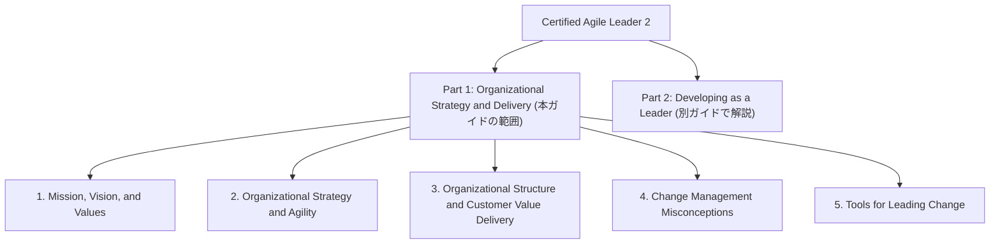

Part 1は大きく「組織はなぜ・どこへ向かうのか（ミッション/ビジョン/戦略）」「組織はどう作られていれば価値を届けられるのか（構造・デリバリー）」「組織をどう変えていくのか（チェンジマネジメント）」という3つの問いに沿って進みます。各トピックは以下の共通フォーマットで解説します。

- **概要**: 何を学ぶトピックか
- **ステップバイステップ解説**: 初学者向けに順を追った理解
- **図解**: Mermaidによるフローチャート
- **ベストプラクティス**: 実務での適用ポイント
- **参考ソース**: 一次情報源のURL

---

## 1. ミッション・ビジョン・バリュー (Mission, Vision, and Values)

### 概要

このトピックでは、ミッション（存在意義）・ビジョン（目指す未来像）・バリュー（行動の拠り所となる価値観）が組織の成功にどうプラスにもマイナスにも作用しうるかを学びます。CAL 2ではこれを、リーダーが自分自身と組織の「Why（なぜ）」を明確にし、それをチームに浸透させる力として位置づけています。この考え方を体系立てて説明する代表的なフレームワークが、リーダーシップ専門家 Simon Sinek が提唱した **Golden Circle（ゴールデンサークル）** です。

### ステップバイステップ解説

**ステップ1: ミッション・ビジョン・バリューを区別する**

| 要素 | 問いかけ | 時間軸 | 具体例のイメージ |
|---|---|---|---|
| ミッション (Mission) | なぜ私たちは存在するのか | 現在・恒久的 | 「顧客の業務を単純化する」 |
| ビジョン (Vision) | 私たちはどこへ向かうのか | 将来・目指す状態 | 「業界標準のプラットフォームになる」 |
| バリュー (Values) | 私たちはどう行動するのか | 常時・判断基準 | 「透明性」「顧客第一」など |

**ステップ2: Golden Circle でWhy・How・Whatを整理する**

Sinekは、真に人を鼓舞するリーダーや組織は「What（何をするか）」からではなく「Why（なぜするか）」から発想し、伝えていると説明しています。<cite index="9-1">彼はこれを「Why、How、What」と名付け、優れたリーダーや組織はすべて同じように考え、行動し、コミュニケーションしており、それは他の大多数と正反対のパターンだと述べています。</cite>

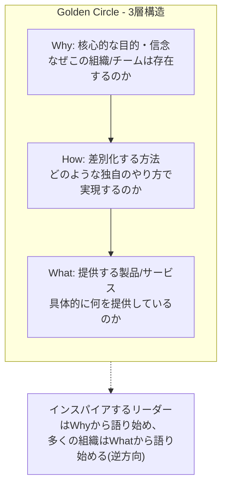

多くの組織は「何を作っているか(What)」から説明を始め、一部だけが「どうやって(How)」まで語り、「なぜ(Why)」を明確に語れる組織はごくわずかだとSinekは指摘しています。<cite index="4-1">彼によれば、人はある組織が「何をするか」を理由に選ぶのではなく「なぜそれをするか」に共感して選ぶのであり、「何をするか」は「何を信じているか」の証明に過ぎません。</cite>

**ステップ3: 組織レベルで実装する**

Golden Circleを組織に導入する際は、次の順序で進めるとよいとされています。

1. Whyを発見する: 経営陣とメンバーを巻き込み、組織が存在する根本的な理由を言語化する
2. Howを定義する: Whyを実現するための独自の戦略・アプローチ・強みを特定する
3. Whatを明確にする: 提供する製品・サービスがWhyと矛盾なく整合していることを確認する

**ステップ4: ポジティブ/ネガティブ両方の影響を理解する**

ミッション・ビジョン・バリューは、明確で行動に落とし込まれていれば意思決定の速度や一体感を高めますが、「額縁に飾られているだけ」で日々の意思決定や評価制度と結びついていない場合は、むしろ社員の不信感やシニシズムを生む逆効果になり得ます。CAL 2ではこの「言行不一致（Values-Behavior Gap）」のリスクを認識することが重要なポイントです。

### ベストプラクティス

- **Whyから逆算して評価制度・採用基準を設計する**: ミッション・バリューを壁に貼るだけでなく、人事評価や意思決定の基準に組み込む
- **リーダー自身がWhyを体現する**: リーダーの言動がバリューと矛盾すると、ミッション・ビジョンそのものへの信頼が失われる
- **Whyは一度作って終わりにしない**: 事業環境の変化に応じて定期的に見直し、チームと対話しながら再確認する
- **採用は「Whatができるか」だけでなく「Whyに共感できるか」で見る**: <cite index="11-1">Sinekは、単に仕事ができるという理由だけで採用した人は報酬のために働くが、自分たちの信念に共感して採用された人は情熱を持って働くと述べています。</cite>
- **理想と現実のギャップを測定する**: 社員サーベイなどで「バリューが実際の意思決定に反映されているか」を定期的に確認する

### 参考ソース

- Simon Sinek公式サイト「The Golden Circle」: https://simonsinek.com/golden-circle
- TED Talk「How great leaders inspire action」: https://www.ted.com/talks/simon_sinek_how_great_leaders_inspire_action
- 書籍『Start with Why: How Great Leaders Inspire Everyone to Take Action』紹介ページ: https://simonsinek.com/books/start-with-why

---

## 2. 組織戦略とアジリティ (Organizational Strategy and Agility)

### 概要

このトピックでは、組織の戦略が「変化の激しい環境下でどれだけ迅速に適応できるか（アジリティ）」にどう影響するかを学びます。CAL1で扱った Business Agility Institute の各ドメインやSAFeのOrganizational Agilityコンピテンシー（既存のCAL1ガイド参照）を土台に、CAL 2ではより実務的に「戦略とその他の組織要素をどう整合させるか」を扱います。ここで中心となるフレームワークが、組織設計理論の第一人者 Jay Galbraith が考案した **Star Model（スターモデル）** です。

### ステップバイステップ解説

**ステップ1: 戦略とアジリティの関係を理解する**

戦略は「何を目指し、どの市場・顧客に、どんな価値を提供するか」という長期的な方向性を定めるものです。<cite index="14-1">Galbraith Star Modelにおいて戦略は方向性を決定する要素と位置づけられ、伝統的にStar Modelの5つの要素の中で最初に取り組むべき要素とされています。</cite>戦略が曖昧だと、組織のどの部分をアジャイルにすべきかも定まらず、部分的な「アジャイルのふりごと(Agile Theater)」に陥りやすくなります。

**ステップ2: Star Modelの5つの構成要素を理解する**

<cite index="13-1">Galbraith Star Modelの5つのカテゴリは、戦略(Strategy)・構造(Structure)・プロセス(Processes)・報酬(Rewards)・人材(People)であり、これらすべてが理想的な組織パフォーマンスのために互いに整合している必要があります。</cite>

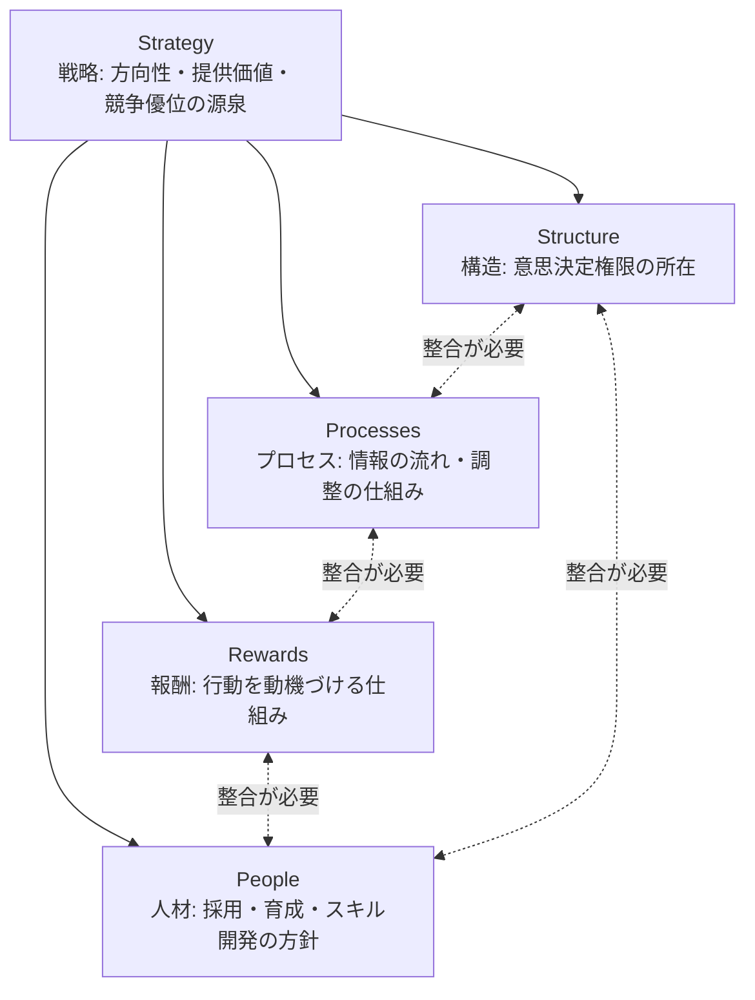

<cite index="17-1">この5つの要素は「レバー」であり、組織設計者がこれらを操作・調整することで組織の振る舞いを形作ることができます。</cite><cite index="16-1">重要なのは、新しい行動を組織に求めるならば単に組織図を書き換えるだけでは不十分だという点で、業務の組み立て方・意思決定の流れ方・評価と報酬の対象・育成するスキルといった「文脈」そのものを変えることで、望ましい行動が自然に選ばれるようにする必要があります。</cite>

**ステップ3: 各要素を診断する**

リーダーは自組織について、以下のような問いを立てて5要素の整合性を診断できます。

| 要素 | 診断の問い |
|---|---|
| Strategy | 提供価値・対象市場・競争優位の源泉は明確か |
| Structure | 意思決定権限は、実際に顧客に近い場所にあるか |
| Processes | 部門横断の情報伝達・調整はスムーズか、どこで滞留するか |
| Rewards | 評価・昇進の基準は、戦略が求める行動と一致しているか |
| People | 必要なスキルを持つ人材を採用・育成できているか |

**ステップ4: アジリティ向上のための戦略的示唆を導く**

5要素のうち1つだけを変えても組織は変わりません。たとえば「アジャイルな組織構造」を導入しても、報酬制度が個人の年次目標達成のみを評価する仕組みのままであれば、チームは協働よりも個人成果を優先し続けます。CAL 2のリーダーは、構造変更を提案する際に必ず報酬・プロセス・人材面への波及も合わせて検討する視点を持つことが求められます。

### ベストプラクティス

- **戦略から着手する**: 構造改革の前に、まず戦略（何を・誰に・どう提供するか）を明文化し関係者で合意する
- **5要素セットで変更を計画する**: 構造だけ、報酬だけといった部分最適な変更は避け、変更が他の要素に及ぼす影響を事前に洗い出す
- **McKinsey 7Sなど関連モデルと併用する**: <cite index="21-1">Galbraith Star Modelは5要素とシンプルだが、ハード要素とソフト要素の両方の整合を確認したい場合はMcKinsey 7-Sモデル（CAL1ガイド参照）と併用すると効果的です。</cite>
- **定期的な棚卸しを行う**: 市場環境や戦略が変化した際は、5要素すべてを再点検するタイミングを組織カレンダーに組み込む
- **過度な複雑化を避ける**: <cite index="21-1">5要素を一斉に変えようとすると実装が複雑化し、リソースを消耗するリスクがあるため、優先順位をつけて段階的に進める</cite>

### 参考ソース

- Jay Galbraith公式サイト「Star Model」: https://jaygalbraith.com/services/star-model/
- Toolshero「Galbraith Star Model」: https://www.toolshero.com/management/jay-galbraiths-star-model/
- Strategic Management Insight「Galbraith's Star Model Explained in Depth」: https://strategicmanagementinsight.com/tools/galbraiths-star-model-explained/
- （関連: CAL1ガイド「Chapter 4: Leading Agile Organizations」内 Business Agility Institute / SAFe Organizational Agility / McKinsey 7Sの解説）

---

## 3. 組織構造と顧客価値提供 (Organizational Structure and Customer Value Delivery)

### 概要

組織の「形」は、それが生み出すシステムやプロダクトの「形」に直接影響します。このトピックでは、組織構造がどのように顧客への価値提供を助けたり妨げたりするかを、**Conway's Law（コンウェイの法則）**、**Team Topologies**、**Value Stream Mapping** という3つのレンズから学びます。

### ステップバイステップ解説

**ステップ1: Conway's Lawを理解する**

<cite index="26-1">Conway's Lawとは、システムを設計する組織はその組織のコミュニケーション構造の複製であるようなデザインを生み出すことを強いられる、という原則で、1967年にコンピュータ科学者Melvin Conwayによって提唱されました。</cite><cite index="26-1">これは製品が機能するためには、その構成部品の作者・設計者同士がコミュニケーションを取り、部品間の互換性を確保する必要があるという理屈に基づいており、結果として技術的なシステム構造は、それを生み出した組織の中でコミュニケーションが難しい社会的な境界線を反映することになります。</cite>

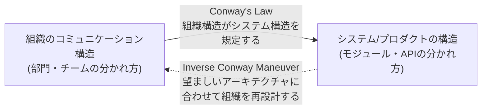

<cite index="28-1">組織構造が部門間の協働を促進しない場合、生まれるソフトウェアはその分断を反映します。例えばフロントエンド・バックエンド・テストの各チームが孤立して動いていれば、プロダクトは統合の悪い疎結合なモジュールの集合になりがちです。</cite>これを逆手に取り、<cite index="28-1">望むアーキテクチャに合わせてチーム構造を意図的に設計し直すアプローチは「Inverse Conway Maneuver（逆コンウェイ作戦）」と呼ばれます。</cite>

**ステップ2: Team Topologiesの4チームタイプを理解する**

Matthew SkeltonとManuel Paisが提唱した Team Topologies は、Conway's Lawを逆手に取って組織を設計するための実践的なパターン言語です。<cite index="36-1">組織内のすべてのチームは、ストリームアラインドチーム(Stream-aligned team)・プラットフォームチーム(Platform team)・イネーブリングチーム(Enabling team)・複雑サブシステムチーム(Complicated-subsystem team)という4つの基本タイプのいずれかに当てはまるとされています。</cite>

| チームタイプ | 役割 | 目安の比率 |
|---|---|---|
| Stream-aligned team | 単一の価値の流れ（プロダクト/サービス/顧客ジャーニー）にエンドツーエンドで責任を持つ主要チーム | <cite index="33-1">組織全体の60〜80%</cite> |
| Platform team | <cite index="32-1">セルフサービスのAPI・ツール・サービスを「内部プロダクト」として提供し、ストリームアラインドチームの認知負荷を下げる</cite> | 状況による |
| Enabling team | <cite index="33-1">他チームが技術的課題を克服し、ベストプラクティスを採用し能力を高めるのを支援する。支援は一時的なものであり、対象チームの自立を目指す</cite> | <cite index="33-1">5〜15%程度</cite> |
| Complicated-subsystem team | <cite index="33-1">高度で専門的なドメイン知識を要する複雑なサブシステムに特化して責任を持つ</cite> | 少数 |

<cite index="36-1">これら4タイプに加えて、協働(Collaboration)・X-as-a-Service・ファシリテーション(Facilitating)という3つのチーム間インタラクションモードが定義されています。</cite>

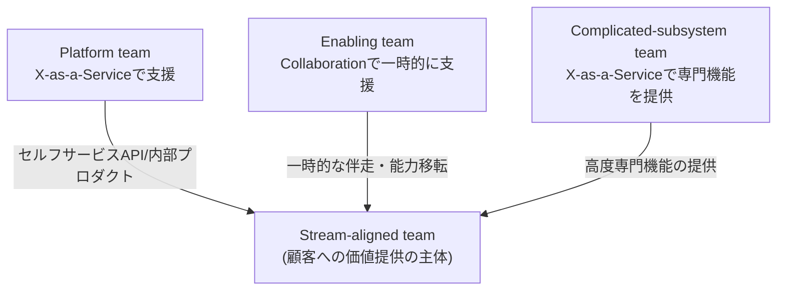

**ステップ3: Value Stream Mapping(VSM)で顧客への流れを可視化する**

<cite index="44-1">バリューストリームとは、顧客のニーズに応えるためにチームや組織が取る一連の活動のことであり、Value Stream Mappingはそれを可視化・分析・改善するプロセスです。</cite><cite index="42-1">各工程を顧客視点で価値を生む(Value-Adding)か価値を生まない(Non-Value-Adding)かに分類し、この外部視点によって組織側の思い込みではなく顧客ニーズに沿った改善を可能にします。</cite>

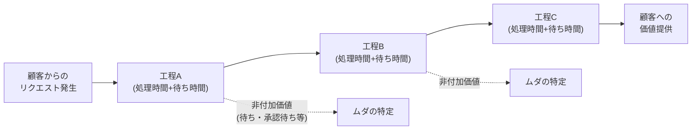

**ステップ4: 3つの視点を組み合わせて組織を評価する**

CAL 2のリーダーは、次の順序で自組織を評価するとよいでしょう。

1. Value Stream Mappingで顧客への価値の流れを可視化し、ボトルネックを特定する
2. そのボトルネックが技術的な問題か、チーム間の連携（＝組織構造）の問題かをConway's Lawの視点で分析する
3. Team Topologiesの4タイプを使って、価値の流れに沿ってチームを再編成する

### ベストプラクティス

- **チームをコンポーネントではなく価値の流れで区切る**: 「DB担当チーム」のような技術コンポーネント単位ではなく、顧客に価値を届けるストリーム単位でチームを構成する
- **Platform teamは「最小限の実行可能なプラットフォーム(Thinnest Viable Platform)」を意識する**: <cite index="37-1">必要以上に厚いプラットフォームを作らず、Wikiページ1枚で足りるならそれで十分とし、開発者体験を第一に考える</cite>
- **Enabling teamの支援は必ず「卒業」を前提にする**: 支援対象チームが自立したら次のチームへ移る、恒久的な依存関係を作らない
- **Inverse Conway Maneuverを意図的に使う**: 望ましいアーキテクチャがあるなら、先にそれに合わせてチーム編成を変える
- **VSMは一度で終わらせず継続的に更新する**: <cite index="40-1">市場や需要の変化に応じて定期的にマップを見直すことで、組織の俊敏性と適応力を維持する</cite>

### 参考ソース

- Wikipedia「Conway's law」: https://en.wikipedia.org/wiki/Conway%27s_law
- Team Topologies公式サイト「Key concepts」: https://teamtopologies.com/key-concepts
- AWS DevOps Guidance「Organize teams into distinct topology types」: https://docs.aws.amazon.com/wellarchitected/latest/devops-guidance/oa.std.1-organize-teams-into-distinct-topology-types-to-optimize-the-value-stream.html
- Atlassian「What is Value Stream Management」: https://www.atlassian.com/agile/value-stream-management
- Planview「What is Value Stream Mapping?」: https://www.planview.com/resources/guide/what-is-value-stream-mapping/

---

## 4. チェンジマネジメントとその誤解 (Change Management and Its Misconceptions)

### 概要

このトピックでは、変革を主導するリーダーが陥りやすい誤解を明らかにし、なぜ「人は変化に抵抗する」という単純化された理解だけでは変革が失敗するのかを学びます。理論的な裏付けとして、Robert KeganとLisa Laheyが提唱した **Immunity to Change（変化への免疫）** モデルを扱います。

### ステップバイステップ解説

**ステップ1: よくある誤解を認識する**

| よくある誤解 | 実際のところ |
|---|---|
| 人は本質的に変化に抵抗する | <cite index="84-1">「抵抗」に見える反応の裏には、変化への関与や納得の機会が不足しているという構造的な問題があることが多い</cite> |
| チェンジマネジメントは特定部門(HRなど)の仕事だ | <cite index="84-1">チェンジマネジメントは部門ではなくリーダーシップのスキルであり、単一部門に任せると変革のスピードが落ちたり定着しなかったりするリスクがある</cite> |
| 発表すれば変化は起きる | <cite index="90-1">公式な発表さえすれば人々は自然と新しい構造や関係性に適応すると考えがちだが、個人的な関係性・慣れ・未知への恐れが根強い心理的な抵抗を生む</cite> |
| コミュニケーションさえ増やせば十分だ | <cite index="86-1">コミュニケーションは重要だが、それだけでは不十分であり、ステークホルダー関与・トレーニング・抵抗マネジメントを含む包括的な戦略が必要</cite> |
| 実装が終われば変革は完了する | <cite index="86-1">変革は実装後も継続的な評価と調整を必要とするプロセスであり、リリースをもって終了するわけではない</cite> |

**ステップ2: 「抵抗」の裏にある心理的メカニズムを理解する**

なぜ人は頭では変化に賛成していても、実際の行動は変わらないのでしょうか。Kegan と Lahey は、これを意志や能力の欠如ではなく、**Immunity to Change（変化への免疫）** という無意識の自己防衛システムで説明しています。<cite index="61-1">変化の失敗の多くは意志力・リソース・情報の不足ではなく、望ましい変化に積極的に反する働きをする隠れた心理的コミットメントによって引き起こされるとされ、これらは怠慢や反抗の表れではなく、アイデンティティ・安定性・有能さへの脅威と本人が感じるものから自分を守る「内なる免疫システム」だと説明されています。</cite>

**ステップ3: 4カラムの「Immunity Map」で可視化する**

<cite index="61-1">Immunity Mapは4つのカラムから構成されます。1列目は本人が本当に達成したいと望んでいる目標、2列目はその目標を妨げている実際の行動(やっていること/やっていないこと)、3列目はその自己矛盾した行動を支えている隠れたコミットメント、4列目はそのコミットメントの土台にある「大きな思い込み(Big Assumption)」です。</cite>

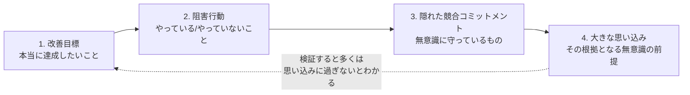

<cite index="59-1">Kegan自身はこの状態を「アクセルを踏みながらブレーキも踏んでいるようなもの」と表現しており、この隠れたブレーキを可視化しない限り、いくら気合や意志力で変わろうとしても遠くへは進めません。</cite>

**ステップ4: リーダーとして誤解を解消する行動を取る**

1. 「抵抗」という言葉でメンバーの反応を一括りにせず、その背後にある個別の懸念や競合コミットメントを尋ねる
2. チェンジマネジメントを自部門の課題として「自分ごと化」し、HRや変革チームに丸投げしない
3. 発表・アナウンスをゴールではなくスタートと捉え、定着までの継続的なフォローを計画する
4. 大きな変革の前に、キーパーソンとImmunity Mapを一緒に作成し、隠れた前提を言語化する場を設ける

### ベストプラクティス

- **「抵抗」を敵視しない**: <cite index="85-1">抵抗がどこから来ているかを理解し、抵抗している側の立場に立ってみることが変化管理の出発点になる</cite>
- **変革を全リーダーの継続的な責務にする**: <cite index="84-1">変化を主導する責任を一部署に閉じ込めず、現場に一番近いリーダー自身がチームを導けるようにする</cite>
- **思い込みは「テスト」できる形に落とし込む**: Immunity Mapで洗い出した大きな思い込みを、小さく安全に検証できるアクションに変換する
- **感情面への配慮を戦略に組み込む**: 論理的な説明だけでなく、失うものへの共感を示すコミュニケーションを設計する
- **完了地点を「実装」ではなく「定着」に置く**: 変革プロジェクトのゴールをリリース日ではなく、行動が習慣化した状態に設定する

### 参考ソース

- CIO.com「4 steps to debunk the change resistance myth」: https://www.cio.com/article/3836602/4-steps-to-debunk-the-change-resistance-myth.html
- MNP「Three misconceptions about change management」: https://www.mnp.ca/en/insights/directory/three-misconceptions-about-change-management-and-how-to-get-past-them
- MindTools「Immunity to Change」: https://www.mindtools.com/a4l75hx/immunity-to-change/
- Humanizing Work「Immunity to Change」: https://www.humanizingwork.com/immunity-to-change/
- BCL Learning Library「Immunity to Change Model」: https://bcltraining.com/learning-library/immunity-to-change-model/
- 書籍: Kegan, R., & Lahey, L. L. (2009). *Immunity to Change: How to Overcome It and Unlock Potential in Yourself and Your Organization.* Harvard Business Press.

---

## 5. 変革をリードするためのツール (Tools for Leading Change)

### 概要

前トピックで「なぜ変化は難しいのか」を理解した上で、このトピックでは実際に変革を推進するための代表的なツール・フレームワークを学びます。CAL 2で扱う3つの主要フレームワークは、それぞれ異なる視点から変革を捉えています。**Kotterの8ステップ**は組織レベルの変革プロセス、**ADKAR**は個人レベルの変化の積み上げ、**Bridgesの移行モデル**は変化に伴う心理的な移行過程に焦点を当てます。

### ステップバイステップ解説

**ステップ1: Kotterの8ステップ・プロセスを理解する**

<cite index="67-1">Kotterの変革モデルの8ステップは、危機意識を高める・強力な推進チームを結成する・戦略的なビジョンを形成する・ビジョンを伝達する・行動の障壁を取り除く・短期的な成果を生み出す・勢いを維持する・変革を組織文化に定着させる、という順序で構成されています。</cite>

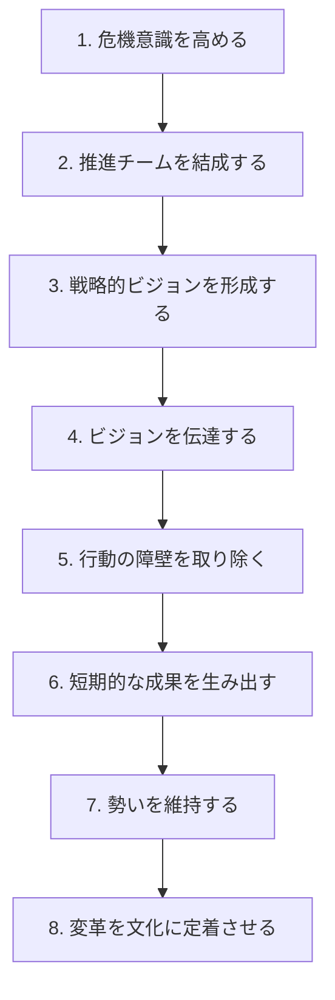

<cite index="74-1">このモデルは1995年のHarvard Business Review論文と1996年の書籍『Leading Change』で発表されたもので、変革が失敗する事例の分析から生まれています。危機意識の欠如・推進チームの不在・ビジョンの欠如や独占・早すぎる勝利宣言といった、繰り返し観察された失敗パターンを裏返す形で8つのステップが組み立てられています。</cite>

**ステップ2: Prosci ADKARモデルを理解する**

<cite index="76-1">Prosci ADKARモデルは、個人を中心に据えた実践的な変革管理フレームワークであり、変化が定着するために一人ひとりが通過すべき5つの要素(Awareness=変化の必要性の認識、Desire=参加し支持する意欲、Knowledge=変化の仕方に関する知識、Ability=新しいスキルや行動を適用する能力、Reinforcement=成果を持続させる強化)を定義しています。</cite>

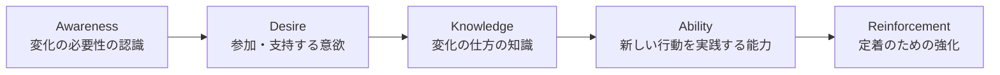

<cite index="76-1">ADKARの重要な原則は「バリアポイント」であり、進捗は最も不足している要素によって制限されます。あるグループにDesireが不足しているなら、いくらKnowledgeの研修を積んでも効果はありません。</cite>実務者はまずどの要素がボトルネックになっているかを診断してから、対応する施策を打つ必要があります。

**ステップ3: Bridgesの移行モデル(Transition Model)を理解する**

<cite index="48-1">Bridgesの移行モデルは、変化を経験する人間の心理的な旅路に焦点を当て、Ending(終わらせる・手放す)・Neutral Zone(中間の混乱期)・New Beginning(新たな始まり)という3段階で構成されています。William Bridgesは「Change(変化)」を外的・状況的な出来事、「Transition(移行)」を内的・心理的なプロセスとして明確に区別しており、変化は人に対して起こるものであるのに対し、移行は人の内側で起こるものだとしています。</cite>

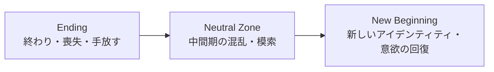

<cite index="49-1">リーダーが陥りやすい失敗は、Endingの段階を飛ばしていきなりNew Beginningへ移行しようとすることであり、これは抵抗・苦痛・部分的にしか効果のない変革につながりやすいとされています。</cite>一方でNeutral Zoneは<cite index="49-1">不快な段階である一方、大きな創造性・革新・刷新の機会にもなり得る</cite>ため、リーダーはこの時期こそ丁寧な伴走を行うべきとされています。

**ステップ4: 3つのフレームワークを組み合わせて使う**

これら3つは競合するものではなく、互いに補完し合う関係にあります。

| フレームワーク | 焦点 | 単位 | 主な問い |
|---|---|---|---|
| Kotterの8ステップ | 組織の変革プロセス全体の順序 | 組織 | 変革をどんな順序で進めるか |
| ADKAR | 個人が変化を受け入れるまでの積み上げ | 個人 | どこで足踏みしている人が多いか |
| Bridgesの移行モデル | 変化に伴う心理的な移行過程 | 個人の内面 | 今どの心理段階にいるか、何を手放す必要があるか |

<cite index="74-1">実務では、Kotterで変革の全体シーケンスを設計し、ADKARで個人・グループごとの導入状況を診断し、Bridgesで感情面のケアを行うという組み合わせがよく用いられます。</cite>

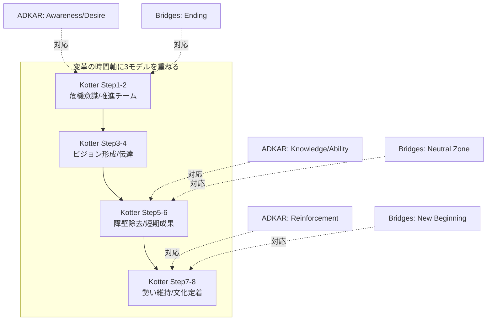

### ベストプラクティス

- **単一フレームワークに固執しない**: 組織構造のシーケンス(Kotter)、個人の受容状況(ADKAR)、感情の移行(Bridges)を目的に応じて使い分ける
- **バリアポイントを診断してから施策を打つ**: ADKARで「今どこで詰まっているか」を確認せずに研修(Knowledge施策)ばかり増やすのは非効率
- **Endingを飛ばさない**: 新しい体制の説明に急ぐ前に、失われるもの・変わるものを明確に認め、喪失感をケアする時間を取る
- **短期的な成果(Kotter Step 6)を意図的に設計する**: 早期の小さな成功を可視化し、勢いを維持する
- **文化への定着(Kotter Step 8, ADKAR Reinforcement)を計画に組み込む**: 変革プロジェクトの「完了」を、評価制度やルーティンに組み込まれた時点と定義する

### 参考ソース

- Kotter Inc.公式サイト「The 8-Step Process for Leading Change」: https://www.kotterinc.com/methodology/8-steps/
- Mutomorro「Kotter's 8 Step Change Model」: https://mutomorro.com/tools/kotters-8-step-change-model
- Prosci公式サイト「The Prosci ADKAR Model」: https://www.prosci.com/methodology/adkar
- Umbrex「Prosci ADKAR Model」: https://umbrex.com/resources/frameworks/organization-frameworks/prosci-adkar-model-awareness-desire-knowledge-ability-reinforcement/
- William Bridges Associates公式サイト「What is Transition?」: https://wmbridges.com/about/what-is-transition/
- Which Framework「Bridges' Transition Model」: https://whichframework.org/frameworks/bridges-transition-model.html

---

## まとめと参考文献一覧

### Part 1の全体像

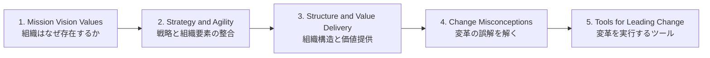

Part 1を貫く流れは、「組織はなぜ存在し、どこへ向かうのか(1)」を明確にし、「その戦略を実現できるよう組織の各要素を整合させ(2)」、「顧客への価値提供を最大化する構造に設計し(3)」、「そこへ至る変革を、誤解に陥らず(4)、適切なツールを使って(5)導く」という一連のリーダーシップの流れです。CAL 2 Part 2「Developing as a Leader」では、この組織レベルの話から個人のリーダーシップ開発(自己成長の壁、パーソナライズされたリーダーシップスタイル、困難な会話、フィードバック、委任と意思決定)へと視点が移ります。

### 参考文献一覧 (URL)

| # | トピック | ソース | URL |
|---|---|---|---|
| 1 | CAL2公式カリキュラム | Scrum Alliance | https://www.scrumalliance.org/get-certified/agile-leader-track/cal-2 |
| 2 | CAL1(前提資格) | Scrum Alliance | https://www.scrumalliance.org/get-certified/agile-leader/cal-1 |
| 3 | Golden Circle | Simon Sinek公式 | https://simonsinek.com/golden-circle |
| 4 | Start with Why (TED Talk) | TED | https://www.ted.com/talks/simon_sinek_how_great_leaders_inspire_action |
| 5 | Start with Why (書籍) | Simon Sinek公式 | https://simonsinek.com/books/start-with-why |
| 6 | Star Model | Jay Galbraith公式 | https://jaygalbraith.com/services/star-model/ |
| 7 | Star Model 解説 | Toolshero | https://www.toolshero.com/management/jay-galbraiths-star-model/ |
| 8 | Star Model 詳細解説 | Strategic Management Insight | https://strategicmanagementinsight.com/tools/galbraiths-star-model-explained/ |
| 9 | Conway's Law | Wikipedia | https://en.wikipedia.org/wiki/Conway%27s_law |
| 10 | Team Topologies Key Concepts | Team Topologies公式 | https://teamtopologies.com/key-concepts |
| 11 | Team Topologies 組織設計適用 | AWS DevOps Guidance | https://docs.aws.amazon.com/wellarchitected/latest/devops-guidance/oa.std.1-organize-teams-into-distinct-topology-types-to-optimize-the-value-stream.html |
| 12 | Value Stream Management | Atlassian | https://www.atlassian.com/agile/value-stream-management |
| 13 | Value Stream Mapping ガイド | Planview | https://www.planview.com/resources/guide/what-is-value-stream-mapping/ |
| 14 | チェンジマネジメントの誤解 | CIO.com | https://www.cio.com/article/3836602/4-steps-to-debunk-the-change-resistance-myth.html |
| 15 | チェンジマネジメントの誤解 | MNP | https://www.mnp.ca/en/insights/directory/three-misconceptions-about-change-management-and-how-to-get-past-them |
| 16 | Immunity to Change | MindTools | https://www.mindtools.com/a4l75hx/immunity-to-change/ |
| 17 | Immunity to Change 解説 | Humanizing Work | https://www.humanizingwork.com/immunity-to-change/ |
| 18 | Immunity to Change Model | BCL Learning Library | https://bcltraining.com/learning-library/immunity-to-change-model/ |
| 19 | Kotterの8ステップ | Kotter Inc.公式 | https://www.kotterinc.com/methodology/8-steps/ |
| 20 | Kotterの8ステップ 詳細 | Mutomorro | https://mutomorro.com/tools/kotters-8-step-change-model |
| 21 | ADKARモデル | Prosci公式 | https://www.prosci.com/methodology/adkar |
| 22 | ADKARモデル 詳細解説 | Umbrex | https://umbrex.com/resources/frameworks/organization-frameworks/prosci-adkar-model-awareness-desire-knowledge-ability-reinforcement/ |
| 23 | Bridgesの移行モデル | William Bridges Associates公式 | https://wmbridges.com/about/what-is-transition/ |
| 24 | Bridgesの移行モデル 解説 | Which Framework | https://whichframework.org/frameworks/bridges-transition-model.html |

> **注記**: 本ガイドはCAL 2の学習を補助する非公式資料です。正式な学習目標(Learning Objectives)や試験範囲は、認定トレーナーが提供する公式コースおよびScrum Alliance公式サイトを必ず確認してください。
