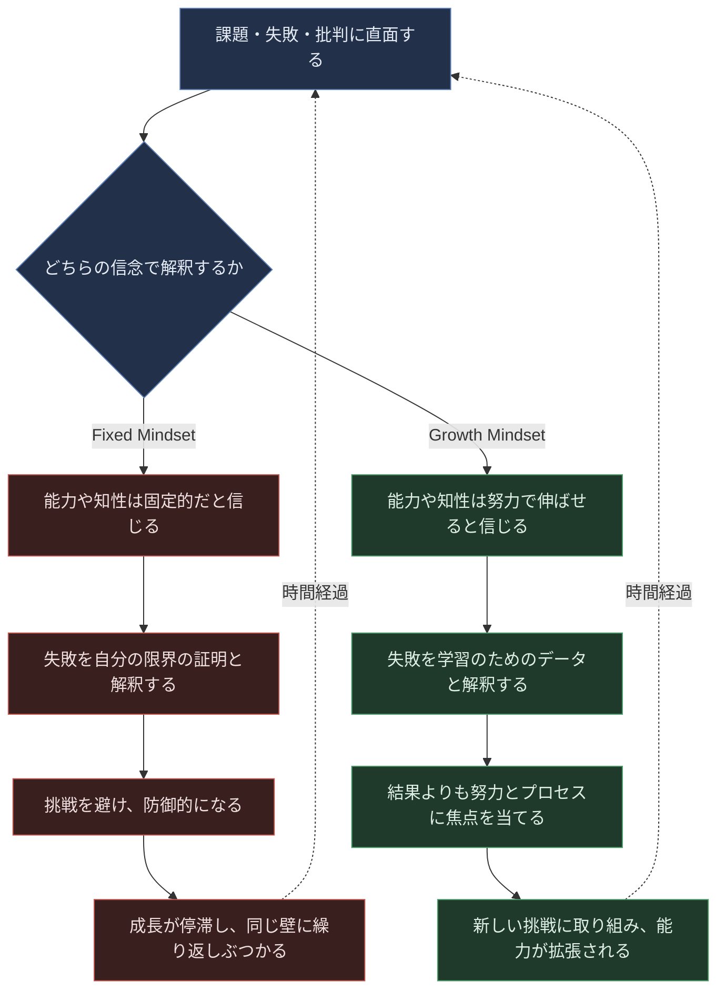
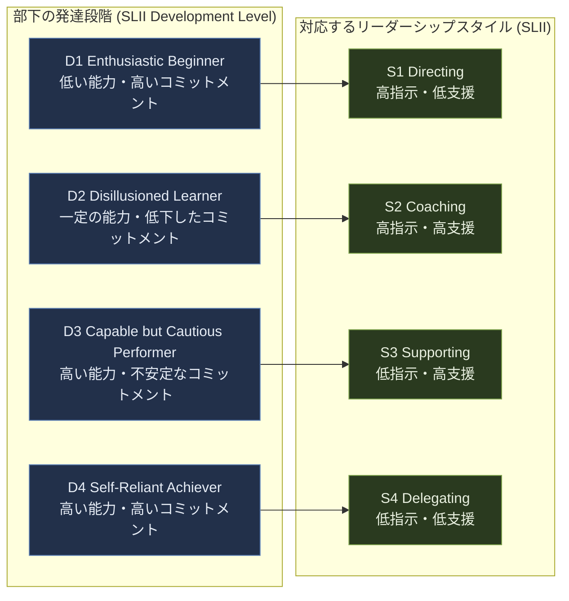
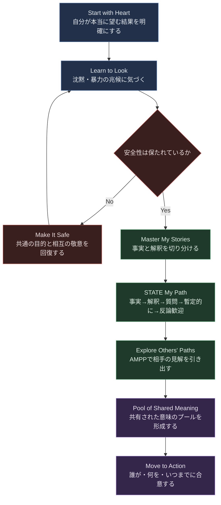
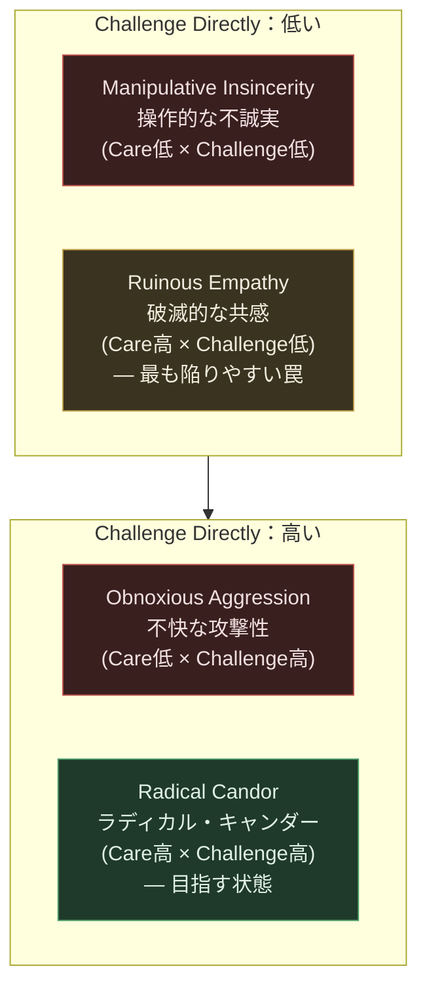
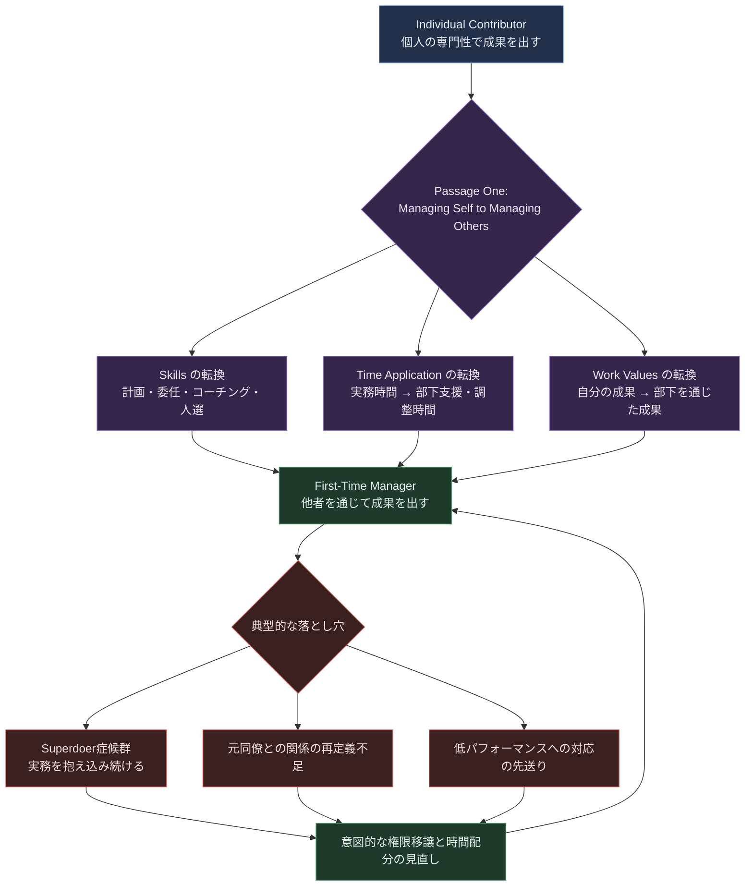
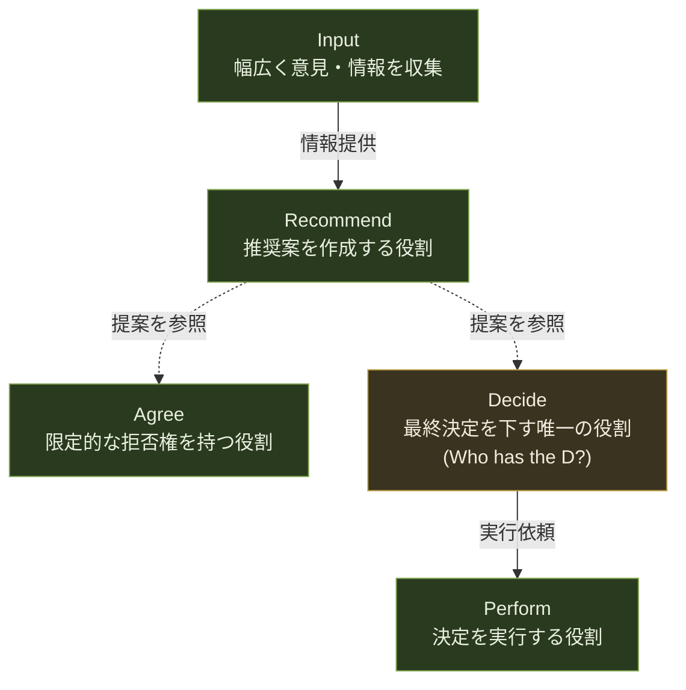

# Certified Agile Leader® 2 (CAL 2™) 学習ガイド

## Part 2: Developing as a Leader（リーダーとしての成長）

> 本ガイドは Scrum Alliance 公式ページ（[CAL 2 - Certified Agile Leader 2](https://www.scrumalliance.org/get-certified/agile-leader-track/cal-2)）に掲載されている公式カリキュラムの **Part 2「Developing as a Leader」** を、初学者向けにステップバイステップで詳しく解説するものです。
>
> CAL2 の公式カリキュラムは2部構成で、Part 1「Organizational Strategy and Delivery」は別ファイル（[Cal2-part1-organizational-strategy-and-delivery.md](./Cal2-part1-organizational-strategy-and-delivery.md)）で扱っています。本ガイドはその続編にあたり、CAL1（4章構成）と CAL2 Part1 で学んだ内容を土台に、**「組織を動かす前に、まず自分自身がどう成長し、どう振る舞うリーダーであるか」** を扱います。
>
> 公式サイトの説明によれば、CAL2 全体は次の3領域を学びます：**Organizational structure and design（組織構造と設計）**、**Value and metrics（価値とメトリクス）**、そして本ガイドが扱う **Leadership competencies（リーダーシップコンピテンシー）** ＝「自分自身のリーダーシップ開発に焦点を当て、人々をエンパワーし、チームダイナミクスを改善し、組織の成果を達成できるようになること」です。

---

## 目次

1. [本ガイドの位置づけと学習目標](#0-本ガイドの位置づけと学習目標)
2. [2.1 個人の成長を阻む障壁を乗り越える（Overcoming Obstacles to Growth）](#21-個人の成長を阻む障壁を乗り越えるovercoming-obstacles-to-growth)
3. [2.2 自分自身のリーダーシップスタイルを確立する（Developing a Personalized Leadership Approach）](#22-自分自身のリーダーシップスタイルを確立するdeveloping-a-personalized-leadership-approach)
4. [2.3 困難な対話を乗りこなす（Difficult Conversations）](#23-困難な対話を乗りこなすdifficult-conversations)
5. [2.4 フィードバックを与え、受け取る（Giving and Receiving Feedback）](#24-フィードバックを与え受け取るgiving-and-receiving-feedback)
6. [2.5 メンバーマネジメントの課題を乗り越える（Challenges of Managing People）](#25-メンバーマネジメントの課題を乗り越えるchallenges-of-managing-people)
7. [2.6 権限移譲と意思決定（Delegation and Decision-Making）](#26-権限移譲と意思決定delegation-and-decision-making)
8. [まとめ：Part 2 フレームワーク統合マップ](#まとめpart-2-フレームワーク統合マップ)
9. [用語集](#用語集)
10. [参考文献・ソース一覧](#参考文献ソース一覧)

---

## 0. 本ガイドの位置づけと学習目標

### 0.1 CAL2 公式カリキュラムにおける Part 2 の位置づけ

Scrum Alliance の公式ページでは、CAL2 のコースは次の2セクションで構成されると明記されています。

| セクション | 主題 | 本ガイドでの扱い |
|---|---|---|
| Part 1: Organizational Strategy and Delivery | ミッション・ビジョン・価値観、組織戦略とアジリティ、組織構造と顧客価値提供、チェンジマネジメントの誤解、変革を導くツール | 別ファイルで解説済み |
| **Part 2: Developing as a Leader** | **個人の成長、パーソナライズされたリーダーシップ、困難な対話、フィードバック、人材マネジメントの課題、権限移譲と意思決定** | **本ガイドで解説** |

公式サイトの記載を要約すると、Part 2 の学習項目は次の6つです（[出典: Scrum Alliance CAL2 公式ページ](https://www.scrumalliance.org/get-certified/agile-leader-track/cal-2)）。

1. Overcome common obstacles to personal growth（個人の成長を阻む一般的な障壁を克服する）
2. Develop your personalized leadership approach（自分自身のリーダーシップアプローチを開発する）
3. Communicate strategies during difficult conversations（困難な対話における伝え方の戦略）
4. Deliver and receive feedback（フィードバックを与え、受け取る）
5. Understand challenges leaders face when managing people and approaches to overcoming those challenges（リーダーが人材マネジメントで直面する課題とその克服アプローチを理解する）
6. Discover how collaborative leaders handle delegation and decision-making（コラボレーティブなリーダーがどのように権限移譲と意思決定を扱うかを知る）

> **補足**：詳細な学習目標（Learning Objectives）は Scrum Alliance が [Google Drive上のPDF](https://drive.google.com/file/d/1-KC20bAHmYfPWXJ8IMmkXsoTxYuxa6mG/view?usp=drive_link) として公開していますが、これはトレーナー・受講者向けの内部資料であり、認定コース受講前に内容が変更される可能性があります。本ガイドは公式Webページの記述と、各フレームワークの一次情報源（原著・提唱組織の公式サイト）に基づいて構成しています。

### 0.2 このガイドの読み方

CAL1 で学んだ「チームを率いる（Leading Agile Teams）」「組織を率いる（Leading Agile Organizations）」というスキルは、あくまで**他者や組織に向けた**リーダーシップでした。CAL2 Part 2 はその前提として、**リーダー自身の内面的な成長・スタイル・対話力・判断力**を扱います。各セクションは以下の共通フォーマットで構成されています。

- **概要**：何を学ぶか、なぜ重要か
- **ステップバイステップ解説**：実務でどう使うか
- **図解（Mermaid）**：構造を可視化
- **ベストプラクティス**：現場での適用のコツ
- **参考文献・ソース**：一次情報源へのリンク

---

## 2.1 個人の成長を阻む障壁を乗り越える（Overcoming Obstacles to Growth）

### 2.1.1 概要

アジャイルリーダーは、他者の成長を支援する前に、自分自身がどのように学び、失敗から回復し、挑戦し続けるかを理解している必要があります。CAL2 Part 2 の最初のテーマは、**自分の成長を止めているのは何か** を明らかにすることです。

ここで中核となるのが、スタンフォード大学の心理学者 **Carol Dweck** が提唱した **Growth Mindset（成長マインドセット）** と **Fixed Mindset（固定マインドセット）** の概念です。Dweck の研究によれば、人は「能力や知性は生まれつき固定されている」と考える固定マインドセットか、「能力や知性は努力によって伸ばせる」と考える成長マインドセットのどちらかの傾向を持ち、これが挑戦への向き合い方、失敗からの立ち直り方、そして最終的な成果に大きな影響を与えます（[出典: Harvard Business School Online](https://online.hbs.edu/blog/post/growth-mindset-vs-fixed-mindset)）。

また、CAL2 Part 1 で学んだ **Kegan & Lahey の Immunity to Change（変化への免疫）** の考え方もここで再登場します。「変わりたいのに変われない」のは意志の弱さではなく、変化を妨げる**無意識の裏の目標（competing commitment）**が存在するからだ、という視点は、組織変革だけでなく個人の成長にもそのまま当てはまります。

### 2.1.2 ステップバイステップ解説

1. **自分のデフォルトの反応パターンに気づく**
   困難な課題、批判、他者の成功を目にしたときに、自分がどう反応しがちかを観察します。「これは自分には向いていない」「才能がある人にはかなわない」といった思考が浮かぶなら、それは固定マインドセットのシグナルです。

2. **トリガーとなる場面を特定する**
   固定マインドセットが顔を出しやすい具体的な状況（例：新しい技術領域への挑戦、公開の場でのフィードバック、自分より若いメンバーの活躍）をリストアップします。

3. **"Not Yet"（まだできていないだけ）という言葉を導入する**
   「私にはこれができない」を「私にはこれが**まだ**できていない」に置き換える練習をします。これは単なる言葉遊びではなく、失敗を「固定された能力の証明」ではなく「学習の途中経過」として再解釈するための思考の型です。

4. **Immunity to Change マップで裏の目標を可視化する**（CAL2 Part1 参照）
   「成長したい」という改善目標に対して、実際には無意識にそれを妨げる行動を取っていないか、その裏にどんな「裏の目標」と「強力な思い込み」があるかを書き出します。例えば「もっと権限移譲したい」という目標の裏に「自分が手を離すと信頼を失う」という思い込みが隠れているケースなどです。

5. **小さな実験から始める**
   マインドセットを変えるのは一夜では不可能です。リスクの低い場面で「まだできていないことに挑戦する」小さな実験を重ね、結果を観察します。

6. **フィードバックループを作り、振り返る**
   実験の結果を定期的に振り返り、何が学べたか、次にどう調整するかを言語化する習慣を持ちます。これは 2.4 で扱うフィードバック文化とも密接に関係します。

### 2.1.3 図解：Fixed Mindset と Growth Mindset の分岐

### 2.1.4 ベストプラクティス

- **努力・プロセスを称賛し、固定的な能力を称賛しない**：「頭がいいね」ではなく「粘り強く試行錯誤したね」と伝える。これはメンバーへのフィードバックにも、自分自身への内的対話にも当てはまります。
- **失敗を「データ」として扱う言語を組織に導入する**：CAL1 で学んだ心理的安全性（Google Project Aristotle）の土台の上に、失敗を学習機会として扱う語彙（例：ふりかえりでの「実験」「仮説」という言葉遣い）を根付かせる。
- **"Not Yet" を自分とチームの両方に適用する**：個人の成長だけでなく、チームの能力開発の会話でも使う。
- **Immunity to Change マップを定期的に見直す**：一度書いて終わりにせず、四半期ごとなど定期的に「裏の目標」が変化していないか確認する。
- **リーダー自身が弱さ・学習過程を見せる（Model vulnerability）**：リーダーが「まだ学んでいる最中だ」と率直に語ることで、メンバーも安心して挑戦できる文化が生まれます。
- **小さく安全な実験から始める**：いきなり大きな挑戦をするのではなく、失敗してもリスクの低い場で新しい行動を試す。

### 2.1.5 参考文献・ソース

- Dweck, C. (2006). *Mindset: The New Psychology of Success*. Random House.
- Harvard Business School Online — [Growth Mindset vs. Fixed Mindset: What's the Difference?](https://online.hbs.edu/blog/post/growth-mindset-vs-fixed-mindset)
- MindTools — [Dweck's Fixed and Growth Mindsets](https://www.mindtools.com/asbakxx/dwecks-fixed-and-growth-mindsets/)
- Kegan, R., & Lahey, L. L. (2009). *Immunity to Change*. Harvard Business Press.（詳細は [Cal2-part1-organizational-strategy-and-delivery.md](./Cal2-part1-organizational-strategy-and-delivery.md) を参照）

---

## 2.2 自分自身のリーダーシップスタイルを確立する（Developing a Personalized Leadership Approach）

### 2.2.1 概要

「唯一の正しいリーダーシップスタイル」は存在しません。CAL2 Part 2 のこのテーマでは、**状況（部下の発達段階）に応じてスタイルを切り替える** という考え方を中心に学びます。ここで使う代表的な2つのフレームワークが、**Situational Leadership® II（SLII®）**（Paul Hersey と Ken Blanchard が開発し、その後 Blanchard が発展させたモデル）と、**Daniel Goleman の Six Leadership Styles（6つのリーダーシップスタイル）** です。

SLII® は、部下の「発達段階（Development Level）」を診断し、それに応じて「指示」と「支援」の配分を変えるという考え方です。Ken Blanchard Companies の公式解説によれば、この考え方の根底には「人は成長したい・成長できると信じている」という前提があり、唯一最良のリーダーシップスタイルは存在しないとされています（[出典: Blanchard 公式](https://resources.blanchard.com/blanchard-leaderchat/a-situational-approach-to-effective-leadership)）。

一方 Goleman は、感情的知性（Emotional Intelligence）研究に基づき、リーダーが使い分けるべき **6つのスタイル**（Coercive/Commanding、Authoritative/Visionary、Affiliative、Democratic、Pacesetting、Coaching）を提示しました。3,000人超の管理職の調査から、最も効果的なリーダーは1つのスタイルに固執せず、状況に応じて複数のスタイルを使い分けていることが分かっています（[出典: HBR "Leadership That Gets Results"](https://hbr.org/2000/03/leadership-that-gets-results)）。

### 2.2.2 ステップバイステップ解説

1. **自分のデフォルトスタイルへの自己認識を持つ**
   まず、自分が無意識に頼りがちなリーダーシップスタイル（Goleman の6分類のどれに近いか）を把握します。

2. **タスクごとに部下の発達段階（D-Level）を診断する**
   SLII® では、部下は「人」としてではなく「特定のタスク・目標に対して」発達段階が異なると考えます。診断軸は「Competence（能力）」と「Commitment（コミットメント・意欲）」の2つです。
   - **D1: Enthusiastic Beginner**（低い能力・高いコミットメント）
   - **D2: Disillusioned Learner**（一定の能力があるが、コミットメントが低下）
   - **D3: Capable but Cautious Performer**（能力はあるが、自信やコミットメントが不安定）
   - **D4: Self-Reliant Achiever**（高い能力・高いコミットメント）

3. **発達段階に対応するリーダーシップスタイルを選ぶ**
   - **S1: Directing（指示型）** — 高指示・低支援。D1 に対応。
   - **S2: Coaching（コーチ型）** — 高指示・高支援。D2 に対応。
   - **S3: Supporting（支援型）** — 低指示・高支援。D3 に対応。
   - **S4: Delegating（委任型）** — 低指示・低支援。D4 に対応。

4. **Goleman の6スタイルを状況の温度感に応じて切り替える**
   - **Coercive/Commanding**：危機対応など即時の服従が必要な場面。多用すると組織の雰囲気を著しく悪化させる。
   - **Authoritative/Visionary**：方向性を示し「一緒に来てほしい」と伝える。最も一貫してポジティブな効果を持つとされる。
   - **Affiliative**：人を最優先し、信頼関係とチームの調和を作る。
   - **Democratic**：合意形成を通じてコミットメントを引き出す。
   - **Pacesetting**：自ら高い基準を示し追随を求める。多用すると疲弊を招きやすい。
   - **Coaching**：長期的な成長支援に焦点を当てる。

5. **同一人物でもタスクによってスタイルを変える**
   ベテランメンバーでも、未経験の新領域に挑戦するときは D1〜D2 になり得ます。「あの人はいつも自立している」という固定観念を捨て、タスクごとに再診断します。

6. **継続的にキャリブレーション（再調整）する**
   1on1などの場で、部下自身が今どのレベルにいると感じているかを一緒に確認し、リーダー側の認識とズレがないかすり合わせます。

### 2.2.3 図解：発達段階とリーダーシップスタイルのマッチング

### 2.2.4 ベストプラクティス

- **「人」ではなく「タスク」に対して発達段階を診断する**：同じ人でもタスクごとにD-Levelは変わります。
- **Goleman の6スタイルを週単位で複数使い分ける**：研究上、最も高い成果を出すリーダーは1つのスタイルに依存していません。
- **Coercive/Pacesetting は短期・限定的に**：組織の雰囲気に負の影響を与えやすいため、危機対応や専門性の高いチームへの限定利用にとどめる。
- **Visionary（Authoritative）・Coaching・Affiliative・Democratic を基本の主軸にする**：長期的な組織風土への好影響が確認されているスタイル群です。
- **定期的にD-Levelのすり合わせを行う**：1on1で「このタスクについて、今どのくらい自信がありますか」と直接尋ねる。
- **自分の「快適ゾーン」を自覚する**：無意識に頼りがちなスタイルを自覚し、意図的に他のスタイルも練習する。

### 2.2.5 参考文献・ソース

- Blanchard 公式 — [A Situational Approach to Leadership | Blanchard's SLII](https://resources.blanchard.com/blanchard-leaderchat/a-situational-approach-to-effective-leadership)
- The Center for Leadership Studies — [The History of the Situational Leadership® Framework](https://situational.com/blog/the-history-of-the-situational-leadership-framework/)
- Goleman, D. (2000). "Leadership That Gets Results." *Harvard Business Review*, March-April 2000. — [HBR 公式](https://hbr.org/2000/03/leadership-that-gets-results)
- Hersey, P., & Blanchard, K. (1982). *Management of Organizational Behavior: Utilizing Human Resources*.

---

## 2.3 困難な対話を乗りこなす（Difficult Conversations）

### 2.3.1 概要

リーダーシップの実務において最も避けられがちなのが「困難な対話」です。CAL2 Part 2 では、これを体系的に扱うフレームワークとして **Crucial Conversations**（Kerry Patterson、Joseph Grenny、Ron McMillan、Al Switzler らによって開発され、現在は Crucial Learning 社が提供）を用います。

Crucial Conversations は「クルーシャル（決定的）な対話」を「**利害関係が大きく（stakes are high）、意見が対立し（opinions vary）、感情が強く動く（emotions run strong）** 会話」と定義します（[出典: Manager Tools による要約](https://www.manager-tools.com/forums/crucial-conversations)）。このフレームワークの核心は、**対話の質がそのまま人生・キャリア・組織の成果の質を決める** という前提のもと、感情が高ぶった状況でも「対話（dialogue）」を維持し続けるための具体的なスキルセットを提供する点にあります。

### 2.3.2 ステップバイステップ解説

Crucial Conversations の手法は、大きく「対話に入る前の準備」と「対話中の実践」に分かれます。

1. **Start with Heart（自分の本心から始める）**
   対話に入る前に「自分は本当は何を望んでいるのか」「相手・関係性・自分自身にとって何を望んでいるのか」を明確にします。「相手を言い負かしたい」という衝動と「良い結果を得たい」という本当の目的を混同しないようにします。

2. **Learn to Look（兆候に気づく）**
   会話が「クルーシャル」な状態に入った兆候（沈黙：話すのをやめる／防御的になる、または 暴力：相手を圧倒しようとする・感情的に攻撃する）を、自分自身とその場全体の両方で観察します。

3. **Make It Safe（安全を作る）**
   対話が脱線し始めたら、内容そのものより先に「心理的安全」を回復させます。**Mutual Purpose（共通の目的）** と **Mutual Respect（相互の敬意）** が失われていないかを確認し、必要であれば一旦本題から離れて安全を再構築します。

4. **Master My Stories（自分のストーリーを制御する）**
   人は事実を観察した瞬間に、無意識に「解釈（ストーリー）」を付け加えます。「彼は私を無視した」という解釈と、「彼は会議中に3回私の発言に応答しなかった」という事実を意識的に切り分けます。

5. **STATE My Path（自分の考えを伝える）**
   自分の見解を安全に伝えるための頭字語です。
   - **S**hare your facts（事実を共有する）
   - **T**ell your story（自分の解釈を伝える）
   - **A**sk for others' paths（相手の見解を尋ねる）
   - **T**alk tentatively（断定せず、暫定的に話す）
   - **E**ncourage testing（反論を歓迎する）

6. **Explore Others' Paths（相手の見解を引き出す）**
   **AMPP**（Ask：尋ねる、Mirror：感情を映し返す、Paraphrase：言い換えて確認する、Prime：呼び水を出す）を使って、相手が安心して本音を話せるようにします。

7. **Move to Action（行動へつなげる）**
   対話の最後に「誰が」「何を」「いつまでに」行うかを明確にし、フォローアップの方法を合意します（2.6 の RAPID の Perform とも接続します）。

### 2.3.3 図解：Crucial Conversations のダイアログサイクル

### 2.3.4 ベストプラクティス

- **クルーシャルな対話を早期に認識する**：利害・意見の相違・感情の強さの3条件が揃った瞬間に、通常の会話モードから切り替える。
- **自分の中の沈黙・暴力のシグナルに気づく**：話すのをやめる／皮肉を言う／相手を説得しようと圧をかける、といった自分の癖を事前に把握しておく。
- **事実とストーリーを分けてから話す**：感情的になる前に「観察できた事実は何か」を一度書き出す習慣をつける。
- **断定的な言い方を避ける**：「あなたは〜だ」ではなく「私には〜のように見えたのですが、どうでしたか」と暫定的に話す。
- **Pool of Shared Meaning を先に作ってから結論を出す**：結論を急がず、双方の情報・見解が出揃うまで対話を続ける。
- **対話の最後は必ず行動の合意で締める**：「良い話し合いだった」で終わらせず、具体的な次のアクションと期限を確認する。

### 2.3.5 参考文献・ソース

- Patterson, K., Grenny, J., McMillan, R., Switzler, A., & Gregory, E. (2021). *Crucial Conversations: Tools for Talking When Stakes Are High* (3rd ed.). McGraw-Hill.
- Crucial Learning 公式 — [Crucial Conversations - Free Book Resources](https://cruciallearning.com/books/crucial-conversations-book/)
- Crucial Learning 公式ブログ — [Crucial Learning Blog](https://www.cruciallearning.com/blog/)
- Manager Tools — [Crucial Conversations（書籍要約）](https://www.manager-tools.com/forums/crucial-conversations)

---

## 2.4 フィードバックを与え、受け取る（Giving and Receiving Feedback）

### 2.4.1 概要

CAL1 の Chapter 3 では、**CCL（Center for Creative Leadership）の SBI（Situation-Behavior-Impact）モデル** を学びました。CAL2 Part 2 ではこれをさらに発展させ、**Kim Scott の Radical Candor（ラディカル・キャンダー）** というフィードバックの「姿勢・文化」に関するフレームワークと組み合わせます。

Radical Candor は、フィードバックを **Care Personally（相手を個人として気にかける）** と **Challenge Directly（率直に挑戦する・指摘する）** という2つの軸で捉える2×2モデルです。この2軸が共に高い状態が「Radical Candor」であり、そこから外れると次の3つの機能不全パターンに陥ります（[出典: Radical Candor 公式](https://www.radicalcandor.com/our-approach)）。

- **Ruinous Empathy（破滅的な共感）**：Care は高いが Challenge が低い。優しさのつもりが、相手の成長機会を奪う。多くのマネージャーが最も陥りやすいパターンとされます。
- **Obnoxious Aggression（不快な攻撃性）**：Challenge は高いが Care が低い。率直だが人間味に欠ける。
- **Manipulative Insincerity（操作的な不誠実）**：Care も Challenge も低い。最も破壊的なパターン。

また CCL は SBI モデルをさらに拡張し、**SBI-I（Situation-Behavior-Impact-Intent）** として「相手の意図（Intent）」を尋ねるステップを追加したモデルも提唱しています（[出典: CCL 公式](https://www.ccl.org/articles/leading-effectively-articles/closing-the-gap-between-intent-vs-impact-sbii/)）。これは、行動の「影響（Impact）」と相手の「意図（Intent）」の間にギャップがある場合に特に有効です。

### 2.4.2 ステップバイステップ解説

1. **Care Personally と Challenge Directly の両軸を理解する**
   「優しいこと」と「率直であること」は対立するものではなく、両方を同時に満たすことがゴールだと理解します。

2. **自分がどの象限に陥りやすいかを自己診断する**
   多くの新任マネージャーは、対立を避けるために Ruinous Empathy（気を遣いすぎて言うべきことを言わない）に陥りがちです。自分の癖を自覚します。

3. **フィードバックは「求める」ことから始める（Solicit before you give）**
   いきなり指摘するのではなく、まず自分から「他にできること、やめるべきことはありますか」といった go-to question で率先してフィードバックを求め、信頼関係の土台を作ります。

4. **SBI（-I）モデルで具体的に伝える**（CAL1 Chapter 3 参照）
   - **Situation**：いつ、どこで起きたことか
   - **Behavior**：観察された具体的な行動（解釈・評価を含めない）
   - **Impact**：その行動が与えた影響
   - **（拡張）Intent**：「その時、何を意図していましたか」と尋ね、Impact と Intent のギャップを埋める対話に発展させる

5. **公開の場と個別の場を使い分ける**
   称賛は適切であれば公開の場でも構いませんが、改善に関するフィードバックは基本的に個別に、タイムリーに行います。

6. **フィードバックを受け取る側の作法を身につける**
   防御的にならず、まず「ありがとう」と受け止め、咀嚼する時間を取ってから反応します。リーダー自身がこの姿勢を見せることが、組織のフィードバック文化を作ります。

7. **1on1などの定常的な場に組み込み、年次評価だけに頼らない**
   フィードバックを特別なイベントではなく、日常的な習慣として定着させます。

### 2.4.3 図解：Radical Candor の2軸マトリクス

*(左＝Care Personally 低い、右＝Care Personally 高い。上段＝Challenge Directly 高い、下段＝Challenge Directly 低い、という2軸のマトリクスを表しています。)*

### 2.4.4 ベストプラクティス

- **与える前に、求める**：自分からフィードバックを求める姿勢を見せることで、心理的なハードルを下げる。
- **Ruinous Empathy を「優しさ」と混同しない**：言うべきことを言わないのは、短期的には優しく見えても長期的には相手の成長を妨げます。
- **SBI-I で「意図」まで踏み込む**：特に相手をよく知らない場合や、行動の意図が曖昧な場合は Intent を尋ねるステップを省略しない。
- **タイムリーに、具体的に**：数週間前の出来事を漠然と伝えるのではなく、直近の具体的な状況を扱う。
- **称賛にも同じ構造を使う**：SBI(-I) は改善のためだけでなく、具体的で説得力のある称賛にも使えます。
- **フィードバックを文化として定着させる**：単発のイベントではなく、1on1やふりかえりなど定常的な場に組み込む。

### 2.4.5 参考文献・ソース

- Scott, K. (2017). *Radical Candor: Be a Kick-Ass Boss Without Losing Your Humanity*. St. Martin's Press.
- Radical Candor 公式 — [Our Approach: Kim Scott's Feedback Framework](https://www.radicalcandor.com/our-approach)
- Radical Candor 公式ブログ — [What is Radical Candor? The basic principles in 6 minutes.](https://www.radicalcandor.com/blog/what-is-radical-candor)
- Center for Creative Leadership (CCL) — [SBI Feedback Model & Talent Development Conversations](https://www.ccl.org/articles/leading-effectively-articles/sbi-feedback-model-a-quick-win-to-improve-talent-conversations-development/)
- Center for Creative Leadership (CCL) — [Use SBI (Situation-Behavior-Impact) to Inquire About Intent](https://www.ccl.org/articles/leading-effectively-articles/closing-the-gap-between-intent-vs-impact-sbii/)

---

## 2.5 メンバーマネジメントの課題を乗り越える（Challenges of Managing People）

### 2.5.1 概要

CAL2 Part 2 のこのテーマは、「なぜ人材マネジメントはこれほど難しいのか」を構造的に理解することを目的とします。ここで有用なのが、Ram Charan・Stephen Drotter・James Noel による **The Leadership Pipeline（リーダーシップ・パイプライン）** モデルです。このモデルは、リーダーがキャリアを通じて経験する **6つの移行（Passage）** を定義しており、その最初の移行こそが多くのアジャイルリーダーが直面する壁です。

> **Passage One: Managing Self to Managing Others（自己管理から他者管理へ）**
> 個人としての成果で評価されてきた人が、初めて「他者を通じて成果を出す」責任を負う移行です。MindTools の解説によれば、これは6つの移行の中でも最も根本的な価値観の転換を要求するとされます（[出典: MindTools](https://www.mindtools.com/aa57an9/the-leadership-pipeline-model/)）。

この移行がうまくいかない典型例が、**「Superdoer（スーパー実務者）症候群」**——マネージャーになっても自分でタスクを抱え込み続けてしまう状態——です。O'Reilly に収録されている書籍原文の要約でも、「新任マネージャーにとって最も難しいのは、自分自身の力ではなく他者を通じて成果を出す責任を負うことだ」と明記されています（[出典: O'Reilly](https://www.oreilly.com/library/view/the-leadership-pipeline/9780787951726/ch02.html)）。

### 2.5.2 ステップバイステップ解説

1. **Passage One の本質を理解する：3つの転換軸**
   Leadership Pipeline モデルでは、各移行を「Skills（スキル）」「Time Application（時間の使い方）」「Work Values（仕事の価値観）」の3軸で捉えます。Managing Self → Managing Others では：
   - **Skills**：計画・委任・コーチング・進捗管理・人選といった管理スキルを新たに獲得する
   - **Time Application**：自分の実務に使う時間を減らし、部下の支援・調整に使う時間を増やす
   - **Work Values**：「自分の専門性で成果を出す」ことの価値づけから、「部下を通じて成果を出す」ことへの価値づけへ転換する

2. **Superdoer 症候群を自覚する**
   忙しいとき、自分でやった方が早いと感じて実務を抱え込んでいないかを振り返ります。これは 2.6 の権限移譲の失敗とも直結します。

3. **元同僚をマネジメントする難しさに対処する**
   チーム内から昇進した場合、かつての同僚との関係性の再定義が必要です。早い段階で「役割が変わったこと」「今後どう協働したいか」を率直に対話します（2.3 のクルーシャル・カンバセーションのスキルが活きる場面です）。

4. **パフォーマンスが低いメンバーへの対応**
   期待値の明確化 → SBI(-I) による具体的なフィードバック（2.4）→ 改善計画の合意 → 進捗のモニタリング、という段階を踏みます。問題を先送りにせず、早期に率直な対話（2.3）を行うことが重要です。

5. **多様なメンバーへの適応**
   世代、リモート／ハイブリッドの働き方、文化的背景の違いなど、画一的なマネジメントが通用しない状況が増えています。SLII®（2.2）の「発達段階に応じたスタイル」という考え方は、こうした多様性への対応にも応用できます。

6. **自分の時間配分を「実務者」から「イネーブラー」へシフトする**
   カレンダーを見直し、メンバーの育成・障害の除去・調整に使う時間を意図的に確保します。

### 2.5.3 図解：Managing Self から Managing Others への転換

### 2.5.4 ベストプラクティス

- **「自分でやった方が早い」という衝動を疑う**：短期的な効率よりも、長期的なチームの能力構築を優先する。
- **昇進直後に元同僚との関係を率直に対話する**：曖昧なまま放置すると、後々の困難な対話（2.3）のコストが増大します。
- **低パフォーマンスへの対応は早期・具体的に**：期待値のズレを放置せず、SBI(-I)（2.4）で具体的に伝える。
- **自分の時間の使い方を定期的に棚卸しする**：カレンダーを見て「実務」と「他者支援」の比率を確認する。
- **画一的なマネジメントを避ける**：SLII®（2.2）の考え方を応用し、メンバーごと・タスクごとに関わり方を変える。
- **社会的契約（Social Contract）を意識的に築く**：部下・上司・関連部署との間で、信頼に基づく開かれた対話ができる関係を意図的に構築する。

### 2.5.5 参考文献・ソース

- Charan, R., Drotter, S., & Noel, J. (2001, rev. 2011). *The Leadership Pipeline: How to Build the Leadership-Powered Company*. Jossey-Bass.
- MindTools — [The Leadership Pipeline Model](https://www.mindtools.com/aa57an9/the-leadership-pipeline-model/)
- O'Reilly（書籍抜粋） — [2. From Managing Self to Managing Others](https://www.oreilly.com/library/view/the-leadership-pipeline/9780787951726/ch02.html)

---

## 2.6 権限移譲と意思決定（Delegation and Decision-Making）

### 2.6.1 概要

CAL2 Part 2 の最後のテーマは、コラボレーティブなリーダーがどのように権限を移譲し、意思決定を行うかです。ここで中心となるのが、Bain & Company の Paul Rogers と Marcia Blenko が開発した **RAPID® フレームワーク** です。

RAPID は、複雑で複数部門にまたがる意思決定において「誰が何の役割を担うのか」を明確にするための語彙（vocabulary）です。Bain 公式によれば、意思決定の役割が明確な組織は、そうでない組織に比べて業績成長率が3倍以上高いという調査結果もあります（[出典: Bain & Company](https://www.bain.com/insights/to-speed-up-rapid-adoption-slow-down/)）。

RAPID は次の5つの役割の頭文字です（[出典: Bain & Company 公式](https://www.bain.com/insights/rapid-decision-making/)）。

- **R**ecommend（推奨）：選択肢を検討し、明確な推奨案を提示する役割
- **A**gree（合意）：限定的な拒否権（veto）を持つ役割
- **P**erform（実行）：決定を実行に移す役割
- **I**nput（入力）：意見・情報を提供する役割
- **D**ecide（決定）：最終決定を下し、組織にコミットさせる役割（"Who has the D?"）

なお、R-A-P-I-D は実行順序ではなく**役割の頭字語**です。Recommend（推奨）・Input（入力）・Agree（合意）・Decide（決定）・Perform（実行）のそれぞれを誰が担うかを明確にすることが目的で、実際にどの役割がいつ動くかは意思決定ごとに異なります（[出典: MindTools](https://www.mindtools.com/av8ceid/bains-rapid-framework/)）。

このフレームワークは、CAL1 Chapter 3 で学んだ **Management 3.0 の Delegation Poker**（7段階の権限移譲レベル：Tell → Sell → Consult → Agree → Advise → Inquire → Delegate）と補完関係にあります。RAPID が「特定の意思決定における役割分担」を扱うのに対し、Delegation Poker は「継続的な業務領域における権限委譲の度合い」を扱います。

### 2.6.2 ステップバイステップ解説

1. **RAPID を使うべき意思決定かどうかを見極める**
   RAPID は複雑・多部門にまたがる意思決定に向いています。単純で時間的制約の強い意思決定にRAPIDのような形式張ったプロセスを適用すると、かえって遅延を招きます。

2. **5つの役割を具体的な人・チームに割り当てる**
   誰が Recommend するか、誰から Input を集めるか、誰が Agree（拒否権）を持つか、誰が Decide するか、誰が Perform するかを、決定の前に明文化します。

3. **Decider（"D"）を1人に絞る**
   複数人が「決定者」を自認している状態が、意思決定の停滞の最大の原因です。Bain のコンサルタントが繰り返し強調する "Who has the D?" という問いを常に持ちます。

4. **Agree（拒否権）を持つ人数を絞り、基準を明確にする**
   拒否権を持つ人が多すぎると、実質的に「全員一致」を要求することになり、意思決定が機能しなくなります。拒否権の行使基準も事前に明確にしておきます。

5. **Input は広く集めるが、Recommend の質に反映させる**
   Recommend 担当者は、Agree 役に諮る前に幅広く Input を集め、それを推奨案に反映させます。

6. **Delegation Poker で継続的な権限委譲レベルを調整する**（CAL1 Chapter 3 参照）
   特定の意思決定の外側にある、日常的な業務領域については、Management 3.0 の7段階モデルでチームごとに委譲レベルを合意します。これは 2.2 の SLII® の発達段階診断とも接続します——発達段階が高いメンバー・チームほど、より高い委譲レベル（Delegate に近い側）が適切になります。

7. **決定後にレビューし、次の意思決定サイクルに学びを反映する**
   RAPID の役割分担がうまく機能したか、Decider が実際に決定できたか、Perform 側が実行しやすい決定だったかを振り返ります。

### 2.6.3 図解：RAPID の役割と実行フロー

### 2.6.4 ベストプラクティス

- **Decider は常に1人に絞る**：複数の「決定者」が存在する状態を放置しない。
- **Agree（拒否権）は少数・明確な基準で運用する**：全員が拒否権を持つ状態は、実質的な意思決定の麻痺を招きます。
- **RAPID は複雑・重要な意思決定にのみ使う**：単純な決定にまで適用すると、プロセスそのものが負担になります。
- **Recommend の前に Input を十分に集める**：拒否されるリスクを減らすため、Agree 役に諮る前に幅広い意見を反映させる。
- **委譲レベルは発達段階に応じて調整する**：SLII®（2.2）の診断結果と、Delegation Poker（CAL1 Chapter 3）の段階を連動させる。
- **決定後に必ずレビューする**：役割分担がうまく機能したかを振り返り、次の意思決定の質を高める。
- **導入は一度の説明で終わらせない**：Bain 自身が指摘する通り、RAPID の定着には反復的なトレーニングと実践が必要です。

### 2.6.5 参考文献・ソース

- Rogers, P., & Blenko, M. (2006). "Who Has the D? How Clear Decision Roles Enhance Organizational Performance." *Harvard Business Review*, 84(1), 52-61.
- Blenko, M. W., Mankins, M. C., & Rogers, P. (2010). *Decide & Deliver: 5 Steps to Breakthrough Performance in Your Organization*. Harvard Business Press.
- Bain & Company 公式 — [RAPID® Decision Making Framework](https://www.bain.com/insights/rapid-decision-making/)
- Bain & Company 公式 — [To Speed Up RAPID® Adoption, Slow Down](https://www.bain.com/insights/to-speed-up-rapid-adoption-slow-down/)
- MindTools — [Bain's RAPID® Framework](https://www.mindtools.com/av8ceid/bains-rapid-framework/)
- Management 3.0 Delegation Poker（詳細は `CAL1` Chapter 3 ガイドを参照）

---

## まとめ：Part 2 フレームワーク統合マップ

Part 2 の6つのテーマは独立したものではなく、互いに補強し合う関係にあります。以下は各テーマの中心フレームワークと、その相互関係を整理した表です。

| # | テーマ | 中心フレームワーク | 主な出典 | 他テーマとの接続 |
|---|---|---|---|---|
| 2.1 | 個人の成長の障壁 | Growth Mindset (Dweck) | [HBS](https://online.hbs.edu/blog/post/growth-mindset-vs-fixed-mindset) | Immunity to Change（Part1）／フィードバックを受け取る姿勢（2.4） |
| 2.2 | パーソナライズされたリーダーシップ | Situational Leadership II／Goleman 6 Styles | [Blanchard](https://resources.blanchard.com/blanchard-leaderchat/a-situational-approach-to-effective-leadership) / [HBR](https://hbr.org/2000/03/leadership-that-gets-results) | 発達段階の診断は 2.5・2.6 の委譲レベル判断にも応用 |
| 2.3 | 困難な対話 | Crucial Conversations | [Crucial Learning](https://cruciallearning.com/books/crucial-conversations-book/) | 低パフォーマンス対応（2.5）／フィードバック対話（2.4）の土台スキル |
| 2.4 | フィードバック | Radical Candor／SBI(-I) | [Radical Candor](https://www.radicalcandor.com/our-approach) / [CCL](https://www.ccl.org/articles/leading-effectively-articles/sbi-feedback-model-a-quick-win-to-improve-talent-conversations-development/) | CAL1 Ch3 の SBI モデルの発展形 |
| 2.5 | メンバーマネジメントの課題 | Leadership Pipeline (Passage One) | [MindTools](https://www.mindtools.com/aa57an9/the-leadership-pipeline-model/) | SLII®（2.2）の応用／権限移譲（2.6）の失敗原因（Superdoer症候群） |
| 2.6 | 権限移譲と意思決定 | RAPID (Bain) | [Bain & Company](https://www.bain.com/insights/rapid-decision-making/) | Delegation Poker（CAL1 Ch3）／SLII®（2.2）の発達段階と連動 |

### 統合的な視点

Part 1「Organizational Strategy and Delivery」が **組織の外側の構造・戦略** を扱ったのに対し、Part 2「Developing as a Leader」は **リーダー自身の内面と対人スキル** を扱います。両者を統合すると、次のような一貫したストーリーが見えてきます。

1. リーダー自身が成長マインドセット（2.1）を持たなければ、組織の変化への免疫（Part1）を乗り越える説得力が持てない。
2. 状況に応じたリーダーシップスタイル（2.2）を身につけていなければ、組織構造の変革（Part1）を推進するための対人的な柔軟性が不足する。
3. 困難な対話（2.3）とフィードバック（2.4）のスキルがなければ、変革やパフォーマンス管理の実行段階（2.5）でつまずく。
4. 権限移譲と意思決定の仕組み（2.6）がなければ、組織の意思決定速度（Part1のバリューストリーム）は改善しない。

---

## 用語集

| 用語 | 説明 |
|---|---|
| Growth Mindset / Fixed Mindset | Carol Dweck が提唱した、能力は伸ばせると信じる「成長マインドセット」と、能力は固定的だと信じる「固定マインドセット」の対比概念 |
| SLII® (Situational Leadership II) | Ken Blanchard 発の、部下の発達段階に応じてリーダーシップスタイル（指示・コーチ・支援・委任）を変えるモデル |
| Development Level (D1〜D4) | SLII® における部下の発達段階。Competence（能力）と Commitment（コミットメント）の組み合わせで診断する |
| Goleman's Six Leadership Styles | Daniel Goleman が提示した6つのリーダーシップスタイル（Coercive、Authoritative、Affiliative、Democratic、Pacesetting、Coaching） |
| Crucial Conversation | 利害関係が大きく、意見が対立し、感情が強く動く対話。Patterson らが定義した概念 |
| Pool of Shared Meaning | Crucial Conversations における、対話を通じて双方の情報・見解が共有された状態を指す概念 |
| Radical Candor | Kim Scott が提唱した、Care Personally（個人的に気にかける）と Challenge Directly（率直に指摘する）の2軸フィードバックモデル |
| SBI / SBI-I | Center for Creative Leadership (CCL) が開発した、Situation-Behavior-Impact（-Intent）に基づく具体的フィードバック手法 |
| Leadership Pipeline | Charan・Drotter・Noel によるリーダーの6つのキャリア移行（Passage）モデル |
| Passage One | Leadership Pipeline における最初の移行「Managing Self to Managing Others」 |
| RAPID® | Bain & Company が開発した意思決定の役割分担フレームワーク（Recommend, Agree, Perform, Input, Decide） |
| Delegation Poker | Management 3.0 における7段階の権限委譲レベルモデル（詳細はCAL1 Chapter 3） |

---

## 参考文献・ソース一覧

### 公式カリキュラム

- Scrum Alliance — [Certified Agile Leader® 2 (CAL 2™) 公式ページ](https://www.scrumalliance.org/get-certified/agile-leader-track/cal-2)
- Scrum Alliance — [CAL 2 Learning Objectives（PDF）](https://drive.google.com/file/d/1-KC20bAHmYfPWXJ8IMmkXsoTxYuxa6mG/view?usp=drive_link)

### 2.1 個人の成長の障壁

- Harvard Business School Online — [Growth Mindset vs. Fixed Mindset: What's the Difference?](https://online.hbs.edu/blog/post/growth-mindset-vs-fixed-mindset)
- MindTools — [Dweck's Fixed and Growth Mindsets](https://www.mindtools.com/asbakxx/dwecks-fixed-and-growth-mindsets/)

### 2.2 パーソナライズされたリーダーシップ

- Blanchard 公式 — [A Situational Approach to Leadership](https://resources.blanchard.com/blanchard-leaderchat/a-situational-approach-to-effective-leadership)
- The Center for Leadership Studies — [The History of the Situational Leadership® Framework](https://situational.com/blog/the-history-of-the-situational-leadership-framework/)
- Harvard Business Review — [Leadership That Gets Results (Daniel Goleman, 2000)](https://hbr.org/2000/03/leadership-that-gets-results)

### 2.3 困難な対話

- Crucial Learning 公式 — [Crucial Conversations - Free Book Resources](https://cruciallearning.com/books/crucial-conversations-book/)
- Crucial Learning 公式ブログ — [Crucial Learning Blog](https://www.cruciallearning.com/blog/)

### 2.4 フィードバック

- Radical Candor 公式 — [Our Approach: Kim Scott's Feedback Framework](https://www.radicalcandor.com/our-approach)
- Radical Candor 公式ブログ — [What is Radical Candor?](https://www.radicalcandor.com/blog/what-is-radical-candor)
- Center for Creative Leadership — [SBI Feedback Model](https://www.ccl.org/articles/leading-effectively-articles/sbi-feedback-model-a-quick-win-to-improve-talent-conversations-development/)
- Center for Creative Leadership — [SBI-I: Inquiring About Intent](https://www.ccl.org/articles/leading-effectively-articles/closing-the-gap-between-intent-vs-impact-sbii/)

### 2.5 メンバーマネジメントの課題

- MindTools — [The Leadership Pipeline Model](https://www.mindtools.com/aa57an9/the-leadership-pipeline-model/)
- O'Reilly — [The Leadership Pipeline, Chapter 2 抜粋](https://www.oreilly.com/library/view/the-leadership-pipeline/9780787951726/ch02.html)

### 2.6 権限移譲と意思決定

- Bain & Company 公式 — [RAPID® Decision Making Framework](https://www.bain.com/insights/rapid-decision-making/)
- Bain & Company 公式 — [To Speed Up RAPID® Adoption, Slow Down](https://www.bain.com/insights/to-speed-up-rapid-adoption-slow-down/)
- MindTools — [Bain's RAPID® Framework](https://www.mindtools.com/av8ceid/bains-rapid-framework/)

---

*本ガイドは CAL2 Part 1（[Cal2-part1-organizational-strategy-and-delivery.md](./Cal2-part1-organizational-strategy-and-delivery.md)）および CAL1 全4章の学習内容を前提としています。CAL2 の受講にあたっては、必ず Scrum Alliance 公式サイトの最新情報および認定トレーナーが提供する公式カリキュラムを一次情報源としてご確認ください。*
