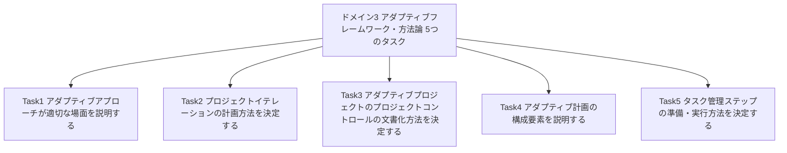
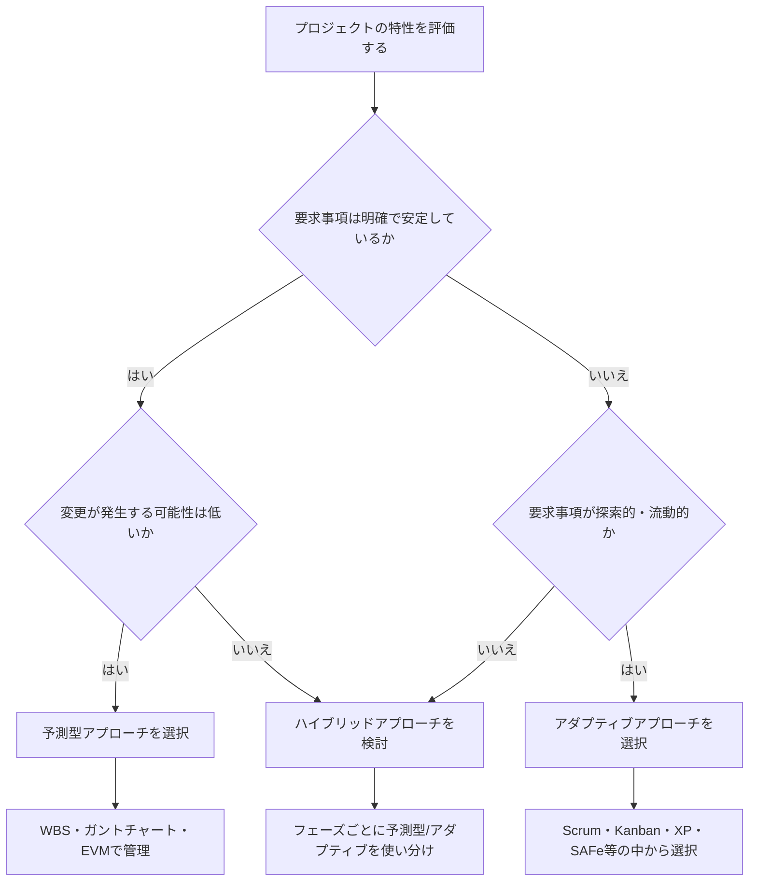
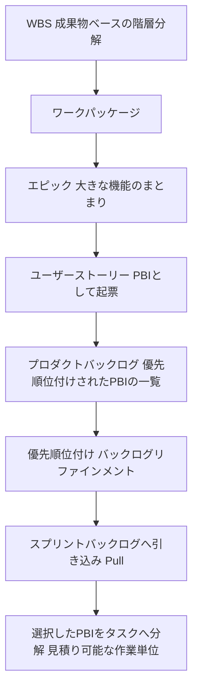
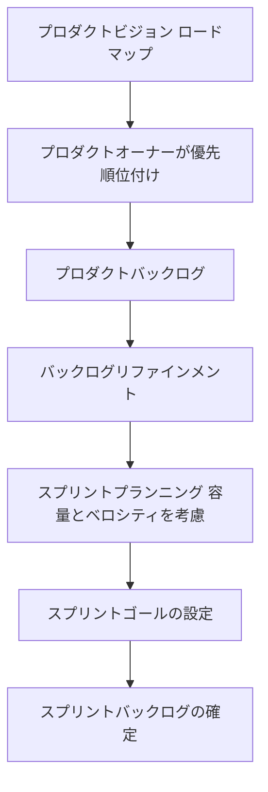
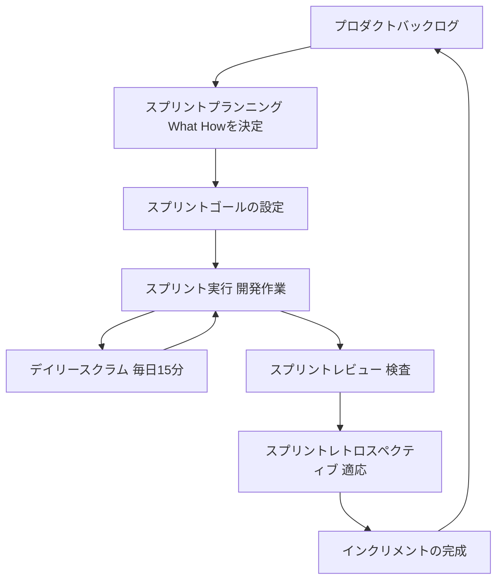
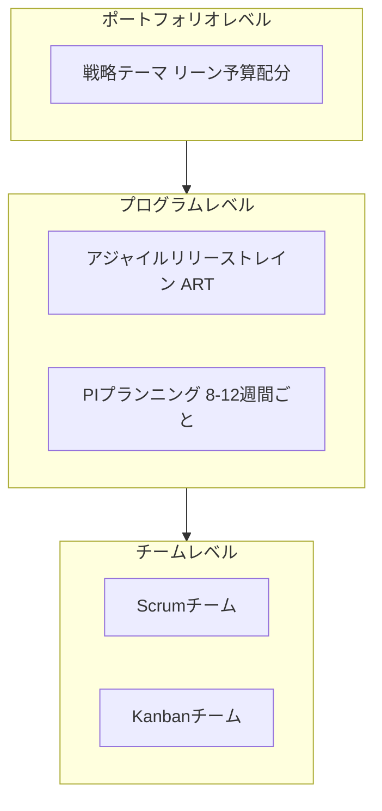
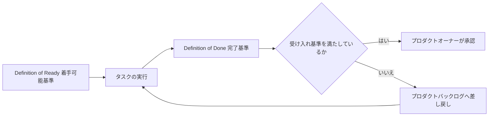

# CAPM® ドメイン3「アジャイルフレームワーク/方法論」完全ガイド

> 対象認定: PMI Certified Associate in Project Management (CAPM)®
> 対象ドメイン: **Domain 3 Agile Frameworks/Methodologies(アジャイルフレームワーク/方法論) — 試験全体の20%**
> 想定読者: これからCAPMを受験する初学者、アジャイル/スクラム未経験の方
> 準拠バージョン: CAPM Exam Content Outline 2023 Exam Update

---

## この記事の使い方

この記事は、PMIが公開している最新の一次資料に基づいて、CAPM試験のドメイン3で問われる5つのタスク(Task)を、初学者でも理解できるようステップバイステップで解説したものです。ASCIIアートは使用せず、フローチャートはMermaid、比較表はMarkdownテーブルで表現しています。各セクションの末尾には「ベストプラクティス」と「参照ソース」を明記していますので、実務でアジャイルを導入する際の参考にもなります。

> **重要な注意**: 本ガイドはPMIの公式教材ではなく、公開されている一次資料を基にした学習補助資料です。試験の最終的な出題範囲は、必ずPMI公式のExam Content Outline(ECO)でご確認ください。

---

## 0. ドメイン3の全体像

### 0.1 CAPM試験全体におけるドメイン3の位置づけ

CAPM試験は150問(採点対象135問+プレテスト15問)、制限時間180分で構成されており、4つのドメインから出題されます。

| ドメイン | 名称 | 出題比率 |
|---|---|---|
| I | Project Management Fundamentals and Core Concepts(プロジェクトマネジメントの基礎と主要概念) | 36% |
| II | Predictive, Plan-Based Methodologies(予測型・計画駆動型の方法論) | 17% |
| **III** | **Agile Frameworks/Methodologies(アジャイルフレームワーク/方法論)** | **20%** |
| IV | Business Analysis Frameworks(ビジネス分析フレームワーク) | 27% |
| 合計 | | 100% |

ドメイン3は全体の**5分の1**を占めており、ドメイン1・4に次いで比重が大きい領域です。Q1〜75の回答後に10分の休憩が挿入される点も覚えておくとよいでしょう。

### 0.2 ドメイン3を構成する5つのタスク

CAPMのECOでは、各ドメインは「タスク(Task)」と、その具体例を示す「イネーブラー(Enabler)」で構成されています。ドメイン3には次の5つのタスクがあります。

| Task | 内容 | 本ガイドの対応章 |
|---|---|---|
| Task 1 | アダプティブアプローチが適切な場面を説明する | 第1章 |
| Task 2 | プロジェクトイテレーションの計画方法を決定する | 第2章 |
| Task 3 | アダプティブプロジェクトのプロジェクトコントロールの文書化方法を決定する | 第3章 |
| Task 4 | アダプティブ計画の構成要素を説明する | 第4章 |
| Task 5 | タスク管理ステップの準備・実行方法を決定する | 第5章 |

> **参照ソース**: PMI, *CAPM Exam Content Outline (2023 Exam Update)*, pp.5, 9. [https://www.pmi.org/-/media/pmi/documents/public/pdf/certifications/capm-exam-content-outline-english.pdf](https://www.pmi.org/-/media/pmi/documents/public/pdf/certifications/capm-exam-content-outline-english.pdf) / PMI, *CAPM Certification page*. [https://www.pmi.org/certifications/certified-associate-capm](https://www.pmi.org/certifications/certified-associate-capm)

---

## 第1章 Task 1: アダプティブアプローチが適切な場面を説明する

ECOが示すイネーブラーは次の3つです。

- 予測型(Predictive)とアダプティブ(Adaptive)のメリット・デメリットを比較する
- 組織構造(仮想チーム、コロケーション、マトリックス組織、階層型組織など)に対するアダプティブアプローチの適合性を判断する
- アダプティブアプローチの採用を促進する組織のプロセス資産(OPA)と組織体の環境要因(EEF)を特定する

### 1.1 予測型 vs アダプティブの比較

「予測型」は要求事項を事前にすべて計画し、その計画どおりに実行する伝統的なウォーターフォール型のアプローチです。一方「アダプティブ」は、短いサイクルで計画・実行・検査・適応を繰り返しながら、変化する要求事項に対応していくアプローチです。PMIの用語では、この2つの中間に位置する「ハイブリッドアプローチ」も存在します。

| 観点 | 予測型(Predictive) | アダプティブ(Adaptive) |
|---|---|---|
| 要求事項の安定性 | 事前に明確化・固定化されている | 探索的で、進行中に変化しうる |
| 計画の立て方 | プロジェクト開始時に詳細計画(WBS・スケジュール)を一括作成 | 全体はラフに計画し、直近のイテレーション分だけ詳細化(ローリングウェーブ的) |
| 変更への対応 | 変更管理プロセス(Change Control)を通して厳格に統制 | 変更を前提とし、バックログの再優先順位付けで柔軟に取り込む |
| 顧客の関与 | 主に要求定義フェーズと最終納品時 | 各イテレーション(スプリント)ごとに継続的にフィードバックを取得 |
| 進捗の可視化 | ガントチャート、EVM(アーンド・バリュー・マネジメント) | バーンダウン/バーンアップチャート、ベロシティ、カンバンボード |
| 適したプロジェクト例 | 建設、規制の厳しい業界、要求が明確な定型業務 | ソフトウェア開発、新製品開発、要求が不確実な研究開発 |
| メリット | 予算・スケジュールの予測可能性が高い、進捗管理がしやすい | 変化への対応力が高い、早期に価値を提供できる、リスクを早期に発見できる |
| デメリット | 途中の変更コストが高い、顧客が最終成果物を見るまで齟齬に気づきにくい | 全体の完了時期・総コストの見通しが立てにくい、自己管理型チームの成熟度が必要 |

### 1.2 組織構造への適合性

アダプティブアプローチは、チームの自己管理性やコミュニケーションの密度に強く依存するため、組織構造によって導入のしやすさが変わります。

| 組織構造 | 特徴 | アダプティブアプローチとの適合性 |
|---|---|---|
| コロケーション(Co-located) | チーム全員が同じ場所で働く | 非常に高い。対面でのデイリースクラムやペアプログラミングが行いやすい |
| 仮想チーム(Virtual) | メンバーが地理的に分散 | 中程度。同期コミュニケーションツールやタイムゾーン調整が必須。非同期のカンバン運用が有効な場合も多い |
| マトリックス組織(Matrix) | メンバーが複数のマネージャーに報告 | 中程度〜やや低い。専任度が下がりやすく、スクラムチームの安定確保が課題になりやすい |
| 階層型組織(Hierarchical/Functional) | 職能ごとに縦割りで統制が強い | 低い。意思決定の階層が長く、チームの自己管理性・権限委譲と衝突しやすい |

### 1.3 アダプティブ採用を促進するOPAとEEF

CAPMでは「組織のプロセス資産(Organizational Process Assets, OPA)」と「組織体の環境要因(Enterprise Environmental Factors, EEF)」という用語が繰り返し登場します。ドメイン3では、これらのうちアダプティブアプローチの採用を後押しする要素を見分けられるかが問われます。

| 区分 | 定義 | アダプティブ採用を促進する具体例 |
|---|---|---|
| OPA(組織のプロセス資産) | 組織が過去から蓄積してきた知識・手順・テンプレート・過去のプロジェクト記録など | アジャイルコーチングの社内ガイドライン、過去のスプリントレトロスペクティブの記録、既存のスクラムチームのベロシティデータ、社内のDefinition of Doneテンプレート |
| EEF(組織体の環境要因) | 組織を取り巻く外部・内部の環境で、プロジェクトに影響を与えるがチームが直接コントロールできない要素 | 市場の変化スピードが速い業界文化、経営層のアジャイル推進方針、リモートワークを前提とした企業文化、変化に寛容な組織文化、アジャイルツール(Jira等)の全社導入状況 |

> **ベストプラクティス**
> - 予測型かアダプティブかを二択で捉えず、要求の不確実性・変更頻度・チームの専任度・組織文化という複数の軸で評価する。
> - 組織構造がアダプティブに不向き(階層型・強いマトリックス)な場合でも、まずは小さなパイロットチームから始めて実績(OPA)を積み上げるアプローチが有効。
> - EEFの評価では「変化を歓迎する文化があるか」「経営層のスポンサーシップがあるか」を必ず確認する。これが欠けているとアジャイル導入は形骸化しやすい。

<!-- 引用ボックスの区切り (MD028) -->

> **参照ソース**: PMI, *CAPM Exam Content Outline*, p.9(Domain 3 Task 1) / PMI & Agile Alliance, *Agile Practice Guide*(2017年、PMBOK® Guide第6版との同梱版として刊行)の概説は PMIの学習ページを参照。[https://www.pmi.org/learning/agile](https://www.pmi.org/learning/agile)

---

## 第2章 Task 2: プロジェクトイテレーションの計画方法を決定する

ECOが示すイネーブラーは次の5つです。

- イテレーションの論理的な単位を区別する
- イテレーションのメリット・デメリットを解釈する
- WBSをアダプティブなイテレーションに変換する
- スコープのインプットを決定する
- アダプティブなプロジェクト追跡と予測型の追跡の重要性の違いを説明する

### 2.1 イテレーションの論理単位

「イテレーション」とは、計画・実行・レビュー・振り返りを一つのサイクルとして繰り返す固定期間の作業単位です。Scrumでは「スプリント(Sprint)」と呼ばれ、通常1〜4週間の**タイムボックス(timebox)**で運用されます。イテレーションが長すぎるとフィードバックが遅れ、短すぎるとオーバーヘッド(計画・レビューの手間)が相対的に増えるため、チームの成熟度やプロダクトの複雑さに応じて期間を選定します。

| イテレーション期間 | 特徴 | 向いているケース |
|---|---|---|
| 1週間 | フィードバックが非常に速いが計画・レビューの頻度が高くオーバーヘッド大 | 変化が激しい立ち上げ期のプロダクト、実験的な機能開発 |
| 2週間 | 最も一般的。フィードバック速度とオーバーヘッドのバランスが良い | 多くのソフトウェア開発チーム |
| 3〜4週間 | 計画のまとまりは作りやすいが、フィードバックが遅くなる | ステークホルダーの関与頻度が低い、要求の変化が緩やかなプロジェクト |

### 2.2 イテレーションのメリット・デメリット

| 観点 | メリット | デメリット |
|---|---|---|
| フィードバック | 短いサイクルで顧客の反応を得られ、早期に軌道修正できる | 頻繁なレビューはステークホルダーの継続的な関与を要求する |
| リスク管理 | 問題を早期(数週間単位)に発見できる | イテレーションをまたぐ大きな技術的依存関係の管理が難しくなる場合がある |
| チームの学習 | レトロスペクティブによって継続的にプロセスを改善できる | チームの成熟度が低いと形骸化し、効果が出にくい |
| 進捗の予測可能性 | ベロシティの蓄積により将来の見積り精度が向上する | プロジェクト全体の完了日・総コストは初期段階では正確に見積りにくい |

### 2.3 WBSをアダプティブなイテレーションへ変換する

予測型プロジェクトでは、スコープをWBS(Work Breakdown Structure、作業分解構成図)によって成果物ベースで階層的に分解します。アダプティブプロジェクトでは、これに相当するスコープの分解を「プロダクトバックログ」という一段階柔軟な形式で行います。

WBSとの決定的な違いは、**アダプティブでは全体を最初から詳細に分解しない**という点です。直近のイテレーションで着手するアイテムだけを詳細なタスクレベルまで分解し(プログレッシブ・エラボレーション、漸進的詳細化)、遠い将来のアイテムは大きな粒度(エピック)のまま残しておきます。

### 2.4 スコープのインプット

アダプティブなスコープ計画のインプットとなる主な情報源は次のとおりです。

| インプット | 内容 |
|---|---|
| プロダクトビジョン | プロダクトが目指す最終的な価値・目的を示す短い声明文 |
| プロダクトロードマップ | ビジョンを実現するための大まかな時間軸上のマイルストーン |
| ユーザーストーリー | 「〈ユーザー〉として、〈目的〉のために、〈機能〉をしたい」という形式で書かれる要求 |
| 受け入れ基準(Acceptance Criteria) | 各ユーザーストーリーが完成したと判断するための具体的な条件 |
| ステークホルダーからのフィードバック | 過去のスプリントレビューで得られた意見や市場の変化 |

ユーザーストーリーの質を評価する際は、**INVEST基準**(Independent独立、Negotiable交渉可能、Valuable価値がある、Estimable見積り可能、Small小さい、Testableテスト可能)がよく使われます。

### 2.5 アダプティブ追跡 vs 予測型追跡

| 観点 | 予測型の追跡 | アダプティブの追跡 |
|---|---|---|
| 主な指標 | EVM(PV・EV・AC、CPI・SPI)、クリティカルパス | ベロシティ、バーンダウン/バーンアップチャート、累積フロー図(Cumulative Flow Diagram) |
| 追跡の頻度 | フェーズゲートごと、週次・月次報告 | 毎日(デイリースクラム)、スプリントごと |
| 何を測るか | 計画に対する予算・スケジュールの乖離 | チームが実際にどれだけの価値(完了したPBI)を届けたか |
| 変更の扱い | 変更はベースラインからの逸脱として管理 | 変更はバックログの再優先順位付けとして日常的に発生 |
| 重要性の違い | 「計画どおりに進んでいるか」を厳密に統制することが目的 | 「顧客にとって価値のあるものを、変化に対応しながら届けられているか」を継続的に検査・適応することが目的 |

> **ベストプラクティス**
> - イテレーション期間はプロジェクト途中で頻繁に変えない。まず2週間で開始し、レトロスペクティブを重ねてからチームに合った期間へ調整する。
> - WBSからバックログへの変換では、直近1〜2スプリント分だけを詳細タスクに分解する「ローリングウェーブ計画」の考え方を適用する。
> - 進捗報告では、予測型の指標(EVM)とアダプティブの指標(ベロシティ)を無理に一致させようとせず、ステークホルダーにはそれぞれの指標が意味することを説明する。

<!-- 引用ボックスの区切り (MD028) -->

> **参照ソース**: PMI, *CAPM Exam Content Outline*, p.9(Domain 3 Task 2) / Scrum Guide(Ken Schwaber & Jeff Sutherland, 2020年11月版, 公式サイト). [https://scrumguides.org/](https://scrumguides.org/)

---

## 第3章 Task 3: アダプティブプロジェクトのプロジェクトコントロールの文書化方法を決定する

ECOが示すイネーブラーは1つです。

- アダプティブプロジェクトで使用される成果物(アーティファクト)を特定する

予測型プロジェクトが「プロジェクトマネジメント計画書」や「変更ログ」といった正式文書でコントロールされるのに対し、アダプティブプロジェクトでは、日々の可視化ツールそのものが管理文書としての役割を果たします。

| アーティファクト | 目的 | 予測型における近い概念 |
|---|---|---|
| プロダクトバックログ(Product Backlog) | プロダクトに必要な作業を優先順位順に並べた唯一のソース。プロダクトゴールという「コミットメント」を持つ | 要求事項文書、スコープベースライン |
| スプリントバックログ(Sprint Backlog) | 当該スプリントで開発チームが取り組むPBIと実行計画。スプリントゴールという「コミットメント」を持つ | 短期の作業計画・スケジュール |
| インクリメント(Increment) | スプリントで完成した、利用可能な成果物の積み上げ。Definition of Doneという「コミットメント」を持つ | 検証済み成果物、マイルストーン成果物 |
| Definition of Done(DoD、完了の定義) | 「完成」とみなすための共通の品質基準 | 品質マネジメント計画・受入基準 |
| バーンダウン/バーンアップチャート | 残作業量または完了作業量の推移を可視化するグラフ | スケジュール差異(SV)、コスト差異(CV)のグラフ |
| カンバンボード(Kanban Board) | 作業の状態(未着手・進行中・完了)を可視化するボード | ガントチャート、進捗報告書 |
| インフォメーションラジエーター(Information Radiator) | チームやステークホルダーが常に閲覧できる情報の可視化装置全般(タスクボード、バーンダウンチャート等の総称) | ステータスレポート、ダッシュボード |
| レトロスペクティブログ | 各スプリント後に得られた改善アクションの記録 | 教訓事項(Lessons Learned)登録簿 |
| リスクバーンダウンチャート | アダプティブプロジェクトにおけるリスクの残存量を追跡するチャート | リスク登録簿(Risk Register) |

> **ベストプラクティス**
> - アーティファクトは「作ること」自体が目的化しないよう注意する。バーンダウンチャートやカンバンボードは、あくまでチームの会話を促すための道具であり、報告のためだけの飾りにしない。
> - Definition of Doneはプロジェクト開始時にチーム全員で合意し、途中で安易に緩めない。品質基準の一貫性を保つことが、アダプティブプロジェクトの信頼性を支える。
> - 複数チームが関わる場合は、チームごとにDefinition of Doneやアーティファクトのフォーマットがばらつかないよう、テンプレートを組織のOPAとして整備する。

<!-- 引用ボックスの区切り (MD028) -->

> **参照ソース**: PMI, *CAPM Exam Content Outline*, p.9(Domain 3 Task 3) / Scrum Guide, 2020. [https://scrumguides.org/](https://scrumguides.org/)

---

## 第4章 Task 4: アダプティブ計画の構成要素を説明する

ECOが示すイネーブラーは1つです。

- Scrum、エクストリーム・プログラミング(XP)、SAFe®、Kanbanなど、異なるアダプティブ方法論の構成要素を区別する

ここがドメイン3の中でも特に出題頻度が高い領域です。それぞれのフレームワークの「単位」「ロール」「ルール」の違いを正確に押さえましょう。

### 4.1 Scrum

Scrumは、複雑な問題に対応するためのシンプルな**フレームワーク**(方法論そのものではなく、その上に実践を積み重ねる土台)です。3つのアカウンタビリティ、5つのイベント、3つの成果物から構成されます。

| 構成要素 | 内容 |
|---|---|
| アカウンタビリティ(Accountabilities) | プロダクトオーナー(価値を最大化する責任)、スクラムマスター(Scrumの理解と実践を促進する責任)、開発者(Developers、増分を作成する責任) |
| イベント(Events) | スプリント(全体を包む器)、スプリントプランニング、デイリースクラム、スプリントレビュー、スプリントレトロスペクティブ |
| 成果物(Artifacts) | プロダクトバックログ(コミットメント: プロダクトゴール)、スプリントバックログ(コミットメント: スプリントゴール)、インクリメント(コミットメント: Definition of Done) |

2020年版Scrum Guideでは、開発チームを含む「スクラムチーム」全体が自己管理型(self-managing)であることが強調され、旧版にあった「開発チームは自己組織化する」という記述から一歩進んだ表現になっています。

### 4.2 エクストリーム・プログラミング(Extreme Programming, XP)

XPはKent Beckが提唱した、**技術的なプラクティス**に強みを持つアダプティブ方法論です。Scrumが「マネジメントの型」を提供するのに対し、XPは「開発現場の具体的なやり方」を規定する点が特徴です。両者は排他的ではなく、Scrum + XPプラクティスという組み合わせもよく使われます。

| 分類 | 主なプラクティス |
|---|---|
| チームプラクティス | 計画ゲーム(Planning Game)、共同のコード所有(Collective Code Ownership)、持続可能なペース(週40時間) |
| 対になるプラクティス | ペアプログラミング(Pair Programming)、継続的インテグレーション(Continuous Integration) |
| ソリューションプラクティス | シンプルな設計(Simple Design)、テスト駆動開発(Test-Driven Development, TDD)、リファクタリング(Refactoring)、小さなリリース(Small Releases)、コーディング規約(Coding Standard) |
| チームメンバーとの関係 | オンサイト顧客(On-site Customer)、メタファー(Metaphor) |

XPの4つの価値観は「コミュニケーション」「シンプルさ」「フィードバック」「勇気」(第2版では「尊重」が追加され5つ)です。

### 4.3 Kanban(カンバン)

Kanbanはトヨタ生産方式に由来するリーンの考え方をナレッジワークに応用した方法論で、David J. Andersonによって体系化されました。Scrumのような固定のロールやタイムボックスのイテレーションを必須としない点が最大の特徴で、「今のプロセスから始め、漸進的に改善する」という進化的変革を志向します。

| 区分 | 内容 |
|---|---|
| 4つの変革の原則 | 今のやり方から始める、漸進的で進化的な変化に同意する、既存の役割・責任・肩書きを尊重する、あらゆる階層でのリーダーシップの発揮を奨励する |
| 6つの一般プラクティス | 可視化する(Visualize)、仕掛り作業(WIP)を制限する、フローを管理する、プロセスを明示的にする、フィードバックループを実装する、協働で改善し実験を通じて進化する |

WIP(Work In Progress、仕掛り作業)制限は、各工程で同時に処理できるアイテム数の上限を明示的に定めるルールです。上限に達すると新しいアイテムを引き込めなくなり(プル方式)、ボトルネックがどこにあるかがチームの目に見える形で浮かび上がります。

### 4.4 Scaled Agile Framework(SAFe®)

SAFeは、複数のアジャイルチームが関わる**大規模・エンタープライズ規模**のアジャイル導入を支援するために設計されたフレームワークです。Scrumやカンバンが「1チームの働き方」を扱うのに対し、SAFeは「複数チーム・複数部門をどう束ねるか」を扱います。

| 構成要素 | 内容 |
|---|---|
| チームレベル | 個々のScrum/Kanbanチームがイテレーションを実行する |
| プログラムレベル | 複数チームが「アジャイルリリーストレイン(ART)」としてまとまり、「PIプランニング(Program Increment Planning)」で8〜12週間単位の計画を同期する |
| ポートフォリオレベル | 戦略テーマとリーン予算配分によって、投資の方向性を組織全体で統制する |
| 4つのコアバリュー | アラインメント(整合)、組み込みの品質、透明性、プログラム実行 |

> **補足**: SAFeは2011年の初版以降、継続的にアップデートされており、現行の中核バージョンは「SAFe 6.0」です。2026年にはAI活用を前提とした運用モデルとして「AI-Native SAFe」が追加発表されていますが、CAPM試験で問われるのはあくまでSAFeの基本構造(チーム/プログラム/ポートフォリオの階層とART、PIプランニングの概念)です。最新動向は公式サイトで確認してください。

### 4.5 その他のアダプティブ方法論(概要)

ECOの「etc.」に含まれうる、その他の代表的な軽量アジャイル方法論も押さえておくと安心です。

| 方法論 | 特徴 |
|---|---|
| Lean(リーン) | 無駄の排除、価値の最大化を重視するトヨタ生産方式由来の思想。Kanbanの理論的基盤の一つ |
| Crystal(クリスタル) | Alistair Cockburnが提唱。プロジェクトの規模と重要度に応じて手法の重さを変える(Crystal Clear、Crystal Orangeなど) |
| FDD(Feature-Driven Development) | 「機能(Feature)」を単位に設計と実装を進める、大規模チーム向けの方法論 |
| DSDM(Dynamic Systems Development Method) | タイムボックスと固定コスト・品質を重視する、英国発のアジャイル方法論 |

### 4.6 4大フレームワークの比較表

| 観点 | Scrum | XP | Kanban | SAFe |
|---|---|---|---|---|
| 主な適用範囲 | 単一チーム | 単一チーム(技術面が中心) | 単一チーム/部門横断のフロー | 複数チーム・大規模組織 |
| 作業の単位 | スプリント(タイムボックス) | イテレーション(短いリリース) | 継続的フロー(WIP制限で統制) | PI(Program Increment、複数スプリント) |
| 主なロール | プロダクトオーナー、スクラムマスター、開発者 | 顧客、コーチ、トラッカー、プログラマー(役割は緩やか) | 既存の役割を尊重(新しい役割を必須としない) | プロダクトマネージャー、リリーストレインエンジニア(RTE)、Scrumチーム等 |
| 変更管理の考え方 | スプリント内は変更を凍結し、スプリントの区切りで再優先順位付け | 変更を歓迎し、シンプルな設計とリファクタリングで柔軟に対応 | いつでもバックログの優先順位を変更可能(WIP制限が変更の入り口を制御) | PIの区切りで大きな方向転換、PI内は計画に従う |
| 重視するもの | プロセスの型(検査・適応のリズム) | 技術的卓越性(コード品質) | フローの効率と可視化 | 組織全体の整合性とスケール |

> **ベストプラクティス**
> - 試験対策としては「どのフレームワークが、何を単位に、何を管理するか」をセットで覚える(例: Scrum=スプリント+3ロール、Kanban=WIP制限+プル方式、SAFe=PI+ART)。
> - 実務でフレームワークを選ぶ際は「1チームか複数チームか」「変更の頻度は高いか」「技術的負債の解消を重視するか」という軸で使い分ける。
> - Scrum・XP・Kanbanは互いに排他的ではなく、「Scrumban(Scrum+Kanban)」のようにプラクティスを組み合わせて使う組織も多い。

<!-- 引用ボックスの区切り (MD028) -->

> **参照ソース**:
> - PMI, *CAPM Exam Content Outline*, p.9(Domain 3 Task 4)
> - Scrum Guide(公式). [https://scrumguides.org/](https://scrumguides.org/)
> - The Kanban Method(Kanban University公式ガイド). [https://kanban.university/kanban-guide/](https://kanban.university/kanban-guide/)
> - Kanbanの原則とプラクティス(David J. Anderson School of Management). [https://djaa.com/the-principles-and-general-practices-of-the-kanban-method/](https://djaa.com/the-principles-and-general-practices-of-the-kanban-method/)
> - Extreme Programmingのルールとプラクティス(公式). [http://www.extremeprogramming.org/rules.html](http://www.extremeprogramming.org/rules.html)
> - Scaled Agile Framework(公式). [https://framework.scaledagile.com/](https://framework.scaledagile.com/)

---

## 第5章 Task 5: タスク管理ステップの準備・実行方法を決定する

ECOが示すイネーブラーは次の2つです。

- アダプティブなプロジェクトマネジメントタスクの成功基準を解釈する
- アダプティブなプロジェクトマネジメントにおけるタスクの優先順位付けを行う

### 5.1 成功基準の解釈

アダプティブプロジェクトでは、「いつ着手できるか」「いつ完了とみなせるか」「顧客の期待を満たしているか」を判断するために、3つの基準を区別します。

| 基準 | 英語 | 目的 | 誰が確認するか |
|---|---|---|---|
| 準備完了の定義 | Definition of Ready(DoR) | プロダクトバックログアイテムがスプリントに着手できる状態かを判断する基準(要求が十分に明確か、見積り済みかなど) | 開発チーム、プロダクトオーナー |
| 完了の定義 | Definition of Done(DoD) | 作成した増分(インクリメント)がリリース可能な品質に達しているかを判断する、チーム共通の基準 | 開発チーム |
| 受け入れ基準 | Acceptance Criteria | 個々のユーザーストーリーが「顧客の要求どおりに」実装されているかを判断する、ストーリー固有の条件 | プロダクトオーナー、顧客 |

DoDとAcceptance Criteriaを混同しないことが重要です。**DoDはすべてのアイテムに共通する品質基準**(例: 単体テストが通っている、コードレビュー済みである)であるのに対し、**Acceptance Criteriaは個々のストーリーごとに異なる機能要件**(例: 「パスワードは8文字以上でなければならない」)を指します。

### 5.2 タスクの優先順位付け

アダプティブプロジェクトでは、限られたイテレーションの中で最も価値の高い作業から着手するため、優先順位付けの技法が重要になります。

| 技法 | 概要 | 向いている場面 |
|---|---|---|
| MoSCoW分析 | Must have(必須)、Should have(あるべき)、Could have(あってもよい)、Won't have(今回は含めない)の4段階で分類する | ステークホルダーとの合意形成をシンプルに行いたい場合 |
| WSJF(Weighted Shortest Job First) | 「(ビジネス価値+時間の緊急性+リスク低減/機会創出の価値)÷ジョブの規模」で算出し、値が大きい順に着手する | SAFeで使われる、複数の投資対象を定量的に比較したい場合 |
| Kano分析 | 機能を「当たり前品質」「一元的品質」「魅力的品質」などに分類し、顧客満足度への影響で優先順位を判断する | 顧客体験・満足度を重視したプロダクト設計 |
| 価値と労力のマトリクス(Value vs Effort) | 縦軸に価値、横軸に労力を取り、「価値が高く労力が低い」アイテムを最優先にする | シンプルに優先順位の全体像を可視化したい場合 |

> **ベストプラクティス**
> - Definition of Ready・Definition of Done・Acceptance Criteriaは、チーム発足時にまとめて文書化し、スプリントごとに見直す。3つを混同すると「完了」の合意が崩れ、手戻りの原因になる。
> - 優先順位付けは一度決めて終わりにせず、バックログリファインメントのたびに見直す。市場やステークホルダーの状況変化を反映することが、アダプティブアプローチの本質。
> - WSJFのような定量的手法を使う場合も、最終的な優先順位はプロダクトオーナーの意思決定であることを忘れない。数値は判断材料であって、機械的な自動決定のためのものではない。

<!-- 引用ボックスの区切り (MD028) -->

> **参照ソース**: PMI, *CAPM Exam Content Outline*, p.9(Domain 3 Task 5) / Scrum Guide, 2020. [https://scrumguides.org/](https://scrumguides.org/) / Scaled Agile Framework(WSJFの解説を含む). [https://framework.scaledagile.com/](https://framework.scaledagile.com/)

---

## 第6章 よくある混同ポイント・用語集

CAPM受験者が特に混同しやすい用語をまとめました。

| 用語(英語) | 用語(日本語) | 簡潔な定義 |
|---|---|---|
| Iteration | イテレーション | 計画・実行・レビュー・振り返りを繰り返す固定期間の作業サイクル(Scrumではスプリント) |
| Timebox | タイムボックス | あらかじめ決められた固定の作業期間。期間内に終わらなくても延長しない |
| Increment | インクリメント | スプリントで完成し、リリース可能な状態にある成果物の積み上げ |
| Velocity | ベロシティ | 1イテレーションあたりにチームが完了できる作業量の実績値(将来の見積りに使う) |
| Burndown Chart | バーンダウンチャート | 残作業量が時間とともに減っていく様子を示すグラフ |
| Burnup Chart | バーンアップチャート | 完了した作業量とスコープ全体の変化を同時に示すグラフ |
| WIP Limit | WIP制限 | 各工程で同時に処理できる仕掛り作業の上限数 |
| Product Backlog | プロダクトバックログ | プロダクトに必要な作業を優先順位順に並べた唯一の一覧 |
| Sprint Backlog | スプリントバックログ | 当該スプリントで着手すると決めたPBIと実行計画 |
| Definition of Done | 完了の定義(DoD) | チーム共通の「完成」とみなす品質基準 |
| Servant Leadership | サーバントリーダーシップ | チームを支え、障害物を取り除くことに徹するリーダーシップスタイル(スクラムマスターに求められる姿勢) |
| Self-managing Team | 自己管理型チーム | 誰が・どのように・何に取り組むかをチーム自身で決定するチーム(2020年版Scrum Guideの用語) |

---

## 第7章 ドメイン3 学習チェックリスト

学習の総仕上げとして、ECOのイネーブラーに沿ったチェックリストを用意しました。すべて「はい」と言えるようになれば準備完了です。

- [ ] 予測型とアダプティブの違いを、要求の安定性・変更コスト・フィードバック頻度の観点で説明できる
- [ ] 組織構造(仮想・コロケーション・マトリックス・階層型)ごとに、アダプティブの適合度が異なる理由を説明できる
- [ ] OPAとEEFの違いを説明し、それぞれアダプティブ採用を促進する具体例を挙げられる
- [ ] WBSとプロダクトバックログの違い、及び前者から後者への変換の考え方を説明できる
- [ ] イテレーション期間を決める際のトレードオフ(フィードバック速度 vs オーバーヘッド)を説明できる
- [ ] アダプティブなスコープ計画のインプット(ビジョン、ロードマップ、ユーザーストーリー)を挙げられる
- [ ] EVMとベロシティ/バーンダウンチャートの違いを説明できる
- [ ] アダプティブプロジェクトで使われる主要なアーティファクト(プロダクトバックログ、スプリントバックログ、インクリメント、DoD、カンバンボード等)を挙げられる
- [ ] Scrumの3ロール・5イベント・3成果物を暗唱できる
- [ ] XPの主なプラクティス(TDD、ペアプログラミング、継続的インテグレーション等)を挙げられる
- [ ] Kanbanの4原則・6プラクティス、特にWIP制限の意味を説明できる
- [ ] SAFeのチーム/プログラム/ポートフォリオという3層構造とARTの役割を説明できる
- [ ] Definition of Ready・Definition of Done・Acceptance Criteriaの違いを説明できる
- [ ] MoSCoW、WSJF、Kano分析など優先順位付け技法の使い分けを説明できる

---

## 第8章 参考文献・ソース一覧

本ガイドの作成にあたり、以下の一次資料を直接参照しました。

1. **PMI, *Certified Associate in Project Management (CAPM)® Exam Content Outline*(2023 Exam Update)** — ドメイン3の5つのタスクとイネーブラーの一次ソース。
   [https://www.pmi.org/-/media/pmi/documents/public/pdf/certifications/capm-exam-content-outline-english.pdf](https://www.pmi.org/-/media/pmi/documents/public/pdf/certifications/capm-exam-content-outline-english.pdf)

2. **PMI, *Certified Associate in Project Management (CAPM)® Certification*(公式認定ページ)** — 試験構成(150問、180分、8言語対応)、出題比率の一次ソース。
   [https://www.pmi.org/certifications/certified-associate-capm](https://www.pmi.org/certifications/certified-associate-capm)

3. **PMI, Agile学習リソースページ(*Agile Practice Guide*の紹介を含む、PMIとAgile Allianceの共同刊行物)**
   [https://www.pmi.org/learning/agile](https://www.pmi.org/learning/agile)

4. **Ken Schwaber & Jeff Sutherland, *The Scrum Guide*(2020年11月版、公式サイト)** — Scrumのロール・イベント・成果物の一次ソース。
   [https://scrumguides.org/](https://scrumguides.org/)

5. **Scrum.org, *The 2020 Scrum Guide: What You Need to Know*** — 2017年版から2020年版への変更点の解説。
   [https://www.scrum.org/scrum-guide-2020](https://www.scrum.org/scrum-guide-2020)

6. **Kanban University, *The Official Guide to The Kanban Method*** — Kanbanの4原則・6プラクティスの一次ソース。
   [https://kanban.university/kanban-guide/](https://kanban.university/kanban-guide/)

7. **David J. Anderson School of Management, *The Principles and General Practices of the Kanban Method***
   [https://djaa.com/the-principles-and-general-practices-of-the-kanban-method/](https://djaa.com/the-principles-and-general-practices-of-the-kanban-method/)

8. **ExtremeProgramming.org, *The Rules and Practices of Extreme Programming*** — XPのプラクティス一覧の一次ソース。
   [http://www.extremeprogramming.org/rules.html](http://www.extremeprogramming.org/rules.html)

9. **Scaled Agile, Inc., *Scaled Agile Framework(SAFe®)公式サイト*** — SAFeの階層構造、PIプランニング、WSJFの一次ソース。
   [https://framework.scaledagile.com/](https://framework.scaledagile.com/)

10. **Agile Manifesto(アジャイルソフトウェア開発宣言、公式サイト)** — アダプティブアプローチ全般の思想的な源流。
    [https://agilemanifesto.org/](https://agilemanifesto.org/)

> **免責事項**: 本ガイドはPMI公式の教材・出版物ではありません。試験範囲・出題形式は変更される可能性があるため、受験前に必ずPMI公式サイトで最新のExam Content Outlineをご確認ください。SAFe®はScaled Agile, Inc.の登録商標です。
