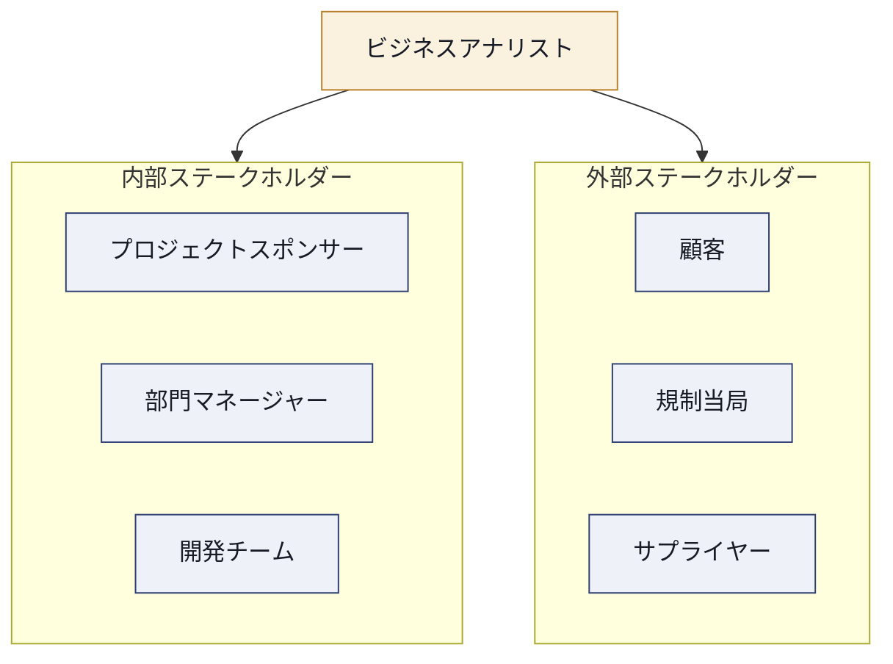
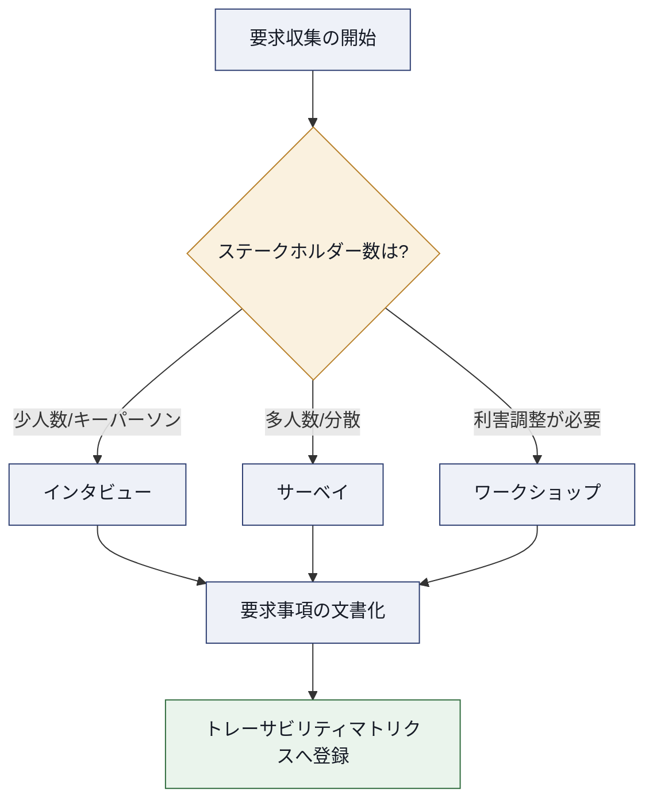
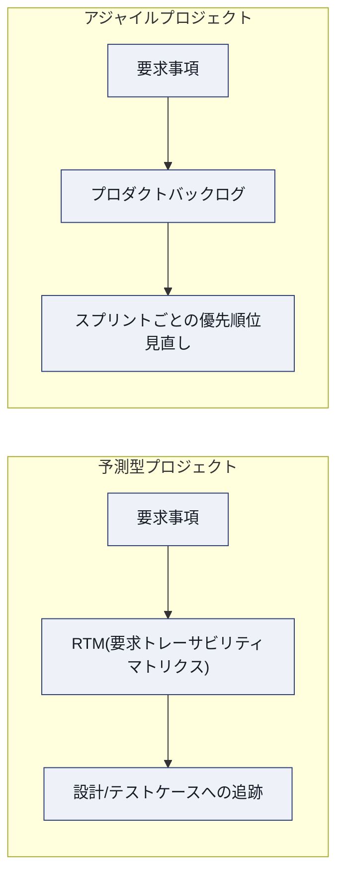
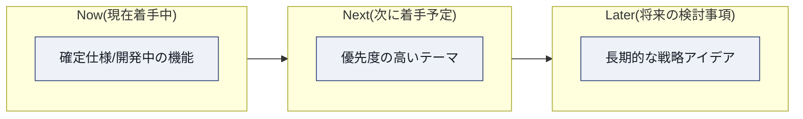
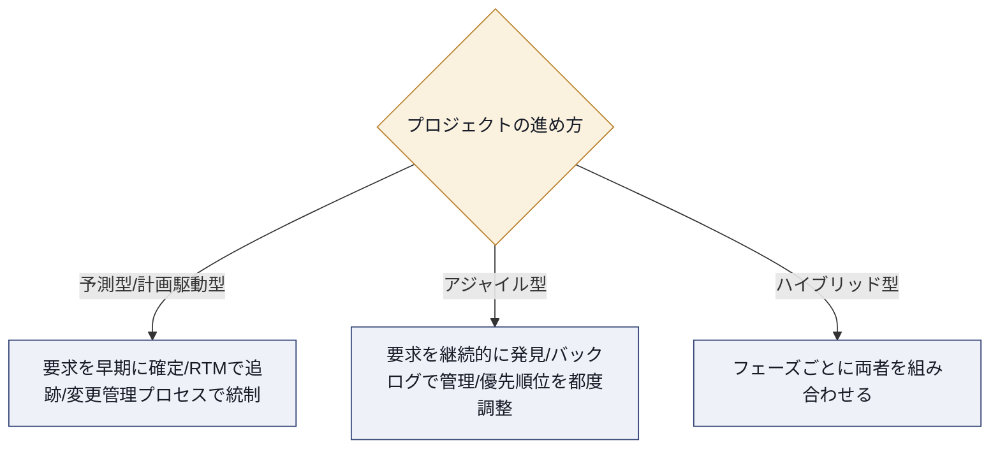
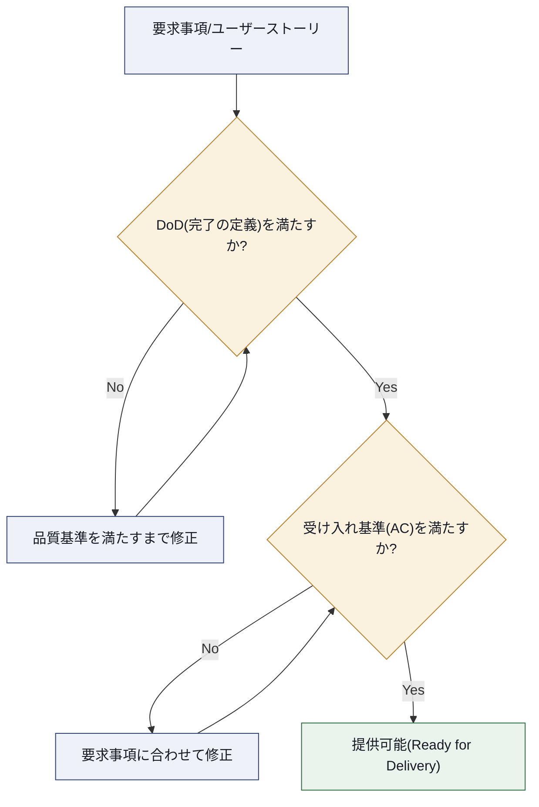
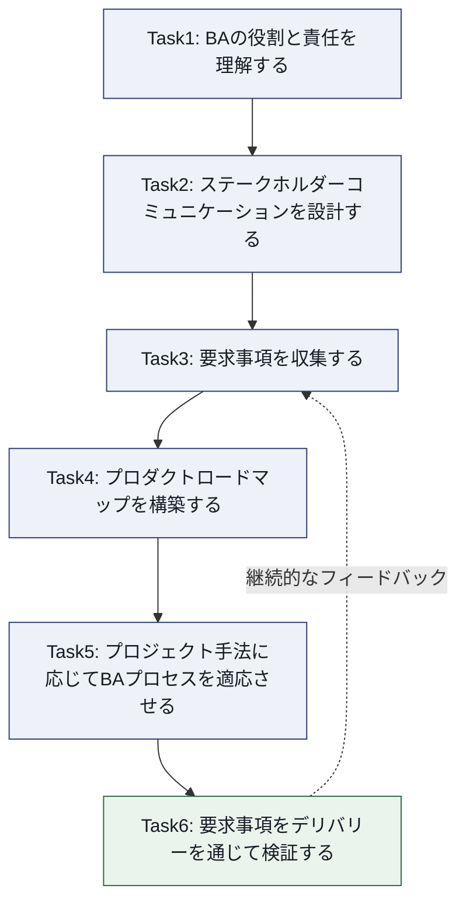

# CAPM® ドメイン4：ビジネス分析フレームワーク（Business Analysis Frameworks）完全学習ガイド

> 対象試験：PMI Certified Associate in Project Management (CAPM)®
> 対象範囲：Exam Content Outline (ECO) 2023年改訂版 ドメイン4（出題比率 **27%**）
> 想定読者：CAPM初学者・ビジネスアナリスト初心者・プロジェクトチームメンバー

---

## この章でわかること

CAPM試験は2023年の改訂で、出題領域が次の4つのドメインに再編されました。

| ドメイン | 名称 | 出題比率 |
|---|---|---|
| ドメイン1 | Project Management Fundamentals and Core Concepts（プロジェクトマネジメントの基礎と中核概念） | 36% |
| ドメイン2 | Predictive, Plan-Based Methodologies（予測型・計画駆動型手法） | 17% |
| ドメイン3 | Agile Frameworks/Methodologies（アジャイルフレームワーク／手法） | 20% |
| **ドメイン4** | **Business Analysis Frameworks（ビジネス分析フレームワーク）** | **27%** |

ドメイン4は出題比率27%と、単独ドメインとしてはドメイン1に次いで2番目に大きい配点です。合格のためにはドメイン1と並んで最重要領域と言えます。PMIはこのECOを策定するにあたり、グローバル実務調査（GPA：Global Practice Analysis）と職務タスク分析（JTA：Job Task Analysis）を実施し、現代のプロジェクトチームメンバーが予測型・アジャイル型・ビジネス分析的アプローチを横断的に活用している実態を反映させました。

ドメイン4は次の6つのタスク（Task）で構成されています。本ガイドはこの6タスクを、初学者にもわかるように1つずつ丁寧に解説し、各項目のベストプラクティスと出典を付記します。

| Task番号 | タスク名 |
|---|---|
| Task 1 | ビジネス分析（BA）の役割と責任を理解する |
| Task 2 | ステークホルダーとのコミュニケーション方法を決定する |
| Task 3 | 要求事項（requirements）の収集方法を決定する |
| Task 4 | プロダクトロードマップを理解する |
| Task 5 | プロジェクト手法がビジネス分析プロセスに与える影響を判断する |
| Task 6 | プロダクトデリバリーを通じて要求事項を検証する |

---

## そもそも「ビジネス分析」とは何か

CAPM ECOにおけるビジネス分析（Business Analysis, BA）とは、組織の課題やニーズを特定し、ビジネス価値を実現するソリューションを定義・検証していく一連の活動を指します。プロジェクトマネジメント（「どうやってプロジェクトを進めるか」）に対して、ビジネス分析は「そもそも何を作るべきか・なぜそれが必要か」を明確にする活動という位置づけです。

CAPM ECOの参考文献リストには、*A Guide to the Project Management Body of Knowledge (PMBOK® Guide) – 第7版*に加え、*The PMI Guide to Business Analysis*（2017年）や*Business Analysis for Practitioners: A Practice Guide – 第2版*（2024年）が明記されています。これはドメイン4がPMBOK単体ではなく、ビジネス分析の専門知識体系（業界慣行を含む）を踏まえて出題されることを意味します。

> **補足：** CAPM ECOの巻頭には「これらの書籍を全て読むことは必須ではないが、参考にすると役立つ」と明記されています。CAPM自体はPMBOK第7版に完全準拠したものではなく、独自のJTA（職務タスク分析）に基づいて作成されています。

---

## Task 1：ビジネス分析（BA）の役割と責任を理解する

### 出題内容（Enablers）

ECO原文では、Task 1は次の3つの学習項目（Enablers）で構成されています。

1. ステークホルダーの役割を区別する（例：プロセスオーナー、プロセスマネージャー、プロダクトマネージャー、プロダクトオーナーなど）
2. 役割と責任がなぜ必要なのかを説明する（そもそもなぜステークホルダーを特定する必要があるのか）
3. 内部の役割と外部の役割を区別する

### 詳細解説

CAPM試験では、似た名前の役割を正確に区別できるかが頻出論点です。特に「プロダクトマネージャー」と「プロダクトオーナー」、「プロセスオーナー」と「プロセスマネージャー」の違いは混同しやすいため、以下の表で整理します。

| 役割 | 主な責任範囲 | 時間軸 | 典型的な文脈 |
|---|---|---|---|
| プロセスオーナー（Process Owner） | 特定の業務プロセス全体の成果に説明責任を負う | 恒常的（プロセスが存在する限り継続） | 業務改善・BPM（業務プロセス管理） |
| プロセスマネージャー（Process Manager） | プロセスの日々の運用・実行を管理する | 日常運用ベース | 業務改善・BPM |
| プロダクトマネージャー（Product Manager） | プロダクト全体のビジョン・戦略・市場適合性に責任を持つ | 中長期（複数リリースにまたがる） | 予測型・アジャイル型どちらでも存在しうる |
| プロダクトオーナー（Product Owner） | プロダクトバックログの優先順位付けと開発チームへの要求事項伝達に責任を持つ | 短期（スプリント／イテレーション単位） | Scrumなどアジャイルフレームワーク固有の役割 |

これらの役割は、なぜ明確化する必要があるのでしょうか。ECOのEnablerが問うている「そもそもなぜステークホルダーを特定する必要があるのか」という問いに対する答えは、次の3点に整理できます。

- **意思決定の所在を明確にするため**：誰が要求事項を承認できるのか、誰が優先順位を最終決定できるのかが曖昧だと、要求事項の手戻りや対立が発生する
- **コミュニケーション設計の起点にするため**：Task 2で扱う「誰に・何を・どう伝えるか」は、まず役割を正しく把握していないと設計できない
- **説明責任（Accountability）を分散させないため**：役割が重複・空白になっている箇所はプロジェクトのリスク要因になる

### 内部の役割 vs 外部の役割

| 分類 | 定義 | 具体例 |
|---|---|---|
| 内部の役割（Internal Roles） | 実施組織の内部に所属し、プロジェクトに関与するステークホルダー | プロジェクトスポンサー、部門マネージャー、開発チーム、社内エンドユーザー |
| 外部の役割（External Roles） | 実施組織の外部に存在し、プロジェクトの成果に利害関係を持つステークホルダー | 顧客、規制当局、サプライヤー、外部の最終利用者、パートナー企業 |

内部/外部の区別が重要な理由は、要求事項の優先順位付けやコミュニケーション頻度の設計に直結するためです。一般に外部ステークホルダー（特に顧客や規制当局）は、内部よりも接触機会が限られるため、より計画的なコミュニケーション設計が必要になります。

### ベストプラクティス

- ステークホルダー特定は**プロジェクト初期**に一度で終わらせず、プロジェクトのライフサイクルを通じて定期的に見直す（新しい利害関係者の出現や、関心度・影響力の変化に対応するため）
- 役割名だけで判断せず、**実際の権限（意思決定できる範囲）**を確認する。同じ「プロダクトオーナー」という肩書きでも、組織によって権限範囲が異なることがある
- 内部・外部それぞれについて、関心度（Interest）と影響力（Power/Influence）のマトリクスを用いて分類し、関与レベルを調整する
- 役割が重複している、または空白になっている領域を可視化し、プロジェクト憲章やRACIチャートなどで明文化する

---

## Task 2：ステークホルダーとのコミュニケーション方法を決定する

### 出題内容（Enablers）

1. 最も適切なコミュニケーションチャネル／ツールを推奨する（例：レポーティング、プレゼンテーションなど）
2. ビジネスアナリストにとって、様々なチーム間（機能、要求事項など）でコミュニケーションがなぜ重要かを説明する

### 詳細解説

ビジネスアナリストは、ビジネス側（経営層・現場部門）と開発側（エンジニアリングチーム）の「翻訳者」としての役割を担います。この橋渡しが機能しないと、要求事項が正しく伝わらず、完成したプロダクトがビジネスニーズと乖離するリスクが高まります。

コミュニケーションチャネルの選定は、伝える内容の性質・受け手の役割・意思決定の緊急度によって変わります。代表的なチャネルと適した用途を以下に整理します。

| コミュニケーションチャネル | 適した場面 | 向いていない場面 |
|---|---|---|
| レポート（定期報告書） | 進捗・ステータスの記録、経営層への定期報告、監査証跡 | 即時の合意形成が必要な議論 |
| プレゼンテーション | 経営層への意思決定依頼、ロードマップ共有、大人数への説明 | 詳細な仕様のすり合わせ |
| ワークショップ／会議 | 要求事項の合意形成、複雑な論点の調整 | 単純な進捗共有（時間コストが高い） |
| チャットツール／非同期メッセージ | 開発チームとの日常的な質疑応答 | フォーマルな承認記録が必要な意思決定 |
| ダッシュボード（可視化ツール） | リアルタイムの状況把握、複数ステークホルダーへの同時共有 | 背景説明や文脈を伴う複雑な情報伝達 |

### コミュニケーションが重要な理由

ECOのEnablerが求める「なぜチーム間コミュニケーションが重要か」を説明する際は、以下の観点が有効です。

- **要求事項の解釈のズレを防ぐ**：ビジネス側の言葉（業務用語）と開発側の言葉（技術用語）は異なるため、翻訳を怠ると仕様の誤解が生じる
- **変更の影響範囲を全員が把握する**：要求事項が変わった際、関係する全チームに正しく伝わらないと手戻りが発生する
- **意思決定のスピードを保つ**：適切なチャネルが選ばれていないと、承認や合意形成に不要な時間がかかる

### ベストプラクティス

- ステークホルダーごとに**コミュニケーション計画（誰に・何を・いつ・どのチャネルで）**を明文化し、都度その場の判断に頼らない
- 経営層向けには「結論から」「ビジネスインパクト中心」、開発チーム向けには「詳細仕様・制約条件中心」というように、**受け手に応じて情報の粒度を変える**
- フォーマルな承認・合意事項は、チャットのような非同期の記録が流れやすい手段だけに頼らず、**議事録やレポートとして残す**
- 双方向性を意識し、開発側からの技術的フィードバック（実現可能性、工数見積もりなど）をビジネス側に正しく返す経路も設計する

---

## Task 3：要求事項の収集方法を決定する

### 出題内容（Enablers）

1. ツールをシナリオに適合させる（例：ユーザーストーリー、ユースケースなど）
2. 状況に応じた要求収集アプローチを特定する（例：ステークホルダーインタビュー、サーベイ、ワークショップ、教訓収集など）
3. 要求トレーサビリティマトリクス／プロダクトバックログを説明する

このTaskはドメイン4の中でも実務的な比重が最も大きく、CAPM試験でも頻出です。3つの論点（①ツール選定 ②手法選定 ③トレーサビリティ）に分けて解説します。

### 3-1. 要求収集（エリシテーション）の代表的な手法

要求事項を集める活動は「エリシテーション（Elicitation）」と呼ばれます。代表的な手法と、それぞれの向き・不向きを整理します。

| 手法 | 概要 | 向いている場面 | 注意点 |
|---|---|---|---|
| インタビュー | 1対1（または少人数）でステークホルダーに深く聞き取る | 詳細な業務知識を持つキーパーソンからの深掘り | 対象者が多いとスケールしない |
| ワークショップ | 複数ステークホルダーを集めた合意形成型のセッション | 部門間で利害が対立する要求の調整、優先順位付け | 準備（アジェンダ、参加者選定、会場）の負荷が高い |
| サーベイ／アンケート | 定型の質問票を多数の対象者に配布する | 広い母集団から定量的な傾向をつかみたい場合 | 深掘りには不向き、設問設計の質に結果が左右される |
| 観察（Observation） | 実際の業務やユーザー行動を直接観察する | 利用者自身が言語化できていない業務プロセスの発見 | 時間がかかる、観察対象者の行動が変化する可能性がある |
| ドキュメント分析 | 既存の業務マニュアル・過去の仕様書などを分析する | 既存システムの現状把握、過去の意思決定の経緯確認 | 現行の実態と乖離している場合がある |
| 教訓収集（Lessons Learned） | 過去の類似プロジェクトの振り返り記録を参照する | 過去の失敗・成功パターンを要求定義に反映したい場合 | 記録が体系的に整備されていないと活用しづらい |

### 3-2. ユーザーストーリー vs ユースケース

CAPM ECOが明示的に例示している「ツールをシナリオに適合させる」の代表例が、ユーザーストーリーとユースケースの使い分けです。両者は似て非なるものであり、試験でも区別が問われます。

| 観点 | ユーザーストーリー | ユースケース |
|---|---|---|
| 起源 | アジャイル開発（Scrumなど）で発展 | 従来型のシステム分析・要求工学で発展 |
| 記述の焦点 | ユーザーの「何を・なぜ」欲しいか（価値中心） | システムが「どのように」振る舞うか（挙動中心） |
| 典型フォーマット | 「〜として、〜したい。なぜなら〜だから」の短い一文 | アクター、事前条件、基本フロー、代替フロー、例外フロー、事後条件を含む構造化文書 |
| 詳細度 | 意図的に簡潔（詳細は会話で補う） | 網羅的・厳密（例外ケースまで記述） |
| 適した手法 | アジャイル／要求が変化しやすいプロジェクト | 予測型（ウォーターフォール）／要求が早期に固まる複雑なシステム |
| 作成コストと効果 | 短時間で書けるが、曖昧さを会話で補う前提 | 作成に時間がかかるが、抜け漏れのリスクを下げられる |

両者は対立概念ではなく、補完的に使うことも実務上多くあります。たとえば、まずユーザーストーリーで要求の方向性を素早く合意し、複雑な業務フローや例外処理が絡む部分だけユースケースで詳細化する、という組み合わせ方です。

### 3-3. 要求トレーサビリティマトリクス（RTM）とプロダクトバックログ

**要求トレーサビリティマトリクス（Requirements Traceability Matrix, RTM）**は、要求事項の出所（ステークホルダーの要望やビジネスニーズ）から、それを実現する成果物（設計・テストケースなど）までを一意に紐づけて管理する表形式のツールです。予測型プロジェクトで特によく使われます。

RTMには一般的に次のような列が含まれます。

| 項目 | 内容 |
|---|---|
| 要求ID | 各要求事項を一意に識別する番号 |
| 要求内容の説明 | 何を求めているかの簡潔な記述 |
| 出所（Source） | 誰が、どの文書・会議で要求したか |
| 優先度 | ビジネス上の重要度 |
| 対応する成果物 | 設計書、テストケースなど紐づく下流成果物 |
| ステータス | 未着手／対応中／完了／却下などの現在状態 |

一方、**アジャイルプロジェクトにおけるプロダクトバックログ**は、RTMと類似の機能（要求事項の一覧管理と優先順位付け）を果たしますが、常に変化することを前提とした「生きたリスト」である点が異なります。RTMが「網羅性と追跡可能性」を重視するのに対し、プロダクトバックログは「柔軟性と優先順位の継続的な見直し」を重視します。

### ベストプラクティス

- 要求収集の手法は**単一に頼らず組み合わせる**（例：ドキュメント分析で現状把握 → インタビューで深掘り → ワークショップで合意形成）
- サーベイの設問数は**簡潔に保つ**（一般に10問前後を目安とし、誘導的・複雑すぎる設問を避ける）
- ワークショップを開く際は、事前にアジェンダを共有し、**適切な参加者（意思決定できる人）**を招集する
- RTMやプロダクトバックログは作成して終わりにせず、**責任者を明確にして定期的に更新**する（放置すると形骸化しやすい）
- ユーザーストーリーとユースケースは「どちらが正しいか」ではなく、**プロジェクトの性質（予測型か適応型か、要求の複雑さ）に応じて選ぶ**

> **ソース：** 要求収集技法の詳細は [Bridging the Gap – Elicitation Techniques Used By Business Analysts](https://www.bridging-the-gap.com/elicitation-techniques-business-analysts/) および [Notre Dame大学 Business Analysis – Elicitation Techniques](https://sites.nd.edu/businessanalysis/?page_id=321) を参照。ユーザーストーリーとユースケースの比較は [craft.io – Use Case vs. User Story](https://craft.io/blog/use-case-vs-user-story-the-final-showdown/) を参照。RTMのベストプラクティスは [TestRail – Requirements Traceability Matrix: A How-To Guide](https://www.testrail.com/blog/requirements-traceability-matrix/) を参照。

---

## Task 4：プロダクトロードマップを理解する

### 出題内容（Enablers）

1. プロダクトロードマップの適用方法を説明する
2. どの構成要素がどのリリースに含まれるかを判断する

### 詳細解説

**プロダクトロードマップ（Product Roadmap）**とは、プロダクトの方向性・優先順位・時間軸を、ステークホルダーに向けて可視化した戦略的な計画資料です。個別の機能仕様書ではなく、「なぜ・何を・いつ頃」実現するのかを俯瞰的に示すことが目的です。

ロードマップにはいくつかの構成スタイルがあり、CAPM試験対策としては以下の違いを理解しておくと役立ちます。

| ロードマップの型 | 特徴 | メリット | 注意点 |
|---|---|---|---|
| 機能ベース（Feature-based） | 個別機能とリリース時期を一覧化 | 開発チームには分かりやすい | 「なぜ作るか」が伝わりにくく、非技術系ステークホルダーには響きにくい |
| テーマベース（Theme-based） | 戦略的なテーマ（例：パフォーマンス改善、エンタープライズ対応）ごとに施策をグルーピング | 経営層に戦略との整合性を伝えやすい | テーマの粒度が曖昧だと具体性を欠く |
| アウトカムベース（Outcome-based） | 達成したい成果指標（例：解約率を10%改善）を軸に構成 | 「作ること」ではなく「価値を届けること」に焦点を当てられる | 現場が何を作ればよいか分かりにくくなる場合がある |
| Now-Next-Laterロードマップ | 時間軸を厳密な日付ではなく「今／次／将来」の3段階で表現 | 不確実性の高いプロジェクトでも柔軟に運用できる | 具体的な納期が必要なステークホルダーには物足りない |

### どの構成要素をどのリリースに含めるか

ECOのEnabler「どの構成要素がどのリリースに含まれるかを判断する」は、優先順位付けの実務力を問うています。判断の際に考慮すべき代表的な観点は以下の通りです。

- **ビジネス価値**：そのリリースがもたらすインパクトの大きさ
- **依存関係**：他の機能や外部要因（規制対応期限など）への依存があるか
- **技術的な実現可能性**：現時点でのチームの能力やアーキテクチャで対応可能か
- **リスク**：後回しにした場合の機会損失、または先に着手した場合の不確実性

### ベストプラクティス

- ロードマップは**「機能の一覧」ではなく「なぜそれをやるのか」を語る資料**として設計する
- ステークホルダーの役割に応じて**表示する粒度を変える**（経営層にはテーマ単位の高レベルビュー、開発チームにはリリース単位の詳細ビュー）
- 厳密な日付を約束しにくい場合は、**Now-Next-Laterのような時間軸の曖昧さを許容する形式**を検討する
- ロードマップは一度作って終わりにせず、**定期的なレビューサイクル（四半期ごとなど）**を設けて見直す
- ロードマップを「秘密の計画書」にせず、**関連部門（営業・マーケティング・サポートなど）を含めた共同作業として維持する**

> **ソース：** ロードマップの型と設計原則は [Dovetail – Outcome-Based Roadmap Guide](https://dovetail.com/product-development/guide-to-outcome-based-roadmaps/)、[ProductTalk – Product Roadmaps: How the Best Product Teams Plan for Uncertainty](https://www.producttalk.org/product-roadmaps/)、[aakashg.com – Product Roadmap Best Practices](https://www.aakashg.com/product-roadmap-best-practices/) を参照。

---

## Task 5：プロジェクト手法がビジネス分析プロセスに与える影響を判断する

### 出題内容（Enablers）

1. 適応型（アジャイル）および／または予測型・計画駆動型アプローチにおけるビジネスアナリストの役割を判断する

### 詳細解説

このTaskはドメイン4の中で最も「統合的」な論点です。ドメイン2（予測型）とドメイン3（アジャイル型）の知識を踏まえたうえで、「その手法においてビジネスアナリストは具体的に何をするのか」を問うています。

| 観点 | 予測型・計画駆動型プロジェクトでのBAの役割 | アジャイルプロジェクトでのBAの役割 |
|---|---|---|
| 要求事項の確定タイミング | プロジェクト初期にできる限り網羅的に確定させる | 継続的に発見・洗練させる（バックログリファインメント） |
| 主な成果物 | 要求仕様書、RTM | ユーザーストーリー、プロダクトバックログ |
| 変更への向き合い方 | 変更管理プロセスを通じて統制する | 変更を前提とし、優先順位の入れ替えで柔軟に対応する |
| ステークホルダーとの関わり方 | フェーズの節目（マイルストーン）で承認を得る | スプリントレビューなど頻繁な接点で継続的にフィードバックを得る |
| 典型的な役割名 | ビジネスアナリスト、要求アナリスト | プロダクトオーナー支援、プロキシプロダクトオーナーなど |

ハイブリッド型（予測型とアジャイル型を組み合わせる）プロジェクトも実務では一般的であり、BAはその組み合わせ方に応じて、上記2つの役割を状況に応じて使い分けることになります。

### ベストプラクティス

- プロジェクト開始前に、**その組織・プロジェクトがどの手法（予測型／アジャイル／ハイブリッド）で進むかをBA自身が明確に理解する**
- 予測型では変更管理プロセス（変更要求の提出・影響分析・承認）を厳格に運用し、**要求のスコープクリープを防ぐ**
- アジャイル型では、バックログの優先順位付けを**ステークホルダーと継続的に対話しながら調整**し、固定化させない
- ハイブリッド環境では、**どの成果物（RTMかバックログか）が「唯一の正」なのかをチームで事前に合意**しておく（二重管理による矛盾を防ぐ）

---

## Task 6：プロダクトデリバリーを通じて要求事項を検証する

### 出題内容（Enablers）

1. 受け入れ基準（Acceptance Criteria）を定義する（状況に応じた変更を定義する行為）
2. 要求トレーサビリティマトリクス／プロダクトバックログに基づき、プロジェクト／プロダクトが提供可能な状態かを判断する

### 詳細解説

**受け入れ基準（Acceptance Criteria）**とは、ある要求事項（ユーザーストーリーや機能）が「完成した」と認められるために満たすべき、具体的で検証可能な条件のことです。「動くかどうか」ではなく「合意した基準を満たしているかどうか」を判定する点が重要です。

受け入れ基準と混同されやすい概念に**完了の定義（Definition of Done, DoD）**があります。両者の違いを整理します。

| 観点 | 受け入れ基準（Acceptance Criteria） | 完了の定義（Definition of Done） |
|---|---|---|
| 適用範囲 | 個々の要求事項（ユーザーストーリーなど）ごとに固有 | チーム全体・プロジェクト全体に共通する普遍的な基準 |
| 内容の例 | 「検索語を3文字以上入力すると部分一致検索が行われる」 | 「コードレビュー完了」「単体テスト合格」「ドキュメント更新済み」 |
| 主な作成者 | プロダクトオーナー／ステークホルダーが主導し、チームと合意 | チーム全体で協議して定義 |
| 目的 | その要求事項固有の合格ラインを示す | 品質のばらつきをなくし、常に一定水準の完成度を担保する |

両者は対立するものではなく、**「DoD（チーム共通の品質基準）を満たした上で、さらに個別の受け入れ基準（その要求固有の条件）も満たす」**という二重のチェックとして機能します。

### RTM／プロダクトバックログを用いた提供可否の判断

Task 3で扱ったRTM・プロダクトバックログは、Task 6では「検証のためのチェックリスト」として再利用されます。具体的には次のように活用します。

- **予測型プロジェクト**：RTM上ですべての要求事項が「テスト完了」「承認済み」ステータスになっているかを確認し、未完了・未承認の項目が残っていないかを精査する
- **アジャイルプロジェクト**：プロダクトバックログ上で、当該リリースに含める予定だった項目がすべて受け入れ基準を満たし「完了」状態になっているかを確認する

いずれの場合も、**トレーサビリティ（要求の出所から成果物までの追跡可能性）が確保されていること自体が、検証プロセスの土台**になります。追跡が取れていない要求事項は、そもそも「満たされたかどうか」を客観的に判定できません。

### ベストプラクティス

- 受け入れ基準は要求事項を書く段階で**同時に定義し、後回しにしない**（後から定義すると、開発側の解釈と食い違うリスクが高まる）
- 受け入れ基準は**開発チーム・テスト担当・ステークホルダーが共同で作成**し、プロダクトオーナーだけが一方的に決めない
- 受け入れ基準は**曖昧な表現（「使いやすいこと」など）を避け、検証可能な言葉（具体的な数値・条件）で書く**
- DoDは一度決めたら固定せず、**チームの成熟度やプロジェクトの状況に応じて定期的に見直す**
- 提供可否の判断は、**RTM／バックログ上のステータスという客観的な根拠に基づいて行い、感覚的な「終わった気がする」で判断しない**

> **ソース：** 受け入れ基準の書き方は [Atlassian – What is Acceptance Criteria?](https://www.atlassian.com/work-management/project-management/acceptance-criteria) および [AltexSoft – Acceptance Criteria: Purposes, Types, Examples and Best Practices](https://www.altexsoft.com/blog/acceptance-criteria-purposes-formats-and-best-practices/) を参照。DoDとの違いは [Nulab – Definition of Done vs. Acceptance Criteria](https://nulab.com/learn/software-development/definition-of-done-vs-acceptance-criteria/) を参照。

---

## ドメイン4 全体像の整理

最後に、6つのTaskがどのように連動しているかを1枚のフローで俯瞰します。ビジネス分析は「役割の特定」から始まり、「コミュニケーション」「要求収集」「ロードマップ」「手法適応」を経て、「検証」に至る循環的なプロセスであることを意識してください。

---

## 学習チェックリスト

CAPM本試験に臨む前に、以下の項目を自己確認してください。

- [ ] プロセスオーナー／プロセスマネージャー／プロダクトマネージャー／プロダクトオーナーの違いを、それぞれ一言で説明できる
- [ ] 内部ステークホルダーと外部ステークホルダーの具体例を、それぞれ3つ以上挙げられる
- [ ] コミュニケーションチャネル（レポート・プレゼン・ワークショップなど）を、目的に応じて使い分けられる
- [ ] インタビュー・ワークショップ・サーベイ・観察・ドキュメント分析の使い分けを説明できる
- [ ] ユーザーストーリーとユースケースの違いを、フォーマットと適用場面の両面から説明できる
- [ ] RTM（要求トレーサビリティマトリクス）とプロダクトバックログの違いと共通点を説明できる
- [ ] プロダクトロードマップの型（機能ベース／テーマベース／アウトカムベース／Now-Next-Later）を区別できる
- [ ] 予測型プロジェクトとアジャイルプロジェクトで、BAの役割がどう変わるかを説明できる
- [ ] 受け入れ基準（Acceptance Criteria）と完了の定義（DoD）の違いを説明できる
- [ ] RTM／バックログのステータスに基づいてプロダクトの提供可否を判断する手順を説明できる

---

## 参考文献・出典（Sources）

本ガイドの一次情報源および各項目の根拠として参照した情報源を以下に示します。

**PMI公式資料**

- [PMI – Certified Associate in Project Management (CAPM)® Certification（公式認定ページ）](https://www.pmi.org/certifications/certified-associate-capm)
- [PMI – CAPM Exam Content Outline（2023年改訂版・公式PDF）](https://www.pmi.org/-/media/pmi/documents/public/pdf/certifications/capm-exam-content-outline-english.pdf?rev=583ca4688c844ea59a5f84258c106146)

**要求収集・トレーサビリティ関連**

- [Bridging the Gap – The Top 5 Elicitation Techniques Used By Business Analysts](https://www.bridging-the-gap.com/elicitation-techniques-business-analysts/)
- [Notre Dame University – Elicitation Techniques (Business Analysis)](https://sites.nd.edu/businessanalysis/?page_id=321)
- [Business Analyst's Toolkit – Elicitation Techniques to Gather Business Requirements](https://businessanalyststoolkit.com/ba-essentials-elicitation-techniques/)
- [TestRail – Requirements Traceability Matrix (RTM): A How-To Guide](https://www.testrail.com/blog/requirements-traceability-matrix/)
- [CIO.com – Business requirements: Tracing project deliverables to business goals](https://www.cio.com/article/220411/business-requirements-tracing-project-deliverables-to-business-goals.html)

**ユーザーストーリー・ユースケース関連**

- [craft.io – Use Case vs. User Story: Why You'd Better Know the Difference](https://craft.io/blog/use-case-vs-user-story-the-final-showdown/)
- [UXtweak – Use Case VS User Story: Difference Explained with Examples](https://blog.uxtweak.com/use-case-vs-user-stories/)

**プロダクトロードマップ関連**

- [Dovetail – Outcome-Based Roadmap Guide: Features and Best Practices](https://dovetail.com/product-development/guide-to-outcome-based-roadmaps/)
- [ProductTalk – Product Roadmaps: How the Best Product Teams Plan for Uncertainty](https://www.producttalk.org/product-roadmaps/)
- [aakashg.com – 8 Product Roadmap Best Practices for PMs](https://www.aakashg.com/product-roadmap-best-practices/)

**受け入れ基準・完了の定義関連**

- [Atlassian – What is Acceptance Criteria? Definition, Examples, & Tips](https://www.atlassian.com/work-management/project-management/acceptance-criteria)
- [AltexSoft – Acceptance Criteria: Purposes, Types, Examples and Best Practices](https://www.altexsoft.com/blog/acceptance-criteria-purposes-formats-and-best-practices/)
- [Nulab – Definition of Done vs. Acceptance Criteria: A complete guide](https://nulab.com/learn/software-development/definition-of-done-vs-acceptance-criteria/)

> **注記：** 本ガイドはCAPM Exam Content Outline（2023年改訂版）を一次情報源として作成していますが、非公式の学習補助資料であり、PMIによる公認・保証を受けたものではありません。最新の出題範囲・登録要件は必ずPMI公式サイトでご確認ください。
