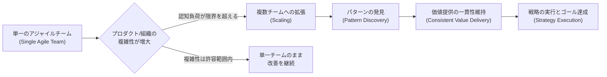
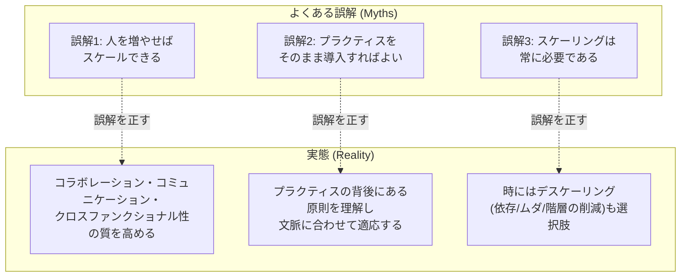
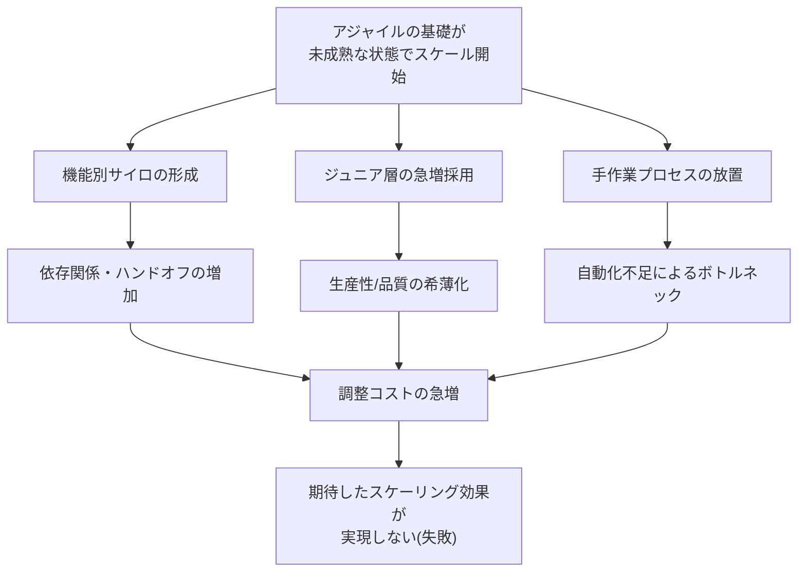
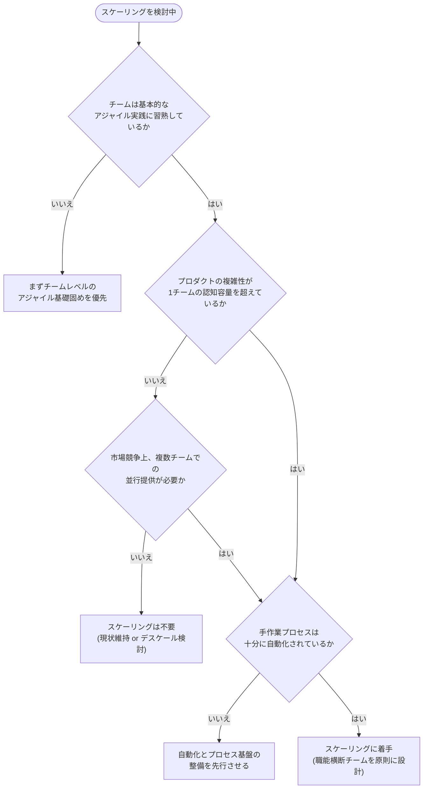
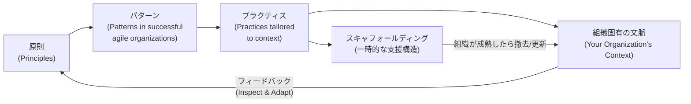
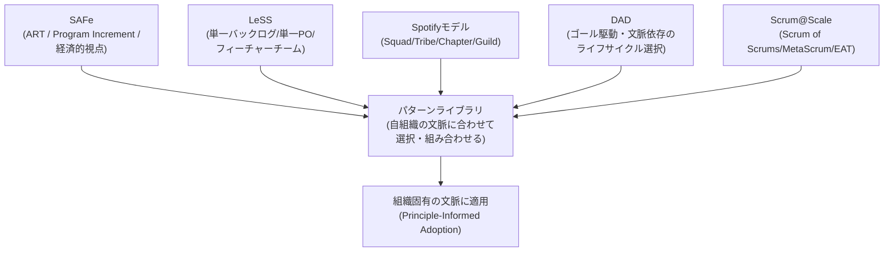
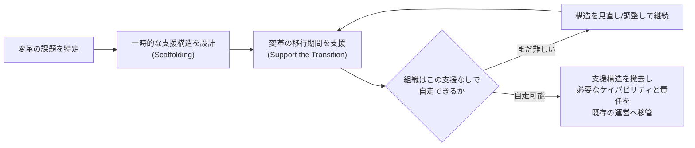
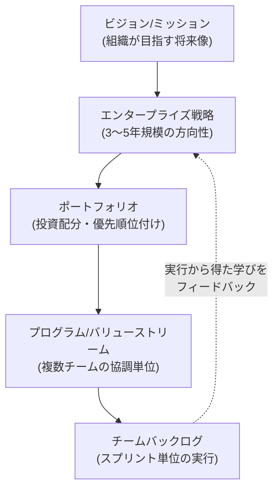
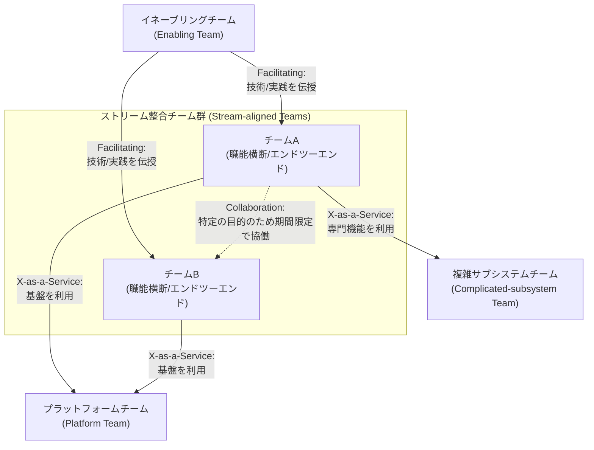
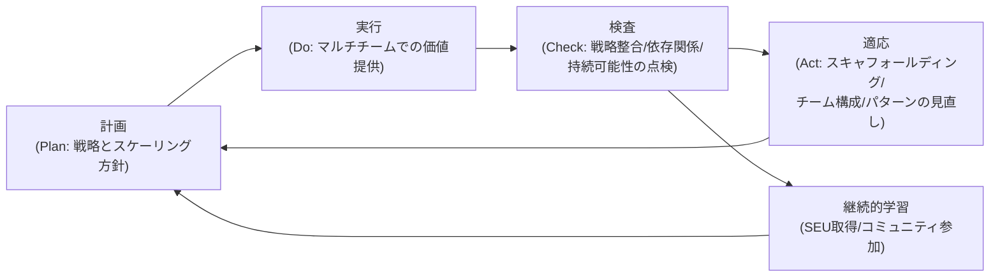

# Certified Agile Scaling Practitioner (CASP) 学習ガイド

初学者のためのステップバイステップ解説 + ベストプラクティス + 参考ソース集

---

## この資料について

本ガイドは、Scrum Alliance が提供する認定資格 **Certified Agile Scaling Practitioner (CASP)** の学習内容を、初学者にもわかりやすいように章立てし、各トピックについて

1. **ステップバイステップの詳細解説**
2. **Mermaid によるフローチャート/図解**
3. **ベストプラクティス**
4. **根拠となる公式ソース URL**

をセットで提供するものです。CASP は Scrum Alliance の現行の公式認定ページでは **Certified Agile Scaling Practitioner (CASP)** として案内されています(「Certified Agile Skills - Scaling 1 / CAS-Scaling 1 / CAS-S1」は CASP の旧称であり、Scrum Alliance の公式サポート記事「Why the CAS-S1 certification was renamed to Certified Agile Scaling Practitioner (CASP)」が改称の事実を明示しています)。カリキュラムの正式な章立ては、旧称時代に Scrum Alliance が一般公開した公式文書 **「CERTIFIED AGILE SKILLS - SCALING 1 Learning Objectives」(September 2023 / Last Updated 10/03/23)** で検証できます。同文書は学習目標を Part One: What is scaling? / Part Two: Using Patterns to Overcome Challenges at Scale / Part Three: Scaling Successfully and Sustainably の 3 部・計 50 項目(1.1–1.19 / 2.1–2.17 / 3.1–3.14)として定義しており、CAS-S1 と CASP は同一認定の旧称・現行名の関係にあるため、これが CASP のカリキュラムに対応する**検証可能な一次ソース**となります(現行の CASP 公式ページからは "CASP Learning Objectives" として Google ドライブ上の PDF がリンクされており、こちらは閲覧にサインインを求められます)。

そのため本ガイドは、この **CAS-S1 Learning Objectives** と **現行の CASP 公式コースページ** を検証・引用の基礎とし、これに **公式リソースライブラリの関連記事(すべて Scrum Alliance 発行)** を加えた一次ソース群から内容を再構成したうえで、業界で広く使われている補助的なフレームワーク・モデル(SAFe、LeSS、Spotify モデル、Team Topologies など)を「パターンの実例」として補足する構成を取っています。

> **対象読者**: Transformation Lead、People Manager、Leadership、Business Analyst、PMO Lead、Scrum Master、Agile Coach/Consultant、Team Lead など、組織のアジャイルスケーリングに関わるすべての人。
> **前提条件**: なし(ただしアジャイルの基礎知識があることが推奨されます)。

---

## 目次

0. [CASP資格の全体像](#0-casp資格の全体像)
1. [スケーリングとは何か(定義)](#1-スケーリングとは何か定義)
2. [アジャイルスケーリングにまつわる3つの誤解](#2-アジャイルスケーリングにまつわる3つの誤解)
3. [スケーリングが失敗する理由](#3-スケーリングが失敗する理由)
4. [いつスケールすべきか、いつすべきでないか](#4-いつスケールすべきかいつすべきでないか)
5. [原則主導・パターンベースのアプローチ(フレームワーク非依存の思想)](#5-原則主導パターンベースのアプローチフレームワーク非依存の思想)
6. [代表的スケーリングフレームワークからパターンを学ぶ](#6-代表的スケーリングフレームワークからパターンを学ぶ)
7. [スキャフォールディング(足場)の活用](#7-スキャフォールディング足場の活用)
8. [エンタープライズ戦略とスケーリングの整合](#8-エンタープライズ戦略とスケーリングの整合)
9. [マルチチーム・マルチサイトのアジャイル製品開発](#9-マルチチームマルチサイトのアジャイル製品開発)
10. [持続可能な変革を支える仕組み](#10-持続可能な変革を支える仕組み)
11. [まとめ: フレームワーク比較表と参考文献一覧](#11-まとめ-フレームワーク比較表と参考文献一覧)

---

## 0. CASP資格の全体像

### ステップ1: CASPとは何か

CASP (Certified Agile Scaling Practitioner) は、Scrum Alliance が提供する **Agile Skills-Based Certification(アジャイルスキルベース認定)** の一つです(旧称は "Certified Agile Skills - Scaling 1 / CAS-S1" で、旧コース案内やバッジ表記に残存する場合があります)。CSM や CSPO のように特定のロール(Scrum Master、Product Owner)を認定するものではなく、「組織がアジャイルの能力を複数チームに拡張する際に必要なスキルと考え方」を認定する、スキル横断型の資格として位置づけられています。

### ステップ2: 誰のための資格か

公式ページでは、以下のような役割の人に向いているとされています。

| 対象ロール | 学ぶ意義 |
|---|---|
| Transformation Lead | 変革が失敗する典型パターンを知り、スケーリングアプローチを評価できるようになる |
| People Manager | チームがアジャイルの原則・価値観・プラクティスを理解しながらスケールする支援ができる |
| Leadership(経営層) | 変革を成功させ、組織目標を達成し、変化への適応力を高める |
| Business Analyst | 柔軟なスケーリングにより戦略実行を高速化する方法を理解する |
| PMO Lead | 複数チーム・複数プロダクトにまたがるスケーリング手法を評価・適用できる |
| Scrum Master | 複数の Scrum チームにアジャイルを拡張する持続可能なアプローチの一端を担う |
| Agile Coach / Consultant | 特定フレームワークに縛られず、フレームワークの中にある「パターン」を活用してクライアントを支援する |
| Team Lead | チームが反復的・漸進的に働きながらマルチチーム開発を支援する方法を知る |

### ステップ3: 資格取得後に得られるもの

- **専門性(Expertise)**: 既存の人材・成功しているプラクティス・リソースを使い、持続可能にアジャイルの成果を高める方法
- **成長(Growth)**: 組織内のアジャイルの容量とケイパビリティの拡大
- **適応力(Adaptability)**: スケーリングが失敗する理由と、その課題への対処法
- **複雑性のマネジメント(Manage complexity)**: スケーリングに伴う組織・プロダクトの複雑性に対応するためのツールと自信

### ステップ4: 資格維持の仕組み(SEU)

Scrum Alliance の認定は「一度取得したら終わり」ではなく、2年ごとの更新が必要です。通常の更新経路は、**SEU (Scrum Education Units)** の取得・提出と**更新料の支払い**の両方を行うことです。なお Scrum Alliance の更新ポリシー上、これが唯一の経路ではなく、Scrum Alliance の認定コースを受講して新たな認定を取得した場合は、保有する既存の認定が自動的に更新されます。これは同一トラックの上位認定に限らず、別トラックの認定コースであっても更新経路になります。Scrum Alliance の公式リソースには SEU 対象として表示される記事・動画があり、ログインした状態でその記事・動画を最後まで学習し終えた場合に限って SEU を獲得できます(ログインせずに閲覧しただけ、途中で離脱しただけでは加算されません)。

### ベストプラクティス(全体像編)

- CASP を受講する前に、チームレベルの基礎的なアジャイル/Scrum の実践経験を積んでおく(公式には前提条件はないが、推奨されている)。
- 自組織でどのロールの人がスケーリングに関与しているかをまず洗い出し、CASP で学ぶ視点を「誰に」「どう」適用するかを意識しながら学習する。
- 資格を取って終わりにせず、SEU を継続的に獲得し、コミュニティ(メンター、ピア、専門家)とつながり続ける。

### 参考ソース

- Scrum Alliance 公式 CASP ページ: https://www.scrumalliance.org/get-certified/certified-agile-scaling-practitioner
- Scrum Education Units (SEU) の仕組み: https://www.scrumalliance.org/get-certified/scrum-education-units

---

## 1. スケーリングとは何か(定義)

### ステップ1: 公式の定義を理解する

Scrum Alliance は、スケーリング(Scaling)を次のように定義しています。

> アジャイルの能力と振る舞いを複数チームに拡張しながら、提供する価値を高めるためのプラクティスとパターンを見出していくこと。組織のスケーリングの目的は、目標を達成し、戦略をより良く実行することにあるべきである。

ポイントは、スケーリングは単に「チームの数を増やすこと」ではなく、**複数チームにアジャイルの本質(価値提供・変化への対応)を拡張しながら、組織固有の成功パターンを発見していくプロセス**だという点です。

### ステップ2: なぜスケーリングが必要になるのか

単一のアジャイルチームは、密なコミュニケーション、頻繁なフィードバックループ、反復的な開発サイクルによって高いパフォーマンスを発揮します。しかし、プロダクトやサービスの規模・複雑性が増すと、次のような理由から複数チームの関与が必要になります。

- プロダクトの範囲や複雑性が1チームの認知容量(Cognitive Load)を超える
- 複数の拠点・部門・専門領域にまたがる開発が必要になる
- 市場からのスピード要求(Time to Market)が高まる

### ステップ3: スケーリングの本質を見失わない

スケーリングは「もっと(more)」を追加することではありません。チームの数が増えても、依存関係の調整、目標の整合、品質の担保、プロダクトビジョンの一貫性という課題に体系的に対応できなければ、逆に俊敏性(Agility)が失われてしまいます。真のスケーリングの価値は、複数のアジャイルチームの協調的なエネルギーとイノベーションを活かして、より一貫して・より予測可能に価値を提供できるようになることにあります。

### 図解: 単一チームからマルチチームへの拡張

### ベストプラクティス

- スケーリングを「目的」にせず、あくまで「戦略実行とゴール達成の手段」として扱う。
- チーム数を増やす前に、単一チームレベルでアジャイルの原則が機能しているかを確認する。
- スケーリングの初期段階から、「どんなパターンが自組織にフィットするか」を観察・記録する文化を作る。
- 複雑性が増えても、フィードバックループの頻度・透明性・協働の質を落とさない設計を優先する。

### 参考ソース

- CASP 公式ページ(スケーリングの定義、学習目標): https://www.scrumalliance.org/get-certified/certified-agile-scaling-practitioner
- "When to Scale and When Not to Scale"(スケーリングの定義と本質): https://resources.scrumalliance.org/Article/scale-agile

---

## 2. アジャイルスケーリングにまつわる3つの誤解

Scrum Alliance のリソースライブラリでは、組織がスケーリングに失敗する背景にある典型的な誤解(Myth)が3つ紹介されています。それぞれを正しく理解することが、CASP の学習の出発点になります。

### ステップ1: 誤解1「スケーリング = 人を増やすこと」

多くの組織は「人を増やせばスケールできる」と考えがちですが、人数の増加は成功を自動的に保証しません。真に重要なのは、**コラボレーションの拡張・コミュニケーションの円滑化・プロセスの合理化・権限を持つクロスファンクショナルチームの育成**です。人数(quantity)ではなく、チームの力学・コミュニケーションスキル・専門性の多様性(quality)へと意識をシフトする必要があります。時期尚早にスケールすると、かえって「スケールアップ問題」を引き起こします。

### ステップ2: 誤解2「スケーリング = プラクティスを導入すること」

SAFe のような大規模フレームワークには多くのプラクティスが含まれていますが、組織固有の文脈を考慮せずにそれらを厳密に導入するだけでは、最適とは言えない結果につながります。真のアジャイルスケーリングとは、プラクティスの背後にある**原則**を理解し、それを自組織の要件・課題に合わせてカスタマイズすることです。繰り返し起きる問題を特定し、それに対応する戦略を採用するという、適応と継続的改善へのマインドシフトが本質です。

### ステップ3: 誤解3「スケーリングは常に必要である」

スケーリングが常に組織にとって唯一の正解だと考えるのも誤解です。実際には「**デスケーリング(de-scaling)**」、つまり依存関係・引き継ぎ(handoff)・ムダ・階層を減らすという方向性にも価値があります。複雑さに厳格にこだわることは、アジャイルの促進どころか阻害要因になり得ます。組織はスケールアップと同時に、デスケールできる機会も見極める必要があります。

### 図解: 誤解と実態の対比

### ベストプラクティス

- チームを増員する前に、既存チームのコラボレーション品質・コミュニケーションの流れ・サイロの有無を点検する。
- フレームワークのプラクティスを導入する際は「なぜこのプラクティスが存在するのか」という原則を必ずセットで学ぶ。
- 定期的に「今の組織にスケーリングは本当に必要か、デスケーリングすべき部分はないか」を問い直すレビューの場を設ける。
- スケーリングの成功指標を「チーム数」ではなく「価値提供の一貫性・予測可能性・顧客満足」に置く。

### 参考ソース

- "Agile Scaling Myths: Beyond Common Misconceptions": https://resources.scrumalliance.org/Article/agile-scaling-myths-common-misconceptions
- "When to Scale and When Not to Scale"(デスケーリングの視点): https://resources.scrumalliance.org/Article/scale-agile

---

## 3. スケーリングが失敗する理由

CASP の学習目標の一つに「なぜアジャイルスケーリングがしばしば失敗するのかを理解する」ことが明記されています。Scrum Alliance の公式コンテンツから読み取れる主な失敗要因を整理します。

### ステップ1: 基礎ができていない状態での見切り発車

チームがまだ基本的なアジャイルプラクティスに習熟していないうちにスケーリングの複雑性を持ち込むのは、「馬の前に荷車を置く」ようなものだとされています。スケーリングは、アジャイルの旅における「進歩の証」として捉えるべきであり、出発点ではありません。

### ステップ2: 安易な増員としての機能別サイロ化

需要の高まりに対応するため、組織はしばしば機能ごとのチーム(Functional Team)を作ってしまいます。一見効率的な分業に見えますが、実際にはタスクがチームをまたいで移動する必要が生じ、ボトルネックと依存関係が増加します。調整コストが急増し、期待したスケーリングの効果が実現しないことがよくあります。

### ステップ3: ジュニア層の急増による生産性の希薄化

急ぎでチームを拡大するために、経験の浅い人材を大量に採用してしまうケースも失敗要因の一つです。人数が増えても、それに比例して生産性や品質が向上するとは限りません。少数の高い専門性を持つ人材に投資する方が、結果的に多くを達成できることもあります。

### ステップ4: 手作業プロセスのボトルネック化

チームが増え、プロジェクトが複雑化するにつれて、自動化されていない手作業のプロセスが生産性のアキレス腱になります。特に複数チームにまたがる反復的なタスクの自動化が不足していると、一貫性の維持・品質の担保・スピードの確保が困難になります。

### 図解: 失敗の連鎖

### ベストプラクティス

- スケーリングに着手する前に、チームレベルのアジャイル成熟度(基本セレモニー・価値観の定着度)を評価する。
- 新しいチームを作る際は、機能別ではなく**クロスファンクショナル(職能横断)**を原則とする。
- 採用計画では、経験豊富な人材への投資と、ジュニア層の育成計画のバランスを設計段階で検討する。
- スケーリングの前に、繰り返し発生する手作業プロセス(ビルド、テスト、デプロイ、レポーティング等)の自動化状況を棚卸しする。

### 参考ソース

- "When to Scale and When Not to Scale"(失敗要因: ジュニア採用・サイロ・自動化不足): https://resources.scrumalliance.org/Article/scale-agile
- "Why Scaling Agility So Often Fails (And What to Do About It)"(動画): https://resources.scrumalliance.org/Video/scaling-agility-fails-and-it

---

## 4. いつスケールすべきか、いつすべきでないか

### ステップ1: 本質的複雑性と偶発的複雑性を見分ける

スケーリングの中心にあるのは「複雑性」の管理です。複雑性には、プロダクトやプロジェクトの性質上避けられない**本質的複雑性(Essential Complexity)**と、組織が成長する過程で偶発的に生まれる**偶発的複雑性(Accidental Complexity)**の2種類があります。この2つを見分け、それぞれに適した対処法を選べるかどうかが、スケーリングの成否を左右します。

### ステップ2: スケールすべき代表的な状況

**プロダクトの複雑性と認知過負荷**: プロダクトが成長するにつれて、設計・開発・テスト・デプロイ・保守の複雑さが1チームの処理能力を超えることがあります。この場合、複数チームに認知的な負荷を分散させることで、各チームが担当領域に深く集中できるようになります。

**市場からの競争圧力**: 市場でいち早く、あるいは少なくとも適時に価値を届けることが競争優位につながる状況では、複数チームを並行稼働させることで提供サイクルを加速させ、市場の変化や顧客フィードバックに迅速に対応できます。

### ステップ3: スケールが望ましくない代表的な状況

- **ジュニア層への安易な依存**: 人数を増やすだけでは、比例した生産性向上にはつながらない。
- **機能別サイロへの傾向**: 一見効率的だが、ボトルネックと依存関係を増大させる。
- **アジャイル経験の乏しいチーム**: 基礎的なアジャイルプラクティスが定着していない状態でスケールの複雑性を導入するのは時期尚早。
- **手作業プロセスの残存**: 自動化が不十分な状態でチームを増やすと、一貫性と品質の維持が困難になる。

### ステップ4: 意思決定のためのチェックリストとして使う

CASP ではこれらの視点を、フレームワークを機械的に適用するための判断基準としてではなく、**自組織の文脈の中でスケーリングの是非を検討するための問いかけ**として活用することが推奨されています。

### 図解: スケーリング判断のディシジョンフロー

### ベストプラクティス

- スケーリングの意思決定会議では、必ず「本質的複雑性」と「偶発的複雑性」を分けて議論する。
- t 字型人材(T-shaped: 一分野に深い専門性を持ちつつ複数分野に広い知識を持つ人材)の採用・育成を優先する。
- スケーリングを「一度きりの意思決定」ではなく、定期的に見直す継続的な問いとして扱う。
- スケールしないという判断も正当な戦略的選択肢であることをリーダーシップ層に周知する。

### 参考ソース

- "When to Scale and When Not to Scale": https://resources.scrumalliance.org/Article/scale-agile
- "Agile Scaling Myths: Beyond Common Misconceptions"(デスケーリングの視点): https://resources.scrumalliance.org/Article/agile-scaling-myths-common-misconceptions

---

## 5. 原則主導・パターンベースのアプローチ(フレームワーク非依存の思想)

CASP の最大の特徴は、**特定のスケーリングフレームワーク(SAFe、Spotify モデル等)を教え込む資格ではない**という点です。Scrum Alliance はこれを「Principle-Informed, Framework-Agnostic Course(原則に基づく、フレームワークに依存しないコース)」と明確に位置づけています。

### ステップ1: なぜ「文脈こそが王様」なのか

すべての組織は、その歴史・価値観・文化・市場でのポジショニングによって織り成された固有の存在です。既製品のフレームワークは、このような複雑な個別事情を一般化してしまうため、意図せず不整合や**アンチパターン**を助長することがあります。ある大企業にとって改善をもたらしたフレームワークが、異なる力学を持つ中小企業にとっては停滞や阻害要因になることさえあります。

### ステップ2: 「原則主導(Principle-Informed)」の考え方

これは、アジャイルの実践を支える根本的な原則を理解することに重点を置くアプローチです。原則にフォーカスすることで、組織は自らの価値観とビジネス文脈に密接に合致したプラクティスを形作ることができます。

### ステップ3: 「パターンベース(Patterns-Based)」の考え方

単一のフレームワークに厳密に従うのではなく、成功しているアジャイル組織に見られる**パターン**を観察し、それを自組織のニーズに合わせて適応させるアプローチです。CASP では SAFe・LeSS・Spotify モデル・DAD などのフレームワークに含まれる「パターン」を認識し、フレームワークそのものの効果を高める視点を養います。

### ステップ4: 「スキャフォールディング(Scaffolding)」の考え方

これは、組織の変革を支えるための**一時的な支援構造**を構築するという発想です。建築現場の足場のように、組織が成熟するにつれて修正されたり撤去されたりすることを前提とした、あくまで一時的な仕組みとして設計します(詳細は第7章)。

### ステップ5: 「アジャイルを使ってアジャイルになる(Using Agile to Become Agile)」

アジャイルを強制的に導入するのではなく、反復・フィードバック・適応というアジャイルの原則そのものを、変革のプロセス自体に適用するという発想です。小さく始め、フィードバックを集め、プロセスを反復的に改善していく、まさに一つのアジャイルチームが行うのと同じアプローチを、組織変革そのものに対して行います。

### 図解: 原則 → パターン → プラクティス → 文脈のループ

### ベストプラクティス

- フレームワークを導入する前に「このフレームワークが解決しようとしている原則的な課題は何か」を言語化する。
- 他社事例(例: トヨタのリーン生産方式、Zara の俊敏なサプライチェーン)を「コピー」ではなく「原則の適用例」として学ぶ。
- 変革チーム自身が、自らの変革活動に対してスプリント/レトロスペクティブのようなアジャイルの反復サイクルを適用する。
- スキャフォールディングとして導入した構造には、あらかじめ「見直し・撤去のタイミング」を設定しておく。

### 参考ソース

- "Why Certified Agile Scaling Practitioner Is Not a Framework": https://resources.scrumalliance.org/Article/cas-scaling-1-framework
- CASP 公式ページ(パターン認識・スキャフォールディングの言及): https://www.scrumalliance.org/get-certified/certified-agile-scaling-practitioner

---

## 6. 代表的スケーリングフレームワークからパターンを学ぶ

CASP は特定のフレームワークを推奨するものではありませんが、公式ページでは学習者が **LeSS、SAFe、Spotify モデル、DAD** などのフレームワークに含まれるパターンを認識し、その効果を高める力を養うことが明記されています。ここでは、それぞれのフレームワークが持つ代表的な「パターン」を、原則学習の補助教材として整理します。

### ステップ1: SAFe (Scaled Agile Framework) のパターン

SAFe は Dean Leffingwell によって開発された、リーン・アジャイル開発を企業規模で実践するための知識体系です。Team・Program・Large Solution・Portfolio という複数レベルの構造を持ち、**Program Increment (PI)** と呼ばれる共通のケイデンス(cadence)で複数チームの計画・実行を同期させる「ART (Agile Release Train)」という単位が中核パターンです。「経済的視点を持つ」「システム思考を適用する」など10の原則が土台になっています。

### ステップ2: LeSS (Large-Scale Scrum) のパターン

LeSS は「できるだけ標準の Scrum に近い形でスケールする」ことを志向するフレームワークです。**単一のプロダクトバックログ・単一のプロダクトオーナー・複数のフィーチャーチーム**という、Scrum の骨格をできる限り保ったままチーム数を増やすパターンが特徴です。Scrum Alliance の CASP 公式ページでは、LeSS コースが CASP と相性のよい選択肢として案内されています。

### ステップ3: Spotify モデルのパターン

Spotify モデルは、Spotify 社内の組織デザインを外部の実践者が事例化したもので、Spotify 自身は「フレームワーク」として提唱していない点に注意が必要です。**Squad(独立して機能を届ける小チーム)・Tribe(Squad の集合)・Chapter(職種ごとの横串)・Guild(関心を共有するコミュニティ)**という組織単位のパターンがよく引用されます。

### ステップ4: DAD (Disciplined Agile Delivery) のパターン

DAD(現在は PMI の Disciplined Agile として展開)は、単一のプロセスを強制するのではなく、**ゴール駆動・文脈依存(context-sensitive)でライフサイクルやプラクティスを選択する**という考え方を提供します。これは CASP の「原則主導・パターンベース」の思想と非常に親和性が高いフレームワークです。

### ステップ5: Scrum@Scale のパターン

Scrum@Scale は Scrum の生みの親の一人である Jeff Sutherland が提唱するモデルで、**Scrum of Scrums による調整・MetaScrum によるプロダクト側の整合・EAT (Executive Action Team) による組織側の整合**という、Scrum のイベント構造をフラクタル状に拡張するパターンを持ちます。

### 図解: 複数フレームワークからパターンを抽出する

### 比較表: 代表的スケーリングフレームワーク

| フレームワーク | 主な単位 | 調整の仕組み | 得意な文脈 |
|---|---|---|---|
| SAFe | ART (Agile Release Train) | Program Increment(共通ケイデンス) | 大規模・複数プログラムを持つエンタープライズ |
| LeSS | フィーチャーチーム | 単一プロダクトバックログ/単一PO | Scrum の骨格を保ったまま拡張したい組織 |
| Spotify モデル | Squad / Tribe | Chapter / Guild による横串連携 | プロダクト志向の自律分散型組織(元は Spotify 社内事例) |
| DAD (Disciplined Agile) | チーム(ライフサイクル選択制) | ゴール駆動の意思決定ガイド | プロセスの多様性・文脈依存性が高い組織 |
| Scrum@Scale | Scrum チームの集合 | Scrum of Scrums / MetaScrum / EAT | Scrum を土台にフラクタルに拡張したい組織 |

### ベストプラクティス

- どのフレームワークも「まるごと導入」するのではなく、自組織の課題に直接効くパターンだけを抽出して試す。
- 複数フレームワークのパターンを組み合わせる際は、矛盾する前提(例: 単一バックログ vs 複数プログラムの独立性)がないか事前に検討する。
- Spotify モデルのように「実際には特定企業の一事例」であるものは、普遍的な処方箋ではなく参考事例として扱う。
- フレームワーク選定の議論をする際は、CASP の「原則主導・パターンベース」の視点を判断基準として明示的に使う。

### 参考ソース

- "Why Certified Agile Scaling Practitioner Is Not a Framework"(SAFe/Spotify/Scrum@Scale への言及): https://resources.scrumalliance.org/Article/cas-scaling-1-framework
- CASP 公式ページ(LeSS/SAFe/Spotify/DAD への言及、LeSS コースとの連携): https://www.scrumalliance.org/get-certified/certified-agile-scaling-practitioner
- LeSS(Large-Scale Scrum)公式サイト: https://less.works/
- Scaled Agile Framework 公式サイト: https://scaledagileframework.com/
- Scrum@Scale 公式サイト: https://www.scrumatscale.com/
- Disciplined Agile(PMI)公式ページ: https://www.pmi.org/disciplined-agile
- Scrum Alliance の LeSS コース案内ページ: https://www.scrumalliance.org/get-certified/scaling/large-scale-scrum

---

## 7. スキャフォールディング(足場)の活用

### ステップ1: スキャフォールディングとは何か

建築工事現場の「足場」を思い浮かべてください。足場は建物そのものではなく、建物が完成するまでの**一時的な支援構造**です。CASP における「スキャフォールディング」も同じ発想で、組織の変革を望ましい方向に進めるための一時的な仕組み・役割・ガバナンス構造を指します。恒久的な官僚機構になってはならず、組織が成熟するにつれて修正または撤去されることが前提です。

### ステップ2: スキャフォールディングの具体例

- 変革初期に設置する**移行支援チーム(Transition Team)**
- 複数チームの実践知を共有するための**プラクティス共同体(Community of Practice)**
- 複数チーム間の依存関係を一時的に調整する**コーディネーション役割**(例: SAFe の Release Train Engineer のような橋渡し役)
- 変革の進捗をモニタリングするための**暫定ガバナンスボード**

### ステップ3: なぜ「一時的」であることが重要か

スキャフォールディングを恒久化してしまうと、それ自体が新たな階層・ムダ・依存関係を生み出し、第2章で見た「誤解2: プラクティスの導入だけでスケーリングが完成する」という罠に陥ります。スキャフォールディングは、組織が自走できる状態(セルフオーガナイズできる状態)に到達するための「補助輪」であり、補助輪はいずれ外すことを前提に設計しなければなりません。

### ステップ4: 撤去・進化のタイミングをどう判断するか

CASP の思想に沿えば、これも「フレームワークのルール」で機械的に判断するのではなく、**組織が実際にその支援構造なしで機能できるようになったかどうか**という観察に基づいて、継続的に見直す必要があります。

### 図解: スキャフォールディングのライフサイクル

### ベストプラクティス

- すべてのスキャフォールディングに「設置目的」と「撤去/見直しの判断基準」をセットで文書化する。
- スキャフォールディングの責任者を明確にし、定期的なレビュー(例: 四半期ごと)をカレンダーに組み込む。
- 一時的な役割・チームであることをメンバー自身にも明示し、キャリアパスの誤解を防ぐ。
- スキャフォールディングが増えすぎていないか(気づけば恒久的な官僚機構になっていないか)を定期的に棚卸しする。

### 参考ソース

- "Why Certified Agile Scaling Practitioner Is Not a Framework"(スキャフォールディングの定義): https://resources.scrumalliance.org/Article/cas-scaling-1-framework
- CASP 公式ページ("Explore the use of scaffolding" の記載): https://www.scrumalliance.org/get-certified/certified-agile-scaling-practitioner

---

## 8. エンタープライズ戦略とスケーリングの整合

### ステップ1: なぜ戦略との整合が必要か

CASP の学習目標には「スケーリングの取り組みをエンタープライズ戦略に整合させる(Align scaling efforts with your enterprise strategy)」ことが明記されています。スケーリングそのものは目的ではなく、**組織が戦略をより速く、より効果的に実行するための手段**です。整合が取れていないスケーリングは、チームが忙しく動いているのに組織のゴールに近づいていない、という状態を生み出します。

### ステップ2: 戦略を各レベルに伝播させる

大規模な組織では、経営層が描くビジョン・戦略が、ポートフォリオ・プログラム(バリューストリーム)・チームバックログへと段階的に具体化されていく必要があります。これは SAFe が Portfolio → Large Solution → Program → Team という階層で扱っている構造にも共通するパターンであり、CASP ではこれを特定フレームワークの専売特許としてではなく、**戦略を実行可能な単位に分解していく一般的なパターン**として学びます。

### ステップ3: 役割ごとの戦略整合の視点

- **PMO Lead**: 複数チーム・複数プロダクトにまたがるスケーリング手法を評価し、戦略実行速度を上げる。
- **Business Analyst**: 柔軟なスケーリングアプローチが、戦略をより速く・より効果的に実行する組織能力をどう改善するかを分析する。
- **Leadership**: 変革を成功させ、組織のゴールを達成し、顧客に結果を届け、急速に変化する環境に適応することに責任を持つ。

### ステップ4: 「戦略実行の速度」を測る

戦略との整合を評価する際は、単にプロジェクトの進捗ではなく、**戦略的な意思決定から実際の価値提供までのリードタイム**や、**戦略変更に対する組織の適応スピード**を指標として意識することが重要です。

### 図解: 戦略のカスケード(段階的な具体化)

### ベストプラクティス

- 戦略とチームの日々の作業の間に、必ず「なぜこの作業が戦略に貢献するのか」を説明できる中間レイヤー(ポートフォリオ/プログラム/バリューストリーム)を設ける。
- スケーリングの取り組みを評価する際は、アウトプット(完了したチケット数)ではなくアウトカム(戦略目標への貢献度)で測定する。
- 戦略が変化した際に、どのレベルまで素早く方向転換できるかを定期的に検証する(戦略のアジリティの点検)。
- PMO・Business Analyst・Leadership など、戦略に関わる異なる役割の間で「スケーリングの目的」の認識を揃える場を設ける。

### 参考ソース

- CASP 公式ページ("Align your organizational principles with appropriate scaling patterns" 等の記載): https://www.scrumalliance.org/get-certified/certified-agile-scaling-practitioner
- "Why Certified Agile Scaling Practitioner Is Not a Framework"(組織文脈と戦略の話): https://resources.scrumalliance.org/Article/cas-scaling-1-framework

---

## 9. マルチチーム・マルチサイトのアジャイル製品開発

### ステップ1: チーム間の依存関係とコンウェイの法則

複数チームが1つのプロダクトに関わるようになると、**チーム間の依存関係の管理**が中心的な課題になります。ここで重要になるのが**コンウェイの法則(Conway's Law)**です。これは「システムを設計する組織は、その組織のコミュニケーション構造をそのまま模倣したシステム設計を生み出す」という考え方で、組織構造とソフトウェアアーキテクチャは切り離せない関係にあることを示しています。チーム構成を設計する際は、望ましいアーキテクチャを実現できるコミュニケーション構造になっているかを意識する必要があります。

### ステップ2: Team Topologies に見るチーム設計のパターン

Team Topologies(Matthew Skelton, Manuel Pais)は、コンウェイの法則を積極的に活用しながら、高速なフロー(Fast Flow)を実現するための4つの基本的なチームタイプと3つのチーム間インタラクションモードを提示しています。CASP の「パターンを認識する」という学習目標に直結する、マルチチーム設計の代表的な考え方です。

- **ストリーム整合チーム(Stream-aligned team)**: ビジネス上の主要な価値の流れに沿い、他チームを待たずに増分を届けられる職能横断チーム
- **プラットフォームチーム(Platform team)**: ストリーム整合チームの認知負荷を下げる、共通基盤を提供するチーム
- **イネーブリングチーム(Enabling team)**: 他チームが新しい技術やプラクティスを習得する支援をするチーム
- **複雑サブシステムチーム(Complicated-subsystem team)**: 高度な専門知識を要する特定領域を担当するチーム

インタラクションモードは **コラボレーション(Collaboration)・X-as-a-Service・ファシリテーション(Facilitating)** の3種類があり、状況に応じて使い分けます。

### ステップ3: t 字型人材とクロスファンクショナルチーム

マルチチーム開発を成功させる鍵は、**t 字型人材(T-shaped)**、すなわち一つの専門分野に深い知見を持ちながら複数の分野にも幅広い知識を持つ人材の採用と育成です。t 字型人材が揃ったクロスファンクショナルチームは、他チームへの依存を減らし、スムーズな移行とボトルネックの回避を実現します。

### ステップ4: マルチサイト(複数拠点)特有の配慮

拠点や時差が分かれる場合は、次のような配慮が追加で必要になります。

- コアタイム(重複する稼働時間帯)の確保
- 共通の完成の定義(Definition of Done)と品質基準の明文化
- 非同期コミュニケーションを前提としたドキュメント文化の整備
- 拠点をまたぐ調整のための Scrum of Scrums のようなパターンの活用

### 図解: Team Topologies によるチーム間関係

### ベストプラクティス

- チーム構成を設計する前に、目指すアーキテクチャとコンウェイの法則の関係を明示的に議論する。
- 4つのチームタイプの中で「ストリーム整合チーム」を組織の標準形として最大化し、その他のチームタイプはそれを支援する位置づけにする。
- チーム間のインタラクションモードは固定せず、目的に応じて意図的に選び直す。Collaboration は発見に限らず、設計・実装・境界の調整など**特定の目的に対する期間限定の協働**として使い、目的を達したら解消する。移行先は X-as-a-Service とは限らず、能力移転が目的なら Facilitating、境界そのものが誤っていたならチーム構成の見直しが妥当な場合もある。
- マルチサイト環境では、非同期コミュニケーションを前提としたドキュメント基準を早期に整備する。
- 採用・育成計画に t 字型人材の育成パスを明示的に組み込む。

### 参考ソース

- "When to Scale and When Not to Scale"(t字型人材/クロスファンクショナルチームの重要性): https://resources.scrumalliance.org/Article/scale-agile
- CASP 公式ページ("multi-team, multi-site agile product development" の学習目標記載): https://www.scrumalliance.org/get-certified/certified-agile-scaling-practitioner
- Team Topologies 公式サイト: https://teamtopologies.com/
- コンウェイの法則(Conway's Law)の概説: https://en.wikipedia.org/wiki/Conway%27s_law

---

## 10. 持続可能な変革を支える仕組み

### ステップ1: 変革を「一度きりのイベント」にしない

CASP の学習目標には「マルチチーム・マルチサイトのアジャイル製品開発を実現し、持続可能で永続的な変革を推進する(drive sustainable, lasting transformation)」ことが含まれています。スケーリングの取り組みは、プロジェクトのように「完了」するものではなく、組織が変化し続ける限り継続していく活動です。

### ステップ2: 継続的な検査と適応(Inspect & Adapt)を組織レベルで回す

チームレベルのスプリントレトロスペクティブと同じ発想を、組織のスケーリング施策そのものにも適用します。定期的に「今のスケーリングの形は機能しているか」「どのスキャフォールディングを見直すべきか」「戦略との整合は保たれているか」を検査し、次のサイクルに反映させます。

### ステップ3: 継続的学習の制度化(SEU とコミュニティ)

Scrum Alliance の認定は、2年ごとの更新に SEU (Scrum Education Units) の取得と更新料の支払いが必要な設計になっており、「一度きりの資格」ではなく「学び続けることを証明するバッジ」として位置づけられています。CASP 取得者は、書籍・ウェビナー・イベントなど多様な学習機会を通じて SEU を積み上げながら、世界最大級のアジャイル実践者コミュニティのメンバーとして、ピアやメンター、専門家とつながり続けることができます。

### ステップ4: 持続可能性を測る視点

- スケーリング施策の見直しサイクルが定例化されているか
- スキャフォールディングの棚卸しが定期的に行われているか(第7章参照)
- チームの燃え尽き(バーンアウト)や離職率など、持続可能性を脅かす兆候をモニタリングしているか
- 組織が新しい市場変化やテクノロジー変化に対して、スケーリングの形そのものを進化させられているか

### 図解: 組織レベルの継続的改善サイクル

### ベストプラクティス

- 組織レベルのレトロスペクティブ(例: 四半期ごとの「スケーリング健全性レビュー」)を定例化する。
- SEU の取得状況を個人任せにせず、チームや組織単位で学習機会への参加を奨励する仕組みを作る。
- スケーリングの「形」自体を固定化せず、市場やテクノロジーの変化に応じて再設計する前提を組織文化として共有する。
- 燃え尽きや過度な調整コストなど、持続可能性を損なう兆候を早期に検知するための定性的・定量的な指標を設定する。

### 参考ソース

- CASP 公式ページ(持続可能な変革・コミュニティへの言及): https://www.scrumalliance.org/get-certified/certified-agile-scaling-practitioner
- Scrum Education Units (SEU): https://www.scrumalliance.org/get-certified/scrum-education-units
- Scrum Alliance メンバーシップの価値: https://www.scrumalliance.org/member-benefits

---

## 11. まとめ: フレームワーク比較表と参考文献一覧

### CASP の思想を1枚にまとめる

| 観点 | CASP が推奨するスタンス |
|---|---|
| フレームワーク選定 | 特定フレームワークへの全面依存を避け、パターンを抽出して組み合わせる(原則主導・パターンベース) |
| スケーリングの目的 | チーム数の増加ではなく、戦略実行とゴール達成の手段として位置づける |
| 複雑性への向き合い方 | 本質的複雑性と偶発的複雑性を見分け、必要ならデスケーリングも選択肢に入れる |
| 組織構造 | 機能別サイロを避け、クロスファンクショナル・ストリーム整合を志向する(Team Topologies のパターンを参照) |
| 変革の進め方 | 一時的なスキャフォールディングを活用し、アジャイル自体を変革のプロセスに適用する |
| 持続可能性 | 変革を一度きりのイベントにせず、継続的な検査・適応・学習(SEU)の仕組みに組み込む |

### 章と学習目標の対応表

| CASP 公式の学習目標 | 対応する章 |
|---|---|
| スケーリングの定義を理解する | 第1章 |
| なぜスケーリングが失敗するのかを知る | 第2章・第3章 |
| スケーリングの取り組みをエンタープライズ戦略に整合させる | 第8章 |
| マルチチーム・マルチサイトの製品開発を実現し、持続可能な変革を推進する | 第9章・第10章 |
| フレームワークの中のパターンを認識する(LeSS/SAFe/Spotify/DAD 等) | 第6章 |
| スキャフォールディングの活用を探る | 第7章 |
| フレームワーク非依存・原則主導のマインドセットを身につける | 第5章 |

### 参考文献・ソース一覧

**Scrum Alliance 公式ソース(一次情報)**

- CASP 公式コースページ: https://www.scrumalliance.org/get-certified/certified-agile-scaling-practitioner
- CAS-S1(CASP 旧称)Learning Objectives(公式カリキュラム文書。September 2023 / Last Updated 10/03/23): https://web.archive.org/web/20240304142037/https://www.scrumalliance.org/Media/Certifications/LOs/CAS-S1_Learning_Objectives.pdf
  - 内容の確認には上記 Internet Archive の保存版(2024-03-04 取得)を用いました。旧配布元 URL(https://www.scrumalliance.org/Media/Certifications/LOs/CAS-S1_Learning_Objectives.pdf)は 2026-08-28 時点で 404 を返します。
- CAS-S1 から CASP への改称に関する公式サポート記事: https://support.scrumalliance.org/hc/en-us/articles/27850872167579-Why-the-CAS-S1-certification-was-renamed-to-Certified-Agile-Scaling-Practitioner-CASP
- "Why Certified Agile Scaling Practitioner Is Not a Framework"(著者: Ahmed Avais): https://resources.scrumalliance.org/Article/cas-scaling-1-framework
- "Agile Scaling Myths: Beyond Common Misconceptions"(著者: Venkatesh Rajamani): https://resources.scrumalliance.org/Article/agile-scaling-myths-common-misconceptions
- "When to Scale and When Not to Scale"(著者: Adrian Perreau de Pinninck): https://resources.scrumalliance.org/Article/scale-agile
- "Why Scaling Agility So Often Fails (And What to Do About It)"(動画): https://resources.scrumalliance.org/Video/scaling-agility-fails-and-it
- Scrum Alliance LeSS コース案内: https://www.scrumalliance.org/get-certified/scaling/large-scale-scrum
- Scrum Education Units (SEU) について: https://www.scrumalliance.org/get-certified/scrum-education-units
- Scrum Alliance メンバーシップの価値: https://www.scrumalliance.org/member-benefits

**業界標準のスケーリングフレームワーク(パターン学習の補助ソース)**

- Scaled Agile Framework (SAFe) 公式サイト: https://scaledagileframework.com/
- LeSS (Large-Scale Scrum) 公式サイト: https://less.works/
- Scrum@Scale 公式サイト: https://www.scrumatscale.com/
- Disciplined Agile(PMI)公式ページ: https://www.pmi.org/disciplined-agile

**組織設計・チームトポロジー関連**

- Team Topologies 公式サイト: https://teamtopologies.com/
- コンウェイの法則(Conway's Law)概説(Wikipedia): https://en.wikipedia.org/wiki/Conway%27s_law

> **注記**: CASP のカリキュラムは、旧称 CAS-S1 時代に Scrum Alliance が一般公開した公式文書 "CERTIFIED AGILE SKILLS - SCALING 1 Learning Objectives"(September 2023 / Last Updated 10/03/23)で検証できます(配布元 URL は 2026-08-28 時点で 404 のため、上記の Internet Archive 保存版を参照)。一方、現行の CASP 公式ページからリンクされる "CASP Learning Objectives" PDF は Google ドライブ上でホストされ、閲覧にサインインを求められるため、本ガイド作成時点では現行版との差分を直接確認できていません。最新の正式なカリキュラム内容については、必ず公式コースページから最新のリンクを確認するか、認定トレーナーが実施する公式コースにご参加ください。
