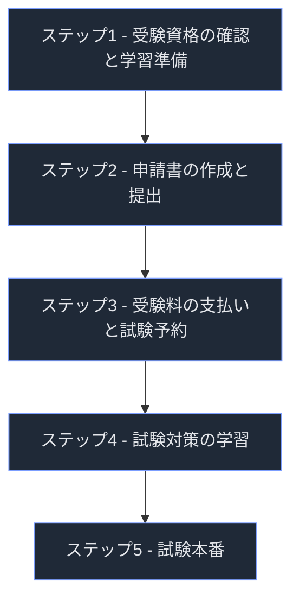
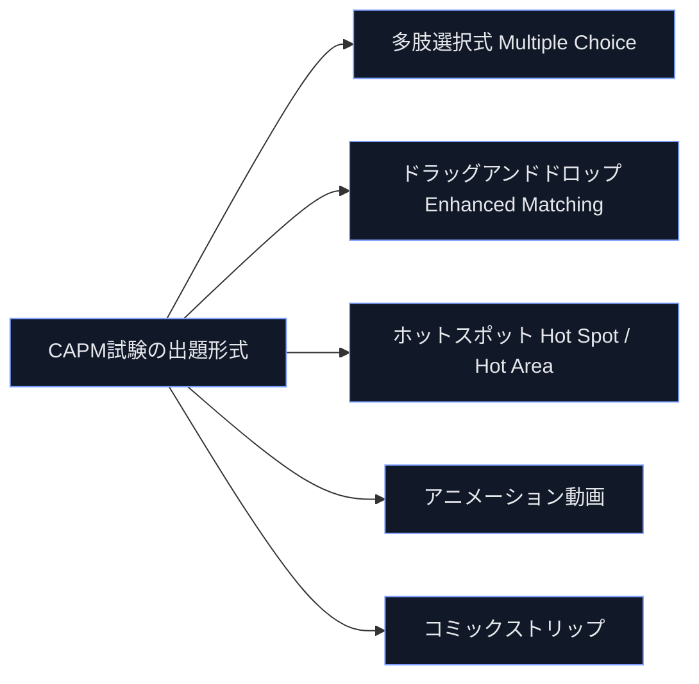
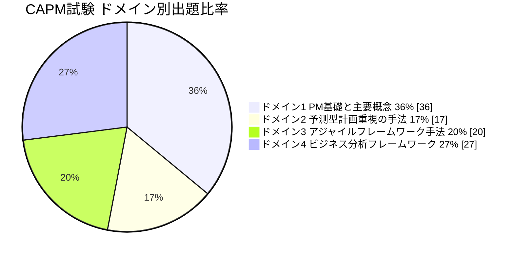
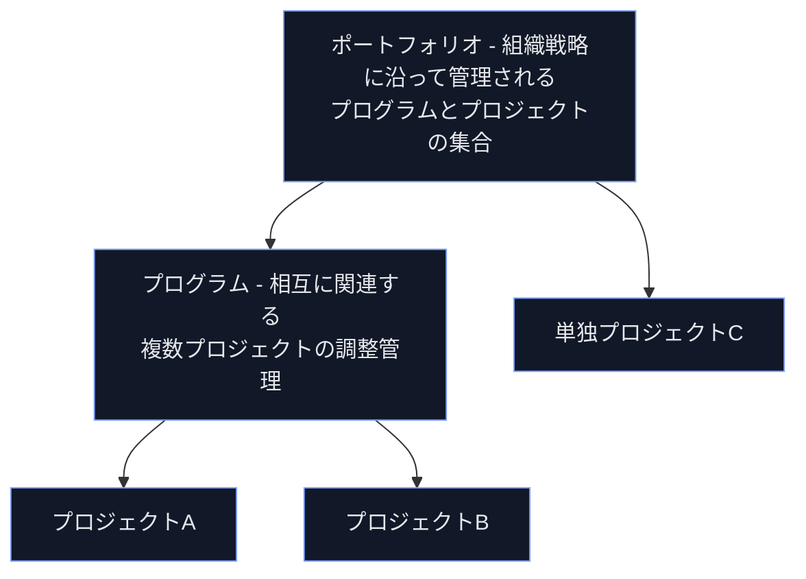
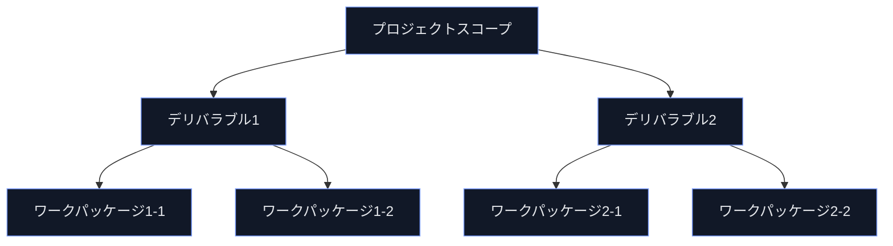
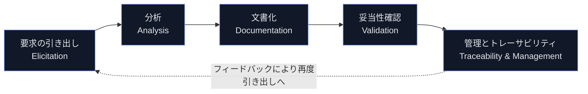
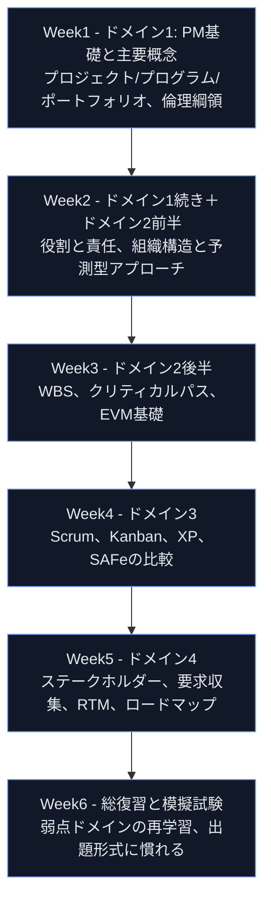

# CAPM®（Certified Associate in Project Management）認定資格 完全ガイド
### 初学者のためのステップバイステップ解説と出題領域別ベストプラクティス

> 本ガイドはPMI（Project Management Institute）公式サイトおよび公式試験内容概要（Exam Content Outline, ECO）に基づき作成しています。試験制度・料金・出題比率は改定される可能性があるため、受験前に必ずPMI公式サイトで最新情報をご確認ください。

---

## 目次

1. [CAPM認定資格とは何か](#1-capm認定資格とは何か)
2. [認定資格取得までのロードマップ（5ステップ）](#2-認定資格取得までのロードマップ5ステップ)
3. [受験資格（Eligibility Requirements）](#3-受験資格eligibility-requirements)
4. [試験の概要（フォーマット・出題形式）](#4-試験の概要フォーマット出題形式)
5. [試験内容概要（ECO）とドメイン別出題比率](#5-試験内容概要ecoとドメイン別出題比率)
6. [ドメイン1: プロジェクトマネジメントの基礎と主要概念（36%）](#6-ドメイン1-プロジェクトマネジメントの基礎と主要概念36)
7. [ドメイン2: 予測型・計画重視の手法（17%）](#7-ドメイン2-予測型計画重視の手法17)
8. [ドメイン3: アジャイルフレームワーク・手法（20%）](#8-ドメイン3-アジャイルフレームワークー手法20)
9. [ドメイン4: ビジネス分析フレームワーク（27%）](#9-ドメイン4-ビジネス分析フレームワーク27)
10. [用語集（初学者向けグロッサリー）](#10-用語集初学者向けグロッサリー)
11. [試験当日の心得とリテイクポリシー](#11-試験当日の心得とリテイクポリシー)
12. [資格維持（CCRプログラムとPDU）](#12-資格維持ccrプログラムとpdu)
13. [学習ロードマップ例（6週間プラン）](#13-学習ロードマップ例6週間プラン)
14. [まとめ](#14-まとめ)
15. [参考文献・出典（Sources）](#15-参考文献出典sources)

---

## 1. CAPM認定資格とは何か

**CAPM®（Certified Associate in Project Management）**は、米国PMI（Project Management Institute）が提供する、プロジェクトマネジメントの入門・実務経験不問の国際資格です。実務経験がなくても取得でき、「これからプロジェクトマネジメントのキャリアを始めたい人」「プロジェクトチームの一員として基礎知識を証明したい人」を主な対象としています。

PMI公式サイトでは、CAPMは経験不問（No experience required）の資格であり、予測型（ウォーターフォール型）のプロジェクトマネジメント、アジャイルの原則、ビジネス分析という3つの働き方（ways of working）にまたがる基礎知識と実務対応力を証明するものと説明されています。

### 1.1 CAPM取得で目指せるキャリアパス

PMI公式サイトが紹介している主なキャリアパスは次のとおりです。

| キャリアパス | 役割の概要 |
|---|---|
| Assistant Project Manager（プロジェクトマネージャー補佐） | PMを補佐し、進捗管理やドキュメント整備を担当 |
| Project Administrator（プロジェクト事務担当） | スケジュール・予算・議事録などプロジェクト運営の実務を担当 |
| Project Analyst（プロジェクトアナリスト） | データ分析やレポーティングを通じてプロジェクトを支援 |
| Project Coordinator（プロジェクトコーディネーター） | 複数チーム間の調整・情報連携を担当 |
| Project Manager（プロジェクトマネージャー） | プロジェクト全体の計画・実行・統制を担当 |
| PMI Technical Project Manager（テクニカルPM） | 技術領域に特化したプロジェクトマネジメントを担当 |

### 1.2 CAPMとPMBOK® Guideの関係

CAPMの出題内容は、PMIが実施したグローバル職務分析（Global Practice Analysis, GPA）とジョブタスク分析（Job Task Analysis, JTA）に基づいて設計されています。ECOはPMBOK® Guide 第7版の内容と重なる部分がありますが、完全に一致するものではありません。ECO策定に関わったタスクフォースはPMBOK® Guideに縛られず、エントリーレベル・アソシエイトレベルの実務者が実際に行う職務を基準にタスクを定義しています。

出題の根拠として、PMIは最低でも以下の複数の参考文献に基づいて問題を作成・レビューしていると明記しています。

- *A Guide to the Project Management Body of Knowledge（PMBOK® Guide）* 第7版
- *Process Groups: A Practice Guide*（2022）
- *The PMI Guide to Business Analysis*（2017）
- *Business Analysis for Practitioners: A Practice Guide* 第2版（2024）
- *Agile Practice Guide*（2017）
- *The Project Management Answer Book* 第2版
- *Effective Project Management: Traditional, Agile, Extreme, Hybrid* 第8版

これらすべてを読むことは必須ではありませんが、PMIは学習の参考として一読を推奨しています。

**ソース**: [PMI CAPM Certification](https://www.pmi.org/certifications/certified-associate-capm) / [CAPM Exam Content Outline PDF](https://www.pmi.org/-/media/pmi/documents/public/pdf/certifications/capm-exam-content-outline-english.pdf)

---

## 2. 認定資格取得までのロードマップ（5ステップ）

PMI公式サイトは、CAPM取得までのプロセスを5つのステップで示しています。

### ステップ1: 受験資格の確認と学習準備
高校卒業相当の学歴と、23時間以上のプロジェクトマネジメント教育の受講が必要です（詳細は第3章）。

### ステップ2: 申請書の作成と提出
PMI.orgのユーザーアカウントを作成し、学歴とプロジェクトマネジメント教育（23時間分）の情報をオンライン申請フォームに入力します。申請はセーブ・アズ・ユー・ゴー方式のため、途中で中断して後から再開することが可能です。

### ステップ3: 受験料の支払いと試験予約
申請が承認されたら受験料を支払い、Pearson VUEのテストセンター（推奨）またはオンライン監督試験（オンラインプロクタリング）で試験日を予約します。

### ステップ4: 試験対策の学習
PMIのオンデマンド講座、インストラクター主導コース、模擬試験など、複数の教材で試験範囲全体を学習します。

### ステップ5: 試験本番
150問・180分（休憩含まず）の試験を受験します。詳細は第4章で解説します。

**ベストプラクティス**
- 申請作業は「セーブ・アズ・ユー・ゴー」なので、教育履歴の証跡（受講証明書、修了証など）を事前にまとめておくと申請がスムーズです。
- PMIの監査（オーディット）プロセスに選ばれる場合があるため、23時間分の教育内容を記録した書類は保管しておくことが推奨されます。

**ソース**: [PMI CAPM Certification](https://www.pmi.org/certifications/certified-associate-capm)

---

## 3. 受験資格（Eligibility Requirements）

CAPMの受験資格は非常にシンプルで、実務経験は不要です。

| 要件区分 | 内容 |
|---|---|
| 学歴要件 | 高校卒業相当の学歴（高校卒業証書、GED、またはこれと同等のもの） |
| プロジェクトマネジメント教育要件 | 受験前に23時間以上のプロジェクトマネジメント教育を修了していること |

### 3.1 23時間の教育要件を満たす方法

以下のいずれかの教育提供者による研修・コースで満たすことができます。

- PMI認定トレーニングパートナー（Authorized Training Partners, ATP）
- PMIチャプター（ただし通常のチャプター会議自体は対象外。会議中に1時間以上の学習アクティビティが行われた場合のみ、その時間はカウント可）
- 雇用主・企業が提供する研修プログラム
- 研修会社・コンサルタントによるトレーニング
- 通信教育（コース修了時の評価を含むもの）
- 大学・カレッジの学部課程および継続教育プログラム

学習内容には、プロジェクトの品質・スコープ・タイム・コスト・リソース・コミュニケーション・リスク・調達・統合マネジメント、アジャイル、ビジネス分析などが含まれます。

PMIは以下のオンデマンド講座・インストラクター主導講座を教育要件充足の選択肢として案内しています。

- [PMI on-demand CAPM Exam Prep Course](https://www.pmi.org/dcpdp/sku/el068)
- [Instructor-Led CAPM® course（Authorized Training Partners経由）](https://www.pmi.org/learning/authorized-training-partners)

### 3.2 申請処理

申請は通常24時間以内に処理されます。ただしPMIの監査プロセスに選ばれた場合はこの限りではありません。

**ベストプラクティス**
- 23時間分の教育は「受験時までに完了していればよい」ため、複数の短い研修を積み重ねて要件を満たすことも可能です。
- 教育内容の記録は、いつ受講したかに関わらずすべて記録する必要があります。

**ソース**: [CAPM Exam Content Outline PDF](https://www.pmi.org/-/media/pmi/documents/public/pdf/certifications/capm-exam-content-outline-english.pdf)（p.11）

---

## 4. 試験の概要（フォーマット・出題形式）

### 4.1 試験の基本情報

| 項目 | 内容 |
|---|---|
| 問題数 | 150問（うち135問が採点対象、15問は無得点のプレテスト問題） |
| 試験時間 | 180分（3時間） |
| 休憩 | 75問終了後・全回答レビュー後に10分間の休憩あり（休憩開始後は前セクションの問題に戻れない） |
| チュートリアル・アンケート | 試験前後に任意（5〜15分、試験時間には含まれない） |
| 出題言語 | 英語、アラビア語、ブラジルポルトガル語、フランス語、ドイツ語、イタリア語、日本語、スペイン語、韓国語、簡体字中国語、繁体字中国語 |
| 受験形式 | Pearson VUEテストセンター（推奨）またはオンライン監督試験（OPT） |

プレテスト問題は採点対象外ですが、どの問題がプレテストかは受験者にはわからないため、全問に全力で取り組む必要があります。プレテスト問題は将来の試験問題の妥当性を検証する目的で無作為に配置されます。

### 4.2 出題形式（5種類）

CAPM試験は多肢選択式だけでなく、複数の出題形式で構成されています。

| 出題形式 | 内容 |
|---|---|
| 多肢選択式（Multiple Choice） | 一般的な4択形式の問題 |
| ドラッグアンドドロップ（Enhanced Matching） | 左列と右列の2つのボックス群を、シナリオに基づいてマッチングさせる（アラビア語受験者は左右逆） |
| ホットスポット／ホットエリア（Point and Click） | 提示された画像とシナリオに基づき、画像上の特定の領域をクリックして解答する |
| アニメーション動画 | 音声・字幕付きの短い動画を視聴し、内容に基づく多肢選択問題に解答する（テストセンターではヘッドフォンが貸与される） |
| コミックストリップ | シナリオが漫画形式で提示され、それに基づく多肢選択問題に解答する（オンライン監督試験ではコミックストリップ形式のみが出題され、音声トラブルを避けるためアニメーション動画は出題されない） |

**ベストプラクティス**
- ドラッグアンドドロップやホットスポットは操作に慣れていないと時間を消費しやすいため、模擬試験で事前に操作感覚をつかんでおくことが有効です。
- オンライン受験を選ぶ場合、アニメーション動画形式は出題されないため、テストセンター受験とは体感的な出題構成がやや異なる点に留意してください。

**ソース**: [CAPM Exam Content Outline PDF](https://www.pmi.org/-/media/pmi/documents/public/pdf/certifications/capm-exam-content-outline-english.pdf)（p.13-15）

---

## 5. 試験内容概要（ECO）とドメイン別出題比率

CAPM試験の出題範囲は「ECO（Exam Content Outline）」と呼ばれる公式文書で定義されています。ECOは以下の3階層で構成されます。

- **ドメイン（Domain）**: プロジェクトマネジメント実務に不可欠な、高レベルの知識領域
- **タスク（Task）**: 各ドメイン内でプロジェクトチームメンバーが担う職務
- **イネーブラー（Enabler）**: タスクに関連する具体的な作業の例示（網羅的リストではなく代表例）

### 5.1 ドメイン別出題比率

| ドメイン | 出題比率 |
|---|---|
| ドメイン1: プロジェクトマネジメントの基礎と主要概念 | 36% |
| ドメイン2: 予測型・計画重視の手法 | 17% |
| ドメイン3: アジャイルフレームワーク・手法 | 20% |
| ドメイン4: ビジネス分析フレームワーク | 27% |
| 合計 | 100% |

重要な注意点として、PMIはJTA（職務分析）の結果、今日のプロジェクトチームメンバーは様々なプロジェクト環境で、異なるアプローチ（予測型・適応型・ハイブリッド）を使い分けていると位置づけています。そのため、予測型・適応型・ビジネス分析の考え方は特定のドメインに閉じておらず、4つのドメイン全体を横断して出題される可能性があります。

### 5.2 ドメインとPMI標準文書の対応関係

| ドメイン | 主に対応するPMI標準・実務ガイド |
|---|---|
| ドメイン1: PM基礎と主要概念 | PMBOK® Guide 第7版／PMI Code of Ethics and Professional Conduct |
| ドメイン2: 予測型・計画重視の手法 | PMBOK® Guide 第7版／Process Groups: A Practice Guide |
| ドメイン3: アジャイルフレームワーク・手法 | Agile Practice Guide／各フレームワーク公式ガイド（Scrum Guide、Kanban Guideなど） |
| ドメイン4: ビジネス分析フレームワーク | The PMI Guide to Business Analysis／Business Analysis for Practitioners: A Practice Guide |

**ソース**: [CAPM Exam Content Outline PDF](https://www.pmi.org/-/media/pmi/documents/public/pdf/certifications/capm-exam-content-outline-english.pdf)（p.5-6） / [PMI CAPM Certification](https://www.pmi.org/certifications/certified-associate-capm)

---

## 6. ドメイン1: プロジェクトマネジメントの基礎と主要概念（36%）

最大の出題比率を占めるドメインです。プロジェクトの定義、計画の目的、役割分担、問題解決の基本手法など、他の3ドメインを理解するための土台となる知識が問われます。

### 6.1 タスク構成

| タスク | 主なイネーブラー（出題される知識・スキルの例） |
|---|---|
| タスク1: プロジェクトのライフサイクルとプロセスの理解 | プロジェクト・プログラム・ポートフォリオの区別／プロジェクトと定常業務（オペレーション）の区別／予測型と適応型アプローチの区別／課題・リスク・前提・制約の区別／プロジェクトスコープのレビューと検証／PM倫理綱領のシナリオへの適用／プロジェクトが変革の手段となる仕組みの説明 |
| タスク2: プロジェクトマネジメント計画の理解 | コスト・品質・リスク・スケジュール等の目的と重要性／プロジェクトマネジメント計画と製品マネジメント計画の違い／マイルストーンとタスク期間の違い／必要なリソースの数と種類の判断／リスクレジスターの活用／ステークホルダーレジスターの活用／プロジェクトクロージャーと移行の説明 |
| タスク3: プロジェクトの役割と責任の理解 | プロジェクトマネージャーとスポンサーの役割比較／プロジェクトチームとスポンサーの役割比較／PMの役割（イニシエーター、交渉役、傾聴者、コーチ、実務メンバー、ファシリテーター）の重要性／リーダーシップとマネジメントの違い／感情的知性（EQ）とその影響 |
| タスク4: 計画された戦略・フレームワークの実行方法の決定 | コミュニケーション計画やリスク計画などへの適切な対応例／プロジェクトの立ち上げとベネフィット計画の説明 |
| タスク5: 一般的な問題解決ツール・技法の理解 | 会議の効果性評価／フォーカスグループ・スタンドアップミーティング・ブレインストーミング等の目的の説明 |

### 6.2 主要概念の解説（初学者向け）

#### プロジェクト・プログラム・ポートフォリオの違い

- **プロジェクト**: 独自の成果物・サービス・結果を生み出すために実施される、開始日と終了日のある有期的な業務。
- **プログラム**: 個別に管理するよりもまとめて管理したほうがメリットが大きい、関連する複数プロジェクト・サブプログラム・プログラム活動の集合。
- **ポートフォリオ**: 組織の戦略目標を達成するためにグループとして管理される、プロジェクト・プログラム・サブポートフォリオ・定常業務の集合。

#### プロジェクトと定常業務（オペレーション）の違い

プロジェクトは独自性と有期性を持ちます（終わりがある）。一方、オペレーションは組織を継続的に維持するための、反復的・恒常的な活動です。

#### 予測型アプローチと適応型アプローチの違い

| 観点 | 予測型（Predictive） | 適応型（Adaptive） |
|---|---|---|
| 計画の作り方 | プロジェクト序盤で詳細な計画を確定 | 短いサイクルで計画を継続的に見直す |
| 変更への対応 | 変更管理プロセスを通じて統制 | 変更を前提とし、積極的に取り込む |
| 適した状況 | 要求が明確で変化が少ないプロジェクト | 要求が不確実、または変化が速いプロジェクト |
| 進捗の測定 | EVM（アーンドバリューマネジメント）等 | ベロシティ、バーンダウン等 |

#### 課題・リスク・前提・制約の違い

| 用語 | 定義 |
|---|---|
| 課題（Issue） | 現在すでに発生している問題で、対応が必要なもの |
| リスク（Risk） | 発生するかどうか不確実な、プロジェクトに影響を与えうる事象 |
| 前提（Assumption） | 証明せずに真実・事実として受け入れている事柄 |
| 制約（Constraint） | プロジェクトの選択肢を制限する要因（予算上限、納期など） |

#### PMI倫理綱領（Code of Ethics and Professional Conduct）

PMIの倫理綱領は、責任（Responsibility）・尊重（Respect）・公正（Fairness）・誠実（Honesty）という4つの価値観を中心に構成されており、PMI会員・資格保有者・資格申請者すべてに適用されます。綱領は「アスピレーショナル基準（努力目標としての基準）」と「マンダトリー基準（違反すると懲戒対象になりうる必須基準）」の2種類で構成されているのが特徴です。

> 補足: PMIの倫理綱領は2025年11月17日付で改訂版が発効しており、AI活用における責任あるリーダーシップやサステナビリティに関する期待が新たに明文化されています。CAPM学習時は、綱領の4つの核となる価値観（責任・尊重・公正・誠実）の理解を軸にしつつ、最新版の内容をPMI公式ページで確認することを推奨します。

#### リーダーシップとマネジメントの違い

- **マネジメント**: 計画・組織化・統制など、既存のプロセスやリソースを効率的に運用する働き。
- **リーダーシップ**: ビジョンを示し、人を動機づけ、変化に向けてチームを導く働き。
- 優れたPMは両方の要素をバランスよく発揮する必要があるとされます。

#### 感情的知性（EQ）

EQ（Emotional Intelligence）とは、自分自身や他者の感情を認識し、それを適切にマネジメントする能力です。ステークホルダーとの関係構築、コンフリクトマネジメント、チームのモチベーション維持において重要な役割を果たします。

### 6.3 ドメイン1のベストプラクティス

- **予測型・適応型・課題/リスク/前提/制約といった対概念は、必ずペアで、かつ具体例とセットで覚える。** 用語の定義だけを暗記するより、シナリオ問題への対応力が高まります。
- **PMBOK® Guide 第7版の「12の原則」を土台として理解する。** 第7版は従来の「プロセス群・知識エリア」中心の構成から、「スチュワードシップ」「協働的なチーム環境」「ステークホルダーとの関わり」「価値への焦点」など、行動原則を重視する構成に転換しています。これはドメイン1の「役割・責任」「問題解決」の出題と密接に関連します。
- **PMI倫理綱領の4つの価値観（責任・尊重・公正・誠実）は、シナリオ問題で「この状況でPMがまずすべき行動は何か」を問う形式で頻出します。** 綱領の条文を丸暗記するより、「誠実な報告」「利益相反の開示」「多様性の尊重」といった行動原則を状況に当てはめる練習が有効です。
- **リスクレジスター・ステークホルダーレジスターは「何が記録されるか」だけでなく「なぜ・いつ使うか」を理解する。** 出題は定義よりも活用シナリオに寄っています。

**ソース**:
- [CAPM Exam Content Outline PDF](https://www.pmi.org/-/media/pmi/documents/public/pdf/certifications/capm-exam-content-outline-english.pdf)（p.7）
- [PMI Code of Ethics and Professional Conduct（ガイドライン）](https://www.pmi.org/about/ethics/guidelines)
- [PMI Code of Ethics and Professional Conduct（PDF）](https://www.pmi.org/-/media/pmi/documents/public/pdf/ethics/pmi-code-of-ethics.pdf)
- [PMBOK® Guide（PMI Standards）](https://www.pmi.org/standards/pmbok)

---

## 7. ドメイン2: 予測型・計画重視の手法（17%）

「予測型（Predictive、いわゆるウォーターフォール型）」アプローチの適用判断と、スケジュール・コスト管理の基本ツールが問われるドメインです。

### 7.1 タスク構成

| タスク | 主なイネーブラー |
|---|---|
| タスク1: 予測型・計画重視アプローチが適切な場面の説明 | 組織構造（バーチャル、コロケーション、マトリクス、階層型など）への適合性判断／各プロセス内の活動の特定／各プロセスにおける典型的な活動の例示／プロジェクト構成要素間の違いの区別 |
| タスク2: プロジェクトマネジメント計画のスケジュールの理解 | クリティカルパス法（CPM）の適用／スケジュール差異の計算／WBS（作業分解構成図）の説明／ワークパッケージの説明／品質マネジメント計画の適用／統合マネジメント計画の適用 |
| タスク3: 予測型プロジェクトのプロジェクト統制の文書化方法の決定 | 予測型プロジェクトで使用されるアーティファクト（成果物・記録物）の特定／コストおよびスケジュール差異の計算 |

### 7.2 主要概念の解説（初学者向け）

#### 組織構造と予測型アプローチの適合性

| 組織構造 | 特徴 | 予測型アプローチとの相性 |
|---|---|---|
| 機能別組織（Hierarchical） | 部門ごとに縦割りで管理される伝統的構造 | PMの権限が弱く、予測型でも調整コストが高くなりやすい |
| マトリクス組織（Matrix） | 機能部門とプロジェクトの両方に人員が所属 | 弱い・強いマトリクスの度合いによりPMの権限が変動 |
| プロジェクト型組織 | プロジェクトのために編成された専任チーム | PMの権限が強く、計画重視のアプローチと親和性が高い |
| バーチャル組織（Virtual） | 地理的に分散したチームがオンラインで協働 | コミュニケーション計画の比重が特に重要になる |
| コロケーション（Colocation） | チームが同じ物理空間に集まって作業 | 対面コミュニケーションが取りやすく、意思決定が速い |

#### WBS（Work Breakdown Structure：作業分解構成図）

プロジェクトスコープをチームが管理しやすい単位（ワークパッケージ）まで階層的に分解したものです。

- **デリバラブル**: プロジェクトが生み出す成果物や中間成果物。
- **ワークパッケージ**: WBSの最下層に位置する、スケジュールとコストの見積り・監視が可能な最小単位の作業。

#### クリティカルパス法（Critical Path Method, CPM）

プロジェクト全体の最短完了日数を決定する、最も長い一連のアクティビティ（クリティカルパス）を特定する技法です。クリティカルパス上のアクティビティが遅延すると、プロジェクト全体の完了日も遅延します。フロート（余裕時間）がゼロのアクティビティがクリティカルパス上に存在します。

#### スケジュール差異とコスト差異の計算（EVM基礎）

予測型プロジェクトの進捗管理でよく使われる、アーンドバリューマネジメント（EVM）の基本指標です。

| 指標 | 計算式 | 意味 |
|---|---|---|
| スケジュール差異（SV: Schedule Variance） | SV = EV − PV | プラスなら予定より進んでいる、マイナスなら遅れている |
| コスト差異（CV: Cost Variance） | CV = EV − AC | プラスなら予算内、マイナスなら予算超過 |

（EV: Earned Value＝出来高、PV: Planned Value＝計画価値、AC: Actual Cost＝実コスト）

#### 品質マネジメント計画・統合マネジメント計画

- **品質マネジメント計画**: プロジェクトおよび成果物が満たすべき品質基準と、それを検証する方法を定義する計画。
- **統合マネジメント計画（プロジェクトマネジメント計画）**: スコープ・スケジュール・コスト・品質・リスクなど、各領域の計画を1つに統合し、プロジェクト全体を一貫して管理するための計画。

### 7.3 ドメイン2のベストプラクティス

- **WBSとワークパッケージは「分解の粒度」を問う問題が多い。** ワークパッケージは「見積り・スケジューリング・監視が可能な最小単位」という定義を軸に、選択肢の中から適切な粒度を判断する練習をしましょう。
- **クリティカルパスの計算問題は、フォワードパス（最早開始・最早終了）とバックワードパス（最遅開始・最遅終了）の考え方を図で描いて解く習慣をつけると得点が安定します。**
- **SVとCVの符号（プラス/マイナス）の意味を混同しないこと。** 「マイナス=悪い状態」という理解を軸に、EV・PV・ACの3指標の関係を整理しましょう。
- **予測型が適さない状況（要求が流動的、頻繁なフィードバックが必要など）も合わせて理解しておくと、ドメイン3（アジャイル）との比較問題にも対応しやすくなります。**

**ソース**:
- [CAPM Exam Content Outline PDF](https://www.pmi.org/-/media/pmi/documents/public/pdf/certifications/capm-exam-content-outline-english.pdf)（p.8）
- [PMBOK® Guide（PMI Standards）](https://www.pmi.org/standards/pmbok)
- [PMI Standards & Publications 一覧](https://www.pmi.org/standards)

---

## 8. ドメイン3: アジャイルフレームワーク・手法（20%）

適応型（アジャイル）アプローチの適用判断、イテレーション計画、代表的なアジャイルフレームワークの特徴が問われるドメインです。

### 8.1 タスク構成

| タスク | 主なイネーブラー |
|---|---|
| タスク1: 適応型アプローチが適切な場面の説明 | 適応型と予測型・計画重視プロジェクトのメリット・デメリットの比較／組織構造への適応型アプローチの適合性判断／適応型アプローチの採用を促進する組織のプロセス資産（OPA）と組織体の環境要因（EEF）の特定 |
| タスク2: プロジェクトイテレーションの計画方法の決定 | イテレーションの論理的な単位の区別／イテレーションのメリット・デメリットの解釈／WBSを適応型イテレーションへ変換／スコープのインプットの決定／適応型と予測型の進捗追跡の違いの説明 |
| タスク3: 適応型プロジェクトのプロジェクト統制の文書化方法の決定 | 適応型プロジェクトで使用されるアーティファクトの特定 |
| タスク4: 適応型計画の構成要素の説明 | 異なる適応型手法（Scrum、エクストリームプログラミング（XP）、Scaled Agile Framework（SAFe®）、Kanbanなど）の構成要素の区別 |
| タスク5: タスクマネジメントの準備・実行方法の決定 | 適応型プロジェクトマネジメントタスクの成功基準の解釈／適応型プロジェクトマネジメントにおけるタスクの優先順位付け |

### 8.2 主要概念の解説（初学者向け）

#### アジャイルの基本思想

アジャイルの考え方の土台は、2001年に策定された「アジャイルソフトウェア開発宣言（Agile Manifesto）」にあります。宣言は4つの価値観を示しています。

- プロセスやツールよりも、個人と対話を
- 包括的なドキュメントよりも、動くソフトウェアを
- 契約交渉よりも、顧客との協調を
- 計画に従うことよりも、変化への対応を

これを支える12の原則には、「顧客満足を最優先し、価値のあるソフトウェアを早く継続的に提供する」「要求の変化を歓迎する」「動くソフトウェアを主要な進捗の尺度とする」などが含まれます。

#### 予測型 vs 適応型のメリット・デメリット比較

| 観点 | 予測型のメリット | 適応型のメリット |
|---|---|---|
| 計画の精度 | 序盤で全体像・予算が見えやすい | 学びながら計画を継続的に精緻化できる |
| 変化への対応 | 変更管理プロセスで統制が効く | 変化を前提に、頻繁なフィードバックで軌道修正できる |
| 顧客との関わり | 序盤の要件定義が中心 | 各イテレーションで継続的にレビューを受けられる |
| 適したプロジェクト例 | 建設・規制対応など要求が固定的な案件 | ソフトウェア開発・新規事業など不確実性が高い案件 |

#### イテレーション計画とWBSの変換

適応型アプローチでは、WBS的なスコープの分解を、プロダクトバックログという形で「価値のある単位（ユーザーストーリーなど）」に翻訳し、それを一定期間（スプリント／イテレーション）ごとに区切って計画します。予測型の進捗追跡がEVM（SV/CVなど）を用いるのに対し、適応型ではベロシティやバーンダウンチャートなど、完成した作業量を基準にした指標が使われます。

#### 代表的な適応型（アジャイル）フレームワークの比較

| フレームワーク | 主な単位・ケイデンス | 主な役割 | 主なアーティファクト | 特徴 |
|---|---|---|---|---|
| Scrum | スプリント（通常1〜4週間の固定期間） | プロダクトオーナー、スクラムマスター、開発者 | プロダクトバックログ、スプリントバックログ、インクリメント | 役割・イベント・アーティファクトが明確に定義された軽量フレームワーク |
| Kanban | 継続的フロー（固定の期間区切りなし） | 特定の必須役割は定義されない | カンバンボード、WIP（仕掛り作業）制限 | 既存のプロセスに追加する「改善の方法」であり、単独の開発フレームワークではない |
| エクストリームプログラミング（XP） | 短いイテレーション | 開発者中心 | ユーザーストーリー、テスト駆動開発の成果物 | ペアプログラミングやテスト駆動開発など、技術プラクティスを重視 |
| SAFe®（Scaled Agile Framework） | イテレーション＋PIプランニング（複数イテレーションの束） | チームレベル〜ポートフォリオレベルまで階層的な役割 | プログラムバックログなど複数レベルのバックログ | 複数のアジャイルチームを企業規模でスケールさせるためのフレームワーク |

#### Scrumのサイクル

#### Kanbanのフロー

#### タスクの優先順位付け

適応型プロジェクトでは、価値・リスク・依存関係などをもとにバックログアイテムの優先順位を継続的に見直します。代表的な優先順位付けの考え方には、MoSCoW法（Must/Should/Could/Won't）や、価値とコストのバランスで判断するWSJF（Weighted Shortest Job First、SAFeで使用）などがあります。

### 8.3 ドメイン3のベストプラクティス

- **「Kanbanはフレームワークではなく方法（メソッド）である」という位置づけの違いを理解しておく。** Kanban Universityの公式ガイドは、Kanbanを既存のプロセス・フレームワークに追加して改善するための方法と定義しており、Scrumのような役割やイベントを規定するフレームワークとは性質が異なります。
- **Scrum Guideの最新版（2020年版）では、開発チームは「自己組織化（self-organizing）」ではなく「自己管理（self-managing）」という表現が使われている点、スプリントゴールとDone(完成)の定義が必須要素として明確化された点を押さえておくと、細かい選択肢の判別に役立ちます。**
- **組織のプロセス資産（OPA）と組織体の環境要因（EEF）の違いを整理する。** OPAは組織内部の方針・手順・過去の教訓など「組織がコントロールできるもの」、EEFは市場状況・規制・企業文化など「プロジェクトを取り巻く外部・内部の状況で、通常コントロールが難しいもの」を指します。適応型アプローチの採用を後押しする要因として、双方の観点から出題される可能性があります。
- **予測型と適応型を「対立」ではなく「使い分け」として捉える。** ECOはハイブリッドアプローチ（両方の要素を組み合わせる手法）の存在を前提としているため、「常にどちらかが正しい」という二択的な理解は避けましょう。

**ソース**:
- [CAPM Exam Content Outline PDF](https://www.pmi.org/-/media/pmi/documents/public/pdf/certifications/capm-exam-content-outline-english.pdf)（p.9）
- [Agile Practice Guide（PMI Standards）](https://www.pmi.org/standards/agile)
- [The Scrum Guide（公式）](https://scrumguides.org/)
- [The Official Guide to the Kanban Method（Kanban University公式）](https://kanban.university/kanban-guide/)
- [Scaled Agile Framework（SAFe公式）](https://framework.scaledagile.com/)
- [Agile Manifesto（公式）](https://agilemanifesto.org/) / [12 Principles](https://agilemanifesto.org/principles.html)

---

## 9. ドメイン4: ビジネス分析フレームワーク（27%）

出題比率2位の重要ドメインです。ステークホルダーの役割理解、要求の収集・文書化・トレーサビリティ管理、プロダクトロードマップ、要求の妥当性確認といった、ビジネス分析（Business Analysis, BA）の基本プロセスが問われます。

### 9.1 タスク構成

| タスク | 主なイネーブラー |
|---|---|
| タスク1: BAの役割と責任の理解 | ステークホルダーの役割（プロセスオーナー、プロセスマネージャー、プロダクトマネージャー、プロダクトオーナーなど）の区別／役割・責任を定義する必要性の説明／内部・外部の役割の区別 |
| タスク2: ステークホルダーコミュニケーションの実施方法の決定 | 最適なコミュニケーションチャネル・ツール（レポーティング、プレゼンテーションなど）の推奨／BAにとってチーム間コミュニケーションが重要である理由の説明 |
| タスク3: 要求収集の方法の決定 | ツールとシナリオのマッチング（ユーザーストーリー、ユースケースなど）／状況に応じた要求収集アプローチの特定（ステークホルダーインタビュー、アンケート、ワークショップ、レッスンズラーンドなど）／要求トレーサビリティマトリクス（RTM）・プロダクトバックログの説明 |
| タスク4: プロダクトロードマップの理解 | プロダクトロードマップの適用方法の説明／どの構成要素がどのリリースに含まれるかの判断 |
| タスク5: プロジェクト手法がBAプロセスに与える影響の判断 | 適応型・予測型アプローチにおけるBAの役割の判断 |
| タスク6: プロダクトデリバリーを通じた要求の妥当性確認 | 受け入れ基準（アクセプタンスクライテリア）の定義／RTM・プロダクトバックログに基づくプロジェクト/プロダクトの提供準備の判断 |

### 9.2 ビジネス分析の基本プロセスフロー

### 9.3 主要概念の解説（初学者向け）

#### ステークホルダーの役割の違い

| 役割 | 説明 |
|---|---|
| プロセスオーナー（Process Owner） | 特定の業務プロセス全体に対する説明責任を持つ人 |
| プロセスマネージャー（Process Manager） | 日常的なプロセス運用を管理する人 |
| プロダクトマネージャー（Product Manager） | プロダクト全体の戦略・ビジョン・ロードマップに責任を持つ人 |
| プロダクトオーナー（Product Owner） | （主にScrumにおいて）プロダクトバックログの優先順位付けと価値最大化に責任を持つ人 |

内部ステークホルダー（組織内のチームメンバーや経営層など）と、外部ステークホルダー（顧客、規制当局、サプライヤーなど）を区別できることも問われます。

#### 要求収集の技法とシナリオのマッチング

| 技法 | 適したシナリオの例 |
|---|---|
| ステークホルダーインタビュー | 少数の重要ステークホルダーから深い知見を得たい場合 |
| アンケート・サーベイ | 多数の関係者から効率的に定量データを集めたい場合 |
| ワークショップ | 複数の部門・利害関係者間で合意形成をしながら要求を洗い出したい場合 |
| レッスンズラーンド（過去の教訓） | 類似プロジェクトの経験を活かして要求の抜け漏れを防ぎたい場合 |
| ユーザーストーリー | アジャイル環境で、ユーザー視点の小さな要求単位を表現したい場合 |
| ユースケース | システムとアクター（利用者・外部システム）間のやり取りを段階的に記述したい場合 |

#### 要求トレーサビリティマトリクス（RTM: Requirements Traceability Matrix）

要求を出所（ビジネスニーズ）から成果物・テストケースまで一貫して追跡できるようにする表形式のツールです。予測型プロジェクトでよく使われますが、考え方自体はアジャイルのプロダクトバックログにも通じます。

| 要求ID | 要求内容 | ビジネスニーズとの紐付け | 対応する成果物 | テスト状況 | ステータス |
|---|---|---|---|---|---|
| REQ-001 | ログイン機能の実装 | セキュリティ強化 | 認証モジュール | テスト完了 | 完了 |
| REQ-002 | 多言語対応 | 海外展開 | 言語切替UI | テスト未着手 | 進行中 |

適応型アプローチにおいては、RTMに相当する役割をプロダクトバックログ（および各アイテムの受け入れ基準）が担うことがあります。

#### プロダクトロードマップとリリース計画

プロダクトロードマップは、プロダクトの方向性・優先順位・大まかな時間軸を関係者に示す高レベルの計画です。個々の機能や要求を「どのリリースに含めるか」を判断する際の指針として使われます。予測型プロジェクトでは詳細なマスタースケジュールに近い形で扱われることもあれば、アジャイル環境ではテーマ・エピック単位の大まかな見通しとして扱われることもあります。

#### 受け入れ基準とプロダクト/プロジェクトの提供準備の判断

**受け入れ基準（Acceptance Criteria）**とは、成果物が「完了した」「顧客の要求を満たした」と判断するための具体的な条件です。要求の妥当性確認では、RTMやプロダクトバックログのステータスを確認し、受け入れ基準を満たしているかどうかに基づいて提供可否を判断します。

### 9.4 予測型・適応型アプローチにおけるBAの役割の違い

| 観点 | 予測型プロジェクトでのBAの役割 | 適応型プロジェクトでのBAの役割 |
|---|---|---|
| 要求定義のタイミング | プロジェクト序盤に詳細な要求を確定 | 各イテレーションで継続的に要求を精緻化 |
| 主な成果物 | 要求仕様書、RTM | プロダクトバックログ、ユーザーストーリー |
| 変更への向き合い方 | 変更管理プロセスを通じて統制 | 変更を前提に、優先順位の見直しで対応 |
| ステークホルダーとの関わり方 | 主に序盤・要所でのレビュー | スプリントレビューなどで継続的に関与 |

### 9.5 ドメイン4のベストプラクティス

- **「役割の名前」ではなく「責任範囲」で判断する。** プロダクトマネージャーとプロダクトオーナーのように似た名称の役割は、責任範囲（戦略レベルか、日々のバックログ管理レベルか）で区別する練習をしましょう。
- **要求収集技法は「なぜその技法が最適か」を状況とセットで覚える。** 単なる技法の定義暗記ではなく、「多数の意見を効率よく集めたいときはアンケート」「合意形成が必要なときはワークショップ」のように、シナリオとペアで整理すると得点しやすくなります。
- **RTMとプロダクトバックログは「異なる手法」ではなく「同じ目的（要求の追跡・妥当性確認）を異なるアプローチで実現するもの」として理解する。** これはドメイン3・4を横断する頻出の視点です。
- **受け入れ基準の定義は、要求そのものではなく「完了/合格の判定条件」であることを混同しないようにしましょう。**

**ソース**:
- [CAPM Exam Content Outline PDF](https://www.pmi.org/-/media/pmi/documents/public/pdf/certifications/capm-exam-content-outline-english.pdf)（p.10）
- [The PMI Guide to Business Analysis（PMI Standards）](https://www.pmi.org/standards/business-analysis)
- [Business Analysis for Practitioners: A Practice Guide 第2版（PMI Standards）](https://www.pmi.org/standards/business-analysis-second-edition)

---

## 10. 用語集（初学者向けグロッサリー）

| 用語 | 説明 |
|---|---|
| WBS（Work Breakdown Structure） | プロジェクトスコープを階層的に分解した構成図 |
| ワークパッケージ | WBSの最下層にある、見積り・監視が可能な最小の作業単位 |
| クリティカルパス | プロジェクトの最短完了日数を決める、最も長い一連のアクティビティ |
| EV / PV / AC | 出来高（Earned Value）／計画価値（Planned Value）／実コスト（Actual Cost） |
| リスクレジスター | プロジェクトのリスク情報（内容、影響度、対応策等）を記録する台帳 |
| ステークホルダーレジスター | ステークホルダーの情報・関心・影響力を記録する台帳 |
| プロダクトバックログ | 適応型プロジェクトで管理される、優先順位付けされた要求・作業項目のリスト |
| スプリントバックログ | 1つのスプリント（イテレーション）で取り組む作業項目のリスト |
| インクリメント | スプリントの結果として完成した、使用可能な成果物 |
| WIP制限（Work In Progress Limit） | Kanbanで用いられる、同時進行できる作業数の上限 |
| RTM（要求トレーサビリティマトリクス） | 要求を出所から成果物・テストまで追跡するための表 |
| 受け入れ基準（Acceptance Criteria） | 成果物が完了・合格とみなされるための具体的条件 |
| OPA（組織のプロセス資産） | 組織内部の方針・手順・過去の記録・教訓など |
| EEF（組織体の環境要因） | 市場状況・規制・企業文化など、プロジェクトを取り巻く内外の状況 |
| EQ（感情的知性） | 自他の感情を認識し適切にマネジメントする能力 |

---

## 11. 試験当日の心得とリテイクポリシー

### 11.1 試験当日の心得（ベストプラクティス）

- **10分間の休憩の使い方を事前に決めておく。** 休憩は75問目終了・全回答レビュー後に発生し、休憩を開始すると前半セクションの問題には戻れません。休憩前に前半の見直しを終える計画を立てましょう。
- **迷った問題に時間をかけすぎない。** 150問・180分（1問あたり平均1.2分）というペース配分を意識し、判断に迷う問題はいったん保留して先に進む習慣をつけると、時間切れによる未回答を防げます。
- **プレテスト問題の存在を意識しすぎない。** どの問題が採点対象外かは受験者にはわからないため、すべての問題に同じ集中力で取り組むことが結果的に最善の戦略です。
- **オンライン受験を選ぶ場合は、事前に受験環境（ネットワーク、部屋の条件など）の要件をPMI公式の案内で確認しておく。**

### 11.2 リテイク（再受験）ポリシー

| 項目 | 内容 |
|---|---|
| 受験可能回数 | 1年間の受験資格期間内に最大3回まで受験可能 |
| 3回不合格の場合 | 最後の受験日から1年間、CAPMへの再申請ができない（この待機期間中も他のPMI資格には申請可能） |
| 受験資格期間の失効 | 1年の受験資格期間内に合格できなかった場合、再度申請が必要 |
| 再受験の割引 | 受験資格期間内であれば、地域・会員資格に応じた割引価格で再受験可能な場合がある |
| 手動再採点 | ペーパーベースで受験した場合、45米ドルの手数料で手動再採点を依頼可能 |

**ソース**: [CAPM Exam Content Outline PDF](https://www.pmi.org/-/media/pmi/documents/public/pdf/certifications/capm-exam-content-outline-english.pdf)（p.12-15）

---

## 12. 資格維持（CCRプログラムとPDU）

CAPMは取得して終わりではなく、継続的な学習によって維持する必要があります。

| 項目 | 内容 |
|---|---|
| 更新サイクル | 3年ごとに更新が必要 |
| 必要PDU（Professional Development Unit） | 3年サイクルごとに15PDU |
| PDUとして認められる活動 | 学習（Learning）、他者への指導（Teaching）、プレゼンテーション、読書、ボランティア活動、コンテンツ制作など、1時間の活動につき原則1PDU |
| PDU記録・報告先 | CCRS（Continuing Certification Requirements System） |

CCR（Continuing Certification Requirements）プログラムの目的は、継続的な学習と専門能力開発を促進し、資格保有者が複雑化するビジネス環境の要求に応え続けられるようにすることにあるとPMIは説明しています。

**ベストプラクティス**
- 資格取得直後からPDUの記録習慣をつけておくと、更新期限直前に慌てずに済みます。
- 業務でのプロジェクト経験や社内勉強会での登壇なども、条件を満たせばPDUとして計上できる場合があるため、CCRSの分類を早めに確認しておくとよいでしょう。

**ソース**: [CAPM Exam Content Outline PDF](https://www.pmi.org/-/media/pmi/documents/public/pdf/certifications/capm-exam-content-outline-english.pdf)（p.15） / [Maintain & Renew Your Certification](https://www.pmi.org/certifications/certification-resources/maintain) / [CCRS（PDU報告システム）](https://ccrs.pmi.org/)

---

## 13. 学習ロードマップ例（6週間プラン）

以下は本ガイドの内容をもとにした学習計画の一例です。PMIが公式に定めたスケジュールではなく、ECOのドメイン構成に沿って独学で進める場合の一般的なアプローチとして参考にしてください。

| 週 | 学習内容 | 対応する本ガイドの章 |
|---|---|---|
| Week1 | ドメイン1前半: プロジェクト/プログラム/ポートフォリオの区別、PM倫理綱領、課題・リスク・前提・制約 | 第6章 |
| Week2 | ドメイン1後半＋ドメイン2導入: 役割と責任、リーダーシップとマネジメント、組織構造と予測型アプローチの適合性 | 第6章・第7章 |
| Week3 | ドメイン2: WBS、ワークパッケージ、クリティカルパス法、SV/CVの計算練習 | 第7章 |
| Week4 | ドメイン3: アジャイル宣言と原則、Scrum・Kanban・XP・SAFeの比較、イテレーション計画 | 第8章 |
| Week5 | ドメイン4: ステークホルダーの役割、要求収集技法、RTM、プロダクトロードマップ、受け入れ基準 | 第9章 |
| Week6 | 総復習: 用語集の見直し、模擬試験でドラッグアンドドロップ・ホットスポット形式に慣れる、弱点ドメインの再学習 | 第4章・第10章・全ドメイン |

**ベストプラクティス**
- 各週の終わりに、その週のドメインに関する模擬問題を解き、正答率が低いタスクを翌週に再度復習する「スパイラル学習」が効果的です。
- ドメイン1（36%）とドメイン4（27%）で合計63%を占めるため、時間配分に迷った場合はこの2ドメインを優先すると学習効率が上がります。

---

## 14. まとめ

CAPMは実務経験を問わない、プロジェクトマネジメントのキャリアをこれから始める人に適した入門資格です。試験は「プロジェクトマネジメントの基礎と主要概念（36%）」「予測型・計画重視の手法（17%）」「アジャイルフレームワーク・手法（20%）」「ビジネス分析フレームワーク（27%）」という4つのドメインから出題され、単一の手法だけでなく、予測型・適応型・ビジネス分析を横断的に理解していることが求められます。

学習にあたっては、

1. ECOのタスク・イネーブラーを軸に出題範囲を正確に把握すること
2. 定義の暗記だけでなく、シナリオに基づいた判断力を養うこと
3. PMBOK® Guide、Agile Practice Guide、Scrum Guide、Kanban Guide、PMI Guide to Business Analysisなど、公式ソースに立ち返って学習すること

が合格への近道です。本ガイドが、CAPM学習の全体像を把握するための一助となれば幸いです。

---

## 15. 参考文献・出典（Sources）

本ガイドは以下の一次情報源をもとに作成しています。内容は執筆時点のものであり、試験制度・料金・出題比率は変更される可能性があるため、必ず最新情報をPMI公式サイトでご確認ください。

### PMI公式（CAPM関連）
- PMI - Certified Associate in Project Management (CAPM)® Certification: https://www.pmi.org/certifications/certified-associate-capm
- PMI - CAPM Examination Content Outline（2023 Exam Update, PDF）: https://www.pmi.org/-/media/pmi/documents/public/pdf/certifications/capm-exam-content-outline-english.pdf
- PMI - CAPM Exam Prep Course（オンデマンド）: https://www.pmi.org/dcpdp/sku/el068
- PMI - Authorized Training Partners: https://www.pmi.org/learning/authorized-training-partners
- PMI - Maintain & Renew Your Certification: https://www.pmi.org/certifications/certification-resources/maintain
- PMI - CCRS（PDU報告システム）: https://ccrs.pmi.org/

### PMI公式標準・実務ガイド
- PMI - Standards & Publications 一覧: https://www.pmi.org/standards
- PMI - PMBOK® Guide: https://www.pmi.org/standards/pmbok
- PMI - Agile Practice Guide: https://www.pmi.org/standards/agile
- PMI - The PMI Guide to Business Analysis: https://www.pmi.org/standards/business-analysis
- PMI - Business Analysis for Practitioners: A Practice Guide（第2版）: https://www.pmi.org/standards/business-analysis-second-edition

### PMI倫理綱領
- PMI - Code of Ethics and Professional Conduct（ガイドライン）: https://www.pmi.org/about/ethics/guidelines
- PMI - Code of Ethics and Professional Conduct（PDF）: https://www.pmi.org/-/media/pmi/documents/public/pdf/ethics/pmi-code-of-ethics.pdf

### アジャイル関連の公式ソース
- Scrum.org / Scrum Guides - The Scrum Guide（2020年版）: https://scrumguides.org/
- Kanban University - The Official Guide to the Kanban Method: https://kanban.university/kanban-guide/
- Scaled Agile, Inc. - Scaled Agile Framework（SAFe）: https://framework.scaledagile.com/
- Agile Manifesto - Manifesto for Agile Software Development: https://agilemanifesto.org/
- Agile Manifesto - 12 Principles Behind the Agile Manifesto: https://agilemanifesto.org/principles.html

### その他
- Forbes Advisor - CAPM Certification Salary（PMI公式サイトが出典として引用）: https://www.forbes.com/advisor/education/certifications/capm-certification-salary/

---

*本ガイドは教育・学習支援を目的として作成された非公式の解説資料です。CAPM®、PMI®、PMBOK®は Project Management Institute, Inc. の登録商標です。正式な試験内容・受験資格・料金は必ずPMI公式サイト（https://www.pmi.org/certifications/certified-associate-capm）でご確認ください。*
