# Certified Scrum Developer®（CSD®）完全学習ガイド

> 初学者向け・ステップバイステップ解説版
> 対象読者: これからCSD認定の取得を目指すソフトウェア開発者、エンジニア、QAエンジニア、スクラムチームメンバー

---

## このガイドについて

このガイドは、Scrum Alliance®が公開している**CSD Learning Objectives（学習目標）**および**Scrum Foundations® Learning Objectives**を一次情報源として、CSD認定コースで扱われる内容を初学者にもわかりやすいステップバイステップ形式で解説したものです。

CSDは「Developer Track（開発者トラック）」の入門資格であり、スクラムフレームワークの理解に加えて、**アジャイルなソフトウェアエンジニアリングプラクティス**（リファクタリング、テスト駆動開発、継続的インテグレーションなど）の実践力を証明する認定です。単なる知識試験ではなく、Scrum Alliance認定トレーナーによる**14時間以上のライブ形式トレーニング**と、その中で実施される**CSDアセスメント**を通じて取得します。

本ガイドの構成方針は以下の通りです。

- ASCIIアート（文字だけの図）は使用せず、図解はすべて **Mermaid** で記述
- 比較・一覧情報は **Markdownテーブル** で整理
- 各学習目標について「説明 → ステップバイステップ → ベストプラクティス → ソース」の4点セットで解説
- 巻末に一次情報源・二次情報源のURL一覧を掲載

> **免責事項**: 本ガイドは学習補助を目的とした非公式の教材です。Scrum Allianceの公式見解や試験内容を保証するものではありません。最新情報は必ず巻末の公式ソースをご確認ください。

---

## 目次

1. [CSD認定とは何か](#第1章-csd認定とは何か)
2. [学習目標の全体構造とブルームの分類法](#第2章-学習目標の全体構造とブルームの分類法)
3. [土台となる知識: Scrum Foundations学習目標のおさらい](#第3章-土台となる知識-scrum-foundations学習目標のおさらい)
4. [カテゴリ1: Lean, Agile & Scrum](#第4章-カテゴリ1-lean-agile--scrum)
5. [カテゴリ2: Collaboration & Team Dynamics](#第5章-カテゴリ2-collaboration--team-dynamics)
6. [カテゴリ3: Architecture & Design](#第6章-カテゴリ3-architecture--design)
7. [カテゴリ4: Refactoring](#第7章-カテゴリ4-refactoring)
8. [カテゴリ5: Test-Driven Development（TDD）](#第8章-カテゴリ5-test-driven-developmenttdd)
9. [カテゴリ6: Continuous Integration（CI）](#第9章-カテゴリ6-continuous-integrationci)
10. [エンジニアリングプラクティス統合マップ（XP × Scrum）](#第10章-エンジニアリングプラクティス統合マップxp--scrum)
11. [ベストプラクティス総合チェックリスト](#第11章-ベストプラクティス総合チェックリスト)
12. [認定取得後のキャリアパスと更新](#第12章-認定取得後のキャリアパスと更新)
13. [まとめ](#第13章-まとめ)
14. [参考文献・出典一覧](#参考文献出典一覧)

---

## 第1章 CSD認定とは何か

### 1.1 CSDの定義

**Certified Scrum Developer（CSD）**は、Scrum Allianceが提供する認定資格の一つで、次の2点を証明するものです。

1. **スクラムフレームワークとアジャイル原則の実務理解**
2. **アジャイル環境における実践的なエンジニアリングスキル**

CSMやCSPOがそれぞれ「スクラムマスター」「プロダクトオーナー」という役割にフォーカスするのに対し、CSDは**「開発者（Developer）」というスクラムチームの役割**にフォーカスし、特にソフトウェアを作るチームに向けて設計されています。

### 1.2 Developer Trackにおける位置づけ

CSDはDeveloper Trackの**土台となる入門資格**です。CSD取得後は、より高度な資格へとステップアップできます。

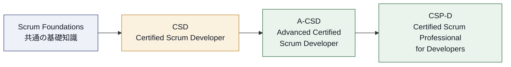

- **CSD**: 開発者トラックの入り口。スクラムの基礎とエンジニアリングプラクティスの基礎を学ぶ
- **A-CSD**: CSD取得者が実務経験を積んだ上で挑戦する上位資格
- **CSP-D**: 開発者トラックの最上位資格。より高度な実務経験とSEU（後述）が要求される

### 1.3 CSDとCSMの違い

よくある質問として「CSDとCSM、どちらを取るべきか」があります。答えは目的次第です。

| 観点 | CSM（Certified ScrumMaster） | CSD（Certified Scrum Developer） |
|---|---|---|
| フォーカス | 人・プロセスのファシリテーション、チームの継続的改善 | 技術的卓越性、エンジニアリングプラクティス |
| 主な対象者 | スクラムマスター、チームリード | ソフトウェア開発者、エンジニア |
| 学ぶ核となる能力 | イベントのファシリテーション、障害の除去、チーム支援 | リファクタリング、TDD、CI、アーキテクチャ設計 |
| 前提知識 | Scrum Foundations | Scrum Foundations + エンジニアリング実務 |

両方を取得することも可能で、互いに排他的な資格ではありません。

### 1.4 取得要件

CSD認定を取得するためのプロセスは次の3ステップです。

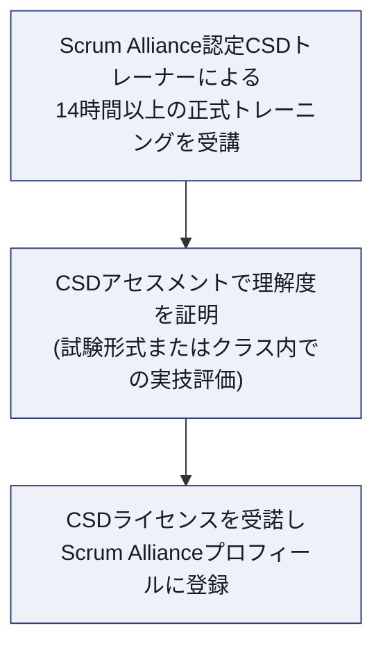

**ステップバイステップ:**

1. Scrum Alliance承認済みのCSDトレーナーが提供する、合計14時間以上のライブトレーニングコースを受講する。
2. コース内でスクラムとアジャイルプラクティスの理解度をアセスメントされる（トレーナーの設計により、筆記試験形式の場合もクラス内評価形式の場合もある）。
3. コース修了後、CSDライセンスを受諾し、Scrum Allianceの会員プロフィールに認定を追加する。

> **ベストプラクティス**
> - コース選定時は「ハンズオン（実際に手を動かすコーディング演習）」がどの程度含まれるかをシラバスで確認する。CSDは座学よりも実践重視の認定であるため、ペアプログラミングやTDD演習を伴うコースを選ぶと学習効果が高い。
> - 受講前にScrum Foundations相当の知識（スクラムイベント・作成物の基礎）を予習しておくと、コース内の技術的な議論に集中できる。

### 1.5 更新要件とSEU

CSD認定の有効期間は**2年間**です。更新には以下が必要です。

- 更新手数料の支払い
- 定められた数の**Scrum Education Units（SEU）**の提出（継続学習の証明）

SEUは書籍を読む、ウェビナーを視聴する、カンファレンスに参加するなど、継続的な学習活動によって獲得できます。「一度取ったら終わり」の資格ではなく、**継続的な成長を証明し続ける仕組み**になっている点が特徴です。

> **ベストプラクティス**: 認定取得直後からSEU活動をログに記録しておくと、更新時期に慌てずに済む。技術書の輪読会やLT登壇なども対象になり得るため、日々の学習活動を可視化しておくとよい。

### 1.6 学習目標の情報源

CSDの学習目標は、以下の一次資料に基づいて設計されています（詳細は巻末の参考文献を参照）。

- The Scrum Guide（Ken Schwaber & Jeff Sutherland, 2020年版）
- Manifesto for Agile Software Development（アジャイルソフトウェア開発宣言）とその背後にある12の原則
- Scrum Allianceが定義するスクラムの価値基準
- Kent Beck著「Extreme Programming Explained: Embrace Change」
- Agile Allianceの「Subway Map to Agile Practices」

---

## 第2章 学習目標の全体構造とブルームの分類法

### 2.1 ブルームの分類法（Bloom's Taxonomy）

CSDの学習目標は、それぞれ「学習者が何をできるようになるか」を示す動詞から始まります。これは教育学における**ブルームの分類法**に基づいており、下位（知識の想起）から上位（判断・評価）へと段階的に思考レベルが上がる構造になっています。

| レベル | 説明 | 代表的な動詞（英語） |
|---|---|---|
| Knowledge（知識） | 情報・プロセス・事実・概念を思い出す | Define, Name, List |
| Comprehension（理解） | 情報を解釈し重要性を判断する | Describe, Discuss, Recognize |
| Application（応用） | 知識や概念を実生活に適用する | Apply, Demonstrate, Illustrate |
| Analysis（分析） | 批判的思考で情報を分解・整理する | Compare, Contrast, Distinguish |
| Synthesis（統合） | 知識を使って新しい成果物やプロセスを作る | Create, Prepare, Organize |
| Evaluation（評価） | 判断力を用いて意思決定・問題解決する | Measure, Assess, Evaluate |

各学習目標は「このコースを無事修了した学習者は、〜できるようになる」という文の後に続く形で定義されています。たとえば「define refactoring（リファクタリングを定義できる）」はKnowledgeレベル、「demonstrate working together as one team（ワンチームとして働くことを実演できる）」はApplicationレベル、というように読み解くとコースの意図が理解しやすくなります。

### 2.2 6つの学習カテゴリ

CSDの学習目標（Scrum Foundationsに追加される部分）は、次の6つのカテゴリに分類されています。

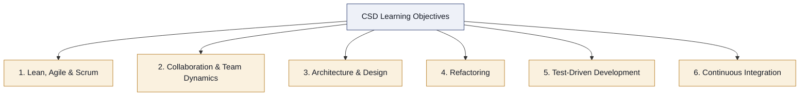

| カテゴリ | 学習目標数 | 主な焦点 |
|---|---|---|
| 1. Lean, Agile & Scrum | 6個（1.1〜1.6） | プロダクトバックログ運用、デイリースクラム、Doneの定義 |
| 2. Collaboration & Team Dynamics | 6個（2.1〜2.6） | チームワーク、ステークホルダーとの協働 |
| 3. Architecture & Design | 3個（3.1〜3.3） | 技術的卓越性、アジャイルな設計原則 |
| 4. Refactoring | 2個（4.1〜4.2） | リファクタリングの定義と利点 |
| 5. Test-Driven Development | 4個（5.1〜5.4） | テストファースト、アジャイルテストの質 |
| 6. Continuous Integration | 3個（6.1〜6.3） | CIの定義、自動化パイプラインの利点 |

### 2.3 Scrum Foundationsとの関係

CSDコースでは、上記6カテゴリに加えて**Scrum Foundations学習目標**（CSM/CSPO/CSDに共通する土台知識）も必ずカバーされます。CSD固有の学習目標は、あくまでScrum Foundationsの上に積み上がる「エンジニアリング寄りの追加レイヤー」という位置づけです。次章でこの土台部分を簡潔におさらいします。

---

## 第3章 土台となる知識: Scrum Foundations学習目標のおさらい

CSD受講者はScrum Foundationsの内容も理解している前提となるため、ここでは4つのカテゴリを要点だけ整理します。

### 3.1 Scrum Theory（スクラムの理論）— 経験主義

スクラムは**経験主義（Empiricism）**に基づくフレームワークです。経験主義は「知識は経験から生まれ、意思決定は観察された事実に基づいて行う」という考え方です。

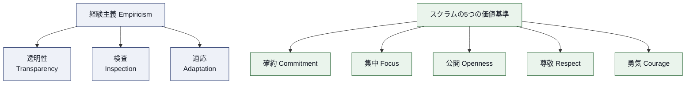

- **3つの経験主義の柱**: 透明性・検査・適応
- **5つのスクラムの価値基準**: 確約・集中・公開・尊敬・勇気
- 反復的（Iterative）かつ漸進的（Incremental）なアプローチによって、不確実性の高いプロダクト開発におけるリスクを制御する

### 3.2 The Scrum Team（スクラムチーム）

スクラムチームは**プロダクトオーナー・スクラムマスター・開発者**という3つのアカウンタビリティで構成される、機能横断的（Cross-functional）かつ自己管理型（Self-managing）のチームです。CSDが焦点を当てる「開発者」は、この中でインクリメントを実際に作り出す役割を担います。

### 3.3 Scrum Events and Activities（イベントと活動）

| イベント | 目的 | 最大タイムボックス（1か月スプリントの場合） |
|---|---|---|
| スプリントプランニング | スプリントで行う作業を計画する | 8時間 |
| デイリースクラム | 開発者が進捗を同期し翌24時間の計画を調整する | 15分 |
| スプリントレビュー | インクリメントを検査しフィードバックを得る | 4時間 |
| スプリントレトロスペクティブ | チームの働き方を検査し改善計画を立てる | 3時間 |

プロダクトバックログリファインメントも重要な活動として位置づけられており、スプリント期間中を通じて継続的に行われます。

### 3.4 Scrum Artifacts and Commitments（作成物とコミットメント）

| 作成物 | コミットメント | 役割 |
|---|---|---|
| プロダクトバックログ | プロダクトゴール | プロダクトの将来の姿を表す、創発的で並び替え可能な一覧 |
| スプリントバックログ | スプリントゴール | そのスプリントで達成したい単一の目的 |
| インクリメント | Doneの定義 | 完成の共通理解を満たした、検査可能な成果物の積み重ね |

> **ソース**: 本章の内容はScrum Alliance「Scrum Foundations Learning Objectives」および公式The Scrum Guideに基づきます（巻末参照）。

---

## 第4章 カテゴリ1: Lean, Agile & Scrum

このカテゴリでは、開発者の日々の作業がスクラムの作成物やイベントとどう結びつくかを学びます。

### 4.1（学習目標1.1）スプリントバックログを活用する

**説明**: スプリントバックログは、スプリントゴール・選択されたプロダクトバックログアイテム（PBI）・それらを届けるための計画から構成される、開発者が所有する作業計画です。単なるToDoリストではなく、**リアルタイムで更新され続ける、その日その日の作業計画**として機能します。

**ステップバイステップ**:

1. スプリントプランニングで選択したPBIをスプリントバックログに配置する。
2. PBIを実装可能な単位のタスクに分解する（分解は開発者自身が行う）。
3. スプリント期間中、進捗に応じてスプリントバックログを毎日更新する。
4. 新しい情報が判明したら、スプリントゴールを損なわない範囲で計画を調整する。

> **ベストプラクティス**
> - スプリントバックログは「計画時点で固定」ではなく「生きたドキュメント」として扱う。実装を進める中で見えてきた作業を随時追加・削除してよい。
> - タスクの粒度は「1日以内に完了状況を判断できる」大きさに分解すると、デイリースクラムでの状況共有がしやすくなる。

### 4.2（学習目標1.2）PBIをインクリメントに変換する責任

**説明**: プロダクトバックログアイテムをインクリメント（価値の増分）に変換する責任は、開発者を含むスクラムチーム全体にあります。プロダクトオーナーが「何を作るか」の優先順位を示し、開発者が「どう作るか」を決めて実際に動くソフトウェアへと変換します。

**ベストプラクティス**:
- 「Doneの定義」を満たさない限りインクリメントとして数えない、という基準をチーム全員が共有する。
- PBIの実装中に技術的な不明点が出た場合、実装を止めてプロダクトオーナーと会話するハードルを下げておく。

### 4.3（学習目標1.3）デイリースクラムを実践する

**説明**: デイリースクラムは、開発者がスプリントゴールに向けた進捗を検査し、翌24時間の作業を計画するための15分のイベントです。ステータス報告会ではなく、**開発者自身のための計画調整の場**である点が重要です。

> **ベストプラクティス**
> - 「昨日やったこと・今日やること・障害」の3点フォーマットに固執しすぎず、スプリントゴール達成に向けた対話を優先する。
> - 詳細な技術議論が必要になった場合は、デイリースクラムの15分内で終わらせず「別途この後話しましょう」と切り出す文化を作る。

### 4.4（学習目標1.4）PBIの属性を理解する

**説明**: 良いプロダクトバックログアイテムには、共通して見られる属性があります。少なくとも3つ挙げるとすれば、次のようなものが代表的です。

| 属性 | 説明 |
|---|---|
| 説明（Description） | 何を実現したいかが明確に記述されている |
| 順序（Order） | プロダクトバックログ内で優先順位づけされている |
| 見積り（Estimate） | 相対的な規模や複雑さの見積りが付与されている |
| 価値（Value） | ビジネス上または顧客にとっての価値が示されている |

> **ソース補足**: PBIが備えるべき性質として、業界で広く参照される考え方に**INVEST**（独立している・交渉可能・価値がある・見積り可能・小さい・テスト可能）があります。詳細はAgile Allianceのグロッサリーを参照してください。

### 4.5（学習目標1.5）プロダクトバックログリファインメントでの検査と適応

**説明**: プロダクトバックログリファインメントとは、プロダクトバックログの項目に詳細・見積り・順序を追加していく継続的な活動です。スクラムチームは、この活動を通じてPBIを繰り返し検査し、必要に応じて適応させます。

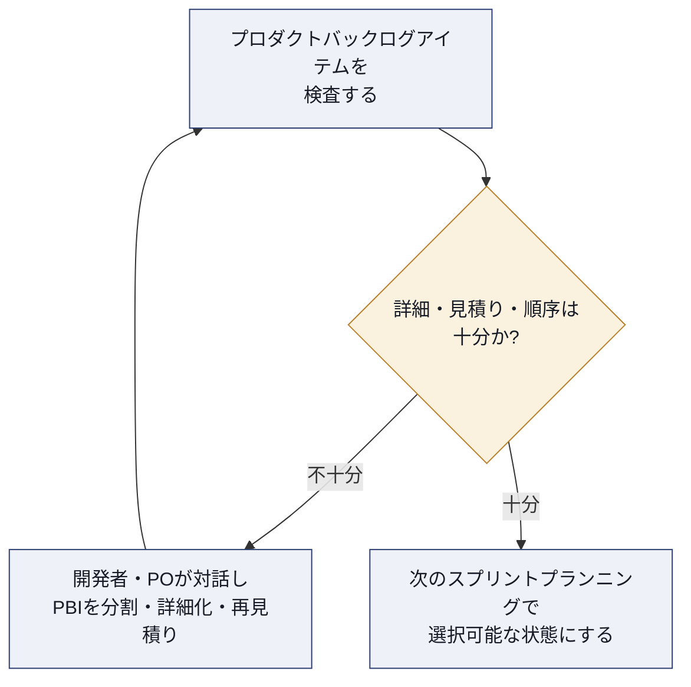

**インスペクト＆アダプトの具体例**:
1. 大きすぎるPBIをユーザーストーリーマッピングなどの手法で小さく分割する。
2. 実装が進んで得られた技術的知見をもとに見積りを更新する。
3. 市場や顧客の状況変化に応じてPBIの優先順位を並び替える。

> **ベストプラクティス**: リファインメントを「スプリントの最後にまとめてやる」のではなく、スプリント全体を通じて少しずつ実施する（一般的な目安として、開発者の作業時間の約10%を充てるという慣行がよく紹介されます）。

### 4.6（学習目標1.6）Doneの定義が透明性を高める仕組み

**説明**: Doneの定義（Definition of Done）は、インクリメントが満たすべき品質基準を明文化したものです。これにより、チームやステークホルダーは「本当に完成しているのか」を共通の物差しで判断できるようになります。

**透明性を高める要素の例（少なくとも5つ）**:

| 要素 | 透明性への貢献 |
|---|---|
| コードレビュー完了 | 品質基準が満たされたことをチーム全員が確認できる |
| 自動テスト合格 | 動作保証の水準が客観的に示される |
| ドキュメント更新 | 仕様変更が関係者に共有される |
| デプロイ可能な状態 | 「完成」が実際にリリース可能な状態を意味することが明確になる |
| 受け入れ基準の充足 | プロダクトオーナーの期待との整合が確認できる |

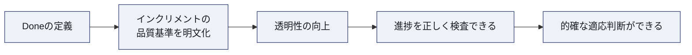

> **ベストプラクティス**: Doneの定義は一度決めたら終わりではなく、チームの能力向上や組織標準の変化に応じて徐々に厳格化していく。複数チームが同じプロダクトに取り組む場合は、Doneの定義を共有・統一する。
>
> **ソース**: 本章全体はScrum Alliance「CSD Learning Objectives」カテゴリ1、およびThe Scrum Guideの該当箇所に基づきます。

---

## 第5章 カテゴリ2: Collaboration & Team Dynamics

### 5.1（学習目標2.1）ワーキンググループとチームの違い

**説明**: 「ワーキンググループ」と「チーム」は似て非なる概念です。少なくとも3つの違いを理解しておくことが求められます。

| 観点 | ワーキンググループ | チーム |
|---|---|---|
| 目標 | 個人ごとの目標の集合 | 共有された単一の目標 |
| 成果への責任 | 個人が自分の成果に責任を持つ | チーム全体で成果に責任を持つ |
| 協働の度合い | 情報共有が中心、作業は個別に進む | 作業そのものを協働で進める |

### 5.2（学習目標2.2）効果的なチームの属性

少なくとも3つの属性が挙げられます。

- **心理的安全性**: 失敗やわからないことを言い出せる雰囲気がある
- **機能横断性**: チーム内に必要なスキルが揃っている
- **自己管理力**: 誰が何をどうやるかをチーム自身で決められる

### 5.3（学習目標2.3）「ワンチームとして働く」を実演する

**説明**: これはApplicationレベルの目標であり、知識としてではなく行動として実演することが求められます。ペアプログラミングやモブプログラミング、スウォーミング（一つの作業に複数人が協力して取り組むこと）などが典型的な実演方法です。

> **ベストプラクティス**: 個人ごとにタスクを「担当者」として割り当てるのではなく、PBI単位でチームが集まって取り組む「スウォーミング」の考え方を導入すると、属人化を防ぎながらチームとしての一体感が生まれる。

### 5.4（学習目標2.4）開発者が顧客・ユーザーと直接対話する利点

少なくとも3つの利点が挙げられます。

| 利点 | 説明 |
|---|---|
| 要求の解像度が上がる | 又聞きによる情報の劣化を防ぎ、意図を正確に把握できる |
| フィードバックサイクルが短縮される | 実装の早い段階で誤解を修正できる |
| 開発者のモチベーション向上 | 自分の仕事が誰にどう使われるかを実感できる |

### 5.5（学習目標2.5）ステークホルダー・顧客・ユーザーとのコラボレーション方法

スプリント期間中にコラボレーションが発生し得るタイミングの例です。

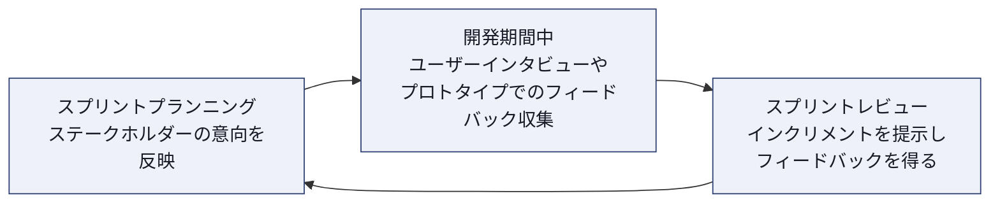

少なくとも3つの方法:
1. スプリントレビューにステークホルダーを招き、実際のインクリメントに触れてもらう。
2. 開発期間中に軽量なユーザビリティテストやモックアップレビューを挟む。
3. プロダクトオーナーを介さず、開発者が直接ドメインエキスパートに質問できる関係を築く。

### 5.6（学習目標2.6）チームとして共にインクリメントを共創する

**説明**: これもApplicationレベルの目標で、「共に作る（Co-create）」ことを実演します。個々人が担当箇所を分担して最後に結合するのではなく、設計段階から実装、テストまでを協働で進めるスタイルを指します。

> **ベストプラクティス**: 実装前に短い「クイックデザインセッション」をチームで行い、インターフェースや責務分担について合意してから着手すると、後工程での手戻りが減る。
>
> **ソース**: 本章はScrum Alliance「CSD Learning Objectives」カテゴリ2に基づきます。

---

## 第6章 カテゴリ3: Architecture & Design

### 6.1（学習目標3.1）技術的卓越性の利点

少なくとも3つの利点が挙げられます。

| 利点 | 説明 |
|---|---|
| 持続可能なペースの実現 | 技術的負債が抑制され、長期にわたり安定した開発速度を維持できる |
| 変更容易性の向上 | 要求変化への対応コストが下がり、アジャイルの本質である「変化への対応」が可能になる |
| 品質と信頼の向上 | 欠陥が減り、ステークホルダーからの信頼を得やすくなる |

### 6.2（学習目標3.2）アジャイルチームにおける設計プラクティス

**説明**: アジャイル開発では、大規模な事前設計（Big Design Up Front）ではなく、**創発的設計（Emergent Design）**の考え方を取ります。

**代表的なプラクティスの例**:
- **シンプルな設計（Simple Design）**: 「今必要な機能を、最もシンプルな形で実装する」という原則
- **クイックデザインセッション**: 実装直前に短時間で設計方針をチームで合意する
- **CRCカード（Class-Responsibility-Collaborator）**: オブジェクトの責務と協調関係を簡易に可視化する手法

### 6.3（学習目標3.3）アジャイル環境におけるアーキテクチャの原則

少なくとも3つの原則が挙げられます。

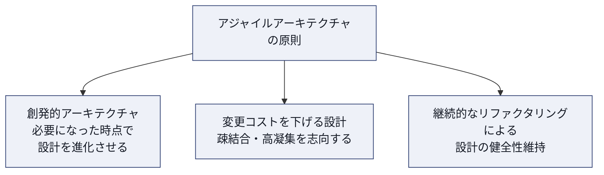

> **ベストプラクティス**
> - アーキテクチャドキュメントを一度作って終わりにせず、実装から得られた知見を反映して継続的に更新する。
> - 「将来使うかもしれない」機能を先回りして作り込む（過剰設計）を避け、YAGNI（You Aren't Gonna Need It）の原則を意識する。
>
> **ソース**: 本章はScrum Alliance「CSD Learning Objectives」カテゴリ3に基づきます。関連する実務知見はScrum Allianceのリソースライブラリ記事「Software Architecture in Scrum」でも紹介されています（巻末参照）。

---

## 第7章 カテゴリ4: Refactoring

### 7.1（学習目標4.1）リファクタリングを定義する

**説明**: リファクタリングとは、**ソフトウェアの外部から見た振る舞いを変えずに、内部構造を改善すること**です。バグ修正でも新機能追加でもなく、「コードをきれいにする」ことそのものが目的の活動です。

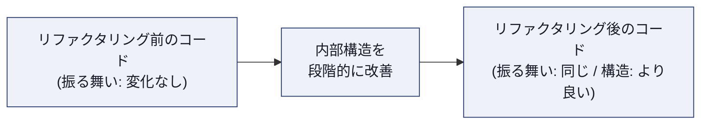

**ステップバイステップ（典型的な進め方）**:

1. 変更対象のコードに対する自動テストが存在することを確認する（なければ先に用意する）。
2. 「コードの臭い（Code Smell）」— 重複コード、長すぎるメソッド、深いネストなど — を特定する。
3. 小さな単位でリファクタリングを行い、都度テストを実行して振る舞いが変わっていないことを確認する。
4. コミットを小さく分け、いつでも安全に元に戻せる状態を保つ。

### 7.2（学習目標4.2）リファクタリングの利点

少なくとも3つの利点が挙げられます。

| 利点 | アジャイル開発への貢献 |
|---|---|
| 可読性の向上 | チームメンバー間の理解速度が上がり、コラボレーションが促進される |
| 変更容易性の向上 | 次のPBIを実装する際の変更コストが下がる |
| 技術的負債の抑制 | スプリントを重ねても開発速度が落ちにくくなる |

> **ベストプラクティス**
> - リファクタリング専用の「特別なスプリント」を設けるのではなく、日々の開発サイクルの中に小さく組み込む（ボーイスカウトルール: 「来た時よりも美しく」）。
> - テストが存在しないレガシーコードに対しては、まず「特性化テスト（Characterization Test）」で現在の振る舞いを固定してからリファクタリングに着手する。
>
> **ソース**: 本章の定義はMartin Fowler「Refactoring」（refactoring.com）およびAgile Allianceグロッサリーの定義と一致します（巻末参照）。

---

## 第8章 カテゴリ5: Test-Driven Development（TDD）

### 8.1（学習目標5.1）テストファーストという設計・開発アプローチ

**説明**: テストファースト（Test-First）とは、プロダクションコードを書く前に、まずそのコードが満たすべき振る舞いを検証する**失敗するテスト**を書くアプローチです。これはTDDの出発点であり、単なるテスト手法ではなく**設計手法**として位置づけられます。

**少なくとも3つの利点**:

| 利点 | 説明 |
|---|---|
| 設計の明確化 | 「どう使われるべきか」を先に考えることで、使いやすいインターフェースが生まれる |
| 安全網の確保 | 実装と同時にリグレッションテストが蓄積される |
| スコープの明確化 | 「テストが通ったら完了」という明確な終了条件が得られる |

### 8.2（学習目標5.2）伝統的テストとアジャイルテストの違い

少なくとも3つの違いが挙げられます。

| 観点 | 伝統的テスト | アジャイルテスト |
|---|---|---|
| タイミング | 実装完了後、フェーズの最後にまとめて実施 | 実装と並行して継続的に実施 |
| 主な担当 | 専任のQAチームが後工程で担当 | 開発者を含むチーム全体が責任を持つ |
| フィードバック速度 | 遅い（フェーズの境目でしか分からない） | 速い（コミットのたびに分かる） |
| 自動化の比重 | 手動テストの比重が高い傾向 | 自動テストを土台に据える |

### 8.3（学習目標5.3）TDDサイクルにおけるリファクタリングの重要性

**説明**: TDDは「Red → Green → Refactor」という3ステップのサイクルで進みます。リファクタリングのステップを省略してしまうと、テストは通っていても内部構造が徐々に劣化し、TDDの本来の効果が失われてしまいます。

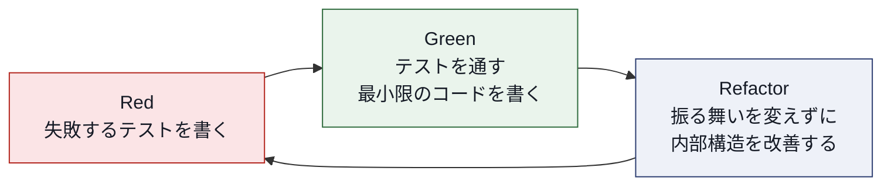

**ステップバイステップ**:

1. **Red**: これから実装する振る舞いを表す、失敗するテストを1つ書く。
2. **Green**: そのテストを通すために必要最小限のコードを書く（美しさは後回しでよい）。
3. **Refactor**: テストが通っている状態を保ちながら、コードの重複を除去し構造を整える。
4. 次の振る舞いについて1に戻る。

> **ベストプラクティス**: 「Green」の段階では意図的に泥臭い実装を許容し、「Refactor」の段階で初めて設計を磨く、という役割分担を徹底する。両方を同時にやろうとすると、テストが通らない時間が長引きやすい。

### 8.4（学習目標5.4）良いアジャイルテストアプローチの質

少なくとも3つの質が挙げられます。

| 質 | 説明 |
|---|---|
| 高速に実行できる | 開発者が頻繁に実行し続けられるフィードバックループを保つ |
| 独立している | テスト同士が互いに依存せず、順序を問わず実行できる |
| 意図が明確である | テストコード自体がドキュメントとして機能する（振る舞いの仕様書になる） |
| 決定的である | 同じ条件では常に同じ結果を返す（Flakyでない） |

> **補足**: TDDを補完する考え方として、ビジネス側にも理解しやすい形でテストを記述する**BDD（Behavior-Driven Development）**や、顧客と一緒に受け入れ基準を先に定義する**ATDD（Acceptance Test-Driven Development）**もアジャイルテストの重要な発展形です。
>
> **ソース**: 本章はScrum Alliance「CSD Learning Objectives」カテゴリ5、およびKent Beck「Extreme Programming Explained」のテストファーストに関する記述、Agile Allianceグロッサリー（TDD／Unit Test／Mock Objects／ATDD／BDD）に基づきます（巻末参照）。

---

## 第9章 カテゴリ6: Continuous Integration（CI）

### 9.1（学習目標6.1）継続的インテグレーションの定義と利点

**説明**: 継続的インテグレーション（Continuous Integration, CI）とは、**開発者が自分の作業を頻繁に（少なくとも1日に1回以上）共有のメインラインに統合し、その都度自動ビルド・自動テストで検証するプラクティス**です。

**少なくとも3つの利点**:

| 利点 | 説明 |
|---|---|
| 統合の問題を早期発見 | 「マージ地獄」を避け、コンフリクトを小さいうちに解決できる |
| 品質の可視化 | ビルドやテストの成否がチーム全員にリアルタイムで共有される |
| リリース準備の常態化 | いつでもリリース可能な状態に近いコードベースを維持できる |

### 9.2（学習目標6.2）スクラムチームがCIから得られる利益の例

少なくとも3つの例が挙げられます。

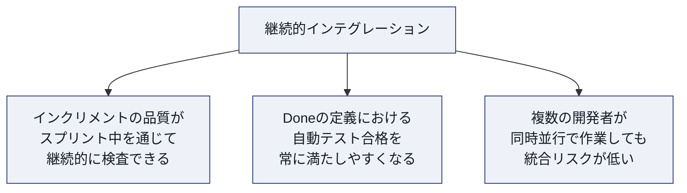

1. スプリントレビューで見せるインクリメントが、常に統合済みで動作確認済みの状態になる。
2. デイリースクラムで「統合できていない」というブロッカーが発生しにくくなる。
3. スプリント終盤に統合作業がまとめて発生する「ミニウォーターフォール」を防げる。

### 9.3（学習目標6.3）自動化されたビルド・テスト・測定パイプラインの利点

**説明**: CIをさらに一歩進めると、コードのコミットをきっかけに**ビルド → テスト → 測定（コード品質やカバレッジの計測）**までを自動で実行する「パイプライン」を構築できます。

**少なくとも1つの利点**: 人手による確認作業を排除できるため、フィードバックが速く、かつ一貫した基準で毎回同じように検証される。これにより、開発者は「動くはず」ではなく「検証済み」という確信を持って次の作業に進める。

> **ベストプラクティス**
> - パイプラインの実行時間を短く保つ（目安として数分以内）。遅いパイプラインは「後で確認すればいい」という後回しの温床になる。
> - テストが失敗した状態のビルドを放置しない文化（Stop the Line）をチームで合意しておく。
> - 継続的インテグレーションの先には、自動で本番環境への配布まで行う**継続的デプロイメント（Continuous Deployment）**という発展形もある。
>
> **ソース**: 本章はScrum Alliance「CSD Learning Objectives」カテゴリ6、Agile Allianceグロッサリー（Continuous Integration／Automated Build／Continuous Deployment）に基づきます（巻末参照）。

---

## 第10章 エンジニアリングプラクティス統合マップ（XP × Scrum）

CSDのカテゴリ3〜6（Architecture & Design、Refactoring、TDD、CI）は、実は単独のプラクティスではなく、**Extreme Programming（XP）**に由来する複数のプラクティスが互いに支え合うことで成立しています。CSD Learning Objectivesの情報源にKent Beckの著書とAgile Allianceの「Subway Map to Agile Practices」が挙げられているのはこのためです。

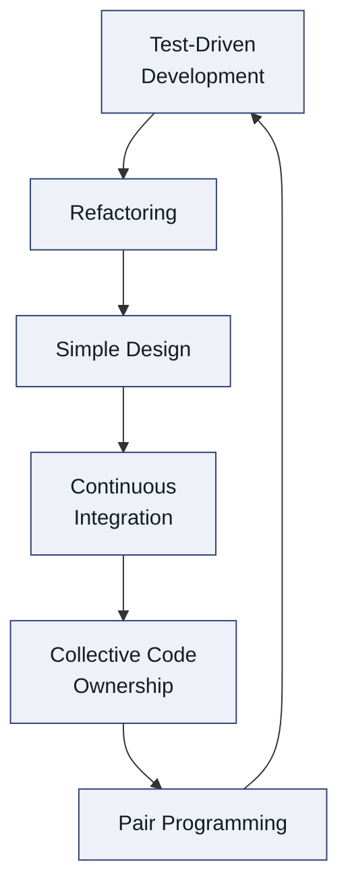

この輪は、どれか一つが欠けると他のプラクティスの効果も弱まる、という相互依存の関係を表しています。

| プラクティス | このプラクティスを支える理由 | 支えられる理由 |
|---|---|---|
| TDD | 安全網としてリファクタリングを可能にする | シンプルな設計をテストで検証する |
| Refactoring | テストがあるからこそ安全に実行できる | シンプルな設計を維持し続ける原動力になる |
| Simple Design | リファクタリングによって維持される | CIで統合しやすいコードベースを生む |
| Continuous Integration | シンプルな設計と自動テストが土台になる | 集団所有制のコードベースを健全に保つ |
| Collective Code Ownership | CIによる頻繁な統合が前提になる | ペアプログラミングによる知識共有を後押しする |
| Pair Programming | 集団所有制の文化を根づかせる | TDDのRed-Green-Refactorを2人で回すことで質が上がる |

| CSDカテゴリ | 対応するXPプラクティス | Agile Allianceグロッサリー |
|---|---|---|
| Architecture & Design | Simple Design, Quick Design Session, CRC Cards | [simple-design](https://agilealliance.org/glossary/simple-design), [crc-cards](https://agilealliance.org/glossary/crc-cards/) |
| Refactoring | Refactoring | [refactoring](https://agilealliance.org/glossary/refactoring/) |
| Test-Driven Development | TDD, Unit Tests, Mock Objects, ATDD, BDD | [tdd](https://agilealliance.org/glossary/tdd/), [unit-test](https://agilealliance.org/glossary/unit-test/) |
| Continuous Integration | Continuous Integration, Automated Build, Continuous Deployment | [continuous-integration](https://agilealliance.org/glossary/continuous-integration/) |
| （関連する協働プラクティス） | Pair Programming, Collective Ownership | [pair-programming](https://agilealliance.org/glossary/pair-programming), [collective-ownership](https://agilealliance.org/glossary/collective-ownership/) |

> **ベストプラクティス**: これらのプラクティスを「どれか1つだけ」導入しようとすると効果が出にくい。たとえばTDDだけを導入してリファクタリングを怠ると、テストコードとプロダクションコードの両方が徐々に複雑化してしまう。可能であれば小さなチームからでもセットで試すことを推奨する。

---

## 第11章 ベストプラクティス総合チェックリスト

CSDで扱う6カテゴリについて、現場で実践する際のチェックリストとして整理しました。

| カテゴリ | チェック項目 |
|---|---|
| Lean, Agile & Scrum | スプリントバックログを毎日更新しているか／Doneの定義がチームで明文化・共有されているか／リファインメントをスプリント全体に分散して実施しているか |
| Collaboration & Team Dynamics | 開発者がステークホルダーと直接対話する機会があるか／個人ではなくチーム単位でPBIに取り組んでいるか |
| Architecture & Design | 過剰設計（YAGNI違反）を避けているか／設計判断をチームで合意する場があるか |
| Refactoring | テストがない状態でリファクタリングを始めていないか／リファクタリングを日常のサイクルに組み込んでいるか |
| Test-Driven Development | テストを実装より先に書く習慣があるか／テストが高速・独立・決定的であるか |
| Continuous Integration | 1日1回以上メインラインに統合しているか／ビルド失敗を放置しない文化があるか |

---

## 第12章 認定取得後のキャリアパスと更新

### 12.1 キャリアパス全体像

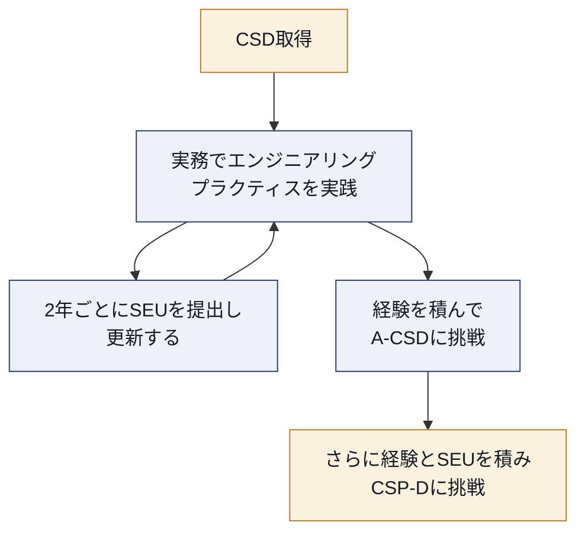

### 12.2 SEUによる更新の考え方

| 学習活動の例 | SEU換算の考え方（目安） |
|---|---|
| Scrum Allianceの記事を読む | 短時間の学習として少量のSEUが認められる |
| ウェビナーやカンファレンスセッションに参加する | 参加時間に応じたSEUが認められる |
| 追加の認定コースを受講する | まとまった時間分のSEUが認められる |

> 実際のSEU算定基準は活動カテゴリごとに定められています。最新の基準は巻末のSEU公式ページで確認してください。
>
> **ベストプラクティス**: A-CSDやCSP-Dを見据えている場合、CSD取得直後から「どのプラクティスをどの程度実務に定着させたか」を振り返りとして記録しておくと、上位資格の申請時に実務経験の証跡として活用しやすい。

---

## 第13章 まとめ

CSDは、スクラムの型を知っているだけでなく、**技術的卓越性をチームで追求する姿勢**そのものを評価する資格です。本ガイドで扱った6つのカテゴリは、単独の知識としてではなく、次のような一つのつながりとして理解すると定着しやすくなります。

1. **Lean, Agile & Scrum**: スクラムの作成物・イベントを正しく運用する土台
2. **Collaboration & Team Dynamics**: その土台の上でチームとして機能する力
3. **Architecture & Design**: 変化に強いプロダクトを設計する力
4. **Refactoring**: 設計を健全に保ち続ける習慣
5. **Test-Driven Development**: 安全に変更し続けるための安全網
6. **Continuous Integration**: チーム全体の作業を常に統合された状態に保つ仕組み

これらはCSDコース内の座学だけで身につくものではなく、**実務での反復練習**によって初めて定着します。認定取得をゴールにするのではなく、認定取得を「実践を始めるきっかけ」として捉えることをおすすめします。

---

## 参考文献・出典一覧

### 一次情報源（Scrum Alliance公式）

| 資料 | URL |
|---|---|
| Certified Scrum Developer（CSD）公式ページ | https://www.scrumalliance.org/get-certified/developer-track/certified-scrum-developer |
| CSD Learning Objectives（PDF, 2024） | https://www.scrumalliance.org/docs/default-source/certification/learning-objectives/csd_learning_objectives_2024.pdf |
| Scrum Foundations Learning Objectives（PDF, 2022） | https://www.scrumalliance.org/media/certifications/los/scrum_foundations_learning_objectives_2022.pdf |
| Advanced Certified Scrum Developer（A-CSD）公式ページ | https://www.scrumalliance.org/get-certified/developer-track/advanced-certified-scrum-developer |
| Certified Scrum Professional - Developer（CSP-D）公式ページ | https://www.scrumalliance.org/get-certified/developer-track/certified-scrum-professional-for-developers |
| Scrum Education Units（SEU）について | https://www.scrumalliance.org/get-certified/scrum-education-units |
| Scrumの価値基準 | https://www.scrumalliance.org/about-scrum/values |
| Software Architecture in Scrum（関連リソース記事） | https://resources.scrumalliance.org/article/software-architecture-scrum |

### 一次情報源（フレームワーク・原則）

| 資料 | URL |
|---|---|
| The Scrum Guide（Ken Schwaber & Jeff Sutherland, 2020） | https://scrumguides.org/scrum-guide.html |
| Manifesto for Agile Software Development | https://agilemanifesto.org/ |
| アジャイル宣言の背後にある12の原則 | https://agilemanifesto.org/principles.html |

### 二次情報源（エンジニアリングプラクティスの解説）

| 資料 | URL |
|---|---|
| Agile Alliance: Subway Map to Agile Practices | https://agilealliance.org/agile101/subway-map-to-agile-practices/ |
| Agile Alliance Glossary: Refactoring | https://agilealliance.org/glossary/refactoring/ |
| Agile Alliance Glossary: TDD | https://agilealliance.org/glossary/tdd/ |
| Agile Alliance Glossary: Unit Test | https://agilealliance.org/glossary/unit-test/ |
| Agile Alliance Glossary: Continuous Integration | https://agilealliance.org/glossary/continuous-integration/ |
| Agile Alliance Glossary: Continuous Deployment | https://agilealliance.org/glossary/continuous-deployment/ |
| Agile Alliance Glossary: Pair Programming | https://agilealliance.org/glossary/pair-programming/ |
| Agile Alliance Glossary: Collective Ownership | https://agilealliance.org/glossary/collective-ownership/ |
| Agile Alliance Glossary: Simple Design | https://agilealliance.org/glossary/simple-design |
| Agile Alliance Glossary: Definition of Done | https://agilealliance.org/glossary/definition-of-done/ |
| Agile Alliance Glossary: Backlog Refinement | https://agilealliance.org/glossary/backlog-refinement/ |
| Martin Fowler: Refactoring（refactoring.com） | https://refactoring.com/ |
| Kent Beck『Extreme Programming Explained: Embrace Change』（書籍, Addison-Wesley） | — |

> 本ガイドは上記の一次・二次情報源をもとに作成した非公式の学習教材です。認定試験の内容や合否基準を保証するものではないため、正式な情報は必ずScrum Alliance公式ページでご確認ください。
