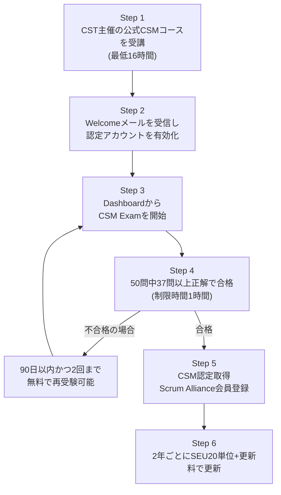
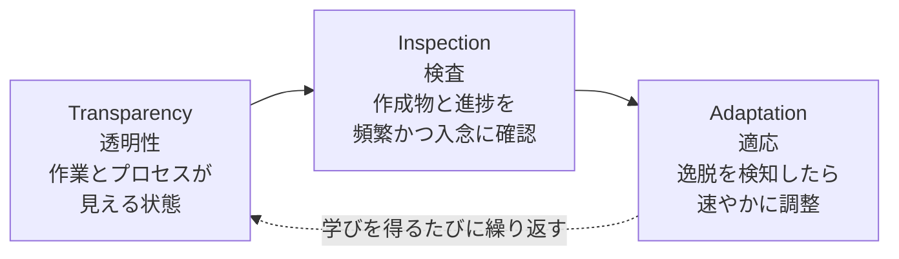
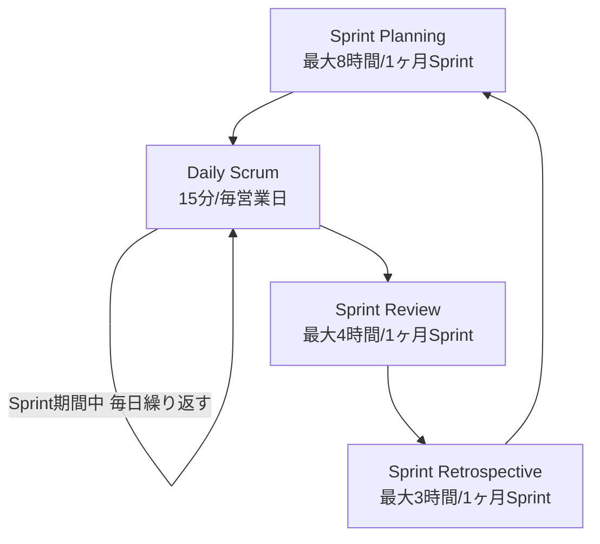
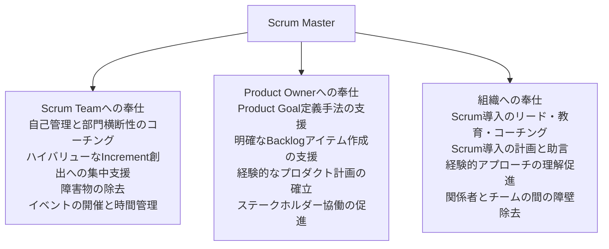

# Certified ScrumMaster®(CSM®)完全ガイド

## ― 初学者のためのステップバイステップ解説 ―

> 本ガイドは、Scrum Alliance®が提供する **Certified ScrumMaster®(CSM®)** 資格について、公式情報源(Scrum Alliance公式サイト・公式Learning Objectives文書・Scrum Guide 2020年版)を根拠に、初学者でも理解できるようステップバイステップで解説したものです。各章末に該当するベストプラクティスと参考ソース(URL)を明記しています。

---

## 目次

1. [CSM資格とは何か](#1-csm資格とは何か)
2. [認定取得までのロードマップ](#2-認定取得までのロードマップステップバイステップ)
3. [出題範囲(Learning Objectives)の全体像](#3-出題範囲learning-objectivesの全体像)
4. [Scrum理論の基礎(Scrum Theory)](#4-scrum理論の基礎scrum-theory)
5. [Scrum Team(3つのアカウンタビリティ)](#5-scrum-team3つのアカウンタビリティ)
6. [Scrum Events(5つのイベント)](#6-scrum-events5つのイベント)
7. [Scrum ArtifactsとCommitments](#7-scrum-artifactsとcommitments)
8. [Scrum Master Core Competencies](#8-scrum-master-core-competencies)
9. [Scrum Team・Product Owner・組織への奉仕(Service)](#9-scrum-teamproduct-owner組織への奉仕service)
10. [CSM試験の詳細](#10-csm試験の詳細)
11. [効果的な学習・試験対策のベストプラクティス](#11-効果的な学習試験対策のベストプラクティス)
12. [認定更新(Renewal)とキャリアパス](#12-認定更新renewalとキャリアパス)
13. [用語対照表(英日対訳)](#13-用語対照表英日対訳)
14. [まとめ](#14-まとめ)
15. [参考文献・ソース一覧](#15-参考文献ソース一覧)

---

## 1. CSM資格とは何か

### 1.1 CSM資格の概要

Certified ScrumMaster®(CSM®)は、世界最大のアジャイル認定団体である**Scrum Alliance®**(2001年設立)が提供する、Scrumフレームワークの入門的な資格です。CSMコースはScrumのフレームワーク全体(チームのアカウンタビリティ、イベント、作成物)を扱う導入コースと位置づけられており、受講者はチームでScrumを実践するための具体的な方法と、その土台となるアジャイルの原則・価値観への理解を深めることができます。

### 1.2 Scrum Masterという役割

Scrum Alliance公式サイトでは、Scrum Masterはチームの中で「効果的で生産的な働き方の環境を育てる」役割であり、人志向で感情的知性(EQ)が高く、人の成長・学習を助けることに喜びを感じる人物像が典型例として挙げられています。日々の活動は組織によって異なりますが、共通するのは「対話のファシリテーション」「チームの進捗を妨げる障害物への対応」「Scrumの実践に関する個々のメンバーへのコーチング」です。

### 1.3 CSMを取得すべき人

Scrum Alliance公式サイトでは、以下のいずれかに当てはまる人にCSM受講を推奨しています。

- 幅広い職務スキルを身につけたい
- 求職者としての競争力を高めたい
- スキル向上への意欲を雇用主・採用担当者に示したい
- 最も普及しているアジャイルフレームワークの使い方を知りたい
- 決められた手順をなぞるのではなく、アジャイルなマインドセットを実践したい
- 有能で効果的なScrum Masterとして働きたい
- Scrumの実践力を高めたい
- アジリティについてさらに学びたい

なお、Scrumはソフトウェア開発発祥のフレームワークですが、現在ではマーケター・データサイエンティスト・人事担当者など、さまざまな職種の専門家がより良い方法で製品・サービスを生み出すために活用しています。

### 1.4 CSM取得のメリット

Scrum Alliance公式サイトは、Indeedの調査データを引用し、CSM取得者の95%が友人にこの資格を勧めると回答し、71%がキャリアアップを目的にコースを受講したと回答していることを紹介しています。また、Scrum Master系の資格は近年最も求人で要求される専門資格の上位(9位)に入るとされています。CSMコースを通じて身につく実務スキルとして、コミュニケーション、チームダイナミクス、対立解消、部門横断的なチームワーク、リーダーシップとコーチング、継続的改善が挙げられています。

> **ベストプラクティス**
> - CSMは「知識試験」ではなく「学習確認試験」という位置づけであることを理解し、資格そのものをゴールにせず、その先にある「チームと組織のアジリティ向上」という目的意識を持って学習に臨む。
> - Scrumはソフトウェア開発に限らない汎用フレームワークであるため、自分の職種・業界にどう適用できるかを具体的にイメージしながら学習すると定着しやすい。

**ソース:** Scrum Alliance「Certified ScrumMaster® (CSM®)」公式ページ https://www.scrumalliance.org/get-certified/scrum-master-track/certified-scrummaster

---

## 2. 認定取得までのロードマップ(ステップバイステップ)

CSM認定の取得は、必ず「Certified Scrum Trainer®(CST®)」が主催する公式コースの受講から始まります。個人でテキストを学習して試験だけを受けることはできません。

### ステップ詳細

| ステップ | 内容 | 補足 |
|---|---|---|
| 1. コース受講 | CSTが主催する公式コース(合計16時間、多くは2〜3日間)を受講する。オンライン・対面いずれの形式もある | 学習目標(Learning Objectives)は全コース共通で規定されている |
| 2. アカウント有効化 | コース修了後に届くWelcomeメールから、Scrum Alliance認定アカウントを有効化する | メールが届かない場合はサポートへ問い合わせる |
| 3. 試験受験 | ダッシュボードから「Take CSM Exam」を選択し、mytestcom.net上で受験する | 使用ブラウザはSafari/Firefox/Chrome/Edgeのいずれか。Internet Explorerは非対応 |
| 4. 合否判定 | 50問中37問(74%)以上の正解で合格。制限時間は1時間 | 試験はオープンブック形式(Scrum Guide等の参照が可能) |
| 5. 認定取得 | 合格するとCSM認定バッジとScrum Alliance会員資格を取得 | コース費用に試験2回分の受験権が含まれる |
| 6. 継続更新 | 2年ごとにSEU(Scrum Education Units)20単位と更新料の納付で更新 | 詳細は本ガイド第12章を参照 |

> **ベストプラクティス**
> - コース選びの段階で、CST(認定トレーナー)の経歴・実務経験・レビューを確認する。トレーナーの質が学習の質を大きく左右する。
> - Welcomeメールが届かない場合に備えて、コース申込時に使用したメールアドレスを控えておく。
> - 受験当日はポップアップブロッカーを無効化し、ブラウザの「戻る」ボタンを使用しない(セッションが強制終了するリスクがあるため)。

**ソース:**
- Scrum Alliance「Certified ScrumMaster® (CSM®)」公式ページ(FAQ含む) https://www.scrumalliance.org/get-certified/scrum-master-track/certified-scrummaster
- Scrum Alliance Help Center「How to take the Certified ScrumMaster® (CSM®) test」 https://support.scrumalliance.org/hc/en-us/articles/360002112772

---

## 3. 出題範囲(Learning Objectives)の全体像

CSM試験の出題内容は、Scrum Allianceが公式に定める**Learning Objectives(学習目標)文書**に基づいています。これは2種類に分かれており、CSMコースでは両方がカバーされます。

| 文書 | 対象 | カテゴリ数 | 主な内容 |
|---|---|---|---|
| Scrum Foundations Learning Objectives(2022年1月版) | CSM・CSPO共通の土台知識 | 4カテゴリ | Scrum Theory / The Scrum Team / Scrum Events and Activities / Scrum Artifacts and Commitments |
| CSM Learning Objectives(2022年1月版) | CSMコース固有の知識 | 3カテゴリ | Scrum(Team・Events) / Scrum Master Core Competencies / Service to the Scrum Team, Product Owner, and Organization |

これらの学習目標は、以下の4つの一次情報源に基づいて策定されています。

1. Manifesto for Agile Software Development(4つの価値観と12の原則)
2. Scrum values(Scrum Allianceが定めるScrumの価値基準ページ)
3. Scrum Guide(scrumguides.org、Ken Schwaber と Jeff Sutherlandによる公式定義書)
4. Scrum Allianceの認定Guide(CST/CEC/CTC)コミュニティからのフィードバック

また、各学習目標にはBloomのタキソノミー(知識→理解→応用→分析→統合→評価という6段階の学習到達度)に基づくレベルが付与されており、単なる暗記ではなく「実際に実演できる」レベルまで求められる項目(例:Sprint Planningを実演する、Sprint Retrospectiveを実演する)が含まれている点が特徴です。

> **ベストプラクティス**
> - 試験対策では、市販の非公式問題集より先に、公式Learning Objectives文書そのものを読み込む。試験問題の多くはこの文書とScrum Guideに基づいて作成されている。
> - 各学習目標の動詞(describe / discuss / explain / perform など)に注目する。「perform(実演する)」と指定された項目は、単なる知識では不十分で、実務での運用イメージまで問われる可能性が高い。

**ソース:**
- Scrum Alliance「CSM Learning Objectives」(PDF) https://www.scrumalliance.org/media/certifications/los/csm_learning_objectives_2022.pdf
- Scrum Alliance「Scrum Foundations Learning Objectives」(PDF) https://www.scrumalliance.org/media/certifications/los/scrum_foundations_learning_objectives_2022.pdf

---

## 4. Scrum理論の基礎(Scrum Theory)

### 4.1 Scrumの定義

Scrum Guide(2020年11月版)は、Scrumを「複雑な問題に対して適応的な解決策を生み出すことを通じて、人・チーム・組織に価値をもたらす軽量級フレームワーク」と定義しています。Scrumの基本サイクルは次の4つの繰り返しです。

1. Product Ownerが複雑な問題への取り組みをProduct Backlogに順序付けする
2. Scrum TeamがSprintの中で作業の一部を価値のIncrementに変える
3. Scrum Teamとステークホルダーが結果を検査し、次のSprintに向けて調整する
4. 上記を繰り返す

Scrum Guideは、Scrumが意図的に「不完全」であること、すなわちScrum理論の実装に必要な部分だけを定義し、具体的な手順は利用者の集合知に委ねていることを強調しています。

### 4.2 Empiricism(経験主義)と3本柱

Scrumは**Empiricism(経験主義)**と**Lean思考**を土台としています。経験主義とは、知識は経験から得られ、意思決定は観察された事実に基づいて行われるべきだという考え方です。Lean思考は無駄を減らし、本質的なものに集中することを指します。

経験主義の3本柱(Three Pillars)は以下の通りです。

- **透明性(Transparency):** 作業とプロセスは、実行する人・成果を受け取る人の双方から見える状態でなければならない。透明性が低い作成物は、価値を損ない、リスクを高める意思決定につながる。
- **検査(Inspection):** Scrumの作成物とゴールへの進捗は、望ましくない逸脱や問題を検知するために、頻繁かつ入念に検査されなければならない。検査を助けるため、Scrumは5つのイベントによるリズム(ケイデンス)を提供する。
- **適応(Adaptation):** プロセスや成果物が許容範囲を逸脱した場合、できるだけ早く調整しなければならない。適応は、関係者が権限委譲され自己管理的であるほど機能しやすい。

透明性が検査を可能にし、検査が適応を可能にする、という一方向の依存関係がある点も重要です(透明性のない検査は誤解を招き無駄であり、適応につながらない検査は無意味とされています)。

### 4.3 Scrumの5つの価値基準

Scrum Guideは、Scrumの成功はチームが以下5つの価値観に習熟することにかかっているとしています。

| 価値基準(英語) | 日本語 | 内容の要点 |
|---|---|---|
| Commitment | 確約 | ゴール達成とお互いを支え合うことへのコミットメント。達成できると信じられる範囲でのみ作業を引き受ける |
| Focus | 集中 | Sprintの作業に集中し、ゴールに向けて最善の進捗を出す |
| Openness | 公開 | 作業や課題についてオープンであること |
| Respect | 尊敬 | チームメンバーがお互いを能力ある独立した個人として尊重し合うこと |
| Courage | 勇気 | 正しいことを行い、困難な問題に取り組む勇気を持つこと |

これらの価値観がScrum Teamと関係者に体現されたとき、透明性・検査・適応という経験主義の3本柱が信頼のもとで機能するようになります。

### 4.4 アジャイルソフトウェア開発宣言との関係

CSM/Scrum Foundations Learning Objectivesは、Scrumが「アジャイルソフトウェア開発宣言(Manifesto for Agile Software Development)」の4つの価値観・12の原則とどのように整合しているかを説明できることを求めています。

アジャイル宣言の4つの価値観(要約):

- プロセスやツールよりも「個人と対話」を重視する
- 包括的なドキュメントよりも「動くソフトウェア」を重視する
- 契約交渉よりも「顧客との協調」を重視する
- 計画に従うことよりも「変化への対応」を重視する

12の原則の中でも特にScrumと関連が深いものとして、短い間隔での継続的なソフトウェア提供、要件変化の歓迎、ビジネス側と開発側の日次協働、自己組織的(Scrum Guide 2020以降は「自己管理的」)なチームからこそ優れた設計が生まれるという考え方などが挙げられます。

> **ベストプラクティス**
> - 「なぜこのイベント・作成物が存在するのか」を、必ず経験主義の3本柱(透明性・検査・適応)に立ち返って説明できるようにする。試験ではしばしば「目的」を問う設問が出るため、手順の暗記より原理の理解を優先する。
> - 5つの価値基準は抽象的に見えるが、実際のチーム運営では「見積りを守れない約束はしない(Commitment)」「進捗が不透明なら自ら尋ねる(Openness)」のように具体的な行動指針として言語化すると定着しやすい。
> - アジャイル宣言とScrumの関係を「Scrum=アジャイルの実装フレームワークの一つ」と位置づけて理解する。アジャイルは価値観・原則の集合であり、Scrumはそれを実践するための具体的な枠組みである。

**ソース:**
- Ken Schwaber & Jeff Sutherland「The Scrum Guide」(2020年11月版) https://scrumguides.org/docs/scrumguide/v2020/2020-Scrum-Guide-US.pdf
- Scrum Alliance「What is Scrum」 https://www.scrumalliance.org/about-scrum
- Agile Alliance / Agile Manifesto「Principles behind the Agile Manifesto」 https://agilemanifesto.org/principles.html
- 「Manifesto for Agile Software Development」 https://agilemanifesto.org/

---

## 5. Scrum Team(3つのアカウンタビリティ)

Scrum Teamは、1名のScrum Master、1名のProduct Owner、複数名のDevelopersで構成される小規模なチームです。サブチームや階層は存在せず、1つの目的(Product Goal)に集中する専門家集団として扱われます。チーム規模は一般的に10名以下が推奨され、これより大きくなる場合は、同じProduct Goal・Product Backlog・Product Ownerを共有する複数のScrum Teamへの再編が検討されます。

チームは**部門横断的(cross-functional)**、すなわちSprintごとに価値を生み出すために必要なスキルをチーム内に備えていること、また**自己管理的(self-managing)**、すなわち「誰が」「いつ」「どのように」作業するかを内部で決定することが特徴です。Scrum Guide 2020年版では、従来の「self-organizing(自己組織的)」という表現よりも「self-managing(自己管理的)」という表現が明確に重視されるようになりました。

Scrum Team全体が、Sprintごとに価値ある使えるIncrementを作成する責任を負いますが、その中で3つの個別のアカウンタビリティが定義されています。

| アカウンタビリティ | 主な責任 |
|---|---|
| Developers | Sprint Backlogの作成、Definition of Doneの遵守による品質の担保、Sprint Goalに向けた日々の計画調整、専門家としてのお互いへの説明責任 |
| Product Owner | Product Goalの策定と明確な伝達、Product Backlogアイテムの作成と伝達、Product Backlogアイテムの順序付け、Product Backlogの透明性・可視性・理解の確保 |
| Scrum Master | Scrum Teamの効果性への説明責任。Scrum理論と実践の理解促進、ハイバリューなIncrement創出への集中支援、障害物の除去、全イベントの開催と時間管理 |

### 5.1 Developers

Developersは、Sprintごとに使えるIncrementのあらゆる側面を作り出すことにコミットする人々です。必要とされるスキルは職務領域によって幅広く異なりますが、常に上記4つの責任(計画作成・品質担保・日次の適応・相互の説明責任)を負います。

### 5.2 Product Owner

Product Ownerは、Scrum Teamの作業から生まれる製品の価値を最大化する責任を負います。実現方法は組織・チーム・個人によって大きく異なりますが、Product Backlogの実効的な管理(Product Goalの策定・伝達、アイテムの作成・順序付け・透明性確保)には常に説明責任を持ちます。作業自体を委任することはできますが、説明責任そのものは委任できません。

**Product Ownerは委員会ではなく単独の1名です。** CSM Learning Objectivesでは「Product Ownerがなぜ1名であり、グループでも委員会でもないのか、少なくとも2つの理由を議論できること」が明確に求められています。理由の一つは意思決定の迅速さと一貫性、もう一つはProduct Backlogに対する説明責任の所在を明確にするためです。Product Backlogを変更したいステークホルダーは、Product Ownerを説得することでそれを行います。

### 5.3 Scrum Master

Scrum Masterは、Scrum Guideで定義されるScrumを組織内に確立する責任を負います。これは「真のリーダーとして、Scrum Teamとより大きな組織の両方に奉仕する」ことによって実現されます。Scrum Masterの奉仕先は、Scrum Team自身・Product Owner・組織の3方向にわたります(詳細は第9章で扱います)。

> **ベストプラクティス**
> - Product Ownerが1名でなければならない理由を、単なる暗記ではなく「意思決定の迅速性」「説明責任の所在の明確化」という2つの観点で自分の言葉で説明できるようにしておく(CSM Learning Objective 1.5)。
> - Product Ownerは権限を持つが独裁者ではない。Developersやステークホルダーと協働しながらもProduct Backlogへの最終的な権限を保持する、というバランス感覚を理解する(CSM Learning Objective 1.6)。
> - Scrum Masterは「管理者」ではなく「サーバントリーダー(奉仕型リーダー)」である。指示命令ではなく、チームが自律的に成果を出せる環境を整えることに徹する。
> - チームが10名を超えて肥大化してきた場合は、単純に人を追加するのではなく、同じProduct Goalを共有する複数チームへの再編を検討する。

**ソース:**
- Ken Schwaber & Jeff Sutherland「The Scrum Guide」(2020年11月版) https://scrumguides.org/docs/scrumguide/v2020/2020-Scrum-Guide-US.pdf
- Scrum Alliance「CSM Learning Objectives」(PDF) https://www.scrumalliance.org/media/certifications/los/csm_learning_objectives_2022.pdf
- Scrum Alliance「What is Scrum」 https://www.scrumalliance.org/about-scrum

---

## 6. Scrum Events(5つのイベント)

Sprintはすべての他のイベントを内包する「コンテナ」です。各イベントは検査と適応のための正式な機会であり、規定通りに開催しないと、検査・適応の機会が失われるとScrum Guideは明記しています。すべてのイベントは同じ時間・同じ場所で開催することで複雑さを減らすことが推奨されています。

### タイムボックス早見表(1ヶ月Sprintの場合の上限)

| イベント | 目的 | 参加者 | タイムボックス上限 |
|---|---|---|---|
| Sprint | 一貫性を生み出す1ヶ月以内の固定長イベント。他の全イベントを内包する | Scrum Team全員 | 1ヶ月以内 |
| Sprint Planning | Sprintで行う作業を計画し、Sprintを開始する | Scrum Team全員(必要に応じ助言者を招待) | 8時間 |
| Daily Scrum | Sprint Goalへの進捗を検査し、Sprint Backlogを適応させる | Developers | 15分 |
| Sprint Review | Sprintの成果を検査し、今後の適応を判断する | Scrum Teamと主要ステークホルダー | 4時間 |
| Sprint Retrospective | 品質と効果性を高める方法を計画する。Sprintの締めくくり | Scrum Team全員 | 3時間 |

短いSprint(例:1〜2週間)の場合、各イベントのタイムボックスは通常これより短く設定されます。

### 6.1 Sprint

SprintはScrumの心臓部であり、アイデアを価値に変える器です。固定長で、前のSprintが終わった直後に次のSprintが始まります。Sprint中は以下のルールが適用されます。

- Sprint Goalを危険にさらすような変更は行わない
- 品質を落とさない
- Product Backlogは必要に応じて詳細化(refinement)される
- 学びが増えるにつれ、スコープはProduct Ownerと明確化・再交渉されうる

Sprint GoalがSprintの途中で意味をなさなくなった場合、Sprintはキャンセルされることがありますが、**Sprintをキャンセルする権限を持つのはProduct Ownerのみ**です(CSM Learning Objective 1.14)。

### 6.2 Sprint Planning

Sprint PlanningはSprintを開始するイベントで、Scrum Team全員による協働作業です。以下の3つのトピックを扱います。

1. **なぜこのSprintに価値があるのか:** Product Ownerが製品価値・有用性を高める方法を提案し、チーム全体でSprint Goalを協働で定義する
2. **このSprintで何ができるか:** Product Ownerとの対話を通じてDevelopersがProduct Backlogから作業項目を選択する
3. **選んだ作業をどのように実現するか:** DevelopersがIncrementを作るために必要な作業を計画する。多くの場合、Product Backlogアイテムを1日以内の小さな作業単位に分解する。この分解の方法はDevelopersの完全な裁量に委ねられる

Sprint Goal、選択されたProduct Backlogアイテム、それを届けるための計画を合わせたものが**Sprint Backlog**です。

### 6.3 Daily Scrum

Daily Scrumの目的は、Sprint Goalへの進捗を検査し、必要に応じてSprint Backlogを適応させることです。Developersのための15分のイベントで、複雑さを減らすため毎営業日同じ時間・同じ場所で開催されます。Product OwnerやScrum MasterがSprint Backlogの作業項目に実務として取り組んでいる場合は、Developersとして参加します。

構造や手法はDevelopersが自由に選択できますが、常に「Sprint Goalへの進捗」に焦点を当て、「翌日に向けた実行可能な計画」を生み出すことが求められます。CSM Learning Objectivesでは、Daily Scrumが通常のステータス報告会と異なる点(進捗報告の場ではなく計画の適応の場であること等)を少なくとも3つ議論できることが求められています。

### 6.4 Sprint Review

Sprint Reviewの目的は、Sprintの成果(アウトカム)を検査し、今後の適応を判断することです。Scrum Teamは主要なステークホルダーに成果を提示し、Product Goalへの進捗を議論します。Scrum Guideは、Sprint Reviewが単なる「発表会」ではなく「作業セッション」であるべきだと明記しています。この議論を踏まえてProduct Backlogが調整されることもあります。

### 6.5 Sprint Retrospective

Sprint Retrospectiveの目的は、品質と効果性を高める方法を計画することです。Scrum Teamは、個人・相互作用・プロセス・ツール・Definition of Doneの観点から直近のSprintを振り返ります。何がうまくいき、何が問題となり、それがどう解決された(あるいはされなかった)かを議論し、最も効果的な改善を特定して可能な限り早く着手します(次のSprintのSprint Backlogに追加されることもあります)。

CSM Learning Objectivesでは、Sprint Retrospectiveを省略した場合に起こりうる悪影響を少なくとも3つ説明できることが求められています(例:継続的改善サイクルの断絶、未解決の問題の蓄積、チームの心理的安全性やエンゲージメントの低下など)。

### 6.6 Product Backlog Refinement(詳細化)

Product Backlog Refinementはイベントではなく継続的な活動です。Product Backlogアイテムをより小さく正確な項目に分解し、説明・順序・サイズなどの詳細を追加していく作業を指します。Scrum Foundations Learning Objectivesでは、詳細化として行われうる活動を少なくとも3つ挙げられること、そしてチームがなぜ詳細化に時間を割くのかを少なくとも2つの理由で説明できることが求められています。

> **ベストプラクティス**
> - Daily Scrumを「進捗報告会」にしないこと。「昨日やったこと/今日やること/障害」という定型フォーマットに固執せず、あくまで「Sprint Goal達成に向けて今日どう動くか」を主眼に置く。
> - Sprint Reviewを一方的なデモにしないこと。ステークホルダーからのフィードバックを引き出し、Product Backlogへの反映につなげる双方向の作業セッションとして設計する。
> - Sprint Retrospectiveを省略しない。忙しいSprintほど振り返りを飛ばしたくなるが、それが継続的改善のサイクルを止める最大の要因になる。
> - すべてのイベントを同じ曜日・時間帯に固定することで、チームの認知負荷を下げ、イベント準備のオーバーヘッドを最小化する。
> - SprintをキャンセルできるのはProduct Ownerのみであることを、Scrum MasterとDevelopers双方に周知しておく。

**ソース:** Ken Schwaber & Jeff Sutherland「The Scrum Guide」(2020年11月版) https://scrumguides.org/docs/scrumguide/v2020/2020-Scrum-Guide-US.pdf / Scrum Alliance「CSM Learning Objectives」「Scrum Foundations Learning Objectives」(PDF) https://www.scrumalliance.org/media/certifications/los/csm_learning_objectives_2022.pdf https://www.scrumalliance.org/media/certifications/los/scrum_foundations_learning_objectives_2022.pdf

---

## 7. Scrum ArtifactsとCommitments

Scrumの作成物(Artifacts)は、作業や価値を表現するものであり、重要な情報の透明性を最大化するよう設計されています。各作成物には、透明性と焦点を強化するための**Commitment(コミットメント)**が結び付けられています。

| 作成物(Artifact) | 内容 | 対応するCommitment |
|---|---|---|
| Product Backlog | 製品を改善するために必要なものの創発的で順序付けされたリスト。Scrum Teamが取り組む作業の唯一の源泉 | Product Goal(製品の将来の状態を示す長期目標) |
| Sprint Backlog | Sprint Goal(なぜ)、選択されたProduct Backlogアイテム(何を)、Incrementを届けるための実行可能な計画(どのように)から成る | Sprint Goal(Sprintの単一の目的) |
| Increment | Product Goalに向けた具体的な足がかり。それまでの全Incrementに追加され、徹底的に検証される | Definition of Done(Incrementが品質基準を満たした状態の正式な記述) |

### 7.1 Product Backlogと Product Goal

Product Backlogは、Scrum Teamによって1Sprint以内に完了可能となったアイテムから、Sprint Planningでの選択対象として「準備ができた(ready)」状態になります。この透明性は通常、詳細化(refinement)活動を経て獲得されます。サイジング(見積り)の責任は、実際に作業を行うDevelopersにあります。**Product Goal**はProduct Backlogの中に含まれ、Scrum Teamが計画の対象とする将来の目標です。1つの目標を達成(または断念)してから次の目標に取り組むという、長期的な一点集中の考え方が特徴です。

### 7.2 Sprint Backlogと Sprint Goal

Sprint Backlogは、Developersによる・Developersのための計画であり、Sprint中を通じて学びに応じて更新される「高い可視性を持つリアルタイムの進捗図」です。**Sprint Goal**はDevelopersによるコミットメントですが、それを達成するための具体的な作業内容には柔軟性が残されています。作業が想定と異なることが分かった場合、DevelopersはSprint Goalに影響を与えない範囲でSprint Backlogのスコープについて Product Ownerと交渉します。**Sprint Goalは、Sprintの途中で変更されません。**

### 7.3 Incrementと Definition of Done

Incrementは、Product Backlogアイテムが**Definition of Done**を満たした瞬間に生まれます。1つのSprintの中で複数のIncrementが作られることもあり、その総和がSprint Reviewで提示されますが、Sprint Reviewは価値をリリースするための「関門」と見なされるべきではなく、Sprint終了前にステークホルダーへ届けられることもあります。Definition of Doneが組織標準として存在する場合、すべてのScrum Teamは最低限それに従う必要があり、存在しない場合はScrum Teamが製品に適したDefinition of Doneを自ら作成しなければなりません。複数のScrum Teamが同一の製品に取り組む場合は、共通のDefinition of Doneに相互に準拠する必要があります。

> **ベストプラクティス**
> - Definition of Doneは一度作って終わりではなく、チームの成熟度やプロダクトの要求水準に応じて時間とともに進化させる(Scrum Foundations Learning Objective 4.8)。
> - 複数チームが同じProduct Backlogに取り組む場合は、Definition of Doneをチーム間で必ずすり合わせる。これを怠ると「あるチームのDoneが別チームのDoneではない」という統合時のトラブルを招く。
> - Sprint Backlogは「固定された契約書」ではなく「生きた計画」として扱う。Sprint Goalさえ守られていれば、日々の詳細タスクは柔軟に見直してよい。
> - Product Backlogリファインメントを軽視しない。Sprint Planningの品質は、事前にどれだけ詳細化が進んでいるかに大きく依存する。

**ソース:** Ken Schwaber & Jeff Sutherland「The Scrum Guide」(2020年11月版) https://scrumguides.org/docs/scrumguide/v2020/2020-Scrum-Guide-US.pdf / Scrum Alliance「What is Scrum」 https://www.scrumalliance.org/about-scrum

---

## 8. Scrum Master Core Competencies

CSM Learning Objectivesは、Scrum Master固有のコアコンピテンシーとして「ファシリテーション」と、それに関連する4つの支援スタイルの違いの理解を求めています。

### 8.1 ファシリテーションが求められる場面

CSM Learning Objectiveでは、Scrum MasterがファシリテーションによってScrum Teamや組織のニーズに応える状況を少なくとも3つ説明できること、そしてグループでの意思決定を促す手法を少なくとも3つ実演できることが求められています。典型的な場面としては、意見が割れたSprint Planningでの優先順位付け、Sprint Retrospectiveでの改善アクションの合意形成、複数ステークホルダー間の利害調整などが挙げられます。

### 8.2 ファシリテーション・ティーチング・メンタリング・コーチングの違い

CSM Learning Objective 2.3は、これら4つの支援スタイルがどう異なるかを議論できることを求めています。

| 支援スタイル | 主眼 | Scrum Masterの立ち位置 |
|---|---|---|
| ファシリテーション(Facilitating) | 特定の話し合い・意思決定のプロセスを中立的に進行する | 答えを出さず、場を設計・進行する |
| ティーチング(Teaching) | 知識・情報を伝達する | 知っていることを教える立場 |
| メンタリング(Mentoring) | 自身の経験に基づき助言し、成長を長期的に支援する | 経験を共有するロールモデル |
| コーチング(Coaching) | 相手自身の中にある答えを引き出し、気づきと自己決定を促す | 答えを与えず、問いによって内省を促す |

これら4つは互いに排他的ではなく、Scrum Masterは状況に応じて使い分ける必要があります。たとえば、チームがScrumのルールを知らない段階では「ティーチング」が有効ですが、チームが自律的に問題解決できる段階に近づくにつれて「コーチング」や「ファシリテーション」の比重を高めていくのが一般的です。

> **ベストプラクティス**
> - 「答えを与えたい衝動」を自覚する。特にScrum Masterが元開発者・元マネージャーである場合、つい答えを教えたくなるが、チームの自己管理性を育てるには、まずファシリテーションやコーチングで問いを投げかけることを優先する。
> - ファシリテーション技法(ドット投票、サイレントブレインストーミング、タイムボックス制の議論など)を複数持ち、状況に応じて使い分けられるようにしておく。
> - Scrumのルール自体を知らないメンバーが多い立ち上げ期には、遠慮せず「ティーチング」の比重を上げる。原則を教えないままファシリテーションだけを行うと、チームが表面的な儀式だけをなぞる「Zombie Scrum(形骸化したScrum)」に陥りやすい。

**ソース:** Scrum Alliance「CSM Learning Objectives」(PDF) https://www.scrumalliance.org/media/certifications/los/csm_learning_objectives_2022.pdf

---

## 9. Scrum Team・Product Owner・組織への奉仕(Service)

Scrum Guideは、Scrum Masterは「Scrum Teamとより大きな組織の両方に奉仕する真のリーダーである」と位置づけています。CSM Learning Objectivesでは、この奉仕を3方向(Scrum Team・Product Owner・組織)に分けて具体的に定義しています。

### 9.1 Scrum Teamに対するリーダーシップ

CSM Learning Objective 3.1は、Scrum MasterがScrum Teamのリーダーとして振る舞う場面を少なくとも3つ説明できることを求めています。たとえば、外部からの理不尽な納期圧力に対してチームを守る場面、チーム内の対立を健全に解消へ導く場面、Scrumの原則から逸脱しそうな決定に対して問いを投げかける場面などが該当します。

### 9.2 技術的負債(Technical Debt)

CSM Learning Objectivesは、技術的負債が蓄積した場合の影響を説明できること、そして高品質なIncrementを届け技術的負債を減らすための開発プラクティスを少なくとも3つ挙げられることを求めています。代表的なプラクティスには、テスト駆動開発(TDD)、継続的インテグレーション(CI)、ペアプログラミング/モブプログラミング、リファクタリングの習慣化、コードレビューなどが挙げられます。技術的負債は短期的には開発速度を上げるように見えても、放置すると将来の変更コストと不具合リスクを増大させ、結果的にSprintごとの予測可能性を損ないます。

### 9.3 組織的障害物への対応

CSM Learning Objectivesは、Scrum Teamに影響しうる組織的な障害物を少なくとも3つ説明でき、Scrum Masterがそれらの解消をどのように支援するかを少なくとも2つの方法で議論でき、さらに障害物解決の技法を少なくとも1つ実際に適用できることを求めています。組織的障害物の例としては、部門間のサイロ化による承認プロセスの遅延、他チームとの共有リソースの奪い合い、Scrum Team以外からの割り込みタスクの常態化などが挙げられます。

### 9.4 組織設計への影響

CSM Learning Objectivesは、Scrum導入によって生じる組織設計上の変化を少なくとも1つ要約できることを求めています。たとえば、機能別に分かれていた組織が部門横断的なプロダクトチーム単位に再編される、報告ラインが職能マネージャーとプロダクト側のリーダーシップに分化する、といった変化が典型例です。

### 9.5 なぜScrumにはプロジェクトマネージャーがいないのか

CSM Learning Objective 3.9は、「なぜScrumにはプロジェクトマネージャーが存在しないのか」を説明できることを求めています。Scrum Guideの記述に基づけば、従来プロジェクトマネージャーが担っていた責任(計画、進捗管理、障害対応、ステークホルダー調整など)は、Developers(計画と進捗の自己管理)、Product Owner(価値の最大化とスコープの意思決定)、Scrum Master(障害物の除去とプロセスの健全性維持)という3つのアカウンタビリティに分散・委譲されているためです。Scrum Teamは組織によって自らの作業を管理する権限を与えられた自己管理的な集団であり、中央集権的な単一の管理者を前提としません。

> **ベストプラクティス**
> - Scrum Masterはトラブル対応の「窓口」であると同時に、根本原因を組織側にフィードバックする役割も担う。同じ障害物が繰り返し発生する場合は、個別対応で終わらせず、組織的な仕組みの変更を提案する。
> - 技術的負債の議論をDevelopersだけの問題にしない。Product Ownerやステークホルダーにもビジネスインパクト(将来の開発速度低下、品質リスク)として説明し、負債返済の時間を計画に組み込む合意を得る。
> - 「なぜプロジェクトマネージャーがいないのか」という問いに対しては、「管理機能がなくなった」のではなく「管理責任が3つのアカウンタビリティに分散された」という説明を用いる。これは試験で問われやすい典型的な誤解のポイントである。

**ソース:** Ken Schwaber & Jeff Sutherland「The Scrum Guide」(2020年11月版) https://scrumguides.org/docs/scrumguide/v2020/2020-Scrum-Guide-US.pdf / Scrum Alliance「CSM Learning Objectives」(PDF) https://www.scrumalliance.org/media/certifications/los/csm_learning_objectives_2022.pdf

---

## 10. CSM試験の詳細

| 項目 | 内容 |
|---|---|
| 出題形式 | 4択の多肢選択式、全50問 |
| 合格ライン | 50問中37問以上正解(74%以上) |
| 制限時間 | 1時間 |
| 受験前提条件 | CSTが主催する公式CSMコースの修了が必須(コースをスキップして受験することは不可) |
| 受験期限 | コース修了後、Welcomeメール受信から90日以内 |
| 無料受験回数 | 90日以内であれば2回まで無料 |
| 追加受験の費用 | 2回・90日を超えた場合、1回あたり25米ドル |
| 参照可否 | オープンブック形式。Scrum Guideやコース資料の参照が可能 |
| 再挑戦の可否 | 一度合格すると、より高いスコアを狙って再受験することはできない |
| 受験結果の可視性 | スコアは本人のみ閲覧可能。トレーナーや他の会員には非公開 |
| コース費用の目安 | 250〜2,495米ドル(地域・形式・提供内容により価格差が大きい。2023年10月時点の公開価格に基づく目安) |

### 10.1 受験の流れ

Scrum Alliance公式ダッシュボードにログインし、初めての認定でなければライセンス同意画面で「Activate Now」を選択、ライセンス条項を確認・同意します。その後ダッシュボードで「Take CSM Exam」を選び、希望言語を確認して試験を開始すると、外部の試験プラットフォーム(mytestcom.net)にリダイレクトされ受験します。

### 10.2 再受験ポリシー

CSM試験は50問の多肢選択式で、合格ラインは74%です。Welcomeメール受信から90暦日以内であれば2回まで無料で受験できます。2回、または90日を超えた場合は、以降の受験ごとに25米ドルの追加費用が発生します。

> **ベストプラクティス**
> - オープンブック試験であることを過信しない。1時間で50問(1問あたり平均1.2分)を解く必要があるため、都度Scrum Guideを検索していては時間切れになる。参照は「確認」用と割り切り、基本知識は事前にしっかり定着させる。
> - 受験環境は事前に確認する。対応ブラウザ(Safari/Firefox/Chrome/Edge)を用意し、1台のPC・1つのブラウザに固定して受験する。
> - 90日という期限を意識し、コース受講直後の記憶が新しいうちに1回目の受験を計画する。

**ソース:**
- Scrum Alliance Help Center「How to take the Certified ScrumMaster® (CSM®) test」 https://support.scrumalliance.org/hc/en-us/articles/360002112772
- Scrum Alliance Help Center「How to retake the Certified ScrumMaster (CSM®) test」 https://support.scrumalliance.org/hc/en-us/articles/208753326
- Scrum Alliance「Certified ScrumMaster® (CSM®)」公式ページ(FAQ) https://www.scrumalliance.org/get-certified/scrum-master-track/certified-scrummaster

---

## 11. 効果的な学習・試験対策のベストプラクティス

Scrum Alliance公式リソースライブラリに掲載された、認定トレーナーによる試験対策記事の要点を以下にまとめます。この記事は、CSM試験を「知識試験(body of knowledgeを幅広く問う試験)」ではなく「学習確認試験(直前に学んだ内容への注意力を問う試験)」と位置づけている点が特徴的です。PMPのような資格試験とは性質が異なり、コースを真剣に受講していれば十分に合格できる設計になっているとされています。

### CSM試験に特化した対策

- 自分に合ったコース・トレーナーを事前にリサーチして選ぶ
- 公式のCSM Learning Objectives文書を必ず見直す(非公式の模擬試験は、公式学習目標に基づいていないものも多く、有効性が保証されない)
- 模擬試験を使う場合は、Scrum Allianceの認定トレーナーが作成したものに限定する
- 試験はオープンブックだが、参照先はScrum Guideのオンライン版など信頼できる一次情報に絞り、解釈が割れやすい二次情報源への依存は避ける
- 設問を検討する際は、その内容がScrum Guideに「明記されているのか」「暗示されているのか」「まったく触れられていないのか」を区別して考える
- 試験対策のために追加費用を払う必要はない。コース受講と復習だけで十分な準備になる

### 多肢選択式試験全般に有効な一般的コツ

- 設問の最後の一文(実際に問われていること)を先に読み、要点を把握してから全文を読む
- 選択肢を見る前に、まず自分なりの答えを考えてから選択肢を確認する
- すべての選択肢に目を通してから解答する(似た選択肢に惑わされないため)
- 選択肢は下から上にも読み返し、思考の偏りを補正する
- 迷ったら明らかに誤りとわかる選択肢から消去していく
- 「すべて」「常に」「一切ない」「決して〜ない」といった断定的な語を含む選択肢は誤りであることが多いため注意する
- 見直しの時間を必ず確保する
- 難問に時間を使いすぎず、いったん保留して他の設問を先に解き、後で戻る

> **ベストプラクティス**
> - 試験対策の教材選びで最も重要なのは「公式Learning Objectivesとの整合性」である。SNSやブログで拡散している非公式問題集を安易に使わない。
> - 「暗記」ではなく「原理原則からの導出」を意識する。Scrum Guideは13ページ程度と非常に短いが、それは行間を読む力(なぜこのルールが存在するのか)が問われる設計になっているためである。
> - 断定的な表現(すべて/常に/一切ない)を含む選択肢は特に注意深く検証する。

**ソース:** Scrum Alliance Resource Library「Scrum Exam Study Guide」(著者:Joel Bancroft-Connors, Certified Agile Coach®) https://resources.scrumalliance.org/Article/scrum-exam-study-guide

---

## 12. 認定更新(Renewal)とキャリアパス

Scrum Allianceの認定は「一度取得すれば終身有効」という設計ではなく、**2年ごとの更新制**です。これは、継続的な学習を証明する仕組みとして意図的に設計されています。

### 12.1 SEU(Scrum Education Units)とは

SEU(Scrum Education Units)は、継続学習の証明単位です。関連するScrum/アジャイル記事を読む、イベントに参加する、ボランティア活動を行うなど、学習活動1時間につき1 SEUが付与されます。SEUは購入することができず、実際の学習活動によってのみ獲得できます。

### 12.2 更新に必要なSEU数と更新料

| 認定レベル | 対象資格の例 | 必要SEU数(2年間) | 更新料(2年間) |
|---|---|---|---|
| Professional | CSP-SM / CSP-PO / CSP-D | 40 | 250米ドル |
| Advanced | A-CSM / A-CSPO / A-CSD / CAL 2 | 30 | 175米ドル |
| Foundational | **CSM** / CSPO / CSD / CASP / CAF / CAL 1 | 20 | 100米ドル |

更新は「SEU」と「更新料」の両方が必須であり、どちらか一方だけで更新することはできません。マイクロクレデンシャルは更新不要(無期限)です。

### 12.3 更新の3ステップ

1. **SEUを獲得する:** イベント参加、ウェビナー視聴、読書、ボランティアなどの継続学習を通じてSEUを積み上げる
2. **SEUを記録する:** scrumalliance.orgのプロフィールから、認定の有効期限までの2年半の間に得たSEUを登録する(公式リソースライブラリでの学習は自動記録される)
3. **更新料を支払う:** 認定レベルに応じた更新料を納付する

認定期限が切れた後でも更新は可能で、更新した日から新たに2年間有効になります。ただし失効後、会員特典にアクセスできる猶予期間は90日間です。また、複数の認定を保有している場合、最上位の認定をSEUと更新料で更新すれば、他の認定は半分のSEU(かつ費用なし)で自動的に更新される仕組みや、新たに別の認定コースを受講することで保有する他の認定すべてが自動更新される仕組みもあります。

### 12.4 CSMの先にあるキャリアパス

Scrum Alliance公式サイトでは、CSM取得後のステップアップとして以下が案内されています。

- **Advanced Certified ScrumMaster®(A-CSM®):** より実務経験を積んだScrum Master向けの上級資格
- **Certified Scrum Professional® - ScrumMaster(CSP®-SM):** Scrum Masterとしての高度な習熟度と経験を証明する資格。トレーナーやアジャイルコーチを志す人にも適している

> **ベストプラクティス**
> - SEUは更新期限の直前にまとめて稼ごうとせず、日常的な学習(記事購読、社内勉強会、コミュニティイベント参加)を通じて継続的に積み上げる。
> - 複数のScrum Alliance認定を持つ場合は、更新のタイミングをまとめる(最上位認定を更新すると他が自動更新される、または半分のSEUで済む)ことで手続きコストを削減できる。
> - CSM取得をゴールにせず、A-CSMやCSP-SMといった次のステップを見据えたキャリアプランを早期に描いておく。

**ソース:** Scrum Alliance「Certification Renewal for Scrum Alliance CSM, CSPO, & CSD」 https://www.scrumalliance.org/get-certified/renewing-certifications / Scrum Alliance「Certified ScrumMaster® (CSM®)」公式ページ https://www.scrumalliance.org/get-certified/scrum-master-track/certified-scrummaster

---

## 13. 用語対照表(英日対訳)

| 英語 | 日本語 | 概要 |
|---|---|---|
| Scrum Team | スクラムチーム | Scrum Master・Product Owner・Developersで構成される小規模チーム |
| Developers | デベロッパーズ | Incrementを作成する人々。職種名ではなくアカウンタビリティ名 |
| Product Owner | プロダクトオーナー | 製品価値の最大化とProduct Backlog管理に説明責任を持つ単独の1名 |
| Scrum Master | スクラムマスター | Scrumの確立とチームの効果性に説明責任を持つサーバントリーダー |
| Sprint | スプリント | 1ヶ月以内の固定長の反復期間。全イベントを内包するコンテナ |
| Sprint Planning | スプリントプランニング | Sprintを開始する計画イベント |
| Daily Scrum | デイリースクラム | Developersが毎日行う15分の進捗検査イベント |
| Sprint Review | スプリントレビュー | Sprintの成果をステークホルダーと検査するイベント |
| Sprint Retrospective | スプリントレトロスペクティブ | Sprintを締めくくる振り返りイベント |
| Product Backlog | プロダクトバックログ | 製品改善に必要な作業の創発的で順序付けされたリスト |
| Sprint Backlog | スプリントバックログ | Sprint Goal・選択アイテム・実行計画から成る作成物 |
| Increment | インクリメント | Definition of Doneを満たした、使用可能な成果物の単位 |
| Product Goal | プロダクトゴール | Product Backlogに対するコミットメント。製品の長期目標 |
| Sprint Goal | スプリントゴール | Sprint Backlogに対するコミットメント。Sprintの単一目的 |
| Definition of Done | 完成の定義 | Incrementに対するコミットメント。品質基準の正式な記述 |
| Empiricism | 経験主義 | 知識は経験から得られるという、Scrumの理論的基盤 |
| Transparency / Inspection / Adaptation | 透明性 / 検査 / 適応 | 経験主義の3本柱 |
| Self-managing | 自己管理的 | チームが「誰が」「何を」「どのように」行うかを内部で決定する性質 |
| Cross-functional | 部門横断的 | チーム内に必要なスキルがすべて備わっている性質 |
| Technical Debt | 技術的負債 | 品質を犠牲にした結果、将来の開発コストとして蓄積する負債 |
| SEU(Scrum Education Units) | スクラム教育単位 | 認定更新に必要な継続学習の証明単位 |

**ソース:** Ken Schwaber & Jeff Sutherland「The Scrum Guide」(2020年11月版) https://scrumguides.org/docs/scrumguide/v2020/2020-Scrum-Guide-US.pdf / Scrum Alliance「What is Scrum」 https://www.scrumalliance.org/about-scrum

---

## 14. まとめ

CSM資格は、単なる知識試験ではなく「Scrumというフレームワークを正しく理解し、チームと組織のアジリティ向上に活かせるか」を問う導入資格です。学習の中心は以下の3層構造で整理できます。

1. **土台(Scrum Foundations):** Empiricismと3本柱、5つの価値基準、3つのアカウンタビリティ、5つのイベント、3つの作成物とCommitment
2. **CSM固有のコア領域:** ファシリテーション・ティーチング・メンタリング・コーチングの使い分け
3. **実務への応用(Service):** リーダーシップ、技術的負債、組織的障害物への対応、組織設計への影響、プロジェクトマネージャー不在の理由

これらはすべて、公式のLearning ObjectivesとScrum Guideという一次情報源から体系的に導かれています。試験対策としては、非公式教材への依存を避け、公式文書に立ち返って「なぜそのルールが存在するのか」を理解することが、最も確実な近道です。

---

## 15. 参考文献・ソース一覧

本ガイドの内容は、以下の一次情報源(すべてScrum Alliance公式サイトおよびScrum Guide公式サイト)に基づいています。

1. Scrum Alliance「Certified ScrumMaster® (CSM®)」公式ページ
   https://www.scrumalliance.org/get-certified/scrum-master-track/certified-scrummaster
2. Scrum Alliance「CSM Learning Objectives」(2022年1月版, PDF)
   https://www.scrumalliance.org/media/certifications/los/csm_learning_objectives_2022.pdf
3. Scrum Alliance「Scrum Foundations Learning Objectives」(2022年1月版, PDF)
   https://www.scrumalliance.org/media/certifications/los/scrum_foundations_learning_objectives_2022.pdf
4. Ken Schwaber & Jeff Sutherland「The Scrum Guide: The Definitive Guide to Scrum: The Rules of the Game」(2020年11月版, PDF)
   https://scrumguides.org/docs/scrumguide/v2020/2020-Scrum-Guide-US.pdf
5. Scrum Alliance「What is Scrum」(Scrumの概要・価値基準・イベント・作成物の解説)
   https://www.scrumalliance.org/about-scrum
6. Scrum Alliance Help Center「How to take the Certified ScrumMaster® (CSM®) test」
   https://support.scrumalliance.org/hc/en-us/articles/360002112772
7. Scrum Alliance Help Center「How to retake the Certified ScrumMaster (CSM®) test」
   https://support.scrumalliance.org/hc/en-us/articles/208753326
8. Scrum Alliance Help Center「How to prepare for the Certified ScrumMaster® (CSM®) test」
   https://support.scrumalliance.org/hc/en-us/articles/7372447688731
9. Scrum Alliance「Certification Renewal for Scrum Alliance CSM, CSPO, & CSD」
   https://www.scrumalliance.org/get-certified/renewing-certifications
10. Scrum Alliance Resource Library「Scrum Exam Study Guide」(著者:Joel Bancroft-Connors, Certified Agile Coach®)
    https://resources.scrumalliance.org/Article/scrum-exam-study-guide
11. Agile Alliance「12 Principles Behind the Agile Manifesto」
    https://agilemanifesto.org/principles.html
12. 「Manifesto for Agile Software Development」
    https://agilemanifesto.org/

> 本ガイドは執筆時点(2026年8月)で確認できた公式情報に基づいています。試験形式・料金・更新要件等はScrum Allianceにより変更される可能性があるため、受験前には必ず上記の公式ページで最新情報をご確認ください。
