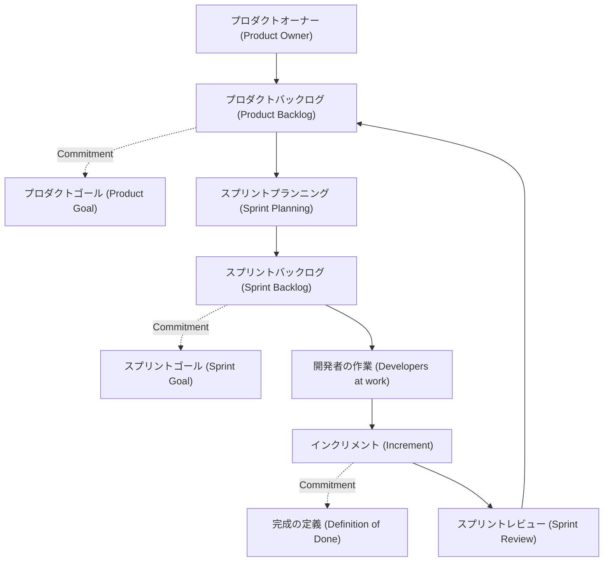
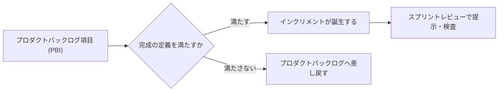
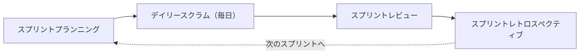
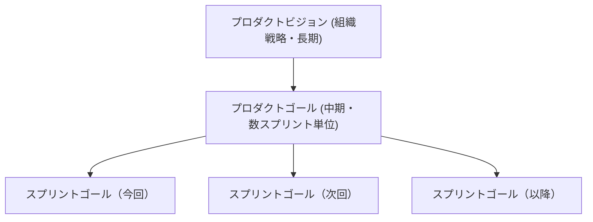

# Scrum Artifacts と Commitments 完全ガイド（Certified ScrumMaster® 対策）

> 対象：Certified ScrumMaster®（CSM®）取得を目指す初学者
> 範囲：Scrum の 3 つのアーティファクト（Artifacts）と 3 つのコミットメント（Commitments）
> 準拠：The 2020 Scrum Guide / Scrum Alliance CSM Learning Objectives（出典は末尾の「参考文献・ソース一覧」を参照）

---

## 目次

- [Step 0. このガイドについて／CSM試験の基礎知識](#step-0-このガイドについてcsm試験の基礎知識)
- [Step 1. アーティファクトとコミットメントの全体像](#step-1-アーティファクトとコミットメントの全体像)
- [Step 2. プロダクトバックログ（Product Backlog）とプロダクトゴール（Product Goal）](#step-2-プロダクトバックログproduct-backlogとプロダクトゴールproduct-goal)
- [Step 3. スプリントバックログ（Sprint Backlog）とスプリントゴール（Sprint Goal）](#step-3-スプリントバックログsprint-backlogとスプリントゴールsprint-goal)
- [Step 4. インクリメント（Increment）と完成の定義（Definition of Done）](#step-4-インクリメントincrementと完成の定義definition-of-done)
- [Step 5. イベントとアーティファクトの検査ポイント](#step-5-イベントとアーティファクトの検査ポイント)
- [Step 6. プロダクトビジョン・プロダクトゴール・スプリントゴールの階層構造](#step-6-プロダクトビジョンプロダクトゴールスプリントゴールの階層構造)
- [Step 7. よくある誤解とCSM試験のひっかけポイント](#step-7-よくある誤解とcsm試験のひっかけポイント)
- [Step 8. CSM Learning Objectives との対応チェックリスト](#step-8-csm-learning-objectives-との対応チェックリスト)
- [参考文献・ソース一覧](#参考文献ソース一覧)

---

## Step 0. このガイドについて／CSM試験の基礎知識

Scrum Alliance の Certified ScrumMaster®（CSM®）コースは、Scrum フレームワークの中核（スクラムチームの役割、イベント、アーティファクト）を扱う入門資格です。コース受講後に受験するテストは、50問の多肢選択式で、90日以内・2回までの受験機会の中で1時間以内に37問以上正解する必要があります。

CSM の Learning Objectives（学習目標）は、次の資料をベースに策定されています。

- Scrum Guide（scrumguides.org）
- Manifesto for Agile Software Development（4つの価値観と12の原則）
- Scrum Alliance が定める Scrum の価値観
- Scrum Alliance のガイドレベルフィードバックおよび Scrum Foundations 学習目標

このガイドは、この中でも出題の中心となる「Scrum Artifacts（アーティファクト）」と「Commitments（コミットメント）」を、初学者向けにステップバイステップで解説します。

> **補足：** CSM の Learning Objectives は Bloom のタキソノミー（分類）に基づいて動詞が選ばれています。「説明できる（describe）」「議論できる（discuss）」「適用できる（apply）」など、単なる暗記ではなく「理解して使いこなせるか」が問われる点を意識して学習すると効果的です。

---

## Step 1. アーティファクトとコミットメントの全体像

### 1-1. アーティファクトとは何か

Scrum のアーティファクトは、チームが行う「作業」または生み出す「価値」を表すものです。アーティファクトの目的は、関係者全員が同じ情報をもとに検査・適応（inspect and adapt）できるよう、重要な情報の透明性を最大化することにあります。

Scrum には3つの公式なアーティファクトがあります。

| アーティファクト | 一言で言うと | 誰のためのものか |
|---|---|---|
| プロダクトバックログ（Product Backlog） | プロダクトを改善するために必要なことの一覧 | スクラムチーム全体（プロダクトオーナーが管理） |
| スプリントバックログ（Sprint Backlog） | 今スプリントで行う作業の計画 | 開発者（Developers）による・開発者のための計画 |
| インクリメント（Increment） | プロダクトゴールに向けた具体的な一歩 | ステークホルダー・スクラムチーム |

### 1-2. コミットメントとは何か

2020年版 Scrum Guide で新たに明確化されたのが「コミットメント」です。各アーティファクトには、透明性とフォーカスを高め、進捗を測定できるようにするための「コミットメント」が1つずつ紐づいています。

| アーティファクト | 対応するコミットメント |
|---|---|
| プロダクトバックログ | プロダクトゴール（Product Goal） |
| スプリントバックログ | スプリントゴール（Sprint Goal） |
| インクリメント | 完成の定義（Definition of Done） |

これらのコミットメントは、経験主義（empiricism）と Scrum の価値観（Commitment, Focus, Openness, Respect, Courage）を強化するために存在します。コミットメントという言葉自体が2020年版ガイドのキーワードであり、「アーティファクト」と「その約束（コミットメント）」がセットで出題されやすいポイントです。

### 1-3. 全体の流れ（図解）

この図が示す通り、3つのアーティファクトは一方通行の書類ではなく、スプリントを回すたびに互いを更新し合う循環構造になっています。プロダクトバックログから選ばれた項目がスプリントバックログになり、開発者の作業を経てインクリメントが生まれ、スプリントレビューでの気づきが再びプロダクトバックログに反映されます。

---

## Step 2. プロダクトバックログ（Product Backlog）とプロダクトゴール（Product Goal）

### 2-1. 定義

プロダクトバックログは、プロダクトを改善するために必要なものを列挙した、順序付けされた（ordered）創発的な（emergent）リストです。スクラムチームが行う作業の「唯一の源泉」であり、常に変化し続けることが前提になっています。

重要な特徴は次の3つです。

- **創発的（emergent）**：最初から完成形ではなく、学びに応じて常に変化する
- **順序付けされている（ordered）**：優先度の高い項目ほど上位に並ぶ
- **プロダクトオーナーが管理責任を持つ**：作業自体は他者に委任してよいが、説明責任は常にプロダクトオーナーに残る

### 2-2. プロダクトバックログ・リファインメント（Refinement）

プロダクトバックログの項目を、より小さく・より詳細に分解していく継続的な活動を「リファインメント」と呼びます。1スプリントで完了できる程度まで具体化された項目は、スプリントプランニングで選択可能な状態（Ready）になります。

2020年版 Scrum Guide では、プロダクトバックログ項目は「見積もる（estimate）」のではなく「サイズを決める（size）」という表現に変更されました。サイズ付けの責任者は、実際に作業を行う開発者です。プロダクトオーナーは、開発者がトレードオフを理解し選択できるよう影響を与える立場にとどまります。

### 2-3. ベストプラクティス：DEEP 特性

Mike Cohn と Roman Pichler が提唱した「DEEP」は、健全なプロダクトバックログが備えるべき4つの特性の頭文字です。

| 特性 | 意味 | 実践のポイント |
|---|---|---|
| **D**etailed appropriately（適切に詳細化） | 上位項目ほど詳しく、下位項目は粗い | 直近数スプリント分だけ詳細化すれば十分 |
| **E**mergent（創発的） | 学びに応じて追加・削除・変更される | バックログは「固定リスト」ではなく「生きた文書」 |
| **E**stimated（見積もり／サイズ付け） | 各項目に相対的な規模の目安がある | 上位は精緻に、下位は粗くてよい |
| **P**rioritized（優先順位付け） | 価値の高い順に並んでいる | 優先順位はプロダクトオーナーが最終決定 |

### 2-4. ベストプラクティス：INVEST（項目の書き方）

個々のバックログ項目（多くはユーザーストーリー形式）が備えるべき性質として、Bill Wake が提唱し Mike Cohn が広めた「INVEST」も CSM 試験の周辺知識として押さえておくと理解が深まります。

| 頭文字 | 意味 |
|---|---|
| I | Independent（独立している） |
| N | Negotiable（交渉可能である） |
| V | Valuable（価値がある） |
| E | Estimable（見積もり可能である） |
| S | Small（小さい） |
| T | Testable（テスト可能である） |

### 2-5. リファインメントの実践ポイント

- リファインメントは正式なイベントではなく、必要に応じて継続的に行う活動（Scrum Guide では独立したイベントとして時間枠は定めていない）
- リファインメントに使う時間の目安として「開発者のキャパシティの10%程度」がよく引用されるが、これは Scrum Guide 本文の規定ではなく実践上の目安であることに注意する
- プロダクトオーナー1人で行うのではなく、開発者と協働して行うことで見積もりの精度と共通理解が高まる
- バックログが肥大化しすぎている場合は、詳細化の対象を直近のスプリント分に絞り込む

### 2-6. コミットメント：プロダクトゴール（Product Goal）

**定義：** プロダクトゴールは、プロダクトバックログに内包される「将来のプロダクトのあるべき姿」を描いた、スクラムチームの長期的な目的地です。プロダクトバックログの残りの項目は、すべてこのプロダクトゴールを満たすために存在します。スクラムチームは、1つのプロダクトゴールを達成する（あるいは断念する）まで、それに集中します。

**プロダクトビジョンとの違い：** プロダクトゴールは、数年単位の壮大な「プロダクトビジョン」そのものではなく、そのビジョンに向かう途中の「中間目標」と位置づけられます。

### 2-7. ベストプラクティス：プロダクトゴールの立て方

| 観点 | 実践のポイント |
|---|---|
| ビジョンとの整合性 | プロダクトビジョン（長期）と矛盾しない、その通過点として設計する |
| 明確さ | 誰が読んでも同じ理解ができるくらいシンプルに書く |
| 成果指向 | 機能の列挙ではなく、顧客にもたらす成果（アウトカム）で表現する |
| 測定可能性 | 達成できたかどうかを判断できる基準を持たせる |
| 透明性 | プロダクトバックログの中に明示し、チーム全員がいつでも参照できるようにする |
| 検査のタイミング | もっとも適した検査の場はスプリントレビュー（ステークホルダーが集まるため）。ただしいつでも見直してよい |
| 断念する勇気 | 目標が実現不可能・無意味になった場合は、プロダクトオーナーの判断で放棄し新しいゴールを設定してよい |

---

## Step 3. スプリントバックログ（Sprint Backlog）とスプリントゴール（Sprint Goal）

### 3-1. 定義

スプリントバックログは、次の3つの要素で構成されます。

1. **なぜ（Why）**：スプリントゴール
2. **何を（What）**：このスプリントのために選ばれたプロダクトバックログ項目
3. **どのように（How）**：インクリメントを届けるための実行可能な計画

スプリントバックログは「開発者による、開発者のための計画」であり、開発者がスプリント中の作業状況をリアルタイムに可視化するために保持・更新します。デイリースクラムで進捗を検査できるだけの詳細さが必要です。

### 3-2. 特性

- **所有者は開発者**：プロダクトオーナーやスクラムマスターが一方的に項目を追加・削除することはできない
- **リアルタイムに更新される**：スプリント計画時点で完璧である必要はなく、学びに応じて更新し続ける
- **1つのスプリントに1つのスプリントバックログ**：不具合対応や追加作業のための別バックログを持たない

### 3-3. ベストプラクティス

| 実践ポイント | 補足 |
|---|---|
| スプリントゴールを可視化する | ボードの見える位置に大きく掲示し、デイリースクラムで進捗を語る材料にする |
| 固定するのはスプリントゴールだけ | 具体的なタスクや項目は、ゴールを損なわない範囲で調整してよい |
| 相対見積もりを使う | 時間（工数）ではなく相対的な規模で計画すると精度が安定しやすい |
| タスクへの分解は開発者に委ねる | 1日以内で完了できる単位に分解する方法は、開発者だけが決められる |
| デイリースクラムで更新する | 進捗確認後に、翌日の作業計画をその都度アップデートする |

### 3-4. よくあるアンチパターン

| アンチパターン | 何が問題か |
|---|---|
| プロダクトオーナーが開発者の作業内容を指示する | 開発者の自己管理（self-managing）の原則に反する |
| スプリントバックログをタスクリストとしてしか扱わない | ゴール志向の計画ではなく単なるチェックリストになり、優先順位判断ができなくなる |
| スプリントの途中でスコープを固定化する | 学びに応じた調整ができず、経験主義の利点を失う |

### 3-5. コミットメント：スプリントゴール（Sprint Goal）

**定義：** スプリントゴールは、そのスプリントにおける単一の目的です。開発者によるコミットメントですが、達成手段には柔軟性があります。スプリントゴールがあることで、チームはバラバラの作業ではなく1つの方向に向かって協働できます。

スプリントゴールは、スプリントプランニングの「トピック1：このスプリントはなぜ価値があるのか」で作成され、プランニングの終了までに確定されなければなりません。作業が想定と異なる場合、開発者はスプリントゴールを損なわない範囲でプロダクトオーナーと協力し、スプリントバックログの範囲を調整します。

### 3-6. ベストプラクティス：良いスプリントゴールの書き方

| 実践ポイント | 補足 |
|---|---|
| 具体的にする | 達成したかどうかをチームが判断できる程度に明確にする |
| 柔軟性を残す | 具体的すぎて、途中の学びに応じた調整の余地を奪わないようにする |
| 価値にフォーカスする | プロダクトゴールに向けた一歩として、顧客・ビジネス価値を軸に書く |
| チーム全員で作る | プロダクトオーナーが方向性を提案し、スクラムチーム全体で合意形成する |
| 「全項目を完了する」を避ける | これは実質的にゴールがない状態と同じであり、優先順位判断の助けにならない |

代表的なテンプレートの一例（Scrum.org が紹介するシンプルな型）：

> 私たちは〈アウトカム〉に注力する。これは〈顧客〉に〈インパクト〉をもたらすと信じている。これは〈確認できる条件〉が満たされたときに確認できる。

---

## Step 4. インクリメント（Increment）と完成の定義（Definition of Done）

### 4-1. 定義

インクリメントは、プロダクトゴールに向けた具体的な一歩です。それまでのすべてのインクリメントに対して追加的（additive）であり、他のインクリメントと組み合わせても正しく機能するよう十分に検証されている必要があります。価値を提供するためには、利用可能（usable）でなければなりません。

### 4-2. 特性

- 1回のスプリントの中で、複数のインクリメントが作られることもある
- スプリントで作られたインクリメントの総和は、スプリントレビューで提示され経験主義を支える
- スプリントの終了を待たずに、ステークホルダーへ届けてもよい（スプリントレビューはリリースの関門ではない）
- 完成の定義を満たさない作業は、インクリメントの一部とはみなされない

### 4-3. ベストプラクティス

| 実践ポイント | 補足 |
|---|---|
| リリース可能な状態を保つ | 「リリースする／しない」の判断と、「リリース可能な品質かどうか」は別問題として扱う |
| 完成の定義を満たさない項目は差し戻す | 無理に提示・リリースせず、プロダクトバックログへ戻して再度検討する |
| こまめにインクリメントを積み上げる | スプリントの最後にまとめて作るのではなく、継続的に統合・検証する |
| 技術的負債を可視化する | 完成の定義を満たさない「Undone」作業を放置すると、将来のインクリメントの品質を下げる |

### 4-4. コミットメント：完成の定義（Definition of Done）

**定義：** 完成の定義は、インクリメントがプロダクトに求められる品質基準を満たした状態を、形式的に記述したものです。プロダクトバックログ項目が完成の定義を満たした瞬間に、インクリメントが生まれます。

完成の定義が組織標準として存在する場合、すべてのスクラムチームは最低限それに従わなければなりません。組織標準がなければ、スクラムチームがプロダクトに適した完成の定義を自ら作成します。複数のスクラムチームが同じプロダクトに取り組む場合は、共通の完成の定義に合意し遵守する必要があります。

### 4-5. 完成の定義 と 受け入れ基準（Acceptance Criteria）の違い

CSM 試験で混同しやすいポイントのひとつです。

| 観点 | 完成の定義（Definition of Done） | 受け入れ基準（Acceptance Criteria） |
|---|---|---|
| 適用範囲 | すべてのプロダクトバックログ項目・インクリメントに共通 | 個々の項目ごとに固有 |
| 目的 | 品質基準・技術的な完了条件を定める | 機能要件・ビジネスロジックを定める |
| 決める人 | スクラムチーム（多くは組織標準を土台にする） | プロダクトオーナー（開発者の助言を受けながら） |
| 変化の頻度 | 比較的安定している | 項目ごとに毎回変わる |

### 4-6. ベストプラクティス：完成の定義の作り方

- チーム全員参加のワークショップ形式で、対象領域の専門家（セキュリティ、運用など該当する場合）を交えて洗い出す
- 最初から完璧を求めず、小さく始めて経験を積みながら育てていく
- コードレビュー、テストの実施、ドキュメント更新など、技術的な完了条件を具体的に列挙する
- 定期的にスプリントレトロスペクティブで見直し、形骸化させない

**チェックリスト例（Webサイト開発の場合）：**

| # | 完成の定義の項目例 |
|---|---|
| 1 | すべてのページ要素が動作し、デバイス間でレスポンシブに表示される |
| 2 | コードレビューが完了している |
| 3 | 自動テスト（ユニット・機能テスト）がすべて成功している |
| 4 | クロスブラウザでの動作確認が完了している |
| 5 | ドキュメントが更新されている |

---

## Step 5. イベントとアーティファクトの検査ポイント

Scrum の5つのイベントは、いずれも「検査と適応」の機会として設計されています。CSM の学習目標では「各スクラムイベントにおいて、透明性を高めるための検査・適応の例を1つ挙げられること」が明示的に求められます。

| イベント | 主に検査するアーティファクト／コミットメント | 目的 |
|---|---|---|
| スプリントプランニング | プロダクトバックログ、プロダクトゴール | スプリントで何を・なぜ・どのように行うかを計画する |
| デイリースクラム | スプリントバックログ、スプリントゴール | スプリントゴールへの進捗を検査し、翌日の計画を適応させる |
| スプリントレビュー | インクリメント、プロダクトゴール | 成果物を検査し、プロダクトバックログを今後の機会に合わせて適応させる |
| スプリントレトロスペクティブ | 個人・相互作用・プロセス・ツール・完成の定義 | チームの効果性を検査し、次スプリントの改善点を適応させる |
| （スプリントそのもの） | 3つのアーティファクトすべて | 他のすべてのイベントを内包する「コンテナ」として機能する |

---

## Step 6. プロダクトビジョン・プロダクトゴール・スプリントゴールの階層構造

3つの「目的地」を混同しないことも、CSM 試験の理解を深めるうえで重要です。

| 概念 | 時間軸 | 誰が主導するか | Scrum Guide 上の位置づけ |
|---|---|---|---|
| プロダクトビジョン | 長期（数年単位） | プロダクトオーナー／組織 | Scrum Guide には明文化されていない、実践上の概念 |
| プロダクトゴール | 中期（複数スプリント） | プロダクトオーナー（コミュニケーションの責任） | プロダクトバックログのコミットメント |
| スプリントゴール | 短期（1スプリント） | 開発者（スクラムチーム全体で合意） | スプリントバックログのコミットメント |

---

## Step 7. よくある誤解とCSM試験のひっかけポイント

| よくある誤解 | 正しい理解 |
|---|---|
| スプリントゴール＝「バックログ項目を全部終わらせること」 | それは実質的にゴールが存在しないのと同じ。価値ある成果を1つの文で表現する必要がある |
| 完成の定義＝受け入れ基準 | 完成の定義は全項目共通の品質基準、受け入れ基準は項目ごとの機能要件で別物 |
| スプリントバックログは固定計画である | 固定されるのはスプリントゴールのみ。項目やタスクは学びに応じて調整してよい |
| インクリメントはスプリントの最後にまとめて1つだけ作る | 1スプリント中に複数のインクリメントが生まれることもある |
| スプリントレビューを通過しないとリリースできない | スプリントレビューはリリースの関門ではない。完成の定義を満たせばスプリント途中でも届けられる |
| プロダクトバックログ項目は「見積もる」もの | 2020年版ガイドでは「サイズを決める（size）」という表現に整理され、責任は開発者にある |
| プロダクトオーナーが1人で完成の定義を決める | 完成の定義はスクラムチーム全体（組織標準がある場合はそれを最低限守る）で定める |
| プロダクトゴールとプロダクトビジョンは同じもの | プロダクトゴールはビジョンに至る中間目標であり、ビジョンそのものより具体的で測定可能 |

---

## Step 8. CSM Learning Objectives との対応チェックリスト

Scrum Alliance の CSM Learning Objectives（2022年1月改訂版）のうち、本ガイドの内容と直接関係する項目を整理します。学習の仕上げに、以下を自分の言葉で説明できるか確認してください。

| LO番号 | 学習目標（要約） | 本ガイドの対応箇所 |
|---|---|---|
| 1.6 | プロダクトオーナーがプロダクトバックログに対して権限を持ちながら、開発者やステークホルダーと協働する理由を議論できる | Step 2 |
| 1.7 | 各スクラムイベントにおいて、透明性を高める検査・適応の例を1つ挙げられる | Step 5 |
| 1.8〜1.10 | スプリントプランニング／スプリントレビュー／スプリントレトロスペクティブを実施できる | Step 3〜5 |
| 1.13 | デイリースクラムがステータス会議とどう異なるかを、制約の理由とともに議論できる | Step 3 |
| 1.15 | 強固な完成の定義がもたらす利点を3つ以上説明できる | Step 4 |
| 1.16 | 完成の定義を作成する方法を1つ以上挙げられる | Step 4 |
| 3.2〜3.3 | 技術的負債の影響と、高品質なインクリメントのための開発プラクティスを挙げられる | Step 4 |

> **学習のコツ：** CSM の Learning Objectives は「describe（説明できる）」「discuss（議論できる）」「apply（適用できる）」のように動詞が明示されています。単に用語を暗記するのではなく、実際のスクラムチームの場面を想定して「なぜそうなっているのか」を自分の言葉で説明できるようにしておくと、応用問題にも対応しやすくなります。

---

## 参考文献・ソース一覧

本ガイドの内容は、以下の一次情報源を根拠としています。Scrum Guide の内容は Ken Schwaber 氏・Jeff Sutherland 氏により Creative Commons Attribution-ShareAlike 4.0 ライセンスの下で提供されています。

| # | 出典 | 内容 | URL |
|---|---|---|---|
| 1 | Scrum Guides（公式） | The 2020 Scrum Guide（HTML版・Artifacts / Commitments の一次情報源） | https://scrumguides.org/scrum-guide.html |
| 2 | Scrum Guides（公式） | The 2020 Scrum Guide（PDF版） | https://scrumguides.org/docs/scrumguide/v2020/2020-Scrum-Guide-US.pdf |
| 3 | Scrum Guides（公式） | Scrum Guide 改訂履歴（2020年の変更点） | https://scrumguides.org/revisions.html |
| 4 | Scrum Alliance | Certified ScrumMaster®（CSM®）認定ページ | https://www.scrumalliance.org/get-certified/scrum-master-track/certified-scrummaster |
| 5 | Scrum Alliance | CSM Learning Objectives（2022年1月改訂版） | https://www.scrumalliance.org/media/certifications/los/csm_learning_objectives_2022.pdf |
| 6 | Scrum Alliance | Product Goals in Scrum（プロダクトゴール解説記事） | https://resources.scrumalliance.org/Article/product-goals-scrum |
| 7 | Scrum.org | Scrum Guide 2020 Update: Commitments | https://www.scrum.org/resources/blog/scrum-guide-2020-update-commitments |
| 8 | Scrum.org | What is a Definition of Done? | https://www.scrum.org/resources/what-definition-done |
| 9 | Scrum.org | Getting started with a Definition of Done (DoD) | https://www.scrum.org/resources/blog/getting-started-definition-done-dod |
| 10 | Scrum.org | DONE - Understanding of the Definition of "Done" | https://www.scrum.org/resources/blog/done-understanding-definition-done |
| 11 | Scrum.org | Crafting Effective Sprint Goals in Scrum | https://www.scrum.org/resources/blog/crafting-effective-sprint-goals-scrum |
| 12 | Scrum.org | Getting to Done: Creating Good Sprint Goals | https://www.scrum.org/resources/blog/getting-done-creating-good-sprint-goals |
| 13 | Scrum.org | Crafting a good Sprint Goal | https://www.scrum.org/resources/blog/crafting-good-sprint-goal | 
| 14 | Scrum.org | Formulating a Product Goal | https://www.scrum.org/resources/formulating-product-goal |
| 15 | Scrum.org | The Product Goal explained | https://www.scrum.org/resources/blog/product-goal-explained |
| 16 | Scrum.org | What is a Sprint Backlog? | https://www.scrum.org/resources/what-is-a-sprint-backlog |
| 17 | Scrum.org | Using Sprint Backlogs Effectively | https://www.scrum.org/resources/using-sprint-backlogs-effectively |
| 18 | Mountain Goat Software（Mike Cohn） | Make the Product Backlog DEEP | https://www.mountaingoatsoftware.com/blog/make-the-product-backlog-deep |
| 19 | Caroli.org | Writing User Stories（INVEST の解説） | https://caroli.org/en/user-story/ |

---

*本ガイドは学習目的の要約・解説であり、Scrum Guide 原文の翻訳・転載ではありません。正確な定義・原文表現については、必ず上記の一次情報源（特に #1・#2）を参照してください。*
