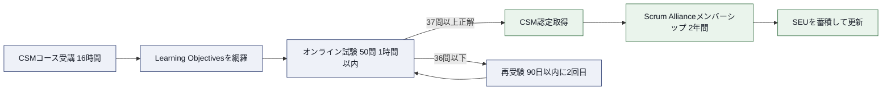
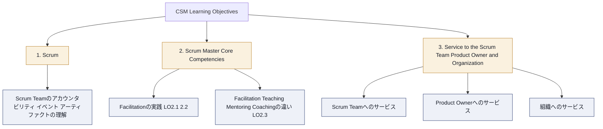
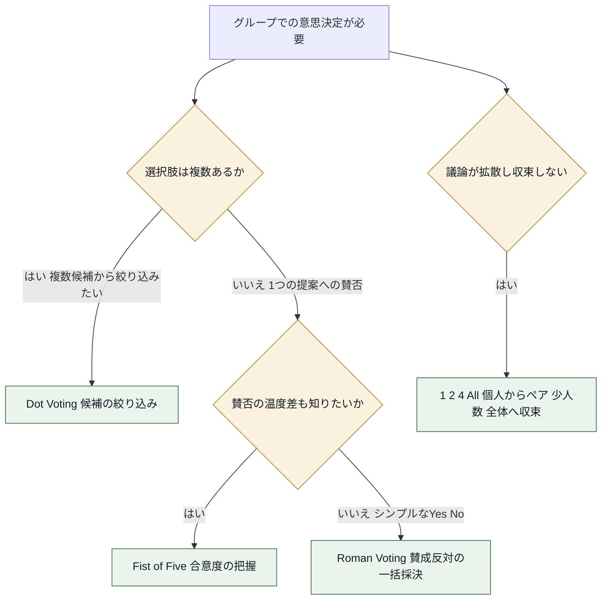
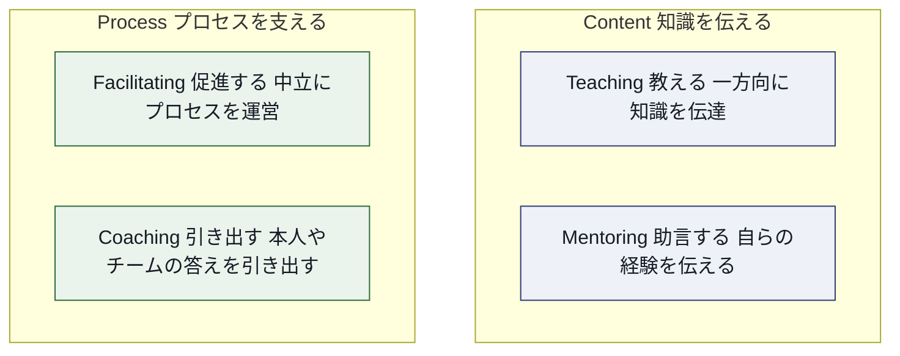
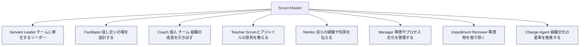
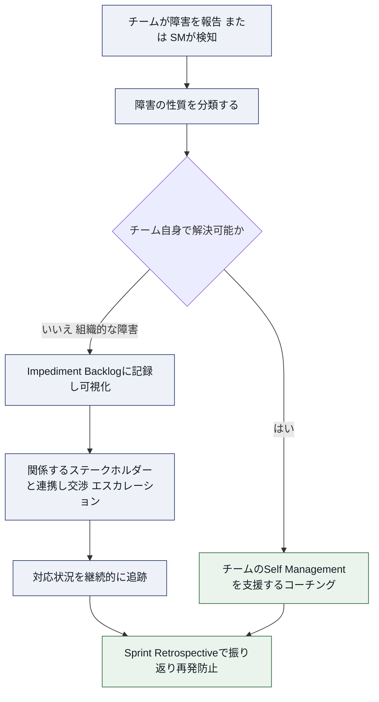
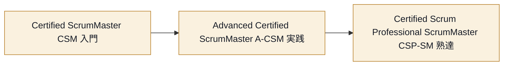

# Certified ScrumMaster®(CSM®) Scrum Master Core Competencies 完全解説ガイド

## このガイドについて

このガイドは、Scrum Alliance® の **Certified ScrumMaster®(CSM®)** 認定コースで扱われる学習内容のうち、特に **Scrum Master Core Competencies(スクラムマスターのコア・コンピテンシー)** を中心に、初学者が段階的に理解できるようにまとめた非公式の学習資料です。

- **対象読者**: これから CSM を受験する方、Scrum Master の役割を初めて学ぶ方、社内で Scrum Master 教育を行うトレーナー
- **進め方**: Step 1 から Step 7 まで順番に読むことで、CSM 試験の全体構造 → Scrum Master という役割の土台 → Core Competencies の詳細 → Scrum Team/Product Owner/組織へのサービス、という流れで理解が深まるように構成しています
- **免責事項**: 本ガイドは Scrum Alliance の公式教材ではなく、公開情報をもとに作成した学習補助資料です。最新かつ正確な情報は必ず各セクションの出典リンク、および [Scrum Alliance 公式サイト](https://www.scrumalliance.org/get-certified/scrum-master-track/certified-scrummaster) を確認してください
- **表記方針**: 日本語の説明文の中で、Scrum の用語(Scrum Master、Product Owner、Sprint Planning など)は原則として英語表記のまま使用しています

---

## 目次

1. [Step 1. CSM認定の全体像を掴む](#step-1-csm認定の全体像を掴む)
2. [Step 2. Learning Objectivesの構造を理解する](#step-2-learning-objectivesの構造を理解する)
3. [Step 3. Scrum Masterという役割の土台を固める](#step-3-scrum-masterという役割の土台を固める)
4. [Step 4. Scrum Master Core Competenciesを1つずつ理解する](#step-4-scrum-master-core-competenciesを1つずつ理解する)
5. [Step 5. Scrum Team・Product Owner・組織へのサービス](#step-5-scrum-teamproduct-owner組織へのサービス)
6. [Step 6. ベストプラクティス総まとめ](#step-6-ベストプラクティス総まとめ)
7. [Step 7. 学習を深める：認定パスとSEU](#step-7-学習を深める認定パスとseu)
8. [参考文献・出典](#参考文献出典)

---

## Step 1. CSM認定の全体像を掴む

### 1-1. CSMとは何か

CSM は Scrum Alliance が提供する Scrum Master トラックの入門認定です。Scrum の全体像(アカウンタビリティ・イベント・アーティファクト)を学びながら、Scrum Master として何を身につけるべきかを、認定トレーナーである Certified Scrum Trainer®(CST®)から対面またはオンラインのコースで学ぶ形式の認定です。

CSM コースは、単に Scrum のルールを覚えるものではなく、チームや組織のアジリティを高めるために Scrum Master がどのように振る舞うべきかという「マインドセット」を養うことに重点が置かれています。

> 出典: [Certified ScrumMaster (CSM) Certification - Scrum Alliance](https://www.scrumalliance.org/get-certified/scrum-master-track/certified-scrummaster)

### 1-2. 試験の仕組み

| 項目 | 内容 |
| --- | --- |
| コース時間 | 16時間(多くは2〜3日間で開催) |
| 受験資格 | CSM コースを修了していること |
| 試験形式 | オンライン、多肢選択式 50問 |
| 制限時間 | 1時間 |
| 合格基準 | 50問中37問以上の正解 |
| 受験可能回数 | コース費用に2回分の受験機会が含まれる |
| 受験期限 | コース修了から90日以内 |
| 認定後の特典 | Scrum Alliance の2年間メンバーシップ |
| 費用の目安 | 250〜2,495 USD(トレーナー・地域・形式により変動) |

> 出典: [Certified ScrumMaster (CSM) Certification - Scrum Alliance(FAQセクション)](https://www.scrumalliance.org/get-certified/scrum-master-track/certified-scrummaster)

### 1-3. 認定取得までの流れ

**ベストプラクティス**

- コース中に扱われる Learning Objectives(学習目標)を事前に確認し、コース後の復習チェックリストとして使う
- 試験直前ではなく、コース修了後できるだけ早いタイミングで受験する(記憶が新しいうちに)
- 1回目で不合格でも90日以内・2回目の受験機会があることを覚えておき、焦らず復習する

---

## Step 2. Learning Objectivesの構造を理解する

CSM の学習内容は、Scrum Alliance が公開している **CSM Learning Objectives(学習目標)** という公式文書で定義されています。この文書は、CST がコースを設計する際の共通の土台であり、CSM 受験者が「何を学ぶべきか」を知るための一次情報です。

### 2-1. 3つのカテゴリ

CSM の Learning Objectives は次の3つの大カテゴリで構成されています。

| カテゴリ | 内容の概要 | 主な学習項目数 |
| --- | --- | --- |
| 1. Scrum | Scrum Team のアカウンタビリティ、Scrum Events、Definition of Done などの基礎知識 | 16項目(1.1〜1.16) |
| 2. Scrum Master Core Competencies | Facilitation を中心に、Teaching・Mentoring・Coaching との違いを理解する | 3項目(2.1〜2.3) |
| 3. Service to the Scrum Team, Product Owner, and Organization | Scrum Master がチーム・PO・組織それぞれにどう貢献するか | 9項目(3.1〜3.9) |

このガイドでは、特にカテゴリ2「Scrum Master Core Competencies」を中心に据えつつ、それと密接に関わるカテゴリ3「Service to the Scrum Team, Product Owner, and Organization」も併せて詳しく解説します。

> 出典: [CSM Learning Objectives(PDF, 2022年1月改訂)](https://www.scrumalliance.org/media/certifications/los/csm_learning_objectives_2022.pdf)

### 2-2. Bloom's Taxonomyという評価軸

CSM の各 Learning Objective は、教育学で広く使われる **Bloom's Taxonomy(ブルームの教育目標分類)** に基づく動詞(describe、demonstrate、apply など)で書かれています。これにより、その学習目標が「知っていればよい」レベルなのか「実践できる必要がある」レベルなのかが明確になります。

| レベル | 内容 | 代表的な動詞 |
| --- | --- | --- |
| Knowledge(知識) | 情報・プロセス・事実・概念を思い出せる | Define, Name, List |
| Comprehension(理解) | 情報を解釈し、その重要性を判断できる | Describe, Discuss, Recognize |
| Application(応用) | 身につけた知識・概念を実際の場面で使える | Apply, Demonstrate, Illustrate |
| Analysis(分析) | 批判的思考で情報を分解・整理できる | Compare, Contrast, Distinguish |
| Synthesis(統合) | 知識を使って新しい成果物やプロセスを作れる | Create, Prepare, Organize |
| Evaluation(評価) | 判断力を使って意思決定・問題解決ができる | Measure, Assess, Evaluate |

**ベストプラクティス**

- 学習目標の動詞に注目する。「describe(説明できる)」なら暗記で対応できるが、「demonstrate(実演できる)」なら実際にやってみる練習が必要
- CSM の Core Competencies(LO2.1〜2.3)は describe・demonstrate・discuss という動詞が使われており、単なる暗記ではなく実演・議論できるレベルが求められている点に注意する

> 出典: [CSM Learning Objectives(PDF)- Bloom's Taxonomyの節](https://www.scrumalliance.org/media/certifications/los/csm_learning_objectives_2022.pdf)

---

## Step 3. Scrum Masterという役割の土台を固める

Core Competencies を学ぶ前に、そもそも Scrum Master がどう定義されているかを押さえておきます。CSM Learning Objectives は The Scrum Guide(scrumguides.org)を土台にしているため、まずはこの一次情報を確認します。

### 3-1. Scrum Guideにおける定義

The Scrum Guide(2020年版)では、Scrum Master は Scrum Team の効果性(effectiveness)に責任を持つアカウンタビリティとして定義されています。有名な一文として、次のように述べられています。

> "Scrum Masters are true leaders who serve the Scrum Team and the larger organization."
> — The Scrum Guide

Scrum Master はチームやProduct Owner の代わりに意思決定をする立場ではなく、チームが Scrum の実践を通じて自ら改善していけるよう支援する存在です。具体的には、次のような形でチームに貢献します。

- チームメンバーの self-management と cross-functionality をコーチングする
- チームが Definition of Done を満たす高価値な Increment を作ることに集中できるようにする
- チームの進行を妨げる impediment(障害)の除去を主導する
- すべての Scrum Events が前向きかつ生産的に、タイムボックス内で行われるようにする

> 出典: [The Scrum Guide - scrumguides.org](https://scrumguides.org/scrum-guide.html)

### 3-2. Scrumの5つの価値基準

Scrum Master が Facilitation や Coaching を行う際の土台になるのが、Scrum の5つの価値基準です。CSM Learning Objectives でも参照される Scrum Alliance の公式情報に基づき整理します。

| 価値基準 | 概要 |
| --- | --- |
| Commitment(確約) | チームは Product Goal・Sprint Goal の達成に向けて互いに協力し合う。達成できると信じられる範囲でのみ仕事を引き受ける |
| Courage(勇気) | 「No」と言う、助けを求める、新しいことに挑戦する勇気を持つ |
| Focus(集中) | チーム全員が Sprint Goal に向けた作業に集中する |
| Openness(公開) | 新しいアイデアや学びの機会に対してオープンであり、課題を正直に共有する |
| Respect(尊敬) | チームメンバー・Product Owner・ステークホルダー・Scrum Master が互いを尊重する |

**ベストプラクティス**

- Scrum Master は、これらの価値基準がチームの日々の行動として現れているかを観察し、価値基準から逸脱している兆候(例: Sprint Retrospective での率直な発言が減る)に早めに気づく
- 価値基準を「額縁に飾る言葉」にせず、Sprint Retrospective などの場で具体的な行動と結び付けて話題にする

> 出典: [What is Scrum - Scrum values - Scrum Alliance](https://www.scrumalliance.org/about-scrum)

---

## Step 4. Scrum Master Core Competenciesを1つずつ理解する

ここからが本ガイドの中心テーマです。CSM Learning Objectives のカテゴリ2「Scrum Master Core Competencies」は次の3つの学習目標で構成されています。

| LO番号 | 学習目標の要旨 |
| --- | --- |
| 2.1 | Scrum Master が Facilitation を通じて Scrum Team や組織のニーズに応える具体的な状況を3つ以上説明できる |
| 2.2 | グループの意思決定を促す Facilitation の技法を3つ以上実演できる |
| 2.3 | Facilitating・Teaching・Mentoring・Coaching がそれぞれどう異なるかを議論できる |

> 出典: [CSM Learning Objectives(PDF)- 2. Scrum Master Core Competencies](https://www.scrumalliance.org/media/certifications/los/csm_learning_objectives_2022.pdf)

### 4-1. Facilitation(ファシリテーション)とは — LO2.1

**Facilitation** とは、中立な第三者として、意思決定そのものへの権限を持たずに、グループの効果性と意思決定プロセスを高める技術のことです。Scrum の5つの Event(Sprint Planning、Daily Scrum、Sprint Review、Sprint Retrospective、そして Sprint そのもの)や Product Backlog Refinement は、いずれも Facilitation が特に重要になる場面です。

Scrum Master が Facilitation を通じてチームや組織のニーズに応える代表的な場面は次の通りです。

| 場面 | Scrum Masterが果たす役割の例 |
| --- | --- |
| Sprint Planning | Sprint Goal の合意形成、作業量の見積もりに関する対話を構造化する |
| Sprint Retrospective | 心理的安全性を確保し、率直な振り返りと具体的なアクションの合意を導く |
| Product Backlog Refinement | Product Owner と Developers の対話を整理し、Backlog Item の理解を揃える |
| 組織横断の課題解決 | 複数チームやステークホルダーが関わる議論で、対立する意見を整理し合意点を見つける |
| 新しいチームの立ち上げ | チーム規範(Working Agreement)づくりの対話を設計する |

**ベストプラクティス**

- 会議の前に「目的」「進め方」「決めること」を明文化したアジェンダを共有する
- ファシリテーターは中立であることを徹底し、自分の意見を言いたいときは「今から Scrum Master としてではなく、一参加者として意見を言います」と役割を明示的に切り替える
- 発言が偏らないよう、ラウンドロビン(順番に発言を回す)やサイレントブレインストーミング(付箋に書き出してから共有)などの技法を使う
- リモート/ハイブリッドの場では、オンラインホワイトボードなどを使い、参加のハードルを下げる工夫をする

> 出典: [CSM Learning Objectives(PDF)- LO2.1](https://www.scrumalliance.org/media/certifications/los/csm_learning_objectives_2022.pdf) / [SEU Resources: Scrum Master Core Competencies - Scrum Alliance](https://resources.scrumalliance.org/Collection/seu-resources-scrum-master-core-competencies)

### 4-2. グループの意思決定を促す技法 — LO2.2

LO2.2 では、Scrum Master が実演できるべき「グループの意思決定を促す技法」が求められています。代表的な技法を整理します。

| 技法 | 概要 | 向いている場面 |
| --- | --- | --- |
| Fist of Five(フィスト・オブ・ファイブ) | 0〜5本の指で賛成度合いを同時に示す。0本は明確な反対、5本は強い賛成 | 1つの提案に対する合意度合いを段階的に把握したいとき |
| Roman Voting(ローマ投票) | 親指を上/下に向けて、単純な賛成・反対を同時に示す | 1つの提案に対してシンプルなYes/Noを素早く決めたいとき |
| Dot Voting(ドット投票) | 各参加者が限られた数のシールやドットを、複数の選択肢に自由に配分する | 多くの候補から優先度の高いものを絞り込みたいとき(Retrospectiveのアクション選定など) |
| 1-2-4-All(リベレイティング・ストラクチャーズ) | 個人で考える→ペアで話す→4人で話す→全体で共有、と段階的に意見を収束させる | 議論が拡散していて、大人数の合意形成が難しいとき |

**ベストプラクティス**

- Fist of Five で1〜2本しか出ていない参加者がいた場合、その場で無理に多数決に進まず、理由を聞いてから再投票する
- Dot Voting は「1人あたり何票持てるか」を事前に明確にする(候補数の1/3程度が目安とされることが多い)
- どの技法も、決を採る前に「これは全会一致が必要な決定か、多数決でよい決定か」をチームと合意しておく
- オンライン会議では、投票ツールやチャットのリアクション機能を使って Fist of Five や Roman Voting を代替できる

> 出典: [Five Ways to Build Consensus - Scrum.org](https://www.scrum.org/resources/blog/five-ways-build-consensus) / [Four Quick Ways to Gain or Assess Team Consensus - Mountain Goat Software](https://www.mountaingoatsoftware.com/blog/four-quick-ways-to-gain-or-assess-team-consensus)

### 4-3. Facilitating・Teaching・Mentoring・Coachingの違い — LO2.3

LO2.3 は、CSM 学習目標の中でも特に誤解されやすいポイントです。この4つはいずれも「人やチームの成長を支援する」行為ですが、アプローチが異なります。

| コンピテンシー | 定義 | 典型的な問いかけ |
| --- | --- | --- |
| Teaching(教える) | 体系立った知識やスキルを一方向的に伝達する。あらかじめ決まった正解がある | 「Sprint Goalとはこういうものです」と説明する |
| Mentoring(助言する) | 自分自身の経験や知見をもとに、相手の状況に合わせて助言する | 「私が同じ状況のときはこうしました」と伝える |
| Facilitating(促進する) | 中立な立場でプロセスを設計・運営し、グループ自身が答えを導けるようにする | 「今日はどんな進め方で決めたいですか」と場を整える |
| Coaching(引き出す) | 相手(個人・チーム・組織)自身が答えを持っていると信じ、質問を通じてそれを引き出す | 「あなたはこの状況をどう捉えていますか」と問いかける |

この4つの違いを整理するフレームワークとして、Agile Coaching Institute の Lyssa Adkins と Michael Spayd が提唱した **Agile Coaching Competency Framework(ACCF)** が広く使われています。ACCF では、これらを「Content(知識)」と「Process(プロセス)」という2つの軸で整理します。

| 軸 | Content寄り(知識を伝える) | Process寄り(プロセスを支える) |
| --- | --- | --- |
| 答えを与える | **Teaching**: 決まった知識・スキルを教える / **Mentoring**: 自分の経験に基づき助言する | (該当なし) |
| 答えを引き出す | (該当なし) | **Facilitating**: 中立にプロセスを運営する / **Coaching**: 質問を通じて本人の答えを引き出す |

**ベストプラクティス**

- 会話を始める前に「今から自分はどのスタンスを取るか」を自覚する。無意識に Teaching(説教)に偏ると、チームの当事者意識(オーナーシップ)を奪ってしまう
- チームが Scrum の基本ルールを知らない立ち上げ期は Teaching の比重が高くなりやすいが、チームが成熟するにつれて Facilitating や Coaching の比重を増やしていく
- 「自分の経験を話したくなったとき」はそれが Mentoring であることを自覚し、「これはあくまで一つの選択肢です」と伝えてチームの意思決定を奪わないようにする
- 明確な答えが必要なとき(例: Scrumのルールに関する質問)は Teaching、チーム自身に気づいてほしいとき(例: チームの働き方の改善)は Coaching、というように使い分ける

> 出典: [CSM Learning Objectives(PDF)- LO2.3](https://www.scrumalliance.org/media/certifications/los/csm_learning_objectives_2022.pdf) / [Coaching Agile Teams - Lyssa Adkins(Scrum.org掲載)](https://www.scrum.org/resources/coaching-agile-teams-companion-scrummasters-agile-coaches-and-project-managers-transition) / [Understanding ACI's Agile Coach Competency Framework](https://helpingimprove.com/understanding-acis-agile-coach-competency-framework/)

### 4-4. 拡張モデル：Scrum Masterの8つのスタンス

4つの Core Competencies をさらに実務的に細分化したモデルとして、Professional Scrum Trainer の Barry Overeem が Scrum.org で公開している **「The 8 Stances of a Scrum Master」** というホワイトペーパーが、多くの CSM/CSP-SM トレーニングでも参照される代表的な補助教材です。

| スタンス | 概要 |
| --- | --- |
| Servant Leader | チームやProduct Owner、組織のニーズを最優先し、支援を通じてリードする |
| Facilitator | 場を整え、明確な進行の枠組みを提供し、チームが協働できるようにする |
| Coach | 個人にはマインドセットと行動、チームには継続的改善、組織にはScrum Teamとの協働を促す |
| Manager | 障害の管理、無駄の排除、プロセス・チームの健全性・自己組織化の境界・文化の管理を担う |
| Mentor | アジャイルの知識や経験をチームに伝える |
| Teacher | Scrum やその他の関連手法が正しく理解され実践されるようにする |
| Impediment Remover | チームの自己組織化能力を超える障害を解決する |
| Change Agent | Scrum Teamが力を発揮できる組織文化を醸成する |

**ベストプラクティス**

- 8つすべてを常に発揮する必要はない。状況(チームの成熟度、扱う課題の性質)に応じて、どのスタンスが最も適切かを見極める
- 自分が得意なスタンス(例: Teaching)に偏りすぎていないか、定期的に振り返る
- 新しいチームには Teacher・Facilitator の比重を高め、チームが自走し始めたら Coach・Change Agent の比重を高めるなど、チームのライフサイクルに合わせてスタンスを調整する

> 出典: [The 8 Stances of a Scrum Master - Scrum.org](https://www.scrum.org/resources/8-stances-scrum-master)

---

## Step 5. Scrum Team・Product Owner・組織へのサービス

CSM Learning Objectives のカテゴリ3「Service to the Scrum Team, Product Owner, and Organization」は、カテゴリ2で学んだ Core Competencies を実際の現場でどう発揮するかを具体化したものです。ここでは LO3.1〜3.9 の内容を、対象(チーム/PO/組織)ごとに整理します。

### 5-1. Scrum Teamへのリーダーシップ — LO3.1

Scrum Master が Scrum Team のリーダーとして振る舞う代表的な場面には、次のようなものがあります。

| シナリオ | Scrum Masterの動き方 |
| --- | --- |
| チームが対立している | 対立の背景にある共通の目的を思い出させ、建設的な対話の場を設計する |
| チームが自己組織化に不慣れ | 意思決定の権限をチームに委譲しながら、必要な範囲で支援する |
| チームが変化への抵抗を示す | 変化の理由とチームへのメリットを対話の中で共に探る |

### 5-2. Technical Debt(技術的負債)の管理 — LO3.2, 3.3

Scrum Master は技術の専門家である必要はありませんが、技術的負債がチームや組織に与える影響を理解し、Developers が質の高い Increment を届けられるよう支援することが期待されます。

| 開発プラクティス | 技術的負債の抑制への効果 |
| --- | --- |
| 明確な Definition of Done | 「完了」の基準を揃え、後回しにされがちな品質作業の漏れを防ぐ |
| 継続的インテグレーション(CI) | 統合の遅れによる不具合の蓄積を防ぐ |
| テスト駆動開発(TDD)・自動テスト | 変更に強いコードベースを維持し、将来の手戻りを減らす |
| ペアプログラミング / コードレビュー | 知識の属人化を防ぎ、設計品質のばらつきを抑える |
| リファクタリングの継続的な実施 | 小さな負債をSprintごとに解消し、大きな負債化を防ぐ |

**ベストプラクティス**

- 技術的負債を「見えない負債」にしないため、Product Backlog 上で可視化する(専用のラベルやアイコンを使うなど)ことをチームに提案する
- 技術的負債の返済作業を毎スプリントの容量に一定割合組み込むよう、Product Owner との対話を促す
- Definition of Done の強度が組織のリスク許容度に見合っているか、定期的にチームと見直す

> 出典: [CSM Learning Objectives(PDF)- LO3.2, 3.3](https://www.scrumalliance.org/media/certifications/los/csm_learning_objectives_2022.pdf)

### 5-3. 障害(Impediment)への対応 — LO3.5〜3.7

組織的な障害(Organizational Impediment)とは、チーム自身の力だけでは解決できない、部門を超えた課題のことです。例として、部門間の承認プロセスの遅さ、予算編成サイクルとイテレーションのミスマッチ、テスト環境の不足などが挙げられます。

**ベストプラクティス**

- すべての障害をScrum Masterが自分で解決しようとせず、まずチームが自己組織化の力で解決できないかを見極める
- 組織的な障害は Impediment Backlog として一覧化し、優先順位・担当・状況を可視化する
- 経営層へのエスカレーションでは、「この障害がビジネスにどう影響しているか」をデータや具体例で示す
- 根本原因を探るために「なぜなぜ分析(5 Whys)」などの技法を使い、対症療法で終わらせない

> 出典: [CSM Learning Objectives(PDF)- LO3.5〜3.7](https://www.scrumalliance.org/media/certifications/los/csm_learning_objectives_2022.pdf)

### 5-4. Product Ownerへの支援 — LO3.4

Scrum Guide でも、Scrum Master が Product Owner に対して行う支援がいくつか挙げられています。CSM Learning Objectives の LO3.4 でもこの点が扱われます。

| 支援の内容 | 具体例 |
| --- | --- |
| Product Goal・Product Backlog管理の技法支援 | ユーザーストーリーマッピングなどの技法を紹介する |
| Backlog Itemの明確さ・簡潔さへの理解促進 | INVEST基準などを使ったBacklog Itemの書き方をチームに共有する |
| 複雑な環境での実証的なプロダクト計画の確立支援 | 経験主義に基づくロードマップの立て方を助言する |
| ステークホルダーとの連携促進 | Sprint Reviewの場をステークホルダーが参加しやすい形に設計する |

> 出典: [The 2020 Scrum Guide - scrumguides.org](https://scrumguides.org/scrum-guide.html) / [CSM Learning Objectives(PDF)- LO3.4](https://www.scrumalliance.org/media/certifications/los/csm_learning_objectives_2022.pdf)

### 5-5. 組織へのサービスとプロジェクトマネージャー不在の理由 — LO3.8, 3.9

Scrum の採用は、組織の意思決定構造そのものに変化をもたらします。LO3.8 では、Scrum 導入に伴う組織設計上の変化を1つ以上要約できることが求められ、LO3.9 では「なぜ Scrum にはプロジェクトマネージャーという役割が存在しないのか」を説明できることが求められます。

| 従来型プロジェクトマネージャーの役割 | Scrumでの担い手 |
| --- | --- |
| スコープ・スケジュール管理 | Product Owner(スコープ・価値の優先順位)+チームの自己組織化(スケジュール) |
| タスクの割り当て | Developers自身(自己組織化による割り当て) |
| 進捗報告 | Sprint ReviewやTransparencyを支える各種Artifact |
| 障害の解消 | Scrum Master(組織的障害への対応を含む) |
| チームの動機づけ | Scrum Master(Servant Leadershipを通じた支援) |

**ベストプラクティス**

- 「Scrum Masterはミニ・プロジェクトマネージャーではない」という誤解を、組織のステークホルダーに丁寧に説明する機会を作る
- 権限の委譲が進むにつれて、これまで管理職が担っていた意思決定の一部がチームに移ることを、管理職層にも事前に共有し合意形成する

> 出典: [CSM Learning Objectives(PDF)- LO3.8, 3.9](https://www.scrumalliance.org/media/certifications/los/csm_learning_objectives_2022.pdf)

---

## Step 6. ベストプラクティス総まとめ

| コンピテンシー / サービス領域 | 重要なベストプラクティス |
| --- | --- |
| Facilitation | 目的・進め方・決めることを事前に明文化する。中立性を保ち、意見を言うときは役割を明示的に切り替える |
| 意思決定技法 | 決定の性質(絞り込み/賛否/合意度/収束)に応じて Dot Voting・Roman Voting・Fist of Five・1-2-4-Allを使い分ける |
| Teaching / Mentoring / Facilitating / Coaching | 会話の前に自分のスタンスを自覚する。チームの成熟度に応じてTeaching中心からCoaching中心へ比重を移す |
| 8 Stances | 状況に応じてスタンスを切り替える。自分の得意なスタンスへの偏りを定期的に振り返る |
| Technical Debt | Definition of Done・CI・自動テスト・リファクタリングを継続的に実施し、負債を可視化する |
| Impediment対応 | チーム自身での解決可否を見極め、組織的障害はImpediment Backlogで可視化・追跡する |
| Product Ownerへの支援 | Backlogの技法支援とステークホルダー連携の場づくりを両輪で行う |
| 組織へのサービス | Scrum Masterとプロジェクトマネージャーの違いを丁寧に説明し、権限委譲について事前に合意形成する |

---

## Step 7. 学習を深める：認定パスとSEU

CSM はあくまで Scrum Master トラックの入門認定です。Scrum Alliance では、CSM取得後にさらに専門性を深めるための上位認定が用意されています。

A-CSM の Learning Objectives では、CSM のカテゴリ構成をさらに発展させ、「Scrum Master Core Competencies」に加えて「Service to the Scrum Team」「Service to the Product Owner」「Service to the Organization」「Scrum Mastery」がそれぞれ独立したカテゴリとして扱われており、CSM で学んだ土台がより深く展開されます。

また、Scrum Alliance の認定は「取得して終わり」ではなく、**Scrum Education Units(SEU)** を継続的に獲得し、2年ごとに更新する仕組みになっています。本ガイドで紹介した Facilitation・Coaching に関する記事や動画も、Scrum Alliance のリソースライブラリでSEU対象コンテンツとして提供されています。

**ベストプラクティス**

- A-CSM は CSM 取得後であれば受講申し込み自体は可能だが、A-CSM の認定発行には過去5年以内に積んだ12か月以上の Scrum Master としての実務経験の申告が必要になる。受講計画はこの12か月要件を前提に組み立てる
- SEUは資格更新のためだけでなく、学び続ける習慣づくりの仕組みとして活用する

> 出典: [Advanced Certified ScrumMaster (A-CSM) Learning Objectives(PDF)](https://assets.scrumalliance.org/media/certifications/los/adv_csm_learning_objectives_2022.pdf) / [Certified ScrumMaster (CSM) Certification - Scrum Alliance](https://www.scrumalliance.org/get-certified/scrum-master-track/certified-scrummaster) / [Advanced Certified ScrumMaster コースページ(公式要件)](https://www.scrumalliance.org/get-certified/scrum-master-track/advanced-certified-scrummaster)

---

## 参考文献・出典

### Scrum Alliance 公式情報

- [Certified ScrumMaster (CSM) Certification - Scrum Alliance](https://www.scrumalliance.org/get-certified/scrum-master-track/certified-scrummaster)
- [CSM Learning Objectives(PDF, 2022年1月改訂)](https://www.scrumalliance.org/media/certifications/los/csm_learning_objectives_2022.pdf)
- [Advanced Certified ScrumMaster (A-CSM) Learning Objectives(PDF)](https://assets.scrumalliance.org/media/certifications/los/adv_csm_learning_objectives_2022.pdf)
- [What is Scrum(Scrum values を含む) - Scrum Alliance](https://www.scrumalliance.org/about-scrum)
- [SEU Resources: Scrum Master Core Competencies - Scrum Alliance](https://resources.scrumalliance.org/Collection/seu-resources-scrum-master-core-competencies)
- [Advanced Certified ScrumMaster コースページ](https://www.scrumalliance.org/get-certified/scrum-master-track/advanced-certified-scrummaster)
- [Certified Scrum Professional - ScrumMaster コースページ](https://www.scrumalliance.org/get-certified/scrum-master-track/certified-scrum-professional-scrummaster)
- [Scrum Alliance Code of Ethics](https://www.scrumalliance.org/code-of-ethics)

### The Scrum Guide / Agile Manifesto

- [The Scrum Guide - scrumguides.org](https://scrumguides.org/scrum-guide.html)
- [Scrum Guide Revisions - scrumguides.org](https://scrumguides.org/revisions.html)
- [Manifesto for Agile Software Development - agilemanifesto.org](https://agilemanifesto.org/)

### Facilitation・Coaching・Stancesに関する補助資料

- [The 8 Stances of a Scrum Master - Scrum.org(Barry Overeem)](https://www.scrum.org/resources/8-stances-scrum-master)
- [Coaching Agile Teams - Lyssa Adkins(Scrum.org掲載)](https://www.scrum.org/resources/coaching-agile-teams-companion-scrummasters-agile-coaches-and-project-managers-transition)
- [Five Ways to Build Consensus - Scrum.org](https://www.scrum.org/resources/blog/five-ways-build-consensus)
- [Four Quick Ways to Gain or Assess Team Consensus - Mountain Goat Software](https://www.mountaingoatsoftware.com/blog/four-quick-ways-to-gain-or-assess-team-consensus)
- [Understanding ACI's Agile Coach Competency Framework](https://helpingimprove.com/understanding-acis-agile-coach-competency-framework/)

---

*本ガイドは学習補助を目的とした非公式資料です。試験の最新の出題範囲・合格基準・費用は変更される可能性があるため、受験前に必ず [Scrum Alliance 公式サイト](https://www.scrumalliance.org/get-certified/scrum-master-track/certified-scrummaster) で最新情報をご確認ください。*
