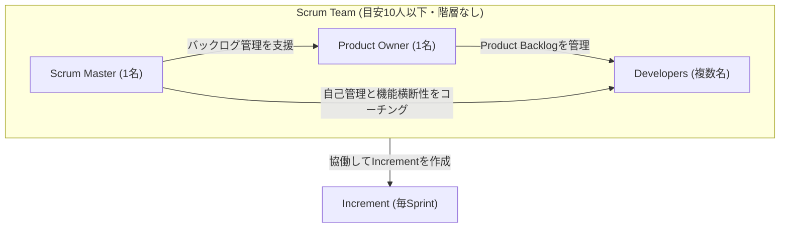
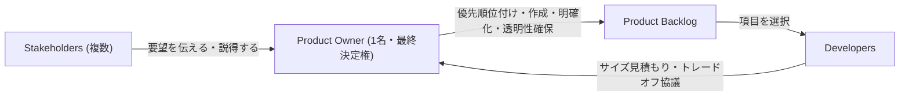
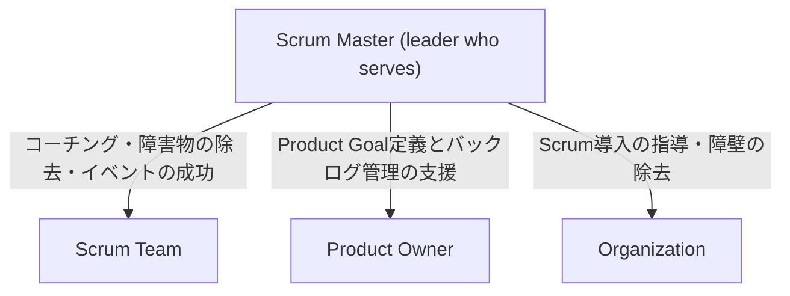
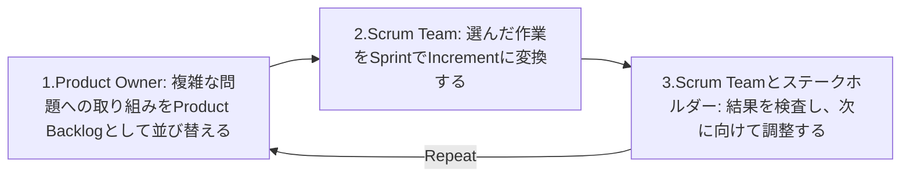

# 【CSM®対策】Scrum Team とは何か ― 3つのアカウンタビリティ徹底解説

> Certified ScrumMaster®(CSM®) 学習ガイド ｜ 対象トピック: **Scrum Team / 3 Accountabilities**
> 出典: [Scrum Alliance - Certified ScrumMaster (CSM)](https://www.scrumalliance.org/get-certified/scrum-master-track/certified-scrummaster)

---

## この章の位置づけ

Scrum Alliance が公開している「CSM Learning Objectives (2022年1月版)」では、CSM講座で必ずカバーすべき学習目標(Learning Objectives, LO)が3カテゴリに分類されています。本ガイドは、そのうち **カテゴリ1「Scrum」の中の「The Scrum Team」(LO 1.1〜1.6)** を初学者向けに、ステップ・バイ・ステップで解説するものです。

| カテゴリ | 内容 | 本ガイドでの扱い |
|---|---|---|
| 1. Scrum | The Scrum Team / Scrum Events and Activities | **本ガイドの中心テーマ** |
| 2. Scrum Master Core Competencies | Facilitation, Coaching, Teaching, Mentoring | 関連範囲として一部解説 |
| 3. Service to the Scrum Team, Product Owner, and Organization | Scrum Masterのリーダーシップ、技術的負債、組織的障害物 | 関連範囲として一部解説 |

> **出典:** Scrum Alliance, *CSM Learning Objectives*, January 2022, p.3-4. https://www.scrumalliance.org/media/certifications/los/csm_learning_objectives_2022.pdf

この学習目標は、以下の一次情報源を土台として設計されています。

- Manifesto for Agile Software Development(アジャイルソフトウェア開発宣言)― https://agilemanifesto.org
- Scrum Values ― https://www.scrumalliance.org/about-scrum/values
- **The 2020 Scrum Guide** ― https://scrumguides.org/scrum-guide.html (本ガイドの記述の主たる根拠)

---

## 目次

1. [Scrum Team 全体像](#1-scrum-team-全体像)
2. [「Role」から「Accountability」への変化](#2-roleからaccountabilityへの変化)
3. [3つのアカウンタビリティ比較表](#3-3つのアカウンタビリティ比較表)
4. [Developers（開発者）](#4-developers開発者)
5. [Product Owner（プロダクトオーナー）](#5-product-ownerプロダクトオーナー)
6. [Scrum Master（スクラムマスター）](#6-scrum-masterスクラムマスター)
7. [3つのアカウンタビリティの協働 ― Scrumイベントとの対応](#7-3つのアカウンタビリティの協働--scrumイベントとの対応)
8. [よくある誤解・アンチパターン](#8-よくある誤解アンチパターン)
9. [ベストプラクティス総まとめ](#9-ベストプラクティス総まとめ)
10. [CSM試験対策：学習目標マッピング表](#10-csm試験対策学習目標マッピング表)
11. [参考文献・出典一覧](#11-参考文献出典一覧)

---

## 1. Scrum Team 全体像

### 1.1 定義

> Scrum Team(スクラムチーム)は、Scrumの基本単位となる少人数のチームである。Scrum Teamは、1人のScrum Master、1人のProduct Owner、そしてDevelopers(複数名)で構成される。

> **出典:** The 2020 Scrum Guide, "Scrum Team" セクション. https://scrumguides.org/scrum-guide.html

Scrum Teamには**サブチームや階層は存在しません**。全員が「Product Goal」という単一の目的に向かって働く、結束したプロフェッショナル集団です。

### 1.2 Scrum Teamの4つの特性

| 特性 | 説明 |
|---|---|
| Cross-functional(機能横断的) | 各Sprintで価値を生み出すために必要なスキルをチーム内にすべて保有している |
| Self-managing(自己管理型) | 誰が・いつ・どのように作業するかをチーム内部で決定する(旧版にあった「self-organizing」から2020年版で表現が変更された) |
| 小規模 | 機動力を保ちつつ意味のある作業を1Sprintで完了できる規模。目安は**10人以下** |
| 持続可能なペース | Sprintを通じて持続可能なペースで働くことでフォーカスと一貫性を高める |

> **出典:** The 2020 Scrum Guide, "Scrum Team" セクション. https://scrumguides.org/scrum-guide.html

チームが大きくなりすぎた場合は、**同じProduct Goal・Product Backlog・Product Ownerを共有する複数のScrum Team**に再編成すべきとされています。

### 1.3 Scrum Team構成図

### 1.4 Scrum Teamは何に責任を持つか

Scrum Teamは、ステークホルダーとの協働・検証・保守・運用・実験・研究開発など、**製品に関するあらゆる活動**に責任を持ちます。組織によって自分たちの作業を管理できるよう構造化・権限付与されており、**チーム全体が毎Sprint価値あるIncrementを作成する責任(accountable)を負います**。

> **出典:** The 2020 Scrum Guide, "Scrum Team" セクション. https://scrumguides.org/scrum-guide.html

---

## 2. 「Role」から「Accountability」への変化

CSM学習目標1.1〜1.4は、いずれも "responsibilities **and accountabilities**" という表現を使っています。これは2020年11月のScrum Guide改訂で導入された重要な用語変更を反映しています。

| 項目 | 2017年版以前 | 2020年版(現行) |
|---|---|---|
| 呼称 | Roles(役割) | **Accountabilities(説明責任)** |
| Development Team | 独立したサブチームとして存在 | 廃止。Developersとして単一のScrum Teamに統合 |
| Scrum Masterの位置づけ | Servant-Leader(奉仕型リーダー) | **Leader who serves(奉仕するリーダー)** |
| self-organizing | 使用 | **self-managing** に変更(誰が・いつ・どのようにを含む) |

> **出典:** Scrum.org, *Accountability, Responsibility and Roles*. https://www.scrum.org/resources/accountability-responsibility-and-roles
> **出典:** Mountain Goat Software, *Top 5 Changes in the 2020 Scrum Guide*. https://www.mountaingoatsoftware.com/blog/top-5-changes-in-the-2020-version-of-the-scrum-guide

なぜ「Role」ではなく「Accountability」なのかというと、"Role"は「職務・肩書き」を連想させやすい一方、"Accountability"は**結果に対するオーナーシップ**を強調するためです。Product Owner・Scrum Master・Developersという名称は職種名(job title)である必要はなく、組織内の実際の肩書き(プロダクトマネージャー、ビジネスアナリスト等)がそれらのアカウンタビリティを担うことも一般的です。

> **出典:** Scrum.org Forum, *Does Scrum team reference in scrum guide means all three*. https://www.scrum.org/forum/scrum-forum/90389/does-scrum-team-reference-scrum-guide-means-all-three-scrum-master-product-owner-and-developers

---

## 3. 3つのアカウンタビリティ比較表

| 観点 | Product Owner | Scrum Master | Developers |
|---|---|---|---|
| 人数 | 1名(委員会不可) | 1名 | 複数名 |
| 中心的アカウンタビリティ | プロダクトの**価値の最大化** | Scrumの確立と**チームの効果性** | **Increment**の作成 |
| 主な対象 | Product Backlog | Scrum Team / Product Owner / Organization | Sprint Backlog |
| 意思決定範囲 | 「何を」「どの順で」作るか | 「Scrumがどう機能するか」の環境づくり | 「どのように」作るか |
| CSM LO 対応 | 1.4, 1.5, 1.6 | 1.2, 2.1-2.3, 3.1-3.9 | 1.3 |

> **出典:** The 2020 Scrum Guide, "Scrum Team" セクション. https://scrumguides.org/scrum-guide.html

---

## 4. Developers（開発者）

### 4.1 定義

> Developersとは、Scrum Teamの中で毎Sprint、使用可能なIncrementのあらゆる側面を作成することにコミットしている人たちである。

Developersに必要な具体的スキルは職種領域によって幅広く異なります(エンジニア、テスター、デザイナー、データサイエンティストなど)。「Developer」という語はソフトウェア開発者だけを指すものではなく、**価値創出に携わるすべてのメンバー**を包含する言葉として使われています。

> **出典:** The 2020 Scrum Guide, "Developers" セクション. https://scrumguides.org/scrum-guide.html
> **出典:** Scrum.org, *Accountabilities in Scrum: It's A Complete Picture Now*. https://www.scrum.org/resources/blog/accountabilities-scrum-its-complete-picture-now

### 4.2 Developersが常に説明責任(accountable)を負う4つの事項

| # | 説明責任 | 内容 |
|---|---|---|
| 1 | Sprint Backlogの作成 | Sprintの計画を自ら作成する |
| 2 | 品質の作り込み | Definition of Doneを遵守することで品質を組み込む |
| 3 | 日々の計画適応 | Sprint Goalに向けて毎日プランを調整する |
| 4 | 相互説明責任 | プロフェッショナルとして互いに責任を持ち合う |

> **出典:** The 2020 Scrum Guide, "Developers" セクション. https://scrumguides.org/scrum-guide.html

### 4.3 ベストプラクティス

> **ベストプラクティス 1:** Sprint Planningの「Topic Three(どのように完了させるか)」では、Product Backlog項目を1日以内で完了できる小さな作業単位に分解する。これは**Developers自身の裁量で行い**、他の誰か(Product OwnerやScrum Masterを含む)が「どう作るか」を指図してはならない。
> **出典:** The 2020 Scrum Guide, "Sprint Planning" セクション. https://scrumguides.org/scrum-guide.html

> **ベストプラクティス 2:** Definition of Doneは組織標準がある場合はそれを最低基準として遵守し、複数のScrum Teamが同じプロダクトに取り組む場合は共通のDefinition of Doneに相互に合意・準拠する。
> **出典:** The 2020 Scrum Guide, "Increment" セクション. https://scrumguides.org/scrum-guide.html

> **ベストプラクティス 3:** 技術的負債(technical debt)を蓄積させないよう、リファクタリング・自動テスト・ペアプログラミング・継続的インテグレーションなどの開発プラクティスをSprintごとに適用し、高品質なIncrementを維持する。
> **出典:** Scrum Alliance, *CSM Learning Objectives*, LO 3.2〜3.3. https://www.scrumalliance.org/media/certifications/los/csm_learning_objectives_2022.pdf

---

## 5. Product Owner（プロダクトオーナー）

### 5.1 定義

> Product Ownerは、Scrum Teamの作業から生まれるプロダクトの**価値を最大化することに説明責任を負う**。

これはProduct Backlogの管理にとどまらず、**プロダクトの成果そのもの**に対する責任を意味します。

> **出典:** The 2020 Scrum Guide, "Product Owner" セクション. https://scrumguides.org/scrum-guide.html
> **出典:** Scrum.org, *Accountabilities in Scrum: It's A Complete Picture Now*. https://www.scrum.org/resources/blog/accountabilities-scrum-its-complete-picture-now

### 5.2 効果的なProduct Backlog管理の4項目(LO 1.4)

| # | 項目 | 内容 |
|---|---|---|
| 1 | Product Goalの策定と明示 | 将来のプロダクトの状態を明確に伝える |
| 2 | Product Backlog項目の作成と明確な伝達 | 何を作るべきかを明確化する |
| 3 | 項目の並び替え(ordering) | 優先順位付けを行う |
| 4 | 透明性の確保 | Product Backlogが透明で可視化され理解されている状態を保つ |

> **出典:** The 2020 Scrum Guide, "Product Owner" セクション. https://scrumguides.org/scrum-guide.html

これらの作業は**委譲することは可能ですが、説明責任(accountability)自体は常にProduct Owner本人に残ります**。

### 5.3 なぜProduct Ownerは1人なのか(LO 1.5)

CSM学習目標1.5は「Product Ownerが1人であり、グループでも委員会でもない理由を少なくとも2つ挙げて論じる」ことを求めています。Scrum Guideの記述と一般的な論拠は以下のとおりです。

| 理由 | 説明 |
|---|---|
| 意思決定の一貫性・迅速性 | 委員会形式では合意形成に時間がかかり、優先順位の一貫性が損なわれやすい |
| 明確な説明責任の所在 | 「誰が最終決定者か」が曖昧だと、組織全体からの信頼(尊重)を得にくくなる |
| ステークホルダー要求の一元的な調整 | 多数のステークホルダーの要望はProduct Ownerという単一の窓口を通じて調整される |

> Product Ownerは1人であり、委員会ではない。Product Ownerは多くのステークホルダーのニーズをProduct Backlogの中で代弁することができる。Product Backlogを変更したい者は、Product Ownerを説得することでそれを行うことができる。
> **出典:** The 2020 Scrum Guide, "Product Owner" セクション. https://scrumguides.org/scrum-guide.html

### 5.4 Product Backlogに対する権限と協働的な働き方(LO 1.6)

CSM学習目標1.6は「Product Ownerが、Developersやステークホルダーと協働しながらどのようにProduct Backlogへの権限を維持するか」を問います。ポイントは以下の2軸です。

- **権限(authority)**: Product Backlogの内容と並び順に関する意思決定は最終的にProduct Ownerに帰属する。この決定はProduct Backlogの中身と、Sprint Reviewで検査可能なIncrementを通じて可視化される。組織全体がこの決定を尊重して初めてProduct Ownerは成功できる。
- **協働(collaboration)**: 権限を持つからといって独断で決めるのではなく、Developersとはサイズ見積もりやトレードオフの検討で協働し、ステークホルダーとは要望のヒアリングと説得のプロセスを通じて関わる。

> **出典:** The 2020 Scrum Guide, "Product Owner" セクション. https://scrumguides.org/scrum-guide.html

### 5.5 ベストプラクティス

> **ベストプラクティス 1:** Product Backlog refinement(リファインメント)を継続的な活動として実施し、Sprint Planningの前に項目の記述・順序・サイズなどの詳細度を高めておく。
> **出典:** The 2020 Scrum Guide, "Product Backlog" セクション. https://scrumguides.org/scrum-guide.html

> **ベストプラクティス 2:** Sprintを中止できるのはProduct Ownerのみであるという権限を正しく理解し、Sprint Goalが陳腐化した場合にのみこの権限を行使する。
> **出典:** The 2020 Scrum Guide, "The Sprint" セクション. https://scrumguides.org/scrum-guide.html

> **ベストプラクティス 3:** Sprint Reviewを単なる進捗報告の場にせず、Increment・市場の変化・ステークホルダーからのフィードバックをもとに次の一手を共同で決めるワーキングセッションとして運営する。
> **出典:** The 2020 Scrum Guide, "Sprint Review" セクション. https://scrumguides.org/scrum-guide.html

---

## 6. Scrum Master（スクラムマスター）

### 6.1 定義

> Scrum Masterは、Scrum Guideに定義された通りにScrumを確立することに説明責任を負う。

Scrum Masterは、Scrum Team内および組織全体においてScrumの理論と実践の理解を助けることでこれを実現します。さらに、**Scrum Teamの効果性(effectiveness)に対しても説明責任を負い**、Scrumフレームワークの範囲内でチームが自らのプラクティスを改善できるよう働きかけます。

> **出典:** The 2020 Scrum Guide, "Scrum Master" セクション. https://scrumguides.org/scrum-guide.html

### 6.2 「Servant-Leader」から「Leader who serves」へ

2020年版Scrum Guideでは、Scrum Masterを指す表現が **"servant-leader"から"leader who serves(奉仕するリーダー)"** に変更されました。これはScrum Masterが単なる「支援役」ではなく、**真のリーダーシップ**を発揮する存在であることを明確化するための変更です。

> **出典:** Medium (Kelly Simpson), *A Quick Summary of the November 2020 Scrum Guide Update*. https://hellomrssimpson.medium.com/a-quick-summary-of-the-november-2020-scrum-guide-update-6f754c93f755

### 6.3 Scrum Masterが奉仕する3つの対象

Scrum Guideは、Scrum Masterのサービス対象を「Scrum Team」「Product Owner」「Organization」の3方向に分けて具体的に列挙しています。

#### (a) Scrum Teamへのサービス

| # | 内容 |
|---|---|
| 1 | チームメンバーの自己管理と機能横断性をコーチングする |
| 2 | Definition of Doneを満たす高価値Incrementの創出にチームがフォーカスできるよう支援する |
| 3 | チームの進捗を妨げる障害物(impediments)の除去を主導する |
| 4 | すべてのScrumイベントが開催され、ポジティブかつ生産的にタイムボックス内で行われるようにする |

#### (b) Product Ownerへのサービス

| # | 内容 |
|---|---|
| 1 | 効果的なProduct Goal定義とProduct Backlog管理のための技法を見つける支援をする |
| 2 | 明確で簡潔なProduct Backlog項目の必要性をチームが理解できるよう助ける |
| 3 | 複雑な環境における経験主義に基づくプロダクト計画の確立を支援する |
| 4 | 必要に応じてステークホルダーとの協働を促進する |

#### (c) Organizationへのサービス

| # | 内容 |
|---|---|
| 1 | 組織のScrum導入をリード・訓練・コーチングする |
| 2 | 組織内でのScrum実装を計画・助言する |
| 3 | 従業員やステークホルダーが複雑な作業への経験主義的アプローチを理解し実践できるよう助ける |
| 4 | ステークホルダーとScrum Teamの間の障壁を取り除く |

> **出典:** The 2020 Scrum Guide, "Scrum Master" セクション. https://scrumguides.org/scrum-guide.html

### 6.4 Scrum Master Core Competencies(LO 2.1〜2.3)

CSM学習目標には、Scrum Masterに求められる**中核的なスキルセット**として以下が含まれます。

- **Facilitation(ファシリテーション)**: 議論やイベントが目的から逸れずに進むよう中立的な立場で支援すること。
- **Facilitating / Teaching / Mentoring / Coachingの違い**を理解し、状況に応じて使い分けること。

| 支援スタイル | 目的 | 典型的な場面 |
|---|---|---|
| Facilitating(ファシリテーション) | グループが自ら結論に到達できるよう中立的にプロセスを支援する | Retrospectiveでの合意形成 |
| Teaching(ティーチング) | 知識やフレームワークを直接教える | Scrumの基本ルールの説明 |
| Mentoring(メンタリング) | 自身の経験を踏まえた助言を行う | キャリアや実践上の相談への助言 |
| Coaching(コーチング) | 相手自身が答えを見つけられるよう問いかけを通じて気づきを促す | 自己管理を高めるための1on1 |

> **出典:** Scrum Alliance, *CSM Learning Objectives*, LO 2.1〜2.3. https://www.scrumalliance.org/media/certifications/los/csm_learning_objectives_2022.pdf

### 6.5 ベストプラクティス

> **ベストプラクティス 1:** 組織的な障害物(サイロ化した部門構造、承認プロセスの複雑さなど)を特定し、少なくとも1つの具体的な解決技法(例: 可視化ボードでの障害物トラッキング、エスカレーションパスの明確化)を適用する。
> **出典:** Scrum Alliance, *CSM Learning Objectives*, LO 3.5〜3.7. https://www.scrumalliance.org/media/certifications/los/csm_learning_objectives_2022.pdf

> **ベストプラクティス 2:** Scrumにはプロジェクトマネージャーという役割が存在しない理由を理解した上で、進捗管理・スケジューリングといった従来型のPM業務を代行するのではなく、**チームが自己管理できる環境を作ること**に注力する。
> **出典:** Scrum Alliance, *CSM Learning Objectives*, LO 3.9. https://www.scrumalliance.org/media/certifications/los/csm_learning_objectives_2022.pdf

> **ベストプラクティス 3:** Daily Scrumはあくまで**Developersのためのイベント**であり、Scrum MasterがSprint Backlogの実作業を行っていない限り、ステータス報告会のように仕切ったり出席を強制したりしない。
> **出典:** The 2020 Scrum Guide, "Daily Scrum" セクション. https://scrumguides.org/scrum-guide.html

---

## 7. 3つのアカウンタビリティの協働 ― Scrumイベントとの対応

### 7.1 経験主義サイクルとしてのScrum

Scrum Guideは、Scrumを次の4ステップの反復サイクルとして「一言で」説明しています。

> **出典:** The 2020 Scrum Guide, "Scrum Definition" セクション. https://scrumguides.org/scrum-guide.html

### 7.2 各Scrumイベントにおける関与度

| イベント | 主催・中心 | Product Ownerの関与 | Scrum Masterの関与 | Developersの関与 |
|---|---|---|---|---|
| Sprint Planning | Scrum Team全体 | Sprint Goal案を提示・優先度説明 | イベントが機能するよう支援 | 「何を」「どう作るか」を計画 |
| Daily Scrum | Developers | 作業中であれば参加(Developersとして) | 作業中であれば参加(Developersとして) | 進捗検査と翌日の計画調整 |
| Sprint Review | Scrum Team + Stakeholders | 進捗と価値をステークホルダーに説明 | 有効なワーキングセッションになるよう支援 | 完成したIncrementを提示 |
| Sprint Retrospective | Scrum Team | チームの一員として参加 | 効果的な場作りをファシリテート | プロセス改善点を洗い出す |

> **出典:** The 2020 Scrum Guide, "Scrum Events" セクション. https://scrumguides.org/scrum-guide.html

---

## 8. よくある誤解・アンチパターン

初学者がCSM試験対策で特につまずきやすいポイントを整理します。

| 誤解 | 正しい理解 |
|---|---|
| Scrum Masterはプロジェクトマネージャーの別名である | Scrumにはプロジェクトマネージャーという役割は存在しない。Scrum Masterはスケジュール管理者ではなく、チームの効果性とScrumの実践に説明責任を持つリーダーである |
| Developersはソフトウェアエンジニアだけを指す | テスター、アナリスト、データベースエンジニア、UXデザイナーなど、Product OwnerとScrum Master以外のScrum Teamメンバーは全員Developersに含まれる |
| Product Ownerは単なる「要求の伝書鳩」である | Product Ownerはプロダクトの価値最大化そのものに説明責任を負い、Product Backlogの内容・順序について最終決定権を持つ |
| Scrum Masterは「奉仕するだけの黒子」である | 2020年版では"servant-leader"から"leader who serves"に表現が改められ、真のリーダーシップを発揮する存在として定義されている |
| Development Teamという独立した下位チームが存在する | 2020年版でDevelopment Teamという区分は廃止され、Scrum Team内の単一のアカウンタビリティ「Developers」に統合された |
| Sprint Retrospectiveは省略してもよい軽微なイベントである | 省略すると、プロセス改善の機会損失、繰り返される問題の放置、チームの学習サイクルの停止など複数の悪影響が生じる |

> **出典:** Scrum.org, *Accountabilities in Scrum: It's A Complete Picture Now*. https://www.scrum.org/resources/blog/accountabilities-scrum-its-complete-picture-now
> **出典:** Scrum Alliance, *CSM Learning Objectives*, LO 3.9, 1.11. https://www.scrumalliance.org/media/certifications/los/csm_learning_objectives_2022.pdf
> **出典:** Mountain Goat Software, *Top 5 Changes in the 2020 Scrum Guide*. https://www.mountaingoatsoftware.com/blog/top-5-changes-in-the-2020-version-of-the-scrum-guide

---

## 9. ベストプラクティス総まとめ

| アカウンタビリティ | ベストプラクティス | 根拠 |
|---|---|---|
| Developers | 作業の分解・見積もり・実装方法の決定は自分たちで行い、外部から指図を受けない | Scrum Guide, Sprint Planning |
| Developers | Definition of Doneを組織標準として遵守し、複数チーム間でも統一する | Scrum Guide, Increment |
| Developers | 技術的負債を溜め込まないための開発プラクティス(自動テスト、CI等)を採用する | CSM LO 3.2-3.3 |
| Product Owner | Product Backlog refinementを継続的な活動として実施する | Scrum Guide, Product Backlog |
| Product Owner | Sprint中止の権限は自分にのみあることを理解し、乱用しない | Scrum Guide, The Sprint |
| Product Owner | Sprint Reviewを一方向の報告会にせず、協働的な意思決定の場にする | Scrum Guide, Sprint Review |
| Scrum Master | 組織的障害物を特定し、具体的な除去技法を適用する | CSM LO 3.5-3.7 |
| Scrum Master | プロジェクトマネージャーの役割を代行せず、チームの自己管理を育てる | CSM LO 3.9 |
| Scrum Master | Daily ScrumはDevelopersのための場であることを尊重する | Scrum Guide, Daily Scrum |
| Scrum Team全体 | チームが大きくなりすぎたら同一Product Goalを共有する複数チームに再編する | Scrum Guide, Scrum Team |

---

## 10. CSM試験対策：学習目標マッピング表

| LO番号 | 学習目標(要約) | 本ガイド該当節 |
|---|---|---|
| 1.1 | Scrum Teamの責任とアカウンタビリティを説明する | 1. Scrum Team全体像 |
| 1.2 | Scrum Masterの責任とアカウンタビリティを説明する | 6. Scrum Master |
| 1.3 | Developersの責任とアカウンタビリティを説明する | 4. Developers |
| 1.4 | Product Ownerの責任とアカウンタビリティを説明する | 5. Product Owner |
| 1.5 | Product Ownerが1人である理由を2つ以上論じる | 5.3 なぜ1人なのか |
| 1.6 | Product OwnerがDevelopers/ステークホルダーと協働しつつ権限を維持する方法を論じる | 5.4 権限と協働 |
| 2.1-2.3 | Facilitation, Coaching, Teaching, Mentoringの違い | 6.4 Core Competencies |
| 3.1 | Scrum Masterがリーダーとして振る舞う3つの場面 | 6.2-6.3 |
| 3.2-3.3 | 技術的負債の影響と削減プラクティス | 4.3 ベストプラクティス |
| 3.4 | Scrum MasterがProduct Ownerを支援する方法 | 6.3(b) |
| 3.5-3.7 | 組織的障害物とその解消技法 | 6.5 ベストプラクティス |
| 3.9 | Scrumにプロジェクトマネージャーが存在しない理由 | 8. よくある誤解 |

> 本表はScrum Alliance公式の学習目標番号に基づいています。実際の講座内容はCST(Certified Scrum Trainer)によって具体的な演習や事例が付加されるため、番号と内容の対応は目安としてご活用ください。
> **出典:** Scrum Alliance, *CSM Learning Objectives*, January 2022. https://www.scrumalliance.org/media/certifications/los/csm_learning_objectives_2022.pdf

### 参考: CSM認定試験の概要

| 項目 | 内容 |
|---|---|
| 講座時間 | 16時間(通常2〜3日間) |
| 試験形式 | オンライン多肢選択式、50問 |
| 合格基準 | 50問中37問以上正解 |
| 制限時間 | 1時間 |
| 受験機会 | 講座受講後90日以内に2回まで挑戦可能 |

> **出典:** Scrum Alliance, *Certified ScrumMaster (CSM) Certification* FAQ. https://www.scrumalliance.org/get-certified/scrum-master-track/certified-scrummaster

---

## 11. 参考文献・出典一覧

| # | ソース | URL |
|---|---|---|
| 1 | Scrum Alliance ― Certified ScrumMaster (CSM) Certification(ユーザー指定URL) | https://www.scrumalliance.org/get-certified/scrum-master-track/certified-scrummaster |
| 2 | Scrum Alliance ― CSM Learning Objectives(2022年1月版, PDF) | https://www.scrumalliance.org/media/certifications/los/csm_learning_objectives_2022.pdf |
| 3 | Scrum Alliance ― Scrum Foundations Learning Objectives(2022年版, PDF) | https://www.scrumalliance.org/media/certifications/los/scrum_foundations_learning_objectives_2022.pdf |
| 4 | Scrum Alliance ― Scrum Values | https://www.scrumalliance.org/about-scrum/values |
| 5 | scrumguides.org ― The 2020 Scrum Guide(公式HTML版) | https://scrumguides.org/scrum-guide.html |
| 6 | scrumguides.org ― The 2020 Scrum Guide(公式PDF版) | https://scrumguides.org/docs/scrumguide/v2020/2020-Scrum-Guide-US.pdf |
| 7 | Manifesto for Agile Software Development | https://agilemanifesto.org |
| 8 | Scrum.org ― Accountability, Responsibility and Roles | https://www.scrum.org/resources/accountability-responsibility-and-roles |
| 9 | Scrum.org ― Accountabilities in Scrum: It's A Complete Picture Now | https://www.scrum.org/resources/blog/accountabilities-scrum-its-complete-picture-now |
| 10 | Scrum.org Forum ― Does Scrum team reference in scrum guide means all three | https://www.scrum.org/forum/scrum-forum/90389/does-scrum-team-reference-scrum-guide-means-all-three-scrum-master-product-owner-and-developers |
| 11 | Mountain Goat Software ― Top 5 Changes in the 2020 Scrum Guide | https://www.mountaingoatsoftware.com/blog/top-5-changes-in-the-2020-version-of-the-scrum-guide |
| 12 | Medium (Kelly Simpson) ― A Quick Summary of the November 2020 Scrum Guide Update | https://hellomrssimpson.medium.com/a-quick-summary-of-the-november-2020-scrum-guide-update-6f754c93f755 |

> The Scrum Guide is © 2020 Ken Schwaber and Jeff Sutherland. Content from The Scrum Guide is used under the terms of the Creative Commons – Attribution – Share-Alike License v4.0. https://creativecommons.org/licenses/by-sa/4.0/legalcode

---

*本ガイドはCSM学習目標(2022年1月版)と2020年版Scrum Guideの一次情報に基づいて作成された非公式の学習補助資料です。正式な認定にはScrum AllianceのLicensed Training Partnerが提供する公式CSM講座の受講が必要です。*
