# Certified Scrum Professional® Developer (CSP®-D) 学習ガイド

> 本ガイドは、世界トップクラスのソフトウェアエンジニア兼スクラムマスターの視点から、Scrum Alliance® の **Certified Scrum Professional® - Developer (CSP®-D)** 認定について、初学者にもわかりやすいように段階を踏んで解説するものです。公式 Learning Objectives (LO) の各項目を1つずつ丁寧に説明し、それぞれに対応するベストプラクティスと出典 URL を付記しています。図解はすべて Mermaid で記述しており、ASCII アートは使用していません。

**対象読者**: CSD (Certified Scrum Developer) / A-CSD (Advanced Certified Scrum Developer) を取得済み、またはこれから CSP-D を目指す開発者・テックリード・エンジニアリングマネージャー

**前提知識**: 本ガイドは [CSD 学習ガイド](Csd-certified-scrum-developer-study-guide.md) および [A-CSD 学習ガイド](A-csd-advanced-certified-scrum-developer-study-guide.md) で扱った Scrum 基礎・XP プラクティス（TDD、リファクタリング、継続的インテグレーション）を前提とします。CSP-D はそれらの技術スキルを土台に、**複数チームにまたがる技術的卓越性の醸成**と**アジャイルリーダーシップ**を扱う、Developer Track 最上位の認定です。

---

## 目次

1. CSP-D とは何か - Developer Track における位置づけ
2. 受験要件と認定プロセス
3. Bloom's Taxonomy と学習目標の読み方（CSP-D 版）
4. CSP-D 学習目標の全体像（5 カテゴリー概観）
5. カテゴリー1: Enabling a Culture of Technical Excellence
6. カテゴリー2（前半）: アーキテクチャ・設計とレガシーシステム
7. カテゴリー2（後半）: CI/CD とテスト実践
8. カテゴリー3: Facilitating Environments for a Shared Understanding
9. カテゴリー4: Evolving Teams to Develop and Grow
10. カテゴリー5: Developing Self as an Agile Leader
11. XP プラクティス統合と CSD → A-CSD → CSP-D の積み上げ構造
12. ベストプラクティス総合チェックリスト
13. 認定後のキャリアパス（SEU・更新・CSD Trainer）
14. まとめ
15. 参考文献・出典一覧

---

## 第1章: CSP-D とは何か - Developer Track における位置づけ

### 1.1 CSP-D の概要

CSP-D（Certified Scrum Professional® - Developer）は、Scrum Alliance の **Developer Track（開発者トラック）における最上位の認定資格**です。公式ページでは次のように説明されています。

> CSP-D 認定は、技術的卓越性とアジャイルリーダーシップの両面で熟達を目指す Scrum 開発者のために設計されている。

CSD（基礎）→ A-CSD（応用）→ **CSP-D（プロフェッショナル）** という順に、開発者としてのスキルが「個人の技術力」から「複数チーム・組織全体への影響力」へと段階的に拡張していく設計になっています。

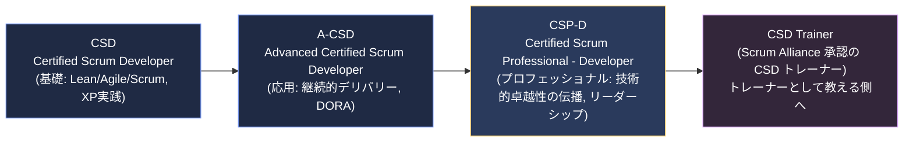

### 1.2 CSP-D で身につく能力

公式サイトの "What you'll learn" セクションでは、以下の5つの能力が掲げられています。

| # | 能力 | 意味（初学者向け言い換え） |
|---|------|---------------------------|
| 1 | 複数の Scrum チームにまたがる技術的卓越性の文化を醸成する | 1チームだけでなく、組織全体の開発品質を底上げする力 |
| 2 | 高パフォーマンスなテクノロジー組織の形成を触媒する | 技術力の高いチームが自然に育つ環境をつくる力 |
| 3 | ステークホルダー間の共通理解を育む環境を促進する | 開発者・顧客・経営層の間で「同じ絵」を見られるようにする力 |
| 4 | Scrum チームの継続的な学習と成長を導く | チームが自走して学び続けられるように支援する力 |
| 5 | アジャイルリーダーとして自己を成長させる | 役職に頼らない「権威なきリーダーシップ」を発揮する力 |

> 出典: [Certified Scrum Professional for Developer (CSP-D) - Scrum Alliance](https://www.scrumalliance.org/get-certified/developer-track/certified-scrum-professional-for-developers)

### 1.3 CSD / A-CSD / CSP-D の違い

| 項目 | CSD | A-CSD | CSP-D |
|------|-----|-------|-------|
| レベル | 基礎（Foundation） | 応用（Intermediate） | プロフェッショナル（Advanced/Leadership） |
| 前提資格 | なし（Scrum Alliance 承認コースの受講が要件） | CSD（有効/失効問わず） | A-CSD（有効/失効問わず） |
| 焦点 | XP エンジニアリングプラクティスの実践 | 継続的デリバリー・DORA・レガシーコード改善 | 複数チームへの技術文化の伝播、アジャイルリーダーシップ |
| Bloom's レベルの中心 | Knowledge〜Application | Application〜Analysis | Analysis〜Synthesis〜Evaluation |
| スコープ | 個人・チーム | チーム〜プロダクト | 複数チーム・組織 |

> 出典: [CSD - Scrum Alliance](https://www.scrumalliance.org/get-certified/developer-track/certified-scrum-developer)、[A-CSD - Scrum Alliance](https://www.scrumalliance.org/get-certified/developer-track/advanced-certified-scrum-developer)

**ベストプラクティス**
- CSP-D の学習に入る前に、CSD/A-CSD で学んだ XP プラクティス（TDD、リファクタリング、CI）を実務で最低1〜2年運用し、「うまくいかなかった経験」を蓄積しておくと、CSP-D のコーチング・リーダーシップ系 LO の学習効果が大きく高まります。
- CSP-D は「答えを知っている人」になるための資格ではなく、「複数チームが自ら答えを見つける環境をつくる人」になるための資格である、という位置づけの違いを最初に理解しておくこと。

---

## 第2章: 受験要件と認定プロセス

### 2.1 公式要件

CSP-D 概要ページと Scrum Alliance 公式 Help Center に記載されている CSP-D の要件は以下の5点です。

1. **A-CSD® 資格を保有していること**（有効・失効いずれでも可。CSP-D 取得時に A-CSD は自動更新される）
2. **CSP-D 対応の教育プログラムを受講**し、技術的卓越性の実現方法とアジャイルリーダーへの成長手法を学ぶこと
3. 教育提供者が設計した**すべてのコンポーネント**（事前・事後課題を含む）を完了すること
4. 教育提供者が実施する **CSP-D アセスメント**（試験形式またはクラス内評価形式）に合格すること
5. 過去5年以内に、Scrum 開発者/チームメンバーとしての**実務経験24ヶ月以上**を証明すること

> 出典: [CSP-D 概要 - Scrum Alliance](https://www.scrumalliance.org/get-certified/developer-track/certified-scrum-professional-for-developers)、[How to earn the Certified Scrum Professional - Developer (CSP-D) certification - Scrum Alliance Help Center](https://support.scrumalliance.org/hc/en-us/articles/16963666976667-How-to-earn-the-Certified-Scrum-Professional-Developer-CSP-D-certification)
>
> 上記5点は、CSP-D 概要ページと Scrum Alliance 公式 Help Center の記載を統合して一覧化したものです。とくに教育提供者が実施するアセスメント（要件4）の扱いは、上記 Help Center 記事に記載があります。

### 2.2 認定取得から更新までの流れ

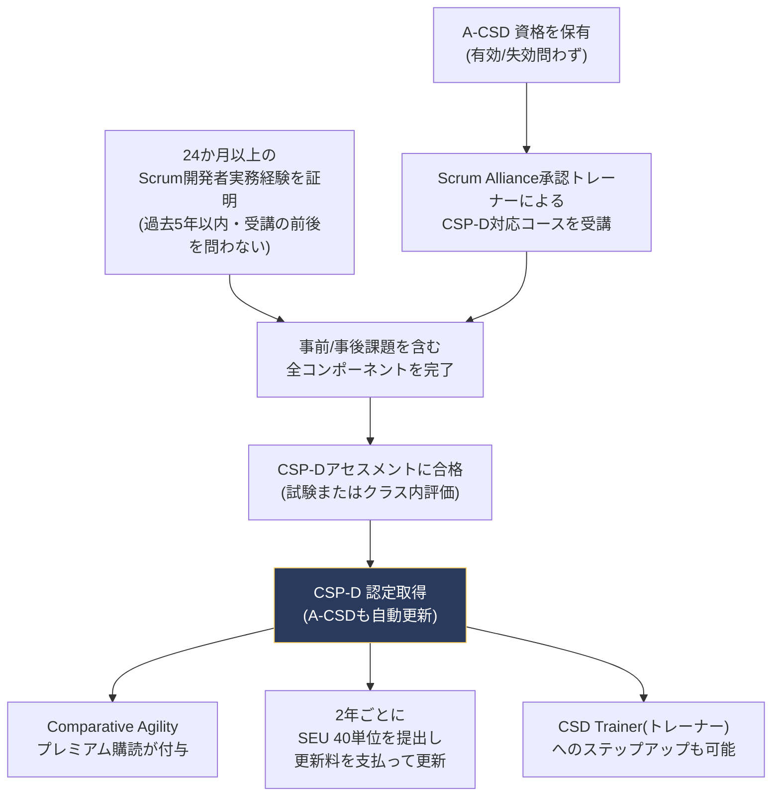

**ベストプラクティス**
- 24ヶ月の実務経験は「Scrum チームのメンバーとして開発に関わった期間」であることが前提のため、応募前に自分の職務経歴を Scrum イベント（スプリントプランニング、デイリー、レビュー、レトロスペクティブ）への関与という観点で棚卸ししておくと申請がスムーズです。
- コース選定時は、教育提供者（Trainer）が Category 2（技術）だけでなく Category 5（リーダーシップ）もバランスよく扱っているかを事前にシラバスで確認しましょう。

---

## 第3章: Bloom's Taxonomy と学習目標の読み方（CSP-D 版）

CSD・A-CSD と同様、CSP-D の学習目標も Bloom's Taxonomy（ブルームの分類学）の6段階に基づいて設計されています。CSP-D の学習目標文はすべて次の枕詞を補って読みます。

> "Upon successful validation of the CSP-D learning objectives, the learner will be able to ..."
> （CSP-D の学習目標の達成が確認された時点で、学習者は次のことができるようになる）

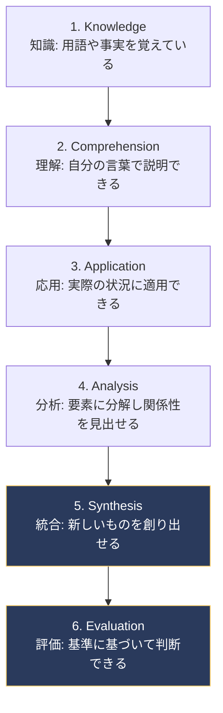

### CSD/A-CSD との重心の違い

| 資格 | 中心となる Bloom's レベル | 典型的な動詞 |
|------|---------------------------|--------------|
| CSD | Knowledge, Comprehension, Application | explain, describe, practice |
| A-CSD | Application, Analysis | apply, integrate, demonstrate |
| **CSP-D** | **Analysis, Synthesis, Evaluation** | critique, create, propose, compare and contrast, evaluate |

CSP-D の LO 文をよく読むと、"create a coaching agreement"（1.3）、"critique a legacy system"（2.3）、"compare and contrast"（5.1）のように、**創造・批評・評価**を要求する動詞が中心になっていることがわかります。これは、CSP-D が「知っている・できる」から「他者や組織を動かせる」への飛躍を求めているためです。

> 出典: [Bloom's Taxonomy - Vanderbilt University CFT](https://cft.vanderbilt.edu/guides-sub-pages/blooms-taxonomy/)、[CSP-D Learning Objectives (PDF)](https://www.scrumalliance.org/ScrumRedesignDEVSite/media/ScrumAllianceMedia/Files%20and%20PDFs/Learning%20Objectives/E_CSP_D_LO_2021.pdf)

**ベストプラクティス**
- 各 LO を読むとき、末尾の動詞（explain / practice / critique / create など）に注目し、「自分は今この動詞のレベルで実践できているか」を自己評価する習慣をつけると学習の抜け漏れが減ります。

---

## 第4章: CSP-D 学習目標の全体像（5 カテゴリー概観）

CSP-D の公式 Learning Objectives（2021年8月版）は、以下の**5つのカテゴリー・全24項目**で構成されています。

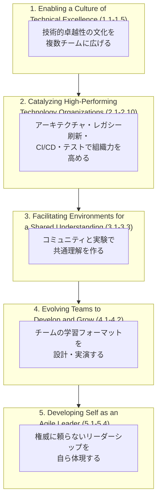

| カテゴリー | 項目数 | 一言でいうと |
|-----------|--------|--------------|
| 1. Enabling a Culture of Technical Excellence | 5 (1.1-1.5) | 技術コーチングで文化をつくる |
| 2. Catalyzing High-Performing Technology Organizations | 10 (2.1-2.10) | アーキテクチャ・レガシー・CI/CD・テストで組織を強くする |
| 3. Facilitating Environments for a Shared Understanding | 3 (3.1-3.3) | コミュニティと実験で理解を揃える |
| 4. Evolving Teams to Develop and Grow | 2 (4.1-4.2) | 学習フォーマットでチームを育てる |
| 5. Developing Self as an Agile Leader | 4 (5.1-5.4) | 自分自身がアジャイルリーダーになる |

これらの学習目標は、次の情報源を基盤としています。

- **Scrum Guide**（[scrumguides.org](https://scrumguides.org/scrum-guide.html)）
- **Manifesto for Agile Software Development**（4つの価値観と12の原則、[agilemanifesto.org](https://agilemanifesto.org/)）
- **Scrum Alliance の Scrum 価値観**（[scrumalliance.org/about-scrum/values](https://www.scrumalliance.org/about-scrum/values)）
- **Scrum Alliance Scrum Foundations Learning Objectives**
- **Scrum Alliance Guide Level Feedback**（各コースの実施結果からのフィードバック）

> 出典: [CSP-D Learning Objectives (PDF, 2021年8月版)](https://www.scrumalliance.org/ScrumRedesignDEVSite/media/ScrumAllianceMedia/Files%20and%20PDFs/Learning%20Objectives/E_CSP_D_LO_2021.pdf)

---

## 第5章: カテゴリー1 - Enabling a Culture of Technical Excellence

このカテゴリーは、**技術的卓越性を「自分ひとり」ではなく「複数チーム」に広げる**ことをテーマとしています。CSD/A-CSD で個人・チームレベルの技術力（TDD、リファクタリング、CI）を身につけた開発者が、次に取り組むべきは「その技術文化をどう伝播させるか」です。

### 1.1 変化の施策による具体的なメリットを3つ以上説明できる

> 原文: *explain at least three tangible benefits of change measures toward higher operational excellence.*

「変化のための施策（change measures）」とは、TDD の導入、ペアプログラミングの試験導入、CI パイプラインの整備など、チームの働き方を変える具体的な取り組みを指します。CSP-D レベルでは、これらを「なんとなく良さそう」ではなく、**測定可能な成果**として説明できる必要があります。

| 変化の施策 | 具体的なメリットの例 |
|-----------|----------------------|
| TDD の導入 | 本番障害率の低下、リグレッションの早期検出 |
| CI/CD パイプラインの整備 | デプロイ頻度の向上、変更のリードタイム短縮（DORA Four Keys） |
| ペアプログラミング／モブプログラミング | 属人化の解消、暗黙知の形式知化 |
| リファクタリングの継続実施 | 新機能追加にかかる時間の短縮（技術的負債の利子の削減） |

> 出典: [DORA - Google Cloud DevOps Research and Assessment](https://cloud.google.com/devops)、[State of DevOps Report](https://dora.dev/)

**ベストプラクティス**: メリットを説明する際は、必ず「Before/After」の指標（デプロイ頻度、変更失敗率、平均復旧時間、リードタイムなど DORA Four Keys）とセットで語ること。感覚的な「良くなった」ではなく、経営層やステークホルダーにも伝わる定量的な言葉に翻訳する練習をしましょう。

### 1.2 技術コーチングの側面を3つ以上説明できる

> 原文: *describe at least three aspects of technical coaching.*

技術コーチング（Technical Coaching）は、単なる「教える」ではなく、コーチング（相手の中にある答えを引き出す）・メンタリング（自分の経験を伝える）・ティーチング（知識を教える）・ファシリテーション（対話の場を設計する）という複数の側面を状況に応じて使い分けるスキルです。

| 側面 | 内容 |
|------|------|
| ティーチング (Teaching) | 明確な知識ギャップがある場合に、直接的に知識・手法を教える |
| メンタリング (Mentoring) | 自身の経験や失敗談を共有し、相手の意思決定を支援する |
| コーチング (Coaching) | 答えを与えず、質問を通じて相手自身に気づきを促す |
| ファシリテーション (Facilitating) | 個人ではなくチーム全体が学び合える「場」を設計する |

> 出典: [Agile Coaching Institute - Coaching-Mentoring-Teaching-Facilitating (CDJ) model, Lyssa Adkins](https://www.agilecoachinginstitute.com/)、[Coaching Agile Teams by Lyssa Adkins](https://www.agilecoachinginstitute.com/coaching-agile-teams-book/)

**ベストプラクティス**: 「いつティーチングをやめてコーチングに切り替えるべきか」を判断する基準を自分の中に持つこと。相手が既に答えを持っているのにこちらが教え続けると、成長機会を奪ってしまいます。

### 1.3 1つ以上の Scrum チームとのコーチング契約（コーチングアグリーメント）を作成できる

> 原文: *create a coaching agreement with one or multiple scrum teams.*

コーチングアグリーメントとは、コーチとチームの間で「何を目的に」「どのくらいの期間」「どのような関わり方で」支援を行うかを明文化した合意です。口約束ではなく、**期待値のズレを事前に解消するための成果物**として作成します。

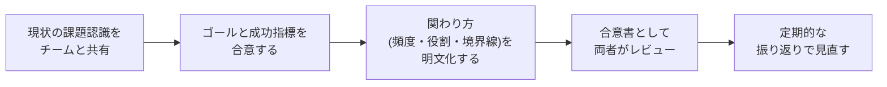

**コーチングアグリーメントに含めるべき項目の例**

| 項目 | 内容例 |
|------|--------|
| 目的 | なぜこのコーチングを行うのか（例: レガシーコードのテスト網羅率向上） |
| 期間 | 3スプリント、6週間など |
| 成功指標 | テストカバレッジ○%達成、CIパイプライン稼働率○%など |
| 関わり方 | 週2回のペアリング、デイリーへのオブザーブ参加など |
| コーチの役割の境界 | 技術的意思決定はチームが行い、コーチは問いかけに徹する、等 |

> 出典: [Coaching Agreements - Scrum Alliance Resources](https://resources.scrumalliance.org/)、[International Coaching Federation - Coaching Agreements](https://coachingfederation.org/)

### 1.4 複数チームに対して技術的なトピックで技術的卓越性をコーチングする方法を3つ以上実践できる

> 原文: *practice at least three ways of coaching technical excellence with multiple teams on a technical topic.*

1つのチームでうまくいった手法を、そのまま複数チームに水平展開しようとすると失敗しがちです。CSP-D では、**複数チームという規模の違いに対応した**コーチング手法を実践できる必要があります。

| 手法 | 概要 |
|------|------|
| コードレビューのローテーション | チームをまたいでレビュアーを交換し、標準の目線合わせを行う |
| 技術系ギルド/チャプター運営 | 特定技術（テスト、アーキテクチャなど）ごとに横断コミュニティを運営する（第8章で詳述） |
| ペアリング・モブプログラミングの越境実施 | 異なるチームのメンバー同士を一時的にペアにする |
| 内部カンファレンス/ライトニングトーク | チーム間で成功事例・失敗事例を共有する場を定例化する |

> 出典: [Communities of Practice - Wenger-Trayner](https://wenger-trayner.com/introduction-to-communities-of-practice/)

### 1.5 チーム間のアジャイルな作業合意を3種類以上、およびそれを維持するためのアクションプランを1つ以上提案できる

> 原文: *propose at least three kinds of agile working agreements between teams and at least one action plan to uphold them.*

複数チームが連携するとき、暗黙のルールに頼っていると摩擦が生まれます。**チーム間の作業合意（Working Agreements）**を明文化し、それを維持する仕組みまでセットで設計することが CSP-D レベルの要求です。

| 作業合意の種類 | 内容例 |
|---------------|--------|
| API/インターフェース合意 | チーム間の連携インターフェースの後方互換性ルール（Consumer-Driven Contracts、後述） |
| 「Definition of Done」の共通化 | 複数チームが同じ Done 基準に合意する |
| 依存関係の可視化・報告合意 | 週次でクロスチームの依存関係を共有する場を持つ |
| インシデント対応時の連携合意 | 障害発生時にどのチームがどう連携するかの合意 |

**維持するためのアクションプラン例**: 四半期ごとに合意内容をレトロスペクティブで見直し、形骸化した合意を廃止し、新たに必要な合意を追加する「合意のリファクタリング」サイクルを設ける。

> 出典: [Team Topologies - Matthew Skelton & Manuel Pais](https://teamtopologies.com/)（チーム間インタラクションモードの整理）

---

## 第6章: カテゴリー2（前半）- アーキテクチャ・設計とレガシーシステム

カテゴリー2「Catalyzing High-Performing Technology Organizations」は CSP-D の中で最もボリュームが大きい（10項目）カテゴリーです。前半（2.1〜2.5）はアーキテクチャ設計とレガシーシステムの刷新を扱います。

### 2.1 創発的アーキテクチャを可能にする設計原則・パターンを3つ以上統合できる

> 原文: *integrate at least three design principles or patterns that enable emerging architectures.*

「創発的アーキテクチャ（Emerging Architecture）」とは、最初にすべてを設計し尽くすのではなく、**変化を前提に段階的に育てていくアーキテクチャ**のことです。Neal Ford らが提唱する「進化的アーキテクチャ（Evolutionary Architecture）」と「適応度関数（Fitness Function）」の概念が代表的な理論的基盤です。

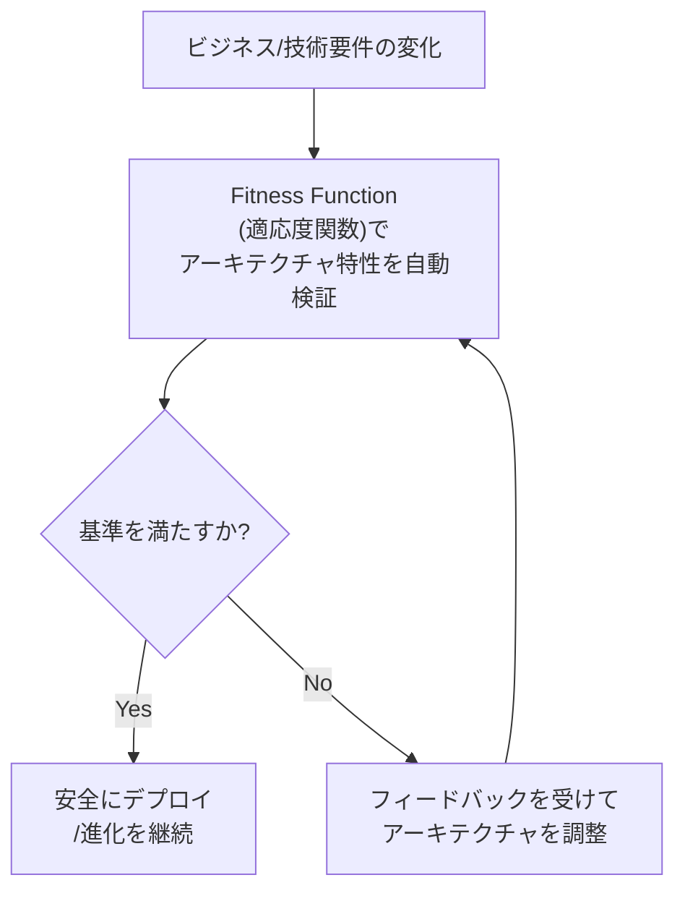

| 設計原則/パターン | 説明 |
|-------------------|------|
| Fitness Function（適応度関数） | パフォーマンス・セキュリティ・可用性などの非機能要件を自動テストとして継続検証する仕組み |
| Consumer-Driven Contracts | サービス間の契約を消費者（呼び出し側）視点で定義し、破壊的変更を自動検知する |
| Strangler Fig パターン | レガシーシステムを段階的に新システムへ置き換える（次節で詳述） |
| Bounded Context（境界づけられたコンテキスト） | ドメイン駆動設計（DDD）でシステムの境界を明確化し、変更の影響範囲を局所化する |

> 出典: [Building Evolutionary Architectures - Neal Ford, Rebecca Parsons, Patrick Kua](https://www.thoughtworks.com/insights/books/building-evolutionary-architecture)、[Fitness Functions to Ensure Architectural Goals Are Met - InfoQ/ThoughtWorks](https://www.infoq.com/news/2019/02/fitness-functions-architecture)

**ベストプラクティス**: Fitness Function は「後から追加するもの」ではなく、アーキテクチャ上重要な特性（セキュリティ、パフォーマンス、可用性）を洗い出した時点でバックログ化し、CI パイプラインに組み込むことで形骸化を防ぎます。

### 2.2 システムやプロダクトの振る舞いをユーザー・クライアント・ステークホルダーとともにモデル化する視覚的ファシリテーション技法を1つ以上適用できる

> 原文: *apply at least one visual facilitation technique to model the behaviour of a system or product with users, clients, or stakeholders.*

コードだけでなく、**関係者全員が同じ絵を見ながら会話できる**視覚的モデリング技法を使いこなす必要があります。

| 技法 | 概要 | 向いている場面 |
|------|------|----------------|
| EventStorming | ドメインイベント（過去形の付箋）を時系列に並べてビジネスプロセスを可視化する | 新規ドメインの理解、レガシー業務フローの棚卸し |
| Domain Storytelling | アクターとアクションを絵文字風のアイコンで物語として描く | 非エンジニアを含む対話 |
| User Story Mapping | ユーザーの行動フローに沿ってストーリーを配置する | プロダクトバックログの構造化 |
| C4 モデル | System Context → Container → Component → Code の4階層でアーキテクチャを図示する | エンジニア間のアーキテクチャ共有 |

> 出典: [EventStorming - Alberto Brandolini](https://www.eventstorming.com/)、[Introducing EventStorming - Alberto Brandolini](https://leanpub.com/introducing_eventstorming)

**ベストプラクティス**: EventStorming セッションを実施する際は、Alberto Brandolini が強調するように「答えを持つ人」と「質問を持つ人」の両方を招待し、ノートPCを使わせず、模造紙と付箋だけで進めることで、参加者の集中と対話の質が高まります。

### 2.3 レガシーシステムを5つ以上の基準で批評（critique）できる

> 原文: *critique a legacy system using at least five criteria.*

「レガシーシステム」を「古いから悪い」で終わらせず、**複数の評価軸で構造的に批評する**ことが求められます。Michael Feathers は著書 *Working Effectively with Legacy Code* の中で、レガシーコードを「テストのないコード」と定義しています。

| 評価基準 | 確認すること |
|---------|--------------|
| テストカバレッジ | 自動テストがどの程度、振る舞いを保護しているか |
| 結合度・凝集度 | モジュール間の結合度が低く、責務がまとまっているか |
| デプロイ容易性 | 変更を安全に本番へ届けるまでの所要時間・手順の複雑さ |
| ドキュメント/知識の属人化 | コードの意図を理解しているのが特定の個人に偏っていないか |
| 技術的負債の種類 | Martin Fowler の技術的負債の4象限（意図的/無意識、慎重/無謀）のどこに位置するか |

> 出典: [Working Effectively with Legacy Code - Michael Feathers](https://www.oreilly.com/library/view/working-effectively-with/0131177052/)、[Technical Debt Quadrant - Martin Fowler](https://martinfowler.com/bliki/TechnicalDebtQuadrant.html)

### 2.4 レガシーシステムの典型的な課題に対応するアジャイルな設計アプローチを3つ以上説明できる

> 原文: *explain at least three agile design approaches to address typical challenges with legacy systems.*

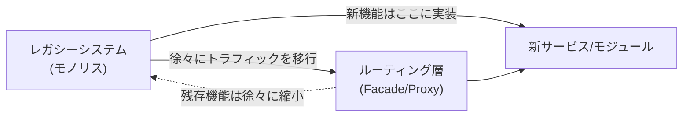

| アプローチ | 説明 |
|-----------|------|
| Strangler Fig パターン | ルーティング層を介して新機能を段階的に外側に構築し、レガシー部分を少しずつ「絞め殺す」ように縮小させる |
| Branch by Abstraction | 抽象化レイヤーを挟むことで、実装を切り替えながら段階的に置き換える |
| Characterization Test | 既存の振る舞いをそのままテスト化し、リファクタリングの安全網を作る（Michael Feathers） |
| Seam（継ぎ目）の発見 | テストが書きにくい箇所に「継ぎ目」を見つけ、依存を注入可能にする |

> 出典: [Strangler Fig Application - Martin Fowler](https://martinfowler.com/bliki/StranglerFigApplication.html)、[Branch By Abstraction - Martin Fowler](https://martinfowler.com/bliki/BranchByAbstraction.html)

### 2.5 レガシーシステムに対して継続的リファクタリングのアプローチを実践できる

> 原文: *practice a continuous refactoring approach on a legacy system.*

A-CSD で学んだリファクタリングの技法（小さなステップ、テストによる保護、ボーイスカウトルール）を、**レガシーシステムという難易度の高い対象**に適用します。ポイントは「一気に書き直す」のではなく、日々の変更のたびに少しずつ改善を積み重ねることです。

**ベストプラクティス**
- 「ボーイスカウトルール（来た時よりも美しく）」をチームのワーキングアグリーメントに組み込み、触れたコードは必ず少しだけ改善してからコミットする文化を作る。
- 大規模な書き直し（Big Rewrite）は失敗率が高いことが経験的に知られているため、Strangler Fig パターンとの併用を基本方針とする。

> 出典: [Refactoring: Improving the Design of Existing Code - Martin Fowler](https://martinfowler.com/books/refactoring.html)

---

## 第7章: カテゴリー2（後半）- CI/CD とテスト実践

### 2.6 自動化された継続的インテグレーションパイプラインの側面を3つ以上構築できる

> 原文: *set up at least three aspects of an automated continuous integration pipeline.*

A-CSD で学んだ CI の基礎を、**組織横断で標準化されたパイプライン**として構築する視点が求められます。

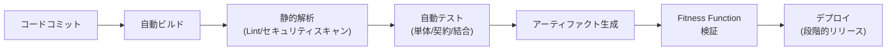

| CI パイプラインの側面 | 内容 |
|----------------------|------|
| トリガーの自動化 | コミット/プルリクエストごとに自動実行される |
| 品質ゲート | 静的解析・セキュリティスキャン・テストカバレッジ閾値を通過しない限り先に進めない |
| フィードバックの速さ | 開発者に数分以内に結果が返る設計（Fast Feedback） |
| アーティファクトの一元管理 | ビルド成果物をバージョン管理し、再現性を担保する |

> 出典: [Continuous Delivery - Jez Humble & Dave Farley](https://continuousdelivery.com/)、[Continuous Integration - Martin Fowler](https://martinfowler.com/articles/continuousIntegration.html)

### 2.7 アジャイル開発のためのテスト実践を3つ以上説明できる

> 原文: *explain at least three testing practices for agile development.*

| テスト実践 | 概要 |
|-----------|------|
| テストピラミッド | 単体テストを土台に、結合・E2E テストを少数精鋭にする比率戦略（Mike Cohn） |
| Consumer-Driven Contract Testing | サービス間の契約をコンシューマー視点でテスト化し、統合テストの脆さを解消する |
| Exploratory Testing（探索的テスト） | スクリプト化されていない自由な探索によって、想定外の欠陥を見つける |
| Mutation Testing（変異テスト） | テストコード自体の品質を、意図的にバグを混入させて検証する |

> 出典: [Succeeding with Agile - Mike Cohn（テストピラミッド）](https://www.mountaingoatsoftware.com/blog/the-forgotten-layer-of-the-test-automation-pyramid)、[Consumer-Driven Contracts: A Service Evolution Pattern - Martin Fowler](https://martinfowler.com/articles/consumerDrivenContracts.html)

### 2.8 論理的な単体テスト・コンポーネントテストを超えたアジャイル開発向けテスト実践を1つ以上実演できる

> 原文: *demonstrate at least one testing practice for agile development beyond logical unit or component tests.*

2.7 で説明した実践のうち、少なくとも1つを**手を動かして実演できる**レベルまで習熟している必要があります。特に Consumer-Driven Contract Testing（例: Pact）は、マイクロサービス間の結合テストを高速かつ安定させる代表的な手法です。

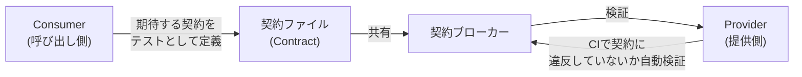

> 出典: [Pact - Contract Testing Tool](https://pact.io/)、[Consumer-Driven Contracts - Martin Fowler](https://martinfowler.com/articles/consumerDrivenContracts.html)

### 2.9 システムの振る舞いに関する自動テストアプローチを3つ以上評価し、1つ以上実践できる

> 原文: *evaluate at least three, and practice at least one automated testing approach for system behavior.*

| アプローチ | 評価すべき観点 |
|-----------|----------------|
| Property-Based Testing | 個別ケースではなく「性質（プロパティ）」を定義し、多数の入力で自動検証する |
| Contract Testing | サービス間インターフェースの整合性 |
| Snapshot Testing | UI/出力の意図しない変化の検出 |
| Chaos Engineering | 本番相当環境での障害注入によるレジリエンス検証 |

> 出典: [Principles of Chaos Engineering](https://principlesofchaos.org/)

### 2.10 ソフトウェアを超えて継続的インテグレーションの概念を採用する技法を3つ以上概説できる

> 原文: *outline at least three techniques to adopt continuous integration concepts beyond software.*

CSP-D の Program Team には、ハードウェア領域でアジャイル/CI の概念を実践してきた Joe Justice（WikiSpeed）が名を連ねています。この LO は、**CI/CD の思想をソフトウェア以外の領域にも展開する**視点を問うものです。

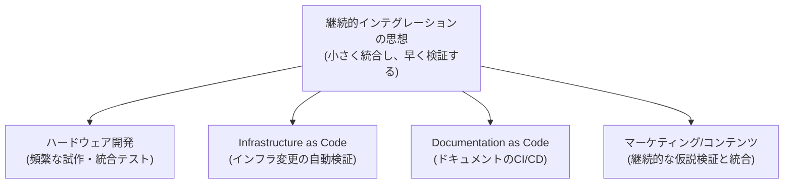

| 領域 | CI 的な適用例 |
|------|----------------|
| ハードウェア開発 | 短いサイクルで試作機を統合・検証する（WikiSpeed の事例） |
| Infrastructure as Code | インフラ構成変更を自動テスト・自動適用する |
| Documentation as Code | ドキュメントをコードと同じリポジトリ・CI で管理し、陳腐化を防ぐ |
| データパイプライン | データスキーマの変更を自動検証し、下流への影響を早期検知する |

> 出典: [WikiSpeed - Joe Justice](https://wikispeed.org/)、[Infrastructure as Code - Kief Morris (O'Reilly)](https://www.oreilly.com/library/view/infrastructure-as-code/9781098114664/)

**ベストプラクティス（カテゴリー2全体）**: アーキテクチャ・レガシー刷新・CI/CD・テストの4領域は独立しているのではなく、「Fitness Function → CI パイプラインでの自動検証 → 契約テストによるサービス間整合性の担保」という**一つの連続した仕組み**として設計すると、複数チームにまたがる技術基盤として機能します。

---

## 第8章: カテゴリー3 - Facilitating Environments for a Shared Understanding

### 3.1 開発者コミュニティ・オブ・プラクティス（CoP）を実現するメリットを3つ以上説明できる

> 原文: *explain at least three benefits of enabling a developer community of practice.*

Community of Practice（実践共同体）は、Etienne Wenger が提唱した概念で、「関心や情熱を共有し、定期的に交流することでより上手にそれを行う方法を学ぶ人々の集まり」と定義されています。

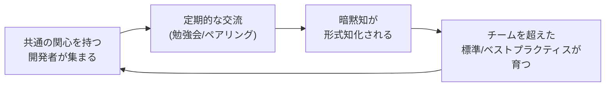

| メリット | 説明 |
|---------|------|
| 属人化の解消 | 特定チームだけが持つ知識がコミュニティ全体に共有される |
| 技術標準の自然な形成 | トップダウンでなく現場からボトムアップで標準が育つ |
| 心理的な居場所の提供 | 所属チームとは別に「専門性で繋がる」場ができ、離職防止にも寄与する |

> 出典: [Introduction to Communities of Practice - Wenger-Trayner](https://wenger-trayner.com/introduction-to-communities-of-practice/)

### 3.2 協働デザインセッションを進行するための支援的ファシリテーション技法を3つ以上適用できる

> 原文: *apply at least three supportive facilitation techniques to conduct a collaborative design session.*

| 技法 | 概要 |
|------|------|
| ラウンドロビン（Round-Robin） | 参加者全員に均等に発言機会を与え、声の大きい人だけが発言するのを防ぐ |
| Silent Brainstorming（沈黙のブレスト） | 最初は個人で付箋に書き出し、その後グループ化することで同調バイアスを避ける |
| ドット投票（Dot Voting） | 複数の設計案から優先度を可視化する簡易合意形成技法 |
| タイムボックス化されたディスカッション | 発散と収束のフェーズを時間で区切り、議論の停滞を防ぐ |

> 出典: [Liberating Structures](https://www.liberatingstructures.com/)

### 3.3 プロダクトへの取り組みが顧客・ステークホルダー・組織に与える影響を検証する実験を1つ以上設計できる

> 原文: *create at least one experiment to examine the impact of product work on customers, stakeholders, and/or the organization.*

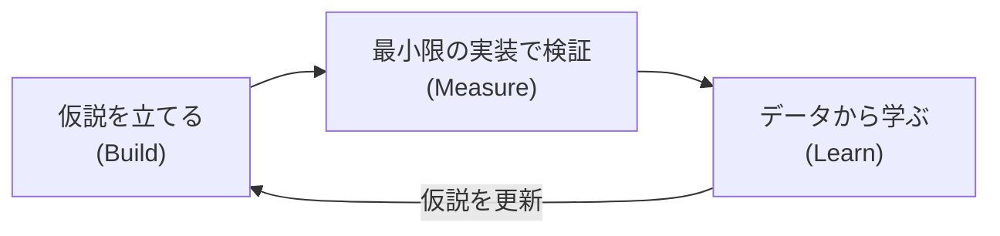

Build-Measure-Learn のフィードバックループ（リーン・スタートアップ）を使い、機能開発を「作ることが目的」ではなく「学ぶための実験」として設計します。

| 実験の要素 | 例 |
|-----------|-----|
| 仮説 | 「この機能を追加すればコンバージョン率が○%改善する」 |
| 最小の検証手段 | A/B テスト、フィーチャーフラグによる段階的公開、コンシェルジュMVP |
| 成功指標 | 事前に定義した定量指標（North Star Metric など） |

> 出典: [The Lean Startup - Eric Ries](http://theleanstartup.com/)

---

## 第9章: カテゴリー4 - Evolving Teams to Develop and Grow

### 4.1 アーキテクチャ・設計原則に適した学習フォーマットを3つ以上概説できる

> 原文: *outline at least three suitable learning formats for architecture and design principles.*

| 学習フォーマット | 向いている内容 |
|------------------|----------------|
| ハンズオンワークショップ | 実際に手を動かして設計パターンを体験する |
| アーキテクチャデシジョンレコード（ADR）の輪読 | 過去の意思決定の背景と結果から学ぶ |
| コードカタ（Code Kata） | 反復練習で設計原則を体に染み込ませる |
| ペアリング/モブでの実プロダクトへの適用 | 実務の文脈で即座にフィードバックを得る |

> 出典: [Architectural Decision Records (ADR)](https://adr.github.io/)、[Code Kata - Dave Thomas](http://codekata.com/)

### 4.2 アーキテクチャ・設計原則のための学習フォーマットを1つ以上実演できる

> 原文: *demonstrate at least one learning format for architecture and design principles.*

4.1 で概説した学習フォーマットのうち、少なくとも1つを**実際にファシリテートして見せる**必要があります。CSP-D 受講者は、単に「知っている」だけでなく、他の開発者を巻き込んで学習セッションを運営できることが求められます。

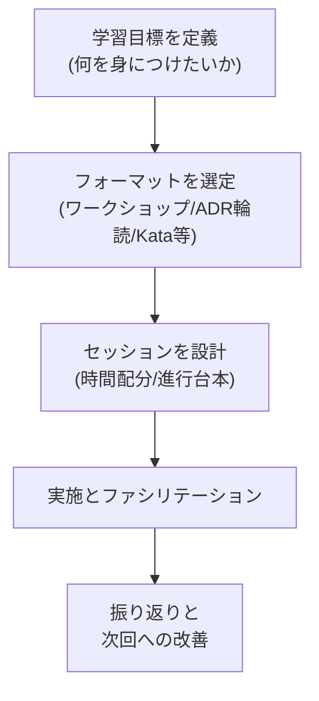

**ベストプラクティス**: 学習セッションは「一度きりのイベント」ではなく、レトロスペクティブと同様に**定例化**し、毎回少しずつ改善するプロセスとして運営すると定着しやすくなります。

---

## 第10章: カテゴリー5 - Developing Self as an Agile Leader

CSP-D の最後のカテゴリーは、技術やプロセスではなく**開発者自身のリーダーシップのあり方**を扱います。

### 5.1 「他者を導くこと（Leading Others）」と「リーダーシップを発揮すること（Demonstrating Leadership）」を比較対照できる

> 原文: *compare and contrast leading others vs. demonstrating leadership.*

Ronald Heifetz（ハーバード・ケネディスクール）が提唱する **Adaptive Leadership（適応型リーダーシップ）** の中核的な考え方が、この LO の理論的背景です。Heifetz は「権威（Authority）」と「リーダーシップ（Leadership）」を明確に区別しました。

| 観点 | Leading Others（権威による牽引） | Demonstrating Leadership（権威なきリーダーシップ） |
|------|-----------------------------------|------------------------------------------------------|
| 前提となる立場 | 役職・肩書きに基づく指示 | 役職に関係なく、誰でも発揮できる |
| 対応する問題の種類 | Technical Problem（既知の解決策がある問題） | Adaptive Challenge（答えが存在しない、価値観の変化を伴う問題） |
| アプローチ | 指示・命令で解決する | 問いを投げかけ、関係者自身に変化を促す |

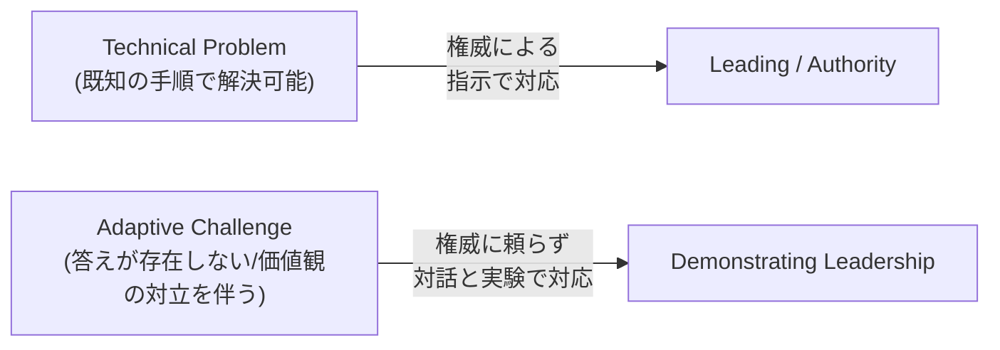

> 出典: [Ronald Heifetz - Harvard Kennedy School](https://www.hks.harvard.edu/faculty/ronald-heifetz)、[Leadership Without Easy Answers - Ronald Heifetz](https://www.hup.harvard.edu/books/9780674518582)

**ベストプラクティス**: 開発者が直面する問題を「これは Technical Problem か、Adaptive Challenge か」で最初に切り分ける習慣をつけると、無自覚に権威（マネージャーの決定待ち）に頼りすぎることを防げます。

### 5.2 自身の価値観を理解し、それをアジャイルソフトウェア開発宣言の価値観・原則と関連づける手法を1つ以上適用できる

> 原文: *apply at least one method to understand their own value system and relate it to the values and principles of the Manifesto for Agile Software Development.*

| 手法 | 概要 |
|------|------|
| 価値観の書き出しワーク | 自分が仕事で大切にしていることを言語化し、アジャイル宣言の4つの価値観と照合する |
| Personal Working Agreement | 自分自身が他者とどう協働したいかを明文化する |
| フィードバックの収集（360度フィードバック的手法） | 他者からの評価と自己認識のギャップを可視化する |

Agile Manifesto の4つの価値観（[agilemanifesto.org](https://agilemanifesto.org/)）:
1. プロセスやツールよりも**個人と対話**を
2. 包括的なドキュメントよりも**動くソフトウェア**を
3. 契約交渉よりも**顧客との協調**を
4. 計画に従うことよりも**変化への対応**を

> 出典: [Manifesto for Agile Software Development](https://agilemanifesto.org/)、[Principles behind the Agile Manifesto](https://agilemanifesto.org/principles.html)

### 5.3 プロダクト探索・顧客発見・実験に対する開発者の貢献の重要性を説明できる

> 原文: *describe the importance of developer contribution to product exploration, customer discovery and experimentation.*

CSP-D は、開発者が「要件をもらって実装するだけの存在」ではなく、**プロダクト探索（何を作るべきか）や顧客発見に主体的に関わる存在**であるべきだという考え方を明確に打ち出しています。

| 開発者の貢献領域 | 説明 |
|-------------------|------|
| 技術的実現可能性のフィードバック | 顧客発見の初期段階から「作れるか・作る価値があるか」を助言する |
| プロトタイピングへの参加 | 技術的な観点から素早い検証手段（スパイク、フィーチャーフラグ）を提案する |
| データに基づく意見形成 | 実験結果や技術的制約を踏まえ、プロダクトオーナーと対等に議論する |

> 出典: [Continuous Discovery Habits - Teresa Torres](https://www.producttalk.org/continuous-discovery-habits/)

### 5.4 価値の流れ（バリューストリーム）のための視覚的モデリング技法を適用し、5つ以上の改善機会を選定できる

> 原文: *apply a visual modelling technique for a value stream and select at least five improvement opportunities.*

**バリューストリームマッピング（Value Stream Mapping, VSM）**は、アイデアが顧客への価値提供に至るまでの全工程を可視化し、ムダ（待ち時間・手戻り・過剰な承認プロセスなど）を発見する手法です。もともとはリーン生産方式（トヨタ生産方式）に由来し、Mary & Tom Poppendieck によってソフトウェア開発に適用されました。

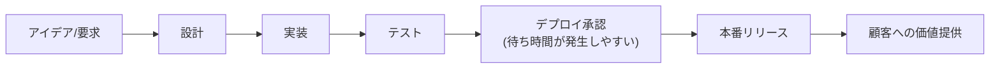

| 改善機会の例（5つ以上を選定する際の観点） |
|-----|
| 1. 各工程間の待ち時間（Wait Time）の削減 |
| 2. 手戻り・やり直し（Rework）を生む工程の特定 |
| 3. 不要な承認ステップの削除・簡素化 |
| 4. バッチサイズ（一度に運ぶ作業量）の縮小 |
| 5. ボトルネック工程（制約条件）への集中的な改善投資 |

> 出典: [Lean Software Development - Mary & Tom Poppendieck](https://www.poppendieck.com/)、[The Goal - Eliyahu Goldratt（制約理論）](https://www.toc-goldratt.com/en)

**ベストプラクティス（カテゴリー5全体）**: 4つのリーダーシップ系 LO は、いずれも「学んで終わり」にせず、実際の1on1・レトロスペクティブ・バリューストリームマッピングのワークショップという**具体的な場**で実践することで初めて評価可能なスキルになります。

---

## 第11章: XP プラクティス統合と CSD → A-CSD → CSP-D の積み上げ構造

CSP-D の学習目標は独立したものではなく、CSD/A-CSD で学んだ XP（エクストリーム・プログラミング）プラクティスの上に成り立っています。

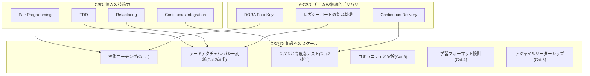

| CSD/A-CSD の技術基盤 | CSP-D での発展先 |
|------------------------|--------------------|
| TDD・リファクタリング | レガシーシステムの批評（2.3）と継続的リファクタリング（2.5）へ拡張 |
| 継続的インテグレーション | 組織横断の自動化パイプライン構築（2.6）へ拡張 |
| DORA Four Keys | 変化施策のメリット説明（1.1）の定量的根拠として活用 |
| ペアプログラミング | 技術コーチングの手法（1.4）、越境ペアリングへ拡張 |
| レガシーコード改善（A-CSD） | レガシーシステムの評価軸（2.3）・アジャイル設計アプローチ（2.4）へ深化 |

---

## 第12章: ベストプラクティス総合チェックリスト

以下は、CSP-D の5カテゴリーにまたがる実践のベストプラクティスをチェックリスト形式でまとめたものです。

| # | チェック項目 | カテゴリー |
|---|--------------|-----------|
| 1 | 施策の効果を DORA Four Keys 等の定量指標で語れるようにしている | 1 |
| 2 | ティーチング/メンタリング/コーチング/ファシリテーションを状況に応じて使い分けている | 1 |
| 3 | チームとのコーチングアグリーメントを口約束でなく文書化している | 1 |
| 4 | Fitness Function を CI パイプラインに組み込み、アーキテクチャ特性を継続検証している | 2 |
| 5 | レガシーシステムを5つ以上の基準（テスト・結合度・デプロイ性・属人化・技術的負債の種類）で評価している | 2 |
| 6 | Strangler Fig パターンなど段階的なレガシー刷新アプローチを選定している | 2 |
| 7 | Consumer-Driven Contract Testing など単体テストを超えるテスト実践を導入している | 2 |
| 8 | CI/CD の思想をインフラ・ドキュメント等ソフトウェア以外にも展開している | 2 |
| 9 | 開発者コミュニティ・オブ・プラクティスを定例で運営している | 3 |
| 10 | 協働デザインセッションでラウンドロビンや沈黙のブレストなど支援的技法を使っている | 3 |
| 11 | 機能開発を Build-Measure-Learn の実験として設計している | 3 |
| 12 | アーキテクチャ学習をワークショップ・ADR輪読・Code Kata等、複数フォーマットで提供している | 4 |
| 13 | Technical Problem と Adaptive Challenge を区別してから対応方針を決めている | 5 |
| 14 | 自分の価値観をアジャイル宣言の4価値観と定期的に照合している | 5 |
| 15 | プロダクト探索・顧客発見に開発者として主体的に関与している | 5 |
| 16 | バリューストリームマッピングで5つ以上の改善機会を継続的に発見・実行している | 5 |

---

## 第13章: 認定後のキャリアパス（SEU・更新・CSD Trainer）

### 13.1 認定の維持

CSP-D は「取得して終わり」ではなく、2年ごとの更新が必要です。通常の更新経路は、**Scrum Education Units（SEU）40単位の取得・提出と更新料の支払い**です。SEU は書籍を読む、ウェビナーを視聴する、イベントに参加するなど、継続的な学習活動によって蓄積されます。

これに加えて、**認定コースの受講による自動更新**という経路もあります。Scrum Alliance の新しい認定を取得すると、トラックや階層を問わず、保有している他のすべての Scrum Alliance 認定が自動的に更新されます（例: CSP-D を取得すると、同じ開発者トラックの CSD・A-CSD も更新される）。なお、マイクロクレデンシャルは有効期限を持たないため、この自動更新の対象ではありません。したがって SEU の提出だけが唯一の更新方法ではありません。

> 出典: [Scrum Education Units - Scrum Alliance](https://www.scrumalliance.org/get-certified/scrum-education-units)、[Renewing Certifications - Scrum Alliance](https://www.scrumalliance.org/get-certified/renewing-certifications)

### 13.2 Comparative Agility の活用

CSP-D 取得者には **Comparative Agility®** のプレミアム購読が特典として提供されます。これは、チーム・組織のアジリティを8つの次元（チームワーク、要求、計画、技術的実践、品質、文化、知識創造、Outcomes（成果））で診断し、業界内での相対比較を可能にするアセスメントプラットフォームです。

> 出典: [Comparative Agility](https://www.comparativeagility.com/)、[How Does Your Agile Compare to Your Competition? - InfoQ](https://www.infoq.com/news/2010/01/comparative-agility-assessment)

### 13.3 CSD Trainer（トレーナー）への道

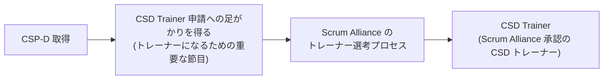

公式ページには「CSP-D 認定を受けることは、CSD トレーナーになりたい場合の重要なマイルストーンである」と明記されています。技術力とリーダーシップの両輪を備えた CSP-D は、次世代の開発者を育てる CSD Trainer への自然なステップアップとなります（CSD トレーナーの申請経路・要件は Scrum Alliance のトレーナー申請ページを正とします）。

> 出典: [CSP-D - Scrum Alliance（"Register for CSP-D today!"セクション）](https://www.scrumalliance.org/get-certified/developer-track/certified-scrum-professional-for-developers)

---

## 第14章: まとめ

CSP-D は、CSD・A-CSD で培った**個人・チームレベルの技術的卓越性**を、**複数チーム・組織全体**へと展開するための認定資格です。5つのカテゴリーを通じて学ぶ内容を一言でまとめると、次のようになります。

| カテゴリー | 一言まとめ |
|-----------|-----------|
| 1. Enabling a Culture of Technical Excellence | 自分の技術力を、コーチングを通じて他者・他チームに広げる |
| 2. Catalyzing High-Performing Technology Organizations | アーキテクチャ・レガシー刷新・CI/CD・テストで組織の技術基盤を強くする |
| 3. Facilitating Environments for a Shared Understanding | コミュニティと実験によって、関係者間の共通理解を作る |
| 4. Evolving Teams to Develop and Grow | チームが自ら学び続けられる学習フォーマットを設計・実演する |
| 5. Developing Self as an Agile Leader | 権威に頼らず、自分自身がアジャイルリーダーとして成長する |

CSP-D の学習を通じて開発者は、「良いコードを書く人」から「良いコードが自然に生まれる組織文化とリーダーシップを作る人」へと役割を拡張していきます。これは CSD の技術基礎、A-CSD の継続的デリバリー実践の先にある、Developer Track の到達点です。

---

## 第15章: 参考文献・出典一覧

### Scrum Alliance 公式ソース

- [Certified Scrum Professional for Developer (CSP-D) - Scrum Alliance](https://www.scrumalliance.org/get-certified/developer-track/certified-scrum-professional-for-developers)
- [CSP-D Learning Objectives (PDF, 2021年8月版)](https://www.scrumalliance.org/ScrumRedesignDEVSite/media/ScrumAllianceMedia/Files%20and%20PDFs/Learning%20Objectives/E_CSP_D_LO_2021.pdf)
- [Certified Scrum Developer (CSD) - Scrum Alliance](https://www.scrumalliance.org/get-certified/developer-track/certified-scrum-developer)
- [Advanced Certified Scrum Developer (A-CSD) - Scrum Alliance](https://www.scrumalliance.org/get-certified/developer-track/advanced-certified-scrum-developer)
- [Scrum Alliance の Scrum 価値観](https://www.scrumalliance.org/about-scrum/values)
- [Scrum Education Units (SEU)](https://www.scrumalliance.org/get-certified/scrum-education-units)
- [Renewing Certifications - Scrum Alliance](https://www.scrumalliance.org/get-certified/renewing-certifications)
- [Developer Track - Scrum Alliance](https://www.scrumalliance.org/get-certified/developer-track)

### Scrum / Agile 基盤ソース

- [The Scrum Guide](https://scrumguides.org/scrum-guide.html)
- [Manifesto for Agile Software Development](https://agilemanifesto.org/)
- [Principles behind the Agile Manifesto](https://agilemanifesto.org/principles.html)

### アーキテクチャ・レガシーシステム

- [Building Evolutionary Architectures - ThoughtWorks](https://www.thoughtworks.com/insights/books/building-evolutionary-architecture)
- [Fitness Functions to Ensure Architectural Goals Are Met - InfoQ](https://www.infoq.com/news/2019/02/fitness-functions-architecture)
- [Working Effectively with Legacy Code - Michael Feathers](https://www.oreilly.com/library/view/working-effectively-with/0131177052/)
- [Technical Debt Quadrant - Martin Fowler](https://martinfowler.com/bliki/TechnicalDebtQuadrant.html)
- [Strangler Fig Application - Martin Fowler](https://martinfowler.com/bliki/StranglerFigApplication.html)
- [Branch By Abstraction - Martin Fowler](https://martinfowler.com/bliki/BranchByAbstraction.html)
- [Refactoring: Improving the Design of Existing Code - Martin Fowler](https://martinfowler.com/books/refactoring.html)
- [EventStorming - Alberto Brandolini](https://www.eventstorming.com/)

### CI/CD・テスト

- [Continuous Delivery - Jez Humble & Dave Farley](https://continuousdelivery.com/)
- [Continuous Integration - Martin Fowler](https://martinfowler.com/articles/continuousIntegration.html)
- [Consumer-Driven Contracts: A Service Evolution Pattern - Martin Fowler](https://martinfowler.com/articles/consumerDrivenContracts.html)
- [Pact - Contract Testing Tool](https://pact.io/)
- [The Forgotten Layer of the Test Automation Pyramid - Mike Cohn](https://www.mountaingoatsoftware.com/blog/the-forgotten-layer-of-the-test-automation-pyramid)
- [Principles of Chaos Engineering](https://principlesofchaos.org/)
- [DORA - Google Cloud DevOps Research and Assessment](https://cloud.google.com/devops)
- [WikiSpeed - Joe Justice](https://wikispeed.org/)

### コミュニティ・ファシリテーション・実験

- [Introduction to Communities of Practice - Wenger-Trayner](https://wenger-trayner.com/introduction-to-communities-of-practice/)
- [Liberating Structures](https://www.liberatingstructures.com/)
- [The Lean Startup - Eric Ries](http://theleanstartup.com/)
- [Continuous Discovery Habits - Teresa Torres](https://www.producttalk.org/continuous-discovery-habits/)

### 学習デザイン

- [Bloom's Taxonomy - Vanderbilt University CFT](https://cft.vanderbilt.edu/guides-sub-pages/blooms-taxonomy/)
- [Architectural Decision Records (ADR)](https://adr.github.io/)
- [Code Kata - Dave Thomas](http://codekata.com/)

### アジャイルリーダーシップ

- [Ronald Heifetz - Harvard Kennedy School](https://www.hks.harvard.edu/faculty/ronald-heifetz)
- [Leadership Without Easy Answers - Ronald Heifetz](https://www.hup.harvard.edu/books/9780674518582)
- [Team Topologies - Matthew Skelton & Manuel Pais](https://teamtopologies.com/)
- [Lean Software Development - Mary & Tom Poppendieck](https://www.poppendieck.com/)

### コーチング

- [Agile Coaching Institute - Lyssa Adkins](https://www.agilecoachinginstitute.com/)
- [International Coaching Federation - Coaching Agreements](https://coachingfederation.org/)

### 認定後のキャリア

- [Comparative Agility](https://www.comparativeagility.com/)
- [How Does Your Agile Compare to Your Competition? - InfoQ](https://www.infoq.com/news/2010/01/comparative-agility-assessment)

---

*本ガイドは、上記出典に基づき教育目的で作成された非公式の学習補助資料です。認定試験・コースの正式な内容については、必ず Scrum Alliance 公式サイトおよび Scrum Alliance 承認トレーナーの最新情報をご確認ください。*
