# Certified Scrum Professional® - Product Owner (CSP®-PO) 完全学習ガイド

> 初学者から経験者まで、CSP-PO認定が求める5つのカテゴリー・31の学習目標(Learning Objectives)を、ステップバイステップでわかりやすく解説する日本語ガイドです。各項目には「詳細な説明」「具体的な進め方」「ベストプラクティス」「一次情報源のURL」を必ず添えています。ASCII図解は一切使用せず、フローチャートはすべてMermaid、比較・整理はすべてMarkdownの表で表現しています。

---

## このガイドについて

### 対象読者

- すでにCertified Scrum Product Owner®(CSPO)、Advanced Certified Scrum Product Owner®(A-CSPO)を取得しており、CSP-POを目指す経験豊富なプロダクトオーナー
- 複数のスクラムチームやプロダクトバックログを横断的に扱う立場になった、あるいはこれから任される予定の実務者
- CSP-PO教育プログラム(認定研修)を受講する前に、学習目標の全体像を把握しておきたい人
- Certified Scrum Trainer®(CST)やCertified Enterprise Coach(CEC)、Certified Team Coach(CTC)といった上位資格を見据えている人

### このガイドの作り方

本ガイドは、Scrum Alliance公式サイトの「[Certified Scrum Professional Product Owner (CSP-PO) Certification](https://www.scrumalliance.org/get-certified/product-owner-track/certified-scrum-professional-product-owner)」ページ、および同ページからリンクされている公式PDF「[CSP-PO Learning Objectives (2022年1月版)](https://www.scrumalliance.org/media/certifications/los/csp_po_learning_objectives_2022.pdf)」を一次情報源として直接取得し、そこに定義された5カテゴリー・31個の学習目標をすべて網羅する形で構成しています。加えて、各学習目標の実務的な理解を助けるため、Scrum Guide、Agile Manifesto、Scrum Alliance公式リソース記事、そしてCost of Delay/WSJF、Business Model Canvas、Lean Startup、Opportunity Solution Tree、Kanoモデル、Nexus、Tuckmanモデル、Porterのファイブフォースといった、プロダクトマネジメント/アジャイル業界で広く参照される一次情報源・原典に近い資料を補助的な根拠として引用しています。引用箇所には文中に `[番号]` を付与し、末尾の「参考文献・出典一覧」で該当URLを確認できます。

### 表記について

- 本文中の英語の専門用語(Product Owner、Product Backlog、Sprint、Cost of Delayなど)はあえて英語表記のまま残し、初出時に日本語訳を併記しています。これはCSP-PO教育プログラムや実務の現場で英語表記のまま使われることが多いためです。
- フローチャートはすべてMermaid記法で記述しています。ASCIIアートによる図解は使用していません。
- 比較表・チェックリストはすべてMarkdownの表(テーブル)で記述しています。

---

## 目次

1. [CSP-POとは何か(概要とProduct Owner Trackにおける位置づけ)](#1-csp-poとは何か概要とproduct-owner-trackにおける位置づけ)
2. [CSP-PO取得要件](#2-csp-po取得要件)
3. [Bloom's Taxonomyと学習目標の読み方](#3-blooms-taxonomyと学習目標の読み方)
4. [カテゴリー1-A: 高度なステークホルダー対話](#4-カテゴリー1-a-高度なステークホルダー対話-advanced-stakeholder-discussion)
5. [カテゴリー1-B: 新しいスクラムチームの立ち上げ](#5-カテゴリー1-b-新しいスクラムチームの立ち上げ-launching-scrum-teams)
6. [カテゴリー1-C: 複数チームにおけるプロダクトオーナーシップ](#6-カテゴリー1-c-複数チームにおけるプロダクトオーナーシップ-product-ownership-with-multiple-teams)
7. [カテゴリー2-A: 市場駆動型プロダクト戦略](#7-カテゴリー2-a-市場駆動型プロダクト戦略-market-driven-product-strategy-practices)
8. [カテゴリー2-B: 複雑なプロダクト計画とフォーキャスティング](#8-カテゴリー2-b-複雑なプロダクト計画とフォーキャスティング-complex-product-planning-and-forecasting)
9. [カテゴリー2-C: プロダクトエコノミクス](#9-カテゴリー2-c-プロダクトエコノミクス-product-economics)
10. [カテゴリー3: 顧客・ユーザーとの高度なインタラクション](#10-カテゴリー3-顧客ユーザーとの高度なインタラクション-advanced-interactions-with-customers-and-users)
11. [カテゴリー4: 複雑なプロダクト仮説検証](#11-カテゴリー4-複雑なプロダクト仮説検証-complex-product-assumption-validation)
12. [カテゴリー5: 高度なプロダクトバックログマネジメント](#12-カテゴリー5-高度なプロダクトバックログマネジメント-advanced-product-backlog-management)
13. [ベストプラクティス総合チェックリスト](#13-ベストプラクティス総合チェックリスト)
14. [よくある誤解とアンチパターン](#14-よくある誤解とアンチパターン)
15. [認定後のキャリアパスと更新](#15-認定後のキャリアパスと更新)
16. [まとめ](#16-まとめ)
17. [参考文献・出典一覧](#17-参考文献出典一覧)

---

## 1. CSP-POとは何か(概要とProduct Owner Trackにおける位置づけ)

### 1.1 CSP-POの定義

Certified Scrum Professional® - Product Owner(CSP®-PO)は、Scrum AllianceがProduct Owner Track(プロダクトオーナー系統)で提供する認定の中で最上位に位置する資格です。公式サイトでは次のように説明されています。

> CSP-POは、CSPOコースから始まった旅の中で到達する最高レベルを表す。経験豊富なPOであり、スクラムとアジャイルの原則について人々をコーチングする高いレベルの熟達度を示した人のために設計されている[1]。

CSP-POが検証する高度な知識領域は、公式FAQによれば次の3つに整理されています[1]。

- 戦略の実行(Strategy implementation)
- プロダクト仮説の検証(Product assumption testing)
- プロダクトバックログマネジメント(Product backlog management)

### 1.2 Product Owner Trackにおける位置づけ

Scrum AllianceのProduct Owner Trackは、CSPO → A-CSPO → CSP-POという3段階で構成されており、CSP-POはその最終段階です[1]、[6]、[7]。

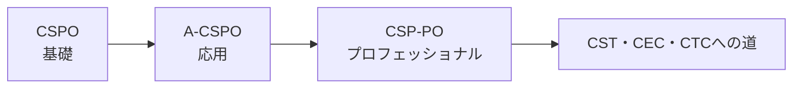

各段階のおおまかな違いを整理すると、以下のようになります。

| 資格 | 主な焦点 | 前提条件 | 対象者像 |
|---|---|---|---|
| CSPO | Scrumの基礎、PO役割の基本理解 | なし | プロダクトオーナーになったばかりの人 |
| A-CSPO | 技術的負債への理解、スケーリングの基礎、高度なゴール設定 | CSPO保有 | 実務経験を積んだPO |
| CSP-PO | 戦略実装、複雑な仮説検証、複数チームのバックログマネジメント | A-CSPO保有 + 実務経験24ヶ月 | 複数チーム・複雑なプロダクトを扱うシニアPO |

公式ページのFAQでも、A-CSPOとCSP-POの違いについて次のように説明されています。

> A-CSPOはPOのスキルセットを基礎以上に拡張することに焦点を当てるのに対し、CSP-POコースはプロダクトバックログマネジメントと顧客とのやり取りに必要な高度な戦略・検証手法・マネジメントスキルを教える[1]。

### 1.3 学べること(公式の学習領域)

公式ページでは、CSP-POコースで学ぶ内容として以下が挙げられています[1]。

- 意見が対立するステークホルダーとの議論をファシリテーションする方法
- 社内外のステークホルダーとの協働の仕方
- 新しいスクラムチームの結成
- 新しいスクラムチームの立ち上げが、従来のプロジェクトキックオフとなぜ異なるのか
- 複数チームにまたがるプロダクトバックログのマネジメント
- 複雑なプロダクト計画の実践

さらに、プロダクトエコノミクス(Product Economics)、顧客リサーチ(Customer Research)、プロダクト戦略(Product Strategy)についても深く掘り下げます[1]。

### 1.4 なぜこのレベルの認定が必要なのか

Scrum Guide(2020年版)は、Product Ownerの責務を次のように定義しています。

> Product Ownerは、プロダクトの価値を最大化する責任を単独で担う[3]。

しかし、実際の組織では以下のような複雑性が発生します。

- プロダクトが成長するにつれて、1つのスクラムチームでは対応しきれなくなり、複数チームでの開発が必要になる
- ステークホルダーの数が増え、それぞれの利害が対立するようになる
- 「作ったものが本当に価値を生むのか」を検証する仮説検証のスキルが不可欠になる
- プロダクトの収益性やROI(投資対効果)を定量的に語る必要が出てくる

CSP-POは、まさにこうした「複雑化したプロダクトオーナーシップ」に対応するための、実務直結型のプロフェッショナル認定です。

### ベストプラクティス

- CSP-POを目指す前に、自分が実際にどのような複雑性(複数チーム、対立するステークホルダー、収益性の説明責任など)に直面しているかを棚卸ししておくと、教育プログラムでの学びを実務にすぐ接続できます。
- A-CSPOで学んだ技術的負債・スケーリングの基礎知識を、CSP-POの「複数チームマネジメント」「戦略実装」の学習と意識的に結びつけて復習しておくと理解が深まります。

---

## 2. CSP-PO取得要件

### 2.1 公式要件の全体像

公式ページに明記されているCSP-POの取得要件は以下の5点です[1]。

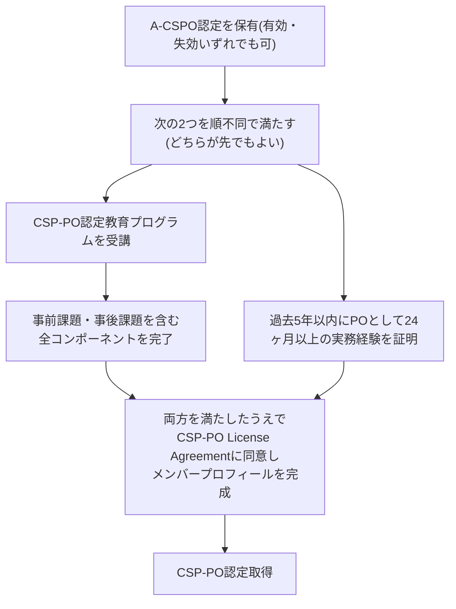

| # | 要件 | 補足 |
|---|---|---|
| 1 | Scrum AllianceのA-CSPO認定を保有していること | 有効でも失効していてもよい。CSP-PO取得時にA-CSPOとCSPOの両方が自動更新される[1] |
| 2 | 認定されたCSP-PO教育プログラム(公式トレーニング)を受講すること | 目的の実装・戦略、プロダクト仮説検証の高レベルアプローチ、高度なプロダクトバックログマネジメント技術を学ぶ[1] |
| 3 | 事前課題・事後課題を含む承認済み教育プログラムの全コンポーネントを完了すること | |
| 4 | CSP-PO License Agreementへの同意とScrum Allianceメンバープロフィールの完成 | |
| 5 | 過去5年以内に、プロダクトオーナーとしての役割に特化した実務経験を24ヶ月以上保有していること | |

### 2.2 認定後の維持(概要)

CSP-POは「一度取得すれば終わり」の資格ではありません。Scrum Alliance自体が次のように説明しています。

> 2001年に設立されたScrum Allianceは、実質を伴う認定を提供する。バッジを取得した後も、更新要件として書籍を読む、ウェビナーを視聴する、イベントに参加するなどして知識を継続的に伸ばしていることの証明が求められる[1]。

具体的には、2年ごとにScrum Education Units(SEU)を蓄積し、更新申請を行う必要があります。詳細は「15. 認定後のキャリアパスと更新」で扱います。

### 2.3 A-CSPOやCSPOとの要件比較

| 資格 | 前提資格 | 必要実務経験 | 教育プログラム | 更新サイクル |
|---|---|---|---|---|
| CSPO | なし | なし | 必須(2日間相当が一般的) | 2年ごと |
| A-CSPO | CSPO | 過去5年以内に12ヶ月以上のPO経験 | 必須 | 2年ごと |
| CSP-PO | A-CSPO | 過去5年以内に24ヶ月以上のPO経験 | 必須(事前・事後課題含む) | 2年ごと(40 SEU) |

### ベストプラクティス

- 実務経験の「24ヶ月」は、単に在籍期間ではなく「PO役割に特化した」期間である点に注意し、担当したプロダクト・チーム・期間を記録として整理しておくと申請時にスムーズです。
- 教育プログラムの事前課題は、自分が実際に抱えている複数チームやステークホルダー対立の実例を題材にすると、研修中の議論がより実務的になります。
- A-CSPOが失効していても要件を満たせるため、更新を後回しにしていた人も臆せずCSP-POに挑戦できます[1]。

---

## 3. Bloom's Taxonomyと学習目標の読み方

### 3.1 なぜBloom's Taxonomyが使われるのか

CSP-PO Learning Objectives文書の冒頭では、次のように説明されています。

> Bloomスタイルの学習目標は、学習者がプログラム修了時に何ができるようになるかを記述する。各学習目標の冒頭には「CSP-POの学習目標を無事に検証した上で、学習者は...できるようになる」というフレーズを暗黙的に補って読む[2]。

Bloom's Taxonomy(ブルームの分類学)は、学習を6段階の「思考の高度さ」で捉えるフレームワークです。CSP-POの学習目標はすべて、この6段階のいずれかに位置づけられています[2]。

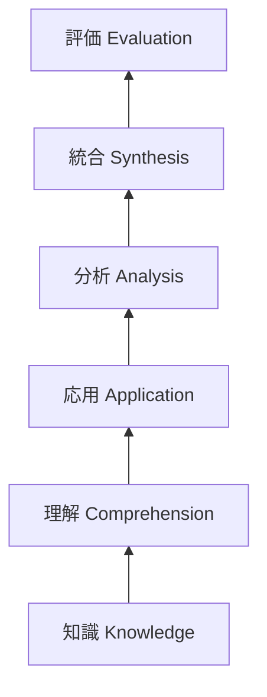

### 3.2 6段階の意味

| 段階 | 英語 | 意味 | CSP-POでの動詞の例 |
|---|---|---|---|
| 1 | Knowledge | 事実や用語を思い出せる | (CSP-POではほぼ使われない、より基礎的な認定向け) |
| 2 | Comprehension | 意味を理解し説明できる | explain, discuss |
| 3 | Application | 実際の場面に適用できる | demonstrate, apply, plan |
| 4 | Analysis | 要素に分解し関係性を分析できる | compare, contrast, assess |
| 5 | Synthesis | 複数の要素を組み合わせ新しいものを作れる | construct, develop, prepare |
| 6 | Evaluation | 基準に基づき価値判断ができる | evaluate, appraise, defend |

### 3.3 CSP-POの学習目標がなぜ「上位レベル」中心なのか

CSPOの学習目標が主にKnowledge~Applicationレベルであるのに対し、A-CSPOはApplication~Analysisレベルが中心になります。そしてCSP-POでは、実際に学習目標の動詞を見ると、evaluate(評価する)、appraise(査定する)、defend(擁護する)、construct(構築する)、develop(開発する)といった、Analysis~Evaluationレベルの高次思考動詞が圧倒的に多く使われています[2]。これは、CSP-POが「知っている」「できる」を超えて、「自分の判断で価値を評価し、他者に説明・弁護できる」レベルを要求していることを意味します。

### ベストプラクティス

- 学習目標を読むときは、動詞に注目してください。「compare(比較する)」なら2つ以上の選択肢を実際に比較検討した経験を、「defend(擁護する)」ならステークホルダーに向けて自分の判断を説明した経験を、それぞれ言語化できるように準備しておくと、教育プログラムでの実技課題にスムーズに対応できます。
- 各学習目標の冒頭に暗黙的に付く「Upon successful validation of the CSP-PO Learning Objectives, the learner will be able to...」というフレーズを常に意識すると、単なる知識暗記ではなく「自分は何ができるようになるのか」という視点で学習を進められます[2]。

---

## 4. カテゴリー1-A: 高度なステークホルダー対話 (Advanced Stakeholder Discussion)

このセクションは、公式学習目標のカテゴリー「1. Product Owner Core Competencies」のうち、LO1.1~LO1.4を扱います[2]。

### 4.1 LO1.1: 組織的コンテキストがPO選定に与える影響を査定する

> 1.1 appraise how different organizational contexts might impact how a person is selected to be a Product Owner.[2]

**詳細な説明**: 同じ「プロダクトオーナー」という役職でも、組織の構造によって選ばれ方や求められる資質は大きく異なります。例えば、スタートアップでは創業者自身がPOを兼務することが多く、大企業では事業部門のマネージャーがPOに任命されることが多いといった違いがあります。また、社内向けシステムのPOと、社外顧客向けプロダクトのPOでは、求められるドメイン知識やステークホルダーとの距離感も異なります。

**進め方(ステップバイステップ)**:
1. 自組織の意思決定構造(トップダウンか、権限委譲されているか)を図示する
2. PO選定の実際のプロセス(誰が任命するか、どんな基準か)を関係者にヒアリングする
3. 別の組織タイプ(例: スタートアップ vs 大企業、社内向け vs 社外向け)を仮定し、同じプロダクトのPO選定がどう変わるかを比較する
4. 自組織のPO選定プロセスの強みと弱みを言語化する

**ベストプラクティス**:
- PO選定基準を「ドメイン知識」「意思決定権限」「ステークホルダーとの関係性」「時間の確保度合い」の4軸で評価すると、組織間の違いが見えやすくなります。
- 権限が不十分なままPOに任命されるケースは典型的なアンチパターンです。Scrum Guideが定義する「Product Ownerはプロダクトの価値を最大化する責任を単独で担う」[3]という原則に照らし、権限とアカウンタビリティが一致しているかを確認しましょう。

### 4.2 LO1.2: 対立するステークホルダーのファシリテーションセッションを評価する

> 1.2 assess a facilitated session with stakeholders who are in conflict, providing two examples of how to improve facilitation.[2]

**詳細な説明**: ステークホルダー同士の意見対立は、プロダクト開発において避けられない現象です。CSP-POレベルでは、単に対立を解消するだけでなく、「そのファシリテーションセッション自体を振り返り、改善点を具体的に2つ以上挙げられる」ことが求められます。

**進め方(ステップバイステップ)**:
1. 対立するステークホルダーの立場・利害・懸念を事前にマッピングする
2. ファシリテーションのゴール(合意形成か、選択肢の可視化か)を明確にする
3. セッションを実施し、発言時間の偏り・感情的な対立の兆候・沈黙しているステークホルダーの有無を観察する
4. セッション後に「うまくいった点」と「改善できる点」を最低2つずつ振り返る

**ベストプラクティス**:
- ファシリテーションの評価軸として、「心理的安全性」「発言機会の公平性」「合意の質(妥協ではなく納得か)」の3点を用いると振り返りが具体的になります。
- 対立の背後にある「利害(interest)」と表面的な「立場(position)」を分けて可視化する手法(利害関係マッピング)は、ファシリテーションの質を大きく改善します。

### 4.3 LO1.3: ステークホルダー情報の収集・伝達・活用技術を比較する

> 1.3 compare at least two techniques for gathering, communicating, and leveraging information from internal and external stakeholders.[2]

**詳細な説明**: 社内ステークホルダー(経営層、営業、サポート部門など)と社外ステークホルダー(顧客、パートナー企業など)では、情報の集め方・伝え方が異なります。CSP-POでは、最低2つの技術を比較できることが求められます。

**代表的な技術の比較表**:

| 技術 | 概要 | 向いている場面 |
|---|---|---|
| ステークホルダーマップ(権力・関心度マトリクス) | 影響力と関心度の2軸でステークホルダーを分類する | 誰にどの頻度・粒度で情報共有すべきか判断したいとき |
| プロダクトレビューへの招待 | Sprint Reviewにステークホルダーを招き、増分を直接見せてフィードバックを得る | 継続的な信頼関係構築、透明性の確保 |
| 定期的な1on1インタビュー | ステークホルダー個別に深く話を聞く | 対立の火種を早期に発見したいとき、公の場で話しにくい懸念を拾いたいとき |
| ロードマップ共有セッション | プロダクトの方向性を定期的に可視化して共有する | 期待値のズレを防ぎたいとき |

**進め方(ステップバイステップ)**:
1. 自分が扱っているステークホルダーを社内/社外に分類する
2. それぞれに対して現在使っている情報収集・伝達手法を棚卸しする
3. 上記表を参考に、まだ使っていない技術を1つ選んで試してみる
4. 効果(情報の質、関係性の変化)を比較する

**ベストプラクティス**:
- 社外ステークホルダー(特に顧客)からのフィードバックは、後述する「3. カテゴリー3: 高度なインタラクション」の顧客リサーチ手法と組み合わせるとより効果的です。
- 情報を「集める」だけでなく「活用する」ところまでを技術として捉えることが重要です。集めたフィードバックがプロダクトバックログにどう反映されたかを可視化する仕組み(トレーサビリティ)を持つと、ステークホルダーの信頼を得やすくなります。

### 4.4 LO1.4: Scrumの最新の定義の採用がステークホルダー関係やプロダクトにどう役立つかを評価する

> 1.4 evaluate how their stakeholder relationships and/or product could benefit from the adoption of the latest definition of Scrum.[2]

**詳細な説明**: Scrum Guideは定期的に改訂されており、2020年版では「Product Goal(プロダクトゴール)」という新しい概念が導入されました[3]。CSP-POでは、こうした最新の定義の変化が、自分のステークホルダー関係やプロダクトにどう役立つかを評価する力が求められます。

**Scrum Guide 2020年版の主な変更点(抜粋)**:
- Product Goalの導入により、プロダクトの長期的な方向性がProduct Backlogのコミットメントとして明示された[3]
- 3つのコミットメント(Product GoalはProduct Backlogに、Sprint GoalはSprint Backlogに、Definition of Doneはインクリメントに、それぞれ対応する)が整理された[3]
- Development Teamという表現がなくなり、「Scrum Team」として一体性が強調された[3]

**進め方(ステップバイステップ)**:
1. 自分が現在使っているScrum Guideのバージョンを確認する
2. 最新版(2020年版)との差分を洗い出す
3. Product Goalの概念を自分のプロダクトに当てはめ、ステークホルダーへの説明にどう使えるか検討する
4. 実際にステークホルダーとの対話でProduct Goalを用いて説明してみる

**ベストプラクティス**:
- Product Goalは、複数チームで1つのプロダクトを扱う際に「なぜこのプロダクトバックログ項目が今優先されているのか」をステークホルダーに説明する強力な軸になります。
- Scrum Guideの原文は無料で公開されているため[3]、教育プログラム受講前に必ず最新版を読み込んでおくことを強く推奨します。

---

## 5. カテゴリー1-B: 新しいスクラムチームの立ち上げ (Launching Scrum Teams)

このセクションは、LO1.5~LO1.7を扱います[2]。

### 5.1 LO1.5: 新しいスクラムチームの立ち上げが従来のプロジェクトキックオフと異なるべき理由を3つ以上説明する

> 1.5 explain at least three reasons why the start of a new Scrum Team should be handled differently from a traditional project kickoff or charter.[2]

**詳細な説明**: 従来型のプロジェクトキックオフは「計画を確定し、要件を固め、スケジュールを引く」ことに主眼が置かれます。一方、新しいスクラムチームの立ち上げは、チームという「生きたシステム」を育てるプロセスであり、以下のような理由から異なる扱いが必要です。

1. **チームは段階的に成熟する**: 心理学者Bruce Tuckmanが1965年に提唱した「Forming(形成期)-Storming(混乱期)-Norming(統一期)-Performing(機能期)」モデルによれば、チームは対人関係とタスク遂行能力の両面で段階的に発達していきます[10] [11]。プロジェクト憲章のように「初日から高いパフォーマンスを期待する」計画は非現実的です。

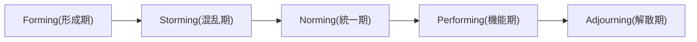

2. **要件は最初から確定できない**: Scrumは経験主義(検査・適応・透明性)に基づいており、Product Backlogは継続的に進化することが前提です[3]。従来のプロジェクト憲章のように、スコープを最初に固定することはScrumの原則と矛盾します。
3. **自己管理型チームの立ち上げには時間がかかる**: Scrum Guideは、Scrum Teamが自己管理型(self-managing)であることを求めています[3]。指示命令型のプロジェクトチームとは異なり、チームが自分たちで作業の進め方を決められるようになるまでの「立ち上げ投資」が必要です。

**進め方(ステップバイステップ)**:
1. 新チーム発足時に、Tuckmanモデルを踏まえたチームビルディングの時間を意図的に確保する
2. 初回のプロダクトバックログは「完璧な要件定義書」ではなく「学習しながら磨いていく仮説の集合」として提示する
3. チームの自己管理を促すため、最初は意思決定の権限委譲の範囲を明示的に合意する

**ベストプラクティス**:
- チーム立ち上げの最初の数Sprintは、ベロシティが不安定になることを前提にステークホルダーへ事前に説明しておくと、後々の期待値のズレを防げます。
- Tuckmanモデルは「一直線に進む」とは限らず、メンバー交代や大きな対立があれば前の段階に戻ることもあります[10]。POはこれを異常事態ではなく通常のプロセスとして捉える視点を持つべきです。

### 5.2 LO1.6: チーム結成時の品質期待値を定義するPOの責任について議論する

> 1.6 discuss the Product Owner's responsibility to define expectations for quality when their Scrum Team forms.[2]

**詳細な説明**: Scrum Guideでは、Definition of Done(完成の定義)がScrum Teamの品質基準を定めるコミットメントとされています[3]。新チームが結成される際、POは単に「何を作るか」だけでなく「どのレベルの品質で完成とみなすか」についても、最初から明確な期待値を持って議論に参加する責任があります。

**進め方(ステップバイステップ)**:
1. チーム発足時のワークショップで、Definition of Doneの叩き台を開発者と一緒に作成する
2. 組織全体のDefinition of Doneの基準(全社的な品質基準)があれば、それをチームレベルのDefinition of Doneに反映する
3. 品質基準がプロダクトバックログの見積もりやSprintの計画にどう影響するかをチームと合意する
4. 定期的にDefinition of Doneを見直す機会(レトロスペクティブ等)を設ける

**ベストプラクティス**:
- POが「品質は開発者だけの責任」と考えてしまうのはアンチパターンです。品質基準はビジネス価値の実現可能性に直結するため、POも積極的に議論に参加すべきです。
- 品質期待値を明文化しないままチームが走り出すと、後になって「そもそも何をもって完成とするか」の認識齟齬が表面化し、手戻りが発生しやすくなります。

### 5.3 LO1.7: 新しいスクラムチームの立ち上げを計画する

> 1.7 plan the launch of a new Scrum Team.[2]

**詳細な説明**: これはLO1.5・LO1.6で学んだ内容を統合し、実際に「計画する(plan)」という応用レベルの学習目標です。

**新チーム立ち上げ計画の主要な要素**:

| 要素 | 内容 |
|---|---|
| プロダクトゴールの共有 | チーム全員が同じ方向を向けるよう、プロダクトゴールを最初に共有する[3] |
| 初期プロダクトバックログの準備 | 完璧である必要はないが、最初のSprintを開始できる程度に十分な項目を用意する |
| Definition of Doneの叩き台作成 | 上記5.2を参照 |
| チームビルディングの時間確保 | Tuckmanモデルを踏まえ、対人関係構築の時間を計画に組み込む |
| ステークホルダーへの期待値調整 | 立ち上げ初期はベロシティが安定しないことを事前共有する |
| 作業環境・ツールの整備 | チームが自己管理できるための基盤(バックログ管理ツール、コミュニケーション手段等)を用意する |

**進め方(ステップバイステップ)**:
1. プロダクトゴールを1枚のドキュメントやビジュアルにまとめる
2. 初期プロダクトバックログを、少なくとも最初の1~2 Sprint分準備する
3. チーム発足キックオフのアジェンダを設計する(ゴール共有、自己紹介、働き方の合意、Definition of Doneの叩き台作成を含める)
4. 最初の数Sprintのステークホルダーへの報告頻度・粒度を事前に合意する

**ベストプラクティス**:
- 「新しいスクラムチームの立ち上げは、従来のプロジェクトキックオフとは異なる」という原則([1]の公式説明にもある通り)を体現するには、計画そのものを「固定的な手順書」ではなく「最初の仮説」として扱う姿勢が重要です。
- 新チーム発足時こそ、Scrum Values(確約、勇気、集中、公開、尊敬) [5]をチームで言語化し、行動規範として合意しておくと、Storming期の対立を乗り越えやすくなります。

---

## 6. カテゴリー1-C: 複数チームにおけるプロダクトオーナーシップ (Product Ownership with Multiple Teams)

このセクションは、LO1.8~LO1.10を扱います[2]。Scrum Guideの原則は「one product, one Product Owner, one Product Backlog」ですが、実際には1人のPOが複数のスクラムチームを担当する場面が頻繁に発生します[8]。

### 6.1 LO1.8: 複数のスクラムチームにまたがるプロダクトバックログマネジメントの手法を最低2つ実演する

> 1.8 demonstrate at least two methods to support Product Backlog management across multiple Scrum Teams.[2]

**詳細な説明**: Scrum Alliance公式リソースライブラリの記事「What to Do When You're Asked to Be the Product Owner for Multiple Teams」では、複数チームを担当するPOにとって「アカウンタビリティ(当事者意識)」と「委任(delegation)」が2大ツールであると説明されています[8]。

代表的な手法を整理すると以下の通りです。

| 手法 | 概要 | ポイント |
|---|---|---|
| プロダクトゴールの統一的な明文化と定期的な強化 | 全チームが同じプロダクトゴールを理解できるよう、詳細に言語化し、会議で繰り返し確認する[8] | ゴール設定ワークショップの実施、可視化資料の掲示 |
| 単一のプロダクトバックログと戦略的な並び替え | 依存関係・複雑性・影響を考慮し、複数チームの視点をバランスよく取り入れて並び替える[8] | チームごとの視点を統合するための協働的な議論の場を設ける |
| 透明性の高いドキュメント化 | 決定事項・変更・進捗を一貫して記録し、全チームが同じ情報源を参照できるようにする[8] | 優先順位付けの根拠も含めて記録する |
| 委任によるスケール | POが単独で全ての詳細を把握するのではなく、ステークホルダーや専門家に権限委譲する[8] | 委任時は期待される成果・制約・権限のレベルを明確にする |

**進め方(ステップバイステップ)**:
1. まず、現在担当している(あるいは今後担当する)チーム数と、それぞれの役割・依存関係を可視化する
2. プロダクトゴールを1つの文書にまとめ、全チームに共有するワークショップを設計する
3. 単一のプロダクトバックログを維持しつつ、各チームの専門性や制約を反映した並び替えルールを合意する
4. 委任できるタスク(バックログ項目の詳細化など)をリストアップし、適切な相手(サブジェクトマターエキスパートやステークホルダー)に権限委譲する

**ベストプラクティス**:
- 定期的な「クロスチーム・リファインメント」の場を設けることで、依存関係を早期に発見し解消できます。これはNexusフレームワークが「Cross-Team Refinement」として正式に定義しているプラクティスと同様の考え方です[9]。
- ドキュメントを「透明性の高い唯一の情報源(single source of truth)」として維持することが、複数チーム間の認識齟齬を防ぐ最大のポイントです[8]。

### 6.2 LO1.9: プロダクトオーナー役割をスケールするパターンを最低2つ対比する

> 1.9 contrast at least two patterns for scaling the Product Owner role.[2]

**詳細な説明**: 業界では、プロダクトオーナー役割をスケールするためのいくつかのパターンが確立されています。ここでは代表的な2つのパターンを対比します。

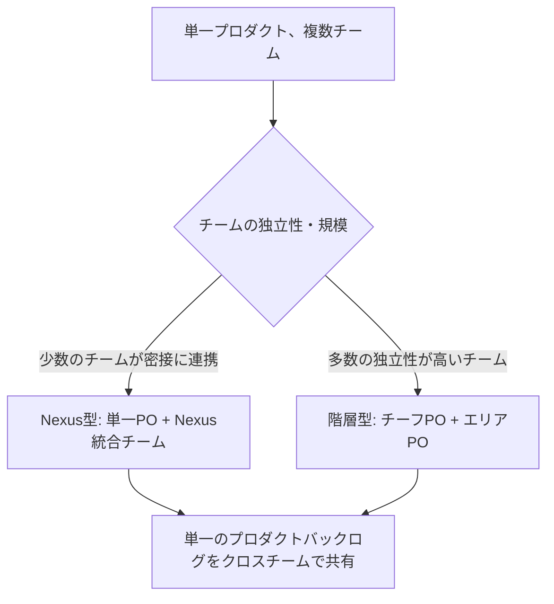

| パターン | 概要 | 出典・関連フレームワーク |
|---|---|---|
| Nexus型(統合チームによる調整) | 単一のプロダクトバックログを複数チームで共有し、Nexus Integration Teamが統合上の課題を横断的に扱う[9] | Scrum.org Nexus Guide[9] |
| 階層型(チーフPO + エリアPO) | 大規模プロダクトを複数の「エリア」に分割し、それぞれにエリアPOを置きつつ、チーフPOが全体の一貫性を担保する | LeSS(Large-Scale Scrum)のArea Product Ownerパターンなどに類似 |
| 委任ネットワーク型 | POが特定の意思決定権限をステークホルダーや専門家ネットワークに委任し、自身は戦略とゴールの一貫性に集中する[8] | Scrum Alliance公式リソース記事[8] |

**進め方(ステップバイステップ)**:
1. 自組織の規模・チーム数・独立性を評価する
2. 上記3パターンのうち、少なくとも2つを自組織に当てはめてシミュレーションする
3. 各パターンのメリット・デメリット(意思決定の速度、一貫性の維持コスト、コミュニケーションオーバーヘッド)を比較する
4. 最も適したパターン、あるいはハイブリッドなアプローチを選択する

**ベストプラクティス**:
- どのパターンを選んでも、「単一のプロダクトバックログ」という原則自体は崩さないことが重要です。バックログが分裂すると、優先順位の一貫性が失われ、チーム間の対立が起きやすくなります[9]。
- パターンの選択は一度きりの意思決定ではなく、組織の成長に応じて見直すべきものです。

### 6.3 LO1.10: プロダクトオーナーシップに関連するトピックを開発し、教える

> 1.10 develop and then teach a topic related to product ownership.[2]

**詳細な説明**: これは、CSP-POの学習目標の中でも特にSynthesis(統合)レベルの高度な目標です。単に学ぶだけでなく、「他者に教える」ところまでを求めています。これは、教えることによって自分自身の理解がより深まるという教育学的な原則(ラーニングピラミッド的な考え方)にも合致します。

**進め方(ステップバイステップ)**:
1. 自分が特に強みを持つ、あるいは深く学んだプロダクトオーナーシップのトピックを1つ選ぶ(例: Cost of Delayの計算方法、Opportunity Solution Treeの使い方など)
2. トピックを初学者にもわかるように構造化する(このガイド自体がその一例です)
3. 社内勉強会、コミュニティ・オブ・プラクティス、あるいはScrum Allianceのユーザーグループなどで実際に発表・教育を行う
4. フィードバックを受けて、教材や説明の仕方を改善する

**ベストプラクティス**:
- 教える機会は、CSTやCEC、CTCといった上位資格([1]で言及されている次のキャリアステップ)を目指す上でも非常に重要な実績になります。
- 社内で「PO同士のコミュニティ・オブ・プラクティス」を主催することは、この学習目標を継続的に満たす良い方法です。

---

## 7. カテゴリー2-A: 市場駆動型プロダクト戦略 (Market-Driven Product Strategy Practices)

このセクションは、公式カテゴリー「2. Implementing Goal Setting and Planning」のうち、LO2.1~LO2.3を扱います[2]。

### 7.1 LO2.1: プロダクトのためのビジネスモデルを最低3つ比較対照する

> 2.1 compare and contrast at least three business models for a product.[2]

**詳細な説明**: プロダクトの価値提供の仕方(ビジネスモデル)は多様です。CSP-POでは、少なくとも3つのビジネスモデルを比較対照できることが求められます。ビジネスモデルを構造的に捉えるための代表的なツールが、Alexander OsterwalderとYves Pigneurが考案したBusiness Model Canvas(ビジネスモデルキャンバス)です[12]。

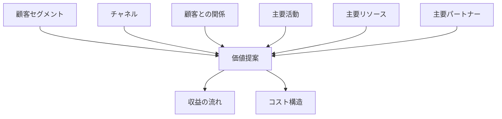

Business Model Canvasは9つの要素(ブロック)で構成され、企業やプロダクトの価値創造の全体像を1枚で可視化するツールとして、200,000以上の企業で使われています[12] [17]。

**代表的なビジネスモデル3種の比較**:

| ビジネスモデル | 収益の仕組み | 代表例 | 向いているプロダクト |
|---|---|---|---|
| サブスクリプション型 | 継続課金 | SaaS、動画配信サービス | 継続的な価値提供が可能なプロダクト |
| フリーミアム型 | 基本無料 + 追加課金 | モバイルアプリ、一部のSaaS | ネットワーク効果が働くプロダクト |
| マーケットプレイス/仲介型 | 取引手数料 | ECプラットフォーム、マッチングサービス | 需要と供給を結ぶプラットフォーム |

**進め方(ステップバイステップ)**:
1. 自社プロダクトの現在のビジネスモデルをBusiness Model Canvasの9ブロックで書き出す
2. 競合や別業界のプロダクトから、異なる2つ以上のビジネスモデルを選んで同様にキャンバスを埋める
3. 3つのキャンバスを並べて、収益の流れ・顧客セグメント・価値提案の違いを比較する
4. 自社プロダクトに他のビジネスモデルの要素を取り入れられないか検討する

**ベストプラクティス**:
- Business Model Canvasは「一度書いて終わり」ではなく、市場の変化に応じて定期的に見直すべきツールです[12]。
- POはビジネスモデルの選択を単独で決めるのではなく、経営層・営業・ファイナンス部門といったステークホルダーを巻き込んで検討することが望ましいです。

### 7.2 LO2.2: プロダクトアイデアのためのビジネスモデルを開発する

> 2.2 develop a business model for a product idea.[2]

**詳細な説明**: LO2.1の比較分析を踏まえ、実際に新しいプロダクトアイデアに対してビジネスモデルを「開発する(develop)」、つまりゼロから構築する応用力が求められます。

**進め方(ステップバイステップ)**:
1. プロダクトアイデアの核となる価値提案(Value Proposition)を明確にする
2. Business Model Canvasの9ブロックを、顧客セグメント → 価値提案 → チャネル → 顧客との関係 → 収益の流れ → 主要リソース → 主要活動 → 主要パートナー → コスト構造、の順で埋めていく
3. 収益の流れとコスト構造のバランスを検証し、経済的に成立しうるかを粗く試算する
4. ステークホルダーとキャンバスをレビューし、フィードバックを反映する

**ベストプラクティス**:
- 最初から完璧なビジネスモデルを作ろうとせず、「検証可能な仮説の集合」として捉えることが重要です。後述するLean Startupの考え方([16]、カテゴリー4で詳述)と組み合わせると効果的です。
- 収益の流れだけでなく、コスト構造(特に開発・運用コスト)を同時に検討することで、後述のプロダクトエコノミクス(カテゴリー2-C)へスムーズにつながります。

### 7.3 LO2.3: 競合分析を構築する

> 2.3 construct a competitive analysis.[2]

**詳細な説明**: 競合分析は、自社プロダクトが置かれている市場環境を理解するための重要な戦略ツールです。代表的なフレームワークとして、Harvard Business SchoolのMichael E. Porter教授が1979年に提唱したPorterのファイブフォース分析(Five Forces Analysis)があります[13]。

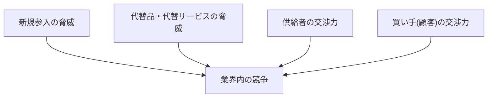

Porterのファイブフォースは、業界の競争環境を分析し、そこから得られる潜在的な収益性を評価するために業界組織論に根ざしたフレームワークです[13]。

**5つの力の説明**:

| 力 | 説明 |
|---|---|
| 新規参入の脅威 | 新しい競合がどれだけ容易に市場に参入できるか |
| 代替品の脅威 | 顧客が別の手段・製品で同じニーズを満たせるか |
| 供給者の交渉力 | 部品・技術・人材などの供給元がどれだけ強い交渉力を持つか |
| 買い手の交渉力 | 顧客がどれだけ価格や品質について交渉力を持つか |
| 業界内の競争 | 既存の競合同士の競争の激しさ |

**進め方(ステップバイステップ)**:
1. 自社プロダクトが属する業界を定義する(範囲を狭すぎず広すぎず設定するのがポイント)
2. 5つの力それぞれについて、「強い/中程度/弱い」を評価し根拠を記述する
3. 直接競合(同じ課題を同じ方法で解決する製品)と間接競合(異なる方法で同じ課題を解決する製品)をリストアップする
4. 分析結果をプロダクト戦略(差別化ポイント、価格戦略など)に反映する

**ベストプラクティス**:
- ファイブフォース分析は業界単位の分析であり、個別企業の戦略そのものではありません。分析結果を「自社がどう動くべきか」という戦略に翻訳する作業が別途必要です[13]。
- 競合分析は一度作って終わりにせず、四半期に一度など定期的に見直すことで、市場変化への感度を保てます。

---

## 8. カテゴリー2-B: 複雑なプロダクト計画とフォーキャスティング (Complex Product Planning and Forecasting)

このセクションは、LO2.4~LO2.7を扱います[2]。

### 8.1 LO2.4: プロダクト計画・フォーキャストを開発するための技術を最低2つ比較する

> 2.4 compare at least two techniques to develop a product plan or forecast.[2]

**詳細な説明**: プロダクト計画・フォーキャスティング(将来予測)には複数の技術があります。代表的なものを比較します。

| 技術 | 概要 | 向いている場面 |
|---|---|---|
| ベロシティベースのフォーキャスト | 過去のSprintのベロシティ(完了した作業量)を基に将来の完了時期を予測する | 安定したチームで、比較的予測しやすいバックログがある場合 |
| モンテカルロ・シミュレーション | 過去のスループットのばらつきを確率分布として扱い、複数のシナリオをシミュレーションして完了確率を算出する | 不確実性が高く、単純な平均値では誤差が大きい場合 |
| Cost of Delayに基づく優先順位付け計画 | 各項目の遅延コストを定量化し、経済的に最適な順序で計画する(詳細はカテゴリー2-Cで扱う) [14] [15] | 経済合理性を重視した計画が必要な場合 |

**進め方(ステップバイステップ)**:
1. 自チームの過去数Sprintのベロシティデータを収集する
2. ベロシティベースの単純なフォーキャストを作成する
3. 同じデータを使ってモンテカルロ・シミュレーションを試し、両者の予測の違い(特に不確実性の表現の違い)を比較する
4. どちらの技術がステークホルダーへの説明に適しているかを検討する

**ベストプラクティス**:
- 単一の数値(「〇月〇日に完了します」)よりも、確率分布(「80%の確率で〇月〇日までに完了します」)で伝える方が、不確実性を誠実に扱えます。
- フォーキャストは「約束」ではなく「その時点での最良の推定」であることを、常にステークホルダーに明確に伝えることが重要です。

### 8.2 LO2.5: ビジネスモデルに適したリリース戦略を開発する

> 2.5 develop an appropriate release strategy for a business model.[2]

**詳細な説明**: LO2.1・2.2で検討したビジネスモデルに応じて、最適なリリース戦略は変わります。

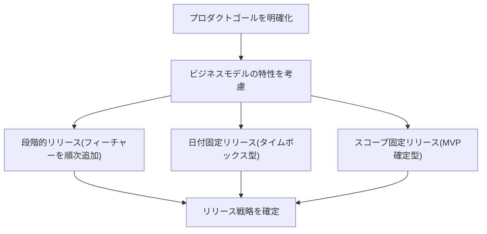

| リリース戦略 | 特徴 | 向いているビジネスモデル |
|---|---|---|
| 段階的リリース | 機能を継続的に小刻みにリリースする | サブスクリプション型(継続的な価値向上が重要) |
| 日付固定リリース | 特定の日付(規制対応、季節イベントなど)に合わせてスコープを調整する | 規制・季節性が強いビジネス |
| スコープ固定リリース(MVP型) | 最小限の機能セットを固定し、期間は柔軟にする | 新規事業の検証段階 |

**進め方(ステップバイステップ)**:
1. ビジネスモデルの収益化タイミング(いつ収益が発生するか)を確認する
2. 市場・規制・季節性などの外部制約を洗い出す
3. 上記3つの戦略のうち、制約に最も適したものを選ぶ、あるいは組み合わせる
4. リリース戦略をロードマップとして可視化し、ステークホルダーと合意する

**ベストプラクティス**:
- リリース戦略は一度決めたら固定するものではなく、市場からのフィードバックに応じて調整する前提で設計しましょう。

### 8.3 LO2.6: 計測可能なプロダクトローンチゴールを最低3つ特定する

> 2.6 identify at least three measurable product launch goals.[2]

**詳細な説明**: プロダクトローンチ(市場投入)の成功を判断するには、計測可能な(measurable)ゴールが不可欠です。曖昧な「成功させる」ではなく、具体的な指標に落とし込む必要があります。

**計測可能なローンチゴールの例**:

| カテゴリ | ゴール例 |
|---|---|
| 採用(Adoption) | ローンチ後30日以内にアクティブユーザー数〇〇人達成 |
| 満足度 | NPS(ネットプロモータースコア)〇〇以上を達成 |
| ビジネス成果 | ローンチ後四半期の売上〇〇円達成 |

**進め方(ステップバイステップ)**:
1. プロダクトゴールから逆算して、ローンチが成功したと言える状態を言語化する
2. 採用・満足度・ビジネス成果などの異なる観点から、最低3つの計測可能な指標を設定する
3. 各指標の測定方法・測定タイミングを事前に決めておく
4. ローンチ後に実際のデータと比較する

**ベストプラクティス**:
- 「アウトプット(機能を出したこと)」ではなく「アウトカム(顧客行動やビジネス指標の変化)」でゴールを設定することが重要です。これはカテゴリー5(高度なプロダクトバックログマネジメント)のLO5.1にも直結する考え方です。

### 8.4 LO2.7: プロダクトローンチ計画の要素を最低5つ特定する

> 2.7 identify at least five elements of a product launch plan.[2]

**詳細な説明**: プロダクトローンチ計画は、開発だけでなく、マーケティング・サポート・営業など複数の機能を横断する計画です。

**プロダクトローンチ計画の代表的な要素(5つ以上の例)**:

| # | 要素 | 内容 |
|---|---|---|
| 1 | ターゲット顧客セグメントの定義 | 誰に向けたローンチか |
| 2 | 計測可能なローンチゴール | LO2.6で設定した指標 |
| 3 | マーケティング・コミュニケーション計画 | どうやって認知を獲得するか |
| 4 | サポート体制の準備 | 問い合わせ増加への対応体制 |
| 5 | リスク・ロールバック計画 | 問題発生時にどう対応するか |
| 6 | 社内トレーニング計画 | 営業・サポートチームへの教育 |
| 7 | ローンチ後のモニタリング計画 | どの指標をいつ確認するか |

**進め方(ステップバイステップ)**:
1. 上記の要素リストを出発点に、自プロダクトのローンチに必要な要素を洗い出す
2. 各要素の担当者・期限を明確にする
3. 部門横断のステークホルダーとレビューし、抜け漏れを確認する
4. ローンチ後に振り返りを行い、計画の精度を次回に活かす

**ベストプラクティス**:
- プロダクトローンチは開発チームだけの仕事ではありません。POは、部門横断の調整役として積極的に関わる必要があります。
- Scrum Allianceの公式リソース記事「Product Roadmaps: Your Secret Weapon for Success」も参考になります[26]。ロードマップとローンチ計画を連動させることで、ステークホルダーへの説明が一貫性を持ちます。

---

## 9. カテゴリー2-C: プロダクトエコノミクス (Product Economics)

このセクションは、LO2.8~LO2.13を扱います[2]。プロダクトエコノミクスは、CSP-POの中でも特に「経営・財務的な視点」が強く求められる領域です。

### 9.1 LO2.8: プロダクトの収益性を判断する方法を最低2つ適用する

> 2.8 apply at least two methods to determine the profitability of a product.[2]

**詳細な説明**: プロダクトの収益性(profitability)を判断するには複数の財務的手法があります。

| 手法 | 概要 |
|---|---|
| 単純な損益計算(収益 - コスト) | 一定期間の収益からコストを差し引いてプロダクト単位の利益を算出する |
| ROI(投資対効果)計算 | 投資額に対してどれだけのリターンが得られたかを比率で示す |
| LTV(顧客生涯価値) vs CAC(顧客獲得コスト) | 1顧客あたりの生涯価値と獲得コストを比較し、持続可能性を判断する |

**進め方(ステップバイステップ)**:
1. プロダクトにかかる固定費・変動費を洗い出す
2. 収益データ(実績または予測)を収集する
3. 上記手法のうち2つを使って収益性を算出する
4. 手法ごとの結果の違いと、それぞれが示唆する意思決定の違いを比較する

**ベストプラクティス**:
- POが自らファイナンス部門と共通言語で対話できるようになると、プロダクト戦略の意思決定における発言力が大きく向上します。

### 9.2 LO2.9: 固定費・変動費・予測リターンに基づいて、プロダクトリリースの期待される成果や経済的結果を計算する

> 2.9 calculate the expected outcome or economic results of a product release, given fixed and variable costs, and forecasted return.[2]

**詳細な説明**: これはLO2.8の応用で、実際に数値を使って計算する実践的なスキルです。

**計算の基本構造**:

| 項目 | 説明 |
|---|---|
| 固定費 | リリースの有無にかかわらず発生するコスト(基盤インフラ、固定給与等) |
| 変動費 | リリース規模やユーザー数に応じて変動するコスト(トランザクション費用、サポートコスト等) |
| 予測リターン | リリースによって見込まれる収益・コスト削減効果 |
| 期待される経済的成果 | 予測リターン - (固定費 + 変動費) |

**進め方(ステップバイステップ)**:
1. リリース対象の機能・プロダクトに関連する固定費・変動費を分解する
2. 過去データや市場調査に基づいて予測リターンを見積もる
3. 上記の式で期待される経済的成果を算出する
4. 前提条件(仮定)を明記し、感度分析(前提が変わった場合の影響)を行う

**ベストプラクティス**:
- 計算結果そのものよりも、前提条件の透明性が重要です。ステークホルダーに説明する際は、「この数字がどんな仮定に基づいているか」を明確にしましょう。

### 9.3 LO2.10: プロダクト開発のための反復的・漸進的な投資モデルを説明する

> 2.10 explain an iterative and incremental investment model for product development.[2]

**詳細な説明**: 従来型の投資モデルは「最初に全予算を確定し、計画通りに使い切る」形が一般的でした。しかし、アジャイル・Lean Startup的な投資モデルでは、小さな投資で学習し、その結果に応じて追加投資を判断する「反復的・漸進的」なアプローチを取ります。Eric Riesが提唱したBuild-Measure-Learn(構築-計測-学習)フィードバックループは、この考え方の中核をなすフレームワークです[16]。

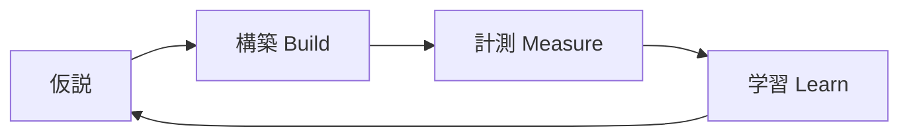

> Lean Startupは、スタートアップを創造・マネジメントするための科学的アプローチであり、望ましいプロダクトをより早く顧客の手に届けることを可能にする[16]。

**反復的・漸進的投資モデルのステップ**:
1. 最小限の投資でBuild-Measure-Learnの1サイクルを回す
2. 実測データ(バニティメトリクスではなく、意思決定に使えるアクショナブルなメトリクス)を収集する
3. データに基づき「継続(persevere)」「方向転換(pivot)」「中止」を判断する
4. 継続すると判断した場合のみ、次の投資を行う

**進め方(ステップバイステップ)**:
1. 大きな投資判断を、小さな検証可能なマイルストーンに分割する
2. 各マイルストーンの投資額と、そこで検証したい仮説を明確にする
3. マイルストーンごとに実測データを評価し、次の投資を判断する

**ベストプラクティス**:
- 「サンクコスト(すでに投じた埋没費用)」に引きずられて、データが示す方向転換のシグナルを無視してしまうのは典型的なアンチパターンです。
- 投資判断の会議体には、開発チームだけでなくファイナンス・経営層を巻き込み、反復的投資モデルへの理解を共有しておくことが重要です。

### 9.4 LO2.11: 投資対効果(ROI)を改善する方法を最低3つ実演する

> 2.11 demonstrate at least three ways how return on investment can be improved.[2]

**詳細な説明**: ROIはリターンをコストで割った比率であるため、改善方法は「リターンを増やす」か「コストを減らす」かの2方向、あるいはその両方に整理できます。

| 改善方法 | 分類 | 説明 |
|---|---|---|
| Cost of Delayが高い項目を先に着手する | リターンを増やす | 早く価値を届けることで、遅延による機会損失を減らす[14] |
| 不要な機能(使われない機能)への投資を止める | コストを減らす | プロダクト分析データを用いて利用率の低い機能を特定し、開発リソースを再配分する |
| バッチサイズを小さくする | リターンを増やす/コストを減らす | 小さいバッチで頻繁にリリースすることで、フィードバックループを短縮し、手戻りコストを削減する[14] |

**進め方(ステップバイステップ)**:
1. 現在のプロダクトバックログをCost of Delayの観点で並び替える(詳細はLO2.12を参照)
2. 利用率データを分析し、投資対効果の低い機能を特定する
3. バッチサイズ(1リリースあたりの変更量)を測定し、削減余地を検討する
4. 実施後にROIの変化を追跡する

**ベストプラクティス**:
- ROI改善の議論は、単なるコストカットに陥りがちです。POは「リターンを増やす」側の視点(価値の早期提供、顧客満足度の向上)も同時に持つべきです。

### 9.5 LO2.12: プロダクトフィーチャーのCost of Delayを計算する

> 2.12 calculate the cost of delay for a product feature.[2]

**詳細な説明**: Cost of Delay(遅延コスト)は、プロダクト開発における最も重要な経済的概念の1つです。Don Reinertsenは次のように述べています。

> Cost of Delayは、時間が私たちの目指す成果に与える影響を伝える方法である。より正式には、時間に対する総期待価値の偏微分である[14]。
>
> もし1つだけ定量化するなら、Cost of Delayを定量化せよ[14]。

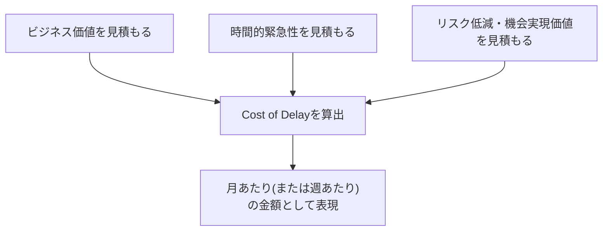

**Cost of Delayの計算の基本的な考え方**:

Cost of Delayは、「その機能のリリースが1週間(または1ヶ月)遅れると、いくらの価値を失うか」という単位(通貨/時間)で表現されます[14]。厳密な計算には財務モデルが必要な場合もありますが、CSP-POレベルでは概算(qualitative/relative)での算出方法も広く実務で使われています[14]。

**進め方(ステップバイステップ)**:
1. 対象のプロダクトフィーチャーがもたらすビジネス価値(収益向上、コスト削減など)を見積もる
2. その価値がいつまでに実現される必要があるか(時間的緊急性)を見積もる
3. そのフィーチャーによるリスク低減・機会実現(将来の選択肢を確保する)の価値を見積もる
4. 上記3つを合算し、「1週間(または1ヶ月)の遅延でいくらの価値を失うか」を算出する
5. 複数のフィーチャー間でCost of Delayを比較し、優先順位付けに活用する(LO2.13、LO5.2で詳述)

**ベストプラクティス**:
- Cost of Delayは、精緻な計算よりも「相対的な比較ができること」が実務上は重要です。厳密さにこだわりすぎて計算自体が停滞するアンチパターンに陥らないよう注意しましょう[14]。
- Cost of Delayを可視化することで、ステークホルダー間の「なぜこれを優先するのか」という議論が、感情論ではなく経済合理性に基づいたものになります。

### 9.6 LO2.13: アジャイルプロダクト開発に資金を提供するアプローチを最低2つ比較する

> 2.13 compare at least two approaches to fund agile product development.[2]

**詳細な説明**: アジャイル開発における資金提供(funding)の方法にはいくつかのアプローチがあります。

| アプローチ | 概要 | メリット・注意点 |
|---|---|---|
| プロジェクトベースの固定予算 | 開発開始前に総予算を確定する | 予算管理はしやすいが、アジャイルの適応性と相性が悪い |
| プロダクトチームへの継続的資金提供(persistent team funding) | プロジェクト単位ではなく、恒常的なチームに継続的に予算を配分する | チームの学習が蓄積されやすく、Lean Startup的な反復投資と相性が良い[16] |
| WSJF/Cost of Delayに基づく段階的資金配分 | 経済的優先順位(WSJF)が高いものから順に予算を配分する | 経済合理性は高いが、算出の手間がかかる[15] |

**進め方(ステップバイステップ)**:
1. 現在の資金提供の仕組み(プロジェクト予算か、チーム予算か)を確認する
2. 上記のうち異なる2つのアプローチを、自組織に当てはめて比較する
3. アジャイルの適応性(方向転換のしやすさ)と、組織のガバナンス要件(予算承認プロセス)のバランスを検討する
4. 移行が必要な場合は、段階的な移行計画を検討する

**ベストプラクティス**:
- 資金提供の仕組みを変えることは、多くの場合POだけでは決定できない組織的な変更です。ファイナンス部門・経営層との対話を通じて、段階的に進めることが現実的です。
- 継続的資金提供モデルへの移行は、Lean StartupのBuild-Measure-Learnループ[16]や反復的投資モデル(LO2.10)と組み合わせることで、より説得力のある提案になります。

---

## 10. カテゴリー3: 顧客・ユーザーとの高度なインタラクション (Advanced Interactions with Customers and Users)

このセクションは、公式カテゴリー「3. Advanced Interactions with Customers and Users」のLO3.1~LO3.2を扱います[2]。

### 10.1 LO3.1: 顧客リサーチをプロダクトディスカバリーと開発に統合する計画を準備する

> 3.1 prepare a plan to integrate customer research into product discovery and development.[2]

**詳細な説明**: プロダクトディスカバリー(発見)とは、「何を作るべきか」を検証するプロセスです。Teresa Torresが提唱するContinuous Discovery Habits(継続的ディスカバリーの習慣)は、プロダクトトリオ(PM・デザイナー・エンジニアの三者)が少なくとも週次で顧客と対話し、その洞察をOpportunity Solution Tree(機会解決策ツリー)に反映していく実践です[17]。

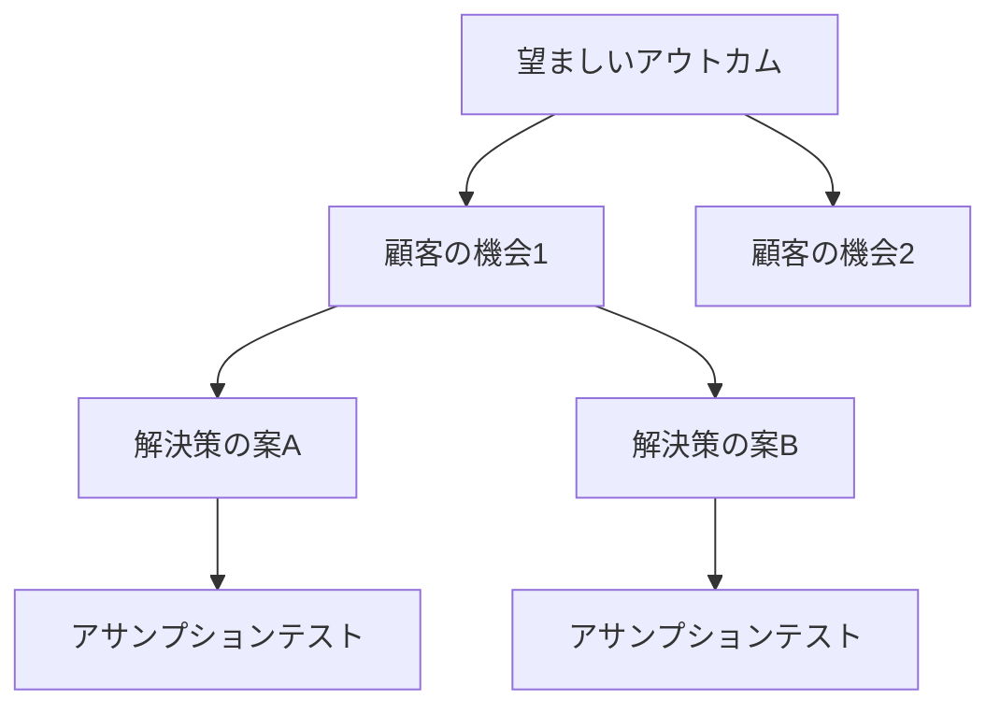

> Opportunity Solution Treeは、望ましいアウトカムをどう達成するかを視覚的に表現するシンプルな方法である。それはまた、暗黙の前提を明示的にするのにも役立つ[17]。

**進め方(ステップバイステップ)**:
1. プロダクトゴールに紐づく「望ましいアウトカム」を1つ明確にする
2. 顧客インタビューを通じて、そのアウトカムに関連する「機会(顧客のニーズ・痛み・欲求)」を洗い出す
3. Opportunity Solution Treeとして機会・解決策・アサンプションテストを構造化する
4. 週次で顧客対話を行うリズムを計画に組み込む

**ベストプラクティス**:
- 週次の顧客対話は理想ですが、実務上は多くのチームがこの頻度を達成できていません。まずは月次からでも始め、徐々に頻度を上げていくアプローチが現実的です[17]。
- インタビューでは「傾聴して理解する」ことに徹し、誘導的な質問を避けることが重要です。

### 10.2 LO3.2: 顧客リサーチまたはプロダクトディスカバリーの技術を最低3つ評価する

> 3.2 evaluate at least three techniques for customer research or product discovery.[2]

**詳細な説明**: 顧客リサーチ・プロダクトディスカバリーには多様な技術があります。CSP-POでは、少なくとも3つの技術を「評価する(evaluate)」、つまりそれぞれの適用場面や限界を判断できることが求められます。

| 技術 | 概要 | 向いている場面 | 限界 |
|---|---|---|---|
| ユーザーインタビュー | 顧客と直接対話し、ニーズや行動の背景を深掘りする | 定性的な深い理解が必要なとき | サンプル数が少なく、一般化には注意が必要 |
| Opportunity Solution Tree | インタビューから得た機会を構造化し、アウトカムに紐づける[17] | 継続的にディスカバリーを行うチーム | 継続的な更新の運用負荷がかかる |
| アサンプションテスト(実験) | プロトタイプやランディングページ等で仮説を検証する | 具体的な解決策の実行可能性を確かめたいとき | 実験設計を誤ると誤った結論を導くリスクがある |
| Kanoモデル調査 | 機能の有無に対する顧客の感情的反応をアンケートで分類する[18] | 機能の優先順位付けの参考にしたいとき | 調査対象者のセグメント分けを誤ると結果が歪む |

**進め方(ステップバイステップ)**:
1. 自チームが現在使っている顧客リサーチ技術を棚卸しする
2. 上記表を参考に、まだ使っていない技術を最低1つ試す
3. 各技術の「得られる洞察の種類」「かかるコスト・時間」「限界」を評価する
4. プロダクトディスカバリーのプロセスに、複数の技術を組み合わせて組み込む

**ベストプラクティス**:
- 1つの技術だけに頼らず、定性的技術(インタビュー)と定量的技術(Kanoモデル調査、実験)を組み合わせることで、より頑健な意思決定ができます。
- 顧客リサーチの結果は、必ずOpportunity Solution Treeやプロダクトバックログに反映されるところまでを一連のプロセスとして設計しましょう。

---

## 11. カテゴリー4: 複雑なプロダクト仮説検証 (Complex Product Assumption Validation)

このセクションは、公式カテゴリー「4. Complex Product Assumption Validation」のLO4.1~LO4.2を扱います[2]。

### 11.1 LO4.1: 仮説を検証するための適切な実験を選択する

> 4.1 select an appropriate experiment to test a hypothesis.[2]

**詳細な説明**: プロダクト開発における多くの意思決定は「仮説」に基づいています。CSP-POレベルでは、その仮説を検証するために「適切な」実験を選択する判断力が求められます。

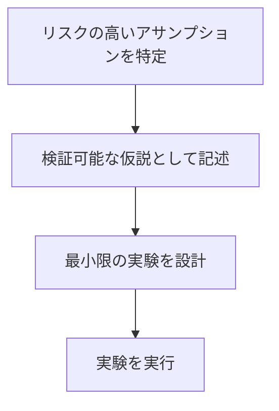

**代表的な実験手法**:

| 実験手法 | 検証できること | コスト/速度 |
|---|---|---|
| ランディングページテスト | 需要の有無(顧客が興味を持つか) | 低コスト・高速 |
| コンシェルジュ型MVP(手動で価値提供) | ソリューションの価値そのもの | 中コスト・中速 |
| A/Bテスト | 既存プロダクトにおける変更の効果 | 実装コストは高いが精度が高い |
| プロトタイプユーザビリティテスト | 使いやすさ、UI/UXの妥当性 | 低〜中コスト |

**進め方(ステップバイステップ)**:
1. 検証したい仮説を、「もし〇〇をすれば、〇〇という結果が得られるはずだ」という形で明文化する
2. 仮説の中でも特に「これが間違っていたら計画全体が崩れる」というリスクの高い前提(risky assumption)を特定する
3. そのリスクの高い前提を検証するのに最も低コストで済む実験手法を選ぶ
4. 実験の成功基準(何が観測されたら仮説が支持されたと言えるか)を事前に定義する

**ベストプラクティス**:
- Eric Riesが指摘するように、「顧客が本当に望んでいるものを学ぶべきであり、顧客が言っていること、あるいは私たちが顧客はこうあるべきと考えることを学ぶのではない」という原則を忘れないようにしましょう[16]。
- 実験は「最小限の労力でMVP(実用最小限の製品)を構築し、仮説を検証すること」を目指すべきです[16]。

### 11.2 LO4.2: 実験の結果とインパクトを評価する

> 4.2 evaluate the results and impact of an experiment.[2]

**詳細な説明**: 実験を実施した後は、その結果を客観的に評価し、次のアクションにつなげる必要があります。

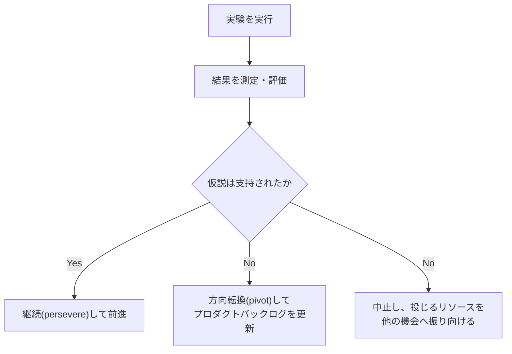

**評価の際に注意すべきポイント**:

| ポイント | 説明 |
|---|---|
| バニティメトリクスを避ける | 見た目は良いが意思決定に使えない指標(総ページビュー等)ではなく、アクショナブルな指標を使う[16] |
| 統計的な有意性を考慮する | サンプル数が少ない実験で断定的な結論を出さない |
| インパクトの大きさを評価する | 統計的に有意でも、ビジネスへのインパクトが小さければ優先度は下がる |

**進め方(ステップバイステップ)**:
1. 実験前に定義した成功基準と、実際の結果を照合する
2. 結果がビジネスにどの程度のインパクトを持つかを定量的に評価する
3. 「継続(persevere)」「方向転換(pivot)」「中止」のいずれかを判断する
4. 判断結果と根拠をステークホルダーに共有し、プロダクトバックログに反映する

**ベストプラクティス**:
- 実験結果が「期待外れ」だったとしても、それ自体が価値ある学習です。POは実験の失敗を「悪いニュース」としてではなく「安価に得られた重要な情報」としてチームやステークホルダーに伝える姿勢が求められます。
- 「Five Whys(なぜなぜ分析)」のような手法を使って、実験結果の背後にある根本原因を掘り下げることも有効です[16]。

---

## 12. カテゴリー5: 高度なプロダクトバックログマネジメント (Advanced Product Backlog Management)

このセクションは、公式カテゴリー「5. Advanced Product Backlog Management」のLO5.1~LO5.4を扱います[2]。

### 12.1 LO5.1: スクラムチームや組織がアウトプットよりもアウトカムとインパクトを重視しているかどうかを査定する

> 5.1 assess how Scrum Teams and/or organizations emphasize outcomes and impact over output.[2]

**詳細な説明**: 「アウトプット(機能を出荷した数)」と「アウトカム(顧客行動・ビジネス指標の変化)」の違いを理解し、組織がどちらを重視しているかを査定する力が求められます。

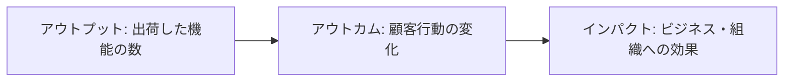

Teresa TorresはOpportunity Solution Treeの文脈で「アウトカット(output)」ではなく「プロダクトアウトカム(顧客行動における測定可能な変化)」を出発点にすべきだと強調しています[17]。

**アウトプット偏重の兆候チェックリスト**:

| 兆候 | 説明 |
|---|---|
| ベロシティやストーリーポイント消化数だけが評価指標になっている | 顧客への価値提供が測られていない |
| ロードマップが機能名の羅列になっている | なぜその機能が必要かの説明(アウトカムとの紐付け)がない |
| リリース後の効果測定が行われていない | 出荷して終わり、その後の顧客行動の変化を追っていない |

**進め方(ステップバイステップ)**:
1. 現在のロードマップやプロダクトバックログが「機能ベース」か「アウトカムベース」かを確認する
2. チームのベロシティ以外に、顧客行動やビジネス指標を追跡する仕組みがあるかを確認する
3. 上記チェックリストを用いて、自組織のアウトプット偏重度を査定する
4. 必要に応じて、プロダクトゴールやSprint Goalをアウトカムベースの表現に書き換える

**ベストプラクティス**:
- ロードマップの各項目に「これによってどんな顧客行動の変化・ビジネス指標の変化を期待するか」を必ず併記する習慣をつけましょう。

### 12.2 LO5.2: プロダクトバックログを並び替える技術を最低3つ比較する

> 5.2 compare at least three techniques to order a Product Backlog.[2]

**詳細な説明**: プロダクトバックログの並び替え(ordering)には複数の技術があります。CSP-POでは最低3つを比較できることが求められます。

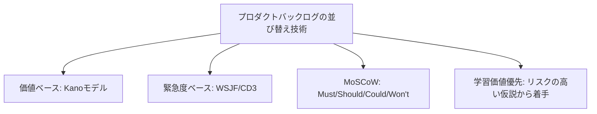

| 技術 | 概要 | 出典 |
|---|---|---|
| Kanoモデル | 機能を「当たり前品質」「一元的品質」「魅力的品質」等に分類し、顧客満足度への影響で優先順位付けする | Noriaki Kano, 1984年[18] |
| WSJF/CD3(Cost of Delay Divided by Duration) | Cost of Delayを所要期間で割った値が高い順に着手する | Don Reinertsen(概念)、Joshua Arnold(CD3の命名) [14] [15] |
| MoSCoW法 | Must have(必須)、Should have(重要)、Could have(あれば良い)、Won't have(今回は含めない)の4段階に分類する | 業界で広く使われる優先順位付けの古典的手法 |
| 学習価値優先 | 最もリスクの高い(不確実性の高い)仮説を検証できる項目から着手する | Lean Startup的な考え方[16] |

**WSJF/CD3の計算式**:

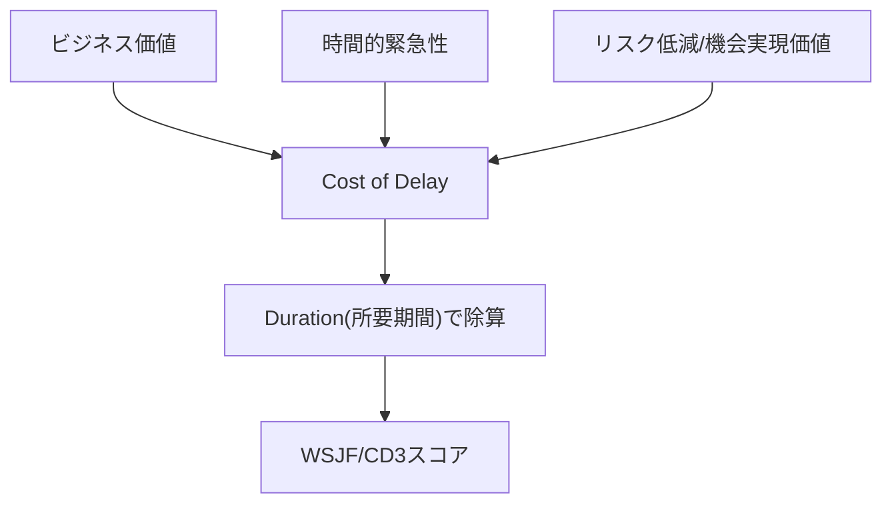

> CD3を使うと、異なる価値・緊急性を持つ機会を共通の尺度で比較でき、所要期間が異なる場合にも対応できる[15]。

**進め方(ステップバイステップ)**:
1. 現在のプロダクトバックログの並び替えロジックを確認する(直感的な並び替えになっていないか)
2. 上記4技術のうち3つを選び、同じバックログに実際に適用してみる
3. それぞれの技術で並び替えた結果の違いを比較する
4. 状況(不確実性の高さ、ステークホルダーの構成、経済的なプレッシャーの度合い)に応じて最適な技術、あるいは複数の技術の組み合わせを選ぶ

**ベストプラクティス**:
- 単一の技術に固執せず、状況に応じて技術を使い分けることが、CSP-POレベルの高度なバックログマネジメントの本質です。
- Cost of Delayの相対的な見積もりだけでも、直感的な優先順位付けよりはるかに客観的な議論ができるようになります[14]。

### 12.3 LO5.3: 1人以上のステークホルダーに対してプロダクトバックログの並び順を擁護する

> 5.3 defend the order of a Product Backlog with one or more stakeholders.[2]

**詳細な説明**: これはEvaluationレベルの学習目標で、単に並び替えができるだけでなく、その根拠をステークホルダーに説明し、納得してもらう(defend、擁護する)コミュニケーション力が求められます。

**進め方(ステップバイステップ)**:
1. プロダクトバックログの並び順の根拠(使用した技術、Cost of Delayなどの数値)を整理する
2. ステークホルダーが最も気にするであろう反論を事前に想定する
3. 数値やデータだけでなく、プロダクトゴールとの関連性でストーリーとして説明する
4. ステークホルダーからの反論・懸念に対し、データに基づいて誠実に応答する
5. 合意した並び順、あるいは修正した並び順を記録し、透明性を保つ

**ベストプラクティス**:
- 「なぜこの順番なのか」を説明する際は、「私が決めた」ではなく「これこれの経済的根拠(Cost of Delayなど)に基づいて、こういう判断をした」という形で語ることで、感情的な対立を避けやすくなります。
- ステークホルダーの反論の中に、POが見落としていた重要な情報が含まれている場合もあります。「擁護する」ことは「意見を曲げない」ことと同義ではなく、正当な理由があれば並び順を修正する柔軟性も必要です。

### 12.4 LO5.4: 自分のスクラムチームのプロダクトバックログをリファインメントする能力を評価する

> 5.4 evaluate their Scrum Team's ability to effectively refine the Product Backlog.[2]

**詳細な説明**: プロダクトバックログリファインメント(Refinement)は、Scrum Guideにおいて「Product Backlog項目に詳細、見積もり、順序を追加する、継続的な活動」と定義されています[3]。CSP-POでは、自チームがこのリファインメントを効果的に行えているかを評価する自己省察力が求められます。

**リファインメントの効果性を評価するチェックリスト**:

| 評価項目 | 良い兆候 | 悪い兆候 |
|---|---|---|
| 頻度 | 定期的に(例: 毎Sprint)実施されている | 場当たり的、または全く行われていない |
| 参加者 | POと開発者が協働して詳細化している | POのみ、または開発者のみで進めている |
| アウトプットの質 | Sprint Planningで着手可能な粒度になっている | 大きすぎる/曖昧すぎる項目が残っている |
| ステークホルダーの声の反映 | 顧客リサーチ・実験結果が反映されている | 過去の決定がそのまま放置されている |

**進め方(ステップバイステップ)**:
1. 上記チェックリストを使って、自チームの現在のリファインメントの状態を評価する
2. 弱点(例: 参加者が偏っている、頻度が不安定)を特定する
3. レトロスペクティブでチームと一緒に改善策を議論する
4. 改善策を次のSprintから試し、再評価する

**ベストプラクティス**:
- リファインメントは「Sprintの一部」であり、追加のイベントというよりは継続的な活動として捉えるべきです[3]。
- 複数チームでプロダクトバックログを共有している場合、Nexusフレームワークが定義する「Cross-Team Refinement」のように、依存関係を横断的に扱う場を設けることが有効です[9]。

---

## 13. ベストプラクティス総合チェックリスト

以下は、これまでの各カテゴリーで紹介したベストプラクティスを横断的に整理した、実務で使えるチェックリストです。

### 13.1 ステークホルダー・チームマネジメント

| # | チェック項目 |
|---|---|
| 1 | 対立するステークホルダーの利害と立場を分けて可視化しているか |
| 2 | 新チーム発足時にTuckmanモデルを踏まえたチームビルディングの時間を確保しているか[10] [11] |
| 3 | Definition of Doneの品質期待値をチーム発足時から明文化しているか[3] |
| 4 | 複数チームを担当する場合、単一のプロダクトゴール・プロダクトバックログを維持しているか[8] [9] |
| 5 | 委任(delegation)する際に、期待される成果・制約・権限を明確にしているか[8] |

### 13.2 戦略・計画

| # | チェック項目 |
|---|---|
| 6 | ビジネスモデルをBusiness Model Canvas等で定期的に見直しているか[12] |
| 7 | 競合分析(Porterのファイブフォース等)を定期的に更新しているか[13] |
| 8 | リリース戦略をビジネスモデルの特性に合わせて選択しているか |
| 9 | プロダクトローンチゴールを計測可能な形で最低3つ以上設定しているか |

### 13.3 プロダクトエコノミクス

| # | チェック項目 |
|---|---|
| 10 | Cost of Delayを相対的にでも定量化する習慣があるか[14] |
| 11 | WSJF/CD3のような経済的な優先順位付け手法を使っているか[15] |
| 12 | 反復的・漸進的な投資モデル(Build-Measure-Learn)を採用しているか[16] |
| 13 | 資金提供の仕組みがアジャイルな方向転換を妨げていないか確認しているか |

### 13.4 顧客理解と仮説検証

| # | チェック項目 |
|---|---|
| 14 | 継続的な顧客リサーチの仕組み(Opportunity Solution Tree等)を持っているか[17] |
| 15 | リスクの高い前提から優先的に実験で検証しているか[16] |
| 16 | バニティメトリクスではなくアクショナブルなメトリクスで実験を評価しているか[16] |

### 13.5 プロダクトバックログマネジメント

| # | チェック項目 |
|---|---|
| 17 | アウトプットではなくアウトカム・インパクトを重視した指標を使っているか[17] |
| 18 | 複数の並び替え技術を状況に応じて使い分けているか |
| 19 | 並び順の根拠をステークホルダーに説明できる状態にしているか |
| 20 | リファインメントの効果性を定期的に自己評価しているか[3] |

---

## 14. よくある誤解とアンチパターン

CSP-POレベルの学習者が陥りやすい誤解・アンチパターンを整理します。

| # | 誤解・アンチパターン | 正しい理解 |
|---|---|---|
| 1 | 「複数チームを担当するPOは、各チームのバックログを別々に管理すればよい」 | Scrumの原則は「one product, one Product Backlog」であり、複数チームでも単一のバックログを維持すべき[9] |
| 2 | 「新チームの立ち上げは、要件をきっちり固めることから始めるべき」 | Scrumは経験主義に基づき、要件は継続的に進化することを前提とする[3] |
| 3 | 「Cost of Delayは厳密に計算できないと使えない」 | 相対的・概算での算出でも、優先順位付けの議論を大きく改善できる[14] |
| 4 | 「顧客インタビューは大規模なプロジェクトとして年に1回行えば十分」 | 継続的ディスカバリー(週次~月次の対話)がプロダクトの質を継続的に高める[17] |
| 5 | 「実験が失敗したら、その機能開発は無駄だった」 | 失敗した実験も、安価に得られた重要な学習である[16] |
| 6 | 「ベロシティが高いチーム=価値を生んでいるチーム」 | アウトプットの量とアウトカムの質は別物であり、混同すべきではない[17] |
| 7 | 「ビジネスモデルは一度決めたら変更すべきではない」 | 市場環境の変化に応じて定期的に見直すべきツールである[12] |
| 8 | 「PO一人がすべての意思決定を担うべきで、委任は責任放棄である」 | 適切な委任は、複数チームをスケールする上で不可欠なスキルである[8] |
| 9 | 「ステークホルダーとの対立は避けるべきものであり、起きたら失敗」 | 対立は自然な現象であり、ファシリテーションの質を高める学習機会である |
| 10 | 「プロダクトバックログの並び順は、一度決めたら変えるべきではない」 | 市場・データの変化に応じて継続的にリファインメント・並び替えを行うべき[3] |

---

## 15. 認定後のキャリアパスと更新

### 15.1 CSP-PO取得後に開けるキャリアパス

公式ページによれば、CSP-PO取得は以下のキャリアパスへの重要なマイルストーンとなります[1]。

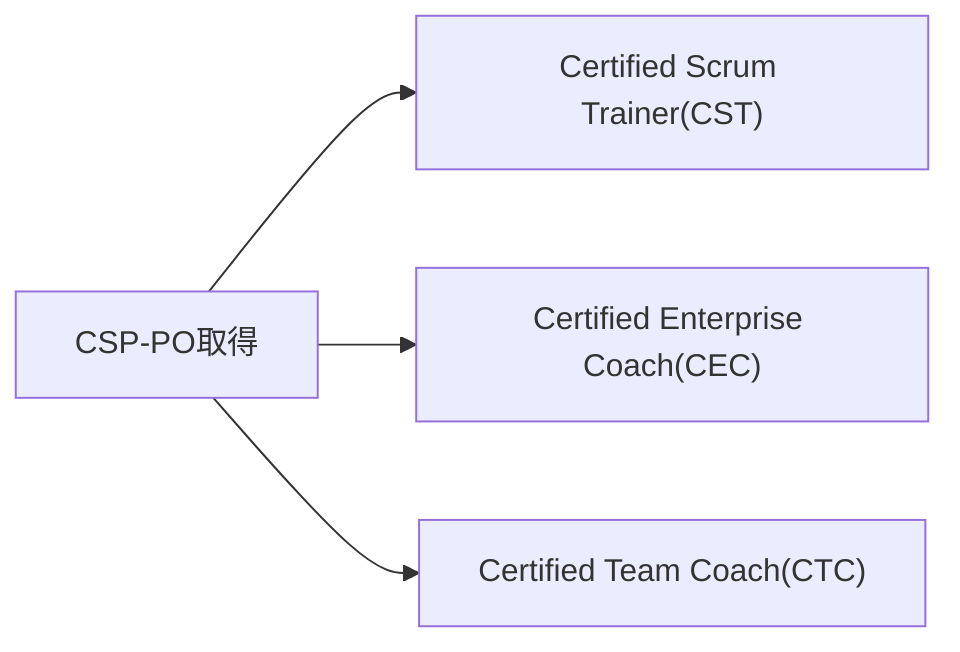

| 資格 | 概要 |
|---|---|
| Certified Scrum Trainer®(CST) | Scrum Alliance公認のトレーナーとして、CSM・CSPOなどの認定コースを教える資格[1] [23] |
| Certified Enterprise Coach(CEC) | 組織全体のアジャイル変革をコーチングする、Scrum Allianceの最高位のコーチ資格の1つ[1] [24] |
| Certified Team Coach(CTC) | チームレベルのアジャイルコーチングを専門とする資格[1] [25] |

### 15.2 CSP-PO取得のその他のメリット

公式ページでは、CSP-PO取得の主なメリットとして以下が挙げられています[1]。

- 就職機会と給与ポテンシャルの向上
- CST・CEC・CTCへのゲートウェイ・マイルストーンの確立
- Comparative Agility®(世界最大級のアジャイルアセスメント・改善プラットフォーム)へのプレミアム無料サブスクリプション[1] [19] [20]

### 15.3 更新(Renewal)の仕組み

CSP-POは2年ごとに更新が必要です[1]。公式FAQによれば、更新には以下が必要です。

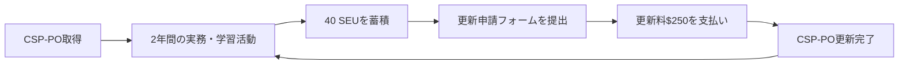

> CSP-POの整合性と価値を維持するため、2年ごとに更新すること。これには、40 Scrum Education Units(SEU)の蓄積、Scrum Alliance公式サイトでの更新申請の完了、$250の更新料の支払いが含まれる[1] [21] [22]。

### 15.4 Scrum Education Units(SEU)の稼ぎ方

SEUは、書籍を読む、ウェビナーを視聴する、イベントに参加するなど、継続的な学習活動によって蓄積されます[1]。Scrum Alliance公式リソースライブラリの記事や動画にも、閲覧するだけでSEUが付与されるものがあります[21]。

### ベストプラクティス

- SEUは更新期限の直前にまとめて稼ごうとするのではなく、日常的な学習活動(業界記事の閲覧、社内勉強会での登壇など)を通じて継続的に蓄積する習慣をつけましょう。
- Comparative Agilityのプレミアムアクセスを活用し、自チーム・自組織のアジャイル成熟度を定期的にアセスメントすることは、CSP-POが学んだ「評価・査定(assess)」スキルを実務で継続的に活かす良い機会になります[19] [20]。

---

## 16. まとめ

CSP-PO(Certified Scrum Professional® - Product Owner)は、Scrum AllianceのProduct Owner Trackにおける最高位の認定であり、以下の5つのカテゴリー・31の学習目標を通じて、経験豊富なプロダクトオーナーが直面する複雑な現実の課題に対応する力を養います[2]。

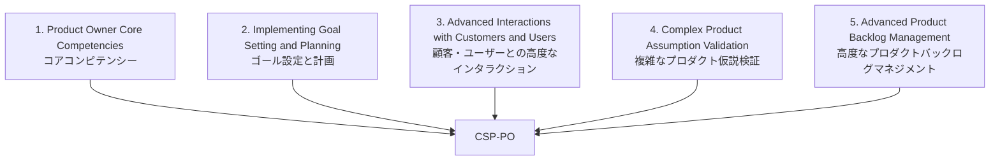

本ガイドで扱った主要なポイントを振り返ると:

1. **ステークホルダー対話とチーム立ち上げ**: 対立の解消、新チームの段階的な立ち上げ、複数チームにまたがるスケーリングパターンの使い分けが求められる
2. **戦略とプロダクトエコノミクス**: ビジネスモデル、競合分析、リリース戦略、そしてCost of Delay・WSJFといった経済的な優先順位付け手法の理解と実践が中核となる
3. **顧客理解と仮説検証**: 継続的ディスカバリーとOpportunity Solution Tree、そして最小限の実験による仮説検証が、Lean Startup的なアプローチとして統合される
4. **高度なバックログマネジメント**: アウトプットではなくアウトカムを重視し、複数の並び替え技術を使い分け、その根拠をステークホルダーに擁護できることが求められる

CSP-POは、単なる知識の証明ではなく、Bloom's Taxonomyの高次レベル(分析・統合・評価)に相当する「実務での判断力」を検証する認定です[2]。取得後は、Certified Scrum Trainer®、Certified Enterprise Coach、Certified Team Coachといった、より広い範囲でアジャイル変革をリードするキャリアパスへの道が開かれます[1]。

---

## 17. 参考文献・出典一覧

| # | 出典 | URL |
|---|---|---|
| [1] | Scrum Alliance, "Certified Scrum Professional Product Owner (CSP-PO) Certification" | https://www.scrumalliance.org/get-certified/product-owner-track/certified-scrum-professional-product-owner |
| [2] | Scrum Alliance, "CSP-PO Learning Objectives" (January 2022, PDF) | https://www.scrumalliance.org/media/certifications/los/csp_po_learning_objectives_2022.pdf |
| [3] | Ken Schwaber and Jeff Sutherland, "The Scrum Guide" (2020) | https://scrumguides.org/scrum-guide.html |
| [4] | "Manifesto for Agile Software Development" | https://agilemanifesto.org/ |
| [5] | Scrum Alliance, "Scrum Values" | https://www.scrumalliance.org/about-scrum/values |
| [6] | Scrum Alliance, "Advanced Certified Scrum Product Owner (A-CSPO)" | https://www.scrumalliance.org/get-certified/product-owner-track/advanced-certified-scrum-product-owner |
| [7] | Scrum Alliance, "Certified Scrum Product Owner (CSPO)" | https://www.scrumalliance.org/get-certified/product-owner-track/certified-scrum-product-owner |
| [8] | Jim Schiel, "What to Do When You're Asked to Be the Product Owner for Multiple Teams," Scrum Alliance Resource Library | https://resources.scrumalliance.org/article/youre-asked-product-owner-multiple-teams |
| [9] | Scrum.org, "The Nexus Guide" | https://www.scrum.org/resources/online-nexus-guide |
| [10] | "Tuckman's stages of group development," Wikipedia(Bruce Tuckman, 1965/1977年の研究に基づく) | https://en.wikipedia.org/wiki/Tuckman%27s_stages_of_group_development |
| [11] | MindTools, "Forming, Storming, Norming, and Performing" | https://www.mindtools.com/abyj5fi/forming-storming-norming-and-performing/ |
| [12] | Strategyzer, "The Business Model Canvas"(Alexander Osterwalder & Yves Pigneur) | https://www.strategyzer.com/library/the-business-model-canvas |
| [13] | "Porter's five forces analysis," Wikipedia(Michael E. Porter, 1979年) | https://en.wikipedia.org/wiki/Porter%27s_five_forces_analysis |
| [14] | Black Swan Farming, "Cost of Delay"(Don Reinertsenの理論に基づく) | https://blackswanfarming.com/cost-of-delay/ |
| [15] | Black Swan Farming, "WSJF – Weighted Shortest Job First" | https://blackswanfarming.com/wsjf-weighted-shortest-job-first/ |
| [16] | The Lean Startup, "Methodology"(Eric Ries) | https://theleanstartup.com/principles |
| [17] | Product Talk, "Opportunity Solution Trees"(Teresa Torres) | https://www.producttalk.org/opportunity-solution-trees/ |
| [18] | "Kano model," Wikipedia(Noriaki Kano, 1984年) | https://en.wikipedia.org/wiki/Kano_model |
| [19] | Scrum Alliance, "Comparative Agility Member Benefit" | https://www.scrumalliance.org/member-benefits/comparative-agility |
| [20] | Comparative Agility, 公式サイト | https://www.comparativeagility.com/ |
| [21] | Scrum Alliance, "Scrum Education Units (SEUs)" | https://www.scrumalliance.org/get-certified/scrum-education-units |
| [22] | Scrum Alliance, "Renewing Certifications" | https://www.scrumalliance.org/get-certified/renewing-certifications |
| [23] | Scrum Alliance, "Certified Scrum Trainer®" | https://www.scrumalliance.org/get-certified/trainers |
| [24] | Scrum Alliance, "Certified Enterprise Coach" | https://www.scrumalliance.org/agile-coaching/cec |
| [25] | Scrum Alliance, "Certified Team Coach" | https://www.scrumalliance.org/agile-coaching/ctc |
| [26] | Scrum Alliance, "Product Roadmaps: Your Secret Weapon for Success" | https://resources.scrumalliance.org/article/product-roadmaps-secret-weapon-success |

---

*本ガイドは、2026年8月時点でScrum Alliance公式サイトから取得した一次情報源に基づいて作成されています。認定要件・学習目標は改訂される可能性があるため、実際の受験・受講にあたっては、必ずScrum Alliance公式サイトの最新情報をご確認ください。*

[1]: https://www.scrumalliance.org/get-certified/product-owner-track/certified-scrum-professional-product-owner
[2]: https://www.scrumalliance.org/media/certifications/los/csp_po_learning_objectives_2022.pdf
[3]: https://scrumguides.org/scrum-guide.html
[4]: https://agilemanifesto.org/
[5]: https://www.scrumalliance.org/about-scrum/values
[6]: https://www.scrumalliance.org/get-certified/product-owner-track/advanced-certified-scrum-product-owner
[7]: https://www.scrumalliance.org/get-certified/product-owner-track/certified-scrum-product-owner
[8]: https://resources.scrumalliance.org/article/youre-asked-product-owner-multiple-teams
[9]: https://www.scrum.org/resources/online-nexus-guide
[10]: https://en.wikipedia.org/wiki/Tuckman%27s_stages_of_group_development
[11]: https://www.mindtools.com/abyj5fi/forming-storming-norming-and-performing/
[12]: https://www.strategyzer.com/library/the-business-model-canvas
[13]: https://en.wikipedia.org/wiki/Porter%27s_five_forces_analysis
[14]: https://blackswanfarming.com/cost-of-delay/
[15]: https://blackswanfarming.com/wsjf-weighted-shortest-job-first/
[16]: https://theleanstartup.com/principles
[17]: https://www.producttalk.org/opportunity-solution-trees/
[18]: https://en.wikipedia.org/wiki/Kano_model
[19]: https://www.scrumalliance.org/member-benefits/comparative-agility
[20]: https://www.comparativeagility.com/
[21]: https://www.scrumalliance.org/get-certified/scrum-education-units
[22]: https://www.scrumalliance.org/get-certified/renewing-certifications
[23]: https://www.scrumalliance.org/get-certified/trainers
[24]: https://www.scrumalliance.org/agile-coaching/cec
[25]: https://www.scrumalliance.org/agile-coaching/ctc
[26]: https://resources.scrumalliance.org/article/product-roadmaps-secret-weapon-success
