# Certified Scrum Professional® ScrumMaster (CSP®-SM) 完全学習ガイド

> 世界トップクラスのソフトウェアエンジニア兼スクラムマスターの視点から、Scrum Alliance® の **Certified Scrum Professional® ScrumMaster（CSP®-SM）** の出題範囲（Learning Objectives）を、初学者にもわかりやすくステップバイステップで解説する学習ガイドです。各項目には具体的なベストプラクティスと、その根拠となる参考情報源の URL を付記しています。

---

## 目次

0. [このガイドについて](#0-このガイドについて)
1. [CSP-SM とは何か — 全体像](#1-csp-sm-とは何か--全体像)
2. [取得要件（Requirements）](#2-取得要件requirements)
3. [Bloom's Taxonomy — 学習目標の読み方](#3-blooms-taxonomy--学習目標の読み方)
4. [CSP-SM Learning Objectives 全体マップ](#4-csp-sm-learning-objectives-全体マップ)
5. [カテゴリ1: Lean, Agile, and Scrum](#5-カテゴリ1-lean-agile-and-scrum-lo-11--14)
6. [カテゴリ2: Scrum Master Core Competencies](#6-カテゴリ2-scrum-master-core-competencies-lo-21--28)
7. [カテゴリ3: Service to the Scrum Team](#7-カテゴリ3-service-to-the-scrum-team-lo-31--36)
8. [カテゴリ4: Service to the Product Owner](#8-カテゴリ4-service-to-the-product-owner-lo-41--42)
9. [カテゴリ5: Service to the Organization](#9-カテゴリ5-service-to-the-organization-lo-51--57)
10. [カテゴリ6: Advanced Scrum Mastery](#10-カテゴリ6-advanced-scrum-mastery-lo-61--62)
11. [ベストプラクティス総まとめ](#11-ベストプラクティス総まとめ)
12. [よくある誤解・アンチパターン](#12-よくある誤解アンチパターン)
13. [認定後のキャリアパス](#13-認定後のキャリアパス)
14. [まとめ](#14-まとめ)
15. [参考文献（Sources）](#15-参考文献sources)

---

## 0. このガイドについて

このガイドは、以下の一次・準一次情報源を中心とした情報源に基づいて作成しています。原典が公開されている項目は原典を優先し、概説の把握を目的として Wikipedia・Mindtools・第三者ニュースレターなどの二次資料も補助的に参照しています（個別の出典は末尾の参考文献一覧を参照）。

- Scrum Alliance が公式に発行している **CSP-SM Learning Objectives（2022年1月版, PDF）**
- Scrum Alliance 公式サイトの CSP-SM 紹介ページ、A-CSM/CSM 紹介ページ、SEU・更新制度ページ
- Manifesto for Agile Software Development（Agile Manifesto）
- Scrum Guide（2020年版, scrumguides.org）
- Lean Thinking / Toyota Production System(TPS) に関する一次・準一次情報源
- ICF（International Coaching Federation）の Core Competencies
- Nexus Guide、LeSS（Large-Scale Scrum）、Scrum@Scale Guide などスケーリングフレームワークの公式ガイド
- Kotter の 8-Step Change Model、Prosci ADKAR モデルなど組織変革理論の一次・準一次情報源

Scrum Alliance 自身が Learning Objectives 文書内で明言している通り、**「Scrum の実装はチームごとに異なるが、フレームワークの根幹は常に同じである」** という前提のもとで、このガイドは書かれています。CSP-SM の教育コースは、各トレーナー（Path to CSP Educator）が独自の教材・演習を用いて実施しますが、本ガイドがカバーする Learning Objectives（LO）は、どのコースでも共通してカバーされるべき内容です。

> **対象読者**: CSM → A-CSM → CSP-SM とキャリアを積み上げていきたい方、CSP-SM のコース受講を検討している方、すでに A-CSM を保有しコース受講の準備をしている方。

---

## 1. CSP-SM とは何か — 全体像

CSP-SM（Certified Scrum Professional® ScrumMaster）は、Scrum Alliance の **Scrum Master トラックにおける最上位の認定資格** です。公式サイトでは次のように位置づけられています。

> "Become a top-tier scrum master who launches new scrum teams, scales scrum across teams and organizations, and coaches all levels of an organization to be more agile."

つまり CSP-SM は、単に1つのチームで Scrum を回せることを証明する資格ではなく、**新しいチームの立ち上げ、複数チームへのスケーリング、組織のあらゆる階層へのコーチング** ができることを証明する資格です。

### 1.1 Scrum Master トラックの全体像

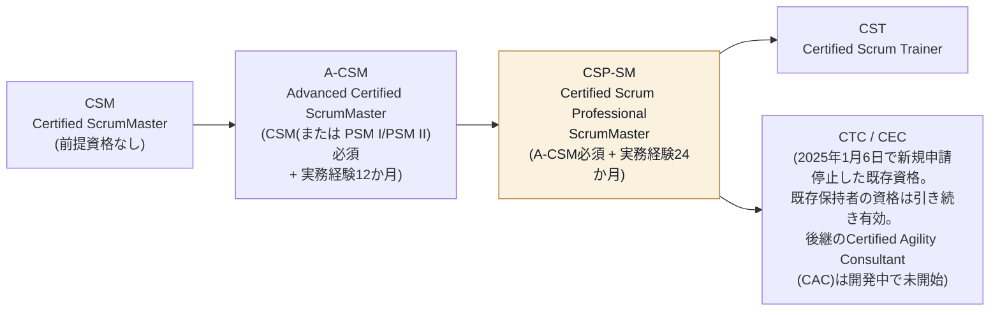

CSM が「Scrumの基礎を実践できる」段階、A-CSM が「ファシリテーション・コーチングの基礎とスケーリングの入口を身につける」段階だとすれば、CSP-SM は「複雑な組織課題に対して体系的に介入できる」段階です。CSP-SM の学習範囲は Lean Thinking の起源にまで遡り、複数チームのスケーリング、組織開発、そして「アドバンスド・スクラム・マスタリー」という個人のキャリア開発戦略にまで及びます。

### 1.2 CSP-SM で学ぶこと

Scrum Alliance 公式ページでは、CSP-SM コースで学ぶ主要領域として次を挙げています。

- Lean Thinking の起源と中核概念
- ファシリテーションとコーチングの高度なスキル
- チームダイナミクスの強化、新しい Scrum チームの立ち上げ計画、スキルギャップを埋める戦略
- プロダクトゴールからプロダクトバックログを構築する技法、複雑・複数チームバックログの管理
- Scrum 導入を組織的に進めるための体系的アプローチ、組織的な障害への対処、最新の Scrum Guide の定義がもたらす便益の評価
- スクラムマスタリーに向けた個人開発戦略、メンタリング経験

これらは後述する6つの LO カテゴリにそのまま対応しています。

---

## 2. 取得要件（Requirements）

CSP-SM の取得要件は、Scrum Alliance 公式ページに以下のように明記されています。

| # | 要件 | 詳細 |
|---|------|------|
| 1 | A-CSM 保有 | Active でも Expired でも可。CSP-SM 取得時に CSM・A-CSM ともに自動更新される |
| 2 | コースの全構成要素を修了 | トレーナーが定める事前課題・事後課題を含む場合がある |
| 3 | CSP-SM License Agreement への同意 | Scrum Alliance の会員プロフィールも完成させる必要がある |
| 4 | 実務経験の証明 | 過去5年以内で、Scrum Master のアカウンタビリティに特化した実務経験24か月以上 |
| 5 | 資格の維持 | Scrum Education Units（SEU）を獲得し、2年ごとに資格更新 |

### 2.1 重要な注意点：コース受講と資格取得は別タイミングでよい

Scrum Alliance の FAQ では、次のように明記されています。

> "You can take the course without the 24 months of experience, but you cannot get the certification until you have completed and recorded the 24 months of experience."

つまり **A-CSM を取得した時点でコースを受講することは可能** ですが、**認定証が発行されるのは24か月分の実務経験がプロフィールに記録・検証された後** です。これは上位トラックへ進む多くの実務者が誤解しやすいポイントです。なお前提資格はトラックごとに分かれており、CSP-SM の前提資格は **A-CSM**、CSP-PO の前提資格は **A-CSPO** です。

### 2.2 取得までのプロセス（フローチャート）

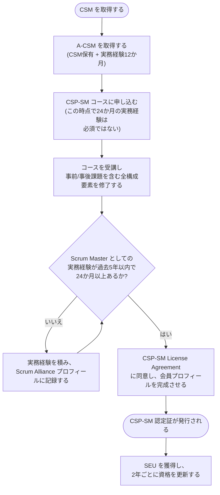

### 2.3 A-CSM 側の前提条件（参考）

CSP-SM のさらに前段階である A-CSM の取得要件も押さえておくと、全体像の理解が深まります。

| 要件 | 内容 |
|------|------|
| 前提資格 | CSM（Active/Expired 可）。または Scrum.org の PSM I/PSM II で代替可能（A-CSM のみの特例） |
| コース時間 | 最低16時間のA-CSMコース受講 |
| 実務経験 | 過去5年以内でScrum Masterとしての実務経験12か月以上 |

---

## 3. Bloom's Taxonomy — 学習目標の読み方

CSP-SM Learning Objectives 文書は、すべての学習目標を **Bloom's Taxonomy（ブルームの分類学）** に基づいて記述しています。公式文書には次の一文があります。

> "Please mentally start each Learning Objective with the following phrase: 'Upon successful validation of the CSP-SM Learning Objectives, the learner will be able to …'"

つまり、たとえば「1.1 describe the origins of Lean Thinking」は、**「CSP-SM の学習目標の達成が確認された段階で、学習者は Lean Thinking の起源を説明できる」** と読み替える必要があります。

### 3.1 Bloom's Taxonomy の6段階

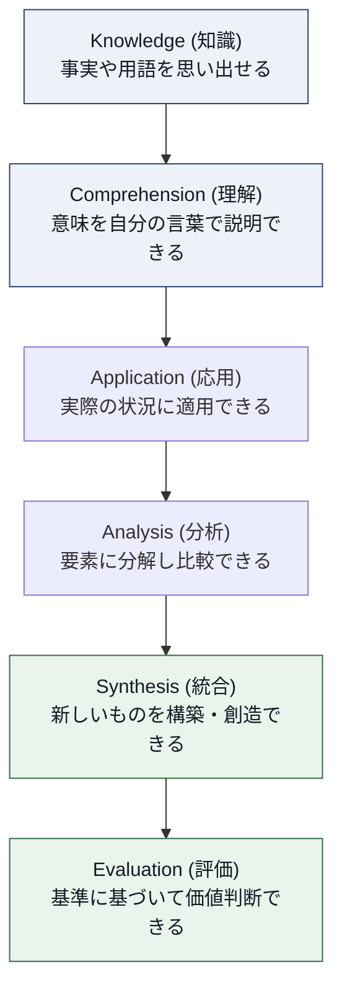

### 3.2 動詞から認知レベルを読み解くコツ

CSP-SM の LO は下位レベル（Knowledge/Comprehension）から上位レベル（Synthesis/Evaluation）まで幅広く分布しています。各 LO で使われている動詞を見ることで、要求されている認知レベルのヒントが得られます。

| 動詞の例 | 対応する認知レベルの目安 |
|---|---|
| describe / list / relate | Knowledge〜Comprehension |
| apply / illustrate / experiment | Application |
| differentiate / compare / appraise / analyze | Analysis |
| create / develop / plan / propose / outline | Synthesis |
| evaluate / summarize（価値判断を伴う場合） | Evaluation |

CSP-SM の LO には「plan the launch of a new Scrum Team」「create a coaching agreement」のような **Synthesis レベルの動詞** が多く含まれています。これは A-CSM までの「知っている・実践できる」段階から、CSP-SM では **「ゼロから設計・構築できる」段階への移行** が求められていることを意味します。

---

## 4. CSP-SM Learning Objectives 全体マップ

CSP-SM の Learning Objectives は、公式文書（2022年1月版）において以下の6カテゴリ・29個の学習目標に整理されています。

| # | カテゴリ | サブカテゴリ | LO数 |
|---|---|---|---|
| 1 | Lean, Agile, and Scrum | — | 4 |
| 2 | Scrum Master Core Competencies | Facilitation / Coaching and Training | 4 + 4 |
| 3 | Service to the Scrum Team | Team Dynamics / Scrum Teams | 2 + 4 |
| 4 | Service to the Product Owner | — | 2 |
| 5 | Service to the Organization | Organizational Development / Scaling Scrum | 4 + 3 |
| 6 | Advanced Scrum Mastery | — | 2 |

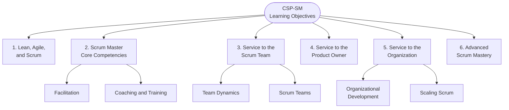

なお、このガイドが根拠とする「Individual Path to CSP-SM」の教育者は、公式文書に沿う限り追加のトピック（ancillary topics）を独自に加えることが認められています。ただし **その場合は明示的にアンシラリー・トピックであると示さなければならない** とされており、この点も CSP-SM の教育設計における重要なルールです。

---

## 5. カテゴリ1: Lean, Agile, and Scrum (LO 1.1 – 1.4)

Scrum は Lean Thinking を土台にした経験主義（Empiricism）のフレームワークです。CSP-SM ではまず、Scrum の背後にある思想の "なぜ" を理解することが求められます。

### 5.1 LO 1.1: Lean Thinking の起源を説明できる

Lean Thinking の直接の起源は、**トヨタ生産方式（Toyota Production System, TPS）** です。トヨタグループの創始者・豊田佐吉、その息子でトヨタ自動車工業の創業者である豊田喜一郎、そして「トヨタ生産方式の父」と呼ばれる **大野耐一（Taiichi Ohno）** が中心となって、戦後日本の資源制約の中で確立しました。

- 大野耐一は「ムダ（muda）」の排除を体系化し、後述する7つのムダを定義しました。
- トヨタの現場文化として **「現地現物」（genchi genbutsu）**、つまり「机上の空論ではなく、自分の目で現場を見て判断する」という原則があります。
- 大野耐一の思想は、ジェームズ・ウォマックとダニエル・ジョーンズによる著書 *The Machine That Changed the World*（1990）や *Lean Thinking*（1996）を通じて西側諸国に広く紹介され、「Lean」という言葉が定着しました。

> **ベストプラクティス**: Scrum Master は Sprint Retrospective やインペディメント対応の場で「現地現物」を実践しましょう。ダッシュボードの数字だけで判断するのではなく、実際に開発者のペアプログラミングやデプロイ作業に同席し、一次情報から状況を把握する習慣を持つことが推奨されます。

### 5.2 LO 1.2: Lean Thinking の中核概念と Scrum への適用を説明できる

ウォマック＆ジョーンズは *Lean Thinking* の中で、Lean の5つの原則を提示しました。

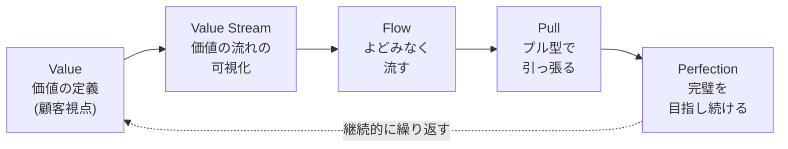

| Lean の原則 | Scrum における対応 |
|---|---|
| Value（価値） | Product Goal / Product Backlog の並び替え基準としての顧客価値 |
| Value Stream（価値の流れ） | Definition of Done による「完了」の可視化、アイデアから価値提供までのリードタイム |
| Flow（流れ） | Sprint という短いタイムボックスで継続的に増分を生み出す仕組み |
| Pull（プル） | Sprint Planning で Developers がプロダクトバックログから "引っ張る" 形で作業を選ぶこと |
| Perfection（完璧の追求） | Sprint Retrospective による継続的改善（Kaizen） |

> **ベストプラクティス**: Scrum イベントを Lean の原則に接続して説明できると、"なぜこの儀式が必要なのか" を懐疑的なステークホルダーに説明する際に説得力が増します。特に Sprint Retrospective は Lean の "Perfection" の原則そのものであることを強調すると、形骸化を防ぐ議論のきっかけになります。

### 5.3 LO 1.3: プロダクト開発における5つ以上のムダを、製造業における7つのムダに関連づけられる

大野耐一が定義したトヨタ生産方式における **7つのムダ（TIMWOOD）** は以下の通りです。

| 英語 | 日本語 | 頭文字 |
|---|---|---|
| Transportation | 運搬のムダ | T |
| Inventory | 在庫のムダ | I |
| Motion | 動作のムダ | M |
| Waiting | 手待ちのムダ | W |
| Overproduction | 造りすぎのムダ | O |
| Overprocessing | 加工そのもののムダ | O |
| Defects | 不良・手直しのムダ | D |

これをソフトウェア開発向けに翻訳したのが、Mary Poppendieck と Tom Poppendieck による著書 *Lean Software Development: An Agile Toolkit*（2003）および *Implementing Lean Software Development*（2006）です。両者は製造業の7つのムダを、ソフトウェア開発の文脈における7つのムダにマッピングしました。

| ソフトウェア開発の7つのムダ | 説明 | 元になった製造業のムダ |
|---|---|---|
| Partially Done Work（未完了の作業） | コミットされていない・テストされていないコード等 | Inventory（在庫） |
| Extra Features（余分な機能） | 使われない機能を作り込むこと | Overproduction（造りすぎ） |
| Relearning（再学習） | 情報の消失により同じことを何度も学び直すこと | Overprocessing |
| Handoffs（引き継ぎ） | チーム間・担当者間の受け渡しで発生する情報損失 | Transportation |
| Task Switching（タスクの切り替え） | マルチタスクによる集中力低下 | Motion |
| Delays（遅延） | 承認待ち・レビュー待ちなどのボトルネック | Waiting |
| Defects（欠陥） | バグ・品質不良 | Defects |

> **ベストプラクティス**:
> - Value Stream Mapping を用いて、アイデアの発生から本番リリースまでの各ステップに要する時間を可視化し、どのムダが支配的かを特定する。
> - WIP（Work In Progress）制限を導入し、"Partially Done Work" を可視化・削減する。
> - Definition of Done を明確にし、"何が完了か" を曖昧にしないことで手戻り（Defects）を防ぐ。
> - T字型スキル（T-shaped skills）の育成やペアプログラミングにより、Handoffs と Relearning を同時に削減する。

### 5.4 LO 1.4: 少なくとも3つのアジャイル開発プラクティスを Lean プラクティスに関連づけられる

| Agile プラクティス | 対応する Lean プラクティス | 説明 |
|---|---|---|
| Sprint（タイムボックス化された開発） | Just-In-Time（JIT） | 必要な分だけを、必要なタイミングで作る |
| Definition of Done | Jidoka（自働化・品質を作り込む） | 品質を工程の後工程に頼らず、その場で作り込む |
| Sprint Retrospective | Kaizen（継続的改善） | 小さな改善を繰り返し積み上げる |
| Product Backlog Refinement / プル型の作業選択 | Kanban / プル生産方式 | 後工程が必要な分だけ前工程から引っ張る |
| Continuous Integration / テスト自動化 | Poka-yoke（ポカヨケ・誤りを未然に防ぐ仕組み） | 人的ミスを仕組みで未然に防ぐ |

> **ベストプラクティス**: 新しいチームに Scrum を導入する際、いきなり "儀式" として events を教えるのではなく、それぞれの event がどの Lean の課題を解決するために存在するのかをセットで説明すると、形骸化を防ぎやすくなります。

---

## 6. カテゴリ2: Scrum Master Core Competencies (LO 2.1 – 2.8)

このカテゴリは「Facilitation（ファシリテーション）」と「Coaching and Training（コーチングとトレーニング）」の2つのサブカテゴリで構成されています。

> **原文の注記**: Scrum Alliance の公式 Learning Objectives PDF（2022年1月版）では、リモート会議のファシリテーションに関する学習目標が誤って「2.2」として重複表記されています（本来は 2.4 であると推測されます）。本ガイドでは、内容の一貫性を保つため便宜的に **2.4** として扱います。

### 6.1 Facilitation（ファシリテーション）

#### LO 2.1: オープンディスカッションに代わる少なくとも3つの選択肢を使い分けられる

「とりあえず自由に話し合ってください」というオープンディスカッションは、発言力の強い人に議論が支配されやすいという弱点があります。CSP-SM レベルのスクラムマスターは、目的に応じて以下のような代替手法を使い分ける必要があります。

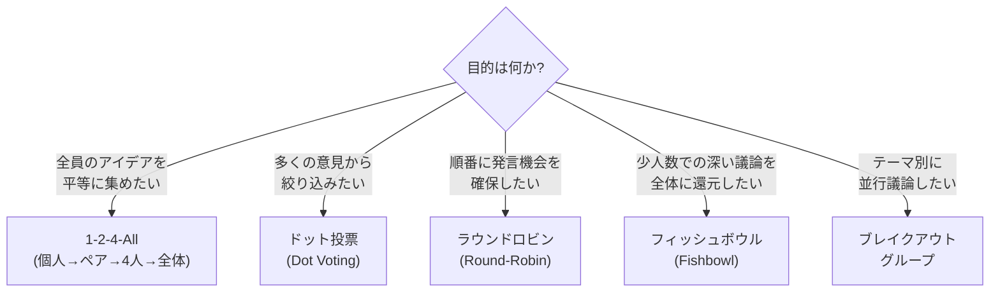

| 手法 | 特徴 |
|---|---|
| 1-2-4-All（Liberating Structures の代表的な手法） | 個人思考→ペア→4人グループ→全体共有と段階的に広げることで、発言力に関係なく全員のアイデアを引き出す |
| ドット投票（Dot Voting） | 多数の選択肢から優先順位をつける際、声の大きさではなく "票数" で可視化する |
| ラウンドロビン | 発言順を機械的に固定することで、発言の少ないメンバーにも均等に機会を与える |
| フィッシュボウル | 内側の少人数が議論し、外側のメンバーは観察→交代する形式。大人数での深い議論に有効 |

#### LO 2.2: 包摂的な解決策の醸成を支援するために少なくとも3つの行動を特定できる

ファシリテーターが「中立」を保ちながらも、声の小さいメンバーの意見を積極的に引き出すための行動には以下があります。

- **発言時間の可視化・均等化**: タイマーや発言回数のトラッキングを用いて、特定の人に発言が偏っていないかを可視化する。
- **明示的な招待（Explicit Invitation）**: 「〇〇さんはどう思いますか？」と名指しで意見を求める（ただし安全な場が前提）。
- **発散と収束を分ける**: アイデア出し（発散）と意思決定（収束）のフェーズを明確に分離し、早すぎる評価によってアイデアが潰されるのを防ぐ。
- **心理的安全性の土台づくり**: 会議冒頭でグラウンドルールを共有し、「反対意見・少数意見は歓迎される」という空気を明示的に作る。

#### LO 2.3: 協働セッションのために少なくとも3つのビジュアルファシリテーション技法を適用できる

| 技法 | 用途 |
|---|---|
| アフィニティマッピング（親和図法） | 付箋を使ってアイデアをグルーピングし、共通のテーマを発見する |
| ホワイトボード/デジタルボードでのフローの可視化 | プロセスの流れやユーザージャーニーを描き、認識を揃える |
| グラフィックレコーディング / スケッチノート | 議論の内容をその場で文字・図・アイコンとして描き出し、参加者が「今どこまで何を話したか」を目で追える状態にする。発言が絵として残るため、認識のズレを議論中に発見しやすくなる |

なお、視覚化の技法そのものではありませんが、協働セッションの「型」を選ぶ引き出しとして **Liberating Structures** も併せて知っておくと有用です。これは Henri Lipmanowicz と Keith McCandless によって開発された、参加と協働を促すための一連の "マイクロストラクチャー（微細構造）" 群で、「1-2-4-All」「Troika Consulting」「W³（What, So What, Now What）」など、目的別に設計された33以上の構造が含まれます。従来の会議形式（円卓での自由討議、一方的なプレゼンなど）に代わる、より包摂的な相互作用パターンを提供します。

> **ベストプラクティス**: いきなり複雑な Liberating Structures を導入するのではなく、まず「1-2-4-All」のようなシンプルな構造から低リスクな社内会議で試し、目的と手順を明確に説明してから導入することが推奨されます。

#### LO 2.4: リモート会議をファシリテーションするための少なくとも3つのプラクティスを特定できる

リモート会議では、対面会議以上に「発言できない・観察されている感覚がない」という課題が顕在化します。

- ブレイクアウトルームを活用し、少人数での対話機会を意図的に作る。
- Miro / Mural などのデジタルホワイトボードで、非同期的にも書き込める場を用意する。
- カメラON/OFFのノームを明確化し、心理的な安全性とのバランスを取る。
- チャットでの匿名的な意見表明や、デジタルドット投票ツールを併用し、発言のハードルを下げる。
- タイムボックスをより厳密に管理し、リモート特有の "間延び" を防ぐ。

> **ベストプラクティス**: リモートファシリテーションでは「参加者が受動的になりやすい」という前提に立ち、5〜10分に一度は何らかのインタラクション（投票、チャット入力、ブレイクアウト等）を挟む設計にすることが推奨されます。

### 6.2 Coaching and Training（コーチングとトレーニング）

#### LO 2.5: コーチング・アグリーメントを作成できる

International Coaching Federation（ICF）の Core Competencies では、「Establishes and Maintains Agreements（合意の確立と維持）」がコアコンピテンシーの1つとして定義されています。

> "Partners with the client and relevant stakeholders to create clear agreements about the coaching relationship, process, plans and goals. Establishes agreements for the overall coaching engagement as well as those for each coaching session."

コーチング・アグリーメントには2つの階層があります。

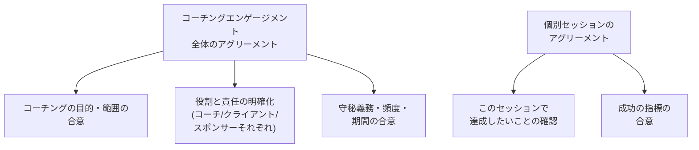

> **ベストプラクティス**: Scrum Master がチームメンバーやプロダクトオーナーに対してコーチング的な関わりを始める際、"何を目的に、どのくらいの頻度で、何をもって成功とするか" を最初に明示的に合意することで、後々の期待値のズレを防げます。

#### LO 2.6: 少なくとも2つの基本的なコーチングの前提を議論できる

コーチングにおいて広く共有されている基本的な前提（assumption）には以下のようなものがあります。

- **クライアントは答えを持っている（The client has the answer）**: コーチはアドバイスや答えを与える存在ではなく、クライアント自身が持つ答えを引き出すパートナーである。
- **コーチングはメンタリング／コンサルティングとは異なる**: コーチは特定の専門知識を教える立場（メンター/コンサルタント）ではなく、クライアントの思考プロセスを支援する、非指示的（non-directive）な立場である。

> **ベストプラクティス**: Scrum Master は「問題を解決してあげる人」ではなく「チームが自ら問題を解決できるよう問いかける人」であるという自覚を持つことが重要です。特に経験豊富なエンジニア出身の Scrum Master は、つい答えを教えたくなる衝動を自覚的に抑える訓練が必要です。

#### LO 2.7: 個人の行動変容を促す少なくとも3つの基礎的な心理学的概念を挙げられる

| 概念 | 提唱者・出典 | 概要 |
|---|---|---|
| Self-Determination Theory（自己決定理論） | Edward Deci & Richard Ryan | 人の内発的動機づけは **自律性（Autonomy）・有能感（Competence）・関係性（Relatedness）** の3つの心理的欲求が満たされることで高まる |
| Growth Mindset（成長マインドセット） | Carol Dweck | 能力は固定的ではなく努力によって伸ばせるという信念を持つことで、挑戦への姿勢や学習意欲が変わる |
| 行動変容モデル（Habit Loop / 行動デザイン） | 習慣形成に関する行動科学の知見 | きっかけ（Cue）・ルーティン（Routine）・報酬（Reward）の3要素で行動ループを捉え、小さな行動変化を積み重ねる |

> **ベストプラクティス**: チームの自律性を尊重する（マイクロマネジメントをしない）、失敗を学習の機会として扱う（成長マインドセットを体現する）、そして新しい行動（例: 朝会での積極的な発言）を促す際は "きっかけ" を意図的に設計する、といった具体的な介入に応用できます。

#### LO 2.8: Scrum またはアジャイルに関連する少なくとも1つのトピックを開発し、教えられる

CSP-SM 保持者は、単に学ぶだけでなく **教える側に回る経験** が求められます。

> **ベストプラクティス（ミニトレーニング設計のステップ）**:
> 1. Bloom's Taxonomy を使って、参加者に「何ができるようになってほしいか」を動詞で明確化する（例:「Retrospective の3つの手法を比較できる」）。
> 2. 参加者の事前知識レベルを想定し、レクチャー・ワークショップ・ケーススタディなど適切な手法を選ぶ。
> 3. 小規模な社内勉強会でドライランを行い、フィードバックを得る。
> 4. 実施後、参加者からのフィードバックをもとに教材を改訂する。

---

## 7. カテゴリ3: Service to the Scrum Team (LO 3.1 – 3.6)

### 7.1 Team Dynamics（チームダイナミクス）

#### LO 3.1: チーム開発に関する少なくとも2つの異なるモデルを評価できる

| モデル | 提唱者 | 概要 |
|---|---|---|
| Tuckman モデル | Bruce Tuckman | チームは **Forming（形成期）→ Storming（混乱期）→ Norming（統一期）→ Performing（機能期）→（Adjourning：解散期）** という段階を経て発展する |
| Five Dysfunctions of a Team（チームの5つの機能不全） | Patrick Lencioni（2002年） | チームの機能不全を **信頼の欠如 → 対立への恐れ → コミットメントの欠如（Lack of Commitment） → 説明責任の回避 → 結果への無関心** という5層のピラミッドで説明する |
| Project Aristotle（プロジェクト・アリストテレス） | Google re:Work チーム | 180のチームを調査した結果、チームの効果性を決める最も重要な要因は **心理的安全性（Psychological Safety）** であり、次いで「信頼性」「構造と明確さ」「意味」「インパクト」が続くと結論づけた |

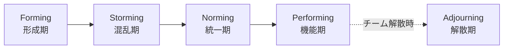

Lencioni の5つの機能不全モデルと、Google の Project Aristotle は、いずれも **信頼・心理的安全性を土台とする** という点で強く共鳴しています。Tuckman モデルも、チームが Storming（対立）を経なければ Norming や Performing に到達できないとしており、健全な対立(=心理的安全性があるからこそ表面化する対立)の重要性を示唆しています。

> **ベストプラクティス**: 新しいチームが Storming フェーズにいることを Scrum Master が認識し、「対立を無理に抑え込む」のではなく「安全に対立できる場（Working Agreement の合意など）」を設計することが、チームを Norming/Performing に導く近道です。

#### LO 3.2: チームの効果性を改善する少なくとも3つの技法を比較できる

| 技法 | 概要 |
|---|---|
| Working Agreement（作業合意）の明文化 | チームの行動規範（コアタイム、レビューのルール等）を明文化し、定期的に見直す |
| Retrospective の手法バリエーション | Start-Stop-Continue、Sailboat、4Ls など、目的に応じて手法を変えることでマンネリを防ぎ改善のインパクトを高める |
| ペア/モブプログラミング | 知識の属人化を防ぎ、リアルタイムでのフィードバックループを短縮する |
| 心理的安全性を高める具体的プラクティス | 失敗を祝う("Fail Party")、Blameless Postmortem（非難のない振り返り）の実施など |

### 7.2 Scrum Teams（スクラムチーム）

#### LO 3.3: 新しい Scrum チームを結成する際の、Scrum チームメンバーとステークホルダーの少なくとも5つの責任を説明できる

| 関係者 | 新チーム結成時の責任の例 |
|---|---|
| Product Owner | Product Goal の明確化とステークホルダーへの伝達、初期 Product Backlog の準備 |
| Developers | 必要なスキルセットの自己評価、Definition of Done の合意への参加 |
| Scrum Master | チームの立ち上げプロセスのファシリテーション、組織的な障害の除去 |
| スポンサー/マネジメント層 | チームの権限委譲（意思決定の範囲の明確化）、必要なリソースの確保 |
| ステークホルダー | 定期的な Sprint Review への参加と誠実なフィードバックの提供 |

#### LO 3.4: 新しい Scrum チームの立ち上げを計画できる

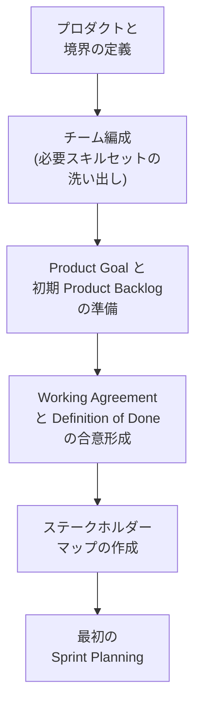

> **ベストプラクティス**: チーム立ち上げの最初の1〜2 Sprint は、通常のベロシティを求めず「チームとしての合意形成」に投資時間を割くことをステークホルダーに事前合意しておくと、立ち上げ初期の心理的プレッシャーを減らせます。

#### LO 3.5: プロダクトの成功に必要なスキル・能力のギャップを埋める戦略を提案できる

- **T字型スキルの育成**: 専門性（縦棒）を保ちながら、隣接領域への理解（横棒）を広げるペアプログラミングやジョブローテーションを設計する。
- **プラクティス・コミュニティ（Community of Practice）の設立**: 職能横断で同じ専門性を持つ人が定期的に知見を共有する場を設ける。
- **一時的な専門家の埋め込み（Embedding）**: 不足するスキル（例: セキュリティ専門家）を一定期間チームに参加させ、ノウハウを移転する。
- **教育投資予算の確保**: トレーニングや資格取得支援の予算をスプリントの計画に組み込む。

#### LO 3.6: ソフトウェアクラフトマンシップの少なくとも1つの要素が自分の仕事にどう適用されるかを説明できる

**Manifesto for Software Craftsmanship**（ソフトウェアクラフトマンシップ宣言）は、Agile Manifesto の4つの価値観を土台としつつ、次のような対比構造で "職人としての専門性" を強調する宣言です。

> "Not only working software, but also well-crafted software. Not only responding to change, but also steadily adding value. Not only individuals and interactions, but also a community of professionals. Not only customer collaboration, but also productive partnerships."

| Software Craftsmanship の価値観 | Scrum チームでの適用例 |
|---|---|
| Well-crafted software（洗練されたソフトウェア） | リファクタリング、コードレビュー、技術的負債の可視化と計画的な返済 |
| Steadily adding value（着実な価値の積み上げ） | 機能追加だけでなく保守性・パフォーマンスの改善も価値として扱う |
| Community of professionals（専門家コミュニティ） | 社内外の勉強会・カンファレンス登壇を通じた技術コミュニティへの貢献 |
| Productive partnerships（生産的パートナーシップ） | 顧客・ステークホルダーとの単なる契約関係を超えた、共創的な関係構築 |

> **ベストプラクティス**: Scrum Master がソフトウェアエンジニアリング出身である場合、Definition of Done に「クラフトマンシップの視点（テスト網羅性、コードの可読性など）」を組み込むようチームと合意形成することが、技術的卓越性と Scrum の両立に貢献します。

---

## 8. カテゴリ4: Service to the Product Owner (LO 4.1 – 4.2)

### 8.1 LO 4.1: Product Goal から Product Backlog へ移行するための少なくとも2つの技法を適用できる

| 技法 | 提唱者 | 概要 |
|---|---|---|
| User Story Mapping（ユーザーストーリーマッピング） | Jeff Patton | ユーザーの行動フロー（バックボーン）に沿ってストーリーを並べ、リリース単位で優先順位づけをする。Product Goal という "大きな物語" を、実行可能なバックログアイテムへと段階的に分解できる |
| Impact Mapping（インパクトマッピング） | Gojko Adzic | 「なぜ（Why=ゴール）」「誰が（Who=アクター）」「どう変わってほしいか（How=インパクト）」「何を作るか（What=成果物）」の4階層でマインドマップを構築し、ゴールと施策の因果関係を明示する |

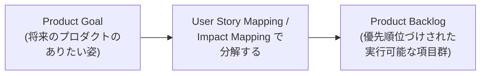

> **ベストプラクティス**: Product Goal が抽象的すぎてチームがバックログ項目に落とし込めない場合、Scrum Master は Product Owner に対して Impact Mapping のようなファシリテーション技法を提案し、"ゴールと施策のつながり" を可視化するワークショップを開催することができます。

### 8.2 LO 4.2: 複雑・複数チームの Product Backlog を構造化するための少なくとも3つの基準を評価できる

複数チームが1つのプロダクトに関わる場合、単一の Product Backlog をどう構造化するかが課題になります。

| 構造化の基準 | 説明 |
|---|---|
| コンポーネント別 vs フィーチャー別 | 技術コンポーネント（例:認証基盤、決済基盤）で分けるか、顧客に価値を届けるフィーチャー単位で分けるかの選択 |
| 顧客ジャーニー別 | エンドユーザーの体験フロー（例: 検索→購入→配送）を軸にバックログを構造化する |
| 依存関係の最小化 | チーム間の依存を最小化する形でバックログ項目を分割する（Nexus/LeSS でも共通して重視される観点） |
| プロダクト全体の単一バックログ原則 | Nexus では「単一の Product Owner が単一の Product Backlog を管理する」ことが定義されており、LeSS でも同様に単一プロダクトバックログの原則がある |

> **ベストプラクティス**: 複数チームのバックログを構造化する際は、まず「なぜ複数チームなのか(=1チームでは扱いきれないスコープなのか)」を確認したうえで、依存関係を可視化するワークショップ（例: Nexus Sprint Backlog のようなクロスチーム依存の可視化）を定期的に実施することが推奨されます。

---

## 9. カテゴリ5: Service to the Organization (LO 5.1 – 5.7)

### 9.1 Organizational Development（組織開発）

#### LO 5.1: 組織の Scrum 導入を助ける少なくとも2つの体系的アプローチを比較できる

| アプローチ | 提唱者/出典 | 特徴 |
|---|---|---|
| Kotter's 8-Step Change Model | John Kotter（*Leading Change*, 1996） | トップダウン型。危機感の醸成 → 推進チームの結成 → ビジョンの策定 → ビジョンの伝達 → 障害の除去 → 短期的成果の創出 → 更なる変革の推進 → 変革の定着、という8段階で **組織レベル** の変革を主導する |
| Prosci ADKAR モデル | Jeff Hiatt（Prosci） | 個人レベルの変化を扱うモデル。Awareness（認識）→ Desire（欲求）→ Knowledge（知識）→ Ability（能力）→ Reinforcement（定着）という **個人レベル** の変化を積み上げる |

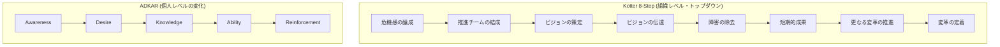

両モデルは対立するものではなく、しばしば組み合わせて使われます。Kotter が組織としての変革のロードマップを描き、ADKAR がその中で個々人が実際に変化を受け入れるプロセスを支援する、という補完関係にあります。

> **ベストプラクティス**: 大規模な Scrum 導入では、経営層への説明は Kotter の枠組み（なぜ今、危機感があるのか）で行い、現場のチームメンバーへの働きかけは ADKAR の枠組み（この変化が自分にとって何を意味するのか）で行うと、両方の層に響くコミュニケーションが可能になります。

#### LO 5.2: 組織的な障害の根本原因に対処する複雑な介入について、自分のアプローチを分析できる

根本原因分析（Root Cause Analysis）の代表的な手法が **「なぜなぜ分析（5 Whys）」** です。これはトヨタの豊田佐吉が考案し、大野耐一がトヨタ生産方式の科学的アプローチの基礎として体系化した手法です。

> "The basis of Toyota's scientific approach is to ask 'why' five times whenever we find a problem. By repeating, the problem — as well as its solution — becomes clear." — 大野耐一

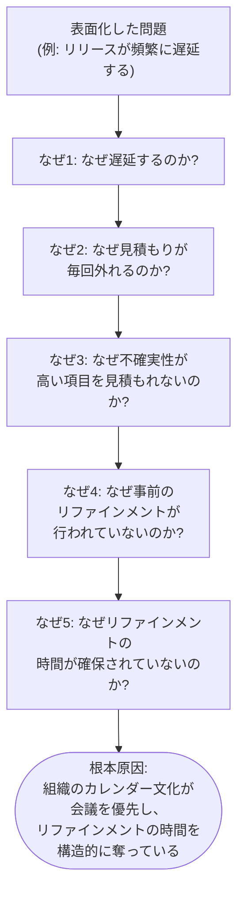

5 Whys を実践する際の重要な原則として、「個人を根本原因にしない（"〇〇さんのミス"で終わらせない）」というルールがあります。あくまでプロセスや構造的な要因を掘り下げることが目的です。

> **ベストプラクティス**: 5 Whys は必ずしも "ちょうど5回" である必要はなく、構造的な根本原因にたどり着くまで柔軟に回数を調整してよいとされています。複雑な問題には、5 Whys に加えてフィッシュボーン図（特性要因図）のような複数要因を並行して扱える手法を組み合わせることも有効です。

#### LO 5.3: チームや組織の文化をどう変えたかについて、少なくとも2つの具体例を要約できる

CSP-SM 保持者には、自分自身が実際に組織文化の変化を主導した経験を言語化することが求められます。以下は文化変化を可視化・言語化する際の観点の例です。

- **可視化できる行動変化の例**: Blameless Postmortem の導入により、インシデント後の議論が「誰が悪いか」から「何を学べるか」に変わった、など。
- **可視化できる構造変化の例**: 評価制度を個人目標から「チームの成果」に変更したことで、知識の抱え込みが減りペアプログラミングが自然発生するようになった、など。

> **ベストプラクティス**: 文化変化を語る際は、「〇〇を導入した」という施策だけでなく、「その結果、どのような行動やメトリクスが変化したか」までセットで語れるようにしておくことが、コーチングやトレーニングの説得力を高めます。

#### LO 5.4: 最新の Scrum の定義を採用することで、自分の Scrum チーム・組織がどのように便益を得られるかを評価できる

2020年版 Scrum Guide は、2017年版から大きく次のような変更を行いました。

| 変更点 | 2017年版 | 2020年版 |
|---|---|---|
| チーム構造 | Scrum Team の内部に "Development Team" というサブチームが存在 | サブチームを廃止し、Product Owner・Scrum Master・Developers からなる **単一の Scrum Team** に統合 |
| 自律性の表現 | Development Team は "self-organizing"（自己組織化） | Scrum Team 全体が "self-managing"（自己管理）— 誰が・どのように・**何を**行うかまで自分たちで決める |
| コミットメント（Commitments） | 明示的な定義なし | Product Backlog に **Product Goal**、Sprint Backlog に **Sprint Goal**、Increment に **Definition of Done** という「コミットメント」が明示的に追加された |
| 記述のスタイル | より規範的（prescriptive） | よりシンプルで簡潔な言語に整理され、ソフトウェア以外の領域にも適用しやすい記述に |

> "The Product Goal describes a future state of the product which can serve as a target for the Scrum Team to plan against." — Scrum Guide 2020

これらの変更は、単なる用語の言い換えではありません。特に「Development Team というサブチームの廃止」は、Product Owner と Developers の間に生まれがちな "us vs. them" という対立構造を解消し、Scrum Team 全体が同じ目的に向かって一体となることを狙ったものです。

> **ベストプラクティス**: まだ2017年版の用語（"self-organizing"、"Development Team"）でチームを運営している組織に対しては、単に用語を置き換えるのではなく、「なぜこの変更が行われたのか」という設計思想（"us vs. them" 構造の解消、Product Goal によるチームの求心力向上）まで含めて説明することで、形だけの移行を防げます。

### 9.2 Scaling Scrum（スクラムのスケーリング）

#### LO 5.5: Product Owner ロールをスケールする少なくとも2つのパターンを対比できる

| フレームワーク | Product Owner のスケーリングパターン |
|---|---|
| Nexus（Scrum.org） | **単一の Product Owner** が、単一の Product Backlog を管理し、3〜9チームで構成される Nexus 全体に対して責任を持つ。Nexus Integration Team の一員でもある |
| LeSS（Large-Scale Scrum） | 標準の LeSS では **単一の Product Owner** が全体のプロダクトバックログに責任を持つ。さらに大規模な **LeSS Huge**（LeSS の拡張形態）になった場合にのみ、"Area Product Owner" という概念が導入され、要求エリアごとの優先順位付けを担当する |
| Scrum@Scale | **Chief Product Owner（CPO）** が、複数チームの Product Owner から構成される "MetaScrum" を率い、単一の全体バックログの優先順位を調整する |

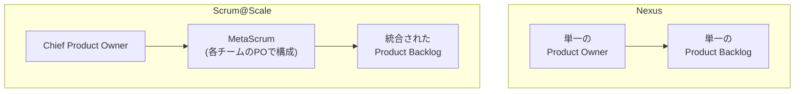

> **ベストプラクティス**: どのパターンを採用するかは、組織の規模・成熟度・文化に依存します。3〜9チーム程度の単一プロダクトであれば Nexus のようなシンプルな単一PO構造から始め、規模が拡大するにつれて Scrum@Scale の MetaScrum のような "PO 同士のScrumチーム" を設計する、という段階的な移行が現実的です。

#### LO 5.6: チーム間協働を改善する少なくとも3つの技法を実験できる

| 技法 | 概要 |
|---|---|
| Scrum of Scrums | 各チームの代表者が定期的に集まり、依存関係や課題を共有する（Scrum@Scale の "Scrum of Scrums Master" が象徴的な役割） |
| Nexus Integration Team | 統合作業に必要なスキルと知識に基づいて選ばれた Nexus Integration Team Members が、複数チームの成果物の統合責任を持つ。各チームからの固定的な代表者ではなく、Nexus の状況に応じて構成を変更できる |
| Communities of Practice（実践コミュニティ） | 職能横断で知見を共有する場を設け、暗黙知の共有と標準化を進める |
| 共有 Definition of Done | 複数チームが同じ品質基準を持つことで、統合時の手戻りを減らす |
| Open Space Technology | 大人数が集まる場で、参加者自身がアジェンダを作り議論するオープンな形式のイベント |

#### LO 5.7: 複数の Scrum チームの立ち上げを計画できる

複数チームの立ち上げは、単一チームの立ち上げ（LO 3.4）に加えて、次のような組織設計上の考慮が必要です。

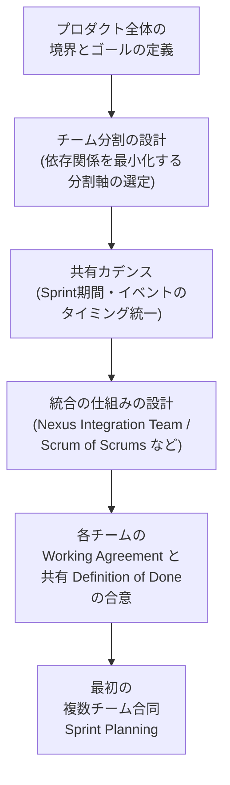

> **ベストプラクティス**: 複数チームを一度に立ち上げるのではなく、まず1〜2チームで Scrum を軌道に乗せてから段階的にチームを追加していく（"start small" の原則）ことが、LeSS の原則にも通じる現実的なアプローチです。

---

## 10. カテゴリ6: Advanced Scrum Mastery (LO 6.1 – 6.2)

### 10.1 LO 6.1: スクラムマスタリーに向けた個人開発戦略の概要を描ける

CSP-SM は「ゴール」ではなく、Scrum Master としてのキャリアにおける通過点です。個人開発戦略を描く際に有効な考え方の1つが、武道由来の **守破離（Shu-Ha-Ri）** です。

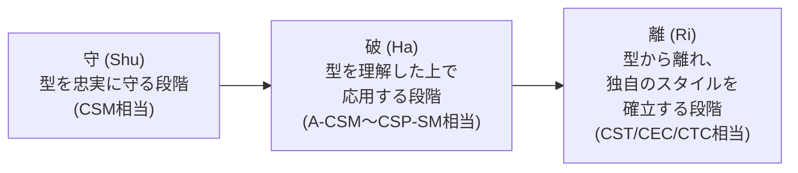

> **ベストプラクティス（個人開発戦略の設計ステップ）**:
> 1. 現在地を自己評価する（Facilitation / Coaching / Teaching / Mentoring / Technical の各領域でのスキルレベル）。
> 2. Comparative Agility のような組織診断ツールや、360度フィードバックを活用して他者評価とのギャップを把握する。
> 3. 短期（半年)・中期（1〜2年）・長期（3年以上、CST/CEC/CTC等）の目標を設定する。
> 4. SEU（Scrum Education Units）の獲得計画を、単なる資格維持のノルマではなく、実際の学習計画として設計する。

### 10.2 LO 6.2: 誰かをメンタリングする経験を積める

コーチング・ティーチング・メンタリングは似て非なる関わり方です。

| 関わり方 | 特徴 |
|---|---|
| Teaching（ティーチング） | 知識やスキルを直接教える。指示的（directive） |
| Mentoring（メンタリング） | 自身の経験に基づき、助言やキャリア的な視点を提供する。指示的な要素と非指示的な要素の両方を含む |
| Coaching（コーチング） | 答えを与えず、問いかけによって相手自身の答えを引き出す。基本的に非指示的（non-directive） |

> **ベストプラクティス**: メンタリング関係を始める際も、LO 2.5 で触れたコーチング・アグリーメントと同様に、「何を目的に」「どのくらいの頻度で」関わるかを明示的に合意することが推奨されます。CSP-SM 取得後は、A-CSM や CSM を目指す後進のメンターになることで、このLOの実践を継続できます。

---

## 11. ベストプラクティス総まとめ

| カテゴリ | 重要なベストプラクティス |
|---|---|
| Lean, Agile, and Scrum | Scrum の各 event を Lean の原則（JIT, Jidoka, Kaizen 等）に接続して説明できるようにする。Value Stream Mapping で "見えないムダ" を可視化する |
| Facilitation | 目的に応じてオープンディスカッション以外の手法（1-2-4-All、ドット投票、フィッシュボウル等）を使い分ける。リモート会議では能動的なインタラクションを頻繁に挟む |
| Coaching and Training | コーチング・アグリーメントを明示的に結ぶ。答えを与えるのではなく問いかける。SDT（自律性・有能感・関係性）を意識した関わりをする |
| Service to the Scrum Team | 新チーム立ち上げ初期はベロシティより合意形成に投資する。心理的安全性を土台に Storming を安全に経験させる |
| Service to the Product Owner | Impact Mapping / User Story Mapping で Product Goal をバックログへ分解する。複数チームバックログは依存関係最小化を軸に構造化する |
| Service to the Organization | Kotter（組織）と ADKAR（個人）を組み合わせて変革を進める。5 Whys で個人ではなく構造的な根本原因を掘り下げる |
| Scaling Scrum | Nexus / LeSS / Scrum@Scale の PO スケーリングパターンを組織の成熟度に応じて選ぶ。複数チームはスモールスタートで段階的に拡大する |
| Advanced Scrum Mastery | 守破離のフレームで自身の成長段階を自己評価する。メンタリング関係にもアグリーメントの概念を適用する |

---

## 12. よくある誤解・アンチパターン

| 誤解・アンチパターン | 実際には |
|---|---|
| Scrum Master は「ファシリテーターであればよい」 | CSP-SM レベルでは、ファシリテーションに加えてコーチング・組織開発・スケーリングまで幅広い専門性が求められる |
| 5 Whys は必ず正確に5回質問する手法である | 5回は目安であり、根本原因（多くは構造的・プロセス的な要因）にたどり着くまで柔軟に回数を調整してよい |
| コーチングは「アドバイスを親身に与えること」 | 専門的な意味でのコーチングは非指示的（non-directive）であり、答えを与えるのではなく問いかけによって相手自身の答えを引き出すことを指す |
| Scrum Guide 2020 は Development Team という言葉を単に言い換えただけ | Development Team というサブチームの概念自体を廃止し、Product Owner と Developers の間の "us vs. them" 構造を解消することが本質的な狙い |
| 複数チームのスケーリングでは Product Owner も人数を増やせばよい | Nexus・LeSS・Scrum@Scale いずれも「単一の全体バックログ」という原則を維持しながら、Product Owner 間の調整の仕組み（Nexus Integration Team、MetaScrum 等）を設計することが本質 |
| A-CSM を取得すればすぐに CSP-SM の認定証がもらえる | コース受講自体は24か月の実務経験がなくても可能だが、**認定証の発行には** 過去5年以内で24か月以上の Scrum Master 実務経験の記録・検証が必須 |

---

## 13. 認定後のキャリアパス

CSP-SM 取得後のキャリアパスとして、Scrum Alliance 公式サイトでは以下が挙げられています。

- **Certified Scrum Trainer®（CST®）**: Scrum Alliance の認定コースを教えるトレーナーへの道
- **Certified Team Coach（CTC）/ Certified Enterprise Coach™（CEC™）**: チーム〜エンタープライズレベルのアジャイルコーチへの道

> **重要な注記（2025年以降の変更）**: Scrum Alliance の公式ヘルプセンターによると、CTC・CEC のアプリケーションポータルは **2025年1月6日をもって新規申請を停止** しており (すでに認定を受けている保持者の資格は引き続き有効です)、後継となる **Certified Agility Consultant（CAC）** プログラムは現在も開発中であり、申請可能なパスとしてはまだ開始されていません。CSP-SM の公式紹介ページでは依然として CTC/CEC が "次のステップ" として案内されていますが、実際に CTC/CEC/CAC のキャリアパスを検討する際は、Scrum Alliance のヘルプセンターで最新の状況を確認することを強く推奨します。

### 13.1 資格の維持（SEU と更新）

- Scrum Alliance の資格は **2年ごとの更新** が必要です。
- 更新には Scrum Education Units（SEU）の取得が必要で、記事の閲読・イベント参加・ボランティア活動など「学習に費やした1時間 = 1 SEU」として計算されます。
- CSP レベル（CSP-SM を含む）の更新には、専門レベル（Professional-level）の更新料が必要です（2年ごとに専門レベルは基礎レベル・上級レベルより高い更新料が設定されています）。
- CSP-SM の場合、現行の更新要件は **2年ごとに 40 SEU の取得と 250 米ドルの更新料の支払い** です（金額は2026年9月1日時点で確認したもの。最新の金額は Scrum Alliance 公式サイトで確認してください）。
- CSP-SM 保持者は、Scrum Alliance が提供する世界最大級のアジャイルアセスメント・継続的改善プラットフォームである **Comparative Agility®** のプレミアムサブスクリプションを無料で利用できます。

### 13.2 上位資格との関係

複数の Scrum Alliance 認定を保有している場合、**トラック内で最上位の資格を更新すれば、下位資格は自動的に更新される** 仕組みになっています（例: CSM と A-CSM を両方保有していても、A-CSM を SEU で更新すれば CSM も自動更新される）。CSP-SM を更新すれば、CSM・A-CSM も連動して更新されます。

---

## 14. まとめ

CSP-SM は、Scrum Master トラックの中で最も高度な認定資格であり、その学習範囲は以下の6つの柱で構成されています。

1. **Lean, Agile, and Scrum**: Scrum を支える思想的な土台の理解
2. **Scrum Master Core Competencies**: ファシリテーションとコーチングという中核スキルの高度化
3. **Service to the Scrum Team**: チームダイナミクスの理解とチーム立ち上げの実践力
4. **Service to the Product Owner**: プロダクトバックログの構造化を支援する専門性
5. **Service to the Organization**: 組織開発とスケーリングという、より大きな系への介入力
6. **Advanced Scrum Mastery**: 自らのキャリアを設計し、次世代を育てる力

これらはいずれも単独の知識としてではなく、**相互に接続された1つの体系** として理解することが重要です。Lean Thinking の理解がファシリテーションの設計思想を支え、チームダイナミクスの理解が組織開発の土台となり、個人の成長戦略がキャリア全体を貫く軸になります。

CSP-SM を取得することは、Scrum Master としての学びのゴールではなく、CST、および CEC・CTC（新規申請は停止中で、後継の Certified Agility Consultant は開発中）といった、より高度な役割へと進むための土台を築くプロセスであると言えます。

---

## 15. 参考文献（Sources）

### Scrum Alliance 公式情報源

- CSP-SM 公式ページ: https://www.scrumalliance.org/get-certified/scrum-master-track/certified-scrum-professional-scrummaster
- CSP-SM Learning Objectives（2022年1月版, PDF）: https://www.scrumalliance.org/media/certifications/los/csp_sm_learning_objectives_2022.pdf
- A-CSM 公式ページ: https://www.scrumalliance.org/get-certified/scrum-master-track/advanced-certified-scrummaster
- CSM 公式ページ: https://www.scrumalliance.org/get-certified/scrum-master-track/certified-scrummaster
- A-CSM/A-CSPO 取得要件（Help Center）: https://support.scrumalliance.org/hc/en-us/articles/115001680252-How-do-I-earn-the-Advanced-Certified-ScrumMaster-A-CSM-or-Advanced-Certified-Scrum-Product-Owner-A-CSPO-certification
- CSP-SM/CSP-PO を実務経験前に受講できるか（Help Center）: https://support.scrumalliance.org/hc/en-us/articles/115001681612-Can-I-take-the-CSP-SM-or-CSP-PO-course-before-I-have-the-required-work-experience
- Scrum Education Units（SEU）: https://www.scrumalliance.org/get-certified/scrum-education-units
- 資格の更新（Renewing Certifications）: https://www.scrumalliance.org/get-certified/renewing-certifications
- CEC/CTC プログラムの変更（Certified Agility Consultant への移行）: https://support.scrumalliance.org/hc/en-us/articles/35971003067291-Updates-to-the-Certified-Enterprise-Coach-CEC-and-Certified-Team-Coach-CTC-programs
- What is Scrum（Scrum Values を含む）: https://www.scrumalliance.org/about-scrum

### Scrum / Agile の一次情報源

- Manifesto for Agile Software Development: https://agilemanifesto.org/
- Scrum Guide（2020年版）: https://scrumguides.org/scrum-guide.html
- Scrum Guide の改訂履歴: https://scrumguides.org/revisions.html
- Scrum Guide 2020 と 2017 の比較（Scrum.org）: https://www.scrum.org/resources/blog/scrum-guide-2020-and-2017-side-side-comparison
- Scrum Guide 2020: Product Goal の導入（Scrum.org）: https://www.scrum.org/resources/blog/scrum-guide-2020-update-introducing-product-goal
- Scrum Guide 2020: Self-Management（Scrum.org）: https://www.scrum.org/resources/blog/scrum-guide-2020-update-self-mgt-replaces-self-organization

### Lean Thinking / Toyota Production System

- Taiichi Ohno（Wikipedia）: https://en.wikipedia.org/wiki/Taiichi_Ohno
- The Seven Wastes — Definition, Origins, and Structure（Art of Lean）: https://artoflean.com/topics/seven-wastes/
- 7 Wastes of Software Development（Poppendieck の7つのムダのソフトウェア開発への適用）: https://newsletter.techworld-with-milan.com/p/software-development-waste
- 5 Whys（Mindtools）: https://www.mindtools.com/a3mi00v/5-whys/

### ファシリテーション / コーチング

- Liberating Structures 公式サイト: https://www.liberatingstructures.com/
- ICF Core Competencies（International Coaching Federation）: https://coachingfederation.org/credentialing/coaching-competencies/icf-core-competencies/
- Self-Determination Theory（Ryan & Deci, 2000, 原著PDF）: https://selfdeterminationtheory.org/SDT/documents/2000_RyanDeci_SDT.pdf

### チームダイナミクス

- The Five Dysfunctions of a Team（Wikipedia）: https://en.wikipedia.org/wiki/The_Five_Dysfunctions_of_a_Team
- Understand Team Effectiveness（Google re:Work, Project Aristotle）: https://rework.withgoogle.com/intl/en/guides/understand-team-effectiveness

### ソフトウェアクラフトマンシップ

- Manifesto for Software Craftsmanship: https://manifesto.softwarecraftsmanship.org/

### スケーリングフレームワーク

- Online Nexus Guide（Scrum.org）: https://www.scrum.org/resources/online-nexus-guide
- LeSS Principles Overview: https://less.works/less/principles/overview.html
- Large-Scale Scrum is Scrum（LeSS）: https://less.works/less/principles/large_scale_scrum_is_scrum
- The Scrum@Scale Guide Online: https://www.scrumatscale.com/scrum-at-scale-guide-online/

### 組織変革

- Kotter's Change Management Theory（Prosci）: https://www.prosci.com/blog/kotters-change-management-theory
- ADKAR vs Kotter（Prosci）: https://www.prosci.com/blog/adkar-vs-kotter

---

*本ガイドは2026年8月時点で公開されている一次情報源に基づいて作成されています。Scrum Alliance の認定制度・料金・プログラム構成（特に CEC/CTC から Certified Agility Consultant への移行など）は変更される可能性があるため、正式な受講・申請前には必ず Scrum Alliance 公式サイトで最新情報をご確認ください。*
