# Certified Scrum Product Owner®（CSPO®）完全学習ガイド

> 初学者から実務者まで対応。出題範囲となる公式Learning Objectivesを100%カバーし、各項目の詳細解説・ベストプラクティス・根拠ソースURLを付記した保存版ドキュメントです。
> 対象読者：これからCSPOを受講する方、Product Owner役割に就いたばかりの方、Scrum Master/開発者としてPOと協働する方。

---

## 本ガイドの前提と情報源

本ガイドは、Scrum Allianceが公開する以下の一次情報を基に構成しています（詳細は末尾「参考文献・ソース一覧」参照）。

- Scrum Alliance公式CSPO紹介ページ
- **CSPO Learning Objectives（2022年1月改訂、2024年2月フォーマット更新版）** — CSPOオファリングで必ずカバーされるべき学習目標を定義する公式文書
- **Scrum Foundations® Learning Objectives（2022年1月改訂）** — CSM/CSPO/CSD共通で前提となる基礎学習目標
- The Scrum Guide（Ken Schwaber & Jeff Sutherland, 2020年11月版）
- Manifesto for Agile Software Development（4つの価値・12の原則）
- Scrum Allianceが定めるScrum価値観ページ

> **表記方針**：本ガイドは日本語を主体としつつ、Product Owner、Product Backlog、Sprint Goal、Product Goalなど公式Scrum用語は英語表記を維持します（誤訳・意味のズレを防ぐため）。

---

## 目次

1. [CSPOとは何か － Product Owner Trackにおける位置づけ](#chapter1)
2. [Bloom's Taxonomy － 学習目標の読み方](#chapter2)
3. [Scrum Foundations® 復習](#chapter3)
   - 3.1 Scrum Theory（Scrum理論）
   - 3.2 The Scrum Team（スクラムチーム）
   - 3.3 Scrum Events and Activities（スクラムイベントと活動）
   - 3.4 Scrum Artifacts and Commitments（スクラム作成物とコミットメント）
4. [カテゴリ1：Product Owner Core Competencies（プロダクトオーナーの中核能力）](#chapter4)
5. [カテゴリ2：Goal Setting and Planning（ゴール設定と計画）](#chapter5)
6. [カテゴリ3：Understanding Customers and Users（顧客とユーザーの理解）](#chapter6)
7. [カテゴリ4：Validating Product Assumptions（プロダクト仮説の検証）](#chapter7)
8. [カテゴリ5：Working with the Product Backlog（プロダクトバックログの運用）](#chapter8)
9. [ベストプラクティス総合チェックリスト](#chapter9)
10. [認定後のキャリアパスと資格更新（A-CSPO／CSP-PO／SEU）](#chapter10)
11. [よくある誤解とアンチパターン](#chapter11)
12. [まとめ](#chapter12)
13. [参考文献・ソース一覧](#chapter13)

---

## 第1章：CSPOとは何か － Product Owner Trackにおける位置づけ

### 1.1 CSPOの概要

Certified Scrum Product Owner®（CSPO®）は、Scrum Allianceが提供するProduct Owner Trackの入門資格です。認定コースは、Certified Scrum Trainer®（CST®）または認定を受けたトレーナーによる対面/ライブオンライン形式で実施され、修了すると2年間のScrum Alliance会員資格とCSPO認定が付与されます。

Scrum Alliance公式サイトでは、CSPOコースの狙いを次のように説明しています。

> 「CSPOコースは、顧客価値と投資対効果（ROI）へのあくなき集中をもって、アジャイルなプロダクトデリバリーに備えるためのコースである」（Scrum Alliance公式ページの要旨）

つまりCSPOは、単なる「バックログを書く人」の資格ではなく、**マーケットを理解し、顧客が何を必要としているかを先読みし、組織を成功に導く**ためのプロダクトオーナーシップ全般を扱う資格です。

### 1.2 Product Ownerというロールの基本像

Scrum Guideにおいて、Product Ownerはスクラムチーム（Product Owner・Scrum Master・Developersの3者で構成される単一のチーム）の一員であり、次の点にアカウンタビリティ（結果責任）を持ちます。

- スクラムチームの作業から生まれる**プロダクトの価値の最大化**
- Product Backlogの管理（Product Goalの策定・伝達、Product Backlog Itemの作成・伝達、優先順位付け＝ordering、透明性・可視性・理解可能性の確保）

公式ページでは、Product Ownerの職務を以下のように整理しています。

- プロダクトビジョンを定義する
- Product Backlogを管理する
- ステークホルダーと開発者の橋渡しをする
- トレードオフに関する意思決定を行う
- 順序と範囲（スコープ）に関する意思決定を行う
- プロダクトの価値を最大化する
- 常に顧客を中心に置き続ける

これらを支えるのは、強いリーダーシップ、卓越したコミュニケーション能力、共感力、そして変化し続ける市場・顧客ニーズに適応する柔軟性です。

### 1.3 Product Owner TrackにおけるCSPOの位置づけ

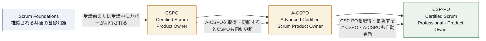

CSPOはProduct Owner Trackの起点です。CSPOを取得すると、その上位資格であるA-CSPO（Advanced Certified Scrum Product Owner）、さらにCSP®-PO（Certified Scrum Professional® - Product Owner）へと進む道が開かれます。上位資格を更新すると、CSPO自体も自動的に更新される仕組みになっている点も実務上重要です（詳細は第10章）。

### 1.4 CSMとCSPO、どちらを選ぶべきか

Scrum Alliance公式FAQでは、CSM（Certified ScrumMaster）とCSPOの選び方について次のように案内しています。

- **CSM**：スクラムマスターのスキルセット（チームにスクラムを実践させるコーチング、チーム・個人としての継続的改善）にフォーカス
- **CSPO**：Product Backlogの管理方法、ロードマップの作成方法、次に作るべき機能をチームと共に判断する方法の学習にフォーカス

どちらもアジャイルチームで価値がありますが、「チームをコーチングしたいか」「卓越したプロダクトを届けたいか」という志向性で選択します。

### 1.5 受講対象者

CSPOコースは以下のような職種の方に適しています。

| 対象 | 想定される動機 |
|---|---|
| プロダクトマネージャー | アジャイルな運用にプロダクト戦略を接続したい |
| ビジネスアナリスト | 要件定義からバックログ管理へスキルを拡張したい |
| プロジェクトマネージャー | アジャイルなスコープ・優先順位管理を学びたい |
| データアナリスト | 定量的な意思決定をプロダクト開発に組み込みたい |
| スクラムチームメンバー | POの視点を理解しコラボレーションを高めたい |

> **ベストプラクティス**
> - CSPOは「肩書がプロダクトオーナーの人だけ」のものではなく、価値の優先順位付けに関わる全職種にとって有用な基礎教養と捉える。
> - 受講前にScrum Foundations学習目標（第3章）に目を通しておくと、コース内での理解度が大きく上がる。

---

## 第2章：Bloom's Taxonomy － 学習目標の読み方

CSPO Learning Objectivesの各項目は、すべて「このコースを無事に修了した学習者は、～できるようになる」という文の後に続く**動詞**から始まります。この動詞は、Bloom's Taxonomy（ブルームの教育目標分類学）の6段階に対応しており、どのレベルの理解を求められているかを示します。

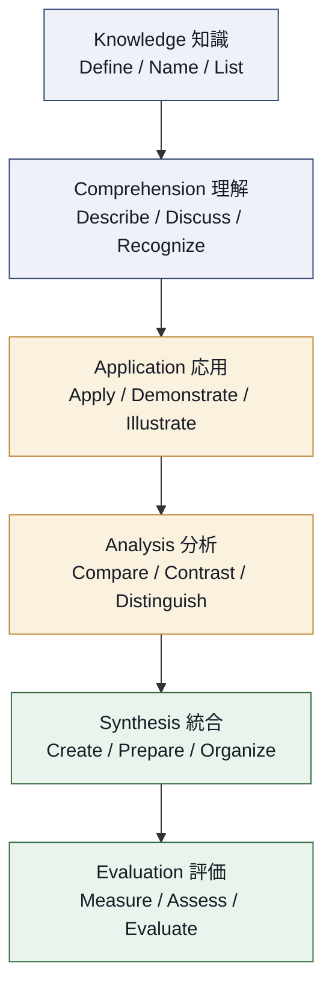

| レベル | 説明 | 代表的な動詞 |
|---|---|---|
| Knowledge（知識） | 情報・プロセス・事実・概念の記憶 | Define, Name, List |
| Comprehension（理解） | 情報を解釈し重要性を判断する | Describe, Discuss, Recognize |
| Application（応用） | 習得した知識・概念を実際の場面に適用する | Apply, Demonstrate, Illustrate |
| Analysis（分析） | 批判的思考で情報を分解・整理する | Compare, Contrast, Distinguish |
| Synthesis（統合） | 知識を用いて新しい成果物やプロセスを創出する | Create, Prepare, Organize |
| Evaluation（評価） | 判断力を用いて意思決定・問題解決を行う | Measure, Assess, Evaluate |

例えば、CSPO学習目標「5.6 create a product backlog that supports the achievement of a product goal」は動詞が"create"のため、Synthesis（統合）レベル＝単なる知識の暗記ではなく、実際に手を動かしてバックログを作れることが求められます。一方「5.3 define at least three terms related to product economics」は"define"なのでKnowledgeレベルであり、用語を正しく説明できれば十分です。

> **ベストプラクティス**
> - 学習目標を読むときは、まず動詞に注目し、「知識として知っていればよいのか」「実際に作れる・評価できる必要があるのか」を区別する。
> - トレーナーによる練習（ワーク）は、Application以上の動詞（practice, create, illustrate等）を持つ学習目標に対応していることが多いため、コース中は積極的に手を動かす。

---

## 第3章：Scrum Foundations® 復習

Scrum Alliance公式のScrum Foundations Learning Objectivesは、CSM・CSPO・CSDの3つの基礎資格すべてに共通する前提知識です。CSPOオファリングでは、コース前またはコース中にこれらがカバーされていることが期待されます。ここではCSPO学習に必要な範囲で要点を整理します。

### 3.1 Scrum Theory（Scrum理論）

**対応する公式学習目標**：1.1 define scrum／1.2 list the five scrum values／1.3 define empiricism／1.4 list the three empirical scrum pillars／1.5 list at least three benefits of an iterative and incremental approach／1.6 describe at least two disadvantages that could occur if scrum is only partially implemented／1.7 describe how scrum is aligned with the values and principles of the Manifesto for Agile Software Development

Scrum Guideの定義によれば、Scrumとは「複雑な問題に対応するための軽量級フレームワークであり、人々やチーム・組織が、複雑な問題に対する適応的な解決策を通じて価値を生み出せるようにするもの」です。Scrumはプロセスや技法の集合ではなく、**フレームワーク**である点が重要で、その中でさまざまなプロセスや技法を適用できます。

Scrumは**経験主義（Empiricism）**とリーン思考に基づいています。経験主義とは「知識は経験から生まれ、意思決定は観察されたものに基づく」という考え方です。この経験主義を支えるのが3つの柱です。

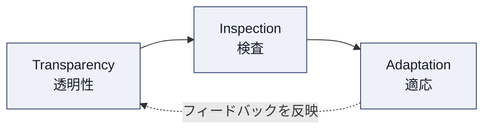

- **Transparency（透明性）**：プロセスと成果物が、それを検査する人たちに見える状態であること。共通言語・共通の「完成」の定義が前提。
- **Inspection（検査）**：進捗を頻繁かつ注意深く検査し、望ましくない差異を検出すること。
- **Adaptation（適応）**：検査の結果、プロセスや素材が許容範囲を逸脱していると判断されたら、できる限り早く調整すること。

またScrumは5つの価値観（**Scrum Values**）に支えられています。

| 価値観 | 概要 |
|---|---|
| Commitment（確約） | ゴール達成とチームの支援に向けて全力を尽くす |
| Focus（集中） | Sprintの作業とスクラムチームのゴールに集中する |
| Openness（公開） | 作業や課題をオープンにする |
| Respect（尊敬） | チームメンバーが互いを能力ある独立した人として尊重する |
| Courage（勇気） | 正しいことを行い困難な問題に取り組む勇気を持つ |

反復的（iterative）かつ漸進的（incremental）なアプローチには、少なくとも次のような利点があります。

1. 早期かつ頻繁にフィードバックを得られ、方向修正のコストを下げられる
2. リスク（技術的リスク・市場リスク）を小さい単位で検証できる
3. 価値のある成果物を早期に市場・顧客に届けられる

一方、Scrumが部分的にしか実装されていない場合には、次のような弊害が生じます。

- 透明性が欠如し、問題が検知されないまま埋もれる（例：Sprint Reviewを形式的に省略する）
- 経験主義が機能せず、計画重視の思い込みに逆戻りし、変化への適応力を失う

Scrumは、Manifesto for Agile Software Developmentの4つの価値・12の原則と整合しています。例えば「動くソフトウェアを最も重要な進捗の尺度とする」という原則は、Sprintごとに検査可能なIncrementを作るというScrumの仕組みと直接対応しています。

> **ベストプラクティス**
> - PO自身がまず経験主義（透明性・検査・適応）の体現者になる。Product Backlogを常に最新かつ本音で保つことが透明性の第一歩。
> - 「なぜこの順序なのか」を問われたら、意見ではなく観察された事実（利用データ、顧客の声、実験結果）で語れるようにしておく。

### 3.2 The Scrum Team（スクラムチーム）

**対応する公式学習目標**：2.1 illustrate how the product owner, developers and scrum master interact to deliver increments within a sprint／2.2 identify at least three benefits of a cross-functional, self-managing scrum team

Scrum Team（スクラムチーム）は、1人のScrum Master、1人のProduct Owner、そしてDevelopersで構成される単一のチームです。かつての「Development Team」という下位チームの概念はScrum Guide 2020で廃止され、Product Owner・Scrum Master・Developersの全員が1つのScrum Teamを構成します。

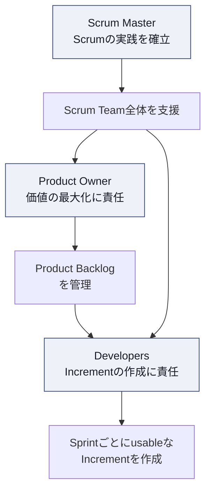

Scrum Teamは以下の特性を持ちます。

- **Cross-functional（機能横断的）**：チーム自身がSprintごとに価値あるIncrementを作るために必要なすべてのスキルを保有している
- **Self-managing（自己管理型）**：誰が・どのように・何に取り組むかをチーム内部で決定する

自己管理・機能横断的なチームの利点は少なくとも次の3つです。

1. 外部への依存が減り、Sprint内で完結して価値を届けられる
2. チームが状況に応じて最適な作業分担を柔軟に決められる
3. オーナーシップが高まり、品質・改善への当事者意識が強くなる

> **ベストプラクティス**
> - POはDevelopersの「どう作るか（How）」には介入せず、「何を・なぜ（What/Why）」の意思決定に集中する。
> - Scrum Masterと連携し、チームが自己管理を発揮できる環境（心理的安全性・十分な情報）を整える。

### 3.3 Scrum Events and Activities（スクラムイベントと活動）

**対応する公式学習目標**：3.1 explain at least three benefits of using a timebox／3.2 define the purpose and maximum duration of a sprint／3.3 explain how to determine a suitable duration of a sprint／3.4 define sprint planning, daily scrum, sprint review and sprint retrospective, including their purpose, participants, sequence, and maximum recommended timebox／3.5 list at least three activities that may occur as part of product backlog refinement／3.6 repeat at least two reasons why the scrum team dedicates time for product backlog refinement

Sprintは、他のすべてのスクラムイベントを包含する「コンテナ」であり、最大1か月です。Sprint中はSprint Goalを危険にさらす変更は行わず、学習が進むにつれてスコープはPOとの合意のもと明確化・再交渉されます。

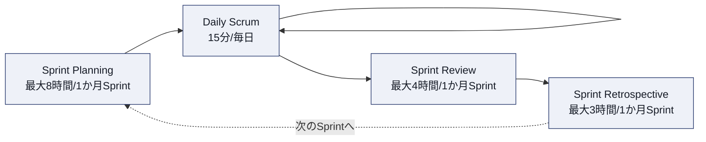

タイムボックス（時間枠）を用いる利点は少なくとも次の3つです。

1. 意思決定・議論に上限が設けられ、完璧主義による停滞を防ぐ
2. すべてのイベントの長さが予測可能になり、計画が立てやすくなる
3. 頻度が保証されるため、検査と適応の機会が定期的に確保される

各イベントの目的・参加者・タイムボックスは次の通りです。

| イベント | 目的 | 参加者 | 最大タイムボックス（1か月Sprintの場合） |
|---|---|---|---|
| Sprint Planning | Sprintで何を・なぜ・どのように行うかを計画する | Scrum Team全員 | 8時間 |
| Daily Scrum | Sprint Goalへの進捗を検査し、Sprint Backlogを適応させる | Developers（他は任意参加） | 15分 |
| Sprint Review | Sprintの成果を検査し、今後の適応を判断する | Scrum Team＋主要ステークホルダー | 4時間 |
| Sprint Retrospective | 個人・関係性・プロセス・ツールの観点でSprintを振り返る | Scrum Team全員 | 3時間 |

Sprintの適切な長さを決める際は、変化の速さ（市場・技術の不確実性が高いほど短く）、フィードバックを得るまでに許容できる期間、リリースサイクルとの整合性などを考慮します。短すぎるとオーバーヘッドが増え、長すぎるとリスクの検知が遅れます。

Product Backlog Refinement（バックログリファインメント）は正式なScrumイベントではありませんが、継続的に行われる活動です。活動例：

- Product Backlog Itemの詳細化（受け入れ基準の追加など）
- 大きすぎるItemの分割
- 見積り（相対サイズ見積りなど）
- 優先順位（ordering）の見直し

チームがリファインメントに時間を割く理由は少なくとも2つあります。

1. Sprint Planningを迅速かつ効果的に進めるため、事前に「準備が整った」Itemを用意する
2. 新しい学び（顧客フィードバック、技術的発見）を反映し、Product Backlogを常に最新かつ価値順に保つため

> **ベストプラクティス**
> - リファインメントは正式イベントではないため、チームごとに頻度・時間を決めてカレンダー化する（例：Sprint中盤に1〜2回、Sprint期間の10%目安）。
> - 直近1〜2 Sprint分のみを詳細にリファインメントし、遠い将来のItemは粗いままにしておく（Just-In-Time refinement）。

### 3.4 Scrum Artifacts and Commitments（スクラム作成物とコミットメント）

**対応する公式学習目標**：4.1 define the purpose of and at least three attributes of the product backlog, sprint backlog, and increment／4.2 explain why the product backlog is an emergent list of what is needed to improve the product／4.3 list at least three attributes of a product backlog item／4.4 discuss how the sprint backlog can be changed without endangering the sprint goal／4.5 explain how multiple increments may be created during a sprint／4.6 describe how the product goal, sprint goal and definition of done represent the commitments for the three artifacts of scrum／4.7 describe why the sprint goal does not change during a sprint／4.8 explain how the definition of done evolves over time／4.9 identify at least two reasons why multiple teams working on the same product backlog have a shared and consistent definition of done

Scrumには3つの作成物（Artifact）があり、それぞれに「コミットメント」と呼ばれる目印が対応します。

| Artifact | 目的 | コミットメント | 主な属性 |
|---|---|---|---|
| Product Backlog | プロダクトを改善するために必要なものの、創発的（emergent）で順序付けられたリスト | Product Goal | 単一のソース・オブ・トゥルース、常に変化しうる、透明・可視・理解可能 |
| Sprint Backlog | Sprintで達成すべきことの計画 | Sprint Goal | Sprint Goal（なぜ）・選択したProduct Backlog Item（何を）・Incrementを届けるための実行可能な計画（どうやって）で構成される、Developersが所有、Sprint中にリアルタイムで更新される |
| Increment | Product Goalへの具体的な足がかり | Definition of Done | 追加的（additive）、検証済み、使用可能（usable） |

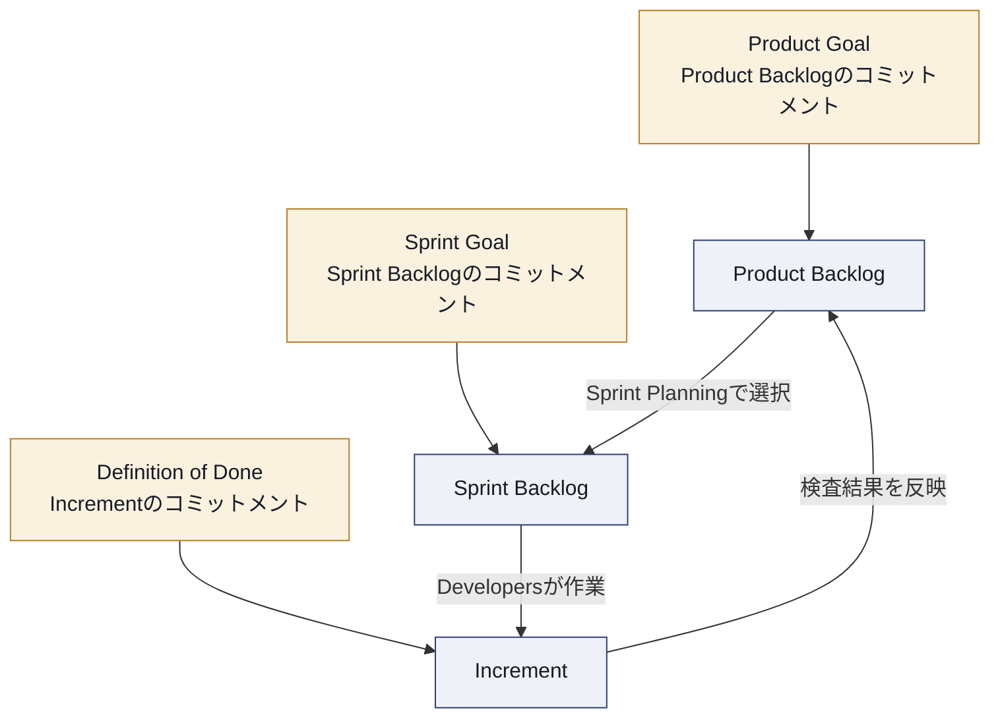

Product Backlogが「創発的（emergent）」と言われるのは、プロダクト・環境・市場について学べば学ぶほど、その内容が変化し続けるためです。固定された要件一覧ではなく、常に「今わかっている最善の理解」を反映する生きたリストです。

Product Backlog Itemの属性には少なくとも次のようなものがあります：説明（Description）、順序（Order）、見積り（Estimate）、価値（Value）。

Sprint Backlogは、Sprint Goalを危険にさらさない範囲であれば、Sprint中でもDevelopersによって自由に更新できます（例：新たに判明した必要タスクの追加、不要になったタスクの削除、計画の見直し）。これは、Sprint Backlogのコミットメントが個々のタスクではなく**Sprint Goal**だからです。

1つのSprint内でも、Product Backlog Itemが完成するたびに複数のIncrementが生まれることがあります。Sprint Review時点でこれらを合算したものが検査対象のIncrementとなります。

Sprint Goalは、Sprint Planningで設定される「なぜこのSprintが価値あるのか」という単一の目的であり、Sprint中は変更されません。これは、Sprint Goalこそがチームの一貫性・焦点・柔軟性のよりどころであり、途中で目的そのものを変えてしまうとその意義が失われるためです（達成に向けたスコープの調整は許容されます）。

Definition of Done（DoD）は、Incrementの品質基準を定義する公式な記述であり、組織標準がある場合はそれを最低ラインとして踏襲し、時間の経過とともに新たな品質要求（例：新しいテスト基準）を反映して**進化**します。複数のScrumチームが同じプロダクトのProduct Backlogを共有して作業する場合、DoDを共有・統一しておく理由は少なくとも2つあります。

1. どのチームが作ったIncrementでも、統合後に同じ品質水準を満たしていることを保証するため
2. 「完成」の定義がチームごとにバラバラだと、統合されたIncrement全体の透明性・信頼性が損なわれるため

> **ベストプラクティス**
> - PO自身がSprint Goalの言語化に主体的に関わる。Sprint GoalはPBIのリストの寄せ集めではなく「なぜ」を一文で語れる形にする。
> - 複数チームで1つのProduct Backlogを扱う場合、DoDは最初にチーム横断で合意し、変更時は必ず関係チーム全員に共有する。

---

## 第4章：カテゴリ1 － Product Owner Core Competencies（プロダクトオーナーの中核能力）

ここからは、CSPO Learning Objectives本体の5カテゴリを順に解説します。第1カテゴリは、Product Ownerというロールそのものの基盤となる能力群です。

### 4.1（LO 1.1）組織設計とPOアカウンタビリティの関係

> **学習目標原文の要旨**：POのアカウンタビリティの果たし方に影響する、少なくとも3つの異なる組織設計について議論する。

Scrum GuideはPOの「何を（What）」に対するアカウンタビリティを定義しますが、「どのように組織内で実現するか」は組織ごとに大きく異なります。代表的な3つの組織設計パターンを比較します。

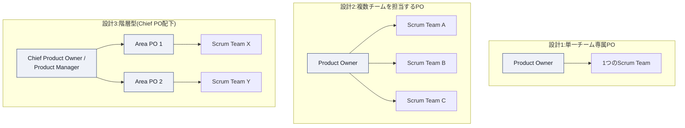

| 組織設計 | 特徴 | POアカウンタビリティへの影響 |
|---|---|---|
| 単一チーム専属PO | Scrum Guideが想定する基本形。1人のPOが1つのScrum Teamと密接に協働 | 意思決定が最速。ただし複数プロダクトラインを持つ組織ではスケールしにくい |
| 複数チームを担当するPO | 1つのプロダクトを複数のScrum Teamで開発する場合に、単一のProduct Backlogを1人のPOが管理 | ステークホルダー対応・詳細化の負荷が増大し、委任（delegation）が不可欠になる |
| 階層型（Chief PO / Product Manager配下にArea PO） | 大規模組織で、戦略レベルのPOと現場レベルのPOを分離 | 現場のArea POの権限が限定され、Scrum Guideが求める「単一の意思決定者」が曖昧になりやすいリスクがある |

> **ベストプラクティス**
> - 階層型を採用する場合でも、各Scrum TeamにとってのProduct Backlogの最終決定者が「常に1人」であることを明確にする（曖昧な二重権限を避ける）。
> - 組織設計を変える前に、現行設計でPOのアカウンタビリティ（価値最大化）がどこで阻害されているかを可視化する。

### 4.2（LO 1.2）ステークホルダーへの進捗の透明性確保

> **学習目標原文の要旨**：ゴールに向けた進捗についてステークホルダーに透明性を提供する技法を少なくとも1つ使う。

技法の例：

- **Sprint Reviewへの招待**：完成したIncrementを実際に見せ、Product Goalへの進捗を議論する最も強力な透明性確保の場
- **プロダクトロードマップ（Now-Next-Later形式）**：確定度に応じてテーマを整理し、「確約ではなく方向性」であることを明示して共有
- **バーンアップチャート**：Product Goal達成に向けた進捗をスコープの変化とともに可視化
- **公開されたProduct Backlogの順序**：誰でも「次に何が来るか」を確認できる状態にする

> **ベストプラクティス**
> - ロードマップは「日付のコミットメント」ではなく「確信度付きの方向性」として提示し、期待値のズレを防ぐ。
> - Sprint Reviewを単なる報告会にせず、双方向のフィードバック収集の場として設計する。

### 4.3（LO 1.3）ステークホルダーから情報・洞察を得る技法

> **学習目標原文の要旨**：ステークホルダーから情報や洞察を集める技法を少なくとも3つ挙げる。

1. **1対1インタビュー**：深い文脈・感情・優先度の背景を理解する
2. **ステークホルダーマッピング（Power/Interestグリッド）**：関与度・影響力に応じてコミュニケーション頻度を設計する
3. **ワークショップ（Impact Mapping／Story Mapping）**：複数ステークホルダーの視点を1枚の地図に統合する
4. **Sprint Reviewでのフィードバック収集**：実際のIncrementに対する反応を定量・定性の両面で収集する
5. **利用データ・アナリティクスの分析**：発言ではなく実際の行動から洞察を得る

> **ベストプラクティス**
> - 「声の大きいステークホルダー」の意見に引っ張られないよう、複数の技法を組み合わせて三角測量（トライアンギュレーション）する。

### 4.4（LO 1.4）スクラムイベント・Sprintを通じたPOの関わり方

> **学習目標原文の要旨**：スクラムイベント中およびSprintを通じて、POが他のスクラムチームメンバーとどのように関わるかを説明する。

| 場面 | POの関わり方 |
|---|---|
| Sprint Planning | Product Goalと優先順位の背景を説明し、「なぜこのSprintが価値あるのか」の議論をリードする |
| Backlog Refinement | Developersと共同でItemを詳細化し、受け入れ基準や期待するアウトカムをすり合わせる |
| Daily Scrum | 出席は必須ではないが、Developersが必要とする即時の意思決定に応じられる状態でいる |
| Sprint中の随時対応 | Sprint Goalを危険にさらさない範囲で、要件の疑問点にタイムリーに答える |
| Sprint Review | 進捗と学びをステークホルダーに共有し、フィードバックをProduct Backlogに反映する |
| Sprint Retrospective | 1人のScrum Teamメンバーとして、プロセス改善に対等な立場で参加する |

> **ベストプラクティス**
> - POは「発注者」ではなく「Scrum Teamの一員」として振る舞う。Developersへの一方的な指示ではなく、対話を通じた合意形成を優先する。

### 4.5（LO 1.5）複数チームを担当するPOの課題克服

> **学習目標原文の要旨**：複数のスクラムチームのPOであることの課題を克服する方法を少なくとも2つ特定する。

1. **詳細化の委任**：Developersやプロキシ的役割（Business Analystなど）に日々のリファインメントの一部を委任しつつ、最終的な優先順位決定の権限はPOが保持する
2. **単一で共有されたProduct Backlog**：チームごとに別のバックログを作らず、1つのバックログをすべてのチームが参照する構造にすることで矛盾した優先順位付けを防ぐ
3. **チーム間の同期の場を設ける**：合同リファインメントや「PO for POs」的な場を設け、依存関係や優先順位の衝突を早期に発見する
4. **ツールによる可視化**：ダッシュボード等でどのチームが何を進めているかを一望できるようにし、認知負荷を下げる

> **ベストプラクティス**
> - 委任するのは「作業」であって「アカウンタビリティ」ではないことをチームに明示する。最終判断が必要な場面は必ずPOにエスカレーションされる経路を作る。

### 4.6（LO 1.6）POが単一人物である理由

> **学習目標原文の要旨**：POがグループでも委員会でもなく単一の人物である理由を少なくとも2つ議論する。

1. **意思決定の速さと一貫性**：複数人の合議制では優先順位の変更のたびに合意形成のコストが発生し、Scrumが前提とする素早い適応が阻害される
2. **アカウンタビリティの明確化**：Scrum Guideは「Product Backlogを変更したい人は、Product Ownerを説得しなければならない」と定めており、責任の所在が1人に集約されることで、意思決定に対する説明責任が明確になる
3. （補足）委員会制では政治的な駆け引きにより、声の大きいステークホルダーの意見がバックログに反映されやすくなるリスクがある

> **ベストプラクティス**
> - PO自身が多くのステークホルダーの声を「代弁」する存在であると自覚し、独断ではなく十分な情報収集の上での単独決定を行う。

### 4.7（LO 1.7）Product Backlogに対するPOの権限と協働のバランス

> **学習目標原文の要旨**：POが開発者やステークホルダーと協働しながら、Product Backlogに対する権限をどのように・なぜ維持するのかを議論する。

POの権限（Authority）はScrum Guideに明記された「アカウンタビリティ」に由来します。しかし権限は独裁を意味しません。

- **Developersからの入力**：実現可能性、技術的な複雑性、依存関係についての情報を提供してもらい、順序判断の精度を高める
- **ステークホルダーからの入力**：ビジネス上の背景、市場機会、リスクの情報を提供してもらう
- **POの最終判断**：これらの情報を統合し、最終的な内容・順序を決定する。これは「独裁」ではなく「情報を集約した上での意思決定の一元化」

> **ベストプラクティス**
> - 「決めるのはPOだが、決める材料は皆で作る」という姿勢を明示的にチームに伝え、協働と権限のバランスに対する誤解を防ぐ。

---

## 第5章：カテゴリ2 － Goal Setting and Planning（ゴール設定と計画）

### 5.1（LO 2.1）Product VisionとProduct Goalの関係

> **学習目標原文の要旨**：プロダクトビジョンとプロダクトゴールの関係を説明する。

**Product Vision（プロダクトビジョン）**はScrum Guideの正式な用語ではありませんが、実務上のPOにとって不可欠な「なぜこのプロダクトが存在するのか」という長期的・野心的な方向性です。一方**Product Goal**は、Scrum Guide 2020で正式に定義された、Product Backlogのコミットメントであり、「Scrum Teamが計画のよりどころにできる、プロダクトの将来状態」を指します。

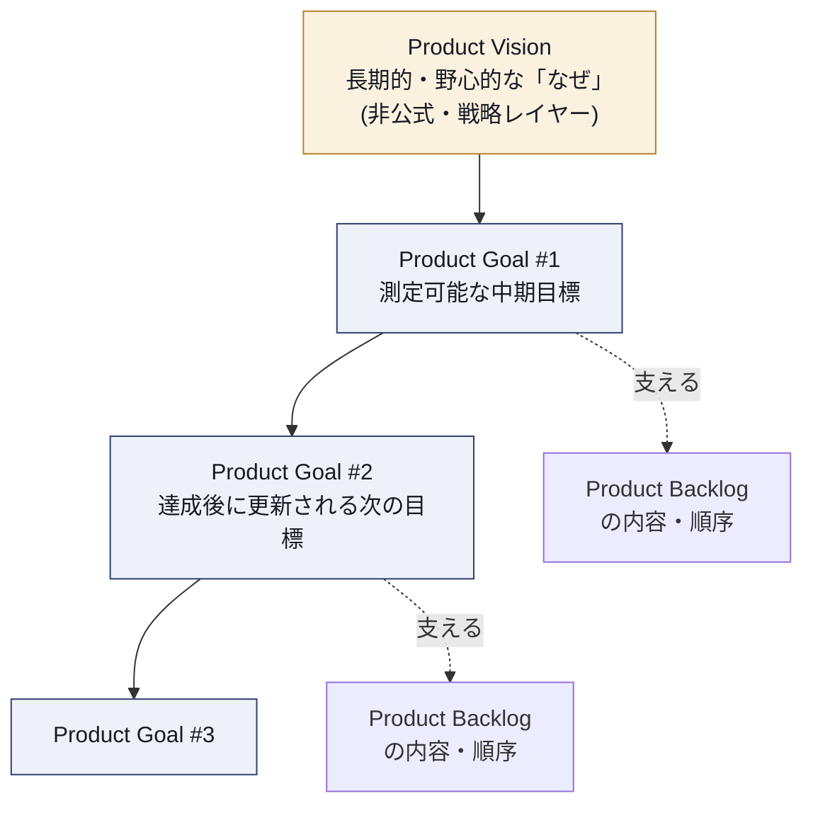

Visionが「北極星」だとすれば、Product Goalはその方向に向かって設定される「次に到達すべき具体的な中間地点」です。1つのProduct Goalが達成される（または陳腐化して破棄される）と、Scrum Teamはビジョンに向けて次のProduct Goalに着手します。

> **ベストプラクティス**
> - Visionは変わりにくく、Product Goalは学びに応じて数か月単位で更新される、という時間軸の違いをチームと共有しておく。
> - Product GoalはProduct Backlogの中に明示的に記載し、常に参照できるようにする。

### 5.2（LO 2.2）Product Goalの作成を実践する

> **学習目標原文の要旨**：プロダクトゴールの作成を練習する。

実践的な作り方の一例：

1. Visionから逆算し、「次の3〜6か月で何が達成されれば前進と言えるか」を書き出す
2. 「対象（誰のために）」「達成状態（何がどう変わるか）」「測定可能な基準（どう検証するか）」の3要素をテンプレート化する（例：「〇〇という顧客層に対し、△△という成果を実現する。成功は□□で測る」）
3. 単一の焦点になっているか（複数の無関係な目標を混ぜていないか）を確認する
4. ステークホルダー・Developers双方が「腹落ち」する言葉になっているか対話で確認する

> **ベストプラクティス**
> - Product Goalは「機能のリスト」ではなく「状態・成果」で書く。「〇〇機能を実装する」ではなく「〇〇によって顧客の△△という課題が解消された状態にする」という書き方にする。

### 5.3（LO 2.3）Sprint Goalの作成をScrum Teamと実践する

> **学習目標原文の要旨**：スクラムチームとスプリントゴールの作成を練習する。

Sprint GoalはSprint Planningの中で、Scrum Team全員の対話を通じて作られます。

1. POがProduct Goalと現在の優先順位の背景（なぜこのタイミングでこのItem群なのか）を共有する
2. チーム全員で「このSprintが終わったとき、何が達成されていれば価値があると言えるか」を1文で言語化する
3. 選定したProduct Backlog Itemsが、そのSprint Goalに対してどう貢献するかを確認する
4. Sprint Goalが単なる「タスクの寄せ集めの言い換え」になっていないかをレビューする

> **ベストプラクティス**
> - Sprint Goalの草案が出たら「これが達成できなかったとき、Sprintは失敗だったと言えるか？」を自問し、真に本質的な目的になっているか検証する。

### 5.4（LO 2.4）ステークホルダーとのプロダクト計画・予測の構成要素

> **学習目標原文の要旨**：ステークホルダーとのプロダクト計画または予測の構成要素を挙げる。

| 構成要素 | 内容 |
|---|---|
| Product Goal | 今、Scrum Teamが目指している中期的な到達点 |
| ロードマップ上のテーマ／マイルストーン | Now-Next-Laterなどで表現される大まかな方向性 |
| 前提・リスク | 計画が依拠している仮説と、それが崩れた場合の影響 |
| 対象市場・顧客セグメント | 誰に向けた計画か |
| 成功指標 | 何をもって成功と判断するか（アウトカム指標） |
| 予測レンジ（幅を持たせた見積り） | 過去の実績（ベロシティ・スループット）に基づく確率的な幅のある予測 |
| 依存関係 | 他チーム・他システム・外部要因への依存 |

> **ベストプラクティス**
> - 予測は単一の日付ではなく「幅（レンジ）」で提示し、不確実性を隠さない。

### 5.5（LO 2.5）プロダクトリリースの計画方法

> **学習目標原文の要旨**：プロダクトリリースの計画方法を説明する。

1. リリースの目的（Product Goalとの関係）を明確にする
2. リリースに必要な最小限の価値ある機能群（Minimum Viable/Valuable増分）をProduct Backlogの上位に配置する
3. 過去の実績データ（スループット・ベロシティ）を用いた経験的予測（例：モンテカルロ法によるレンジ予測）でリリース時期を見立てる
4. Sprint Reviewのたびにリリース計画を見直し、学びに応じて再調整する
5. 技術的な準備状況（Definition of Doneの充足）や、規制・市場投入のタイミングといった外部制約を考慮する

> **ベストプラクティス**
> - 「いつ全部終わるか」ではなく「いつ最初の価値を届けられるか」を起点に計画する。

### 5.6（LO 2.6）小さく価値があり利用可能な増分を見極めるアプローチ

> **学習目標原文の要旨**：小さく、価値があり、利用可能な増分を特定するアプローチを少なくとも2つ説明する。

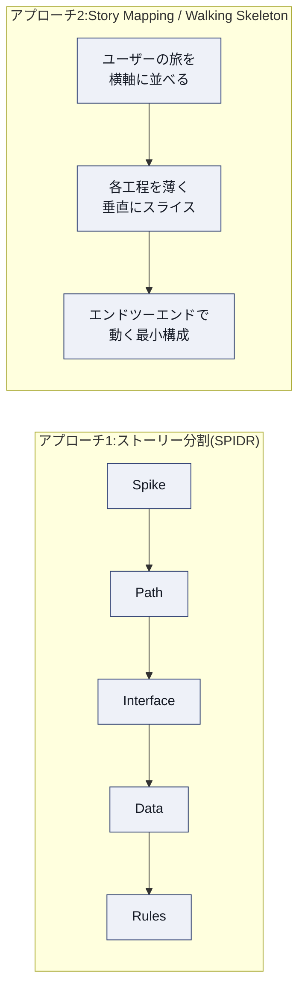

1. **ストーリー分割技法（例：SPIDRパターン）**：Spike（調査）・Path（分岐の単純化）・Interface（画面/操作の単純化）・Data（データ範囲の縮小）・Rules（ビジネスルールの単純化）の切り口で、大きなItemを小さく分割する
2. **Story MappingとWalking Skeleton**：ユーザーの利用の流れを横軸に、機能の厚みを縦軸に配置し、まずはエンドツーエンドで細く動く「歩く骨格」を作ってから厚みを増していく

いずれも、早期にフィードバックを得ながら、各増分が単体で「利用可能（usable）」であることを重視します。

> **ベストプラクティス**
> - 「小さいが無意味な増分」にならないよう、分割後も各Itemが独立した価値仮説を持っているかを確認する。

---

## 第6章：カテゴリ3 － Understanding Customers and Users（顧客とユーザーの理解）

### 6.1（LO 3.1）POのプロダクトディスカバリーと検証への組み込み方

> **学習目標原文の要旨**：POがどのようにプロダクトディスカバリーと検証を自身の仕事に組み込むかを説明する。

現代のプロダクトオーナーシップでは、「作る（Delivery）」と並行して「何を作るべきかを探る（Discovery）」を継続的に行う、いわゆる**デュアルトラック（Dual-Track）**の考え方が広く実務で採用されています。

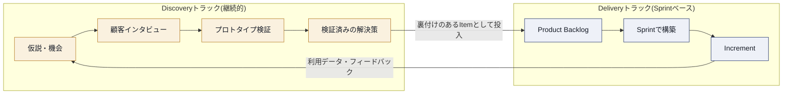

POはSprintの計画・レビューといった「配送」の仕事に加え、日常的に顧客インタビュー、利用データの分析、プロトタイプでの反応確認などの「探索」の仕事を並行して行い、その結果を継続的にProduct Backlogへ反映します。

> **ベストプラクティス**
> - ディスカバリーを「バックログが空になったときにまとめてやる特別イベント」にせず、毎週一定時間を確保する習慣にする。

### 6.2（LO 3.2）顧客・ユーザーのセグメンテーション手法

> **学習目標原文の要旨**：顧客またはユーザーをセグメント化するアプローチを少なくとも1つ図解する。

| セグメンテーション手法 | 切り口 | 適する場面 |
|---|---|---|
| デモグラフィック／ファームグラフィック | 年齢・地域・業種・企業規模など | マーケティング的な大枠の分類 |
| 行動ベース（Behavioral） | 利用頻度・利用機能・購買パターン | プロダクト内の行動データが豊富な場合 |
| ニーズベース／Jobs-to-be-Done | 「片付けたい用事（Job）」単位 | 表面的な属性より本質的な動機を掴みたい場合 |
| ペルソナ | 上記を統合した架空の代表人物像 | チーム全体での共通認識・共感の醸成 |

> **ベストプラクティス**
> - セグメントは「作って終わり」にせず、Product Backlogの優先順位判断に実際に使う（例：「このItemはどのセグメントに効くか」を常に自問する）。

### 6.3（LO 3.3）相反する顧客・ユーザーニーズへの対処技法

> **学習目標原文の要旨**：相反する顧客（またはユーザー）ニーズに対処する技法を少なくとも1つ練習する。

- **Kanoモデル**：機能を「当たり前品質」「一元的品質（性能）」「魅力的品質（感動）」に分類し、相反するニーズがどの品質次元に属するかで優先度を判断する
- **Impact/Effortマトリクス**：それぞれのニーズが持つインパクトと実現コストを2軸で可視化し、対話の土台にする
- **Product Goalを判断基準にした対話**：個別の要望の是非ではなく、「どちらがProduct Goalへの貢献が大きいか」という共通の物差しで議論する

> **ベストプラクティス**
> - 対立するステークホルダー双方に「なぜその機能が必要か（Why）」を語ってもらい、表面的な要求（What）の奥にある本当のニーズを探ってから優先順位を判断する。

### 6.4（LO 3.4）プロダクトディスカバリーが成功に貢献する側面

> **学習目標原文の要旨**：プロダクトディスカバリーの少なくとも3つの側面が、どのようにプロダクトの成功に貢献するかを特定する。

1. **リスクの低減**：望ましさ（Desirability）・実現可能性（Feasibility）・事業性（Viability）を作る前に検証することで、無駄な開発を防ぐ
2. **チームの共感の醸成**：Developers自身が顧客の課題を直接理解することで、当事者意識と提案の質が上がる
3. **意思決定の根拠形成**：意見ではなく証拠に基づいてProduct Backlogの優先順位を語れるようになる
4. （補足）Product Goal設定の現実性向上：市場の実態に基づいた、達成可能な目標設定につながる

> **ベストプラクティス**
> - ディスカバリーの成果（インタビューメモ、実験結果）をチームで共有可能な形（wiki、共有ボードなど）で蓄積し、属人化させない。

### 6.5（LO 3.5）開発者を顧客・ユーザーに直接つなげるアプローチ

> **学習目標原文の要旨**：開発者を顧客やユーザーに直接つなげるアプローチを少なくとも3つ挙げる。

1. Developersを顧客インタビュー・ユーザビリティテストに同席させる
2. 実際の顧客・ステークホルダーをSprint Reviewに招待し、Developers自身が直接フィードバックを受け取る場を作る
3. サポート窓口に寄せられた顧客の声・チケットをDevelopersが直接閲覧できるチャネルを用意する
4. 利用状況のアナリティクスダッシュボードをチーム全員がアクセス可能にする

> **ベストプラクティス**
> - 「PO経由で伝聞のフィードバックを受け取る」のではなく、Developersが一次情報に触れる頻度を意図的に増やす設計にする。

---

## 第7章：カテゴリ4 － Validating Product Assumptions（プロダクト仮説の検証）

### 7.1（LO 4.1）Scrumがプロダクト仮説の検証をどう支えるか

> **学習目標原文の要旨**：Scrumがプロダクトの仮説検証をどのようにサポートするかを説明する。

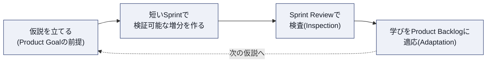

経験主義の三本柱（透明性・検査・適応）と短いSprintの組み合わせにより、Scrumは「仮説を立てる→小さく検証する→学びを反映する」というループを高速に回すための土台になります。Product Backlogが創発的であることも、検証結果に応じて計画を柔軟に組み替えることを可能にします。POはこの仕組みを活用し、最もリスクの高い（不確実性の高い）仮説から優先的に検証するようProduct Backlogを組み立てます。

> **ベストプラクティス**
> - 「一番怖い前提は何か」をチームで棚卸しし、それを検証するItemを意図的にProduct Backlogの上位に置く。

### 7.2（LO 4.2）プロダクト仮説の検証アプローチをコストと学習の質で比較する

> **学習目標原文の要旨**：プロダクトの仮説を検証するアプローチを、コストと学習の質という観点で少なくとも3つ比較する。

| 検証アプローチ | コスト | 学習の質（信頼性） | 得られるもの |
|---|---|---|---|
| 顧客インタビュー・アンケート | 低い | 発言ベースのため中〜低（言行不一致のリスク） | 課題の背景・言語化された動機 |
| プロトタイプ／ユーザビリティテスト | 中程度 | 行動観察が入るため中〜高 | 操作上の問題、意図の実際の理解度 |
| ランディングページ／フェイクドア／コンシェルジュMVP | 低〜中程度 | 実際の申込・クリックという行動データのため高 | 需要の実在性、価格受容性の兆候 |
| 実装したIncrementでのA/Bテスト | 高い（実装コストが必要） | 最も高い（実際の利用行動そのもの） | 定量的な因果関係に近いエビデンス |

> **ベストプラクティス**
> - コストが低い検証から着手し、仮説の確度が上がるにつれて段階的にコストの高い検証へ進める「検証のはしご」を意識する。
> - 「作ってみないとわからない」という思い込みを疑い、実装前に検証できる方法がないか常に探す。

---

## 第8章：カテゴリ5 － Working with the Product Backlog（プロダクトバックログの運用）

### 8.1（LO 5.1）アウトカムとアウトプットの関係

> **学習目標原文の要旨**：アウトカムとアウトプットの関係を説明する。

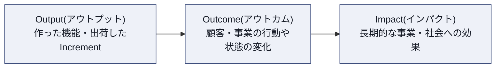

**Output（アウトプット）**は「作ったもの」（機能、Increment、リリース数）であり、**Outcome（アウトカム）**は「その結果として実際に生まれた顧客行動や事業指標の変化」です。多くのアウトプットを出しても、顧客の行動が変わらなければアウトカムはゼロです。POの本質的な仕事は、アウトプットの量を最大化することではなく、**最小のアウトプットで最大のアウトカムを生む**ことにあります。

> **ベストプラクティス**
> - Sprint Reviewでは「何を作ったか」だけでなく「それによって何が変わったか（変わりそうか）」を必ず議論する。

### 8.2（LO 5.2）アウトカム・インパクトを最大化しアウトプットを最小化する行動

> **学習目標原文の要旨**：アウトカム・インパクトを最大化し、アウトプットを最小化するために、POが取り得る行動を少なくとも3つ挙げる。

1. 価値の低いItemをProduct Backlogから積極的に取り除く（「やらないことを決める」）
2. 実装前にディスカバリーで仮説を検証し、無駄な構築を未然に防ぐ
3. 利用されていない既存機能を削除・簡素化し、保守コストを下げる（「引き算」で価値を生む）
4. Impact/EffortやWSJFのような手法で、労力対効果の高いItemを優先する
5. 出力指標（完了したItem数など）ではなく、成果指標（利用率、満足度など）でチームの成功を評価する

> **ベストプラクティス**
> - スプリントレビューやロードマップの評価軸に、意図的に「アウトカム指標」を組み込み、アウトプット偏重の評価文化を避ける。

### 8.3（LO 5.3）プロダクト経済性に関する用語

> **学習目標原文の要旨**：プロダクト経済性に関連する用語を少なくとも3つ定義する。

| 用語 | 定義 |
|---|---|
| Cost of Delay（遅延コスト） | ある機能の提供が遅れることによって失われる価値（時間の経過に対する価値損失） |
| WSJF（Weighted Shortest Job First） | Cost of Delayを実現に要する期間（Job Size）で割り、優先順位を数値化する手法 |
| ROI（投資対効果） | 投じたコストに対して得られたリターンの比率 |
| Opportunity Cost（機会費用） | あるItemに取り組むことで、代わりに実行できなかった他の選択肢の価値 |
| Sunk Cost（埋没費用） | すでに投じてしまい、今後の意思決定に影響を与えるべきではないコスト |

> **ベストプラクティス**
> - 優先順位付けの議論で「もう投資したから」（サンクコスト）という理由が出てきたら、それが将来価値の判断を歪めていないか確認する。

### 8.4（LO 5.4）異なるステークホルダー群から見た「価値」

> **学習目標原文の要旨**：少なくとも3つの異なるステークホルダー群の視点から「価値」を説明する。

| ステークホルダー群 | 価値の捉え方 |
|---|---|
| エンドユーザー・顧客 | 課題が解決されること、使いやすさ、体験の満足度 |
| 事業・経営層 | 売上・市場シェア・戦略との整合性、投資対効果 |
| Developers・技術組織 | 保守性、技術的負債の軽減、持続可能な開発ペース |
| サポート・運用部門 | インシデントの減少、運用負荷の軽減 |
| 規制・コンプライアンス部門 | リスクの低減、法令遵守 |

> **ベストプラクティス**
> - Product Backlog Itemの優先順位を議論する際、暗黙のうちにどのステークホルダー群の「価値」を優先しているかを明示的に言語化する。

### 8.5（LO 5.5）価値を測定する技法

> **学習目標原文の要旨**：価値を測定する技法を少なくとも3つ挙げる。

1. **OKR（Objectives and Key Results）**：目標とその達成度を測る主要な結果指標を組み合わせる
2. **利用・定着率などのプロダクトアナリティクス**：実際の行動データに基づく測定
3. **NPS（Net Promoter Score）・CSAT（顧客満足度）**：顧客の主観的評価を定量化する
4. **Cost of Delayの定量化**：遅延によって失われる価値を金額や時間で見積もる
5. **A/Bテストによるリフト測定**：変更前後の指標差分を統計的に評価する

> **ベストプラクティス**
> - 単一の指標に依存せず、行動指標（アナリティクス）と態度指標（NPS/CSAT）を組み合わせて多面的に価値を把握する。

### 8.6（LO 5.6）Product Goal達成を支えるProduct Backlogの作成

> **学習目標原文の要旨**：プロダクトゴールの達成を支えるプロダクトバックログを作成する。

Roman Pichlerが提唱する**DEEP**属性は、健全なProduct Backlogの特徴を端的に表す実務上よく使われるフレームワークです。

| 属性 | 意味 |
|---|---|
| Detailed appropriately | 上位のItemほど詳細に、下位ほど粗く（適切な詳細度の階調） |
| Emergent | 学びに応じて常に変化し続ける |
| Estimated | 相対的にでも見積りがされている |
| Prioritized（Ordered） | 価値・リスク・依存関係に基づいて順序付けられている |

すべてのItemがProduct Goalに紐づいているかを定期的に確認し、Goalに貢献しないItemが紛れ込んでいないかをレビューすることが、Goal達成を支えるバックログ運用の要となります。

> **ベストプラクティス**
> - Product Backlogの先頭付近（次の1〜2 Sprint分）は「準備完了（Ready）」の水準まで詳細化し、下位は意図的に粗いままにしておく。

### 8.7（LO 5.7）望ましいアウトカムと価値を含むProduct Backlog Itemの作成

> **学習目標原文の要旨**：望ましいアウトカムと価値の説明を含む、少なくとも1つのプロダクトバックログアイテムを作成する。

代表的なフォーマット（User Story形式）：

> As a〈利用者〉, I want〈実現したいこと〉, so that〈得られる価値・アウトカム〉

これに加えて、実務では次の要素を補うことが推奨されます。

- **受け入れ基準（Acceptance Criteria）**：完成の判断基準を明確化
- **アウトカム仮説**：「このItemが完成すれば、〇〇という指標が△△に変化するはずだ」という検証可能な仮説
- **サイズ／見積り**：相対サイズなど

> **ベストプラクティス**
> - "so that"の部分（価値・アウトカム）を空欄のまま次に進めない。ここが書けないItemは、そもそも作るべきかを疑う。

### 8.8（LO 5.8）Product Backlogのリファインメントを実践する

> **学習目標原文の要旨**：プロダクトバックログをリファインメントするアプローチを少なくとも1つ練習する。

実践的な進め方の一例：

1. 直近1〜2 Sprint分のItemに絞って詳細化する（Just-In-Time）
2. Story Mapping等を使い、Product Goal全体像の中でのItemの位置づけを確認しながら詳細化する
3. Planning Poker等の相対見積り手法でチーム全体の認識を揃える
4. 新しい学び（顧客フィードバック・技術的発見）を反映して順序を継続的に見直す

> **ベストプラクティス**
> - リファインメントをPOだけの作業にせず、Developersと共同で行う。技術的な実現可能性の議論をこの場で済ませておくことで、Sprint Planningがスムーズになる。

---

## 第9章：ベストプラクティス総合チェックリスト

これまでの章で紹介したベストプラクティスを、日々の実務で使えるチェックリストとして再構成しました。

### プロダクトオーナーとしての基本姿勢

- [ ] Product Backlogに対する最終決定権は自分にあることを自覚しつつ、独断ではなく十分な情報収集の上で判断している
- [ ] Developersの「どう作るか」には介入せず、「何を・なぜ」の意思決定に集中している
- [ ] 経験主義（透明性・検査・適応）を自ら体現し、Product Backlogを常に最新に保っている
- [ ] 複数チームを担当する場合、委任と権限保持の境界を明確にしている

### ゴール設定と計画

- [ ] Product Visionと現在のProduct Goalの違いをチームに説明できる
- [ ] Product Goalを「機能」ではなく「状態・成果」で言語化している
- [ ] Sprint Goalが単なるItemの寄せ集めになっていないか、毎回検証している
- [ ] リリース計画を単一日付ではなく確率的なレンジで提示している
- [ ] 大きなItemを小さく価値ある増分に分割する技法（SPIDR、Story Mapping等）を使いこなせる

### 顧客とユーザーの理解

- [ ] Discovery（探索）とDelivery（構築）を並行して継続的に行っている
- [ ] セグメンテーションを実際の優先順位判断に活用している
- [ ] 対立するニーズをKanoモデルやImpact/Effortマトリクスで構造的に整理している
- [ ] Developersが顧客と直接接する機会を意図的に設計している

### プロダクト仮説の検証

- [ ] 最もリスクの高い仮説から検証する順序でProduct Backlogを組んでいる
- [ ] 実装前に検証できる方法（インタビュー、プロトタイプ、フェイクドア等）を優先的に検討している

### プロダクトバックログの運用

- [ ] アウトプットではなくアウトカムでチームの成功を測っている
- [ ] Product Backlogの各Itemが明確にProduct Goalへ紐づいている（DEEP属性を満たしている）
- [ ] Item作成時に"so that"（価値・アウトカム）を明確に書いている
- [ ] リファインメントをDevelopersと共同で継続的に実施している

---

## 第10章：認定後のキャリアパスと資格更新（A-CSPO／CSP-PO／SEU）

### 10.1 資格更新の基本ルール

CSPOをはじめとするScrum Alliance認定は「一度取得したら終わり」の終身資格ではなく、**2年ごとの更新**が必要です。更新には、更新料の支払いと、規定数の**Scrum Education Units（SEU）**の提出が必要です。

SEUは、書籍を読む、ウェビナーを視聴する、イベントに参加するなど、継続的な学習活動によって獲得できる「学びのクレジット」です。SEUを更新要件に組み込むことで、Scrum Alliance認定は「知識が更新され続けていること」を雇用主に示す仕組みになっています。

### 10.2 上位資格による自動更新

CSPOを取得した後、上位資格である**A-CSPO（Advanced Certified Scrum Product Owner）**や**CSP®-PO（Certified Scrum Professional® - Product Owner）**を取得・更新すると、CSPO自体も自動的に更新されます。つまり、実務でプロダクトオーナーシップを深めながらキャリアアップすることが、そのまま基礎資格の維持にもつながる設計です。

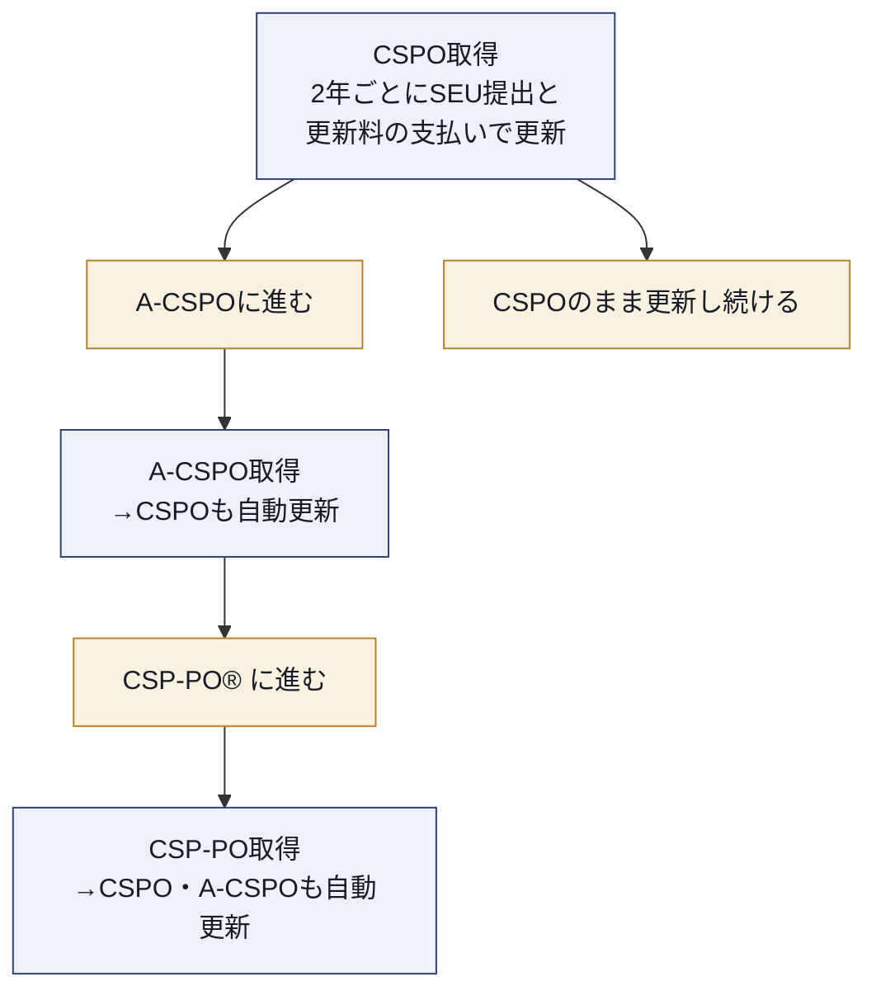

### 10.3 A-CSPO（Advanced Certified Scrum Product Owner）

A-CSPOは、CSPO取得者が実務経験を積んだ後に目指す上位資格です。Scrum Alliance公式ページが定める認定要件は次のとおりで、いずれも必須です。

1. **CSPO認定を保有していること**（有効・失効いずれでも可。A-CSPO取得時にCSPOも自動更新される）
2. **直近5年以内に、Product Ownerアカウンタビリティに固有の実務経験を12か月以上**保有していることの証明
3. **Scrum Alliance承認の教育提供者によるA-CSPOコースを受講**すること
4. 事前・事後課題を含む**コースの全構成要素を修了**すること
5. **A-CSPOライセンス契約に同意し、Scrum Allianceのメンバープロフィールを完成**させること

取得後は、SEUの獲得と2年ごとの更新によって認定を維持します。学習内容は、ステークホルダーコラボレーションのスケーリング、プロダクト戦略・計画の高度化、仮説検証の高度な手法、Product Backlogの高度な優先順位付け・リファインメント技法などが含まれます。

### 10.4 CSP®-PO（Certified Scrum Professional® - Product Owner）

CSP-POは、Product Ownerとしての専門性をさらに高めた上位資格で、アジャイルコーチやトレーナーを目指す人にとっても足がかりとなる資格です。Scrum Alliance公式ページが定める認定要件は次のとおりで、いずれも必須です。

1. **A-CSPO認定を保有していること**（有効・失効いずれでも可。CSP-PO取得時にA-CSPOとCSPOも自動更新される）
2. **Scrum Alliance承認のCSP-PO教育プログラムを受講**すること
3. 事前・事後課題を含む**全構成要素を修了**すること
4. **CSP-POライセンス契約に同意し、Scrum Allianceのメンバープロフィールを完成**させること
5. **直近5年以内に、Product Ownerのロールに固有の実務経験を24か月以上**保有していることの証明

SEUは認定の**維持（2年ごとの更新）**のための仕組みであり、上記の必須要件を代替するものではありません。

> **ベストプラクティス**
> - CSPO取得後すぐにA-CSPOを目指すのではなく、まず実務でProduct Backlog運用・ステークホルダー折衝の経験を積み、そこで直面した課題を言語化してからA-CSPOの学習に臨むと定着が良い。
> - SEUは更新直前にまとめて集めるのではなく、日常的な学習（記事・ウェビナー視聴など）を通じて継続的に積み上げる。

---

## 第11章：よくある誤解とアンチパターン

CSPO学習者・現場の新任Product Ownerが陥りやすい誤解を整理します。

| 誤解・アンチパターン | 実際には |
|---|---|
| POは「要求を右から左に流すだけの窓口」である | POはプロダクトの価値最大化にアカウンタビリティを持つ、能動的な意思決定者である |
| Product Backlogは一度作れば完成する | Product Backlogは創発的（emergent）であり、常に変化し続けるのが正常な状態である |
| Sprint Goalは「今スプリントでやるタスクの一覧」である | Sprint Goalは単一の目的・理由（Why）であり、タスクの寄せ集めではない |
| POが忙しいのでバックログの詳細化は開発チームに全部任せて口を出さない | 詳細化はDevelopersとの協働であり、POは価値・優先順位の観点で継続的に関与する必要がある |
| ベロシティ（アウトプット量）が高いほど良いPOである | 本質的な評価軸はアウトカム（顧客・事業への実際の効果）である |
| 複数のPOで1つのProduct Backlogを分担管理する | Product Backlogの最終決定者は常に1人であるべきで、分担管理は優先順位の矛盾を招きやすい |
| ディスカバリー（顧客調査）は最初の一度だけ行えばよい | ディスカバリーはDeliveryと並行して継続的に行う活動である |
| ロードマップ上の日付は約束（コミットメント）である | ロードマップは方向性の提示であり、Sprintのコミットメントとは性質が異なる |

> **ベストプラクティス**
> - チーム内でこの表を共有し、「自分たちの現状はどのアンチパターンに近いか」を定期的に振り返る（Sprint Retrospectiveの題材にするのも有効）。

---

## 第12章：まとめ

CSPO学習目標は、大きく5つのカテゴリ（Product Owner Core Competencies／Goal Setting and Planning／Understanding Customers and Users／Validating Product Assumptions／Working with the Product Backlog）に整理されており、その土台にはScrum Foundationsで扱われるScrum理論・チーム構造・イベント・作成物の理解があります。

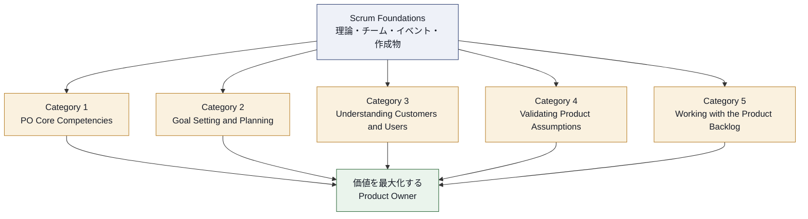

一貫して通底するテーマは、「Product Ownerは単一の意思決定者として、経験主義に基づき、顧客・ステークホルダー・Developersと協働しながら、アウトプットではなくアウトカム／インパクトを最大化する」という点です。CSPOの学習は知識の暗記にとどまらず、Product Goalの作成、Sprint Goalの作成、Product Backlog Itemの作成、リファインメントの実践など、多くの学習目標がApplication以上（Bloom's Taxonomy）を求めていることからもわかるように、**実践を通じて体得すること**を重視しています。

CSPO取得はゴールではなく、A-CSPO・CSP-POへと続くProduct Owner Trackの出発点です。日々の実務でここに整理したベストプラクティスを反復しながら、SEUを積み上げて資格を更新し続けることが、プロダクトオーナーとしての継続的な成長につながります。

---

## 第13章：参考文献・ソース一覧

本ガイドの内容は、以下の一次情報源に基づいています。学習を深める際は、必ず一次情報源（特にScrum Guideと公式Learning Objectives）を直接参照してください。

### Scrum Alliance公式情報

| 資料 | URL |
|---|---|
| Certified Scrum Product Owner®（CSPO®）公式紹介ページ | https://www.scrumalliance.org/get-certified/product-owner-track/certified-scrum-product-owner |
| CSPO Learning Objectives（2022年1月改訂／PDF、本ガイドの中核ソース） | https://www.scrumalliance.org/media/certifications/los/cspo_learning_objectives_2022.pdf |
| Scrum Foundations® Learning Objectives（2022年1月改訂／PDF） | https://www.scrumalliance.org/media/certifications/los/scrum_foundations_learning_objectives_2022.pdf |
| Product Owner Track 全体像 | https://www.scrumalliance.org/get-certified/product-owner-track |
| Advanced Certified Scrum Product Owner（A-CSPO） | https://www.scrumalliance.org/get-certified/product-owner-track/advanced-certified-scrum-product-owner |
| Certified Scrum Professional® - Product Owner（CSP®-PO） | https://www.scrumalliance.org/get-certified/product-owner-track/certified-scrum-professional-product-owner |
| Scrum Education Units（SEU）について | https://www.scrumalliance.org/get-certified/scrum-education-units |
| 資格更新（Renewing Certifications） | https://www.scrumalliance.org/get-certified/renewing-certifications |
| Scrum Alliance「About Scrum」（Scrumの基礎解説） | https://www.scrumalliance.org/about-scrum |
| Scrum Alliance Scrum価値観ページ | https://www.scrumalliance.org/about-scrum/values |
| Certified ScrumMaster®（CSM®）公式紹介ページ（CSM/CSPO比較の参照先） | https://www.scrumalliance.org/get-certified/scrum-master-track/certified-scrummaster |
| Scrum Master とは（What is a Scrum Master） | https://www.scrumalliance.org/what-is-a-scrum-master |

### フレームワークの一次情報源

| 資料 | URL |
|---|---|
| The Scrum Guide（Ken Schwaber & Jeff Sutherland, 2020年11月版） | https://scrumguides.org/scrum-guide.html |
| Manifesto for Agile Software Development（4つの価値） | https://agilemanifesto.org/ |
| Manifesto for Agile Software Development（12の原則） | https://agilemanifesto.org/principles.html |

### 関連リソース（Scrum Alliance Resource Library）

| 資料 | URL |
|---|---|
| What Are Product Goals in Scrum?（Product Goal解説記事） | https://resources.scrumalliance.org/article/product-goals-scrum |
| Are Features a Part of Scrum?（フィーチャーとScrumの関係） | https://resources.scrumalliance.org/article/features-scrum |
| What's a Typical Day for a Product Owner?（POの典型的な1日） | https://resources.scrumalliance.org/article/whats-typical-day-product-owner |
| Everything You Need to Know About Acceptance Criteria（受け入れ基準の解説） | https://resources.scrumalliance.org/article/need-know-acceptance-criteria |

> **著作権に関する注記**：The Scrum Guideは© 2020 Ken Schwaber and Jeff Sutherlandに帰属し、Creative Commons Attribution Share-Alike License v4.0のもとで利用されています（詳細：https://creativecommons.org/licenses/by-sa/4.0/legalcode ）。本ガイドはScrum Guideの内容を要約・解説したものであり、原文の引用ではありません。正確な定義・文言は必ず原典（scrumguides.org）を参照してください。

---

*本ガイドは学習支援を目的とした二次資料です。実際の受験・受講にあたっては、必ずScrum Alliance公式サイトおよび担当トレーナーが提供する最新情報を確認してください。CSPO®、Certified Scrum Product Owner®、Scrum Alliance®は、Scrum Allianceの登録商標です。*
