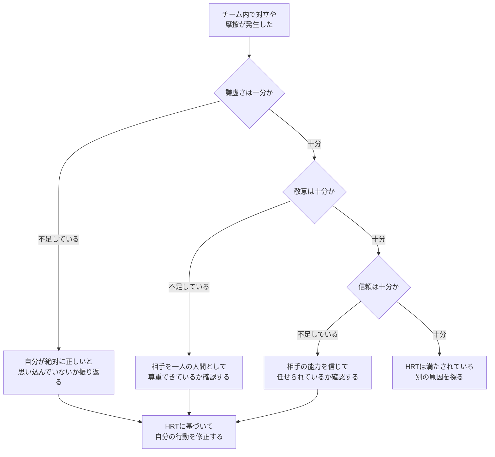
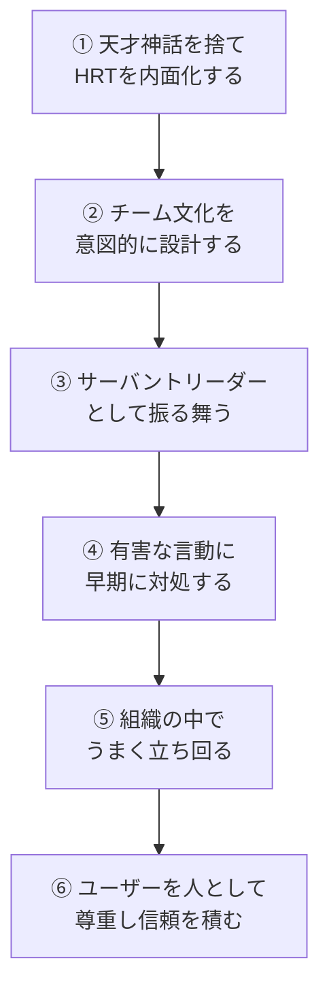
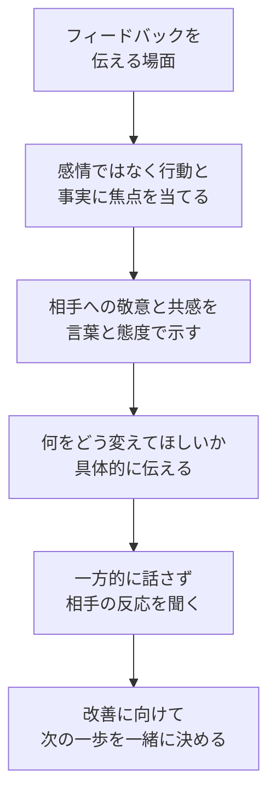
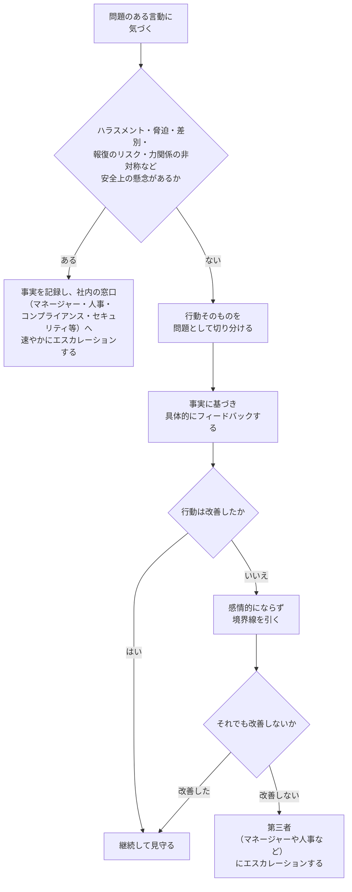

# Debugging Teams 完全ガイド ― チームの人間関係を「デバッグ」するベストプラクティス（初学者向け）

> 本ガイドは、O'Reilly刊 *Debugging Teams: Better Productivity through Collaboration*（Brian W. Fitzpatrick, Ben Collins-Sussman 著）の内容と、著名な国際的エンジニアによる書評・ブログ記事をもとに、初学者にもわかりやすくステップバイステップで要点を整理したものです。
> 参考にした一次情報・出典のURLは、末尾の「参考文献・出典」にまとめています。

## 目次

1. [この記事について](#この記事について)
2. [書籍概要：Debugging Teamsとは](#書籍概要debugging-teamsとは)
3. [なぜ「人間関係」もデバッグの対象なのか](#なぜ人間関係もデバッグの対象なのか)
4. [核心原則：HRT（謙虚さ・敬意・信頼）](#核心原則hrt謙虚さ敬意信頼)
5. [全体像：6つの章が描くチームの成長ステップ](#全体像6つの章が描くチームの成長ステップ)
6. [ステップバイステップ ベストプラクティス](#ステップバイステップ-ベストプラクティス)
7. [明日から使えるHRT実践チェックリスト](#明日から使えるhrt実践チェックリスト)
8. [まとめ](#まとめ)
9. [参考文献・出典](#参考文献出典)

---

## この記事について

対象読者は、次のような方々です。

- ソフトウェアエンジニアとしてチームで働き始めたばかりの初学者
- 技術力はあるが「人付き合い」や「チームワーク」に苦手意識がある方
- 初めてテックリードやマネージャーの役割を任された方
- スクラムマスターとしてチームの障害（＝人間関係の摩擦）を取り除きたい方

*Debugging Teams* は、技術書でありながらコードの話がほとんど出てきません。著者の2人はこう主張します。**エンジニアリングの成否を分けるのは技術力そのものよりも、人と協働する力である**、と。本ガイドでは、その考え方を実務に落とし込むための具体的なステップを紹介します。

---

## 書籍概要：Debugging Teamsとは

*Debugging Teams* は、Googleで長年チームを率いてきた Brian W. Fitzpatrick と、Subversionの創設開発者の一人である Ben Collins-Sussman による著作です。2人は「Working with Poisonous People（有害な人との付き合い方）」という講演シリーズで多くの支持を集め、その内容を書籍化しました。

初版は2012年に *Team Geek: A Software Developer's Guide to Working Well with Others* として刊行され、2015年にソフトウェア開発者以外の読者にも広く役立つ内容へと改訂し、書名を *Debugging Teams* に変更した第2版が発売されました。

書籍は次の6章構成になっています。

| 章 | タイトル（原題） | 扱うテーマ |
|---|---|---|
| 1 | The Myth of the Genius Programmer | 天才プログラマー幻想とHRTの基礎 |
| 2 | Building an Awesome Team Culture | チーム文化の作り方 |
| 3 | Every Boat Needs a Captain | サーバントリーダーシップ |
| 4 | Dealing with Poisonous People | 有害な言動への対処 |
| 5 | The Art of Organizational Manipulation | 組織内での立ち回り方 |
| 6 | Users Are People, Too | ユーザーとの信頼関係 |

---

## なぜ「人間関係」もデバッグの対象なのか

エンジニアは、コードのバグを見つけて修正する訓練は積んでいても、チーム内の摩擦や対立を「デバッグ」する訓練はほとんど受けていません。多くのレビューで指摘されているように、この本の価値は、対人関係の問題をコードのバグと同じように「観察し、原因を特定し、修正する」対象として扱う視点を与えてくれる点にあります。

ソフトウェア開発は本質的にチームスポーツです。1人で完結できる作業には限界があり、他者と協働する能力は、個人の技術力と同じくらい成果に直結します。だからこそ、対人関係の課題を放置せず、意図的に「デバッグ」していく姿勢が重要になります。

---

## 核心原則：HRT（謙虚さ・敬意・信頼）

本書全体を貫く中心概念が **HRT** です。これは以下3つの英単語の頭文字を取ったもので、あえて「ハート」と発音し、対立や苦痛を意味する「ハート（hurt）」とは区別して使われます。

| 原則 | 英語 | 意味 | 実践のポイント |
|---|---|---|---|
| 謙虚さ | Humility | 自分は宇宙の中心ではなく、全知でも無謬でもないと認めること | 間違いを素直に認める／「わからない」と言える勇気を持つ |
| 敬意 | Respect | 一緒に働く相手を心から気にかけ、一人の人間として尊重すること | 相手の能力や実績を正当に評価し、人格攻撃をしない |
| 信頼 | Trust | 相手が有能であり正しい判断をすると信じ、任せるべき場面では任せること | マイクロマネジメントをやめ、権限を委譲する |

多くの書評で共通して語られているのは、**チーム内の社会的な対立の多くは、突き詰めるとこの3つのいずれかの欠如に行き着く**という考え方です。何か問題が起きたときは、「謙虚さ・敬意・信頼のうち、どれが不足しているのか」を自問することが、原因分析の第一歩になります。

---

## 全体像：6つの章が描くチームの成長ステップ

本書は、まず「自分自身」に向き合うところから始まり、徐々に視野を「チーム」「組織」「ユーザー」へと広げていく構成になっています。この流れを理解しておくと、各章の位置づけがつかみやすくなります。

---

## ステップバイステップ ベストプラクティス

ここからは、本書の内容を実務にそのまま使える9つのステップに整理して解説します。

### ステップ1：HRTを自分の判断基準にする

まず最初に取り組むべきは、自分自身の思考の癖を変えることです。多くの技術者は「一人で優れたコードを書ける天才こそ理想」という無意識の思い込み（いわゆる天才神話）を持っています。しかし、コードを隠して一人で抱え込むことは、レビューの機会を失い、バス係数（＝その人が欠けたらプロジェクトが止まる度合い）を高めてしまうだけです。

**実践ポイント**

- 完成していないコードでも早めに他者に見せる習慣をつける
- 「自分が中心でなくてもよい」という前提でチームの意思決定に臨む
- 個人の手柄ではなく、チーム全体の達成として物事を捉える

### ステップ2：早めに、頻繁に、途中経過を見せる

天才神話を手放すための具体的な行動が「隠さないこと」です。設計段階からドキュメントを共有し、実装の途中経過をこまめに見せることで、手戻りのリスクを減らし、チームからのフィードバックを早期に取り込めます。

**実践ポイント**

- 設計ドキュメント（デザインドック）を書き、実装前にレビューを受ける
- コミットは小さく分割し、コードレビューを毎回必ず通す
- Issueトラッカーやチャットで、今取り組んでいることを可視化する

### ステップ3：批判を建設的に受け取り、建設的に伝える

創造的な仕事において批判はほぼ避けられません。重要なのは、相手の「成果物」に対する批判と、相手の「人格」への攻撃を明確に分けることです。

多くの実践者が誤解しがちなのが、いわゆる「シット・サンドイッチ（褒め言葉で批判を挟むテクニック）」です。書籍を執筆したFitzpatrick氏自身がブログで解説しているとおり、このやり方は一見やさしく聞こえますが、相手には都合の良い褒め言葉しか耳に残らず、肝心の改善点が伝わらないという弱点があります。代わりに推奨されるのは、HRTに基づいて、思いやりと共感を保ちながらも要点をぼかさず率直に伝える方法です。

**実践ポイント**

- 「シット・サンドイッチ」で本題をぼかさない
- 批判は成果物に対して行い、人格を評価する言葉を使わない
- フィードバックを受ける側も、まず最後まで聞くことを心がける

### ステップ4：失敗を恐れず、早く失敗して学ぶ

完璧を目指すあまり着手が遅れることは、チームの前進を妨げる大きな要因です。小さく試し、早い段階で失敗し、そこから学んで次に活かすというサイクルを繰り返すほうが、結果的に大きな失敗を避けられます。

**実践ポイント**

- 大きな機能を小さく分割し、短いサイクルで検証する
- 失敗を個人の責任として追及せず、チームの学びとして扱う
- 「完璧」を目指しすぎて「十分に良い」を犠牲にしない

### ステップ5：チーム文化を意図的に設計する

良いチーム文化は自然発生するものではなく、意図的に設計し、繰り返しメンテナンスする必要があります。特に重要なのが、チーム全員が同じ方向を向くための「高レベルの同期」の仕組みです。

**実践ポイント**

- チームのミッションステートメントを短く言語化し、迷ったときの判断基準にする
- 会議は目的とアジェンダを明確にし、時間を尊重する
- 設計ドキュメント・コードレビュー・Issueトラッカーなど、非同期でも情報が流れる仕組みを整える
- コードコメントやコミットメッセージも、チームコミュニケーションの一部として扱う

### ステップ6：マネージャーではなくサーバントリーダーになる

リーダーの役割は、部下を管理し指示することではなく、チームの障害物を取り除き、メンバーが自律的に動けるよう支援することです。書籍では、この考え方を「サーバントリーダー（奉仕型リーダー）」と呼んでいます。

| 観点 | マネージャー（旧来型） | サーバントリーダー |
|---|---|---|
| 関心の中心 | 物事をどう終わらせるか（How） | 何を成し遂げるべきか（What） |
| 部下への姿勢 | 指示し、進捗を管理する | 信頼し、権限を委譲する |
| 主な役割 | 監視・統制 | 障害物の除去・支援 |
| 起こりやすい結果 | メンバーが指示待ちになる | チームが自律的に動くようになる |

リーダーが陥りやすい典型的なアンチパターンも整理しておきましょう。

| アンチパターン | 内容 | なぜ問題か |
|---|---|---|
| イエスマンばかり採用する | 自分に異を唱えない人材ばかり集める | 多様な視点が失われ、チームの判断力が弱くなる |
| 低パフォーマンスを放置する | 問題のあるメンバーへの対処を先送りする | 他メンバーの士気とチーム全体の水準が下がる |
| 人間的な問題を無視する | 技術的な話題だけに集中し対人課題を見て見ぬふりする | 小さな軋轢が大きな対立へ発展する |
| 全員の友達になろうとする | 部下との適切な距離感を保てない | 公平な評価や難しい決断ができなくなる |
| 採用基準を妥協する | 人手不足を理由に採用基準を下げる | チーム全体の質が徐々に低下する |
| チームを子ども扱いする | 細かく管理し裁量を与えない | メンバーの自律性と当事者意識が育たない |

**実践ポイント**

- 「自分がどう評価されるか」ではなく「チームが何を達成できるか」を軸に判断する
- 部下に助言を求められても、すぐに答えを出さず、まず相手自身に考えさせる
- チームの意思決定において、自分のエゴを脇に置く

### ステップ7：有害な行動には早く気づき、人ではなく行動に対処する

チームには時折、周囲の生産性や士気を損なう「有害な言動」を取る人が現れます。重要なのは、**人格を否定するのではなく、具体的な行動そのものを問題として切り分ける**ことです。書籍では、有害な言動をいくつかの典型パターンに分類しています。

| 行動パターン | 特徴 | 対処のヒント |
|---|---|---|
| 他人の時間を尊重しない | 会議に遅刻する、相手の作業を平気で中断する | 期待するふるまいを明確に伝え、境界線を示す |
| 過剰なエゴ | 自分の意見だけが正しいと譲らない | 議論を人格攻撃にせず、事実とデータに焦点を当てる |
| 過度な権利意識 | 特別扱いを当然のように要求する | 一貫したルールをチーム全体に公平に適用する |
| 未熟・混乱したコミュニケーション | 感情的な言葉遣いや攻撃的な物言いをする | 冷静に事実を確認し、相手の感情に巻き込まれない |
| 過剰な猜疑心 | 隠れた悪意を勘繰り、疑心暗鬼になる | 透明性を高め、意思決定の理由を丁寧に共有する |
| 完璧主義の暴走 | 些細な点にこだわり、チームの前進を止める | エネルギーを建設的な方向へリダイレクトする |

**実践ポイント**

- ハラスメント・脅迫・差別・報復のリスクや、力関係の非対称がある場合は、直接のフィードバックを試みる前に事実を記録し、社内の該当窓口（マネージャー・人事・コンプライアンス・セキュリティ等）へ速やかに相談する
- 感情的な反応（＝「エネルギークリーチャーに餌をやる」状態）を避け、事実に集中する
- 攻撃的な発言の中にも有用な指摘が含まれていないか、内容を冷静に見極める
- 改善が見られない場合は、一人で抱え込まず早めに第三者へ相談する

### ステップ8：組織の中でうまく立ち回る

多くの組織には、大なり小なり官僚的な仕組みや政治的な力学が存在します。書籍では、これを「組織的マニピュレーション（＝清く正しく行う社内政治）」と呼び、否定的に捉えるのではなく、チームの目的を達成するために必要なスキルとして紹介しています。

**実践ポイント**

- 組織図の外にある「実際に物事を動かしている人」との関係を大切にする
- 上司との関係も一方通行ではなく、期待値を伝え合う双方向の関係として築く
- 一度身についた悪習慣は禁止するだけでは変わらないため、より良い習慣に置き換える意識を持つ
- 「許可を求めるより先に行動する」機動力は、後から元に戻せる低リスクな範囲に限定する。本番環境の変更・セキュリティ設定・契約上の約束・費用が発生する行為は、必ず事前に承認を得てから動く

### ステップ9：ユーザーも人間として扱い、信頼口座を積み立てる

チームの外側にいる最も重要な存在がユーザーです。エンジニアはしばしば「ユーザーは自分たちほど賢くない」という誤解を抱きがちですが、これは大きな落とし穴です。ユーザーとの関係も、チーム内の関係と同じくHRTの延長線上で捉えるべきだと本書は説いています。

**実践ポイント**

- ユーザーとの一つひとつのやり取りを「信頼口座」への預け入れ、または引き出しとして意識する
- 最低限の期待に応えるだけでなく、驚きや喜びを届ける体験を目指す
- 自分たちがエンジニアであるという理由だけで、ユーザーの使い勝手を正しく評価できるとは限らないと自覚する

---

## 明日から使えるHRT実践チェックリスト

- [ ] 会議や1on1の前に「自分は謙虚に臨めているか」を一度自問した
- [ ] 誰かにフィードバックを伝える際、シット・サンドイッチを使わず率直に伝えた
- [ ] 誰かの意見に反対する前に、まず最後まで話を聞いた
- [ ] 途中経過のコードや設計を、完成を待たずにチームへ共有した
- [ ] 問題のある言動を指摘するとき、人格ではなく具体的な行動に言及した
- [ ] チームのミッションステートメントを1ヶ月以内に見返した
- [ ] 部下やメンバーに答えを与える前に、まず考えさせる質問を投げかけた
- [ ] ユーザーからのフィードバックを、チームの学びとして共有した

---

## まとめ

*Debugging Teams* が一貫して伝えているメッセージは非常にシンプルです。**技術的な問題を解決する力と同じくらい、人間関係の問題を解決する力が重要である**、ということです。多くの書評でも共通して評価されているのは、この本が特別な理論や難解な用語に頼るのではなく、HRT（謙虚さ・敬意・信頼）というシンプルな軸を一貫して使い続けている点です。

初学者がまず取り組むべきは、壮大な組織改革ではありません。日々の1on1やコードレビュー、フィードバックの場面で、「今、自分はHRTを実践できているか」を自問する小さな習慣からで十分です。その積み重ねが、チーム全体の文化を少しずつ健全な方向へと変えていきます。

---

## 参考文献・出典

本ガイドの作成にあたり、以下の一次情報および著名な開発者・実務者による解説記事を参照しました（2026年8月19日時点でアクセス確認済み）。

- O'Reilly公式 書籍ページ（ユーザー提供リンク） ― https://www.oreilly.com/library/view/debugging-teams/9781491932049/
- O'Reilly 第1章「The Myth of the Genius Programmer」 ― https://www.oreilly.com/library/view/debugging-teams/9781491932049/ch01.html
- O'Reilly 第4章「Dealing with Poisonous People」 ― https://www.oreilly.com/library/view/debugging-teams/9781491932049/ch04.html
- O'Reilly 第5章「The Art of Organizational Manipulation」 ― https://www.oreilly.com/library/view/debugging-teams/9781491932049/ch05.html
- O'Reilly Introduction（序文） ― https://www.oreilly.com/library/view/debugging-teams/9781491932049/preface04.html
- O'Reilly Appendix A「Epilogue」 ― https://www.oreilly.com/library/view/debugging-teams/9781491932049/app01.html
- 書籍公式サイト（著者による全文公開版） ― https://book.debuggingteams.com/
- 著者Brian Fitzpatrick氏自身によるブログ記事「Shit Sandwich」（Medium） ― https://therealfitz.medium.com/shit-sandwich-6748283f07ae
- O'Reilly「Debugging teams: Creating relationships to get things done」（書籍からの抜粋記事） ― https://www.oreilly.com/content/debugging-teams-creating-relationships-to-get-things-done/
- ソフトウェアエンジニアによる書評（odino.org） ― https://odino.org/book-review-debugging-teams-better-productivity-through-collaboration/
- データサイエンティストによる書評（planspace.org） ― https://planspace.org/20151118-debugging_teams/
- エンジニアリングマネージャーによる書評シリーズ「Manager Reads」（mark.gg） ― https://mark.gg/2018/06/02/manager-reads-debugging-teams/
- ソフトウェアエンジニアによる書評（hazardous.org） ― https://hazardous.org/archive/blog/reading/2022/01/03/Debugging-Teams
- ソフトウェアアーキテクトによる書評（modeling-languages.com） ― https://modeling-languages.com/debugging-teams-geek-book/
- DSPエンジニアMatthieu Brucher氏による前身書籍『Team Geek』の書評 ― https://blog.audio-tk.com/2016/07/12/book-review-team-geek/
- Internet Archive 書籍情報ページ ― https://archive.org/details/debuggingteams0000fitz
- Goodreads 読者レビュー集 ― https://www.goodreads.com/book/show/26544401-debugging-teams

> 本ガイドは上記出典の内容を筆者の言葉で要約・再構成したものであり、原文からの逐語的な引用は最小限（各出典から15語未満）にとどめています。より詳しい内容や原文のニュアンスを確認したい場合は、上記リンク先の一次情報を直接ご参照ください。
