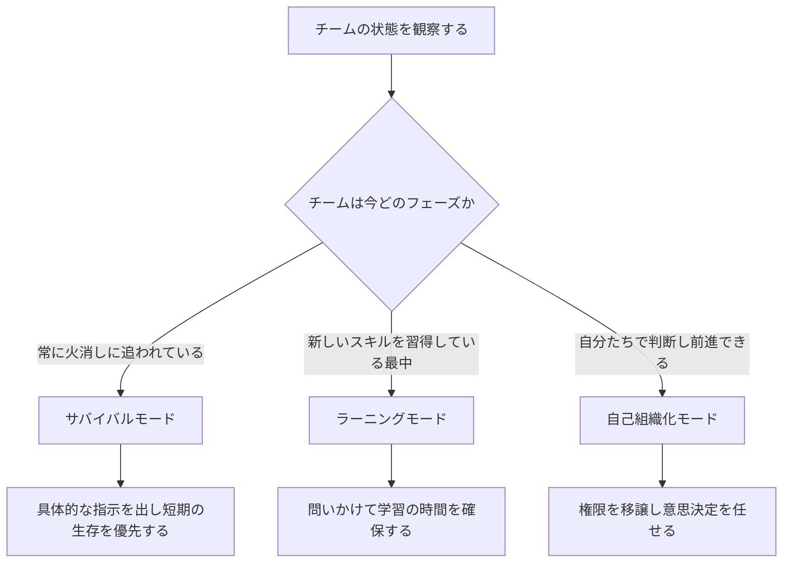
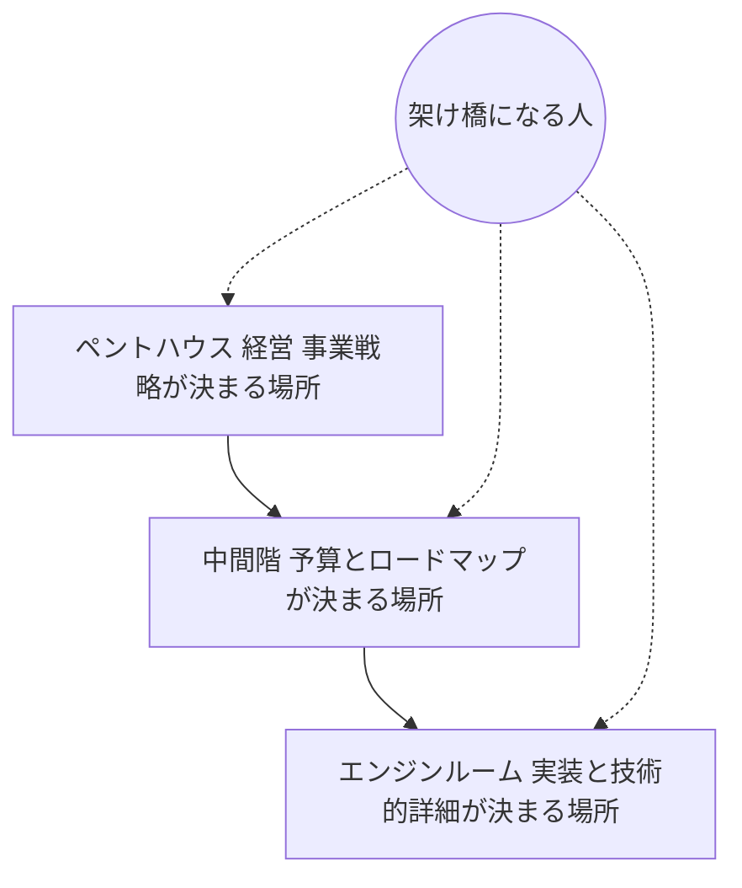
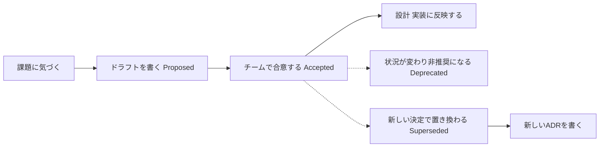
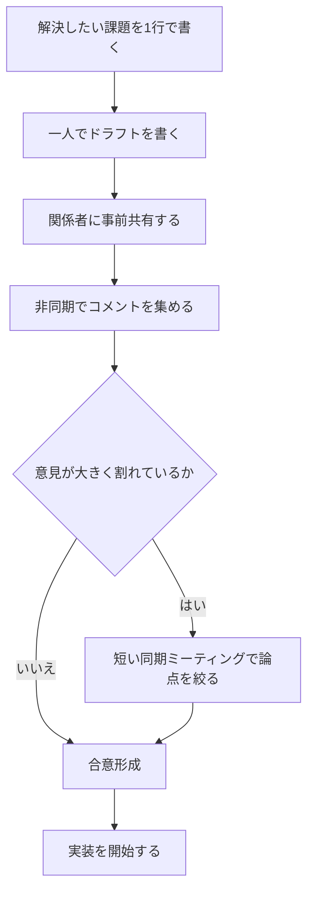
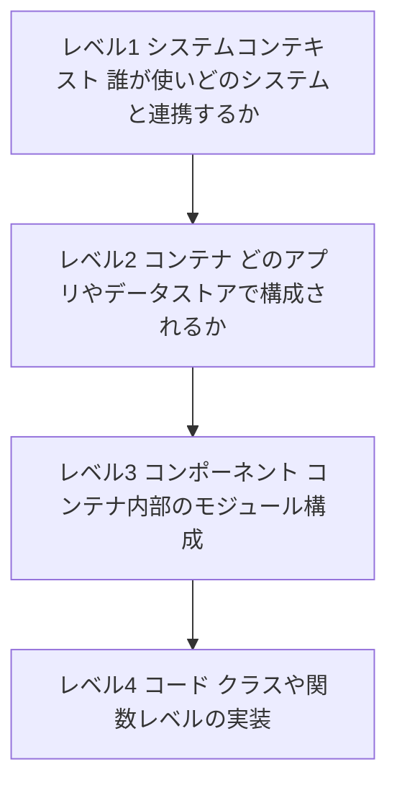
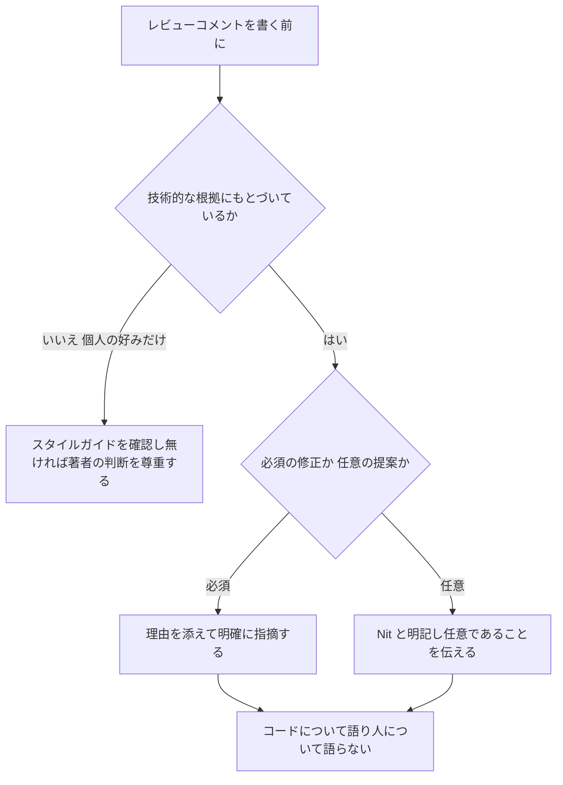
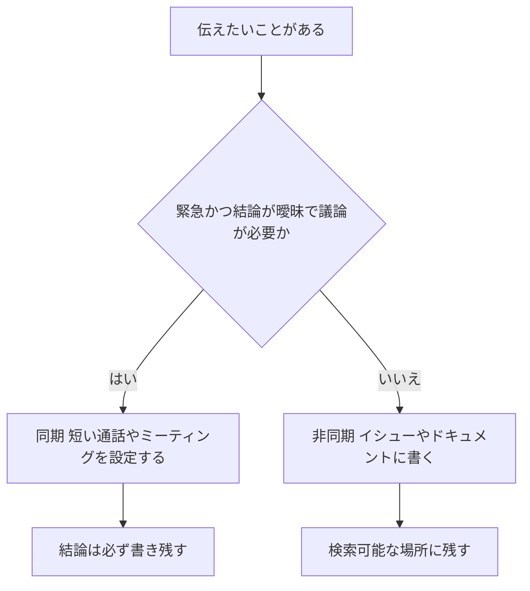
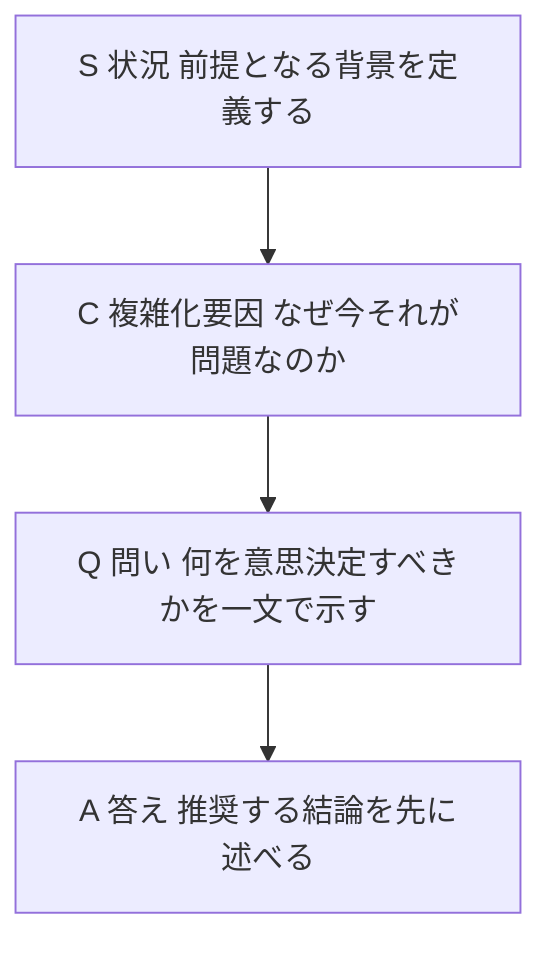

# 開発者とアーキテクトのためのコミュニケーションガイド
## 初学者向けベストプラクティス ステップバイステップ解説

> 最終更新: 2026年8月17日時点の公開情報にもとづく

---

## はじめに — なぜ「技術力」と同じくらいコミュニケーションが重要なのか

ソフトウェアの世界では「良いコードを書ければ評価される」と考えがちですが、実際にはチームが大きくなるほど、また役職が上がるほど、**書いたコードそのものよりも「考えを人に伝え、合意を作る力」が成果を左右する**ようになります。

Staff Engineer や Software Architect と呼ばれる人たちのキャリアを分析した Will Larson は、著書『Staff Engineer』の中で、シニアなエンジニアは実際にコードを書く時間が減り、代わりに<cite index="53-1">技術戦略を書き、他者の成長を支援し、組織横断で影響力を発揮する</cite>ことに時間を使うようになると述べています。つまり、上流の役割に進むほど「書く力」「伝える力」がそのままアウトプットの質になるのです。

このガイドでは、世界的に知られる開発者・アーキテクトたちが実践してきたコミュニケーションの型を、初学者でも今日から使えるステップに分解して解説します。土台として、Roy Osherove の著書『Elastic Leadership』（Manning, 2016）— <https://www.manning.com/books/elastic-leadership> — が提示する「チームの状態に合わせてリーダーシップを変える」という考え方を軸に据えます。

### この記事で扱うステップ

| ステップ | テーマ | 主な参照元 |
|---|---|---|
| 1 | 相手のフェーズを見極める | Roy Osherove『Elastic Leadership』 |
| 2 | 自分の立ち位置を自覚する | Gregor Hohpe『The Software Architect Elevator』 |
| 3 | 意思決定を書き残す | Michael Nygard の ADR |
| 4 | 設計を伝える前に合意を作る | Google の Design Doc 文化、Amazon の 6ページ・メモ |
| 5 | 構造を「見える化」する | Simon Brown の C4モデル |
| 6 | コードレビューで人間関係を壊さない | Google Engineering Practices |
| 7 | 非同期コミュニケーションを設計する | GitLab Handbook |
| 8 | 技術的負債をビジネス言語に翻訳する | Martin Fowler の Technical Debt Quadrant |
| 9 | 非技術者・経営層に伝える | Will Larson の SQCA フレームワーク |

それでは、順番に見ていきましょう。

---

## ステップ1: 相手（チーム）が今どのフェーズにいるかを見極める

### Elastic Leadership の3フェーズモデル

Roy Osherove は、20年以上にわたり開発者・チームリード・アーキテクト・CTO を歴任した経験から、<cite index="4-1">チームには「サバイバルモード」「ラーニングモード」「自己組織化モード」という3つのフェーズがあり、リーダーシップのスタイルはそのフェーズに合わせて変化させるべきだ</cite>と説きます。

これはコミュニケーションにもそのまま当てはまります。同じ「進捗どうですか」という一言でも、火消しに追われているチームに聞くのと、自律的に動けるチームに聞くのとでは、相手が受け取る意味も、返ってくる情報の質もまったく違います。

**初学者向けの実践ポイント**

- サバイバルモードのチームに「なぜこうなったと思う？」と抽象的な問いを投げても、余裕がなく苛立ちを生むだけです。まずは具体的で実行可能な指示や情報を渡しましょう。
- ラーニングモードでは、答えを教えるのではなく問いかけることで、相手が自分で答えにたどり着けるように導きます。
- 自己組織化モードのチームに逐一指示を出すのは、逆に信頼を損ないます。判断材料だけを渡し、結論は任せましょう。

この考え方は、Osherove がブログに書き溜めた実践知をまとめたものが原型になっています。<cite index="4-2">『Elastic Leadership』はもともとチームリードになりたての頃に書き始めたブログが元になっている</cite>と、彼自身がインタビューで語っています。

---

## ステップ2: 自分がどの「階」でコミュニケーションしているかを自覚する

### Gregor Hohpe の「アーキテクト・エレベーター」

Enterprise Integration Patterns の共著者としても知られる Gregor Hohpe は、著書『The Software Architect Elevator』の中で、大企業のアーキテクトを「エレベーターに乗る人」に例えています。<cite index="16-1">事業戦略が決まる最上階（ペントハウス）と、実際にシステムが作られる最下層（エンジンルーム）を、直接つなぐ役割</cite>を担うのがアーキテクトだという考え方です。

Hohpe は、老朽化した蒸気船の例えを使い、<cite index="16-1">艦橋が針路を変える指示を出しても、機関室が全速前進のままなら大惨事になる。だからこそ、艦橋の命令を機関室へ直接伝える伝声管が必要だった</cite>と説明します。現代の組織で、この「伝声管」の役を果たすのがアーキテクトであり、シニアエンジニアです。

**初学者向けの実践ポイント**

- 自分がいま「どの階」の人に話しているかを常に意識しましょう。エンジンルームの言葉（実装の詳細）をそのままペントハウスに持ち込んでも伝わりません。
- 逆にペントハウスの言葉（抽象的な戦略）をそのままエンジンルームに落としても、実装チームは「で、何をすればいいのか」が分かりません。
- 会話を始める前に「相手は今どの階にいるか」を1秒だけ自問する習慣をつけると、説明の粒度が自然と最適化されます。

このレビュー記事でも、<cite index="17-1">アーキテクトが効果的なリーダーであるためには優れたコミュニケーターでなければならず、Hohpe は長年の経験から得たコミュニケーション改善のヒントを共有している</cite>と評されています。

---

## ステップ3: 意思決定を書き残す — Architecture Decision Record（ADR）

### なぜ「決定の理由」を記録する必要があるのか

Michael Nygard は2011年のブログ記事「Documenting Architecture Decisions」の中で、<cite index="106-1">アジャイルなプロジェクトのアーキテクチャは従来と違う形で記述・定義する必要がある。すべての決定が一度に、あるいはプロジェクト開始時にまとめて行われるわけではない</cite>と述べ、巨大な仕様書ではなく「小さく、更新され続けるドキュメント」の重要性を説きました。さらに<cite index="106-1">大きなドキュメントは誰も読まないし、誰も更新しない。一口サイズのドキュメントの方が、更新される可能性が高い</cite>とも指摘しています。

この考え方から生まれたのが ADR（Architecture Decision Record）です。1つの意思決定につき1つの短いドキュメントを残すことで、「なぜそう決めたのか」を未来のチームメンバーに伝えます。

### Nygard 式 ADR テンプレート（初学者向け最小構成）

| 項目 | 書く内容 |
|---|---|
| タイトル | 連番 + 決定内容を表す短い名詞句（例: ADR-0007 注文サービスのデータストアに PostgreSQL を採用） |
| ステータス | Proposed / Accepted / Deprecated / Superseded by ADR-xxxx のいずれか |
| コンテキスト | なぜこの決定が必要になったか、当時の制約や前提を中立的な言葉で書く |
| 決定 | 実際に何を決めたかを明確に書く |
| 結果（トレードオフ） | この決定によって得られるものと、犠牲になるものの両方を書く |

**初学者向けの実践ポイント**

- ADR は「議事録」ではありません。書くのは重要な決定だけです。ライブラリの選定のような些細な決定にまで ADR を書くと、本当に重要な決定が埋もれてしまいます。ある実務家は、<cite index="25-1">些細な決定と壮大な決定ばかりが積み上がり、本当に負荷の高い決定（例えばセッション状態をメモリではなくデータベースに置くといった選択）が記録されないままだと、ADR の集合はノイズになりチームから信頼されなくなる</cite>と警告しています。
- 一度 Accepted になった ADR は編集しません。結論が変わったら、新しい ADR を書いて古い ADR を「Superseded」にします。これにより意思決定の履歴がそのまま残ります。
- ADR は Markdown で書き、ソースコードと同じリポジトリでバージョン管理するのが一般的です。

---

## ステップ4: 設計を伝える前に合意を作る — Design Doc と RFC 文化

### Google の Design Doc

Google の Malte Ubl は、<cite index="39-1">Design Doc は、ソフトウェアシステムやアプリケーションの主著者がコーディングに着手する前に作成する、比較的インフォーマルなドキュメントであり、高レベルの実装戦略と、検討されたトレードオフを重視した主要な設計上の意思決定を記録するものだ</cite>と説明しています。

Design Doc（会社によっては RFC や ERD とも呼ばれます）を書く目的は、コードを書き始める前に「間違った方向に走り出すリスク」を減らすことです。実際、Uber では以前 RFC と呼んでいた仕組みを、<cite index="39-2">現在は ERD（Engineering Review Docs）と呼んでいる</cite>など、呼び方は会社によって異なりますが、考え方は共通しています。

### Amazon の「6ページ・メモ」文化

対照的なアプローチとして知られるのが Amazon です。創業者 Jeff Bezos は2004年、<cite index="30-1">Amazon の役員たちはパワーポイントやその他のスライド形式のプレゼンテーションを一切使わない</cite>と宣言し、代わりに会議の冒頭で全員が黙って6ページの物語形式のメモを読む「勉強会」のようなスタイルを導入しました。

Bezos はその理由を、<cite index="31-1">良い4ページのメモを書くことが20ページのパワーポイントを「書く」ことより難しいのは、物語構造を持つメモがより良い思考と、何がより重要かの理解、物事の関連性の理解を強制するからだ。パワーポイント形式のプレゼンは、アイデアを飛ばし、重要度を均一化し、アイデア同士のつながりを無視することを、いつの間にか許してしまう</cite>と説明しています。

**初学者向けの実践ポイント**

- 会議の前にスライドで説明しようとするのではなく、まず「文章」で自分の考えを書き出してみましょう。文章にまとめる過程そのものが、思考の穴を見つける最良の手段です。
- レビューはできる限り非同期（コメント機能付きの文書やプルリクエスト）で行い、意見が割れた論点だけを同期ミーティングに持ち込みましょう。全部を会議で決めようとすると時間がいくらあっても足りません。
- Design Doc も RFC も「完璧に書く」必要はありません。Will Larson が薦めるように、<cite index="42-1">まず問題から書き始め、テンプレートはシンプルに保ち、レビューはみんなで集まって行い、執筆は一人で行い、完璧より「良い」を優先する</cite>という原則が役立ちます。

---

## ステップ5: 複雑な構造を「見える化」する — C4モデル

### なぜ図が必要なのか

文章だけでは、システム全体の構造や、コンポーネント同士の関係を素早く共有するのが困難です。ここで役立つのが、Simon Brown が考案した C4モデルです。C4モデルの目的は、<cite index="89-1">ソフトウェアアーキテクチャを、異なる抽象度のレベルで伝えるためのシンプルな方法を提供し、異なる相手には異なるレベルの物語を語れるようにすること</cite>にあります。

| レベル | 主な対象読者 | 説明する内容 |
|---|---|---|
| コンテキスト | 経営層・非技術者を含む全員 | システムが何をするか、誰が使うか、外部のどのシステムと連携するか |
| コンテナ | アーキテクト・シニアエンジニア | アプリケーション、API、データストアなど、システムを構成する実行単位 |
| コンポーネント | 実装を担当するエンジニア | コンテナ内部がどんなモジュールで構成されているか |
| コード | 実装するエンジニア本人 | クラスや関数レベルの実装詳細 |

**初学者向けの実践ポイント**

- いきなり詳細な図（コードレベル）を描こうとせず、まずコンテキストレベルの図から始めましょう。<cite index="93-1">C4モデルの導入におけるベストプラクティスは、コンテキストレベルから始めて徐々に深いレベルへ進むこと、図をシンプルに保つこと、一貫した記法を使うこと、フィードバックを得ながら反復すること、図と一緒に前提を文書化すること</cite>だとされています。
- 相手が経営層なら、コンテキストレベルの図だけで十分なことが多いです。詳細なコンポーネント図を見せても、かえって話が伝わりにくくなります。
- ツールは Structurizr、PlantUML、あるいは手描きのホワイトボードでも構いません。C4モデルは<cite index="89-1">記法やツールに依存しない</cite>考え方だからです。

---

## ステップ6: コードレビューで人間関係を壊さない伝え方

コードレビューは、開発者同士のコミュニケーションが最も摩擦を生みやすい場面の一つです。Google の Engineering Practices ドキュメントは、この摩擦を減らすための具体的な言い回しを提示しています。

### コードについて語り、人について語らない

Google のガイドラインは、<cite index="66-1">常にコードについてコメントし、開発者についてコメントしないようにすることが重要であり、これは特に、そのままでは相手を動揺させたり議論を呼んだりしかねない内容を伝えるときに徹底すべきだ</cite>と述べています。具体例として、次のような対比が示されています。

- 悪い例: <cite index="66-1">「なぜここでスレッドを使ったのですか。並行処理の恩恵が明らかに何もないのに」</cite>
- 良い例: 「この並行処理モデルは、目に見える性能上の利点がないままシステムに複雑さを加えています。性能上の利点がない以上、このコードはシングルスレッドの方が良いと思います」

### レビューを受け取る側の心構え

コメントするだけでなく、コメントを「受け取る」側の作法も同じくらい重要です。Google のドキュメントは、レビュアーからの指摘に納得できないときの対応として、<cite index="71-1">対立的にではなく協働的に考えることが大切だとし、「私はこういうトレードオフを考えてXを選びました。Yの方が良いというのは、これらの前提が違うからでしょうか、それとも別の理由でしょうか？」というように、明確化を求める書き方</cite>を推奨しています。

**初学者向けの実践ポイント**

- 技術的な事実やデータに基づく指摘と、単なる好みを区別しましょう。<cite index="73-1">技術的な事実やデータは意見や個人的な好みに優先する。スタイルの問題についてはスタイルガイドが絶対的な権威であり、スタイルガイドに載っていない純粋なスタイルの好み（空白の使い方など）は個人の好みの問題にすぎない</cite>という原則を覚えておくと、無用な論争を避けられます。
- 必須ではない指摘には「Nit:」と明記しましょう。相手に「これは直さなくてもマージできる」ということが伝わり、コミュニケーションコストが下がります。
- 感情的な言い回しを見つけたら、一度下書きを寝かせてから送りましょう。<cite index="71-1">怒りに任せてレビューコメントに返信してはならない。それはコードレビューツールに永遠に残る、深刻なマナー違反になる</cite>とまで表現されています。

---

## ステップ7: 非同期コミュニケーションを設計する

### GitLab の「Handbook-First」文化

世界最大級のオールリモート企業として知られる GitLab は、<cite index="74-1">全世界からほぼどこからでも働ける完全リモート企業であるため、つながりを保ちながら効率的に働くために明確なコミュニケーションを実践することが重要だ。そのために非同期コミュニケーションを出発点とし、公開されたイシューやマージリクエスト、Slack チャンネルを通じてできる限りオープンで透明性のあるやり取りを心がけている</cite>と説明しています。

GitLab のこの考え方の中核にあるのが「Handbook-First」という原則です。<cite index="83-1">GitLab は単一の情報源（Single Source of Truth）を作ることに意識的に取り組んでおり、Handbook-First な運営をし、透明性を重視するあまりハンドブックを全世界に公開している</cite>としています。さらに、<cite index="83-1">「ドキュメンテーション」という言葉は変更が伝えられた後にドキュメントを作る作業を指すことが多いが、GitLab ではまず書いてから、それを伝える</cite>という順序が徹底されています。

**初学者向けの実践ポイント**

- 「とりあえず会議を入れる」のではなく、「まず書けないか」を先に考える習慣をつけましょう。書けるものは書き、書けない（＝結論が曖昧で議論そのものが必要な）ものだけを会議にします。
- 口頭で決まったことは、必ずどこかに書き残しましょう。書かれていない決定は、時間とともに「言った・言わない」の水掛け論になります。
- タイムゾーンをまたぐチームでは特に、非同期を前提にすると全員が自分のペースで質の高い回答ができます。

---

## ステップ8: 技術的負債をビジネス言語に翻訳する

### Martin Fowler の Technical Debt Quadrant

「技術的負債がある」と言われても、非エンジニアには何のことか伝わりません。ここで役立つのが、Martin Fowler が提唱した Technical Debt Quadrant（技術的負債の4象限）です。この分類は、<cite index="61-1">意図的か非意図的か（チームは負債を負っていると知っていたか）、慎重か無謀か（その判断は思慮深く行われたか、それとも不注意だったか）という2つの軸で技術的負債を分類する</cite>ものです。

| | 慎重（Prudent） | 無謀（Reckless） |
|---|---|---|
| **意図的（Deliberate）** | 「今は出荷を優先し、後で結果に対処する」 | 「設計する時間がない」 |
| **非意図的（Inadvertent）** | 「今ならこうすべきだったと分かった」 | 「レイヤリングって何？」 |

非技術者に説明するときは、金融の比喩が有効です。<cite index="61-2">慎重かつ意図的な負債は、計画された事業融資のようなもので、チャンスを掴むために戦略的に借り入れる。無謀かつ意図的な負債は、返済計画のないクレジットカードの浪費のようなもの。無謀かつ非意図的な負債は、税制を知らない従業員が誤って負債を作ってしまうようなもの。慎重かつ非意図的な負債は、当時は健全だった事業判断が、その後の市況変化によって変わってしまったようなもの</cite>と説明すれば、経営層も直感的に理解できます。

**初学者向けの実践ポイント**

- 「技術的負債を返済したい」だけでは予算は取れません。「この負債はどの象限に属するか」「放置すると何がどれだけ遅くなるか（＝利子）」まで言語化しましょう。
- 技術的負債の議論をコード品質のスコアではなく、<cite index="55-1">顧客の離脱率やチームの生産性といった事業指標を軸に組み立てる</cite>と、非技術者にも伝わりやすくなります。
- すべての負債が悪いわけではありません。慎重かつ意図的な負債は、むしろ正しい経営判断であることも多いという前提を共有しておきましょう。

---

## ステップ9: 非技術者・経営層に伝える — SQCA フレームワーク

### Will Larson の SQCA

役職が上がるほど、技術的な背景を持たない人たちに、限られた時間で説明する機会が増えます。Will Larson は著書『Staff Engineer』の中で、<cite index="45-1">エグゼクティブとのコミュニケーションが難しいのは、彼らがあなたの専門領域に詳しくない上に、その話題に割ける時間も限られているからだ。目標はエグゼクティブからできる限り多くの視点を引き出すことであり、そのための最良の方法が構造化されたドキュメントを書くことだ</cite>と述べ、SQCA という型を提案しています。

<cite index="45-1">すべてのドキュメントの冒頭の段落は、SQCA フォーマットに従うべきである。Situation（状況）は関連する背景を定義し、Complication（複雑化要因）はなぜ現状の状況が問題なのかを説明し、Question（問い）は取り組むべき核心の問いを述べ、Answer（答え）は最善の答えを述べる</cite>という構成です。

**初学者向けの実践ポイント**

- 結論を最初に書きましょう。技術的な説明では「経緯→結論」の順で語りがちですが、経営層向けの文書では「結論→根拠」の順が基本です。
- 専門用語はできる限り削り、削れない用語には一言だけ補足を添えましょう。
- SQCA の4行を書き終えるまでは、詳細な実装の話には進まないようにしましょう。冒頭で相手の頭の中に「地図」を渡すことが目的です。

---

## まとめ: 実践チェックリスト

| ステップ | 今日から始められること |
|---|---|
| 1. フェーズを見極める | 話す前に「相手のチームは今どのフェーズか」を1秒だけ自問する |
| 2. 階を自覚する | 説明の粒度を、相手が「エンジンルーム」か「ペントハウス」かで変える |
| 3. 決定を書き残す | 重要な決定だけ、Nygard 式の5項目で ADR を書く |
| 4. 合意を作る | コードを書く前に、短い Design Doc を一人で書いてから共有する |
| 5. 見える化する | まずコンテキストレベルの図から描き、必要な相手にだけ深いレベルを見せる |
| 6. レビューで語る | コードについて語り、人について語らない。任意の指摘には Nit と書く |
| 7. 非同期を設計する | 会議を入れる前に「まず書けないか」を考える |
| 8. 負債を翻訳する | 技術的負債を4象限のどれかに分類し、金融の比喩で説明する |
| 9. 経営層に伝える | 結論から始まる SQCA の4行で書き出す |

---

## 参考文献・出典

このガイドの内容は、以下の一次情報・著名な開発者による公開情報をもとに作成しています（2026年8月17日時点でアクセス確認済み）。

- Roy Osherove, *Elastic Leadership: Growing Self-Organizing Teams* (Manning, 2016) — <https://www.manning.com/books/elastic-leadership>
- Roy Osherove interview, Tech Lead Journal — <https://techleadjournal.dev/episodes/110/>
- Gregor Hohpe, *The Software Architect Elevator* (O'Reilly) — <https://www.oreilly.com/library/view/the-software-architect/9781492077534/>
- Gregor Hohpe, "The Architect Elevator," Enterprise Integration Patterns blog — <https://www.enterpriseintegrationpatterns.com/ramblings/79_elevator.html>
- Michael Nygard, "Documenting Architecture Decisions" (Cognitect, 2011) — <https://cognitect.com/blog/2011/11/15/documenting-architecture-decisions>
- ADR templates collection (Nygard format) — <https://github.com/joelparkerhenderson/architecture-decision-record>
- Malte Ubl, "Design Docs at Google" — <https://www.industrialempathy.com/posts/design-docs-at-google/>
- Gergely Orosz, "Companies Using RFCs or Design Docs," The Pragmatic Engineer — <https://blog.pragmaticengineer.com/rfcs-and-design-docs/>
- "Why Jeff Bezos makes Amazon execs read 6-page memos," CNBC (2018) — <https://www.cnbc.com/2018/04/23/what-jeff-bezos-learned-from-requiring-6-page-memos-at-amazon.html>
- "Welcome to the jungle: Jeff Bezos banned slide decks in favor of narratives," Medium — <https://medium.com/@nathan.baugh/welcome-to-the-jungle-38fdde285b6f>
- Will Larson, *Staff Engineer: Leadership Beyond the Management Track* — book notes — <https://ivanahuckova.medium.com/book-notes-staff-engineer-leadership-beyond-the-management-track-by-will-larson-41248b1ca1c6>
- "StaffEng - How to write a design doc," summarizing Will Larson's guidance — <https://medium.com/@liamchzh/staffeng-how-to-write-a-design-doc-and-how-google-does-it-19c495c53fcf>
- Martin Fowler, "TechnicalDebtQuadrant" — <https://martinfowler.com/bliki/TechnicalDebtQuadrant.html>
- "Martin Fowler's Tech Debt Quadrant Explained for 2026" — <https://techdebt.guru/tech-debt-quadrant/>
- Google, "How to write code review comments," Engineering Practices — <https://google.github.io/eng-practices/review/reviewer/comments.html>
- Google, "The Standard of Code Review," Engineering Practices — <https://google.github.io/eng-practices/review/reviewer/standard.html>
- Google, "Handling reviewer comments," Engineering Practices — <https://github.com/google/eng-practices/blob/master/review/developer/handling-comments.md>
- *Software Engineering at Google*, Code Review chapter — <https://abseil.io/resources/swe-book/html/ch09.html>
- GitLab Handbook, "GitLab Communication" — <https://gitlab.com/gitlab-com/content-sites/handbook/-/tree/main/content/handbook/communication>
- GitLab Handbook, "The importance of a handbook-first approach to communication" — <https://handbook.gitlab.com/handbook/company/culture/all-remote/handbook-first/>
- Simon Brown, C4 model official site — <https://c4model.com/>
- Simon Brown, *The C4 Model: Visualizing Software Architecture* (O'Reilly) — <https://www.oreilly.com/library/view/the-c4-model/9798341660113/>
- Victor Leung, "The C4 Model for Visualising Software Architecture" — <https://dev.to/victorleungtw/the-c4-model-for-visualising-software-architecture-1g5p>
