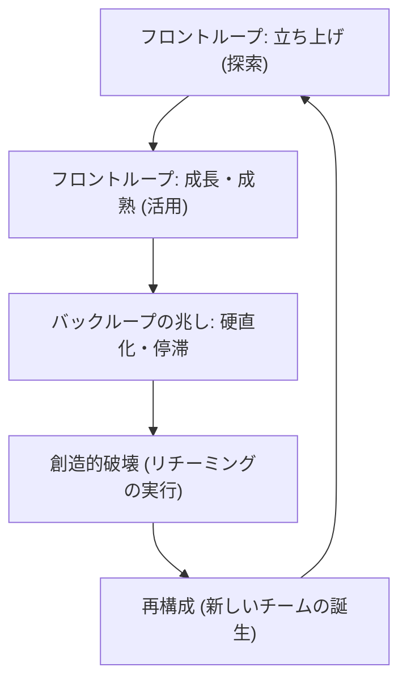
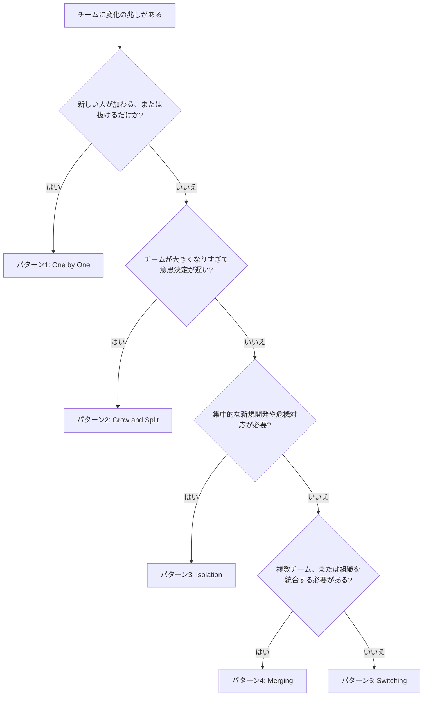
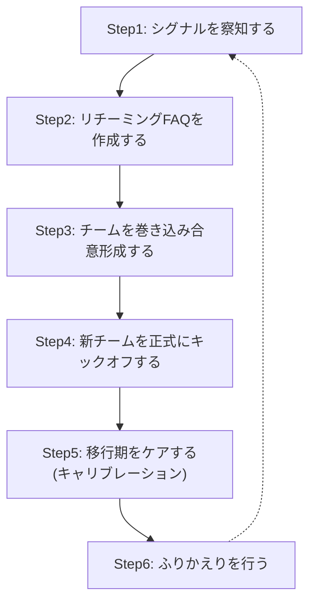

# ダイナミック・リチーミング実践ガイド

*― 変化に強いチームをつくる、ステップ・バイ・ステップのベストプラクティス*

> 対象読者：エンジニアリングマネージャー、スクラムマスター、プロジェクトマネージャー、そしてチーム編成に関心のあるすべてのソフトウェアエンジニア（初学者向け）

---

## 目次

- [1. はじめに](#1-はじめに)
- [2. ダイナミック・リチーミングとは何か](#2-ダイナミックリチーミングとは何か)
- [3. なぜ重要なのか](#3-なぜ重要なのか)
- [4. 全体像をつかむ：チームのエコサイクル](#4-全体像をつかむチームのエコサイクル)
- [5. 5つの基本パターン](#5-5つの基本パターン)
- [6. どのパターンを選ぶか：判断フロー](#6-どのパターンを選ぶか判断フロー)
- [7. ステップ・バイ・ステップ実践ガイド](#7-ステップバイステップ実践ガイド)
- [8. 避けるべきアンチパターン](#8-避けるべきアンチパターン)
- [9. 実践チェックリスト](#9-実践チェックリスト)
- [10. まとめ](#10-まとめ)
- [11. 参考文献・出典](#11-参考文献出典)

---

## 1. はじめに

「優れたチームを作るには、メンバーを固定して長期間維持するのが一番だ」——アジャイルやスクラムの文脈では、長らくこの考え方が「ゴールドスタンダード」とされてきました。

しかし現実のソフトウェア組織を見渡すと、メンバーが同じ顔ぶれのまま何年も続くチームはむしろ少数派です。入社、退職、異動、昇進、買収、事業ピボット、レイオフ——チームの構成は常に揺れ動いています。

この「チームは変化するものだ」という前提に正面から向き合い、変化を場当たり的な事故としてではなく、意図的にデザインできる仕組みとして体系化したのが、Heidi Helfand氏が提唱した **ダイナミック・リチーミング（Dynamic Reteaming）** という考え方です。本ガイドでは、その基本概念から、5つの実践パターン、そして実際にリチーミングを進めるためのステップ・バイ・ステップの手順までを、初学者にもわかりやすく解説します。

---

## 2. ダイナミック・リチーミングとは何か

ダイナミック・リチーミングとは、一言でいえば「**チームの構成を意図的に、かつ継続的に変化させていくこと**」です。単発の組織改編（リオーグ）とは異なり、リチーミングは一度きりのイベントではなく、組織が健全に成長し続けるための恒常的なプラクティスとして位置づけられます。

重要なのは、次の2つの視点です。

- **リチーミングは「起きるもの」でもある**：人の入退社、異動、体制変更などにより、望むと望まざるとにかかわらずチームは変化します。
- **リチーミングは「起こすもの」でもある**：チームの停滞や属人化、事業の変化を察知したときに、意図的にチーム構成を変えることで、組織の学習と成長を促進できます。

つまりダイナミック・リチーミングは、変化を「管理不能なノイズ」として恐れるのではなく、「組織の学習サイクルの一部」として上手に乗りこなすための実践知の体系だと言えます。

---

## 3. なぜ重要なのか

チームの安定性だけを追い求めることには、いくつかの見落とされがちなリスクがあります。逆に、意図を持ってリチーミングを行うことで、次のような効果が期待できます。

| 効果 | 内容 |
|---|---|
| **知識のサイロ化を防ぐ** | 同じメンバーが同じ領域だけを担当し続けると、特定の人にしかわからない「秘伝のタレ」的なコードやドメイン知識が生まれやすくなります。人が動くことで知識が組織内に広がります。 |
| **離職リスクを下げる** | 新しい役割や挑戦の機会がないと、優秀な人材ほど停滞を感じて社外に成長機会を求めがちです。リチーミングはキャリアの成長機会を社内に生み出します。 |
| **チーム間の過度な競争を減らす** | 固定されたチーム同士が縄張り意識を持つと、組織全体よりも自チームの成果を優先する「セクショナリズム」が生まれやすくなります。人の行き来があると「全体としてのわれわれ」という意識が育ちます。 |
| **硬直化を防ぎ、新しいメンバーを迎えやすくする** | 長期間固定されたチームは暗黙のルールや文化が固まりすぎて、新しく加わった人が馴染みにくくなることがあります。適度な変化は組織の受け入れ体制を柔軟に保ちます。 |

これらは、著者のHeidi Helfand氏がO'Reilly刊『Dynamic Reteaming, 2nd Edition』の中で、リスク低減と持続可能性の観点から整理している論点です（詳細は末尾の参考文献を参照してください）。

また、Team Topologiesの共著者であるMatthew Skelton氏も、ポッドキャスト「Software Engineering Radio」の中で、組織を健全なまま変化させる技法としてダイナミック・リチーミングを名指しで評価しています。チームトポロジーのような「型」を組織に導入したあとも、事業や価値の流れは変わり続けるため、チームをどう作り替えていくかという観点でダイナミック・リチーミングは補完的な実践として位置づけられています。

---

## 4. 全体像をつかむ：チームのエコサイクル

Helfand氏は、チームの変化を理解するための比喩として「**エコサイクル（ecocycle）**」というモデルを使っています。これは元々、生態系（森林の成長と再生）の変化を説明するために使われてきたモデルを、組織の変化に応用したものです。

ポイントは、チームには「成長し、成熟していくフロントループ」と「創造的破壊を経て、再構成されるバックループ」という2つの局面があり、これらは一方向の直線ではなく、繰り返し循環するという点です。

- **立ち上げ（探索）**：新しいチームが結成され、目的やメンバー間の関係性を模索する段階です。
- **成長・成熟（活用）**：チームの動き方が確立し、生産性が安定していく段階です。
- **硬直化・停滞の兆し**：やり方が固定化し、新しいアイデアが生まれにくくなったり、外部環境の変化についていけなくなったりする段階です。この兆しに気づくことが、次のステップの起点になります。
- **創造的破壊**：意図的、あるいは外的要因によって、既存のチーム構成に変化（＝リチーミング）が加えられる段階です。
- **再構成**：変化を経て、新しいチームが生まれ、また探索の段階に戻っていきます。

このモデルの要点は、「停滞や崩壊」を失敗と捉えるのではなく、次の成長への準備段階として捉え直すことにあります。

---

## 5. 5つの基本パターン

Helfand氏は、数多くのソフトウェア企業への調査をもとに、チームが変化するときに繰り返し現れる **5つの基本パターン** を整理しました。これらは互いに排他的ではなく、組み合わせて使われることもあります。

| パターン | 概要 | 主なきっかけの例 | 主な効果 | 代表的な落とし穴 |
|---|---|---|---|---|
| **① One by One（一人ずつ）** | 一人ずつメンバーを追加・削減していく、最も基本的な変化のパターン | 新規採用、自然退職 | オンボーディングの型化、新しい視点の注入 | ジュニアとシニアの比率が崩れる、メンター役の疲弊 |
| **② Grow and Split（成長と分割）** | チームが大きくなりすぎたときに、複数の小さなチームへ分割する | ミーティングの長期化、意思決定の遅延、担当領域の拡散 | 各チームの機動力・当事者意識の回復 | チームをまたぐ依存関係の発生、分割の先延ばし |
| **③ Isolation（隔離）** | 特定のチームを既存の枠組みから切り離し、集中的に取り組ませる | 新規事業開発、技術的な危機対応、抜本的な方向転換 | 集中的なイノベーション、意思決定の高速化 | 選民意識（エリート主義）、既存コードの保守放置 |
| **④ Merging（統合）** | 複数のチームや組織を1つにまとめる | 事業統合、買収、機能の重複解消 | ペアリングの多様化、組織的な連携強化 | 意思決定方法の未整理、大人数化した会議体の機能不全 |
| **⑤ Switching（交代）** | チーム間でメンバーを入れ替える、あるいは一時的に貸し出す | 知識共有、燃え尽き防止、特定分野の技術移転 | 属人化の解消、個人の成長機会の創出 | 優秀な人材の抱え込み、専門職の偏りによる交代の困難さ |

それぞれのパターンについて、もう少し詳しく見ていきましょう。

### ① One by One（一人ずつ）

最もシンプルで、日常的に発生するパターンです。新しい人が1人加わる、あるいは1人抜けるだけで、理論上そのチームは「新しいチーム」になります。ベストプラクティスとしては、新しいメンバーの受け入れ前に準備を整えること、メンター（バディ）を割り当てること、ペアプログラミングやシャドーイングを通じて自然に溶け込めるようにすることなどが挙げられます。また、人が「抜ける」ときのプロセス（送別のしかた、引き継ぎ、心理的なケア）も同じくらい重要です。

### ② Grow and Split（成長と分割）

チームの人数が増えすぎると、コミュニケーションのコストが指数関数的に増加し、意思決定が遅くなります。「会議が長引いていないか」「意思決定に時間がかかるようになっていないか」「担当している仕事の関連性が薄れていないか」といったシグナルが、分割を検討するタイミングを教えてくれます。分割時は、チームを巻き込んで決定プロセスに参加させること、分割理由を明確に言語化すること、新チームそれぞれのミッションを定義することが推奨されます。

### ③ Isolation（隔離）

既存の体制やしがらみから意図的に切り離し、少人数の専任チームに集中して取り組ませるパターンです。新規プロダクトの立ち上げや、大きな技術的負債の解消、緊急のトラブル対応などに向いています。一方で、隔離されたチームが特別扱いされることによる周囲との軋轢（エリート意識）や、隔離期間が終わったあとの「祭りのあとの虚脱感」にも配慮が必要です。

### ④ Merging（統合）

複数チーム、あるいは複数組織を1つに統合するパターンです。ペアプログラミングの組み合わせを増やしたい場合や、部門横断の連携を強化したい場合に有効です。ただし、統合後のチームの人数やミーティング体制を見直さないまま進めると、意思決定が滞ったり、暗黙のうちに対立が生まれたりします。企業レベルの統合（M&Aなど）では、レイオフの進め方や情報の曖昧さが混乱を招きやすい点にも注意が必要です。

### ⑤ Switching（交代）

チームメンバーを入れ替えたり、一時的に他チームへ「貸し出し」たりするパターンです。知識共有や個人の成長、燃え尽き症候群の予防に効果があります。ただし、特定の人に知識が集中している状態（ナレッジのモノポリー）があると交代自体が難しくなるため、日頃からの知識共有の文化づくりが前提になります。

---

## 6. どのパターンを選ぶか：判断フロー

「うちのチームには変化の兆しがある。でも、どのパターンを適用すればいいのか？」という初学者向けに、シンプルな判断の目安を示します。あくまで出発点であり、実際には複数のパターンを組み合わせて検討するのが基本です。

---

## 7. ステップ・バイ・ステップ実践ガイド

ここからは、実際にリチーミングを計画し、実行するための具体的な手順を、初学者でも迷わないように6つのステップに分解して解説します。

### Step 1：シグナルを察知する

リチーミングは「思いつき」で始めるものではなく、何らかのシグナル（兆候）をきっかけに検討を始めるのが基本です。代表的なシグナルには次のようなものがあります。

- ミーティングの時間がじわじわと長くなってきた
- 以前よりも意思決定に時間がかかるようになった
- チームが担当する仕事の関連性が薄れ、バラバラな案件を抱えるようになった
- 分散チームで、誰が今どのチームに所属しているか把握しづらくなってきた
- 特定のメンバーに知識や作業が集中し、その人が休むと仕事が止まる

これらのシグナルは、前章のエコサイクルでいう「硬直化・停滞」の局面に対応します。シグナルに気づいたら、それがどのパターンに当てはまりそうかを仮説として立てます。

### Step 2：リチーミングFAQを作成する

いきなり変更を発表するのではなく、関係者の疑問に先回りして答える「リチーミングFAQ」を作成することが推奨されます。次のような項目を整理しておくと、後々の混乱を大きく減らせます。

| # | FAQ項目 | 目的 |
|---|---|---|
| 1 | このリチーミングで解決したい課題は何か | 目的の言語化、賛同を得るための土台づくり |
| 2 | メンバーはどのようにチームへ割り当てられるか | 割り当て方針（トップダウンか、自己選択かなど）の明確化 |
| 3 | メンバーは新しいチーム編成をいつ、どのように知るか | 情報伝達の公平性・透明性の担保 |
| 4 | 既存チームにはどんな影響があるか | 巻き添えになるチームへの配慮 |
| 5 | 進行中の仕事にはどんな影響があるか | 仕掛かり作業の引き継ぎ計画 |
| 6 | 新しいチームの構成（人数・役割）はどうなるか | 新体制の具体像の共有 |
| 7 | 変更前後で組織図はどう変わるか | 全体像の可視化 |
| 8 | 技術システムや設備の変更は必要か | 権限、環境、ツールの準備 |
| 9 | 座席やオフィスレイアウトの変更はあるか | 物理・リモート双方の作業環境の調整 |
| 10 | 必要な教育・トレーニングは何か | スキルギャップの事前把握 |
| 11 | コミュニケーション計画はどうなっているか | 発表のタイミングと伝達経路の設計 |
| 12 | 実施スケジュールはどうなっているか | マイルストーンの共有 |
| 13 | フィードバックはどのように集めるか | 実施後の軌道修正の仕組み |

### Step 3：チームを巻き込み合意形成する

リチーミングを「上から降ってくる決定」として扱うと、当事者の納得感が失われ、モチベーション低下や離職につながりかねません。可能な範囲でチームメンバー自身を意思決定プロセスに巻き込むことが望ましいとされています。具体的な手法としては、以下のようなものがあります。

- チームメンバーへのアンケートで、希望するチームや役割の意向を確認する
- 「チーム選択マーケットプレイス」のような場を設け、メンバー自身が新しいチームを選べるようにする
- マネージャーが最終決定をしつつも、決定に至った理由をオープンに説明する

### Step 4：新チームを正式にキックオフする

新しいチーム構成が決まったら、非公式なまま運用を始めるのではなく、区切りとして正式なキックオフを行います。キックオフでは、次のような内容を扱うとよいでしょう。

- 新チームのミッション・目的の共有
- メンバー同士の自己紹介（経歴、得意分野、期待する働き方など）
- チームとしての作業の進め方（会議体、コミュニケーションルールなど）の合意形成
- 当面の優先事項とロードマップの共有

### Step 5：移行期をケアする（キャリブレーション）

チームが物理的・組織的に再編されたあとも、心理的な「移行」にはさらに時間がかかります。この期間を軽視すると、チームとしてのパフォーマンスが安定するまでに余計な時間がかかってしまいます。移行期のケアとして、以下のような「チーム・キャリブレーション（すり合わせ）セッション」を行うことが有効です。

- **歴史のすり合わせ**：それぞれのメンバーが持つ過去の経緯や文脈を共有する
- **人と役割のすり合わせ**：誰が何を担当するのか、役割分担を明確にする
- **仕事のすり合わせ**：現在抱えている仕事の状況や優先順位を共有する
- **進め方のすり合わせ**：開発フローや意思決定の方法をチームとして合意する

また、変化を受け入れがたく感じるメンバーに対しては、変化の理由を1on1で丁寧に説明したり、「区切りの儀式」（送別会、旧チームへの感謝を伝える場など）を設けたりすることで、心理的な移行を後押しできます。

### Step 6：ふりかえりを行う

リチーミングは「実施して終わり」ではありません。新体制がうまく機能しているかどうかを定期的にふりかえり、必要に応じて微調整を行うことが、次のエコサイクルへの入口になります。

- チーム単位のレトロスペクティブ（ふりかえり）を定期的に実施する
- 複数チームにまたがる課題は、マルチチーム・レトロスペクティブで扱う
- リチーミングの取り組み全体についても、施策としての「イニシアチブ・レトロスペクティブ」を行う
- サーベイツールや1on1を通じて、定量・定性の両面から状態を把握する

この結果は、再びStep 1の「シグナルの察知」へとフィードバックされ、エコサイクルは次の局面へと循環していきます。

---

## 8. 避けるべきアンチパターン

良かれと思って行ったリチーミングが、かえってチームを傷つけてしまうこともあります。代表的なアンチパターンを押さえておきましょう。

| アンチパターン | 内容 | 対策のヒント |
|---|---|---|
| **ハイパフォーマンスの伝播を狙った異動** | 「優秀な人を薄く広く配置すればチーム全体が良くなる」という発想で、エース人材を各チームに分散させる | 個人の力に依存するのではなく、チームとしての強さを育てることを優先する |
| **パーセンテージ・アンチパターン** | 1人のメンバーを複数チームに「稼働率◯%ずつ」割り当てる | コンテキストスイッチのコストを認識し、可能な限り1人1チームを基本とする |
| **標準への迎合による分断** | すでにうまく機能しているチームを、社内標準やベストプラクティスに合わせるためだけに再編する | 「型」に合わせることよりも、チームの実際の成果とチームメンバーの声を優先する |
| **説明不足な抽象的リチーミング** | 経営層や上位組織の都合だけでリチーミングを進め、当事者への説明が不十分なまま実施する | Step2のFAQやStep3の合意形成プロセスを省略しない |
| **有害なチームメンバーの放置** | 特定のメンバーの問題行動を、チーム編成の工夫だけで誤魔化そうとする | リチーミングは万能薬ではないと理解し、根本的な対話やマネジメント対応と併用する |

---

## 9. 実践チェックリスト

リチーミングを計画・実施する際に、抜け漏れがないかを確認するためのチェックリストです。

- [ ] チームの変化を示すシグナル（会議の長時間化、意思決定の遅延など）を具体的に言語化したか
- [ ] 想定しているパターン（One by One／Grow and Split／Isolation／Merging／Switching）を明確にしたか
- [ ] リチーミングFAQ（目的・割り当て方針・スケジュールなど）を事前に整理したか
- [ ] チームメンバーを意思決定プロセスに巻き込む機会を設けたか
- [ ] 新チームの正式なキックオフを計画したか
- [ ] 移行期のキャリブレーションセッション（歴史・人と役割・仕事・進め方）を予定したか
- [ ] 旧チームへの区切り（送別・感謝の共有）を軽視していないか
- [ ] 実施後のふりかえり（チーム単位・複数チーム単位・施策単位）を計画したか
- [ ] 今回のアンチパターン一覧に当てはまる進め方をしていないか、再点検したか

---

## 10. まとめ

ダイナミック・リチーミングの核心は、「チームは変わらないほうがよい」という思い込みを手放し、変化を組織の学習と成長のための自然なプロセスとして受け入れることにあります。そのうえで、

1. チームのエコサイクルという大きな視点で「今どの局面にいるか」を捉え、
2. One by One、Grow and Split、Isolation、Merging、Switchingという5つのパターンから状況に合ったものを選び、
3. シグナルの察知からふりかえりまでの一連のステップを、当事者を巻き込みながら丁寧に実施する

——この積み重ねが、変化に強く、学び続けるチームと組織をつくっていきます。

---

## 11. 参考文献・出典

本ガイドは、2026年8月16日時点でのウェブ検索調査にもとづき作成しました。特に、ダイナミック・リチーミングの提唱者であるHeidi Helfand氏本人の著作・発信、および同分野で著名な国際的開発者・組織設計の専門家（Matthew Skelton氏、InfoQ、Martin Fowler氏まわりの言及等）の情報を優先的に参照しています。

- Heidi Helfand, *Dynamic Reteaming, 2nd Edition* (O'Reilly Media) — 書籍公式ページ・目次
  https://www.oreilly.com/library/view/dynamic-reteaming-2nd/9781492061281/
- InfoQ, "Q&A on the Book Dynamic Reteaming (2-ed)"
  https://www.infoq.com/articles/dynamic-reteaming-helfand
- InfoQ, サンプルチャプター（Chapter 2: Understanding Teams）PDF
  https://res.infoq.com/articles/dynamic-reteaming-helfand/en/resources/Chapter2_DynamicReteaming-1-1597951052416.pdf
- InfoQ, カンファレンス講演 "Dynamic Reteaming: The Art & Wisdom of Changing Teams"
  https://www.infoq.com/presentations/dynamic-change-teams
- Software Engineering Radio, "SE Radio 646: Matthew Skelton on Team Topologies"（Dynamic Reteamingへの言及あり）
  https://se-radio.net/2024/12/se-radio-646-matthew-skelton-on-team-topologies/
- Martin Fowler, bliki: Team Topologies
  https://martinfowler.com/bliki/TeamTopologies.html
- GOTO / gotopia.tech, "Dynamic Teams: Reteaming Patterns & Practices"（Charles Humble氏によるHeidi Helfand氏インタビュー）
  https://gotopia.tech/articles/321/dynamic-teams-reteaming-patterns-and-practices
- Pluralsight Blog, "Heidi Helfand's five patterns for responsible reteaming"
  https://www.pluralsight.com/blog/teams/heidi-helfand-s-five-patterns-for-responsible-reteaming
- Heidi Helfand 公式サイト
  https://www.heidihelfand.com/
- Heidi Helfand, Substack「The Team Dynamic」 "HH 004 - Five Patterns of Dynamic Reteaming"
  https://heidihelfand.substack.com/p/hh-004-five-patterns-of-dynamic-reteaming
- LogRocket Blog, "An introduction to dynamic reteaming"
  https://blog.logrocket.com/product-management/introduction-to-dynamic-reteaming/
- Team Topologies 公式書籍参考文献リスト（GitHub）
  https://github.com/TeamTopologies/Team-Topologies-Book-References/blob/main/Team-Topologies-references-Markdown.md
- InfoQ, "QCon London 2026: Team Topologies as the 'Infrastructure for Agency' with AI"（組織設計トピックの最新動向として参考掲載）
  https://www.infoq.com/news/2026/03/ai-agency-team-topologies/

> 本ガイド内の記述は、上記出典の内容を筆者が要約・再構成したものであり、原文からの引用ではありません。正確な原文表現や詳細な事例が必要な場合は、必ず一次情報（特にHeidi Helfand氏の書籍本体）をご参照ください。
