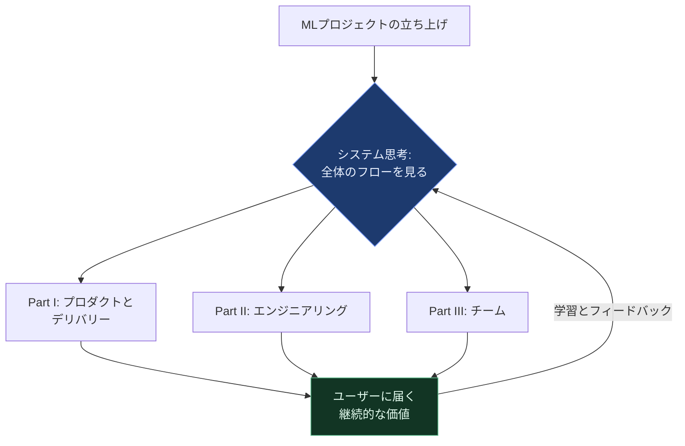
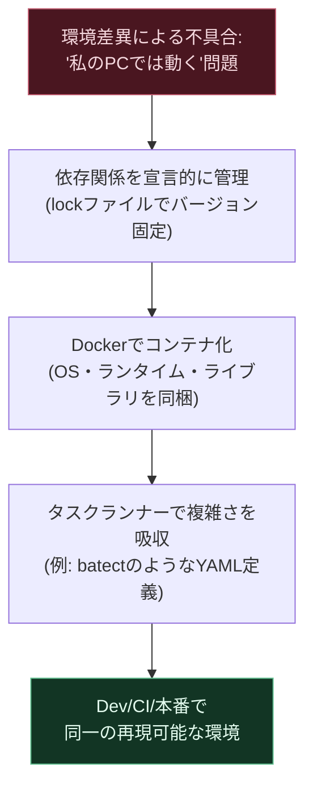
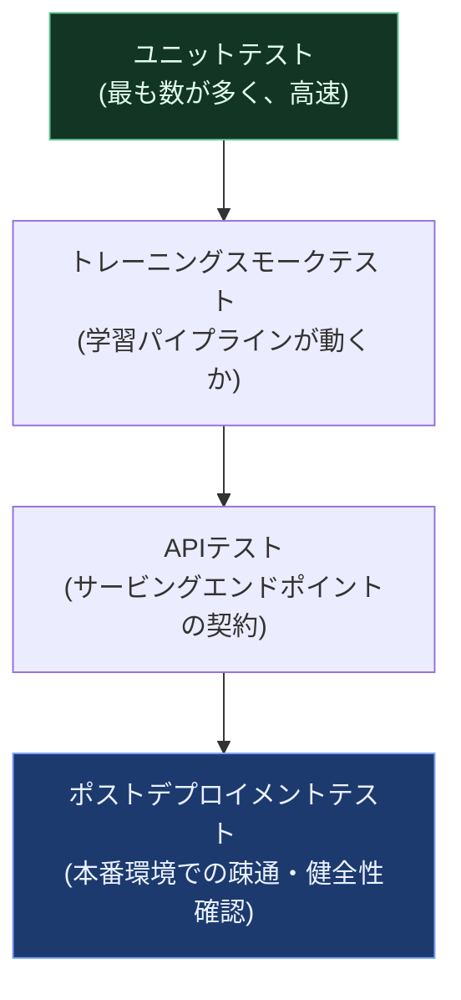
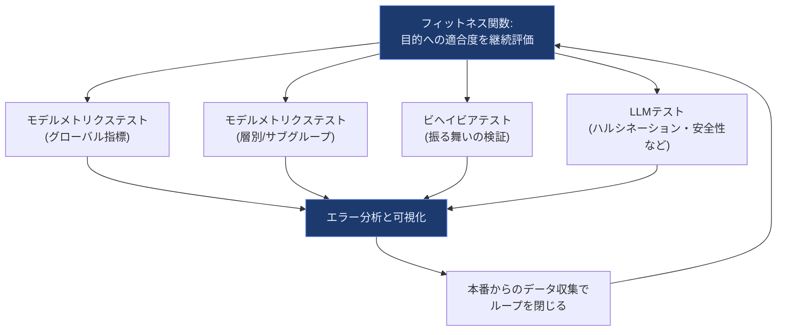
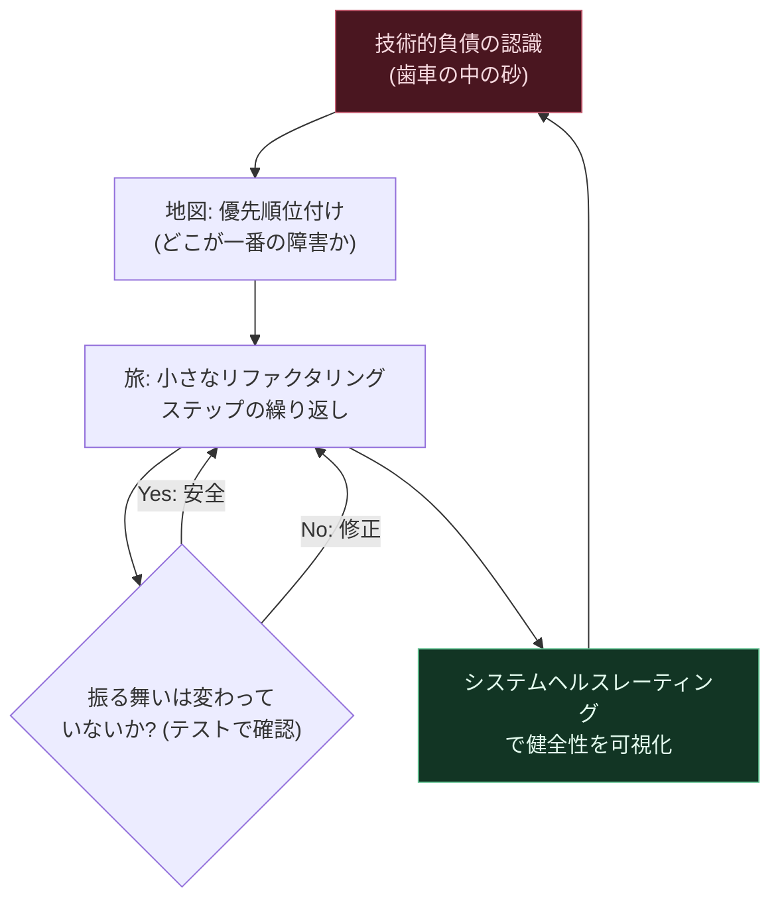
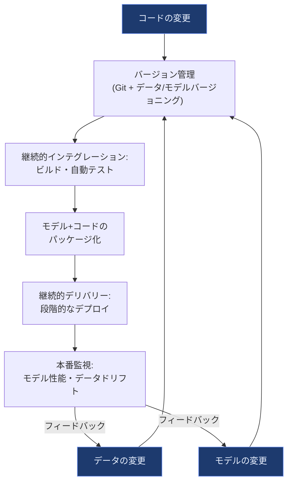
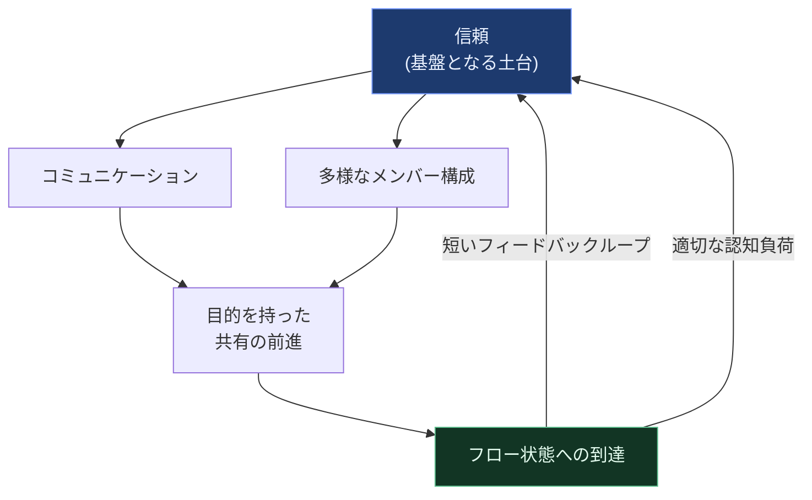
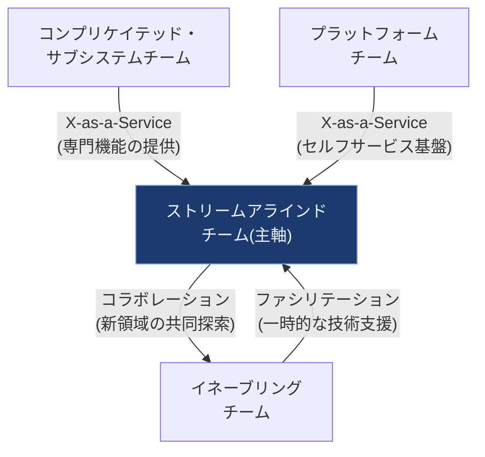

# Effective Machine Learning Teams 入門ガイド ― MLOps・データサイエンス・ソフトウェアエンジニアリングのベストプラクティス

## この記事について

本ガイドは、David Tan・Ada Leung・David Colls共著（いずれも著者らはThoughtworks出身のプラクティショナー）『Effective Machine Learning Teams』（O'Reilly Media、2024年2月刊、全11章・402ページ）[^1]を出発点に、初学者〜中級者のソフトウェアエンジニア・データサイエンティスト・QAエンジニア向けに、2026年9月時点の実務でそのまま使える形へ独自に再構成した技術文書です。

同書は「Part I: Product and Delivery（プロダクトとデリバリー）」「Part II: Engineering（エンジニアリング）」「Part III: Teams（チーム）」という3部構成・全11章から成り、ソフトウェアエンジニアリングとリーン・プロダクトデリバリーの実践知を機械学習（ML）システムの構築に応用することをテーマにしています[^1]。書籍そのものの詳細な各節の記述（演習やコード例の一字一句）はここでは再現せず、公開されている目次・概要と、CD4ML（Continuous Delivery for Machine Learning）やGoogleのMLベストプラクティスなど、同書が扱うテーマと重なる著名な国際的技術者・組織の一次情報を照合しながら、書籍非依存の独自の章構成で解説します。詳細な実践例やコード演習は、ぜひ書籍本体（原著英語）もあわせてご参照ください。

> **対象読者**：MLモデルは書けるが「チームで安定して本番運用し続ける」ことに課題を感じているデータサイエンティスト／ MLエンジニア／ QAエンジニア／エンジニアリングマネージャー
> **前提知識**：Python・Gitの基本操作、機械学習の基礎用語（学習・推論・特徴量など）
> **読み終えると分かること**：MLプロジェクトがなぜ失敗しやすいか、依存関係管理からテスト・MLOps・チーム設計まで、何を・なぜ・どう改善すればよいか

---

## 目次

1. [第0章：なぜMLプロジェクトは失敗するのか](#chapter0)
2. [第1章：プロダクトディスカバリーとリーン・デリバリー](#chapter1)
3. [第2章：依存関係管理とコンテナ化](#chapter2)
4. [第3章：自動テスト戦略の基礎](#chapter3)
5. [第4章：MLモデルのテストと本番監視](#chapter4)
6. [第5章：コードエディタ（IDE）の生産性向上](#chapter5)
7. [第6章：リファクタリングと技術的負債管理](#chapter6)
8. [第7章：MLOpsとCD4ML（機械学習のための継続的デリバリー）](#chapter7)
9. [第8章：効果的なMLチームの内部構造](#chapter8)
10. [第9章：効果的なML組織とチームトポロジー](#chapter9)
11. [第10章：実践ロードマップとチェックリスト](#chapter10)
12. [参考文献](#references)

---

## 第0章：なぜMLプロジェクトは失敗するのか

### 0.1 「モデルはできた。でも本番に出せない」という壁

多くのML案件は、Jupyter Notebook上での実験・精度検証（オフライン評価）まではうまく進みます。しかし、いざそれを本番システムに組み込もうとすると、次のような問題が次々と噴出します。

- ローカルでは動いたのに、別のPCやCI環境では依存ライブラリのバージョン差で動かない
- モデルの精度は良いはずなのに、本番のデータで想定外の挙動をする
- データサイエンティストとソフトウェアエンジニアの間で「誰が本番コードの品質に責任を持つか」が曖昧
- 一度リリースしたら、次の改善サイクルまで数週間〜数ヶ月かかる

これは特定のチームだけの問題ではなく、業界全体で繰り返し観測されているパターンです。GoogleのD. Sculleyらが2015年のNeurIPS（当時NIPS）で発表した論文「Hidden Technical Debt in Machine Learning Systems」は、MLシステムには通常のソフトウェアにはない技術的負債（entanglement＝もつれ、undeclared consumers＝未申告の消費者、hidden feedback loops＝隠れたフィードバックループなど）が蓄積しやすい構造的な理由があることを指摘しました[^2]。「モデルのコード自体はシステム全体のごく一部に過ぎず、周辺のデータ収集・特徴量抽出・監視・サービング基盤といった“glue code”（つなぎ合わせのコード）が肥大化しやすい」という指摘は、今なお多くのML基盤設計の出発点になっています[^2]。

### 0.2 システム思考というレンズ

`Effective Machine Learning Teams`の第1章は、この問題を「個別の技術（MLOpsツールなど）を導入するだけでは解決しない」とし、プロダクト・エンジニアリング・チームという3つの領域を**ひとつのシステムとして**捉える視点（システム思考）を提示しています[^1]。局所最適（例：モデル精度だけをひたすら追い求める）に陥らず、「アイデアから本番稼働、そして継続的な改善」までの一連の流れ（フロー）を全体として滑らかにすることが目的です。

以下は、本ガイドが扱う3つの領域と、それらが「ユーザーに届く価値」というひとつのゴールに向けてどう繋がっているかを示した全体図です。

**ベストプラクティス**
- MLOpsツールの導入を「銀の弾丸」として扱わない。ツールはボトルネックを解消する手段であり、目的ではない
- 「モデルの精度」だけでなく「アイデアから本番までのリードタイム」「1回の改善サイクルにかかる時間」を組織のKPIに含める
- 技術（Engineering）・プロダクト（Product）・チーム（Team）のどこにボトルネックがあるかを定期的に棚卸しする

---

## 第1章：プロダクトディスカバリーとリーン・デリバリー

### 1.1 「作れるもの」と「作るべきもの」は違う

MLチームは技術力が高いほど「作れるから作る」という罠に陥りがちです。`Effective Machine Learning Teams`のPart Iは、リーン・プロダクト開発の手法（プロダクトディスカバリー、インセプション、ユーザーストーリー）をMLプロジェクトに応用することを扱っています[^1]。

ここで参照される考え方の多くは、リーン・スタートアップやデザイン思考の系譜にある「仮説検証」のループです。ML案件では特に、以下の問いを早期に立てることが重要になります。

1. この予測・分類・生成タスクは、本当に機械学習でなければ解決できないのか（ルールベースやヒューリスティックで十分ではないか）
2. モデルの精度が上がることと、ビジネス上の成果（売上・継続率・コスト削減）が上がることは、本当にイコールか
3. 最初のバージョン（MVP）は、どこまで“ズルをして”（例：モデルの代わりに人手でラベル付けするWizard of Oz方式）検証できるか

GoogleのMartin Zinkevich氏が2016年前後に社内向けにまとめ、現在もGoogle for Developersで公開されている「Rules of Machine Learning: Best Practices for ML Engineering」の最初の3つのルールは、まさにこの姿勢を代弁しています。「ルール1：MLなしで製品をローンチすることを恐れるな」「ルール2：メトリクスの設計と実装を最優先事項にせよ」「ルール3：複雑なヒューリスティックよりも機械学習を選べ（ただし十分にヒューリスティックを磨いた後で）」という順序立てです[^3]。**MLは目的ではなく手段である**という原則は、プロダクトディスカバリーの段階から徹底する必要があります。

### 1.2 インセプション：チームを成功に導く最初の一歩

「インセプション（Inception）」とは、プロジェクト開始時にステークホルダーとチームが数日間集中して、プロダクトのビジョン・スコープ・リスク・技術方針をすり合わせるワークショップ形式の手法です。同書はこれを「チームを成功に向けてセットアップする」ための重要な儀式として位置づけています[^1]。MLプロジェクトの文脈では、通常のソフトウェア開発のインセプションに加えて、次のような論点を追加で扱う必要があります。

- どのデータソースが利用可能で、どのデータは倫理的・法的制約があるか
- 「良い予測」をどう定義し、誰が正解ラベルを作るのか
- モデルが誤った予測をした場合の許容範囲（フェイルセーフ設計）はどこまでか

### 1.3 デリバリーのケイデンスと計測

プロダクトディスカバリーで方向性を決めたら、次は「小さく作って、頻繁に届けて、学ぶ」というデリバリーのリズム（ケイデンス）を確立します。ここで役立つのが、DevOps Research and Assessment（DORA）チームが特定した4つの指標（Four Keys）です。DORAはGoogle Cloudの一部として、Nicole Forsgren・Jez Humble・Gene Kimらの著書『Accelerate』の研究を継続しています[^4]。

| 指標 | 何を測るか | 高パフォーマンスチームの目安 |
|---|---|---|
| デプロイ頻度（Deployment Frequency） | どれだけ頻繁に本番リリースできているか | 1日に複数回〜週次 |
| 変更のリードタイム（Lead Time for Changes） | コミットから本番稼働までの時間 | 1時間未満〜1日未満 |
| 変更失敗率（Change Failure Rate） | リリースが障害を引き起こす割合 | 0〜15%程度 |
| 平均復旧時間（Time to Restore Service） | 障害発生から復旧までの時間 | 1時間未満 |

出典：DORA公式ガイド「DORA's software delivery performance metrics」[^4]、Google Cloud Blog「Use Four Keys metrics like change failure rate to measure your DevOps performance」[^5]

この4指標のうち、デプロイ頻度とリードタイムは「速さ（スループット）」を、変更失敗率と復旧時間は「安定性」を表します[^5]。DORAの研究の重要な発見は、**速さと安定性はトレードオフではなく、高パフォーマンスチームは両方を同時に達成している**という点です[^4]。MLチームにおいても、「モデルの実験速度」と「本番の安定性」を対立させず、両方を計測対象にすることが推奨されます。

**ベストプラクティス**
- インセプションでは技術方針だけでなく「データの倫理・品質」「成功の定義」も必ず議題に含める
- モデル精度だけでなく、DORAの4指標（デプロイ頻度・リードタイム・変更失敗率・復旧時間）をダッシュボード化する
- 「ヒューリスティックで十分か」を毎回問い直し、MLを選ぶことを既定路線にしない[^3]

---

## 第2章：依存関係管理とコンテナ化

### 2.1 「私のPCでは動きます」問題

MLプロジェクトでは、Pythonのバージョン、CUDA/GPUドライバ、無数のライブラリ（NumPy、pandas、PyTorch、scikit-learnなど）の組み合わせが原因で、環境差異による不具合が頻発します。`Effective Machine Learning Teams`のPart II冒頭（第3〜4章）は、この問題を「コードがどこでも・毎回同じように動く」状態にするための原則とツールを扱っています[^1]。

基本的な解決の考え方は次の3段階です。

1. **依存関係を宣言的に管理する**：`requirements.txt`やロックファイル（`poetry.lock`、`uv.lock`など）でバージョンを固定し、暗黙の前提（「たまたまこのバージョンが入っていた」）を排除する
2. **開発環境をコンテナ化する**：Dockerで「OS・ランタイム・ライブラリ」を丸ごとイメージ化し、ローカル・CI・本番で同一の環境を再現する
3. **コンテナ運用の複雑さそのものを減らすツールを使う**：Dockerは強力ですが、`docker run`のオプションやマルチコンテナの依存関係管理は煩雑になりがちです

同書はDocker運用の複雑さを減らすツールの例として、著者陣（Thoughtworks在籍者）が関わる**batect**（Build and Testing Environments as Code Tool）を取り上げています[^1]。batectはYAML形式の設定ファイルでタスク（ビルド・テスト・実行など）とコンテナの依存関係を宣言し、`./batect <タスク名>`のようなシンプルなコマンドで、開発者ごとの環境差異を吸収します[^6]。プロジェクトのREADMEでは「開発タスク（ビルド・実行・テスト・Lintなど）を1つまたは複数のDockerコンテナの観点で定義し、それらのタスクをどこでも高速かつ一貫して実行し、チームと簡単に共有できる」ツールと説明されています[^6]。

> **補足**：2023年10月時点で、batectリポジトリはメンテナンス終了（NOT MAINTAINED）のアナウンスがされています[^6]。ツール自体は歴史的経緯として紹介していますが、実務で新規採用する場合は、同種の思想を持つ後継ツール（例：`devcontainer`仕様、Nix、Earthlyなど）の現状もあわせて調査することを推奨します。

### 2.2 セキュアな依存関係管理

第4章では、コンテナ化そのものに加えて、依存関係を安全に保つための実践が扱われています[^1]。代表的な取り組みは次の3つです。

- **不要な依存関係の削除**：使っていないライブラリはアタックサーフェス（攻撃対象領域）を広げるだけなので、定期的な棚卸しで削除する
- **脆弱性チェックの自動化**：`pip-audit`、`safety`、GitHubのDependabot、Snykなどのツールをパイプラインに組み込み、CVE（既知の脆弱性）を継続的に検知する
- **最小権限の原則**：コンテナはroot権限で動かさない、必要なネットワークアクセスのみを許可する、といったDockerセキュリティのベストプラクティスを併用する

**ベストプラクティス**
- ロックファイルはコミットし、CIでも同じロックファイルからインストールする（「latest」タグに依存しない）
- Dockerイメージのベースイメージも定期的に更新し、OSレベルの脆弱性パッチを取りこぼさない
- 依存関係の脆弱性スキャンをCIパイプラインの必須ステップにし、人手でのチェックに依存しない

---

## 第3章：自動テスト戦略の基礎

### 3.1 なぜMLチームはテストを後回しにしがちか

`Effective Machine Learning Teams`の第5章は「自動テストは、速く・壊さずに反復するための土台である」という前提から始まります[^1]。しかし現実には、データサイエンティストの多くはNotebookでの探索的な作業に慣れており、「モデルの評価指標（Accuracy、F1スコアなど）さえ良ければテストは不要」という誤解が根強く残っています。同書はこの「なぜテスト自動化が重要なのに、私たちはやっていないのか」という障壁そのものを直視することから議論を始めています[^1]。

一般的なソフトウェア開発における自動テストの考え方は、Martin Fowler氏（Thoughtworksのチーフサイエンティスト）が提唱・整理してきた「テストピラミッド」の概念を土台にしています。Fowler氏のブログ記事「The Practical Test Pyramid」（Thoughtworksの著者による寄稿）では、「土台となる高速なユニットテストを厚く、中間層の統合テストを適度に、UIなど壊れやすいテストは少数に留める」という考え方が説明されています[^7]。

MLシステムでは、このテストピラミッドに加えて「ソフトウェアとしてのテスト」と「モデルとしてのテスト」という2つの軸を意識する必要があります。以下は、`Effective Machine Learning Teams`第5章が扱う「ソフトウェアテスト」側の構成要素を、テストピラミッドの発想で図示したものです。

### 3.2 良いテストの特徴とありがちな落とし穴

同書第5章は「何をテスト対象にすべきか」「良いテストの特徴」「テストの構造（Given-When-Then等）」を扱っています[^1]。一般的なソフトウェアテストの原則をMLパイプラインに当てはめると、次のようなチェック観点になります。

| テストの種類 | 目的 | MLパイプラインでの具体例 |
|---|---|---|
| ユニットテスト | 個々の関数・クラスの正しさを検証 | 特徴量変換関数が欠損値を正しく処理するか |
| トレーニングスモークテスト | 学習パイプライン全体が壊れていないか | 小さなサンプルデータで1エポック学習が完走するか |
| APIテスト | サービング層の入出力契約を検証 | 推論APIが期待するスキーマでレスポンスを返すか |
| ポストデプロイメントテスト | 本番環境そのものの健全性を検証 | デプロイ直後にヘルスチェックエンドポイントが200を返すか |

**ベストプラクティス**
- 「テストが書きにくいから後回し」ではなく、テストしやすい設計（純粋関数化、依存性注入）を先に整える
- トレーニングスモークテストは、フルデータではなく小さなサブセットで高速に回せるようにする
- APIの入出力スキーマはPydanticなどで型定義し、契約違反を自動的に検知できるようにする

---

## 第4章：MLモデルのテストと本番監視

### 4.1 モデルテストはなぜ難しいのか

第5章がソフトウェアとしてのテストを扱うのに対し、第6章は「モデルそのもの」のテストという、より難しい領域を扱います[^1]。通常のソフトウェアテストは「入力Xに対して出力Yを期待する」という決定論的な検証ができますが、MLモデルは統計的な性質を持つため、「1件の予測が外れた＝バグ」とは単純に言えません。

この難しさに正面から取り組んだ代表的な文献が、Google のEric Breckらが2017年のIEEE International Conference on Big Dataで発表した論文「The ML Test Score: A Rubric for ML Production Readiness and Technical Debt Reduction」です[^8]。この論文は、実際のGoogle社内の36チームへのヒアリングをもとに、ML本番システムのテスト・監視について28項目の具体的なチェック観点を提示し、それぞれをスコアリングすることで「本番運用への準備度」を定量化するルーブリックを提案しています[^9]。著者らは「チェックリストは熟練したチームにとっても有用である」とし、あるチームでは1000行にも及ぶ未テストの特徴量生成コードが発見された事例を紹介しています[^9]。

### 4.2 フィットネス関数とモデルメトリクステスト

`Effective Machine Learning Teams`第6章のキーワードの一つが「フィットネス関数（Fitness Functions）」です[^1]。これは「このモデル・システムが目的に対してどれだけ適合しているか」を継続的に評価する仕組みという考え方で、進化的アーキテクチャの文脈で使われる概念をMLモデルの評価に応用したものです。具体的には次のようなテスト群に分解されます。

- **モデルメトリクステスト（グローバル）**：Accuracy・F1・AUCなど全体の指標が、あらかじめ定めた閾値を下回っていないか
- **モデルメトリクステスト（層別／Stratified）**：特定のサブグループ（年齢層、地域、言語など）ごとに精度が著しく劣化していないか。これはML Test Scoreの「モデルは公平性の観点でテストされているか」という項目とも重なります[^9]
- **ビヘイビアテスト（Behavioral Tests）**：「入力のわずかな変化に対してモデルの出力がどう変わるべきか」という振る舞いのレベルで検証するテスト（例：不変性テスト、方向性期待テスト）
- **大規模言語モデル（LLM）のテスト**：プロンプトインジェクション耐性、ハルシネーション率、望ましくない出力のフィルタリングなど、生成AI特有の評価軸

### 4.3 本番での監視とオープンクローズドなテスト設計

モデルは「デプロイして終わり」ではなく、本番環境でのデータドリフト・コンセプトドリフトを継続的に監視する必要があります。この点は、Chip Huyen氏（Claypot AI共同創業者）の著書『Designing Machine Learning Systems』（O'Reilly、2022年）でも詳しく扱われており、モデル監視の観点としてシステムメトリクス（CPU・レイテンシ）だけでなくML特有のメトリクス（予測分布、特徴量の統計量）を追跡することの重要性が説明されています[^10]。

同書はまた、継続学習（Continual Learning）の文脈で、シャドウデプロイメント（新モデルを既存モデルと並行稼働させ、出力を使わずに性能を検証する手法）やカナリアリリース（一部のトラフィックにのみ新モデルを適用する手法）といった段階的なロールアウト戦略にも触れています[^10]。これらは`Effective Machine Learning Teams`第6章が扱う「本番からのデータ収集ループを閉じる」「本番での監視」というテーマと直接つながる実践です[^1]。

**ベストプラクティス**
- モデルの評価指標はグローバル（全体）だけでなく、必ずサブグループ別（層別）でも確認する[^9]
- 新モデルは一気に100%のトラフィックへ投入せず、シャドウデプロイやカナリアリリースで段階的に検証する[^10]
- 本番での予測ログとユーザーの実際の行動（クリック、購入など）を突き合わせ、データ収集のループを設計段階から組み込む

---

## 第5章：コードエディタ（IDE）の生産性向上

### 5.1 なぜIDEの習熟が軽視されがちか

`Effective Machine Learning Teams`第7章は、一見地味に見えるが効果の大きいテーマ、「IDE（統合開発環境）の使いこなし」を扱います[^1]。データサイエンティストはNotebook中心の作業に慣れているため、VSCodeやPyCharmといった本格的なIDEの機能（リファクタリング支援、静的解析、デバッガ、ショートカット）を十分に活用していないケースが多く見られます。同書はこれを「2段階の計画」として整理しています[^1]。

### 5.2 具体的な設定のポイント

- **Linter/Formatterの自動化**：`ruff`、`black`、`isort`などをIDE保存時に自動実行し、コードスタイルの議論に時間を使わない
- **型チェックの統合**：`mypy`や`pyright`をエディタに統合し、実行前にバグの一部を検出する
- **リファクタリング支援機能の活用**：変数名の一括変更、メソッドの抽出などをIDEの機能で安全に行う（手動での文字列置換はミスの元）
- **キーボードショートカットの段階的な習得**：一度に全て覚えようとせず、よく使う5〜10個から始めて習慣化する

**ベストプラクティス**
- チームで共通のエディタ設定（`.editorconfig`、共有Lint設定）をリポジトリにコミットし、個人差を減らす
- 新メンバーのオンボーディング資料に「IDEセットアップ手順」を明記し、初日から生産性高く作業できるようにする
- ショートカット習得は「一気に全部」ではなく、週に数個ずつ増やす漸進的な学習にする

---

## 第6章：リファクタリングと技術的負債管理

### 6.1 技術的負債は「悪」ではなく「マネジメント対象」

`Effective Machine Learning Teams`第8章は、技術的負債を「システムを動かなくする歯車の中の砂」と表現し、テスト・設計・リファクタリングを通じて健全な負債レベルに保つことを扱っています[^1]。ここで重要なのは、技術的負債そのものが悪なのではなく、**意図せず・気づかないまま蓄積し、返済されない負債**が問題だという視点です。この考え方は、GoogleのD. Sculleyらの論文が指摘した「MLシステム特有の技術的負債（entanglement、hidden feedback loopsなど）」とも地続きです[^2]。

### 6.2 リファクタリングの定義

「リファクタリング」という言葉は日常的に使われますが、Martin Fowler氏はこれを厳密に定義しています。氏のブログでの定義（動詞）は「観測可能な振る舞いを変えずに、一連の細かいリファクタリングを適用してソフトウェアを再構築すること」であり（名詞）は「理解しやすく、変更しやすくするために、観測可能な振る舞いを変えずにソフトウェアの内部構造に加える変更」です[^11]。重要なのは、**外部から見た振る舞いを一切変えない**という制約です。振る舞いが変わってしまえば、それは「リファクタリング」ではなく単なる「変更」になります。

Notebookや実験的なMLコードは、探索の速度を優先するあまり、この「振る舞いを変えない」という規律が失われがちです。同書第8章は「Notebook（あるいは問題のあるコードベース）のリファクタリング方法」を具体的な手順として示しています[^1]。

### 6.3 地図と旅：リファクタリングの計画と実行

同書は、リファクタリングのプロセスを「地図（Map）：どこから手をつけるべきかの優先順位付け」と「旅（Journey）：実際に小さなステップで進めていく実行フェーズ」という比喩で説明しています[^1]。

**ベストプラクティス**
- リファクタリング前には必ず自動テスト（少なくともユニットテスト）で現在の振る舞いを固定化する
- 「大きな一撃」ではなく、小さく安全なステップの積み重ねでリファクタリングする[^11]
- 技術的負債の状態を定期的に「システムヘルスレーティング」のような形で可視化し、返済を先延ばしにしない仕組みを作る

---

## 第7章：MLOpsとCD4ML（機械学習のための継続的デリバリー）

### 7.1 MLOpsだけでは足りないピース

`Effective Machine Learning Teams`第9章は、MLOpsという言葉が指す範囲の広さと、それだけでは埋まらない「パズルのピース」を整理した上で、CD4ML（Continuous Delivery for Machine Learning）という枠組みを紹介しています[^1]。

CD4MLは、Thoughtworksのプリンシパルコンサルタントである Danilo Sato氏、Arif Wider氏、Christoph Windheuser氏が2019年にmartinfowler.comで発表した記事「Continuous Delivery for Machine Learning」で提唱した概念です[^12]。この記事では、通常のソフトウェアの継続的デリバリー（Jez Humble氏・Dave Farley氏の定義：「新機能・設定変更・バグ修正・実験を含むあらゆる種類の変更を、安全かつ迅速に、持続可能な方法で本番環境やユーザーの手元に届ける能力」）を、MLシステム特有の3つの変更軸（コード・モデル・データ）に拡張する形で定義しています[^12]。

> CD4MLは、「機能横断的なチームが、コード・データ・モデルに基づくMLアプリケーションを、いつでも安全に・小さな単位で・再現可能な形で本番に届けられるようにする」ソフトウェアエンジニアリングのアプローチである、と要約されます[^12]。

### 7.2 CD4MLパイプラインの構成要素

CD4MLの技術的な構成要素は、通常のCI/CDパイプラインに「データバージョニング」「モデルバージョニング」「モデルの継続的な性能監視」を追加したものと捉えると理解しやすくなります。以下の図は、コード・データ・モデルという3つの変更軸が、どのようにビルド・デプロイ・監視のサイクルへ統合されるかを示しています。

同書は、CD4MLがMLガバナンスやResponsible AI（責任あるAI）をどう支えられるかという論点にも触れています[^1]。データ・モデルのバージョニングと監視の仕組みが整っていれば、「どのデータで・どのバージョンのモデルが・いつ本番に投入されたか」を追跡可能にし、監査対応や説明責任の基盤にもなります。

### 7.3 MLOpsの成熟度レベル

Google CloudのCloud Architecture Centerが公開しているドキュメント「MLOps: Continuous delivery and automation pipelines in machine learning」は、MLOpsの自動化の度合いを3段階の成熟度レベルとして整理しています[^13]。

| 成熟度レベル | 特徴 | 課題 |
|---|---|---|
| レベル0（手動プロセス） | データ分析・前処理・学習・検証がすべて手動・スクリプト駆動 | モデル更新が稀にしか行われず、本番投入までに時間がかかる |
| レベル1（MLパイプライン自動化） | 学習パイプラインを自動化し、継続的トレーニング（CT）を実現 | 新しい実装（特徴量エンジニアリング等）のデプロイはまだ手動 |
| レベル2（CI/CDパイプライン自動化） | パイプライン自体のビルド・テスト・デプロイもCI/CDで自動化 | 高度な自動化基盤の構築・運用コストが必要 |

出典：Google Cloud「MLOps: Continuous delivery and automation pipelines in machine learning」[^13]

このドキュメントは「本番環境でMLを実装するとは、単にモデルをAPIとしてデプロイすることではなく、新しいモデルの再学習とデプロイを自動化できるMLパイプラインをデプロイすることを意味する」と述べています[^13]。すべての組織がレベル2を目指す必要はなく、自分たちのチームが今どのレベルにいて、次にどこがボトルネックになっているかを把握することが実務上重要です。

**ベストプラクティス**
- 「MLOps」という言葉を導入する前に、まず自分たちのCD4ML成熟度（コード・データ・モデルそれぞれのバージョニングと自動テストの有無）を棚卸しする[^12]
- 全部を一気に自動化しようとせず、レベル0→1→2と段階的に投資する[^13]
- モデルだけでなくパイプライン全体（前処理・特徴量抽出・学習・評価）をCI/CDの対象にする

---

## 第8章：効果的なMLチームの内部構造

### 8.1 技術だけでは解決できない領域へ

`Effective Machine Learning Teams`のPart IIIは、ここまでの技術的な話題から一転して、「人とチーム」というテーマに焦点を当てます。第10章は、MLチームが直面しがちな共通の課題を整理した上で、効果的なチームの内部構造（信頼、コミュニケーション、多様性、目的の共有）を扱っています[^1]。

### 8.2 信頼という土台

同書は「信頼（Trust）」をチームの効果性における基礎的な構成要素として位置づけています[^1]。これは、Googleの人事分析チームが2012年から2年間かけて実施した社内調査プロジェクト「Project Aristotle」の発見と強く重なります。Googleのre:Workが公開しているガイド「Understand team effectiveness」によれば、180のチーム・250以上の属性を分析した結果、チームの効果性に最も強く影響していたのは「誰がチームにいるか」ではなく「チームがどう協働しているか」であり、その中でも**心理的安全性（Psychological Safety）**が5つの鍵となる力学の中で最も重要であることが分かりました[^14]。

re:Workのガイドでは、5つの力学を次のように整理しています[^14]。

| 力学 | 定義（サーベイ項目の例） |
|---|---|
| 心理的安全性 | 「このチームでミスをしても、それが自分の不利益にならない」 |
| 相互信頼性（Dependability） | 「チームメイトが『やる』と言ったことは、きちんとやり遂げてくれる」 |
| 構造と明確さ | 「チームには効果的な意思決定プロセスがある」 |
| 仕事の意味 | 「チームのために行う仕事は、自分にとって意味がある」 |
| インパクト | 「チームの仕事が組織の目標にどう貢献しているか理解している」 |

出典：Google re:Work「Understand team effectiveness」[^14]

心理的安全性は「何でも許される」ことではなく、「リスクを取って発言しても、無知・無能・ネガティブ・邪魔だと思われる不安なく、間違いを認め、質問し、新しいアイデアを提案できる」状態を指します[^15]。MLチームでは特に、「このモデルの前提は間違っているかもしれない」「このデータには偏りがあるかもしれない」といった、成果を否定しかねない指摘を安心して言える環境が、品質と安全性に直結します。

### 8.3 コミュニケーション、多様なメンバー構成、目的の共有

同書はこれに続けて、コミュニケーション（Communication）、多様なメンバー構成（Diverse Membership）、目的を持った共有の前進（Purposeful, Shared Progress）を効果的なチームの内部要素として挙げています[^1]。MLチームは特に、データサイエンティスト・MLエンジニア・ソフトウェアエンジニア・プロダクトマネージャー・ドメインエキスパートといった専門性の異なるメンバーで構成されることが多く、共通言語（用語の統一）と、互いの専門性へのリスペクトが重要になります。

### 8.4 フローを改善する内部戦術：フィードバックループ・認知負荷・フロー状態

同書はさらに、チームの内部で「フロー（滞りのない仕事の流れ）」を改善するための戦術として、フィードバックループの短縮、認知負荷の管理、フロー状態への到達を挙げています[^1]。これらはソフトウェアエンジニアリングの効果性（Engineering Effectiveness）の議論とも重なります。

**ベストプラクティス**
- ミーティングの冒頭で「間違いを共有しても評価が下がらない」ことをチームで明示的に確認する（心理的安全性の言語化）[^14]
- データサイエンティストとエンジニアの間で用語集（Glossary）を共有し、「精度」「品質」などの言葉の意味のズレを解消する
- 1人のエンジニアが同時に抱えるタスク数・コンテキストスイッチの回数を可視化し、認知負荷を意図的にコントロールする

---

## 第9章：効果的なML組織とチームトポロジー

### 9.1 「チームの集合」としての組織

`Effective Machine Learning Teams`第11章は、単一チームを超えて「組織全体としてどうMLを効果的にスケールさせるか」を扱います。同書はここで、「効果的な組織とは、チームのチーム（Teams of Teams）である」という視点と、価値主導のポートフォリオマネジメント、そしてチームトポロジーのモデルを紹介しています[^1]。

### 9.2 チームトポロジー：4つのチームタイプと3つの相互作用モード

「チームトポロジー」は、Matthew Skelton氏とManuel Pais氏が2019年に発表した書籍『Team Topologies: Organizing Business and Technology Teams for Fast Flow』（IT Revolution）で体系化した組織設計のフレームワークです[^16]。この本は、ソフトウェアの構造は、それを作った組織のコミュニケーション構造を反映するという「コンウェイの法則」を土台に、意図的に組織構造を設計することでソフトウェアアーキテクチャの質を高めるというアプローチを提示しています[^17]。

Team Topologiesは、組織内のチームを4つの基本タイプに分類します[^17][^18]。

| チームタイプ | 役割 |
|---|---|
| ストリームアラインドチーム（Stream-aligned team） | 特定のプロダクト・サービス・ユーザー向け機能を、エンドツーエンドで担当する主軸のチーム |
| イネーブリングチーム（Enabling team） | 他チームが新しい技術・手法を習得できるよう、一時的に支援する専門チーム |
| コンプリケイテッド・サブシステムチーム（Complicated-subsystem team） | 高度な専門知識（例：数理最適化エンジン、ML基盤）を要するサブシステムを担当するチーム |
| プラットフォームチーム（Platform team） | 他チームがセルフサービスで使える内部プラットフォーム（インフラ、共通基盤）を提供するチーム |

出典：Team Topologies公式サイト「Key concepts」[^17]、書籍レビュー記事[^18]

「ストリームアラインドチームこそが組織の中心であり、他の3つの基本的なチームトポロジーの目的は、ストリームアラインドチームの負担を減らすことにある」と、書籍の該当箇所を引用したレビュー記事は要約しています[^18]。これら4種類のチームは、コラボレーション（Collaboration）、X-as-a-Service（サービスとしての提供）、ファシリテーション（Facilitating）という3つの相互作用モードのいずれかで連携します[^17]。

MLの文脈では、「コンプリケイテッド・サブシステムチーム」がML基盤（特徴量ストア、学習パイプライン基盤）を担当し、「プラットフォームチーム」がMLOps基盤全体をセルフサービスで提供する、といった対応付けがよく見られます。`Effective Machine Learning Teams`第11章は、このモデルをMLチームの文脈に応用する具体的な考え方（Team Topologies for ML Teams）を扱っています[^1]。

### 9.3 組織的な戦術：意図的なリーダーシップと心理的安全性の文化

同書はさらに、組織レベルの戦術として、意図的なリーダーシップ、効果的なチームのための構造とシステムの構築、ステークホルダーとの連携、心理的安全性の文化醸成、継続的改善の推進、失敗を学習機会として捉える姿勢を挙げています[^1]。これらはいずれも、第8章で扱った「チーム内部の心理的安全性」を組織スケールへ拡張したものと理解できます。

**ベストプラクティス**
- ML基盤を「コンプリケイテッド・サブシステムチーム」として明確に切り出し、各プロダクトチームが基盤の内部実装を意識しなくて済むようにする[^17]
- チーム間の連携方式（コラボレーション／X-as-a-Service／ファシリテーション）を意図的に選び、なんとなくの馴れ合いにしない[^17]
- イネーブリングチームによる技術支援は「一時的」であることを明示し、恒久的な依存関係にしない[^17]

---

## 第10章：実践ロードマップとチェックリスト

ここまでの内容を、実際にチームで着手する際のロードマップとしてまとめます。すべてを一度に導入する必要はありません。自分たちのチームが今どこにボトルネックを抱えているかを見極め、優先順位をつけて着手してください。

### 10.1 領域別チェックリスト

- [ ] プロダクト: 「MLでなければ解決できないか」を問い直す仕組みがある
- [ ] プロダクト: DORAの4指標（デプロイ頻度・リードタイム・変更失敗率・復旧時間）を計測している
- [ ] エンジニアリング: 依存関係がロックファイルで固定され、CIでも同じ環境を再現できる
- [ ] エンジニアリング: 開発環境がコンテナ化され、「私のPCでは動く」問題が起きていない
- [ ] エンジニアリング: ユニットテスト・トレーニングスモークテスト・APIテスト・ポストデプロイメントテストが揃っている
- [ ] エンジニアリング: モデルの評価をグローバルだけでなくサブグループ別（層別）でも行っている
- [ ] エンジニアリング: 新モデルはシャドウデプロイやカナリアリリースで段階的に検証している
- [ ] エンジニアリング: リファクタリング前に自動テストで現状の振る舞いを固定化している
- [ ] エンジニアリング: コード・データ・モデルの3軸すべてがバージョン管理され、CD4MLのパイプラインに乗っている
- [ ] チーム: チーム内で心理的安全性について明示的に話し合ったことがある
- [ ] チーム: データサイエンティストとエンジニアの間で用語の共通理解がある
- [ ] 組織: 各チームの役割（ストリームアラインド／イネーブリング／サブシステム／プラットフォーム）が明確になっている

### 10.2 最初の一歩としてのおすすめ

技術的な負債が大きいチームほど、いきなり「MLOps基盤の全面刷新」のような大きな投資に飛びつきたくなりますが、`Effective Machine Learning Teams`が一貫して伝えているメッセージは、**システム全体を見渡した上で、今いちばんのボトルネックになっている場所から、小さく安全に着手する**という姿勢です[^1]。まずは「依存関係の固定化」「トレーニングスモークテストの追加」など、1〜2週間で着手できる項目から始めることを推奨します。

---

## 参考文献

- **[1]** David Tan, Ada Leung, David Colls. *Effective Machine Learning Teams: Best Practices for MLOps, Data Science, and Software Engineering*. O'Reilly Media, 2024年2月. 目次・概要: https://www.oreilly.com/library/view/effective-machine-learning/9781098144623/
- **[2]** D. Sculley et al. "Hidden Technical Debt in Machine Learning Systems." *Advances in Neural Information Processing Systems 28 (NeurIPS 2015)*. https://papers.nips.cc/paper/5656-hidden-technical-debt-in-machine-learning-systems
- **[3]** Martin Zinkevich. "Rules of Machine Learning: Best Practices for ML Engineering." Google for Developers. https://developers.google.com/machine-learning/guides/rules-of-ml
- **[4]** DORA. "DORA's software delivery performance metrics." https://dora.dev/guides/dora-metrics-four-keys/
- **[5]** Google Cloud Blog. "Use Four Keys metrics like change failure rate to measure your DevOps performance." https://cloud.google.com/blog/products/devops-sre/using-the-four-keys-to-measure-your-devops-performance
- **[6]** batect (Build and Testing Environments as Code Tool), GitHubリポジトリREADME. https://github.com/batect/batect
- **[7]** Martin Fowler (Thoughtworksによる寄稿記事). "The Practical Test Pyramid." https://martinfowler.com/articles/practical-test-pyramid.html
- **[8]** Eric Breck, Shanqing Cai, Eric Nielsen, Michael Salib, D. Sculley. "The ML Test Score: A Rubric for ML Production Readiness and Technical Debt Reduction." *2017 IEEE International Conference on Big Data*, Google, Inc. 論文PDF: https://research.google.com/pubs/archive/aad9f93b86b7addfea4c419b9100c6cdd26cacea.pdf
- **[9]** Google Research. "The ML test score: A rubric for ML production readiness and technical debt reduction"（論文概要ページ）. https://research.google/pubs/the-ml-test-score-a-rubric-for-ml-production-readiness-and-technical-debt-reduction/
- **[10]** Chip Huyen. *Designing Machine Learning Systems: An Iterative Process for Production-Ready Applications*. O'Reilly Media, 2022. 著者公式サポートリポジトリ: https://github.com/chiphuyen/dmls-book
- **[11]** Martin Fowler. "Definition Of Refactoring"（bliki）. https://martinfowler.com/bliki/DefinitionOfRefactoring.html
- **[12]** Danilo Sato, Arif Wider, Christoph Windheuser (Thoughtworks). "Continuous Delivery for Machine Learning." martinfowler.com, 2019年9月19日. https://martinfowler.com/articles/cd4ml.html
- **[13]** Google Cloud, Cloud Architecture Center. "MLOps: Continuous delivery and automation pipelines in machine learning." https://docs.cloud.google.com/architecture/mlops-continuous-delivery-and-automation-pipelines-in-machine-learning
- **[14]** Google re:Work. "Guide: Understand team effectiveness"（Project Aristotle研究に基づく公式ガイド）. https://rework.withgoogle.com/intl/en/guides/understand-team-effectiveness
- **[15]** Google re:Work Blog. "The five keys to a successful Google team." https://rework.withgoogle.com/blog/five-keys-to-a-successful-google-team/
- **[16]** IT Revolution / Team Topologies公式サイト. "Book — Team Topologies." https://teamtopologies.com/book
- **[17]** Team Topologies公式サイト. "Key concepts and practices for applying a Team Topologies approach." https://teamtopologies.com/key-concepts
- **[18]** Ralf Kruse. "Book Review: 'Team Topologies' by Matthew Skelton and Manuel Pais." https://embeddeduse.com/2022/04/23/book-review-team-topologies-by-matthew-skelton-and-manuel-pais/

---

*本ガイドは2026年9月13日時点で公開されている情報をもとに作成しています。書籍本体の各章の詳細な演習・コード例については、O'Reilly公式ページ（上記[^1]）または書籍本体をご参照ください。*
