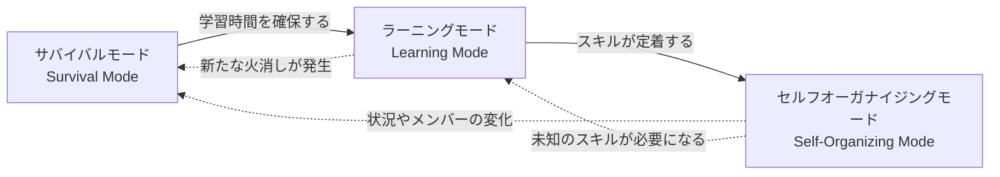
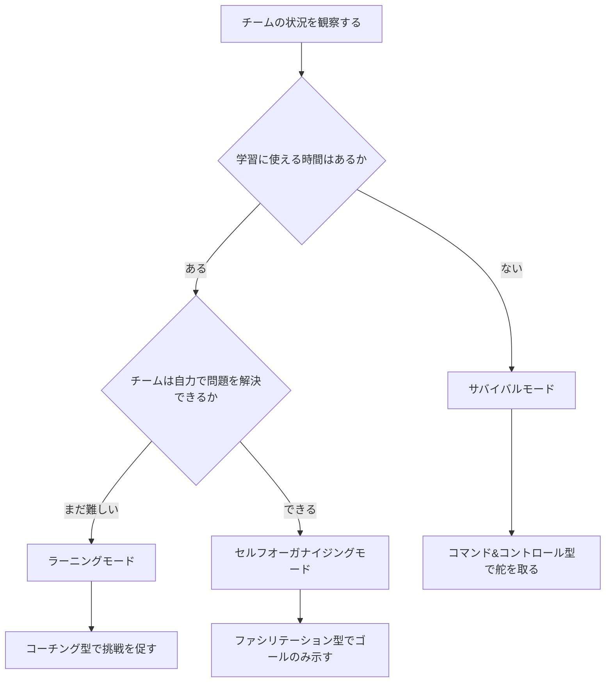
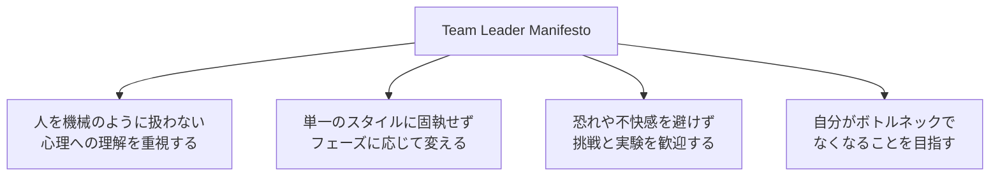
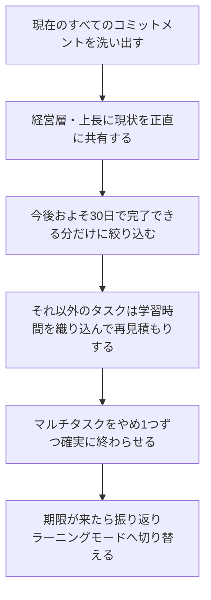
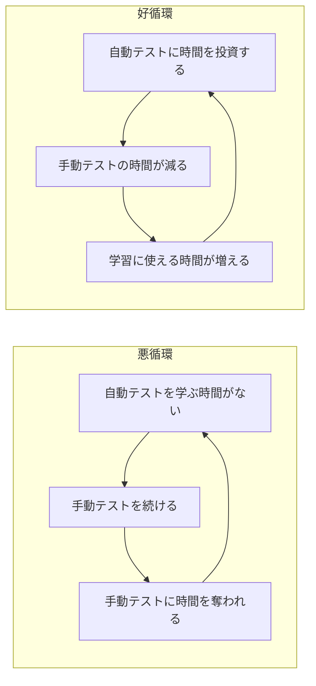

# Elastic Leadership（エラスティックリーダーシップ）実践ガイド
### ― チームを自己組織化へ導くリーダーシップ・フレームワーク入門 ―

> 本ガイドは、Roy Osherove 著『*Elastic Leadership: Growing Self-Organizing Teams*』（Manning Publications, 2016）を軸に、著者本人へのインタビュー記事・ポッドキャスト・カンファレンス講演などの一次情報をもとに、初学者向けにステップバイステップで再構成した解説書です。書誌情報は本文末尾の「参考文献・出典」を参照してください。

---

## 目次

1. [Elastic Leadershipとは何か](#1-elastic-leadershipとは何か)
2. [3つのチームフェーズを理解する](#2-3つのチームフェーズを理解する)
3. [フェーズの見極め方（意思決定フロー）](#3-フェーズの見極め方意思決定フロー)
4. [Team Leader Manifesto（チームリーダーの行動指針）](#4-team-leader-manifestoチームリーダーの行動指針)
5. [主要な実践テクニック](#5-主要な実践テクニック)
6. [ステップバイステップ：サバイバルモードからの脱出](#6-ステップバイステップサバイバルモードからの脱出)
7. [ステップバイステップ：ラーニングモードでチームを育てる](#7-ステップバイステップラーニングモードでチームを育てる)
8. [ステップバイステップ：セルフオーガナイジングモードを維持する](#8-ステップバイステップセルフオーガナイジングモードを維持する)
9. [よくあるアンチパターン](#9-よくあるアンチパターン)
10. [ラインマネージャー（マネージャーのマネージャー）向けの指針](#10-ラインマネージャーマネージャーのマネージャー向けの指針)
11. [実践チェックリスト](#11-実践チェックリスト)
12. [まとめ](#12-まとめ)
13. [参考文献・出典](#13-参考文献出典)

---

## 1. Elastic Leadershipとは何か

Elastic Leadership（エラスティックリーダーシップ）は、ソフトウェアエンジニア出身のコンサルタント・研修講師である Roy Osherove（ロイ・オシェロブ）氏が、自身のチームリーダー経験と多数の失敗から体系化したリーダーシップ・フレームワークです。原型は同氏が個人ブログ「5whys.com」に書き溜めた記事群であり、当初は電子書籍『*Notes to a Software Team Leader*』として発表され、その後 Manning 社から書籍化・再編集されて『*Elastic Leadership*』として刊行されました。

このフレームワークの中心にある考え方はシンプルです。

> **「チームが今どのフェーズにいるかによって、リーダーが取るべきスタイルは変わるべきである」**

多くのリーダーシップ論が「良いアジャイルプラクティスとは何か」を語るのに対し、Elastic Leadershipは「メンバーに実際に行動を変えてもらうにはどうすればよいか」という、いわば実践と理論の“隙間”を埋めることを目的としています。対象読者は、プロジェクトマネージャー、プロダクトオーナー、テックリード、アーキテクト、スクラムマスターなど、組織の中で「ボトルネック」になりやすい立場の人全般です。

Elastic Leadershipのゴールは、リーダー自身が最終的に「いなくても回るチーム」＝**自己組織化されたチーム（Self-Organizing Team）**を育てることにあります。著者自身、現場で本当の意味で自己組織化されたチームに出会えることは極めて稀であると述べており、多くのチームは慢性的な「火消し対応」に追われる状態にとどまりがちだと指摘しています。

---

## 2. 3つのチームフェーズを理解する

Elastic Leadershipモデルの核となるのが、チームが取りうる**3つの成熟フェーズ**です。Tuckman の集団発達モデル（Forming–Storming–Norming–Performing）と似た印象を受ける人もいますが、著者自身はTuckmanモデルを直接の元ネタとはしておらず、着眼点が異なる独自のモデルであると説明しています。

3つのフェーズは一方向に進むだけでなく、外部環境の変化（新規メンバーの加入、担当プロダクトの変更、大規模障害の発生など）によって簡単に逆戻りする点が重要です。数週間、時には数日単位でフェーズが行き来することも珍しくないとされています。

### フェーズ比較表

| 項目 | サバイバルモード | ラーニングモード | セルフオーガナイジングモード |
|---|---|---|---|
| チームの状態 | 常に火消し対応に追われ、学習に使える時間がない | 新しいスキルを身につける余裕がある | チーム自身の力で大半の問題を解決できる |
| 適したリーダーシップスタイル | コマンド＆コントロール（指示型） | コーチング（挑戦を促す伴走型） | ファシリテーション（ゴール提示のみ） |
| リーダーの主な仕事 | 優先順位の整理とコミットメントの棚卸し | 挑戦の提供・フィードバック・再見積もり支援 | 障害物の除去、目標・指標の設計 |
| 心理的な特徴 | 「ヒーロー」であることに居心地の良さを感じやすい中毒的状態 | 居心地の悪さ・フラストレーションを伴う | 裁量を持って自走できる安心感 |
| リーダーが目指す変化 | 学習時間を確保しラーニングモードへ移行させる | スキル定着によりセルフオーガナイジングへ移行させる | 変化を検知し必要ならモードを再調整する |

### 各フェーズの詳細

**サバイバルモード（Survival Mode）**
常にビルドの修正や障害対応に追われ、学ぶ時間も、失敗して学び直す余裕もない状態です。逆説的ですが、このモードは多くの人にとって「居心地が良い」場所でもあります。深夜にビルドを直す“ヒーロー”であり続けることに、心理的な充足感やアイデンティティを見出してしまうためです。著者はこれを一種の中毒的な状態だと表現しています。抜け出すための第一の障壁は技術ではなく心理面にあるとされます。

**ラーニングモード（Learning Mode）**
チームに新しいスキルを練習する時間的余裕（後述する「スラックタイム」）がある状態です。多くのリーダーにとって、実はセルフオーガナイジングモードよりもラーニングモードの運営の方が難しいとされます。なぜなら、見積もりをやり直し、あえて非効率で不慣れなやり方に時間を使うことをチームにも経営層にも納得してもらう必要があるためです。

**セルフオーガナイジングモード（Self-Organizing Mode）**
チームが「チームリードの集合体」のように、直面するほぼすべての課題に対して自力で答えを見つけられる状態です。著者の経験則では、実際にこの状態に到達しているチームは全体のごく一部（体感で5%程度）に過ぎないとされています。このモードのリーダーに求められるのは「邪魔をしないこと」であり、具体的なやり方ではなくゴールだけを示す姿勢が重要です。

---

## 3. フェーズの見極め方（意思決定フロー）

Elastic Leadershipにおいてリーダーが日々自問すべき問いは、「今チームはどのフェーズにいるか」、そして「セルフオーガナイジングモードに近づけるために何をすべきか」の2つに集約されます。

判断の出発点として、著者は次のような自問自答の連鎖を例に挙げています（要旨）。

- チームを自己組織化させるには、今足りていないスキルを身につけてもらう必要がある。
- しかし今はサバイバルモードで、その練習をする時間がない。
- だからまずサバイバルモードを脱し、学習時間を作らなければならない。
- そのためには、いったんコマンド＆コントロール型のリーダーシップで舵を取る必要がある。

このように、最終ゴール（自己組織化）から逆算して「今どのスタイルを取るべきか」を導き出す発想が、Elastic Leadershipの実践における基本パターンです。

---

## 4. Team Leader Manifesto（チームリーダーの行動指針）

著者は、日々の判断に迷ったときの「モラルコンパス」として、**Team Leader Manifesto（チームリーダー・マニフェスト）**という短い価値観の宣言をまとめています。このマニフェストは現在も5whys.comで継続的に改訂が続けられているオープンな文書です。要旨は次の4本柱に整理できます。

| 柱 | 内容の要旨 |
|---|---|
| 人間中心 | チームメンバーは機械ではない。行動科学・心理学的な理解を、プロセスやツールの理解と同じくらい重視する |
| 適応的リーダーシップ | 「唯一絶対の正しいスタイル」を信奉せず、チームの現在地に応じてリーダーシップのかけ方を変え続ける |
| 挑戦と実験の受容 | チームのために安全を選ぶより挑戦を選ぶ。恐れや居心地の悪さを、新しいスキルを学ぶための自然な副作用として歓迎する。人・ツール・プロセス・環境のすべてにおいて日常的な実験を大切にする |
| 自己不要化（ボトルネック解消） | 自分がいなければチームが動かない状態＝ボトルネックであることを是とせず、日々「自分がどれだけ必要とされなくなったか」を成功指標として捉える |

InfoQによるインタビュー記事でも、このモデルの核心的なメッセージとして、アジャイルリーダーの最終ゴールは自分自身を不要にすること、つまり真に自己組織化されたチームを作ることにあると述べられています。

---

## 5. 主要な実践テクニック

### 5.1 バス係数（Bus Factor）

「バス係数」とは、「もしその人が明日バスに轢かれて出社できなくなったら、チームの機能が止まってしまう人数」を表す指標です。バス係数が1（＝自分しかその仕事ができない）の状態は、リーダー自身が最大のリスク要因になっていることを意味します。Elastic Leadershipでは、リーダーは継続的に自分自身のバス係数への寄与を下げていくこと――すなわち自分にしかできない意思決定や知識を、時間をかけてチームに移転していくこと――を重要な役割の一つとして位置づけます。

### 5.2 スラックタイム（Slack Time）

スラックタイムとは、失敗を許容しながら新しいスキルを練習するための「学習用の余白時間」です。著者は「子どもに靴ひもの結び方を教える」比喩を用い、急いでいるときは大人が結んであげるしかないが、時間に余裕があれば子ども自身に練習させることができる、と説明しています。サバイバルモードで学習時間が確保できないのは、この余白＝スラックタイムが構造的に存在しないためです。

### 5.3 コミットメント言語（Commitment Language）

ラーニングモードのチームでは、メンバーが「やってみます」「たぶんできると思います」といった**逃げ道のある言い回し**でタスクを引き受けてしまいがちです。著者はこれに対し、「何を」「いつまでに」やるのかを明確にする話法＝コミットメント言語を用いることを推奨しています。ポイントは、本人がコントロールできない結果（例：バグの完全な解消）ではなく、本人がコントロールできる行動（例：関係者への打診メールを本日中に送る）に対してコミットしてもらうことです。この考え方から、著者はスプリント末の機能完成そのものへのコミットメントに懐疑的な立場を取っています。

### 5.4 クリアリングミーティング（Clearing Meetings）

クリアリングミーティングは、チームメンバーが抱えている課題と、それに対して**すでに自分で着手し始めていること**を共有する場です。この会議の価値は、メンバーが「会議で指示を待つ」のではなく「会議に来る前にすでに行動を起こしている」状態をどれだけ作れているかを観察できる点にあります。著者は、チームの成熟度を測る上でこれに勝る方法を知らないと述べるほど、この手法を重視しています。

### 5.5 「専門家はいない、いるのは私たちだけ」

著者の友人であり著述家・カンファレンス講演者でもある Jeremy D. Miller 氏の言葉に由来する、書籍中の印象的なフレーズです。経験を積んだリーダーであっても答えを確信して行動しているわけではなく、多くの場合は手探りで意思決定をしていることを直視する考え方を表しています。初学者がリーダー職に不安を感じたときの心理的なハードルを下げる目的で紹介されている概念です。

---

## 6. ステップバイステップ：サバイバルモードからの脱出

サバイバルモードは「船が沈みかけている状態で船長が会議を開くのではなく、まず命令を出す」局面にたとえられます。この段階では一時的にコマンド＆コントロール型のリーダーシップを取ることが正当化されますが、あくまで**期限付きの措置**である点が重要です。

1. **現状の可視化**：チームが今何にコミットしているかをすべて棚卸しします。
2. **正直な状況共有**：経営層に対して、このまま進めば状況が悪化する一方であることを率直に伝えます。著者はこれを「怖いからこそやるべきこと」と位置づけており、リーダーの本来の職務価値はまさにこの困難な会話にあると強調しています。
3. **期間を区切った絞り込み**：今後およそ30日間で現実的に完了できる分だけにコミットメントを絞ります。
4. **残りタスクの再見積もり**：入りきらなかったタスクは、学習コストを織り込んで再見積もりします（3〜5倍程度の時間を要することも珍しくないとされます）。
5. **マルチタスクの排除**：並行作業をやめ、1つずつ完了させることで実質的なスループットを取り戻します。
6. **期限到来時の移行**：区切った期間が終わったら、必ずラーニングモードへの移行を実行します。ここで移行せずにコマンド＆コントロール状態を漫然と続けてしまうことが、後述する最大のアンチパターンです。

サバイバルモードが長引く背景には、しばしば「学習コストを見積もりに含めない」ことによる悪循環があります。次の図は、テスト自動化を例にした悪循環と好循環の対比です。

「お金を稼ぐにはお金が要る」という格言になぞらえ、著者は「時間を作るには時間が要る」という逆説を指摘しています。学習に時間を先行投資することが、結果的にチーム全体の時間的余裕を生み出すという考え方です。

---

## 7. ステップバイステップ：ラーニングモードでチームを育てる

ラーニングモードにおけるリーダーの成功指標は、「1日・1週間のうちに、自分が“ボトルネック”として頼られる回数がどれだけ減っているか」です。

1. **ボトルネック頻度の計測**：どのくらいの頻度で自分にしか解決できない相談が来ているかを意識的に観察します。
2. **「分からないときにどうするか」を教える**：メンバーがリーダーに相談してくる最大の理由は「何をすべきか分からない時」です。答えそのものを与えるのではなく、リーダー自身がどう考えて判断しているかという思考プロセスを共有し、時間をかけて権限とスキルの両方を委譲していきます。
3. **同席機会の意図的な提供**：普段リーダーだけが出席する会議にメンバーを同席させ、将来的にその役割を引き継げるようにします。
4. **コミットメント言語の導入**（5.3節参照）：曖昧な合意を避け、行動レベルでの約束に落とし込みます。
5. **クリアリングミーティングの実施**（5.4節参照）：チームの自走度合いを定期的に可視化します。
6. **コーチングへの投資**：ラーニングモードでは指示ではなくコーチングが中心になります。著者は、特に親しい間柄のメンバーへのコーチングほど難しく、多くのリーダーが苦手意識を持つ領域であると指摘しています。

ラーニングモードで犯しがちな失敗として、著者は「3日間の研修だけ受けさせてすぐ現場に戻し、変化を期待する」ケースを挙げています。これは学習に必要な時間的余白（スラックタイム）を用意しないまま、成果だけを期待してしまうパターンです。

---

## 8. ステップバイステップ：セルフオーガナイジングモードを維持する

チームが自己組織化状態に到達した後も、リーダーの仕事は終わりません。環境変化やメンバーの入れ替わりによって、チームは容易にラーニングモードやサバイバルモードへ後退しうるためです。

1. **「やり方」ではなく「ゴール」を示す**：具体的な手順を指示するのではなく、目標や評価指標（メトリクス）の設計を通じてチームに影響を与えます。
2. **間接的な影響力（Influence Forces）を活用する**：直接指示する代わりに、メンバー構成・会議体・評価指標・物理／組織環境といった「周囲の力学」を調整することで、チームの動き方に影響を与えます。
3. **状態の継続モニタリング**：セルフオーガナイジングの状態を当然視せず、外部環境やメンバー変化によって再びラーニングモードやサバイバルモードへ戻っていないかを定期的に点検します。この後退は数日単位で起こり得るとされます。
4. **障害物の除去に徹する**：チームの意思決定に介入せず、意思決定を妨げる要因（承認プロセス、リソース制約など）を取り除く役割に徹します。

---

## 9. よくあるアンチパターン

| アンチパターン | 内容 | 対処の方向性 |
|---|---|---|
| サバイバルモードの慢性化 | コマンド＆コントロールが恒常化し、「期限付きの措置」であることを忘れて延々と火消しを続けてしまう | 移行のための期限（例：30日）を最初に明示し、必ず振り返りと再見積もりを実施する |
| ヒーロー依存 | 深夜のビルド修正など、常に自分が解決役であることに心理的な満足を覚え、無意識にその状態を維持しようとする | 「解決すること」ではなく「解決できる人を増やすこと」を自身の評価軸に置き換える |
| 学習コストの見積もり漏れ | 新しい手法の導入時に、学習に必要な時間を「若干の上乗せ」程度にしか見積もらない | 学習を伴うタスクは通常の数倍の時間を要するという前提で再見積もりする |
| 研修任せの学習 | 数日間の研修だけを実施し、現場に戻したら自然に定着すると期待してしまう | 現場でスラックタイムを継続的に確保し、実践と失敗の機会を用意する |
| スプリント末コミットメントへの過度な依存 | 本人がコントロールできない「完成」そのものへコミットさせ、未達のたびにチームの士気を損なう | コントロール可能な行動（作業時間・着手内容）を単位としたコミットメント言語に切り替える |
| セルフオーガナイジングへの過信 | 一度自己組織化したチームは変化しないと思い込み、モニタリングを怠る | 環境変化・メンバー変化を継続的に観察し、必要なら意図的に前段階の関わり方へ戻す |

---

## 10. ラインマネージャー（マネージャーのマネージャー）向けの指針

Elastic Leadershipでは、チームリーダーだけでなく、そのリーダーたちを束ねるラインマネージャー向けの指針も示されています。基本的な考え方は「自分の担当範囲を一段上げても、同じボトルネック解消の論理が適用される」というものです。

- 開発者を率いる立場なら、開発者にチームリードとしての考え方を教える。
- チームリードを率いる立場なら、チームリードに「リードをリードする」考え方を教える。
- 常に「自分が担っている役割を、相手が体現できるようになるには何を教えればよいか」を一段階上の視点で問い続ける。

ラインマネージャーマニフェストの核心は、管理下にあるすべてのメンバーにおいて、自己組織化能力と自律性が長期的に育っていくことそのものを、マネジメントの目標に据える点にあります。組織構造上どうしても自分が承認プロセスの結節点にならざるを得ない場面（採用の最終承認など）はあり得ますが、その場合でも「自分不在時にどう機能させるか」という視点を持ち続けることが推奨されています。

---

## 11. 実践チェックリスト

- [ ] 今のチームがどのフェーズ（サバイバル／ラーニング／セルフオーガナイジング）にいるかを、根拠とともに言語化できているか
- [ ] サバイバルモードであれば、脱出のための期限（目安30日）を設定し、経営層と合意できているか
- [ ] 学習を伴うタスクの見積もりに、通常の数倍の時間バッファを織り込んでいるか
- [ ] 自分にしか対応できない業務（バス係数1の業務）を意図的に洗い出し、移譲計画があるか
- [ ] メンバーへの依頼や約束の場面で、コントロール可能な行動単位のコミットメント言語を使っているか
- [ ] クリアリングミーティングなどを通じて、メンバーが「指示を待つ前に動き出しているか」を定期的に観察しているか
- [ ] セルフオーガナイジングなチームに対しても、環境変化やメンバー変化によるモード後退の兆候を継続的にモニタリングしているか
- [ ] 自分自身のリーダーシップスタイルを「唯一の正解」として固定していないか、定期的に見直しているか

---

## 12. まとめ

Elastic Leadershipの本質は、「良いリーダーシップスタイルが一つ存在する」という発想を手放し、**チームの現在地に応じてスタイルを弾性的（elastic）に変える**ことにあります。サバイバルモードでは指示型で舵を取り、ラーニングモードでは挑戦を促すコーチングを行い、セルフオーガナイジングモードではゴールだけを示して手を引く。この一連のサイクルを、Team Leader Manifestoという価値観の軸を頼りに、バス係数・スラックタイム・コミットメント言語・クリアリングミーティングといった具体的な技法で支えていく、というのが本フレームワークの全体像です。

最終的なゴールは、リーダー自身が「いなくても回るチーム」を作ることであり、それはリーダーとしての価値を下げることではなく、むしろ組織にとってより価値の高い存在になることだと著者は繰り返し強調しています。

---

## 13. 参考文献・出典

本ガイドの作成にあたり、2026年8月16日時点で参照可能な以下の一次情報・著名な国際的開発者コミュニティの記事を調査・参照しました。

| No. | ソース | 種別 | URL |
|---|---|---|---|
| 1 | Manning Publications（書籍公式ページ） | 出版社公式情報 | https://www.manning.com/books/elastic-leadership |
| 2 | Elastic Leadership 公式サイト（Roy Osherove） | 著者公式サイト | https://www.elasticleadership.com/ |
| 3 | 5 Whys（Roy Osheroveのブログ／本フレームワークの発祥地） | 著者ブログ | https://www.5whys.com/ |
| 4 | Team Leader Manifesto（草稿記事） | 著者ブログ | https://www.5whys.com/articles/software-team-leader-manifesto-take-2.html |
| 5 | Roy Osherove 個人サイト | 著者公式サイト | https://osherove.com/ |
| 6 | InfoQ「Q&A on the Book Elastic Leadership」（Ben Linders によるインタビュー） | 国際的技術メディア記事 | https://www.infoq.com/articles/book-review-elastic-leadership/ |
| 7 | InfoQ「Team Leadership in the Age of Agile」（カンファレンス講演） | 国際的技術メディア講演 | https://www.infoq.com/presentations/Team-Leadership-in-the-Age-of-Internet/ |
| 8 | Tech Lead Journal #110（Henry Suryawirawan によるインタビュー） | 著名テックリードポッドキャスト | https://techleadjournal.dev/episodes/110/ |
| 9 | LeadDev「Elastic Leadership: Roy Osherove in conversation」（Suzan Bond 司会） | 国際的エンジニアリングリーダーシップメディア | https://leaddev.com/career-development/elastic-leadership-roy-osherove-conversation |
| 10 | Maxcode「Elastic Leadership for Technical Leaders」（Innovative TechTalks講演レポート） | カンファレンス講演レポート | https://www.maxcode.net/blog/elastic-leadership-for-technical-leaders-with-roy-osherove/ |
| 11 | Tuckman's stages of group development（比較対象モデル） | 参考: 一般的なチーム発達モデル | https://en.wikipedia.org/wiki/Tuckman%27s_stages_of_group_development |

> 免責事項：本ガイドは上記ソースの内容を筆者独自の言葉で要約・再構成した二次的な解説資料です。原文の引用は最小限に留めています。正確な原文表現や詳細な事例・体験談を確認したい場合は、必ず書籍本編（Manning版）および上記一次ソースを直接ご参照ください。
