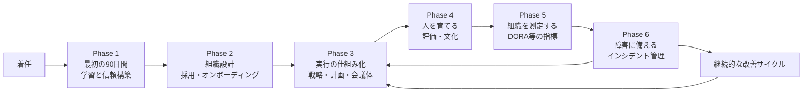
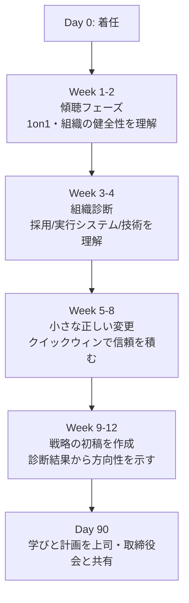
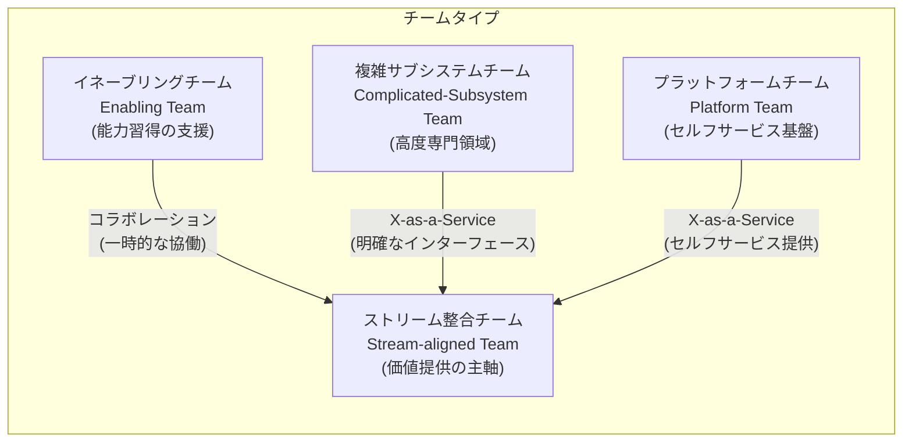
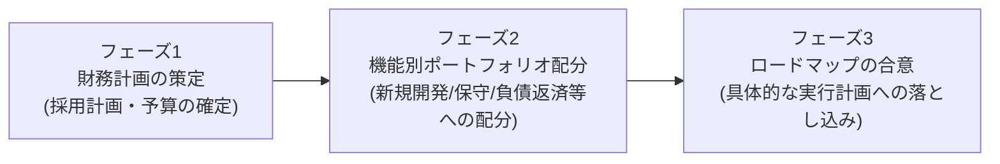
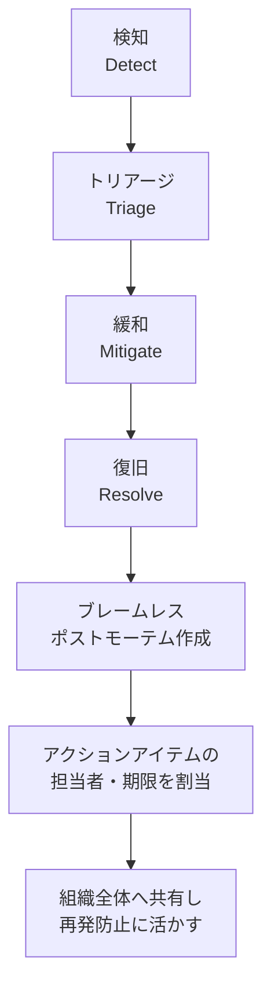
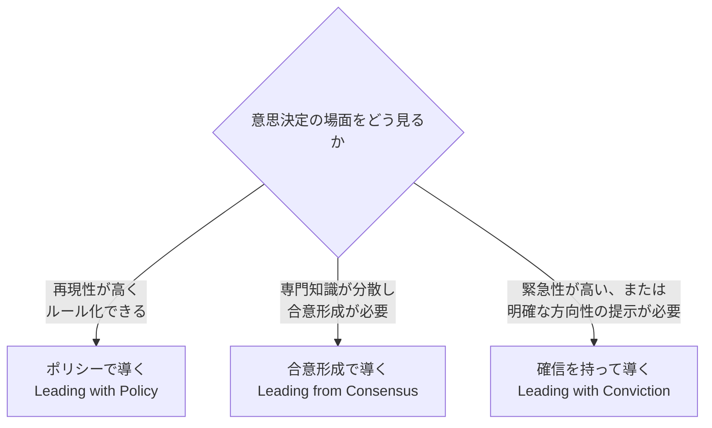

# エンジニアリング統括責任者の手引き

*― 初学者のためのステップバイステップ・ベストプラクティス ―*

> 本ガイドは、CTO・VP of Engineering・Head of Engineeringなど「エンジニアリング組織全体に責任を持つ立場（エンジニアリング統括責任者）」に初めて就く方、あるいはその役割を目指す方のために、国際的に著名な実務家・研究の知見をもとにステップバイステップでまとめたものです。特に、Stripe・Uber・Calm・CartaでCTOを務めたWill Larson氏の著書『The Engineering Executive's Primer』（O'Reilly, 2024）を骨格として、Camille Fournier氏（元Rent the Runway CTO）の『The Manager's Path』、Gergely Orosz氏（The Pragmatic Engineer）、GoogleのSREチーム・re:Workチームの研究、Team Topologiesの知見などを統合しています。各セクションの根拠となる一次情報のURLは末尾の「参考文献・引用元」にまとめています。

---

## 目次

1. [エンジニアリング統括責任者とは何か](#1-エンジニアリング統括責任者とは何か)
2. [全体像：統括責任者としての仕事の流れ](#2-全体像統括責任者としての仕事の流れ)
3. [Phase 1：最初の90日間](#3-phase-1最初の90日間)
4. [Phase 2：組織を設計する（採用・オンボーディング・チーム構造）](#4-phase-2組織を設計する採用オンボーディングチーム構造)
5. [Phase 3：実行の仕組みを作る（戦略・計画・ミーティング）](#5-phase-3実行の仕組みを作る戦略計画ミーティング)
6. [Phase 4：人を育てる（パフォーマンス管理・文化）](#6-phase-4人を育てるパフォーマンス管理文化)
7. [Phase 5：組織を測定する（DORAメトリクス）](#7-phase-5組織を測定するdoraメトリクス)
8. [Phase 6：障害に備える（インシデント管理とポストモーテム）](#8-phase-6障害に備えるインシデント管理とポストモーテム)
9. [リーダーシップスタイルを使い分ける](#9-リーダーシップスタイルを使い分ける)
10. [ステークホルダーとの協働](#10-ステークホルダーとの協働)
11. [よくある落とし穴（アンチパターン）](#11-よくある落とし穴アンチパターン)
12. [実践チェックリスト](#12-実践チェックリスト)
13. [参考文献・引用元](#13-参考文献引用元)

---

## 1. エンジニアリング統括責任者とは何か

エンジニアリング統括責任者（CTO / VP of Engineering / Head of Engineeringなど呼称は企業により異なる）は、個々のチームを管理するエンジニアリングマネージャーとは異なり、**組織全体の技術・人・プロセスに責任を持つ経営陣の一員**です。Will Larson氏は、統括責任者が同時に3つの異なる役割（帽子）を使い分ける必要があると説明しています。

| 役割（帽子） | 主な関心事 |
|---|---|
| **経営チームの一員** | 事業全体を前進させる意思決定。時にはエンジニアリング予算の削減など、エンジニアリング単体にとって不利な判断も求められる |
| **エンジニアリングマネージャー** | 組織運営に必要なポリシーの設計、効果的な人的リーダーシップ |
| **エンジニア** | 技術的な卓越性の維持、外部からの圧力があっても実行と品質の水準を守る |

新任のエンジニアリングマネージャーへの一般的な助言は「コードの詳細から離れる」ことですが、統括責任者クラスになるとこれを字義通り実践しすぎると、文脈を失ったまま資源配分だけを行う「官僚」になってしまう危険があるとLarson氏は指摘しています。統括責任者に求められるのは、詳細から完全に離れることではなく、状況に応じて詳細に踏み込む判断力です。

**重要な心構え：** 個々のエンジニアであれば同僚やマネージャーに相談できますが、統括責任者は組織内に同じ立場の相談相手がいないことが多く、学習曲線は非常に急です。だからこそ、社外のメンター・ピアネットワーク（後述）を意図的に作ることが不可欠です。

---

## 2. 全体像：統括責任者としての仕事の流れ

以下は、着任からの大まかな時間軸と、本ガイドの各Phaseの対応関係です。

このループは一方通行ではなく、実際には計画・実行・測定・改善を継続的に回し続けるサイクルです。以降、各Phaseを順番に見ていきます。

---

## 3. Phase 1：最初の90日間

Will Larsonは『The Engineering Executive's Primer』の中で、初めてエグゼクティブ職に就いた多くの人が、最初の18か月のうちに不本意な形でその職を離れていると述べています（参考文献1）。最初の90日間の過ごし方が、その後の成否を大きく左右します。

### 3-1. 最初にすべきこと：理解を優先する

着任直後は、前職の成功パターンをそのまま新しい組織に持ち込みたくなりますが、これは最も陥りやすい失敗のひとつです。会社ごとに技術文化・意思決定の背景は大きく異なるため、まずは「なぜ今のやり方になっているのか」を掘り下げて理解することが重要です。

**実践のコツ：「コンフリクト・マイニング」**
新しい組織で意図的に意見が割れそうなテーマ（技術選定や過去の大型移行プロジェクトなど）について、複数のシニアエンジニアと個別に対話し、賛否の理由を深掘りする手法です。異論を持つ人ほど、組織固有の文脈を最も正確に把握していることが多く、そこから新しい環境特有の制約や歴史的経緯を学べます。

### 3-2. 何を学ぶべきか

第一に、以下の領域について理解を深めることが推奨されています。

- **組織の健全性とプロセス**：意思決定がどのように行われているか、非公式な力学は何か
- **採用の仕組み**：現在のパイプライン、ボトルネック、レベリングの一貫性
- **実行のシステム**：計画プロセス、優先順位付け、ロードマップの運用実態
- **技術基盤**：アーキテクチャ、技術的負債、信頼性の現状

### 3-3. 書かれていない前提を書き出す

多くの組織では「技術戦略が明文化されていない」と感じられがちですが、実際には戦略は存在しているものの、単に文書化されていないだけというケースが非常に多いとされています。重要な意思決定の背景（なぜこの事業に参入したか、なぜこの技術移行を進めているかなど）が言語化されていないことが、組織のスケール時に混乱を生む大きな要因になります。統括責任者は、着任後の早い段階でこうした「暗黙の戦略」を掘り起こし、文書として残す作業に着手すべきです。

### 3-4. 社外のサポート体制を作る

社内に同じ立場の相談相手がいない以上、社外のピアネットワークが不可欠です。Larson氏は、同規模企業のCTO・VP of Engineeringら数名と定期的に集まり、直近の課題を持ち寄って深掘りする少人数の「学習サークル」を数年にわたり継続していると述べています。こうした場を意図的に作ることが、孤独になりがちな統括責任者の役割を支えます。

---

## 4. Phase 2：組織を設計する（採用・オンボーディング・チーム構造）

### 4-1. 採用プロセスを確立する

採用は統括責任者の最重要業務のひとつです。完璧な採用プロセスを目指すのではなく、**「効果的であること」を「完璧であること」より優先する**ことが推奨されます。具体的には、採用の進捗と問題点を継続的にモニタリングし、レベリング（等級判定）や報酬の一貫性を保ちながら、採用担当マネージャーへのトレーニングを整備していくアプローチです。

### 4-2. オンボーディングを設計する

新しく入った社員が最初の数週間でチームや文化に馴染めるかどうかは、その後の定着率と生産性に直結します。オンボーディングプログラムは、カリキュラム・対象者の範囲・実施タイミングを明確にし、会社全体のオンボーディングとどう統合するかを設計する必要があります。

### 4-3. 組織構造とConway's Law（コンウェイの法則）

組織設計において国際的に広く参照されているのが、Matthew Skelton氏とManuel Pais氏による『Team Topologies』の枠組みです。この枠組みの前提にあるのが**コンウェイの法則**――「システムを設計する組織は、その組織のコミュニケーション構造をそのまま模倣したシステム設計を生み出す」という考え方です。つまり、チーム編成そのものがソフトウェアアーキテクチャの形を決めてしまうため、意図的に「作りたいアーキテクチャに合わせてチームを設計する（逆コンウェイ作戦）」という発想が重要になります。

Team Topologiesでは、チームの**認知負荷（cognitive load）**を有限な資源として捉え、以下の4種類の基本的なチームタイプと3つの連携モードを提唱しています。

| チームタイプ | 役割 |
|---|---|
| ストリーム整合チーム | エンドユーザーへの価値提供を継続的に担う、組織の主軸となるチーム |
| イネーブリングチーム | 他チームが不足しているスキルやツールを習得できるよう、一時的に支援する |
| 複雑サブシステムチーム | 特定の深い専門知識が必要なサブシステム（例：検索エンジン、決済コアなど）を専任で扱う |
| プラットフォームチーム | 他チームがセルフサービスで使える内部基盤（インフラ・共通機能）を提供する |

組織が成長するにつれ、チーム構造は段階的に進化していきます。Will Larson氏は、企業のステージに応じてエンジニアリング組織のパターンが「アーリースタートアップ」→「ベースライン」→「専門エンジニアリング職の登場」→「事業部門への組み込み」→「事業部門ごとのローカル化」という順で進行しやすいと整理しており、それぞれに長所と短所があるため、自社が今どの段階にあるかを意識して組織設計を行うことが重要です。

---

## 5. Phase 3：実行の仕組みを作る（戦略・計画・ミーティング）

### 5-1. エンジニアリング戦略を書く

「戦略」という言葉は曖昧に使われがちですが、Larson氏はRichard Rumelt氏の「良い戦略・悪い戦略」の枠組みを土台に、戦略を以下の3要素で構成することを勧めています。

| 要素 | 内容 |
|---|---|
| **診断（Diagnosis）** | 今置かれている状況を客観的に言語化する（例：資金残高、成長率、競争環境） |
| **基本方針（Guiding Policies）** | 診断を踏まえ、意思決定の判断基準とゴールを定める |
| **一貫した行動（Coherent Actions）** | 基本方針を実際の日々の行動・仕組みに落とし込む（例：月次の支出レビュー会議） |

どれほど不完全でも、まず書き出すことに大きな価値があります。文書化されていない戦略は改善しようがなく、書き出した瞬間から磨き上げていくことができるという考え方です。

### 5-2. 計画プロセスの3フェーズ

Larson氏は、年次の計画プロセスを次の3つのフェーズに分けて進めることを提案しています。

計画作成時に陥りやすい失敗として、以下のようなパターンが挙げられています。

- 計画作成を「チェックボックスを埋める儀式」にしてしまう
- 計画を「非効率な資源配分の手続き」に変えてしまう
- 見栄えの良い新規プロジェクトばかりを優遇してしまう
- 現場チームから計画の当事者意識（オーナーシップ）を奪ってしまう

いずれも、計画プロセスが「実行者の納得感を伴う意思決定の場」ではなく、単なる形式的な作業になってしまうことで生じます。

### 5-3. 会議体を設計する

エンジニアリング組織を効果的に運営するための会議体として、Larson氏は主に以下のような定例ミーティングを挙げています。

| ミーティング | 目的 | 頻度の目安 |
|---|---|---|
| エンジニアリングリーダーシップ会議 | マネージャー陣が組織横断の課題をすり合わせる | 週次 |
| 技術仕様レビュー & インシデントレビュー | 大きな技術的決定とインシデントを横断的にレビューする | 週次 |
| マネージャー・スタッフエンジニアとの1on1 | 個別の状況把握とキャリア支援 | 月次 |
| エンジニアリング全体Q&A | 組織全体への透明性のある情報共有と質問対応 | 月次 |

これに加えて、Camille Fournier氏は、複数チームを統括する立場になったら**スキップレベル・ミーティング**（直属ではなく、さらにその下のメンバーとの対話）を定期的に設けることを勧めています。これにより、マネージャー層を経由しない生の情報や、現場チームの健全性・注力ポイントを直接把握できます。また、フォーニエ氏は「コードの変更頻度は、健全なエンジニアリングチームを示す先行指標のひとつである」とも指摘しています。

---

## 6. Phase 4：人を育てる（パフォーマンス管理・文化）

### 6-1. パフォーマンス管理とキャリアラダー

昇進・評価・報酬は、目標が競合しやすい難しい領域です。フィードバックの収集元を複数化する、レベル・タイトルとキャリアラダー（等級基準書）を明確にする、キャリブレーション（評価者間の目線合わせ）を行うといった仕組みが必要になります。運用の完璧さを追求しすぎるより、評価サイクルの頻度と一貫性を保つことの方が組織の納得感につながりやすいとされています。

### 6-2. 組織文化と価値観

組織の価値観（バリュー）は、単なるスローガンではなく「意思決定の判断材料として実際に機能するかどうか」で有用性が決まります。Fournier氏は、文化を作ることとコアバリューを適用すること、そしてそれを制度・ポリシーに落とし込むことを、マネージャーが多チームを率いる段階での重要なタスクとして位置づけています。

### 6-3. 心理的安全性：チームの効果性を左右する最大要因

Googleの人事分析チームが2012年から2年間かけて実施した「Project Aristotle（プロジェクト・アリストテレス）」という調査研究があります。180以上のチーム、250以上の項目を分析した結果、**「誰がチームにいるか」よりも「チームがどう協働しているか」の方がチームの効果性に大きく影響する**ことが判明しました。特に重要度が高いと結論づけられたのが、以下5つの力学のうち**心理的安全性**でした。

| 力学 | 内容 |
|---|---|
| **心理的安全性** | 対人リスクを取っても安全だとメンバーが感じられること（最も重要度が高い） |
| 相互信頼性 | 期日までに質の高い仕事をやり遂げると互いに信頼できること |
| 構造の明確さ | 役割・計画・目標が明確であること |
| 仕事の意味 | 各メンバーが自分の役割に意味を見出せること |
| インパクト | 自分の仕事が重要な違いを生んでいると感じられること |

統括責任者としては、意見の対立や失敗の報告を罰しない、質問や助けを求めることを歓迎する、といった行動を自ら見せることで、組織全体の心理的安全性を底上げしていくことが求められます。

### 6-4. 「信頼するだけ」では不十分：Inspected Trust（検証された信頼）

Larson氏は、マネジメントを「信頼だけに依存する」こと自体には限界があると指摘しています。信頼は重要な土台ですが、それだけでは管理手法として機能しません。コードレビュー、インシデントレビュー、アーキテクチャレビューといった検証の仕組みを組み合わせることで、信頼と検証がセットになった「Inspected Trust」の状態を作ることが、健全な組織運営につながるという考え方です。

---

## 7. Phase 5：組織を測定する（DORAメトリクス）

エンジニアリング組織の測定には目的が複数あります。自組織の状態を把握し計画に活かすための測定と、CEOや取締役会など社外のステークホルダーに説明するための測定は、性質が異なることに注意が必要です。

### 7-1. 完璧な指標より「有用で不完全な指標」

多くのエンジニアリーダーは、測定対象として「完璧な指標」を追い求めがちですが、これは陥りやすい失敗のひとつです。不完全であっても有用な指標を測定し続け、その限界について経営陣と対話しながら共通理解（メンタルモデル）を育てていく方が、組織の学習速度は高まります。指標そのものの正確さより、**その指標を通じてCEOや経営陣がエンジニアリングの実態をどれだけ理解できるようになるか**が本質的な目的だとされています。

### 7-2. DORAメトリクス

ソフトウェアデリバリーの性能を測る国際的に広く使われる指標群が、Google発の調査プログラムであるDORA（DevOps Research and Assessment）が提唱する指標群です。以下の表は、長年「Four Keys（4つの指標）」として知られてきた4指標と、2025年調査時点での状況を示します（DORAはその後、2024年に加わった「デプロイ手戻り率（Deployment Rework Rate）」を含む5指標として整理し直しています）。

| 指標 | 意味 | 2025年調査における状況 |
|---|---|---|
| デプロイ頻度 | 本番環境へのリリース頻度 | オンデマンド（1日に複数回）に到達している組織は16.2%にとどまる |
| 変更のリードタイム | コミットから本番稼働までの所要時間 | 1時間未満を達成しているのは9.4%、43.5%は1週間超を要している |
| 変更失敗率 | デプロイのうち即座の修正が必要になった割合 | 0〜2%の水準にあるのは8.5%、39.5%は16%を超えている |
| 復旧時間 | 障害発生から復旧までの時間 | 高速な復旧ほど組織のレジリエンスが高いとされる |

**注意点：** DORAは2025年、従来使われていた「エリート／ハイ／ミディアム／ロー」という階層ラベルを廃止しました。4つの指標は「単独の目標として追いかけるもの」ではなく、**スループット（デプロイ頻度・リードタイム）と安定性（変更失敗率・復旧時間）のバランスを見るためのガードレール**として捉えることが推奨されています。特にAIコーディングアシスタントの普及によりコード生成量が増える中で、スループットの数値だけが向上し、レビュー体制が追いつかずに安定性が犠牲になるケースが指摘されており、4指標を必ずセットで確認することが重要です。

### 7-3. DORAだけでは測れないもの

DORAメトリクスは「デリバリーの結果」を示しますが、以下のような要素は捉えられません。

- 顧客にとって本当に価値のある機能を届けられているか
- メンタリング、アーキテクチャ設計、技術的負債の解消といった「見えにくい仕事」
- セキュリティ・スケーラビリティ・保守性
- 開発者体験（Developer Experience）

そのため、多くの実務家はDORAに加えて、開発者の主観的な満足度や生産性実感を測るSPACEフレームワークなど、他の指標と組み合わせて全体像を捉えることを推奨しています。

---

## 8. Phase 6：障害に備える（インシデント管理とポストモーテム）

### 8-1. インシデント対応からポストモーテムまでの流れ

GoogleのSREチームが体系化した実践知が、業界標準として広く採用されています。

### 8-2. ブレームレス・ポストモーテムとは

「ブレームレス（blameless）」とは、「何も問われない」「何でも許される」という意味ではありません。**インシデントに関わった全員が、その時点で得られる最善の情報をもとに、善意で行動したと仮定する**という前提のことです。個人を責める代わりに「なぜシステムがこの失敗を許してしまったのか」を問うことで、当事者が萎縮せず正直に経緯を話せるようになり、それが根本的な問題の発見につながります。

良いポストモーテムには、以下の要素が含まれるべきとされています。

- インシデントの概要とタイムライン
- 根本原因（および寄与要因）の分析
- 影響範囲の評価
- 担当者と期限を明記した是正アクション

また、ポストモーテムは特定チームの内部資料にとどめず、**組織内でできるだけ広く共有する**ことで、他チームが同種の問題を未然に防げるようになります。Googleでは、大きなインシデントの後には包括的なポストモーテムを作成することが組織文化として定着しており、この継続的な投資が結果的に障害の減少とユーザー体験の向上につながっているとされています。

### 8-3. アラートの設計原則

SREの実践では、対応できないアラートはノイズにしかならないと位置づけられています。オンコール担当者が実際にアクションを取れる基準でアラートを設計すること、そしてSLO（サービスレベル目標）に基づいたアラート設計が有効な手段のひとつとして紹介されています。

---

## 9. リーダーシップスタイルを使い分ける

Larson氏は、統括責任者が状況に応じて使い分けるべき3つのリーダーシップスタイルを提示しています。

| スタイル | 適した場面 | 留意点 |
|---|---|---|
| ポリシーで導く | 繰り返し発生する種類の意思決定に、一貫した基準を適用したい場合 | ポリシーを作りすぎると組織が硬直化する |
| 合意形成で導く | 複数の専門領域にまたがり、現場の納得感が実行の成否を左右する場合 | 時間がかかりすぎたり、声の大きい人に引っ張られたりするリスクがある |
| 確信を持って導く | 情報が対立していて誰も明確な答えを持っておらず、迅速な決断が必要な場合 | 独断に見えやすいため、判断の根拠を丁寧に説明する必要がある |

これは「マイクロマネジメントか放任か」という二項対立ではなく、**場面ごとに適切な関与の度合いを選び取る**という考え方です。後述の「アンチパターン」でも触れますが、シニアなリーダーほど、状況に応じて意図的に詳細へ踏み込む判断力が求められます。

---

## 10. ステークホルダーとの協働

### 10-1. CEO・経営陣との関係

統括責任者は、CEOや他の経営陣から「支持されている」のか「許容されているだけ」なのか「不信感を持たれている」のかを冷静に見極める必要があります。暗黙の力関係を理解し、経営陣同士の物語（なぜこの意思決定が必要なのか）の橋渡し役を担うことが、エンジニアリング組織への信頼構築につながります。

### 10-2. CEOをエンジニアリングの詳細に引き込む

エンジニアリングの実態を経営陣から遠ざけて守ろうとする（「傘」になろうとする）よりも、むしろ適切な形で詳細に巻き込み、一緒にメンタルモデルを育てていく方が、長期的には健全な関係を築けるとされています。たとえば、コード行数のような不完全な指標について経営陣から質問された場合、その指標を頭ごなしに否定するのではなく、まず提供したうえで「この指標が適さない具体的なケース」を一緒に掘り下げていくアプローチが有効です。

### 10-3. リーダーシップチームを機能させる

複数のエンジニアリングマネージャーやディレクターからなるリーダーシップチームをまとめる際は、メンバーに期待する役割を明確にし、チーム内の健全な意見対立を歓迎しつつ、未解決のまま放置される対立は許容しない、という運用姿勢が求められます。

### 10-4. 社外ネットワークとプレゼンスの構築

社内に相談相手がいない統括責任者にとって、社外のピアネットワークは代えがたい資産です。コミュニティ活動、執筆・登壇、他社の統括責任者との定期的な少人数の学習会などを通じて、継続的に外部の知見を取り込む仕組みを持つことが推奨されます。

---

## 11. よくある落とし穴（アンチパターン）

Larson氏は、一般的に「良い実践」とされているものが行き過ぎることで、かえってアンチパターンになってしまう例を3つ挙げています。ルールを過度に一般化して適用してしまうこと自体がアンチパターンの本質だという指摘です。

### アンチパターン1：マイクロマネジメント回避のしすぎ

「マイクロマネジメントは悪」という教訓が広まりすぎた結果、多くの統括責任者が詳細から距離を置きすぎ、組織の実態から切り離された「資源配分係」になってしまうケースがあります。対策として紹介されているのが、前述の「コンフリクト・マイニング」と、重要な意思決定の背景を意図的に文書化する習慣です。

### アンチパターン2：不完全な指標を測定することへの過度な抵抗

「この指標は不完全だから測定すべきではない」という完璧主義は、結果的に組織の学習を遅らせます。不完全でも有用な指標を測定し始め、その限界について経営陣と対話しながらメンタルモデルを育てていく方が建設的です。

### アンチパターン3：チームの「傘」になりすぎる

マネージャーがチームを社内政治や込み入った事情から過剰に遮断しようとすると、短期的には守られているように見えても、長期的にはチームが現実を理解する機会を奪うことになります。情報を小出しにしすぎず、重要な議論の場にはマネージャーだけでなく現場のエンジニアも同席させ、当事者が自分の視点を直接代弁できるようにすることが有効な対策です。組織が複数の事業部門にまたがる場合は、各領域に精通した「ナビゲーター」のような形で意思決定の権限を適切に分散させるアプローチも紹介されています。

### 計画プロセスにおけるアンチパターン（再掲）

先述の通り、計画プロセスが「儀式」「非効率な資源配分」「見栄えの良いプロジェクトの優遇」「現場のオーナーシップの剥奪」になってしまうことも、繰り返し指摘される失敗パターンです。

---

## 12. 実践チェックリスト

| フェーズ | チェック項目 |
|---|---|
| 最初の90日間 | □ 主要メンバーと1on1を実施したか □ 「なぜ今のやり方になっているか」を掘り下げたか □ 暗黙の戦略を文書化し始めたか □ 社外のピアネットワークを作り始めたか |
| 組織設計 | □ 採用プロセスの現状を把握したか □ チーム構造とコンウェイの法則の関係を点検したか □ オンボーディングプログラムを整備したか |
| 実行の仕組み | □ 診断・基本方針・一貫した行動の3要素で戦略を書いたか □ 計画プロセスを3フェーズに分けて設計したか □ 定例の会議体（週次・月次）を設計したか |
| 人材育成 | □ キャリアラダーとフィードバックの仕組みを整えたか □ 心理的安全性を高める行動を自ら示しているか □ 信頼だけでなく検証の仕組み（レビュー体制）を組み込んだか |
| 測定 | □ DORAの4指標を計測しているか □ 指標の限界について経営陣と対話しているか |
| 障害対応 | □ ブレームレスなポストモーテムの文化があるか □ アクションアイテムに担当者と期限があるか □ 学びを組織全体に共有しているか |
| ステークホルダー | □ CEO・経営陣との関係性を定期的に見直しているか □ リーダーシップチーム内の対立を放置していないか |

---

## 13. 参考文献・引用元

本ガイドの内容は、2026年8月15日時点で確認できた以下の一次情報・著名な実務家による発信をもとに作成しています。

1. Will Larson, *The Engineering Executive's Primer*（O'Reilly Media, 2024）書誌情報・目次
   https://www.oreilly.com/library/view/the-engineering-executives/9781098149475/
2. Will Larson, ブログ「Irrational Exuberance」
   https://lethain.com/
3. Will Larson, ブログ「Developing leadership styles」
   https://lethain.com/developing-leadership-styles/
4. Will Larson インタビュー「Unexpected Anti-Patterns for Engineering Leaders — Lessons From Stripe, Uber & Carta」（First Round Review）
   https://review.firstround.com/unexpected-anti-patterns-for-engineering-leaders-lessons-from-stripe-uber-carta/
5. Camille Fournier, *The Manager's Path*（O'Reilly Media）書誌情報・目次
   https://www.oreilly.com/library/view/the-managers-path/9781491973882/
6. Camille Fournier インタビュー（Lenny's Newsletter）
   https://www.lennysnewsletter.com/p/engineering-leadership-camille-fournier
7. Gergely Orosz, The Pragmatic Engineer（ニュースレター）
   https://www.pragmaticengineer.com/
8. Gergely Orosz, *The Software Engineer's Guidebook*
   https://www.engguidebook.com/
9. Google, 『Site Reliability Engineering』"Postmortem Culture: Learning from Failure"
   https://sre.google/sre-book/postmortem-culture/
10. Google, 『The Site Reliability Workbook』"Postmortem Practices for Incident Management"
    https://sre.google/workbook/postmortem-culture/
11. DORA, "State of AI-assisted Software Development 2025"（2025年 DORA レポート公式ページ）
    https://dora.dev/dora-report-2025/
12. Google Cloud Blog, "Announcing the 2025 DORA Report"（2025年 DORA レポートの公式解説）
    https://cloud.google.com/blog/products/ai-machine-learning/announcing-the-2025-dora-report
13. DORA（DevOps Research and Assessment）2025年ベンチマーク解説（Research-Driven Engineering Leadership）
    https://rdel.substack.com/p/rdel-115-what-are-the-2025-benchmarks
14. Matthew Skelton, "Conway's Law: Critical for Efficient Team Design in Tech"（IT Revolution／Team Topologies共著者による解説）
    https://itrevolution.com/articles/conways-law-critical-for-efficient-team-design-in-tech/
15. Google re:Work, "Understand team effectiveness"（Project Aristotle）
    https://rework.withgoogle.com/intl/en/guides/understand-team-effectiveness

---

*本ガイドは教育目的の要約であり、原典の著作権はそれぞれの著者・発行元に帰属します。より深く学びたい場合は、上記の書籍・記事の原文を直接参照することを強く推奨します。*
