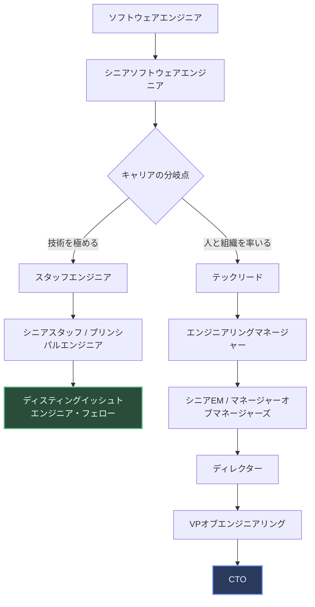
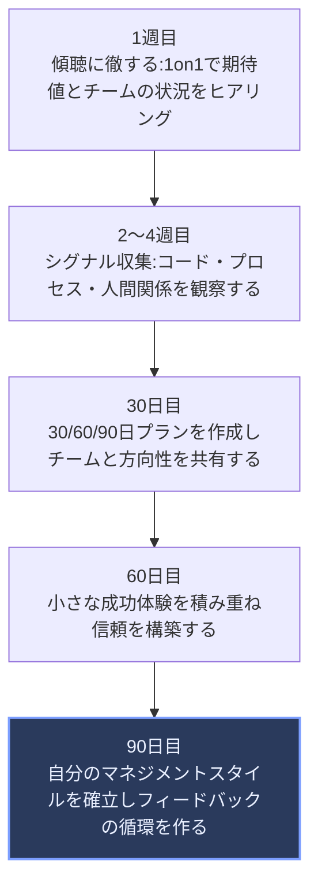
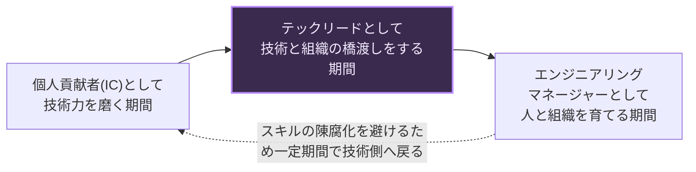

# エンジニアのためのマネジメントキャリアパス — 初学者向け完全ガイド

> 最終更新: 2026年8月14日
> 本ガイドは Camille Fournier『The Manager's Path』(O'Reilly) を軸に、Will Larson・Charity Majors・Julie Zhuo・Gergely Orosz・Lara Hogan など国際的に著名なエンジニアリングリーダーの発信内容を参照して作成しています。各出典のURLは末尾の「参考文献・情報源」セクションにまとめています。

## 目次

1. [はじめに](#1-はじめに)
2. [マネジメントキャリアの全体像（デュアルキャリアラダー）](#2-マネジメントキャリアの全体像デュアルキャリアラダー)
3. [各役職の詳細解説](#3-各役職の詳細解説)
4. [自分はマネジメントに向いているか（判断チェックリスト）](#4-自分はマネジメントに向いているか判断チェックリスト)
5. [マネージャーになる前の準備：テックリードという助走路](#5-マネージャーになる前の準備テックリードという助走路)
6. [新任マネージャーの最初の90日](#6-新任マネージャーの最初の90日)
7. [マネージャーのコアプラクティス](#7-マネージャーのコアプラクティス)
8. [優れたマネージャーの共通点（Google Project Oxygen）](#8-優れたマネージャーの共通点google-project-oxygen)
9. [よくある失敗と対処法](#9-よくある失敗と対処法)
10. [IC とマネジメントを行き来する「振り子」というキャリア戦略](#10-ic-とマネジメントを行き来する振り子というキャリア戦略)
11. [スキルロードマップまとめ表](#11-スキルロードマップまとめ表)
12. [参考文献・情報源](#12-参考文献情報源)

---

## 1. はじめに

「そろそろマネージャーにならないか」——多くのソフトウェアエンジニアは、キャリアのどこかでこの問いに向き合うことになります。しかし、エンジニアリング組織におけるマネジメントは、営業やマーケティングのマネジメントとは性質が異なります。エンジニアリング・マネージャー（EM）は技術的な意思決定にも一定の責任を持ちながら、同時に「人」というプログラミング言語のドキュメントが存在しない対象をマネジメントしなければなりません。

『The Manager's Path』の著者であり、Rent the RunwayのCTOやTwo Sigmaのプラットフォームエンジニアリング責任者を歴任した Camille Fournier は、テック業界のマネジメントを「学習曲線が非常に厳しい」領域だと表現しています。参考にできる体系だったガイドが少ないまま、多くのエンジニアが手探りでマネージャーになっているのが実情です。

本ガイドは、そうした手探りを減らすために、

- マネジメントキャリアの全体像（どんな役職があり、どうつながっているか）
- 「自分はマネージャー向きか」を考えるための判断材料
- 新任マネージャーが最初の90日で何をすべきか
- 日々のマネジメント実務（1on1・委任・評価・採用）の基本
- よくある失敗パターン

を、ステップ・バイ・ステップで解説します。対象読者は、マネジメントへの転身をこれから考える中堅エンジニア、または就任して間もない新任EMです。

---

## 2. マネジメントキャリアの全体像（デュアルキャリアラダー）

現代の多くのテック企業では、キャリアパスが「個人貢献者（Individual Contributor, IC）トラック」と「マネジメントトラック」の2本立てで設計されています。これを**デュアルキャリアラダー（dual career ladder）**と呼びます。

重要な前提として、**マネジメントは「昇進の上位互換」ではありません**。IC トラックの上位職（スタッフエンジニア、プリンシパルエンジニアなど）は、マネジメントトラックの管理職と並行した、対等な格付けとして設計されている企業がほとんどです。実際、2020年代以降は Staff / Principal クラスの IC が、同格の管理職（マネージャーやディレクター）と同等かそれ以上の報酬を得るケースも一般的になっています。

Will Larson（『Staff Engineer: Leadership Beyond the Management Track』著者、Calm 元CTO）が指摘するように、マネジメント側のキャリアラダーは書籍やフレームワークが充実してきた一方、技術で上を目指す「Staff+」の道筋は長らく言語化されにくい領域でした。近年はその両方が体系化されつつあります。

### 2.1 全体のキャリアフロー図

### 2.2 IC トラックとマネジメントトラックの対応関係（目安）

企業によって呼称や境界は異なりますが、経験則としておおむね次のような対応関係になることが多いとされています。

| レベル感 | ICトラック | マネジメントトラック | 主な評価軸 |
|---|---|---|---|
| 中堅 | シニアエンジニア | テックリード | 個人の技術的アウトプット／小規模チームの技術的方向づけ |
| 上級（1） | スタッフエンジニア | エンジニアリングマネージャー(EM) | 複数チームに影響する技術判断／1チームの人材育成と実行 |
| 上級（2） | シニアスタッフ / プリンシパルエンジニア | シニアEM・マネージャーオブマネージャーズ | 組織横断の技術戦略／複数チーム・複数マネージャーの統括 |
| 上級（3） | ディスティングイッシュトエンジニア | ディレクター | 全社レベルの技術方針への関与／部門の予算・ロードマップ責任 |
| エグゼクティブ | フェロー | VPオブエンジニアリング / CTO | 業界レベルの技術貢献／全社の技術組織戦略 |

> 補足: 「スタッフエンジニアはマネージャーと同格」「プリンシパルエンジニアはディレクターと同格」という対応づけは業界で広く語られる目安であり、絶対的な基準ではありません。企業ごとのレベリング定義（career ladder）を必ず確認してください。

---

## 3. 各役職の詳細解説

### 3.1 テックリード（Tech Lead）

テックリードは、多くの場合「マネジメントの入り口」ではなく「技術とマネジメントの中間地点」に位置する役割です。Fournier は著書の中で、テックリードの役割を大きく4つに整理しています。

- **アーキテクチャの理解**：チームが担当するシステムの全体構造を把握し、技術的な一貫性を保つ
- **チームプレイヤーであること**：自分だけが動くのではなく、チームの生産性を最大化する動き方をする
- **技術的意思決定をリードすること**：設計レビューやトレードオフの判断を主導する
- **コミュニケーション**：プロジェクトの状況を、エンジニア以外の関係者にもわかる言葉で伝える

テックリードは「コードを書く時間」と「プロジェクトをマネジメントする時間」の両方を担う、いわばハイブリッドな役職です。Charity Majors（Honeycomb共同創業者・CTO）は、この二重の役割について「技術は簡単な部分で、人間を導くことのほうが難しい」と表現しており、テックリードの仕事の多くは実際には管理業務であると指摘しています。

**重要な示唆**：テックリードの経験は、「自分はマネジメントに向いているか」を低リスクで試すための、事実上の適性検査として機能します。

### 3.2 エンジニアリングマネージャー（EM）

EM は通常、1つのチーム（5〜10名程度）に対して、次の責任を持ちます。

- 採用・オンボーディング・評価などの人事プロセス
- 定期的な1on1によるメンバーの育成とキャリア支援
- チームの実行力（デリバリー）の管理
- プロダクトマネージャーなど他職種との連携
- チームの技術的な健全性（技術的負債、開発プロセスなど）の監督

Julie Zhuo（元Facebook VP of Product Design、『The Making of a Manager』著者）は、マネージャーの仕事の本質を「自分ひとりの成果ではなく、チーム全体の望ましい成果を、人々を鼓舞し協調させることで実現すること」と定義しています。コードを書く量は大きく減り、コミュニケーションと意思決定に時間の大半を使うようになります。

### 3.3 シニアEM／マネージャーオブマネージャーズ

チームが複数に増えると、EMは「マネージャーを管理するマネージャー」になります。Fournier はこの段階を「Managing Multiple Teams」「Managing Managers」として整理しており、求められるスキルが質的に変わることを強調しています。

- 自分の時間配分そのものをマネジメントする必要が生じる（何に自分の時間を使うべきかの取捨選択）
- 部下であるマネージャーたちの育成・評価を行う（スキップレベル1on1の実施を含む）
- 複数チーム間の優先順位づけや、リソース配分の調整
- 技術との距離が広がるため、「技術的な関連性」を保つための意識的な工夫が必要になる

### 3.4 ディレクター

ディレクターは、複数のチーム群（プロダクトライン単位や部門単位）を統括し、より長期的な技術戦略・組織戦略に関与します。Fournier はこの段階から「組織の機能不全をデバッグする」スキル——データを確認し、チームを観察し、仮説を立てて検証する——が本格的に必要になるとしています。

### 3.5 VPオブエンジニアリング／CTO

エンジニアリング組織全体、あるいは会社全体の技術戦略に責任を持つ、いわゆる「ビッグリーグ」の役職です。Fournier は VP of Engineering と CTO の違いについて、前者が「社内向けの実行責任者」であるのに対し、後者は「対外的な技術の顔」としての側面が強くなる傾向があると整理しています（ただし企業ごとに定義は大きく異なります）。この段階では、技術戦略の立案、経営陣・取締役会とのコミュニケーション、組織文化の醸成が主要な仕事になります。

---

## 4. 自分はマネジメントに向いているか（判断チェックリスト）

マネジメントは「優秀なエンジニアへのご褒美」ではありません。Gergely Orosz（The Pragmatic Engineer、元Uber/Microsoft/Skype）は、マネージャーへの転身直後について、最初は輪の外に置かれたような**孤独感**を伴う経験になりやすいと述べています。前日まで同僚だったチームメンバーとの間に見えない壁ができ、気軽に本音を話せる「本当のチーム」を新たに見つけ直す必要が生じる、という変化です。

以下の問いを、自分自身に率直に投げかけてみてください。

- コードを書く時間が大きく減っても（多くの場合ゼロに近づいても）納得できるか
- 自分の成果ではなく「他人の成果」で評価されることに前向きになれるか
- 1日の大半を会議と1on1で過ごすことに、意義を感じられるか
- 曖昧で答えのない「人の問題」（対立、モチベーション低下、パフォーマンス不振など）に、興味を持って向き合えるか
- 自分の時間を他者に「所有」されること（頻繁な割り込み、突発的な相談）を許容できるか

Camille Fournier は、マネージャーを目指す前に「想像上のシニアIC生活」と「想像上のマネージャー生活」を比較するのではなく、それぞれの**現実の生活**を具体的にイメージすることを勧めています。マネジメントは技術力の証明ではなく、まったく別のキャリアの選択だと捉えることが、最初の判断における最重要ポイントです。

---

## 5. マネージャーになる前の準備：テックリードという助走路

いきなりEMになるのではなく、テックリードやプロジェクトの技術的な取りまとめ役を経験することで、マネジメントの一部を疑似体験できます。準備段階として取り組みやすいのは次のようなアクションです。

- 後輩やインターンの**メンタリング**を積極的に引き受ける（Fournier はメンタリングを「マネジメントの入り口」として重視しています）
- 小規模なプロジェクトのタスク分解・進行管理を担当する
- コードレビューやアーキテクチャレビューの場で、技術的な意思決定を主導する
- 自分の直属の上司に「マネジメントに関心がある」と明示的に伝え、フィードバックをもらう
- 採用面接官として、候補者評価のプロセスに関わってみる

これらは、正式にマネージャーへ昇進する前に「管理の感触」を確かめるための、リスクの低い実験です。

---

## 6. 新任マネージャーの最初の90日

Julie Zhuo は著書の中で、新任マネージャーの最初の3か月を重要な適応期間として詳しく扱っています。以下は、その考え方と一般的なベストプラクティスを踏まえた、90日間のロードマップです。

### フェーズ解説

| フェーズ | 目的 | 具体的なアクション例 |
|---|---|---|
| 1週目：傾聴 | 信頼関係の土台を作る | 全メンバーと初回1on1を実施し、期待値とスタイルをすり合わせる |
| 2〜4週目：シグナル収集 | チームの現状を客観的に把握する | コードベース・障害対応履歴・過去のプロセスを確認し、人だけでなく「システムからも」情報を集める |
| 30日目：計画 | 方向性の合意形成 | 30/60/90日プランを文書化し、チーム・上司と共有する |
| 60日目：信頼構築 | 小さな実績を積む | 明確で達成可能な改善（例：レビュー待ち時間の短縮）を1つ実行する |
| 90日目：定着 | 自分のスタイルを確立する | 定期的な1on1・フィードバックのリズムを固定化する |

Fournier も同様に、新しい報告関係の立ち上げにおいて「信頼とラポールの構築」「30/60/90日プランの作成」「新しいメンバー向けドキュメントの整備」を初期の重要タスクとして挙げています。

---

## 7. マネージャーのコアプラクティス

### 7.1 1on1ミーティング

1on1は、EMの最も基本的かつ重要な習慣です。Fournier は1on1を「マネージャーの仕事の中で最も重要な単一の習慣」と位置づけ、頻度・進め方を状況に応じて調整することを勧めています。

- **頻度の目安**：週次〜隔週。新任メンバーや不安定な状況では頻度を上げる
- **主導権**：基本的にはメンバー側にアジェンダの主導権を持たせる（マネージャーの進捗確認の場にしない）
- **記録**：話した内容・アクションアイテムを継続的にメモし、次回に引き継ぐ
- **バリエーション**：ToDo確認型、雑談型（キャッチアップ）、フィードバック集中型など、目的に応じて型を使い分ける

### 7.2 委任（デリゲーション）

Fournier は、タスクを「頻度」と「複雑さ」の2軸で捉え、委任の判断基準とすることを提案しています。

| | 頻度が低い | 頻度が高い |
|---|---|---|
| **複雑さが低い** | 自分でやる（都度対応で十分） | 部下に委任する（ルーティン化して育成につなげる） |
| **複雑さが高い** | 台頭してきたリーダーの育成機会として使う | 部下に委任し、継続的な成長の場として活用する |

マネージャーが陥りやすい失敗の1つが**マイクロマネジメント**です。Fournier はこれを「Good Manager, Bad Manager」という対比の中で、マイクロマネージャーとデリゲーター（委任者）という2つの極端な例として描いています。委任を成功させる鍵は、「チームの目標に照らして、どの詳細に自分が踏み込むべきかを見極める」ことです。

### 7.3 フィードバックと評価

- 継続的なフィードバック文化を作り、評価面談を「サプライズの場」にしない
- ポジティブ・ネガティブ両方のフィードバックを、具体的な事実に基づいて伝える
- パフォーマンスレビューは「書く」段階と「伝える」段階の両方に丁寧さが必要
- 低パフォーマンスへの対応（Fournier の言う "Challenging Situations: Firing Underperformers"）は避けて通れない、マネジメントの中でも特に難易度の高い仕事の1つ

### 7.4 採用

Zhuo は、採用を「一度の意思決定が何年にもわたってチームと会社に影響を与える」重要な仕事だと位置づけています。

- 求人票は採用担当任せにせず、マネージャー自身が「理想の候補者像」を言語化して関わる
- 多様なバックグラウンドの候補者を意識的に評価プロセスに含める
- リーダー層の採用ほど、時間をかけた見極めが必要

---

## 8. 優れたマネージャーの共通点（Google Project Oxygen）

Google の人事研究プロジェクト「Project Oxygen」は、社内の大量の人事データ・従業員調査・インタビューを分析し、優れたマネージャーに共通する行動特性を特定した、業界でも広く参照される研究です。Google re:Work が公開している最新版では、当初8項目だったリストが拡張され、現在は次のような行動が重視されています。

| # | 行動特性 |
|---|---|
| 1 | 良いコーチであること（答えを与えるのではなく、考える力を引き出す） |
| 2 | チームに権限を委譲し、マイクロマネジメントをしない |
| 3 | チームメンバーの成功や個人としての幸福に関心を示す |
| 4 | 生産的・結果志向である |
| 5 | 優れたコミュニケーターである（聞く力と伝える力の両方） |
| 6 | メンバーのキャリア開発を支援する |
| 7 | チームに対する明確なビジョン・戦略を持つ |
| 8 | チームにアドバイスできる重要な技術的スキルを持つ |

興味深いことに、この研究では「技術的スキル」の重要度は他の対人的な行動特性に比べて相対的に低い結果となりました。これは「優れたエンジニアが自動的に優れたマネージャーになるわけではない」という、業界で繰り返し語られる教訓と一致します。

---

## 9. よくある失敗と対処法

新任マネージャーが陥りやすい失敗パターンと、その対処法を整理します。

| 失敗パターン | 症状 | 対処法 |
|---|---|---|
| マイクロマネジメント | 部下の作業に細かく口を出しすぎ、信頼を損なう | 「頻度×複雑さ」の委任マトリクスを使い、任せる基準を明文化する |
| 技術から離れすぎる | チームの技術的な意思決定に口を出せなくなる | コードレビューへの参加、アーキテクチャレビューへの出席など、意図的に技術との接点を残す |
| 逆に技術に固執しすぎる | マネジメント本来の仕事（人・プロセス）が疎かになる | 「管理者の仕事は管理をうまくやることだ」と自覚し、コーディングへの逃避を意識的に避ける |
| コンフリクト回避 | チーム内の対立を放置し、問題が悪化する | Fournier の言う「コンフリクト・テイマー」を目指し、早期かつ直接的に対話する |
| 孤独感を放置する | 相談相手がおらず、孤立して燃え尽きる | 他部門のマネージャー仲間、メンター、自分の上司との定期的な対話の場を作る |
| フィードバックの先送り | 評価面談まで問題点を伝えない | 継続的フィードバックの文化を作り、驚きのない評価にする |

---

## 10. IC とマネジメントを行き来する「振り子」というキャリア戦略

マネジメントは「一度就いたら戻れない一方通行の道」ではありません。Charity Majors は、有名なブログ記事「The Engineer/Manager Pendulum」の中で、優れたエンジニアリングリーダーの多くが、ICとマネジメントの間を**意図的に行き来する**キャリアを歩んでいると論じています。

彼女の主張の要点は次の通りです。

- 技術力とマネジメント力は、どちらも「同時に伸ばすことが難しい」性質を持つ。マネジメントは割り込みの多い仕事であり、深い技術的学習には逆に、割り込みを遮断できる集中時間が必要になる
- 優れたマネージャーの多くは、開発者としての実務経験を持っている。逆に、優れた開発者の多くはマネジメント経験を持っている
- どちらか一方に長く留まりすぎると、もう一方のスキルが徐々に陳腐化していく。だからこそ、キャリアの中で意図的に「揺り戻す」ことに価値がある

一方で、Will Larson は「技術トラックから離れるタイミングは、そのトラックでやりたいことをやり切ってからにすべきだ」とも述べており、キャリアが深くなるほど、トラックを切り替えるコストも高くなる点には注意が必要です。振り子戦略は万能薬ではなく、自分自身のキャリアステージに応じて判断すべき選択肢の1つとして理解してください。

---

## 11. スキルロードマップまとめ表

最後に、マネジメントトラックの各段階で重視されるスキルを一覧化します。初学者は、まず「テックリード」と「EM」の行の内容を意識することから始めてください。

| 段階 | コアスキル | 主な情報源 |
|---|---|---|
| テックリード | アーキテクチャ理解、技術的意思決定、チームプレイ、コミュニケーション | Fournier『The Manager's Path』第3章 |
| エンジニアリングマネージャー | 1on1、委任、フィードバック文化、採用、パフォーマンスレビュー | Fournier 第4章、Zhuo『The Making of a Manager』 |
| マネージャーを管理するマネージャー | 時間配分の管理、マネージャー育成、複数チームの優先順位づけ | Fournier 第6・7章 |
| ディレクター | 組織の機能不全のデバッグ、ロードマップの不確実性への対応、技術的関連性の維持 | Fournier 第7章 |
| VP／CTO | 技術戦略の立案、経営層とのコミュニケーション、組織文化の醸成 | Fournier 第8・9章 |

---

## 12. 参考文献・情報源

本ガイドの作成にあたり、以下の情報源を参照しました（2026年8月14日時点でアクセス可能なものを確認しています）。いずれも国際的に広く読まれているエンジニアリングリーダーシップの著者・実務家による発信です。

- Camille Fournier, *The Manager's Path* (O'Reilly Media)
  https://www.oreilly.com/library/view/the-managers-path/9781491973882/
- Camille Fournier, ブログ「Elided Branches」
  https://skamille.spicytakes.org/
- Will Larson, "Path to engineering manager of managers" (Irrational Exuberance / lethain.com)
  https://lethain.com/path-to-eng-manager-of-managers/
- Will Larson ほか, *Staff Engineer: Leadership Beyond the Management Track* 関連情報
  https://www.amazon.com/Staff-Engineer-Leadership-beyond-management/dp/1736417916
- Charity Majors, "The Engineer/Manager Pendulum"
  https://charity.wtf/2017/05/11/the-engineer-manager-pendulum/
- Julie Zhuo, *The Making of a Manager* 公式ページ
  https://www.juliezhuo.com/book/manager.html
- Gergely Orosz, "What Becoming an Engineering Manager Feels Like" (The Pragmatic Engineer)
  https://blog.pragmaticengineer.com/what-becoming-an-engineering-manager-is-like/
- Gergely Orosz, "Staying technical as an engineering manager" (The Pragmatic Engineer Newsletter)
  https://newsletter.pragmaticengineer.com/p/staying-technical
- Gergely Orosz / Tanya Reilly, *The Software Engineer's Guidebook*
  https://www.engguidebook.com/
- Lara Hogan, *Resilient Management* 公式サイト
  https://resilient-management.com/
- Lara Hogan, ブログ「Management」カテゴリ
  https://larahogan.me/management/
- Google re:Work, "Following the data: The research behind great managers"（Project Oxygen）
  https://rework.withgoogle.com/intl/en/guides/following-the-data-the-research-behind-great-managers
- Nicolas Dupont, "30+ Engineering Career Ladders"（複数企業のキャリアラダー事例集）
  https://www.nidup.io/garden/engineering-career-ladders/

> 注記：本ガイドは上記情報源の内容を要約・再構成したものであり、各書籍・記事からの逐語的な引用は最小限に留めています。より詳しい内容を知りたい場合は、必ず一次情報源（原著書籍・原文記事）を直接ご参照ください。
