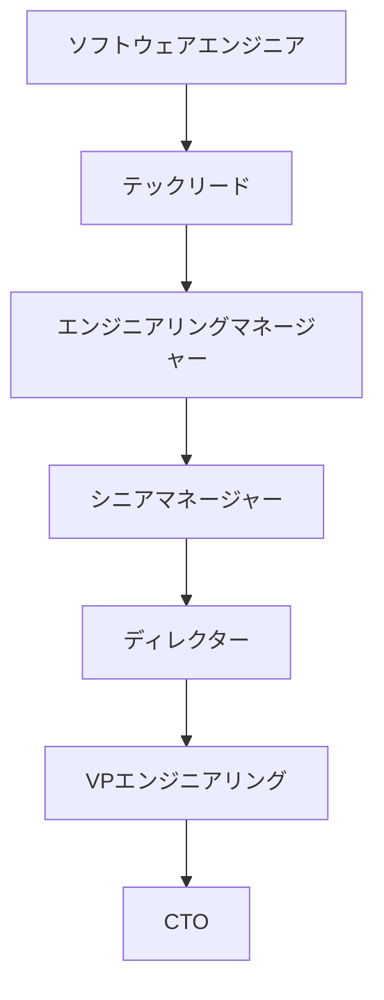
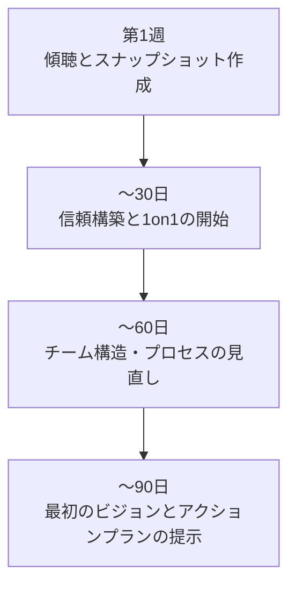
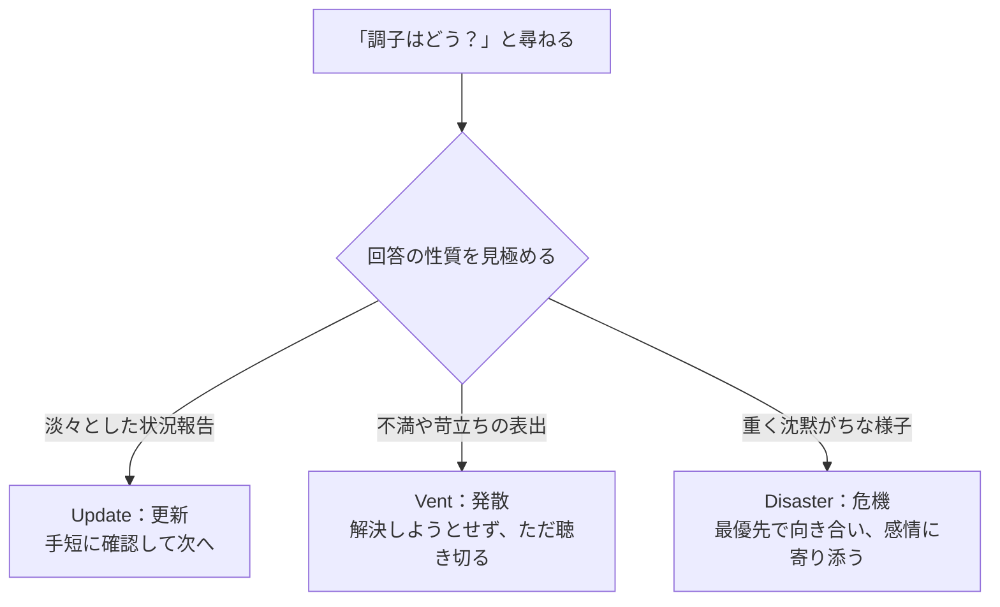
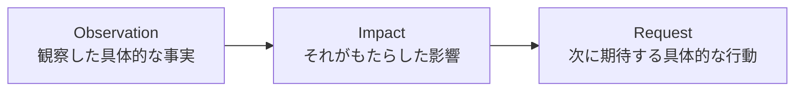
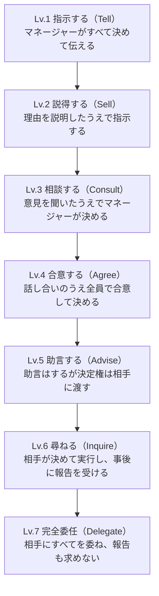
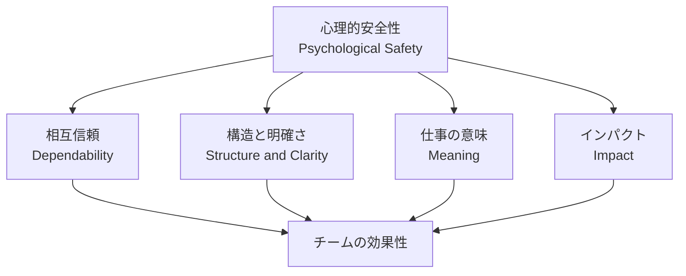
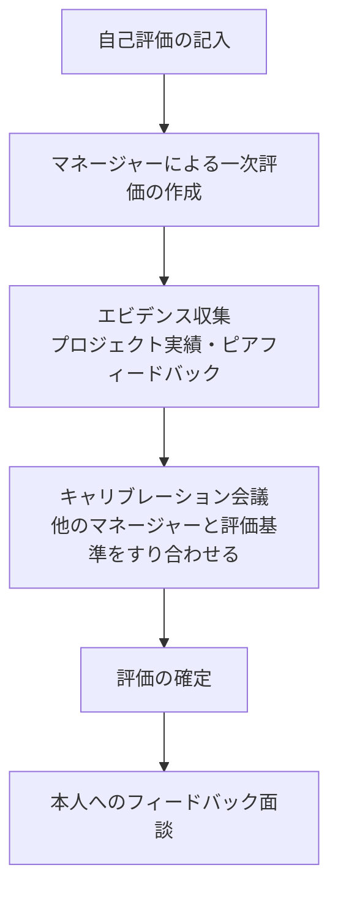
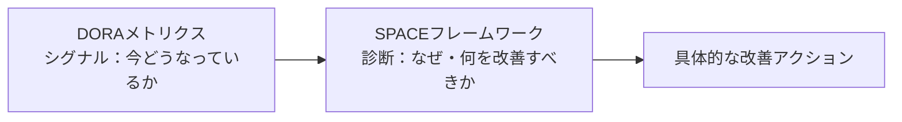
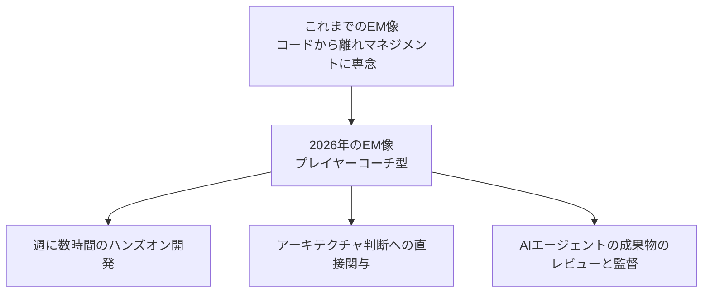

# エンジニアリングマネージャー入門完全ガイド

*── 初学者のためのステップバイステップ・ベストプラクティス*

> 本ガイドは、James Stanier 著『[Become an Effective Software Engineering Manager](https://pragprog.com/titles/jsengman/become-an-effective-software-engineering-manager/)』（Pragmatic Bookshelf）を主要な参照軸としつつ、Camille Fournier、Will Larson、Lara Hogan、Kim Scott、Michael Lopp（Rands）、Gergely Orosz、Google re:Work、LeadDev など、国際的に著名なソフトウェアエンジニアリング/マネジメント分野の実践者・研究者の知見を2026年8月14日時点の情報に基づいて調査し、まとめたものです。各章末および巻末に一次情報・二次情報のURLを掲載しています。

---

## 目次

1. [第1章：エンジニアリングマネージャーとは何か](#第1章エンジニアリングマネージャーとは何か)
2. [第2章：最初の90日間 ── 新任マネージャーのスタートダッシュ](#第2章最初の90日間--新任マネージャーのスタートダッシュ)
3. [第3章：自己管理 ── マネージャーとしての自分を整える](#第3章自己管理--マネージャーとしての自分を整える)
4. [第4章：1on1ミーティングの技術](#第4章1on1ミーティングの技術)
5. [第5章：フィードバックとコーチング](#第5章フィードバックとコーチング)
6. [第6章：委任（デリゲーション）の技術](#第6章委任デリゲーションの技術)
7. [第7章：心理的安全性とチームビルディング](#第7章心理的安全性とチームビルディング)
8. [第8章：パフォーマンス評価とキャリアラダー](#第8章パフォーマンス評価とキャリアラダー)
9. [第9章：採用と面接](#第9章採用と面接)
10. [第10章：チームの生産性を測る（DORA & SPACE）](#第10章チームの生産性を測るdora--space)
11. [第11章：AI時代のエンジニアリングマネジメント（2026年最新動向）](#第11章ai時代のエンジニアリングマネジメント2026年最新動向)
12. [第12章：リモート/ハイブリッドチームのマネジメント](#第12章リモートハイブリッドチームのマネジメント)
13. [まとめ：ベストプラクティス・チェックリスト](#まとめベストプラクティスチェックリスト)
14. [参考文献・情報源一覧](#参考文献情報源一覧)

---

## 第1章：エンジニアリングマネージャーとは何か

### 1.1 なぜ「優れたエンジニア」がそのまま「優れたマネージャー」にはならないのか

多くのエンジニアリングマネージャー（EM）は、優秀なソフトウェアエンジニアとしての実績を評価されて昇進します。しかし、Gergely Orosz（The Pragmatic Engineer）が指摘するように、マネージャーになった瞬間、それまで当たり前に得られていた「フィードバックの多さ」が突然消えます。エンジニア時代はコードレビュー、設計ドキュメントへのコメント、プロジェクトの進捗確認など、常に他者からの評価やシグナルがありました。マネージャーになると、そうした具体的なフィードバックのループが失われ、多くの新任マネージャーが「自分は何をすべきなのか」「今のやり方は正しいのか」が分からず孤独感を覚えます。

James Stanier も自著の中で、マネジメントへの移行を「未知の領域（uncharted territory）」と表現し、エンジニアとして優れていたスキルセットが、そのままではチームを率いるには不十分であると述べています。つまりエンジニアリングマネジメントは、コーディングとは別の専門技能として、意図的に学習する必要がある領域です。

### 1.2 エンジニアリングマネージャーの役割の全体像

Camille Fournier は著書『The Manager's Path』の中で、エンジニアリングキャリアには「個人貢献者（IC）トラック」と「マネジメントトラック」という2つの道があり、マネジメントトラックは段階ごとに「主要な人間関係」「仕事の単位」「陥りやすい失敗パターン」が異なると説明しています。多くのマネージャーが陥る典型的な失敗は、「一つ前の役職の仕事をやり続けてしまう」ことです。つまりチームリードになった人がまだ個人としてコードを書き続けすぎたり、マネージャーになった人がまだ一人のテックリードのように振る舞い続けたりすることです。

*図1：Camille Fournier が示すエンジニアリングマネジメントの代表的なキャリアラダー（Manager's Pathの概念を単純化したもの）*

### 1.3 マネージャーの仕事を5つの領域で捉える

Gergely Orosz は、Uber在籍時に作成した新任マネージャー向けチェックリストの中で、マネージャーの職務期待を次の5領域に整理しています。この分類は初学者が「マネージャーとして何をすべきか」を把握するうえで非常に実用的です。

| 領域 | 内容 |
|---|---|
| チームビルディングと育成 | チーム内の信頼構築、採用（採用枠がある場合）、メンバーの育成 |
| 成果を出す | チームが実行できる構造を整え、仕事を完遂させ、品質基準を保つ |
| 連携とコラボレーション | チーム内外とのオープンなコミュニケーション、人と人・チームとチームをつなぐ、良い会議を運営する |
| ビジョン | チームの存在意義を明確にし、チームの価値観を集約し、計画にチームを巻き込む |
| 専門的な成長 | 自分自身も成長し続ける：自分の目標設定、メンターを持つ、ピアとのネットワーキング、還元する |

> このチェックリストは「how（どうやるか）」をマネージャー個人に委ね、「what（何を達成すべきか）」だけを定義する設計になっている点が重要です。Orosz は、手段まで細かく指定することは「マイクロマネジメント」であり、避けるべきだと強調しています。

---

## 第2章：最初の90日間 ── 新任マネージャーのスタートダッシュ

James Stanier は、マネージャーとしての最初の1週間を「観察してスナップショット（現状の見取り図）を作る期間」と位置づけています。焦って何かを変えようとするのではなく、まずチームの現状、力学、課題を正確に把握することが最優先です。

*図2：新任エンジニアリングマネージャーの最初の90日間の典型的な流れ*

### ステップ1：第1週 ── 観察と傾聴

- チームメンバー一人ひとりと最初の顔合わせを行い、経歴・強み・不安を聞く
- 既存のドキュメント、アーキテクチャ、バックログ、直近のインシデントに目を通す
- 「何が機能していて、何が機能していないか」の仮説（スナップショット）を作る
- まだ大きな意思決定はしない

### ステップ2：〜30日 ── 信頼構築と1on1の確立

- チームメンバー全員との定期1on1を開始する（詳細は第4章）
- 自分の管理スタイルや期待値を明示的に伝える「コントラクティング（契約づくり）」を行う
- 自分の上司（あなたのマネージャー）とも期待値のすり合わせを行う

### ステップ3：〜60日 ── チーム構造とプロセスの見直し

- チームの意思決定プロセス、スプリント運用、コードレビュー文化などを評価する
- 小さな改善を少しずつ試し、チームの反応を見ながら調整する
- 明らかなボトルネックや不公平を放置しない

### ステップ4：〜90日 ── 最初のビジョンとアクションプランの提示

- チームの目的（なぜこのチームは存在するのか）を言語化し、共有する
- 今後半期〜1年の優先順位について、チームを巻き込みながら計画を立てる
- ここまでの学びを自分の上司にも共有し、フィードバックをもらう

---

## 第3章：自己管理 ── マネージャーとしての自分を整える

### 3.1 「忙しい」と「生産的」は別物

Stanier は、マネージャーになると仕事の性質が「タスクを完了させること」から「他者の仕事を通じて成果を出すこと」へ変わるため、自分の生産性の実感の仕方も変える必要があると述べています。Michael Lopp（Rands）も、マネージャーは「忙しさ（Busy）」に逃げ込みがちであり、忙しさは「戦術的」であって「戦略的」ではないと警告しています。

### 3.2 自己管理の実践ポイント

- **情報を整理する仕組みを持つ**：1on1のメモ、チームの状況、意思決定の記録を一元管理する
- **自分の活動を「反応的（reactive）」と「主体的（proactive）」に分類する**：後者の時間を意図的に確保する
- **自分の成果指標を再定義する**：コードの行数やチケット消化数ではなく、チームの成果・成長・健全性で自分の仕事を測る
- **メンターやピアネットワークを持つ**：孤独になりやすいマネージャー職において、他のマネージャーとの横のつながりは極めて重要

---

## 第4章：1on1ミーティングの技術

### 4.1 1on1は「ステータス報告」ではない

Michael Lopp は著書『Managing Humans』の中で、1on1でチームメンバーに投げかける最初の質問を「調子はどう？（How are you?）」とし、その答えを聞きながらマネージャーは無意識に3つのバケツのどれに当てはまるかを判断していると説明しています。

*図3：Rands（Michael Lopp）の「The Update, The Vent, and The Disaster」に基づく1on1トリアージ*

Lopp が強調する重要な点は、**1on1が単なる状況報告（Update）で終わってしまうことこそが「失敗」**だということです。多くのマネージャーは状況報告で終わる1on1を成功だと誤解しますが、それはメンバーがマネージャーに対して心理的に安全を感じておらず、本音を語っていないサインである可能性があります。Vent（発散）が出てきたときは、解決策を急いで提示せず、ひたすら聴くことが求められます。

### 4.2 1on1の準備と運営

Stanier は、1on1の最初の回を「コントラクティング（contracting）」と呼び、以下を明確にすることを勧めています。

- どのくらいの頻度・長さで行うか
- どちらが主にアジェンダを作るか（多くの場合はレポート側が主導すべき）
- 何をこの場で話し、何を話さないか（例：日常のタスク管理は別の場で）
- ノートの取り方とアクションアイテムの管理方法

### 4.3 なぜ1on1が「予防保全」なのか

Lopp は1on1を「週次の予防保全（preventive maintenance）」と位置づけています。健全な1on1が積み重なったチームの特徴は、**ドラマが少ないこと**です。つまり、プロジェクトへの興味が薄れ始めた兆候、メンバー間の緊張、離職の予兆などを、大きな問題になる前に察知できるようになります。

---

## 第5章：フィードバックとコーチング

### 5.1 フィードバックの黄金式：Observation → Impact → Request

Lara Hogan（元Etsy Engineering Director、元Kickstarter VP of Engineering）は著書『Resilient Management』の中で、良いフィードバックを「観察（Observation）＋影響（Impact）＋要望（Request）」という式で構造化することを提案しています。

*図4：Lara Hoganのフィードバックの公式（観察＋影響＋要望＝良いフィードバック）*

主観的な評価（「もっと積極的になって」など）ではなく、具体的な事実の観察から始め、それがチームやプロジェクトに与えた影響を説明し、最後に次に期待する行動を明確にする、という順序が重要です。

### 5.2 マネジメントの4つの帽子：メンタリング／コーチング／スポンサリング／フィードバック

Hogan は、マネージャーがメンバーの成長を支える方法を4つに分類しています。

| モード | 内容 |
|---|---|
| メンタリング（Mentoring） | 自分の経験に基づき助言し、一緒に問題解決する |
| コーチング（Coaching） | 答えを与えず、開かれた質問で本人の内省を促す |
| スポンサリング（Sponsoring） | 本人が成長・昇進できる機会を見つけ、周囲に働きかける |
| フィードバック（Delivering feedback） | 行動を観察し、称賛または改善提案として率直に伝える |

多くの新任マネージャーはメンタリング（自分の答えを教える）に偏りがちですが、Hogan はコーチング（本人に考えさせる）の方が、長期的にはメンバーの自律性を育てるうえではるかに効果的だと述べています。

### 5.3 Radical Candor（徹底したフィードバック）

Google・Apple で幹部を務めた Kim Scott は、著書『Radical Candor』の中で、フィードバックを「個人的な配慮（Care Personally）」と「率直な指摘（Challenge Directly）」の2軸で捉えるフレームワークを提示しています。

| | Challenge Directly（率直に指摘する） | Challenge Directlyしない |
|---|---|---|
| **Care Personally（個人的に配慮する）** | **Radical Candor（理想形）**：配慮と率直さが両立 | Ruinous Empathy（破壊的な思いやり）：優しさのあまり必要な指摘ができない |
| **Care Personallyしない** | Obnoxious Aggression（不快な攻撃性）：配慮なく率直さだけをぶつける | Manipulative Insincerity（操作的な不誠実さ）：どちらも欠如した最悪の状態 |

Scott は「率直さは、相手を大切に思っているからこそのギフトである」と述べ、多くの人が Radical Candor を「まず配慮を示してから、ようやく指摘する」と誤解しがちだが、実際には**指摘そのものが配慮の表現になり得る**と強調しています。

---

## 第6章：委任（デリゲーション）の技術

### 6.1 なぜ委任が必要なのか

マネージャーが意思決定・レビュー・会議のすべてに関与し続けると、やがて自分自身がチームのアウトプットのボトルネックになります。委任はメンバーの成長機会を生むと同時に、マネージャー自身が戦略的な仕事に時間を使えるようにするための必須スキルです。

### 6.2 状況的リーダーシップと委任の7段階

Hersey と Blanchard の状況的リーダーシップ（Situational Leadership）モデルは、メンバーの習熟度・意欲に応じてリーダーシップスタイルを変える必要があると説きます。この考え方を実務レベルまで具体化したものが、Jurgen Appelo（Management 3.0）の「委任の7段階」です。

*図5：Management 3.0（Jurgen Appelo）の「委任の7段階」*

新任マネージャーが陥りやすい失敗は、委任のレベルを曖昧にしたまま「任せたつもり」になることです。タスクごとに「今回はどのレベルで任せるのか」をメンバーと明示的にすり合わせることが、委任を成功させる鍵になります。

### 6.3 委任のステップ

1. **委任するタスクを選ぶ**：緊急性が低く、育成効果が高いタスクから始める
2. **委任のレベルを明示する**：上記7段階のどこに位置するかを本人と合意する
3. **期待するアウトプット（結果）を伝える**：手段（How）ではなく結果（What）を定義する
4. **フィードバックループを設計する**：いつ、どのように進捗を確認するかを事前に決める
5. **やり方の違いを許容する**：結果が明らかに問題でない限り、自分と違うやり方に介入しない

---

## 第7章：心理的安全性とチームビルディング

### 7.1 Googleの「Project Oxygen」と「Project Aristotle」

Google の人事分析チームは2008年、「マネージャーは本当に必要か」を検証するために大規模調査「Project Oxygen」を開始しました。結果はマネージャーの存在がチームの成果、満足度、離職率に大きな影響を与えることを明確に示し、優れたマネージャーに共通する10の行動（2018年に8項目から拡張）を特定しました。

| # | 優れたマネージャーの行動 |
|---|---|
| 1 | 良いコーチである |
| 2 | チームを勢力づけ、マイクロマネジメントしない |
| 3 | インクルーシブであり、メンバーのウェルビーイングに関心を持つ |
| 4 | 生産的で結果志向である |
| 5 | 良いコミュニケーターであり、傾聴する |
| 6 | メンバーのキャリア開発を支援する |
| 7 | 明確なビジョンと戦略を持つ |
| 8 | チームをアドバイスできる技術スキルを持つ |
| 9 | 組織横断でのコラボレーションができる |
| 10 | 優れた意思決定者である |

続く「Project Aristotle」では、Googleは「チームに誰がいるかより、チームがどう機能しているかの方が重要」という結論に至り、効果的なチームを支える要素として以下の5つを特定しました。その中でも**心理的安全性が他のすべての土台となる最重要要素**とされています。

*図6：Google「Project Aristotle」が特定したチーム効果性の5要素と心理的安全性の位置づけ*

### 7.2 心理的安全性とは何か（Amy Edmondson）

ハーバード・ビジネス・スクールの Amy Edmondson 教授は、心理的安全性を「チームが対人リスクを取っても安全だとメンバーが共有している信念」と定義しています。Edmondsonの研究で興味深いのは、病院のチームを対象にした調査で、**パフォーマンスの高いチームほどミスの報告件数が多かった**という点です。これは、優れたチームほどミスを隠さず報告できる安全な環境があるためだと解釈されています。

Edmondson は、心理的安全性は「仲良しであること」や「基準を下げること」ではなく、むしろ**困難な学習と改善を可能にする土台**であると強調しています。

### 7.3 BICEPS：人が仕事で持つ6つの核心的ニーズ

Lara Hogan は、Paloma Medina が提唱した「BICEPS」というフレームワークを紹介し、人が予想外に強い感情的反応を示すときは、以下の6つの核心的ニーズのいずれかが脅かされている可能性が高いと説明しています。

| ニーズ | 内容 |
|---|---|
| Belonging（帰属） | コミュニティやグループへのつながりの感覚 |
| Improvement/Progress（向上・進捗） | 学び、前進している実感 |
| Choice（選択） | 自分の仕事や環境について自分で決められる感覚 |
| Equality/Fairness（公平性） | リソースや情報への公平なアクセス |
| Predictability（予測可能性） | 適度な一貫性と変化のバランス |
| Significance（重要性） | 自分の存在や貢献が認められている実感 |

例えば、些細に見える「席替え」がチームに強い反発を生むことがありますが、それはBelonging（グループから離される不安）やPredictability（急な変化）が脅かされているためだと理解できます。

---

## 第8章：パフォーマンス評価とキャリアラダー

### 8.1 デュアルラダー（Dual Ladder）という考え方

Stanier は著書の中で、「個人貢献者（IC）トラック」と「マネジメントトラック」という2つの並行したキャリアパスを整備する重要性を説いています。すべての優秀なエンジニアがマネージャーになるべきというわけではなく、高度な技術力で組織に貢献する道（スタッフエンジニア、プリンシパルエンジニアなど）も同様に評価される必要があります。Will Larson の著書『Staff Engineer』はまさにこのICトラックの上位層を体系的に扱ったものとして知られています。

### 8.2 パフォーマンスレビューのプロセス

*図7：一般的なエンジニア向けパフォーマンスレビューのプロセス*

### 8.3 キャリブレーション（評価の目線合わせ）がなぜ重要か

キャリブレーションとは、複数のマネージャーが集まり、自分のチームメンバーへの評価案を持ち寄って比較し、評価基準の目線を揃えるプロセスです。これがないと、同じ「期待を超える成果」という評価でも、マネージャーによって基準がバラバラになり、不公平感の原因になります。

キャリブレーションの実務上のポイント：

- 全マネージャーが同じ評価基準・尺度を使うことを事前に徹底する
- 「寛大化傾向」「厳格化傾向」「ハロー効果」など評価バイアスへの意識を持つ
- 評価が会議で調整された場合でも、本人へのフィードバックは担当マネージャーが責任を持って伝える
- 評価の根拠を具体的なエビデンス（成果物・フィードバック）に基づかせる

---

## 第9章：採用と面接

### 9.1 構造化面接（Structured Interviewing）

Google の人事分析チームは、構造化面接（あらかじめ決めた質問セットと評価基準〈ルーブリック〉を全候補者に一貫して適用する面接手法）が、非構造化面接（自由な雑談形式の面接）よりも著しく高い予測妥当性を持つことを社内データで確認しています。人は初対面の相手を無意識のバイアスに基づいて瞬時に判断してしまう傾向（確証バイアス）があり、構造化面接はこれを是正する仕組みとして機能します。

### 9.2 構造化面接を実践するステップ

1. **職務分析を行う**：その役割で成功するために本当に必要なスキル・行動を洗い出す
2. **質問セットを作る**：全候補者に同じ質問をする（行動面接・状況面接の質問が有効）
3. **評価ルーブリックを作る**：「不十分」から「優秀」までの尺度と、それぞれの具体例を明文化する
4. **面接官を訓練する**：ルーブリックに沿って独立に採点し、他の面接官の評価を見る前に自分の評価を確定する
5. **候補者ごとに評価を統合する**：個々の面接官の評価を集約し、根拠に基づいて合否を判断する

### 9.3 James Stanier が挙げる採用の基本姿勢

Stanier は著書『Join Us!』の章で、「誰を採用するかを選ぶ」「優れた職務記述書を書く」「面接プロセスを設計する」という一連の流れの重要性を説いています。特に、採用は「欠員を埋める作業」ではなく「チームの将来を形作る意思決定」であるという姿勢が強調されています。

---

## 第10章：チームの生産性を測る（DORA & SPACE）

### 10.1 DORAメトリクス

DORA（DevOps Research and Assessment）は、Nicole Forsgren、Jez Humble、Gene Kim による数年間にわたる調査から生まれたフレームワークで、ソフトウェアデリバリーのパフォーマンスを4つの指標で捉えます。

| メトリクス | 内容 |
|---|---|
| デプロイ頻度（Deployment Frequency） | どれくらいの頻度で本番環境にリリースできているか |
| 変更のリードタイム（Lead Time for Changes） | コミットから本番稼働までの所要時間 |
| 変更失敗率（Change Failure Rate） | リリースが障害・ロールバックにつながる割合 |
| 平均修復時間（MTTR: Mean Time to Recovery） | 障害発生から復旧までの平均時間 |

### 10.2 SPACEフレームワーク

DORAの共同開発者でもある Nicole Forsgren は、Microsoft Research・GitHub・University of Victoria の研究者らとともに、開発者の生産性を単一の指標（コード行数やコミット数など）で捉えることの危険性を指摘し、2021年に「SPACE」フレームワークを発表しました。SPACEは、個人・チーム・システムの3つのレベルで、以下の5つの側面を組み合わせて生産性を捉えることを提唱しています。

| 次元 | 内容 |
|---|---|
| Satisfaction and well-being（満足度とウェルビーイング） | 開発者が仕事にどれだけ満たされているか |
| Performance（パフォーマンス） | 期待した成果を実際に達成できているか |
| Activity（活動量） | 可視化できるエンジニアリング活動の量 |
| Communication and collaboration（コミュニケーションと協働） | チームがどれだけ効果的に連携できているか |
| Efficiency and flow（効率とフロー） | 中断されずに前進できる度合い |

### 10.3 DORAとSPACEをどう組み合わせるか

*図8：DORAとSPACEの関係性（Nicole Forsgrenの説明に基づく）*

Forsgren 自身が説明するように、DORAは「今どういう状態か」を示す**シグナル**であり、SPACEはその背景にある「なぜそうなっているのか、何を改善すべきか」を理解するための**診断ツール**です。両者は対立するものではなく、補完し合う関係にあります。マネージャーは単一の活動指標（例：コミット数）を個人の評価に直結させることを避け、これらのフレームワークを健全性の診断・改善のための対話の材料として使うべきです。

---

## 第11章：AI時代のエンジニアリングマネジメント（2026年最新動向）

### 11.1 「プレイヤーコーチ」モデルへの回帰

2026年、AIコーディングエージェントの普及により、エンジニアリングマネジメントの実態にも明確な変化が起きています。LeadDevの「Engineering Leadership Report 2026」によれば、より多くのエンジニアリングリーダーが技術的な作業に直接関わるようになっており、マネージャー層でハンズオンの技術作業を行う割合は2025年の20%から2026年には35%へ増加しました。Gergely Orosz が2024年に予測した「プレイヤーコーチ」モデル（マネジメントと実務の両方を担うマネージャー像）が、現実のものになりつつあります。

*図9：AIエージェントの普及に伴うエンジニアリングマネージャーの役割変化（2026年時点の動向）*

### 11.2 なぜこの変化が起きているのか

AIコーディングエージェントの登場によって、アイデアを動くソフトウェアに変換するまでの障壁が大幅に下がったことが背景にあります。LeadDevの取材に対し、Spotifyのエンジニアリングマネージャー Emma Bostian は、AIがリーダー層にとってもコードへの直接的な貢献をしやすくしていると述べています。同時に、エンジニア側はAIが生成したコードのレビューに費やす時間が増えているとも指摘されており、エンジニアとマネージャーの役割の境界線が従来よりも曖昧になりつつあります。

ただし、専門家は「マネージャーの目標がもう一人のエンジニアになることではない」という点を強調しています。技術的に手を動かせることと、チームを率いること・優先順位を決めること・メンバーを育てることは、依然として別のスキルセットです。AI時代のEMに求められるのは、**技術的な勘を失わずに保ちながら、あくまでマネジメントの本分（人・優先順位・組織）に軸足を置き続けるバランス感覚**だと言えます。

### 11.3 マネージャーが押さえておくべき実務上の変化

- **委任の対象が「人だけでなくAIエージェントにも広がる」**：どのエージェントにどの権限（リポジトリへの書き込み、シークレットへのアクセスなど）を与えるかというガバナンスの意識が必要になる
- **レビューの重要性が一段と増す**：AIが生成した成果物は「ジュニアエンジニアが書いたプルリクエスト」のように、差分の確認・テストの実行・エッジケースの検証・セキュリティと保守性の評価を経る必要がある
- **技術戦略とアーキテクチャ判断への関与時間が増える傾向にある**：定型的な実装作業がAIに移る分、人間の判断が必要な領域（設計判断・トレードオフの意思決定）にマネージャーの時間配分がシフトしている

---

## 第12章：リモート/ハイブリッドチームのマネジメント

Stanier は著書『Become an Effective Software Engineering Manager』の中で「現代の職場（The Modern Workplace）」という章を設け、リモートワークへのシフト、ダイバーシティとインクルージョン、ワークライフバランスを、現代のエンジニアリングマネジメントに欠かせないテーマとして扱っています。

### 12.1 リモート/ハイブリッドチームで意識すべきポイント

- **1on1と非公式なコミュニケーションの意図的な設計**：オフィスでの雑談的な接点が失われる分、1on1やチームの交流機会を意図的に設計する必要がある
- **書き言葉での明確さ**：対面での補足ができない分、非同期のドキュメントやメッセージの明確さがより重要になる
- **タイムゾーンをまたぐ配慮**：会議時間の公平な分散、非同期での意思決定プロセスの整備
- **成果ベースでの評価**：勤務時間や「見えている時間」ではなく、成果とアウトプットで評価する姿勢を徹底する
- **BICEPSの視点を持つ**：リモート環境では特にBelonging（帰属）とPredictability（予測可能性）が脅かされやすいため、意識的なケアが必要

---

## まとめ：ベストプラクティス・チェックリスト

- [ ] 最初の90日間は「変える」より先に「観察して理解する」ことを優先した
- [ ] 全メンバーと定期的な1on1を設定し、コントラクティングを行った
- [ ] 1on1でUpdate（状況報告）だけで終わっていないか意識している
- [ ] フィードバックは「観察＋影響＋要望」の型で具体的に伝えている
- [ ] メンタリング・コーチング・スポンサリング・フィードバックの4モードを使い分けている
- [ ] タスクの委任レベルを本人と明示的にすり合わせている
- [ ] チームの心理的安全性を意識的に育てている
- [ ] パフォーマンス評価はエビデンスに基づき、キャリブレーションを経ている
- [ ] 採用面接は構造化され、評価ルーブリックに基づいている
- [ ] 生産性を単一の活動指標ではなく、DORA/SPACEのような多面的な視点で捉えている
- [ ] AI時代における自分自身の技術的関与とマネジメントの本分のバランスを意識している
- [ ] リモート/ハイブリッド環境ではBICEPS（特に帰属と予測可能性）に配慮している

---

## 参考文献・情報源一覧

本ガイドの作成にあたり、以下の一次情報・著名な実践者の発信を参照しました（2026年8月14日時点で確認）。

1. James Stanier, *Become an Effective Software Engineering Manager* (Pragmatic Bookshelf)
   https://pragprog.com/titles/jsengman/become-an-effective-software-engineering-manager/
2. Camille Fournier, *The Manager's Path* ── 要約記事
   https://www.runn.io/blog/the-managers-path-summary
3. Camille Fournier インタビュー（Lenny's Newsletter）
   https://www.lennysnewsletter.com/p/engineering-leadership-camille-fournier
4. Will Larson, Irrational Exuberance（ブログ本体）
   https://lethain.com/
5. Will Larson, "Good engineering management is a fad"
   https://lethain.com/good-eng-mgmt-is-a-fad/
6. Will Larson, "Managing Staff-plus engineers"
   https://lethain.com/managing-staff-plus-engineers/
7. Gergely Orosz, "A Checklist For First-Time Engineering Managers" (The Pragmatic Engineer)
   https://blog.pragmaticengineer.com/checklist-for-first-time-managers/
8. Lara Hogan, Management（ブログ）
   https://larahogan.me/management/
9. Lara Hogan, "Creating predictability and stability in times of rapid change"（BICEPSの解説）
   https://larahogan.me/blog/predictability-stability-terrible-times/
10. Lara Hogan, *Resilient Management*（書籍公式サイト）
    https://resilient-management.com/
11. Michael Lopp (Rands), "The Update, The Vent, and The Disaster"
    https://randsinrepose.com/archives/the-update-the-vent-and-the-disaster/
12. Kim Scott, Radical Candor ── 公式フレームワーク解説
    https://www.radicalcandor.com/our-approach
13. Google re:Work, "Following the data: The research behind great managers"（Project Oxygen）
    https://rework.withgoogle.com/intl/en/guides/following-the-data-the-research-behind-great-managers
14. Harvard Business Review, "How Google Sold Its Engineers on Management"
    https://hbr.org/2013/12/how-google-sold-its-engineers-on-management
15. Google re:Work, "A guide to structured interviewing for better hiring practices"
    https://rework.withgoogle.com/intl/en/guides/a-guide-to-structured-interviewing-for-better-hiring-practices
16. Amy Edmondson（心理的安全性の提唱者）── 経歴・研究概要
    https://en.wikipedia.org/wiki/Amy_Edmondson
17. Nicole Forsgren ほか, SPACEフレームワーク解説（The Pragmatic Engineer Newsletter）
    https://newsletter.pragmaticengineer.com/p/developer-productivity-a-new-framework
18. SPACE Framework 公式解説サイト
    https://space-framework.com/
19. Jurgen Appelo, Management 3.0, "Delegation Skills & Empowerment"（委任の7段階）
    https://management30.com/empower-teams/delegation-empowerment/
20. LeadDev, "Engineering managers are back in the codebase"（2026年AI時代のEM動向）
    https://leaddev.com/management/engineering-managers-are-back-in-the-codebase
21. Culture Amp, "Performance review calibrations: What you need to know"
    https://www.cultureamp.com/blog/performance-review-calibrations

---

*本ガイドはMarkdown形式で作成されています。フローチャートはMermaid記法、表形式の情報はMarkdownテーブルを使用し、ASCIIアートによる図解は使用していません。*
