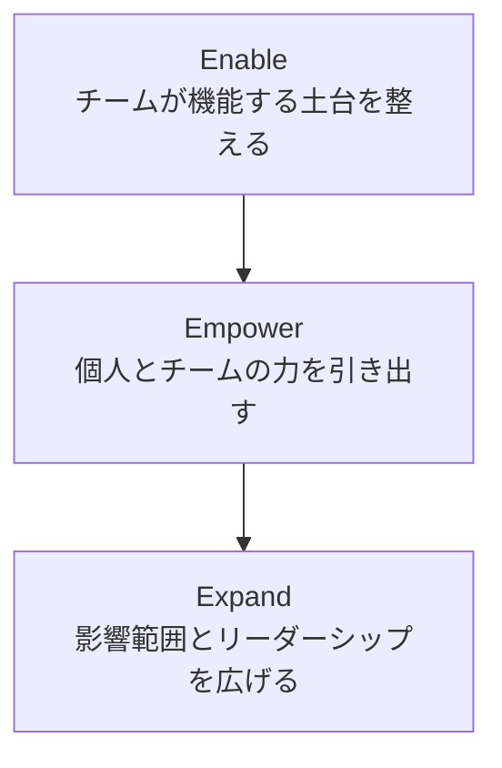
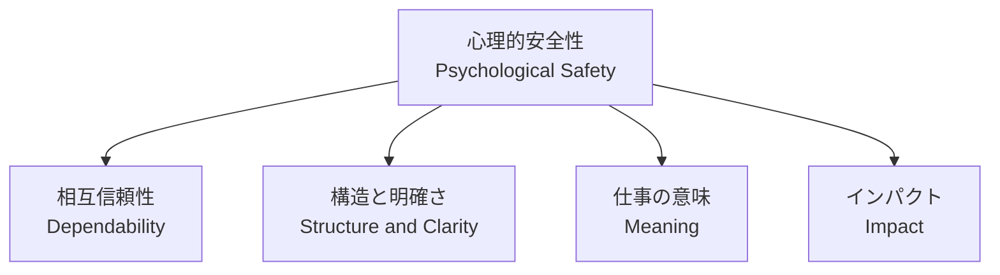
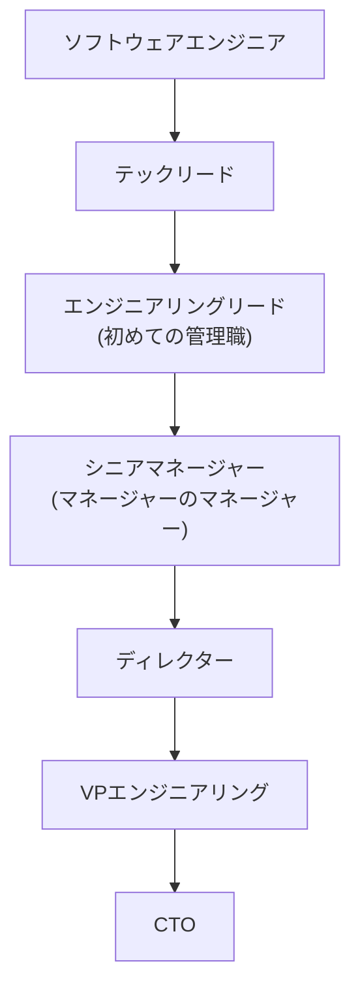
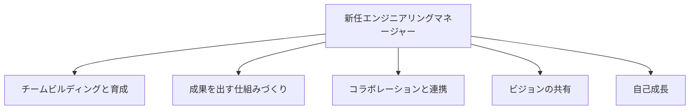
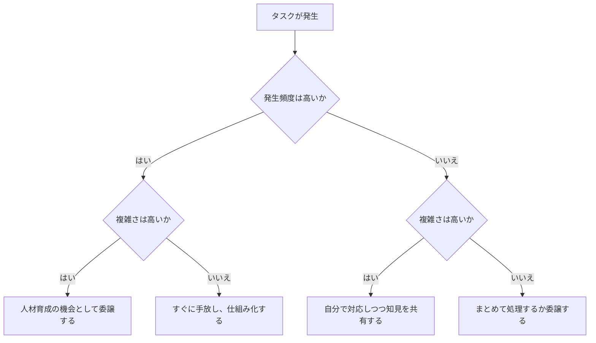
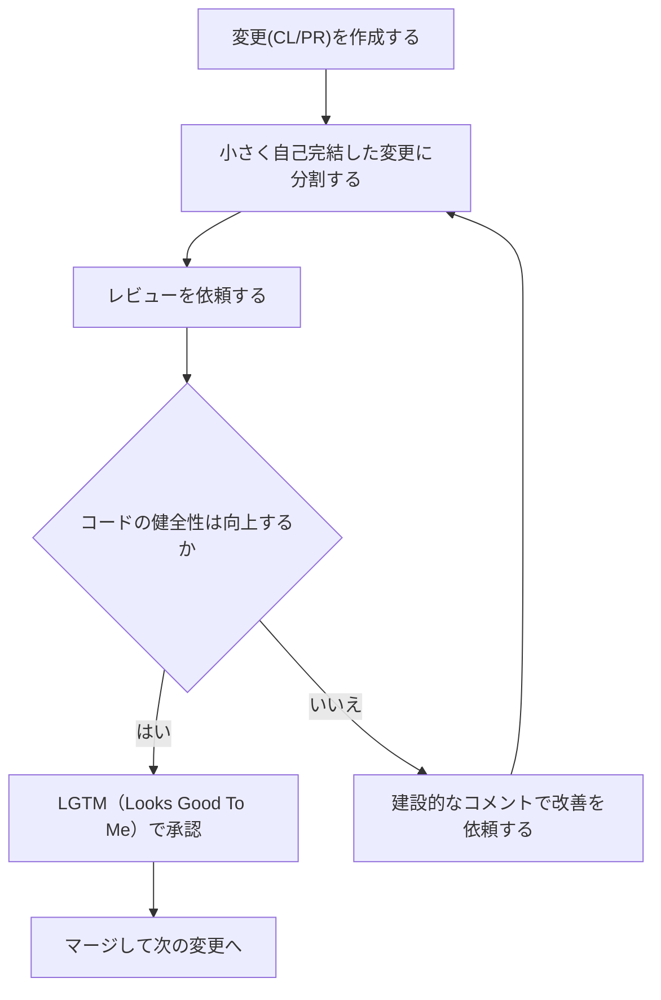
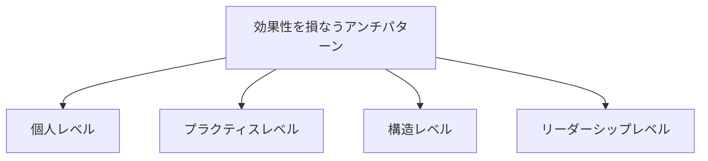

# エンジニアリングチームのリード術：初学者のためのベストプラクティスガイド

> 本ガイドは、Addy Osmani著『Leading Effective Engineering Teams』（O'Reilly）を軸に、Googleの内部研究（Project Oxygen / Project Aristotle）、Camille Fournier、Will Larson、Gergely Orosz、Michael Lopp、Kim Scottといった国際的に著名なエンジニアリングリーダーの知見を整理し、初めてチームをリードする方向けにステップバイステップでまとめたものです。
>
> 最終更新: 2026年8月15日時点の公開情報に基づく

---

## 目次

1. [はじめに：なぜ「リード術」を学ぶのか](#はじめになぜリード術を学ぶのか)
2. [第1章：リーダーシップの土台を理解する](#第1章リーダーシップの土台を理解する)
3. [第2章：効果的なチームを支える科学的根拠](#第2章効果的なチームを支える科学的根拠)
4. [第3章：エンジニアリングリーダーの役割を理解する](#第3章エンジニアリングリーダーの役割を理解する)
5. [第4章：新任リーダーの最初のステップ](#第4章新任リーダーの最初のステップ)
6. [第5章：1on1とフィードバックの技術](#第5章1on1とフィードバックの技術)
7. [第6章：チームの実行力を高めるシステム思考](#第6章チームの実行力を高めるシステム思考)
8. [第7章：コードレビュー文化を築く](#第7章コードレビュー文化を築く)
9. [第8章：よくあるアンチパターンと回避策](#第8章よくあるアンチパターンと回避策)
10. [第9章：継続的な成長とネクストステップ](#第9章継続的な成長とネクストステップ)
11. [まとめ](#まとめ)
12. [参考文献・出典](#参考文献出典)

---

## はじめに：なぜ「リード術」を学ぶのか

優秀なエンジニアが必ずしも優秀なリーダーになれるとは限りません。コードを書く能力と、人・チーム・プロジェクトを導く能力はまったく別のスキルセットです。Googleの元Chromeチームで10年以上のリーダー経験を持つAddy Osmaniは、著書『Leading Effective Engineering Teams』の中で、エンジニアリングの効果性（Effectiveness）を「信頼・コミットメント・アカウンタビリティ」の3つの力によって生み出されるものと位置づけています。

本ガイドは、この考え方を出発点に、Googleの大規模社内研究や、業界で広く読まれている実務書・ブログの知見を組み合わせ、初学者が迷わず実践できるステップバイステップの手引きとして構成しています。

---

## 第1章：リーダーシップの土台を理解する

### 1-1. Efficiency（効率性）・Effectiveness（効果性）・Productivity（生産性）の違い

エンジニアリングリーダーになって最初につまずきやすいのが、この3つの言葉の混同です。Osmaniの著書では、これらを明確に区別することがリーダーシップの出発点だとされています。

| 概念 | 問いかけ | 焦点 | 陥りやすい罠 |
|---|---|---|---|
| Efficiency（効率性） | 同じ成果をより少ない資源で出せているか | 投入（インプット）の最小化 | 「速く作ること」自体が目的化する |
| Effectiveness（効果性） | 正しいことをやれているか | アウトカム（成果）への到達 | 効率だけを追い、方向性を見失う |
| Productivity（生産性） | 単位時間あたりどれだけ出力したか | アウトプット量 | 出力の量を測るあまり質や成果を軽視する |

初学者リーダーがまず意識すべきは、「アウトプット（作った量）」ではなく「アウトカム（生み出した価値）」に焦点を当てることです。

### 1-2. 3つのEモデル：Enable → Empower → Expand

Osmaniは、効果的なエンジニアリングを実現する枠組みとして「3つのEモデル」を提示しています。これはリーダーが段階的に取り組むべき順序でもあります。

- **Enable（土台を整える）**：自組織・チーム規模に合った「効果性とは何か」を定義し、初期状態を整える段階。
- **Empower（力を引き出す）**：個人の効果性を高め、機会を与えて問題を減らし、レバレッジの高い活動を特定する段階。
- **Expand（範囲を広げる）**：リーダーとしての課題に向き合い、影響力を組織全体へと広げていく段階。

この順序を飛ばして「まず組織全体を変えよう」とすると失敗しやすい、というのが実務上の教訓です。まずは自分のチームの土台（Enable）から着手しましょう。

---

## 第2章：効果的なチームを支える科学的根拠

エンジニアリングリーダーシップは「センス」だけの話ではありません。Googleは10年以上にわたり、大規模な社内データを用いて「何が優れたマネージャー・優れたチームを作るか」を検証してきました。

### 2-1. Project Oxygen：優れたマネージャーの10の行動

2011年に始まったProject Oxygenは、1万件以上のマネージャーに関するデータポイントを分析し、優れたマネージャーに共通する行動を特定しました。当初8項目だったものが、2018年の再検証で10項目に拡張されています。

| # | 行動 |
|---|---|
| 1 | 良いコーチであること |
| 2 | マイクロマネジメントせず、チームに権限を委譲すること |
| 3 | 全員を尊重する、インクルーシブなチーム環境を作ること |
| 4 | 生産性と成果に焦点を当てること |
| 5 | 効果的にコミュニケーションすること（聞く・伝える） |
| 6 | キャリア開発を支援し、パフォーマンスについて話し合うこと |
| 7 | 明確なビジョンと戦略を示すこと |
| 8 | チームにアドバイスできる技術力を持つこと |
| 9 | 組織を横断して協働すること |
| 10 | 強い意思決定力を持つこと |

Googleは現在、この10行動を土台にした「Deliver Results（成果を出す）」「Develop People（人を育てる）」「Build Community（コミュニティを築く）」という3つのマネージャー責任フレームワークへと発展させています。

### 2-2. Project Aristotle：効果的なチームの5つの力学

Project Oxygenがマネージャー個人に焦点を当てたのに対し、2016年に発表されたProject Aristotleは「何がチームを効果的にするか」を180チーム規模で調査しました。結論は明快で、**「誰がチームにいるか」よりも「チームがどう働いているか」の方が重要**というものでした。重要度の高い順に5つの力学が特定されています。

| 力学 | 内容 | チェック用の問い |
|---|---|---|
| 心理的安全性 | 対人リスクを取っても否定・罰せられないという安心感 | 「ミスをしても、それが自分に不利に働かないと感じるか」 |
| 相互信頼性 | メンバーが質の高い仕事を期限通りに完了させられるか | 「チームメンバーは、やると言ったことを実行してくれるか」 |
| 構造と明確さ | 目標・役割・実行計画が明確か | 「チームには効果的な意思決定プロセスがあるか」 |
| 仕事の意味 | 仕事そのもの、またはその成果に個人的な意義を感じられるか | 「自分の仕事はチームにとって意味があると感じるか」 |
| インパクト | 自分の仕事が組織やユーザーに変化をもたらすと信じられるか | 「自分の仕事が組織の目標にどう貢献しているか理解しているか」 |

心理的安全性は他の4つの力学の「土台」であるとされています。ミスを報告できなければ相互信頼性は崩れ、疑問を口にできなければ構造の不明確さも解消されません。まずここに投資することが、リーダーとして最もレバレッジの高い一手です。

---

## 第3章：エンジニアリングリーダーの役割を理解する

### 3-1. テックリード／エンジニアリングマネージャー／TLMの違い

Osmaniの著書では、リーダーシップの役割を大きく3種類に整理しています。

| 役割 | 主な責任 | 向いている人 |
|---|---|---|
| テックリード（Tech Lead） | 技術的な方向性の決定、アーキテクチャ判断、プロジェクトの橋渡し役 | 技術に深く関わり続けたい人 |
| エンジニアリングマネージャー（EM） | 人材育成、採用、パフォーマンス評価、チームの運営 | 人のマネジメントに関心がある人 |
| テックリードマネージャー（TLM） | 技術リードと人のマネジメントを兼務 | 小規模チームや初期段階の組織で多い形態 |

### 3-2. キャリアラダーとしての管理職パス

『The Manager's Path』の著者であり、Rent the RunwayのCTOを務めたCamille Fournierは、エンジニアリング管理職のキャリアを段階的なラダーとして描いています。

Fournierは、シニアマネージャー以上になって陥りやすい失敗として、次の3つの「マネジメント不全」を挙げています。

- **下方向のマネジメント不全**：委譲できない、後継者を育てない、無理な業務を断れない
- **上方向のマネジメント不全**：経営層への効果的な報告ができない、解決策のない不満だけを述べる
- **横方向のマネジメント不全**：他部門との関係構築や、説得力のあるビジョン作りができない

これは新任マネージャーだけでなく、シニアなIC（Individual Contributor）にも共通する課題です。

---

## 第4章：新任リーダーの最初のステップ

『The Pragmatic Engineer』の著者でUber出身のGergely Oroszは、初めてマネージャーになる人向けに実践的なチェックリストを公開しています。特徴的なのは、「何をすべきか（What）」だけを定義し、「どうやるか（How）」は本人の裁量に委ねている点です。これはそのままマイクロマネジメントを避けるための工夫でもあります。

### 実践ステップ

1. **チームビルディングと育成**：チーム内の信頼を築き、必要であれば採用を進め、メンバーの成長を支援する。
2. **成果を出す仕組みづくり**：チームが実行できる体制を整え、高い品質基準を維持しながら物事を前に進める。
3. **コラボレーションと連携**：オープンなコミュニケーションチャネルを維持し、他チームとの橋渡し役になり、意味のあるミーティングを運営する。
4. **ビジョンの共有**：チームの存在目的と価値観を言語化し、計画づくりにメンバーを巻き込む。
5. **自己成長**：自分自身の目標を設定し、メンターを持ち、社内外のネットワークを築く。

Oroszが強調しているのは、このチェックリストをそのままコピーするのではなく、自組織における「有能なマネージャー像」を先に定義し、そこから逆算してこの5領域をカスタマイズすることです。また、新任マネージャーには新任エンジニアや新任プロジェクトリードと同じくらいの支援が必要であり、それを支えることはマネージャー自身にとっても最もレバレッジの高い活動だとされています。

---

## 第5章：1on1とフィードバックの技術

### 5-1. 週次1on1という「揺るがない予定」

Netscape、Apple、Pinterest、Slackなどでエンジニアリング組織を率いてきたMichael Lopp（ブログ「Rands in Repose」の著者）は、マネジメントで最も重要な習慣として「毎週30分、何があっても行う1on1」を挙げています。彼はこの時間を、進捗報告の場ではなく、目の前の緊急事態から一歩引いて戦略的・個人的な対話をする場と位置づけています。多忙になるほど1on1が真っ先に削られがちですが、実際にはチームが動揺している時ほどこの時間の価値が高まる、というのが彼の一貫した主張です。

### 5-2. Radical Candor：ケア・パーソナリーとチャレンジ・ダイレクトリー

GoogleとAppleでエグゼクティブを務めたKim Scottが提唱する「Radical Candor（徹底した率直さ）」は、フィードバックを2つの軸で整理するフレームワークです。「個人として相手を気にかけているか（Care Personally）」と「率直に課題を指摘しているか（Challenge Directly）」の組み合わせで、フィードバックのスタイルを4象限に分類します。

| | Challenge Directly（率直に指摘する） | Challenge しない |
|---|---|---|
| **Care Personally（個人的に気にかける）** | **Radical Candor**：思いやりを持ちながら率直に伝える理想形 | **Ruinous Empathy（破滅的共感）**：優しさ優先で本当の課題を伝えられない |
| **Care Personally しない** | **Obnoxious Aggression（傲慢な攻撃性）**：正しいことを言うが配慮がない | **Manipulative Insincerity（操作的不誠実）**：どちらも欠如した最悪の状態 |

初学者リーダーが最初に陥りやすいのは、対立を避けるための「Ruinous Empathy」です。Radical Candorの実践では、まず自分から相手にフィードバックを求める（例：「私のどんな行動が、あなたと仕事をしやすくしていますか、あるいはしにくくしていますか」）ことから始めると、フィードバックを与えやすい信頼関係を築きやすいとされています。

---

## 第6章：チームの実行力を高めるシステム思考

Yahoo、Digg、Uber、Stripeでエンジニアリングリーダーを務めたWill Larsonは、著書『An Elegant Puzzle』の中で、エンジニアリングマネジメントを「システム思考」で捉えることを提案しています。チームサイズの決定、技術的負債への対応、大規模マイグレーションの進め方など、個別の判断を場当たり的に行うのではなく、繰り返し使える意思決定の型を持つことが重要だとされています。

### 委譲の判断フレームワーク

タスクを「頻度」と「複雑さ」の2軸で捉え、委譲すべきか自分で対応すべきかを判断する考え方は、システム思考に基づくマネジメントの代表的な実践例です。

- **頻度が高く、複雑さが低いタスク**：早く手放し、標準化・自動化する対象にする。
- **頻度が高く、複雑さが高いタスク**：メンバーの成長機会として計画的に委譲する。
- **頻度が低く、複雑さが高いタスク**：自分自身が対応しつつ、得られた知見をチームに共有する。

このように「自分がやるべきこと」と「任せるべきこと」を体系的に判断することが、第2章で紹介した「構造と明確さ」の力学をチームにもたらします。

---

## 第7章：コードレビュー文化を築く

Googleが公開している"Engineering Practices"ドキュメントは、社内で長年運用されてきたコードレビュー原則をCC-BY 3.0ライセンスの下で公開したものです。ここで示されている中心的な考え方はシンプルで、レビューの目的は「完璧なコード」を求めることではなく、コードベースの健全性を時間とともに改善し続けることにあります。

リーダーとしてチームに根付かせたい原則は次の3点です。

- **「改善」で十分、「完璧」を求めない**：現状より良くなっていれば承認し、さらなる改善点はコメントとして残す。
- **レビュー速度を重視する**：レビューの遅延はチーム全体の生産性を大きく損なう。
- **技術的根拠に基づいて議論する**：個人の好みではなく、原則に基づいてフィードバックする。オーバーエンジニアリング（今必要ない機能まで作り込むこと）にも注意を促す。

---

## 第8章：よくあるアンチパターンと回避策

Osmaniの著書では、エンジニアリングの効果性を損なう「アンチパターン」を4つのレベルに分類しています。初学者リーダーは、自分のチームがどのレベルの問題を抱えているかを見極めることから始めましょう。

| レベル | 代表例 | 概要 |
|---|---|---|
| 個人レベル | スペシャリスト依存、ゼネラリスト過多、知識の抱え込み | 特定の人にしかできない状態や、逆に広く浅くなりすぎる状態 |
| プラクティスレベル | 締切間際の英雄的対応、PRプロセスの乱れ、終わらないリファクタリング | 開発プロセス自体が習慣的に破綻している状態 |
| 構造レベル | チームの孤立、知識のボトルネック | 組織構造がコラボレーションを妨げている状態 |
| リーダーシップレベル | マイクロマネジメント、スコープ管理の失敗、過剰な計画、懐疑的・受け身なリーダーシップ、正当な評価の欠如 | リーダー自身の振る舞いがチームの効果性を下げている状態 |

特にリーダーシップレベルのアンチパターンは、第2章で紹介した心理的安全性を直接損ないます。マイクロマネジメントは第2章の「権限委譲」の欠如そのものであり、正当な評価の欠如は「仕事の意味」の力学を弱めます。アンチパターンへの対処は、常に本ガイドの前半で扱った基礎概念に立ち返ることが近道です。

---

## 第9章：継続的な成長とネクストステップ

リーダーシップは一度身につけたら終わりというスキルではありません。Osmaniは「Sustain Effectiveness（効果性を持続させる）」ために、成長文化（Growth Culture）を組織に根付かせることの重要性を説いています。実践のポイントは次の通りです。

- **ダウンタイムを成長の機会に変える**：業務に余裕がある時期こそ、学習やメンタリングに時間を投資する。
- **高負荷期でも成長機会を確保する**：忙しい時期でも、小さな挑戦や新しい責任を与える工夫をする。
- **ネットワーキングを怠らない**：社内外の同じ立場のリーダーとのつながりは、孤独になりがちなリーダー業務を支える重要な資産になる。

新任リーダーは、まず第4章のチェックリストに沿って最初の90日を過ごし、第5章の週次1on1を定着させ、第2章の心理的安全性を土台としてチームを観察する——という順序で取り組むと、迷いが少なくなります。

---

## まとめ

エンジニアリングチームのリード術は、才能ではなく学習可能なスキルの集合です。本ガイドで紹介した考え方を要約すると次の通りです。

- **Efficiency・Effectiveness・Productivityを区別**し、アウトカムに焦点を当てる（第1章）。
- **心理的安全性を土台**に、相互信頼性・構造と明確さ・仕事の意味・インパクトを積み上げる（第2章）。
- 自分の役割（テックリード／EM／TLM）と**キャリアラダー**を理解する（第3章）。
- 新任期は**「何を」やるかを定義し、「どうやるか」は任せる**（第4章）。
- **週次1on1**と**Radical Candor**でフィードバック文化を築く（第5章）。
- **委譲の判断軸**を持ち、システム思考でチームの実行力を高める（第6章）。
- コードレビューは**「完璧」ではなく「改善」**を基準にする（第7章）。
- **アンチパターン**を早期に見極め、基礎概念に立ち返って対処する（第8章）。
- **成長文化**を組織に根付かせ、リーダー自身も学び続ける（第9章）。

---

## 参考文献・出典

| # | タイトル・著者 | URL |
|---|---|---|
| 1 | Addy Osmani, *Leading Effective Engineering Teams*（O'Reilly, 2024） | https://www.oreilly.com/library/view/leading-effective-engineering/9781098148232/ |
| 2 | Google re:Work, "Understand team effectiveness"（Project Aristotle） | https://rework.withgoogle.com/intl/en/guides/understand-team-effectiveness |
| 3 | Google re:Work, "Following the data: The research behind great managers"（Project Oxygen） | https://rework.withgoogle.com/intl/en/guides/following-the-data-the-research-behind-great-managers |
| 4 | Camille Fournier, *The Manager's Path*（要約記事, Shortform） | https://www.shortform.com/blog/the-managers-path-camille-fournier/ |
| 5 | Camille Fournier, *The Manager's Path*（解説記事, Welcome to the Jungle） | https://www.welcometothejungle.com/en/articles/btc-manager-path-camille-fournier |
| 6 | Will Larson, *An Elegant Puzzle: Systems of Engineering Management*（Stripe Press） | https://press.stripe.com/an-elegant-puzzle |
| 7 | Gergely Orosz, "A Checklist For First-Time Engineering Managers"（The Pragmatic Engineer） | https://blog.pragmaticengineer.com/checklist-for-first-time-managers/ |
| 8 | Google, "The Standard of Code Review"（Google Engineering Practices） | https://google.github.io/eng-practices/review/reviewer/standard.html |
| 9 | Michael Lopp, インタビュー記事（Welcome to the Jungle） | https://www.welcometothejungle.com/en/articles/btc-michael-lopp-interview-management |
| 10 | Kim Scott, "Our Approach: Kim Scott's Feedback Framework"（Radical Candor公式サイト） | https://www.radicalcandor.com/our-approach |

> 本ガイドは上記の公開情報を要約・再構成したものであり、原文からの引用は最小限にとどめています。各テーマの詳細は、必ず原典（書籍・公式サイト）をご確認ください。
