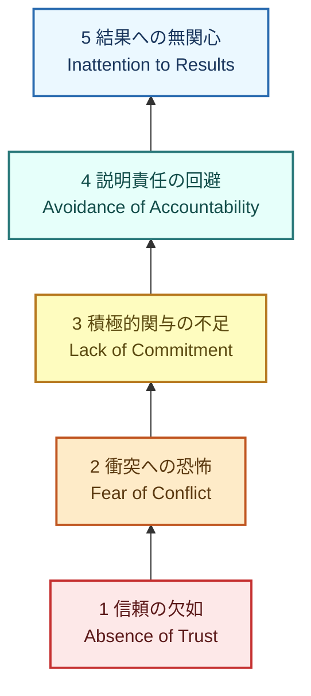
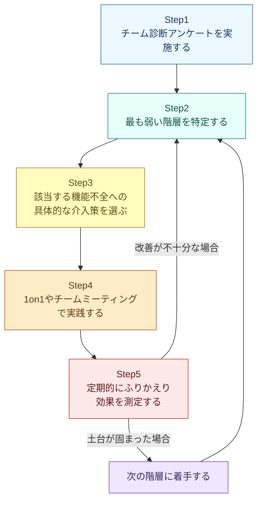

# 『あなたのチームは、機能してますか？』完全ガイド
## The Five Dysfunctions of a Team ― 初学者のためのステップバイステップ実践ガイド

> 原著: *The Five Dysfunctions of a Team: A Leadership Fable*（Patrick M. Lencioni著, Jossey-Bass, 2002年）
> 本ガイドはソフトウェアエンジニアリング組織やプロジェクトマネジメントの現場での実践を念頭に、初学者向けにモデルの構造・原因・処方箋をステップバイステップで整理したものです。

---

## 目次

1. [この本について](#この本について)
2. [著者紹介：パトリック・レンシオーニ](#著者紹介パトリックレンシオーニ)
3. [全体像：5つの機能不全モデルとは](#全体像5つの機能不全モデルとは)
4. [機能不全を1つずつ理解する](#機能不全を1つずつ理解する)
5. [ステップバイステップ実践ガイド：チーム改善の5ステップサイクル](#ステップバイステップ実践ガイドチーム改善の5ステップサイクル)
6. [ソフトウェア開発・エンジニアリングチームでの実践例](#ソフトウェア開発エンジニアリングチームでの実践例)
7. [関連フレームワークとの比較：Googleの「Project Aristotle」](#関連フレームワークとの比較googleのproject-aristotle)
8. [批判的視点と限界](#批判的視点と限界)
9. [今週から始める実践チェックリスト](#今週から始める実践チェックリスト)
10. [まとめ](#まとめ)
11. [参考文献・出典URL一覧](#参考文献出典url一覧)

---

## この本について

『The Five Dysfunctions of a Team（邦題：あなたのチームは、機能してますか？）』は、コンサルタントのパトリック・レンシオーニが2002年に発表したビジネス書です。IT企業の架空のCEOキャサリンが、機能不全に陥った経営陣を立て直していく物語（ビジネスフェーブル形式）を通じて、チームが陥りやすい5つの落とし穴とその克服法を提示しています。

240ページというコンパクトな分量ながら、出版から20年以上経った現在でも、経営チームのオフサイト研修から、スタートアップのエンジニアリングチームのふりかえりまで、幅広い場面で参照され続けている「モダンクラシック」的な位置づけの一冊です。書籍の後半（本編の物語パート後）には、実務で使えるモデルの要約・チーム診断アセスメント・各機能不全ごとの「リーダーの役割」がまとめられており、実践書としても利用できる構成になっています。

このガイドでは、物語部分ではなくモデルそのものの構造と、現代のソフトウェア開発チーム・プロジェクトマネジメントへの応用に焦点を当てて解説します。

---

## 著者紹介：パトリック・レンシオーニ

パトリック・レンシオーニは、組織開発コンサルティング会社The Table Groupの創業者・社長です。Fortune 500企業からハイテクスタートアップ、大学、非営利団体まで、幅広い組織の経営チームと仕事をしてきた経験を持ちます。本書のほかにも『The Five Temptations of a CEO』『The Ideal Team Player』など、同じくビジネスフェーブル形式のリーダーシップ書を多数執筆しています。

---

## 全体像：5つの機能不全モデルとは

レンシオーニのモデルの最大の特徴は、5つの問題を**独立した課題としてではなく、下から積み上がる「ピラミッド構造」**として捉えている点です。土台となる「信頼」が欠けていると、その上のすべての階層が連鎖的に機能しなくなるという考え方です。

5つの機能不全は次の通りです。

| 階層 | 機能不全（英語） | 機能不全（日本語） |
|---|---|---|
| 1（土台） | Absence of Trust | 信頼の欠如 |
| 2 | Fear of Conflict | 衝突への恐怖 |
| 3 | Lack of Commitment | 積極的関与の不足（コミットメント不足） |
| 4 | Avoidance of Accountability | 説明責任の回避 |
| 5（頂点） | Inattention to Results | 結果への無関心 |

以下のフローチャートは、下の階層（信頼）が満たされて初めて、上の階層が機能するという因果連鎖を示したものです。

ポイントは「積み上げ」の方向です。多くのチームは逆に、いきなり階層5の「結果」ばかりを追い求め、階層1の「信頼」を後回しにしてしまいます。しかしレンシオーニのモデルでは、**土台を飛ばして上の階層だけを改善することはできない**というのが核心のメッセージです。

---

## 機能不全を1つずつ理解する

ここからは各階層を「症状」「根本原因」「放置した場合の影響」「克服のためのアクション」の4点で整理します。

### 機能不全1：信頼の欠如（Absence of Trust）

チームの土台となる階層です。ここでいう「信頼」は、単に「相手の能力を信頼する」という意味だけでなく、**弱さや失敗を見せても大丈夫だと思える「脆弱性に基づく信頼（vulnerability-based trust）」**を指します。

| 観点 | 内容 |
|---|---|
| 症状 | 弱みやミスを隠す／助けを求めない／他者の意図を悪く解釈する／会議が退屈で防御的になる |
| 根本原因 | 弱さを見せることへの恐怖、評価を下げられることへの不安 |
| 放置した場合の影響 | 表面的な協力しか生まれず、次の階層「健全な衝突」が起こらなくなる |
| 克服のためのアクション | リーダー自らが最初に弱みを見せる／パーソナルヒストリー・エクササイズを行う／360度フィードバックを導入する |
| リーダーの役割 | 自分自身が最初に無防備になり、批判されるリスクを受け入れる姿勢を示すこと |

### 機能不全2：衝突への恐怖（Fear of Conflict）

信頼がないチームは、対立を避け「表面上の調和（artificial harmony）」を選びます。しかしレンシオーニは、健全で情熱的な意見の衝突こそが良い意思決定に不可欠だと強調します。

| 観点 | 内容 |
|---|---|
| 症状 | 会議が退屈／本音の議論を避ける／裏で不満を言う（会議室の外での根回し） |
| 根本原因 | 対立=人間関係の破壊と誤解している／対立から自分の身を守りたい心理 |
| 放置した場合の影響 | 本音の意見が出ないまま決定が進み、次の階層「コミットメント」が形だけのものになる |
| 克服のためのアクション | 議論のルール（グラウンドルール）を明文化する／あえて対立を引き出すファシリテーションを行う／「今の発言、本当にそう思っていますか？」と問いかける文化を作る |
| リーダーの役割 | 議論中に早く収束させすぎず、チームが対立に耐えられるよう見守ること |

### 機能不全3：積極的関与の不足（Lack of Commitment）

ここでの「コミットメント」は「全員一致（コンセンサス）」とは異なります。レンシオーニは、**全員が意見を言い尽くした上で、たとえ自分の意見が通らなくても決定を支持する**状態を目指すべきだとしています。

| 観点 | 内容 |
|---|---|
| 症状 | 決定があいまいなまま進む／同じ議論が何度も蒸し返される／方針変更に対して過度に慎重になる |
| 根本原因 | 意見を言う機会（健全な衝突）がなかったため、納得感を持てないまま「合意したふり」をしている |
| 放置した場合の影響 | 決定への納得感がないため、次の階層「説明責任」を果たす動機が生まれない |
| 克服のためのアクション | 会議の最後に決定事項と担当者・期限を明文化する（Cascading Messaging）／「不同意でもコミットする（disagree and commit）」を明示的に合意する |
| リーダーの役割 | 曖昧さを許さず、期限内に決定を下す胆力を持つこと |

### 機能不全4：説明責任の回避（Avoidance of Accountability）

コミットメントが不十分だと、チームメンバーは互いの行動や基準の逸脱を指摘し合うことに消極的になります。

| 観点 | 内容 |
|---|---|
| 症状 | 締め切りの遅延や品質低下を見過ごす／同僚に対して直接フィードバックせず、リーダーに丸投げする |
| 根本原因 | 対人関係の気まずさを避けたい心理／コミットメントの内容自体が曖昧で、何を指摘すべきか不明確 |
| 放置した場合の影響 | 基準が形骸化し、次の階層「結果への集中」が失われる |
| 克服のためのアクション | チームの目標・基準を公開・可視化する（進捗の透明化）／定例のピアレビューを制度化する |
| リーダーの役割 | 説明責任を果たすのはリーダーだけの仕事ではなく、チーム全体の規範だと明確に伝えること |

### 機能不全5：結果への無関心（Inattention to Results）

ピラミッドの頂点です。個人の評価・地位・エゴを、チーム全体の集合的な成果よりも優先してしまう状態を指します。

| 観点 | 内容 |
|---|---|
| 症状 | 自部門の成果ばかり気にする／チーム全体が停滞しても個人の評価が良ければ満足してしまう |
| 根本原因 | 説明責任の欠如により、個人が自分のことだけ考えても咎められない環境になっている |
| 放置した場合の影響 | 優秀な人材から離職し、組織全体の成長が止まる |
| 克服のためのアクション | チーム共通の指標（Team Scoreboard）を公開する／個人評価だけでなくチーム成果に連動した評価制度を設ける |
| リーダーの役割 | 集合的な結果を賞賛し、個人の功績よりチームの成果を優先する姿勢を体現すること |

---

## ステップバイステップ実践ガイド：チーム改善の5ステップサイクル

理論を理解しただけでは、チームは変わりません。以下は、このモデルを実際のチーム運営に落とし込むための反復サイクルです。ワンショットの施策ではなく、**継続的に回し続けるプロセス**として設計してください。

### 各ステップの詳細

**Step1：チーム診断アンケートを実施する**
書籍後半には簡易的な自己診断アセスメントが収録されています。各階層について「はい／いいえ」や5段階評価で回答してもらい、匿名で集計します。以下は自作の簡易チェック項目の例です。

| 階層 | 診断の問いかけ例 |
|---|---|
| 信頼 | チームメンバーは自分の弱みやミスを気兼ねなく共有できているか？ |
| 衝突 | 会議で本音の意見の対立が起きているか？それとも表面上だけ穏やかか？ |
| コミットメント | 会議の決定事項に対して、全員が明確に「やる」と言えているか？ |
| 説明責任 | メンバー同士が、リーダーを介さず直接フィードバックし合えているか？ |
| 結果 | チーム全体の成果が、個人の評価より優先される文化になっているか？ |

**Step2：最も弱い階層を特定する**
アンケート結果の中で、最も低いスコアの階層こそが今取り組むべき最優先課題です。上位の階層（例：結果）のスコアが低くても、下位の階層（例：信頼）に根本原因がある場合が多いため、**必ず一番下の階層から順にボトルネックを探す**のが原則です。

**Step3：具体的な介入策を選ぶ**
各機能不全の章で紹介したアクション例（パーソナルヒストリー・エクササイズ、グラウンドルールの明文化、Team Scoreboardなど）から、チームの規模や文化に合ったものを1〜2個選びます。一度に全部やろうとしないことが継続のコツです。

**Step4：実践する**
選んだ施策を、通常の1on1・スタンドアップ・スプリントレビュー・レトロスペクティブなど、既存の会議体に組み込みます。新しい会議を増やすより、既存の儀式を少し変える方が定着しやすいとされています。

**Step5：ふりかえり、効果を測定する**
4〜6週間ごとに同じ診断アンケートを再実施し、スコアの変化を確認します。改善が見られない場合はStep2に戻って介入策を見直し、改善が確認できた場合は次の階層に着手します。

---

## ソフトウェア開発・エンジニアリングチームでの実践例

このモデルは経営チーム向けに書かれたものですが、ソフトウェア業界の著名なエンジニアリングリーダーたちが、開発チームやエンジニアリングリーダーシップの文脈でたびたび引用・応用しています。

- **Addy Osmani**（Google Cloud AIのディレクターを務め、14年以上Google Chromeの開発者体験をリードしてきた著名なエンジニアリングリーダー）は、自身のブログでレンシオーニモデルを「チームの機能不全をデバッグするためのフレームワーク」と位置づけ、信頼の欠如から衝突への恐怖、コミットメント不足、説明責任の回避、そして結果への無関心へと問題が連鎖していく構造をソフトウェアチーム向けに解説しています。彼は「チームがあなたや互いを信頼していなければ、最高の仕事はできない」と述べ、リーダーはまず問題の根本原因を特定してから対処すべきだと強調しています。

- **Will Larson**（Carta社CTO、著書『An Elegant Puzzle』『Staff Engineer』で知られるエンジニアリングリーダーシップ分野の著名な書き手）は、自身のブログ「Irrational Exuberance」で本書から得た概念として「ファーストチーム（first team）」を紹介しています。これは、マネージャーにとって自分の直属の部下ではなく、**自分の同僚（他のマネージャー・経営陣）こそが最初に忠誠を尽くすべきチームである**という考え方で、エンジニアリング組織のリーダーシップチームを団結させる難しさについて論じています。

- **Pat Kua**（ThoughtWorks社の元CTOで、テックリーダーシップ領域の国際的なコンサルタント・スピーカー）は、Googleの「Project Aristotle」を論じたブログの中で、心理的安全性を高めるための実践としてペアプログラミング、Definition of Doneの合意、失敗を学習機会として扱う文化づくりなど、開発チーム特有の具体的なプラクティスを提案しており、レンシオーニの「信頼」の階層と重なる領域として位置づけています。

- **GitLab社**は、自社のオープンなハンドブック（TeamOpsの章）の中で、意思決定のスピードが落ちる原因として「信頼の欠如」や「衝突への恐怖」というレンシオーニの用語をそのまま引用し、率直なフィードバックを歓迎する文化（"short toes" mentality）の重要性を説明しています。

以下は、これらの実践例を踏まえた、一般的な開発チームの儀式と各階層の対応表です。

| チームの儀式 | 主に強化できる階層 | 具体例 |
|---|---|---|
| オンボーディング／自己紹介セッション | 信頼 | 各自の強み・弱み・仕事のスタイルを共有する |
| デイリースタンドアップ | 衝突・説明責任 | 進捗のブロッカーを隠さず共有する文化を作る |
| スプリントプランニング | コミットメント | チーム全体で見積りに合意し、後から蒸し返さない |
| コードレビュー | 説明責任 | 直接的だが敬意あるフィードバックを行う場にする |
| レトロスペクティブ | 衝突・結果 | 本音の議論を促すファシリテーション技法を使う |
| チームメトリクスの共有 | 結果 | 個人のベロシティではなくチーム全体の成果を可視化する |

---

## 関連フレームワークとの比較：Googleの「Project Aristotle」

2012年、Googleは「何が効果的なチームを作るのか」を明らかにするため、社内の180チームを対象に大規模な調査「Project Aristotle」を実施しました。その結果、**心理的安全性（psychological safety）**がチームの成果を左右する最も重要な要素であることが分かりました。これはレンシオーニが提唱する「信頼」の階層と非常に近い概念として、多くの実務家から比較されています。

| 観点 | レンシオーニの5つの機能不全モデル | GoogleのProject Aristotle |
|---|---|---|
| 発表年 | 2002年 | 2012年（2015年頃に公表） |
| 手法 | コンサルティング経験に基づくフレームワーク（ビジネスフェーブル形式） | 180チームを対象にした社内データ分析 |
| 中核概念 | 信頼（vulnerability-based trust） | 心理的安全性（psychological safety） |
| モデルの形 | 5階層のピラミッド（積み上げ構造） | 5つの力学（優先順位付きリスト） |
| スコープ | チーム全体、特に経営陣向け | Google社内のあらゆるチーム |
| 学術的検証 | 査読付き研究による検証は限定的 | 組織心理学者エイミー・エドモンドソンの研究を基盤とし、Google社内データで裏付け |

両モデルとも「土台となる心理的な安心感がなければ、他の要素は機能しない」という点で一致しています。一方で、エドモンドソンは信頼（trust）と心理的安全性を厳密には区別しており、信頼が主に「二者間の関係」であるのに対し、心理的安全性は「チーム全体で共有される集団的な雰囲気」である点が異なると指摘されています。

---

## 批判的視点と限界

初学者がこのモデルを使う際に知っておくべき限界もあります。実務での有用性と、学術的な厳密さは別の問題として捉えることが大切です。

- **査読付き学術研究による検証が限定的**：レンシオーニのモデルは実務家の間で広く使われている一方、心理的安全性研究（エイミー・エドモンドソンの理論など）ほどの査読付き学術的裏付けは確立されていないと指摘されています。フレームワークとしては優れた「議論の出発点」として使い、唯一の正解として過信しないことが推奨されます。

- **複雑系（Complex Adaptive Systems）の観点からの批判**：ピラミッドモデルは「信頼→衝突→コミットメント→説明責任→結果」という固定的な因果順序を前提としていますが、現実の組織、特にメンバーの入れ替わりが頻繁な経営チームやリーダーシップチームでは、チームは常に変化し続ける動的なシステムであり、単純な直線的モデルでは捉えきれないという批判があります。新しいメンバーが加わるたびに、このプロセスを最初からやり直す必要があるのか、という実務上の疑問も提起されています。

- **心理的安全性が行き過ぎると停滞を招くリスク**：レンシオーニ自身も、心理的安全性が過度に強調されると、チームが健全な対立を避け、現状維持に安住してしまう「複雑さの罠」になり得ると警鐘を鳴らしています。安心・安全であることと、健全な緊張感を保つことのバランスが重要です。

これらの批判を踏まえると、このモデルは**万能の診断ツールではなく、チームの状態について対話を始めるための「共通言語」**として使うのが最も実践的な活用法だと言えます。

---

## 今週から始める実践チェックリスト

- [ ] チームメンバー全員に、5つの機能不全それぞれについて簡易アンケートを実施する
- [ ] 最もスコアの低い階層を1つだけ特定し、次のチームミーティングの議題にする
- [ ] リーダー自身が最初に、最近の失敗や弱みを1つチームに共有する
- [ ] 次回の会議で「本当は反対だけど黙っている人はいないか」を意識的に問いかける
- [ ] 直近の決定事項について、担当者と期限を全員が言える状態か確認する
- [ ] チーム全体の成果指標（Team Scoreboard）を1つ選び、可視化して共有する
- [ ] 4〜6週間後に同じアンケートを再実施し、変化を比較する

---

## まとめ

『The Five Dysfunctions of a Team』は、20年以上前に書かれたビジネスフェーブルでありながら、今なお経営チームからソフトウェア開発チームまで幅広く参照され続けているフレームワークです。その核心は、

1. チームの機能不全は**独立した問題ではなく、下から積み上がる連鎖構造**である
2. すべての土台は**信頼（特に脆弱性に基づく信頼）**である
3. 健全な**衝突（対立）**を避けてはならない
4. **コミットメント**は全員一致ではなく、意見を言い尽くした上での支持である
5. **説明責任**は上から押し付けるものではなく、メンバー同士の相互作用として根付かせる
6. 最終的には**チーム全体の集合的な結果**を、個人のエゴより優先する

という点に集約されます。一方で、査読付き研究による検証が限定的である点、固定的な直線モデルであるがゆえの限界がある点も踏まえ、Googleの「Project Aristotle」のような他の枠組みと組み合わせながら、**チームの状態について対話するための共通言語**として活用することをおすすめします。

---

## 参考文献・出典URL一覧

1. O'Reilly Online Learning「The Five Dysfunctions of a Team: A Leadership Fable」（書誌情報・目次）
   https://www.oreilly.com/library/view/the-five-dysfunctions/9780787960759/
2. Addy Osmani「Debugging teams with the Lencioni Model」（AddyOsmani.com, 2022年）
   https://addyosmani.com/blog/debugging-teams-lencioni/
3. Will Larson「Gelling your Engineering leadership team.」（Irrational Exuberance, lethain.com, 2023年）
   https://lethain.com/gelling-engineering-leadership-team/
4. Pat Kua「Using Project Aristotle To Build Highly Effective Teams」（patkua.com, 2025年）
   https://www.patkua.com/blog/project-aristotle/
5. GitLab Inc.「Equal Contributions」GitLab Handbook（TeamOps章）
   https://handbook.gitlab.com/teamops/equal-contributions/
6. InfoQ「Agile Addresses "The Five Dysfunctions of a Team"」（2009年）
   https://www.infoq.com/news/2009/08/agile-five-team-dysfunctions
7. Wikipedia「The Five Dysfunctions of a Team」
   https://en.wikipedia.org/wiki/The_Five_Dysfunctions_of_a_Team
8. Leda「High Performing Teams Frameworks: 6 Models Reviewed」（学術的検証状況の比較, 2026年）
   https://getleda.com/high-performing-teams/frameworks
9. 「The Five Dysfunctions of a Team – A Complex Systems Critique」（Substack, 2025年）
   https://prairieoyster24.substack.com/p/the-five-dysfunctions-of-a-team-a
10. DiSC Profile「The Five Behaviors® model」（レンシオーニモデルを基にした公式研修プログラムの解説）
    https://www.discprofile.com/fac-sup/fac-tips/model

> ※ 本ガイドは2026年8月23日時点の公開情報をもとに作成しています。各リンク先の内容は将来変更される可能性があります。