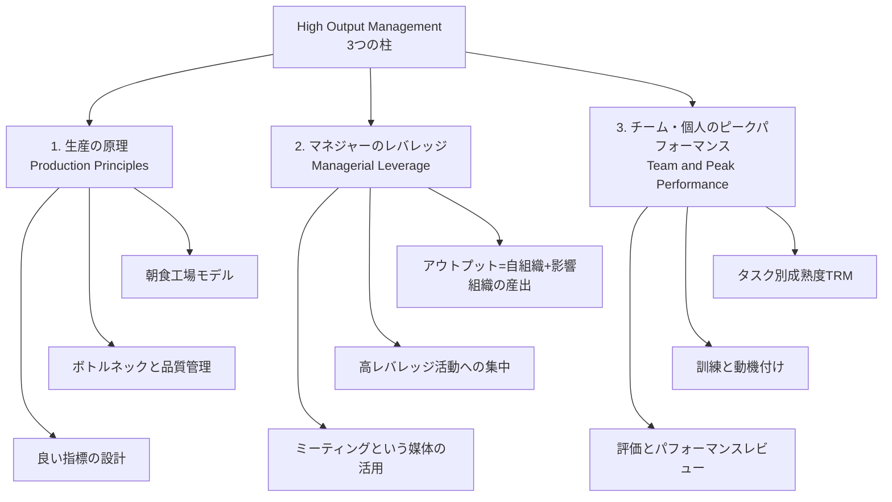
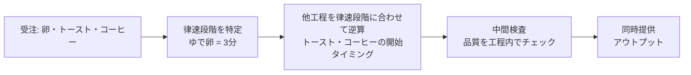
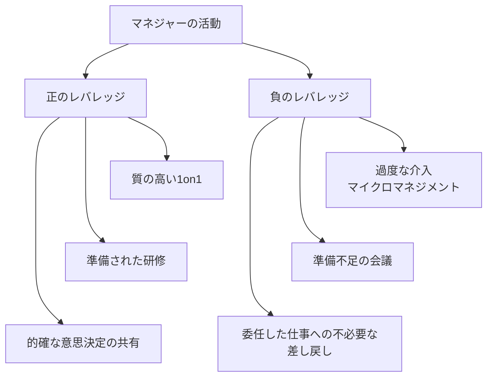
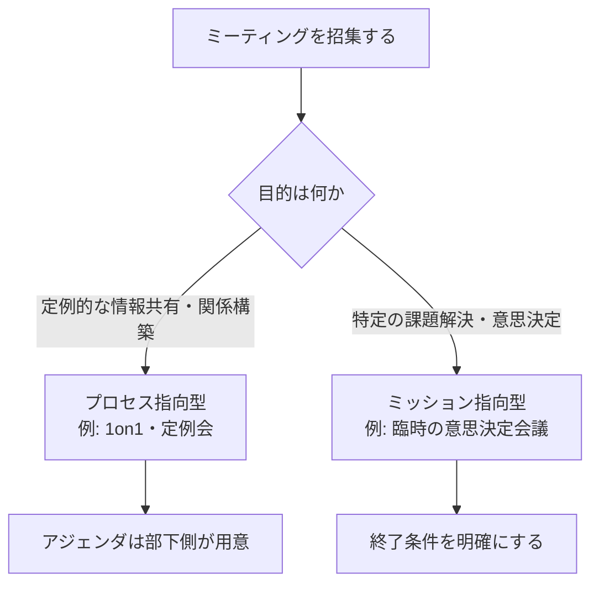
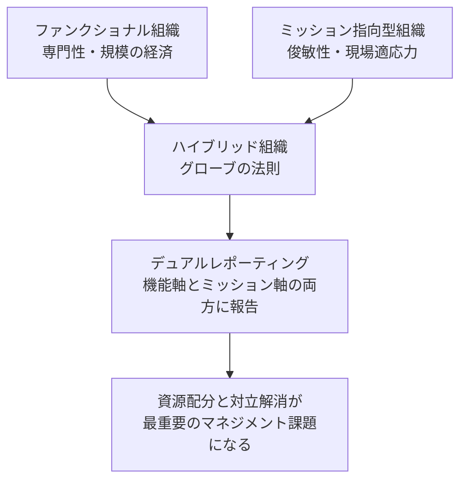
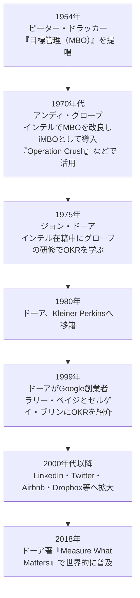
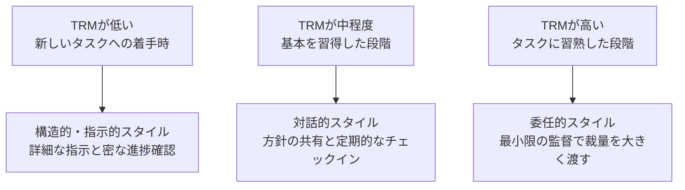

# 『HIGH OUTPUT MANAGEMENT』完全ガイド ― 初学者のためのステップバイステップ実践入門

> 原著: *High Output Management*（著者: アンドリュー・S・グローブ／Andrew S. Grove、初版1983年、改訂版1995年、新版2015年）

## 目次

1. [はじめに ― 著者アンディ・グローブとこの本について](#1-はじめに--著者アンディグローブとこの本について)
2. [本書が「シリコンバレーのバイブル」と呼ばれる理由](#2-本書がシリコンバレーのバイブルと呼ばれる理由)
3. [全体構造 ― 3つの柱](#3-全体構造--3つの柱)
4. [ステップ1: 生産の基本原則を理解する ― 「朝食工場」モデル](#ステップ1-生産の基本原則を理解する--朝食工場モデル)
5. [ステップ2: マネジャーの「アウトプット」を再定義する](#ステップ2-マネジャーのアウトプットを再定義する)
6. [ステップ3: レバレッジ（テコの原理）に集中する](#ステップ3-レバレッジテコの原理に集中する)
7. [ステップ4: ミーティングを「マネジメントの媒体」として使いこなす](#ステップ4-ミーティングをマネジメントの媒体として使いこなす)
8. [ステップ5: 意思決定と組織設計 ― ハイブリッド組織とグローブの法則](#ステップ5-意思決定と組織設計--ハイブリッド組織とグローブの法則)
9. [ステップ6: OKR（目標と主要な結果）を実践する](#ステップ6-okr目標と主要な結果を実践する)
10. [ステップ7: タスク別成熟度（TRM）でマネジメントスタイルを変える](#ステップ7-タスク別成熟度trmでマネジメントスタイルを変える)
11. [ステップ8: 人を育てる ― 訓練と動機付け](#ステップ8-人を育てる--訓練と動機付け)
12. [ステップ9: 評価とパフォーマンスレビュー](#ステップ9-評価とパフォーマンスレビュー)
13. [現代（2020年代後半）における意義](#4-現代2020年代後半における意義)
14. [実践チェックリスト](#5-実践チェックリスト)
15. [まとめ](#6-まとめ)
16. [参考文献](#7-参考文献)

---

## 1. はじめに ― 著者アンディ・グローブとこの本について

**アンドリュー・S・グローブ（Andy Grove、1936–2016）**は、ハンガリー・ブダペスト生まれ。ナチス占領下のハンガリーとソ連による弾圧を生き延び、1956年のハンガリー動乱の際に単身アメリカへ亡命しました。ニューヨーク市立大学（CCNY）で化学工学の学士号を、1963年にカリフォルニア大学バークレー校で化学工学の博士号を取得しています[^17][^18][^19]。フェアチャイルドセミコンダクターを経て1968年にインテルの創業に参画し、社員番号3番として入社。1979年に社長、1987年にCEO、1997年には会長に就任しました。同年、Time誌の「今年の人」にも選出されています[^2][^17]。2016年3月21日、カリフォルニア州ロスアルトスで逝去しました[^19]。

本書は1983年に初版が刊行されました。当時はベストセラーリストに載ることはありませんでしたが、その後シリコンバレーで読み継がれる「カルト的名著」となりました[^1]。1995年の改訂では、グローブ自身がグローバリゼーションと電子メールによる情報革命について新たな序文を加え、2015年版ではAndreessen Horowitz共同創業者のベン・ホロウィッツが新しい序文を執筆しています[^1][^3]。

対象読者は、原著のサブタイトルにもあるとおり「組織の中で忘れられがちな存在」であるミドルマネジャーですが、実際には新任リーダーから起業家、CEOまで幅広い層に読まれています。本ガイドでは、初めてこの本に触れる方でも実務にそのまま活かせるよう、原著の主要コンセプトをステップ形式で整理し、Mermaid図と表で視覚的に解説します。

---

## 2. 本書が「シリコンバレーのバイブル」と呼ばれる理由

本書は経営学者ではなく、実際にインテルを率いた経営トップ自身によって書かれた点が当時としては異例でした[^1]。この実務家としての説得力ゆえに、多くの著名な経営者・投資家・エンジニアリングリーダーから支持を集めています。

| 人物 | 立場 | コメントの要旨 | 出典 |
|---|---|---|---|
| ベン・ホロウィッツ（Ben Horowitz） | a16z共同創業者、2015年版の序文執筆者 | グローブを「今まで出会った中で最高の教師」と呼び、本書を高く評価 | [^3][^4] |
| マーク・ザッカーバーグ（Mark Zuckerberg） | Meta CEO | 自身のマネジメントスタイル形成に大きな影響を与えた一冊として言及 | [^1] |
| マーク・アンドリーセン（Marc Andreessen） | a16z共同創業者 | グローブを「シリコンバレーそのものを体現する人物」と評価 | [^15] |
| ビル・キャンベル（Bill Campbell） | 元Apple取締役、元Intuit CEO | 「すべての起業家とマネジャーが読み理解すべき聖典」と形容 | [^15] |
| ジョン・ドーア（John Doerr） | Kleiner Perkins会長、元インテル社員 | 本書が生んだOKRの仕組みを直接インテルで学び、後にGoogleへ導入 | [^11][^12] |
| ジュリー・ジュオ（Julie Zhuo） | 元Meta副社長（プロダクトデザイン） | 「簡潔で分かりやすく、良いマネジメントの本質を突いている」と評価 | [^15] |
| ブライアン・チェスキー（Brian Chesky） | Airbnb共同創業者・CEO | マネジメント技術を学ぶ際の主要な参考書として繰り返し言及 | [^15] |
| GitLab（オールリモート企業） | 企業事例 | 全社のマネジメント制度・1on1文化の設計思想の土台として採用 | [^7] |

このように、単なる懐かしの名著ではなく、**現在進行系で実務に使われ続けているフレームワーク**であることが、本書が「初学者が最初に読むべき経営書」として推奨され続ける理由です。

---

## 3. 全体構造 ― 3つの柱

グローブは本書を大きく3つのテーマで構成しています。まずは全体像をつかみましょう。

この3つの柱――**生産としてのマネジメント**、**レバレッジとしてのマネジメント**、**人を活かすマネジメント**――は互いに独立したものではなく、下のステップで見ていくように一つの実践体系としてつながっています。

---

## ステップ1: 生産の基本原則を理解する ― 「朝食工場」モデル

グローブは本書の冒頭40ページ近くを、マネジメントの話ではなく「生産」の話に費やします。象徴的に使われるのが、**3分間のゆで卵・トースト・コーヒーを同時に出す朝食店（＝朝食工場）**という思考実験です[^9][^16]。

このたとえの狙いは、「知識労働のような形のないアウトプットも、実は工場の生産プロセスと同じ構造で捉えられる」ということを体感させることにあります。

### 律速段階（限定ステップ）を見極める

複数の工程が並行して進むとき、全体の所要時間を決めるのは**もっとも時間のかかる工程**です。朝食工場の例では、コーヒーはすぐ沸き、トーストは1分で焼けますが、卵をゆでるのには3分かかります。したがって生産計画全体は卵の茹で時間を基準に組み立てる必要があります[^16]。この「もっとも長く、もっとも重要な工程」を起点に、逆算して他の工程を設計する考え方は、ソフトウェア開発のクリティカルパスや、ボトルネック分析と同じ発想です。

### 品質管理の考え方

グローブは検査を3種類に分類します。

| 検査の種類 | タイミング | 特徴 |
|---|---|---|
| 受入検査 | 原材料の入荷時 | 卵が腐っていないか、割れていないかを確認 |
| 工程内検査 | 生産の途中 | 破壊検査より非破壊検査（温度計での確認など）を優先 |
| 出荷前検査 | 完成時 | 最終確認だが、手遅れになりやすいため他の検査を重視 |

さらに、監視の頻度は「直近の品質実績」に応じて調整すべきだとされます（variable inspection＝変動検査）。品質が安定していれば検査頻度を下げ、不安定なら上げる、という動的な運用です。

### 良い指標を持つ

生産活動を管理するには、測定可能な指標が不可欠です。グローブは以下の5種類の指標を朝食工場の例で挙げています。

| 指標 | 何を測るか |
|---|---|
| 販売予測 | その日どれだけ売る計画か（アウトプットの需要） |
| 原材料在庫 | 予測を満たすだけの材料があるか |
| 人員 | 予測を満たすだけの人手が確保できているか |
| 設備の状態 | 機材の故障で生産が止まらないか |
| 品質指標 | クレームログなど、評判を損なう問題が起きていないか |

重要なのは「**ペアで指標を持つ**」という考え方です。ある指標だけを注視すると、その指標を改善しようとする行動に偏り、別の副作用を見落とします。たとえば在庫水準だけを下げようとすると、需要変動に対応できず欠品を招きます。効果と反作用を同時に測る「対の指標」を設計することで、過剰反応を防げます[^9]。

---

## ステップ2: マネジャーの「アウトプット」を再定義する

本書のもっとも有名な一文がこれです。

> **マネジャーのアウトプット = 自分の組織のアウトプット + 自分が影響を及ぼす隣接組織のアウトプット**

これは、個人としてどれだけ多くのタスクをこなしたかではなく、**自分がマネジメントする（あるいは影響を与える）チーム全体が生み出した成果**でマネジャーを評価すべきだという定義です[^9]。

サッカーやアメリカンフットボールの監督にたとえると分かりやすいでしょう。監督自身がボールを蹴ったり投げたりするわけではありませんが、その采配によってチーム全体の勝敗が決まります。マネジャーの価値も同様に、個人の作業量ではなく「チームが生み出した結果」で測られるべきだ、というのがグローブの主張です[^19]。

GitLabのようなフルリモート企業でも、この定義はマネジメント制度設計の土台として採用されています。マネジャーはチームを導いて成果を出すことを求められ、そのためにレバレッジの高い活動を選び取ることが仕事の核だとされています[^7]。

---

## ステップ3: レバレッジ（テコの原理）に集中する

マネジャーの1日は、会議・報告・意思決定・雑談など多様な活動で埋まりますが、それぞれの活動が生み出す成果は等しくありません。グローブはこれを**レバレッジ（テコの原理）**という概念で説明します。

$$
\text{アウトプット} = \sum_i L_i \times A_i
$$

（Lはある活動の持つレバレッジ＝テコの効き、Aはその活動に費やした時間や量）

つまり、マネジャーの成果を高める方法は「もっと働くこと」ではなく、**同じ時間でより高いレバレッジを持つ活動を選ぶこと**にあります。

### 高レバレッジ活動の3分類

| 種類 | 内容 | 具体例 |
|---|---|---|
| ① 多人数への影響 | 一人の行動が多くの人に影響を与える | 全社会議での方針発表、共通ツールの導入 |
| ② 長期間にわたる影響 | 一度の働きかけが長く効果を持続する | 適切なタイミングでのコーチング、優れた研修の設計 |
| ③ 固有情報の伝達 | ある人だけが持つ知識・情報が多くの人の仕事に影響する | 製品仕様の決定、価格戦略の共有 |

一方で、レバレッジは**負にもなり得る**点に注意が必要です。マネジャーが部下の仕事に過度に介入する「マイクロマネジメント」は、一見丁寧な指導に見えても、部下の主体性を奪い、かえって組織全体の出力を下げてしまいます[^16]。同様に、準備不足のまま会議に臨むことも、参加者全員の時間を無駄にする負のレバレッジ行為です。

委任（デリゲーション）もレバレッジを高める重要な手段ですが、「任せて放置する」ことではありません。次のステップ7で扱う**タスク別成熟度（TRM）**に応じて、モニタリングの度合いを調整することが求められます。

---

## ステップ4: ミーティングを「マネジメントの媒体」として使いこなす

多くのマネジャーは会議を「本来の仕事の邪魔をするもの」と捉えがちですが、グローブの主張は正反対です。**会議こそがマネジメントという仕事が実際に遂行される「媒体」である**という考え方です[^9]。情報収集、意思決定、部下への影響力の行使――これらはすべて何らかの会議やその場での対話を通じて行われるからです。

### 会議の2分類

| 種別 | 頻度 | 目的 | 具体例 |
|---|---|---|---|
| プロセス指向型ミーティング | 定期開催 | 知識・情報の共有、関係構築 | 1on1、スタッフミーティング、業務レビュー |
| ミッション指向型ミーティング | 随時開催 | 特定の問題解決、意思決定 | 障害対応会議、企画のすり合わせ |

### 1on1ミーティングを最大のレバレッジ源にする

グローブは1on1を「もっともレバレッジの高いミーティング」と位置付けています。ポイントは以下の通りです。

- アジェンダは上司ではなく**部下自身が用意する**
- 話す内容は「現在の課題」「今後の計画」「懸念していること」の3点を中心に据える
- 頻度は部下のタスク別成熟度（TRM、ステップ7で解説）に応じて調整する。経験の浅い部下ほど頻繁に

イギリスのFinancial Timesでテクノロジーリーダーを務めたアナ・シップマンは、この本を読んで1on1の価値観と、適正な会議時間についての自身の見方が大きく変わったと述べています[^8]。ベン・ホロウィッツも、マネジャーの仕事の多くは1on1における傾聴にあると強調しています[^10]。

---

## ステップ5: 意思決定と組織設計 ― ハイブリッド組織とグローブの法則

### 知識のパワーと地位のパワー

変化の速い知識産業では、組織図上の「地位によるパワー」と、実務に精通した人が持つ「知識によるパワー」が一致しないことが増えていきます。グローブはこの乖離を早くから指摘し、意思決定の質を保つには、地位に関係なく知識を持つ人の声を意思決定プロセスに組み込む必要があると論じました。

### ファンクショナル組織とミッション指向型組織

| 組織形態 | 強み | 弱み |
|---|---|---|
| ファンクショナル組織（機能別組織） | 専門性の集約による高いレバレッジ、規模の経済 | 意思決定が中央集権的で遅くなりがち |
| ミッション指向型組織（事業別組織） | 環境変化への迅速な対応、現場に近い意思決定 | 機能の重複によるコスト増、専門性の分散 |

### グローブの法則

> 共通の事業目的を持つ大規模組織は、最終的に必ず「ハイブリッド組織」に行き着く。

これがグローブの法則です。ファンクショナル組織の効率性とミッション指向型組織の俊敏性、その両方を得ようとすると、必然的に両者を組み合わせた**ハイブリッド（マトリクス）型組織**に収斂していく、という経験則です。

ハイブリッド組織を機能させる鍵は、機能別チームとミッション別チームの間で**資源配分とタイムリーな対立解消**を行う仕組みを持つことです。これは現在の「マトリクス組織」や、デザイン・エンジニアリング・プロダクトが横断的に連携する現代のプロダクト組織にも通じる考え方です。

---

## ステップ6: OKR（目標と主要な結果）を実践する

本書のもう一つの大きな遺産が、**OKR（Objectives and Key Results）**の原型です。現在Googleをはじめ多くのテック企業が採用しているこの目標管理手法は、実は本書で紹介された「インテル式目標管理（iMBO）」がルーツです[^1][^11]。

### OKRの系譜

ジョン・ドーアは1999年、Google社員がわずか40名程度だった頃、卓球台を囲んで自身のOKRの使い方をメタ的な実例として提示しながらこの手法を紹介したというエピソードが広く知られています[^12][^13][^14][^20]。それ以来、OKRはGoogleの企業文化に深く組み込まれ、その後LinkedIn・Airbnb・Dropbox・Uberなど数多くの企業に広がりました[^11]。

### OKRの基本構造

| 要素 | 問いかけ | 特徴 |
|---|---|---|
| Objective（目標） | 「どこに向かいたいか」 | 定性的で野心的、覚えやすい表現 |
| Key Results（主要な結果） | 「そこに向かっているかをどう測るか」 | 定量的で測定可能、通常2〜5個 |

グローブが重視したのは、目標を**ストレッチ（背伸びした）目標**として設定することです。100%達成を前提とせず、70%の達成度でも十分な前進とみなせるような、野心的な水準を狙うという発想が、OKRを単なる従来のノルマ管理と一線を画すものにしています[^11]。

---

## ステップ7: タスク別成熟度（TRM）でマネジメントスタイルを変える

グローブは「良い」「悪い」といったマネジメントスタイルの優劣を絶対視しません。工学出身らしく、**課題に応じて適切な道具を選ぶべき**という立場を取ります。その判断基準となるのが**タスク関連成熟度（Task-Relevant Maturity, TRM）**です。

TRMは「その人の人格的な成熟度」ではなく、**特定のタスクに対する経験・スキル・意欲の高さ**を指します。同じ人でも、タスクが変われば成熟度は変わります。

### TRMに応じたマネジメントスタイル

本書で紹介される有名な例が、優秀なフィールドセールス担当者がマネジャーに昇進したケースです。彼は営業というタスクに関してはTRMが非常に高かったものの、マネジメントという新しいタスクに関してはTRMが低い状態でした。適切なコーチングがないまま昇進した結果、彼は新しい役割で苦戦することになります[^9]。

この考え方は現在も広く引用されています。Andreessen Horowitzのブログでは、幹部社員であっても新しい業務領域ではTRMが低くなり得るため、状況によっては経営幹部に対しても細かい関与（マイクロマネジメント）が正当化される場合があると論じています[^5]。同社の別の記事でも、グローブの経営者としての姿勢が「アンディ・グローブ的属性」として、CEOとしての力量の一つのモデルとして参照されています[^6]。

---

## ステップ8: 人を育てる ― 訓練と動機付け

本書の最終章は「なぜ訓練は上司の仕事なのか（Why Training Is the Boss's Job）」というタイトルです。グローブはここで、**訓練（トレーニング）はマネジャーが行い得る最も高レバレッジな活動の一つ**だと結論づけています。一度の質の高い研修は、それを受けた全員の生産性を長期間にわたって押し上げるからです[^9]。

知識労働の現場では「優秀な人材だから訓練は不要」という思い込みが起きがちですが、グローブはこれを明確に否定します。単純な業務であっても訓練不足の従業員に顧客が苛立つのだから、複雑な業務であればなおさら訓練の欠如は致命的だ、という論理です[^4]。

### モチベーションと「運動場としての職場」

グローブは職場を運動場（playing field）に、部下をアスリートにたとえます。アスリートが自己ベストの更新を目指すように、部下にも「限界まで自分の力を発揮したい」という内発的な動機を引き出す環境を用意することが、マネジャーの重要な役割だとされます。これは外的な報酬（extrinsic motivation）だけでなく、達成感や成長実感といった内発的動機（intrinsic motivation）を重視する考え方です。

---

## ステップ9: 評価とパフォーマンスレビュー

グローブは、パフォーマンスレビュー（人事評価面談）を「マネジャーが提供できる、もっとも重要なタスク関連フィードバックの形」と位置付けています。目的は2つあります。

1. 改善すべきスキルを明確にすること
2. 動機付けを強化すること

評価面談で心がけるべき原則として、しばしば「**3つのL**」として要約されます[^13]。

| 原則 | 内容 |
|---|---|
| Level（対等に） | 部下を見下ろすのではなく、対等な立場で率直に語る |
| Listen（聴く） | 一方的な通告ではなく、部下の受け止め方や意見を聴く |
| Leave yourself out（自分を脇に置く） | 自分自身のキャリアや経験と比較して評価しない |

マネジャーは部下の仕事ぶりを「観察して記録する」だけの存在ではなく、**判断を下す責任**を負っています。評価を曖昧にせず、はっきりとした基準で判断することが、部下の成長機会を守ることにつながるとグローブは説きます。

---

## 4. 現代（2020年代後半）における意義

出版から40年以上が経過した現在も、本書のフレームワークは色褪せていません。

- **OKRの浸透**: Googleでの成功を起点に、OKRは現在も世界中のテクノロジー企業の標準的な目標管理手法として使われ続けています[^11]。
- **エンジニアリングリーダーシップ界隈での参照**: Stripe・Uber・Calmなどでエンジニアリング組織を率いたウィル・ラーソン（Will Larson、著書『An Elegant Puzzle』）は、自身のポッドキャストの中で、本書が定義した「ノウハウ・マネジャー（know-how manager）」――正式な部下を持たずとも知識で他者の仕事に影響を与える存在――という概念に言及しています[^21]。
- **フルリモート企業のマネジメント制度の基盤**: GitLabは自社ハンドブックの中で、本書を「お気に入りの一冊」とし、1on1文化やノーマトリクス組織の設計思想の土台としていることを明記しています[^7]。
- **マイクロマネジメント論の再解釈**: a16zは、TRMの概念を使って「幹部社員への一時的な深い関与は、必ずしも悪いマイクロマネジメントではない」という現代的な議論を展開しています[^5]。
- **技術書評ブログでの継続的な言及**: Anna Shipman、Luca Rossi（TRMの要約）、Ian Tien（Mattermost共同創業者、スタンフォードでグローブのTA経験者）など、実務家による書評・要約が今も書かれ続けています[^8][^9][^22]。

このように、本書は単なる歴史的名著ではなく、**現在進行系でシリコンバレーのマネジメント実務に組み込まれ続けているフレームワーク**だと言えます。

---

## 5. 実践チェックリスト

| チェック項目 | 確認内容 |
|---|---|
| □ 自分のアウトプットを定義したか | 個人の作業量ではなく、チーム＋影響範囲の成果で自分の価値を語れるか |
| □ 律速段階を把握しているか | チームのプロセスにおいて、もっとも時間のかかる/重要な工程はどこか |
| □ 対の指標を設計しているか | ある指標を追うことで生じる副作用を測る指標もセットで持っているか |
| □ 高レバレッジ活動に時間を割いているか | 1日の活動を振り返り、正のレバレッジ／負のレバレッジを仕分けできるか |
| □ 1on1のアジェンダを部下に委ねているか | 部下自身が課題・計画・懸念を持ち込む場になっているか |
| □ 会議の種類を意識しているか | プロセス指向とミッション指向を区別し、目的なき会議を減らせているか |
| □ TRMに応じて委任の度合いを調整しているか | 部下ごと・タスクごとに指示の密度を変えているか |
| □ OKRのObjectiveとKey Resultsを分けて書けているか | 定性的な目標と定量的な成果指標が混同されていないか |
| □ 訓練を「自分の仕事」として位置付けているか | 研修や育成をHR任せにせず、自らの高レバレッジ活動として実行しているか |
| □ 評価面談で3つのLを意識しているか | 対等に、聴く姿勢で、自分を基準にせず評価できているか |

---

## 6. まとめ

『HIGH OUTPUT MANAGEMENT』は、マネジメントという曖昧になりがちな仕事を、**生産システムとして構造化して捉え直す**という一貫した視点を持つ本です。

- マネジャーの成果は個人の作業量ではなく、**自組織＋影響範囲のアウトプット**で測る
- すべての活動には**レバレッジ（テコの効き）**があり、高レバレッジな活動を選び取ることが成果を左右する
- 会議は無駄ではなく、**マネジメントという仕事が実行される媒体**である
- 組織は最終的に**ハイブリッド型**に収斂し、資源配分と対立解消が中心課題になる
- 目標管理は**OKR**という形で体系化され、Googleを経て世界中に広まった
- 部下への関わり方は、その人の**タスク別成熟度（TRM）**に応じて調整すべきである
- **訓練**は人事部の仕事ではなく、マネジャー自身のもっとも高レバレッジな仕事である

これらは特別な理論というより、著者自身がインテルという巨大企業を率いる中で試行錯誤して磨いた「現場の知恵」の集積です。だからこそ、40年以上経った今もエンジニアリング組織のリーダーたちに読まれ続けているのだといえるでしょう[^23]。

---

## 7. 参考文献

[^1]: High Output Management (Wikipedia) — https://en.wikipedia.org/wiki/High_Output_Management
[^2]: Andrew Grove (Wikipedia) — https://en.wikipedia.org/wiki/Andrew_Grove
[^3]: Andy | Andreessen Horowitz（ベン・ホロウィッツによる序文の再掲） — https://a16z.com/andy/
[^4]: Andy. Introduction to High Output Management, by Ben Horowitz (Medium) — https://medium.com/software-is-eating-the-world/andy-37e10d4780bc
[^5]: On Micromanagement | Andreessen Horowitz — https://a16z.com/on-micromanagement/
[^6]: Notes on Leadership | Andreessen Horowitz — https://a16z.com/notes-on-leadership/
[^7]: High Output Management | GitLab Handbook — https://handbook.gitlab.com/handbook/leadership/high-output-management
[^8]: High output management | Anna Shipman (JFDI) — https://www.annashipman.co.uk/jfdi/high-output-management.html
[^9]: Top Takeaways from Andy Grove's High Output Management | Ian Tien (Medium) — https://medium.com/@iantien/top-takeaways-from-andy-grove-s-high-output-management-2e0ecfb1ea63
[^10]: Andy Grove's High Output Management approach to 1 on 1s | Lighthouse — https://getlighthouse.com/blog/high-output-management/
[^11]: Who invented OKRs? A complete OKR history from Intel to the AI era | Tability — https://www.tability.io/odt/articles/a-complete-okr-history-from-intel-to-the-modern-workplace
[^12]: John Doerr on OKRs: Original Interview + Expert Insights | Betterworks — https://www.betterworks.com/magazine/keys-okr-success-qa-john-doerr
[^13]: High Output Management by Andrew Grove: Book Summary | Tyler DeVries — https://tylerdevries.com/book-summaries/high-output-management/
[^14]: How VC John Doerr Sets (and Achieves) Goals | Harvard Business Review — https://hbr.org/2018/05/how-vc-john-doerr-sets-and-achieves-goals
[^15]: High Output Management | The CEO Library — https://theceolibrary.com/high-output-management-3809.html
[^16]: High Output Management by Andy Grove | Abi Tyas Tunggal — https://tyastunggal.com/p/high-output-management-by-andy-grove
[^17]: Andrew S. Grove | California Museum — https://californiamuseum.org/inductee/andrew-s-grove/
[^18]: 100 Famous UC Berkeley Alumni | DigitalDefynd — https://digitaldefynd.com/IQ/famous-berkeley-alumni/
[^19]: Remembering Andy S. Grove | Computer History Museum — https://computerhistory.org/blog/remembering-andy-s-grove/
[^20]: AMA with John Doerr | Stripe — https://stripe.com/fr-be/guides/atlas/ama-john-doerr
[^21]: Will Larson (Calm) | StaffEng Podcast — https://podcast.staffeng.com/season-1/will-larson-calm/
[^22]: Recommended links about engineering leadership | Joel Chippindale — https://blog.mocoso.co.uk/links/leadership/
[^23]: High Output Management Book Review | James Ingold — https://jamesingold.com/books/high-output-management

---

*本ページは上記の一次・二次情報源を参照した学習支援ログです。原著の正確な内容は必ず原著（Andrew S. Grove, *High Output Management*, Vintage Books）をご確認ください。*
