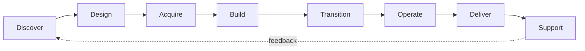
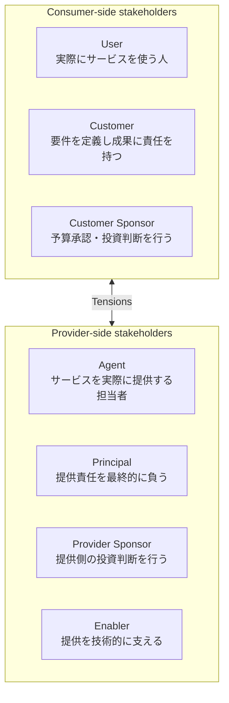
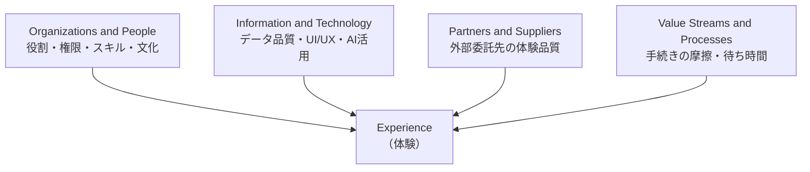
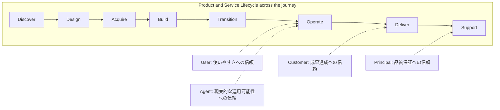
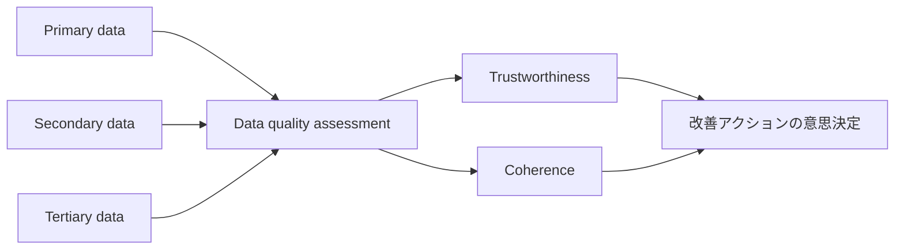
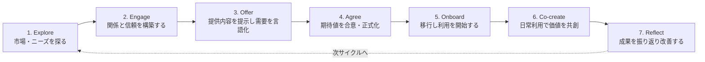
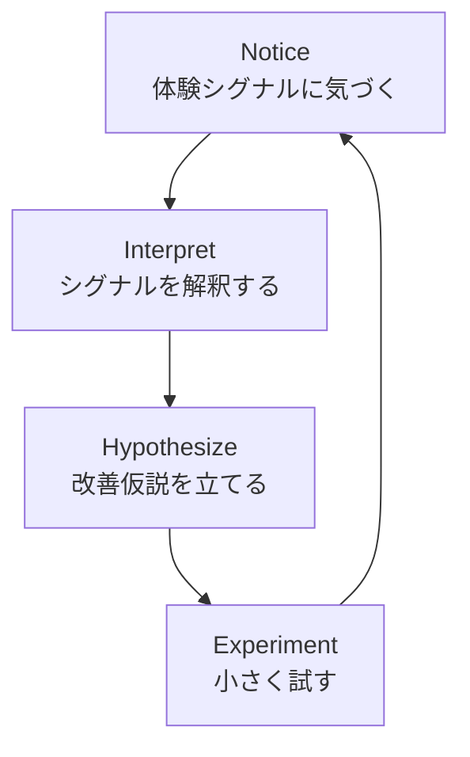
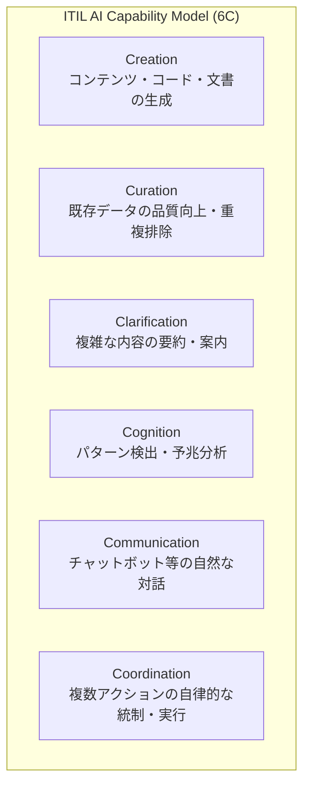

# ITIL® Experience (Version 5) 学習ガイド

> 世界トップクラスのソフトウェアエンジニア兼スクラムマスターの視点から、初学者にもわかりやすいステップバイステップ形式で ITIL® Experience (Version 5) の出題範囲を解説します。各トピックは **定義 → 理由 → 具体例 → 図解/表** の順で構成し、実務で使えるベストプラクティスと根拠ソースを付記しています。

---

## 0. この試験は何か ── 全体像をつかむ

### 0.1 定義

**ITIL® Experience (Version 5)** は、PeopleCert が認定する ITIL (Version 5) 資格体系の中の **Managing Professional (MP) ストリーム** を構成するモジュール資格の1つです。公式ページの説明では、次のように位置づけられています。

> "ITIL Experience (Version 5) offers you the expertise you need to embed human‑centered and AI‑aware design across digital products and services." （人間中心かつ AI を意識した設計を、デジタル製品・サービス全体に組み込む専門知識を提供する）

つまりこの資格は、「サービスが機能的に正しく動くこと」だけでなく、**「そのサービスを使う人がどう感じ、どう信頼し、どう価値を認識するか」** をマネジメントする専門知識を認定するものです。

### 0.2 なぜこの資格が必要なのか（理由）

- ITIL 4 までの ITSM フレームワークは「プロセスが正しく回っているか」に重点がありました。
- ITIL (Version 5) は **Digital Product and Service Management (DPSM)** へと軸足を移し、AI ネイティブ化・プロダクト中心思考とあわせて、**Experience（体験）を独立した管理対象** として初めて体系化しました。
- 現代の SaaS・デジタルプロダクトでは、SLA を満たしていても「使いにくい」「信頼できない」と感じられれば解約・離反（チャーン）につながります。Experience を測定・改善できる人材が、Product Owner・Solutions Architect・Service Delivery Manager などの役割で高く評価されます。

### 0.3 対象者・前提資格・キャリアパス

| 項目 | 内容 |
|---|---|
| 対象者 | デジタル製品・サービスを **指揮・開発・提供** する専門家。「機能的な成功だけでは不十分」と認識している人 |
| 前提資格（必須） | 次のいずれか1つ：①任意の ITIL 4 資格（Foundation 以上）／② ITIL Foundation (Version 5)／③ ITIL Foundation Bridge (Version 5) |
| 学習形態要件 | 認定トレーニング機関（ATO）経由の研修、または ITIL Official eLearning の修了が必要（**修了証明がないと結果が発表されない**） |
| 代表的なキャリアパス | Experience Lead／Solutions Architect／Product Owner／Business Relationship Manager／Digital Transformation Manager／AI Governance Manager／Integration Manager／IT Director／Chief Digital Officer |
| MP ストリームでの位置づけ | ITIL Experience／ITIL Product／ITIL Service／ITIL Transformation の4モジュールを揃えると ITIL Managing Professional の称号を取得できる |

> ✅ **ベストプラクティス**：ITIL Foundation (Version 5) をまだ取得していない場合は、先に `/areas/itil5-foundation-guide.md` 相当の基礎（ITIL VS・Four Dimensions・Guiding Principles・Product and Service Lifecycle）を固めてから本ガイドに進むこと。Experience の syllabus は Foundation の用語を前提に進みます。

**出典**：
- PeopleCert 公式製品ページ: https://www.peoplecert.org/browse-certifications/it-governance-and-service-management/ITIL-1/itil-experience-version-5-4177
- 前提資格の詳細（Oxford College of Technology）: https://www.oxfordcollegeoftechnology.com/itil-version-5/itil-experience-version-5/

---

## 1. 試験概要（Exam Overview）

### 1.1 試験形式

| 項目 | 内容 |
|---|---|
| 出題数 | 40問（各1点、減点方式なし） |
| 試験時間 | 90分（母国語・業務言語以外で受験する場合は25%延長＝113分） |
| 出題形式 | 選択式（Objective Test Questions） |
| 合格基準 | 70%（28/40 問）※後述の注記を参照 |
| 教材持ち込み | **オープンブック**：ITIL® Experience (Version 5) Official Book のみ持ち込み可（書き込み可）。それ以外の教材は不可 |
| シナリオ | **ITIL Car Rental Scenario**（レンタカー事業）を題材とする。最低1問は Scenario の "Experience" パートを参照する必要がある |
| 言語 | 英語・中国語・フランス語・イタリア語・ポーランド語・ポルトガル語（ブラジル）・スペイン語 など8言語 |

> ⚠️ **重要な注記（一次資料の透明性）**：2026年2月発行の公式シラバス（Version 5.0 PL＝パイロット版）には、合格点・カテゴリ配点・Bloom's Level 配分がいずれも **「TBC（Το Be Confirmed）」** と明記されています。一方で、現行の PeopleCert 公式製品ページでは合格ラインが **70%** と明示されています。本ガイドは現行の製品ページの数値を採用しつつ、ベータ版シラバスの段階では数値が確定していなかった経緯を透明性のために残しています。受験直前は必ず PeopleCert 公式ページで最新の合格基準を確認してください。

### 1.2 Bloom's Level（BL）── 出題の「思考レベル」

ITIL (Version 5) の試験は、単純暗記だけでなく「理解」「応用」「分析」まで問う設計になっています。各設問には次の4段階の Bloom's Level（BL）が割り当てられます。

| BL | 動詞の例 | 求められる思考 |
|---|---|---|
| BL1 | Define / Identify | 用語や概念を **思い出す**（再認・再生） |
| BL2 | Describe / Explain / Understand | 概念を **理解し説明できる** |
| BL3 | Apply | 実際のシナリオに概念を **適用できる** |
| BL4 | Analyse / Distinguish / Differentiate | 情報を **分析し、行動の妥当性を判断できる** |

ITIL Experience の syllabus では BL1〜BL4 すべてが使用され、多くの Assessment Criteria が **BL2（理解）** を基礎として設計されています。BL3（適用）と BL4（分析）は「Stakeholder role mapping」「経験の摩擦点の分析」「継続的改善ループの適用」などピンポイントで登場します。

### 1.3 設問タイプ（4種類）

| タイプ | 特徴 |
|---|---|
| Standard | 設問文＋選択肢4つから1つ選ぶ、最も一般的な形式 |
| Negative | Standard 問題の設問文が否定形（"NOT" など）になったもの。**「やってはいけないこと」を問う学習目標がある場合のみ** 例外的に使用 |
| Missing word(s) | 文中の空欄に当てはまる語句を4択から選ぶ |
| List | 4つの記述のうち **正しいものを2つ** 選ぶ（例：「1と2」「2と3」など組み合わせで解答） |

> ✅ **ベストプラクティス（試験対策）**：List 形式は「2つとも正しい組み合わせ」を選ぶため、消去法よりも各記述を個別に○×判定してから組み合わせを絞り込む方が正答率が上がる。Negative 形式は問題文をよく読み、「NOT」「除く」などの否定語を見落とさないこと。

**出典**：
- 公式シラバス PDF（Version 5.0 PL, February 2026）: https://www.oxfordcollegeoftechnology.com/wp-content/uploads/2026/03/ITIL-Version-5-Experience-Syllabus.pdf
- 合格ライン・受講対象者（Torque IT）: https://torque-it.com/product/itil-experience-version-5-including-exam/

---

## 2. 前提となる基礎概念のリフレッシュ（Syllabus Category 1.1）

Experience の syllabus は「Category 1: Key ITIL terms and definitions」の中で、Foundation で学ぶ以下5つの概念を土台として再確認することから始まります。すべて **BL2（Explain/Describe/Understand）**。

### 2.1 ITIL Guiding Principles（ITIL指導原則）

#### 定義

組織の状況によらず、あらゆる意思決定を導く7つの推奨事項。

| 原則 | 一言でいうと |
|---|---|
| Focus on value | すべての活動を価値創出に結びつける |
| Start where you are | ゼロから作らず、既存の資産・データを評価する |
| Progress iteratively with feedback | 大きく作りすぎず、小さく作ってフィードバックを得る |
| Collaborate and promote visibility | 関係者を巻き込み、作業を可視化する |
| Think and work holistically | 部分最適ではなく全体最適で考える |
| Keep it simple and practical | 必要最小限で実用的な方法を選ぶ |
| Optimize and automate | 人手作業を最適化してから自動化する |

#### Experience 文脈での理由

Experience management は「Start where you are（既存の体験データを評価する）」「Progress iteratively with feedback（小さく試して学ぶ）」と特に強く結びつきます。後述の **notice–interpret–hypothesize–experiment ループ**（4.5節）はこの2原則の具体的な実装形と言えます。

### 2.2 Product・Service・Digital Product/Service の定義

| 用語 | 定義 |
|---|---|
| Product | リソースを構成し、consumer に価値を提供できる状態にしたもの |
| Service | consumer が特定のコストやリスクを自ら負担することなく、望む成果を得られるようにする手段 |
| Digital product / Digital service | デジタル技術を主たる価値提供手段とする product / service |

### 2.3 ITIL Product and Service Lifecycle（8段階）

ITIL 4 の Service Value Chain（6活動）を置き換える、より詳細な8活動モデル。Experience の文脈では、この8段階の **どのステップでも "experience moments"（体験の瞬間）が発生しうる** という前提が重要です（4.3節で詳述）。

### 2.4 ITIL Four Dimensions of Product and Service Management

| 次元 | 内容 |
|---|---|
| Organizations and people | 組織構造・文化・スキル（Version 5 では "Organizations, people and AI" セクションを含む） |
| Information and technology | 情報管理・技術・**ITIL AI Capability Model（6C）**（5章で詳述） |
| Partners and suppliers | パートナー・サプライヤーとの関係 |
| Value streams and processes | 価値創出の一連の活動とプロセス |

### 2.5 ITIL Value System（ITIL VS）

Guiding Principles・Governance・Product and Service Lifecycle・Practices・Continual Improvement を包含する、組織全体の価値創出システム全体像。

**出典**：
- ITIL (Version 5) の変更点まとめ（Four Dimensions・6Cモデル等）: https://itsm.tools/itil-version-5-vs-itil-4-key-changes/
- ITIL Version 5 vs ITIL 4 比較: https://certempire.com/itil-4-vs-itil-5/

---

## 3. Experience の主要概念（Syllabus Category 1.2）── BL2

### 3.1 「Experience（体験）」を人間の反応として定義する

#### 定義

ITIL (Version 5) における Experience とは、単なる「満足度」ではなく、**anticipation（予期）・perception（知覚）・evaluation（評価）** という3つのプロセスを通じて生まれる、**feelings（感情）・thoughts（思考）・bodily states（身体的反応）** の総体として定義されます。

#### なぜこの定義が重要か（理由）

- 「体験＝アンケートの点数」という誤解を避けるため。ITIL は Experience を **人間の内的反応そのもの** として扱い、測定値（メトリクス）はその反応の一部を映す "仮説" にすぎないと位置づけます（3.1.2 で詳述）。
- この定義があるからこそ、後述の「Experience Capture は本質的に不完全である」という重要な考え方（4.1節）が導き出されます。

#### 具体例

レンタカー予約アプリ（Car Rental Scenario）で、ユーザーが予約完了画面を見た瞬間：
- **Anticipation**：予約前に「スムーズに終わるだろう」と期待していた
- **Perception**：実際の画面の読み込み速度・UI のわかりやすさを知覚する
- **Evaluation**：期待と実際を比較し、「思ったより早かった」「逆に不安になった」など評価が生まれる

この一連の流れが Experience（体験）そのものであり、単一の CSAT スコアではその一部しか捉えられません。

### 3.2 Digital Experience と Digital Experience System

#### 定義

Digital experience（デジタル体験）とは、デジタル製品・サービスとのインタラクションに対する feelings・thoughts・bodily responses（身体反応）。これが積み重なって **digital experience system**（デジタル体験を生み出す一連の要素の集合）を構成します。

#### なぜ重要か

Trust（信頼）と Value（価値）は、機能要件の充足だけでは生まれません。ログイン画面の応答速度、通知のトーン、エラーメッセージの分かりやすさなど、**一つひとつのデジタル接点の質の総和** が信頼と価値co-creation（共創）を左右します。

> ✅ ベストプラクティス：デジタルプロダクトの UX 改善プロジェクトでは、機能要件（Functional Requirement）のチェックリストとは別に「Experience チェックリスト」（応答速度・トーン・エラー文言・通知頻度など）を用意し、Design レビューで両方を確認する。
> ❌ アンチパターン：SLA・可用性などの機能指標のみをダッシュボードで追跡し、ユーザーの感情的反応を測る仕組みを一切持たない。

**出典**：ITIL Experience の UX への焦点解説（itil.com）: https://www.itil.com/Itil-News-and-Announcements/itil-version-5-experience-user-experience

---

## 4. ITIL Experience（Syllabus Category 2）── 体験のフレームワーク全体像

### 4.1 主要ステークホルダーと「Tensions（緊張関係）」── BL2

#### 定義

ITIL Experience は、consumer 側・provider 側それぞれに複数の役割を定義し、役割間に **必然的に生じる利害の緊張関係（tension）** を明示的に扱います。

#### Consumer 側の役割

| 役割 | 定義 | 典型的な Tension |
|---|---|---|
| User | サービスを日常的に使用する人 | 「使いやすさ」を最優先したいが、Customer が求める機能要件と衝突することがある |
| Customer | サービスの要件を定義し、消費から得られる成果に責任を持つ | User の体感と、組織として求める成果指標（KPI）の間で板挟みになりやすい |
| Customer Sponsor | サービス利用の予算・投資判断を承認する | コスト最適化を優先し、User/Customer が求める体験投資と衝突しうる |

#### Provider 側の役割

| 役割 | 定義 | 典型的な Tension |
|---|---|---|
| Agent | 実際にサービスを提供する担当者・チーム | 現場の制約（工数・技術的負債）と Principal が約束した品質水準の間で板挟み |
| Principal | 提供に対する最終的な説明責任を負う | 収益性と Experience 投資のトレードオフに直面する |
| Provider Sponsor | 提供側での投資判断を行う | 短期的な ROI と長期的な信頼構築のバランスを取る必要がある |
| Enabler | 技術基盤・ツールで提供を下支えする | 技術的な理想解と、Agent が実際に運用できる複雑さの間で衝突する |

#### なぜ Tension を明示するのか（理由）

体験は「誰か一人の満足」では測れません。Customer が満足していても User が不満なら Experience は失敗です。ITIL Experience はこの **構造的な利害対立を隠さず可視化する** ことで、改善の優先順位付けを現実的にします。

> ✅ ベストプラクティス：Experience 改善の施策を立てる際は、必ず「誰の Experience が良くなり、誰の Tension が高まるか」を1枚のステークホルダーマップに書き出してからレビューする。
> ❌ アンチパターン：「顧客満足度が上がった」という単一指標だけで施策の成功を判断し、User と Customer Sponsor の間の相反する反応を見落とす。

**出典**：ITIL Experience 役割定義（The Knowledge Academy コースアウトライン）: https://www.theknowledgeacademy.com/courses/itil-training/

---

### 4.2 Experience と ITIL Four Dimensions ── BL2〜BL3

#### 定義

Experience は独立した1機能ではなく、**Four Dimensions すべてに統合され、反映される** という考え方（Assessment Criteria 2.2.1、BL2）。さらに Four Dimensions を「Governance のレンズ」として Experience 改善に **適用する**（2.2.6、BL3）ことが求められます。

#### 各次元での改善アプローチ

| 次元 | Experience 改善の着眼点（理由） | 具体例 |
|---|---|---|
| Organizations and people | 誰が Experience に責任を持つかを明確にしないと、改善が誰の仕事でもなくなる | Experience Lead というロールを新設し、Product Owner と連携させる |
| Information and technology | データ品質が低いと、体験を「測っているつもり」で実は測れていない状態に陥る | AI（6Cモデル）を活用してサポートチケットの感情トーンを分類する |
| Partners and suppliers | 外部委託先の対応品質は、consumer からは自社の体験として一体的に評価される | サプライヤー契約に Experience 関連の品質基準（応答トーン等）を含める |
| Value streams and processes | プロセスのステップ数・待ち時間そのものが体験の摩擦（friction）源になる | オンボーディングの承認ステップを7→3に削減し、Onboard フェーズの離脱率を下げる |

> ✅ ベストプラクティス：Four Dimensions を「ガバナンスのレンズ」として使う際は、四半期ごとのレビューで4次元それぞれに対して「今期、Experience の観点で何を変えたか」を1行ずつ記録する。
> ❌ アンチパターン：Information and Technology の次元（ツール導入）だけに投資し、Organizations and people（誰が責任を持つか）を放置する。

**出典**：Information and Technology 次元と AI 統合の解説: https://www.pmgacademy.com/en/articles/itil/information-and-technology-in-itil-version-5-the-guide-for-the-ai-era-and-data-governance/

---

### 4.3 ITIL Product and Service Lifecycle の中での Experience ── BL2〜BL4

#### 定義：Value Chain Activities が生む "Experience Moments"

8段階の Product and Service Lifecycle（2.3節参照）の **どの活動でも** experience moments（体験の瞬間）が発生します（Assessment Criteria 2.3.1、BL2）。

#### Functional Interactions と Relational Interactions の違い（重要：BL4で差別化が問われる）

| 種類 | 定義 | 具体例 |
|---|---|---|
| Functional interaction（機能的インタラクション） | タスクを完了させるための、目的志向のやり取り | 車を予約する、支払いを完了する、パスワードをリセットする |
| Relational interaction（関係的インタラクション） | 信頼・関係性の構築に関わる、感情面を含むやり取り | サポート担当者との会話、謝罪メール、ロイヤルティプログラムの案内 |

> 💡 試験対策メモ：Assessment Criteria 2.3.5 は「Differentiate functional vs. relational interactions」と明記されており **BL4（分析・差別化）** です。「このシナリオの行動は機能的か関係的か」を判定させる設問が出やすいポイントです。

#### 典型的な Experience Frictions（摩擦）と緩和策（Assessment Criteria 2.3.3、BL4：分析して緩和策を提案する）

| Friction（摩擦） | 発生しやすい Service Journey 段階 | 緩和策（ベストプラクティス） |
|---|---|---|
| Broken expectations（期待の破綻） | Agree／Onboard | Agree 段階で SLA・体験の期待値を明文化し、Onboard 前にレビューする |
| Unclear agreements（不明確な合意） | Agree | サービスアグリーメントに「体験面の合意事項」（応答時間、トーン等）も含める |
| Poor reflection loops（振り返りループの欠如） | Reflect | 定期的な Reflect ステップを制度化し、フィードバックを次サイクルの Design にフィードバックする |

#### Stakeholder Role Mapping の適用（Assessment Criteria 2.3.4、BL3：適用）

Journey の各ステップで、User／Customer／Customer Sponsor／Agent／Principal／Provider Sponsor／Enabler が **異なる Trust Requirement（信頼要件）** を持つことをマッピングします。

> ✅ ベストプラクティス：新サービスをリリースする前に、Discover〜Support の各段階で「この段階で、どのステークホルダーの、どんな信頼が試されるか」を一覧化するワークショップを実施する。
> ❌ アンチパターン：Design段階でUXレビューを行い満足して終わり、Support段階（障害対応時のトーン等）の体験設計を後回しにする。

**出典**：
- Value Chain Activities と Experience の関係（Advanced Training コース概要）: https://advancedtraining.com.au/product/itil-experience-version-5/
- ITIL Managing Professional Transition コースアウトライン（Module 3 詳細）: https://www.itil.org.uk/training/itil-managing-professional-certification/itil-5-managing-professional-transition-training-course

---

## 5. Experience の捕捉（Capturing Experience）（Syllabus Category 3）

### 5.1 Experience Capture の基本概念と「メトリクスは仮説である」── BL2

#### 定義

Experience Capture（体験の捕捉）とは、人間の内的反応（3.1節参照）を、観測可能なデータへと変換する試みです。

#### なぜ「メトリクスは仮説」なのか（極めて重要な理由）

Experience は本質的に主観的・多面的な人間の反応であり、**どのようなメトリクス（CSAT・NPS・行動ログなど）も、その反応の一部しか捉えられません**。ITIL (Version 5) はこれを率直に認め、「メトリクスは人間の体験全体を代表する仮説（hypothesis）にすぎない」と位置づけます（Assessment Criteria 3.1.2）。

> ✅ ベストプラクティス：単一の指標（例：NPS）だけで意思決定せず、複数の Evidence（証拠）を組み合わせて「仮説の確からしさ」を評価する。
> ❌ アンチパターン：NPSスコアが1ポイント上下しただけで、Experience が「改善した／悪化した」と断定する。

### 5.2 4つの Experience Domains（体験ドメイン）── BL1〜BL2

| ドメイン | 定義 | 具体例 |
|---|---|---|
| Personal（個人的） | 個人の内的な感情・思考・身体反応 | 「このアプリを使うとイライラする」という個人の感覚 |
| Functional（機能的） | タスク達成の効率性・有効性に関する体験 | 「3クリックで予約が完了した」という機能面の体験 |
| Relational（関係的） | 信頼・関係性構築に関する体験 | 「サポート担当者が親身に対応してくれた」という関係面の体験 |
| Contextual（文脈的） | 状況・環境要因に依存する体験 | 「深夜に緊急で使ったので、応答速度が特に重要だった」という文脈依存の体験 |

> 💡 試験対策メモ：4つの Experience Domains は Category 3（Assessment Criteria 3.1.3, BL2）と Category 4（Assessment Criteria 4.1.3, BL1）の **両方** に登場します。Category 4 側では「Identify（識別する）」という BL1 の動詞になっている点に注意（暗記寄りの設問になりやすい）。

### 5.3 Experience Evidence（証拠）の種類・情報源・データの3層構造 ── BL2

#### データの3層構造（Three Tiers of Data）

| 層 | 定義 | 具体例 |
|---|---|---|
| Primary data（一次データ） | 直接観測された生データ | アプリの操作ログ、通話の録音 |
| Secondary data（二次データ） | 一次データを加工・集約したもの | 週次の平均応答時間レポート |
| Tertiary data（三次データ） | 二次データをさらに解釈・統合した知見 | 「オンボーディング体験全体のトレンド分析」 |

#### Numerical Signals と Narrative Signals（数値シグナルと物語的シグナル）

| シグナル種別 | 内容 | 強み | 弱み |
|---|---|---|---|
| Numerical（数値） | CSAT スコア、応答時間、離脱率など | 集計・比較・トレンド分析がしやすい | 「なぜそうなったか」という文脈が失われがち |
| Narrative（物語的） | サポート会話の逐語記録、レビュー文章、フィードバックの自由記述 | 感情の機微や文脈を捉えられる | 集計が難しく、分析者のバイアスが入りやすい |

> ✅ ベストプラクティス：数値シグナルで「どこに問題がありそうか」を絞り込み、物語的シグナルで「なぜそうなっているか」を掘り下げる、**2段階のトライアンギュレーション** を標準プロセスにする。

### 5.4 Direct／Indirect／Synthetic な捕捉テクニック ── BL2

| 技法 | 定義 | 具体例 |
|---|---|---|
| Direct capture（直接捕捉） | 利用者に直接尋ねる | アンケート、インタビュー、フィードバックフォーム |
| Indirect capture（間接捕捉） | 行動データから推測する | クリックストリーム分析、離脱率、滞在時間 |
| Synthetic capture（合成的捕捉） | AI・モデルを用いて生成・推定する | 感情分析AIによるサポートチケットのトーン分類（6Cモデルの Cognition 機能） |

### 5.5 データ品質の評価：Trustworthiness と Coherence ── BL3（適用）

#### 定義

- **Trustworthiness（信頼性）**：データの出所・収集方法が信頼できるか（バイアス・サンプルサイズ・収集タイミングなど）。
- **Coherence（一貫性）**：複数のデータソース間で矛盾がないか、文脈と整合しているか。

#### 具体例（適用シナリオ）

レンタカーアプリで「アプリの評価は4.8/5だが、サポートへの苦情が急増している」場合：
- Trustworthiness の観点：評価スコアは新規ユーザーのみのバイアスがないか確認する
- Coherence の観点：評価スコア（数値シグナル）と苦情内容（物語的シグナル）が矛盾しているため、追加調査が必要と判断する

> ✅ ベストプラクティス：Experience Evidence を経営会議に提出する前に、「Trustworthiness チェック（出所は？サンプルは偏っていないか？）」と「Coherence チェック（他のデータと矛盾しないか？）」を必ずペアで実施する。
> ❌ アンチパターン：見栄えの良い1つの指標だけを抜き出して報告し、矛盾するデータを無視する（いわゆる "cherry picking"）。

### 5.6 Experience Capture のアンチパターン、役割、ツール ── BL2

#### 代表的なアンチパターン

- 単一メトリクスへの過度な依存（前述の Trustworthiness/Coherence の欠如）
- アンケート疲れ（Survey Fatigue）を無視した過剰な調査依頼
- ネガティブなフィードバックだけを収集し、ポジティブな体験の理由を分析しない
- データ収集はするが、誰もアクション（改善）に結びつけない「収集のための収集」

#### 捕捉に関わる役割・ツール

組織構造（Organizations and people 次元）と情報技術（Information and technology 次元）の両方から、誰がデータを収集し、どのツール（アンケートツール、行動分析ツール、AI分析基盤）を使うかを明確に定義することが求められます。

**出典**：
- 4つの Experience Domains・データ品質基準（agilepmhub コースアウトライン）: https://agilepmhub.com/itil-experience-version-5
- Trustworthiness/Coherence の適用（The Knowledge Academy モジュール詳細）: https://www.theknowledgeacademy.com/courses/itil-training/itil-5-managing-professional-transition-training-course/

---

## 6. サービスジャーニー（Service Journey）（Syllabus Category 4）

### 6.1 Service Relationships と Agreements（体験の視点から）── BL2

#### Service Relationship の3タイプ

| タイプ | 定義 |
|---|---|
| Basic | 単純な取引ベースの関係 |
| Cooperative | 一定の協働があるが、責任範囲は明確に分離 |
| Collaborative | 深く統合され、共同で価値を創出する関係 |

体験の観点では、Collaborative な関係ほど Relational Interaction（4.3節）の比重が高まり、Trust（信頼）が体験全体の質を左右するようになります。

#### Service Agreement の視点

SLA などの Agreement を「機能要件の約束」としてだけでなく、**「体験面の期待値をすり合わせる場」** として捉えることが Experience の文脈での新しい視点です（6.6節・4.3節の Broken Expectations とも関連）。

### 6.2 Service Journey の7ステップ ── BL2

#### 定義

Service Journey とは、consumer と provider の関係が時間とともにどう進展するかを表す、7段階のモデルです。

#### 各ステップの定義とExperience上の要点

| ステップ | 定義 | Experience 上の要点（理由） |
|---|---|---|
| 1. Explore | 正式な関係が成立する前に、双方が市場・ニーズ・選択肢を調査する段階 | この段階の体験（Webサイト、口コミ等）が「第一印象」として以降のAnticipation（予期）を決定づける |
| 2. Engage | 関係構築の初期段階。早期のコミュニケーションと信頼が形成される | 応答の速さ・トーンが「この提供者は信頼できるか」の初期判断材料になる |
| 3. Offer | 提供側が提案を提示し、消費側が需要を明確化する | 提案内容と実態のギャップは、後の Broken Expectations（4.3節）の温床になる |
| 4. Agree | 期待値をすり合わせ、契約・SLA として正式化する段階 | 体験面の期待（応答時間、トーンなど）もここで明文化すべき |
| 5. Onboard | 実務的な移行段階。利用開始・トレーニングが行われる | 離脱リスクが最も高い段階。ここでの摩擦は関係全体の信頼を損なう |
| 6. Co-create | 日常的な利用・提供が行われ、実際に価値が生成される段階 | Functional Interaction と Relational Interaction の両方が最も頻繁に発生する |
| 7. Reflect | 成果を振り返り、継続的改善やその後の投資判断につなげる段階 | このフィードバックが Explore（次サイクル）の質を左右する |

> ✅ ベストプラクティス：7ステップそれぞれに、担当ロール（User/Customer/Agent/Principal等）ごとの「体験目標（Experience Goal）」を1つずつ定義し、Journey Map として可視化する。
> ❌ アンチパターン：Onboard（5）とCo-create（6）だけに注力し、Explore（1）とReflect（7）を「マーケティング」「アンケート」として別チームに丸投げし、体験としての一貫性を失う。

### 6.3 Consumer Stakeholder Journey と Provider Stakeholder Journey ── BL2〜BL3

#### 定義

7ステップの Service Journey を、**Consumer 側（User/Customer/Customer Sponsor）** と **Provider 側（Agent/Principal/Provider Sponsor/Enabler）** それぞれの視点で描いたものが Stakeholder Journey です。各ジャーニーには固有の **Concerns（懸念事項）** と **Anti-patterns（よくある失敗パターン）** があります。

#### Consumer 側ジャーニーの例（Customer の視点）

| 懸念事項の例 | よくあるアンチパターン |
|---|---|
| 投資対効果が説明責任を果たせる水準か | Offer段階での過大な期待値設定（Over-promising） |
| チーム全体が新サービスに移行できるか | Onboard段階でのトレーニング不足の放置 |

#### Provider 側ジャーニーの例（Agent の視点）

| 懸念事項の例 | よくあるアンチパターン |
|---|---|
| 約束した品質水準を運用できるキャパシティがあるか | Agree段階で営業が現場の実情を無視した合意をする |
| Co-create段階でエスカレーションが多発していないか | Reflect段階の振り返りを形骸化させ、同じ問題を繰り返す |

#### ITIL Service Journey Model の適用（Assessment Criteria 4.4.3、BL3）

Provider・Consumer 双方の Journey を重ね合わせ、**どのステップで、どちらの視点の体験シグナルが弱いか** をマッピングするのが Service Journey Model の実務的な使い方です。

> ✅ ベストプラクティス：四半期ごとに Consumer Journey と Provider Journey を並べてレビューし、双方の「Concerns」が一致しているステップ（＝優先改善ポイント）を特定する。

**出典**：
- Consumer/Provider Journey の懸念・アンチパターン（ITIL 5 Managing Professional Transition コース詳細）: https://www.theknowledgeacademy.com/courses/itil-training/itil-5-managing-professional-transition-training-course/
- Service Journey の全体解説（PMG Academy）: https://www.pmgacademy.com/en/articles/itil/service-journey-in-itil-5-the-complete-guide-to-customer-experience-and-digital-value/
- ITIL Version 5 Foundation 定義ガイド（Service Journey 7段階の詳細）: https://www.pmgacademy.com/en/articles/itil/the-definitive-guide-to-itil-version-5-foundation/

---

### 6.4 Digital Experience Improvement（継続的な体験改善）── BL2〜BL4

#### notice – interpret – hypothesize – experiment ループ（Assessment Criteria 4.5.1、BL3：適用）

#### 定義

ITIL Continual Improvement Model の中で、Experience に特化した4段階の改善ループ。

| フェーズ | 内容 | 具体例 |
|---|---|---|
| Notice | 体験シグナル（5章のEvidence）に気づく | 「サポートチケットのトーンが最近ネガティブに偏っている」ことに気づく |
| Interpret | シグナルを解釈し、意味づけする | 「Onboard段階の説明不足が原因ではないか」と解釈する |
| Hypothesize | 改善のための仮説を立てる | 「オンボーディング資料を動画化すれば理解度が上がるはず」という仮説 |
| Experiment | 小さな範囲で実験し、結果を Notice に戻す | 一部の新規顧客にのみ動画版資料を提供し、反応を比較する |

#### 「Improvements by the system」vs「Improvements to the system」（Assessment Criteria 4.5.2、BL4：差別化）

| 種類 | 定義 | 具体例 |
|---|---|---|
| Improvements **by** the system | システム（AIなど）自身が自律的・継続的に行う改善 | AIがサポートチケットの分類精度を利用データから自動的に学習・向上させる |
| Improvements **to** the system | 人間が意図的にシステムへ加える改善 | 開発チームがオンボーディングフローのUIを再設計する |

> 💡 試験対策メモ：この対比（by the system / to the system）は BL4 のため、単なる用語暗記ではなく「このシナリオはどちらに該当するか判定させる」設問が出やすい重要ポイントです。

#### Trust と Psychological Safety（心理的安全性）の役割（Assessment Criteria 4.5.3、BL2）

Experience 改善を組織で継続するには、**改善提案をした人が非難されない心理的安全性** が不可欠です。心理的安全性が低い組織では、Notice（気づき）の段階でネガティブなシグナルが報告されず、改善ループそのものが機能しません。

> ✅ ベストプラクティス：Reflect（6.2節）のセッションを「誰の責任か」を問う場ではなく、「次に何を試すか」を決める場として明示的に運営する（心理的安全性の担保）。
> ❌ アンチパターン：体験指標が悪化した際に、担当者個人を名指しで追及する会議運営を行い、以後ネガティブなシグナル報告が減少する。

**出典**：継続的改善ループとTrust/Psychological Safetyの解説（edutrainings コース概要）: https://edutrainings.eu/training/itil-experience-version-5-exam-and-retake/

---

## 7. ITIL と AI（Syllabus Category 5）

### 7.1 AI が Experience Management にもたらす価値 ── BL2

#### 定義

AI は Experience Capture（データ収集・解釈の自動化）、Personalization（個別最適化）、Predictive Insight（予兆検知）など複数の面で Experience Management を支援します。

#### 理由

人間の体験は膨大かつ多面的（4つの Domain × 3層データ × Numerical/Narrative シグナル）であるため、AIなしでは大規模に "capture" しきれません。一方で、AIの使い方を誤ると、5.1節の「メトリクスは仮説にすぎない」という原則を無視した過信（AIが出した数値を絶対視すること）につながるリスクもあります。

### 7.2 ITIL AI Capability Model（6Cモデル）── BL2

#### 定義

Information and Technology 次元（2.4節）の中核をなす、AI の機能を6つに分類するモデル。

| 機能 | 定義 | Experience Management での活用例 |
|---|---|---|
| Creation | 新しいコンテンツ・コード・文書を生成する | オンボーディング説明文をユーザー属性ごとに自動生成する |
| Curation | 既存データの品質を高め、重複・冗長性を除去する | 重複したフィードバックを統合し、Trustworthiness（5.5節）を高める |
| Clarification | 複雑な内容を要約し、利用者の理解を助ける | 長いサポートチケットの履歴をAIが要約し、担当者の初動を早める |
| Cognition | パターンを検出し、プロアクティブに問題を発見する | サポートチケットのトーン変化から離反兆候を予測する（Cognition＝5.4節のSynthetic capture） |
| Communication | チャットボット等、自然なインターフェースで対話する | 24時間対応のAIチャットで Engage・Onboard 段階の初期体験を支える |
| Coordination | 複数の処理を自律的に統制・実行する | 複数システムをまたぐ Onboard タスクをAIが自動でオーケストレーションする |

> ✅ ベストプラクティス：AIを導入する際は「この機能は6Cのどれに該当するか」を明確にする。機能ごとにリスクプロファイルが異なるため（例：Communicationは人間対応の代替、Coordinationは自律実行）、機能を混同するとガバナンス設計を誤る。
> ❌ アンチパターン：「AIを入れる」とだけ決め、6つの機能のどれを担わせるか、どの範囲で人間の監督（Human oversight）を残すかを定義しないまま実装を進める。

### 7.3 AI Governance と Digital Ethics（Assessment Criteria 5.1.2, 5.2.2）── BL2

#### 定義

AI Governance（AIガバナンス）とは、AI活用がもたらす便益とリスクをバランスさせる意思決定の枠組み。関連する4つの視点（Decision authority & risk management／Ethical principles／Data governance／Regulatory compliance）が相互に依存する形で構成されます。

#### Experience の文脈での理由

Experience Managementでは、AIが Cognition（分析）・Communication（対話）を担う場面が増えるほど、「AIの判断・応答が利用者の Trust（信頼）にどう影響するか」というガバナンス課題が直結します。透明性のないAI活用（例：AIが対応していることを隠す）は、それ自体が Broken Expectations（4.3節）や Trust の毀損につながります。

> ✅ ベストプラクティス：AIチャットボット（Communication機能）を導入する際は、利用者に「AIが対応している」ことを明示し、いつでも人間に切り替えられる導線を用意する（透明性の確保＝Digital Ethicsの実践）。

**出典**：
- 6Cモデルの詳細（itecor ブログ）: https://itecor.com/a-new-itil-so-what/
- 6Cモデルと4つのガバナンス視点（itsmacademy コース概要）: https://itsmacademy.com/itil-ai-governance-course
- AIとExperienceの関係（itil.com）: https://www.itil.com/Itil-News-and-Announcements/itil-version-5-experience-user-experience

---

## 8. ITIL と他のフレームワーク（Syllabus Category 6）

### 8.1 ITIL と DevOps ── BL2

#### 定義と理由

ITIL と DevOps は競合するフレームワークではなく、**相互補完的（complementary）** です。ITIL が「何を・なぜ・誰のために管理するか」（Product and Service Lifecycle、Governance）を扱うのに対し、DevOps は「どう素早く安全にデリバリーするか」（CI/CD、自動化）を扱います。

#### Experience の文脈での接続点

DevOps の高頻度リリースサイクルは、6.4節の **notice–interpret–hypothesize–experiment ループ** を高速に回す土台になります。Experiment（小さく試す）フェーズは、DevOps の Feature Flag やカナリアリリースと自然に対応します。

> ✅ ベストプラクティス：Experiment フェーズの施策は、DevOpsチームのFeature Flag基盤に乗せることで、Notice段階に戻るまでのサイクルタイムを短縮する。

### 8.2 ITIL と PRINCE2（プロジェクトマネジメント）── BL2

#### 定義と理由

ITIL Experience の syllabus は「なぜProduct and Service Lifecycleの管理においてプロジェクトマネジメントが重要か」（Assessment Criteria 6.2.1）を問います。Onboard（6.2節）のような、体験に大きな影響を与える移行作業は、しばしば **プロジェクトとして計画・統制する必要** があります。PRINCE2 の「ステージゲート」「例外による管理」といった原則は、Onboard段階の体験リスクを制御する上で有効です。

> ✅ ベストプラクティス：大規模な Onboard（移行）を伴う契約では、PRINCE2のステージゲートを設け、各ゲートで「体験面のKPI」（例：初回ログイン成功率）を通過条件に含める。

**出典**：ITIL・DevOps・PRINCE2 の関係解説（itsmacademy AI Governance コース概要より Product and Service Lifecycle Model 全体像）: https://itsmacademy.com/itil-ai-governance-course

---

## 9. ベストプラクティス総まとめ表

| カテゴリ | ベストプラクティス（✅） | アンチパターン（❌） |
|---|---|---|
| Stakeholders | Tensionをステークホルダーマップで可視化する | 単一指標だけで「満足」と判断する |
| Four Dimensions | 四半期ごとに4次元それぞれの改善アクションを記録する | Information/Technology次元だけに投資が偏る |
| Lifecycle & Interactions | Discover〜Supportの各段階で信頼要件を一覧化する | Support段階の体験設計を後回しにする |
| Experience Capture | 数値シグナルと物語的シグナルを二段階で組み合わせる | 単一メトリクスのcherry picking |
| Data Quality | Trustworthiness と Coherence を必ずペアで確認する | 見栄えの良い指標だけを報告する |
| Service Journey | 7ステップそれぞれに体験目標を定義する | Explore/Reflectを別チームに丸投げする |
| Continual Improvement | Reflectを「次に何を試すか」を決める安全な場にする | 指標悪化時に個人を名指しで追及する |
| AI活用 | 導入する機能が6Cのどれかを明確にし監督範囲を定義する | 6C機能を混同したままガバナンス設計を省略する |
| AI Governance | AI対応であることを明示し人間への切替導線を用意する | AIが対応していることを隠す |
| 他フレームワーク連携 | ExperimentフェーズをDevOpsのFeature Flagに乗せる | Onboardの体験リスクをプロジェクト管理せず場当たり的に進める |

---

## 10. 試験対策のポイント（まとめ）

1. **オープンブックだが時間との勝負**：90分で40問（1問あたり約2分15秒）。Official Book の目次構成を事前に把握し、「どのセクション番号にどの概念があるか」を素早く引ける状態にしておく（本ガイドの各節に記載した節番号 `(2.x, 3.x…)` は Official Book の章立てに対応）。
2. **Car Rental Scenario を軽視しない**：最低1問は "Experience" パートを参照する設計になっているため、Scenarioの登場人物（User/Customer/Agent等）を Journey上の役割として素早く同定できるようにする。
3. **BL2（Understand/Explain）が基礎**：まずは全項目をBL2レベル（人に説明できるレベル）で押さえる。
4. **BL3/BL4は「適用」「差別化」の練習問題を重点的に**：特に以下は要注意。
   - Functional vs Relational Interaction の差別化（2.3.5, BL4）
   - Four Dimensions を governance lens として適用する（2.2.6, BL3）
   - Trustworthiness/Coherence の評価への適用（3.2.5, BL3）
   - Stakeholder Role Mapping の適用（2.3.4, BL3）
   - notice–interpret–hypothesize–experiment ループの適用（4.5.1, BL3）
   - Improvements by/to the system の差別化（4.5.2, BL4）
   - 典型的な摩擦の分析と緩和策の提案（2.3.3, BL4）
5. **List形式問題**：4つの記述を個別に○×判定してから、2つの正解の組み合わせを選ぶ。
6. **用語の混同に注意**：Customer（要件責任）とCustomer Sponsor（予算承認）、Agent（提供担当）とPrincipal（最終責任）など、似た役割語の意味の違いを表（4.1節）で正確に区別する。

---

## 11. 用語集（Glossary）

| 用語 | 定義 |
|---|---|
| Anticipation / Perception / Evaluation | 体験を生む3つの内的プロセス：予期・知覚・評価 |
| Digital Experience System | デジタル体験を生み出す一連の要素の集合 |
| Experience Domain | Personal / Functional / Relational / Contextual の4分類 |
| Experience Moment | Product and Service Lifecycleの各活動中に発生する体験の瞬間 |
| Functional Interaction | タスク完遂を目的とした、機能志向のやり取り |
| Relational Interaction | 信頼・関係性構築に関わる、感情面を含むやり取り |
| Trustworthiness | Experience Evidenceの出所・収集方法の信頼性 |
| Coherence | 複数のExperience Evidence間の整合性・一貫性 |
| Service Journey | Explore→Engage→Offer→Agree→Onboard→Co-create→Reflectの7段階モデル |
| notice–interpret–hypothesize–experiment | Experience改善のための4段階ループ |
| ITIL AI Capability Model (6C) | Creation/Curation/Clarification/Cognition/Communication/Coordinationの6分類 |
| Provider-Consumer Tension | 提供側・消費側の役割間に生じる構造的な利害の緊張関係 |
| Bloom's Level (BL) | 設問が要求する思考の深さを示す1〜4の指標 |

---

## 12. 参考文献・ソース一覧

| # | ソース | URL |
|---|---|---|
| 1 | PeopleCert 公式製品ページ（試験概要・前提資格・キャリアパス） | https://www.peoplecert.org/browse-certifications/it-governance-and-service-management/ITIL-1/itil-experience-version-5-4177 |
| 2 | ITIL® Experience (Version 5) 公式シラバス PDF（Version 5.0 PL, Feb 2026） | https://www.oxfordcollegeoftechnology.com/wp-content/uploads/2026/03/ITIL-Version-5-Experience-Syllabus.pdf |
| 3 | 前提資格・コース概要（Oxford College of Technology） | https://www.oxfordcollegeoftechnology.com/itil-version-5/itil-experience-version-5/ |
| 4 | 受験対象者・合格ラインの補足情報（Torque IT） | https://torque-it.com/product/itil-experience-version-5-including-exam/ |
| 5 | 学習目標・7ステップジャーニー概要（Sapience Consulting） | https://www.sapience-consulting.com/itil-experience-certification-v5/ |
| 6 | コース全体アウトライン・モジュール構成（agilepmhub） | https://agilepmhub.com/itil-experience-version-5 |
| 7 | モジュール別詳細アウトライン（The Knowledge Academy） | https://www.theknowledgeacademy.com/courses/itil-training/ |
| 8 | ITIL Managing Professional Transition モジュール詳細 | https://www.itil.org.uk/training/itil-managing-professional-certification/itil-5-managing-professional-transition-training-course |
| 9 | Service Journey 7段階の詳細解説（PMG Academy） | https://www.pmgacademy.com/en/articles/itil/service-journey-in-itil-5-the-complete-guide-to-customer-experience-and-digital-value/ |
| 10 | ITIL Version 5 Foundation 定義ガイド（Service Journey含む） | https://www.pmgacademy.com/en/articles/itil/the-definitive-guide-to-itil-version-5-foundation/ |
| 11 | Information and Technology次元とAI統合（PMG Academy） | https://www.pmgacademy.com/en/articles/itil/information-and-technology-in-itil-version-5-the-guide-for-the-ai-era-and-data-governance/ |
| 12 | ITIL AI Capability Model（6C）の詳細（itecor） | https://itecor.com/a-new-itil-so-what/ |
| 13 | AI Governance・6Cモデルの実務解説（itsmacademy） | https://itsmacademy.com/itil-ai-governance-course |
| 14 | ITIL ExperienceとUXの関係（itil.com公式ニュース） | https://www.itil.com/Itil-News-and-Announcements/itil-version-5-experience-user-experience |
| 15 | 継続的改善ループとTrust/Psychological Safety解説（edutrainings） | https://edutrainings.eu/training/itil-experience-version-5-exam-and-retake/ |
| 16 | ITIL Version 5 全体の変更点まとめ（itsm.tools） | https://itsm.tools/itil-version-5-vs-itil-4-key-changes/ |
| 17 | ITIL 4 vs ITIL Version 5 比較（certempire） | https://certempire.com/itil-4-vs-itil-5/ |

> ⚠️ **免責事項**：本ガイドは公開情報（PeopleCert公式シラバスPDFおよび複数のPeopleCert認定トレーニングパートナーの公開資料）をもとに作成した学習補助資料であり、PeopleCert International Limited の公式教材（Official Book／Learning Resource Kit）の代替にはなりません。試験直前には必ず公式教材および PeopleCert 公式ページで最新の合格基準・出題範囲を確認してください。ITIL® は PeopleCert International Limited の登録商標です。
