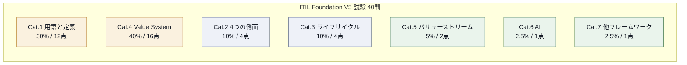
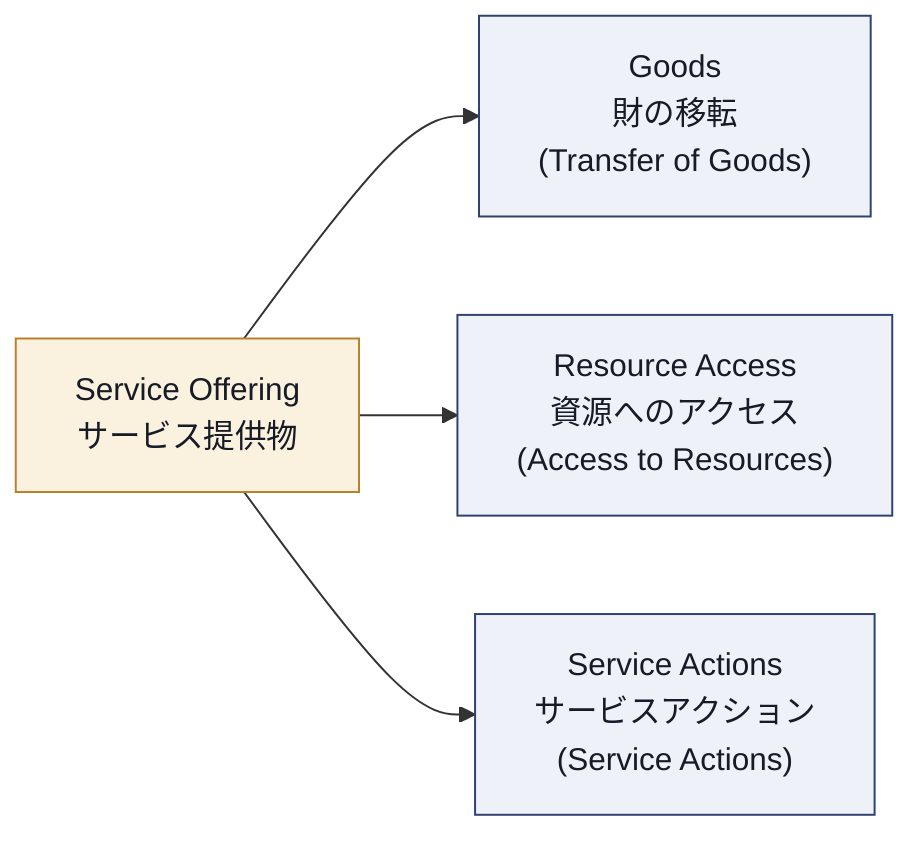
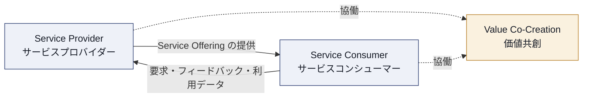
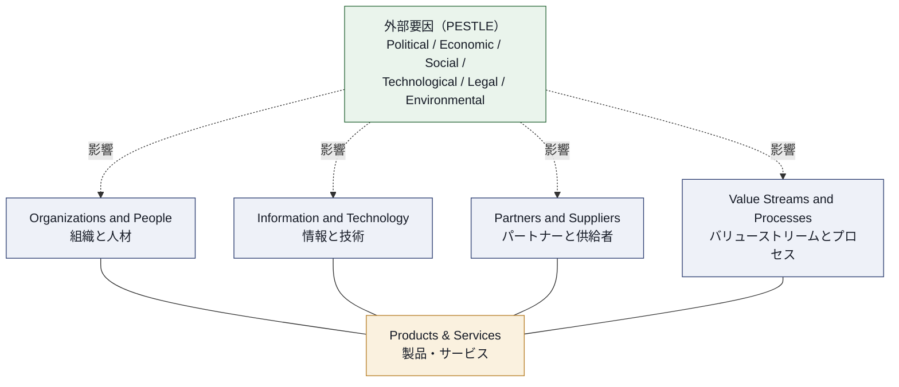
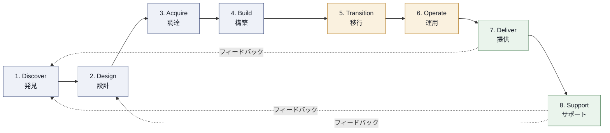
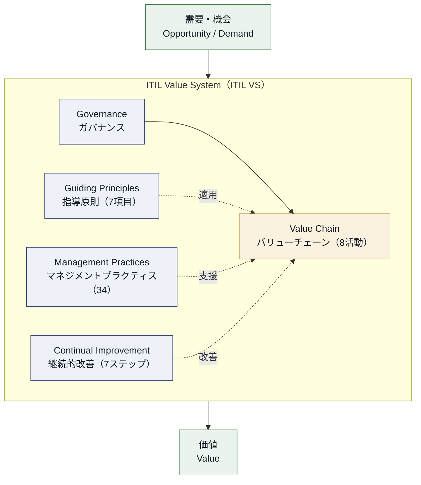
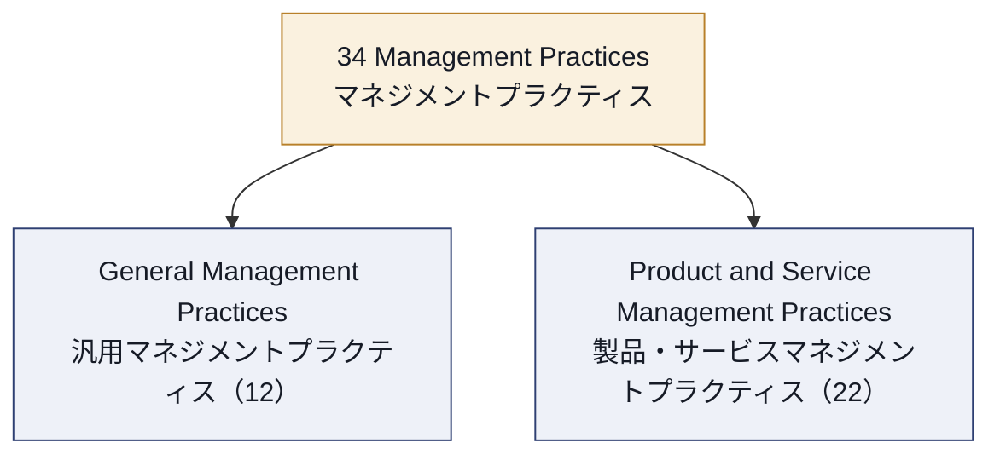
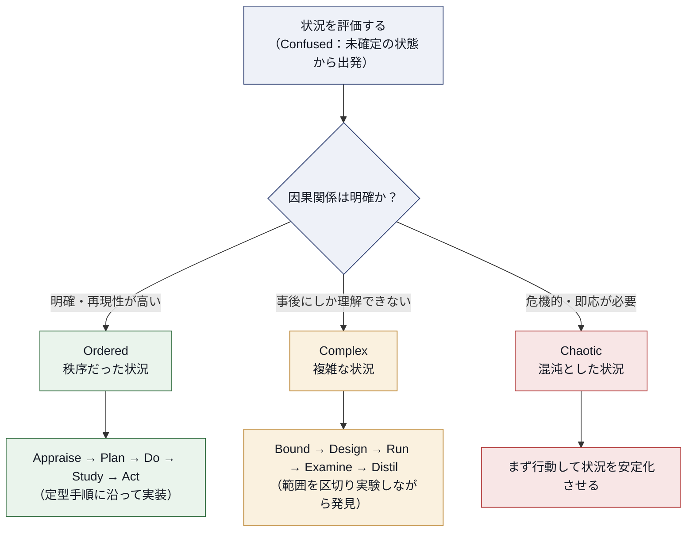
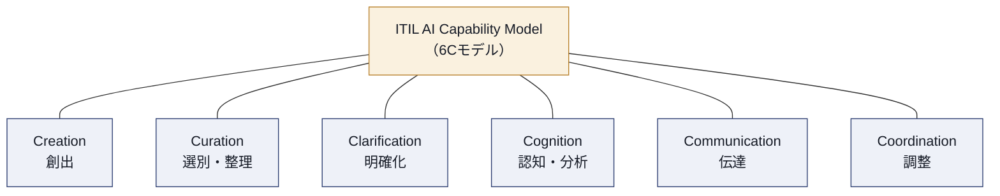
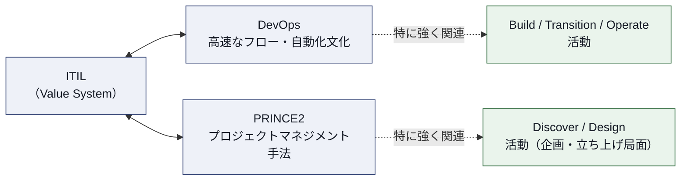

# ITIL Foundation (Version 5) 完全学習ガイド
### ―― 初学者のためのステップ・バイ・ステップ解説 ――

> 本ガイドは、PeopleCert 社が2026年2月に公開した **ITIL® Foundation (Version 5)** 公式シラバス（Syllabus v5.0）の7カテゴリー・40問構成に完全準拠し、各出題項目を初学者にもわかりやすい日本語で詳細に解説したものです。英語の専門用語（Product、Service、Value Chain など）はITIL用語として定着しているため、日本語訳と併記する形で原文のまま残しています。図解はすべて Mermaid 記法、比較・一覧はすべて Markdown 表で作成しており、ASCIIアートは一切使用していません。

---

## 0. このガイドの使い方

| 項目 | 内容 |
|---|---|
| 対象試験 | ITIL® Foundation (Version 5)（PeopleCert 認定） |
| 出題形式 | 4択の客観式問題（Objective Test Question） |
| 問題数 | 40問 |
| 試験時間 | 60分（非母国語受験者は+25%＝75分） |
| 合格ライン | 26/40（65%）、減点方式なし |
| 教材の持ち込み | 不可（クローズドブック） |
| 出典 | [1][2] |

**学習の進め方（ステップ）**

1. **第1章〜第7章** はシラバスの7カテゴリーに1対1対応しています。配点の大きい章（特に第1章「主要用語」30%と第4章「ITIL Value System」40%）から着手すると効率的です。
2. 各章末の **「ベストプラクティス」** ボックスは、実務でその概念をどう活かすかをまとめたものです。試験対策だけでなく、実務理解の定着にも役立ちます。
3. 第8章の **出題形式と学習計画** を読んでから模擬問題に取り組むと、失点しやすいポイント（Negative問題・List問題など）を事前に把握できます。
4. 巻末の **付録** には用語集とマネジメントプラクティス34項目の早見表を収録しています。試験直前の総復習に活用してください。

---

## 目次

1. [第1章：主要なITIL用語と定義（配点30% / 12点）](#ch1)
2. [第2章：ITILの4つの側面（配点10% / 4点）](#ch2)
3. [第3章：ITIL 製品・サービスライフサイクル（配点10% / 4点）](#ch3)
4. [第4章：ITIL バリューシステム（配点40% / 16点）](#ch4)
5. [第5章：バリューストリームの特定・マッピング・マネジメント（配点5% / 2点）](#ch5)
6. [第6章：ITILとAI（配点2.5% / 1点）](#ch6)
7. [第7章：ITILと他フレームワークとの関係（配点2.5% / 1点）](#ch7)
8. [第8章：出題形式・Bloom's Level・学習計画](#ch8)
9. [付録A：用語集](#appa)
10. [付録B：34のマネジメントプラクティス早見表](#appb)
11. [付録C：出典・参考文献一覧](#appc)

---

## 出題配点マップ（全体像）

まず全体の配点バランスを俯瞰しておきましょう。7カテゴリーの合計が40点満点です。

| # | カテゴリー | 配点比率 | 配点 | 本ガイドの章 |
|---|---|---|---|---|
| 1 | Key ITIL terms and definitions（主要なITIL用語と定義） | 30.0% | 12点 | 第1章 |
| 2 | The ITIL Four Dimensions of Product and Service Management（4つの側面） | 10.0% | 4点 | 第2章 |
| 3 | The ITIL Product and Service Lifecycle（製品・サービスライフサイクル） | 10.0% | 4点 | 第3章 |
| 4 | The ITIL Value System（ITILバリューシステム） | 40.0% | 16点 | 第4章 |
| 5 | Value stream identification, mapping, and management（バリューストリーム） | 5.0% | 2点 | 第5章 |
| 6 | ITIL and AI（ITILとAI） | 2.5% | 1点 | 第6章 |
| 7 | ITIL and other frameworks（他フレームワークとの関係） | 2.5% | 1点 | 第7章 |
| | **合計** | **100%** | **40点** | |

さらに、問題は思考レベル（Bloom's Level）別に **BL1（想起）40% / BL2（理解）60%** の比率で出題されます [2]。つまり単純な暗記だけでなく、「なぜそうなるのか」「どう使い分けるのか」を説明できるレベルの理解が過半数を占める、という点を意識して学習してください。

> **コラム：ITIL 4からの主な変更点（参考情報）**
> ITIL Foundation (Version 5) は2026年2月12日にリリースされ、ITIL 4を土台にしつつ大きく進化しました。すでにITIL 4を保有している方は、変更点を押さえておくと学習効率が上がります。試験範囲そのものはあくまで本ガイドの7カテゴリーですが、混同しやすい旧知識を整理する目的で一覧化します [8][9]。
>
> | 観点 | ITIL 4 | ITIL (Version 5) |
> |---|---|---|
> | 中核モデル | Service Value Chain（6活動：Plan, Improve, Engage, Design & Transition, Obtain/Build, Deliver & Support） | Product and Service Lifecycle Model（PSLM、8活動：Discover, Design, Acquire, Build, Transition, Operate, Deliver, Support） |
> | マネジメントプラクティス | 34（General 14 / Service 17 / Technical 3 の3分類） | 34（General 12 / Product and Service 22 の2分類） |
> | AI関連 | 明示的な記載なし | AI・AI Governance・ITIL AI Capability Model（6Cモデル）を新設 |
> | 対象範囲 | ITサービス管理が中心 | デジタル製品・サービス管理全般に拡張 |
> | 指導原則（Guiding Principles） | 7項目 | 7項目（変更なし） |
> | 移行パス | ― | ITIL 4保有者向けに「ITIL Foundation Bridge (Version 5)」を用意 |

---

## 第1章：主要なITIL用語と定義（配点30% / 12点）

この章はシラバス最大の配点を占める最重要カテゴリーです。ITILの全体像を理解するための「語彙」を固める章であり、ここでの理解不足はあらゆる章に波及します。焦らず一つずつ定義を積み上げていきましょう。

### 1-1. Digital Product and Service Management とは

**Digital product and service management（デジタル製品・サービス管理）** とは、組織がデジタル製品やサービスを通じて、需要から成果（アウトカム）まで一貫して価値を創出・提供・改善していく包括的な活動を指します。ITIL 4が「ITサービスマネジメント」を中心に据えていたのに対し、Version 5では「サービス」に加えて「製品（Product）」という概念が正面から取り上げられている点が最大の特徴です [7][9]。

- **Product（製品）**：組織が持つリソース（人・プロセス・技術など）を特定の形に構成し、消費者に提供できるようにしたもの。
- **Service（サービス）**：製品を通じて実現される、消費者が自ら望む成果を達成できるようにする手段。サービスは常に価値の共創（Value Co-Creation）を伴います。
- **Digital product / Digital service（デジタル製品／デジタルサービス）**：デジタル技術によって実現・提供される製品・サービス。データ、ソフトウェア、プラットフォームなどを中核とし、AIや自動化との親和性が高い点が特徴です。
- **Goods（財）**：消費者に所有権が移転する有形・無形の物品。サービスとは異なり、提供後の運用責任は消費者側に移ります。

> **ベストプラクティス：Product と Service を混同しない**
> 実務では「このシステムはProductなのかServiceなのか」を明確に定義すると、責任範囲（誰が価値提供に責任を持つか）がぶれません。社内SaaSツールを例にすると、ツール自体はProduct、そのツールを使って業務課題を解決する取り組み全体がServiceという整理をすると理解しやすくなります。

### 1-2. Continual Improvement と ITIL Product and Service Lifecycle（キーコンセプトとしての導入）

- **Continual improvement（継続的改善）**：組織のあらゆる要素（製品・サービス・プラクティス）を、変化するビジネスニーズに合わせて継続的に見直し、改善し続けるという考え方。詳細な7ステップモデルは第4章で扱いますが、この章では「ITILの全ての活動に埋め込まれた基本概念」として定義を押さえておきます。
- **ITIL Product and Service Lifecycle（PSLM）**：需要の発見から提供・サポートまでを結ぶ一連の活動群。詳細は第3章で扱います。

### 1-3. Utility・Warranty・User Experience・Sustainability（価値の4要素）

サービスが消費者にとって「良い」と感じられるかどうかは、次の4つの観点で評価されます。

| 用語 | 意味 | 具体例 |
|---|---|---|
| **Utility（有用性）** | サービスが特定の目的に対して「適合しているか（fit for purpose）」。機能面の価値。 | クラウドストレージが必要な容量・速度を満たしているか |
| **Warranty（安心性）** | サービスが「利用可能であるか（fit for use）」。可用性・キャパシティ・セキュリティ・継続性の保証。 | 稼働率99.9%のSLAが守られているか |
| **User Experience（UX／利用体験）** | 利用者がサービスを使う過程で得る主観的な満足度・使いやすさ。 | UIの分かりやすさ、サポート対応の丁寧さ |
| **Sustainability（持続可能性）** | 環境・社会・経済的な持続可能性への配慮。ITIL 4以降で重視され、Version 5でも継続。 | データセンターの省エネ設計、公正な調達 |

> **ベストプラクティス：4要素をバランスさせる**
> Utility（機能）ばかりに注力してWarranty（安定稼働）が疎かになると、機能は良いのに障害が多いサービスになります。逆にWarranty偏重だとイノベーションが停滞します。新機能をリリースする際は、この4要素を毎回チェックリスト化して確認すると、価値創出の抜け漏れを防げます。

### 1-4. Service Offering と Service Interactions（サービス提供物とやり取り）

**Service offering（サービス提供物）** とは、サービスプロバイダーが提供する製品・サービスの内容を、コンポーネントとして具体的に定義したものです。1つのサービス提供物は次の3要素で構成されます。

- **Transfer of goods（財の移転）**：所有権が消費者に移る物理的・デジタル的な財の受け渡し（例：ライセンスキーの付与）。
- **Access to resources（資源へのアクセス）**：所有権は移転しないが、消費者が一時的にリソースを利用できる状態（例：クラウド環境の利用権）。
- **Service actions（サービスアクション）**：プロバイダー側が消費者のために実行する作業（例：ヘルプデスクによる問い合わせ対応）。

> **ベストプラクティス：サービスカタログでService Offeringを可視化する**
> Service catalogue management（付録B参照）と連携させ、各サービス提供物がどの財・資源・アクションで構成されているかをカタログ上に明示すると、営業・サポート双方の認識齟齬を減らせます。

### 1-5. Value Co-Creation（価値の共創）

ITILの根幹をなす考え方が **Value co-creation（価値共創）** です。価値は組織が一方的に「提供」するものではなく、サービスプロバイダーとサービスコンシューマーが協働して初めて生まれる、という視点です。

価値共創を評価する上で重要な4つの構成要素があります。

| 要素 | 定義 | ポイント |
|---|---|---|
| **Output（アウトプット）** | 特定の活動から生じる有形・無形の成果物 | あくまで「作られたもの」自体を指す |
| **Outcome（アウトカム）** | アウトプットの利用によって、ステークホルダーにもたらされる結果 | 「その成果物によって何が達成されたか」を指す |
| **Cost（コスト）** | サービス消費によって発生する費用、またはサービスによって回避できた費用 | 消費者側・提供者側双方のコストを含む |
| **Risk（リスク）** | 目的達成に対する不確実性、または損失・機会の可能性 | サービス利用に伴うリスクの受容・移転・軽減の判断が重要 |

> **ベストプラクティス：OutputとOutcomeを混同しない**
> 「新しいダッシュボードをリリースした」はOutput、「そのダッシュボードによって意思決定のスピードが上がった」がOutcomeです。プロジェクトの成功指標をOutputだけで測ると、実際のビジネス価値を見誤ります。KPIを設計する際は必ずOutcomeベースの指標を1つ以上含めましょう。

### 1-6. Service Relationships（サービス関係）

サービスは組織単体で完結せず、複数のステークホルダーの関係性の中で成立します。

| 用語 | 定義 |
|---|---|
| **Organization（組織）** | 自らの目的を達成するための責任・権限・関係を持つ個人またはグループ |
| **Service Provider（サービスプロバイダー）** | サービスを提供する役割を担う組織 |
| **Service Consumer（サービスコンシューマー）** | サービスを消費する役割を担う組織。Sponsor・Customer・Userの3ロールを内包する包括的な用語 |
| **Digital Product Vendor（デジタル製品ベンダー）** | デジタル製品を開発・供給する組織。Version 5で明確化された役割 |
| **Sponsor（スポンサー）** | サービス消費の予算を承認する役割 |
| **Customer（カスタマー）** | サービスの要求を定義し、消費に伴う成果に責任を持つ役割 |
| **User（ユーザー）** | 実際にサービスを利用する役割 |

**3種類のサービス関係の型**

| 関係の型 | 特徴 |
|---|---|
| **Basic（基本型）** | 標準化された製品・サービスを、比較的簡単な取引で提供する関係。カスタマイズ性は低い |
| **Cooperative（協力型）** | 継続的なやり取りがあり、消費者のニーズに合わせてある程度の調整を行う関係 |
| **Collaborative／Partnership（協働型）** | 双方が共通の目標に向けて深く統合され、戦略的なパートナーシップとして機能する関係 |

さらに、消費者がサービスと関わる一連の体験を **Service Journey（サービスジャーニー）** と呼びます。認知から利用、継続、終了に至るまでの全接点を指し、UX（利用体験）の質を左右する重要な概念です。

最後に、サービス品質を裏付ける仕組みとして以下を押さえます。

- **Service Quality（サービス品質）**：サービスが期待・要求をどれだけ満たしているかの程度。
- **Service Level（サービスレベル）**：測定可能な指標で表現された、サービスの1つ以上の側面のパフォーマンス目標値。
- **SLA（Service Level Agreement／サービスレベル合意書）**：プロバイダーと消費者間で合意されたサービスレベルを文書化したもの。

> **ベストプラクティス：関係の型に応じてガバナンスの重さを変える**
> Basicな関係にCollaborative型と同じ重厚なガバナンス（定例会議・共同KPIなど）を課すと、コストばかりかさんで両者にメリットがありません。逆に戦略的パートナーにBasic型の対応をすると信頼を損ないます。契約更新のタイミングで関係の型を見直し、ガバナンスの重さを合わせましょう。

---

## 第2章：ITILの4つの側面（配点10% / 4点）

サービスや製品の管理を「一部分だけ」最適化すると、必ず別の場所にひずみが生じます。ITILはこれを防ぐために、常に4つの側面を **ホリスティック（全体論的）** に検討することを求めています。

| 側面 | 範囲 | 具体的な検討事項 |
|---|---|---|
| **Organizations and People（組織と人材）** | 組織構造、文化、役割・責任、必要なスキル・コンピテンシー、リーダーシップスタイル | 適切な人数・スキルセットは確保されているか。心理的安全性のある文化か |
| **Information and Technology（情報と技術）** | サービスを支える情報、知識、技術、ツール、プラットフォーム、データガバナンス | データの正確性・機密性は保たれているか。技術的負債は管理されているか |
| **Partners and Suppliers（パートナーと供給者）** | 外部組織との関係、契約、依存関係、エコシステム全体の管理 | 供給者選定基準は明確か。重要な依存先の継続性リスクは評価されているか |
| **Value Streams and Processes（バリューストリームとプロセス）** | 組織がどのように活動を構成し、インプットをアウトプットに変換するか | ムダなプロセスはないか。エンドツーエンドで価値が流れているか |

さらに、この4つの側面は組織の外側にある**PESTLE要因**からも常に影響を受けます。

| PESTLE要素 | 内容 | 例 |
|---|---|---|
| **P**olitical（政治的） | 政策、規制、政治的安定性 | 政府のデジタル化推進政策 |
| **E**conomic（経済的） | 景気、為替、予算制約 | インフレによるIT予算の圧縮 |
| **S**ocial（社会的） | 人口動態、働き方の変化、消費者行動 | リモートワークの定着 |
| **T**echnological（技術的） | 技術革新、陳腐化のスピード | 生成AIの急速な普及 |
| **L**egal（法的） | 法規制、コンプライアンス要件 | 個人情報保護法制の強化 |
| **E**nvironmental（環境的） | 気候変動、サステナビリティ要求 | カーボンニュートラルへの対応要求 |

> **ベストプラクティス：4つの側面を「チェックリスト」として使う**
> 新しいサービスや変更を計画する際、必ず4つの側面それぞれについて「このプランは影響がないか」を確認する習慣をつけましょう。たとえば新しいSaaSツールを導入する際、Information and Technology（データ連携）だけでなく、Organizations and People（誰が運用を担うか）、Partners and Suppliers（ベンダーロックインのリスク）、Value Streams and Processes（既存業務フローとの整合性）も同時に検討することで、後工程での手戻りを防げます。

---

## 第3章：ITIL 製品・サービスライフサイクル（配点10% / 4点）

### 3-1. Product and Service Lifecycle Model（PSLM）とは

ITIL (Version 5) の最大の構造変化が、この **Product and Service Lifecycle Model（PSLM）** です。ITIL 4の6活動から成る Service Value Chain を置き換える形で、より製品開発の実態（アジャイル・DevOps的な反復開発）に即した **8つの活動** で構成される新モデルが導入されました [9][10]。

重要なポイントは、この8活動が **一直線（linear）でも順序固定（sequential）でもない** という点です。状況に応じて活動を行き来し、反復的に使うことが前提とされています [2]。

大まかな傾向として、前半（Discover〜Build）は **Product（製品）視点** が強く、後半（Deliver・Support）は **Service（サービス）視点** が強くなり、中間の Transition・Operate は両者をつなぐ「橋渡し」の役割を果たします [7]。

### 3-2. 各活動の目的（Purpose）

| # | 活動 | 目的（何のためにあるか） |
|---|---|---|
| 1 | **Discover（発見）** | 市場・消費者のニーズや需要シグナルを把握し、組織戦略やプロダクトロードマップと整合させる |
| 2 | **Design（設計）** | 把握したニーズを、技術要件だけでなく利用体験も満たす具体的なソリューション（仕様・プロトタイプ）に落とし込む |
| 3 | **Acquire（調達）** | ソリューションの実現に必要なリソース（人材・技術・第三者サービスなど）を購入・確保・配分する |
| 4 | **Build（構築）** | コンポーネントを開発・構成し、リリース前に十分にテストする |
| 5 | **Transition（移行）** | 新規・変更されたソリューションを、混乱なく安全に本番環境へ導入する |
| 6 | **Operate（運用）** | インフラとシステムを日々安定稼働させ、パフォーマンスを監視し続ける |
| 7 | **Deliver（提供）** | 合意された条件でサービスを消費者が利用できる状態にし、アクセスや要求への対応を管理する |
| 8 | **Support（サポート）** | インシデントや問題を解決し、通常のサービス運用状態を回復させる。学びをDiscover・Designへ還元する |

> **ベストプラクティス：「橋渡し」の2活動を軽視しない**
> Transition と Operate は地味に見えますが、ここが弱いとどれだけ良いDesignやBuildをしても本番障害やリリース事故につながります。CI/CDパイプラインの整備やモニタリング体制の構築に投資することは、PSLM全体の信頼性を底上げする最も費用対効果の高い施策の一つです。

> **ベストプラクティス：Supportをフィードバックループの起点にする**
> インシデント対応で得られた知見（根本原因、再発防止策）をナレッジベースに残すだけで終わらせず、定期的にDiscover・Designの担当チームへ共有する仕組み（例：月次の振り返り会）を作ると、同じ問題の再発を未然に防げます。

---

## 第4章：ITIL バリューシステム（配点40% / 16点）

本章はシラバス最大の配点（40%）を占める、試験合格のカギとなる章です。5つの構成要素（指導原則、ガバナンス、バリューチェーン、マネジメントプラクティス、継続的改善）を順に見ていきます。

### 4-1. ITIL Value System（ITIL VS）の全体像

**ITIL Value System（ITILバリューシステム）** とは、組織が需要・機会を価値に変換するために、全ての構成要素を統合的に機能させる仕組みです。5つの要素が相互に作用し合います。

### 4-2. ITIL Guiding Principles（指導原則）― 7項目

指導原則はITIL 4から**変更なし**で7項目が継承されています [9]。どんな状況・組織にも普遍的に適用できる推奨事項であり、意思決定の指針として機能します。

| # | 原則 | 何を意味するか | 実務での使いどころ |
|---|---|---|---|
| 1 | **Focus on value（価値に焦点を当てる）** | すべての活動を、最終的にステークホルダーへの価値提供に結びつける | 施策着手前に「誰にとってどんな価値があるか」を必ず問う |
| 2 | **Start where you are（現在地から始める）** | ゼロから作り直さず、既存の資産・プロセス・データをまず評価し活用する | 既存システムを安易に「全部作り直そう」としない |
| 3 | **Progress iteratively with feedback（フィードバックを伴う反復的な進化）** | 大きく一気に変えるのではなく、小さく試してフィードバックを得ながら進める | MVP（最小限の実行可能な製品）でまず試す |
| 4 | **Collaborate and promote visibility（協働し可視性を高める）** | 部門横断で協力し、進捗や意思決定を透明にする | ステークホルダーを巻き込んだ共同レビューを定例化する |
| 5 | **Think and work holistically（全体思考で取り組む）** | 個別最適ではなく、組織全体・エンドツーエンドでの結果を意識する | 第2章の4つの側面を用いて影響範囲を点検する |
| 6 | **Keep it simple and practical（シンプルかつ実践的に）** | 常に価値を生み出す最小限の手順を目指し、複雑さを避ける | プロセスに不要なステップが残っていないか定期的に棚卸しする |
| 7 | **Optimize and automate（最適化と自動化）** | 手作業を減らす前に、まずプロセス自体を最適化し、その上で自動化する | 「自動化する前に、そもそもそのステップは必要か」を問う |

すべての原則は**相互に関連**しており、状況に応じて重み付けを変えながら組み合わせて使うことが重要とされています。

> **ベストプラクティス：原則同士のトレードオフを意識する**
> 「Progress iteratively」を優先しすぎると意思決定が遅くなり「Keep it simple」と衝突することがあります。逆に「Optimize and automate」を急ぎすぎると「Start where you are」を無視した過剰投資になりがちです。プロジェクトのキックオフ時に、どの原則を最優先するかをチームで合意しておくと、後々の判断がぶれません。

### 4-3. Governance（ガバナンス）

**Governance（ガバナンス）** とは、組織を評価し、方向づけ、監視する活動のことです。ITIL VSの中で、組織の意思決定の枠組みを提供する「イネーブラー（enabler）」として機能します。

- ガバナンスは組織の最上位（取締役会・経営層）で行われ、方針・優先順位を定めます。
- 具体的な活動として「Evaluate（評価）」「Direct（指示）」「Monitor（監視）」のサイクルがあります。
- ガバナンスが有効に機能して初めて、バリューチェーン活動やマネジメントプラクティスが組織戦略と整合して動きます。

> **ベストプラクティス：ガバナンスを「監視」だけで終わらせない**
> ガバナンスは規制や統制のイメージが強いですが、本質は組織を正しい方向へ導く「イネーブラー」です。監視結果を次の方針決定（Direct）に確実にフィードバックする仕組みを持つことで、形骸化を防げます。

### 4-4. Value Chain（バリューチェーン）

Version 5では、**Value chain（バリューチェーン）は第3章で学んだPSLMの8活動そのもの**として再定義されています [2][7]。各活動には、その活動を理解する上でカギとなる用語が紐づいています。

| バリューチェーン活動 | カギとなる用語 | 用語の意味 |
|---|---|---|
| **Design** | Product specification（製品仕様） | 製品が満たすべき要件を定義した文書 |
| | Product prototype（製品プロトタイプ） | 検証目的で作成される試作版 |
| **Build** | Continuous integration（継続的インテグレーション） | コード変更を頻繁に統合し自動テストする手法 |
| | Continuous delivery / deployment（継続的デリバリー／デプロイメント） | ビルド成果物をいつでもリリース可能・自動リリース可能にする手法 |
| **Transition** | Release（リリース） | 本番環境で利用可能になる、1つ以上の変更の集合 |
| | Test（テスト） | ソリューションが要件を満たすかを検証する活動 |
| **Operate** | Incident（インシデント） | サービスの計画外の中断、または品質低下 |
| | Event（イベント） | サービスマネジメント上で意味を持つ状態変化 |
| | Reliability（信頼性） | 意図した機能を継続して正しく実行できる度合い |
| | SRE（Site Reliability Engineering） | ソフトウェア工学の手法を運用に適用し信頼性を高めるアプローチ |
| | Observability（可観測性） | システムの内部状態を外部出力から推測できる度合い |
| **Deliver** | Service request（サービスリクエスト） | 利用者からの、あらかじめ合意された定型サービスの依頼 |
| **Support** | Disaster（災害） | 事業継続に深刻な影響を及ぼす重大な障害 |
| | Problem（問題） | 1件以上のインシデントの原因、またはその可能性 |
| | Error（エラー） | 設計・実装上の不備 |
| | Known error（既知のエラー） | 原因が特定済みで、恒久対策が未実施の問題 |

さらに、バリューチェーン全体を支える概念として **Operating model（オペレーティングモデル）** があります。これは組織の目的達成のために、リソース・活動・パートナー・供給者をどのように配置・連携させるかを定めたモデルです。

> **ベストプラクティス：ProblemとKnown Errorを混同しない**
> ProblemはまだIncidentの根本原因が「未特定」の状態を含みますが、Known Errorは原因が特定済みで暫定対処法まで判明している状態です。この区別を明確にすることで、Problem Management（問題管理）のワークフローの進捗が可視化しやすくなります。

### 4-5. Management Practices（マネジメントプラクティス）

**Management practice（マネジメントプラクティス）** とは、特定の目的を達成するために組織化されたリソース群のことです。ITIL 4では「General／Service／Technical」の3分類・34項目でしたが、Version 5では **Technical分類が廃止**され、以下の **2分類・34項目** に整理されました [3][4]。

- **General management practices（汎用マネジメントプラクティス／12項目）**：一般的な事業経営の領域からサービス管理向けに適用・調整されたプラクティス。
- **Product and service management practices（製品・サービスマネジメントプラクティス／22項目）**：ITIL 4の「Service」17項目と「Technical」3項目を統合し、さらにVersion 5で情報セキュリティ管理とサービス財務管理をこちらへ移動した結果、22項目になりました。

（全34項目の一覧は [付録B](#appb) を参照してください）

ITIL Practice Guide（各プラクティスの公式ガイド）は、一貫した構造（目的、価値のある成果、活動、ロール、バリューチェーンとの関係）で整理されており、組織間で共通言語として使えることが最大の利点です。

> **ベストプラクティス：全34項目を丸暗記しようとしない**
> Foundationレベルで問われるのは各プラクティスの「目的（Purpose）」レベルの理解までです。丸暗記より、「このプラクティスはPSLMのどの活動に最も貢献するか」という関連づけで覚えると記憶に定着しやすく、実務にも応用できます。

### 4-6. ITIL Continual Improvement Model（継続的改善モデル）

ITILバリューシステムを貫く最後の要素が、**継続的改善モデル**です。7つのステップから成る循環型のモデルで、組織のあらゆるレベル・あらゆる活動に適用できます。

| ステップ | 問いかけ | 実務での主なアウトプット |
|---|---|---|
| 1. ビジョン | 大きな方向性は何か | 経営戦略・組織のミッションとの整合確認 |
| 2. 現在地 | 現状はどうなっているか | 現状分析、ベースライン測定 |
| 3. 目指す姿 | 具体的な目標はどこか | 測定可能な改善目標の設定 |
| 4. 到達方法 | どんな計画で進むか | 改善計画、優先順位付け |
| 5. 行動 | 計画を実行する | 改善施策の実施 |
| 6. 到達確認 | 目標を達成したか | 効果測定、KPI評価 |
| 7. モメンタム維持 | 成果をどう定着させるか | 次サイクルへの接続、成功の共有 |

> **ベストプラクティス：小さく回して大きく育てる**
> 7ステップを一度に大きなプロジェクトとして回そうとすると停滞しがちです。小さな改善サイクルを高速に回し（例：2週間スプリント単位）、成功体験を積み重ねながらステップ7の「モメンタム維持」につなげるのが実践的です。

---

## 第5章：バリューストリームの特定・マッピング・マネジメント（配点5% / 2点）

ITIL 4ではほとんど触れられていなかった **バリューストリーム** が、Version 5では独立したシラバスカテゴリーとして新設されました [10]。

### 5-1. Value Stream（バリューストリーム）の基本定義

| 用語 | 定義 |
|---|---|
| **Value stream（バリューストリーム）** | 特定の製品・サービスを消費者に届けるために組織が実行する一連のステップ |
| **Core value stream（コアバリューストリーム）** | 外部の消費者に直接価値を届ける、エンドツーエンドのバリューストリーム |
| **Enabling value stream（イネーブリングバリューストリーム）** | コアバリューストリームを支える、主に組織内部向けのバリューストリーム（例：人材採用、ツール調達） |
| **Value stream mapping（バリューストリームマッピング）** | 現状のバリューストリームを可視化し、ムダや停滞を特定する分析手法 |
| **Value stream management（バリューストリームマネジメント）** | マッピングで得た知見をもとに、継続的にバリューストリームを最適化していく活動 |

### 5-2. Complexity Thinking（複雑性思考）

Version 5で新たに導入された重要な概念が **Complexity thinking（複雑性思考）** です。すべての業務に同じ手順を機械的に適用するのではなく、状況の性質（因果関係がどれだけ明確か）に応じてアプローチを変えるという考え方です [6][12]。

状況は大きく4つに分類されます。

| 状況の種類 | 特徴 | 推奨アプローチ |
|---|---|---|
| **Ordered（秩序だった状況）** | 原因と結果の関係が明確で再現性が高い（例：パスワードリセット） | 標準手順化し、忠実に実行する。**Appraise → Plan → Do → Study → Act** |
| **Complex（複雑な状況）** | 因果関係は事後にしか分からない（例：新しいAI機能の開発） | 小さく実験し、結果を見て方向を調整する。**Bound → Design → Run → Examine → Distil** |
| **Chaotic（混沌とした状況）** | 危機的で、行動と結果の関係が読めない（例：基幹システムの全面障害） | まず行動して状況を安定化させることを最優先する |
| **Confused（未確定の状況）** | そもそも今どの状況にあるか自体が分かっていない出発点 | まず状況を分類する作業自体から始める |

> **ベストプラクティス：全てのバリューストリームに同じ管理手法を強制しない**
> 定型的な問い合わせ対応（Ordered）に、新規AI機能開発（Complex）と同じ厳格な計画・承認プロセスを課すと、スピードが致命的に落ちます。逆に危機対応（Chaotic）にじっくり計画を練る余裕はありません。バリューストリームごとに「これはどの状況に近いか」をまず判定してから、適したマネジメント手法を選びましょう。

### 5-3. Value Stream Mapping and Management の目的

- **目的**：バリューストリームを可視化することで、ボトルネック・ムダ・非付加価値活動を特定し、エンドツーエンドでの価値の流れを改善すること。
- バリューストリームマップには通常、各ステップの所要時間、待ち時間、担当者、情報の流れが記載されます。
- マッピングは「現状（As-Is）」の可視化にとどまらず、そこから継続的な「あるべき姿（To-Be）」への改善サイクル（マネジメント）へつなげることが重要です。

> **ベストプラクティス：バリューストリームマップは一度作って終わりにしない**
> マッピングは定点観測として定期的に（四半期ごとなど）更新しましょう。組織構造やツールが変わるとバリューストリームも変化するため、古いマップに基づいた改善は的外れになりがちです。

---

## 第6章：ITILとAI（配点2.5% / 1点）

配点は小さいものの、ITIL (Version 5) を象徴する新設カテゴリーです。AIをブラックボックス扱いせず、ITILの枠組みの中でどう位置づけ、どう統制するかを問う内容です [5][11][16]。

### 6-1. 基本用語の定義

| 用語 | 定義 |
|---|---|
| **AI（Artificial Intelligence／人工知能）** | 人間の知的活動を模倣し、データからパターンを学習・推論・意思決定を行う技術の総称 |
| **AI maturity（AI成熟度）** | 組織がAIをどれだけ効果的かつ責任を持って活用できているかの段階 |
| **GenAI（Generative AI／生成AI）** | テキスト・画像・コードなど新しいコンテンツを生成できるAI |
| **Agentic AI（エージェンティックAI）** | 人間の逐次的な指示なしに、自律的に計画・判断・実行を行うAI |

### 6-2. AIとPSLM・バリューチェーンの関係

AIは特定の活動に限定されず、**PSLM（第3章）の8活動すべて**、そして**バリューチェーン活動全体**において、自動化・分析支援・意思決定支援の形で活用が広がっています。例えば：

- **Discover**：需要予測、市場トレンド分析の自動化
- **Design**：AIによる仕様案・プロトタイプ生成支援
- **Build**：AIコーディングアシスタントによる開発高速化
- **Operate**：異常検知・予兆保全（Predictive Maintenance）
- **Support**：チャットボットによる一次対応、インシデント原因分析支援

### 6-3. AI Governance（AIガバナンス）

**AI governance（AIガバナンス）** とは、AIの活用が組織の目的・倫理原則・規制要件と整合するように、評価・指示・監視する仕組みです。第4章で学んだ「Governance（ガバナンス）」の考え方を、AI特有のリスク（バイアス、透明性の欠如、説明可能性など）に適用したものと理解すると整理しやすくなります。

### 6-4. ITIL AI Capability Model（6Cモデル）

AI活用の範囲・機能を体系的に理解するためのフレームワークが **ITIL AI Capability Model（通称：6Cモデル）** です。AIソリューションが担う機能を6つのケイパビリティに分類し、ガバナンス上のリスクプロファイルや統制の設計に役立てます [16][17]。

| ケイパビリティ | 機能の説明 | 具体例 |
|---|---|---|
| **Creation（創出）** | 新しいコンテンツ・成果物を生成する | AIによるコード生成、ドキュメント自動作成 |
| **Curation（選別・整理）** | 大量の情報を選別・分類・要約する | ナレッジベースの自動タグ付け |
| **Clarification（明確化）** | 曖昧な要求・情報を明確化する | チャットボットによる要求のヒアリング |
| **Cognition（認知・分析）** | データからパターンを認識し、洞察を導く | 異常検知、需要予測 |
| **Communication（伝達）** | 情報を関係者に分かりやすく伝える | 自動レポート生成、通知の最適化 |
| **Coordination（調整）** | 複数の活動・エージェント間の調整を行う | ワークフローオーケストレーション、自律的なタスク割り当て |

> **ベストプラクティス：AIソリューション導入時は「どのCか」を明確にする**
> 新しいAIツールを導入する前に、それが6つのうちどのケイパビリティ（あるいは複数の組み合わせ）を担うのかをチームで合意しましょう。Creation（生成）やCoordination（自律調整）を担うAIほど誤りの影響が大きくなりやすいため、人間によるレビュー（Human-in-the-loop）の要否をケイパビリティごとに設計すると、過不足のないガバナンスが実現できます。

---

## 第7章：ITILと他フレームワークとの関係（配点2.5% / 1点）

ITILは単独で完結するフレームワークではなく、他の実践知と補完し合う「統合レイヤー」としての性格を持ちます。Foundationレベルでは特に **DevOps** と **PRINCE2** との関係が問われます。

### 7-1. ITIL と DevOps

- DevOpsは開発（Dev）と運用（Ops）の間の壁を取り払い、**高速なフロー・頻繁なリリース・自動化**を重視する文化・実践の集合です。
- ITILは「何を、なぜ管理するか（Value System全体の枠組み）」を提供し、DevOpsは「どう高速に実現するか（実践的な手法）」を提供する、補完的な関係にあります。
- 具体的には、第4章のバリューチェーンにおける **Build・Transition・Operate** の各活動は、CI/CD・自動テスト・モニタリングといったDevOpsのプラクティスと直接結びつきます。

> **ベストプラクティス：ITILとDevOpsを「対立」させない**
> 「ITILは重厚なプロセス、DevOpsはスピード重視」という対立構造で捉えるのは誤解です。ITIL (Version 5) 自体がPSLMや指導原則（特に「Optimize and automate」）を通じてアジャイル・DevOps的な考え方を内包しています。両者を「なぜ（ITIL）」と「どう（DevOps）」の関係として位置づけ、組織のガバナンス要件とスピード要件を両立させましょう。

### 7-2. ITIL と PRINCE2（プロジェクトマネジメント）

- サービス・製品の大きな変化（新規立ち上げ、大規模な変更）には、明確な開始・終了、予算、体制を持つ**プロジェクト**としての管理が必要になる場面があります。
- PRINCE2はプロジェクトを体系的に管理する手法であり、ITILの **Discover・Design** 局面で特に重要性が増します（新しい製品・サービスの企画・立ち上げ局面）。
- ITILがプロジェクトの「アウトプット」をどう継続的な価値（アウトカム）につなげ、運用に移行するかを扱うのに対し、PRINCE2はプロジェクト自体の統制（スコープ・スケジュール・予算・リスク管理）を扱います。

> **ベストプラクティス：プロジェクト完了後の「移行計画」を最初から用意する**
> PRINCE2で管理されたプロジェクトが完了しても、それだけではPSLMのTransition・Operateへの移行は自動的にはうまくいきません。プロジェクト計画の初期段階から、運用チームへの引き継ぎ基準（Definition of Done for Operations）を定義しておくことで、プロジェクト終了後の「谷間」を防げます。

---

## 第8章：出題形式・Bloom's Level・学習計画

### 8-1. 問題形式（Question Types）

ITIL Foundation (Version 5) はすべて4択の客観式問題（Objective Test Question）ですが、出題スタイルには4種類あります [2]。

| 出題スタイル | 特徴 | 対策のポイント |
|---|---|---|
| **Standard（標準）** | 設問文＋4つの選択肢から正解を1つ選ぶ、最も一般的な形式 | 定義の正確な理解が最重要 |
| **Missing word(s)（空所補充）** | 文中の空欄に当てはまる語句を4択から選ぶ | 用語の文脈上の使われ方まで押さえておく |
| **List（リスト選択）** | 4つの記述の中から**正しいもの2つ**を選ぶ組み合わせ問題 | 個々の記述の正誤を独立して判断してから組み合わせを選ぶ |
| **Negative（否定形）** | 「NOTである」「誤っているもの」を問う形式。ある内容が「行われないこと」を知っているかを問う場合のみ例外的に使用 | 設問文の否定語（NOT／NEVER等）を見落とさない |

### 8-2. Bloom's Level（思考レベル）

問題は次の2レベルで分類され、**BL1が40%、BL2が60%**の比率で出題されます [2]。

| レベル | 意味 | 問われ方の例 |
|---|---|---|
| **BL1（Recall／想起）** | 用語・定義・リストを正確に記憶しているか | 「〜を定義しなさい」「〜を列挙しなさい」 |
| **BL2（Understanding／理解）** | 概念の意味や使い分けを理解し、状況に適用できるか | 「〜を説明しなさい」「〜がどう使われるか理解しなさい」 |

> **ベストプラクティス：BL2対策として「自分の言葉で説明する」練習をする**
> 単語カードで暗記するだけではBL2の設問に対応しきれません。各概念について「もし後輩に説明するとしたら、具体例を使ってどう伝えるか」を実際に声に出す・書き出す練習をすると、理解度が定着し、応用的な設問にも対応しやすくなります。

### 8-3. 推奨学習ステップ

1. **第1回通読（インプット）**：本ガイドを第1章から第7章まで通読し、Mermaid図と表で全体像をつかむ。
2. **章末ベストプラクティスの実務照合**：自分の業務・組織に置き換えて、各ベストプラクティスが「すでにできているか／できていないか」をメモする（理解の定着に効果的）。
3. **付録Aの用語集で暗記チェック**：各用語を見て、日本語だけで説明できるかを自己テストする。
4. **配点の大きい章（第1章・第4章）を再読**：全40点中28点（70%）を占めるため、優先的に反復する。
5. **模擬試験で出題形式に慣れる**：特にList形式・Negative形式は独特の読み方が必要なため、慣れが必要（PeopleCert公式サンプル問題の活用を推奨）。

---

## 付録A：用語集

| 用語（英語） | 日本語訳・定義 |
|---|---|
| Product | 消費者に提供できるよう構成されたリソースの集合体 |
| Service | 消費者が望む成果を実現する手段。価値共創を伴う |
| Digital Product / Digital Service | デジタル技術を中核とする製品・サービス |
| Goods | 所有権が消費者に移転する財 |
| Utility | 有用性（fit for purpose） |
| Warranty | 安心性（fit for use） |
| User Experience | 利用体験 |
| Sustainability | 持続可能性 |
| Service Offering | サービス提供物（財の移転・資源アクセス・サービスアクションで構成） |
| Value Co-Creation | 価値共創 |
| Output | アウトプット（成果物そのもの） |
| Outcome | アウトカム（成果物によって得られた結果） |
| Cost | コスト |
| Risk | リスク |
| Organization | 組織 |
| Service Provider | サービスプロバイダー |
| Service Consumer | サービスコンシューマー（Sponsor／Customer／Userを含む） |
| Digital Product Vendor | デジタル製品ベンダー |
| Service Journey | サービスジャーニー |
| Service Quality | サービス品質 |
| Service Level | サービスレベル |
| SLA | サービスレベル合意書 |
| Organizations and People | 4つの側面：組織と人材 |
| Information and Technology | 4つの側面：情報と技術 |
| Partners and Suppliers | 4つの側面：パートナーと供給者 |
| Value Streams and Processes | 4つの側面：バリューストリームとプロセス |
| PESTLE | 外部要因（政治・経済・社会・技術・法律・環境） |
| PSLM | Product and Service Lifecycle Model（製品・サービスライフサイクルモデル） |
| Discover / Design / Acquire / Build / Transition / Operate / Deliver / Support | PSLMの8活動 |
| ITIL Value System (ITIL VS) | ITILバリューシステム |
| Guiding Principles | 指導原則（7項目） |
| Governance | ガバナンス |
| Value Chain | バリューチェーン（Version 5ではPSLMと同義） |
| Management Practice | マネジメントプラクティス |
| Continual Improvement Model | 継続的改善モデル（7ステップ） |
| Metric | メトリック（測定指標） |
| Critical Success Factor (CSF) | 重要成功要因 |
| Value Stream | バリューストリーム |
| Core Value Stream | コアバリューストリーム |
| Enabling Value Stream | イネーブリングバリューストリーム |
| Value Stream Mapping | バリューストリームマッピング |
| Value Stream Management | バリューストリームマネジメント |
| Complexity Thinking | 複雑性思考 |
| Ordered / Complex / Chaotic / Confused | 複雑性思考における4つの状況分類 |
| AI / AI Maturity / GenAI / Agentic AI | 人工知能／AI成熟度／生成AI／エージェンティックAI |
| AI Governance | AIガバナンス |
| ITIL AI Capability Model (6C) | ITIL AIケイパビリティモデル（6Cモデル：創出・選別整理・明確化・認知分析・伝達・調整） |
| Operating Model | オペレーティングモデル |
| Incident / Problem / Error / Known Error / Disaster | インシデント／問題／エラー／既知のエラー／災害 |
| Reliability / SRE / Observability | 信頼性／サイト信頼性エンジニアリング／可観測性 |

---

## 付録B：34のマネジメントプラクティス早見表

### B-1. Product and Service Management Practices（製品・サービスマネジメントプラクティス／22項目）

| # | プラクティス名 |
|---|---|
| 1 | Availability management（可用性管理） |
| 2 | Business analysis（ビジネス分析） |
| 3 | Capacity and performance management（キャパシティ・パフォーマンス管理） |
| 4 | Change enablement（変更実現） |
| 5 | Deployment management（デプロイメント管理） |
| 6 | Incident management（インシデント管理） |
| 7 | Information security management（情報セキュリティ管理） |
| 8 | Infrastructure and platform management（インフラ・プラットフォーム管理） |
| 9 | IT asset management（ITアセット管理） |
| 10 | Monitoring and event management（監視・イベント管理） |
| 11 | Problem management（問題管理） |
| 12 | Release management（リリース管理） |
| 13 | Service catalogue management（サービスカタログ管理） |
| 14 | Service configuration management（サービス構成管理） |
| 15 | Service continuity management（サービス継続性管理） |
| 16 | Service design（サービスデザイン） |
| 17 | Service desk（サービスデスク） |
| 18 | Service financial management（サービス財務管理） |
| 19 | Service level management（サービスレベル管理） |
| 20 | Service request management（サービスリクエスト管理） |
| 21 | Service validation and testing（サービス検証・テスト） |
| 22 | Software development and management（ソフトウェア開発・管理） |

### B-2. General Management Practices（汎用マネジメントプラクティス／12項目）

| # | プラクティス名 |
|---|---|
| 1 | Architecture management（アーキテクチャ管理） |
| 2 | Continual improvement（継続的改善） |
| 3 | Knowledge management（ナレッジ管理） |
| 4 | Measurement and reporting（測定・報告） |
| 5 | Organizational change management（組織変更管理） |
| 6 | Portfolio management（ポートフォリオ管理） |
| 7 | Project management（プロジェクトマネジメント） |
| 8 | Relationship management（リレーションシップ管理） |
| 9 | Risk management（リスク管理） |
| 10 | Strategy management（戦略管理） |
| 11 | Supplier management（サプライヤー管理） |
| 12 | Workforce and talent management（人材・タレント管理） |

> **補足**：Version 5では、ITIL 4で「General」に分類されていた Information security management と Service financial management の2つが「Product and Service」側へ移動しました。これにより General が14→12、Product and Service が20→22（旧Service 17 + 旧Technical 3）へと再編されています [3][4]。

---

## 付録C：出典・参考文献一覧

本ガイドの記述は、以下の一次情報・専門情報源を根拠としています。特に配点・シラバス構造・用語定義は [1][2] の公式情報に準拠しています。

| # | 出典 | URL |
|---|---|---|
| [1] | PeopleCert — ITIL Foundation (Version 5) 公式製品ページ | https://www.peoplecert.org/browse-certifications/it-governance-and-service-management/ITIL-1/itil-5-foundation-version-50-4154 |
| [2] | PeopleCert — ITIL Foundation (Version 5) 公式シラバス v5.0（2026年2月発行） | https://fasttracklearningsolutions.com/wp-content/uploads/2026/02/ITIL_Version5_Foundation_Syllabus_v5.0.pdf |
| [3] | ITSM Tools — ITIL Version 5 Management Practices Explained | https://itsm.tools/itil-version-5-management-practices/ |
| [4] | GovernanceDocs — ITIL 5 Practices: The Clear List of All 34 | https://governancedocs.com/itil-5-practices/ |
| [5] | ITIL.com — ITIL AI Governance (Version 5) | https://www.itil.com/professionals/certifications/ITIL-AI-Governance-Version-5 |
| [6] | PeopleCert Community Blog — ITIL (Version 5): A Value Stream Perspective | https://community.peoplecert.org/public/clubs/itil/blogs/itil-version-5-a-value-stream-perspective |
| [7] | PMG Academy — The Definitive Guide to ITIL Version 5 Foundation | https://www.pmgacademy.com/en/articles/itil/the-definitive-guide-to-itil-version-5-foundation/ |
| [8] | ITSM Tools — ITIL (Version 5) Changes Explained: 20 Important Changes from ITIL 4 | https://itsm.tools/itil-version-5-vs-itil-4-key-changes/ |
| [9] | TeamDynamix — What is ITIL 5? A Guide to the New ITIL Framework | https://www.teamdynamix.com/blog/an-introduction-to-the-itil-framework/ |
| [10] | DionTraining — ITIL 5 Process Explained | https://www.diontraining.com/blogs/news/itil-5-process |
| [11] | DionTraining — ITIL 5 AI Governance Guide for ITSM | https://www.diontraining.com/blogs/news/itil-5-ai-governance |
| [12] | PMG Academy — Value Streams and Processes in ITIL Version 5 | https://www.pmgacademy.com/en/articles/itil/value-streams-and-processes-in-itil-version-5-the-practical-guide-to-digital-efficiency/ |
| [13] | CertEmpire — ITIL Foundation Version 5 (ITILFND V5): Complete Guide 2026 | https://certempire.com/itil-foundation-v5-guide/ |
| [14] | itil.org.uk — ITIL Version 5 Foundation Certification Course | https://www.itil.org.uk/training/itil-foundation-level-courses/itil-version-5-foundation-certification-course |
| [15] | Open Exam Prep — ITIL Foundation Version 5 Exam Guide 2026 | https://open-exam-prep.com/blog/itil-4-foundation-v5-exam-guide-2026 |
| [16] | AgilePM Hub — ITIL AI Governance (Version 5) | https://agilepmhub.com/itil-ai-governance |
| [17] | CertsHero — PeopleCert ITIL-5-Foundation Exam Questions（6Cモデル解説） | https://www.certshero.com/peoplecert/itil-5-foundation/practice-test |
| [18] | itecor — A new ITIL, so what? | https://itecor.com/a-new-itil-so-what/ |

> **重要な注記**：ITIL Foundation (Version 5) は2026年2月にリリースされた新しい認定であり、非公式の受験対策サイトによる情報には、記述内容や配点の細部に差異が見られる場合があります。試験直前には、必ずPeopleCert公式サイト（[1]）および公式シラバスPDF（[2]）で最新情報をご確認ください。また、本ガイドは公式教材（ITIL Foundation Official Book / eBook）の要約・参考ではなく、公開情報をもとに独自に構成した学習補助教材です。試験対策の主教材としては、PeopleCert公式のOfficial eBookおよびLearning Resource Kitの使用を推奨します。

---

*本ガイド作成日時点（2026年9月）の公開情報に基づいて作成されています。ITIL®はPeopleCert International Limitedの登録商標です。*
