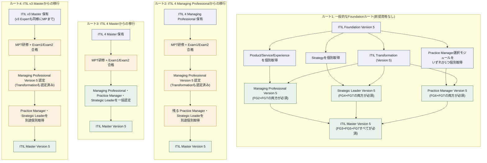
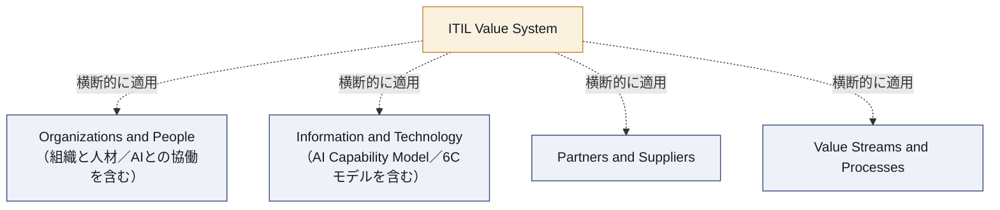
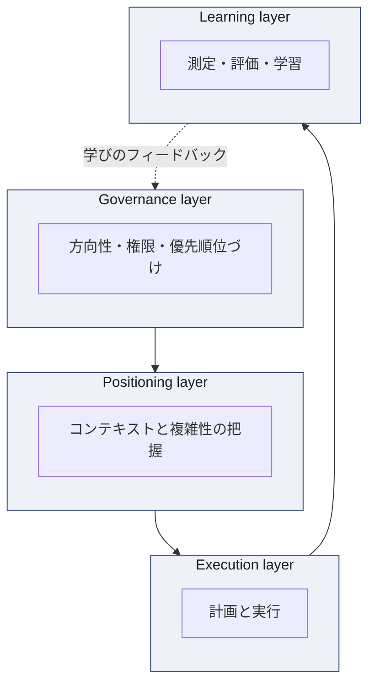
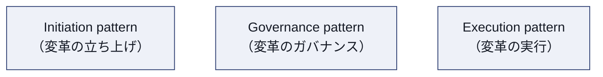
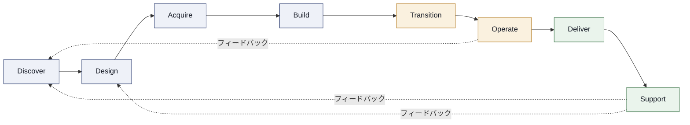
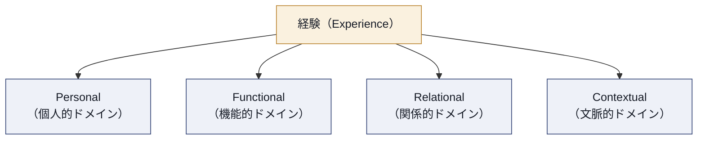
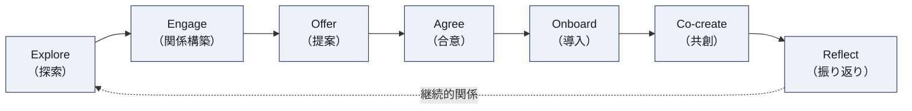
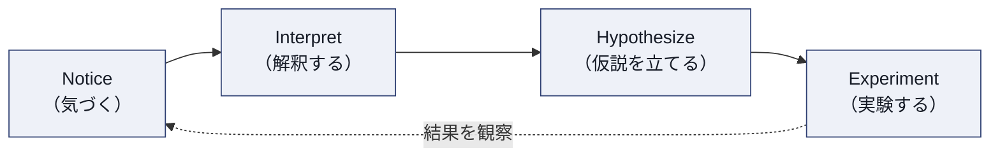
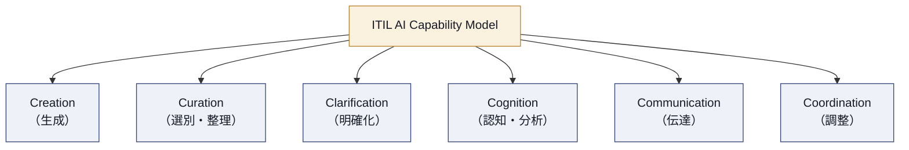

# ITIL® Managing Professional Transition (Version 5) 学習ガイド

初学者向け ステップバイステップ解説 + ベストプラクティス

---

## 目次

1. [この資格について](#1-この資格について)
2. [ITIL (Version 5) 全体像 — v3 / v4 からの進化](#2-itil-version-5-全体像--v3--v4-からの進化)
3. [共通基盤概念 — ITIL Value System・7つのGuiding Principles・Four Dimensions](#3-共通基盤概念--itil-value-system7つのguiding-principlesfour-dimensions)
4. [試験1: ITIL Transformation (Version 5)](#4-試験1-itil-transformation-version-5)
5. [試験2: ITIL Managing Professional Transition — Product, Service, Experience (Version 5)](#5-試験2-itil-managing-professional-transition--product-service-experience-version-5)
6. [共通トピック: ITIL and AI — AI Capability Model](#6-共通トピック-itil-and-ai--ai-capability-model)
7. [ITIL と他フレームワークとの関係（DevOps・PRINCE2）](#7-itil-と他フレームワークとの関係devopsprince2)
8. [試験対策のポイント](#8-試験対策のポイント)
9. [学習チェックリスト](#9-学習チェックリスト)
10. [参考文献（Sources）](#10-参考文献sources)

---

## 1. この資格について

### 1.1 ITIL Managing Professional Transition (Version 5) とは何か

**ITIL® Managing Professional Transition (Version 5)**（以下 MPT）は、すでに ITIL の上級資格を保有している経験豊富なプロフェッショナルが、個別モジュールを一つずつ受講し直すことなく、最新の **ITIL (Version 5)** へ迅速かつ低コストでアップグレードするための「橋渡し（ブリッジ）モジュール」です。

対象となるのは以下のいずれかの既存資格保持者のみです。

- ITIL 4 Managing Professional
- ITIL 4 Master
- ITIL v3 Expert
- ITIL v3 Master

> **ベストプラクティス:** 上記いずれの前提資格も持たない場合は MPT を受験できません。その場合は ITIL Foundation (Version 5) から開始し、ITIL Product / ITIL Service / ITIL Experience / ITIL Transformation の各モジュールを個別に取得するルートを選びます。

### 1.2 認定の位置づけ

MPT は「研修1本＋試験2本」で構成されるパッケージです。両方の試験に合格すると **ITIL Managing Professional (Version 5)** の資格が得られます。ITIL 最高位資格 **ITIL Master (Version 5)** に到達するには、これに加えて **ITIL Practice Manager (Version 5)** と **ITIL Strategic Leader (Version 5)** の2資格も必要です（3資格必須）。ただし、保有していた前提資格によってMPT経由での到達範囲が異なります。

- **ITIL 4 Managing Professional 保有者**: MPTの2試験合格により、Managing Professional (Version 5) と、中核モジュール **Transformation (Version 5)** の2つが認定されます（Exam 1 が Transformation の試験そのものであるため）。Master に到達するために残るのは Practice Manager と Strategic Leader の2資格で、これらは**別途個別に取得**する必要があります。
- **ITIL 4 Master 保有者**: MPTの2試験合格により、Managing Professional に加えて Practice Manager・Strategic Leader も同時に認定され、**ITIL Master (Version 5) まで一括で到達**します。
- **ITIL v3 Master 保有者**: MPTの2試験合格で得られるのは Managing Professional（および中核モジュール Transformation の認定）までです。Master に到達するには、Practice Manager と Strategic Leader を**別途個別に取得**する必要があります。

### 1.3 試験構成の全体比較

MPT は2つの独立した試験から構成され、**どちらから先に受験しても構いません**（別日程での受験も可）。

| 項目 | Exam 1: ITIL Transformation (Version 5) | Exam 2: MPT – Product, Service, Experience (Version 5) |
|---|---|---|
| 出題数 | 40問 | 60問 |
| 形式 | 多肢選択式（Multiple choice） | 多肢選択式（Multiple choice） |
| 試験時間 | 90分（非母語話者は+25%で約113分） | 120分（非母語話者は+25%で約150分） |
| 参照可否 | オープンブック（公式 Transformation eBook + シナリオ冊子） | オープンブック（公式 Product / Service / Experience eBook） |
| 合格基準 | 70% | 70% |
| 出題スタイル | シナリオベース（ケーススタディ形式） | シナリオベース（例: レンタカー会社ケース）＋ Experience セクション |
| 受験方式 | オンライン監督下試験（PeopleCert経由） | オンライン監督下試験（PeopleCert経由） |
| 主な学習範囲 | Transformation Model の4 Layer（Governance／Positioning／Execution／Learning）、変革パターン | PSLM 8活動、バリューストリーム、Experience Model、サービスジャーニー |

> **ベストプラクティス:** 2試験は独立採点のため、得意分野から着手する戦略が有効です。「変革・組織改革」の経験が長い方は Transformation から、「プロダクト/サービス運用」の実務経験が長い方は PSE から始めると学習の立ち上がりが早くなります。

### 1.4 公式教材

この認定コースには以下4冊の公式eBookと公式Learner Workbookが含まれます。

- ITIL Product (Version 5) 公式eBook
- ITIL Service (Version 5) 公式eBook
- ITIL Experience (Version 5) 公式eBook
- ITIL Transformation (Version 5) 公式eBook

> **注記:** 本ガイドは上記の公式教材および PeopleCert・各アクレディテッド・トレーニング・オーガナイゼーション（ATO）が公開している情報をもとに、初学者向けに再構成した学習補助資料です。公式eBookの正式な記述（成功要因・メトリクスの正確な文言など）については、必ず公式教材を最終参照源としてください。

### 1.5 資格の更新

- 更新サイクル: **3年ごと**
- 更新方法: 以下いずれかのルートで更新できる
  - PeopleCert Plus 会員として年間 **20 CPD ポイント** を **3年連続**で蓄積する（合計60ポイント）
  - 同一 Product Suite 内の**別の認定資格**に合格する
  - 同じ認定資格を再受験して合格する

---

## 2. ITIL (Version 5) 全体像 — v3 / v4 からの進化

MPT を学ぶ前提として、ITIL がどのように進化してきたかを理解しておくと、Transformation・PSE いずれの試験でも問われる「なぜこの変更が行われたか」という視点が持てます。

| 観点 | ITIL v3（2007） | ITIL 4（2019） | ITIL (Version 5)（2026） |
|---|---|---|---|
| 中核モデル | Service Lifecycle（5段階: Strategy/Design/Transition/Operation/CSI） | Service Value System + Service Value Chain（6活動） | ITIL Value System (ITIL VS)（Service Value Chain／6活動を構成要素として継続） + Product and Service Lifecycle Model／PSLM（8活動） |
| 対象範囲 | ITサービスマネジメント | ITサービスマネジメント（原則・プラクティス体系） | デジタル**プロダクト**とサービスの統合マネジメント |
| AIの扱い | 想定なし | 言及なし | Four Dimensionsの「情報と技術」にAI Capability Model(6Cモデル)を新設、「組織と人材」には人とAIの協働を明示的に統合、専用のAI Governanceモジュールも新設 |
| Guiding Principles | なし（v3独自の原則） | 7原則 | 7原則を**そのまま継承**（変更なし） |
| 管理プラクティス | 26プロセス+機能 | 34プラクティス | 34プラクティス名を**そのまま継承** |
| 認定体系 | Foundation→Practitioner→Intermediate→Expert→Master | Foundation→Specialist/Strategist/Leader→Master | Foundation→Practice Manager／Product・Service・Experience・Transformation（Managing Professional）／Strategy・Transformation（Strategic Leader）→Master（Practice Manager+Managing Professional+Strategic Leaderの3資格が必須） |

> **ベストプラクティス:** 試験対策としては「何が変わったか」だけでなく「何が変わっていないか」を明確に区別して覚えることが得点に直結します。Guiding Principlesと34プラクティス名は据え置きのため、既存のITIL 4知識はそのまま活用できます。

---

## 3. 共通基盤概念 — ITIL Value System・7つのGuiding Principles・Four Dimensions

Transformation試験・PSE試験のどちらにも共通して出題される土台となる概念です。

### 3.1 ITIL Value System (ITIL VS)

ITIL 4 の Service Value System (SVS) の名称が **ITIL Value System (ITIL VS)** に変更されました。これは「サービス」だけでなく「デジタルプロダクト」も価値創出の対象として明示的に含めるための改称であり、構成要素（Guiding Principles、Governance、Service Value Chain、Practices、Continual Improvement）自体の骨格はSVSを踏襲しています。Service Value Chain（6活動）はVersion 5でも中核の運用モデルとして維持され、これにプロダクト/サービス単位の視点を補うPSLM（8活動、[5.2節](#52-product-and-service-lifecycle-model-pslm--8つの活動)参照）が新たに加わりました。

### 3.2 7つの Guiding Principles（変更なし）

| # | 原則（英語） | 日本語での要点 |
|---|---|---|
| 1 | Focus on value | すべての活動を「顧客・利害関係者にとっての価値」から逆算して設計する |
| 2 | Start where you are | ゼロから作り直さず、既存の資産・プロセス・データを評価してから着手する |
| 3 | Progress iteratively with feedback | 大きな変更を小さく分割し、フィードバックを得ながら進める |
| 4 | Collaborate and promote visibility | サイロを越えた協働と、意思決定・進捗の可視化を重視する |
| 5 | Think and work holistically | 部分最適ではなく、組織全体・エンドツーエンドの結果に目を向ける |
| 6 | Keep it simple and practical | 必要最小限の手順にとどめ、価値を生まない複雑さを排除する |
| 7 | Optimize and automate | 人手作業を最適化したうえで、可能な範囲を自動化・AI活用する |

> **ベストプラクティス:** Version 5 では特に原則7「Optimize and automate」が AI Capability Model（後述）と直結して出題されやすくなっています。「まず最適化、その後に自動化」という順序を必ず押さえてください。

### 3.3 Four Dimensions of Product and Service Management

4つの側面自体はITIL 4から継続していますが、Version 5では「情報と技術」の次元にAI Capability Model（6Cモデル）が新設され、「組織と人材」の次元には人とAIの協働という観点が明示的に組み込まれた点が変更点です。

> **ベストプラクティス:** 4つの側面はPESTLE分析（政治・経済・社会・技術・法律・環境）などの外的要因とセットで問われることが多く、「内的な4側面 vs 外的な環境要因」を対比して整理しておくと理解が定着します。

---

## 4. 試験1: ITIL Transformation (Version 5)

### 4.1 Transformationの基本概念

ITIL Transformation (Version 5) は、組織（またはその一部）を新しい状態へ導く**変革（Transformation）**を体系的に扱うモジュールです。日常的な改善（BAU改善／Business-As-Usual improvement）とは区別され、以下のような特徴を持つ大規模・複雑な変化を対象とします。

- 複数の相互依存領域にまたがる協調的な変化である
- 規模・範囲・コスト・リスクにばらつきがある
- しばしば大きな不確実性を伴う
- 単一の固定手法では対応できず、状況に応じた柔軟な手法が必要

> **ベストプラクティス:** 「BAU改善」と「Transformation」を混同しないこと。小さな継続的改善はContinual Improvement Modelで扱い、組織構造やオペレーティングモデルそのものを変える取り組みはTransformation Modelで扱う、という切り分けが試験の頻出ポイントです。

### 4.2 ITIL Transformation Model — 4つの Layer

ITIL Transformation Model は、変革の取り組みを **4つの相互接続されたLayer（層）** で構造化します。さらに、その内部は合計12のStage（段階）に分解され、状況（Context）に応じて適応的に適用されます。

| Layer | 役割 |
|---|---|
| **Governance layer**（ガバナンス層） | 変革の方向性を定め、意思決定権限・説明責任・優先順位づけの枠組みを提供する |
| **Positioning layer**（ポジショニング層） | 組織が置かれている状況・複雑性・コンテキストを理解し、変革のスコープを見極める |
| **Execution layer**（実行層） | 実際に変革を計画・実施し、価値を届ける |
| **Learning layer**（学習層） | 変革の結果を測定・評価し、得られた学びを組織にフィードバックする |

> **ベストプラクティス:** 4 Layerは「一方向の直線プロセス」ではなく、Learning layerで得た知見がGovernance layerに継続的にフィードバックされる**循環構造**です。試験では「変革は一度きりで完了するものではない」という前提を問う設問が出やすいです。

### 4.3 変革の複雑性とコンテキストへの適応

組織が置かれる状況は「予測可能で秩序立っている（Ordered）」ものから「予測不能で混沌としている（Chaotic）」ものまで幅があります。また、そもそも状況の性質がまだ理解されていない「混乱している（Confused）」状態もあり、この場合は他のアプローチを選ぶ前にまず状況を正しく分類する必要があります。ITIL Transformation Modelはこの違いに応じてアプローチを変える柔軟性を持つことが特徴です。

| コンテキストの性質 | 適したアプローチの傾向 |
|---|---|
| 混乱している（Confused）・状況がまだ理解されていない | まず状況を正しく分類することを最優先し、分類結果に応じたアプローチを選択する |
| 秩序立っている・予測可能（Ordered） | 詳細な事前計画、明確なガバナンス、既知のベストプラクティスの適用 |
| 複雑・不確実性が高い（Complex） | 小さな実験、反復的な学習、適応型ガバナンス |
| 混沌としている（Chaotic） | 即座の安定化を最優先し、状況を落ち着かせてから通常のアプローチへ移行 |

> **ベストプラクティス:** 「すべての変革に同じテンプレートを当てはめない」ことが最重要原則です。秩序立った環境で通用した詳細計画型のガバナンスを、混沌とした環境にそのまま適用すると失敗しやすい、という因果関係を理解しておきましょう。

### 4.4 変革の3つの共通パターン（Common Patterns）

ITIL Transformation Model は、変革の取り組みを分類する **3つの共通パターン** を提示します。

- **Initiation pattern（立ち上げパターン）**: なぜ変革が必要か、どこから着手するかを明確化する
- **Governance pattern（ガバナンスパターン）**: BAU（通常業務）向けのガバナンスと、変革専用のガバナンスをどう使い分けるかを扱う
- **Execution pattern（実行パターン）**: 実際に変革をどのように進めるか、実行方式のバリエーションを扱う

> **ベストプラクティス:** 「BAU governance patterns」と「Transformation governance patterns」は明確に別物として区別してください。通常業務のガバナンス機構（変更諮問委員会など）をそのまま大規模変革の意思決定に流用すると、意思決定が遅延し変革が停滞するリスクがあります。

### 4.5 測定・ツール・学習

Transformation Model の Learning layer では、変革の進捗と成果を可視化するためのツール・手法が扱われます。既存のITILおよび隣接するプラクティスから、以下のようなツール群が変革の測定・可視化に活用されます。

| ツール／手法 | 主な用途 |
|---|---|
| Value Stream Mapping (VSM) | エンドツーエンドの価値の流れを可視化し、ムダ・ボトルネックを特定する |
| OKR（Objectives and Key Results） | 変革のゴールと測定可能な成果指標を組織全体で整合させる |
| ITIL Maturity Model | 現在の成熟度を評価し、変革の出発点（Positioning）を客観的に把握する |

> **ベストプラクティス:** 「Start where you are」の原則を実務に落とし込む際、まずITIL Maturity Modelなどで現状を客観的に測定してから変革を計画すると、過剰投資や見当違いな施策を避けられます。

### 4.6 ITIL and AI（Transformation観点）

AIはTransformationにおいても、変革準備・実行そのものを支援する手段として位置づけられます（AI Capability Modelの詳細は[第6章](#6-共通トピック-itil-and-ai--ai-capability-model)を参照）。変革を主導する立場では、AI導入が「組織構造・役割・意思決定プロセス」にどう影響するかを評価し、ガバナンス層で適切な監督体制を設計することが求められます。

---

## 5. 試験2: ITIL Managing Professional Transition — Product, Service, Experience (Version 5)

この試験は、ITIL Product・ITIL Service・ITIL Experience という3つのモジュールの内容を1本の試験に統合したものです。

### 5.1 デジタルプロダクトとデジタルサービスの基礎概念

| 用語 | 定義の要点 |
|---|---|
| **Digital product（デジタルプロダクト）** | デジタル技術によって実現される、顧客が利用・所有・体験する成果物そのもの |
| **Digital service（デジタルサービス）** | 顧客が特定のコストやリスクを自ら管理することなく、望む成果（アウトカム）の共創を可能にする手段 |
| **Service offering（サービスオファリング）** | プロダクトとサービスの構成要素を組み合わせ、特定の顧客セグメント向けに提供される形 |

> **ベストプラクティス:** 「アウトプット（何を作ったか）」ではなく「アウトカム（顧客が何を達成できたか）」で価値を語る癖をつけましょう。PSE試験のシナリオ問題は、アウトプット思考の選択肢を誤答の罠として用意することが多いです。

### 5.2 Product and Service Lifecycle Model (PSLM) — 8つの活動

ITIL 4 の Service Value Chain（6活動：Plan, Improve, Engage, Design & Transition, Obtain & Build, Deliver & Support）は、Version 5 でも中核の運用モデルとして維持されています。これに加えて、Version 5 では新たに **Product and Service Lifecycle Model（PSLM）** が導入され、プロダクト/サービス単位の視点から**8つの反復的（iterative）な活動**として整理されました。

固定された一方向の手順ではなく、必要に応じてどの活動からどの活動へも行き来できる**循環的・生態系的（ecosystem）なモデル**である点が最大の特徴です。

> **注記:** この図は8つの活動の関係性を示す例示的なValue Streamであり、必ずこの順序で実行すべき固定シーケンスではない。文脈（コンテキスト）に応じて、活動は組み合わせたり、繰り返したり、並行して実施したり、後戻りして再訪したりしてよい。

8つの活動はいずれもプロダクトとサービスの両方に共通して適用される、単一のライフサイクルを構成します。学習の便宜上、Discover・Design・Acquire・Buildを**プロダクト寄りの活動**、Deliver・Supportを**サービス寄りの活動**、中間のTransition・Operateを両者の**橋渡し**として捉える整理の仕方もありますが、これはあくまで理解を助けるための任意の視点であり、活動そのものが対象を限定するものではありません。

| 活動 | 目的（要点） | プロダクト視点でのベストプラクティス | サービス視点でのベストプラクティス |
|---|---|---|---|
| **Discover** | 市場・利用者のニーズを把握し、組織戦略と整合させる | 顧客インタビューやテレメトリでニーズを検証してから投資判断を行う | 既存サービスの利用状況データから未充足ニーズを発見する |
| **Design** | 得られたニーズを解決策の仕様・プロトタイプへ落とし込む | プロトタイピングで早期に仮説検証を行う | サービスレベル・キャパシティ・可用性要件を設計段階で明文化する |
| **Acquire** | 必要な資源・能力を購入・調達・内製で確保する | ビルド・バイ・パートナーの判断基準を明確化する | サプライヤーとのサービスレベル整合を早期に行う |
| **Build** | コンポーネントを開発・構成・テストする | 自動テストとコードレビューを組み込み品質を作り込む | 変更管理プロセスと開発の足並みを揃える |
| **Transition** | 開発環境から本番環境へ安全に移行する | フィーチャーフラグによる段階的リリースでリスクを制御する | リリース前チェックリストとロールバック手順を用意する |
| **Operate** | インフラ・システムを稼働させ続け、パフォーマンスを監視する | SLOやダッシュボードで健全性を可視化する | イベント管理・キャパシティ管理を継続的に実施する |
| **Deliver** | 利用者がサービス・プロダクトへアクセスし消費できるようにする | オンボーディング体験を計測しコンバージョンを最適化する | アクセス管理・リクエスト対応の応答時間を管理する |
| **Support** | インシデント・問題を解決し、通常利用を回復する | 障害データをDiscover・Designへフィードバックし次期改善に活かす | 根本原因分析（Problem Management）を通じ再発を防止する |

> **ベストプラクティス（PSLM全体）:** 8活動を「順番に一度だけ通る」線形プロセスとして覚えないこと。実際には同じプロダクト・サービスが複数の活動に同時に存在し得ます（例: 一部機能はSupport段階、別機能はDesign段階）。Supportで得た学びをDiscover・Designに戻す**フィードバックループ**の存在が、Version 5最大の設計思想です。

### 5.3 ライフサイクルの管理 — バリューストリームとオペレーティングモデル

PSLMの8活動は固定順序ではなく、状況に応じて組み合わせられる **バリューストリーム（value stream）** として運用されます。

| 概念 | 要点 |
|---|---|
| **Operating model（オペレーティングモデル）** | 誰が・どの活動に対して・どのような責任を持つかを定義する構造 |
| **Value stream（バリューストリーム）** | 特定の需要・機会に応える際に組み合わせる活動の連なり（例: インシデント対応はOperate+Support中心、新機能開発はDiscover→Design→Build→Deliver中心） |
| **組織構造** | プロダクトベンダー視点とサービスプロバイダー視点で、必要なチーム編成・権限分掌が異なる |

> **ベストプラクティス:** 「このインシデントにはどのバリューストリームが最適か」を都度設計するのではなく、頻出パターン（標準的なリクエスト対応、緊急インシデント対応、新規機能デリバリーなど）ごとに**あらかじめ標準バリューストリームを定義**しておくと、意思決定の速度と一貫性が向上します。

### 5.4 ITIL Experience Model

Version 5 で新設された Experience の考え方は、「機能的に動くこと」と「利用者にとって価値があると感じられること」を明確に区別します。

#### 5.4.1 経験（Experience）の本質

経験は次の3つの要素の連続として捉えられます。

- **Anticipation（予期）**: 利用前に抱く期待
- **Perception（知覚）**: 利用中に得られる感覚・認知
- **Evaluation（評価）**: 利用後に行う価値判断

> **ベストプラクティス:** 経験は主観的かつ時間軸を持つものであり、単発のアンケートスコアだけで捉えきれません。利用前・利用中・利用後の3時点でデータを収集する設計が推奨されます。

#### 5.4.2 経験のステークホルダー

| 役割 | 説明 |
|---|---|
| User（利用者） | サービス・プロダクトを実際に操作する人 |
| Customer（顧客） | 購入や契約の意思決定を行うスポンサー的役割 |
| Consumer sponsor（消費側スポンサー） | 消費側組織で投資判断・優先順位づけを行う人 |
| Provider roles（提供側の役割） | サービス・プロダクトを設計・提供する側の関係者 |

これらの役割間には、しばしば利害の**緊張関係（tension）**が生じます（例: 利用者は使いやすさを最優先するが、顧客側スポンサーはコストを最優先する、など）。

> **ベストプラクティス:** 意思決定の際は「誰にとっての経験を最適化しようとしているか」を明示すること。UserとCustomerの利害が対立する場面では、両者の要件をトレードオフ表として可視化し、合意形成のプロセスに乗せます。

#### 5.4.3 Four Experience Domains（4つの経験ドメイン）

| ドメイン | 内容の要点 |
|---|---|
| Personal（個人的） | 個人の感情・価値観・過去の経験に根ざした主観的側面 |
| Functional（機能的） | サービス・プロダクトが実際に機能するか、使いやすいかという実務的側面 |
| Relational（関係的） | 提供者と利用者・顧客との信頼関係、コミュニケーションの質 |
| Contextual（文脈的） | 利用される状況・環境・タイミングに左右される側面 |

> **ベストプラクティス:** 経験改善の施策を立てる際、4ドメインのうちどれに働きかけているかを明確にしましょう。機能的ドメインの改善（バグ修正など）だけでは、関係的ドメイン（サポート対応への不信感など）の課題は解決しません。

#### 5.4.4 経験のライフサイクルへの統合

経験はPSLMの各活動を通じて連続的に生じます。特に重要なのが以下の区別です。

- **Functional interaction（機能的相互作用）**: 「機能が動くかどうか」に関わる接点
- **Relational interaction（関係的相互作用）**: 「人と人・組織との関係性」に関わる接点

> **ベストプラクティス:** SupportやOperateで発生する障害対応は機能的相互作用ですが、対応中のコミュニケーションの質は関係的相互作用です。同じインシデントでも、機能は復旧したのに信頼は損なわれる、というケースを想定した対応設計が必要です。

#### 5.4.5 経験のキャプチャ（Capturing Experience）

| 要素 | 説明 |
|---|---|
| Evidence（証拠） | 経験を裏付ける具体的なデータ・記録 |
| Signal（シグナル） | 経験の変化を示唆する断片的な兆候 |
| 直接キャプチャ（Direct） | アンケート、インタビューなど直接的な収集手法 |
| 間接キャプチャ（Indirect） | 行動ログ、利用データなど間接的な収集手法 |
| 合成キャプチャ（Synthetic） | AIによる推定・シミュレーションなど合成的な収集手法 |
| Trustworthiness（信頼性） | データがどれだけ実態を正確に反映しているか |
| Coherence（一貫性） | 複数のデータソース間で矛盾がないか |

> **ベストプラクティス:** 「メトリクスは経験そのものではなく、経験に関する仮説（hypothesis）にすぎない」という考え方がVersion 5の重要な視点です。単一の指標（例: NPS）だけで経験全体を判断せず、複数のシグナルを組み合わせてTrustworthinessとCoherenceを検証してください。

**よくあるアンチパターン（Common Anti-patterns in Experience Capturing）**

- 定量データのみに依存し、定性的な文脈を無視する
- サンプル数が偏ったフィードバックを全体の声として扱う
- ネガティブなシグナルを個別の例外として片付け、パターンとして扱わない

#### 5.4.6 サービスジャーニー（Service Journey）— 7つのステップ

サービスジャーニーは、提供者（Provider）と消費者（Consumer）が関係を構築し価値を共創するまでの活動全体を指します。固定的な直線プロセスではなく「飛び石（stepping stones）」として、順序の入れ替わりや並行・反復が起こり得るとされています。

> **注記:** この図は7つのステップの関係性を示す例示的な「飛び石（stepping stones）」であり、必ずこの順序で実行すべき固定シーケンスではない。文脈（コンテキスト）に応じて、ステップは組み合わせたり、繰り返したり、並行して実施したり、順序が入れ替わったりしてよい。

| ステップ | 内容 |
|---|---|
| **Explore（探索）** | 正式な関係が始まる前に、機会・市場・ニーズを探る段階 |
| **Engage（関係構築）** | 信頼関係を構築する。以降のパートナーシップの前提となる |
| **Offer（提案）** | 需要を明確な要件・ビジネスケースへ落とし込み、提供可能な内容をすり合わせる |
| **Agree（合意）** | 期待値・スコープ・サービス品質を正式に取り決め、価値の測定方法を計画する |
| **Onboard（導入）** | 双方のリソースを実際に統合（または分離）し、運用を開始する |
| **Co-create（共創）** | 消費者が提供者のリソースを活用し、両者が協働して計画された価値を生み出す実行段階 |
| **Reflect（振り返り）** | 提供された価値を評価し、フィードバックを継続的改善や今後の投資判断に活かす |

**Band of Visibility（可視性の帯）**

提供者と消費者の間で共有される透明性の領域を指します。パートナーシップが密接になるほどこの帯は広がり、問題解決や共創がしやすくなります。この可視性の中で重要な2つの満足軸が以下です。

| 軸 | 焦点 |
|---|---|
| **CX（Customer Experience）** | 顧客（購入・契約の意思決定者）の機能的・感情的な知覚 |
| **UX（User Experience）** | 実際の操作者（エンドユーザー）が感じる、プロダクト設計・使いやすさに基づく経験 |

> **ベストプラクティス:** UXが悪ければ利用者は不満を抱き、CXが悪ければ顧客は契約更新をしません。どちらか一方の指標だけでサービス品質を判断せず、UXとCXを**両輪**として計測・改善する体制を作ることが重要です。

#### 5.4.7 ステークホルダージャーニー（Stakeholder Journeys）

サービスジャーニーを消費者側・提供者側それぞれの視点で見た詳細な軌跡を **Stakeholder Journey** と呼びます。各ジャーニータイプには、典型的な懸念事項（concerns）とアンチパターンが伴います。

| ジャーニー種別 | 典型的な懸念 | 実務上の示唆 |
|---|---|---|
| Consumer stakeholder journey | 期待した価値が得られるか、コストに見合うか | 合意（Agree）段階で成功基準を明文化し、Reflect段階で必ず振り返る |
| Provider stakeholder journey | 持続可能な形で価値を提供し続けられるか、リソースが枯渇しないか | Onboard段階でキャパシティとリスクを事前評価する |

> **ベストプラクティス:** どちらのジャーニーも「合意した期待値」と「実際の体験」のギャップがアンチパターンの温床になります。Agreeステップで合意した内容を、Reflectステップで必ず定量・定性の両面から照らし合わせる運用ルールを設けましょう。

#### 5.4.8 デジタル経験の改善 — Notice–Interpret–Hypothesize–Experiment ループ

Experienceの継続的改善は、ITILの **Continual Improvement Model** の枠組みの中で、以下の4段階ループとして適用されます。

| 段階 | 内容 |
|---|---|
| Notice（気づく） | シグナル・証拠の中から注目すべき変化に気づく |
| Interpret（解釈する） | その変化が何を意味するかを文脈に沿って解釈する |
| Hypothesize（仮説を立てる） | 改善のための仮説を立てる |
| Experiment（実験する） | 小規模な実験でその仮説を検証する |

またこのループの中では、**システムレベルの改善**（オペレーティングモデルや構造そのものの変更）と、**局所的な改善**（個別の画面・対応フローの改善）を区別することが求められます。

> **ベストプラクティス:** 経験改善の実験は、心理的安全性（psychological safety）と信頼が確保された環境でこそ機能します。担当者が「失敗を報告しても罰せられない」文化がなければ、Noticeの段階でネガティブなシグナルが隠蔽されるリスクがあります。

---

## 6. 共通トピック: ITIL and AI — AI Capability Model

Transformation・PSE いずれの試験でも共通して問われるのが **AI Capability Model** です。これは、組織がAIをどう活用し、どうガバナンスするかを整理するための思考ツールで、**6つの能力（Capability）** から構成されます。

| 能力 | 概要 |
|---|---|
| **Creation（生成）** | コンテンツ・コード・成果物を新たに生成する能力 |
| **Curation（選別・整理）** | 大量の情報・選択肢の中から関連性の高いものを選別・整理する能力 |
| **Clarification（明確化）** | あいまいな要求や情報を明確化・要約する能力 |
| **Cognition（認知・分析）** | パターン認識・推論・分析を行う能力 |
| **Communication（伝達）** | 人や他システムとの対話・情報伝達を行う能力 |
| **Coordination（調整）** | 複数のタスク・エージェント・人を調整し連携させる能力 |

この6能力ごとに、必要なガバナンス（責任範囲・説明責任・委任・透明性・エスカレーション経路）とリスクプロファイルが異なります。

> **ベストプラクティス:** AI導入の議論を「AIを使うか使わないか」という二択で終わらせず、**「どの能力を、どの業務に、どの程度の人間の関与を残して適用するか」**という粒度で設計しましょう。AI Capability Modelは、チーム間の暗黙の前提のズレを減らし、構造的な合意形成を可能にするためのツールです。
>
> **ベストプラクティス（Experience×AI）:** ITIL Experience (Version 5) では、AI活用における「意思決定の境界線」「人間へのハンドオフのルール」「AI Capability Model カードの文書化」「一貫して人間中心であり続けるコミットメント」が明示的に求められます。AIは人が自信を持って使いこなして初めて価値を生む、という前提を忘れないでください。

---

## 7. ITIL と他フレームワークとの関係（DevOps・PRINCE2）

MPTの両試験では、ITILを単独のフレームワークとしてではなく、他の主要フレームワークと**補完的に使う視点**が問われます。

| フレームワーク | ITILとの関係性 |
|---|---|
| **DevOps** | PSLMのBuild〜Transition〜Operateにおける継続的インテグレーション／デリバリーの実践知を提供する。ITILは「何を・なぜ」管理するかの枠組み、DevOpsは「どう」実行するかの実践プラクティス群として補完し合う |
| **PRINCE2** | 大規模な変革やプロジェクト単位の作業を構造化するプロジェクトマネジメント手法。ITIL Transformationの実行層（Execution layer）で、プロジェクトとして管理すべき取り組みにはPRINCE2のガバナンス構造を組み合わせられる |

> **ベストプラクティス:** 「ITIL vs DevOps」「ITIL vs PRINCE2」という対立構造で捉えないこと。ITILは価値創出のための包括的な枠組みであり、DevOpsやPRINCE2は特定の活動（継続的デリバリー、プロジェクト管理）をより深く実行するための専門的な実践知として併用するのが正しい理解です。

---

## 8. 試験対策のポイント

### 8.1 シナリオベース試験への向き合い方

両試験とも、架空の企業（レンタカー会社のケースなど）を舞台にしたシナリオ問題が出題されます。

> **ベストプラクティス:**
> - シナリオ文中の「誰の視点で問われているか（利用者／顧客／提供者）」を最初に特定する
> - 「最も正しそうな選択肢」ではなく「ITILの原則・モデルに最も忠実な選択肢」を選ぶ
> - オープンブック試験であることを過信せず、キーワード（PSLMの活動名、Transformation Modelの層名など）から該当ページを即座に引ける索引を事前に作っておく

### 8.2 試験別の学習配分の目安

| 試験 | 重点的に固める領域 | 学習の優先順位 |
|---|---|---|
| Exam 1: Transformation | 4 Layer（Governance/Positioning/Execution/Learning）の役割分担、3つの共通パターン（Initiation/Governance/Execution）、BAU governanceとTransformation governanceの違い | 「なぜこの層・パターンが選ばれるか」を状況（コンテキスト）と結びつけて説明できるレベルまで理解する |
| Exam 2: MPT-PSE | PSLM 8活動の目的とプロダクト/サービス両視点、Experience Modelの4ドメイン、サービスジャーニー7ステップ、経験キャプチャの信頼性・一貫性 | 8活動とExperience Modelを「1つのシナリオ企業」に当てはめて一気通貫で説明できるレベルまで理解する |

> **ベストプラクティス:** 学習の終盤には、架空の1社（例: サブスクリプション型のモビリティサービス企業）を題材に、Discoverから Reflect まで全プロセスを自分の言葉で通しで語れるかを自己テストしてください。個々の用語の暗記より、モデル間のつながりを説明できることの方が得点に直結します。

### 8.3 頻出の誤答パターン（Common Pitfalls）

- PSLMの8活動を「一方向の直線プロセス」として答えてしまう（正しくは反復的・循環的）
- Service Value ChainとPSLMを混同する（ITIL 4とITIL（Version 5）の用語を取り違える）
- メトリクス（数値指標）を「経験そのもの」と誤認する（正しくは経験に関する一つの仮説にすぎない）
- BAU改善とTransformationを同じ手法で扱おうとする
- CXとUXを同一視し、どちらか一方の改善で両方が解決すると誤解する

---

## 9. 学習チェックリスト

- [ ] 前提資格（ITIL 4 MP/Master、ITIL v3 Expert/Master）を保有していることを確認した
- [ ] Exam 1（Transformation: 40問/90分）とExam 2（PSE: 60問/120分）の違いを説明できる
- [ ] ITIL VS（旧SVS）、7つのGuiding Principles、Four Dimensions（AI統合済み）を説明できる
- [ ] ITIL Transformation Modelの4 Layer（Governance/Positioning/Execution/Learning）を図なしで説明できる
- [ ] 変革の3つの共通パターン（Initiation/Governance/Execution）を区別できる
- [ ] BAU governance patternとTransformation governance patternの違いを説明できる
- [ ] PSLMの8活動（Discover〜Support）を目的付きで暗唱できる
- [ ] PSLMがプロダクト寄り/橋渡し/サービス寄りにどう分かれるか説明できる
- [ ] バリューストリームとオペレーティングモデルの違いを説明できる
- [ ] ITIL Experience Modelの3要素（Anticipation/Perception/Evaluation）を説明できる
- [ ] Four Experience Domains（Personal/Functional/Relational/Contextual）を区別できる
- [ ] サービスジャーニー7ステップ（Explore〜Reflect）の各ステップの目的を説明でき、順序の入れ替わり・並行実施・反復が起こり得ることを理解している
- [ ] Band of VisibilityとCX/UXの違いを説明できる
- [ ] ステークホルダージャーニー（Consumer/Provider）の典型的な懸念とアンチパターンを説明できる
- [ ] Notice–Interpret–Hypothesize–Experimentループを説明できる
- [ ] AI Capability Modelの6能力（Creation/Curation/Clarification/Cognition/Communication/Coordination）を暗唱できる
- [ ] ITILとDevOps、ITILとPRINCE2の補完関係を説明できる
- [ ] 公式eBook（Product/Service/Experience/Transformation）でシナリオ問題の該当箇所を素早く参照できる

---

## 10. 参考文献（Sources）

本ガイドの作成にあたり、以下の一次情報・研修プロバイダー公開情報を参照しました。公式かつ最終的な正確性の担保としては、必ず PeopleCert 公式ページおよび公式eBookをご確認ください。

### PeopleCert 公式・ITIL公式情報

1. ITIL Managing Professional Transition (Version 5) — PeopleCert公式ページ
   https://www.peoplecert.org/browse-certifications/it-governance-and-service-management/ITIL-1/itil-managing-professional-transition-version-5-4227
2. ITIL AI Governance (Version 5) — PeopleCert公式ページ
   https://www.peoplecert.org/browse-certifications/it-governance-and-service-management/ITIL-1/itil-ai-governance-version-5-4234
3. ITIL Experience (Version 5) 関連ページ — PeopleCert
   https://www.peoplecert.org/Itil-News-and-Announcements/2026-qualiti7-peoplecert-webinar-series-ai-native-organization-session-3/browse-certifications/it-governance-and-service-management/ITIL-1/itil-experience-version-5-4177
4. ITIL Product (Version 5) — itil.com 公式解説
   https://www.itil.com/professionals/certifications/ITIL-Product-Version-5
5. ITIL Experience (Version 5) — itil.com 公式解説
   https://www.itil.com/professionals/certifications/ITIL-Experience-Version-5
6. ITIL Transformation (Version 5) — itil.com 公式解説
   https://www.itil.com/professionals/certifications/ITIL-Transformation-Version-5
7. ITIL AI Governance (Version 5) — itil.com 公式解説
   https://www.itil.com/professionals/certifications/ITIL-AI-Governance-Version-5
8. ITIL Foundation (Version 5)、what's new? — itil.com
   https://www.itil.com/Itil-News-and-Announcements/itil-version-5-foundation-whats-new-guide
9. The new ITIL product and service lifecycle model — itil.com
   https://www.itil.com/Itil-News-and-Announcements/itil-product-and-service-lifecycle-model
10. ITIL (Version 5) AI Governance guidance（AI Capability Model背景）— itil.com
    https://www.itil.com/Itil-News-and-Announcements/itil-version-5-ai-governance-guidance
11. How ITIL Experience (Version 5) puts user experience at the core — itil.com
    https://www.itil.com/Itil-News-and-Announcements/itil-version-5-experience-user-experience
12. Introducing ITIL (Version 5): Everything you need to know — ILX Group
    https://www.ilxgroup.com/usa/blog/introducing-itil-version-5-everything-you-need-to-know-about-the-new-certification-scheme
13. ITIL Transformation (Version 5) コース概要 — ILX Group
    https://www.ilxgroup.com/usa/training/itil/itil-transformation-version-5
14. ITIL Experience (Version 5) コース概要 — ILX Group
    https://www.ilxgroup.com/usa/training/itil/experience

### 認定研修プロバイダー（ATO）によるシラバス・コース詳細

15. ITIL Managing Professional Transition (Version 5) Training — AGILEPM HUB（モジュール構成・試験詳細が最も網羅的）
    https://agilepmhub.com/itil-managing-professional-version-5
16. ITIL Experience (Version 5) Training — AGILEPM HUB
    https://agilepmhub.com/itil-experience-version-5
17. ITIL Managing Professional Transition Training — Learning Tree
    https://www.learningtree.com/courses/itil-managing-professional-transition-version-five/
18. ITIL Experience (Version 5) Training — Learning Tree
    https://www.learningtree.com/courses/itil-experience-version-five-training/
19. ITIL Managing Professional Transition — QA
    https://www.qa.com/course-catalogue/courses/itil-managing-professional-transition-itil5trns/
20. ITIL Managing Professional Transition — ITSM Academy
    https://itsmacademy.com/itil-version-5-managing-professional-transition-course
21. ITIL Transformation Course — ITSM Academy
    https://itsmacademy.com/itil-transformation-course
22. ITIL 5 Managing Professional Transition — The Knowledge Academy（試験シラバス詳細）
    https://www.theknowledgeacademy.com/courses/itil-training/itil-5-managing-professional-transition-training-course/
23. ITIL 5 Managing Professional Transition Course — itil.org.uk（Experience詳細モジュール構成）
    https://www.itil.org.uk/training/itil-managing-professional-certification/itil-5-managing-professional-transition-training-course
24. ITIL Transformation Certification Training Course — itil.org.uk
    https://www.itil.org.uk/training/itil-transformation-courses/itil-transformation-certification-training-course
25. ITIL Transformation Course & Examination — ITSM Hub
    https://www.itsmhub.com/products/itil-transformation-course-examination
26. ITIL Managing Professional Transition (Version 5) — Oxford College of Technology
    https://www.oxfordcollegeoftechnology.com/itil-version-5/itil-managing-professional-transition-version-5/
27. ITIL Experience (Version 5) — Oxford College of Technology
    https://www.oxfordcollegeoftechnology.com/itil-version-5/itil-experience-version-5/
28. What Comes After ITIL Foundation? — Expert Train
    https://www.expertrain.co.uk/post/what-comes-after-itil-foundation
29. ITIL Experience (Version 5) — Sapience Consulting
    https://www.sapience-consulting.com/itil-experience-certification-v5/
30. ITIL Experience (Version 5) / Transformation (Version 5) / AI Governance (Version 5) — Advanced Training
    https://advancedtraining.com.au/product/itil-experience-version-5/
    https://advancedtraining.com.au/product/itil-transformation-version-5/
    https://advancedtraining.com.au/product/itil-ai-governance-version-5/
31. ITIL Transformation (Version 5) Practice Tests（4層・12ステージ・3パターンの出典）— Udemy
    https://www.udemy.com/course/itil-transformation-version-5-practice-tests/
32. ITIL (Version 5) Transformation Training Course — ITSM Academy
    https://itsmacademy.com/itil-transformation-course

### 解説記事・比較コンテンツ

33. ITIL 5 vs ITIL 4: What Changed in ITIL (Version 5) — InvGate Blog
    https://blog.invgate.com/itil-5-what-changes
34. What is ITIL? Principles, Practices, And Certification — InvGate
    https://invgate.com/itsm/itil
35. What is ITIL Service Operation? — InvGate Blog
    https://blog.invgate.com/itil-service-operation
36. ITIL (Version 5) Service Value Chain — NovelVista
    https://www.novelvista.com/blogs/it-service-management/itil5-service-value-chain
37. 5 Stages of the ITIL Service Lifecycle — Alloy Software
    https://www.alloysoftware.com/blog/itil-lifecycle/
38. ITIL 5 What changed and why it matters — Rixmind
    https://rixmind.com/itil-5-what-changed-and-why-it-matters/
39. ITIL Version 5: A Complete Guide — itil.org.uk Blog
    https://www.itil.org.uk/blog/itil-version-5-a-complete-guide
40. ITIL 5 AI Governance: What It Means and How to Apply It in ITSM — Dion Training
    https://www.diontraining.com/blogs/news/itil-5-ai-governance
41. ITIL (Version 5) Changes Explained: 20 Important Changes from ITIL 4 — ITSM.tools
    https://itsm.tools/itil-version-5-vs-itil-4-key-changes/
42. ITIL 5 Foundation: Syllabus, Exam Format, And How To Pass — Dion Training
    https://www.diontraining.com/collections/itil-5-foundation
43. ITIL 5 Process Explained: Practices, Workflows, And Real-World Examples — Dion Training
    https://www.diontraining.com/blogs/news/itil-5-process
44. ITIL 5 vs ITIL 4: Key Differences And Which One To Choose — Dion Training
    https://www.diontraining.com/blogs/news/itil-5-vs-itil-4
45. ITIL Foundation Version 5 (ITILFND V5): Complete Guide 2026 — CertEmpire
    https://certempire.com/itil-foundation-v5-guide/
46. ITIL 5: Why Explaining Failures Is No Longer Leadership — Medium (The ITSM Practice Podcast)
    https://medium.com/the-itsm-practice-podcast/itil-5-the-end-of-explaining-failure-f24ccae28573
47. Service Journey in ITIL 5: The Complete Guide（サービスジャーニー7ステップの出典）— PMG Academy
    https://www.pmgacademy.com/en/articles/itil/service-journey-in-itil-5-the-complete-guide-to-customer-experience-and-digital-value/
48. The Definitive Guide to ITIL Version 5 Foundation — PMG Academy
    https://www.pmgacademy.com/en/articles/itil/the-definitive-guide-to-itil-version-5-foundation/

---

*本ガイドは2026年9月時点で公開されていた一次・二次情報をもとに作成した学習補助資料であり、PeopleCert公式教材の内容を正式に代替するものではありません。特に ITIL Transformation Model の12ステージの正式名称、各PSLM活動のCSF（成功要因）・メトリクスの正確な文言、試験の最新の出題傾向については、必ず公式eBookおよびPeopleCert公式サイトの最新情報をご確認ください。*
