# ITIL® Product (Version 5) 学習ガイド

## デジタルプロダクトを「統合されたバリューストリーム」としてマネジメントする — 初学者向け徹底解説

---

> **本ガイドについて（免責事項）**
> 本ガイドは、PeopleCert International Limitedが公開している公式シラバス「*ITIL® Product | Syllabus, Version 5.0 PL (February 2026)*」の学習目標(Learning Outcomes)・評価基準(Assessment Criteria)・試験構成に基づき、独学者向けに作成した**非公式の学習補助資料**です。ITIL®、PeopleCert®は PeopleCert International Limited の登録商標です。
> 本ガイドは公式教材(Official Book / Learning Resource Kit)の複製ではなく、公開情報をもとに著者独自の言葉で再構成した解説です。試験直前の一次情報としては、必ず **ITIL® Product (Version 5) Official Book** を参照してください。
> 各セクション末尾に根拠となる出典URLを記載しています。

---

## 目次

1. [ITIL Product (Version 5)とは何か](#1-itil-product-version-5とは何か)
2. [試験概要と出題形式](#2-試験概要と出題形式)
3. [基礎概念:デジタルプロダクトとサービス(Category 1)](#section3-basic-concepts)
4. [ITIL Product and Service Lifecycle Model全体像](#4-itil-product-and-service-lifecycle-model全体像)
5. [Discover(発見)活動](#5-discover発見活動)
6. [Design(設計)活動](#6-design設計活動)
7. [Acquire(調達)活動](#7-acquire調達活動)
8. [Build(構築)活動](#8-build構築活動)
9. [Transition(移行)活動](#9-transition移行活動)
10. [Operate(運用)活動](#10-operate運用活動)
11. [Deliver(提供)活動](#11-deliver提供活動)
12. [Support(サポート)活動](#12-supportサポート活動)
13. [ライフサイクル全体のマネジメント(Category 10.1)](#13-ライフサイクル全体のマネジメントcategory-101)
14. [ITIL・AI・他フレームワークとの関係(Category 10.2)](#14-itilai他フレームワークとの関係category-102)
15. [学習・試験対策チェックリスト](#15-学習試験対策チェックリスト)
16. [参考文献・出典](#16-参考文献出典)

---

## 1. ITIL Product (Version 5)とは何か

### 1.1 資格の位置づけ

ITIL Product (Version 5)は、2026年2月にPeopleCertがリリースした**ITIL(Version 5)資格体系**の中で、**ITIL Managing Professional(MP)**ストリームを構成する4つのモジュールのひとつです。

| ITIL(Version 5)資格体系 | 内容 |
|---|---|
| **ITIL Foundation (Version 5)** | 全資格の前提となる入門資格。デジタルプロダクト・サービスマネジメントの基礎概念を学ぶ |
| **ITIL Foundation Bridge (Version 5)** | ITIL 4保持者がVersion 5の差分のみを学ぶための橋渡し資格 |
| **ITIL Managing Professional (MP)** | 実務レベルでプロダクト・サービスを運用する人向け。**ITIL Product**・ITIL Service・ITIL Experience・ITIL Transformationの4モジュールを全て取得するとMP称号が得られる |
| ITIL Strategic Leader (SL) | 経営・戦略層向けの上位資格群 |
| ITIL AI Governance | 前提資格不要の独立した拡張モジュール(extension module) |

ITIL Productは、この中でも「**デジタルプロダクトをその一生涯(discovery〜support)にわたってどうマネジメントするか**」に焦点を当てたモジュールです。

### 1.2 対象者とキャリアパス

公式サイトによれば、本資格は以下のようなロールを目指す人に向けて設計されています。

- Product Manager / Digital Product Manager
- Product Owner
- Head of Product Development
- Enterprise Architect / Solutions Architect
- IT Delivery Manager / Service Delivery Manager
- IT Operations Manager
- Portfolio Manager / Chief Digital Officer

### 1.3 受験前提条件(Entry Requirements)

以下のいずれかを**保持していること**が受験の前提条件です。

- ITIL 4の任意の資格(Foundationを含む)、または
- ITIL Foundation (Version 5)、または
- ITIL Foundation Bridge (Version 5)

さらに、Accredited Training Organization(ATO)経由の研修受講、またはITIL Official eLearningの修了が求められ、**修了証明がないと試験結果が開示されない**点に注意が必要です。

> **ベストプラクティス**: ITIL Productの学習を始める前に、ITIL Foundation (Version 5)で学ぶ「ITIL Value System」「4つの側面(Four Dimensions)」「ガイディングプリンシプル」「Product and Service Lifecycle Model」の基礎用語を再確認しておくと、本モジュールの内容が格段に理解しやすくなります。本モジュールはFoundationの復習ではなく、それらを**実務でどう適用するか(Apply)**を問う、Bloom's Level 3寄りの内容だからです。

### 1.4 なぜこのモジュールが生まれたのか(Why It Matters)

ITIL(Version 5)は、ITIL 4までの「プロダクト」と「サービス」を別々の管理対象として扱う発想から脱却し、両者を**単一の統合された価値創出システム**として捉え直しました。公式ページは次の4点を核心的な変化として挙げています。

- Discoveryからサポートまでのエンドツーエンドのライフサイクル可視性
- プロダクトマネジメントとサービスマネジメントの実践の統合
- バリューストリームとフローの最適化
- 競合するステークホルダー要求の中での明確な優先順位付け

**出典**:
- ITIL Product (Version 5) | peoplecert.org — https://www.peoplecert.org/browse-certifications/it-governance-and-service-management/ITIL-1/itil-product-version-5-4179
- ITIL Product (Version 5) | itil.com — https://www.itil.com/professionals/certifications/ITIL-Product-Version-5
- ITIL® Version 5 Certification Pathway: Complete Guide — https://www.theknowledgeacademy.com/blog/itil-certification-path/

---

## 2. 試験概要と出題形式

公式シラバス(Version 5.0 PL, February 2026)に基づく試験の仕様は以下のとおりです。

### 2.1 試験の基本仕様

| 項目 | 内容 |
|---|---|
| 問題数 | 40問(各1点、減点方式なし) |
| 試験時間 | 90分(非母語受験者は+25%の113分) |
| 出題形式 | オープンブック(**ITIL® Product Official Book**のみ持ち込み可、書き込み可) |
| 合格ライン | 70%(Take2再受験制度あり) |
| Bloom's Level | BL2(理解)とBL3(適用)の混在 |
| シナリオ | "ITIL Car Rental Scenario"を全問共通の背景情報として使用。加えて"ICR's Unified Mobile App: A Product Lifecycle Journey"シナリオも一部設問で使用 |

### 2.2 Bloom's Levelの考え方

| レベル | 意味 | 出題動詞の例 |
|---|---|---|
| BL2(理解) | ITILフレームワークの概念を理解しているか | Describe / Explain / Understand |
| BL3(適用) | 概念を実際の状況に適用できるか | Apply / Differentiate |

ITIL Productのシラバスでは、各活動(Discover〜Support)の「ステップの適用(Apply the steps)」がBL3として位置づけられており、単なる用語暗記ではなく**シナリオに基づいた実践的判断力**が問われる設計になっています。

### 2.3 出題タイプ(Question Types)

| タイプ | 説明 |
|---|---|
| Standard | 設問(stem)+4択の標準的なMCQ |
| Negative | 設問文が否定形("NOT"など)になっているStandard問題。「ある事象が本来起きない/行われない」ことを問う学習目標がある場合のみ、例外的に使用される |
| Missing word(s) | 文中の空欄に当てはまる語句を4択から選ぶ形式 |
| List | 4つのステートメントのうち正しいもの**2つ**を選ぶ(1と2/2と3/3と4/1と4、のような組み合わせ選択肢) |

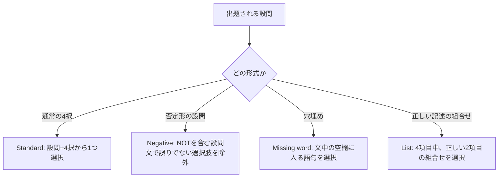

### 2.4 出題カテゴリ(Exam Specification)

シラバスの章立てそのものが出題カテゴリになっています。配点比率(Weighting)は執筆時点で **TBC(Beta試験終了後に確定)** とされています。

| カテゴリ | トピック | 配点比率 |
|---|---|---|
| 1 | Digital Products and Services | TBC |
| 2 | Discover | TBC |
| 3 | Design | TBC |
| 4 | Acquire | TBC |
| 5 | Build | TBC |
| 6 | Transition | TBC |
| 7 | Operate | TBC |
| 8 | Deliver | TBC |
| 9 | Support | TBC |
| 10 | Lifecycle Management | TBC |
| **合計** | | **100%** |

> **ベストプラクティス**: 配点比率が未確定であっても、**10カテゴリすべてが等しく出題対象**である前提で網羅的に学習するのが安全です。特に「10. Lifecycle Management」はAI・DevOps・PRINCE2との関係という横断的な内容を含み、他カテゴリの理解を統合する位置づけのため、学習の最後に必ず時間を確保してください。

**出典**:
- ITIL® Product | Syllabus, Version 5.0 PL (February 2026), PeopleCert International Limited — https://www.oxfordcollegeoftechnology.com/wp-content/uploads/2026/03/ITIL-Version-5-Product-Syllabus.pdf
- ITIL® Product (Version 5) — Oxford College of Technology — https://www.oxfordcollegeoftechnology.com/itil-version-5/itil-product-version-5/

---

## 3. 基礎概念:デジタルプロダクトとサービス(Category 1)

シラバスCategory 1「Digital Products and Services」は、以降すべてのカテゴリの土台となる用語・概念を扱います。

### 3.1 プロダクトとサービスの定義

ITIL(Version 5)は、ITIL 4から継承した基本定義を土台にしています。

| 用語 | 定義(要旨) |
|---|---|
| **プロダクト(Product)** | 人・技術・情報などの組織のリソースを、消費者に価値を提供する形に構成したもの |
| **サービス(Service)** | 顧客がコストとリスクを自ら管理することなく、望む成果(outcome)を達成できるよう、価値の共創を可能にする手段 |
| **デジタルプロダクト(Digital Product)** | ソフトウェア・データ・デジタルインターフェースを中核とし、顧客に対して直接的なケイパビリティ(capability)を提供するプロダクト |

ポイントは、**プロダクトは「ケイパビリティ(できること)」を提供し、サービスは「そのケイパビリティを使って成果を実現するプロセス」を提供する**、という役割分担です。両者は別々の管理対象ではなく、**単一の統合システム**としてマネジメントされるべきだ、というのがITIL Productの中心思想です。

### 3.2 デジタルプロダクトの特徴

デジタルプロダクトには、物理的なプロダクトと異なる以下のような特徴があります。

- **複製・配布コストがほぼゼロ**: 一度構築すれば、追加の利用者への提供コストが極めて低い
- **継続的な変更が前提**: リリース後も継続的にアップデート・改善されることが標準
- **データを介した即時のフィードバックループ**: 利用状況やテレメトリが即座に観測可能
- **サービスとの分離が難しい**: プロダクト単体で価値を持つことは稀で、多くの場合サポートやデリバリーといったサービス的要素と一体で価値を生む
- **AIによる能力拡張が前提になりつつある**: 生成・要約・自動化などのAI機能がプロダクトの一部として組み込まれる

### 3.3 価値創出のメカニズム(価値共創)

ITIL(Version 5)においても、価値は組織が一方的に「提供」するものではなく、**プロバイダーと消費者が協働して創出するもの(Value Co-creation)**という考え方が中心にあります。デジタルプロダクトの文脈では、次の2段階で価値が実現します。

1. プロダクトが利用者に**ケイパビリティ**を提供する(例:予約ができる、データを分析できる)
2. そのケイパビリティを、サービス(サポート、デリバリー、運用)が**実際の成果**に変換する(例:予約が完了し、旅行という成果が実現する)

### 3.4 ITIL Product and Service Lifecycle Modelの目的と範囲

ITIL(Version 5)最大の構造的な追加は、Service Value System(SVS)の中核である「Service Value Chain(6活動)」をそのまま残したうえで、これと併存する形で**「ITIL Product and Service Lifecycle Model」(8活動)**という、プロダクトとサービスを統合したライフサイクルモデルが新設されたことです。

| | Service Value Chain(ITIL 4から継続) | Product and Service Lifecycle Model(Version 5で新設) |
|---|---|---|
| 活動数 | 6(Plan, Improve, Engage, Design & Transition, Obtain/Build, Deliver & Support) | 8(Discover, Design, Acquire, Build, Transition, Operate, Deliver, Support) |
| 主眼 | 組織全体のサービスバリューチェーン | プロダクトとサービスを一体とした、より粒度の細かい統合ライフサイクル |
| 位置づけ | Service Value System(SVS)の中核として存続 | SVS内でバリューチェーン活動をより具体的に実行する、実務に近いモデルとして併存 |
| 流れ方 | 非線形・反復的 | 非線形・反復的(バリューストリームとして自由に組合せ可能) |

この8活動は、**厳密な順序を持つ直線的プロセスではなく**、組織が状況に応じて組み合わせる「部品」です。この組合せ方こそが後述の**バリューストリーム(Value Stream)**であり、Category 10で詳しく扱います。

> **補足**: 8活動のうち、Discover〜Buildは「プロダクト志向」が強く、Deliver・Supportは「サービス志向」が強く、Transition・Operateはその橋渡し役、という性格分けが一般的な理解として紹介されています(公式教材の正式な分類ではなく、複数の認定トレーニングプロバイダーが共通して説明する整理です)。

### 3.5 バリューチェーン活動とライフサイクルの関係

組織の「バリューチェーン活動」(Plan, Improve, Engage, Design & Transition, Obtain/Build, Deliver & Support に相当する、より抽象度の高い組織活動)は、8つのライフサイクル活動を実行するための基盤を提供します。ライフサイクル活動はこのバリューチェーンの上で具体的に実行される、より実務に近い活動という位置づけです。

### 3.6 ベストプラクティス(Category 1)

- プロダクトとサービスを**分業ではなく1つの連続体**として捉え、組織図上でもプロダクトチームとサービス運用チームの間に壁を作らない
- 「これはプロダクトの問題か、サービスの問題か」という二択の議論を避け、**どのライフサイクル活動・どのバリューストリームの問題か**という粒度で会話する
- デジタルプロダクトの特徴(継続的変更、即時フィードバック)を前提に、**一度作って終わりではない予算・体制**を組む

**出典**:
- ITIL(Version 5) Changes Explained — https://itsm.tools/itil-version-5-vs-itil-4-key-changes/
- What is ITIL 5? A Guide to the New ITIL Framework — https://www.teamdynamix.com/blog/an-introduction-to-the-itil-framework/
- The Definitive Guide to ITIL® Version 5 Foundation — PMG Academy — https://www.pmgacademy.com/en/articles/itil/the-definitive-guide-to-itil-version-5-foundation/

---

## 4. ITIL Product and Service Lifecycle Model全体像

本章では、5〜12章で個別に解説する8活動の全体像を先に俯瞰します。

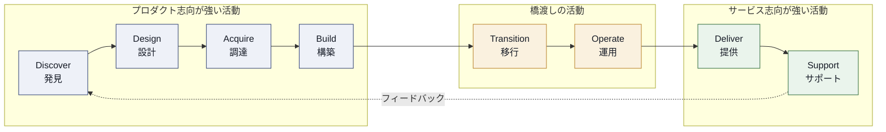

重要なのは、上図の矢印は**典型的な進行イメージ**であって、**実際には固定された一方向の順序ではない**という点です。組織は自らの状況に応じて、これら8活動の中から必要なものを選び、順序を入れ替え、繰り返し実行しながら「バリューストリーム」を組み立てます(詳細はCategory 10で解説)。

### 4.1 各活動の一覧と目的(概要)

| # | 活動 | 一言でいうと | 主な問い |
|---|---|---|---|
| 1 | **Discover** | 市場・利用者ニーズを理解する | 「何を作るべきか」 |
| 2 | **Design** | ニーズを具体的な解決策に変換する | 「どう作るべきか」 |
| 3 | **Acquire** | 必要なリソースを調達する | 「作る・買う・借りる、どれか」 |
| 4 | **Build** | コンポーネントを構築・統合・テストする | 「動くものを作る」 |
| 5 | **Transition** | 本番環境へ安全に移行する | 「安全に切り替えるには」 |
| 6 | **Operate** | インフラとシステムを稼働させ続ける | 「動き続けさせるには」 |
| 7 | **Deliver** | 利用者が実際に使える状態にする | 「価値を届けるには」 |
| 8 | **Support** | 問題やリクエストに対応する | 「正常状態に戻すには」 |

各活動は、シラバス上、共通して次の3つの観点で出題されます。

1. **Key concepts and practices**(主要概念とその活動を支えるITILプラクティス)
2. **Steps and outputs**(具体的なステップとアウトプット、BL3で「適用」が問われる)
3. **Success factors and metrics**(CSFとメトリクス、実効性を高める実践的助言)

以降の章では、この3観点に沿って8活動をひとつずつ解説します。

**出典**:
- ITIL 5 Process Guide — https://www.diontraining.com/blogs/news/itil-5-process
- ITIL 5 vs ITIL 4: What Changed — https://blog.invgate.com/itil-5-what-changes
- ITIL® Product | Syllabus (公式シラバス) — https://www.oxfordcollegeoftechnology.com/wp-content/uploads/2026/03/ITIL-Version-5-Product-Syllabus.pdf

---

## 5. Discover(発見)活動

### 5.1 目的と主要概念

Discoverは、ライフサイクルの起点であり、「**市場や利用者が何を必要としているかを理解し、それを組織の戦略と整合させる**」ことを目的とする活動です。

シラバスは、Discoverの主要概念として、**ビジョン(Vision)・ポジショニング(Positioning)・ポートフォリオ(Portfolio)** の3つが発見活動にどう情報を与えるかを重視しています。

| 要素 | 発見活動における役割 |
|---|---|
| **ビジョン** | 組織が長期的に実現したい未来像。どの機会を追求すべきかの判断基準になる |
| **ポジショニング** | 競合・市場の中で自組織のプロダクトをどう位置づけるか。差別化の軸を定める |
| **ポートフォリオ** | 現在保有しているプロダクト・サービスの全体像。新しい機会が既存ポートフォリオとどう関係するかを判断する土台になる |

### 5.2 ステップとアウトプット

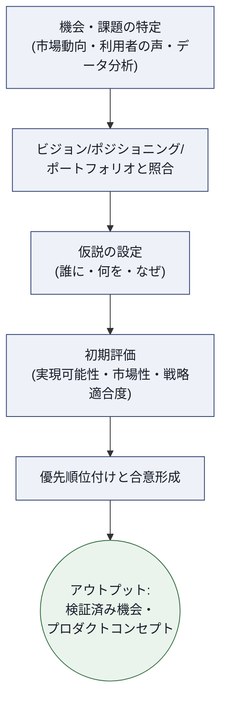

**主なアウトプット**:
- 検証された市場機会・課題の定義
- 初期のプロダクトコンセプト、または既存プロダクトの改善仮説
- 優先順位付けされた機会のリスト(ポートフォリオへのインプット)

### 5.3 Discoverを支える代表的プラクティス(例)

| プラクティス | Discoverでの役割 |
|---|---|
| Strategy management | 組織の長期方向性と発見された機会の整合を取る |
| Portfolio management | 新しい機会を既存ポートフォリオの中で評価・優先順位付けする |
| Business analysis | 利用者・ステークホルダーのニーズを構造化して可視化する |
| Relationship management | 顧客・利用者からの継続的なインサイト収集チャネルを維持する |

### 5.4 成功要因(CSF)とメトリクス(例)

| CSF | 代表的なメトリクス例 |
|---|---|
| 戦略と整合した機会が特定できている | ビジョン/戦略目標にひも付いた発見案件の比率 |
| 意思決定が根拠(エビデンス)に基づいている | 定性・定量データに裏付けられた仮説の割合 |
| 発見から意思決定までのリードタイムが適切 | 機会特定〜Go/No-Go判断までの平均日数 |

### 5.5 ベストプラクティス

- 「思いつき」ではなく、**利用者インタビュー・利用データ・市場データという複数の証拠源**を突き合わせてから機会を確定させる
- Discoverの結果を**ポートフォリオに即座に反映**し、他の進行中プロダクトとの重複・競合を早期に発見する
- 発見のサイクルを**一度きりのフェーズにせず、継続的な活動**として運用する(プロダクトが稼働した後もSupport活動からのフィードバックがDiscoverに還流する設計にする)

### 5.6 プロダクトベンダー視点でのメリットと課題

| 観点 | メリット | 課題 |
|---|---|---|
| ベンダー視点 | 市場投入前に無駄な投資を回避できる | ステークホルダーの声が大きい要求と、実際の市場ニーズが乖離するリスク |

**出典**:
- The Definitive Guide to ITIL® Version 5 Foundation — https://www.pmgacademy.com/en/articles/itil/the-definitive-guide-to-itil-version-5-foundation/
- ITIL® Product | Syllabus — https://www.oxfordcollegeoftechnology.com/wp-content/uploads/2026/03/ITIL-Version-5-Product-Syllabus.pdf

---

## 6. Design(設計)活動

### 6.1 目的と主要概念

Designは、Discoverで特定された機会を、**具体的で実現可能な解決策**に変換する活動です。ここでは、機能要件だけでなく、非機能要件(セキュリティ・スケーラビリティ・アクセシビリティなど)も含めた包括的な設計判断が行われます。

### 6.2 ステップとアウトプット

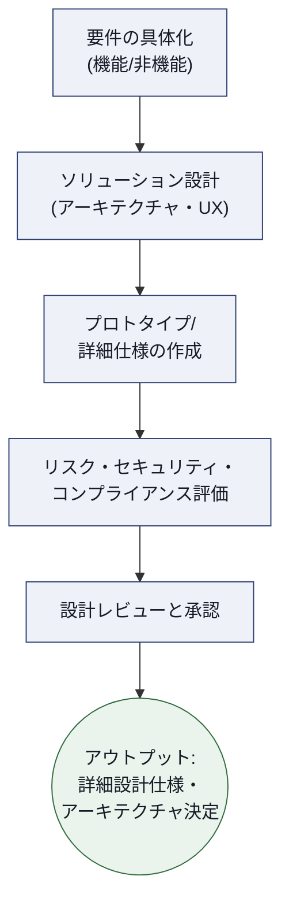

**主なアウトプット**:
- 詳細設計仕様書・アーキテクチャ決定記録
- プロトタイプ、またはユーザーテスト済みのデザイン成果物
- 後続のAcquire/Build活動へのインプットとなる技術要件

### 6.3 Designを支える代表的プラクティス(例)

| プラクティス | Designでの役割 |
|---|---|
| Architecture management | 全体アーキテクチャとの整合性を確保する |
| Service design | サービスとしての利用体験・運用性を設計に織り込む |
| Business analysis | 要件を設計仕様へ翻訳する |
| Risk management | 設計上のリスクを早期に特定し軽減策を組み込む |
| Information security management | セキュリティ・バイ・デザインを実現する |

### 6.4 成功要因(CSF)とメトリクス(例)

| CSF | 代表的なメトリクス例 |
|---|---|
| 設計が利用者ニーズを的確に反映している | ユーザーテストでの合格率・満足度 |
| 設計が後工程で手戻りを起こさない | Build/Transition段階での設計起因の手戻り件数 |
| セキュリティ・コンプライアンスが設計段階で担保されている | 設計レビューで検出されたセキュリティ懸念の解消率 |

### 6.5 ベストプラクティス

- **人間中心設計(Human-Centred Design)**の手法を用い、実際の利用者を設計プロセスの早い段階から巻き込む
- アーキテクチャ判断は**Architecture Decision Record(ADR)**のような形で記録し、後の意思決定の根拠を追跡可能にする
- 「一度に完璧な設計」を目指さず、**検証可能な最小単位の設計→フィードバック→反復**というサイクルを回す

### 6.6 プロダクトベンダー視点でのメリットと課題

| 観点 | メリット | 課題 |
|---|---|---|
| ベンダー視点 | 手戻りの少ない実装が可能になる | 設計に時間をかけすぎると市場投入(Time to Market)が遅れる |

**出典**:
- ITIL(Version 5) Changes Explained — https://itsm.tools/itil-version-5-vs-itil-4-key-changes/
- ITIL® Product | Syllabus — https://www.oxfordcollegeoftechnology.com/wp-content/uploads/2026/03/ITIL-Version-5-Product-Syllabus.pdf

---

## 7. Acquire(調達)活動

### 7.1 目的と主要概念

Acquireは、プロダクトを実現するために必要な**リソース(技術・人材・サードパーティサービス)**を、どのように獲得するかを決定・実行する活動です。シラバスは特に、**技術の調達・人材の調達・サードパーティサービスの調達の違い**を理解することを求めています。

| 調達対象 | 典型的な調達方法 | 判断のポイント |
|---|---|---|
| **技術(Technology)** | 購入・ライセンス・クラウド利用・自社開発 | Build vs Buy、TCO、ベンダーロックインのリスク |
| **人材(People)** | 社内異動・新規採用・業務委託 | 必要スキルの希少性、長期的な内製化戦略 |
| **サードパーティサービス** | アウトソーシング・マネージドサービス契約 | SLA、責任分界点、供給継続性 |

### 7.2 ステップとアウトプット

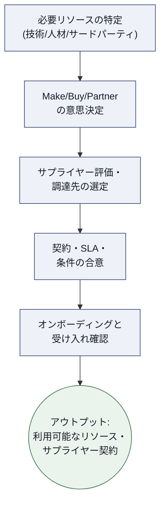

### 7.3 Acquireを支える代表的プラクティス(例)

| プラクティス | Acquireでの役割 |
|---|---|
| Supplier management | サプライヤーの選定・契約・パフォーマンス管理を行う |
| Service financial management | 調達コストの予算化・投資対効果の評価を行う |
| Workforce and talent management | 必要な人材の獲得・育成計画を支える |
| IT asset management | 調達した資産のライフサイクルを記録・管理する |

### 7.4 成功要因(CSF)とメトリクス(例)

| CSF | 代表的なメトリクス例 |
|---|---|
| 調達判断(Make/Buy/Partner)が妥当である | 調達後のコスト超過・遅延の発生率 |
| サプライヤーが信頼できる | サプライヤーのSLA達成率 |
| 長期的な供給リスクが管理されている | 単一サプライヤー依存度(ベンダーロックインの指標) |

### 7.5 ベストプラクティス

- Make/Buy/Partnerの判断は、**初期コストだけでなく、TCO(総保有コスト)と将来の柔軟性**の両面で評価する
- 重要なサードパーティサービスについては、**単一障害点(Single Point of Failure)にならないよう複数サプライヤー戦略**を検討する
- 調達判断の根拠を**ポートフォリオ・ビジョンとの整合性**に照らして記録し、将来の監査・レビューに備える

### 7.6 プロダクトベンダー視点でのメリットと課題

| 観点 | メリット | 課題 |
|---|---|---|
| ベンダー視点 | 内製できない専門性を迅速に補える | サプライヤー依存によるガバナンス・セキュリティリスクの増大 |

**出典**:
- ITIL® Product | Syllabus — https://www.oxfordcollegeoftechnology.com/wp-content/uploads/2026/03/ITIL-Version-5-Product-Syllabus.pdf
- ITIL® 5 Managing Professional Transition Course — https://www.theknowledgeacademy.com/courses/itil-training/itil-5-managing-professional-transition-training-course/

---

## 8. Build(構築)活動

### 8.1 目的と主要概念

Buildは、Design活動で作られた仕様を、実際に**コーディング・設定・組み立て・テスト**して形にする活動です。シラバスは特に「**設計をBuild活動にどう統合するか(integration of design into build)**」を重視しており、設計とビルドを別チームの断絶した工程として扱わないことがポイントになります。

### 8.2 ステップとアウトプット

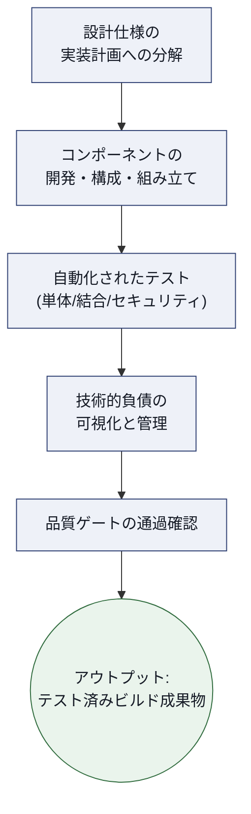

### 8.3 Buildを支える代表的プラクティス(例)

| プラクティス | Buildでの役割 |
|---|---|
| Software development and management | ソフトウェアの開発・構成管理を行う |
| Infrastructure and platform management | 基盤・プラットフォームの構築を支える |
| Change enablement | ビルド成果物を本番投入可能な変更として評価する |
| Knowledge management | 実装判断・既知の制約をチーム間で共有する |

### 8.4 成功要因(CSF)とメトリクス(例)

| CSF | 代表的なメトリクス例 |
|---|---|
| ビルドの品質が高い | テストカバレッジ、欠陥密度(Defect Density) |
| 技術的負債が管理されている | 技術的負債バックログの増減トレンド |
| リリース可能な状態を迅速に作れる | ビルドからデプロイ可能状態までのリードタイム |

### 8.5 ベストプラクティス

- テスト・ガバナンス・技術的負債管理を**自動化パイプライン(CI/CD)に組み込み**、人手の確認に頼らない品質保証を実現する
- **技術的負債を「見えない借金」にせず、バックログとして可視化**し、Discover/Designへのフィードバックとして定期的に扱う
- Design活動の担当者がBuild活動に継続的に関与できる体制(設計と実装の分業を最小化)を作る

### 8.6 プロダクトベンダー視点でのメリットと課題

| 観点 | メリット | 課題 |
|---|---|---|
| ベンダー視点 | 自動化により高速かつ一貫した品質のリリースが可能になる | 自動化への初期投資と、技術的負債の蓄積による長期的な速度低下リスク |

**出典**:
- ITIL 5 Process Guide, Workflows, Practices & Real Examples — https://www.diontraining.com/blogs/news/itil-5-process
- ITIL® Product | Syllabus — https://www.oxfordcollegeoftechnology.com/wp-content/uploads/2026/03/ITIL-Version-5-Product-Syllabus.pdf

---

## 9. Transition(移行)活動

### 9.1 目的と主要概念

Transitionは、構築されたプロダクトを**開発環境から本番環境へ、リスクを管理しながら安全に移行する**活動です。シラバスは「プロダクト移行への複数のアプローチ(approaches to product transition)」を理解することを求めており、一括移行・段階的移行・並行稼働など複数の移行戦略があることを前提としています。

### 9.2 ステップとアウトプット

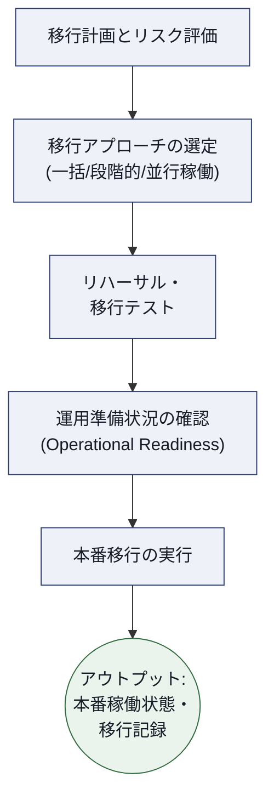

### 9.3 Transitionを支える代表的プラクティス(例)

| プラクティス | Transitionでの役割 |
|---|---|
| Change enablement | 変更の評価・承認・スケジューリングを行う |
| Release management | リリース単位の計画・調整・展開を管理する |
| Deployment management | 環境への実際の展開作業を実行する |
| Service validation and testing | 本番相当の環境で受け入れ基準を検証する |

### 9.4 成功要因(CSF)とメトリクス(例)

| CSF | 代表的なメトリクス例 |
|---|---|
| 移行に伴う障害・手戻りが最小化されている | 変更起因インシデント率(Change Failure Rate) |
| 移行の意思決定が迅速である | 変更リードタイム(Lead Time for Changes) |
| 運用チームが移行後すぐに対応できる | 移行後のEarly Life Support期間中のエスカレーション件数 |

### 9.5 ベストプラクティス

- 移行前に**ロールバック計画**を必ず用意し、「戻れない移行」をしない
- **運用準備性(Operational Readiness)のチェックリスト**を移行のGoサインの必須条件にする(監視設定、ランブック、オンコール体制の確認など)
- リリース頻度を上げることでリスクを分散する(**小さく・頻繁な移行**は、大きく・稀な移行よりも一般に失敗コストが低い)

### 9.6 プロダクトベンダー視点でのメリットと課題

| 観点 | メリット | 課題 |
|---|---|---|
| ベンダー視点 | 段階的な移行によりビジネスへの影響を最小化できる | 移行中の並行稼働はコストと複雑性を増大させる |

**出典**:
- ITIL® Product | Syllabus — https://www.oxfordcollegeoftechnology.com/wp-content/uploads/2026/03/ITIL-Version-5-Product-Syllabus.pdf
- ITIL 5 vs ITIL 4: What Changed — https://blog.invgate.com/itil-5-what-changes

---

## 10. Operate(運用)活動

### 10.1 目的と主要概念

Operateは、本番稼働しているインフラ・システムを**日々稼働させ続け、パフォーマンスを監視する**活動です。シラバスは「プロダクト運用へのアプローチ(approaches to product operation)」の理解を求めており、SRE(Site Reliability Engineering)的な考え方との親和性が高い領域です。

### 10.2 ステップとアウトプット

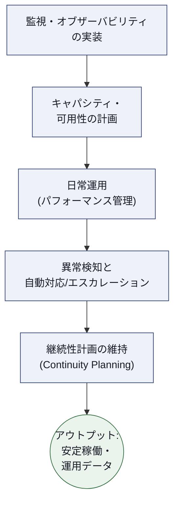

### 10.3 Operateを支える代表的プラクティス(例)

| プラクティス | Operateでの役割 |
|---|---|
| Monitoring and event management | システム状態を継続的に監視し異常を検知する |
| Availability management | 合意された可用性水準を維持する |
| Capacity and performance management | 需要に応じたキャパシティを計画・調整する |
| Service continuity management | 大規模障害時の事業継続性を確保する |

### 10.4 成功要因(CSF)とメトリクス(例)

| CSF | 代表的なメトリクス例 |
|---|---|
| システムが高い信頼性で稼働している | 可用性(Uptime %)、MTTR(平均復旧時間) |
| 異常を早期に検知できている | アラートのノイズ比率、検知から対応開始までの時間 |
| 将来の需要に備えられている | キャパシティ予測の精度 |

### 10.5 ベストプラクティス

- **SRE原則(エラーバジェット、SLO/SLI)**を導入し、信頼性と機能開発速度のバランスを定量的に管理する
- 監視は「システムが落ちたことを知る」だけでなく、**オブザーバビリティ(ログ・メトリクス・トレースの統合)**によって「なぜ落ちたか」を素早く特定できる状態を目指す
- インシデント対応の**自動化(Auto-remediation)**を、繰り返し発生する既知の問題から優先的に導入する

### 10.6 プロダクトベンダー視点でのメリットと課題

| 観点 | メリット | 課題 |
|---|---|---|
| ベンダー視点 | 高い信頼性がブランド価値・顧客満足に直結する | 過剰な信頼性投資は機能開発リソースを圧迫する(信頼性とスピードのトレードオフ) |

**出典**:
- ITIL® Product | Syllabus — https://www.oxfordcollegeoftechnology.com/wp-content/uploads/2026/03/ITIL-Version-5-Product-Syllabus.pdf
- ITIL Product (Version 5) | peoplecert.org(「Reliable and Observable Operations」の記述) — https://www.peoplecert.org/browse-certifications/it-governance-and-service-management/ITIL-1/itil-product-version-5-4179

---

## 11. Deliver(提供)活動

### 11.1 目的と主要概念

Deliverは、稼働しているプロダクトを**実際に利用者が消費できる状態にする**活動です。シラバスは「プロダクトライフサイクルにおけるサービスデリバリー(service delivery in product lifecycle)」という表現を使っており、Operateが「動かし続ける」ことに主眼を置くのに対し、Deliverは「**利用者の手元に価値を届け、アクセスやリクエストを管理する**」ことに主眼を置きます。

### 11.2 ステップとアウトプット

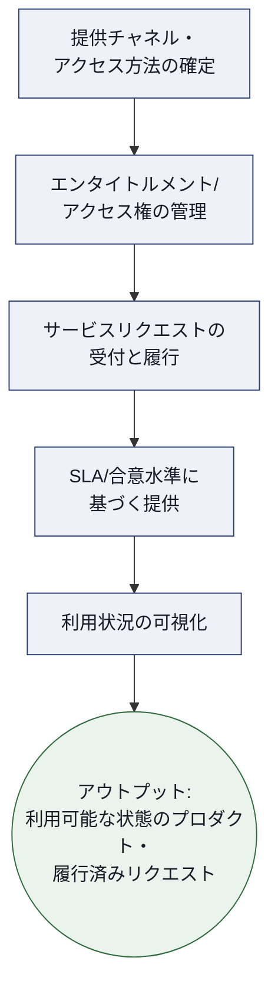

### 11.3 Deliverを支える代表的プラクティス(例)

| プラクティス | Deliverでの役割 |
|---|---|
| Service level management | 合意されたサービス水準(SLA)の遵守を管理する |
| Service catalogue management | 利用可能なプロダクト・サービスを一元的に可視化する |
| Service request management | 利用者からの標準化されたリクエストを履行する |
| Relationship management | 顧客・利用者との関係を維持し、期待値を調整する |

### 11.4 成功要因(CSF)とメトリクス(例)

| CSF | 代表的なメトリクス例 |
|---|---|
| 利用者が迅速に価値へアクセスできている | オンボーディング完了までのリードタイム |
| 合意した水準でサービスが提供されている | SLA達成率 |
| リクエスト対応が効率的である | リクエスト充足時間(Request Fulfilment Time) |

### 11.5 ベストプラクティス

- サービスカタログを**常に最新化**し、利用者が「何が使えるか」を自己解決できるセルフサービス化を進める
- 頻出するリクエストは**自動化・ワークフロー化**し、人手の介在を最小限にする
- SLAは一方的な約束ではなく、**利用者の実際の期待値とすり合わせた上で設定**する

### 11.6 プロダクトベンダー視点でのメリットと課題

| 観点 | メリット | 課題 |
|---|---|---|
| ベンダー視点 | セルフサービス化により運用コストを抑えつつ満足度を高められる | 過度な自動化は複雑な例外リクエストへの対応力を下げるリスクがある |

**出典**:
- ITIL® Product | Syllabus — https://www.oxfordcollegeoftechnology.com/wp-content/uploads/2026/03/ITIL-Version-5-Product-Syllabus.pdf

---

## 12. Support(サポート)活動

### 12.1 目的と主要概念

Supportは、稼働中に発生する**インシデントやリクエストに対応し、正常な状態を回復する**活動です。多くの利用者にとって、プロダクトとの「最も記憶に残る接点」はSupportであることが多く、体験(Experience)品質に直結する重要な活動として位置づけられます。

### 12.2 ステップとアウトプット

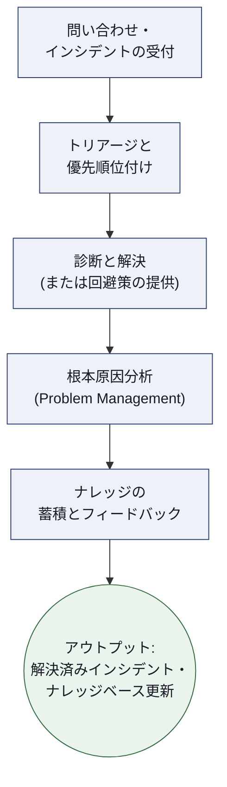

### 12.3 Supportを支える代表的プラクティス(例)

| プラクティス | Supportでの役割 |
|---|---|
| Incident management | サービス中断からの迅速な復旧を担う |
| Problem management | 繰り返し発生する問題の根本原因を特定・除去する |
| Service desk | 利用者との単一窓口となる |
| Knowledge management | 解決策やFAQをナレッジとして蓄積・再利用可能にする |

### 12.4 成功要因(CSF)とメトリクス(例)

| CSF | 代表的なメトリクス例 |
|---|---|
| インシデントが迅速に解決されている | 平均解決時間(MTTR)、一次解決率(First Contact Resolution) |
| 同じ問題の再発が防止されている | 既知の問題(Known Error)からの再発インシデント件数 |
| 利用者体験が良好である | サポート満足度(CSAT) |

### 12.5 ベストプラクティス

- 単発のインシデント対応で終わらせず、**Problem Managementに必ず接続**し、根本原因の除去まで責任を持つ
- ナレッジベースを**サポート担当者だけでなく利用者にも公開**し、セルフサービスでの解決を促す
- サポートで得られた知見を**Discover活動へのフィードバックループ**として明示的に接続し、次のプロダクト改善に活かす

### 12.6 プロダクトベンダー視点でのメリットと課題

| 観点 | メリット | 課題 |
|---|---|---|
| ベンダー視点 | 高品質なサポートは解約率(チャーン)を下げるロイヤルティの源泉になる | サポート量の増加はコスト増に直結するため、根本原因解消による「サポート需要そのものの削減」が重要になる |

**出典**:
- ITIL® Product | Syllabus — https://www.oxfordcollegeoftechnology.com/wp-content/uploads/2026/03/ITIL-Version-5-Product-Syllabus.pdf
- ITIL 5 Process Guide — https://www.diontraining.com/blogs/news/itil-5-process

---

## 13. ライフサイクル全体のマネジメント(Category 10.1)

ここまでの8活動は、それぞれ独立した「機能」として解説してきましたが、実際の組織では**これらを状況に応じて組み合わせて使う**ことが求められます。シラバスCategory 10「Lifecycle Management」は、この統合的な視点を扱います。

### 13.1 オペレーティングモデルと責任分担

「オペレーティングモデル」とは、**8つのライフサイクル活動それぞれの責任を、組織内のどのチーム・役割が担うか**を定義したものです。組織の規模や成熟度によって、以下のようなパターンがあります。

| パターン | 特徴 | 適したケース |
|---|---|---|
| 活動別専門チーム型 | Discoverチーム、Buildチームのように活動ごとに専門部隊を置く | 大規模組織、複数プロダクトを並行運用する場合 |
| クロスファンクショナル・プロダクトチーム型 | 1つのプロダクトチームが複数活動を横断的に担う(Discover〜Supportまで) | プロダクト志向・アジャイル/DevOps文化が浸透した組織 |
| ハイブリッド型 | 中核活動(Design/Build)は専任チーム、周辺活動(Discover/Support)は横断的に協業 | 成長過程にある組織、専門性とスピードのバランスを取りたい場合 |

> **ベストプラクティス**: どのパターンを選んでも、**「誰がどの活動に対してどんな意思決定権を持つか」を明文化**し、サイロ化(部門間の壁)を防ぐことが最重要です。ITIL Product (Version 5)全体を貫くテーマである「Cross-Functional Value Alignment(部門横断的な価値の整合)」は、まさにこのオペレーティングモデル設計の巧拙にかかっています。

### 13.2 プロダクトベンダーのバリューストリーム

**バリューストリーム(Value Stream)**とは、特定の目的(例:新機能をリリースする、インシデントに対応する)を達成するために、8つのライフサイクル活動の中から**必要なものだけを選び、実際の業務フローとして具体化したもの**です。

以下は、「新機能のアイデアを市場に届ける」という目的で組み立てた、プロダクトベンダーのバリューストリームの例です。

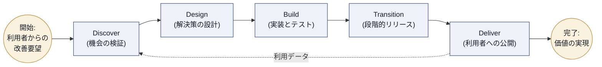

同じ8活動から、**「インシデントに対応する」という別の目的**では、まったく異なるバリューストリームが組み立てられます。

このように、**同じ8活動という「部品」を、目的別に異なる順序・組合せで再利用するのがバリューストリームの本質**です。ITIL 4で学んだ「Value Stream Mapping」の考え方が、8活動を対象にそのまま拡張されています。

### 13.3 バリューストリームがライフサイクル段階を統合する方法

バリューストリームがうまく機能するためには、以下の点が重要です。

- **各活動間のハンドオフ(引き継ぎ)を最小化**する: Design→Buildのような引き継ぎで情報が失われないよう、共通のツール・ドキュメント基盤を用意する
- **フローの可視化**: バリューストリームマッピングを行い、どこに待ち時間(Wait Time)やボトルネックがあるかを可視化する
- **フィードバックループを明示的に設計する**: Support→Discoverのように、下流の知見が上流に還流する経路を意図的に作る

### 13.4 組織・テクノロジーイネーブルメント

ライフサイクル全体を横断してスムーズに機能させるには、次の2つのイネーブルメント(実現要因)が必要です。

| イネーブルメント | 内容 |
|---|---|
| **組織的イネーブルメント** | 部門横断チームの権限設計、共通の評価指標(KPI)、心理的安全性のある文化 |
| **技術的イネーブルメント** | 全活動を貫く共通のツールチェーン(バックログ管理・CI/CD・監視基盤)、データの一元管理、AIによる自動化基盤 |

### 13.5 デジタルプロダクトマネジメント成功要因(横断的まとめ)

各活動のCSF(5〜12章)を横断して見ると、以下の共通パターンが浮かび上がります。

| 横断的な成功要因 | 該当する活動 |
|---|---|
| エビデンスに基づく意思決定 | Discover, Design |
| 自動化による品質と速度の両立 | Build, Operate |
| リスクを管理した変化への対応 | Transition |
| 利用者体験を中心に据えた運用 | Deliver, Support |
| フィードバックループの継続的な還流 | Support → Discover |

### 13.6 プロダクトマネジメントを支える組織構造

シラバスは「適切な組織構造をプロダクトマネジメントの成功に適用する(Apply an appropriate organizational structure)」ことをBL3(適用)レベルで求めています。実務上のポイントは以下のとおりです。

- プロダクトオーナー/プロダクトマネージャーに**明確な意思決定権限**を与える(権限のない責任者を作らない)
- サプライヤー・パートナーを含めた**エコシステム全体を見渡せるガバナンス層**を設ける
- 組織構造は固定的なものではなく、**プロダクトの成熟度(発見期・成長期・成熟期)に応じて見直す**

**出典**:
- ITIL Product (Version 5) | peoplecert.org(Value Stream Integration and Flow Optimizationの記述) — https://www.peoplecert.org/browse-certifications/it-governance-and-service-management/ITIL-1/itil-product-version-5-4179
- ITIL® Product | Syllabus — https://www.oxfordcollegeoftechnology.com/wp-content/uploads/2026/03/ITIL-Version-5-Product-Syllabus.pdf

---

## 14. ITIL・AI・他フレームワークとの関係(Category 10.2)

### 14.1 ITIL AI Capability Model(6Cモデル)

ITIL(Version 5)最大の新機軸のひとつが、**ITIL AI Capability Model(通称「6Cモデル」)**です。これは、AIソリューションが果たす機能を6つのカテゴリに分類し、組織がAI活用のケイパビリティを評価・育成するためのモデルです。

| Capability(能力) | 内容 | プロダクトマネジメントでの活用例 |
|---|---|---|
| **Creation(創出)** | 新しいコンテンツ・コード・ドキュメントを生成する | 設計仕様のドラフト生成、コード自動生成 |
| **Curation(整理)** | 既存データの重複を除去し、品質・関連性を高める | ナレッジベースの整理、重複バックログの統合 |
| **Clarification(明確化)** | 複雑な内容の理解を助ける | インシデントチケットの要約、長文要件の平易化 |
| **Cognition(認知)** | パターンを識別し、隠れた洞察を見つける | 障害の予兆検知、利用データからの機会発見 |
| **Communication(対話)** | 自然な対話インターフェースを提供する | チャットボット、バーチャルアシスタントによる一次対応 |
| **Coordination(調整)** | 複数のアクションを自律的に実行・オーケストレーションする | 自動復旧(Auto-remediation)、承認フローの自動化 |

> **補足**: 6Cモデルの目的は「どのAI技術を使うべきか」を指定することではなく、**「このAI機能は6つのうちどの役割を果たしているか」を明確に言語化する**ことです(参考: 各能力は異なるリスクプロファイルとガバナンス要件を持つため、この分類がAIガバナンスの出発点になります)。

### 14.2 AIがプロダクトマネジメントを支援する方法

シラバスは、AIが以下のような場面でプロダクトマネジメントを支援すると位置づけています。

- **Build活動**: コード生成・自動テストによる開発速度の向上
- **Operate活動**: 異常検知・予測的キャパシティ計画
- **Deliver/Support活動**: チャットボットによる一次対応、リクエストの自動トリアージ
- **Lifecycle Management全体**: 利用データ・フィードバックの分析による、Discoverへのインサイト提供

### 14.3 AI・自動化が手法とツールに与える影響

AIの浸透により、Discover〜Operateにかけて使われる手法・ツールにも変化が生じています。

| 変化の方向性 | 具体例 |
|---|---|
| 分析の高速化 | 大量の利用者フィードバックをAIが要約・分類し、Discoverの初期分析を短縮 |
| 開発支援の高度化 | AIコーディングアシスタントによるBuild活動の効率化 |
| 運用の予測化 | 障害発生前の予兆検知(Predictive Operations) |
| ガバナンスの必要性増大 | AIの判断根拠の説明責任(Explainability)、人間による監督(Human-in-the-loop)の設計 |

> **ベストプラクティス**: AIを導入する際は、**「どのCapability(6Cのどれ)を、どの活動に、どの程度の自律性(人間の関与レベル)で適用するか」を明示的に設計**することが、AIガバナンス上の出発点になります。特にCoordination(自律実行)は最もリスクが高いため、人間による承認ゲートを残す設計が推奨されます。

### 14.4 ITILとDevOpsの補完関係

ITIL(Version 5)とDevOpsは競合するフレームワークではなく、**互いを補完する関係**として位置づけられています。

| 観点 | ITILが強い領域 | DevOpsが強い領域 |
|---|---|---|
| ガバナンス | ライフサイクル全体のガバナンス・リスク管理・CSF定義 | — |
| 実行速度 | — | CI/CD、自動化されたBuild〜Transitionの高速な反復 |
| 統合ポイント | Build活動の実行手段としてDevOpsのプラクティス(継続的インテグレーション等)を採用 | ITILのCSF・メトリクスをDevOpsパイプラインの品質ゲートとして活用 |

実務的には、**「何を(What)・なぜ(Why)・どのレベルで(How well)」を定義するのがITILの役割**であり、**「どうやって高速に実現するか(How fast)」を担うのがDevOpsの役割**、という住み分けが一般的な理解です。

### 14.5 ITILとPRINCE2の補完関係

PRINCE2は**プロジェクトマネジメント**のフレームワークであり、ITIL Productの中では、主にAcquire活動やBuild活動のような**有期性のある取り組み(プロジェクト)**を統制する手段として位置づけられます。

| 観点 | 役割分担 |
|---|---|
| ITIL Product | プロダクトの「継続的なライフサイクル」全体を扱う(終わりのない反復活動) |
| PRINCE2 | ライフサイクルの中で発生する「有期のプロジェクト」(大規模な移行や新規構築など)を統制する |

> **補足**: プロダクトそのものは終わりのない継続的な活動ですが、その中の特定のマイルストーン(大規模リニューアルなど)は、明確な開始・終了を持つプロジェクトとしてPRINCE2的な統制が有効に機能します。

**出典**:
- ITIL (Version 5) Changes Explained: 20 Important Changes from ITIL 4 — https://itsm.tools/itil-version-5-vs-itil-4-key-changes/
- Information and Technology in ITIL Version 5 — https://www.pmgacademy.com/en/articles/itil/information-and-technology-in-itil-version-5-the-guide-for-the-ai-era-and-data-governance/
- ITIL® AI Governance Training & Certification — https://agilepmhub.com/itil-ai-governance
- A new ITIL, so what? — https://itecor.com/a-new-itil-so-what/
- ITIL® Product | Syllabus — https://www.oxfordcollegeoftechnology.com/wp-content/uploads/2026/03/ITIL-Version-5-Product-Syllabus.pdf

---

## 15. 学習・試験対策チェックリスト

### 15.1 学習の進め方(推奨ステップ)

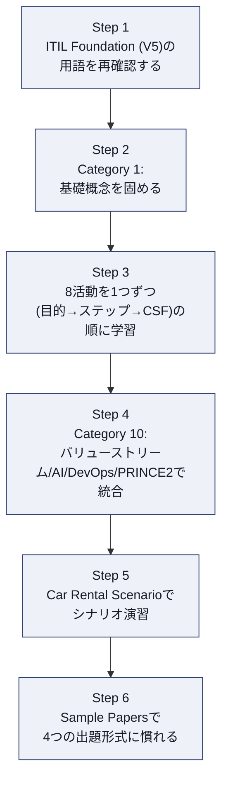

### 15.2 チェックリスト

- [ ] プロダクトとサービスの定義の違いを、自分の言葉で説明できる
- [ ] 8つのライフサイクル活動それぞれの「目的」を1文で言える
- [ ] 8つの活動それぞれについて、代表的なアウトプットを1つ以上挙げられる
- [ ] 「バリューストリーム」が8活動をどう組み合わせるものか、具体例で説明できる
- [ ] ITIL AI Capability Model(6Cモデル)の6つの能力を、それぞれ1つの実例とセットで言える
- [ ] ITILとDevOps、ITILとPRINCE2の役割分担を説明できる
- [ ] Standard / Negative / Missing word(s) / Listの4つの出題形式の違いを理解している
- [ ] "ITIL Car Rental Scenario"と"ICR's Unified Mobile App"シナリオの想定設定を読み込んでいる
- [ ] Official Bookの該当セクション番号(例: 3.1.1 = Discoverの目的)を索引として使えるようにしている

### 15.3 よくあるつまずきポイント

| つまずきやすい点 | 対策 |
|---|---|
| 8活動を「順番に実行するプロセス」と誤解する | バリューストリームの概念(13.2)を先に理解し、8活動は「組み合わせる部品」だと捉え直す |
| Operate と Support の違いが曖昧になる | Operateは「システムを動かし続ける」、Supportは「利用者からの問い合わせ・障害に対応する」と対比で覚える |
| DiscoverとDesignの境界が曖昧になる | Discoverは「何を作るべきか(What)」、Designは「どう作るべきか(How)」という問いの違いで区別する |
| AI 6Cモデルの各能力を混同する | Creation=作る、Curation=整える、Clarification=わかりやすくする、Cognition=気づく、Communication=話す、Coordination=動かす、という動詞1語で覚える |

---

## 16. 参考文献・出典

本ガイドの作成にあたり参照した一次情報および二次情報は以下のとおりです。

### 16.1 公式情報源(PeopleCert / ITIL公式)

1. ITIL Product (Version 5) — PeopleCert公式製品ページ
   https://www.peoplecert.org/browse-certifications/it-governance-and-service-management/ITIL-1/itil-product-version-5-4179
2. ITIL® Product | Syllabus, Version 5.0 PL (February 2026) — PeopleCert公式シラバスPDF(本ガイドの章立て・学習目標の一次根拠)
   https://www.oxfordcollegeoftechnology.com/wp-content/uploads/2026/03/ITIL-Version-5-Product-Syllabus.pdf
3. ITIL Product (Version 5) — itil.com公式ページ
   https://www.itil.com/professionals/certifications/ITIL-Product-Version-5
4. ITIL® Product (Version 5) — Oxford College of Technology(PeopleCert認定ATO、コース概要)
   https://www.oxfordcollegeoftechnology.com/itil-version-5/itil-product-version-5/

### 16.2 認定研修プロバイダー・専門メディアによる解説記事

5. ITIL® Version 5 Certification Pathway: Complete Guide — The Knowledge Academy
   https://www.theknowledgeacademy.com/blog/itil-certification-path/
6. ITIL® 5 Managing Professional Transition Course — The Knowledge Academy
   https://www.theknowledgeacademy.com/courses/itil-training/itil-5-managing-professional-transition-training-course/
7. What is ITIL 5? A Guide to the New ITIL Framework — TeamDynamix
   https://www.teamdynamix.com/blog/an-introduction-to-the-itil-framework/
8. ITIL 5 Process Guide, Workflows, Practices & Real Examples — Dion Training
   https://www.diontraining.com/blogs/news/itil-5-process
9. ITIL 5 vs ITIL 4: What Changed in ITIL (Version 5) — InvGate Blog
   https://blog.invgate.com/itil-5-what-changes
10. ITIL (Version 5) Changes Explained: 20 Important Changes from ITIL 4 — ITSM.tools
    https://itsm.tools/itil-version-5-vs-itil-4-key-changes/
11. The Definitive Guide to ITIL® Version 5 Foundation — PMG Academy
    https://www.pmgacademy.com/en/articles/itil/the-definitive-guide-to-itil-version-5-foundation/
12. Information and Technology in ITIL Version 5: The Guide for the AI Era and Data Governance — PMG Academy
    https://www.pmgacademy.com/en/articles/itil/information-and-technology-in-itil-version-5-the-guide-for-the-ai-era-and-data-governance/
13. How ITIL Experience (Version 5) puts user experience at the core — itil.com
    https://www.itil.com/Itil-News-and-Announcements/itil-version-5-experience-user-experience
14. ITIL® AI Governance Training & Certification — AgilePM Hub
    https://agilepmhub.com/itil-ai-governance
15. A new ITIL, so what? — itecor
    https://itecor.com/a-new-itil-so-what/
16. ITIL 4 vs ITIL 5 (Version 5): What Changed and Which to Take in 2026 — CertEmpire
    https://certempire.com/itil-4-vs-itil-5/

> **注記**: 上記16.2の記事は、いずれもPeopleCert非公式の第三者による解説記事です。内容の正確性・最新性は執筆時点(2026年9月)のものであり、試験の正式な出題範囲・配点は必ず**PeopleCert公式シラバス(16.1の1〜2)**および**ITIL® Product (Version 5) Official Book**で確認してください。特に配点比率は執筆時点でTBC(未確定)であり、受験前に最新の公式情報を確認することを強く推奨します。

---

*本ガイドは学習補助を目的とした独自の解説資料です。ITIL®はPeopleCert International Limitedの登録商標です。*
