# ITIL Service (Version 5) 学習ガイド

## 初学者のためのステップバイステップ解説 — 出題範囲の詳細解説とベストプラクティス集

---

## このガイドについて

本ガイドは、PeopleCert が認定する **ITIL Service (Version 5)** 資格試験の学習を目的として作成した、初学者向けの詳細解説書です。ITIL (Version 5) の "Managing Professional" ストリームに属するこのモジュールは、デジタルサービスをライフサイクル全体にわたって設計・提供・運用・改善するための実践的な知識を問うものです。

本ガイドの特徴は次のとおりです。

- 公式シラバスに準拠したコース構成（Module 1〜10）に沿って、各項目をステップバイステップで解説
- 各章に **ベストプラクティス** のコールアウトを配置し、実務にそのまま応用できる形で整理
- フローチャートはすべて **Mermaid** 記法、図解・比較表はすべて **Markdown 表** で記述（ASCII アートは一切使用しません）
- 章末および巻末に、根拠となる一次情報・解説記事の **URL** を明記

> **注意（本ガイドの性質について）**
> ITIL (Version 5) は 2026年に公開されたばかりの新しいスキームであり、PeopleCert は ITIL 4 の時代のように詳細なシラバス PDF を無償公開していません。そのため本ガイドは、PeopleCert 公式サイト（peoplecert.org / itil.com）の公開情報と、PeopleCert 認定トレーニング機関（Accredited Training Organization, ATO）が公開しているコースアウトラインを一次情報として、そこに ITIL の標準的な「目的 → CSF（重要成功要因）→ 指標」という記述方法を適用して構成しています。各項目の CSF・指標例は、公式試験問題そのものではなく、学習用に体系化した例示である点にご留意ください。最終的な試験対策には、必ず公式 eBook・Learner Workbook（Official Training Materials）を参照してください。

---

## 目次

0. [ITIL Service (Version 5) 試験の全体像](#0章)
1. [前提知識の総復習：ITIL Version 5 の全体構造](#1章)
2. [Module 1：デジタル製品とサービスの主要概念](#2章)
3. [Module 2：Discover（発見）](#3章)
4. [Module 3：Design（設計）](#4章)
5. [Module 4：Acquire（獲得）](#5章)
6. [Module 5：Build（構築）](#6章)
7. [Module 6：Transition（移行）](#7章)
8. [Module 7：Operate（運用）](#8章)
9. [Module 8：Deliver（提供）](#9章)
10. [Module 9：Support（サポート）](#10章)
11. [Module 10：ライフサイクル管理・AI・他フレームワーク統合](#11章)
12. [ベストプラクティス総まとめ](#12章)
13. [試験対策のポイント](#13章)
14. [付録：用語集](#付録)
15. [参考文献・ソース URL 一覧](#参考文献)

---

## 第0章：ITIL Service (Version 5) 試験の全体像

### 0.1 このモジュールは何を証明する資格か

ITIL Service (Version 5) は、**デジタルサービスをライフサイクル全体で設計・提供・サポートし、継続的に改善する能力** を証明する資格です。PeopleCert 公式ページでは、次のように紹介されています。

- サービスの関係性（service relationships）、サービスレベル（SLA）、運用の信頼性（operational reliability）、継続的改善（continual improvement）についての深い理解を養う
- レジリエントで高パフォーマンスなデジタルサービスをライフサイクル全体で提供する能力を身につける

「Product」モジュール（ITIL Product (Version 5)）が製品管理者・プロダクトオーナー視点でバリューストリームを扱うのに対し、**Service モジュールは「サービスプロバイダーの視点」から同じ ITIL Product and Service Lifecycle Model（PSLM）を扱う** という対比構造になっている点が最大のポイントです。同じ8段階のライフサイクルモデルを、片方は「作る側（Product）」、もう片方は「届けて支える側（Service）」の視点で学ぶ、と理解すると全体像がつかみやすくなります。

### 0.2 試験概要

| 項目 | 内容 |
|---|---|
| 出題形式 | 選択式（Multiple Choice） |
| 問題数 | 40問 |
| 試験時間 | 90分 |
| 合格基準 | 70%以上の正答 |
| 参照可否 | オープンブック（公式刊行物の参照が可能） |
| 出題言語 | 英語、中国語、フランス語、ドイツ語、イタリア語、ポーランド語、ポルトガル語（ブラジル）、スペイン語 |
| 認定の更新 | 3年ごと、CPD（継続的専門能力開発）ポイント 60点が必要 |

### 0.3 受験前提条件（Prerequisites）

以下のいずれかを保有していることが必須です。

- ITIL 4 の任意の認定資格（ITIL 4 Foundation を含む）
- ITIL Foundation (Version 5)
- ITIL Foundation Bridge (Version 5)（ITIL 4 保有者が Version 5 に移行するための橋渡し資格）

さらに、PeopleCert の認定トレーニング機関（ATO）または ITIL 公式 eLearning を通じたトレーニング受講が必須とされています（トレーニング修了の証明がないと、たとえ受験・合格しても結果が発行されません）。

### 0.4 対象者とキャリアパス

**想定される受講者像**：サービスの提供・運用に責任を持つ実務者。社内IT組織またはマネージドサービスプロバイダーで、デジタル製品・サービスをエンドツーエンドで管理する必要がある人。

**関連する職種例**：

- Service Manager／Service Owner／Service Delivery Manager
- Site Reliability Engineer（SRE）／Incident Commander
- Knowledge Curator／Support Manager
- IT Operations Manager／Process Owner／IT Analyst
- Product Owner／IT Project Manager／Digital Transformation Manager

### 0.5 ITIL (Version 5) 資格体系におけるこのモジュールの位置づけ

ITIL (Version 5) は、Foundation を土台に、複数の上位モジュールへ分岐する構造になっています。Service はそのうち「Managing Professional」ストリームを構成する中核モジュールの一つです。

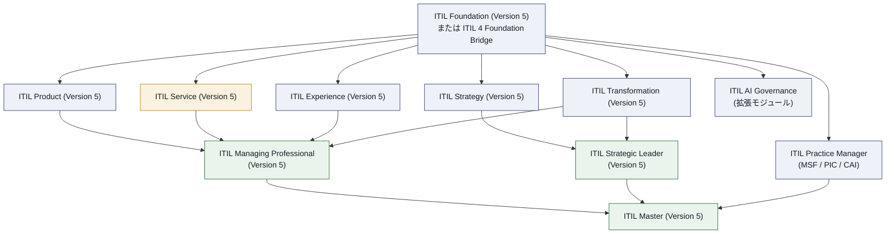

**読み方のポイント**：Product・Service・Experience・Transformation の4モジュールをすべて取得すると「ITIL Managing Professional」称号が得られます。同様に Strategy・Transformation を取得すると「ITIL Strategic Leader」となり、Practice Manager・Managing Professional・Strategic Leader の3つを揃えると最上位の「ITIL Master」に到達します。Service モジュール単体でも実務知識として十分に価値がありますが、資格戦略上は Product・Experience・Transformation とセットで捉えると学習効率が上がります。

---

## 第1章：前提知識の総復習——ITIL Version 5 の全体構造

Service モジュールの各章に入る前に、ITIL (Version 5) の土台となる概念を整理しておきます。すでに Foundation を取得済みの方は復習として、ITIL 4 からの移行者は「何が変わったか」の確認として読んでください。

### 1.1 Product と Service の定義

ITIL (Version 5) では、Product と Service を明確に区別して定義します。

| 用語 | 定義 |
|---|---|
| **Product（製品）** | 消費者に価値を提供するために設計された、組織のリソース（人、技術など）の構成 |
| **Service（サービス）** | 顧客が特定のコストとリスクを自ら管理することなく、望む成果（アウトカム）の実現を可能にする、価値の共創手段 |
| **Digital Product（デジタル製品）** | デジタル技術に基づく、組織のリソースの組み合わせ |
| **Digital Service（デジタルサービス）** | デジタル製品に全面的または大部分を依存するサービス |

**具体例**：銀行のモバイルアプリとその API・基幹システムが「デジタル製品」であり、深夜でも安全かつ即座に振込ができるという「サービス」を成立させています。製品（アプリ）が落ちればサービス（振込体験）も止まり、価値が失われます。この製品とサービスの不可分な関係こそが、ITIL (Version 5) が両者を単一のライフサイクルモデルで扱う理由です。

### 1.2 価値の方程式：アウトプットとアウトカム

ITIL 試験で最も誤解されやすい概念の一つです。

- **Output（アウトプット）**：活動によって生み出される有形・無形の成果物（例：新しい人事システムが稼働した）
- **Outcome（アウトカム）**：1つ以上のアウトプットによって実現される、ステークホルダーにとっての結果（例：採用リードタイムが30日から10日に短縮された）

アウトプットを出してもアウトカムが実現しないケース（システムは稼働したが、使いにくくて誰も使わない）は典型的な失敗パターンとして頻出します。

価値は次の式で概念化されます。

> 価値 = (実現したアウトカム + 除去されたコスト + 除去されたリスク) − (課されたコスト + 課されたリスク)

### 1.3 ITIL Value System（ITIL VS）の5つの構成要素

ITIL 4 の「Service Value System（SVS）」は、Version 5 で **ITIL Value System（ITIL VS）** に改称され、対象範囲が「ITサービス」から「デジタル製品とサービス」全体に拡張されました。構成要素自体は5つのまま維持されています。

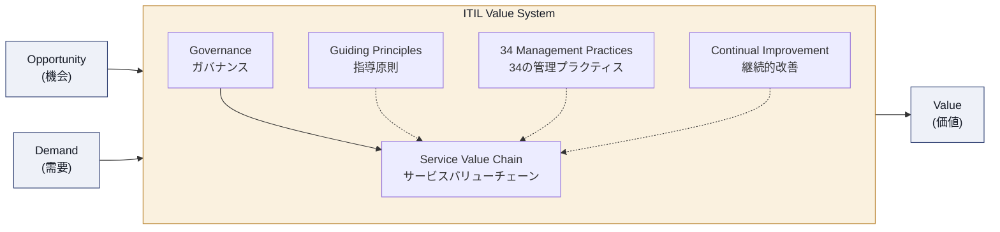

| 構成要素 | 役割 |
|---|---|
| Guiding Principles（指導原則） | あらゆる状況で組織の意思決定を導む普遍的な推奨事項（7原則） |
| Governance（ガバナンス） | 組織を指揮・統制する仕組み。Evaluate–Direct–Monitor（EDM）サイクルで運用 |
| Service Value Chain（サービスバリューチェーン） | 需要を価値に変換する中核の運用モデル（6つの活動） |
| Management Practices（管理プラクティス） | バリューチェーン活動を実行するための34の「道具箱」 |
| Continual Improvement（継続的改善） | あらゆる階層で行われる、パフォーマンスを期待水準に保ち続ける反復活動 |

### 1.4 指導原則（Guiding Principles）— 7原則の早見表

| # | 原則 | 一言で言うと |
|---|---|---|
| 1 | Focus on value（価値に焦点を当てる） | すべての活動を顧客・ステークホルダーの価値に結びつける |
| 2 | Start where you are（現在地から始める） | ゼロから作り直す前に、既存の資産・成果を評価し活用する |
| 3 | Progress iteratively with feedback（フィードバックを伴う反復的な進化） | 大きく作りすぎず、小さく作ってフィードバックを得る |
| 4 | Collaborate and promote visibility（協働と可視性の促進） | サイロを越えて協働し、作業を可視化する |
| 5 | Think and work holistically（全体的に考え行動する） | 部分最適ではなく、システム全体としての結果を重視する |
| 6 | Keep it simple and practical（シンプルかつ実践的に） | 価値を生まない手順は削り、最小限の手数で目的を達成する |
| 7 | Optimize and automate（最適化と自動化） | 自動化の前に最適化する。非効率なプロセスを自動化すると非効率が増幅するだけ |

> **ベストプラクティス**：Service モジュールの文脈では、特に原則7「最適化と自動化」が重要です。監視・自動修復・チャットボットなど AI を活用した運用改善（第8章 Operate、第11章参照）を導入する前に、まず対象プロセスが「シンプルかつ実践的」であるかを確認してください。壊れたプロセスを自動化しても、壊れたまま速くなるだけです。

### 1.5 4つの側面（Four Dimensions of Service Management）

サービスを一面的（技術だけ、プロセスだけ）に見てしまうと、必ずどこかで破綻します。ITIL は全体最適を保証するために、常に4つの側面をバランスさせることを求めます。外部環境の変化は **PESTLE**（Political, Economic, Social, Technological, Legal, Environmental）の6要因を通じてこれらの側面に影響します。

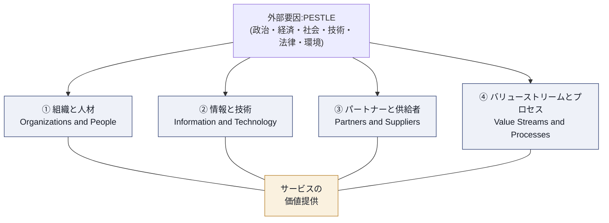

| 側面 | 要点 |
|---|---|
| 組織と人材 | 文化（心理的安全性）、リーダーシップ、組織構造。コンウェイの法則（システムは組織のコミュニケーション構造を反映する）に留意 |
| 情報と技術 | データ→情報→知識の階層。AI 活用の基盤となる（後述の 6C モデルに接続） |
| パートナーと供給者 | 自組織だけで完結するサービスは存在しない。ソーシング戦略（内製 vs 外部委託）が鍵 |
| バリューストリームとプロセス | 組織内外のワークフロー。複雑さのレベルに応じて柔軟に設計する |

> **ベストプラクティス**：新しいツールや自動化施策を検討する際は、必ず4つの側面すべてに与える影響を点検してください。「情報と技術」だけを強化しても、「組織と人材」（トレーニング不足）や「パートナーと供給者」（回線品質）がボトルネックのままでは、全体のサービス品質は向上しません。

### 1.6 サービスバリューチェーン（6活動）と PSLM（8活動）の違い

ここは ITIL 4 経験者が最も混同しやすいポイントです。**サービスバリューチェーンは「今も存在する」概念です**。ただし ITIL (Version 5) では、製品とサービスの一気通貫のライフサイクルを表現するために、新たに **Product and Service Lifecycle Model（PSLM）** が導入されました。両者は置き換え関係ではなく、階層が異なる概念として共存します。

| 比較軸 | Service Value Chain（6活動） | Product and Service Lifecycle Model（8活動） |
|---|---|---|
| 位置づけ | ITIL VS の中核運用モデル（普遍的なエンジン） | 個別の製品・サービスが辿る具体的な旅路 |
| 活動 | Plan／Improve／Engage／Design & Transition／Obtain-Build／Deliver & Support | Discover／Design／Acquire／Build／Transition／Operate／Deliver／Support |
| 性質 | 抽象的・普遍的（レゴブロックのように組み合わせる） | 具体的・反復的（前後の活動を行き来する「エコシステム」） |
| 主な用途 | バリューストリームを組み立てる際の「部品」 | 特定の製品・サービスのライフサイクル管理を可視化する「地図」 |

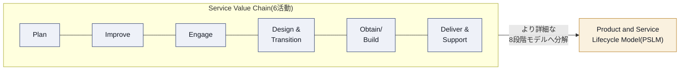

Service モジュールの Module 1〜10 は、この右側の **PSLM（8活動）を「サービスプロバイダーの視点」から深掘りする** ことに主眼を置いています。次章以降で1活動ずつ丁寧に見ていきます。

### 1.7 サービス関係性（Service Relationships）とサービスジャーニー

PeopleCert の紹介文が明示するとおり、Service モジュールは「サービス関係の管理」を重視します。

**役割の整理**：

| 役割 | 説明 |
|---|---|
| Service Provider（サービスプロバイダー） | サービスの提供・サポートに責任を持つ組織の役割 |
| Service Consumer（サービス消費者） | サービスを取得・利用して自らの目的を達成する組織の役割 |
| Digital Product Vendor（デジタル製品ベンダー） | サービスの基盤となるデジタル製品を開発・改善する組織 |

**消費側組織内の三者（Service Consumer Triad）**：

| ペルソナ | 関心事 |
|---|---|
| Sponsor（スポンサー） | 予算承認、費用対効果・ROI |
| Customer（カスタマー） | サービス要件の定義、消費のアウトカムに対する説明責任 |
| User（ユーザー） | 日々の利用、使いやすさ・UX |

この三者の利害は必ずしも一致しません（スポンサーは安価なプランを望み、カスタマーは技術要件を定義し、ユーザーは使いやすさを求める）。優れたサービスプロバイダーは、この三者間の緊張関係を理解した上でバランスを取ります。

**サービスジャーニー（7段階）**：サービス関係は、以下の7段階を通じて発展します。

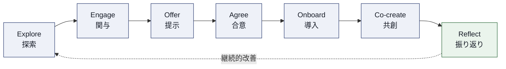

| 段階 | 内容 |
|---|---|
| Explore | 両者が市場・ニーズ・提供可能な能力を調査する |
| Engage | 関係が確立され、初期のコミュニケーションと信頼が構築される |
| Offer | プロバイダーがサービスオファリングを提示し、消費者が需要を明確化する |
| Agree | 期待値がすり合わされ、契約や SLA として正式化される |
| Onboard | 移行段階。消費者が利用を開始し、ユーザーがトレーニングを受ける |
| Co-create | サービス提供・消費の日常。実際に価値が生成される段階 |
| Reflect | パフォーマンスと創出された価値を両者で評価する、継続的改善の段階 |

### 1.8 品質・サービスレベル・SLA（そして XLA）

**Service Quality（サービス品質）** と **Service Level（サービスレベル）** は似て非なる概念です。品質は「これは良いサービスだ」という全体的な知覚であり、サービスレベルはそれを測定可能にした客観的指標（例：「稼働率 99.9%」）です。

品質を管理可能な指標に変換するため、ITIL (Version 5) は4つのカテゴリーを提示します。

| カテゴリー | 定義 | 平易な言い換え |
|---|---|---|
| Utility（有用性） | サービスが「何をするか」。特定のニーズを満たす機能性 | 目的に適っているか（fit for purpose） |
| Warranty（保証） | サービスが「どう機能するか」。可用性・キャパシティ・継続性・セキュリティの保証 | 使用に適しているか（fit for use） |
| Experience（体験） | ユーザーが「どう感じるか」。機能的・感情的な相互作用の総体 | 体験として好ましいか |
| Sustainability（持続可能性） | サービスの「与える影響」。環境・社会・経済的要件への適合 | 長期的に許容できるか |

これらは **Service Level Agreement（SLA）** として文書化され、プロバイダーと顧客の期待値を揃えます。近年の実務では、稼働率のような技術指標（SLA）に加え、体験（Experience）を定量化する **Experience Level Agreement（XLA）** が併用される傾向が強まっており、ITIL (Version 5) はこの潮流を反映して「体験に基づくサービス品質」を明示的に重視しています。

> **ベストプラクティス**：SLA を「稼働率 99.9%」のような技術指標だけで設計しないでください。Utility・Warranty・Experience・Sustainability の4カテゴリーすべてに対応する目標を最低1つずつ持たせることで、「技術的には正常だが利用者の体験は悪い」という典型的な失敗を防げます。

### 1.9 ガバナンスと EDM サイクル

ガバナンスとマネジメントは異なります。ガバナンスは「正しいことをしているか」を決める船長であり、マネジメントは「正しいやり方でやっているか」を実行する乗組員です。ガバナンスは以下の3活動からなる **EDM サイクル** を通じて継続的に行われます。

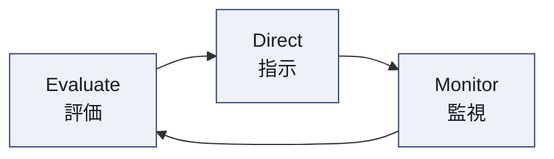

| 活動 | 内容 |
|---|---|
| Evaluate（評価） | 組織・戦略・ポートフォリオ・関係性を評価し、内外の状況変化を分析する |
| Direct（指示） | 評価に基づき、責任を割り当て、戦略の方向性と方針を定める |
| Monitor（監視） | 組織のパフォーマンスとプラクティスの遵守状況を監視する |

### 1.10 継続的改善モデル（7ステップ）

「継続的改善」は ITIL VS の一構成要素であると同時に、単独の管理プラクティスでもあります。7ステップの反復モデルとして定義されており、規模を問わず適用できます。

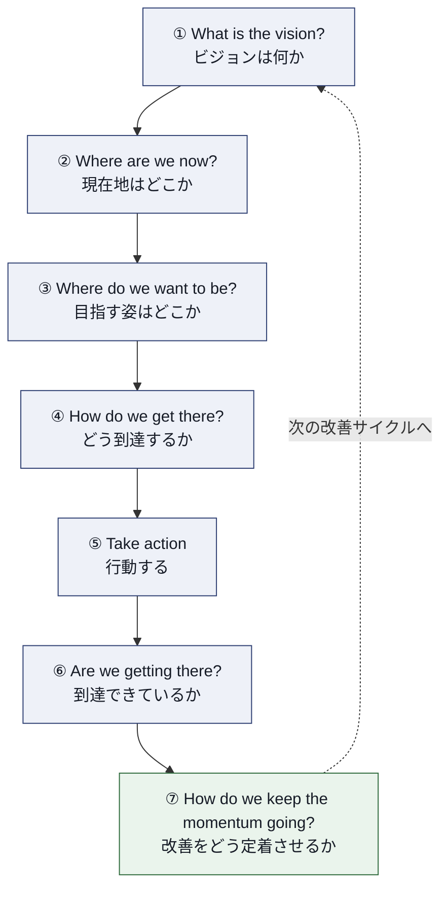

> **ベストプラクティス**：改善提案を「プロジェクト」として一度きりで終わらせず、必ずステップ⑦「関連性を保ち続ける方法」を組織文化・レトロスペクティブの定例に組み込んでください。改善が文化に根づかないと、組織は元の基準線に静かに後退します。

### 1.11 34の管理プラクティス概観

ITIL (Version 5) は ITIL 4 から引き続き **34の管理プラクティス** を定義しています（用語の一部微調整はあるものの、大枠は維持）。Service モジュールでは、PSLM の各段階（第3章〜第10章）に紐づく形でこれらのプラクティスを学びます。参考として、ITIL 4 時代の実践的なグルーピング（Practice Manager 資格の3系統）を示します。

| 系統 | 含まれるプラクティス | 主な関心領域 |
|---|---|---|
| Monitor, Support and Fulfil（MSF） | Service Desk／Incident Management／Problem Management／Service Request Management／Monitoring and Event Management | 日々の問い合わせ対応と障害対応 |
| Plan, Implement and Control（PIC） | Change Enablement／Deployment Management／Release Management／Service Configuration Management／IT Asset Management | 変更の計画的な実装と統制 |
| Collaborate, Assure and Improve（CAI） | Relationship Management／Supplier Management／Service Level Management／Continual Improvement／Information Security Management | 関係性の構築と品質保証 |

Service モジュールでは、これらのプラクティスが PSLM の Deliver・Support 段階を中心に登場します（第9章・第10章で詳述）。

---

## 第2章：Module 1 — デジタル製品とサービスの主要概念

### 2.1 このモジュールの狙い

Module 1 は、Service モジュール全体の「地図」を描く導入章です。ここで PSLM（Product and Service Lifecycle Model）の全体像と、サービスプロバイダー視点で見たときの意義を理解しておくことで、第3章以降の各段階（Discover〜Support）の学習がスムーズになります。

### 2.2 デジタルサービスの特徴

デジタルサービスには、従来型のサービスと比べて次のような特徴があります。

| 特徴 | 説明 |
|---|---|
| ソフトウェア基盤への依存 | サービスの提供能力が、デジタル製品（アプリ・API・プラットフォーム）の品質に直結する |
| 継続的な変化 | CI/CD により、機能追加・修正が高頻度かつ継続的に行われる |
| エコシステム化 | クラウド、複数のパートナー・サプライヤーを跨いで提供される |
| スケーラビリティ | 需要変動に応じて、人手を介さず能力を伸縮できる |
| 測定可能性の向上 | テレメトリ・ログ・利用データにより、体験や品質をリアルタイムに可視化できる |

### 2.3 デジタル製品とサービスによる価値創出

前章 1.1〜1.2 で述べたとおり、製品（Product）は価値創出の「能力」を、サービス（Service）は「アウトカムの実現」を担います。Service モジュールでは、この関係を **サービスプロバイダーの立場から** 捉え直します。すなわち、「良い製品を作ること」がゴールなのではなく、「その製品を用いて、消費者が望むアウトカムを、コストとリスクを引き受けた上で確実に実現し続けること」がサービスプロバイダーの使命です。

### 2.4 PSLM の範囲と目的（サービスプロバイダー視点）

PSLM は、製品とサービスという従来別々の「部族（tribes）」が担っていた活動を、単一のエコシステムとして統合するモデルです。8つの活動は次のとおりです。

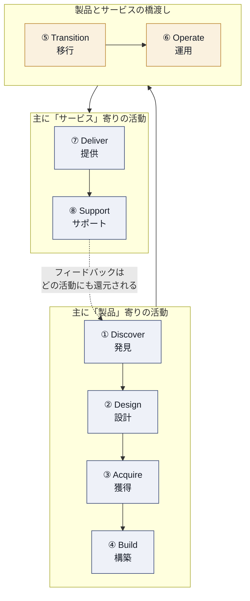

**重要な特性**：この図は理解を助けるために左から右への流れとして描いていますが、公式モデルはこれを「固定された順序」とは位置づけていません。実際には、どの活動から別の活動へも行き来でき（例えば Support 中に新たな Discover が生まれる）、複数バージョンの同じ製品・サービスが異なる段階に同時に存在し得る、**非線形なエコシステム** として説明されています。この「行きつ戻りつする現実」を前提に運用を設計することが、Service モジュールの実践的な学びの核心です。

### 2.5 サービスプロバイダー視点で見た PSLM のメリット

| メリット | 説明 |
|---|---|
| 手戻りの削減 | 要件の伝言ゲームによる誤解が減り、後工程での手戻りが減る |
| 価値実現の迅速化 | 製品チームとサービスチームが「一度で正しく」作業し、受け渡しの往復が減る |
| デプロイ・リリースの信頼性向上 | 依存関係や非効率が早期に特定・管理される |
| 障害解決・改善の迅速化 | 製品チームとサービスチームがアウトカムに対する責任を共有し、優先順位の共通理解を持てる |
| ガバナンスの一元化 | マッピング、活動、技術投資を単一のガバナンスフレームワークで扱える |

### 2.6 サービスプロバイダー視点で見た PSLM の課題

| 課題 | 説明 | 対応の方向性 |
|---|---|---|
| 組織構造の慣性 | 製品チームとサービスチームが別部門・別KPIで動いている場合が多い | 共同のOKR・共同のオンコール体制など、構造面での統合を先に着手する |
| スキルギャップ | サービス運用担当者が製品開発の文脈（アーキテクチャ、コードベース）を理解していない | シャドーイングやペアオンコールで知識移転を促進する |
| ツールのサイロ化 | 製品開発ツール（バックログ管理等）と運用ツール（監視・チケット管理等）が分断されている | テレメトリとインシデント管理、バックログとの連携を自動化する |
| ガバナンスの複雑化 | 複数のパートナー・サプライヤーを跨ぐサービスでは、単一のガバナンスモデルの適用が難しい | サプライヤーごとの責任分界点（RACI）を明文化する |

### 2.7 組織のバリューチェーン活動が PSLM をどう支えるか

第1章 1.6 で述べたとおり、サービスバリューチェーンの6活動（Plan／Improve／Engage／Design & Transition／Obtain-Build／Deliver & Support）は、PSLM の8段階それぞれを実行するための「エンジン」として機能します。

| バリューチェーン活動 | 主に支える PSLM 段階 |
|---|---|
| Plan | Discover（方向性の共有） |
| Engage | Discover, Deliver（ステークホルダーとの対話） |
| Design & Transition | Design, Build, Transition |
| Obtain/Build | Acquire, Build |
| Deliver & Support | Operate, Deliver, Support |
| Improve | 全段階を横断（継続的改善として） |

> **ベストプラクティス**：組織にPSLMを導入する際は、既存のバリューチェーン活動（特に Engage と Deliver & Support）が、どの部門・どのツールによって担われているかを棚卸しすることから始めてください。ゼロから新しい体制を作るのではなく、「現在地から始める（Start where you are）」原則に従い、既存の強みを PSLM の各段階にマッピングするのが最も現実的な導入手順です。

---

## 第3章：Module 2 — Discover（発見）

### 3.1 目的（Purpose）

Discover 活動の目的は、**製品ロードマップとサービスオファリングを、消費者ニーズと組織戦略に継続的に整合させ続けること** です。市場・顧客・内部関係者から需要とニーズを収集し、それを組織の戦略的方向性と突き合わせる、PSLM の起点となる活動です。

### 3.2 主要概念

- **ビジョン（Vision）**：組織が目指す将来像。Discover 活動のすべての意思決定の判断基準になる
- **ポジショニング（Positioning）**：市場・組織内における製品・サービスの立ち位置。競合や代替手段との違いを明確にする
- **ポートフォリオ（Portfolio）**：組織が保有する製品・サービス・投資機会の全体集合。Discover はポートフォリオの内容を更新するインプットを生み出す

ビジョン・ポジショニング・ポートフォリオの3つは相互に作用します。ビジョンが方向性を示し、ポジショニングが「どこで戦うか」を定め、ポートフォリオが「何にリソースを割くか」の意思決定を記録します。

### 3.3 Discover を支える有効化プラクティス（Enabling Practices）

| プラクティス | Discover における役割 |
|---|---|
| Business Analysis（ビジネス分析） | ステークホルダーのニーズを構造化し、要件として言語化する |
| Portfolio Management（ポートフォリオ管理） | 発見された機会・需要を、既存の投資・優先順位と照らして評価する |
| Relationship Management（関係性管理） | 顧客・パートナーとの対話チャネルを維持し、継続的なニーズ収集を可能にする |

### 3.4 Discover 活動のステップ

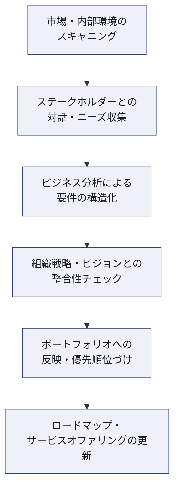

### 3.5 アウトプット（Outputs）

- 更新された製品ロードマップ
- 更新されたサービスオファリング案
- ポートフォリオへの反映（新規投資候補、既存サービスの廃止候補を含む）

### 3.6 CSF（重要成功要因）と指標の例

| CSF | 指標例 |
|---|---|
| 市場・顧客ニーズを継続的に捕捉できている | 収集されたインサイトの件数／四半期、インサイトからロードマップ反映までの平均リードタイム |
| 発見された機会が組織戦略と整合している | 戦略目標にマッピングされたロードマップ項目の割合 |
| ステークホルダーとの関係が良好である | 関係性管理における顧客満足度スコア、対話の頻度 |

### 3.7 実践的な推奨事項（ベストプラクティス）

> **ベストプラクティス**
> - **需要の「声」を一元化する**：営業・サポート・SNS・利用ログなど、バラバラなチャネルから上がってくるニーズを単一のバックログまたはインサイト管理ツールに集約してください。分散したままでは優先順位づけができません。
> - **Discover を一度きりのフェーズにしない**：Support 活動（第10章）で得られたインシデント・問い合わせの傾向は、そのまま次の Discover サイクルへの重要なインプットです。PSLM がエコシステム型である所以はここにあります。
> - **仮説検証のコストを下げる**：本格的な Build に入る前に、プロトタイプやコンセプト検証（PoC）で仮説を安価に検証し、Design 段階への手戻りを防いでください。

---

## 第4章：Module 3 — Design（設計）

### 4.1 目的（Purpose）

Design 活動の目的は、**製品とサービスのプロトタイプおよび仕様を作成し、機能性・ユーザー体験・運用モデルを詳細化すること** です。Discover で発見された機会を、実装可能な設計へと落とし込みます。

### 4.2 主要概念

- **仕様（Specification）**：機能要件・非機能要件（性能、セキュリティ、可用性など）を明文化したもの
- **プロトタイプ（Prototype）**：低コストで検証可能な試作。実装前にユーザー体験や技術的実現可能性を確認する
- **運用モデル（Operating Model）**：誰が、どのプラクティスで、どのように日々の運用を担うかを事前に設計しておく考え方。Design 段階で後工程（Operate・Support）を見据えることが、運用可能性（Operability）の高い設計につながる

### 4.3 Design を支える有効化プラクティス

| プラクティス | Design における役割 |
|---|---|
| Architecture Management（アーキテクチャ管理） | システム構成要素間の関係性を設計し、将来の拡張性・保守性を担保する |
| Service Level Management（サービスレベル管理） | 設計段階から SLA・XLA の目標値を組み込み、「後付けの品質保証」を避ける |
| Service Design（サービスデザイン） | ユーザー体験（UX）を含めた、サービス全体の設計手法を提供する |

### 4.4 Design 活動のステップ

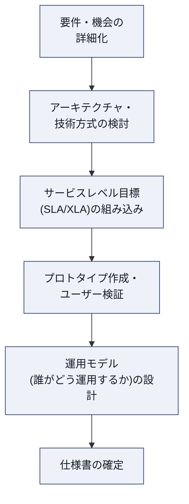

### 4.5 アウトプット（Outputs）

- 製品・サービスの仕様書
- プロトタイプ
- サービスレベル目標（SLA/XLA のドラフト）
- 運用モデルの設計文書

### 4.6 CSF と指標の例

| CSF | 指標例 |
|---|---|
| 設計段階で非機能要件が担保されている | 設計レビューでの非機能要件（可用性・セキュリティ等）指摘件数の低さ |
| ユーザー体験が検証されている | プロトタイプに対するユーザビリティテストの実施率、体験スコア |
| 設計と運用が乖離していない | Design 段階のレビューに Operate/Support 担当者が参加した割合 |

### 4.7 実践的な推奨事項（ベストプラクティス）

> **ベストプラクティス**
> - **「運用できる設計（Design for Operability）」を徹底する**：可観測性（ログ・メトリクス・トレース）を後付けにせず、設計段階で組み込んでください。Operate・Support 担当者を Design レビューに巻き込むことが最も効果的な予防策です。
> - **SLA/XLA は設計の入力であり、事後の交渉材料にしない**：目標可用性やレスポンスタイムは、アーキテクチャの意思決定（冗長化構成、キャッシュ戦略など）に直結します。設計完了後に SLA を握るのではなく、設計の前提として先に合意してください。
> - **プロトタイプは「安く速く失敗する」ために使う**：本番相当の作り込みをする前に、最小限のプロトタイプで技術的リスクとユーザー体験の両方を検証し、Build 段階での手戻りコストを最小化してください。

---

## 第5章：Module 4 — Acquire（獲得）

### 5.1 目的（Purpose）

Acquire 活動の目的は、**必要なリソース（技術、人材、サードパーティサービスなど）を効率的に確保・配分すること** です。設計を実現するために「何を、どこから、どう調達するか」を決定する段階です。

### 5.2 技術・人材・サードパーティサービス調達の違い

| 調達対象 | 特徴 | 主な検討事項 |
|---|---|---|
| 技術（ハードウェア・ソフトウェア） | 比較的定型化されている | ライセンス条件、拡張性、既存アーキテクチャとの整合性 |
| 人材 | 採用・育成・外部人材活用のバランスが必要 | スキルギャップの特定、内製 vs 外部委託の判断 |
| サードパーティサービス | 継続的な関係管理が必要 | SLA の設定、サプライヤーのガバナンス体制、ベンダーロックインのリスク |

### 5.3 主要概念

- **ソーシング戦略（Sourcing Strategy）**：内製（Build）か購入（Buy）か、あるいはハイブリッドかを決定する戦略的判断。コスト、専門性、戦略的重要度によって左右される
- **サービス財務管理の視点**：調達コストは一時費用だけでなく、運用中の継続コスト（TCO：総所有コスト）まで見積もる必要がある

### 5.4 Acquire を支える有効化プラクティス

| プラクティス | Acquire における役割 |
|---|---|
| Supplier Management（サプライヤー管理） | 外部サプライヤーとの契約・パフォーマンス管理を担う |
| IT Asset Management（IT資産管理） | 調達した資産のライフサイクル（登録・追跡・廃棄）を管理する |
| Service Financial Management（サービス財務管理） | 調達コストの予算化、投資対効果の評価を担う |

### 5.5 Acquire 活動のステップ

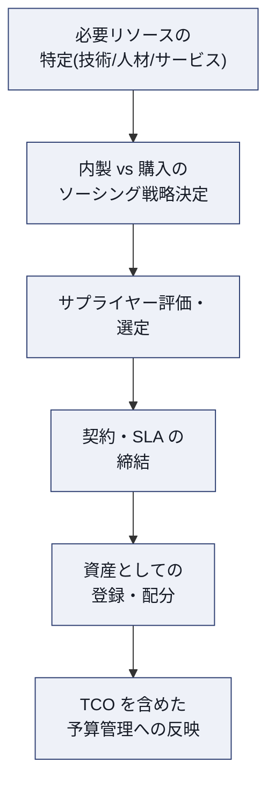

### 5.6 アウトプット（Outputs）

- 調達済みのリソース・サービス
- サプライヤー契約・SLA
- 更新された IT 資産台帳

### 5.7 CSF と指標の例

| CSF | 指標例 |
|---|---|
| 必要なリソースが適時に確保されている | 調達リードタイム、調達遅延によるプロジェクト遅延件数 |
| サプライヤーの品質が担保されている | サプライヤー SLA 達成率 |
| 総所有コストが適切に管理されている | 予算対比の調達コスト、TCO の見積り精度 |

### 5.8 実践的な推奨事項（ベストプラクティス）

> **ベストプラクティス**
> - **TCO で判断する**：初期調達コストの安さだけで判断せず、運用・保守・サポート・将来の拡張コストまで含めた総所有コストで比較検討してください。
> - **サプライヤー管理を「契約締結後」で終わらせない**：Acquire は一度きりの取引ではなく、Supplier Management プラクティスを通じた継続的な関係管理の起点です。定期的なパフォーマンスレビューを最初から契約に組み込んでください。
> - **ベンダーロックインのリスクを可視化する**：特に AI・クラウド関連の調達では、移行コストやデータポータビリティを事前に評価し、将来の選択肢を狭めすぎないようにしてください。

---

## 第6章：Module 5 — Build（構築）

### 6.1 目的（Purpose）

Build 活動の目的は、**デジタル製品のコンポーネントを開発・統合・テストし、設計を機能するソリューションへと転換すること** です。

### 6.2 Design から Build への統合

Design 段階で作成された仕様・プロトタイプ・運用モデルは、Build 段階でそのまま実装の指針となります。両者が断絶していると、「設計と違うものができあがる」という典型的な失敗に陥ります。ITIL (Version 5) は、Design と Build を反復的に行き来すること（アジャイル的な進め方）を許容しており、一方向のウォーターフォールを強制するものではありません。

### 6.3 主要概念

- **統合（Integration）**：個別に開発されたコンポーネントを組み合わせ、全体として機能させること
- **検証とテスト（Validation and Testing）**：機能要件・非機能要件の両方を検証するプロセス。単体テストから統合テスト、負荷テストまでを含む
- **Definition of Done**：何をもって「構築完了」とするかの合意。テストカバレッジ、コードレビュー、セキュリティスキャンの合格などを含めることが一般的

### 6.4 Build を支える有効化プラクティス

| プラクティス | Build における役割 |
|---|---|
| Software Development and Management（ソフトウェア開発・管理） | コードの開発、バージョン管理、技術的負債の管理を担う |
| Infrastructure and Platform Management（インフラ・プラットフォーム管理） | 開発・テスト環境を含む基盤の構築・維持を担う |
| Service Validation and Testing（サービスの検証とテスト） | 機能要件・非機能要件を体系的に検証する |

### 6.5 Build 活動のステップ

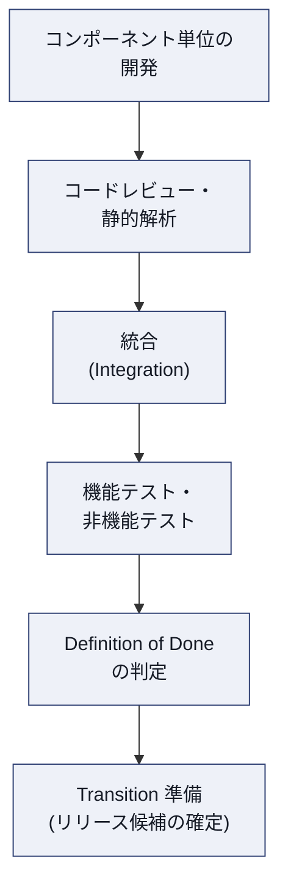

### 6.6 アウトプット（Outputs）

- 構築・テスト済みのプロダクトソリューション
- テスト結果・品質レポート
- リリース候補（Release Candidate）

### 6.7 CSF と指標の例

| CSF | 指標例 |
|---|---|
| 品質基準を満たした状態で構築が完了している | テストカバレッジ、リリース前に検出された欠陥数 |
| 開発サイクルが予測可能である | ビルド〜テスト完了までのリードタイム、ビルド失敗率 |
| 技術的負債が管理されている | 技術的負債バックログの増減トレンド |

### 6.8 実践的な推奨事項（ベストプラクティス）

> **ベストプラクティス**
> - **CI（継続的インテグレーション）を早期に導入する**：コンポーネントを統合してから問題が発覚すると手戻りコストが跳ね上がります。小さく頻繁に統合し、早期にフィードバックを得てください。
> - **非機能要件のテストを後回しにしない**：機能テストだけでなく、負荷テスト・セキュリティテストを Build 段階のパイプラインに組み込み、Transition 直前に慌てて実施することを避けてください。
> - **「動くこと」と「Definition of Done」を混同しない**：チームで合意した完了の定義（テスト、ドキュメント、セキュリティ承認など）を明文化し、属人的な判断でリリース候補を確定しないようにしてください。

---

## 第7章：Module 6 — Transition（移行）

### 7.1 目的（Purpose）

Transition 活動の目的は、**新規または変更された製品を、安全かつ効果的に本番環境へ導入すること**、およびサプライヤーのオンボーディング・オフボーディングを適切に行うことです。

### 7.2 製品移行へのアプローチ

| アプローチ | 特徴 | 適するケース |
|---|---|---|
| Big Bang（一括移行） | 全ユーザー・全機能を一度に切り替える | 影響範囲が限定的で、ロールバックが容易な場合 |
| フェーズドロールアウト | 段階的にユーザー層・地域を拡大していく | 大規模なユーザーベース、リスクを抑えたい場合 |
| Blue-Green デプロイメント | 新旧2系統の環境を並行稼働させ、切替を即座に行う | ダウンタイムを最小化したい場合 |
| カナリアリリース | 一部のトラフィックのみ新バージョンへ振り分け、段階的に拡大する | 本番トラフィックでの検証をリスクを抑えて行いたい場合 |

### 7.3 Transition を支える有効化プラクティス

| プラクティス | Transition における役割 |
|---|---|
| Change Enablement（変更実現） | 変更のリスク評価と承認プロセスを通じて、安全な変更を実現する |
| Release Management（リリース管理） | 複数の変更をまとめてリリース単位として計画・調整する |
| Deployment Management（展開管理） | 実際の環境への配置・切替作業を実行する |

### 7.4 Transition 活動のステップ

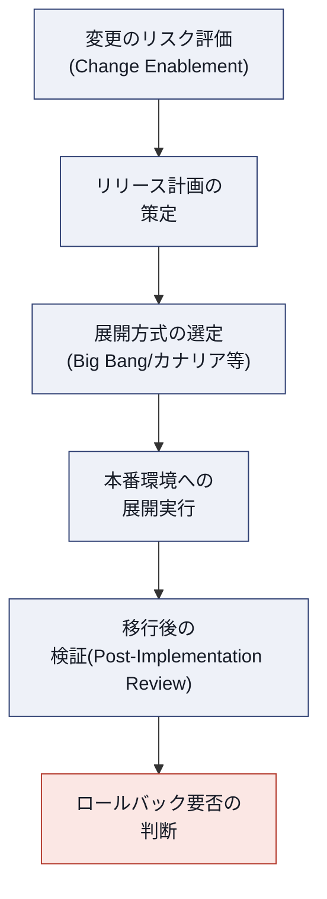

### 7.5 アウトプット（Outputs）

- 対象環境に展開され、稼働準備が整った製品・サービス
- リリースノート
- サプライヤーのオンボーディング／オフボーディング記録

### 7.6 CSF と指標の例

| CSF | 指標例 |
|---|---|
| 変更が安全に本番へ導入されている | 変更起因のインシデント発生率（Change Failure Rate） |
| リリースの頻度と安定性が両立している | デプロイ頻度、平均復旧時間（MTTR） |
| ロールバックが迅速に実行できる | ロールバック所要時間 |

### 7.7 実践的な推奨事項（ベストプラクティス）

> **ベストプラクティス**
> - **変更の分類に応じて審査の重さを変える**：低リスクで頻度の高い変更（標準変更）は事前承認済みの自動化パイプラインに乗せ、高リスクな変更にのみ人的なレビューの労力を集中させてください。すべての変更を同じ重さで審査すると、変更管理そのものがボトルネックになります。
> - **ロールバック手順は展開前に必ず検証しておく**：本番障害が発生してから初めてロールバック手順を試す、という事態は避けてください。カナリアリリースやBlue-Greenデプロイメントは、ロールバックの容易さという観点でも有効です。
> - **Deployment Frequency と Change Failure Rate をセットで追う**：リリース頻度だけを追うと品質が犠牲になり、変更失敗率だけを追うとリリースが停滞します。両方を DORA 指標的な発想でバランスさせてください。

---

## 第8章：Module 7 — Operate（運用）

Operate は、PeopleCert の紹介文にある「運用の信頼性（operational reliability）」を直接担う、Service モジュールの中核的な活動です。

### 8.1 目的（Purpose）

Operate 活動の目的は、**デジタル製品とそれを支えるシステムを維持・監視し、最適なパフォーマンスと信頼性を確保し続けること** です。

### 8.2 主要概念

- **可観測性（Observability）**：ログ・メトリクス・トレースの3要素を通じて、システム内部の状態を外部から推測できる度合い。単なる「監視（Monitoring）」よりも一段広い概念で、未知の障害モードにも対応できる設計を指す
- **信頼性（Reliability）**：システムが期待どおりに機能し続ける度合い。SRE（Site Reliability Engineering）の考え方では、**SLI（Service Level Indicator）**、**SLO（Service Level Objective）**、**エラーバジェット（Error Budget）** という具体的な指標体系で運用される
- **イベント（Event）**：サービス管理上意味のある状態変化。すべてのイベントが問題を意味するわけではなく、正常な状態変化（情報イベント）、注意を要する状態（警告イベント）、異常事態（例外イベント）に分類される

### 8.3 Operate を支える有効化プラクティス

| プラクティス | Operate における役割 |
|---|---|
| Monitoring and Event Management（監視とイベント管理） | システムの状態を継続的に監視し、イベントを検知・分類・対応につなげる |
| Infrastructure and Platform Management（インフラ・プラットフォーム管理） | 基盤システムの可用性・キャパシティを維持する |

### 8.4 Operate 活動のステップ

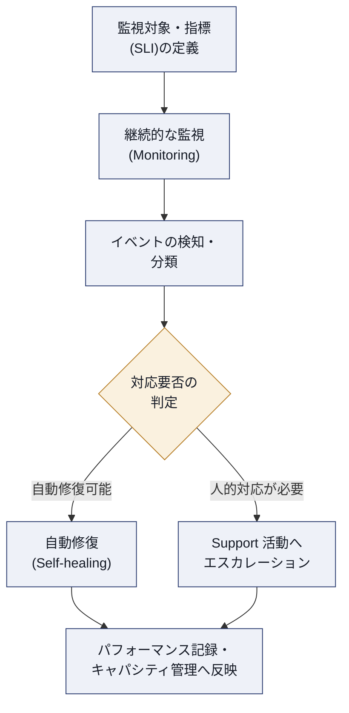

### 8.5 アウトプット（Outputs）

- 稼働中の製品・サービス
- パフォーマンス記録・キャパシティトレンドデータ
- イベントログ、アラート履歴

### 8.6 CSF と指標の例

| CSF | 指標例 |
|---|---|
| サービスの可用性が目標水準を維持している | 稼働率（Uptime）、SLO 達成率、エラーバジェットの消費率 |
| 異常を早期に検知できている | 平均検知時間（MTTD：Mean Time To Detect） |
| 監視のノイズが管理されている | 誤検知（false positive）率、アラート疲労の指標（1人当たりのアラート受信数） |

### 8.7 実践的な推奨事項（ベストプラクティス）

> **ベストプラクティス**
> - **「監視しているか」ではなく「意味のあるアラートを出せているか」を問う**：ログを大量に集めていても、アラートが多すぎて誰も見なくなる「アラート疲労」は運用信頼性を著しく損ないます。SLO 逸脱に直結する少数の重要指標にアラートを絞り込んでください。
> - **エラーバジェットで意思決定する**：可用性目標に対する余裕（エラーバジェット）を可視化し、余裕があるうちは新機能リリースを積極化し、消費し尽くしたらリリースを抑制して安定化に注力する、というメリハリのある運用判断を行ってください。
> - **自動修復（Self-healing）を段階的に拡張する**：まず既知のパターンに対する自動復旧（再起動、スケールアウトなど）から始め、信頼が蓄積された範囲を徐々に広げてください。人手を完全に排除することではなく、人が本当に判断すべき例外に集中できる状態を作ることが目的です。

---

## 第9章：Module 8 — Deliver（提供）

### 9.1 目的（Purpose）

Deliver 活動の目的は、**アクセスとリクエストを管理しながらサービスをユーザーへ提供し、フィードバックを収集すること** です。ここは PSLM の中で最も直接的に「価値の共創」がユーザーの手元で起こる段階です。

### 9.2 サービス提供活動がどのように価値共創を可能にするか

Deliver 活動は、単に「サービスを使えるようにする」だけでなく、消費者が実際にアウトカムを実現できるよう能動的に支援する段階です。アクセス権の付与、オンボーディング、リクエストへの迅速な対応はすべて、ユーザーが自らコストとリスクを管理せずに済むようにするという「サービス」の定義（1.1参照）を具現化する活動です。

### 9.3 主要概念

- **アクセス管理**：適切な人に、適切なタイミングで、適切な権限を付与・削除する
- **サービスリクエスト**：あらかじめ合意された、定型的な要求（パスワードリセット、アクセス権限の追加、新規アカウント発行など）。インシデント（予期しない障害）とは明確に区別される
- **セルフサービス化**：ポータルやチャットボットを通じて、ユーザー自身が定型リクエストを完結できるようにする仕組み

### 9.4 Deliver を支える有効化プラクティス

| プラクティス | Deliver における役割 |
|---|---|
| Service Request Management（サービスリクエスト管理） | 定型的な要求を受付から履行まで一貫して管理する |
| Service Level Management（サービスレベル管理） | 合意した SLA/XLA に対する実績を継続的にモニタリング・報告する |
| Service Desk（サービスデスク） | ユーザーとサービスプロバイダーの単一の接点（Single Point of Contact）として機能する |

### 9.5 Deliver 活動のステップ

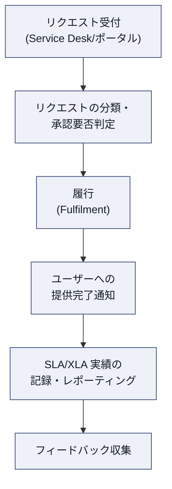

### 9.6 アウトプット（Outputs）

- 消費者に提供されたサービス
- SLA 実績レポート
- ユーザーフィードバック・満足度データ

### 9.7 CSF と指標の例

| CSF | 指標例 |
|---|---|
| リクエストが迅速かつ正確に履行されている | 平均履行時間、初回解決率（First Contact Resolution） |
| SLA/XLA の実績が目標を満たしている | SLA 達成率、XLA スコア（体験指標） |
| セルフサービスの活用が進んでいる | セルフサービス経由での解決率 |

### 9.8 実践的な推奨事項（ベストプラクティス）

> **ベストプラクティス**
> - **サービスリクエストとインシデントを混同しない**：定型的な依頼（リクエスト）と予期しない障害（インシデント）を同じキューで扱うと、優先順位づけが破綻します。カタログ化されたリクエストは可能な限り自動履行のワークフローに乗せてください。
> - **SLA レポートを「守れたか否か」の報告に留めない**：達成率の推移、逸脱の根本原因、次のサイクルでの改善計画までをセットで報告し、Service Level Management を継続的改善のインプットとして機能させてください。
> - **セルフサービスは「置き換え」ではなく「選択肢」として提供する**：すべてのユーザーがセルフサービスを好むわけではありません。人的サポートへのエスカレーション経路を必ず残し、体験（Experience）の観点で選べる状態を維持してください。

---

## 第10章：Module 9 — Support（サポート）

### 10.1 目的（Purpose）

Support 活動の目的は、**インシデントと問題を特定・解決し、可能な限り迅速に通常のサービス運用を回復すること** です。PSLM の中でも最もユーザーの信頼に直結する、いわば「サービスの最後の砦」です。

### 10.2 主要概念

- **インシデント（Incident）**：サービスの計画外の中断、またはサービス品質の低下
- **問題（Problem）**：1つ以上のインシデントの原因、または潜在的な原因
- **ワークアラウンド（Workaround）**：根本原因が解決していなくても、影響を軽減・除去する暫定的な解決策
- **既知のエラー（Known Error）**：根本原因が特定されているが、恒久的な解決策がまだ実装されていない問題

インシデント管理とプロブレム管理の違いを混同しないことが重要です。インシデント管理のゴールは「できるだけ早くサービスを復旧すること」であり、根本原因の特定はプロブレム管理の役割です。復旧を急ぐあまり原因調査を後回しにするのは正しい判断ですが、その後の根本原因分析を省略してよいという意味ではありません。

### 10.3 Support を支える有効化プラクティス

| プラクティス | Support における役割 |
|---|---|
| Incident Management（インシデント管理） | サービス中断を検知し、可能な限り迅速に復旧する |
| Problem Management（問題管理） | インシデントの根本原因を特定し、再発を防止する |
| Service Desk（サービスデスク） | ユーザーからの問い合わせ・障害報告の単一の窓口として機能する |
| Service Continuity Management（サービス継続性管理） | 大規模障害・災害時にもサービスを継続または迅速に復旧できるよう事前に計画する |

### 10.4 Support 活動のステップ

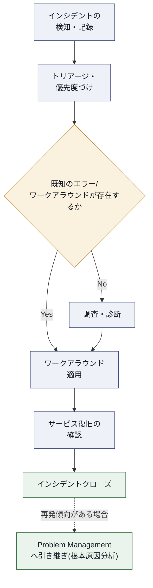

### 10.5 アウトプット（Outputs）

- 通常運用への復旧
- ワークアラウンド、既知のエラーの記録
- 根本原因分析（RCA）結果

### 10.6 CSF と指標の例

| CSF | 指標例 |
|---|---|
| サービス復旧が迅速である | 平均復旧時間（MTTR：Mean Time To Restore） |
| 根本原因分析により再発が防止されている | インシデント再発率、既知のエラーからの恒久対応完了率 |
| ユーザーへのコミュニケーションが適切である | 障害対応時のステータス更新頻度、事後対応への満足度 |
| 大規模障害への備えができている | サービス継続計画の訓練実施頻度、目標復旧時間（RTO）の達成率 |

### 10.7 実践的な推奨事項（ベストプラクティス）

> **ベストプラクティス**
> - **「復旧」と「原因究明」を分離する**：インシデント対応中はまず復旧を最優先し、根本原因の特定はプロブレム管理のプロセスに委ねてください。両方を同時に追おうとすると、復旧が遅れるだけでなく調査も浅くなりがちです。
> - **ブレームレスなポストモーテム（Blameless Postmortem）を実施する**：4つの側面のうち「組織と人材」（1.5参照）が示すとおり、心理的安全性がなければ正直なインシデント報告は得られません。個人の責任追及ではなく、システム・プロセスの改善に焦点を当ててください。
> - **既知のエラーデータベース（KEDB）を実務で使い倒す**：記録するだけでなく、新規インシデントのトリアージ時に必ず照合する運用を徹底することで、平均復旧時間を大幅に短縮できます。
> - **サービス継続計画は「作って終わり」にしない**：定期的な訓練（ゲームデイ、障害注入テストなど）を通じて、計画が実際に機能することを検証し続けてください。

---

## 第11章：Module 10 — ライフサイクル管理・AI・他フレームワーク統合

### 11.1 エンドツーエンドのライフサイクル管理

第3章〜第10章では、PSLM の8段階を1つずつ個別に学びました。Module 10 は、それらを **1つの統合されたシステムとして管理する視点** を養う総括章です。

重要なのは、8つの活動を「順番にこなすチェックリスト」として扱わないことです。実際の現場では、Support 活動から得られた学びが即座に Discover の新たな入力になり、Operate 中に発見された性能課題が Design の見直しを促す、というように、**すべての活動が並行し、相互にフィードバックし合っています**。この非線形性を前提に、複数のバリューストリーム（特定の需要に応じて組み合わされた活動の連なり）を同時並行で管理する能力が、Service モジュールの実務上の到達点です。

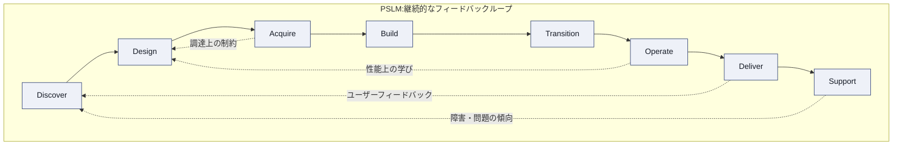

> **ベストプラクティス**：バリューストリームごとに「どの活動を、どの順序で、誰が担うか」を可視化するバリューストリームマッピング（第1章の考え方を実務に適用したもの）を定期的に実施してください。特に Support→Discover のフィードバックループが機能しているかどうかは、組織の学習能力を測る重要な指標になります。

### 11.2 ITIL AI Capability Model（6C モデル）

ITIL (Version 5) の最大の特徴の一つが、AI を「後付けの自動化ツール」としてではなく、フレームワークの中核に組み込んでいる点です（AI-native by design）。この考え方を体系化したのが **ITIL AI Capability Model**、通称 **6C モデル** です。AI システムが実際に何をしているのかを、6つの機能カテゴリーで正確に言語化するためのモデルであり、機能ごとにリスクの性質やガバナンスの必要度が異なる、という前提に立っています。

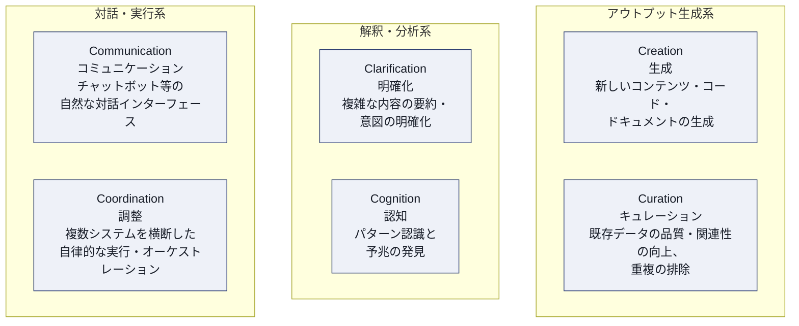

| 機能 | 説明 | PSLM 上での典型的な適用例 |
|---|---|---|
| Creation（生成） | 新しいコンテンツ・コード・ドキュメントを生成する | Build 段階でのコード補完、Design 段階での仕様書ドラフト生成 |
| Curation（キュレーション） | 既存データの質・関連性を高め、重複や不整合を除去する | Discover 段階での顧客インサイトの整理、ナレッジベースの整備 |
| Clarification（明確化） | 複雑な内容の要約や、曖昧な要求から意図を汲み取る | Support 段階でのインシデントチケットの自動要約 |
| Cognition（認知） | パターンを認識し、予兆や隠れた洞察を発見する | Operate 段階での異常検知、キャパシティ予測 |
| Communication（コミュニケーション） | チャットボット等、自然言語での対話インターフェース | Deliver 段階でのセルフサービスチャットボット |
| Coordination（調整） | 複数システムを横断した自律的な実行・オーケストレーション | Operate 段階での自動修復（負荷分散の自動再配置など） |

> **ベストプラクティス**：AI 施策を企画する際は、必ず「これは6つのうちどの機能か」を最初に明確にしてください。Coordination（自律実行）は Creation（生成支援）よりもはるかに高いガバナンス・人的監督が必要です。機能を曖昧なまま「AIを導入する」と言うのではなく、6C モデルの語彙で施策を定義することで、必要なガバナンスレベルを正しく見積もれます。

### 11.3 AI 統合における注意点

6C モデルは可能性を示す一方で、データガバナンスと倫理面の課題も伴います。AI を活用する際は、次の観点を必ず組み込んでください。

- **説明可能性**：AI の判断根拠を人間が追跡・検証できるか（特に Cognition・Coordination 機能）
- **人的関与ポイント（Human-in-the-loop）**：どの意思決定に、どの段階で人間の承認を必須とするか
- **バイアスとデータ品質**：Curation 機能で扱うデータの偏りが、下流の判断に伝播しないか
- **エスカレーション経路**：AI が処理しきれないケースを、確実に人間に引き継ぐ仕組みがあるか

より高度な AI ガバナンスは、ITIL (Version 5) の拡張モジュール **ITIL AI Governance** で専門的に扱われます。興味のある方は本ガイド末尾の参考文献を参照してください。

### 11.4 DevOps との関係

ITIL (Version 5) と DevOps は競合するフレームワークではなく、**異なるレイヤーの問いに答える、補完関係にある枠組み** です。

| 観点 | ITIL (Version 5) が答える「何を」 | DevOps が答える「どうやって」 |
|---|---|---|
| 変更管理 | 変更はリスクに応じて統制されるべき、という要件（Change Enablement） | CI/CD パイプラインと自動テストによる高速・安全な実装手段 |
| サービスの信頼性 | 信頼性を維持する責任の所在とガバナンス | SRE の実践（SLI/SLO/エラーバジェット、オンコール体制） |
| 継続的改善 | 改善を組織文化に根づかせる7ステップモデル | レトロスペクティブ、ポストモーテムの実践 |

> 要点：**ITIL 5 は DevOps の速度がガバナンスを失わずにスケールするための安定構造を提供する**、という捉え方が実務上最も有用です。低リスクな変更を自動化されたパイプラインに委ね、高リスクな変更にのみ人的レビューを集中させるという第7章のベストプラクティスは、まさにこの統合を体現したものです。

### 11.5 PRINCE2 との関係

PRINCE2（PRojects IN Controlled Environments）はプロジェクトマネジメントのフレームワークであり、ITIL (Version 5) はサービスマネジメントのフレームワークです。両者は同じライフサイクルの異なるフェーズを担当します。

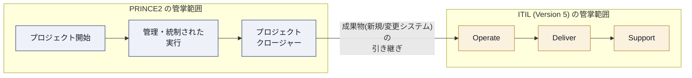

- **PRINCE2**：明確な開始・中間・終了を持つ、期限付きの取り組み（例：新しい CRM システムの導入）を担う
- **ITIL (Version 5)**：終わりのない継続的な取り組み（例：導入された CRM サービスの日々の運用・保守・改善）を担う

統合が機能するのは「引き継ぎの瞬間」です。PRINCE2 がプロジェクトの成果物（製品・変更）を届け、ITIL (Version 5) がそれを受け取ってサービスとして運用・サポート・改善していく、という明確な橋渡しが必要です。

### 11.6 共通する原則

DevOps・PRINCE2・Agile・ITIL (Version 5) といった複数のフレームワークが実務で共存できるのは、以下の基礎的な原則を共有しているためです。

- 顧客価値への focus（焦点）
- チームを越えた協働（Collaboration）
- フィードバックを伴う反復的な進化
- あらゆる活動を通じた継続的改善

> **ベストプラクティス**：「うちはアジャイルだからプロセスは不要」「うちはITILだからDevOpsの俊敏さは危険」といった二項対立の議論は、いずれも実務上は価値を破壊します。フレームワークはそれぞれ異なる問いに答えるための道具であり、組織の成熟度と文脈に応じて適切に組み合わせることが、Service モジュールが一貫して伝えるメッセージです。

---

## 第12章：ベストプラクティス総まとめ

第3章〜第10章で解説した PSLM 8段階のベストプラクティスを、1枚の早見表として整理します。試験直前の復習や、実務導入時のチェックリストとして活用してください。

| 段階 | 目的（一言で） | 主要な有効化プラクティス | 最重要ベストプラクティス | 代表的な指標 |
|---|---|---|---|---|
| ① Discover | 需要とニーズの継続的な把握 | Business Analysis, Portfolio Management, Relationship Management | 需要の「声」を単一のバックログに一元化する | インサイトからロードマップ反映までのリードタイム |
| ② Design | 仕様・プロトタイプの作成 | Architecture Management, Service Level Management, Service Design | 運用できる設計（可観測性を後付けにしない） | 設計レビューでの非機能要件指摘件数 |
| ③ Acquire | 必要リソースの確保 | Supplier Management, IT Asset Management, Service Financial Management | 初期コストではなく TCO で判断する | 調達リードタイム |
| ④ Build | 設計の実装・テスト | Software Development and Management, Infrastructure and Platform Management, Service Validation and Testing | CI を早期導入し、小さく頻繁に統合する | テストカバレッジ、ビルド失敗率 |
| ⑤ Transition | 本番環境への安全な導入 | Change Enablement, Release Management, Deployment Management | 変更のリスクに応じて審査の重さを変える | Change Failure Rate |
| ⑥ Operate | 稼働の維持・信頼性確保 | Monitoring and Event Management, Infrastructure and Platform Management | エラーバジェットに基づく意思決定 | SLO 達成率、MTTD |
| ⑦ Deliver | サービスの提供とフィードバック収集 | Service Request Management, Service Level Management, Service Desk | リクエストとインシデントを明確に区別する | SLA 達成率、初回解決率 |
| ⑧ Support | インシデント・問題への対応 | Incident Management, Problem Management, Service Desk, Service Continuity Management | 「復旧」と「原因究明」を分離する | MTTR、インシデント再発率 |

### 12.1 段階を横断するベストプラクティス

個々の段階のベストプラクティスに加え、PSLM 全体を横断して意識すべき原則を以下にまとめます。

> **横断的ベストプラクティス**
> 1. **フィードバックループを意図的に設計する**：Support→Discover、Operate→Design のように、後工程の学びが前工程に還元される経路を、偶然ではなく仕組みとして構築してください（第11章 11.1参照）。
> 2. **4つの側面すべてに目を配る**：技術（Information and Technology）だけを強化する施策は、必ずどこかで限界に突き当たります（第1章 1.5参照）。
> 3. **SLA だけでなく体験（Experience）も測る**：稼働率が高くても、ユーザー体験が悪ければサービスの価値は損なわれます（第1章 1.8参照）。
> 4. **AI 施策は 6C モデルの語彙で定義する**：機能を明確にすることで、適切なガバナンスレベルを設定できます（第11章 11.2参照）。
> 5. **心理的安全性なくして正直な報告なし**：ブレームレスな文化がなければ、インシデントの根本原因もリスクの早期警告も上がってきません（第10章 10.7参照）。

---

## 第13章：試験対策のポイント

### 13.1 試験の性質を理解する

ITIL Service (Version 5) の試験は、**オープンブックの選択式試験**（40問・90分・合格ライン70%）です。暗記量そのものよりも、**公式刊行物の中から必要な情報を素早く見つけ、状況に当てはめて判断する力** が問われます。したがって学習の焦点は、丸暗記ではなく「概念同士の関係性を理解し、公式資料のどのあたりに何が書いてあるかを把握しておくこと」に置くべきです。

### 13.2 頻出の混同ポイント

試験・実務の双方で混同しやすい概念のペアを整理しておきます。

| 混同しやすいペア | 区別のポイント |
|---|---|
| Output（アウトプット） vs Outcome（アウトカム） | アウトプットは成果物そのもの、アウトカムはそれによって実現される結果（1.2参照） |
| Service Value Chain（6活動） vs PSLM（8活動） | バリューチェーンは普遍的な運用エンジン、PSLM は個別の製品・サービスの具体的な旅路（1.6参照） |
| Incident（インシデント） vs Problem（問題） | インシデントは個別の中断事象、問題はその原因または潜在的原因（10.2参照） |
| SLA vs XLA | SLA は技術的な合意指標、XLA は体験を定量化した指標（1.8参照） |
| Governance（ガバナンス） vs Management（マネジメント） | ガバナンスは「正しいことをする」方向づけ、マネジメントは「正しいやり方でやる」実行（1.9参照） |
| Service Request（サービスリクエスト） vs Incident | リクエストは定型的で計画済みの依頼、インシデントは予期しない中断（9.3参照） |
| Monitoring（監視） vs Observability（可観測性） | 監視は既知の指標を見ること、可観測性は未知の障害モードにも対応できる設計思想（8.2参照） |

### 13.3 学習の進め方（推奨ステップ）

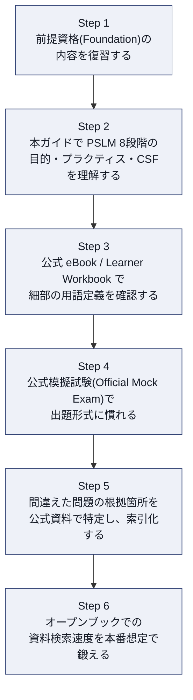

> **ベストプラクティス**：オープンブック試験だからといって準備を怠ると、90分で40問（1問あたり約2分15秒）というペースの中で資料を探す時間が足りなくなります。本ガイドの章構成（第0章〜第11章）を、公式刊行物の目次と自分の中で対応づけておく「索引化」の作業を、模擬試験の前に必ず行ってください。

### 13.4 実務者としての心構え

試験対策と並行して意識してほしいのは、ITIL Service (Version 5) が問うているのは「用語を知っているか」ではなく「サービスプロバイダーとして、変化し続けるデジタルサービスの信頼性と価値をどう守るか」という実務上の問いだという点です。第12章の横断的ベストプラクティスは、そのまま試験対策と実務導入の両方に使える指針として設計しています。

---

## 付録：用語集

| 用語（英語） | 日本語訳・説明 |
|---|---|
| Product | 消費者に価値を提供するために設計された、組織のリソースの構成 |
| Service | 顧客が特定のコストとリスクを自ら管理することなく、望む成果の実現を可能にする、価値の共創手段 |
| Digital Product | デジタル技術に基づく、組織のリソースの組み合わせ |
| Digital Service | デジタル製品に全面的または大部分を依存するサービス |
| Output | 活動によって生み出される有形・無形の成果物 |
| Outcome | 1つ以上のアウトプットによって実現される、ステークホルダーにとっての結果 |
| Value | 何かの知覚された便益、有用性、重要性 |
| Cost | 特定の活動やリソースに費やされる金額 |
| Risk | 損害・損失を引き起こす可能性のある事象、または目標達成を困難にする事象 |
| ITIL Value System (ITIL VS) | 組織のあらゆる構成要素・活動が、いかに協働して価値創出を可能にするかを表すモデル |
| Guiding Principles | あらゆる状況で組織を導く普遍的な推奨事項 |
| Governance | 組織が指揮・統制される仕組み |
| Service Value Chain | 需要を価値に変換するための、6つの相互接続された活動からなる中核運用モデル |
| Management Practice | 作業や目的達成のために設計された、組織のリソースの集合 |
| Continual Improvement | あらゆる階層で行われる、パフォーマンスを期待水準に保ち続ける反復活動 |
| Product and Service Lifecycle Model (PSLM) | Discover から Support までの8つの活動からなる、製品・サービスの一気通貫のライフサイクルモデル |
| Value Stream | 消費者に製品・サービスを創出・提供するために組織が行う一連のステップ |
| Value Stream Mapping | 現状のワークフローを可視化し、ムダを特定・改善するリーン手法 |
| Service Provider | サービスの提供とサポートに責任を持つ組織の役割 |
| Service Consumer | サービスを取得・利用して自らの目的を達成する組織の役割 |
| Sponsor | サービス消費の予算を承認する役割 |
| Customer | サービス要件を定義し、消費のアウトカムに責任を持つ役割 |
| User | サービスを日常的に利用する役割 |
| Service Journey | Explore から Reflect までの7段階からなる、サービス関係の発展モデル |
| Service Quality | ニーズを満たす能力に関連する、サービスの特性の総体 |
| Service Level | 期待される、または達成されたサービス品質を定義する一連の指標 |
| Service Level Agreement (SLA) | サービスの目標水準と期待値を規定した、プロバイダーと顧客の間の文書化された合意 |
| Experience Level Agreement (XLA) | 体験（Experience）を定量化し、目標として合意する指標 |
| Utility | サービスが提供する機能性。目的に適っているか |
| Warranty | サービスの可用性・キャパシティ・継続性・セキュリティの保証。使用に適しているか |
| Incident | サービスの計画外の中断、またはサービス品質の低下 |
| Problem | 1つ以上のインシデントの原因、または潜在的な原因 |
| Known Error | 根本原因が特定されているが、恒久的な解決策が未実装の問題 |
| Workaround | 根本原因の解決を待たずに影響を軽減・除去する暫定的な解決策 |
| Service Desk | ユーザーとサービスプロバイダーの単一の接点 |
| Service Request | あらかじめ合意された、定型的なユーザーからの要求 |
| Monitoring and Event Management | システム状態を継続的に監視し、イベントを検知・対応するプラクティス |
| Change Enablement | リスクを管理しながら変更を安全に実現するプラクティス |
| Release Management | 複数の変更を計画的にリリース単位としてまとめるプラクティス |
| Deployment Management | 実環境への実際の配置・切替を実行するプラクティス |
| AI Capability Model（6C モデル） | AI の機能を Creation・Curation・Clarification・Cognition・Communication・Coordination の6つに分類するモデル |
| Four Dimensions of Service Management | Organizations and People／Information and Technology／Partners and Suppliers／Value Streams and Processes の4つの側面 |
| PESTLE | Political, Economic, Social, Technological, Legal, Environmental の頭文字。外部環境要因の分析枠組み |
| EDM Model | Evaluate, Direct, Monitor の頭文字。ガバナンスの継続的サイクル |

---

## 参考文献・ソース URL 一覧

本ガイドの作成にあたり参照した情報源を、性質ごとに分類して掲載します。ITIL (Version 5) は2026年に公開された新しいスキームであるため、PeopleCert・itil.com による一次情報に加えて、PeopleCert 認定トレーニング機関（ATO）や業界メディアによる解説記事も参照しています。最終的な正確性の確認には、必ず公式刊行物（Official eBook／Learner Workbook）をご参照ください。

### 一次情報源（PeopleCert / itil.com 公式）

- ITIL Service (Version 5) 公式製品ページ（試験概要・前提条件・対象者）
  https://www.peoplecert.org/browse-certifications/it-governance-and-service-management/ITIL-1/itil-service-version-5-4181
- ITIL 認定資格一覧（ITIL Practice Manager / Product / Service / Transition の全体像）
  https://www.peoplecert.org/browse-certifications/it-governance-and-service-management/ITIL-1
- ITIL Product and Service Lifecycle Model 公式解説記事（itil.com、David Cannon 氏執筆）
  https://www.itil.com/Itil-News-and-Announcements/itil-product-and-service-lifecycle-model
- ITIL Foundation (Version 5) の PSLM 紹介記事（itil.com）
  https://www.itil.com/Itil-News-and-Announcements/itil-version-5-foundation-whats-new-guide
- ITIL Experience (Version 5) と 6C AI Capability Model の解説（itil.com）
  https://www.itil.com/Itil-News-and-Announcements/itil-version-5-experience-user-experience

### PeopleCert 認定トレーニング機関（ATO）による公開コースアウトライン

- ITIL (Version 5) Service コースアウトライン（Module 1〜10 の詳細構成、ITSM Academy）
  https://itsmacademy.com/itil-service-course
- ITIL® Service (Version 5) コース概要（QA）
  https://www.qa.com/en-us/course-catalogue/courses/itil-service-version-5-itil5ser/
- ITIL Foundation Bridge (Version 5) コース概要（HPE 経由）
  https://www.hpe.com/us/en/collaterals/collateral.a50015158enw.html

### 解説記事・業界メディア（補足情報、体系的な用語整理）

- ITIL® Version 5 Foundation 定義ガイド（Product/Service定義、PSLM各段階の目的・アウトプット・有効化プラクティス、4つの側面、継続的改善モデル等、PMG Academy）
  https://www.pmgacademy.com/en/articles/itil/the-definitive-guide-to-itil-version-5-foundation/
- ITIL Version 5 の基本概念解説（バリューチェーンと PSLM の関係、PMG Academy）
  https://www.pmgacademy.com/en/articles/itil/itil-version-5-get-to-know-the-fundamental-concepts-for-managing-digital-products-and-services/
- 情報と技術の側面・6C AI Capability Model 詳細（PMG Academy）
  https://www.pmgacademy.com/en/articles/itil/information-and-technology-in-itil-version-5-the-guide-for-the-ai-era-and-data-governance/
- ITIL 5 と ITIL 4 の変更点比較（PSLM の8活動、InvGate）
  https://blog.invgate.com/itil-5-what-changes
- ITIL 5 プロセスガイド（PSLM 各活動の説明、Dion Training）
  https://www.diontraining.com/blogs/news/itil-5-process
- ITIL 5 とサービスライフサイクル：AIを超えて（Netmind）
  https://netmind.net/en/news/itil-5-service-lifecycle/
- ITIL v5 の要点整理（スペイン語、PSLM とサービスバリューチェーンの比較表、iPMOGuide）
  https://ipmoguide.com/itil-v5-ya-esta-aqui-todo-lo-que-necesitas-saber/
- ITIL v5 の新しいバリューチェーンと変更点（PSLM 各活動の詳細、Passion IT Group）
  https://passionitgroup.com/blog/thoughts-on-itil-version-5-the-new-itil-value-chain-and-what-changed-from-itil-4/
- ITIL® Version 5 認定パスウェイ解説（Practice Manager の3系統プラクティスグルーピング、AgilePM Hub）
  https://agilepmhub.com/blog/itil-version-5-certification-pathway
- ITIL 4 の34プラクティス概観（Practice Manager 系統の詳細、ITSM.tools）
  https://itsm.tools/itil-4-explained/
- ITIL Service Operation の解説（可観測性・AI ガバナンスの実務適用、InvGate）
  https://blog.invgate.com/itil-service-operation
- ITIL® AI Governance トレーニング概要（6C モデルとガバナンスモデルの詳細、AgilePM Hub）
  https://agilepmhub.com/itil-ai-governance
- ITIL v4 vs v5 の主要な違い（6C モデル、実務への影響、Invensis Learning）
  https://www.invensislearning.com/info/itil-4-vs-itil-v5-differences/
- ITIL v5 フレームワーク解説（6C モデル、SLA から XLA への移行、Spidya）
  https://spidya.com/en/blog/it-service-management/what-is-itil-v5-framework-new-practices-itil-4-comparison
- ITIL (Version 5) 概説（6C モデルとガバナンス上の意味合い、Tideline Insights）
  https://www.tidelineinsights.com/blog/itil-5-whats-coming.html
- ITIL v4 vs v5 認定ガイド（6C モデルの詳細な機能説明、PassItExams）
  https://passitexams.com/articles/itil-v4-vs-v5-key-differences/

---

*本ガイドは学習支援を目的とした非公式の教材であり、PeopleCert または AXELOS の公式教材ではありません。ITIL® は PeopleCert グループの登録商標です。試験の最終的な出題範囲・合格基準は、必ず PeopleCert 公式サイトおよび受験時点の公式刊行物でご確認ください。*
