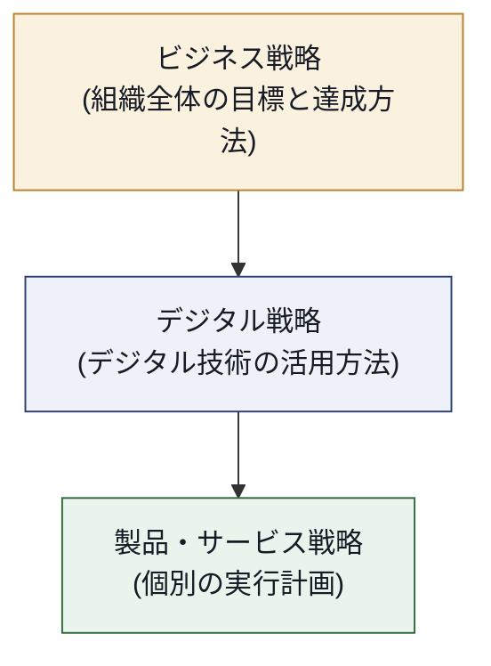
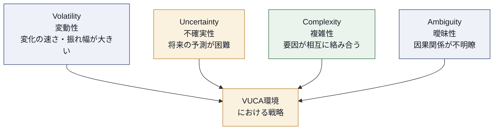
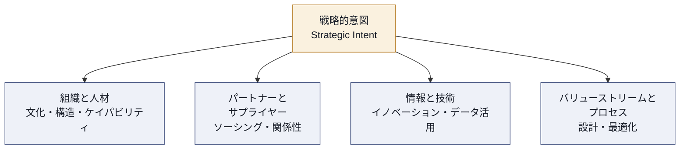
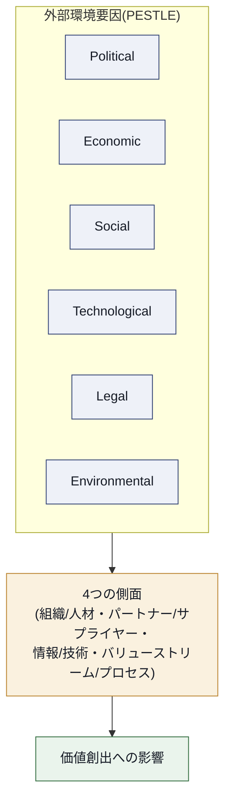
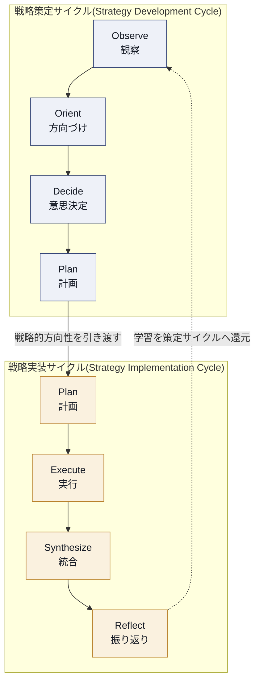
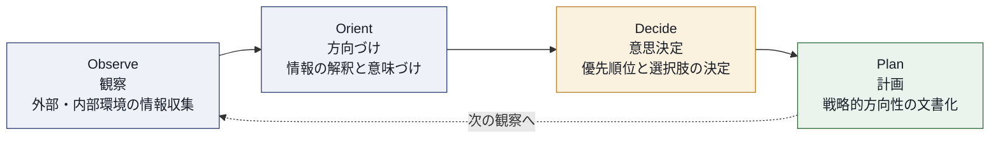
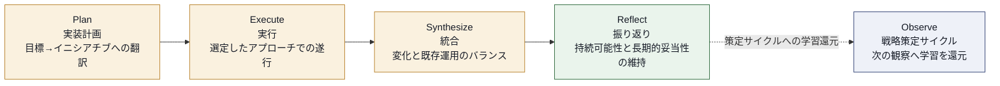
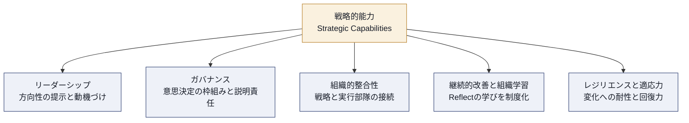
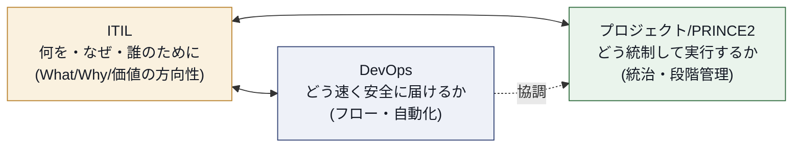
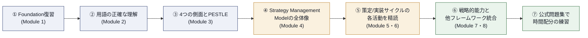

# ITIL Strategy (Version 5) 完全学習ガイド

> 初学者向けステップバイステップ解説 — 定義 → 理由 → 具体例 → 図解 の順で、出題範囲の各項目とベストプラクティスを詳細に扱う。

---

## 本ガイドについて（対象・前提・情報源の扱い）

**対象読者**: ITIL 4 Foundation または ITIL Foundation (Version 5) を取得済みで、ITIL Strategy (Version 5) の受験を検討している方。ソフトウェアエンジニア・QAエンジニア・スクラムマスターなど、非IT運用畑からITサービス戦略を学ぶ人にもわかりやすい構成にしている。

**本モジュールの位置づけ**: ITIL Strategy (Version 5) は、ITIL (Version 5) の **Strategic Leader パス** に属する上位資格である。PeopleCertの認定パートナーであるQAの解説によれば、この3日間のコースはITIL Strategyが動的なデジタル環境において組織が価値創造をどう定義し、方向づけ、持続させるかを扱い、戦略的意図を実行可能な変化へと転換すること、複雑性の中でのエビデンスに基づく意思決定、継続的な学習と適応による長期的な戦略的妥当性の維持に焦点を当てている。

**情報源についての透明性（重要）**: PeopleCertの公式シラバスPDF（Learner Workbook・Quick Reference Guide）は購入者限定コンテンツであり、本ガイド執筆時点でWeb上に無償公開された全文は確認できなかった。そのため本ガイドは以下を一次情報として構成している。

- PeopleCert公式認定ページ（試験概要・学習目標の要約）
- PeopleCertプラチナパートナー各社（QA、Asseco Academy、Tieturi、ib-formation、itil.org.uk等）が公開する詳細コースアウトライン（モジュール構成・学習目標の粒度が最も詳しい）
- AXELOS/PeopleCertのITSMポートフォリオ開発マネージャーによる公式解説記事（ITSM.tools）

厳密な用語の言い回しや出題の重み付けは、必ず **公式eBook・Learner Workbook** で最終確認してほしい。本ガイドは試験の全体像と実務での使い方を掴むための学習補助であり、公式教材の代替ではない。

---

## 目次

1. [試験概要](#1-試験概要)
2. [ITIL (Version 5) 全体像の中での位置づけ](#2-itil-version-5-全体像の中での位置づけ)
3. [Module 1: ITIL Foundationの復習と価値創出](#3-module-1-itil-foundationの復習と価値創出)
4. [Module 2: ITIL戦略の主要概念](#4-module-2-itil戦略の主要概念)
5. [Module 3: 4つの側面における戦略的考慮事項](#5-module-3-4つの側面における戦略的考慮事項)
6. [Module 4: ITIL Strategy Management Model](#6-module-4-itil-strategy-management-model)
7. [Module 5: 戦略策定サイクル（Observe-Orient-Decide-Plan）](#7-module-5-戦略策定サイクルobserve-orient-decide-plan)
8. [Module 6: 戦略実装サイクル（Plan-Execute-Synthesize-Reflect）](#8-module-6-戦略実装サイクルplan-execute-synthesize-reflect)
9. [Module 7: 戦略的能力（Strategic Capabilities）](#9-module-7-戦略的能力strategic-capabilities)
10. [Module 8: 他フレームワークとの統合](#10-module-8-他フレームワークとの統合)
11. [ベストプラクティス総括表](#11-ベストプラクティス総括表)
12. [試験対策のポイント](#12-試験対策のポイント)
13. [参考文献・出典](#13-参考文献出典)

---

## 1. 試験概要

**K1（想起レベル）**: 試験の形式・前提条件を暗記する。

| 項目 | 内容 |
|---|---|
| 出題数 | 40問 |
| 形式 | 多肢選択式（Multiple Choice） |
| 制限時間 | 90分 |
| 参照資料 | オープンブック（公式ITIL Strategy出版物の持ち込み可、書き込み・付箋も可） |
| 合格ライン | 70%（40問中28問以上） |
| 受験言語 | 英語 |
| 認定更新 | 3年ごと、CPD 60ポイント必要 |
| 受験前提条件 | ITIL 4のいずれかの認定、または ITIL Foundation (Version 5)、または ITIL Foundation Bridge (Version 5) の取得 |

この試験はオープンブックであり、公式のITIL Strategy出版物（本文中への書き込みを含む）の使用が認められているが、それ以外の参考資料の持ち込みは許可されない。受験には、いずれかのITIL 4認定、ITIL Foundation (Version 5)、またはITIL Foundation Bridge (Version 5) の取得に加えて、認定トレーニング機関または公式eラーニングでのトレーニング修了が必要である。

> [!NOTE]
> **オープンブック試験の落とし穴**: 「本を持ち込めるから覚えなくていい」という誤解は禁物。90分で40問（1問あたり約2分15秒）のペースでは、公式出版物内の該当箇所を探す時間はほとんど残らない。オープンブックは「知識の代替」ではなく「用語の正確な言い回しを確認する保険」として使うのが実務的なベストプラクティス。

### 学習内容の全体像

ITIL Strategy (Version 5) は、価値創造のための戦略を策定・実行・最適化する実践的なガイダンスを提供し、複雑でAI主導の環境において明確さと自信を持って行動できるよう、テクノロジー・投資・実行をビジネス成果と整合させることを支援する。

習得スキルとして、ITIL Strategy Management Modelを継続的に適用して戦略的な整合・方向性・行動をビジネス目標と結びつけ測定可能な成果を導く「戦略的整合と方向性」、変動的・複雑・不確実・曖昧（VUCA）な環境で情報に基づいたバランスの取れた意思決定を行う専門性、そして高速でAI対応の環境において戦略的意図を実行可能な取り組みに変換し持続的な価値を実現する「効果的な実行と価値実現」の3つが公式ページで明示されている。

---

## 2. ITIL (Version 5) 全体像の中での位置づけ

**K2（理解レベル）**: なぜITIL (Version 5) が生まれ、Strategyモジュールがどこに位置するかを理解する。

### 2.1 ITIL (Version 5) が作られた理由

ITIL (Version 5) はITIL 4以来初めてのメジャーアップデートであり、単なる改訂ではなく、AIの急速な台頭、組織の複雑性の増大、そして戦略的フレームワークと日々の実務との間の根強いギャップという、6年間の環境変化に対する実質的な回答である。

具体的には、急成長する複雑性に対しては「複雑性ネイティブなフレームワーク」を、AIの急速な普及に対しては「AIネイティブなガイダンス」を、戦略的方向性と実務性のバランスに対してはリーダー・マネージャー・実務者それぞれに明確な位置づけを、テクノロジー業界に根強く残るサイロ化に対しては統合されたフレームワークを、そしてテクノロジーの人間的側面への関心の高まりに対しては経験改善のための包括的で実践的なガイダンスを、それぞれ提供する形でITILは刷新された。

### 2.2 ITIL (Version 5) の主要な変更点

ITIL (Version 5) の主な変更点は、デジタル製品とサービス管理を1つのモデルに統合する新しいITIL Product and Service Lifecycle、より明確でモジュール化されたバリューチェーンモデルによって強化されたITIL Value System、価値がどのように創出されるかについてのより優れたエンドツーエンドで経験駆動の理解、持続可能な組織変革を実現するための新しいTransformationモデル（専用書籍付き）、Experienceと経験最適化に関する専用出版物、そしてVUCAな世界でデジタル戦略を策定・実装するための新しいStrategy Managementモデルである。

### 2.3 ITIL Product and Service Lifecycle（8段階）

Strategyモジュールの土台として、まずFoundationで学ぶこのライフサイクルモデルを押さえておく。Discover、Design、Acquire、Build、Transition、Operate、Deliver、Supportの8段階で構成され、前半（Discover・Design・Acquire・Build）はよりProduct寄り、後半（Deliver・Support）はよりService寄りで、中間のTransition・Operateが両者を橋渡しする。

> [!TIP]
> **ベストプラクティス**: この8段階は厳密な一方向フローではなく、反復的に行き来する。実務ではDiscover・Design・Build・Transition・Operateを繰り返し行き来しながら進めるのが一般的で、各フェーズには明確な活動とハンドオフが定義されている。Strategy試験では「ライフサイクルのどの段階が戦略のインプットになるか」ではなく、「戦略がライフサイクル全体にどう方向性を与えるか」という上位視点が問われる点に注意。

### 2.4 Strategic Leaderパスにおける位置づけ

ITIL Strategyは、組織の方向性そのものを扱う **Strategic Leader** パスに属するモジュールである。Strategic Leaderの称号は、前提資格である**ITIL Foundation**を基盤に、**ITIL Strategy**と全designation共通の中核モジュールである**ITIL Transformation**の2つを取得することで得られる。ITIL Product・ITIL Service・ITIL Experience・ITIL Transformationの4モジュールで構成される Managing Professional パスとは上下関係ではなく、並列の別個の認定ストリームである。対象者は組織のあらゆる階層で戦略的責任を持つリーダー、戦略実行に戦術的責任を持つ専門家、戦略目標の支援に運用的責任を持つ専門家である。

---

## 3. Module 1: ITIL Foundationの復習と価値創出

**K1〜K2**: 前提知識の確認。試験本体の配点は小さいが、以降の全モジュールの共通言語になる。

### 3.1 デジタル製品・デジタルサービスの定義

| 用語 | 定義（要旨） |
|---|---|
| デジタル製品（Digital Product） | ソフトウェア・データ・インフラ等で構成される、バージョン管理・構成可能な技術的成果物の集合 |
| デジタルサービス（Digital Service） | 1つ以上のデジタル製品を活用してビジネス成果・利用者体験・測定可能な結果を実現する価値実現の仕組み |

デジタル製品はインフラ・アプリケーション・ミドルウェア・データプラットフォーム・API・関連コンポーネントで構成されるバージョン管理・構成可能なバンドルであり有形の技術基盤である一方、デジタルサービスは1つ以上のデジタル製品を活用してビジネス成果・利用者体験・測定可能な結果を実現する価値実現の仕組みである。

**理由（なぜ区別するのか）**: 製品とサービスを明確に区別しないと、「何を作るか（製品）」と「どう価値を届けるか（サービス）」の責任が曖昧になり、戦略が実行部隊に落とし込まれた時に迷子になる。Strategyモジュールが繰り返し強調するのは、この区別を **戦略レベルで最初に固定する**重要性である。

### 3.2 バリューチェーン活動と価値共創

ITIL 4のService Value SystemはITIL Value Systemへと発展し、製品とサービス両方の視点を明示的に支える。バリューチェーンの構成要素として、Planはすべての製品・サービスに関するビジョン・現状・改善方向の共通理解を確保し、Improveはすべてのバリューチェーン活動と4つの側面にわたる製品・サービス・プラクティスの継続的改善を確保し、Engageはステークホルダーのニーズ・透明性・強固な関係性についての明確な理解を提供し、Design & Transitionは製品・サービスが品質・コスト・市場投入時間についてステークホルダーの期待を継続的に満たすことを確保する。

**具体例**: ある企業が新しい社内向けAIアシスタント機能をリリースする場合、「Discover」で業務部門のニーズを掘り起こし、「Engage」でステークホルダー（法務・情報セキュリティ含む）の期待値をすり合わせ、「Plan」でロードマップ上の優先順位を決める——という流れがバリューチェーン活動の実例になる。

---

## 4. Module 2: ITIL戦略の主要概念

**K2（理解レベル）**: 用語の混同がそのまま失点に直結する、試験で最も狙われやすい領域。

### 4.1 戦略・ビジネス戦略・デジタル戦略

ITIL Strategyにおいて、戦略とは組織がどのように目標を達成するかを記述した計画である。ビジネス戦略は組織全体の目標とその達成方法を定義し、デジタル戦略はその事業目標を達成するために組織がどのようにデジタル技術を活用するかを定義する。

| ❌ よくある誤解 | ✅ 正しい理解 |
|---|---|
| デジタル戦略＝IT部門だけの計画 | デジタル戦略はビジネス戦略の実現手段であり、全社的な整合が前提 |
| ビジネス戦略とデジタル戦略は独立して作れる | デジタル戦略はビジネス戦略から導出され、常にビジネス目標にトレース可能でなければならない |

### 4.2 ミッション・ビジョン・パーパス

ミッションとは組織が現在行っていることとその存在理由であり、ビジョンとは組織が将来なりたい姿の願望的な記述であり、パーパスとは組織が消費者やその他のステークホルダーのために何を行い、なぜそれを行うのかを示すものである。

| 用語 | 時制 | 問いかけ |
|---|---|---|
| ミッション（Mission） | 現在 | 「私たちは今、何をしているか」 |
| ビジョン（Vision） | 未来 | 「私たちは将来、何になりたいか」 |
| パーパス（Purpose） | 普遍 | 「私たちは誰のために、なぜ存在するか」 |

**具体例**: 「私たちは都市の電車を毎日安全に運行している」はミッションの例であり、「私たちは通勤者や地元企業に信頼できる移動手段を提供するために存在する」はパーパスの例として区別される。試験ではこの3つを入れ替えたひっかけ選択肢が頻出するため、時制と主語（組織自身 / 未来の組織 / ステークホルダー）で機械的に判定できるようにしておくとよい。

### 4.3 VUCA環境

VUCAとはVolatility（変動性）・Uncertainty（不確実性）・Complexity（複雑性）・Ambiguity（曖昧性）の頭文字であり、多くの組織が現在直面している困難で急速に変化する環境を表す言葉である。

**理由（なぜVUCAが戦略の前提になるのか）**: 従来の戦略立案（3〜5年の固定計画を作って粛々と実行する）は、環境が安定していることを前提にしていた。ITIL Strategyは、変動的・不確実・複雑・曖昧（VUCA）な環境において戦略を策定・実装・継続的に調整するためのガイダンスを提供するものであり、「一度立てた計画をやり切る」のではなく「観察と適応を繰り返す」ループ構造（後述のStrategy Management Model）が中核になっている。

> [!TIP]
> **ベストプラクティス**: VUCAの4要素はそれぞれ異なる対処法を要求する。実務では「Volatility→シナリオプランニングとバッファ確保」「Uncertainty→情報収集と仮説検証サイクルの短縮」「Complexity→システム思考と関係者間の対話促進」「Ambiguity→小さな実験による因果関係の可視化」のように、要素ごとに打ち手を分けて考えると戦略が具体化しやすい。

### 4.4 効果的な戦略の特性

QAの公開コースアウトラインおよび公式ページの記述から、効果的な戦略に求められる特性として次の要素が繰り返し強調されている。

- **アウトカム志向（Outcome-driven）**: 戦略策定は観察・方向づけ・意思決定・計画を通じて、効果的でアウトカム志向の戦略を定義することを学ぶ領域として位置づけられている。
- **実行可能性（Actionable）**: 戦略実装は計画・実行・統合・振り返りを通じて、戦略を実行可能な取り組みと持続的な価値へと転換することが求められる。
- **AI対応環境への適応**: 複雑でAI主導の環境において明確さと方向性を維持しながら、戦略がどのように進化するかを扱うことが明示的にスコープに含まれる。

### 4.5 ビジネスモデルとオペレーティングモデル

ITIL Strategyでは、パートナーやサプライヤーの役割・情報技術の戦略的役割・バリューストリームやプロセスに関する検討と並んで、ビジネスモデルとオペレーティングモデルがどのように戦略的意図を支え価値創造を可能にするかを扱う。一般的な経営理論との整合で理解すると、ビジネスモデルは「何を・誰に・なぜ提供するか（Why/What）」を定義し、オペレーティングモデルは「どう実現するか（How）」を定義する、という役割分担で捉えると整理しやすい。

| モデル | 焦点 | 主な構成要素 |
|---|---|---|
| ビジネスモデル | Why / What | 価値提案、顧客セグメント、収益モデル |
| オペレーティングモデル | How | プロセス、役割、システム、ガバナンス |

**具体例**: SaaS企業が「サブスクリプション課金への転換」を決めるのはビジネスモデルの変更。それを実現するために「カスタマーサクセス部門を新設し、解約予兆検知の運用フローを整備する」のはオペレーティングモデルの変更。両者は独立ではなく、ビジネスモデルの変更は必ずオペレーティングモデルの見直しを伴う。

---

## 5. Module 3: 4つの側面における戦略的考慮事項

**K2〜K3**: ITIL Foundationで学ぶ「4つの側面（Four Dimensions）」を、戦略立案という上位レイヤーに適用する。

この領域では、組織や人材に関する戦略的考慮事項、情報技術の戦略的役割、バリューストリームとプロセスに関する戦略的考慮事項、そしてパートナーやサプライヤーに関する戦略的考慮事項という4つの側面を扱う。

### 5.1 組織と人材

戦略立案における組織の文化・構造・ケイパビリティを検討する領域。戦略がどれだけ優れていても、組織構造や文化がそれを実行できる形になっていなければ絵に描いた餅になる。

### 5.2 パートナーとサプライヤー

ソーシングや戦略的関係性におけるパートナーとサプライヤーの役割を理解する。自前で全てを構築するのか、外部パートナーに委ねるのかという「Make or Buy」判断は戦略レベルの意思決定であり、ベンダーロックインのリスクや、パートナーのケイパビリティが自社の戦略スピードに追随できるかを事前に評価する必要がある。

### 5.3 情報と技術

イノベーション・データ活用・デジタルケイパビリティにおける情報技術の戦略的役割を探求する。ここでAI活用の戦略的位置づけも扱われる（詳細はModule 7・8のAIガバナンスとも関連）。

### 5.4 バリューストリームとプロセス

戦略的方向性によってバリューストリームとプロセスがどのように形作られるかを理解する。戦略が設計・最適化・価値創出を含むバリューストリームとプロセスにどう影響するかを検討する領域でもある。

### 5.5 PESTLE要因との関係

4つの側面は組織の内部要因の整理軸だが、外部環境を捉える枠組みとして **PESTLE**（Political・Economic・Social・Technological・Legal・Environmental）が組み合わされる。PESTLEは政治・経済・社会・技術・法律・環境の各要因が事業運営に与える影響を指し、ITILはこのPESTLEフレームワークを4つの側面モデルに重ね合わせることで、外部要因がそれぞれの側面にどう作用し、各側面が相互にどう価値に影響するかを示す。

> [!TIP]
> **ベストプラクティス**: PESTLE分析は「一度やって終わり」にせず、戦略策定サイクルのObserveフェーズ（後述）で定期的に見直す運用に組み込む。VUCA環境では外部要因の変化速度が速く、半年前のPESTLE分析が前提として使えなくなっていることは珍しくない。

---

## 6. Module 4: ITIL Strategy Management Model

**K3（応用レベル）**: 本モジュールの中核モデル。試験の配点比重が最も高いと想定される領域。

### 6.1 モデルの目的と全体構造

ITIL Strategy Management Modelは、戦略策定（strategy development）と戦略実装（strategy implementation）という2つの相互に接続されたサイクルから構成され、組織の戦略的方向性と行動を継続的に導くために機能する。

このモデルの目的と構造、そして戦略策定サイクルと戦略実装サイクルの関係性を理解することが、このモジュールの核心である。従来型の戦略の役割と、構造化された戦略管理モデルがなぜ必要なのかを理解した上で、このモデルが導入される。

**理由（なぜ2サイクルに分けるのか）**: 「何をすべきか決める」活動と「実際にやり遂げる」活動を1つのプロセスに混在させると、意思決定の質と実行のスピードの両方が犠牲になりやすい。2サイクルに分離することで、策定サイクルは外部環境の観察と方向性の見極めに集中でき、実装サイクルは決まった方向性のもとでの実行力に集中できる。かつ両者はループとして繋がっているため、実装の結果（Reflect）が次の観察（Observe）にフィードバックされ、VUCA環境における継続的な適応が可能になる。

### 6.2 2つのサイクルの関係性

| 観点 | 戦略策定サイクル | 戦略実装サイクル |
|---|---|---|
| 主な問い | 「何を目指すべきか」 | 「どう実現するか」 |
| 時間軸 | 中〜長期の方向性 | 短〜中期の実行 |
| 主なアウトプット | 戦略的方向性・優先順位 | 実行可能な取り組み・成果 |
| 起点となる活動 | Observe（観察） | Plan（実装計画） |

ITIL Strategy (Version 5) は、変動的で急速に変化する環境における戦略の策定・実装・継続的な調整に関するガイダンスを提供し、組織がテクノロジー・投資・実行をビジネス戦略と整合させ、測定可能な価値を届けることを支援するものであり、この2サイクル構造こそがその中核メカニズムにあたる。

> [!IMPORTANT]
> 出典についての注記: 「Observe / Orient / Decide / Plan」および「Plan / Execute / Synthesize / Reflect」という各サイクルの活動名は、PeopleCert公式ページおよび複数の認定トレーニングパートナー（QA、Asseco Academy、itil.org.uk等）のコースアウトラインで一致して確認できた名称である。ただし各活動の詳細な定義・出力物の厳密な文言は公式Learner Workbookに拠るため、暗記が必要な場合は必ず公式教材で確認すること。

---

## 7. Module 5: 戦略策定サイクル（Observe-Orient-Decide-Plan）

**K3（応用レベル）**: 各活動の目的とアウトプットを、状況に当てはめて適用できるようになることが到達目標。

戦略策定サイクルの4つの活動（observe、orient、decide、plan）の目的とアウトプットを理解し、ITILガイディングプリンシプルが効果的な戦略策定をどう支えるか、PESTLE要因が戦略的方向性にどう影響するか、そして内部ケイパビリティとリソースが戦略的選択をどう形作るかを分析し、基礎レベルで戦略策定サイクルを適用できるようになることが、このモジュールの学習目標である。

### 7.1 Observe（観察）

**定義**: 外部環境（PESTLE要因、市場動向、競合状況）と内部環境（組織のケイパビリティ、リソース、実績）の両方から情報を収集する活動。

**理由**: VUCA環境では「知っているつもり」の前提が数ヶ月で陳腐化する。継続的な観察を組み込まない限り、戦略は策定した瞬間から古くなっていく。

**具体例**: 四半期ごとに競合のプロダクトリリース状況・自社のNPS推移・規制動向（Legal要因）を定点観測するダッシュボードを運用する。

### 7.2 Orient（方向づけ）

**定義**: 観察で集めた情報を解釈し、組織にとっての意味づけを行う活動。単なるデータ収集と異なり、「このデータは我々の戦略にとって何を意味するか」という解釈の作業が中心になる。

**理由**: 情報量が多いVUCA環境では、生データをそのまま意思決定に使うと情報過多で判断が麻痺する。Orientは情報のノイズを削ぎ落とし、意思決定者が扱える形に整える橋渡し役を果たす。

### 7.3 Decide（意思決定）

**定義**: 方向づけられた情報をもとに、戦略的な優先順位と選択肢を決定する活動。

**理由**: 全ての機会を同時に追求することはリソース的に不可能である。Decideフェーズで「やらないことを決める」ことこそが戦略の本質であり、ここでの意思決定基準の明確さが、後続の実装サイクルの質を左右する。

### 7.4 Plan（計画）

**定義**: 決定された戦略的方向性を、実装サイクルに引き渡せる形の計画として文書化する活動。

**理由**: このPlanは戦略実装サイクルの入力（Plan＝実装計画の起点）と名前が同じだが役割は異なる点に注意。策定サイクルのPlanは「何を目指すか」の文書化であり、実装サイクルのPlanは「どう実行するか」の具体化である。

> [!IMPORTANT]
> **試験の頻出ひっかけ**: 「Plan」という活動名が策定サイクルと実装サイクルの両方に登場する。問題文でどちらのサイクルのPlanを指しているか、前後の文脈（外部環境の観察結果を扱っているか／実行計画の詳細を扱っているか）で判別する練習をしておくこと。

### 7.5 ガイディングプリンシプルとの関係

ITILガイディングプリンシプルが効果的な戦略策定をどのように支えるかも本モジュールの範囲である。Foundationで学ぶ7つのガイディングプリンシプル（Focus on value / Start where you are / Progress iteratively with feedback / Collaborate and promote visibility / Think and work holistically / Keep it simple and practical / Optimize and automate）は、策定サイクルの各活動に次のように対応づけて理解すると覚えやすい。

| ガイディングプリンシプル | 策定サイクルでの適用例 |
|---|---|
| Focus on value | Decideフェーズで「価値への貢献度」を優先順位づけの基準にする |
| Start where you are | Observeフェーズで既存のケイパビリティを過小評価しない |
| Progress iteratively with feedback | Plan完了後も次のObserveへ継続的にループさせる |
| Collaborate and promote visibility | Orientフェーズの解釈を関係部門と共有し独りよがりの解釈を避ける |

### 7.6 内部ケイパビリティとリソースの影響

内部ケイパビリティとリソースが戦略にどう影響するかを説明できることが学習目標に含まれる。どれだけ魅力的な外部機会（Observeで発見）があっても、それを実行するケイパビリティ（人材・技術・資金）が伴わなければ、Decideフェーズでその機会は見送られるべきである。「戦略は野心と実現可能性のバランス」という考え方がここで具体化される。

---

## 8. Module 6: 戦略実装サイクル（Plan-Execute-Synthesize-Reflect）

**K3（応用レベル）**: 「決めた戦略をやり切る」ための実務的な活動群。

戦略実装サイクルの目的と成果を理解し、戦略目標が『Plan』活動の中でどのように実装イニシアチブへ翻訳されるか、実装イニシアチブの実行アプローチが『Plan』活動の中でどう選定されるかを学ぶ領域。

### 8.1 Plan（実装計画）

**定義**: 策定サイクルから引き渡された戦略的方向性を、具体的な実装イニシアチブに翻訳する活動。

戦略目標が『Plan』活動の中でどのように実装イニシアチブへ翻訳されるか、そして実装イニシアチブの実行アプローチがどのように選定されるかがここでの学習の核心である。戦略実装は、計画・実行・統合・振り返りを通じて、戦略的な意図を実行可能な取り組みへと転換し、持続的な価値を実現するプロセスと定義される。

**具体例**: 「デジタル戦略として顧客対応の一部をAIエージェントに委譲する」という策定サイクルの決定を、「まずFAQ対応領域から段階的に導入する」「3ヶ月ごとに満足度を測定する」という実装イニシアチブに分解する。

### 8.2 Execute（実行）

**定義**: Planで選定した実行アプローチに従い、イニシアチブを実際に遂行する活動。

**理由**: 実行アプローチの選び方（一気に全社展開するビッグバン型か、段階的に展開するインクリメンタル型か）は、組織のリスク許容度と変化への耐性によって変わる。ここでも「Progress iteratively with feedback」のガイディングプリンシプルが実務的な指針になる。

### 8.3 Synthesize（統合）

**定義**: 変革の取り組みと既存の日常運用をバランスさせる活動。

変革の取り組みと継続中の運用をバランスさせることが明示的な学習目標である。新しい戦略イニシアチブを追求するあまり、既存サービスの安定運用が疎かになれば、短期的な信頼を損ない、結果的に戦略実行の基盤を掘り崩すことになる。

### 8.4 Reflect（振り返り）

**定義**: 戦略の長期的な妥当性と持続可能性を維持するための振り返り活動。

長期的な戦略の妥当性と持続可能性を維持することがこの活動の目的である。この振り返りの結果は、策定サイクルのObserveフェーズへとフィードバックされ、モデル全体のループが閉じる。

| ❌ アンチパターン | ✅ ベストプラクティス |
|---|---|
| Reflectを「反省会」で終わらせ、次の観察に接続しない | Reflectで得た学びを構造化し、次のObserveの入力データとして明示的に引き継ぐ |
| Executeの結果だけを評価し、Synthesizeで運用とのバランスを見ない | 変革の進捗指標と既存運用のSLA/品質指標を同じダッシュボードで並べて追跡する |

---

## 9. Module 7: 戦略的能力（Strategic Capabilities）

**K2（理解レベル）**: 戦略を「継続的に実行し続けられる」組織能力に関する領域。

長期的な戦略実行を支えるために必要な能力を理解し、リーダーシップ・ガバナンス・組織的整合性を探求し、継続的な改善と組織学習を支え、戦略実行におけるレジリエンスと適応力を構築することが本モジュールのスコープである。

### 9.1 リーダーシップ

ITIL Strategyにおいて、新たに就任したIT組織のトップが明確な方向性を定め、個人を動機づけ、影響を与え、コミットメントを引き出すために自ら時間を割く、という描写がリーダーシップの実践例として示される。リーダーシップは肩書きではなく行動であり、戦略の実装サイクルにおいてExecute・Synthesizeを支える推進力になる。

### 9.2 ガバナンス

戦略的意思決定の枠組みと説明責任の所在を明確にする活動。誰が何について意思決定できるのか（Decideフェーズの権限設計）が曖昧なままだと、策定サイクルのDecideが機能不全に陥る。

### 9.3 組織的整合性

戦略と現場実行部隊の間に断絶が生じないようにする能力。Module 3で扱った「組織と人材」の側面と密接に関連する。

### 9.4 継続的改善と組織学習

実装サイクルのReflectで得られた学びを、個人の経験に留めず組織的な知識として制度化する能力。ITIL Foundationの継続的改善（Continual Improvement）の考え方が、戦略レベルでも同様に適用される。

### 9.5 レジリエンスと適応力

VUCA環境で戦略の実行力を維持し続けるための回復力。想定外の環境変化（規制の急変、競合の破壊的参入など）が発生しても、組織として立て直せる能力を指す。

> [!TIP]
> **ベストプラクティス**: これら5つの戦略的能力は独立した個別施策ではなく、Strategy Management Modelの2サイクルを継続的に回すための「土台」として機能する。能力開発への投資を怠ると、モデル自体は正しくても実装サイクルが1周で止まってしまう（いわゆる「戦略疲れ」）リスクが高まる。

---

## 10. Module 8: 他フレームワークとの統合

**K2（理解レベル）**: ITIL単体で完結せず、DevOpsやプロジェクトマネジメント手法とどう補完し合うかを理解する。

ITILがデジタル製品・サービスライフサイクル全体を通じてDevOpsをどう補完するか、ITILプラクティスとDevOpsのワークウェイズがどう協働するか、ITILプラクティスの適用においてプロジェクトマネジメントがどのような役割を果たすか、そしてITILとPRINCE2をどう組み合わせて製品・サービスを効果的に提供できるかを理解することが本モジュールの学習目標である。

### 10.1 ITILとDevOpsの補完関係

ITILは「何を・なぜ・誰のために」という価値の方向性と統制の枠組みを提供し、DevOpsは「どう速く安全に届けるか」というフローと自動化の実践を提供する。両者は競合するフレームワークではなく、ITIL Strategyが方向づけた戦略的意図を、DevOpsの高速なデリバリーサイクルが実現する、という補完関係で理解するのがベストプラクティスである。

### 10.2 プロジェクトマネジメントとPRINCE2との関係

戦略実装サイクルのExecuteフェーズで、個別の実装イニシアチブを統制されたプロジェクトとして遂行する際に、PRINCE2のようなプロジェクトマネジメント手法が活用される。ITIL Strategyが「何を優先するか」を決め、PRINCE2が「どう段階的に統治しながら実行するか」を担う、という役割分担になる。

> [!NOTE]
> **AIガバナンスとの関連（参考）**: PeopleCertはITIL AI Governanceという専用出版物も作成しており、これはITIL (Version 5) のいわゆる「コア」の製品・サービス管理ベストプラクティスガイダンスの一部ではないが、多くの組織が直面する重要なITSM課題への支援を提供するものである。ITIL Strategy試験のシラバス概要にも「AIガバナンス」という語が学習項目として挙げられているため、コア出版物ではない関連トピックとして概要だけは押さえておくとよい。

---

## 11. ベストプラクティス総括表

| 領域 | ベストプラクティス | 根拠・理由 |
|---|---|---|
| 戦略の言語統一 | ミッション・ビジョン・パーパス・ビジネス戦略・デジタル戦略の定義を組織内で文書化し共通言語にする | 用語の混同は意思決定の齟齬に直結する（4.1〜4.2節） |
| VUCA対応 | 固定計画ではなくObserve-Orient-Decide-Planのループを定常運用に組み込む | 環境変化速度に追随できない戦略は策定した瞬間から陳腐化する（4.3節） |
| 外部環境分析 | PESTLE分析を四半期など定期サイクルで見直す | 半年前の分析が前提として使えなくなるスピード感がVUCA環境の特徴（5.5節） |
| 意思決定の透明性 | Decideフェーズの優先順位づけ基準（何を価値とみなすか）を事前に明文化する | ガイディングプリンシプル「Focus on value」の実務適用（7.5節） |
| 実装と運用の両立 | 変革イニシアチブの進捗指標と既存運用のSLA/品質指標を同じダッシュボードで管理する | Synthesizeフェーズでの変革と運用のバランス確保（8.3節） |
| 学習の制度化 | Reflectで得た学びを個人の経験で終わらせず、次のObserveの入力として構造化して引き継ぐ | ループが1周で途切れると戦略疲れが起きる（8.4節、9.4節） |
| 権限設計 | 誰が何を決定できるかというガバナンスの枠組みをDecideフェーズの前に明確化する | 権限が曖昧だと意思決定サイクル自体が機能不全になる（9.2節） |
| フレームワーク間の役割分担 | ITILは方向性、DevOpsは高速デリバリー、PRINCE2は統制された実行、と役割を混同しない | 競合させず補完関係として設計するのがベストプラクティス（10.1〜10.2節） |

---

## 12. 試験対策のポイント

### 12.1 出題されやすいポイント

- **用語の入れ替えひっかけ**: ミッション／ビジョン／パーパス、ビジネス戦略／デジタル戦略、戦略策定サイクルのPlan／戦略実装サイクルのPlan、など類似語の混同を狙った選択肢が頻出する構造になっている。
- **サイクルの活動順序**: Observe→Orient→Decide→Plan、Plan→Execute→Synthesize→Reflectの順序と、各活動の目的・アウトプットの対応関係。
- **4つの側面とPESTLEの重ね合わせ**: どの外部要因がどの側面に主に影響するかという組み合わせ問題。

### 12.2 オープンブックの活用戦略

| ✅ 効果的な使い方 | ❌ 非効率な使い方 |
|---|---|
| 用語の正確な定義を素早く確認するための索引として使う | 試験中に初めて読んで理解しようとする |
| 事前にサイクル図・4つの側面の図に付箋やマーカーで印をつけておく | ページ番号を覚えずその場で目次から探す |
| 頻出用語（VUCA、PESTLE、戦略策定/実装サイクルの活動名）は暗記した上で、細かい言い回しの確認にのみ本を使う | 全問をオープンブックに頼り、時間切れになる |

### 12.3 学習の進め方（推奨シーケンス）

---

## 13. 参考文献・出典

本ガイドは以下の一次・準一次情報源に基づいて構成した。試験直前の最終確認には、必ず公式eBook・Learner Workbookを参照すること。

1. **PeopleCert公式認定ページ「ITIL Strategy (Version 5)」**（試験概要・学習目標・前提条件）
   https://www.peoplecert.org/browse-certifications/it-governance-and-service-management/ITIL-1/itil-strategy-version-5-4175

2. **QA（PeopleCertプラチナパートナー）公式コースページ**（8モジュールの詳細アウトライン・学習成果・試験構成の一次情報として本ガイドの骨格に使用）
   https://www.qa.com/course-catalogue/courses/itil-strategy-version-5-itil5str/

3. **ITSM.tools「ITIL (Version 5) Explained」**（AXELOS ITSMポートフォリオ開発マネージャー Roman Jouravlev氏による公式解説記事。ITIL (Version 5) 全体の変更点、Strategy出版物とAI Governance出版物の位置づけ）
   https://itsm.tools/itil-version-5-explained-key-changes-lifecycle-ai-governance/

4. **nex-arc-learning.com ITILFND-V5 Study Guide Cheat Sheet**（ミッション・ビジョン・パーパス・戦略・VUCAの用語定義）
   https://nex-arc-learning.com/peoplecert/itilfnd-v5/study-guide/cheat-sheet/

5. **Asseco Academy 公式トレーニングページ**（戦略策定/実装サイクルの各活動の学習目標の英語原文確認）
   https://academy.asseco.pl/szkolenie/itil-strategy-wersja-5-in-english/

6. **Tieturi 公式トレーニングページ**（モジュール5〜7の学習目標の相互確認）
   https://www.tieturi.fi/tuote/itil-strategy/

7. **itil.org.uk 公式トレーニングページ**（戦略実装サイクルの詳細な学習目標、AIガバナンス・DevOps・PRINCE2との統合範囲の確認）
   https://www.itil.org.uk/training/itil-strategic-leader-sl/itil-strategy-certification-training-course

8. **ib-formation.fr 公式トレーニングページ（フランス語）**（モジュール構成のクロスチェック用）
   https://www.ib-formation.fr/formations/gouvernance-des-si-referentiels/itil-strategy-version-5

9. **PMG Academy「The Definitive Guide to ITIL Version 5 Foundation」**（ITIL Product and Service Lifecycleの8段階の定義、バリューチェーン活動の定義）
   https://www.pmgacademy.com/en/articles/itil/the-definitive-guide-to-itil-version-5-foundation/

10. **TeamDynamix「What is ITIL 5?」**（Product and Service Lifecycleの8段階名称の相互確認）
    https://www.teamdynamix.com/blog/an-introduction-to-the-itil-framework/

11. **DionTraining「ITIL 5 Process Guide」**（Product and Service Lifecycle各段階の役割の相互確認）
    https://www.diontraining.com/blogs/news/itil-5-process

12. **itil.com 公式ニュース「ITIL Version 5 Foundation - What's New Guide」**（Discover/Design/Acquire/Build/Transition/Operate/Deliver/Supportの8段階名称の一次確認）
    https://www.itil.com/Itil-News-and-Announcements/itil-version-5-foundation-whats-new-guide

13. **Vivantio「ITIL Best Practices and Processes for CSM」**（PESTLEフレームワークと4つの側面モデルの重ね合わせの説明）
    https://www.vivantio.com/blog/https-blog-vivantio-com-itil-best-practices-viv/

14. **ITSM Academy「ITIL (Version 5) Updates」**（公式書籍・学習教材の提供状況、オープンブック試験における公式出版物の重要性）
    https://itsmacademy.com/press-room/itil-version-5/

15. **innovativelearning.eu「ITIL Strategy (Version 5)」ダウンロードページ**（公式PDF資料の存在確認・出版概要）
    https://www.innovativelearning.eu/news-resources/free-resources/downloads/itil-strategy-version-5.html

---

*本ガイドはPeopleCert公式教材の代替ではなく、学習の全体像を掴むための独立した補助教材である。ITIL®はPeopleCert International Limitedの登録商標。最終的な学習・受験準備は必ず公式Learner Workbook・Quick Reference Guide・Official eBookを参照すること。*
