# ITIL Transformation（Version 5）学習ガイド

初学者向け ステップバイステップ解説

---

## このガイドについて

- **対象読者**：ITIL Foundation（Version 5）またはいずれかのITIL 4認定を取得済みで、これから ITIL Transformation（Version 5） を学ぶ人
- **構成**：出題領域（シラバスの柱）に沿って、章ごとに「基本概念 → 図解（Mermaid） → ベストプラクティス → 出典」の順で解説する
- **表記ルール**：英語の専門用語（Transformation Model、Governance など）はそのまま残し、日本語で意味を補足する。ASCIIアートは使用せず、図はすべてMermaid、一覧・比較はすべてMarkdown表で表現する
- **免責事項**：本ガイドは PeopleCert / ITIL 公式サイトおよび公認トレーニングプロバイダが公開しているシラバス概要・記事をもとに独自にまとめた学習補助教材であり、PeopleCert International Ltd. が発行する有償の公式教材（Official eBook、Learner Workbook、Quick Reference Guide）の代替にはならない。特に「Transformation Model の4層に含まれる12ステージそれぞれの名称・詳細な活動内容」は有償の公式教材にのみ収録されている粒度の情報であるため、本ガイドでは層（レイヤー）単位の概念構造までを解説し、ステージ単位の一次情報は出典として公式教材への参照を明示するにとどめる

> **本ガイドの前提知識**
> ITIL Transformation は ITIL Foundation の知識（ITIL Value System、Guiding Principles、Four Dimensions of Service Management、Product and Service Lifecycle）を前提として設計されている。これらの用語に不安がある場合は、先に ITIL Foundation（Version 5）の学習ガイドを参照することを推奨する。

---

## 目次

1. 認定試験の全体像
2. ITIL Transformationとは何か－基本概念
3. Transformationの特性・スコープ・複雑性
4. ITIL Transformation Model－全体構造
5. BAU Governance と Transformation Governance
6. Transformation Patterns と Toolkit
7. Governance and Transformation Alignment
8. Execution and Delivery of Change
9. Measurement, Learning, and Continual Improvement
10. Tools, Methods, and Techniques
11. AI and Transformation
12. 他フレームワークとの統合（PRINCE2 / DevOps / Agile）
13. 試験対策とキャリアパス
14. 用語集
15. 参考文献・出典URL一覧

---

## 1. 認定試験の全体像

ITIL Transformation（Version 5）は、ITIL（Version 5）資格体系における「すべてのdesignationに共通する中核モジュール（core module）」である。Practice Manager、Managing Professional、Strategic Leaderのいずれを目指す場合でも、一度合格すればその実績はすべてのdesignationにカウントされる（再受験の必要はない）。

### 1-1. 試験の基本データ

| 項目 | 内容 |
|---|---|
| 出題形式 | 選択式（Multiple choice） |
| 問題数 | 40問 |
| 試験時間 | 90分 |
| 参照可否 | Open book（公式教材の参照が可能） |
| 合格基準 | 70%以上の正答 |
| 出題言語 | 英語 |
| 認定更新 | 3年ごと、CPD（Continuing Professional Development）60ポイントが必要 |

### 1-2. 受験前提条件（Certification Requirements）

以下のいずれか1つに加えて、Accredited Training Organization（ATO）経由の研修、またはITIL公式eラーニングの修了が必須となる。

- いずれかのITIL 4認定（ITIL 4 Foundationおよびその上位資格）
- ITIL Foundation（Version 5）
- ITIL Foundation Bridge（Version 5）（ITIL 4有資格者向けの差分学習コース）

> 試験結果は、上記の受講証明（Proof of completion）が確認されるまで公開されない。

### 1-3. 出題の認知レベル（Bloom's Taxonomy）

ITIL Foundation試験が主に「知識（Recall）」と「理解（Comprehension）」を問うのに対し、ITIL Transformationの出題はBloom's Taxonomyのレベル1〜4（知識・理解・適用・分析）にまたがる。つまり、用語の暗記だけでなく、

- シナリオの中でどのGovernanceパターンが適切かを判断する
- Transformationの文脈（Context）に応じて実行アプローチを選び分ける
- 組織の状況を分析し、最適なツール・手法を提案する

といった応用力が問われる点が、初学者にとって最初のハードルになりやすい。

### 1-4. 資格体系上の位置づけ

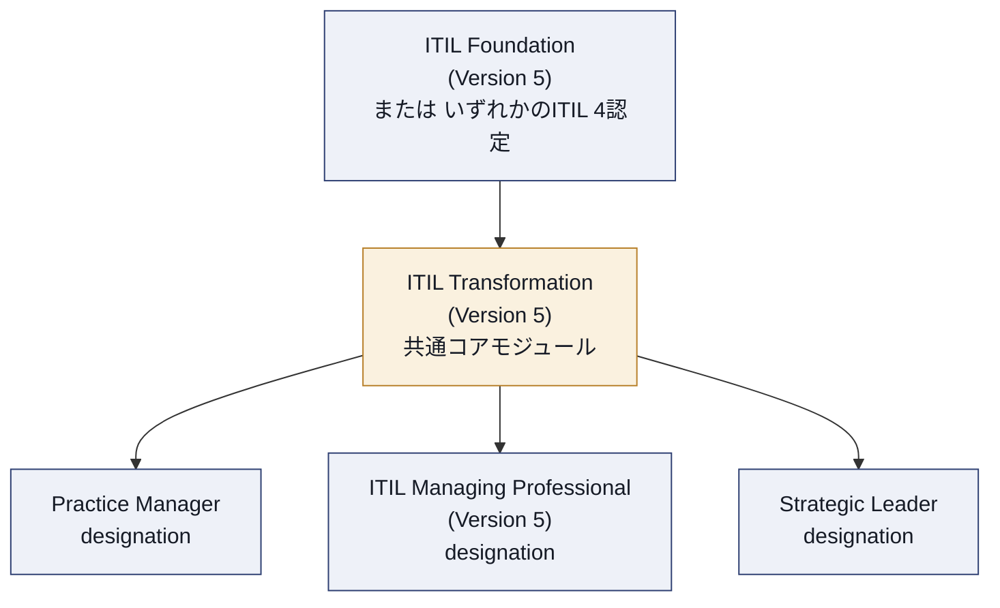

ITIL Managing Professional（Version 5）designationを取得する場合は、ITIL Transformationに加えて「ITIL Managing Professional Transition－Product, Service, Experience（Version 5）」試験にも合格する必要がある（Take2オプションでは両試験の再受験権をセットで購入できる）。

---

## 2. ITIL Transformationとは何か－基本概念

### 2-1. なぜTransformationが必要なのか

組織は、技術の変化・市場環境の変化・顧客期待の変化に継続的に適応し続けなければならない。構造化されたアプローチを持たないまま変革（Transformation）に取り組むと、次のような失敗パターンに陥りやすい。

- 取り組みが断片化し、各部門がバラバラに動いてしまう
- 意思決定が遅く、変化のスピードに追いつけない
- 変革の結果が測定可能な価値（Value）につながらない

ITIL Transformationは、この課題に対して次の4つの観点から対応する枠組みを提供する。

1. 複雑で不確実な環境（Complex and uncertain environments）における変革のマネジメント
2. Governance・Execution・Learningのバランス
3. 構造化された変革を通じた測定可能な価値の提供
4. ステークホルダーとValue Streamをまたいだコラボレーションの強化

### 2-2. Change と Transformation の違い

ITILにおいて「Change（変更）」は、日常的なサービス運用の中で発生する個別の変更（例：あるサーバー構成の変更）を指すことが多いのに対し、「Transformation」は、複数の依存関係にまたがる、調整された大規模な変化を指す。

| 観点 | 通常のChange / 継続的改善 | Transformation |
|---|---|---|
| スコープ | 個別のサービス・コンポーネント | 組織、あるいはその大部分 |
| 依存関係 | 限定的 | 複数の部門・Value Streamにまたがる |
| 不確実性 | 比較的低い | 高い（将来の姿を正確に予測できない） |
| 進め方 | 既存のプロセスに沿って実施 | 状況に応じて複数のアプローチを並行して使い分ける |
| 典型的な例 | 通常のリリース、パッチ適用 | 運用モデルの刷新、AI導入に伴う組織再編 |

> **ベストプラクティス**
> - 「これはChangeなのかTransformationなのか」を最初に切り分けることが、適切なGovernanceモデルを選ぶ第一歩になる。スコープが単一チーム内に閉じているならBAU（Business As Usual）の変更管理で十分なことが多いが、複数のValue Streamにまたがり、かつ結果に不確実性がある場合はTransformationとして扱う
> - 小規模な取り組みから大規模なプログラムまで、同じTransformation Modelの考え方を「スケールを変えて」適用できるという柔軟性を意識する

### 2-3. ITIL Value System・Guiding Principles・Four Dimensionsとの関係

ITIL Transformationは、ITIL Foundationで学ぶ土台の上に構築されている。

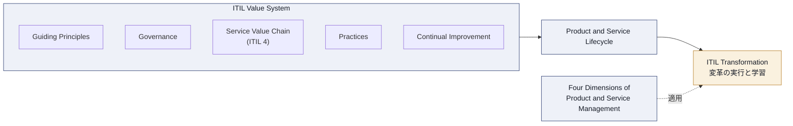

- **Guiding Principles**：「フィードバックを伴い反復的に進める」「シンプルに、実用的に」といった原則は、Transformationにおける進め方の判断基準としてそのまま使える
- **Four Dimensions（組織と人、情報と技術、パートナーとサプライヤー、Value Streamとプロセス）**：Transformationの影響範囲を漏れなく検討するためのチェックリストとして機能する。特に「情報と技術」ディメンションには、Version 5で新設されたITIL AI Capability Modelが組み込まれている（詳細は第11章）
- **Product and Service Lifecycle**：Version 5でITIL 4のService Value Chainから発展した概念で、Transformationはこのライフサイクル全体、あるいはその一部を対象に実施される

> **ソース**
> - [ITIL Transformation (Version 5) | itil.com](https://www.itil.com/professionals/certifications/ITIL-Transformation-Version-5)
> - [ITIL Transformation (Version 5) | peoplecert.org](https://www.peoplecert.org/browse-certifications/it-governance-and-service-management/ITIL-1/itil-transformation-version-5-4173)

### 2-4. Transformationが価値を生む3つの領域

公認トレーニングプロバイダの講座説明では、ITIL Transformationがもたらす効果を次の3つの粒度で整理している。

| 領域 | 内容 |
|---|---|
| ① Governance／管理能力の適合性確保 | 組織のマネジメント能力・Governance能力が、望ましい働き方（Desired ways of working）に対して適切であることを保証する |
| ② 組織能力の形式化 | 既存の組織能力について、責任（Accountability）と役割（Responsibility）を明確にしながら体系化・標準化する |
| ③ Value Systemの部分／全体の改善 | Four Dimensionsを考慮しながら、Value Systemの特定の一部分（例：あるPracticeやツールの使い方）、あるいはValue System全体のパフォーマンスを大きく改善する |

> **ベストプラクティス**
> - Transformationの企画段階で、この3領域のうち「今回の取り組みはどれに該当するか」を明文化しておくと、スコープのブレを防ぎやすい
> - ③のように複数のステークホルダーにまたがる全体最適を狙う場合ほど、後述するGovernance PatternsとExecution Patternsの使い分けが重要になる
>
> **ソース**
> - [ITIL® Transformation Course & Examination | ITSM Hub](https://www.itsmhub.com/products/itil-transformation-course-examination)

---

## 3. Transformationの特性・スコープ・複雑性

### 3-1. Transformationは一様ではない

ITIL Transformationが強調する最初のポイントは、「Transformationにはさまざまな規模・スコープ・コスト・リスクのものがある」という事実である。小規模なチーム改善から、全社的な運用モデルの刷新まで、扱う対象は大きく異なる。

| 特性軸 | 小規模な例 | 大規模な例 |
|---|---|---|
| Scale（規模） | 1チーム、1Practice | 全社、複数事業部門 |
| Scope（範囲） | 単一のツール導入 | 運用モデル全体の刷新 |
| Cost（コスト） | 低い | 高額な投資を伴う |
| Risk（リスク） | 限定的 | 事業継続に関わる |
| Uncertainty（不確実性） | 見通しが立てやすい | 将来像そのものが不透明 |

> **ベストプラクティス**
> - Transformation Modelは「非規範的（Non-prescriptive）」であることが繰り返し強調されている。つまり、決まった手順をそのまま当てはめるのではなく、上表の特性に応じてモデルの適用度合いを調整する姿勢が推奨される
> - 小さく始めて学習しながらスケールさせる（Guiding Principlesの「反復的に進める」）アプローチと、Transformation Modelは矛盾しない

### 3-2. 2つのオーディエンス

ITIL Transformationのガイダンスは、次の2種類の読み手を意識して設計されている。

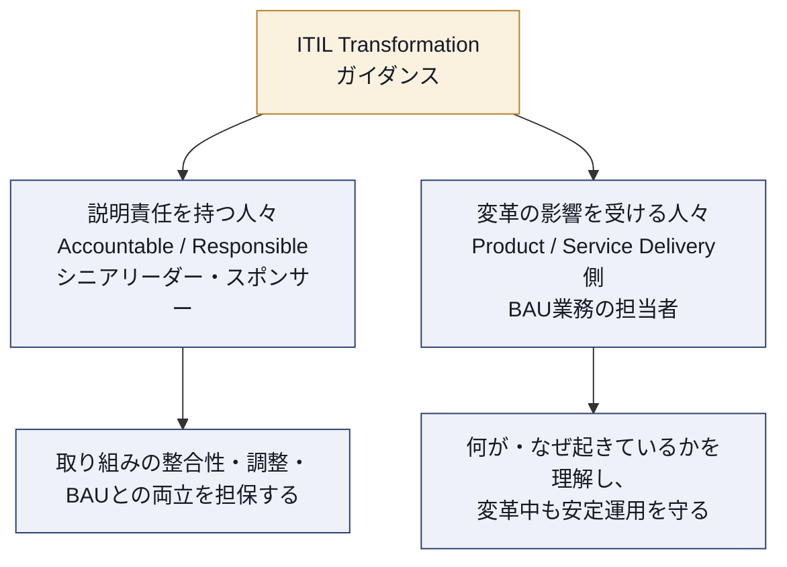

- **説明責任を持つ人々**：Transformationの成果に対してAccountable / Responsibleな立場にあるシニアリーダーやスポンサー。取り組み全体の整合性・調整、BAU業務との両立を担保する役割を持つ
- **影響を受ける人々**：Product / Service Deliveryの現場でBAU業務に従事しながら、Transformationによって働き方の変化を求められる人々。何が起きていて、なぜそれが必要なのかを理解し、変革期間中も安定運用（BAU）を守る役割を持つ

> **ベストプラクティス**
> - Transformationの立案時に「誰のために、どの粒度で情報を発信するか」をこの2オーディエンスで分けて設計すると、コミュニケーション不足による抵抗（Resistance）を減らせる
> - ITIL Transformationモジュールは、ITIL Foundationの後に単独で受講することも、ITIL Service／Product／Experience／Strategyなどの上位モジュールを経てから受講することも可能な設計になっている。シニアリーダー層が他の詳細モジュールを学ばずにTransformationの知識だけを得られるのは、この「説明責任を持つ人々」への配慮の表れである

### 3-3. 複雑性への向き合い方

Transformationが扱う状況は、見通しの立てやすい秩序だった（Ordered / Predictable）環境から、因果関係が事前には把握しづらい複雑（Complex）な環境、さらには緊急対応が求められる混沌（Chaotic）とした環境まで幅がある。ITIL Transformationは、この状況の違いに応じて計画的アプローチと探索的アプローチを使い分けることを重視する。

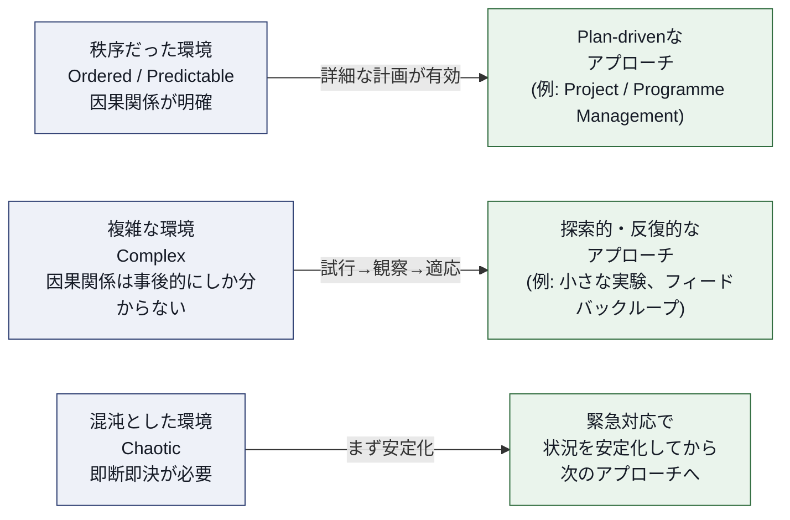

> **ベストプラクティス**
> - 「この状況は詳細な計画が有効な領域か、それとも試しながら学ぶしかない領域か」を最初に見極めることが、無駄な計画コストや、逆に無計画な混乱を避ける鍵になる
> - 1つのTransformationプログラムの中でも、サブテーマごとに複雑性のレベルが異なることがある。全体を一律の手法で進めようとせず、部分ごとに適したアプローチを並行させる（第4章・第6章で扱うModelとPatternsが、このための道具立てとなる）
>
> **ソース**
> - [ITIL® Transformation (Version 5) course | QA](https://www.qa.com/course-catalogue/courses/itil-transformation-version-5-itil5trf/)
> - [ITIL Transformation | A Continual Approach to Change（Kaimar Karu, Lead Author）| itil.com](https://www.itil.com/Itil-News-and-Announcements/itil-transformation-version-5)

---

## 4. ITIL Transformation Model－全体構造

### 4-1. 4つのレイヤー

ITIL Transformation Modelは、Governance・Positioning・Execution・Learningという4つの相互接続したレイヤー（層）で構成される。公式教材では、この4層がさらにステージ（Stage）とステップ（Step）に分解され、あわせて12のステージで構成されるとされている（ステージ単位の詳細な名称・内容は有償の公式教材に収録されており、本ガイドでは扱わない）。

| レイヤー | 役割の要点 |
|---|---|
| **Governance** | Transformationの戦略的な方向づけと意思決定の枠組みを提供する。何を、なぜ、どこまでやるかの判断基準を定める |
| **Positioning** | 組織が置かれている状況（複雑性、制約、ステークホルダーの期待）を理解し、Transformationの立ち位置を明確にする |
| **Execution** | 実際に変革を実行するレイヤー。複数の実行アプローチを並行して用いることが前提となる |
| **Learning** | 実行から得られた結果を測定・評価し、組織の学習として蓄積し、次の意思決定にフィードバックする |

### 4-2. レイヤー間の関係

4つのレイヤーは一方通行の工程（ウォーターフォール）ではなく、相互にフィードバックしあう循環構造として描かれる。

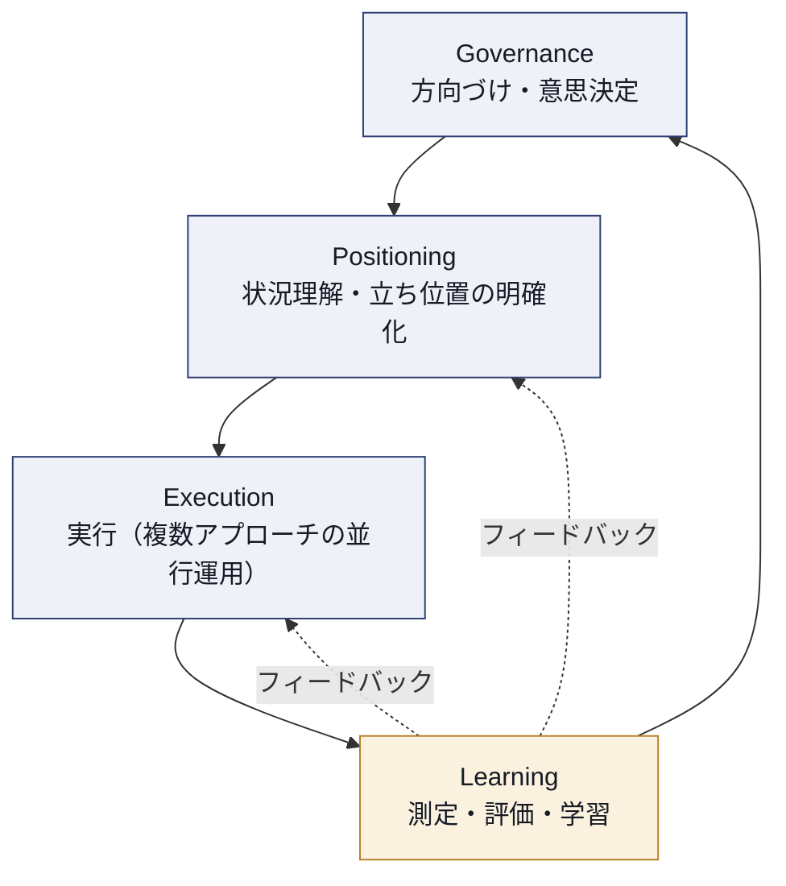

- **Governanceが起点**：Transformationの方向性はGovernanceレイヤーで定められるが、これはPositioningやExecutionから得られた学習結果によって継続的に見直される
- **PositioningとExecutionの並走**：状況把握（Positioning）と実行（Execution）は一度で終わる工程ではなく、Transformationの進行中、繰り返し行われる
- **Learningが全体をつなぐ**：Learningレイヤーは単なる「振り返り」ではなく、GovernanceとExecutionの両方に継続的にフィードバックを返す役割を持つ

> **ベストプラクティス**
> - 4層モデルを「フェーズ（順番に一度だけ通過する工程）」として運用しないこと。特にGovernanceとLearningの往復（フィードバックループ）を止めてしまうと、当初の前提が古いまま変革が進み、環境変化に対応できなくなる
> - Positioningを軽視して直接Executionに入ると、状況認識のズレによって後工程での手戻りが発生しやすい。小規模なTransformationであっても、Positioningに相当する状況整理のステップを省略しないことが推奨される
>
> **ソース**
> - [ITIL® Transformation (Version 5) e-Learning+ | Advanced Training](https://advancedtraining.com.au/product/itil-transformation-version-5-e-learning-plus/)
> - [ITIL Transformation (Version 5) Practice Tests | Udemy](https://www.udemy.com/course/itil-transformation-version-5-practice-tests/)

---

## 5. BAU Governance と Transformation Governance

### 5-1. なぜGovernanceを2つに分けるのか

ITIL Transformationの大きな特徴のひとつは、Governanceを「BAU（Business As Usual＝通常業務）のGovernance」と「Transformation自体のGovernance」の2種類に明確に分けて扱う点にある。

- **BAU Governance**：組織が普段どのように価値を測定し、チーム間の整合性をどう取り、承認プロセスや資金調達の仕組み（Bureaucracy）がどう機能しているかを定めるもの
- **Transformation Governance**：Transformationそのものを、BAUとの関係の中でどのようにガバナンスするかを定めるもの

例えば、Transformationの成功のためにアジャイルな働き方が必要であるにもかかわらず、組織の標準的なGovernanceがウォーターフォール型である場合、両者の間に緊張関係（Tension）が生じる。ITIL Transformationは、この緊張関係に橋渡し（Bridge）をかけ、アジャイルな活動を本来あるべき形で進めながら、組織が求める報告構造やドキュメントを、重複作業を最小限にしつつ両立させるアプローチを提供する。

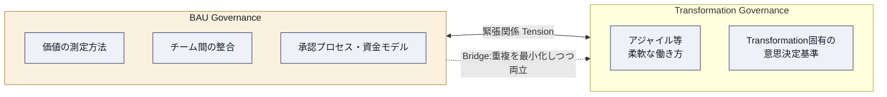

### 5-2. 比較表

| 観点 | BAU Governance | Transformation Governance |
|---|---|---|
| 目的 | 日常業務の安定運用と価値測定 | 変革の推進と整合性の確保 |
| 典型的な特性 | 標準化・予測可能・反復的 | 探索的・状況に応じて柔軟 |
| 意思決定のスピード | 定例のサイクルに沿う | 状況変化に応じて迅速な場合が多い |
| リスクへの態度 | リスク回避的になりやすい | 一定の不確実性を許容する必要がある |
| 主な担い手 | 既存の管理層・委員会 | Transformationスポンサー・推進チーム |

> **ベストプラクティス**
> - Transformationの立ち上げ時に、「このTransformationはBAU Governanceのどの部分と衝突しうるか」を明示的に洗い出す。承認フロー、予算執行のタイミング、報告様式などは特に衝突が起きやすい領域である
> - 衝突を解消する際は、どちらか一方を全面的に廃止するのではなく、「最小限の重複」で両立させるブリッジ（報告テンプレートの共通化、既存委員会への定期報告枠の追加など）を設計することが推奨される
> - Transformation Governanceは恒久的な仕組みではなく、Transformationの完了・定着とともにBAU Governanceへ統合されるべきものであることを、関係者に事前に合意しておく
>
> **ソース**
> - [ITIL Transformation | A Continual Approach to Change（Kaimar Karu, Lead Author）| itil.com](https://www.itil.com/Itil-News-and-Announcements/itil-transformation-version-5)

---

## 6. Transformation Patterns と Toolkit

ITIL Transformationモジュールの中核をなすのが、Initiation Patterns・Governance Patterns・Execution Patternsという3種類のPatterns、およびそれらを支えるToolkitである。

### 6-1. 3つのPatternsとToolkitの役割

| 要素 | 役割 |
|---|---|
| **Initiation Patterns（開始パターン）** | 組織がTransformationのどの出発点にいるかを、期待・目的・課題に基づいて理解しやすくする |
| **Governance Patterns（統治パターン）** | BAU Governanceの要求とTransformation Governanceの要求を突き合わせるためのアセスメントモデルを提供し、両者の間の緊張を和らげる |
| **Execution Patterns（実行パターン）** | 変革実行のための方法を記述し、複数のアプローチを並行して調整しながら、フィードバックループを伴って進められるようにする |
| **Toolkit（ツールキット）** | Transformationで頻繁に使われる手法・ツール・テクニックを、ITILの視点から整理したもの。特定のITIL Practiceが、どのようにTransformation活動を支援するかの概要も含む |

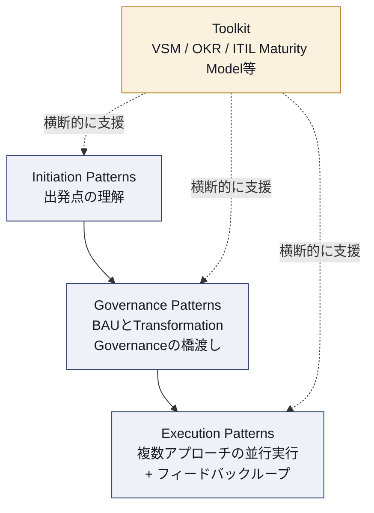

### 6-2. Patternsごとのベストプラクティス

> **Initiation Patterns － ベストプラクティス**
> - Transformationの立ち上げ前に、「なぜ今この変革が必要なのか」「何を期待しているのか」をステークホルダー間で言語化し、認識のズレを可視化する
> - 過去の失敗した変革の経験がある組織では、その原因（多くの場合、将来の運用モデルを前提として計画してしまい、その前提が数年後に崩れること）を振り返り、同じ轍を踏まない設計にする
>
> **Governance Patterns － ベストプラクティス**
> - BAU Governanceの承認フローをそのままTransformationに適用しようとせず、まず両者のギャップをアセスメントする
> - Governanceの緊張を「対立」ではなく「橋渡しが必要な設計課題」として捉え、双方の代表者を交えて解決策を設計する
>
> **Execution Patterns － ベストプラクティス**
> - 単一の実行方法論（例：純粋なウォーターフォールのプロジェクト管理、あるいは純粋なアジャイル）に固執せず、状況に応じてProject/Programme Managementと探索的・反応的なアプローチを併用する
> - 並行して走る複数の実行アプローチの間で、フィードバックループを定期的に設け、学習を横展開する仕組みを作る
>
> **ソース**
> - [ITIL Transformation | A Continual Approach to Change（Kaimar Karu, Lead Author）| itil.com](https://www.itil.com/Itil-News-and-Announcements/itil-transformation-version-5)
> - [ITIL (Version 5) Transformation Training Course | ITSM Academy](https://itsmacademy.com/itil-transformation-course)

---

## 7. Governance and Transformation Alignment

第5章で扱ったBAU／Transformation Governanceの区分を踏まえ、この章では「Governanceがどのように柔軟性と価値提供を両立させながらTransformationを支えるか」を深掘りする。

### 7-1. Governanceが果たす2つの機能

| 機能 | 内容 |
|---|---|
| 統制（Control） | Transformationの範囲・リスク・投資判断について、一貫した意思決定の枠組みを提供する |
| 有効化（Enablement） | 過度な統制によって変革のスピードや柔軟性を失わないよう、必要な裁量を現場に委譲する |

Governanceが「統制」だけに偏ると変革は硬直化し、「有効化」だけに偏ると整合性やリスク管理が失われる。ITIL Transformationは、この2つのバランスをTransformation Governance Patternsを通じて取ることを推奨している。

### 7-2. Alignmentのための実務ポイント

> **ベストプラクティス**
> - Governanceの意思決定機関（委員会等）に、Transformationの進捗と学習結果を定期的にフィードバックする場を設け、戦略レベルの前提を継続的に更新する
> - 「誰が何を承認できるか」をTransformationの規模に応じて事前に定義し、小さな意思決定のたびに上位の委員会を待つ必要がないようにする（権限委譲の設計）
> - AccountableとResponsibleを明確に分離する（例：RACI／RASCIの活用。第10章参照）ことで、Governanceのボトルネックを避ける
>
> **ソース**
> - [ITIL Transformation (Version 5) | peoplecert.org](https://www.peoplecert.org/browse-certifications/it-governance-and-service-management/ITIL-1/itil-transformation-version-5-4173)

---

## 8. Execution and Delivery of Change

### 8-1. 「唯一の正解」を前提にしない実行アプローチ

ITIL Transformationの実行に関する考え方の核心は、「1つの実行方法論を選んで押し通すのではなく、状況に応じて複数の実行アプローチを組み合わせる」という点にある。プロジェクト・プログラムマネジメントの要素（計画・予算・マイルストーン管理）を用いつつも、その限界（未知の要素、想定外の変化）を認識し、探索的・反応的な進め方も等しく正当な手段として扱う。

| 実行アプローチ | 向いている状況 | 留意点 |
|---|---|---|
| Project / Programme Management的な進め方 | ゴールと道筋が比較的明確 | 前提が崩れたときの計画修正コストが高い |
| 探索的・反復的な進め方（Agile的） | 不確実性が高く、試行錯誤が必要 | Governanceとの整合をどう取るかが課題（第5章） |
| 緊急対応型の進め方 | 混沌とした状況で即応が必要 | まず状況を安定化させてから通常のアプローチに戻す |

### 8-2. 複数アプローチの並行運用

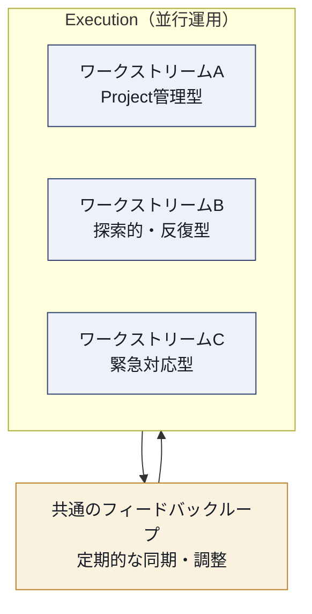

> **ベストプラクティス**
> - 複数のワークストリームを並行させる場合、「どのワークストリームがどの実行アプローチを採用しているか」を関係者全員が把握できるよう可視化する
> - ワークストリーム間の依存関係（あるチームの成果物が別チームの前提になっているなど）を定期的に棚卸しし、フィードバックループのタイミングで調整する
> - 混沌とした状況（インシデント対応に近い緊急事態）が発生した場合は、まず安定化を最優先し、通常のTransformation実行アプローチに戻すタイミングを明確に判断する
>
> **ソース**
> - [ITIL Transformation | A Continual Approach to Change | itil.com](https://www.itil.com/Itil-News-and-Announcements/itil-transformation-version-5)

---

## 9. Measurement, Learning, and Continual Improvement

### 9-1. 測定と学習の位置づけ

第4章のTransformation Modelにおける「Learning」レイヤーは、単なる振り返りのイベントではなく、Governanceと実行の両方に継続的にフィードバックを返す仕組みである。ITIL TransformationはITIL Foundationの「Continual Improvement」の考え方をTransformationの文脈に適用し、次の問いに答えられるようにする。

- 進捗（Progress）をどう測定するか
- 結果（Outcome）をどう評価するか
- 継続的な学習をどう組織に埋め込むか

### 9-2. 測定から学習への流れ

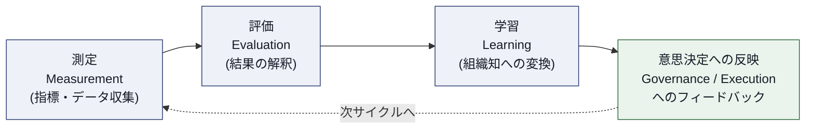

### 9-3. 測定設計のポイント

| ポイント | 内容 |
|---|---|
| 先行指標と遅行指標 | 最終成果（遅行指標）だけでなく、変化の兆候を早期に捉える先行指標も併用する |
| 定性と定量の両立 | 数値化しやすい指標だけでなく、ステークホルダーの実感（定性情報）も収集する |
| 学習の記録先 | 個人の頭の中ではなく、組織として再利用可能な形（ナレッジベース等）に残す |

> **ベストプラクティス**
> - Transformation開始時点で「何をもって成功とみなすか」の測定基準を、Governanceレイヤーの合意事項として明文化しておく（後付けで基準を作ると、恣意的な評価になりやすい）
> - 測定結果が思わしくない場合でも、それを個人の失敗として扱うのではなく、Transformation Model自体へのフィードバック（アプローチの見直し）として扱う文化を作る
> - Learningの内容を次のTransformation Initiativeの立ち上げ（Initiation Patterns）に活かす仕組みを用意し、組織が同じ問題を繰り返し経験することを防ぐ
>
> **ソース**
> - [ITIL Transformation (Version 5) | itil.com](https://www.itil.com/professionals/certifications/ITIL-Transformation-Version-5)

---

## 10. Tools, Methods, and Techniques

ITIL Transformationの公認講座シラバスでは、Toolkitの一部として次のようなツール・手法が挙げられている。それぞれ、ITILに限らず一般的に使われる手法であるが、ここでは「Transformationの文脈でどう活きるか」という観点から解説する。

### 10-1. Value Stream Mapping（VSM）

顧客への価値提供の流れ（Value Stream）を、開始から完了まで可視化し、付加価値を生まない待ち時間・手戻りを特定する手法。Transformationにおいては、変革前の現状（Current State）と変革後の理想像（Future State）を、それぞれValue Stream図として描き比較することで、どこにボトルネックがあるかを関係者全員で共有できる。

> **ベストプラクティス**：VSMは一度描いて終わりにせず、Transformationの進行に合わせて定期的に描き直し、実際にボトルネックが解消されているかを検証する

### 10-2. OKR（Objectives and Key Results）

「何を達成したいか（Objective）」と「その達成度をどう測るか（Key Results）」をセットで定義するゴール設定手法。Transformationにおいては、Governanceレイヤーで定めた戦略的な方向性を、Execution側の具体的な行動目標に落とし込む橋渡し役として使える。

| 要素 | 例 |
|---|---|
| Objective | インシデント対応の顧客体験を大きく改善する |
| Key Result 1 | 平均初動応答時間を50%短縮する |
| Key Result 2 | 顧客満足度スコアを一定水準まで引き上げる |

> **ベストプラクティス**：OKRの数を絞り込み、Transformationの最重要テーマに集中させる。KRを「タスクの完了」ではなく「測定可能な結果」として定義する

### 10-3. ITIL Maturity Model

組織のService Value System（SVS）の成熟度、および個々のPracticeの能力レベルを客観的に評価するためのモデル。PeopleCert公式ドキュメントでは、次の5段階の成熟度レベルが定義されている。

| レベル | 名称 | 特徴 |
|---|---|---|
| Level 1 | Initial | 作業は完了するが、SVSの目的・目標が常に達成されるわけではない |
| Level 2 | Managed | 計画と実績測定が行われ、目的・目標は繰り返し達成されるが、標準化はされていない |
| Level 3 | Defined | 組織横断の標準がSVS全体にわたってガイダンスを提供する |
| Level 4 | Quantitative | SVSがデータドリブンであり、定量的なパフォーマンス評価が行われる |
| Level 5 | Optimizing | SVSが最適化され、継続的改善に焦点が当てられている |

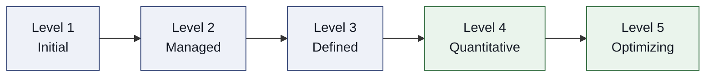

Practice単位の能力評価（Capability Criteria）はLevel 2から採点が始まり、あるレベルの基準をすべて満たさなければ次のレベルには進めない、という積み上げ式の評価ルールになっている。

> **ベストプラクティス**：Transformationの開始前にITIL Maturity Modelで現状のベースラインを測定し、Transformation完了後に再評価することで、成果を客観的に示すエビデンスとして使う
>
> **ソース**：[Introduction to the ITIL Maturity Model（PeopleCert公式PDF）](https://www.itil.com/-/media/itilsite/site-assets/documents/capability-and-maturity/introduction-to-the-itil-mm.pdf)

### 10-4. Theory of Constraints（制約理論）

システム全体のスループットは、最も弱いボトルネック（制約）によって決まるという考え方。Transformationにおいては、「組織全体を同時に変えよう」とするのではなく、まず最大のボトルネックを特定し、そこに集中的にリソースを投じることで、全体の変革スピードを底上げできる。

> **ベストプラクティス**：Transformationのバックログが多岐にわたる場合、Theory of Constraintsの視点で「今、全体の足を引っ張っている制約は何か」を定期的に問い直し、優先順位を見直す

### 10-5. RACI／RASCI

Responsible（実行責任）・Accountable（説明責任）・Consulted（相談対象）・Informed（報告対象）（RASCIではこれにSupportive＝支援担当が加わる）を整理する責任分担マトリクス。第7章で触れたGovernanceのAlignmentにおいて、意思決定のボトルネックを可視化・解消するために使われる。

| 役割 | 意味 |
|---|---|
| R（Responsible） | 実際にタスクを実行する人 |
| A（Accountable） | 最終的な成果に説明責任を持つ人（原則1人） |
| S（Supportive） | 実行を支援する人（RASCIのみ） |
| C（Consulted） | 意思決定前に意見を求められる人 |
| I（Informed） | 結果を事後に知らされる人 |

> **ベストプラクティス**：Transformation Governanceの緊張が生じやすい意思決定ポイント（予算承認、リリース判断など）について、事前にRACI／RASCIを作成し、「誰がAccountableか」を1人に絞り込んでおく
>
> **ソース**：[ITIL® Transformation (Version 5) | QA](https://www.qa.com/course-catalogue/courses/itil-transformation-version-5-itil5trf/)

---

## 11. AI and Transformation

ITIL（Version 5）全体を通じた大きな特徴が、AI（人工知能）の位置づけを明確にしたことである。ITIL Transformationにおいても、AIの機会とリスクを踏まえた変革準備・実行のガイダンスが組み込まれている。

### 11-1. ITIL AI Capability Model（6Cモデル）

ITIL（Version 5）のFour Dimensionsのうち「情報と技術（Information and Technology）」ディメンションに新設されたのが、ITIL AI Capability Model（通称：6Cモデル）である。これは、AIソリューションが果たす機能を6つの能力（Capability）に分類し、組織がAI導入をどう構造化して捉えるかを助けるツールである。

| Capability | 内容 |
|---|---|
| **Creation（創出）** | 新しいコンテンツ・コード・ドキュメントを生成する |
| **Curation（キュレーション）** | 既存データの重複を洗い出す等、質と関連性を高める |
| **Clarification（明確化）** | 複雑な内容の理解・ナビゲーションを助ける（例：インシデントチケットの要約） |
| **Cognition（認知）** | パターンや隠れた知見を特定し、問題を先回りして検知する |
| **Communication（コミュニケーション）** | チャットボットなど自然なインターフェースを提供する |
| **Coordination（調整）** | 複数システムにまたがるアクションを自律的に実行・調整する |

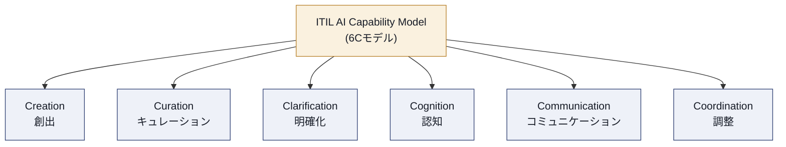

> **ベストプラクティス**
> - AI導入の企画段階で、「このAIソリューションは6つのCapabilityのうちどれに該当するか」を明示する。実装が進むにつれて、手続き・法規制・財務面などの準備不足が判明することが多いため、複数のCapabilityにまたがる場合は特に注意する
> - 1つのAI活用アイデアを「創出（Creation）」だけの取り組みとして矮小化せず、それが将来的に「調整（Coordination）」のような自律実行に発展しうるかを見据えてGovernance設計を行う

### 11-2. AI導入の不確実性とTransformationの探索的アプローチ

AIがもたらす機会・影響の大きさが未知数である場合、ITIL Transformationの探索的アプローチ（第3章・第8章）が特に有効とされている。小さな実験を積み重ね、結果を観察しながら組織全体でAI関連活動を調整する能力を養うことが推奨される。

### 11-3. ITIL AI Governance Improvement Model（参考）

ITIL AI Capability Modelを補完するものとして、AI活用の適切なGovernanceアプローチを決めるための「ITIL AI Governance Improvement Model」が用意されている（独立した認定「ITIL AI Governance（Version 5）」で詳細に扱われる領域であり、ITIL Transformationの前提資格とはならない）。4つのステップ（アセスメント／要求定義と設計調整／改善の実装／継続的なガバナンス維持）で構成される、とされている。

> **ベストプラクティス**：AI Governanceを別モジュールの話として切り離さず、Transformation Governance（第5章・第7章）の一部としてAIに関する意思決定基準（誰がAIの出力をレビューするか、誰が上書き権限を持つか）を組み込む
>
> **ソース**
> - [ITIL (Version 5) Changes Explained: 20 Important Changes from ITIL 4 | ITSM.tools](https://itsm.tools/itil-version-5-vs-itil-4-key-changes/)
> - [Information and Technology in ITIL Version 5 | PMG Academy](https://www.pmgacademy.com/en/articles/itil/information-and-technology-in-itil-version-5-the-guide-for-the-ai-era-and-data-governance/)
> - [Governing AI in organizations | itil.com](https://www.itil.com/Itil-News-and-Announcements/itil-version-5-ai-governance-guidance)
> - [ITIL® AI Governance Training & Certification | AgilePM Hub](https://agilepmhub.com/itil-ai-governance)

---

## 12. 他フレームワークとの統合（PRINCE2 / DevOps / Agile）

ITIL Transformationは、「ITILの他にどんな方法論を使っている組織であっても適用できる」ことを明確に意図して設計されている。特定のガバナンスや実行方法論を前提とせず、既存のフレームワークと組み合わせて使うための柔軟な枠組みという位置づけである。

| フレームワーク | Transformationとの関係 |
|---|---|
| **PRINCE2** | プロジェクトレベルの計画・統制手法として、Execution Patterns（特にProject / Programme Management的な進め方）と組み合わせやすい |
| **DevOps** | 継続的デリバリー・自動化の実践知として、Execution PatternsやLearningレイヤーの高速なフィードバックループと親和性が高い |
| **Agile** | 探索的・反復的なExecution Patternsの実践方法として、複雑な環境下でのTransformationに適する |

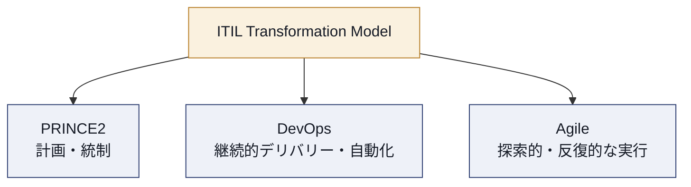

> **ベストプラクティス**
> - 「ITILか、PRINCE2か、Agileか」という二者択一で考えず、Transformationのどのワークストリームにどのフレームワークを充てるかを、第8章の「複数アプローチの並行運用」の考え方で設計する
> - 既存のフレームワークをすでに組織で運用している場合、ITIL Transformationを新たな別レイヤーとして重ねるのではなく、Governance PatternsとExecution Patternsを使って既存の仕組みとの整合を取ることを優先する
>
> **ソース**
> - [ITIL (Version 5) Transformation Training Course | ITSM Academy](https://itsmacademy.com/itil-transformation-course)
> - [ITIL® Transformation Course & Examination | ITSM Hub](https://www.itsmhub.com/products/itil-transformation-course-examination)

---

## 13. 試験対策とキャリアパス

### 13-1. 学習の進め方（ステップバイステップ）

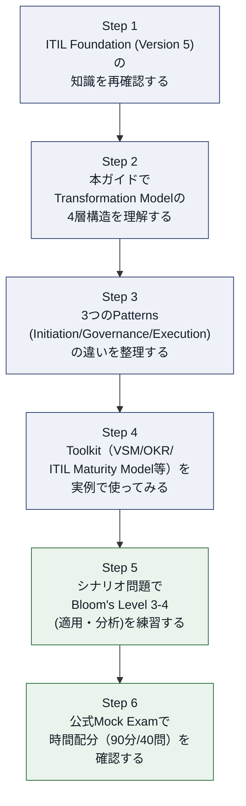

### 13-2. 出題傾向への対策

| 対策 | 内容 |
|---|---|
| 用語の暗記だけに頼らない | 「なぜこの用語が必要か」を、Transformationの課題（環境の複雑性、Governanceの緊張）に結びつけて理解する |
| シナリオ演習を重視する | 「〇〇という状況で、どのPatternを適用すべきか」という設問形式に慣れる |
| Open bookの特性を活かす | 本試験はOpen bookだが、時間内に該当箇所を探す練習をしておかないと時間切れになりやすい |
| 4層モデルの循環構造を図で説明できるようにする | Governance→Positioning→Execution→Learningの一方通行ではなく、フィードバックが循環する構造を自分の言葉で説明できるようにする |

### 13-3. キャリアパスとの接続

ITIL Transformation（Version 5）は、次のような役割・キャリアに直結する知識として位置づけられている。

- Digital Transformation Manager
- Change Manager
- Service Improvement Manager
- Practice Owner
- Digital Product Manager
- Experience Manager
- Solution Designer
- Strategy Analyst
- IT Director
- Business and Transformation Consultant
- C-suiteレベルの役割

> **ソース**
> - [ITIL Transformation (Version 5) | peoplecert.org](https://www.peoplecert.org/browse-certifications/it-governance-and-service-management/ITIL-1/itil-transformation-version-5-4173)
> - [ITIL Transformation (Version 5) Practice Tests | Udemy](https://www.udemy.com/course/itil-transformation-version-5-practice-tests/)

---

## 14. 用語集

| 用語 | 説明 |
|---|---|
| Transformation | 組織、あるいはその大部分を対象とした、複数の相互依存領域にまたがる調整された大規模な変化 |
| BAU（Business As Usual） | 通常の日常業務・運用 |
| ITIL Transformation Model | Governance・Positioning・Execution・Learningの4層とステージ・ステップで構成される、Transformationのための構造化フレームワーク |
| Initiation Patterns | Transformationの出発点（期待・目的・課題）を理解するためのパターン |
| Governance Patterns | BAU GovernanceとTransformation Governanceの緊張を評価・調整するためのパターン |
| Execution Patterns | 複数の実行アプローチを並行して調整しながら変革を進めるためのパターン |
| Toolkit | Transformationで用いる手法・ツール・テクニックの、ITIL視点での整理 |
| ITIL AI Capability Model（6Cモデル） | AIソリューションの機能をCreation/Curation/Clarification/Cognition/Communication/Coordinationの6つに分類するモデル |
| ITIL Maturity Model | SVSおよびPracticeの成熟度をLevel 1〜5で評価するモデル |
| Value Stream Mapping（VSM） | 価値提供の流れを可視化し、ムダやボトルネックを特定する手法 |
| OKR | Objectives and Key Results。目標と測定可能な成果指標をセットで管理する手法 |
| Theory of Constraints | システム全体のスループットは最大のボトルネックによって決まるという考え方 |
| RACI／RASCI | 役割分担（実行責任・説明責任・支援・相談・報告）を整理するマトリクス |
| Bloom's Taxonomy | 教育評価で用いられる認知レベルの分類（知識・理解・適用・分析・評価・創造） |

---

## 15. 参考文献・出典URL一覧

1. ITIL Transformation (Version 5) — 公式認定ページ（PeopleCert）
   https://www.peoplecert.org/browse-certifications/it-governance-and-service-management/ITIL-1/itil-transformation-version-5-4173
2. ITIL Transformation (Version 5) — 公式認定ページ（itil.com）
   https://www.itil.com/professionals/certifications/ITIL-Transformation-Version-5
3. ITIL Transformation (Version 5): A continual approach to major organizational change（Kaimar Karu, Lead Author）
   https://www.itil.com/Itil-News-and-Announcements/itil-transformation-version-5
4. ITIL® Transformation (Version 5) course — QA
   https://www.qa.com/course-catalogue/courses/itil-transformation-version-5-itil5trf/
5. ITIL® Transformation Course & Examination — ITSM Hub
   https://www.itsmhub.com/products/itil-transformation-course-examination
6. ITIL (Version 5) Transformation Training Course — ITSM Academy
   https://itsmacademy.com/itil-transformation-course
7. ITIL Transformation (Version 5) Practice Tests — Udemy
   https://www.udemy.com/course/itil-transformation-version-5-practice-tests/
8. ITIL Transformation (Version 5) e-Learning+ — Advanced Training
   https://advancedtraining.com.au/product/itil-transformation-version-5-e-learning-plus/
9. New ITIL Explained for Certified Professionals（ITIL Managing Professional designation構成の説明）
   https://www.itil.com/Itil-News-and-Announcements/itil-version-5-explained
10. Introduction to the ITIL Maturity Model（PeopleCert公式PDF）
    https://www.itil.com/-/media/itilsite/site-assets/documents/capability-and-maturity/introduction-to-the-itil-mm.pdf
11. ITIL (Version 5) Changes Explained: 20 Important Changes from ITIL 4（ITIL AI Capability Modelの解説）
    https://itsm.tools/itil-version-5-vs-itil-4-key-changes/
12. Information and Technology in ITIL Version 5（6Cモデルの解説）
    https://www.pmgacademy.com/en/articles/itil/information-and-technology-in-itil-version-5-the-guide-for-the-ai-era-and-data-governance/
13. Governing AI in organizations（ITIL AI Capability ModelとAI Governanceの背景）
    https://www.itil.com/Itil-News-and-Announcements/itil-version-5-ai-governance-guidance
14. ITIL® AI Governance Training & Certification — AgilePM Hub
    https://agilepmhub.com/itil-ai-governance

> 本ガイドは上記の公開情報をもとに独自に構成した学習補助教材である。最終的な試験対策には、PeopleCertが提供する公式eBook・Learner Workbook・Quick Reference Guideを必ず併用すること。
