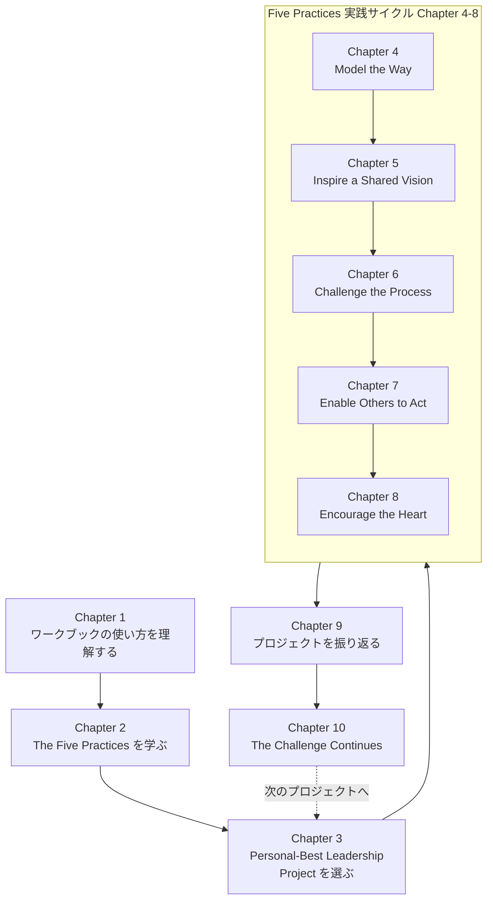

# The Leadership Challenge Workbook 完全ガイド

*― ソフトウェアエンジニア／スクラムマスターのためのリーダーシップ実践入門 ―*

> 対象書籍: *The Leadership Challenge Workbook, 4th Edition*（James M. Kouzes, Barry Z. Posner 著／Wiley／2023年4月刊／全160ページ）
> 本ガイドは、同ワークブックの構成に沿いながら、初学者のソフトウェアエンジニアやスクラムマスターが「今日から実践できる」形に翻訳したステップバイステップ解説です。

---

## 目次

1. [この本を読む前に知っておきたいこと](#1-この本を読む前に知っておきたいこと)
2. [The Five Practices of Exemplary Leadership（模範的リーダーシップの5つの実践）](#2-the-five-practices-of-exemplary-leadership模範的リーダーシップの5つの実践)
3. [Ten Commitments of Leadership（リーダーシップの10の誓約）](#3-ten-commitments-of-leadershipリーダーシップの10の誓約)
4. [LPI（Leadership Practices Inventory）とは](#4-lpileadership-practices-inventoryとは)
5. [ワークブックの全体構成とワークフロー](#5-ワークブックの全体構成とワークフロー)
6. [ステップバイステップ実践ガイド](#6-ステップバイステップ実践ガイド)
7. [スクラム／アジャイル現場への適用マップ](#7-スクラムアジャイル現場への適用マップ)
8. [海外テックリーダーシップ論との接続](#8-海外テックリーダーシップ論との接続)
9. [他のリーダーシップ理論との位置づけ](#9-他のリーダーシップ理論との位置づけ)
10. [よくあるアンチパターン](#10-よくあるアンチパターン)
11. [まとめ](#11-まとめ)
12. [参考文献・出典（Sources）](#12-参考文献出典sources)

---

## 1. この本を読む前に知っておきたいこと

### 1-1. 書籍としての位置づけ

*The Leadership Challenge* は、James Kouzes と Barry Posner が1983年に開始した調査研究に基づくリーダーシップ論で、初版は1987年に刊行され、2023年に第7版が発行されているロングセラーです。研究の出発点は非常にシンプルな問いでした――「あなたが“自己最高（personal best）”のリーダーシップを発揮したとき、何をしていたか？」。この問いへの数百〜数千件規模のインタビューとアンケートの分析から、5つの共通パターン（The Five Practices of Exemplary Leadership）が抽出されました。

*The Leadership Challenge Workbook* は、この理論書の内容を、読者自身の実際のプロジェクト（Personal-Best Leadership Project）に当てはめて演習形式で身につけるための「実践ドリル」です。単なる知識のインプットではなく、リフレクション（内省）とアプリケーション（実践課題）を交互に繰り返す構成になっている点が特徴です。

### 1-2. なぜソフトウェアエンジニア・スクラムマスターに関係するのか

ソフトウェア開発の現場でリーダーシップが求められるのは、必ずしも「マネージャー」という肩書を持つ人だけではありません。スクラムマスター、テックリード、シニアエンジニアなど、権限（authority）ではなく信頼関係（relationship）でチームを動かす立場の人ほど、Kouzes & Posner の枠組みが有効に機能します。彼らの中心的な主張は「リーダーシップは特別な人物の資質ではなく、観察可能で学習可能な“ふるまい（behavior）”の集合である」という点にあり、これはアジャイル文脈における「サーバントリーダーシップ」や「権限によらない影響力」の考え方と非常に相性が良い理論です。

---

## 2. The Five Practices of Exemplary Leadership（模範的リーダーシップの5つの実践）

書籍の核となる5つの実践を、一般的な定義とソフトウェア開発現場での具体例に対応させると次のようになります。

| # | Practice（原語） | 日本語訳 | 一言でいうと | ソフトウェア開発現場での具体例 |
|---|---|---|---|---|
| 1 | Model the Way | 模範を示す | 有言実行 | コーディング規約やレビュー基準を、自分が最初に守る |
| 2 | Inspire a Shared Vision | 共有ビジョンを鼓舞する | 未来を描き、巻き込む | 「なぜこのリファクタリングが必要か」を数字とストーリーで語る |
| 3 | Challenge the Process | プロセスに挑戦する | 現状を疑い、小さく実験する | レトロスペクティブで得た改善案をまず1スプリントだけ試す |
| 4 | Enable Others to Act | 人を励まし行動を促す | 権限委譲と信頼構築 | ペアプロ・モブプロで知識と裁量を共有し、心理的安全性を作る |
| 5 | Encourage the Heart | 心に働きかけ励ます | 承認と称賛の文化 | デモDayやSlackで、小さな成果でも具体的に称賛する |

各実践は独立した「テクニック集」ではなく、互いに補強し合うサイクルとして機能する点が重要です。たとえば「模範を示す」ことなしに「共有ビジョンを鼓舞」しても説得力は生まれず、「人を励まし行動を促す」ことなしに「プロセスへの挑戦」を求めても、心理的安全性がなければ誰も新しい実験に手を挙げません。

---

## 3. Ten Commitments of Leadership（リーダーシップの10の誓約）

各実践は、さらに2つずつの具体的な「誓約（Commitment）」に分解されています。これがワークブックの各章（Chapter 4〜8）で内省・実践課題として扱われる単位です。

| 実践 | 誓約1 | 誓約2 |
|---|---|---|
| Model the Way | 自分の声（価値観）を明確にし、共有された価値観を確認する | 共有された価値観に沿って行動し、模範を示す |
| Inspire a Shared Vision | ワクワクする可能性を思い描き、未来を構想する | 共有された願望に訴えかけ、他者を巻き込む |
| Challenge the Process | 主体的に機会を探し、外部からも改善のヒントを求める | 小さな成功を積み重ねる実験を行い、失敗からも学ぶ |
| Enable Others to Act | 信頼を築き、協働関係を促進する | 自己決定力を高め、他者の能力開発を支援する |
| Encourage the Heart | 個人の卓越性に感謝を示し、貢献を認める | 価値観と勝利を祝い、共同体の精神を作る |

初学者向けのポイントは、「誓約」は抽象的なスローガンではなく、**観察可能な行動**として書かれている点です。ワークブックでは、この行動を「自分はどのくらいの頻度で実践できているか」をLPIという診断ツールで測定し、ギャップを可視化するアプローチを取ります。

---

## 4. LPI（Leadership Practices Inventory）とは

LPIは、Kouzes & Posner が開発した30項目の行動アンケートによる360度評価ツールで、5つの実践それぞれに対応する6つの行動の実践頻度を、自己評価と周囲（上司・同僚・部下など）からの評価の両面から測定します。公式サイトによれば、このモデルとLPIは40年以上の実証研究、5,000件以上のケーススタディ、750件以上の独立した研究論文に裏付けられており、70カ国以上・160万人超のリーダー育成に使われてきた実績があります。

ワークブック自体にはLPIの実施が必須ではありませんが、多くのユーザーはLPI診断結果を持ち込んだうえでワークブックの演習に取り組みます。エンジニアリング組織であれば、1on1やチームのふりかえりの中で「自分は“Enable Others to Act”をどのくらい体現できているか」をチームメンバーからフィードバックしてもらう、という簡易版の運用も可能です。

---

## 5. ワークブックの全体構成とワークフロー

*The Leadership Challenge Workbook, 4th Edition* の実際の章構成（目次）は以下の通りです。

| Chapter | タイトル | 内容の要旨 |
|---|---|---|
| Introduction | はじめに | 自己最高のリーダーシップとは何かを問いかける |
| Chapter 1 | How to Use This Workbook | ワークブックの構成とガイドライン |
| Chapter 2 | The Five Practices of Exemplary Leadership | 5つの実践の理論的な全体像 |
| Chapter 3 | Selecting Your Personal-Best Leadership Project | 実践対象となる自分のプロジェクトを選ぶ |
| Chapter 4 | Model the Way | 模範を示す：リフレクション＆アプリケーション演習 |
| Chapter 5 | Inspire a Shared Vision | 共有ビジョンを鼓舞する：ビジョンステートメント作成演習 |
| Chapter 6 | Challenge the Process | プロセスに挑戦する：小さな実験の設計演習 |
| Chapter 7 | Enable Others to Act | 人を励まし行動を促す：パワープロファイル演習 |
| Chapter 8 | Encourage the Heart | 心に働きかけ励ます：同僚への称賛（Kudos）演習 |
| Chapter 9 | Reflecting on Your Personal-Best Leadership Project | プロジェクト全体の振り返り |
| Chapter 10 | The Challenge Continues | 継続的な成長へのつなぎ |

この構成をフローチャートにすると、次のような一連のサイクルとして理解できます。

ポイントは、Chapter 10 が「終わり」ではなく Chapter 3 の「次のプロジェクト選定」へループする設計になっていることです。つまりこのワークブックは、一度きりの研修教材ではなく、**継続的なリーダーシップ改善のPDCAサイクル**として設計されています。

---

## 6. ステップバイステップ実践ガイド

以下は、各章を初学者エンジニアが実務でそのまま使えるように分解した手順です。

### Step 1：使い方を理解する（Chapter 1 相当）

- ワークブックは「読む」ものではなく「書き込む」ものだと理解する。
- 一人で完結させず、信頼できる同僚やメンターとの対話を前提に進める（1on1やメンタリングの題材にすると効果的）。

### Step 2：Personal-Best Leadership Project を選ぶ（Chapter 3 相当）

エンジニアであれば、以下のような「実プロジェクト」を題材にするのが現実的です。

- レガシーシステムのリファクタリングをチームに提案し、実行し切った経験
- 新しいスクラムイベント（例：モブプロ導入）をチームに定着させた経験
- インシデント対応チームを率いて障害を収束させた経験

選定の基準は「規模の大きさ」ではなく、「自分がリーダーとして最も強く関与し、何かを動かした実感がある経験」であることです。

### Step 3〜7：5つの実践を一つずつ深める（Chapter 4〜8 相当）

各章は共通して「Reflection（内省の問い）→ Application（具体的な実践課題）→ Implications（次への示唆）」という3段構成になっています。ソフトウェアチームでの適用例を含めて整理すると以下の通りです。

| Chapter | 内省の問いの例 | エンジニアリングチームでの実践課題例 |
|---|---|---|
| 4: Model the Way | 自分がコードレビューで本当に大事にしている価値観は何か？ | チームの「Definition of Done」を自分自身が一番厳格に守っているか点検する |
| 5: Inspire a Shared Vision | 半年後、このシステムがどうなっていてほしいか？ | 技術ビジョンを1枚のスライドやREADMEにまとめ、チームに共有する |
| 6: Challenge the Process | 「昔からそうだから」で続けている開発プロセスはないか？ | 1つのプラクティス（例：手動デプロイ）を1スプリントだけ自動化実験する |
| 7: Enable Others to Act | チームメンバーの裁量を制限してしまっている場面はどこか？ | オンコール対応の権限を若手にも段階的に委譲する |
| 8: Encourage the Heart | 直近1か月で、誰かの貢献に具体的な感謝を伝えたか？ | スプリントレビューの最後に「Kudos」の時間を設ける |

### Step 8：プロジェクトを振り返る（Chapter 9 相当）

5つの実践を一通り経験したあと、「どの実践が最も自然にできたか」「どの実践が最も苦手だったか」を言語化します。ここで重要なのは、苦手な実践を無理に克服しようとするのではなく、**チーム内で補完し合う体制を作る**という発想です。たとえばビジョンを語るのが苦手なテックリードは、その部分をプロダクトマネージャーやスクラムマスターと分担してもよいでしょう。

### Step 9：継続する（Chapter 10 相当）

ワークブックは、この振り返りを一度で終わらせず、次のプロジェクトでもう一度 Step 2 に戻ることを推奨しています。四半期ごとの目標設定（OKRなど）と連動させ、「今期の Personal-Best Leadership Project は何か」を定期的に問い直す運用にすると、実務に組み込みやすくなります。

---

## 7. スクラム／アジャイル現場への適用マップ

5つの実践を、スクラムの代表的なイベントやロールに対応させると、次のような役割マップになります。

| 実践 | 対応しやすいスクラムイベント／ロール | スクラムマスターが取れる具体的アクション |
|---|---|---|
| Model the Way | デイリースクラム、チームの規範（Working Agreement） | タイムボックスやふりかえりのルールを率先して守る |
| Inspire a Shared Vision | スプリントプランニング、プロダクトゴール共有 | 「なぜこのスプリントゴールなのか」を毎回言語化して伝える |
| Challenge the Process | レトロスペクティブ | 改善アクションを「実験」として小さく試し、次のレトロで結果を検証する |
| Enable Others to Act | スプリントバックログの自己組織化 | タスクの割り当てをチーム自身に委ね、ファシリテーションに徹する |
| Encourage the Heart | スプリントレビュー、デモ | 完成した機能だけでなく、そこに至るまでの工夫や失敗からの学びも称賛する |

スクラムマスターは「サーバントリーダー」として権限を持たずにチームを導く立場であるため、Kouzes & Posner が強調する「信頼関係に基づく影響力」という考え方は、役職ベースのリーダーシップ論よりも直接的に適用できます。

---

## 8. 海外テックリーダーシップ論との接続

*The Leadership Challenge* は一般的な組織論の古典ですが、ソフトウェアエンジニアリング業界の著名なリーダーたちの推薦図書リストの中でも繰り返し取り上げられています。

- 海外のエンジニアリングマネジメント系メディアがまとめた「目指すべきテックリーダーのための必読書リスト」では、*The Leadership Challenge* が Will Larson（元Calm CTO）の *Staff Engineer: Leadership Beyond the Management Track*（同リストでは技術リーダーシップ／キャリア成長の分野で紹介）や *An Elegant Puzzle: Systems of Engineering Management*（同リストの FAQ で「すべてのエンジニアリングマネージャーへの推薦書」として紹介）と同じリストに並んでいます。Larson の実務書群と Kouzes & Posner は、「システム思考に基づく実務書」と「行動科学に基づく理論書」という補完関係にあります。
- Camille Fournier（元 Rent the Runway CTO、現 CoreWeave VP Engineering）は著書 *The Manager's Path*（O'Reilly, 2017）で、エンジニアからマネージャーへのキャリアパスにおけるコミュニケーションと信頼構築の重要性を論じており、InfoQ のインタビューでもこのテーマについて詳しく語っています。これは Kouzes & Posner の「Enable Others to Act」「Model the Way」と直接重なる主張です。
- James Stanier の *Become an Effective Software Engineering Manager* も同様に、実務寄りのマネジメント書として *The Leadership Challenge* と並んで紹介されることが多く、理論（Kouzes & Posner）と実務（Fournier, Larson, Stanier）を組み合わせて読むことが、海外のテックリーダーシップ教育では一般的なアプローチとなっています。

初学者への実践的な示唆としては、**「5つの実践」を理論的な地図として持ちながら、Fournier や Larson が語る具体的な現場エピソードで肉付けする**という読み方が効果的です。

---

## 9. 他のリーダーシップ理論との位置づけ

Kouzes & Posner のモデルは唯一絶対の正解ではなく、他の主要なリーダーシップ理論と組み合わせて理解すると、より実践的になります。

| 関連理論 | Five Practices との関係 |
|---|---|
| Goleman の6つのリーダーシップスタイル | 「どんな行動（What）」をFive Practicesが定義し、「どんなトーン（How）」でそれを届けるかをGolemanのスタイル論が補完する |
| Situational Leadership II（SLII） | Five Practicesが行動レパートリーの幅を定義し、SLIIはタスクの習熟度に応じて指示と支援の配分を調整する |
| Path-Goal Theory | 「Challenge the Process」は障害物の除去、「Enable Others to Act」は道筋の明確化と重なる |
| Level 5 Leadership / サーバントリーダーシップ | 「Model the Way」「Enable Others to Act」の謙虚さ・奉仕の精神と親和性が高い |
| Kotter の8段階の変革プロセス | 「Inspire a Shared Vision」はビジョン策定段階、「Challenge the Process」は短期的成果の創出段階と対応する |

これらはあくまで補完関係であり、実務では「Five Practicesを土台に、状況に応じて他の理論のレンズを重ねる」使い方が推奨されます。

---

## 10. よくあるアンチパターン

初学者がワークブックを実践する際に陥りやすい失敗パターンを整理しました。

| アンチパターン | 何が問題か | 改善のヒント |
|---|---|---|
| ビジョンだけを語り、模範を示さない | 「有言実行」が伴わないと信頼を失う | まず自分自身の行動を1つ変えてから語る |
| 5つの実践を順番にこなす「チェックリスト化」 | 実践は相互補強的であり、機械的な消化作業ではない | 1つの実践を深めながら、他の実践との関連を都度振り返る |
| フィードバックをLPIやアンケートだけに頼る | 定量データだけでは行動の背景にある文脈が見えない | 1on1などの定性的な対話と組み合わせる |
| 称賛（Encourage the Heart）を成果が出たときだけ行う | 挑戦した過程そのものへの承認がないと、次の挑戦が生まれにくくなる | 失敗から学んだプロセスそのものを称賛の対象にする |
| Personal-Best Leadership Project を一度きりで終わらせる | 継続的なサイクルでなければ行動は定着しない | 四半期ごとなど、定期的に振り返りのタイミングを設ける |

---

## 11. まとめ

*The Leadership Challenge Workbook* は、リーダーシップを「才能」ではなく「練習によって上達するスキル」として扱う実践的なドリルです。ソフトウェアエンジニアやスクラムマスターにとっての価値は、権限に頼らずチームを動かすための具体的な行動指針――模範を示す、ビジョンを語る、プロセスに挑戦する、人を励まし行動を促す、心に働きかけ励ます――を、抽象論ではなく自分自身の実プロジェクトに落とし込んで練習できる点にあります。理論書としての本編（*The Leadership Challenge*）と、実践ドリルとしての本ワークブックをセットで使うことで、エンジニアリング組織における日々のふるまいの変化に直結させることができます。

---

## 12. 参考文献・出典（Sources）

本ガイドは2026年8月19日時点でのウェブ検索により収集した以下の一次情報・解説記事に基づいて作成しています。

**公式・出版社情報**
- The Leadership Challenge Workbook, 4th Edition（O'Reilly掲載・目次含む）: https://www.oreilly.com/library/view/the-leadership-challenge/9781394152223/
- The Five Practices of Exemplary Leadership（公式サイト）: https://www.leadershipchallenge.com/five-practices
- The Leadership Challenge ホーム（LPI・実績データ）: https://www.leadershipchallenge.com/home
- Meet the Authors（Kouzes & Posner 経歴）: https://www.leadershipchallenge.com/five-practices/about-the-authors
- The Leadership Challenge, 7th Edition（Wiley）: https://www.wiley.com/en-us/The+Leadership+Challenge:+How+to+Make+Extraordinary+Things+Happen+in+Organizations,+7th+Edition-p-9781119736127

**学術・解説記事**
- Kouzes & Posner, "The Five Practices of Exemplary Leadership"（Encyclopedia of Management Theory 収録原稿）: https://scholarcommons.scu.edu/mgmt/30/
- Kouzes-Posner Five Practices of Exemplary Leadership（他理論との比較解説）: https://umbrex.com/resources/frameworks/organization-frameworks/kouzes-posner-five-practices-of-exemplary-leadership/
- The 5 Practices of Exemplary Leadership（Boise State University による解説・教育リソース）: https://www.boisestate.edu/academics-deptchairs/home/resources-for-academic-leaders/new-academic-leaders-program/the-5-practices-of-exemplary-leadership/

**ソフトウェアエンジニアリング／テックリーダーシップの文脈**
- Essential Engineering Management Books for Aspiring Tech Leaders（Will Larson『Staff Engineer』『An Elegant Puzzle』等との併記）: https://engineeringmanagement.org/essential-em-books/
- Camille Fournier（CoreWeave 公式・現職「VP of Engineering at CoreWeave」を確認できる一次情報）: https://www.coreweave.com/resources/videos/empowering-development-teams

**二次情報・歴史的資料**
- The Leadership Challenge（Wikipedia、書誌情報）: https://en.wikipedia.org/wiki/The_Leadership_Challenge
- Camille Fournier（Wikipedia、経歴・著書情報）: https://en.wikipedia.org/wiki/Camille_Fournier
- Q&A on The Manager's Path with Camille Fournier（InfoQ／執筆当時の所属に基づく記事）: https://www.infoq.com/articles/book-review-managers-path
- Camille Fournier on Platform Engineering, Engineering Ladders, and Her Book "The Manager's Path"（InfoQ Podcast／公開当時の所属に基づく）: https://www.infoq.com/culture-methods/podcasts/9

---

*本ガイドは著作権保護されたテキストの引用を避け、公開情報を要約・翻案する形で作成しています。原著の詳細な演習内容を確認したい場合は、上記の出典、または書籍本体（Wiley刊）をご参照ください。*
