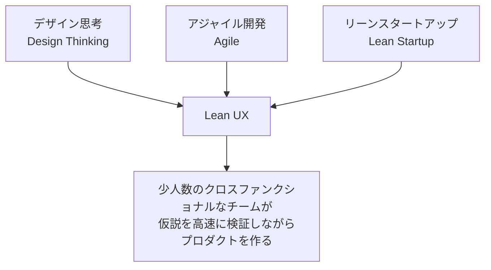
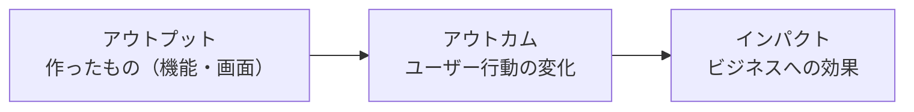
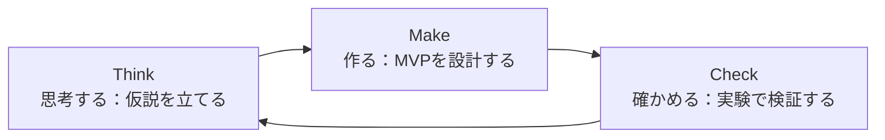
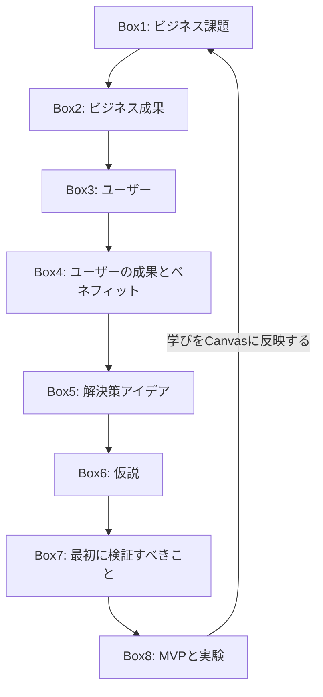
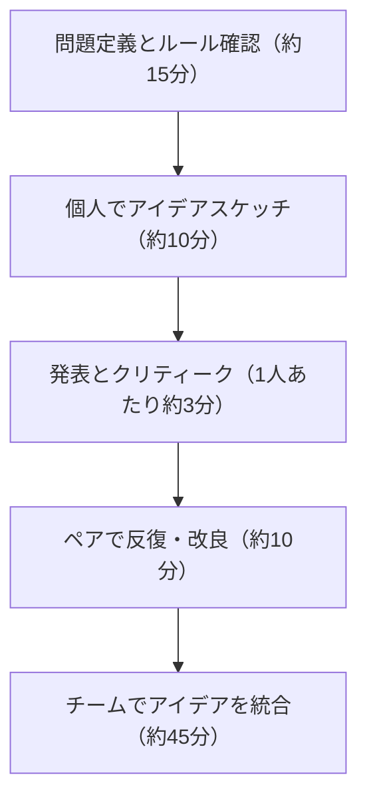
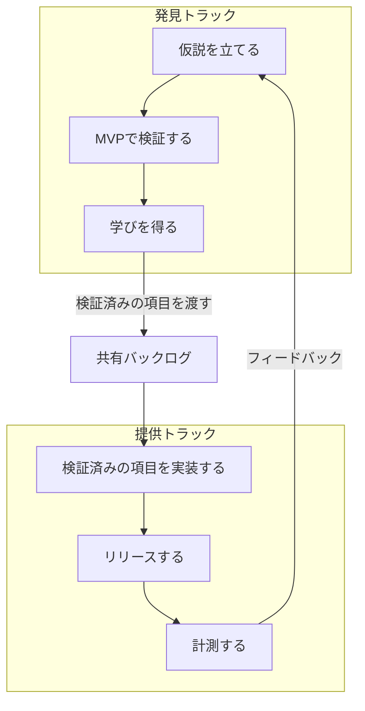

# Lean UX 実践ガイド ― はじめての人のためのステップバイステップ入門

> 本ガイドは、Jeff Gothelf と Josh Seiden の著書 *Lean UX, 3rd Edition*（O'Reilly Media, 2021年9月刊）を主軸に、著者本人の公式ブログ、Nielsen Norman Group（NN/g）などの一次情報源をもとに2026年8月時点の情報を反映してまとめたものです。ソフトウェアエンジニアやスクラムマスターがチームに導入する際に、迷わず一歩ずつ進められることを目指しています。

## 目次

1. [Lean UXとは何か](#1-lean-uxとは何か)
2. [Lean UXを支える原則](#2-lean-uxを支える原則)
3. [Lean UXの全体サイクル](#3-lean-uxの全体サイクル)
4. [Lean UX Canvasによるステップバイステップ実践](#4-lean-ux-canvasによるステップバイステップ実践)
5. [仮説（ハイポセシス）の書き方](#5-仮説ハイポセシスの書き方)
6. [MVPと実験の設計](#6-mvpと実験の設計)
7. [コラボレイティブデザイン：デザインスタジオ](#7-コラボレイティブデザインデザインスタジオ)
8. [Lean UXとアジャイル／スクラムの統合](#8-lean-uxとアジャイルスクラムの統合)
9. [組織にLean UXを浸透させる](#9-組織にlean-uxを浸透させる)
10. [2024年以降の進化：Lean Product CanvasとLean Strategy Canvas](#10-2024年以降の進化lean-product-canvasとlean-strategy-canvas)
11. [はじめてのLean UX：実践チェックリスト](#11-はじめてのlean-ux実践チェックリスト)
12. [よくある落とし穴（アンチパターン）](#12-よくある落とし穴アンチパターン)
13. [まとめ](#13-まとめ)
14. [参考文献・出典](#14-参考文献出典)

---

## 1. Lean UXとは何か

Lean UXは、デザイン思考・アジャイル開発・リーンスタートアップという3つの潮流を土台にした、プロダクト開発のアプローチです。特定の成果物（詳細な仕様書や完璧なモックアップ）を作ることをゴールにするのではなく、**プロダクト体験そのもの**にチームの意識を向けることを目的としています。

Gothelf氏とSeiden氏は、Lean UXを「コラボレーティブでクロスファンクショナル、かつユーザー中心のやり方で、プロダクトの本質をより早く明らかにするデザインアプローチ」と位置づけています。重要なのは、UXデザイナーだけの手法ではなく、プロダクトマネージャー、エンジニア、スクラムマスターを含むチーム全体のための働き方だという点です。

### なぜ今、重要なのか

継続的デリバリーが当たり前になった現在、プロダクトは一度作って終わりではなく、リリース後も学習と改善を繰り返す前提で開発されます。要求仕様を最初に固めてから作る「ウォーターフォール型」の進め方では、変化の速い市場や顧客ニーズに追従できません。Lean UXは、この前提の変化に対応するための考え方として、2013年の初版以来10年以上にわたり実務で使われ続けています。

### 3つの源流

- **デザイン思考**：ユーザーへの共感を起点に問題を定義し、発散と収束を繰り返して解決策を探る考え方
- **アジャイル開発**：小さなサイクルで反復的に作り、変化を歓迎する開発プロセス
- **リーンスタートアップ**：Eric Riesが提唱した「構築（Build）→計測（Measure）→学習（Learn）」のループで、仮説を検証しながら無駄な投資を避ける考え方

---

## 2. Lean UXを支える原則

書籍では原則が「チーム編成」「文化」「プロセス」という3つの観点に整理されています。それぞれの要点を以下にまとめます（原文の逐語引用ではなく要約です）。

| 観点 | 主な考え方 |
|---|---|
| チーム編成の原則 | デザイナー・エンジニア・プロダクトマネージャーなど専門性の異なるメンバーを、一つの小さなチームに常駐させる。役割の壁を越えて共同で問題に取り組む |
| 文化の原則 | 「正しさを主張する」より「学びを得る」ことを評価する。失敗を許容し、チーム全員が意思決定に関与できる心理的安全性を重視する |
| プロセスの原則 | 大きな一括の要件定義ではなく、小さなバッチサイズで検証を繰り返す。ドキュメントは必要最小限にとどめ、対話と共有理解を優先する |

これらの原則を貫く最も重要な転換が、次に説明する「アウトプットからアウトカムへ」という視点の変化です。

### アウトプットからアウトカムへ

Lean UXでは、「何を作ったか（アウトプット）」ではなく、「その結果ユーザーの行動がどう変わったか（アウトカム）」、さらに「それがビジネスにどんな効果をもたらしたか（インパクト）」を進捗の物差しにします。機能をリリースすること自体はゴールではなく、あくまで仮説を検証するための手段だという考え方が全体を貫いています。

---

## 3. Lean UXの全体サイクル

Lean UXの日々の営みは、「考える（Think）→作る（Make）→確かめる（Check）」という小さなループの繰り返しです。これはリーンスタートアップの「構築→計測→学習」ループをUXの文脈に置き換えたものと理解すると分かりやすいです。

このループを、チームで協働しながら・反復的に・並行して（デザイン、開発、検証をなるべく同時並行で）回し続けることが、Lean UXの日常的な実践の姿です。次章では、このループを具体的にどう回すかを助けてくれる「Lean UX Canvas」というツールを見ていきます。

---

## 4. Lean UX Canvasによるステップバイステップ実践

Lean UX Canvasは、Jeff Gothelf氏が考案した1枚のワークシートで、書籍第3版ではこのCanvasが本全体の目次にもなっています。Business Model Canvasに似た見た目を持ち、8つのボックスに番号順で答えていくことで、チームが「何を作るか」ではなく「どんなビジネス課題を解決するか」から議論を始められるように設計されています。

重要な点として、Canvasはチェックリストではなく**ファシリテーションツール**です。すべてのボックスを完璧に埋める必要はなく、チームが正しい対話をするためのきっかけとして使います。

### 各ボックスのステップバイステップ解説

| Box | 名称 | このボックスで答える問い |
|---|---|---|
| Box 1 | ビジネス課題 | 私たちが解決しようとしているビジネス上の課題は何か？ |
| Box 2 | ビジネス成果 | 課題が解決されたと、どんな行動指標の変化で判断するか？ |
| Box 3 | ユーザー | 誰のために作るのか。想定する顧客・ユーザー像は？ |
| Box 4 | ユーザーの成果とベネフィット | ユーザーは何を達成したいのか。その先にどんな便益があるか？ |
| Box 5 | 解決策アイデア | ユーザーの成果を実現するために、どんな機能・体験を提供できるか？ |
| Box 6 | 仮説 | Box2〜5をひとつの検証可能な文章にまとめる |
| Box 7 | 最初に検証すべきこと | 複数の仮説のうち、最もリスクが高く最初に検証すべきものはどれか？ |
| Box 8 | MVPと実験 | その仮説を検証するために、最小限どんな実験を行うか？ |

**進め方のコツ**

1. まずは番号順に、1〜2時間程度のワークショップ形式でチーム全員（デザイナーだけでなくPM・エンジニアも）が集まって埋めます。
2. Box 6（仮説）は、Box 2〜5に書いた内容を1文にまとめ直す作業です。書き方は次章で詳しく説明します。
3. Box 7では、洗い出した仮説の中から「これが間違っていたら計画全体が崩れる」という最もリスクの高い前提（riskiest assumption）を選びます。
4. Box 8で決めた実験を実施したら、得られた学びを再びBox 1〜6に反映させ、Canvasをアップデートします。これが「学習が終わったら終わり」ではなく「学習し続ける」というLean UXの本質です。
5. Box 8では、実験の方法をできるだけ具体的に書きます。「ユーザーからフィードバックを集める」のような曖昧な記述では、ワークショップに参加していなかったメンバーが実行できません。「誰に」「何人に」「どの期間で」「どんな手法で」まで書き切ることが推奨されています。

---

## 5. 仮説（ハイポセシス）の書き方

Lean UXでは、要求仕様の代わりに「仮説」を書きます。仮説は、Box 2〜5で洗い出した前提を、検証可能な1つの文章にまとめたものです。

### 基本テンプレート

書籍で紹介されている基本形は、次のような組み立て方です（要約）。

> 私たちは **[このビジネス成果]** を達成できると信じている。もし **[このユーザー]** が **[この機能・体験]** によって **[このベネフィット]** を得られれば。
>
> これが正しいかどうかは、市場から次のようなフィードバックが得られたときに分かる：**[定性的な兆候]** および／または **[定量的な指標の変化]**。

### テンプレートとCanvasの対応関係

| 仮説の構成要素 | 対応するCanvasのボックス |
|---|---|
| ビジネス成果 | Box 2（ビジネス成果） |
| ユーザー | Box 3（ユーザー） |
| ベネフィット | Box 4（ユーザーの成果とベネフィット） |
| 機能・解決策 | Box 5（解決策アイデア） |
| 成功の判定基準 | Box 8で計測する指標 |

### 具体例（イメージ）

- 「私たちは、オンライン購入者がアカウント作成なしで注文できるようになれば、注文完了率が向上すると信じている。現在15%のカゴ落ち改善が見られれば、これは正しいと言える」
- 「新機能に進捗バーと完了報酬を追加すれば、新規ユーザーのプロフィール完成率が上がると信じている。登録から2週間以内の平均完成率が現状より有意に高くなれば、これは正しいと言える」

### 仮説を書くときの注意点

- **1つの仮説は1つのアウトカムに絞る**：1つの仮説文に複数のビジネス成果が混ざっている場合は、仮説を分割します。
- **検証可能な形にする**：「良い体験にする」のような曖昧な表現ではなく、測定できる指標や観察可能な行動で表現します。
- **技術的な前提も忘れない**：レイテンシ、データ品質、セキュリティなど、ユーザー価値だけでなく実現可能性に関わる前提も仮説に含めることが推奨されます。

---

## 6. MVPと実験の設計

### MVPとは何か

Lean UXにおけるMVP（Minimum Viable Product）の定義は、Eric Riesが*The Lean Startup*で示した定義をそのまま踏襲しています。つまり、MVPは「利益を生む最小限の製品」ではなく、**仮説を検証して学習を得るための最小限の実験**です。「最小限の作業量で、次に最も重要なことを学ぶには何が必要か」を問うのがBox 8の核心です。

最小限であることは手抜きではなく、「リーン」の本質そのものです。無駄な作業を減らすことで、アイデアを早く軌道修正でき、チームの機動力が高まります。

### 真実の曲線（Truth Curve）という考え方

書籍では、検証の初期段階では低コスト・低精度な定性的手法（インタビューなど）から始め、確信度が高まるにつれて、より高コスト・高精度な定量的手法（ライブデータを使ったプロトタイプなど）へと段階的に投資を増やしていく考え方が紹介されています。最初から作り込みすぎず、学びの確信度に応じて投資を増やす、という順序立てが重要です。

### 代表的なMVP・実験の種類

| 種類 | 概要 | 主にどんな学びに向くか |
|---|---|---|
| ランディングページテスト | 実際には存在しない製品・機能の紹介ページを公開し、関心の度合いを計測する | 需要があるかどうかの検証 |
| フィーチャーフェイク（ボタン・トゥ・ノーウェア） | 未実装の機能へのリンクやボタンだけを先に置き、クリック率を計測する | 特定機能への需要の検証 |
| ウィザード・オブ・オズ | 裏側の処理を人力で行い、ユーザーには自動化された製品のように見せる | 提供価値そのものの検証（実装前） |
| コンシェルジュ型 | 人が直接サービスを提供し、後で自動化する前提でニーズを確かめる | サービスの価値と業務フローの検証 |
| ペーパープロトタイプ | 紙のスケッチでユーザーの反応を確認する | 情報設計・操作の流れの検証 |
| ローファイ／ミッド〜ハイファイのオンスクリーンプロトタイプ | 忠実度を段階的に上げた画面モックアップでテストする | UIの使いやすさ・体験の検証 |
| ノーコードMVP | ノーコードツールで実際に動く簡易版を作る | 実際の利用フローの検証 |
| コード実装／ライブデータのプロトタイプ | 実データを使った動く実装でテストする | 本番相当の挙動・精度の検証 |

**進め方のポイント**：まずは最も安価な手法（ペーパープロトタイプやランディングページ）から始め、仮説への確信度が高まった段階で、より作り込んだ実装へと進みます。いきなり本実装から検証を始めるのは避けます。

---

## 7. コラボレイティブデザイン：デザインスタジオ

Lean UXでは、デザイナーが一人で解決策を考えるのではなく、チーム全員でアイデアを出し合う「デザインスタジオ」という時間割型のワークショップ手法が紹介されています。

**進め方のステップ**

1. **問題定義とルール確認**：この回のワークショップで解こうとしている問題と制約条件をチーム全員で確認します。
2. **個人でアイデアスケッチ**：一人ひとりが時間を区切って複数の解決策案を紙にスケッチします。
3. **発表とクリティーク**：各自が短時間で案を発表し、他のメンバーからフィードバックを受けます。
4. **ペアで反復・改良**：2人1組になり、お互いの案を組み合わせて改善します。
5. **チームでアイデアを統合**：最終的にチーム全体で最も有望な案をまとめ上げます。

この手法の利点は、エンジニアやPMも含めた全員が「デザインする」経験を持つことで、その後の実装フェーズでの共通理解が格段に高まる点にあります。

---

## 8. Lean UXとアジャイル／スクラムの統合

Lean UXは単独の手法ではなく、既存のアジャイル（特にスクラム）プロセスの中に組み込んで運用することが前提とされています。書籍では、これを実現する鍵となる考え方として「デュアルトラック・アジャイル」が紹介されています。

**デュアルトラック・アジャイルの考え方**

- 1つのチームが、1つのバックログを共有しながら、「発見（研究・デザイン・検証）」と「提供（実装・リリース）」の作業を同じスプリント内で並行して行います。
- 発見トラックで検証された項目だけが、提供トラックの実装対象として選ばれます。多くの発見作業は、そのまま開発には進まず「作らない」という結論に至ることも重要な成果です。
- ロードマップは機能のリストではなく、アウトカム（目指す行動変化）を軸に組み立てます。

**統合のための実務ポイント**

- スプリントの「完了（Done）」の定義に、コードの実装だけでなく「検証された学び」を含めることが推奨されます。
- デザイナーはスプリントプランニングに参加し、次のスプリントで何を検証すべきかを一緒に決めます。
- ステークホルダーとの合意形成のために、進捗状況やリスクを可視化する「リスクダッシュボード」のような仕組みを使うことも紹介されています。

---

## 9. 組織にLean UXを浸透させる

Lean UXを個人やチームの取り組みだけで終わらせず、組織全体に根づかせるには、「文化」「チーム編成」「プロセス」の3方向でのシフトが必要だとされています。

| シフトの方向 | 従来型の組織 | Lean UXに移行した組織 |
|---|---|---|
| 文化 | 承認プロセスと計画通りの実行を重視 | 学習と実験、心理的安全性を重視 |
| チーム編成 | 機能ごとに分断された専門チーム（サイロ） | デザイナー・エンジニア・PMが常駐するクロスファンクショナルなチーム |
| プロセス | 大きな要件定義書を先に確定 | 小さな仮説単位で継続的に検証・反復 |

Nielsen Norman Group（NN/g）も、アジャイルとUXの両立には、経営層がUXの価値を理解していること、UX担当者自身がリーダーシップを発揮すること、プロセスを厳格になりすぎないよう運用すること、そしてUXがチームに埋め込まれていることが鍵になると解説しています。特に、アジャイル環境では開発チームの少し先を走る形でデザインチームが動く、ドキュメントは「必要十分」を心がける、といった実務上の工夫が紹介されています。

---

## 10. 2024年以降の進化：Lean Product CanvasとLean Strategy Canvas

書籍『Lean UX 第3版』（2021年）で使われているLean UX Canvasはそれ自体、今でも広く使われている有効なツールですが、著者のJeff Gothelf氏は2024年11月、このCanvasを進化させた**Lean Product Canvas**と、それを補完する**Lean Strategy Canvas**を新たに公開しました。学習の最新動向として押さえておくとよいポイントです。

- **Lean Product Canvas**：名称から「UX」の文字が外れ、デザイナーだけでなくプロダクト開発チーム全体のためのツールという位置づけが明確化されました。Box 2（ビジネス成果）にはOKRの考え方が明示的に組み込まれ、Box 4には「ジョブ・トゥ・ビー・ダン」の視点が追加されるなど、プロンプトがより具体的になっています。
- **Lean Strategy Canvas**：Lean Product Canvasに取り組む前段階として、チームの目標・障害・戦略（どの市場で戦うか、どう勝つか）・OKRを整理するための、新設された補助ツールです。

書籍そのものは第3版のLean UX Canvasをベースに解説されているため、初学者はまず本ガイドで説明した8ボックスのCanvasで基礎を学び、その後Jeff Gothelf氏の公式ブログで最新版の内容を確認するとよいでしょう（URLは参考文献セクションに記載）。

---

## 11. はじめてのLean UX：実践チェックリスト

これからLean UXをチームに導入する初学者向けに、最初の一歩を数値化したチェックリストです。

1. デザイナー・エンジニア・プロダクトマネージャーを含む3〜6名程度の小さなクロスファンクショナルチームを編成する
2. 取り組む対象について、1〜2時間のワークショップでLean UX Canvasの8ボックスを埋める
3. Box 6で仮説を1文にまとめ、Box 7で最もリスクの高い前提を1つ選ぶ
4. Box 8で「最小限の作業量で学べる実験」を1つ決め、1〜2週間以内に実施できる規模に抑える
5. 実験を実施し、定性・定量の両方でフィードバックを集める
6. 得られた学びをチームで共有し、Canvasを更新する
7. スクラムを使っている場合は、次のスプリントプランニングにこの学びを反映させる
8. このサイクルを、成果物のリリースが終わった後も継続的に回し続ける

---

## 12. よくある落とし穴（アンチパターン）

| 落とし穴 | 何が起きるか | 避け方 |
|---|---|---|
| Canvasをチェックリストとして機械的に埋める | 対話が生まれず、形だけの成果物になる | 各ボックスを「議論のきっかけ」として使い、意見が割れた箇所こそ深掘りする |
| 学習方法（Box 8）が曖昧なまま進める | 「ユーザーの声を聞く」だけでは誰が何をすべきか分からない | 対象者・人数・期間・手法まで具体的に書く |
| デザイナーだけでワークショップを実施する | エンジニアやPMの前提とズレたまま進んでしまう | クロスファンクショナルなメンバー全員を巻き込む |
| MVPをいきなり本実装で作ろうとする | 学びを得る前に多くの工数を投じてしまう | 真実の曲線に沿って、安価な検証手法から段階的に進める |
| ドキュメントを極端に省略、または過剰に作り込む | 情報が失われるか、逆に誰も読まない資料の山になる | 「誰が」「何のために」読むのかを基準に、必要十分な粒度で残す |
| スプリントの「完了」をコードのリリースだけで定義する | 検証されていない機能が量産される | 「完了」の定義に検証された学びを含める |

---

## 13. まとめ

Lean UXは、特定のツールや帳票のことではなく、「アウトプットではなくアウトカムを追いかける」「仮説を立てて検証する」「チーム全員で協働する」という考え方そのものです。Lean UX Canvasはその考え方を実践に落とし込むための優れたファシリテーションツールであり、8つのボックスを順に埋めていくことで、初学者でも迷わずワークショップを始められます。仮説の書き方、MVPの設計、デザインスタジオ、デュアルトラック・アジャイルといった具体的な手法を組み合わせることで、チームは小さく速く学び続けるプロダクト開発のリズムを作ることができます。

---

## 14. 参考文献・出典

本ガイドの作成にあたり、以下の情報源を参照しました（すべて2026年8月時点でアクセス可能なものです）。

| 出典 | タイトル・内容 | URL |
|---|---|---|
| O'Reilly Media（ユーザー指定の一次情報源） | Lean UX, 3rd Edition（書籍本体・目次・章内容） | https://www.oreilly.com/library/view/lean-ux-3rd/9781098116293/ |
| O'Reilly Media | Lean UX, 3rd Edition — Box 8: MVPs and Experiments（章プレビュー） | https://www.oreilly.com/library/view/lean-ux-3rd/9781098116293/ch12.html |
| O'Reilly Media | Lean UX, 3rd Edition — Box 6: Hypotheses（章プレビュー） | https://www.oreilly.com/library/view/lean-ux-3rd/9781098116293/ch10.html |
| Jeff Gothelf（著者公式サイト） | The Lean Product Canvas（2024年11月、Canvasの進化について） | https://jeffgothelf.com/blog/the-lean-product-canvas/ |
| Jeff Gothelf（著者公式サイト） | What's new in the latest edition of Lean UX?（第3版の変更点） | https://jeffgothelf.com/blog/whats-new-lean-ux-book-3rd-edition/ |
| Jeff Gothelf（著者公式サイト） | How to Use the Lean UX Canvas | https://jeffgothelf.com/blog/how-to-use-the-lean-ux-canvas/ |
| Jeff Gothelf（著者公式サイト） | Lean UX Canvas V2 | https://jeffgothelf.com/blog/leanuxcanvas-v2/ |
| Jeff Gothelf（著者公式サイト） | Lean UX Canvas（初版の解説） | https://jeffgothelf.com/blog/leanuxcanvas/ |
| Nielsen Norman Group | What is Lean UX?（動画・解説） | https://www.nngroup.com/videos/lean-ux/ |
| Nielsen Norman Group | Lean UX & Agile: Study Guide | https://www.nngroup.com/articles/lean-ux-agile-study-guide/ |
| Nielsen Norman Group | Lean UX & Agile Glossary | https://www.nngroup.com/articles/agile-glossary/ |
| Nielsen Norman Group | Agile Development Projects and Usability | https://www.nngroup.com/articles/agile-development-and-usability/ |
| Nielsen Norman Group | Lean UX Documentation for Tracking and Communicating in Agile | https://www.nngroup.com/articles/lean-agile-documentation/ |
| Sense & Respond Learning（Gothelf氏の教育事業） | Facilitating the Lean UX Canvas: A Workshop Guide for Agile Coaches | https://www.senseandrespond.co/blog/lean-ux-canvas-workshop-guide |
| Lean UX Book（公式書籍サイト） | Lean UX Book（推薦の声・概要） | https://leanuxbook.com/ |
| Interaction Design Foundation | What is Lean UX?（2026年更新版） | https://ixdf.org/literature/topics/lean-ux |
| AgileData.io | Jeff Gothelf インタビュー：Lean UX and Sense and Respond | https://agiledata.io/podcast/no-nonsense-agile-podcast/jeff-gothelf-lean-ux-and-sense-and-respond/ |

> 補足：本ガイド内の引用はすべて要約・意訳であり、原文からの逐語的な転載は行っていません。詳細な原文表現を確認したい場合は、上記URL、特にO'Reillyの書籍原文をご参照ください。
