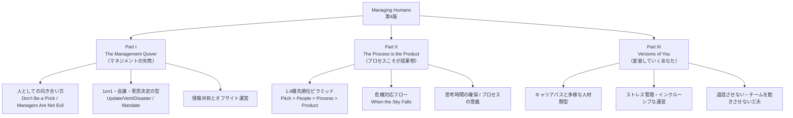
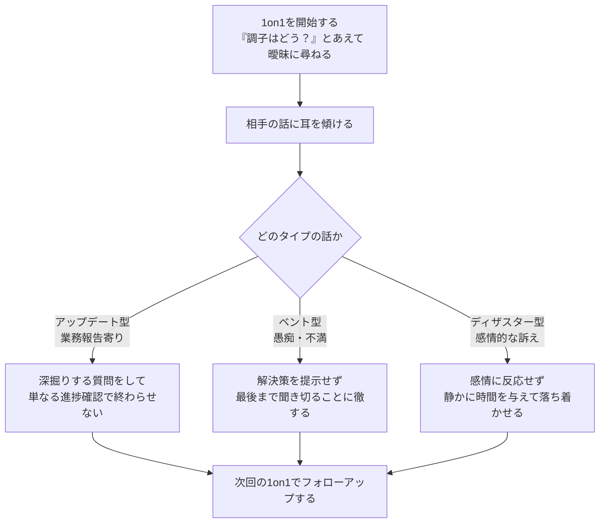
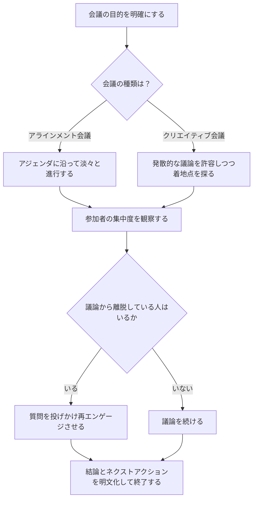
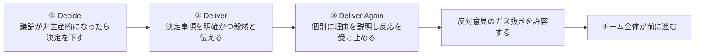
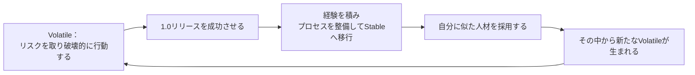
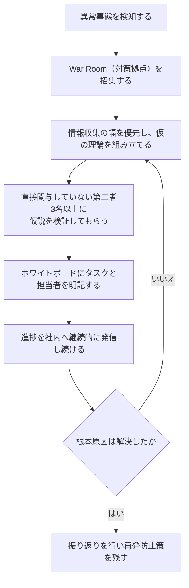
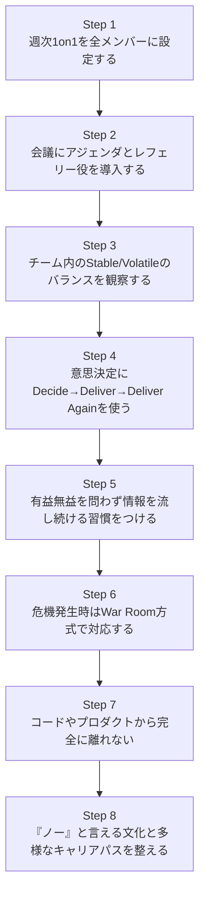

# 『Managing Humans: More Biting and Humorous Tales of a Software Engineering Manager』完全ガイド
### ― ソフトウェアエンジニアリングマネージャーのためのベストプラクティスをステップバイステップで学ぶ ―

> 本ガイドは、Michael Lopp（ペンネーム「Rands」）による書籍 *Managing Humans: More Biting and Humorous Tales of a Software Engineering Manager*（第4版、Apress）の内容を、初めてマネジメントに触れる方向けに整理・体系化した学習資料です。原著の詳細な文章の引用は最小限に留め、要点を独自の言葉で解説しています。原著を読む際の「地図」としてご活用ください。

---

## 0. この本の基本情報

| 項目 | 内容 |
|---|---|
| 原題 | *Managing Humans: More Biting and Humorous Tales of a Software Engineering Manager*（第4版） |
| 著者 | Michael Lopp（ブログ名義「Rands」） |
| 出版社 | Apress（Springer Nature） |
| 著者の経歴 | Apple、Pinterest、Palantir、Netscape、Symantec、Borland、Slackなどシリコンバレーの主要テック企業でエンジニアリングマネジメントを20年以上経験 |
| ジャンル | エンジニアリングマネジメント／人材マネジメント（実話ベースのエッセイ集、ユーモア混じり） |
| 構成 | 全3部・約50章（版によって章構成は異なる） |

Michael Lopp は自身のブログ「[Rands in Repose](https://randsinrepose.com/)」で発表してきたエッセイをまとめてこの本を執筆しました。もともとは同僚だった *Joel on Software* の著者 Joel Spolsky が出版を勧めたことがきっかけで書籍化されたと伝えられています。

### 版の変遷

| 版 | 発行時期の目安 | 主な特徴 |
|---|---|---|
| 初版 | 2007年 | Rands in Reposeの初期エッセイをまとめた最初の書籍化 |
| 第2版 | 2012年 | 新規14章を追加し、内容を大幅に刷新 |
| 第3版 | 2016年 | Slack・Pinterestでの経験を反映した新エピソードを追加 |
| 第4版（本ガイドの対象） | 2021年〜2022年頃 | ストレスへの向き合い方、多様なチーム作り、インクルーシブな会議運営、危機下でのリーダーシップなど、現代的なテーマを拡張 |

出典: [O'Reilly 書誌ページ](https://www.oreilly.com/library/view/managing-humans-more/9781484271162/)、[Springer 書誌ページ](https://link.springer.com/book/10.1007/978-1-4842-7116-2)

---

## 1. なぜこの本が読まれ続けているのか（国際的な評価）

この本はエンジニア出身のマネージャーにとって定番の一冊として、世界中の開発者コミュニティで長年参照され続けています。以下は、著名な開発者・技術ブログによる評価の一部です。

- 著名なテック業界ニュースレター「The Pragmatic Engineer」（Gergely Orosz運営）が毎年公開している技術者向け書籍推薦リストでは、あるDevelopment Leadが本書について「エンジニアリングマネジメントへの扉を開いてくれた一冊（The book that opened the door for me into engineering management.）」と評しています。（出典: [blog.pragmaticengineer.com](https://blog.pragmaticengineer.com/holiday-tech-book-recommendations/)）
- 開発者コミュニティサイト DEV Community に投稿されたレビューでは、マネジメント書籍にありがちな堅苦しさがなく、実用性とエンターテインメント性を両立している点が評価されています。（出典: [dev.to](https://dev.to/rachelsoderberg/book-review-managing-humans-by-michael-lopp-11fo)）
- ソフトウェアエンジニアによる技術ブログ「horia141」のレビューでは、本書は50章以上の短い章立てで構成され、Will Larson著『An Elegant Puzzle』と同様に著者のブログ記事を再編集した実践的な内容だと紹介されています。（出典: [horia141.com](https://horia141.com/book_reviews/2022-08-08-managing-humans-review)）
- GitHubで4,000以上のスターを集める書籍ノートリポジトリ「mgp/book-notes」では、本書の各章が詳細に要約・整理されており、開発者コミュニティにおける実務リファレンスとして参照されています。（出典: [github.com/mgp/book-notes](https://github.com/mgp/book-notes/blob/master/managing-humans.markdown)）
- エンジニアリングマネジメント関連リソースをまとめたキュレーションリポジトリ「charlax/engineering-management」でも本書は定番書籍として紹介され、Camille Fournier著『The Manager's Path』などと並んで頻繁に推薦されています。（出典: [github.com/charlax/engineering-management](https://github.com/charlax/engineering-management)）
- Hacker Newsのディスカッションでも、本書で紹介される「優秀な人材（rockstar）」を無理にマネジメントするコストに関する考え方が、エンジニアリング組織の生産性議論の文脈で引用されています。（出典: [news.ycombinator.com](https://news.ycombinator.com/item?id=21508140)）

一方で、本書には批判的な評価も存在します。Goodreadsのレビューには、著者の視点がやや皮肉的・否定的すぎると感じる読者や、内容に古さを感じる読者の声もあります。ブログ「Brian's Notes」では10点満点中8点という評価をつけつつも、内容の毒舌さゆえに賛同しにくい部分があることを指摘しています。（出典: [briansnotes.io](https://www.briansnotes.io/book/managing-humans/)）**本書はあくまで著者個人の経験則の集積であり、鵜呑みにせず自分のチームの文脈に照らして取捨選択することが推奨されます。**

---

## 2. 本書全体の構成マップ

本書は大きく3部構成になっています。第4版ではこれに加え、ストレス管理・多様性・危機対応といった現代的テーマが各部に組み込まれています。

出典: [O'Reilly 書誌ページ](https://www.oreilly.com/library/view/managing-humans-more/9781484271162/)、章構成の詳細は [mgp/book-notes](https://github.com/mgp/book-notes/blob/master/managing-humans.markdown)、[thriftbooks.com掲載の目次](https://www.thriftbooks.com/w/managing-humans-biting-and-humorous-tales-of-a-software-engineering-manager_michael-lopp/399304/)を参照して構成。

---

## 3. Part I：The Management Quiver（マネジメントの矢筒）を学ぶ

Part Iは、マネージャーが日々の対人関係で使う「道具（矢）」を1つずつ紹介するパートです。初心者マネージャーが最初に身につけるべき基礎スキル群と言えます。

### 3-1. 主要章と実践ポイント一覧

| 章タイトル | テーマ | 初心者が今日から実践できること |
|---|---|---|
| Don't Be a Prick | 人としてのマネージャー像 | 組織図上の立場に関わらず、誰に対しても一人の人間として向き合う |
| Managers Are Not Evil | マネージャーへの誤解の解消 | 自分の仕事の意味をエンジニアでない相手にも分かる言葉で説明する |
| Stables and Volatiles | チームの人材タイプ理解 | チーム内の「安定志向」と「変革志向」のバランスを観察する |
| The Rands Test | 組織の健全性チェック | 定例で経営層のビジョンを共有し、誰でも質問できる場を設ける |
| How to Run a Meeting | 会議運営 | アジェンダを用意し、レフェリー役として進行に責任を持つ |
| The Twinge | 違和感の察知 | データが少なくても違和感（Twinge）を無視せず確認する |
| The Update, the Vent, and the Disaster | 1on1の型 | 週次30分の1on1を固定し、相手の話を3種類に分類して聞く |
| The Monday Freakout | 感情の爆発への対応 | 反論せず、質問で相手を感情から論理へ導く |
| Dissecting the Mandate | トップダウン決定の伝え方 | Decide→Deliver→Deliver againの手順で意思決定を通す |
| Information Starvation | 情報共有の重要性 | 有益無益にかかわらず情報を流し続ける習慣をつける |
| Fred Hates the Off-Site | オフサイト運営 | 参加者全員に発表の機会を与え、2日以上かけて議論する |
| An Engineering Mindset | 技術との距離感 | コードから完全に離れず、開発環境やアーキテクチャの理解を保つ |
| Titles Are Toxic | 役職とキャリア | 役職の名称ではなく、実際の職務内容と成長を評価する |
| Saying No | 意思決定の勇気 | チームを巻き込みながら「ノー」と言える文化を作る |

出典: [mgp/book-notes（GitHub）](https://github.com/mgp/book-notes/blob/master/managing-humans.markdown)

### 3-2. ステップ実践：健全な1on1の進め方

本書で特に有名な概念の一つが「アップデート（Update）」「ベント（Vent）」「ディザスター（Disaster）」という1on1の3分類です。マネージャーはまず相手の話がどのタイプかを見極め、それぞれに応じた聞き方をする必要があります。

**実践のコツ**
- 1on1は毎週同じ曜日・時間に固定する（相手への「あなたのために時間を確保している」というメッセージになる）。
- 最低30分は確保する。人数が多くても時間を削らない。
- ステータス報告に終始しそうな場合は、その中から掘り下げられる話題を探して深掘りする。

出典: [mgp/book-notes（GitHub）](https://github.com/mgp/book-notes/blob/master/managing-humans.markdown)

### 3-3. ステップ実践：会議をレフェリーとして進行する

本書では、会議は「アラインメント会議（定型的な情報共有）」と「クリエイティブ会議（難しい問題を解く場）」に大別されます。マネージャーは進行役（レフェリー）として、議論の質と参加者の集中を管理する責任を負います。

**実践のコツ**
- 会議の目的は「参加者が実務に戻れるようにすること」だと意識する。
- 誰も発言しない・進行が止まる状態が30分続いたら、論点が多すぎるサインとして仕切り直す。
- 「独裁者」的に発言を止めるのは最終手段。多用すると場全体が萎縮する。

出典: [mgp/book-notes（GitHub）](https://github.com/mgp/book-notes/blob/master/managing-humans.markdown)

### 3-4. ステップ実践：トップダウンの意思決定（Mandate）を通す

議論が堂々巡りになったとき、マネージャーは「マンデート（Mandate）」、つまり明確な決定を下す必要があります。本書ではこれを3段階のプロセスとして説明しています。

**実践のコツ**
- 強い意見を持つ人は少数派であり、大多数は「誰かが決めてくれること」を望んでいる場合が多いと理解する。
- 決定後、賛成・反対どちらの側にも個別に理由を説明する時間を取る。
- 上位組織からの決定を伝える場合は、その背景・根拠を自分の言葉で咀嚼してから伝える。

出典: [mgp/book-notes（GitHub）](https://github.com/mgp/book-notes/blob/master/managing-humans.markdown)

### 3-5. Stables（安定志向型）とVolatiles（変革志向型）

プロダクトの1.0リリースを境に、チームは「Stable（安定志向）」と「Volatile（変革志向）」という2つの気質に分かれていく、という観察も本書の代表的な概念です。

| 観点 | Stable（安定志向型） | Volatile（変革志向型） |
|---|---|---|
| 特徴 | 指示や計画を好み、リスクを慎重に評価する | 権威に反発しがちで、リスクを恐れず挑戦する |
| 強み | 安定した実行力とプロセスの構築力 | 破壊的な発想と新しい取り組みを生み出す力 |
| リスク | 変化への抵抗が強くなりやすい | 継続性に欠け、混乱を招きやすい |
| マネジメントの要点 | 変化の必要性を丁寧に説明し、抵抗を頭ごなしに否定しない | 破壊力を活かしつつStableとの間で「一時休戦」を仲介する |

このサイクルを理解しておくと、「なぜ古参メンバーは保守的になりがちなのか」「なぜ新しく入った人は既存のやり方に反発するのか」を構造的に説明できるようになります。

出典: [mgp/book-notes（GitHub）](https://github.com/mgp/book-notes/blob/master/managing-humans.markdown)

---

## 4. Part II：The Process is the Product（プロセスこそが成果物）を学ぶ

Part IIは、プロダクト開発そのものやチームのプロセス設計に関するテーマを扱います。

### 4-1. 主要章と実践ポイント一覧

| 章タイトル | テーマ | 実践ポイント |
|---|---|---|
| 1.0 | 立ち上げ期の優先順位 | Pitch（構想）→People（人）→Process（プロセス）→Productの順で守るべきものを判断する |
| The Process Myth | プロセスへの向き合い方 | 「なぜこのプロセスが必要か」を説明できないプロセスは見直す |
| How to Start | 着手できない問題への対処 | 「悩む・準備する・始める」の3段階を意識し、まず着手する |
| Taking Time to Think | 発想のための時間確保 | リリース直後にブレスト会議とプロトタイプ会議を同じ週に設定する |
| The Value of the Soak | アイデアを寝かせる技術 | 能動的に情報収集する「アクティブソーク」と、一晩寝かせる「パッシブソーク」を使い分ける |
| Trickle Theory | 着手できないタスクへの対応 | やる気が出ないタスクは他の作業と組み合わせて「ミックスする」 |
| When the Sky Falls | 危機対応 | War Room方式で情報収集・仮説検証・担当割当・発信のサイクルを回す |
| Hacking Is Important | 創造性と安定のバランス | 予測可能性を保ちながらも、意図的に「ハック」する余地を残す |
| Entropy Crushers | プロジェクト／プログラムマネジメント | PM・プロダクトマネージャー・プログラムマネージャーの役割分担を明確にする |

出典: [mgp/book-notes（GitHub）](https://github.com/mgp/book-notes/blob/master/managing-humans.markdown)

### 4-2. 「1.0」における優先順位ピラミッド

プロダクトの立ち上げ期（1.0）において、著者は守るべき優先順位を4層で説明しています。下位層で失敗するほど、会社全体への影響（コスト）は大きくなるとされています。

| 優先順位 | 層 | 失敗した場合の影響範囲 |
|---|---|---|
| 1（最重要・土台） | Pitch（構想・アイデア） | 会社の存在意義そのものに関わる構造的な失敗 |
| 2 | People（人） | 1.0に本気で取り組めない人材を早めに見極める必要がある |
| 3 | Process（プロセス） | 完璧である必要はないが、全員が参照できる形で存在させる |
| 4（最終成果） | Product（プロダクト） | 社内の思い込みではなく、第三者の目で検証されて初めて成立する |

**実践のコツ**：組織図を作りたくなったら要注意のサインと捉える。1.0フェーズで「これは誰の仕事か」を可視化し始めるのは、停滞の始まりであることが多いとされています。

出典: [mgp/book-notes（GitHub）](https://github.com/mgp/book-notes/blob/master/managing-humans.markdown)

### 4-3. ステップ実践：危機対応（When the Sky Falls）

本番障害や重大インシデントなど「空が落ちてくる」ような状況にどう対応するか。本書は明確なステップを提示しています。

**実践のコツ**
- 対応中は自分の名前をタスクの担当者に入れない。マネージャーの役目は実行ではなく調整と情報発信。
- 目先の症状を抑える「応急処置」と、根本原因を解決する「本当の治療」を混同しない。

出典: [mgp/book-notes（GitHub）](https://github.com/mgp/book-notes/blob/master/managing-humans.markdown)

---

## 5. Part III：Versions of You（変容していくあなた）を学ぶ

Part IIIは、キャリアの成長、多様な人材タイプへの向き合い方、そして第4版で拡充されたストレス対応・多様なチーム作り・インクルーシブな会議運営・危機下でのリーダーシップといったテーマを扱います。版によって収録章は異なりますが、代表的なテーマは以下の通りです。

| テーマ領域 | 扱われる内容の例 |
|---|---|
| 採用と初期定着 | 電話面接の見極め方、入社後90日間の重要性 |
| 人材の見極め方 | 「ベルウェザー（風見鶏）」となる人材の見つけ方、退屈が離職につながるプロセス |
| チームの多様性 | 完璧主義者と実行重視型、内向型と外向型など、多様な気質への向き合い方 |
| 組織変更 | 再編（リオーグ）を行う際の原則 |
| ストレスと危機下のリーダーシップ（第4版で拡充） | ストレスへの向き合い方、インクルーシブな会議の運営、危機下でのリーダーの振る舞い |

出典: [O'Reilly 書誌ページ](https://www.oreilly.com/library/view/managing-humans-more/9781484271162/)、[Goodreads 第4版ページ](https://www.goodreads.com/book/show/58153385)

### 5-1. 「Bored People Quit（退屈な人は辞める）」から学ぶ実践

本書で繰り返し引用される代表的な章の一つです。退屈は静かに始まり、気づいたときには手遅れになりやすいという警鐘が中心テーマです。

- メンバーの日常のルーティンに変化がないかを観察する。
- 「今、退屈していないか」を直接尋ねる勇気を持つ。
- 一人ひとりについて「この人はどこに向かいたいのか」「そのために自分は何をしているか」を答えられるようにしておく。
- つまらない仕事（Shit Work）は公平に配分し、誰がやっているかを把握し、いつ終わるかを伝える。
- マネージャーになっても完全にコードから離れない。エンジニアの思考プロセスへの理解を保つため。

出典: [mgp/book-notes（GitHub）](https://github.com/mgp/book-notes/blob/master/managing-humans.markdown)

---

## 6. 初心者マネージャーのための実践ステップバイステップまとめ

これまでの内容を、新任エンジニアリングマネージャーが「今週から」着手できる8つのステップとして整理しました。

| ステップ | やること | 対応する章（例） |
|---|---|---|
| 1 | 全メンバーと週次30分の1on1を固定枠で設定する | The Update, the Vent, and the Disaster |
| 2 | すべての会議にアジェンダを用意し、進行役として時間を管理する | How to Run a Meeting |
| 3 | 誰が安定志向で誰が変革志向かを意識してタスクを割り振る | Stables and Volatiles |
| 4 | 議論が停滞したら「決める・伝える・個別に説明する」の順で決定する | Dissecting the Mandate |
| 5 | 自分だけが知っている情報を溜め込まず共有する | Information Starvation |
| 6 | 障害・炎上時はWar Roomを立て、役割分担と発信を徹底する | When the Sky Falls |
| 7 | 開発環境に触れ続け、エンジニアの言葉で会話できる状態を保つ | An Engineering Mindset |
| 8 | 反対意見を歓迎し、役職に依存しない成長パスを用意する | Titles Are Toxic / Saying No |

---

## 7. よくある落とし穴（アンチパターン）

| 落とし穴 | なぜ問題か | 本書での対策 |
|---|---|---|
| 1on1をステータス報告の場にしてしまう | メンバーの本音や課題を拾えなくなる | Update/Vent/Disasterの型で聞き方を切り替える |
| 会議で誰も進行管理をしない | 議論が発散し、意思決定に至らない | レフェリーとして参加者の集中度と論点を管理する |
| すべてを合議制で決めようとする | 決定が遅れ、チームが疲弊する | 必要な場面ではMandateとして毅然と決定する |
| 情報を出し惜しみする | 憶測やゴシップが組織の不安を増幅させる | 有益無益を問わず情報を流し続ける |
| マネージャーが完全にコードから離れる | エンジニアとの共通言語を失う | 開発環境に触れ続け、実装への理解を保つ |
| 役職だけでキャリアパスを設計する | 役職では成長の多様性を捉えきれない | 職務内容と実際の貢献を軸に評価する |

出典: [mgp/book-notes（GitHub）](https://github.com/mgp/book-notes/blob/master/managing-humans.markdown)、[briansnotes.io](https://www.briansnotes.io/book/managing-humans/)

---

## 8. 併読をおすすめする関連書籍

エンジニアリングマネジメント分野の著名な開発者・技術ブログが本書と併せてよく推薦している書籍です。

| 書籍 | 著者 | 本書との関係性 |
|---|---|---|
| The Manager's Path | Camille Fournier | よりキャリア段階別に体系化された内容。本書のエピソード集的な構成と対照的で併読が推奨されている |
| An Elegant Puzzle: Systems of Engineering Management | Will Larson | 組織をシステムとして捉える視点を補完する |
| Staff Engineer | Will Larson | マネジメント以外のキャリアパス（Titles Are Toxicの発展形）を掘り下げる |
| The Art of Leadership: Small Things, Done Well | Michael Lopp（同著者） | 本書の続編にあたる、日々の小さな実践に焦点を当てた一冊 |
| Radical Candor | Kim Scott | フィードバックの与え方について、本書の1on1論を補完する |

出典: [blog.pragmaticengineer.com](https://blog.pragmaticengineer.com/holiday-tech-book-recommendations/)、[github.com/charlax/engineering-management](https://github.com/charlax/engineering-management)

---

## 9. まとめ

*Managing Humans* は体系立った理論書ではなく、著者自身のシリコンバレーでの実体験から抽出された「実践知の集積」です。そのため、以下のスタンスで読むことが推奨されます。

1. **一つの正解として鵜呑みにしない**：著者自身の経験と組織文化に強く依存した記述が多いため、自分のチームの文脈に照らして取捨選択する。
2. **概念（フレームワーク）を借りる**：Stables/Volatiles、Update/Vent/Disaster、Decide/Deliver/Deliver Again、War Roomといった「型」は、そのまま自分のチーム運営に応用しやすい。
3. **短い章単位で実践に落とし込む**：各章が独立したエッセイなので、直面している課題に近いテーマから拾い読みし、翌週の1on1や会議から試してみる。

初めてマネージャーになる方にとって、本書は「明日から使える語彙とフレームワーク」を数多く提供してくれる一冊です。批判的な視点を持ちながらも、まずは本ガイドで紹介したステップから実践してみることをおすすめします。

---

## 10. 参考文献・情報源（URL一覧）

本ガイドの作成にあたり、2026年8月19日時点で以下の情報源を参照しました。

| No. | 情報源 | URL |
|---|---|---|
| 1 | O'Reilly 書誌ページ（第4版） | https://www.oreilly.com/library/view/managing-humans-more/9781484271162/ |
| 2 | Springer/Apress 書誌ページ（第4版） | https://link.springer.com/book/10.1007/978-1-4842-7116-2 |
| 3 | Springer/Apress 書誌ページ（初版） | https://link.springer.com/book/10.1007/978-1-4302-0271-4 |
| 4 | Rands in Repose（著者公式ブログ）書籍紹介ページ | https://randsinrepose.com/books/ |
| 5 | Rands in Repose：第3版発表記事 | https://randsinrepose.com/archives/managing-humans-third-edition/ |
| 6 | mgp/book-notes（GitHub、章ごとの詳細ノート） | https://github.com/mgp/book-notes/blob/master/managing-humans.markdown |
| 7 | charlax/engineering-management（GitHub、キュレーションリスト） | https://github.com/charlax/engineering-management |
| 8 | skyzyx/managing-humans（GitHub、推薦リスト） | https://github.com/skyzyx/managing-humans |
| 9 | The Pragmatic Engineer（Gergely Orosz）書籍推薦記事 | https://blog.pragmaticengineer.com/holiday-tech-book-recommendations/ |
| 10 | DEV Community レビュー記事 | https://dev.to/rachelsoderberg/book-review-managing-humans-by-michael-lopp-11fo |
| 11 | horia141.com レビュー記事 | https://horia141.com/book_reviews/2022-08-08-managing-humans-review |
| 12 | Hacker News ディスカッション | https://news.ycombinator.com/item?id=21508140 |
| 13 | Goodreads（第4版ページ） | https://www.goodreads.com/book/show/58153385 |
| 14 | Goodreads（旧版ページ） | https://www.goodreads.com/book/show/1317946.Managing_Humans |
| 15 | Brian's Notes 書籍要約ページ | https://www.briansnotes.io/book/managing-humans/ |
| 16 | Thriftbooks 目次掲載ページ | https://www.thriftbooks.com/w/managing-humans-biting-and-humorous-tales-of-a-software-engineering-manager_michael-lopp/399304/ |

---

*本ガイドはMichael Lopp氏の原著の著作権を尊重し、本文の逐語的な引用を避け、要点を独自の言葉で要約・体系化したものです。詳細な内容や著者ならではのユーモアあふれる語り口については、ぜひ原著（[O'Reilly版はこちら](https://www.oreilly.com/library/view/managing-humans-more/9781484271162/)）を直接お読みください。*
