# MoP Foundation（Management of Portfolios）学習ガイド

**― PRINCE2® Portfolio Management Foundation（旧称 MoP® Foundation）完全対策 ―**

> 本ガイドは、世界トップクラスのソフトウェアエンジニア／プロジェクトマネージャー／スクラムマスターの視点から、MoP Foundation試験の出題範囲を初学者にもわかりやすく、ステップ・バイ・ステップで解説するものです。各項目には実務でのベストプラクティスと、根拠となる一次・二次情報源のURLを付記しています。

---

## 目次

1. [このガイドについて（試験概要）](#1-このガイドについて試験概要)
2. [ポートフォリオマネジメントとは何か](#2-ポートフォリオマネジメントとは何か)
3. [MoPフレームワークの全体像](#3-mopフレームワークの全体像)
4. [5つの原則（Principles）](#4-5つの原則principles)
5. [組織のエネルギーと活力ある変革文化](#5-組織のエネルギーと活力ある変革文化)
6. [ポートフォリオ定義サイクル（5つのプラクティス）](#6-ポートフォリオ定義サイクル5つのプラクティス)
7. [ポートフォリオ・デリバリーサイクル（7つのプラクティス）](#7-ポートフォリオデリバリーサイクル7つのプラクティス)
8. [主要な役割（Key Roles）](#8-主要な役割key-roles)
9. [主要文書（Key Documents）](#9-主要文書key-documents)
10. [導入・定着・成熟度評価](#10-導入定着成熟度評価)
11. [プラクティス別ベストプラクティス早見表](#11-プラクティス別ベストプラクティス早見表)
12. [関連フレームワークとの関係](#12-関連フレームワークとの関係)
13. [試験対策のポイント](#13-試験対策のポイント)
14. [参考文献・ソース一覧](#14-参考文献ソース一覧)

---

## 1. このガイドについて（試験概要）

MoP Foundation（現在の正式名称は「PRINCE2® Portfolio Management Foundation」）は、PeopleCert社が提供する、ポートフォリオマネジメントの入門資格です。PRINCE2 Portfolio Managementパスウェイの最初のモジュールにあたり、効果的かつ戦略的なポートフォリオマネジメントを行うための原則・技法・プラクティスを学びます。

| 項目 | 内容 |
|---|---|
| 資格名 | MoP Foundation（PRINCE2 Portfolio Management Foundation） |
| 前提条件 | なし |
| 出題形式 | 四肢択一（multiple choice） |
| 問題数 | 50問 |
| 試験時間 | 40分 |
| 合格基準 | 50%以上の正答（25問以上） |
| 受験形式 | クローズドブック（資料持ち込み不可） |
| 試験言語 | 英語 |
| 結果通知 | 公式結果は2営業日以内 |

> 出典: [PeopleCert公式 MoP Foundation商品ページ](https://www.peoplecert.org/browse-certifications/project-programme-and-portfolio-management/MoP-4/mop-foundation-2644)

PeopleCertの「At a Glance」によれば、本資格は主にポートフォリオマネージャーを対象とし、以下の学習アウトカムをカバーします。

- ポートフォリオマネジメントの中核概念・構造・用語
- 戦略目標とポートフォリオの整合（Strategic alignment）
- プロジェクト／プログラムの優先順位付け（Prioritization）
- ポートフォリオ全体のリスクマネジメント
- ベネフィット（便益）の定義・測定・追跡
- ガバナンスとコンプライアンス
- ポートフォリオの計画・デリバリー
- チェンジマネジメント
- リソースマネジメント

### 想定される対象読者・応用可能な職種

- ポートフォリオマネージャー／プログラムマネージャー／プロジェクトマネージャー
- ビジネスチェンジマネージャー
- ベネフィットマネージャー
- ディレクター・オブ・チェンジ
- シニア・リスポンシブル・オーナー（SRO）
- ビジネスアナリスト
- 経営会議メンバー

> 出典: [PeopleCert公式 MoP Foundation商品ページ](https://www.peoplecert.org/browse-certifications/project-programme-and-portfolio-management/MoP-4/mop-foundation-2644)

---

## 2. ポートフォリオマネジメントとは何か

### 2.1 定義

MoPにおける「ポートフォリオ」とは、組織の戦略目標を達成するために選定され、まとめて管理される、プロジェクトおよびプログラムの集合体を指します。「ポートフォリオマネジメント」とは、組織の変革（change）と定常業務（Business as Usual, BAU）とのバランスを最も効果的に保つために協調された、一連の戦略的プロセスと意思決定の集合です。

> 出典: [Van Haren Publishing「MoP in 3 minutes」](https://archive.vanharen.net/blog/mop-management-of-portfolios-in-3-minutes)

### 2.2 プロジェクト・プログラム・ポートフォリオの違い

MoP Foundationでは、この3つの階層の違いを明確に理解することが問われます。

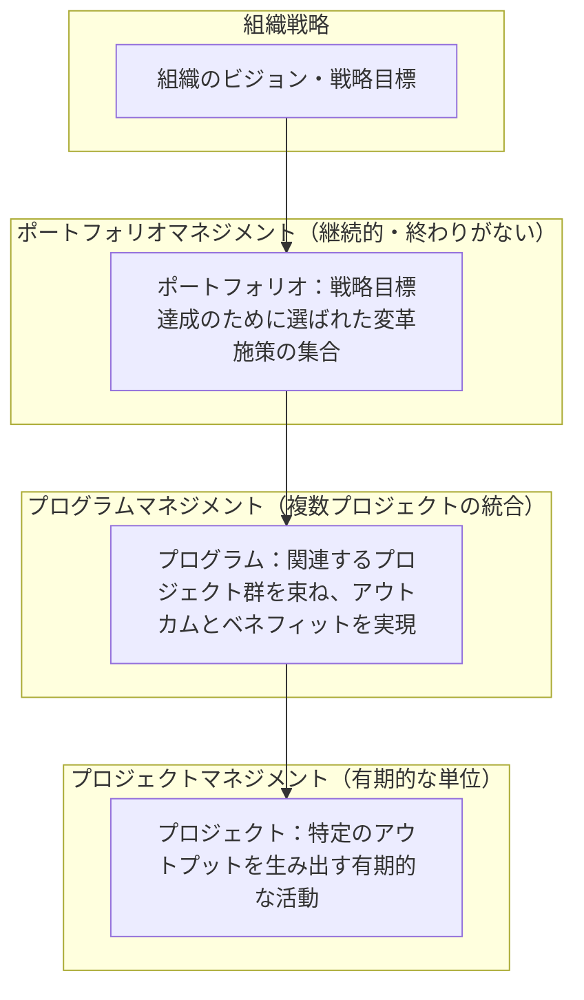

ポートフォリオには「始まりも終わりもない」という点が、プロジェクトやプログラムとの決定的な違いです。プロジェクトとプログラムは有期的（成果物を出して終了する）ですが、ポートフォリオは組織が戦略を持ち続ける限り継続するマネジメント活動です。

### 2.3 ポートフォリオマネジメントが答える3つの根本的な問い

MoPは、次の3つの問いに答えるための仕組みとして設計されています。

1. **正しいことをしているか？（Are we doing the right things?）** ― 戦略に整合した、正しいプロジェクト・プログラムを選んでいるか
2. **物事を正しく行っているか？（Are we doing these things right?）** ― 選んだ施策を効果的・効率的に実行できているか
3. **効果的なサービスや効率化による便益を、実際に実現できているか？（Are we realising the benefits?）** ― 変革の結果として期待した便益が得られているか

> 出典: [PeopleCert公式ページ](https://www.peoplecert.org/browse-certifications/project-programme-and-portfolio-management/MoP-4/mop-foundation-2644)、[Van Haren Publishing](https://archive.vanharen.net/blog/mop-management-of-portfolios-in-3-minutes)

### 2.4 戦略的・組織的コンテキスト：6つの連携機能

ポートフォリオマネジメントは単独で機能するものではなく、組織内の以下6つの機能・活動と連携して戦略目標の達成を支えます。

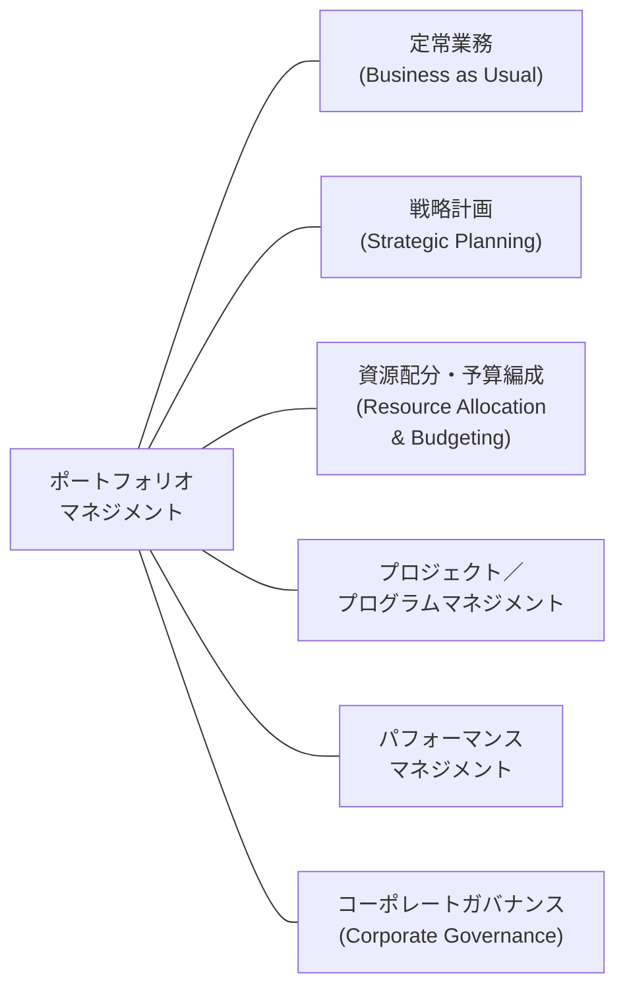

ポートフォリオマネジメントは、これら6つの機能と連携することで、組織の戦略目標達成を下支えし、同時に実効性のあるコーポレートガバナンスを実現します。

> 出典: [QA「MoP Foundation」コース概要](https://www.qa.com/course-catalogue/courses/management-of-portfolios-mop-foundation-and-practitioner-pbpmopfp/)

**ベストプラクティス**：ポートフォリオオフィスを新設・再稼働する際は、まずこの6機能それぞれの既存プロセス（例：年次予算編成サイクル、既存のPMOレポーティング）を洗い出し、ポートフォリオマネジメントを「新しい別のプロセス」として並走させるのではなく、既存プロセスに橋渡しする設計にすることが定着の鍵となります。

---

## 3. MoPフレームワークの全体像

MoPは、**5つの原則**、**2つの管理サイクル（定義サイクル・デリバリーサイクル）**、そしてそれらをつなぐ**組織のエネルギー**という3層構造で成り立っています。

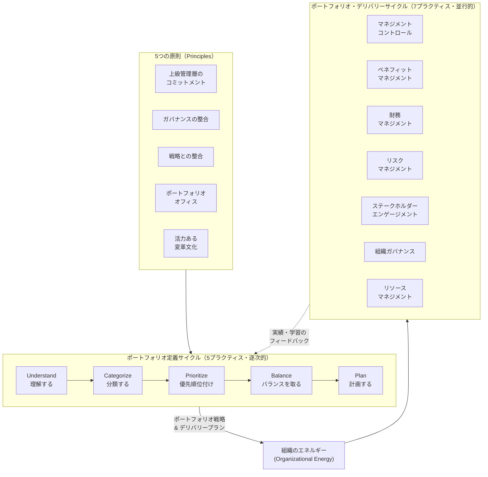

- **定義サイクル（Definition Cycle）**：「正しいものを選ぶ」段階。5つのプラクティスは基本的に**逐次的（sequential）**に進みますが、重なり合うこともあります。
- **デリバリーサイクル（Delivery Cycle）**：「選んだものを正しく届ける」段階。7つのプラクティスは基本的に**並行的（parallel）**に進みます。
- **組織のエネルギー**：この2つのサイクルをつなぐ「のり」の役割を果たします。

> 出典: [mop.wiki「Portfolio Management Cycles」](https://mop.wiki/management-cycles/)、[mop.wiki トップページ](https://mop.wiki/)

**ベストプラクティス**：定義サイクルとデリバリーサイクルを「一度きりの直列プロセス」と誤解しないこと。実務では、四半期ごとの戦略レビューのたびに定義サイクルが繰り返され、その間もデリバリーサイクルの7プラクティスは常時並行して回り続けます。両サイクルは独立した一方通行ではなく、デリバリー側からのフィードバック（実績・リスクの顕在化・便益の未達など）が次の定義サイクルの優先順位付けにも反映されるべきです。

---

## 4. 5つの原則（Principles）

「原則（Principle）」とは、あらゆる状況に適用できる基本的な前提のことです。MoPは5つの原則をすべて適用することを求めますが、組織の実情に合わせてテーラリング（調整）することも認めています。

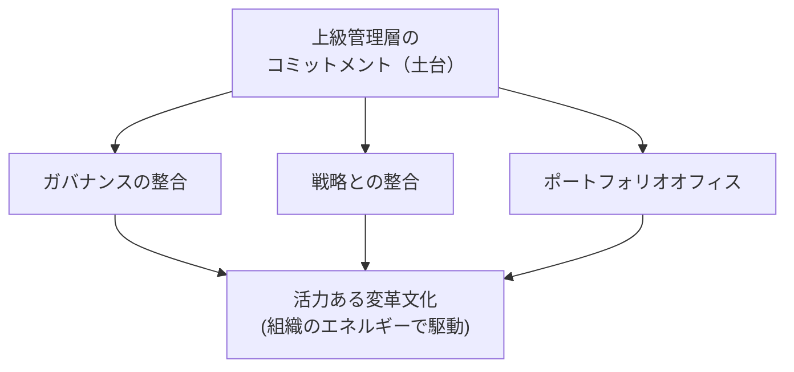

### 4.1 上級管理層のコミットメント（Senior Management Commitment）

**目的**：どんな変革施策も、トップの支持なしには成功しません。MoPが5原則の筆頭にこれを置いているのはそのためです。

**達成のポイント**：

- **ガバナンス構造への積極的な関与と承認**：上級管理層はポートフォリオ・ディレクション・グループの一員として、優先順位付け基準の承認、予算・資源の承認、責任分担の合意、ポートフォリオマネジメントチームの組織上の位置づけの決定に関与します。
- **専門知識の提供**：上級管理層が持つ組織固有の知見を、ポートフォリオマネジメントの実践に積極的に取り入れることが成功の一助となります。
- **チャンピオンとして発信・伝達すること**：ポートフォリオマネジメントが生み出す価値と、意思決定の根拠を組織全体に発信し続けることが求められます。

> 出典: [mop.wiki「Senior Management Commitment」](https://mop.wiki/principles/senior-management-commitment/)、[Advantage Learning](http://www.advantagelearning.co.uk/news/mop-5-principles.html)

**ベストプラクティス**：上級管理層自身の「お気に入り案件（pet project）」であっても、正式な優先順位付け基準を通過しなければポートフォリオに残せない、というルールを明文化し、例外なく適用すること。これが「アメとムチ」のうち“ムチ”の部分であり、原則を骨抜きにしないための最重要ルールです。

### 4.2 ガバナンスの整合（Governance Alignment）

**目的**：どの意思決定を、誰が、どのレベルで行うのかが明確でなければ、ポートフォリオマネジメントは機能しません。

**達成のポイント**：

- プロジェクト・プログラムマネージャーから、ポートフォリオ・プログレス・グループ、ディレクター／投資委員会レベルまで、意思決定の階層構造を明示すること
- P3O（Portfolio, Programme and Project Offices）モデルと整合させ、変革の影響を受けるBAU領域とも連携すること
- 各役割について、すぐ使えるテンプレートとしての役割記述（role description）を用意すること
- 組織内に複数のサブポートフォリオが存在する場合は、それぞれに一貫した原則・サイクルを適用し、整合を取ること

> 出典: [mop.wiki「Governance Alignment」](https://mop.wiki/principles/governance-alignment/)、[Lumify Work コース概要](https://www.lumifywork.com/en-au/courses/management-of-portfolios-mop-foundation/)

**ベストプラクティス**：部門ごとのサブポートフォリオがある大企業では、当該部門以外の上級管理層がサブポートフォリオへの関心を失いがちです。全社ポートフォリオとサブポートフォリオで、同一の原則・サイクル・報告様式を使うことで一貫性を保ち、経営層の関心の希薄化を防ぐこと。

### 4.3 戦略との整合（Strategy Alignment）

**目的**：便益を生まない変革施策は、リソースの浪費と組織の混乱を招くだけです。ポートフォリオマネジメントの最終目的は、組織の戦略目標を達成することにあります。

**達成のポイント**：

- **ドライバーベースモデル**：非常に高いレベルの戦略から、戦略目標、便益、そして最終的にそれらを実現する変革施策へと段階的にブレークダウンする手法を用いること
- **文書化された戦略**：バランスト・スコアカードのようなツールを用いて、戦略を測定可能な目標へと変換すること
- **ビジネスケースと組織戦略の接続**：すべてのプロジェクト・プログラムのビジネスケースにおいて、少なくとも1つの便益が組織の戦略目標のいずれかと紐づいていることを確認すること。紐づかない施策は、その存在意義自体を問い直す必要があります

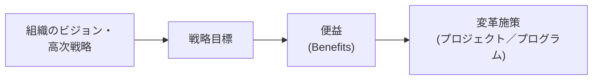

> 出典: [mop.wiki「Strategy Alignment」](https://mop.wiki/principles/strategy-alignment/)、[Lumify Work コース概要](https://www.lumifywork.com/en-au/courses/management-of-portfolios-mop-foundation/)

**ベストプラクティス**：ビジネスケースのテンプレートに「本施策が貢献する戦略目標」を必須記入欄として設けること。これにより「戦略との整合」の原則を、レビュー担当者の主観に頼らず機械的にチェック可能な仕組みへと落とし込めます。

### 4.4 ポートフォリオオフィス（Portfolio Office）

**目的**：ポートフォリオマネージャーが的確な意思決定を行うためには、最新かつ正確な情報を継続的に提供する専任のビジネス機能が必要です。この役割を担うのが「ポートフォリオオフィス」であり、物理的・仮想的な組織のいずれの形態も取り得ます。この原則はOGC（英国政府商務局）標準であるP3Oと強く結びついています。

**確立のポイント**：

- **組織構造上の適切な位置づけ**：C-level（経営層）に直接アクセスできる、C-levelの一段下程度の階層に置くことが望ましいとされます
- **適切なリーダーシップ**：ポートフォリオオフィスを率いる人材（ポートフォリオ・ディレクター）は、組織上層部と対等に議論でき、かつ現場のプロジェクト・プログラムマネジメントチームを導けるだけの知識・スキル・経験を持つ必要があります
- 要員は必ずしもフルタイムでなくてよく、組織の規模やアプローチに応じて柔軟に設計できます

> 出典: [mop.wiki「Portfolio Office」](https://mop.wiki/principles/portfolio-office/)、[Advantage Learning](http://www.advantagelearning.co.uk/news/mop-5-principles.html)

**ベストプラクティス**：ポートフォリオオフィスを、恒久的な機能（Permanent Portfolio Office）と、プログラム・プロジェクト単位で一時的に設置されるオフィス（temporary Programme/Project Office）、およびセンター・オブ・エクセレンス（Centre of Excellence）に機能分離するP3Oモデルを参考にすること。すべてを一つの巨大な恒久組織にまとめようとすると、組織変化への機敏さが失われます。

### 4.5 活力ある変革文化（Energised Change Culture）

**目的**：ポートフォリオの成功は、プロセスと同じくらい「人」に依存します。この原則は、ポートフォリオの定義・デリバリーに向けて一丸となって取り組むエンゲージされたチームの必要性を扱う、MoPの“ソフト面”です。

**達成のポイント**（詳細は次章「組織のエネルギー」を参照）：

- 上級管理層による継続的な発信と動機づけ
- 戦略目標から個人目標までの明確な紐づけ
- 従業員エンゲージメント戦略の展開
- 組織文化に見合った適切な公式度（フォーマリティ）の設定

> 出典: [mop.wiki「Energised Change Culture」](https://mop.wiki/principles/energised-change-culture/)、[Lumify Work](https://www.lumifywork.com/en-ph/offers/mop-foundation-and-practitioner-combo/)

**ベストプラクティス**：役割記述（role description）を、組織戦略 → ポートフォリオ → プログラム／プロジェクト → 個人の職務内容、という縦のラインで一貫させること。従業員が「自分の日々の仕事が、どの戦略目標にどうつながっているか」を説明できる状態を目指します。

---

## 5. 組織のエネルギーと活力ある変革文化

「組織のエネルギー（Organizational Energy）」とは、組織目標の達成に向けた、組織内のすべての個人の努力の集合体です。ここでいう「努力」は単なる作業量ではなく、チーム全体の感情・行動・認知面でのコミットメントの度合いを指します。

### 5.1 組織のエネルギーの4つの源泉（4つのC）

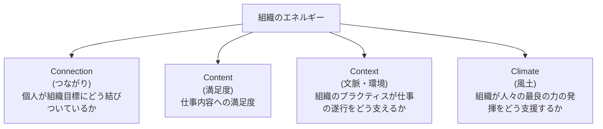

> 出典: [mop.wiki「Organizational Energy」](https://mop.wiki/management-cycles/organizational-energy/)

### 5.2 組織のエネルギーとポートフォリオマネジメントの関係

組織のエネルギーは、あらゆる組織的取り組みの成否を左右しますが、とりわけポートフォリオマネジメントの導入においては組織全体に影響が及ぶため、その重要性は一層高まります。生産的なエネルギー（productive energy）は、以下によって引き出すことができます。

- 上級管理層によるコミットメント・コミュニケーション・関与
- 従業員エンゲージメント
- 実効性のあるガバナンス
- 組織全体の成功への焦点化

MoP自体は組織のエネルギーを変化させる具体的技法までは規定していませんが、Heike BruchとBernd Vogelの著書『Fully Charged: How Great Leaders Boost Their Organization's Energy and Ignite High Performance』などが参考文献として挙げられています。

> 出典: [mop.wiki「Organizational Energy」](https://mop.wiki/management-cycles/organizational-energy/)

**ベストプラクティス**：同一組織内でも、チームによって「生産的エネルギー」を持つ部署と「消耗的エネルギー（corrosive energy）」を持つ部署が併存することがあります。ポートフォリオオフィスは、四半期レビューなどの定例の場で、単に進捗（KPI）だけでなくこの4つのCの観点からチームの状態を定性的にモニタリングすることが望ましいです。

---

## 6. ポートフォリオ定義サイクル（5つのプラクティス）

定義サイクルは、上級管理層が意思決定を行うために必要な情報を生成する段階であり、「ポートフォリオは組織を目指す場所へ導いてくれるか？」という問いに答えます。定義サイクルの最終的なアウトプットは**ポートフォリオ戦略**と**デリバリープラン**の2つです。

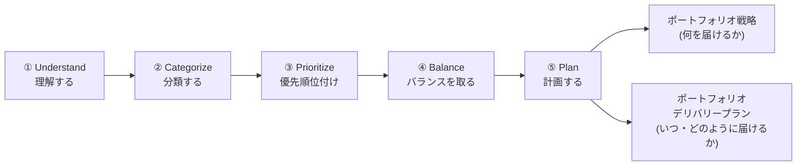

> 出典: [mop.wiki「Portfolio Definition Cycle」](https://mop.wiki/management-cycles/definition-cycle/)

### 6.1 Understand（理解する）

**目的**：組織の戦略計画と、ポートフォリオに含めるべきプロジェクト・プログラムとを結びつけるプラクティスです。ポートフォリオマネジメントと上級管理層との間の**双方向コミュニケーション**である点が重要です。

**実施内容**：

- 既存のポートフォリオ運用がある場合、ポートフォリオオフィスは既存プロジェクト・プログラムについて、計画されているビジネスインパクト、予測便益、コストと資源、集約リスク、これまでの実績を上級管理層へ提示します
- 上級管理層は、PESTLE分析（政治・経済・社会・技術・環境・法律）やSWOT分析、バランスト・スコアカード、VRIO分析、BCGマトリクスなどのツールを用いて事業環境をスキャンし、戦略を設計します
- 戦略策定プロセスはトップダウン型、ボトムアップ型、またはその両者を組み合わせたハイブリッド型のいずれかを取ります

**アウトプット**：①既進行中・パイプライン中を含む組織のプロジェクト・プログラムポートフォリオの明確な一覧、②現状と戦略的期待とのギャップ分析

> 出典: [mop.wiki「Understand」](https://mop.wiki/management-cycles/definition-cycle/practices/understand/)

**ベストプラクティス**：情報は「できるだけ専門用語を排し、高レベルな概要」にとどめること。詳細な計画・管理は個々のプロジェクト・プログラムマネジメントチームの責務であり、上級管理層に必要なのはマイルストーン、概算コスト、リスク、便益実現状況の全体像です。

### 6.2 Categorize（分類する）

**目的**：Understandで洗い出した施策の一覧を、あらかじめ定めた基準（カテゴリー）に分類します。組織の目標が複数ある場合（例：有機的成長60%・非有機的成長40%といった戦略配分）、それに対応するカテゴリー群を設計します。

**実施内容**：

- カテゴリーはリスクベース、投資基準ベースなど様々な切り口で設計可能で、MoPは一般的な汎用カテゴリーセットも提案しています
- 1つの施策が複数カテゴリーにまたがることもあり、その場合はポートフォリオマネジメントチームがどちらか一方、あるいは両方に位置づけるかを判断します
- **どのカテゴリーにも当てはまらない施策は、その存在意義自体を問い直す必要があります**

**アウトプット**：組織のプロジェクト・プログラムを、1つ以上の定義済みカテゴリーにタグ付けしたマップ

> 出典: [mop.wiki「Categorize」](https://mop.wiki/management-cycles/definition-cycle/practices/categorize/)

**ベストプラクティス**：カテゴリー設計を、上級管理層が設定した戦略目標の構造とできる限り一致させること。組織目標の構造とカテゴリーがずれていると、ポートフォリオオフィスから経営層への報告のたびに「翻訳作業」が発生し、意思決定の遅延と誤解の温床になります。

### 6.3 Prioritize（優先順位付け）

**目的**：ポートフォリオ内の施策に順位をつけることです。重要なのは、優先順位付けが同時に「劣後順位付け（de-prioritization）」でもある、という点です。ある施策に高い優先度を与えることは、他の施策の優先度を相対的に下げること、場合によっては中止することを意味します。

**技法（Techniques）**：

| 技法 | 概要 |
|---|---|
| 単一基準分析（Single-criterion Analysis, SCA） | NPV・IRR・回収期間などの財務指標や、顧客インパクトなど単一の基準で評価する手法。シンプルだが「組織の存在意義が金銭のみ」という前提に陥りやすく、実務では非現実的なことが多い |
| 多基準分析（Multi-criteria Analysis, MCA） | 複数の基準それぞれにスコアを割り当て、各施策のインパクトを評価・合算する手法。組織・業界のニーズを反映した基準設計が求められる |
| 三点見積り・リファレンスクラス予測（Three-point Estimating & Reference Class Forecasting） | 楽観値・悲観値・最頻値の3点見積りや、過去の類似実績（リファレンスクラス）に基づく予測により、見積りの精度とバイアス補正を高める技法 |
| ドライバーベース戦略貢献度分析（Driver-based Strategic Contribution Analysis） | 高次戦略から戦略目標・便益・施策へとブレークダウンする「ドライバーモデル」（4.3節参照）を用いて、各施策の戦略貢献度を評価する技法 |
| ディシジョン・カンファレンシング（Decision Conferencing） | 主要な意思決定者を一堂に集め、ファシリテーターの進行のもとで各施策を協働評価し、合意形成を図るワークショップ形式の技法 |
| クリア・ライン・オブ・サイト（Clear Line of Sight） | 戦略目標から個々の施策までの因果関係を明瞭に可視化し、優先順位の妥当性を関係者が直感的に理解できるようにする考え方 |

**アウトプット**：優先順位付けされた変革施策の一覧

> 出典: [mop.wiki「Prioritize」](https://mop.wiki/management-cycles/definition-cycle/practices/prioritize/)、[QA「MoP Foundation and Practitioner」コース概要](https://www.qa.com/course-catalogue/courses/management-of-portfolios-mop-foundation-and-practitioner-pbpmopfp/)

**ベストプラクティス**：優先順位付けの基準は、ポートフォリオが複数のセグメントやサブポートフォリオに分かれている場合、セグメントごとに異なる基準を設定してもよいとされています。全社一律の単一基準に固執しないこと。

### 6.4 Balance（バランスを取る）

**目的**：優先順位付けの結果、似たタイプの施策ばかりが上位を占め、偏った（unbalanced）ポートフォリオになることがあります。バランシングは、施策群を最適な形に組み替え、組織全体として最良のアウトプットが得られるようにするプラクティスです。

**実施内容**：

- バランシングは必ず優先順位付けの**後**に行います
- リスクと報酬（reward）のような2軸のグラフでポートフォリオを可視化し、偏りを把握することが有効です
- 手作業での定性評価、ポートフォリオガバナンス機関による全体アセスメント、大規模組織ではアルゴリズムによる定量評価など、様々な方法が取られます

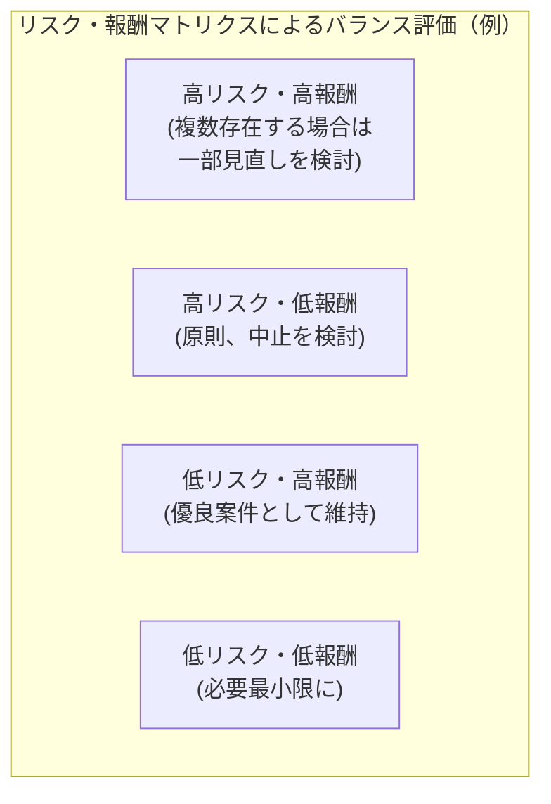

**アウトプット**：選定したバランシング基準に照らしてバランスの取れたポートフォリオ。可視化（グラフ表現）、ガバナンス機関の関与、客観的手法（アルゴリズム等）の活用が良い実践とされ、バランシングの結果を誰か（特に経営層）が独断で覆すべきではなく、ポートフォリオオフィスによる承認（サインオフ）を経ることが望ましいとされます。

> 出典: [mop.wiki「Balance」](https://mop.wiki/management-cycles/definition-cycle/practices/balance/)

**ベストプラクティス**：「高リスク・高報酬」案件が同時に何件もプライオリティ上位に並ぶ場合、それらを一斉に実行するのではなく、一部を後続タイムラインへずらす、あるいは中止するという判断を、バランシングの段階で行うこと。優先順位付けの結果をそのまま鵜呑みにしないことが肝要です。

### 6.5 Plan（計画する）

**目的**：定義サイクルの最終プラクティスであり、それまでの4つのプラクティスで得られた情報を統合します。

**実施内容**：

- 2つの主要アウトプットである**ポートフォリオ戦略**と**デリバリープラン**を作成し、上級管理層（正確には委任された責任を持つポートフォリオ・ディレクション・グループ）の承認を得ます
- 提示内容には、①ポートフォリオが事業戦略とどう整合し、どう戦略達成を後押しするかを示すポートフォリオ戦略、②マイルストーン・予算・期待便益・リスク概要を含む、全ステークホルダーに明快な概要、③進捗モニタリングとレビューのためのベースライン、が含まれます

**アウトプット**：

- **ポートフォリオ戦略**：ポートフォリオが「何を」届けるかを示す
- **ポートフォリオ・デリバリープラン**：「いつ・どのように」届けるかを示す、より詳細な文書

ポートフォリオ戦略とデリバリープランは、一度作成して終わりの静的文書ではなく「生きた文書」です。組織の戦略レビュー（多くは四半期ごと、場合によっては年次）に合わせて定期的に見直され、事業環境の急変などに応じた臨時レビューも行われます。

> 出典: [mop.wiki「Plan」](https://mop.wiki/management-cycles/definition-cycle/practices/plan/)

**ベストプラクティス**：ポートフォリオ戦略とデリバリープランの改訂サイクルを、組織の全社戦略レビューサイクルと明示的に同期させること。ポートフォリオ側だけが独自のレビュー頻度を持つと、戦略変更への追随が遅れます。

### 6.6 定義サイクルを適切に運用する意義

定義サイクルが不十分だと、以下のような問題が起こります。

- ポートフォリオが組織戦略を反映しなくなる
- 戦略的に重要な施策が見過ごされ、表面的に重要に見える施策に不当な優先度が与えられる
- 上級管理層の「お気に入り案件」が優先されてしまう
- 戦略的に重要な施策への資金が不足する一方、誤った施策に資金が流れる
- プロジェクトのアウトプットがBAUで十分活用されず、便益実現が不十分になる

定義サイクルは一度きりの立ち上げ作業ではなく、上級管理層からの継続的な関与を必要とします。ポートフォリオマネージャーと上級管理層の定期的なレビュー会議が不可欠です。

> 出典: [mop.wiki「Portfolio Definition Cycle」](https://mop.wiki/management-cycles/definition-cycle/)

---

## 7. ポートフォリオ・デリバリーサイクル（7つのプラクティス）

デリバリーサイクルは、ポートフォリオ戦略とデリバリープランに基づいて選定された施策を実際に実行に移す段階です。個々のプロジェクト・プログラム内部のリスクや資源は各プロジェクト・プログラムチームが管理しますが、ポートフォリオレベルでは**集約された（aggregate）**視点でこれらを評価・管理します。7つのプラクティスは基本的に並行して進行します。

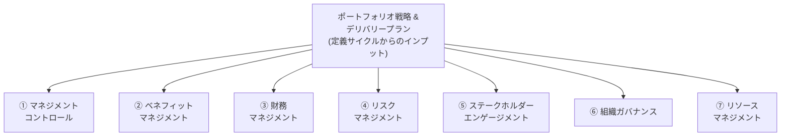

デリバリーサイクルが不十分だと、以下のような問題が起こります。

- 施策が期限・予算どおりに実現しない
- 施策間の論理的依存関係により遅延が連鎖する
- リソース活用が最適化されない
- ビジネス環境の変化にポートフォリオ自体が追随できない
- ポートフォリオが戦略に最適な形で貢献できない

> 出典: [mop.wiki「Portfolio Delivery Cycle」](https://mop.wiki/management-cycles/delivery-cycle/)

### 7.1 マネジメントコントロール（Management Control）

**目的**：ポートフォリオ戦略とデリバリープランという2つの主要アウトプットが確実に遵守され、ポートフォリオが戦略と整合し続けるようにするプラクティスです。プロジェクト・プログラムのデリバリー活動と、ポートフォリオマネジメントの期待とのギャップを埋める役割を担います。

**5つの活動要素**：

1. **明確化されたプロセス**：プロジェクト開始時点で正しいオプションが選ばれ、正しい便益が得られる仕組み、および意思決定の権限を超えた際のエスカレーションプロセスを整備すること
2. **ガイダンスとテンプレート**：特に重要な2つの成果物である「ビジネスケース」と「ベネフィット実現計画」については、標準テンプレートとガイダンスを整備すること。加えてプロジェクト開始文書、実行可能性調査、投資評価などのテンプレートやツールも提供します
3. **定期的な進捗報告**：ポートフォリオレベルでのレビューの対象読者は、組織の上級管理層です
4. **ポートフォリオレベルのレビュー**：適切に設計されたレポーティングは、レビューの必要回数を減らせます。目安として四半期または半年ごとのレビュー頻度が一般的に十分とされます（年次レビューでも許容されます）
5. **ステージゲート**：プロジェクト・プログラムは継続的なビジネス上の正当性（continued business justification）を持ち続けなければならず、それを定期的に検証するチェックポイントがステージゲートです。ポートフォリオレベルのレビューとは別物である点に注意してください

**成功の鍵**：ライフサイクルを通じた定期的なステージレビュー、定期的な進捗報告、戦略と整合したレビュー、明確化されたプロセスと統一されたテンプレート・ガイダンス。

> 出典: [mop.wiki「Management Control」](https://mop.wiki/management-cycles/delivery-cycle/practices/management-control/)

**ベストプラクティス**：「ポートフォリオレベルのレビュー」と「ステージゲート」を混同しないこと。前者はポートフォリオ全体の戦略整合性を扱う経営層向けの場、後者は個々のプロジェクト・プログラムの継続妥当性を判定する現場寄りの関門であり、両者は目的も参加者も異なります。

### 7.2 ベネフィットマネジメント（Benefits Management）

**目的**：すべての変革施策は便益を生み出すために実施されます。プロジェクト・プログラムから実現される便益が、組織戦略の達成に貢献します。このプラクティスは個々の施策単位の便益ではなく、ポートフォリオ全体としての便益を扱う点が特徴です。

**実施内容**：

- **便益の適格ルールと分類基準の策定**：すべてのプロジェクト・プログラムで同一の基準を用いて便益を分類し、ポートフォリオオフィスが統合してポートフォリオレベルの視点を提供できるようにします
- **ポートフォリオレベルのベネフィット実現計画の作成**：各プロジェクト・プログラムの便益実現計画を単純に足し合わせるのではなく、将来の計画期間に向けた便益予測として統合します
- **便益の予測**：過去の実績データに基づく**リファレンスクラス予測**を活用します
- **各ステージでのレビュー**：蓄積された便益および将来便益を定期的にレビューし、戦略目標との整合を確認します。これは経営層との場でもあり、コミットメントを再確認する機会にもなります
- **報告と追跡**：一貫した仕組みで便益を追跡・報告し、ステークホルダーに「一つの真実（one version of the truth）」を提供する、計画されたルートとスケジュールを維持することが重要です

**成功の鍵**：リファレンスクラス予測により、過去の類似実績から便益を精度高く見積もれること。報告に際しては、あらかじめ定めたルートとスケジュールを守り、単一の情報源からの一貫した内容をステークホルダーに届けること。

> 出典: [mop.wiki「Benefits Management」](https://mop.wiki/management-cycles/delivery-cycle/practices/benefits-management/)

### 7.3 財務マネジメント（Financial Management）

**目的**：組織のパフォーマンスを測る最も重要な指標は、非営利組織であっても常に財務です。ポートフォリオマネジメントを組織の財務管理プロセスと整合させることが不可欠です。このプラクティスは個々の施策の財務ではなく、ポートフォリオ全体の財務を扱います。

**実施内容**：

- **適切な指標の選定**：NPV（正味現在価値）、IRR（内部収益率）、損益分岐点などが投資判断でよく用いられる指標です。財務部門と上級管理層が、組織のビジネスモデルに最適な指標を選定します
- **資金の段階的リリース**：資金はプロジェクト開始時に一括で渡されることは稀で、プロジェクト・プログラムの進捗に応じて段階的にリリースされます。これはポートフォリオ全体の財務計画を必要とする理由でもあります
- **財務コンティンジェンシーとモニタリング**：予期せぬリスクの影響を緩和するための財務コンティンジェンシー計画を、プロジェクト・プログラムレベルだけでなくポートフォリオレベルでも持つこと。ポートフォリオレベルでの支出モニタリングは、戦略目標達成コストの重要な指標になります

**成功の鍵**：NPVは将来のコストと便益を現在の貨幣価値に換算した指標であり、貨幣価値が時間とともに目減りすることを考慮した財務便益評価に広く使われます。段階的資金リリースは、プロジェクトのマイルストーンやゲートと連動させることで資金の最適活用につながります。

> 出典: [mop.wiki「Financial Management」](https://mop.wiki/management-cycles/delivery-cycle/practices/financial-management/)

### 7.4 リスクマネジメント（Risk Management）

**目的**：リスクとは、起こるかもしれないし起こらないかもしれない予期せぬ事象です。リスクはプロジェクト・プログラム・ポートフォリオのいずれのレベルでも発生しえます。このプラクティスは個々の施策のリスクではなく、ポートフォリオ全体の**集約リスク（aggregate risk）**を扱います。

**実施内容**：

- **組織のリスクマネジメントとの整合**：組織に既存のリスク管理方針・実務がある場合、ポートフォリオマネジメントはそれと密接に連携し、重複や矛盾を避けること
- **プロジェクト・プログラム間の相互依存関係の管理**：ある施策のリスク軽減策が、別の施策に影響を及ぼす「リスクシフティング」の抑制。また、あるプロジェクトが別プロジェクトの成果物を待つ論理的依存関係（dependency）の管理
- **財務コンティンジェンシーの維持**：組織のリスク許容度（risk appetite）も考慮した、ポートフォリオ独自の財務コンティンジェンシー予算の確保
- **優先順位付けプロセスへのリスクの組み込み**：多基準分析における評価軸の一つとしてリスクを組み込み、財務リターンとリスク管理の労力とのバランスを検討すること
- **組織へのポートフォリオリスクの影響検討**：ポートフォリオが生み出すリスクが組織全体に与える影響をモニタリング・管理すること

**成功の鍵**：プロジェクト・プログラム間の相互依存関係の管理、十分なポートフォリオレベルの財務コンティンジェンシーの維持、リターンと並んでリスクを優先順位付けに組み込むことが主要な要素です。

> 出典: [mop.wiki「Risk Management」](https://mop.wiki/management-cycles/delivery-cycle/practices/risk-management/)

### 7.5 ステークホルダーエンゲージメント（Stakeholder Engagement）

**目的**：内部・外部を問わず、すべてのステークホルダーはポートフォリオオフィスの「顧客」です。エンゲージメントとは単に情報提供や指示に従わせることではなく、ステークホルダーの関心と影響力を組織目標の達成のために活用することを意味します。ポートフォリオのステークホルダーは多くの場合、上級で影響力のある人物であり、その期待値マネジメントは容易ではありません。

**実施内容**：

- **共有ビジョンの形成**：各上級リーダーが異なるビジョンを持ちがちな中で、共通のビジョンを形成すること
- **経営層による支持の獲得**：ポートフォリオに関するコミュニケーション活動への経営層の支持を得ること
- **影響度・関心度マトリクスの構築**：ステークホルダーを影響力と関心度の2軸で整理し、関与の優先順位を設計すること
- **ステークホルダーごとのエンゲージメント戦略構築**：個別のニーズ・嗜好に合わせたアプローチを設計すること
- **チャンピオン・チャレンジャーモデルの活用**：現行の推進者（チャンピオン）よりも優れたアイデアを持つ関係者（チャレンジャー）が現れた場合、その人物を新たなチャンピオンとして前向きに位置づける手法

**成功の鍵**：共有ビジョンの形成、経営層の支持獲得、影響度・関心度マトリクスの構築、ステークホルダーごとの個別戦略、チャンピオン・チャレンジャーモデルの活用。これらはポートフォリオ・デリバリープランの中核をなす要素です。

> 出典: [mop.wiki「Stakeholder Engagement」](https://mop.wiki/management-cycles/delivery-cycle/practices/stakeholder-engagement/)

### 7.6 組織ガバナンス（Organizational Governance）

**目的**：組織ガバナンスとは、組織がその目的を追求する上で意思決定を行い、実行する仕組みのことです。上級管理層のような内部関係者だけでなく、規制当局・政府（法規制を通じて）・圧力団体・証券取引所などの外部関係者からも影響を受けます。ポートフォリオマネジメントを組織構造と整合させることで、内外のコンプライアンス要件を満たし、組織の実務と効果的に整合させます。

**実施内容**：

- **ビジョンの整合**：ポートフォリオのビジョンと組織のビジョンを整合させ、上級管理層のサインオフを得ること。もし戦略目標が組織ビジョンと整合していなければ、まずその問題自体に対処する必要があります
- **ポートフォリオの成功基準とステージゲート**：計画通りに進んでいるかを評価する成功基準（メトリクス）を、組織横断で普遍的に使える指標は存在しないため、組織のリーダーシップと協働で設計すること。定期的なステージゲートで評価を実施します（マネジメントコントロールの成功にも直結します）
- **役割記述**：職務記述書と同様、個人やグループがポートフォリオマネジメントにおいて何を期待されているかを明文化すること

> 出典: [mop.wiki「Organizational Governance」](https://mop.wiki/management-cycles/delivery-cycle/practices/organizational-governance/)

**ベストプラクティス**：組織ガバナンスの整備は「4.2 ガバナンスの整合」の原則をデリバリーサイクルの日々の運用に落とし込む実装部分にあたります。原則レベルの整合が取れていても、役割記述やステージゲートといった具体的な仕組みが伴わなければ、実務では形骸化しがちです。

### 7.7 リソースマネジメント（Resource Management）

**目的**：ポートフォリオオフィスの最も重要な役割の一つが、リソースの効率的な管理です。優先度の高いプロジェクトに優れたリソースを配分しつつ、他の関係者の期待値もマネジメントするという、難しい判断が求められます。このプラクティスも個々の施策内部のリソース管理ではなく、ポートフォリオ全体のリソースを扱います。

**実施内容**：

- リソース（人員・技術・その他資産）は現実の組織では常に制約があり、過剰なリソース保有は非効率を招きます。効率性は組織の存続そのものにも関わる重要課題です
- 理想的には適材適所ですが、現実にはそうもいかないため、希少なリソースは最も戦略的に整合した施策へ優先配分されるべきです
- プロジェクト間の相互依存関係にも配慮した配分が必要です

**成功の鍵**：ポートフォリオレベルでの資源のキャパシティと稼働可能量を把握し（ポートフォリオ・リソース・スケジュールとして文書化）、余剰・過小稼働・過剰稼働を可視化すること。

> 出典: [mop.wiki「Resource Management」](https://mop.wiki/management-cycles/delivery-cycle/practices/resource-management/)

---

## 8. 主要な役割（Key Roles）

MoPは、ポートフォリオの導入・継続運用を担う主要なステークホルダーグループとして、以下の役割を定義しています。

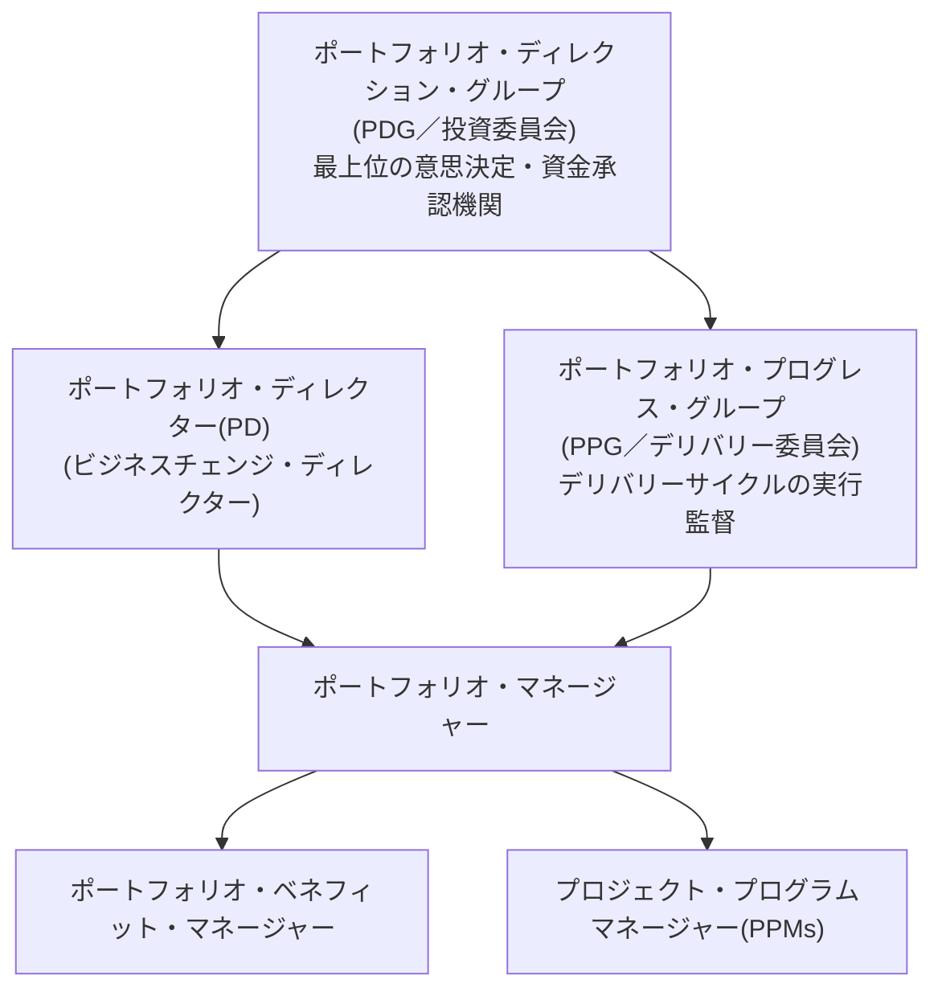

| 役割 | 主な責務 |
|---|---|
| ポートフォリオ・ディレクション・グループ（PDG） | ポートフォリオマネジメントの実務（フレームワークと定義サイクルのプロセス）を承認。ポートフォリオのバランス・実現可能性を確認しポートフォリオ戦略とデリバリープランを承認。資金提供と個々の施策の承認（中止判断を含む）。組織目標に照らした定期レビューと方向づけ。最上位のエスカレーション先として組織の最善の利益に沿った紛争解決を行う |
| ポートフォリオ・プログレス・グループ（PPG） | デリバリーサイクルの各プロセスが効果的に実行されることに責任を持つ。全体進捗のモニタリングと、便益実現を損ないかねない課題の解決。予算・便益・リスク・課題・前提・依存関係・リソースの積極的なマネジメント（必要に応じた予測を含む）。上級管理層・ステークホルダーへのポートフォリオレベルの通信を承認する |
| ポートフォリオ・ディレクター（PD） | 個人としてポートフォリオ全体に説明責任を持つ役割（「ビジネスチェンジ・ディレクター」とも呼ばれる） |
| ポートフォリオ・マネージャー | ポートフォリオ全体の計画・運営を担う実務責任者 |
| ポートフォリオ・ベネフィット・マネージャー | ポートフォリオレベルの便益の統合・追跡・報告を担う |
| プロジェクト・プログラムマネージャー（PPMs） | 個々の施策のデリバリーに責任を持ち、ポートフォリオマネジメントへ情報をインプットする |

> 出典: [mop.wiki「Key Portfolio Management Roles」](https://mop.wiki/key-roles/)

**ベストプラクティス**：PDG（投資委員会）とPPG（デリバリー委員会）を明確に分離すること。前者は「何を、どれだけの予算で、ポートフォリオに含めるか」という定義サイクル寄りの意思決定機関、後者は「含めた施策が計画通りに進んでいるか」というデリバリーサイクル寄りの監督機関であり、両者を一つの会議体に統合すると、戦略的意思決定と日々の進捗管理の議題が混在し、いずれの意思決定の質も低下しがちです。

---

## 9. 主要文書（Key Documents）

MoPフレームワークは、ポートフォリオマネジメントを実践する上で以下9つの主要文書を定義しています。

| 文書 | 目的・内容 |
|---|---|
| ポートフォリオ戦略（Portfolio Strategy） | ポートフォリオが「何を」届けるかを示す。ビジョン・ミッション・目的を含め、ポートフォリオがどこへ向かい、どう組織の戦略目標達成に寄与するかをステークホルダーが理解できるようにする |
| ポートフォリオ・デリバリープラン（Portfolio Delivery Plan） | ポートフォリオ戦略よりも詳細で、進捗モニタリングのベースラインとして機能する。いつ届けるか、マイルストーン、リスク、コスト、人員要件などの詳細を含む |
| ポートフォリオ・ベネフィット実現計画（Portfolio Benefits Realisation Plan） | ポートフォリオレベルでの便益実現の計画・追跡を担う文書 |
| ポートフォリオ・ダッシュボード（Portfolio Dashboard） | ポートフォリオの状況を一覧できる可視化ツール |
| ポートフォリオ・リソース・スケジュール（Portfolio Resource Schedule） | ポートフォリオ内の変革施策を支えるリソースのキャパシティと稼働可能量を規定。余剰・過小稼働・過剰稼働も含む |
| ポートフォリオ財務プラン（Portfolio Financial Plan） | ポートフォリオの予算を定め、支出追跡のベースラインとなる（実績値は含まない） |
| ポートフォリオマネジメント・フレームワーク（Portfolio Management Framework） | 組織のポートフォリオマネジメント実務とガバナンスのあり方について、ステークホルダーへの参照文書として機能する |
| ポートフォリオ・ベネフィットマネジメント・フレームワーク（Portfolio Benefits Management Framework） | ポートフォリオ内のすべての施策の便益を一貫した仕組みで管理するための枠組み |
| ポートフォリオ・ステークホルダーエンゲージメントプラン（Portfolio Stakeholder Engagement Plan） | ポートフォリオに関する一貫したステークホルダーエンゲージメントとコミュニケーションの枠組み |

> 出典: [mop.wiki「Key Portfolio Management Documents」](https://mop.wiki/key-documents/)、[Good e-Learning「What is MoP?」](https://goodelearning.com/articles/what-is-management-of-portfolios-mop/)

**ベストプラクティス**：これら9文書のうち、**ポートフォリオ戦略**と**ポートフォリオ・デリバリープラン**の2つが定義サイクルの直接のアウトプットであり、残り7文書はデリバリーサイクルの各プラクティスを運用するための実務文書という位置づけです。試験対策としては、どの文書がどちらのサイクルに紐づくかを整理して覚えておくと出題への対応力が上がります。

---

## 10. 導入・定着・成熟度評価

### 10.1 3つの実装アプローチ

プロジェクトやプログラムと異なり、ポートフォリオには明確な立ち上げ段階（イニシエーション）がありません。組織がプロジェクトをポートフォリオとして管理する重要性を認識した時点で、既に稼働中の施策とパイプライン中の施策を抱えた状態から導入が始まります。MoPは3つの導入アプローチを提示しています。

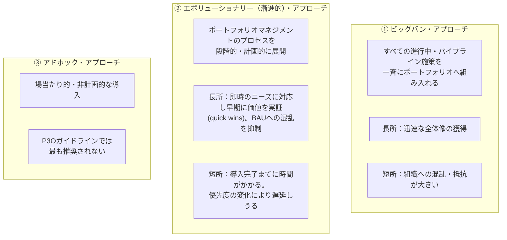

**P3O（Portfolio, Programme and Project Offices）ガイドラインは、ビッグバンともアドホックとも比較して、エボリューショナリー（漸進的）アプローチを最も有効な選択肢として推奨しています。** 漸進的アプローチは「両者の良いとこ取り」とされ、組織への急激な混乱を避けつつ、可視化された便益によって早期にポートフォリオマネジメントの価値を証明できます。導入を遅延させないためには、周到な計画と規律ある実行が鍵となります。不安定で戦略が流動的な環境では、この漸進的アプローチが最も適しているとされます。

> 出典: [mop.wiki「Implementing Portfolio Management」](https://mop.wiki/implementing-portfolio-management/)

### 10.2 定着（Sustaining）のための要因

導入後、ポートフォリオマネジメントの取り組みを組織に定着させ、進捗を維持するための代表的な要因には以下が挙げられます。

- 最上位レベルでの焦点維持とポートフォリオ視点の継続的な推進を担う、上級レベルのスポンサーの存在
- 最も必要性の高い領域から着手し、「クイックウィン」によって早期に価値を実証する、段階的・漸進的なアプローチの継続

> 出典: [House of PMO「MoP Foundationコース詳解」](https://training.houseofpmo.com/pmolearning-blog/p3o/pmo-course-deep-dive-mop-foundation/)

### 10.3 成熟度評価：P3M3（Portfolio, Programme and Project Management Maturity Model）

MoP Foundationでは、導入したポートフォリオマネジメントの成熟度を評価する枠組みとして、AXELOSが開発した**P3M3**にも言及します。P3M3はポートフォリオ（PfM3）・プログラム（PgM3）・プロジェクト（PjM3）の3つのサブモデルから構成され、いずれも5段階の成熟度レベルで評価されます。

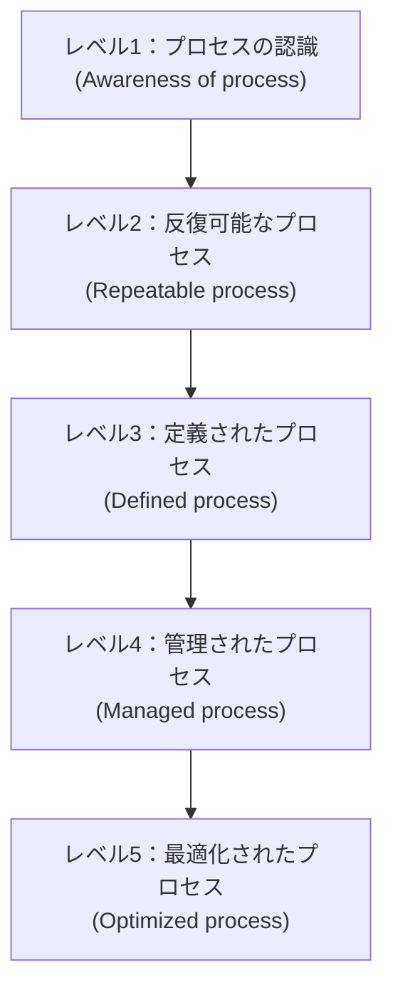

各成熟度レベルは、以下**7つのプロセス・パースペクティブ**（＝ポートフォリオ・デリバリーサイクルの7プラクティスと同一の枠組み）で評価されます。

1. マネジメントコントロール
2. ベネフィットマネジメント
3. 財務マネジメント
4. ステークホルダーエンゲージメント
5. リスクマネジメント
6. 組織ガバナンス
7. リソースマネジメント

> 出典: [AXELOS「P3M3 Overview」](https://eu-assets.contentstack.com/v3/assets/blt637b065823946b12/blt6582c2653720d239/620b6e06e413e76824f96dda/P3M3-Overview.pdf)、[Van Haren Publishing「P3M3 in 3 minutes」](https://www.vanharen.net/standards/p3m3/p3m3-portfolio-programme-and-project-management-maturity-model-in-3-minutes/)

**ベストプラクティス**：P3M3の7パースペクティブが、デリバリーサイクルの7プラクティスとほぼ1対1で対応していることに注目すると、両者を別々に暗記する必要がなくなります。「デリバリーサイクルの各プラクティスを、どれだけ成熟したレベルで実行できているか」を測る物差しがP3M3である、と理解するのが最も効率的です。

---

## 11. プラクティス別ベストプラクティス早見表

| サイクル | プラクティス | 一言でいうと | 陥りやすい失敗 | ベストプラクティス |
|---|---|---|---|---|
| 定義 | Understand | 現状把握と戦略のインプット | 詳細に踏み込みすぎて経営層への説明が重くなる | 高レベル・低専門用語での可視化に徹する |
| 定義 | Categorize | 施策の分類 | カテゴリーが組織目標の構造とズレる | 戦略目標の構造とカテゴリー設計を一致させる |
| 定義 | Prioritize | 優先順位（＝劣後順位）付け | 単一の財務指標だけで判断する | 多基準分析＋クリア・ライン・オブ・サイトで納得感を担保する |
| 定義 | Balance | 偏りの是正 | 優先順位の結果をそのまま実行に移す | リスク・報酬マトリクス等で可視化し、ガバナンス機関がサインオフする |
| 定義 | Plan | 戦略・プランの確定 | 一度作って放置する | 全社戦略レビューサイクルと同期して定期改訂する |
| デリバリー | マネジメントコントロール | 計画遵守の仕組み化 | ポートフォリオレビューとステージゲートを混同する | 両者の対象・目的・参加者を明確に切り分ける |
| デリバリー | ベネフィットマネジメント | 便益の統合管理 | 各施策の便益を単純合算する | リファレンスクラス予測で統合的に予測する |
| デリバリー | 財務マネジメント | 資金の統制 | 資金を一括でリリースする | マイルストーン・ゲート連動の段階的リリースを行う |
| デリバリー | リスクマネジメント | 集約リスクの統制 | 個別プロジェクトのリスクだけを見る | リスクシフティングと依存関係を横断的に管理する |
| デリバリー | ステークホルダーエンゲージメント | 関係者の巻き込み | 一方的な情報提供にとどまる | 影響度・関心度マトリクスとチャンピオン・チャレンジャーモデルを活用する |
| デリバリー | 組織ガバナンス | 内外統制との整合 | 原則レベルの整合で満足する | 役割記述・成功基準・ステージゲートに具体化する |
| デリバリー | リソースマネジメント | 資源の最適配分 | 早い者勝ちで資源を配分する | 戦略的整合度の高い施策へ希少資源を優先配分する |

---

## 12. 関連フレームワークとの関係

MoP（PRINCE2 Portfolio Management）は、単独で使われるだけでなく、他のAXELOS／PeopleCertのベストプラクティスフレームワークと連携して用いられるよう設計されています。

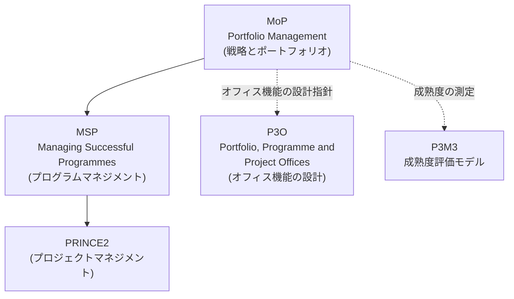

- **PRINCE2**：個々のプロジェクトマネジメント手法。ポートフォリオ内の各プロジェクトが実行段階で用いる
- **MSP（Managing Successful Programmes）**：複数の関連プロジェクトを束ねるプログラムマネジメント手法
- **P3O**：ポートフォリオオフィス・プログラムオフィス・プロジェクトオフィスの設計・運営に関するガイダンス。MoPの「ポートフォリオオフィス」原則と直結します
- **P3M3**：これら3階層（ポートフォリオ・プログラム・プロジェクト）の管理成熟度を測定するモデル

> 出典: [AbeBooks「Management of Portfolios (MoP)」書誌情報](https://www.abebooks.co.uk/9780113312948/Management-Portfolios-MoP-AXELOS-0113312946/plp)、[Good e-Learning「What is MoP?」](https://goodelearning.com/articles/what-is-management-of-portfolios-mop/)

---

## 13. 試験対策のポイント

MoP Foundation試験（50問・40分・多肢択一・クローズドブック・合格ライン50%）に向けた学習の勘所を整理します。

1. **5原則・5定義プラクティス・7デリバリープラクティスの名称と順序を正確に**：特に定義サイクルの5プラクティス（Understand → Categorize → Prioritize → Balance → Plan）は逐次的な順序自体が問われやすいポイントです
2. **「誰が」「何を」承認するかを役割ごとに区別する**：PDG（投資委員会）とPPG（デリバリー委員会）の役割の違いは頻出論点です
3. **9つの主要文書を、定義サイクル由来（2つ）とデリバリーサイクル運用由来（7つ)に分類して覚える**
4. **各プラクティスが「個別施策」ではなく「ポートフォリオ全体（集約）」を扱う、という視点の違いを意識する**：リスクマネジメント・財務マネジメント・リソースマネジメントはいずれも、個々のプロジェクトの管理ではなく、ポートフォリオレベルでの統合的視点であることが繰り返し強調されます
5. **3つの実装アプローチのうち、推奨されるのはエボリューショナリー・アプローチであることを押さえる**
6. **P3M3の7パースペクティブ＝デリバリーサイクルの7プラクティスという対応関係を理解しておく**
7. **技法（テクニック）は、それがどのプラクティスに属するかとセットで覚える**：例えば、三点見積り・リファレンスクラス予測、ドライバーベース戦略貢献度分析、多基準分析、ディシジョン・カンファレンシング、クリア・ライン・オブ・サイトはいずれも定義サイクル（主にUnderstand・Prioritize）に関連する技法です

> 出典: [PeopleCert公式ページ（試験形式）](https://www.peoplecert.org/browse-certifications/project-programme-and-portfolio-management/MoP-4/mop-foundation-2644)、[QA「MoP Foundation and Practitioner」コース概要（技法一覧）](https://www.qa.com/course-catalogue/courses/management-of-portfolios-mop-foundation-and-practitioner-pbpmopfp/)

---

## 14. 参考文献・ソース一覧

- PeopleCert公式 MoP Foundation商品ページ（試験概要・学習アウトカム）：
  https://www.peoplecert.org/browse-certifications/project-programme-and-portfolio-management/MoP-4/mop-foundation-2644
- AXELOS公式 MoP認定ページ：
  https://www.axelos.com/certifications/propath/mop-portfolio-management
- mop.wiki（認定トレーナーによる独立系解説サイト。AXELOSガイドラインに準拠するが非公式）：
  - トップページ：https://mop.wiki/
  - 5つの原則：https://mop.wiki/principles/
    - 上級管理層のコミットメント：https://mop.wiki/principles/senior-management-commitment/
    - ガバナンスの整合：https://mop.wiki/principles/governance-alignment/
    - 戦略との整合：https://mop.wiki/principles/strategy-alignment/
    - ポートフォリオオフィス：https://mop.wiki/principles/portfolio-office/
    - 活力ある変革文化：https://mop.wiki/principles/energised-change-culture/
  - 管理サイクル：https://mop.wiki/management-cycles/
    - 組織のエネルギー：https://mop.wiki/management-cycles/organizational-energy/
    - ポートフォリオ定義サイクル：https://mop.wiki/management-cycles/definition-cycle/
      - Understand：https://mop.wiki/management-cycles/definition-cycle/practices/understand/
      - Categorize：https://mop.wiki/management-cycles/definition-cycle/practices/categorize/
      - Prioritize：https://mop.wiki/management-cycles/definition-cycle/practices/prioritize/
      - Balance：https://mop.wiki/management-cycles/definition-cycle/practices/balance/
      - Plan：https://mop.wiki/management-cycles/definition-cycle/practices/plan/
    - ポートフォリオ・デリバリーサイクル：https://mop.wiki/management-cycles/delivery-cycle/
      - マネジメントコントロール：https://mop.wiki/management-cycles/delivery-cycle/practices/management-control/
      - ベネフィットマネジメント：https://mop.wiki/management-cycles/delivery-cycle/practices/benefits-management/
      - 財務マネジメント：https://mop.wiki/management-cycles/delivery-cycle/practices/financial-management/
      - リスクマネジメント：https://mop.wiki/management-cycles/delivery-cycle/practices/risk-management/
      - ステークホルダーエンゲージメント：https://mop.wiki/management-cycles/delivery-cycle/practices/stakeholder-engagement/
      - 組織ガバナンス：https://mop.wiki/management-cycles/delivery-cycle/practices/organizational-governance/
      - リソースマネジメント：https://mop.wiki/management-cycles/delivery-cycle/practices/resource-management/
  - 主要な役割：https://mop.wiki/key-roles/
  - 主要文書：https://mop.wiki/key-documents/
  - 導入アプローチ：https://mop.wiki/implementing-portfolio-management/
- AXELOS公式 P3M3 Overview（PDF）：
  https://eu-assets.contentstack.com/v3/assets/blt637b065823946b12/blt6582c2653720d239/620b6e06e413e76824f96dda/P3M3-Overview.pdf
- Van Haren Publishing「P3M3 in 3 minutes」：
  https://www.vanharen.net/standards/p3m3/p3m3-portfolio-programme-and-project-management-maturity-model-in-3-minutes/
- Van Haren Publishing「MoP in 3 minutes」：
  https://archive.vanharen.net/blog/mop-management-of-portfolios-in-3-minutes
- Good e-Learning「What is Management of Portfolios (MoP)?」：
  https://goodelearning.com/articles/what-is-management-of-portfolios-mop/
- QA「Management of Portfolios MoP Foundation and Practitioner」コース概要（技法・モジュール構成）：
  https://www.qa.com/course-catalogue/courses/management-of-portfolios-mop-foundation-and-practitioner-pbpmopfp/
- Lumify Work「MoP Foundation」コース概要（原則の解説）：
  https://www.lumifywork.com/en-au/courses/management-of-portfolios-mop-foundation/
- Advantage Learning「5 Principles of Portfolio Management in MoP」：
  http://www.advantagelearning.co.uk/news/mop-5-principles.html
- House of PMO「MoP Foundationコース詳解」（実装・定着）：
  https://training.houseofpmo.com/pmolearning-blog/p3o/pmo-course-deep-dive-mop-foundation/
- AbeBooks「Management of Portfolios (MoP)」書誌情報（フレームワーク解説）：
  https://www.abebooks.co.uk/9780113312948/Management-Portfolios-MoP-AXELOS-0113312946/plp

---

*本ガイドはMoP Foundation（PRINCE2 Portfolio Management Foundation）の学習支援を目的として作成された非公式の教材です。試験の正式な出題範囲・シラバスは、必ずPeopleCert公式サイトおよび公式eBook／Learning Resource Kitでご確認ください。「MoP」はAXELOS Limitedの登録商標です。*
