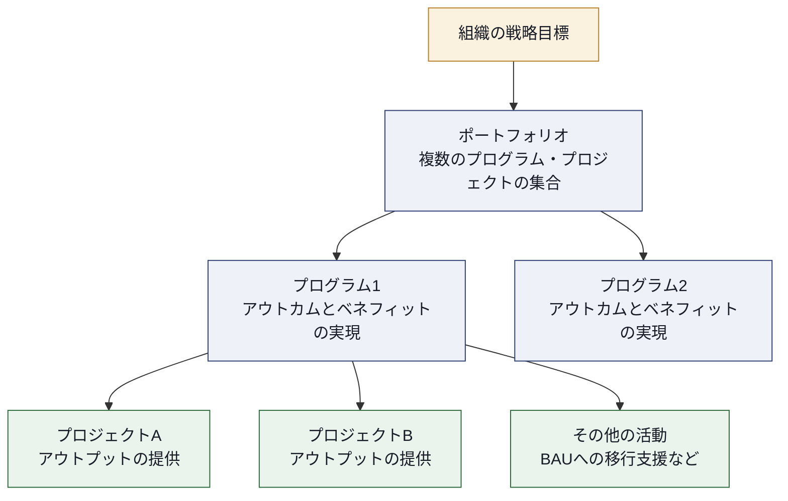
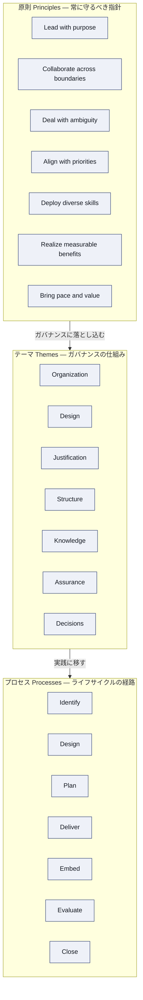
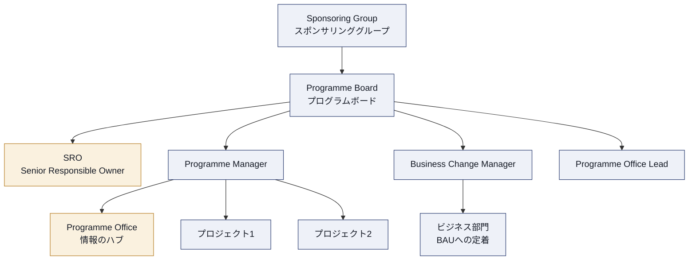
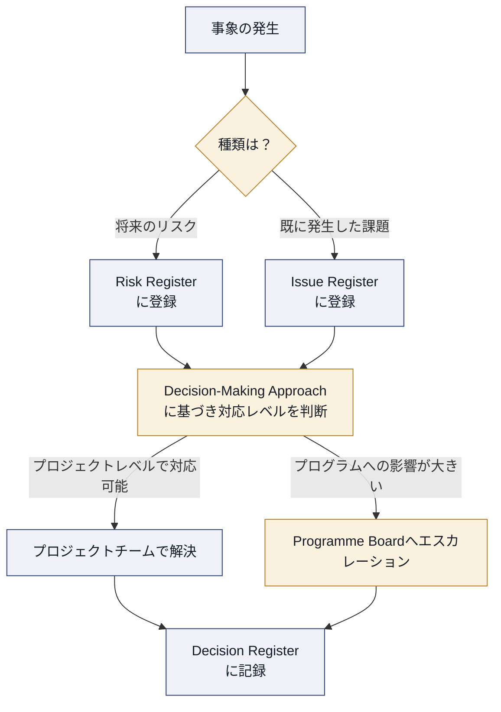
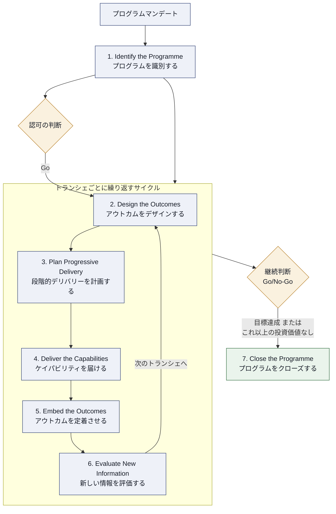
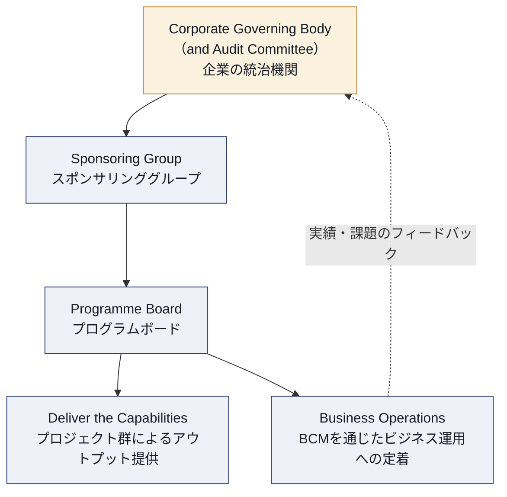
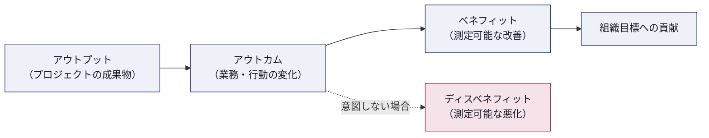
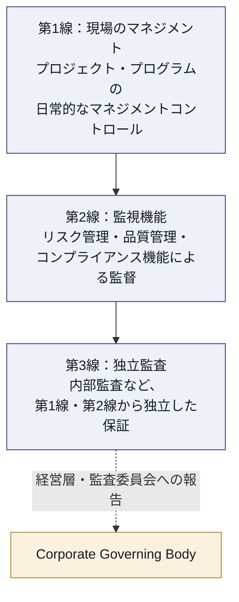

# MSP Foundation, 5th edition 完全学習ガイド
### Managing Successful Programmes(プログラムマネジメント）― 初学者向け・出題範囲対応版

> 本ガイドは PeopleCert（旧 AXELOS）が提供する **MSP Foundation, 5th edition** 試験の出題範囲をベースに、初学者でも理解できるようステップバイステップで解説したものです。2024年夏、PeopleCert は MSP を「**PRINCE2 Programme Management（Version 5）**」としてリブランディングしましたが、ガイダンスの内容自体に変更はなく、資格名・教材名は引き続き「MSP」「MSP 5th edition」が広く使われています。本ガイドでも従来通り「MSP」の呼称を用います。

---

## 目次

1. [はじめに ― MSPとは何か](#1-はじめに--mspとは何か)
2. [試験の全体像](#2-試験の全体像)
3. [プログラム・プロジェクト・ポートフォリオの違い](#3-プログラムプロジェクトポートフォリオの違い)
4. [MSPフレームワークの全体構造](#4-mspフレームワークの全体構造)
5. [7つの原則（Principles）](#5-7つの原則principles)
6. [7つのテーマ（Themes）](#6-7つのテーマthemes)
7. [プログラムライフサイクル：7つのプロセス](#7-プログラムライフサイクル7つのプロセス)
8. [ガバナンスと組織構造](#8-ガバナンスと組織構造)
9. [ベネフィット管理の実践](#9-ベネフィット管理の実践)
10. [リスク・課題・意思決定管理](#10-リスク課題意思決定管理)
11. [アシュアランスと三線防御モデル](#11-アシュアランスと三線防御モデル)
12. [テーラリング ― 組織・状況への適応](#12-テーラリング--組織状況への適応)
13. [テーマ・プロセス別ベストプラクティスチェックリスト](#13-テーマプロセス別ベストプラクティスチェックリスト)
14. [よくある落とし穴（アンチパターン）](#14-よくある落とし穴アンチパターン)
15. [用語集](#15-用語集)
16. [参考文献・ソース一覧](#16-参考文献ソース一覧)

---

## 1. はじめに ― MSPとは何か

**MSP（Managing Successful Programmes）** は、複数のプロジェクトや関連活動を束ねて組織の戦略的な目標を達成するための「プログラムマネジメント」のベストプラクティス・フレームワークです。PeopleCert（2021年に AXELOS を買収）が提供しており、PRINCE2 や MoP（Management of Portfolios）と同じファミリーに属する資格体系の一つです。

MSPが解決しようとしている課題は明確です。多くの組織変革プログラムは、次のような理由で失敗します。

- 個々のプロジェクトは順調に進んでいても、組織全体として期待した便益（ベネフィット）が得られない
- プロジェクト間の依存関係や優先順位の調整ができていない
- 経営層のスポンサーシップが弱く、変化への抵抗に対処できない
- 環境変化（市場・規制・技術）にプログラムが追従できない

MSP 5th edition（2020年公開）は、こうした失敗パターンに関する調査結果を踏まえ、デジタル変革の加速、アジャイルワークの普及、不確実性の増大に対応できるよう、2011年版から大幅に構造を見直したものです。

### 5th edition での主な変更点

| 観点 | 4th edition（2011年版） | 5th edition（2020年版） |
|---|---|---|
| テーマ数 | 9つの「ガバナンステーマ」 | 7つの「テーマ」（各テーマ名は単語1つで表現） |
| 原則数 | 7原則（一部異なる表現） | 7原則（新規に「境界を越えた協働」「曖昧さへの対処」を追加） |
| ブループリント | Blueprint | **Target Operating Model（TOM）** に改称し、内容を拡充 |
| プロセス数 | 6つのトランスフォーメーショナルフロー | **7つのプロセス**（Evaluate New Information が新設） |
| 適用の柔軟性 | 比較的固定的 | 4つの「プログラムの動機（ドライバー）」シナリオに基づくテーラリングを明示 |
| デリバリー方式 | ウォーターフォール前提が強い | アジャイル／ウォーターフォール／ハイブリッドを問わず適用可能な設計 |

> **ソース**：PeopleCert公式製品ページ（後掲）、Henny Portman氏によるMSP 5th/2011版比較記事、PM Today誌の解説記事を基に構成。

---

## 2. 試験の全体像

MSP Foundation, 5th edition の試験概要は以下の通りです（2026年9月時点、PeopleCert公式サイトの記載に基づく）。

| 項目 | 内容 |
|---|---|
| 問題数 | 60問 |
| 出題形式 | 四肢択一（Multiple choice） |
| 試験時間 | 60分 |
| 教材持ち込み | 不可（Closed book） |
| 合格基準 | 60%以上（60問中36問以上の正答） |
| 対応言語 | 英語・中国語 |
| 資格更新 | 3年ごと（CPDポイント 60点の取得、またはプロダクトスイート内の別資格取得により更新可能） |
| 前提資格 | なし（Foundationは誰でも受験可能） |
| 主な対象者 | プロジェクトマネージャー、シニアプロジェクトマネージャー、プログラムマネージャー、ポートフォリオマネージャー、ビジネスチェンジマネージャー、ベネフィットマネージャー、SRO、ビジネスアナリストなど |

出題の柱は次の3点に整理されます。

1. **原則（Principles）を状況に照らして理解しているか**
2. **テーマ（Themes）とその主要概念・関連文書を理解しているか**
3. **プロセス（Processes）＝プログラムライフサイクルの流れを理解しているか**

上位資格である MSP Practitioner では、これらを「実際の状況に適用・テーラリングできるか」まで問われますが、Foundationはあくまで知識理解が中心です。

> **ソース**：https://www.peoplecert.org/browse-certifications/project-programme-and-portfolio-management/MSP-6/msp-foundation-5th-edition-2930

---

## 3. プログラム・プロジェクト・ポートフォリオの違い

MSPを学ぶ最初のステップは、「プログラム」という言葉の定義を正確に理解することです。

- **プロジェクト（Project）**：合意されたビジネスケースに従って、1つまたは複数の「アウトプット（成果物）」を生み出すための一時的な組織。比較的短期間で完結する。
- **プログラム（Programme）**：関連する複数のプロジェクトやその他の活動を調整・指揮・監督するために作られた、一時的で柔軟な組織。組織の戦略目標に関連する「**アウトカム（結果）**」と「**ベネフィット（便益）**」を届けることを目的とし、多くの場合、数年にわたって存続する。
- **ポートフォリオ（Portfolio）**：組織（またはその一部）が投資対効果を最大化するために管理する、プログラムとプロジェクトの全体集合。

重要な違いは、**プロジェクトは「アウトプット」を扱い、プログラムは「アウトカムとベネフィット」を扱う**という点です。プログラムマネジメントとプロジェクトマネジメントは対立する概念ではなく、補完関係にあります。プログラムのライフサイクルの中で、複数のプロジェクトが立ち上げられ、実行され、クローズされていきます。

**ベストプラクティス**：組織でプログラムマネジメントを導入する際は、まず「これはプログラムとして扱うべき取り組みなのか、それとも単一の大規模プロジェクトで十分なのか」を見極めることが重要です。目安として、①複数のプロジェクトの調整が必要、②組織横断的な変革を伴う、③ベネフィットの実現に組織の業務プロセスや文化そのものの変化が必要、のいずれかに該当する場合はプログラムとして扱うべきとされています。

---

## 4. MSPフレームワークの全体構造

MSP 5th edition は、**7つの原則（Principles）・7つのテーマ（Themes）・7つのプロセス（Processes）** という3層構造で構成されています。

- **原則（Principles）**：プログラムマネジメントから価値を得るために、常に守り続けるべき「指針となる要請事項」。プログラムの識別からクローズまで一貫して適用される、最も普遍的なレイヤー。
- **テーマ（Themes）**：原則をガバナンスに落とし込む「本質的な側面」。組織構造・文書・役割など、統制のための仕組みを定義する。
- **プロセス（Processes）**：テーマを通じて原則を実践に移す「プログラムライフサイクルの経路」。時系列で具体的にどう進めるかを示す。

**関係性のポイント（試験頻出）**

- 原則は「なぜ」を示し、テーマは「何を」統制すべきかを示し、プロセスは「いつ・どう」実行するかを示す。
- 7つのテーマは、プログラムライフサイクルの各プロセスの中で**繰り返し適用**される（一度定義して終わりではない）。
- 「7・7・7」という数字の組み合わせは頻出の記憶ポイントである。

---

## 5. 7つの原則（Principles）

原則は、プログラムマネジメントの成功のために継続的に守られるべき「指針となる要請事項」です。原則自体は証明を必要とせず（self-validating）、経験的に正しいと認められているという特徴を持ちます。

| # | 原則（英語） | 日本語での意味合い | 要点 |
|---|---|---|---|
| 1 | Lead with purpose | 目的を持ってリードする | SROを中心に、明確な意図とビジョンを持ってプログラムを主導し、変化への抵抗を乗り越える強いリーダーシップを発揮する |
| 2 | Collaborate across boundaries | 境界を越えて協働する | 組織・部門・サプライヤーなど複数の境界をまたぐ関係者の間で、効果的な横断的ガバナンスを築く |
| 3 | Deal with ambiguity | 曖昧さに対処する | プログラムに内在するVUCA（変動性・不確実性・複雑性・曖昧性）を受け入れ、目を開いた（eyes-open）意思決定を行う |
| 4 | Align with priorities | 優先順位に整合させる | プログラムを組織の戦略的優先事項と継続的に整合させ、環境変化に応じて見直す |
| 5 | Deploy diverse skills | 多様なスキルを投入する | プログラムの成功に必要な、幅広く多様な専門性・経験を持つ人材を確保し活用する |
| 6 | Realize measurable benefits | 測定可能なベネフィットを実現する | ベネフィットを定義し、追跡し、実際に実現することにプログラムの焦点を当て続ける |
| 7 | Bring pace and value | ペースと価値をもたらす | 早期かつ継続的に価値を届けるペース配分を行い、学びを次のトランシェ（段階）に活かす |

**ベストプラクティス**

- 原則は「チェックリスト」ではなく「判断基準」として使う。個々の意思決定の場面で「この選択はどの原則に沿っているか／反しているか」を問い直す習慣を持つ。
- 7原則すべてを一度に完璧に満たそうとするのではなく、プログラムの置かれた状況（後述のテーラリングのドライバー）に応じて、どの原則が特に重要かの優先順位を意識する。
- 「Deal with ambiguity」は2011年版になかった新原則であり、不確実性の高い変革プログラムほど重視される。曖昧さを排除しようとするのではなく、リスクを可視化した上で前進する判断力が問われる。

> **ソース**：Henny Portman氏によるMSP 5th/2011版比較（原則対応表）、PeopleCert公式製品ページ

---

## 6. 7つのテーマ（Themes）

テーマは、原則をプログラムのガバナンスに落とし込むための「本質的な側面」であり、各テーマは単語1語で名付けられています（2011年版の「ガバナンステーマ」から名称変更）。各テーマ章には、後述する4つの「プログラムの動機（ドライバー）」別のシナリオが用意されており、状況に応じたテーラリングの学習材料となっています。

### 6.1 Organization テーマ（組織）

**目的**：プログラムの定義・実行をコントロールするために必要な、ガバナンスボードと支援オフィスの構造を定義すること。誰が何を決め、誰が何に責任を持つのかを明確にする。

**主要な役割**

| 役割 | 説明 |
|---|---|
| Sponsoring Group（スポンサリンググループ） | プログラムの方向性と資金について戦略的意思決定を行う、同格の経営層メンバーによるグループ |
| Programme Board（プログラムボード） | ベネフィットの実現を、定められた制約の中で推進する権限を持つガバナンスボード。最低限、SRO・プログラムマネージャー・BCM・プログラムオフィスのリーダーで構成される |
| Senior Responsible Owner（SRO） | プログラムのアウトカム実現について、全体的かつ継続的な説明責任（accountability）を負う。スポンサリンググループの代表として日常的に活動する |
| Programme Manager（プログラムマネージャー） | プログラムボードに対して責任を負い、SROを補佐しながらプログラムの日々のリーダーシップを担う。プロジェクト群の調整・実行に責任を持つ |
| Business Change Manager（BCM） | 事業側の人材が担うことが望ましいとされる役割。プログラムマネージャーが届けるアウトプットを実際の業務に定着させ、ベネフィットの実現を確実にする |
| Programme Office（プログラムオフィス） | プロジェクトと事業の双方から情報を集約する「情報のハブ」。プログラムマネージャーに報告しつつ、各種の助言も行う |

**ベストプラクティス**

- SROは「兼任の名ばかりスポンサー」にしない。プログラムの成否に対する説明責任を実質的に負える、十分な権限と組織内影響力を持つ人物を選ぶ。
- BCMは必ず事業側（プログラムを実行する側ではなく、変化を受け取り実際に運用する側）から選任する。プログラムマネージャーとBCMを同一人物が兼務すると、アウトプット提供とベネフィット実現の両方に対する客観的なチェックが働かなくなるリスクがある。
- プログラムオフィスを単なる事務局ではなく、進捗・リスク・ベネフィットの状況を横断的に可視化する「情報のハブ」として機能させる。

> **ソース**：QA社MSP Practitionerコースウェア、Know-How-What.com「Key Roles in MSP 5th Edition」、PDCAコンサルティング MSPサマリー資料

### 6.2 Design テーマ（デザイン）

**目的**：プログラムが目指す未来像を明確にし、リスク・ベネフィット・望ましい「終着点（end state）」を関係者に分かりやすく示すこと。

**主要な構成要素**

- **Vision（ビジョン）**：プログラム完了後、投資組織が到達している「望ましい未来の姿」。ビジョンステートメントは、①対外的に理解しやすい表現である、②誰にでも理解できる、③関与とコミットメントを引き出す、④現状維持がなぜ選択肢たり得ないかを示唆する、⑤具体的な期日や詳細な数値目標は避ける、という特徴を持つべきとされる。
- **Target Operating Model（TOM／目標運用モデル）**：2011年版の「ブループリント」を改称・拡充した概念。プログラム完了後の組織の将来状態を、役割と責任・文化・プロセス・技術・インフラ・情報とデータ・知識と学習といった観点で詳細に記述したもの。現状（as-is）と将来状態（to-be）をつなぐ「地図」の役割を果たす。
- **Benefits Map（ベネフィットマップ）**：アウトプット → アウトカム → ベネフィットへの因果関係を可視化した図。
- **初期リスクの識別**：デザイン段階から、ベネフィット実現を阻害しうるリスクを洗い出し、優先順位づけを始める。

**ベストプラクティス**

- ビジョンステートメントは「短く、印象的で、具体的な期日を含まない」ものにする。詳細な数値目標を盛り込みすぎると、環境変化のたびに陳腐化してしまう。
- TOMは一度作って終わりではなく、プログラムの進行とともに継続的に更新される「生きたモデル」として扱う。
- ビジョンとTOMを必ず紐づけて管理する。ビジョンが「なぜ」を語り、TOMが「具体的に何が変わるのか」を語るという役割分担を崩さない。

> **ソース**：Umbrex「MSP for Core Project & Program Management」、TheKnowledgeAcademy「MSP Blueprint」解説記事、SlideShare「The 4 key elements of best practice」

### 6.3 Justification テーマ（正当化）

**目的**：投資（時間・資金・資源）に見合うだけのベネフィットが見込めることを継続的に証明し、プログラムを進める／止めるの判断を支えること。

**主要な構成要素**

- **Business Case（ビジネスケース）**：プログラムへの投資が正当化される理由を示す、生きた文書。一度作成して終わりではなく、環境の変化や新たな知見に応じて継続的に更新される。
- **ベネフィット管理アプローチ**：ベネフィットをどのように識別・定量化・追跡・実現するかの方針。
- **キャッシュフロー管理・予算編成**：投資の時期と規模を管理し、資金面からプログラムの実行可能性を裏づける。

**ベストプラクティス**

- ビジネスケースを「プログラム開始時に一度作成する承認文書」として扱わない。各トランシェレビューのたびに見直し、「このまま投資を継続する正当性があるか」を問い直す運用にする。
- ベネフィットの金銭価値だけでなく、非金銭的なベネフィット（顧客満足度、従業員エンゲージメントなど）も定義し、測定方法をあらかじめ決めておく。
- 「Dis-benefit（負の便益）」、つまりプログラムによって生じうる望ましくない影響も明示的に洗い出し、ビジネスケースに反映する。

> **ソース**：Henny Portman氏比較記事、Umbrex「MSP for Core Project & Program Management」

### 6.4 Structure テーマ（構造）

**目的**：ベネフィットを段階的に実現するために、プロジェクトやその他の活動をどう編成し、どのペースで届けるかを計画すること。

**主要な構成要素**

- **プログラムプラン（Programme Plan）**：プログラム全体のスケジュール・マイルストーン・依存関係を示す計画。
- **プロジェクトドシエ（Projects Dossier）**：プログラムを構成するプロジェクトや活動の一覧・管理情報の集合。
- **トランシェ（Tranche）**：ケイパビリティの段階的な変化とベネフィットの実現を軸に編成された、一連のプロジェクトと活動のまとまり。プログラムは複数のトランシェに分割して進めることで、一度にすべてを届けようとするリスクを避け、早期に価値を出しながら学習を反映できる。
- **各種マネジメント戦略（Management Strategies）**：ベネフィット管理戦略、リスク管理戦略、ステークホルダー関与戦略、品質管理戦略、情報管理戦略など、プログラム運営の各側面をどう統制するかの方針集。
- **資源（人材・設備・施設）の計画と最適配分**。

**ベストプラクティス**

- トランシェの区切りは、プロジェクトの完了タイミングではなく「ベネフィットが実現できる段階」を基準に設計する。
- 各トランシェの終わりに正式な「トランシェレビュー」を設け、ベネフィットの実現状況・ビジネスケースの妥当性・戦略との整合性を確認した上で、継続・調整・一時停止・早期クローズを判断するゲートとして機能させる。
- プロジェクトドシエは静的な一覧表ではなく、依存関係やリソース競合を可視化できる管理情報として運用する。

> **ソース**：Open Exam Prep「Free MSP Foundation Practice Exam」解説、TrustedInstitute「MSP Processes and Programme Lifecycle Flashcards」

### 6.5 Knowledge テーマ（知識）

**目的**：プログラムに関わる情報と知識を、正確に、適切なアクセス権限のもとで、確実に活用できる状態に保つこと。また、経験から学び、継続的改善の文化を醸成すること。

**主要な構成要素**

- **情報管理戦略（Information Management Strategy）**：情報の取得・利用・評価・保護・配布の方針。データプライバシーやバージョン管理（構成管理／Configuration Management）も含む。
- **教訓（Lessons）の収集と活用**：プログラム内・プログラム間で得られた学びを体系的に記録し、以降のトランシェや将来のプログラムに反映する仕組み。

**ベストプラクティス**

- 「教訓管理」を、プロジェクト終了時に一度だけ実施する形式的な儀式にしない。トランシェレビューのたびに教訓を振り返り、次のトランシェの計画に実際に反映するサイクルを作る。
- 情報の「正確性」だけでなく「誰がどのバージョンにアクセスできるか」というガバナンスの観点も、情報管理戦略に明記する。
- Knowledgeテーマは他のすべてのテーマを下支えする性質を持つ。組織・デザイン・正当化・構造・アシュアランス・意思決定のいずれの判断も、正確でタイムリーな情報があって初めて成立することを意識する。

> **ソース**：Good e-Learning「MSP 5th Edition Foundation & Practitioner」コース概要、Open Exam Prep解説記事

### 6.6 Assurance テーマ（アシュアランス）

**目的**：プログラムが軌道に乗り、原則に沿って進んでいることについて、客観的な確信（confidence）を経営層に提供すること。

**主要な構成要素**

- **役割と責任の明確化**：誰が何を保証する立場にあるかを定義する。
- **三線防御モデル（Three Lines of Defence）**：アシュアランス活動を体系的に整理するためのモデル（詳細は第11章）。
- **アシュアランス・アプローチ（Assurance Approach）文書**：三線防御それぞれについて、どのような監視活動を実施するかを定義する文書。試験でも問われる重要文書。

**ベストプラクティス**

- アシュアランスを「監査＝チェックする側とされる側の対立」と捉えず、プログラムの成功確率を高めるための建設的な仕組みとして位置づける。
- 第1線（現場のマネジメント）・第2線（監視機能）・第3線（独立監査）の役割を混同しない。同じ人が複数の線を兼務すると、独立した保証が得られなくなる。
- アシュアランス活動は計画段階から組み込み、プログラムの終盤に慌てて実施しない。

> **ソース**：Actual4Test「MSP Foundation Free Exam Questions」、Good Governance Institute「Three lines of defence for assurance and reassurance」

### 6.7 Decisions テーマ（意思決定）

**目的**：プログラムのライフサイクル全体を通じて発生する多様な意思決定（リスクへの対応、課題の解決、その他あらゆる選択）を、適切なガバナンスのもとで行うための前提条件を整えること。2011年版にはなかった、5th editionで独立したテーマとして新設された領域。

**主要な構成要素**

- **意思決定アプローチ（Decision-Making Approach）**：誰が、どのレベルの意思決定を、どのように行うかを定める方針。
- **リスクレジスター（Risk Register）**：識別されたリスクとその対応状況を記録する台帳。
- **課題レジスター（Issue Register）**：発生した課題とその解決状況を記録する台帳。
- **意思決定レジスター（Decision Register）**：5th editionで新たに明示された、重要な意思決定の履歴を記録する台帳。

**ベストプラクティス**

- 「リスク」（将来起こりうる不確実な事象）と「課題」（既に発生した対処が必要な事象）を明確に区別し、それぞれに応じたエスカレーションの経路を定義する。
- どのレベルの意思決定を誰が行えるか（プロジェクトレベル、プログラムマネージャーレベル、プログラムボードレベル、スポンサリンググループレベル）をあらかじめ明文化し、意思決定の停滞を防ぐ。
- 意思決定の履歴を記録することで、「なぜその判断をしたのか」を後から追跡できるようにし、説明責任と教訓の蓄積の両方に役立てる。

> **ソース**：Passitexams「MSP Practitioner 5th Ed Study Guide」、Open Exam Prep解説記事

---

## 7. プログラムライフサイクル：7つのプロセス

MSP 5th edition の7つのプロセスは、2011年版の「6つのトランスフォーメーショナルフロー」を刷新したもので、プログラムがどのようにライフサイクルを進んでいくかを示します。重要な特徴は、**プロセス1（Identify）とプロセス7（Close）は一度きり実行されるのに対し、プロセス2〜6は各トランシェごとに繰り返される（サイクリック）**という点です。

### 7.1 Identify the Programme（プログラムを識別する）― 一度きり

**目的**：初期のアイデア（多くの場合「プログラムマンデート」として表現される）を、確固たる基礎を持つ具体的な構想へと変換し、より詳細な検討プロセスに進むための正式な認可を得ること。

**主な活動**

- SROの任命とプログラムのスポンサリング
- プログラムブリーフ（Programme Brief）の作成：ビジョン、想定ベネフィット、概算コスト、スケジュール、リスク、デリバリーの選択肢を含む、高レベルの記述
- プログラム準備計画（Programme Preparation Plan）の作成：次工程に必要な資源・活動・スケジュールを定義

**アウトプット**：プログラムブリーフと準備計画は、ガバナンスボードが「このプログラムに投資して進めるべきか」を判断するための材料となる。

### 7.2 Design the Outcomes（アウトカムをデザインする）― サイクリック

**目的**：戦略的なビジョンを、具体的で実現可能なTarget Operating Modelへと橋渡しすること。組織の将来状態（構造・プロセス・技術・情報・文化・人材・働き方）を明確化する。

**主な活動**：現状の理解、必要な変化の特定、アウトカムからベネフィットへの貢献のマッピング、実現可能性・リスク・依存関係の評価。

### 7.3 Plan Progressive Delivery（段階的デリバリーを計画する）― サイクリック

**目的**：プログラムデザインを土台として、プロジェクトやその他の活動をトランシェへと構造化し、必要なケイパビリティとベネフィットを段階的に実現する計画を立てること。あわせて、デリバリーに進む前にプログラムの正当性を再確認する。

**主な活動**：トランシェごとの詳細計画の策定（プロジェクト・活動・順序・依存関係・資源要件・スケジュール）。

### 7.4 Deliver the Capabilities（ケイパビリティを届ける）― サイクリック

**目的**：当該トランシェの計画を実行し、成果物がデザインされたアウトカムと整合していることを確実にする。

### 7.5 Embed the Outcomes（アウトカムを定着させる）― サイクリック

**目的**：届けられた成果を、実際の業務運用にしっかりと組み込む。移行（トランジション）の実行、変化の伝達、BCMを中心としたビジネス側での受け入れ、ベネフィット実現の測定開始などを含む。

### 7.6 Evaluate New Information（新しい情報を評価する）― サイクリック

**目的**：プログラムを取り巻く環境を定期的に評価し、新しい知見や変化に適応できるようにする。トランシェレビューを通じて、ベネフィットの実現状況・ビジネスケースの妥当性・戦略との整合性を確認し、次のトランシェへ進むか、計画を調整するか、プログラムを早期にクローズするかを判断する重要なゲートとなる。

### 7.7 Close the Programme（プログラムをクローズする）― 一度きり

**目的**：プログラムがベネフィットを実現し、目的を達成したことを正式に確認して、プログラムを終結させること。

**クローズの2つのパターン**

- **自然閉鎖（Natural Closure）**：TOMに描かれたケイパビリティが提供され、ベネフィットの実現が評価された段階
- **早期閉鎖（Premature Closure）**：これまでの証跡から、これ以上の投資がビジネス上の合理性を持たないと判断された場合

**主な活動**：残存プロジェクトのクローズ、アクセス権限・コントロールの解除、ベネフィット実現状況のレビューと報告、プログラム情報の最終更新、経営ガバナンスへのフィードバック、プログラム組織・サポート機能の解散。なお、一部のベネフィットはプログラムクローズ後も実現され続けることがあり、その追跡責任はビジネス側（BCMやビジネスオペレーション）に引き継がれる。

**ベストプラクティス（プロセス全体を通じて）**

- プロセス1と7は「一度きり」であることを意識し、通常のトランシェサイクルと同じ感覚で運用しない。特にIdentifyは短く鋭く（short and sharp）行い、詳細検討はDesign the Outcomes以降に委ねることで、時期尚早な資源投入を避ける。
- Evaluate New Informationのゲートを形骸化させない。「継続することが前提」の儀式的なレビューにせず、本当に「Stop」という選択肢が取りうる場として機能させる。
- 各トランシェの終わりに、次のトランシェの計画（Plan Progressive Delivery）を作り直す際は、直前のEmbed the OutcomesとEvaluate New Informationで得られた学びを必ず反映する。

> **ソース**：TrustedInstitute「MSP Processes and Programme Lifecycle Flashcards」、Aaron Percival氏「Innovate, Iterate, Integrate」、Altkom Akademia MSP Foundation資料、Henny Portman氏プロセス対応表

---

## 8. ガバナンスと組織構造

MSPにおける「プログラムガバナンス」とは、プログラムが組織の戦略目標と整合し、適切な権限のもとで統制されるための仕組み全体を指します。プログラムガバナンスは、コーポレートガバナンス（企業統治）の枠組みの中に位置づけられ、独立した存在ではありません。

**PDCA（Plan-Do-Check-Act）サイクルとの関係**

MSPのテーマ章では、プログラムガバナンスの実践を、おなじみのPDCAサイクルになぞらえて説明することがあります。プログラム戦略（Programme Strategy）で「どう統治するか」を計画し（Plan）、各プロセスで実行し（Do）、Evaluate New InformationやAssuranceの仕組みで確認し（Check）、得られた教訓を次のトランシェの計画に反映する（Act）という循環です。

**プログラム戦略（Programme Strategy）とプログラムプラン（Programme Plans）の違い**

- **プログラム戦略**：ガバナンスのアプローチ（組織構造を含む）を定義する、方針レベルの文書。
- **プログラムプラン**：戦略に基づいて具体的にどう実行するかを定める、実行レベルの計画群（デリバリープラン、ベネフィット実現計画、ステークホルダー関与・コミュニケーション計画など）。

**ベストプラクティス**

- ガバナンス構造を「一度決めたら固定」にしない。プログラムの規模やフェーズが変わるタイミングで、スポンサリンググループやプログラムボードの構成が適切かを見直す。
- コーポレートガバナンスとプログラムガバナンスの接続点（監査委員会への報告ラインなど）を明確にし、プログラム単体で閉じたガバナンスにしない。

> **ソース**：1World Training MSP Foundationコース概要、PDCAコンサルティング MSPサマリー資料

---

## 9. ベネフィット管理の実践

MSPの中心にある考え方は「**プログラムはベネフィットによって駆動される（Benefits drive programmes）**」というものです。

### 用語の定義

- **ベネフィット（Benefit）**：アウトカムによってもたらされる測定可能な改善であり、投資組織にとって有利であると認識され、1つ以上の組織目標に貢献するもの。
- **ディスベネフィット（Dis-benefit）**：アウトカムによって生じる測定可能な悪化であり、投資組織にとって不利であると認識され、1つ以上の組織目標を損なうもの。

### ベネフィット実現の流れ

### 主要な管理文書

| 文書 | 役割 |
|---|---|
| ベネフィットマップ（Benefits Map） | アウトプットからベネフィットまでの因果関係を可視化する図 |
| ベネフィットプロファイル（Benefits Profile） | 個々のベネフィットについて、定義・測定方法・オーナー・実現時期などを記述する文書 |
| ベネフィット管理アプローチ | ベネフィットの識別・定量化・追跡・実現の全体方針（Justificationテーマに関連） |

**ベストプラクティス**

- ベネフィットには必ず「オーナー」を割り当てる。多くの場合、プログラムマネージャーではなくBCM（またはビジネス側の該当責任者）がベネフィットの実現に責任を持つ。
- ベネフィットは定量的な指標だけでなく、測定のタイミング・測定方法・ベースライン（現状値）まで具体的に定義しておく。「感覚的には良くなった」で終わらせない。
- ベネフィットの実現はプログラムクローズ後まで続くことが多い。クローズ時には、誰が・いつまで・どのようにベネフィットの追跡を継続するのかを明確にしてから組織を解散する。
- ディスベネフィットを隠さず可視化する。負の影響を認識した上で、それでも投資に見合うと判断できるかがビジネスケースの本質である。

> **ソース**：MSP Blueprint解説記事（TheKnowledgeAcademy）、SlideShare「The 4 key elements of best practice programme design」

---

## 10. リスク・課題・意思決定管理

Decisionsテーマとしてまとめられている領域ですが、実務上は「リスクマネジメント」「課題マネジメント」「意思決定ガバナンス」の3つの側面を持ちます（第6.7節も参照）。

### リスクと課題の違い

| 観点 | リスク（Risk） | 課題（Issue） |
|---|---|---|
| 時間軸 | 将来起こりうる不確実な事象 | すでに発生した事象 |
| 対応の性質 | 予防的（発生確率と影響度を評価し、対応を計画） | 是正的（発生した事態への対処） |
| 記録先 | Risk Register | Issue Register |

### 意思決定の階層

プログラムでは、日常的な小さな判断から、プログラムの継続可否に関わる重大な判断まで、多様なレベルの意思決定が発生します。意思決定アプローチでは、どのレベルの判断を誰が行うかをあらかじめ定義しておくことで、迅速かつ一貫性のある対応を可能にします。一般的には、プロジェクトレベル → プログラムマネージャーレベル → プログラムボードレベル → スポンサリンググループレベルという階層でエスカレーションの経路が設計されます。

**ベストプラクティス**

- リスクレジスターを「作って終わり」にせず、各トランシェレビュー（Evaluate New Information）のタイミングで必ず再評価する。
- 課題はリスクが顕在化したものであることが多い。リスク対応が功を奏さなかった場合に、速やかに課題として扱いを切り替える運用ルールを持つ。
- 意思決定レジスターに「なぜその判断をしたか」の根拠まで記録することで、後からの説明責任だけでなく、将来の類似プログラムへの教訓（Knowledgeテーマ）としても活用する。

> **ソース**：Passitexams「MSP Practitioner 5th Ed Study Guide」、Open Exam Prep解説記事

---

## 11. アシュアランスと三線防御モデル

MSPのAssuranceテーマは、一般的なガバナンス・内部統制分野で広く使われる「**三線防御モデル（Three Lines of Defence）**」の考え方を、プログラムマネジメントの文脈に適用したものです。

- **第1線（First Line）**：プロジェクト・プログラムを直接運営する現場のマネジメント。リスクを識別し、コントロールを実装し、進捗を報告する一次的な責任を負う。
- **第2線（Second Line）**：リスク管理・品質管理・情報セキュリティ・コンプライアンスなど、現場から独立しつつも経営のマネジメントラインの一部として、第1線の実践を監督・支援する機能。
- **第3線（Third Line）**：内部監査に代表される、第1線・第2線から独立した客観的な保証を提供する機能。監査委員会・取締役会に直接報告する。

試験でも問われる重要な文書として、**アシュアランス・アプローチ（Assurance Approach）**があります。これは三線それぞれについて、どのような監視活動を実施するかを定義する文書です。

**ベストプラクティス**

- 同一人物・同一チームが複数の線の役割を兼務しないよう、責任分界を明確にする。第2線と第1線を兼ねてしまうと、客観的な監督機能が失われる。
- 第3線（独立監査）の存在意義は「第1線・第2線が機能しているかどうか」を確認することにある。個別の作業内容そのものを再チェックする役割ではない点を混同しない。
- アシュアランス活動はプログラム計画の初期段階から組み込み、監査を「後から差し込まれるもの」にしない。

> **ソース**：Good Governance Institute「The three lines of defence for assurance and reassurance」、Acumon「The Three Lines of Defence Model — and Its 2020 Successor」（IIAによる2020年改訂の考え方を含む一般的な三線モデルの解説）

---

## 12. テーラリング ― 組織・状況への適応

MSPは「そのまま適用すべき固定的な手順書」ではなく、組織やプログラムの状況に応じて調整（テーラリング）することが前提のフレームワークです。5th editionでは、各テーマ章に4つの「プログラムの動機（ドライバー）」別シナリオが用意されており、これがテーラリングの学習材料となっています。

| ドライバー | 想定される状況 |
|---|---|
| Innovation and growth（革新と成長） | 新規事業・新市場開拓など、成長を目的とした変革 |
| Organizational re-alignment（組織再編） | 合併・買収・組織再編など、構造そのものを変える変革 |
| Effective delivery（効果的なデリバリー） | 複雑で大規模な変革を、確実に効果を出しながら進める必要がある状況 |
| Efficient delivery（効率的なデリバリー） | 資源制約の中で、複数の変革を効率よく並行して進める必要がある状況 |

**ベストプラクティス**

- テーラリングは「MSPの一部を省略すること」ではなく、「原則・テーマ・プロセスの本質を保ったまま、適用の深さや形式を状況に合わせること」と理解する。
- 小規模なプログラムでは、ガバナンスボードの構成を簡略化する（例：SROがプログラムマネージャーを兼務する等）ことはあり得るが、原則そのもの（特にRealize measurable benefitsやDeal with ambiguity）を無視してよいわけではない。
- アジャイルなデリバリーを行うプロジェクトが混在するプログラムでは、Structureテーマのトランシェ設計を、スプリント／リリースサイクルと整合させるようテーラリングする。

> **ソース**：GoodeLearning「MSP 5th Edition: What's Changed About Managing Successful Programmes?」

---

## 13. テーマ・プロセス別ベストプラクティスチェックリスト

### Organizationテーマ

- [ ] SROに十分な権限と組織内影響力があるか確認したか
- [ ] BCMを事業側から選任したか（プログラム実行側との兼務を避けたか）
- [ ] プログラムオフィスが単なる事務局でなく情報ハブとして機能しているか

### Designテーマ

- [ ] ビジョンステートメントが簡潔で、具体的な期日を含まない表現になっているか
- [ ] Target Operating Modelを「一度作って終わり」にせず更新し続けているか
- [ ] ビジョンとTOMが明確に紐づいているか

### Justificationテーマ

- [ ] ビジネスケースを各トランシェレビューのたびに見直しているか
- [ ] 非金銭的ベネフィットも定義・測定方法を決めているか
- [ ] ディスベネフィットを隠さず明示しているか

### Structureテーマ

- [ ] トランシェの区切りをベネフィット実現の観点で設計しているか
- [ ] 各トランシェの終わりに正式なレビューゲートを設けているか

### Knowledgeテーマ

- [ ] 教訓を形式的な儀式でなく、次のトランシェ計画に実際に反映しているか
- [ ] 情報アクセス権限とバージョン管理のルールを明文化しているか

### Assuranceテーマ

- [ ] 三線の役割・責任者が明確に分かれており、兼務による利益相反がないか
- [ ] アシュアランス活動を計画の初期段階から組み込んでいるか

### Decisionsテーマ

- [ ] リスクと課題を区別し、それぞれの記録・エスカレーション経路を明文化しているか
- [ ] 意思決定の根拠を記録に残しているか

### プロセス全体

- [ ] Identifyのプロセスを「短く鋭く」保ち、詳細検討を先送りできているか
- [ ] Evaluate New Informationのゲートで「Stop」という選択肢が実質的に機能しているか
- [ ] プログラムクローズ後のベネフィット追跡責任の引き継ぎ先を決めているか

---

## 14. よくある落とし穴（アンチパターン）

| アンチパターン | 何が問題か | 対処のヒント |
|---|---|---|
| プログラムをただの「大きなプロジェクト」として扱う | アウトプット管理に終始し、ベネフィット・アウトカムへの意識が薄れる | Justification・Designテーマを起点に、常にベネフィットへの貢献を問い直す |
| SROが名目上の存在にとどまる | 重要な意思決定が滞留し、プログラムの推進力が失われる | Organizationテーマに基づき、SROの実質的な権限とコミットメントを確認する |
| ビジネスケースを一度作って更新しない | 環境変化に投資判断が追従できず、手遅れになるまで気づかない | Evaluate New Informationのタイミングでビジネスケースの見直しを必須プロセスとする |
| トランシェレビューを形骸化させる | 本来ここで下せる「Stop」判断が事実上機能しなくなる | レビューの評価基準（ベネフィット実現度、戦略整合性）を事前に明文化しておく |
| アシュアランスの三線を兼務させる | 客観的な保証が得られず、問題の早期発見が遅れる | 第1〜3線の責任者を明確に分離し、報告ラインを独立させる |
| 教訓を蓄積するだけで活用しない | 同じ失敗を繰り返し、継続的改善が進まない | Knowledgeテーマの教訓を、次のPlan Progressive Deliveryの計画に必ず反映するルールにする |

---

## 15. 用語集

| 用語 | 定義 |
|---|---|
| プログラム（Programme） | 関連する複数のプロジェクトや活動を調整・指揮・監督するために作られた、一時的で柔軟な組織。組織の戦略目標に関連するアウトカムとベネフィットの実現を目的とする |
| プロジェクト（Project） | 合意されたビジネスケースに従って1つ以上のアウトプットを提供する一時的な組織 |
| アウトプット（Output） | プロジェクトが提供する具体的な成果物 |
| アウトカム（Outcome） | アウトプットの利用によってもたらされる、業務や行動の変化の結果 |
| ベネフィット（Benefit） | アウトカムによってもたらされる測定可能な改善で、組織目標に貢献するもの |
| ディスベネフィット（Dis-benefit） | アウトカムによって生じる測定可能な悪化で、組織目標を損なうもの |
| Target Operating Model（TOM） | プログラム完了後の組織の将来状態を、役割・文化・プロセス・技術・情報・知識などの観点で描写したモデル（旧称：ブループリント） |
| トランシェ（Tranche） | ケイパビリティの段階的な変化とベネフィット実現を軸に編成された、一連のプロジェクト・活動のまとまり |
| SRO（Senior Responsible Owner） | プログラムのアウトカム実現に対して全体的な説明責任を負う役割 |
| BCM（Business Change Manager） | 事業側から選任され、提供されたアウトプットを業務に定着させベネフィット実現を担う役割 |
| 三線防御モデル（Three Lines of Defence） | 現場管理・監視機能・独立監査という3つの層でアシュアランスを構造化するモデル |
| プログラムマンデート（Programme Mandate） | プログラム識別プロセスの起点となる、経営層からの戦略的方向性の表明 |

---

## 16. 参考文献・ソース一覧

本ガイドの作成にあたり、以下の一次情報・解説記事を参照しました。詳細な学習には、PeopleCert公式の Managing Successful Programmes 5th edition マニュアル（公式教材）を必ず参照してください。

1. PeopleCert公式 MSP Foundation, 5th edition 製品ページ（試験概要・出題テーマ）
   https://www.peoplecert.org/browse-certifications/project-programme-and-portfolio-management/MSP-6/msp-foundation-5th-edition-2930
2. Henny Portman "Brief comparison between MSP 5th edition and MSP 2011 edition"（原則・テーマ・プロセス対応表）
   https://hennyportman.wordpress.com/2020/10/07/brief-comparison-between-msp-5th-edition-and-msp-2011-edition/
3. Good e-Learning "MSP 5th Edition: What's Changed About Managing Successful Programmes?"
   https://goodelearning.com/msp-5th-edition-whats-changed-about-managing-successful-programmes/
4. PM Today "MSP 5th Edition: The What, Where And Why"
   https://www.pmtoday.co.uk/msp-5th-edition-the-what-where-and-why/
5. Umbrex "MSP (Managing Successful Programmes)" フレームワーク解説
   https://umbrex.com/resources/frameworks/project-management-frameworks/msp-managing-successful-programmes/
6. TrustedInstitute "The MSP Processes and Programme Lifecycle Flashcards"
   https://trustedinstitute.com/flashcards/msp-foundation/the-msp-processes-and-programme-lifecycle/
7. Open Exam Prep "100+ Free MSP Foundation Practice Questions"
   https://open-exam-prep.com/practice/msp-foundation
8. Know-How-What "Key Roles in Managing Successful Programmes 5th Edition"
   http://www.know-how-what.com/Home/news-detail/key-roles-in-managing-successful-programmes-5th-edition
9. PDCAコンサルティング MSP 5th Edition サマリー資料（PDF）
   https://pdcaconsulting.com/wp-content/uploads/2025/03/MSP-Summary-v5.pdf
10. TheKnowledgeAcademy "MSP Blueprint - (Managing Successful Programmes)"
    https://www.theknowledgeacademy.com/blog/msp-blueprint/
11. Axelos MSP Practitioner Candidate Syllabus（PDF・公式シラバス）
    https://www.avtechcn.com/pdf/M-S-P-5th-Edition-Practitioner_Candidate_Syllabus.pdf
12. TheKnowledgeAcademy "MSP® Courses"（7テーマ・コースアウトライン）
    https://www.theknowledgeacademy.com/courses/msp-training/
13. 1World Training "MSP Foundation, 5th Edition"各種コース概要（モジュール構成）
    https://www.1worldtraining.com/book/live-online/3-days-live-online/msp-foundation-live-online-and-official-peoplecert-certification-exam-course-code-mspfnd-l/
14. Tecknologia "Managing Successful Programmes (MSP) Manual"（PeopleCertによるリブランディングの記載）
    https://www.tecknologia.co.uk/home/book-detail/managing-successful-programmes-(msp)-manual
15. Good Governance Institute "The three lines of defence for assurance and reassurance"
    https://www.good-governance.org.uk/publications/insights/the-three-lines-of-defence-for-assurance-and-reassurance
16. Acumon "The Three Lines of Defence Model — and Its 2020 Successor"
    https://acumon.com/blog/three-lines-of-defence-model/
17. Passitexams "MSP Practitioner (5th Edition) Study Guide 2026"
    https://passitexams.com/study-guide/msp-practitioner/
18. Aaron Percival "Innovate, Iterate, Integrate"（プロセスの循環構造の解説）
    https://aaronpercival.substack.com/p/innovate-iterate-integrate

> **注記**：本ガイドは学習補助のために独自にまとめた二次資料であり、PeopleCert公式教材の代替とはなりません。試験対策には、必ず公式の Managing Successful Programmes 5th edition マニュアルおよび公式サンプル問題を併用してください。
